# Activity Diagram - Asri Boarding House

Dokumen ini berisi spesifikasi **Activity Diagram** final (terintegrasi penuh) untuk **Sistem Informasi Manajemen Kost Terintegrasi Payment Gateway pada Asri Boarding House**. Setiap diagram alur dirancang menggunakan syntax Mermaid UML 2.5 berstrukturkan **Swimlane (Subgraphs)** untuk memvisualisasikan secara jelas pembagian peran dan interaksi dinamis antara Aktor (Tamu, Calon Penyewa, Penyewa Aktif, Administrator), Sistem Backend Laravel 11, Database MySQL, serta Layanan Pihak Ketiga (Midtrans Snap & Fonnte WA API).

Semua spesifikasi dalam dokumen ini selaras dengan dokumen blueprint lainnya:
* **Project Blueprint**: [Blueprint_Projek_Web_Asri_Boarding_House.md](file:///c:/xampp/htdocs/asri-boarding-house/Blueprint/Blueprint_Projek_Web_Asri_Boarding_House.md)
* **Product Requirement Document**: [product_requirement_document_kost.md](file:///c:/xampp/htdocs/asri-boarding-house/Blueprint/product_requirement_document_kost.md)
* **Use Case Specification**: [Use_Case_Diagram_Kost.md](file:///c:/xampp/htdocs/asri-boarding-house/Blueprint/Use_Case_Diagram_Kost.md)
* **Sequence Diagram Specification**: [Sequence_Diagram_Kost.md](file:///c:/xampp/htdocs/asri-boarding-house/Blueprint/Sequence_Diagram_Kost.md)
* **Class Diagram**: [Class_Diagram_Kost.md](file:///c:/xampp/htdocs/asri-boarding-house/Blueprint/Class_Diagram_Kost.md)
* **Entity Relationship Diagram**: [Entity_Relationship_Diagram_Kost.md](file:///c:/xampp/htdocs/asri-boarding-house/Blueprint/Entity_Relationship_Diagram_Kost.md)
* **Flowchart**: [Flowchart_Kost.md](file:///c:/xampp/htdocs/asri-boarding-house/Blueprint/Flowchart_Kost.md)
* **Component Diagram**: [Component_Diagram_Kost.md](file:///c:/xampp/htdocs/asri-boarding-house/Blueprint/Component_Diagram_Kost.md)
* **State Machine Diagram**: [State_Machine_Diagram_Kost.md](file:///c:/xampp/htdocs/asri-boarding-house/Blueprint/State_Machine_Diagram_Kost.md)

---

## 1. Daftar Activity Diagram & Master Architecture Flow

Berikut adalah 20 Activity Diagram utama beserta 4 Diagram Arsitektur Makro yang memetakan seluruh alur proses bisnis inti pada Asri Boarding House:

### Tabel Indeks Diagram & Aset Visual

| No | ID Diagram | Nama Alur Proses Bisnis | Aktor & Partisi Terlibat | File Diagram Source | Aset Gambar Resolusi Tinggi |
| :---: | :---: | :--- | :--- | :--- | :--- |
| **00A** | **ARCH-01** | **Grand Master Architecture Flow** | Seluruh Modul & Aktor | [grand_master_architecture.mmd](file:///c:/xampp/htdocs/asri-boarding-house/Blueprint/activity/grand_master_architecture.mmd) | [grand_master_architecture.png](file:///c:/xampp/htdocs/asri-boarding-house/Blueprint/activity/grand_master_architecture.png) |
| **00B** | **ARCH-02** | **End-to-End Lifecycle Process Map** | Tamu, Penyewa, Admin, Sistem | [peta_hubungan_aktivitas_komprehensif.mmd](file:///c:/xampp/htdocs/asri-boarding-house/Blueprint/activity/peta_hubungan_aktivitas_komprehensif.mmd) | [peta_hubungan_aktivitas_komprehensif.png](file:///c:/xampp/htdocs/asri-boarding-house/Blueprint/activity/peta_hubungan_aktivitas_komprehensif.png) |
| **00C** | **ARCH-03** | **Master Decision Tree & Guardrails** | Decision Nodes & Evaluasi | [peta_percabangan_keputusan_bisnis.mmd](file:///c:/xampp/htdocs/asri-boarding-house/Blueprint/activity/peta_percabangan_keputusan_bisnis.mmd) | [peta_percabangan_keputusan_bisnis.png](file:///c:/xampp/htdocs/asri-boarding-house/Blueprint/activity/peta_percabangan_keputusan_bisnis.png) |
| **00D** | **ARCH-04** | **Cross-Functional Swimlane Orchestration** | 6 Partisi (Aktor, Gateway, DB) | [master_cross_functional_swimlane.mmd](file:///c:/xampp/htdocs/asri-boarding-house/Blueprint/activity/master_cross_functional_swimlane.mmd) | [master_cross_functional_swimlane.png](file:///c:/xampp/htdocs/asri-boarding-house/Blueprint/activity/master_cross_functional_swimlane.png) |
| **01** | **AD-01** | Pencarian & Cek Ketersediaan Kamar | Tamu / Guest, Laravel Backend | [alur_pencarian_kamar.mmd](file:///c:/xampp/htdocs/asri-boarding-house/Blueprint/activity/alur_pencarian_kamar.mmd) | [alur_pencarian_kamar.png](file:///c:/xampp/htdocs/asri-boarding-house/Blueprint/activity/alur_pencarian_kamar.png) |
| **02** | **AD-02** | Pendaftaran & Pembuatan Reservasi | Calon Penyewa, Auth, Database | [alur_pembuatan_reservasi.mmd](file:///c:/xampp/htdocs/asri-boarding-house/Blueprint/activity/alur_pembuatan_reservasi.mmd) | [alur_pembuatan_reservasi.png](file:///c:/xampp/htdocs/asri-boarding-house/Blueprint/activity/alur_pembuatan_reservasi.png) |
| **03** | **AD-03** | Pembayaran & Chat Diskusi Pre-Bayar | Calon Penyewa, Snap, Midtrans | [alur_reservasi_pembayaran.mmd](file:///c:/xampp/htdocs/asri-boarding-house/Blueprint/activity/alur_reservasi_pembayaran.mmd) | [alur_reservasi_pembayaran.png](file:///c:/xampp/htdocs/asri-boarding-house/Blueprint/activity/alur_reservasi_pembayaran.png) |
| **04** | **AD-04** | Verifikasi & Konfirmasi Reservasi | Admin, Transisi Service, Fonnte | [alur_konfirmasi_reservasi.mmd](file:///c:/xampp/htdocs/asri-boarding-house/Blueprint/activity/alur_konfirmasi_reservasi.mmd) | [alur_konfirmasi_reservasi.png](file:///c:/xampp/htdocs/asri-boarding-house/Blueprint/activity/alur_konfirmasi_reservasi.png) |
| **05** | **AD-05** | Siklus Billing Bulanan & Engine Denda | Laravel Scheduler, Billing Engine | [alur_billing_otomatis.mmd](file:///c:/xampp/htdocs/asri-boarding-house/Blueprint/activity/alur_billing_otomatis.mmd) | [alur_billing_otomatis.png](file:///c:/xampp/htdocs/asri-boarding-house/Blueprint/activity/alur_billing_otomatis.png) |
| **06** | **AD-06** | Pembayaran Tagihan (Hybrid Payment) | Penyewa, Admin, Dompdf, Fonnte | [alur_tagihan_bulanan.mmd](file:///c:/xampp/htdocs/asri-boarding-house/Blueprint/activity/alur_tagihan_bulanan.mmd) | [alur_tagihan_bulanan.png](file:///c:/xampp/htdocs/asri-boarding-house/Blueprint/activity/alur_tagihan_bulanan.png) |
| **07** | **AD-07** | Pelaporan & Resolusi Keluhan | Penyewa Aktif, Admin, Storage | [alur_pengaduan_keluhan.mmd](file:///c:/xampp/htdocs/asri-boarding-house/Blueprint/activity/alur_pengaduan_keluhan.mmd) | [alur_pengaduan_keluhan.png](file:///c:/xampp/htdocs/asri-boarding-house/Blueprint/activity/alur_pengaduan_keluhan.png) |
| **08** | **AD-08** | Pencatatan Pengeluaran & Arus Kas | Admin, Arus Kas Engine, Dompdf | [alur_pencatatan_pengeluaran.mmd](file:///c:/xampp/htdocs/asri-boarding-house/Blueprint/activity/alur_pencatatan_pengeluaran.mmd) | [alur_pencatatan_pengeluaran.png](file:///c:/xampp/htdocs/asri-boarding-house/Blueprint/activity/alur_pencatatan_pengeluaran.png) |
| **09** | **AD-09** | Manajemen Konten Dinamis (FAQ/Galeri) | Admin, Content Engine, Storage | [alur_manajemen_konten.mmd](file:///c:/xampp/htdocs/asri-boarding-house/Blueprint/activity/alur_manajemen_konten.mmd) | [alur_manajemen_konten.png](file:///c:/xampp/htdocs/asri-boarding-house/Blueprint/activity/alur_manajemen_konten.png) |
| **10** | **AD-10** | Manajemen Peraturan & Tata Tertib | Admin, Penyewa, Heroicons | [alur_manajemen_peraturan.mmd](file:///c:/xampp/htdocs/asri-boarding-house/Blueprint/activity/alur_manajemen_peraturan.mmd) | [alur_manajemen_peraturan.png](file:///c:/xampp/htdocs/asri-boarding-house/Blueprint/activity/alur_manajemen_peraturan.png) |
| **11** | **AD-11** | Checkout Penyewa & Kelola Deposit | Admin, Kamar Engine, DB Guard | [alur_penonaktifan_penyewa.mmd](file:///c:/xampp/htdocs/asri-boarding-house/Blueprint/activity/alur_penonaktifan_penyewa.mmd) | [alur_penonaktifan_penyewa.png](file:///c:/xampp/htdocs/asri-boarding-house/Blueprint/activity/alur_penonaktifan_penyewa.png) |
| **12** | **AD-12** | Live Chat Pengunjung Anonim | Tamu / Guest, Admin, AJAX API | [alur_live_chat.mmd](file:///c:/xampp/htdocs/asri-boarding-house/Blueprint/activity/alur_live_chat.mmd) | [alur_live_chat.png](file:///c:/xampp/htdocs/asri-boarding-house/Blueprint/activity/alur_live_chat.png) |
| **13** | **AD-13** | Keamanan Login & Force Change Pass | User, Admin, Throttle, Auth Guard | [alur_keamanan_login.mmd](file:///c:/xampp/htdocs/asri-boarding-house/Blueprint/activity/alur_keamanan_login.mmd) | [alur_keamanan_login.png](file:///c:/xampp/htdocs/asri-boarding-house/Blueprint/activity/alur_keamanan_login.png) |
| **14** | **AD-14** | Manajemen Kamar & Relasi Fasilitas | Admin, Kamar Engine, Pivot DB | [alur_manajemen_kamar.mmd](file:///c:/xampp/htdocs/asri-boarding-house/Blueprint/activity/alur_manajemen_kamar.mmd) | [alur_manajemen_kamar.png](file:///c:/xampp/htdocs/asri-boarding-house/Blueprint/activity/alur_manajemen_kamar.png) |
| **15** | **AD-15** | Manajemen Penyewa & Validasi Kontrak | Admin, Penyewa Service, DB | [alur_manajemen_penyewa.mmd](file:///c:/xampp/htdocs/asri-boarding-house/Blueprint/activity/alur_manajemen_penyewa.mmd) | [alur_manajemen_penyewa.png](file:///c:/xampp/htdocs/asri-boarding-house/Blueprint/activity/alur_manajemen_penyewa.png) |
| **16** | **AD-16** | Google OAuth & Kelengkapan Profil | User, Google OAuth, Middleware | [alur_google_login.mmd](file:///c:/xampp/htdocs/asri-boarding-house/Blueprint/activity/alur_google_login.mmd) | [alur_google_login.png](file:///c:/xampp/htdocs/asri-boarding-house/Blueprint/activity/alur_google_login.png) |
| **17** | **AD-17** | Pembatalan & Hapus Reservasi Batal | Penyewa, Admin, Cascade DB | [alur_hapus_reservasi.mmd](file:///c:/xampp/htdocs/asri-boarding-house/Blueprint/activity/alur_hapus_reservasi.mmd) | [alur_hapus_reservasi.png](file:///c:/xampp/htdocs/asri-boarding-house/Blueprint/activity/alur_hapus_reservasi.png) |
| **18** | **AD-18** | Pendaftaran Penyewa Offline & Deposit | Admin, Queue Job, Fonnte WA | [alur_penyewa_offline.mmd](file:///c:/xampp/htdocs/asri-boarding-house/Blueprint/activity/alur_penyewa_offline.mmd) | [alur_penyewa_offline.png](file:///c:/xampp/htdocs/asri-boarding-house/Blueprint/activity/alur_penyewa_offline.png) |
| **19** | **AD-19** | Callback Webhook Midtrans | Midtrans Webhook, Signature Check | [alur_webhook_midtrans.mmd](file:///c:/xampp/htdocs/asri-boarding-house/Blueprint/activity/alur_webhook_midtrans.mmd) | [alur_webhook_midtrans.png](file:///c:/xampp/htdocs/asri-boarding-house/Blueprint/activity/alur_webhook_midtrans.png) |
| **20** | **AD-20** | Manajemen Master Fasilitas & Cache | Admin, Cache Invalidation, DB | [alur_master_fasilitas.mmd](file:///c:/xampp/htdocs/asri-boarding-house/Blueprint/activity/alur_master_fasilitas.mmd) | [alur_master_fasilitas.png](file:///c:/xampp/htdocs/asri-boarding-house/Blueprint/activity/alur_master_fasilitas.png) |

---

### 1.1. Grand Master Architecture: Peta Hubungan Antar Aktivitas & Modul Sistem

Diagram makro di bawah ini memvisualisasikan hubungan keterkaitan, urutan alur kerja, percabangan keputusan, serta transisi status entitas utama antar 20 Activity Diagram secara menyeluruh:

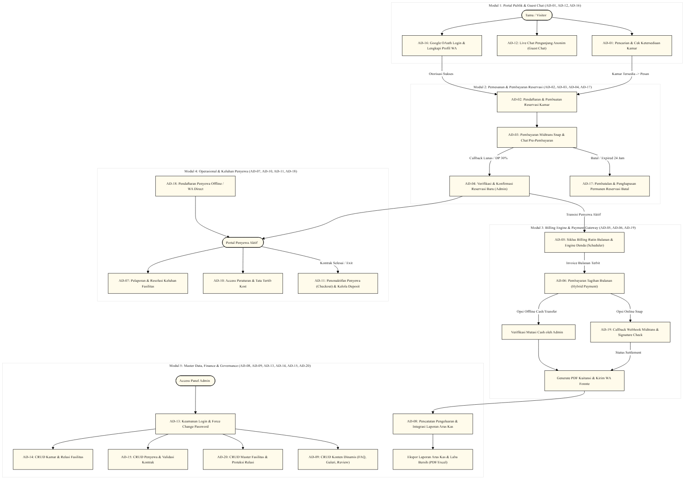

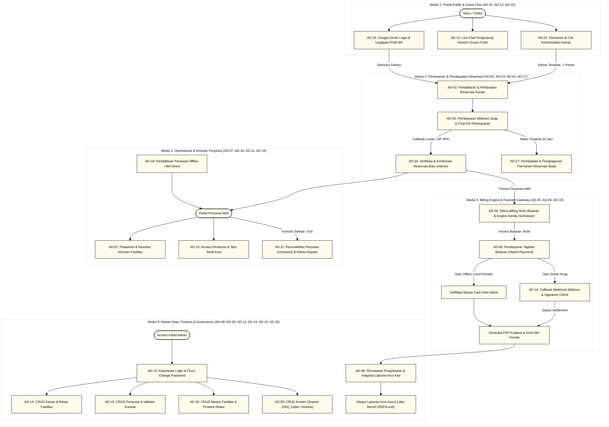
```mermaid
%%{init: {
  'theme': 'base',
  'themeVariables': {
    'primaryColor': '#FFFBEB',
    'primaryTextColor': '#000000',
    'primaryBorderColor': '#000000',
    'lineColor': '#000000',
    'secondaryColor': '#FDE047',
    'tertiaryColor': '#FFFFFF',
    'edgeLabelBackground': '#FFFFFF',
    'fontSize': '12px',
    'fontFamily': 'Inter, system-ui, sans-serif'
  }
}}%%
flowchart TD
    subgraph Modul_Publik ["Modul 1: Portal Publik & Guest Chat (AD-01, AD-12, AD-16)"]
        GuestStart([Tamu / Visitor]) --> AD01["AD-01: Pencarian & Cek Ketersediaan Kamar"]
        GuestStart --> AD12["AD-12: Live Chat Pengunjung Anonim (Guest Chat)"]
        GuestStart --> AD16["AD-16: Google OAuth Login & Lengkapi Profil WA"]
    end

    subgraph Modul_Reservasi ["Modul 2: Pemesanan & Pembayaran Reservasi (AD-02, AD-03, AD-04, AD-17)"]
        AD01 -- "Kamar Tersedia -> Pesan" --> AD02["AD-02: Pendaftaran & Pembuatan Reservasi Kamar"]
        AD16 -- "Otorisasi Sukses" --> AD02
        AD02 --> AD03["AD-03: Pembayaran Midtrans Snap & Chat Pre-Pembayaran"]
        AD03 -- "Callback Lunas / DP 30%" --> AD04["AD-04: Verifikasi & Konfirmasi Reservasi Baru (Admin)"]
        AD03 -- "Batal / Expired 24 Jam" --> AD17["AD-17: Pembatalan & Penghapusan Permanen Reservasi Batal"]
    end

    subgraph Modul_Billing ["Modul 3: Billing Engine & Payment Gateway (AD-05, AD-06, AD-19)"]
        AD04 -- "Transisi Penyewa Aktif" --> AD05["AD-05: Siklus Billing Rutin Bulanan & Engine Denda (Scheduler)"]
        AD05 -- "Invoice Bulanan Terbit" --> AD06["AD-06: Pembayaran Tagihan Bulanan (Hybrid Payment)"]
        AD06 -- "Opsi Online Snap" --> AD19["AD-19: Callback Webhook Midtrans & Signature Check"]
        AD19 -- "Status Settlement" --> Receipts["Generate PDF Kuitansi & Kirim WA Fonnte"]
        AD06 -- "Opsi Offline Cash/Transfer" --> AdminCash["Verifikasi Mutasi Cash oleh Admin"] --> Receipts
    end

    subgraph Modul_Operasional ["Modul 4: Operasional & Keluhan Penyewa (AD-07, AD-10, AD-11, AD-18)"]
        AD04 --> ActiveTenant([Portal Penyewa Aktif])
        AD18["AD-18: Pendaftaran Penyewa Offline / WA Direct"] --> ActiveTenant
        ActiveTenant --> AD07["AD-07: Pelaporan & Resolusi Keluhan Fasilitas"]
        ActiveTenant --> AD10["AD-10: Access Peraturan & Tata Tertib Kost"]
        ActiveTenant -- "Kontrak Selesai / Exit" --> AD11["AD-11: Penonaktifan Penyewa (Checkout) & Kelola Deposit"]
    end

    subgraph Modul_Admin ["Modul 5: Master Data, Finance & Governance (AD-08, AD-09, AD-13, AD-14, AD-15, AD-20)"]
        AdminLogin(["Access Panel Admin"]) --> AD13["AD-13: Keamanan Login & Force Change Password"]
        AD13 --> AD14["AD-14: CRUD Kamar & Relasi Fasilitas"]
        AD13 --> AD15["AD-15: CRUD Penyewa & Validasi Kontrak"]
        AD13 --> AD20["AD-20: CRUD Master Fasilitas & Proteksi Relasi"]
        AD13 --> AD09["AD-09: CRUD Konten Dinamis (FAQ, Galeri, Review)"]
        
        Receipts --> AD08["AD-08: Pencatatan Pengeluaran & Integrasi Laporan Arus Kas"]
        AD08 --> FinancialReport["Ekspor Laporan Arus Kas & Laba Bersih (PDF/Excel)"]
    end
```

---

### 1.2. Peta Hubungan Antar Aktivitas Komprehensif (End-to-End Lifecycle Process Map)

Diagram alur fase perjalanan hidup sistem (*System Lifecycle Flow*) berikut merangkum transisi status entitas utama dari fase eksplorasi publik, reservasi & pembayaran, masa sewa aktif operasional, hingga proses terminasi/checkout dan konsolidasi pembukuan kas:

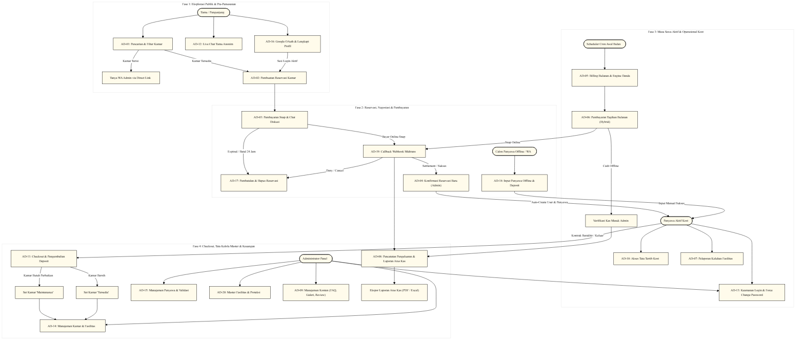

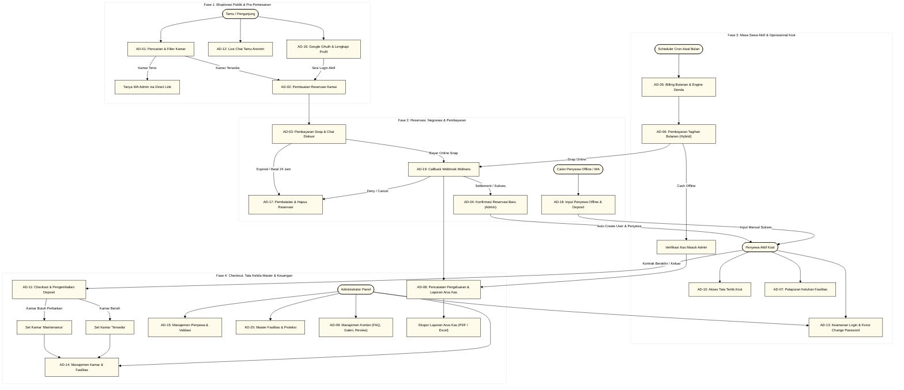
```mermaid
%%{init: {
  'theme': 'base',
  'themeVariables': {
    'primaryColor': '#FFFBEB',
    'primaryTextColor': '#000000',
    'primaryBorderColor': '#000000',
    'lineColor': '#000000',
    'secondaryColor': '#FDE047',
    'tertiaryColor': '#FFFFFF',
    'edgeLabelBackground': '#FFFFFF',
    'fontSize': '12px',
    'fontFamily': 'Inter, system-ui, sans-serif'
  }
}}%%
flowchart TD
    %% Fase 1: Eksplorasi Publik
    subgraph Fase1 ["Fase 1: Eksplorasi Publik & Pra-Pemesanan"]
        Guest([Tamu / Pengunjung]) --> AD01["AD-01: Pencarian & Filter Kamar"]
        Guest --> AD12["AD-12: Live Chat Tamu Anonim"]
        Guest --> AD16["AD-16: Google OAuth & Lengkapi Profil"]
        
        AD01 -- "Kamar Terisi" --> WA_Direct["Tanya WA Admin via Direct Link"]
        AD01 -- "Kamar Tersedia" --> AD02["AD-02: Pembuatan Reservasi Kamar"]
        AD16 -- "Sesi Login Aktif" --> AD02
    end

    %% Fase 2: Reservasi & Transaksi
    subgraph Fase2 ["Fase 2: Reservasi, Negosiasi & Pembayaran"]
        AD02 --> AD03["AD-03: Pembayaran Snap & Chat Diskusi"]
        
        AD03 -- "Expired / Batal 24 Jam" --> AD17["AD-17: Pembatalan & Hapus Reservasi"]
        AD03 -- "Bayar Online Snap" --> AD19["AD-19: Callback Webhook Midtrans"]
        
        AD19 -- "Settlement / Sukses" --> AD04["AD-04: Konfirmasi Reservasi Baru (Admin)"]
        AD19 -- "Deny / Cancel" --> AD17
        
        OfflineGuest([Calon Penyewa Offline / WA]) --> AD18["AD-18: Input Penyewa Offline & Deposit"]
    end

    %% Fase 3: Aktivasi & Operasional Berjalan
    subgraph Fase3 ["Fase 3: Masa Sewa Aktif & Operasional Kost"]
        AD04 -- "Auto-Create User & Penyewa" --> ActiveTenant([Penyewa Aktif Kost])
        AD18 -- "Input Manual Sukses" --> ActiveTenant
        
        ActiveTenant --> AD13["AD-13: Keamanan Login & Force Change Password"]
        ActiveTenant --> AD10["AD-10: Akses Tata Tertib Kost"]
        ActiveTenant --> AD07["AD-07: Pelaporan Keluhan Fasilitas"]
        
        %% Siklus Bulanan
        SchedulerTrigger([Scheduler Cron Awal Bulan]) --> AD05["AD-05: Billing Bulanan & Engine Denda"]
        AD05 --> AD06["AD-06: Pembayaran Tagihan Bulanan (Hybrid)"]
        
        AD06 -- "Snap Online" --> AD19
        AD06 -- "Cash Offline" --> AdminCash["Verifikasi Kas Masuk Admin"]
    end

    %% Fase 4: Terminasi & Keuangan
    subgraph Fase4 ["Fase 4: Checkout, Tata Kelola Master & Keuangan"]
        ActiveTenant -- "Kontrak Berakhir / Keluar" --> AD11["AD-11: Checkout & Pengembalian Deposit"]
        
        AD11 -- "Kamar Butuh Perbaikan" --> KamarMaint["Set Kamar 'Maintenance'"]
        AD11 -- "Kamar Bersih" --> KamarAvail["Set Kamar 'Tersedia'"]
        
        KamarMaint --> AD14["AD-14: Manajemen Kamar & Fasilitas"]
        KamarAvail --> AD14
        
        %% Konsolidasi Kas Masuk
        AD19 --> AD08["AD-08: Pencatatan Pengeluaran & Laporan Arus Kas"]
        AdminCash --> AD08
        
        %% Tata Kelola Admin
        AdminUser([Administrator Panel]) --> AD13
        AdminUser --> AD14
        AdminUser --> AD15["AD-15: Manajemen Penyewa & Validasi"]
        AdminUser --> AD20["AD-20: Master Fasilitas & Proteksi"]
        AdminUser --> AD09["AD-09: Manajemen Konten (FAQ, Galeri, Review)"]
        
        AD08 --> ExportFinance["Ekspor Laporan Arus Kas (PDF / Excel)"]
    end
```

---

### 1.3. Peta Pohon Keputusan & Percabangan Kritis Bisnis (Master Decision Tree & Guardrails)

Diagram pohon keputusan di bawah ini memetakan seluruh titik evaluasi (*Decision Nodes*), kondisi penjaga (*Guard Conditions*), dan penanganan alternatif di seluruh sistem:

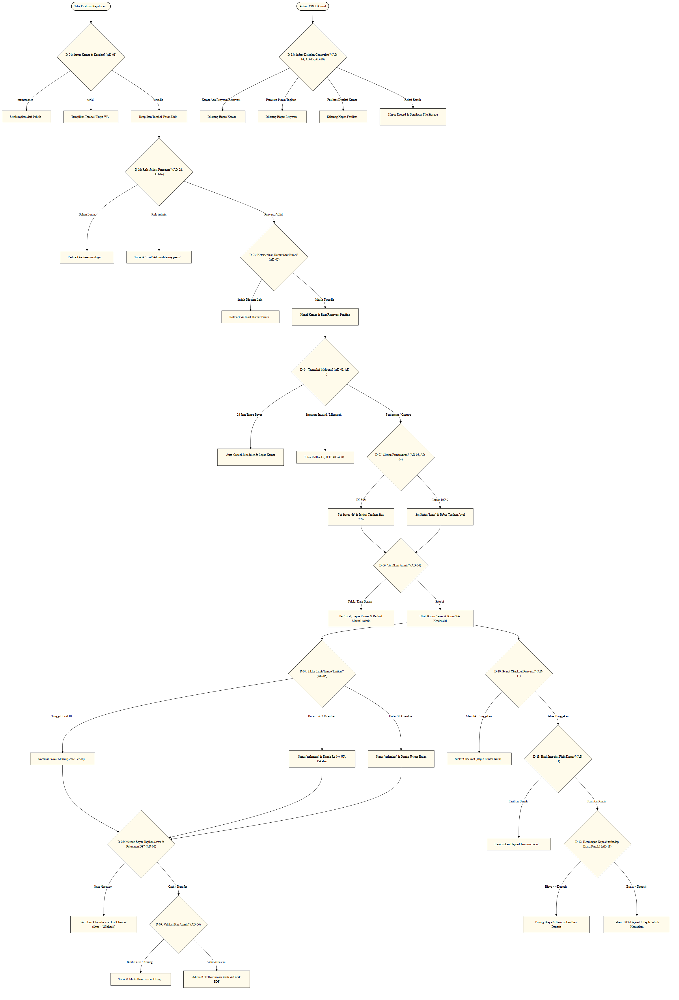

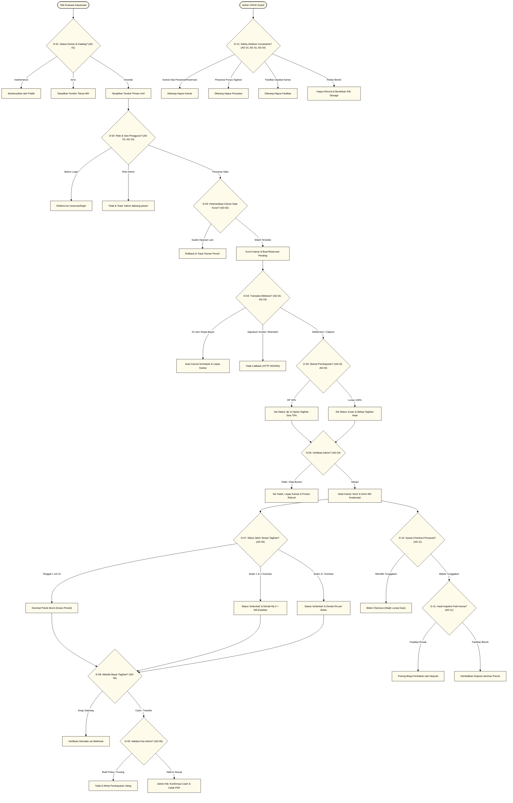
```mermaid
%%{init: {
  'theme': 'base',
  'themeVariables': {
    'primaryColor': '#FFFBEB',
    'primaryTextColor': '#000000',
    'primaryBorderColor': '#000000',
    'lineColor': '#000000',
    'secondaryColor': '#FDE047',
    'tertiaryColor': '#FFFFFF',
    'edgeLabelBackground': '#FFFFFF',
    'fontSize': '12px',
    'fontFamily': 'Inter, system-ui, sans-serif'
  }
}}%%
flowchart TD
    StartCheck([Titik Evaluasi Keputusan]) --> DecPublik{"D-01: Status Kamar di Katalog? (AD-01)"}
    
    %% Decision 1
    DecPublik -- "maintenance" --> HideRoom["Sembunyikan dari Publik"]
    DecPublik -- "terisi" --> DirectWA["Tampilkan Tombol 'Tanya WA'"]
    DecPublik -- "tersedia" --> AllowOrder["Tampilkan Tombol 'Pesan Unit'"]
    
    %% Decision 2
    AllowOrder --> DecAuth{"D-02: Role & Sesi Pengguna? (AD-02, AD-16)"}
    DecAuth -- "Belum Login" --> RedirLogin["Redirect ke /reservasi/login"]
    DecAuth -- "Role Admin" --> BlockAdmin["Tolak & Toast 'Admin dilarang pesan'"]
    DecAuth -- "Penyewa Valid" --> DecPessimistic{"D-03: Ketersediaan Kamar Saat Kunci? (AD-02)"}
    
    %% Decision 3
    DecPessimistic -- "Sudah Dipesan Lain" --> ToastPenuh["Rollback & Toast 'Kamar Penuh'"]
    DecPessimistic -- "Masih Tersedia" --> LockRoom["Kunci Kamar & Buat Reservasi Pending"]
    
    %% Decision 4
    LockRoom --> DecPayment{"D-04: Transaksi Midtrans? (AD-03, AD-19)"}
    DecPayment -- "24 Jam Tanpa Bayar" --> AutoCancel["Auto-Cancel Scheduler & Lepas Kamar"]
    DecPayment -- "Signature Invalid / Mismatch" --> RejectWebhook["Tolak Callback (HTTP 403/400)"]
    DecPayment -- "Settlement / Capture" --> DecSkema{"D-05: Skema Pembayaran? (AD-03, AD-04)"}
    
    %% Decision 5
    DecSkema -- "DP 30%" --> SetDP["Set Status 'dp' & Injeksi Tagihan Sisa 70%"]
    DecSkema -- "Lunas 100%" --> SetLunas["Set Status 'lunas' & Bebas Tagihan Awal"]
    
    %% Decision 6
    SetDP --> DecKonfirmasi{"D-06: Verifikasi Admin? (AD-04)"}
    SetLunas --> DecKonfirmasi
    DecKonfirmasi -- "Tolak / Data Buram" --> RefundReserv["Set 'batal', Lepas Kamar & Proses Refund"]
    DecKonfirmasi -- "Setujui" --> ActivateTenant["Ubah Kamar 'terisi' & Kirim WA Kredensial"]
    
    %% Decision 7
    ActivateTenant --> DecBilling{"D-07: Siklus Jatuh Tempo Tagihan? (AD-05)"}
    DecBilling -- "Tanggal 1 s/d 10" --> TagihanNormal["Nominal Pokok Murni (Grace Period)"]
    DecBilling -- "Bulan 1 & 2 Overdue" --> ReminderOnly["Status 'terlambat' & Denda Rp 0 + WA Eskalasi"]
    DecBilling -- "Bulan 3+ Overdue" --> DendaApplied["Status 'terlambat' & Denda 5% per Bulan"]
    
    %% Decision 8
    TagihanNormal --> DecPayType{"D-08: Metode Bayar Tagihan? (AD-06)"}
    ReminderOnly --> DecPayType
    DendaApplied --> DecPayType
    DecPayType -- "Snap Gateway" --> AutoVerify["Verifikasi Otomatis via Webhook"]
    DecPayType -- "Cash / Transfer" --> DecAdminCash{"D-09: Validasi Kas Admin? (AD-06)"}
    DecAdminCash -- "Bukti Palsu / Kurang" --> TolakCash["Tolak & Minta Pembayaran Ulang"]
    DecAdminCash -- "Valid & Sesuai" --> KonfirmasiCash["Admin Klik 'Konfirmasi Cash' & Cetak PDF"]
    
    %% Decision 9
    ActivateTenant --> DecCheckout{"D-10: Syarat Checkout Penyewa? (AD-11)"}
    DecCheckout -- "Memiliki Tunggakan" --> BlockExit["Blokir Checkout (Wajib Lunasi Dulu)"]
    DecCheckout -- "Bebas Tunggakan" --> DecInspeksi{"D-11: Hasil Inspeksi Fisik Kamar? (AD-11)"}
    DecInspeksi -- "Fasilitas Rusak" --> PotongDepo["Potong Biaya Perbaikan dari Deposit"]
    DecInspeksi -- "Fasilitas Bersih" --> FullDepo["Kembalikan Deposit Jaminan Penuh"]
    
    %% Decision 10
    AdminPanel([Admin CRUD Guard]) --> DecDelete{"D-12: Safety Deletion Constraints? (AD-14, AD-15, AD-20)"}
    DecDelete -- "Kamar Ada Penyewa/Reservasi" --> BlockDelKamar["Dilarang Hapus Kamar"]
    DecDelete -- "Penyewa Punya Tagihan" --> BlockDelPenyewa["Dilarang Hapus Penyewa"]
    DecDelete -- "Fasilitas Dipakai Kamar" --> BlockDelFasilitas["Dilarang Hapus Fasilitas"]
    DecDelete -- "Relasi Bersih" --> AllowDelete["Hapus Record & Bersihkan File Storage"]
```

---

### 1.4. Master Cross-Functional Swimlane Orchestration (Lintas Peran & Sistem)

Diagram orkestrasi lintas swimlane berikut memvisualisasikan interaksi nyata antara seluruh Aktor Manusia, Gateway Eksternal, Engine Backend, dan Tabel Basis Data MySQL:

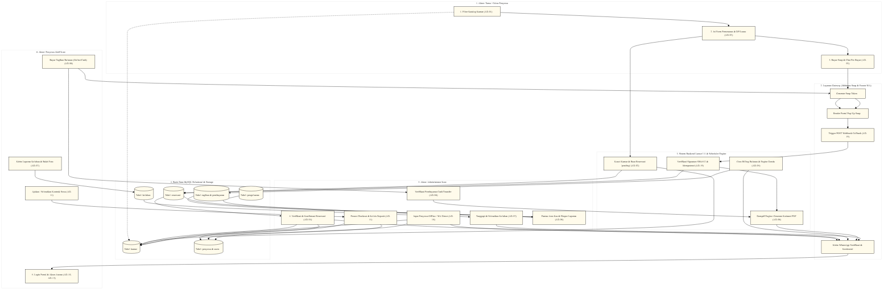

```mermaid
%%{init: {
  'theme': 'base',
  'themeVariables': {
    'primaryColor': '#FFFBEB',
    'primaryTextColor': '#000000',
    'primaryBorderColor': '#000000',
    'lineColor': '#000000',
    'secondaryColor': '#FDE047',
    'tertiaryColor': '#FFFFFF',
    'edgeLabelBackground': '#FFFFFF',
    'fontSize': '12px',
    'fontFamily': 'Inter, system-ui, sans-serif'
  }
}}%%
flowchart TD
    subgraph Lane_Guest ["1. Aktor: Tamu / Calon Penyewa"]
        U_Search["1. Filter Katalog Kamar (AD-01)"] --> U_Book["2. Isi Form Pemesanan & DP/Lunas (AD-02)"]
        U_Book --> U_Pay["3. Bayar Snap & Chat Pre-Bayar (AD-03)"]
    end

    subgraph Lane_Gateway ["2. Layanan Gateway (Midtrans Snap & Fonnte WA)"]
        G_SnapToken["Generate Snap Token"] --> G_SnapModal["Render Portal Pop-Up Snap"]
        G_SnapModal --> G_Webhook["Trigger POST Webhook Callback (AD-19)"]
        G_SendWA["Kirim WhatsApp Notifikasi & Kredensial"]
    end

    subgraph Lane_System ["3. Sistem Backend Laravel 11 & Scheduler Engine"]
        S_LockRoom["Kunci Kamar & Buat Reservasi 'pending' (AD-02)"]
        S_VerifyWebhook["Verifikasi Signature SHA512 & Idempotensi (AD-19)"]
        S_AutoBilling["Cron Billing Bulanan & Engine Denda (AD-05)"]
        S_PdfEngine["Dompdf Engine: Generate Kuitansi PDF (AD-06)"]
    end

    subgraph Lane_Database ["4. Basis Data MySQL Relasional & Storage"]
        DB_Kamar[("Tabel: kamar")]
        DB_Reservasi[("Tabel: reservasi")]
        DB_Penyewa[("Tabel: penyewa & users")]
        DB_Tagihan[("Tabel: tagihan & pembayaran")]
        DB_Keluhan[("Tabel: keluhan")]
        DB_Pengeluaran[("Tabel: pengeluaran")]
    end

    subgraph Lane_Admin ["5. Aktor: Administrator Kost"]
        A_Confirm["4. Verifikasi & Konfirmasi Reservasi (AD-04)"]
        A_Offline["Input Penyewa Offline / WA Direct (AD-18)"]
        A_Resolve["Tanggapi & Selesaikan Keluhan (AD-07)"]
        A_VerifyCash["Verifikasi Pembayaran Cash/Transfer (AD-06)"]
        A_Checkout["Proses Checkout & Kelola Deposit (AD-11)"]
        A_Reports["Pantau Arus Kas & Ekspor Laporan (AD-08)"]
    end

    subgraph Lane_Tenant ["6. Aktor: Penyewa Aktif Kost"]
        T_Login["5. Login Portal & Akses Aturan (AD-10, AD-13)"]
        T_Lapor["Kirim Laporan Keluhan & Bukti Foto (AD-07)"]
        T_PayBill["Bayar Tagihan Bulanan (Online/Cash) (AD-06)"]
        T_Exit["Ajukan / Selesaikan Kontrak Sewa (AD-11)"]
    end

    %% Relasi Alur Lintas Swimlane
    U_Search -.-> DB_Kamar
    U_Book --> S_LockRoom
    S_LockRoom --> DB_Reservasi
    S_LockRoom --> DB_Kamar
    
    U_Pay --> G_SnapToken
    G_SnapToken --> G_SnapModal
    G_Webhook --> S_VerifyWebhook
    S_VerifyWebhook --> DB_Reservasi
    
    DB_Reservasi --> A_Confirm
    A_Confirm --> DB_Penyewa
    A_Confirm --> DB_Kamar
    A_Confirm --> G_SendWA
    
    A_Offline --> DB_Penyewa
    A_Offline --> DB_Kamar
    A_Offline --> G_SendWA
    
    G_SendWA --> T_Login
    
    %% Alur Operasional
    S_AutoBilling --> DB_Tagihan
    S_AutoBilling --> G_SendWA
    
    T_PayBill --> G_SnapToken
    T_PayBill --> A_VerifyCash
    A_VerifyCash --> S_PdfEngine
    S_VerifyWebhook --> S_PdfEngine
    S_PdfEngine --> G_SendWA
    
    T_Lapor --> DB_Keluhan
    DB_Keluhan --> A_Resolve
    A_Resolve --> G_SendWA
    
    T_Exit --> A_Checkout
    A_Checkout --> DB_Penyewa
    A_Checkout --> DB_Kamar
    
    DB_Tagihan --> A_Reports
    DB_Pengeluaran --> A_Reports
    DB_Reservasi --> A_Reports
```

---

## 2. Visualisasi & Alur Detail Activity Diagram (UML Swimlane Format)

### 2.1. Activity Diagram 1: Pencarian & Cek Ketersediaan Kamar (Guest / Calon Penyewa)
Diagram ini menjelaskan bagaimana pengunjung (Guest) mencari unit kamar kost putri berdasarkan filter tertentu, penanganan kasus ketiadaan kamar (*Empty State*), serta perbedaan tombol aksi berdasarkan status kamar (tersedia vs terisi).

* **Controller Terkait**: [LandingController](file:///c:/xampp/htdocs/asri-boarding-house/app/Http/Controllers/Public/LandingController.php) (method: `kamarList`, `showKamar`, `hitungHarga`)
* **Model Terkait**: [Kamar](file:///c:/xampp/htdocs/asri-boarding-house/app/Models/Kamar.php)
* **View Terkait**: [landing/kamar-list.blade.php](file:///c:/xampp/htdocs/asri-boarding-house/resources/views/landing/kamar-list.blade.php), [landing/show.blade.php](file:///c:/xampp/htdocs/asri-boarding-house/resources/views/landing/show.blade.php) (JS Function: [hitungEstimasi()](file:///c:/xampp/htdocs/asri-boarding-house/resources/views/landing/show.blade.php#L399))
* **Pengujian Otomatis**: [KamarListRenderingTest](file:///c:/xampp/htdocs/asri-boarding-house/tests/Feature/KamarListRenderingTest.php)

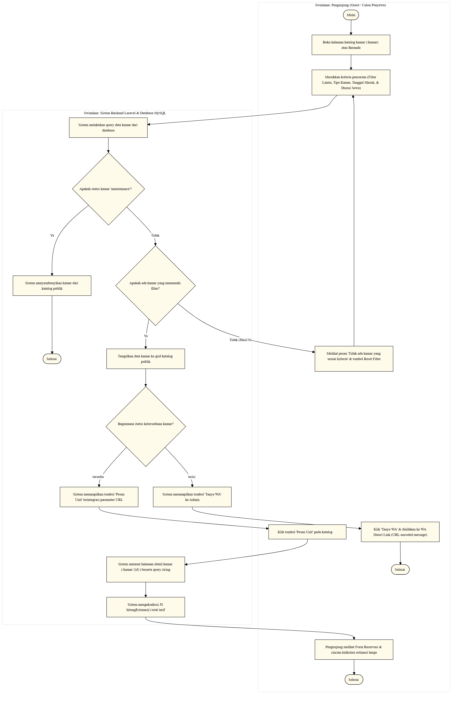

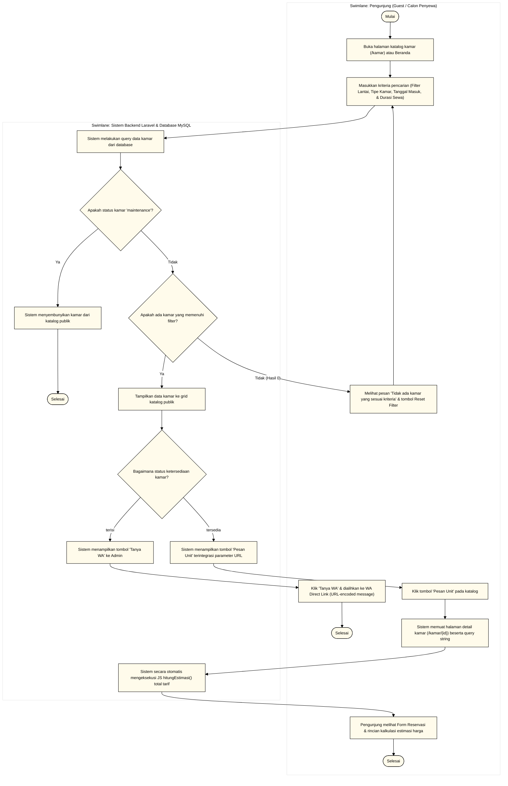
```mermaid
%%{init: {
  'theme': 'base',
  'themeVariables': {
    'primaryColor': '#FFFBEB',
    'primaryTextColor': '#000000',
    'primaryBorderColor': '#000000',
    'lineColor': '#000000',
    'secondaryColor': '#FDE047',
    'tertiaryColor': '#FFFFFF',
    'edgeLabelBackground': '#FFFFFF',
    'fontSize': '12px',
    'fontFamily': 'Inter, system-ui, sans-serif'
  }
}}%%
flowchart TD
    subgraph Swimlane_Pengunjung ["Swimlane: Pengunjung (Guest / Calon Penyewa)"]
        Start([Mulai]) --> BukaKatalog["Buka halaman katalog kamar (/kamar) atau Beranda"]
        BukaKatalog --> InputFilter["Masukkan kriteria pencarian (Filter Lantai, Tipe Kamar, Tanggal Masuk, & Durasi Sewa)"]
        TampilEmptyState["Melihat pesan 'Tidak ada kamar yang sesuai kriteria' & tombol Reset Filter"] --> InputFilter
        TanyaWA["Klik 'Tanya WA' & dialihkan ke WA Direct Link (URL-encoded message)"] --> SelesaiWA([Selesai])
        KlikPesan["Klik tombol 'Pesan Unit' pada katalog"] --> DetailKamar["Sistem memuat halaman detail kamar (/kamar/{id}) beserta query string"]
        TampilForm["Pengunjung melihat Form Reservasi & rincian kalkulasi estimasi harga"] --> SelesaiForm([Selesai])
    end

    subgraph Swimlane_System ["Swimlane: Sistem Backend Laravel & Database MySQL"]
        InputFilter --> QueryKamar["Sistem melakukan query data kamar dari database"]
        QueryKamar --> CekMaintenance{"Apakah status kamar 'maintenance'?"}
        
        CekMaintenance -- Ya --> SembunyikanKamar["Sistem menyembunyikan kamar dari katalog publik"]
        SembunyikanKamar --> SelesaiMaint([Selesai])
        
        CekMaintenance -- Tidak --> CekAdaKamar{"Apakah ada kamar yang memenuhi filter?"}
        CekAdaKamar -- Tidak (Hasil 0) --> TampilEmptyState
        
        CekAdaKamar -- Ya --> TampilkanKamar["Tampilkan data kamar ke grid katalog publik"]
        TampilkanKamar --> CekStatus{"Bagaimana status ketersediaan kamar?"}
        
        CekStatus -- "terisi" --> TombolWA["Sistem menampilkan tombol 'Tanya WA' ke Admin"]
        TombolWA --> TanyaWA
        
        CekStatus -- "tersedia" --> TombolPesan["Sistem menampilkan tombol 'Pesan Unit' terintegrasi parameter URL"]
        TombolPesan --> KlikPesan
        
        DetailKamar --> KalkulasiOtomatis["Sistem secara otomatis mengeksekusi JS hitungEstimasi() total tarif"]
        KalkulasiOtomatis --> TampilForm
    end
```

---

### 2.2. Activity Diagram 2: Pendaftaran & Pembuatan Reservasi Kamar (Calon Penyewa)
Diagram ini memetakan alur ketika Calon Penyewa mengirimkan reservasi kamar kost putri melalui sistem hingga kamar terkunci sementara menggunakan *Pessimistic Locking*, termasuk proteksi akun bertipe Admin.

* **Controller Terkait**: [ReservasiAuthController](file:///c:/xampp/htdocs/asri-boarding-house/app/Http/Controllers/Auth/ReservasiAuthController.php) (method: `register`), [ReservasiController](file:///c:/xampp/htdocs/asri-boarding-house/app/Http/Controllers/Penyewa/ReservasiController.php) (method: `store`)
* **Model Terkait**: [Reservasi](file:///c:/xampp/htdocs/asri-boarding-house/app/Models/Reservasi.php), [Kamar](file:///c:/xampp/htdocs/asri-boarding-house/app/Models/Kamar.php), [User](file:///c:/xampp/htdocs/asri-boarding-house/app/Models/User.php)
* **View Terkait**: [auth/reservasi-login.blade.php](file:///c:/xampp/htdocs/asri-boarding-house/resources/views/auth/reservasi-login.blade.php), [auth/reservasi-register.blade.php](file:///c:/xampp/htdocs/asri-boarding-house/resources/views/auth/reservasi-register.blade.php), [reservasi/show.blade.php](file:///c:/xampp/htdocs/asri-boarding-house/resources/views/reservasi/show.blade.php)
* **Pengujian Otomatis**: [ReservasiControllerTest](file:///c:/xampp/htdocs/asri-boarding-house/tests/Feature/ReservasiControllerTest.php)

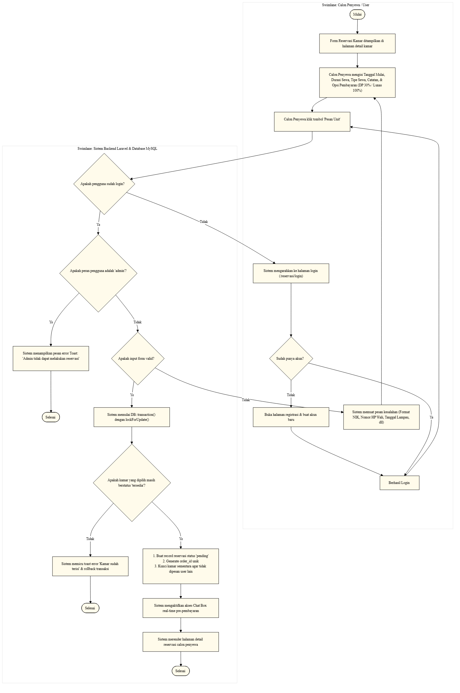

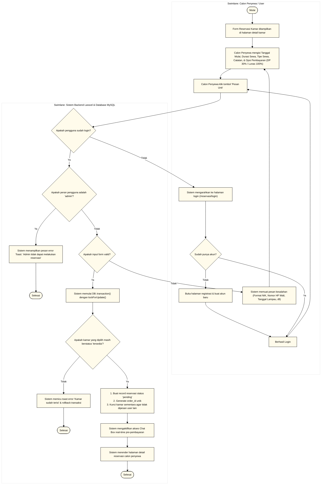
```mermaid
%%{init: {
  'theme': 'base',
  'themeVariables': {
    'primaryColor': '#FFFBEB',
    'primaryTextColor': '#000000',
    'primaryBorderColor': '#000000',
    'lineColor': '#000000',
    'secondaryColor': '#FDE047',
    'tertiaryColor': '#FFFFFF',
    'edgeLabelBackground': '#FFFFFF',
    'fontSize': '12px',
    'fontFamily': 'Inter, system-ui, sans-serif'
  }
}}%%
flowchart TD
    subgraph Swimlane_User ["Swimlane: Calon Penyewa / User"]
        Start([Mulai]) --> TampilForm["Form Reservasi Kamar ditampilkan di halaman detail kamar"]
        TampilForm --> IsiForm["Calon Penyewa mengisi Tanggal Mulai, Durasi Sewa, Tipe Sewa, Catatan, & Opsi Pembayaran (DP 30% / Lunas 100%)"]
        IsiForm --> KlikPesan["Calon Penyewa klik tombol 'Pesan Unit'"]
        
        RedirectLogin["Sistem mengarahkan ke halaman login (/reservasi/login)"] --> RegisterOpsi{"Sudah punya akun?"}
        RegisterOpsi -- Tidak --> BukaRegister["Buka halaman registrasi & buat akun baru"]
        BukaRegister --> LoginSukses["Berhasil Login"]
        RegisterOpsi -- Ya --> LoginSukses
        LoginSukses --> KlikPesan
        
        TampilError["Sistem memuat pesan kesalahan (Format NIK, Nomor HP Wali, Tanggal Lampau, dll)"] --> IsiForm
    end

    subgraph Swimlane_System ["Swimlane: Sistem Backend Laravel & Database MySQL"]
        KlikPesan --> CekLogin{"Apakah pengguna sudah login?"}
        CekLogin -- Tidak --> RedirectLogin
        
        CekLogin -- Ya --> CekRoleAdmin{"Apakah peran pengguna adalah 'admin'?"}
        CekRoleAdmin -- Ya --> BlockAdmin["Sistem menampilkan pesan error Toast: 'Admin tidak dapat melakukan reservasi'"]
        BlockAdmin --> SelesaiAdmin([Selesai])
        
        CekRoleAdmin -- Tidak --> ValidasiInput{"Apakah input form valid?"}
        ValidasiInput -- Tidak --> TampilError
        
        ValidasiInput -- Ya --> DbTransactionStart["Sistem memulai DB::transaction() dengan lockForUpdate()"]
        DbTransactionStart --> CekKetersediaan{"Apakah kamar yang dipilih masih berstatus 'tersedia'?"}
        CekKetersediaan -- Tidak --> KamarPenuh["Sistem memicu toast error 'Kamar sudah terisi' & rollback transaksi"]
        KamarPenuh --> SelesaiPenuh([Selesai])
        
        CekKetersediaan -- Ya --> DbTransaction["1. Buat record reservasi status 'pending'<br>2. Generate order_id unik<br>3. Kunci kamar sementara agar tidak dipesan user lain"]
        DbTransaction --> BukaAksesChat["Sistem mengaktifkan akses Chat Box real-time pre-pembayaran"]
        BukaAksesChat --> TampilDetail["Sistem merender halaman detail reservasi calon penyewa"]
        TampilDetail --> SelesaiSukses([Selesai])
    end
```

---

### 2.3. Activity Diagram 3: Pembayaran Reservasi & Diskusi Chat Pre-Pembayaran (Calon Penyewa)
Diagram ini menunjukkan alur paralel (*Fork & Join*) antara fitur diskusi real-time (chat box AJAX Polling), penutupan portal Midtrans Snap, timer kedaluwarsa 24 jam, dan pembayaran reservasi via Midtrans Snap.

* **Controller Terkait**: [ReservasiController](file:///c:/xampp/htdocs/asri-boarding-house/app/Http/Controllers/Penyewa/ReservasiController.php) (method: `show`, `pay`), [ChatController](file:///c:/xampp/htdocs/asri-boarding-house/app/Http/Controllers/Api/ChatController.php) (method: `fetchMessages`, `sendMessage`), [MidtransReservasiCallbackController](file:///c:/xampp/htdocs/asri-boarding-house/app/Http/Controllers/Api/MidtransReservasiCallbackController.php)
* **Model Terkait**: [ChatMessage](file:///c:/xampp/htdocs/asri-boarding-house/app/Models/ChatMessage.php), [Reservasi](file:///c:/xampp/htdocs/asri-boarding-house/app/Models/Reservasi.php), [Pembayaran](file:///c:/xampp/htdocs/asri-boarding-house/app/Models/Pembayaran.php)
* **View Terkait**: [reservasi/show.blade.php](file:///c:/xampp/htdocs/asri-boarding-house/resources/views/reservasi/show.blade.php), [reservasi/chat-box.blade.php](file:///c:/xampp/htdocs/asri-boarding-house/resources/views/reservasi/chat-box.blade.php)
* **Pengujian Otomatis**: [ReservasiControllerTest](file:///c:/xampp/htdocs/asri-boarding-house/tests/Feature/ReservasiControllerTest.php)

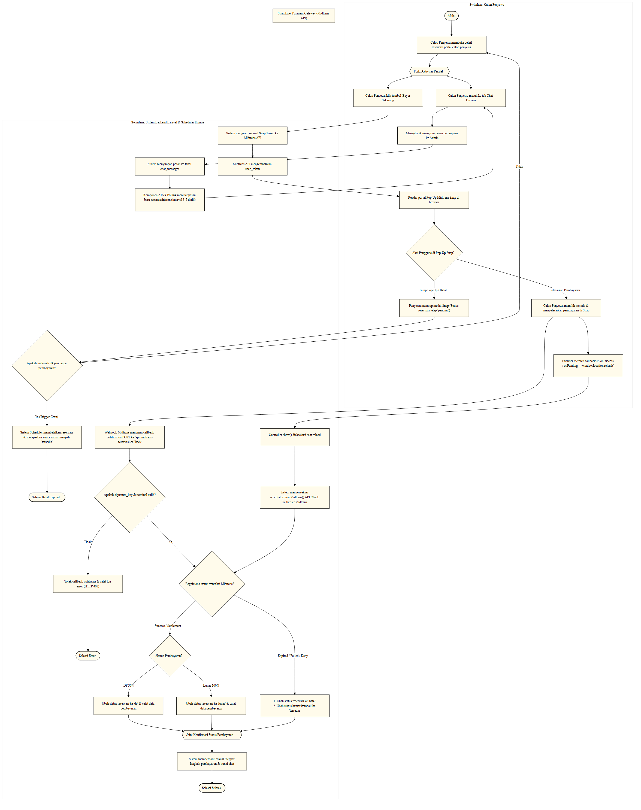

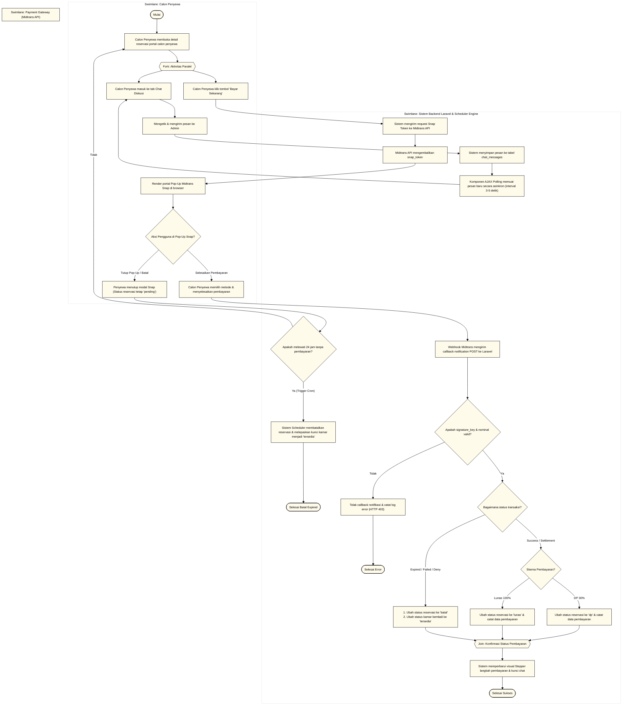
```mermaid
%%{init: {
  'theme': 'base',
  'themeVariables': {
    'primaryColor': '#FFFBEB',
    'primaryTextColor': '#000000',
    'primaryBorderColor': '#000000',
    'lineColor': '#000000',
    'secondaryColor': '#FDE047',
    'tertiaryColor': '#FFFFFF',
    'edgeLabelBackground': '#FFFFFF',
    'fontSize': '12px',
    'fontFamily': 'Inter, system-ui, sans-serif'
  }
}}%%
flowchart TD
    subgraph Swimlane_Penyewa ["Swimlane: Calon Penyewa"]
        Start([Mulai]) --> HalamanReservasi["Calon Penyewa membuka detail reservasi portal calon penyewa"]
        
        %% Fork Paralel
        HalamanReservasi --> ForkParalel{{"Fork: Aktivitas Paralel"}}
        
        %% Jalur 1: Diskusi Chat
        ForkParalel --> ChatBox["Calon Penyewa masuk ke tab Chat Diskusi"]
        ChatBox --> KirimPesan["Mengetik & mengirim pesan ke Admin"]
        
        %% Jalur 2: Pembayaran
        ForkParalel --> KlikBayar["Calon Penyewa klik tombol 'Bayar Sekarang'"]
        RenderPopUp["Render portal Pop-Up Midtrans Snap di browser"] --> UserAksiSnap{"Aksi Pengguna di Pop-Up Snap?"}
        
        UserAksiSnap -- "Tutup Pop-Up / Batal" --> CloseSnap["Penyewa menutup modal Snap (Status reservasi tetap 'pending')"]
        UserAksiSnap -- "Selesaikan Pembayaran" --> SelesaikanBayar["Calon Penyewa memilih metode & menyelesaikan pembayaran"]
    end

    subgraph Swimlane_Backend ["Swimlane: Sistem Backend Laravel & Scheduler Engine"]
        KirimPesan --> SimpanChat["Sistem menyimpan pesan ke tabel chat_messages"]
        SimpanChat --> PollingChat["Komponen AJAX Polling memuat pesan baru secara asinkron (interval 3-5 detik)"]
        PollingChat --> ChatBox
        
        KlikBayar --> ReqSnap["Sistem mengirim request Snap Token ke Midtrans API"]
        ReqSnap --> ReturnSnap["Midtrans API mengembalikan snap_token"]
        ReturnSnap --> RenderPopUp
        
        CloseSnap --> CekTimer24Jam{"Apakah melewati 24 jam tanpa pembayaran?"}
        CekTimer24Jam -- Ya (Trigger Cron) --> AutoCancelCron["Sistem Scheduler membatalkan reservasi & melepaskan kunci kamar menjadi 'tersedia'"]
        AutoCancelCron --> SelesaiBatalCron([Selesai Batal Expired])
        CekTimer24Jam -- Tidak --> HalamanReservasi
        
        WebhookMidtrans["Webhook Midtrans mengirim callback notification POST ke Laravel"] --> VerifikasiSignature{"Apakah signature_key & nominal valid?"}
        
        VerifikasiSignature -- Tidak --> RejectCallback["Tolak callback notifikasi & catat log error (HTTP 403)"]
        RejectCallback --> SelesaiErr([Selesai Error])
        
        VerifikasiSignature -- Ya --> EvaluasiTransaksi{"Bagaimana status transaksi?"}
        
        EvaluasiTransaksi -- "Success / Settlement" --> CekSkema{"Skema Pembayaran?"}
        CekSkema -- "DP 30%" --> SetDP["Ubah status reservasi ke 'dp' & catat data pembayaran"]
        CekSkema -- "Lunas 100%" --> SetLunas["Ubah status reservasi ke 'lunas' & catat data pembayaran"]
        
        EvaluasiTransaksi -- "Expired / Failed / Deny" --> SetBatal["1. Ubah status reservasi ke 'batal'<br>2. Ubah status kamar kembali ke 'tersedia'"]
        
        SetDP --> JoinParalel{{"Join: Konfirmasi Status Pembayaran"}}
        SetLunas --> JoinParalel
        SetBatal --> JoinParalel
        
        JoinParalel --> TampilStepper["Sistem memperbarui visual Stepper langkah pembayaran & kunci chat"]
        TampilStepper --> SelesaiOk([Selesai Sukses])
    end

    subgraph Swimlane_Midtrans ["Swimlane: Payment Gateway (Midtrans API)"]
        SelesaikanBayar --> WebhookMidtrans
    end
```

---

### 2.4. Activity Diagram 4: Verifikasi & Konfirmasi Reservasi Baru (Admin)
Diagram ini memetakan alur kerja administrator dalam memverifikasi kelayakan identitas calon penyewa, opsi persetujuan vs penolakan (*Refund*), hingga pembuatan akun otomatis dan notifikasi WhatsApp kredensial.

* **Controller Terkait**: [Admin\ReservasiController](file:///c:/xampp/htdocs/asri-boarding-house/app/Http/Controllers/Admin/ReservasiController.php) (method: `konfirmasi`, `show`)
* **Model Terkait**: [Reservasi](file:///c:/xampp/htdocs/asri-boarding-house/app/Models/Reservasi.php), [Penyewa](file:///c:/xampp/htdocs/asri-boarding-house/app/Models/Penyewa.php), [User](file:///c:/xampp/htdocs/asri-boarding-house/app/Models/User.php), [Tagihan](file:///c:/xampp/htdocs/asri-boarding-house/app/Models/Tagihan.php)
* **Service Terkait**: [TransisiPenyewaService](file:///c:/xampp/htdocs/asri-boarding-house/app/Services/TransisiPenyewaService.php), [FonnteService](file:///c:/xampp/htdocs/asri-boarding-house/app/Services/FonnteService.php)
* **View Terkait**: [admin/reservasi/show.blade.php](file:///c:/xampp/htdocs/asri-boarding-house/resources/views/admin/reservasi/show.blade.php)
* **Pengujian Otomatis**: [AdminReservasiWorkflowTest](file:///c:/xampp/htdocs/asri-boarding-house/tests/Feature/AdminReservasiWorkflowTest.php)

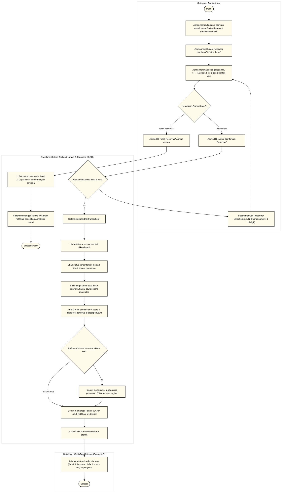
```mermaid
%%{init: {
  'theme': 'base',
  'themeVariables': {
    'primaryColor': '#FFFBEB',
    'primaryTextColor': '#000000',
    'primaryBorderColor': '#000000',
    'lineColor': '#000000',
    'secondaryColor': '#FDE047',
    'tertiaryColor': '#FFFFFF',
    'edgeLabelBackground': '#FFFFFF',
    'fontSize': '12px',
    'fontFamily': 'Inter, system-ui, sans-serif'
  }
}}%%
flowchart TD
    subgraph Swimlane_Admin ["Swimlane: Administrator"]
        Start([Mulai]) --> MasukReservasi["Admin membuka panel admin & masuk menu Daftar Reservasi (/admin/reservasi)"]
        MasukReservasi --> PilihReservasi["Admin memilih data reservasi berstatus 'dp' atau 'lunas'"]
        PilihReservasi --> TinjauData["Admin meninjau kelengkapan NIK KTP (16 digit), Foto Bukti & Kontak Wali"]
        TinjauData --> KeputusanAdmin{"Keputusan Administrator?"}
        
        KeputusanAdmin -- "Tolak Reservasi" --> KlikTolak["Admin klik 'Tolak Reservasi' & input alasan"]
        KeputusanAdmin -- "Konfirmasi" --> KlikKonfirmasi["Admin klik tombol 'Konfirmasi Reservasi'"]
        TampilToastError["Sistem memuat Toast error validation (e.g. NIK harus numerik & 16 digit)"] --> TinjauData
    end

    subgraph Swimlane_Backend ["Swimlane: Sistem Backend Laravel & Database MySQL"]
        KlikTolak --> TolakDb["1. Set status reservasi = 'batal'<br>2. Lepas kunci kamar menjadi 'tersedia'"]
        TolakDb --> KirimWATolak["Sistem memanggil Fonnte WA untuk notifikasi penolakan & instruksi refund"]
        KirimWATolak --> SelesaiTolak([Selesai Ditolak])
        
        KlikKonfirmasi --> ValidasiForm{"Apakah data wajib terisi & valid?"}
        ValidasiForm -- Tidak --> TampilToastError
        
        ValidasiForm -- Ya --> DbTx["Sistem memulai DB::transaction()"]
        DbTx --> UpdateStatusReserv["Ubah status reservasi menjadi 'dikonfirmasi'"]
        UpdateStatusReserv --> LockRoomTerisi["Ubah status kamar terkait menjadi 'terisi' secara permanen"]
        LockRoomTerisi --> CopyHargaSewa["Salin harga kamar saat ini ke penyewa.harga_sewa secara immutable"]
        CopyHargaSewa --> CreateUserPenyewa["Auto-Create akun di tabel users & data profil penyewa di tabel penyewa"]
        CreateUserPenyewa --> CekSkemaDp{"Apakah reservasi memakai skema DP?"}
        
        CekSkemaDp -- Ya --> InjectTagihanSisa["Sistem menginjeksi tagihan sisa pelunasan (70%) ke tabel tagihan"]
        CekSkemaDp -- Tidak / Lunas --> PanggilFonnte["Sistem memanggil Fonnte WA API untuk notifikasi kredensial"]
        InjectTagihanSisa --> PanggilFonnte
        
        PanggilFonnte --> CommitTx["Commit DB Transaction secara atomik"]
    end

    subgraph Swimlane_Fonnte ["Swimlane: WhatsApp Gateway (Fonnte API)"]
        CommitTx --> KirimKredensialWA["Kirim WhatsApp kredensial login (Email & Password default nomor HP) ke penyewa"]
        KirimKredensialWA --> Selesai([Selesai])
    end
```

---

### 2.5. Activity Diagram 5: Siklus Billing Rutin Bulanan Otomatis & Engine Denda (Sistem Scheduler)
Diagram ini menggambarkan jalannya sistem penagihan otomatis (*billing engine*) setiap awal bulan untuk penyewa bertipe bulanan dan pemrosesan denda keterlambatan harian pasca jatuh tempo oleh Laravel Scheduler.

* **Artisan Commands**: [GenerateBulananTagihan](file:///c:/xampp/htdocs/asri-boarding-house/app/Console/Commands/GenerateBulananTagihan.php), [ProsesKeterlambatanTagihan](file:///c:/xampp/htdocs/asri-boarding-house/app/Console/Commands/ProsesKeterlambatanTagihan.php)
* **Service Terkait**: [BillingService](file:///c:/xampp/htdocs/asri-boarding-house/app/Services/BillingService.php) (method: `generateTagihanBulanan`, `prosesKeterlambatan`)
* **Model Terkait**: [Penyewa](file:///c:/xampp/htdocs/asri-boarding-house/app/Models/Penyewa.php), [Tagihan](file:///c:/xampp/htdocs/asri-boarding-house/app/Models/Tagihan.php), [LogNotifikasi](file:///c:/xampp/htdocs/asri-boarding-house/app/Models/LogNotifikasi.php)
* **Pengujian Otomatis**: [BusinessPolicyEnforcementTest](file:///c:/xampp/htdocs/asri-boarding-house/tests/Feature/BusinessPolicyEnforcementTest.php)

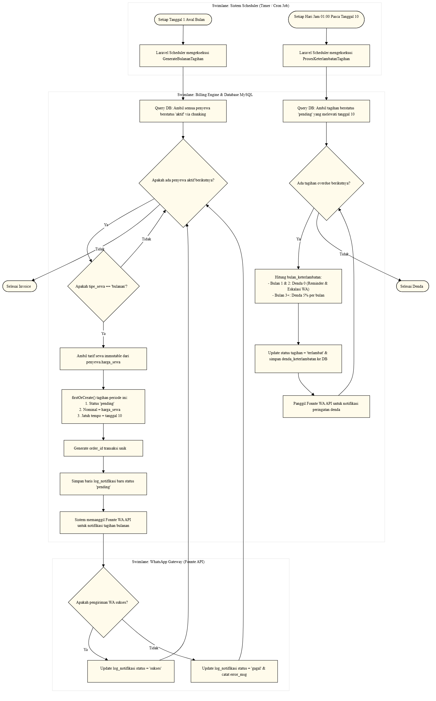

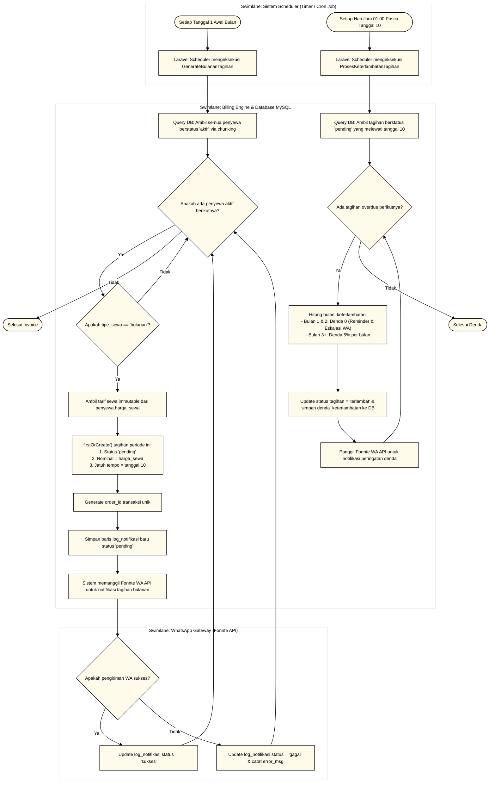
```mermaid
%%{init: {
  'theme': 'base',
  'themeVariables': {
    'primaryColor': '#FFFBEB',
    'primaryTextColor': '#000000',
    'primaryBorderColor': '#000000',
    'lineColor': '#000000',
    'secondaryColor': '#FDE047',
    'tertiaryColor': '#FFFFFF',
    'edgeLabelBackground': '#FFFFFF',
    'fontSize': '12px',
    'fontFamily': 'Inter, system-ui, sans-serif'
  }
}}%%
flowchart TD
    subgraph Swimlane_Scheduler ["Swimlane: Sistem Scheduler (Timer / Cron Job)"]
        StartCron1([Setiap Tanggal 1 Awal Bulan]) --> TriggerGenInvoice["Laravel Scheduler mengeksekusi GenerateBulananTagihan"]
        StartCronDaily([Setiap Hari Jam 01:00 Pasca Tanggal 10]) --> TriggerDenda["Laravel Scheduler mengeksekusi ProsesKeterlambatanTagihan"]
    end

    subgraph Swimlane_BillingEngine ["Swimlane: Billing Engine & Database MySQL"]
        %% Penerbitan Invoice
        TriggerGenInvoice --> QueryPenyewaAktif["Query DB: Ambil semua penyewa berstatus 'aktif' via chunking"]
        QueryPenyewaAktif --> LoopPenyewa{"Apakah ada penyewa aktif berikutnya?"}
        
        LoopPenyewa -- Ya --> CekTipeSewa{"Apakah tipe_sewa == 'bulanan'?"}
        CekTipeSewa -- Tidak --> LoopPenyewa
        
        CekTipeSewa -- Ya --> AmbilTarif["Ambil tarif sewa immutable dari penyewa.harga_sewa"]
        AmbilTarif --> BuatInvoice["firstOrCreate() tagihan periode ini:<br>1. Status 'pending'<br>2. Nominal = harga_sewa<br>3. Jatuh tempo = tanggal 10"]
        BuatInvoice --> GenOrderId["Generate order_id transaksi unik"]
        GenOrderId --> SimpanLogNotif["Simpan baris log_notifikasi baru status 'pending'"]
        SimpanLogNotif --> CallFonnteBill["Sistem memanggil Fonnte WA API untuk notifikasi tagihan bulanan"]
        
        %% Pemrosesan Denda Keterlambatan Harian
        TriggerDenda --> QueryTagihanOverdue["Query DB: Ambil tagihan berstatus 'pending' yang melewati tanggal 10"]
        QueryTagihanOverdue --> LoopDenda{"Ada tagihan overdue berikutnya?"}
        
        LoopDenda -- Ya --> HitungDendaEngine["Hitung bulan_keterlambatan:<br>- Bulan 1 & 2: Denda 0 (Reminder & Eskalasi WA)<br>- Bulan 3+: Denda 5% per bulan"]
        HitungDendaEngine --> UpdateTagihanTerlambat["Update status tagihan = 'terlambat' & simpan denda_keterlambatan ke DB"]
        UpdateTagihanTerlambat --> CallFonnteDenda["Panggil Fonnte WA API untuk notifikasi peringatan denda"]
    end

    subgraph Swimlane_Fonnte ["Swimlane: WhatsApp Gateway (Fonnte API)"]
        CallFonnteBill --> CekResponFonnte{"Apakah pengiriman WA sukses?"}
        CekResponFonnte -- Ya --> LogSukses["Update log_notifikasi status = 'sukses'"]
        CekResponFonnte -- Tidak --> LogGagal["Update log_notifikasi status = 'gagal' & catat error_msg"]
        
        LogSukses --> LoopPenyewa
        LogGagal --> LoopPenyewa
        
        CallFonnteDenda --> LoopDenda
    end

    LoopPenyewa -- Tidak --> SelesaiBill([Selesai Invoice])
    LoopDenda -- Tidak --> SelesaiDenda([Selesai Denda])
```

---

### 2.6. Activity Diagram 6: Pembayaran Tagihan Bulanan (Penyewa Aktif & Admin - Hybrid Payment)
Diagram ini menjelaskan penanganan pembayaran tagihan bulanan oleh penyewa, verifikasi uang masuk offline oleh admin, opsi unduh kuitansi mandiri, serta pengiriman kuitansi PDF otomatis.

* **Controller Terkait**: [Penyewa\TagihanController](file:///c:/xampp/htdocs/asri-boarding-house/app/Http/Controllers/Penyewa/TagihanController.php) (method: `index`, `show`, `downloadNota`), [Admin\TagihanController](file:///c:/xampp/htdocs/asri-boarding-house/app/Http/Controllers/Admin/TagihanController.php) (method: `konfirmasiCash`), [MidtransCallbackController](file:///c:/xampp/htdocs/asri-boarding-house/app/Http/Controllers/Api/MidtransCallbackController.php)
* **Model Terkait**: [Tagihan](file:///c:/xampp/htdocs/asri-boarding-house/app/Models/Tagihan.php), [Pembayaran](file:///c:/xampp/htdocs/asri-boarding-house/app/Models/Pembayaran.php), [Setting](file:///c:/xampp/htdocs/asri-boarding-house/app/Models/Setting.php)
* **Service Terkait**: [PdfNotaService](file:///c:/xampp/htdocs/asri-boarding-house/app/Services/PdfNotaService.php)
* **View Terkait**: [penyewa/tagihan/index.blade.php](file:///c:/xampp/htdocs/asri-boarding-house/resources/views/penyewa/tagihan/index.blade.php), [penyewa/tagihan/show.blade.php](file:///c:/xampp/htdocs/asri-boarding-house/resources/views/penyewa/tagihan/show.blade.php)
* **Pengujian Otomatis**: [AdminTagihanTest](file:///c:/xampp/htdocs/asri-boarding-house/tests/Feature/AdminTagihanTest.php), [PenyewaTagihanTest](file:///c:/xampp/htdocs/asri-boarding-house/tests/Feature/PenyewaTagihanTest.php)

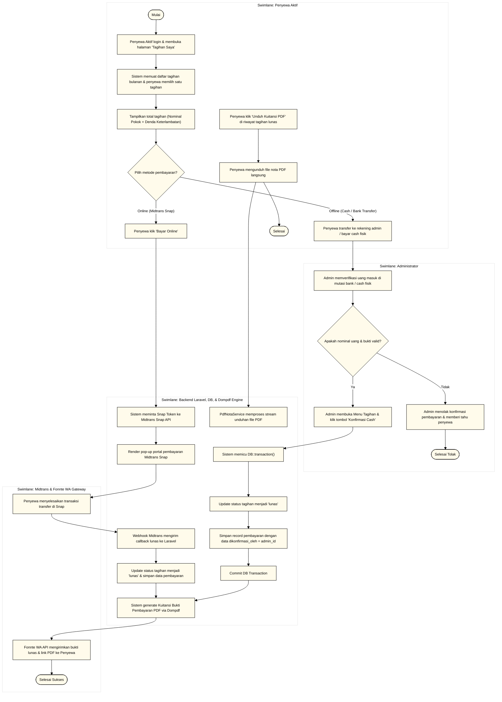
```mermaid
%%{init: {
  'theme': 'base',
  'themeVariables': {
    'primaryColor': '#FFFBEB',
    'primaryTextColor': '#000000',
    'primaryBorderColor': '#000000',
    'lineColor': '#000000',
    'secondaryColor': '#FDE047',
    'tertiaryColor': '#FFFFFF',
    'edgeLabelBackground': '#FFFFFF',
    'fontSize': '12px',
    'fontFamily': 'Inter, system-ui, sans-serif'
  }
}}%%
flowchart TD
    subgraph Swimlane_Penyewa ["Swimlane: Penyewa Aktif"]
        Start([Mulai]) --> BukaTagihan["Penyewa Aktif login & membuka halaman 'Tagihan Saya'"]
        BukaTagihan --> DetailTagihan["Sistem memuat daftar tagihan bulanan & penyewa memilih satu tagihan"]
        DetailTagihan --> TampilkanTotal["Tampilkan total tagihan (Nominal Pokok + Denda Keterlambatan)"]
        TampilkanTotal --> PilihOpsiBayar{"Pilih metode pembayaran?"}
        
        PilihOpsiBayar -- "Online (Midtrans Snap)" --> KlikBayarOnline["Penyewa klik 'Bayar Online'"]
        PilihOpsiBayar -- "Offline (Cash / Bank Transfer)" --> TransferManual["Penyewa transfer ke rekening admin / bayar cash fisik"]
        
        UnduhMandiri["Penyewa klik 'Unduh Kuitansi PDF' di riwayat tagihan lunas"] --> AksesDownload["Penyewa mengunduh file nota PDF langsung"]
        AksesDownload --> SelesaiMandiri([Selesai])
    end

    subgraph Swimlane_Admin ["Swimlane: Administrator"]
        TransferManual --> AdminVerifikasiKas["Admin memverifikasi uang masuk di mutasi bank / cash fisik"]
        AdminVerifikasiKas --> AdminCekNominal{"Apakah nominal uang & bukti valid?"}
        AdminCekNominal -- Tidak --> AdminTolak["Admin menolak konfirmasi pembayaran & memberi tahu penyewa"]
        AdminTolak --> SelesaiTolak([Selesai Tolak])
        AdminCekNominal -- Ya --> AdminKonfirmasi["Admin membuka Menu Tagihan & klik tombol 'Konfirmasi Cash'"]
    end

    subgraph Swimlane_Backend ["Swimlane: Backend Laravel, DB, & Dompdf Engine"]
        AdminKonfirmasi --> DbTransaction["Sistem memicu DB::transaction()"]
        DbTransaction --> UpdateLunasManual["Update status tagihan menjadi 'lunas'"]
        UpdateLunasManual --> SimpanRecordBayar["Simpan record pembayaran dengan data dikonfirmasi_oleh = admin_id"]
        SimpanRecordBayar --> CommitTx["Commit DB Transaction"]
        
        KlikBayarOnline --> RequestToken["Sistem meminta Snap Token ke Midtrans Snap API"]
        RequestToken --> RenderSnapModal["Render pop-up portal pembayaran Midtrans Snap"]
        
        WebhookSuccess["Webhook Midtrans mengirim callback lunas ke Laravel"] --> UpdateLunasOnline["Update status tagihan menjadi 'lunas' & simpan data pembayaran"]
        
        UpdateLunasOnline --> GeneratePDFReceipt["Sistem generate Kuitansi Bukti Pembayaran PDF via Dompdf"]
        CommitTx --> GeneratePDFReceipt
        
        AksesDownload --> ServiceDownload["PdfNotaService memproses stream unduhan file PDF"]
    end

    subgraph Swimlane_Midtrans ["Swimlane: Midtrans & Fonnte WA Gateway"]
        RenderSnapModal --> SelesaikanTransfer["Penyewa menyelesaikan transaksi transfer di Snap"]
        SelesaikanTransfer --> WebhookSuccess
        
        GeneratePDFReceipt --> KirimWAReceipt["Fonnte WA API mengirimkan bukti lunas & link PDF ke Penyewa"]
        KirimWAReceipt --> Selesai([Selesai Sukses])
    end
```

---

### 2.7. Activity Diagram 7: Pelaporan & Resolusi Keluhan Fasilitas (Penyewa Aktif & Admin)
Diagram ini menjelaskan alur pengajuan laporan kerusakan fasilitas oleh penyewa aktif, evaluasi kelayakan oleh admin (Disetujui vs Ditolak), dan penanganannya sampai dengan tuntas (*solved*).

* **Controller Terkait**: [Penyewa\KeluhanController](file:///c:/xampp/htdocs/asri-boarding-house/app/Http/Controllers/Penyewa/KeluhanController.php) (method: `store`, `create`), [Admin\KeluhanController](file:///c:/xampp/htdocs/asri-boarding-house/app/Http/Controllers/Admin/KeluhanController.php) (method: `update`, `show`)
* **Model Terkait**: [Keluhan](file:///c:/xampp/htdocs/asri-boarding-house/app/Models/Keluhan.php)
* **Service Terkait**: [NotifikasiService](file:///c:/xampp/htdocs/asri-boarding-house/app/Services/NotifikasiService.php)
* **View Terkait**: [penyewa/keluhan/index.blade.php](file:///c:/xampp/htdocs/asri-boarding-house/resources/views/penyewa/keluhan/index.blade.php), [penyewa/keluhan/create.blade.php](file:///c:/xampp/htdocs/asri-boarding-house/resources/views/penyewa/keluhan/create.blade.php), [admin/keluhan/show.blade.php](file:///c:/xampp/htdocs/asri-boarding-house/resources/views/admin/keluhan/show.blade.php)
* **Pengujian Otomatis**: [KeluhanManagementTest](file:///c:/xampp/htdocs/asri-boarding-house/tests/Feature/KeluhanManagementTest.php)

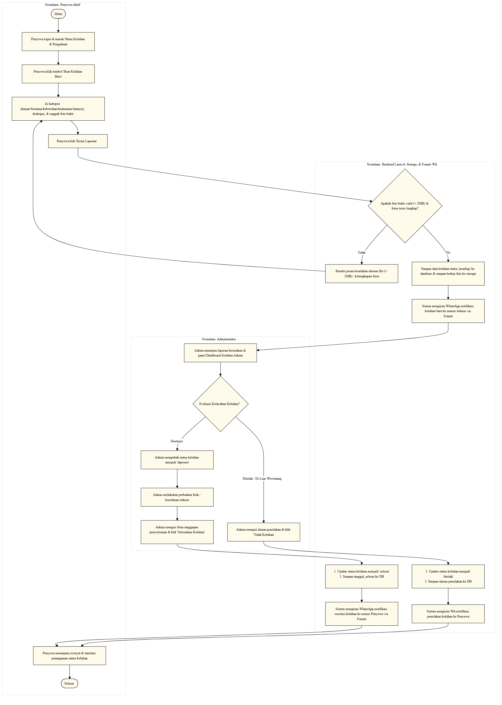

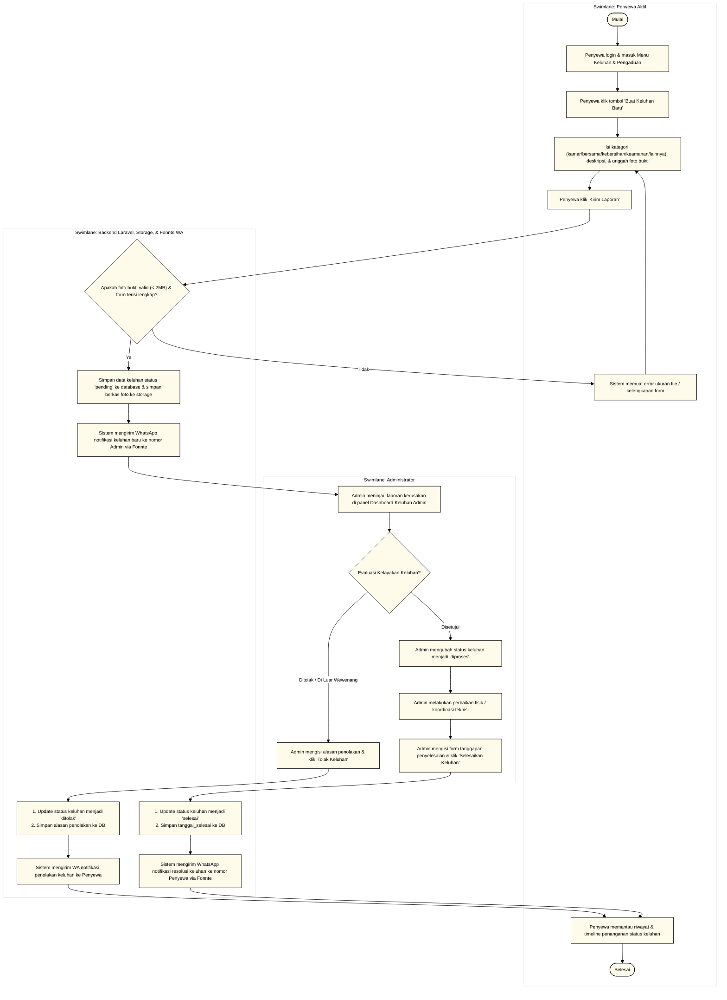
```mermaid
%%{init: {
  'theme': 'base',
  'themeVariables': {
    'primaryColor': '#FFFBEB',
    'primaryTextColor': '#000000',
    'primaryBorderColor': '#000000',
    'lineColor': '#000000',
    'secondaryColor': '#FDE047',
    'tertiaryColor': '#FFFFFF',
    'edgeLabelBackground': '#FFFFFF',
    'fontSize': '12px',
    'fontFamily': 'Inter, system-ui, sans-serif'
  }
}}%%
flowchart TD
    subgraph Swimlane_Penyewa ["Swimlane: Penyewa Aktif"]
        Start([Mulai]) --> BukaMenuKeluhan["Penyewa login & masuk Menu Keluhan & Pengaduan"]
        BukaMenuKeluhan --> KlikBuatKeluhan["Penyewa klik tombol 'Buat Keluhan Baru'"]
        KlikBuatKeluhan --> IsiFormKeluhan["Isi kategori (kamar/bersama/kebersihan/keamanan/lainnya), deskripsi, & unggah foto bukti"]
        IsiFormKeluhan --> KlikKirim["Penyewa klik 'Kirim Laporan'"]
        TampilErrorFile["Sistem memuat error ukuran file / kelengkapan form"] --> IsiFormKeluhan
        
        PantauStatus["Penyewa memantau riwayat & timeline penanganan status keluhan"] --> SelesaiPantau([Selesai])
    end

    subgraph Swimlane_Admin ["Swimlane: Administrator"]
        AdminReviewKeluhan["Admin meninjau laporan kerusakan di panel Dashboard Keluhan Admin"] --> EvaluasiKeluhan{"Evaluasi Kelayakan Keluhan?"}
        
        EvaluasiKeluhan -- "Ditolak / Di Luar Wewenang" --> IsiAlasanTolak["Admin mengisi alasan penolakan & klik 'Tolak Keluhan'"]
        EvaluasiKeluhan -- "Disetujui" --> UbahStatusProses["Admin mengubah status keluhan menjadi 'diproses'"]
        
        UbahStatusProses --> LakukanTindakan["Admin melakukan perbaikan fisik / koordinasi teknisi"]
        LakukanTindakan --> IsiTanggapan["Admin mengisi form tanggapan penyelesaian & klik 'Selesaikan Keluhan'"]
    end

    subgraph Swimlane_Backend ["Swimlane: Backend Laravel, Storage, & Fonnte WA"]
        KlikKirim --> ValidasiFile{"Apakah foto bukti valid (< 2MB) & form terisi lengkap?"}
        ValidasiFile -- Tidak --> TampilErrorFile
        
        ValidasiFile -- Ya --> SimpanKeluhanPending["Simpan data keluhan status 'pending' ke database & simpan berkas foto ke storage"]
        SimpanKeluhanPending --> KirimWAAdmin["Sistem mengirim WhatsApp notifikasi keluhan baru ke nomor Admin via Fonnte"]
        KirimWAAdmin --> AdminReviewKeluhan
        
        IsiAlasanTolak --> UpdateTolakKeluhan["1. Update status keluhan menjadi 'ditolak'<br>2. Simpan alasan penolakan ke DB"]
        UpdateTolakKeluhan --> KirimWANotifTolak["Sistem mengirim WA notifikasi penolakan keluhan ke Penyewa"]
        KirimWANotifTolak --> PantauStatus
        
        IsiTanggapan --> UpdateSelesaiKeluhan["1. Update status keluhan menjadi 'selesai'<br>2. Simpan tanggal_selesai ke DB"]
        UpdateSelesaiKeluhan --> KirimWANotifPenyewa["Sistem mengirim WhatsApp notifikasi resolusi keluhan ke nomor Penyewa via Fonnte"]
        KirimWANotifPenyewa --> PantauStatus
    end
```

---

### 2.8. Activity Diagram 8: Pencatatan Pengeluaran & Integrasi Laporan Arus Kas (Admin)
Diagram ini memetakan pencatatan pengeluaran operasional bulanan (arus kas keluar) beserta pengamanan data uploader nota fisik, serta konsolidasi laporan laba bersih.

* **Controller Terkait**: [Admin\PengeluaranController](file:///c:/xampp/htdocs/asri-boarding-house/app/Http/Controllers/Admin/PengeluaranController.php), [Admin\LaporanController](file:///c:/xampp/htdocs/asri-boarding-house/app/Http/Controllers/Admin/LaporanController.php) (method: `index`, `exportPdf`, `exportExcel`)
* **Model Terkait**: [Pengeluaran](file:///c:/xampp/htdocs/asri-boarding-house/app/Models/Pengeluaran.php), [Tagihan](file:///c:/xampp/htdocs/asri-boarding-house/app/Models/Tagihan.php), [Pembayaran](file:///c:/xampp/htdocs/asri-boarding-house/app/Models/Pembayaran.php), [Reservasi](file:///c:/xampp/htdocs/asri-boarding-house/app/Models/Reservasi.php)
* **View Terkait**: [admin/pengeluaran/index.blade.php](file:///c:/xampp/htdocs/asri-boarding-house/resources/views/admin/pengeluaran/index.blade.php), [admin/laporan/index.blade.php](file:///c:/xampp/htdocs/asri-boarding-house/resources/views/admin/laporan/index.blade.php)
* **Pengujian Otomatis**: [AdminPengeluaranTest](file:///c:/xampp/htdocs/asri-boarding-house/tests/Feature/AdminPengeluaranTest.php)

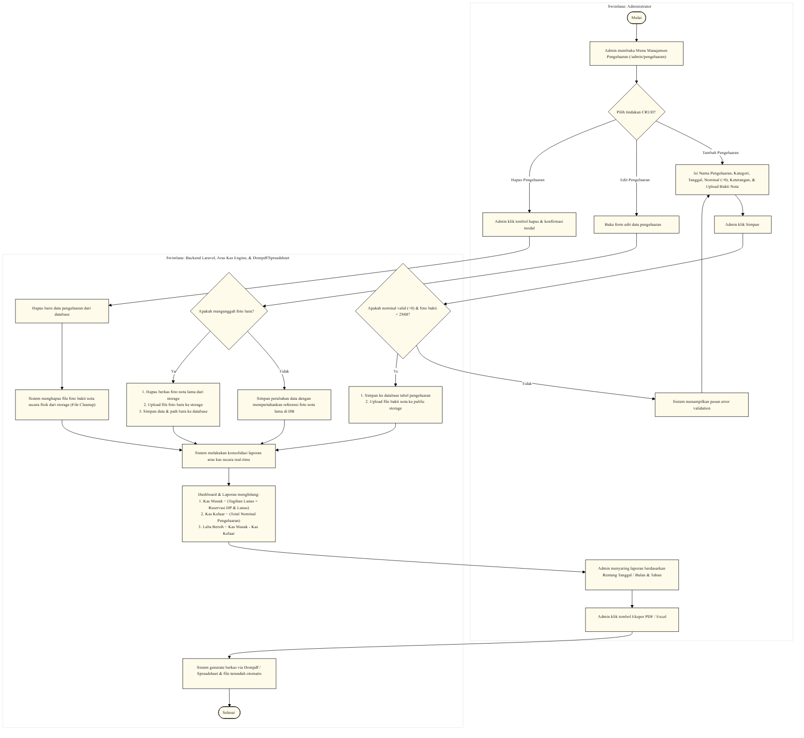

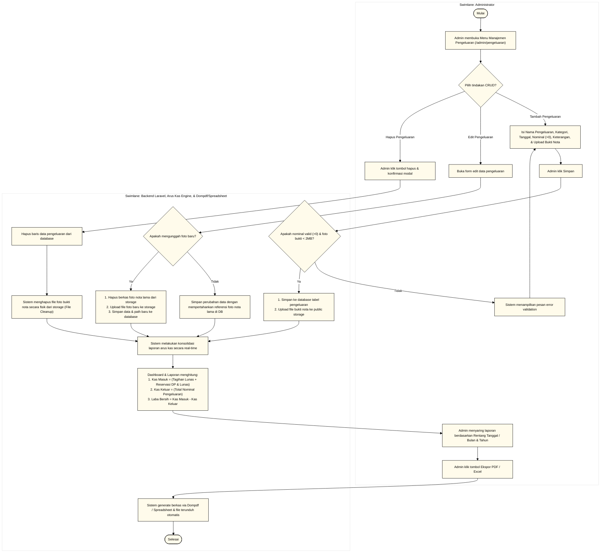
```mermaid
%%{init: {
  'theme': 'base',
  'themeVariables': {
    'primaryColor': '#FFFBEB',
    'primaryTextColor': '#000000',
    'primaryBorderColor': '#000000',
    'lineColor': '#000000',
    'secondaryColor': '#FDE047',
    'tertiaryColor': '#FFFFFF',
    'edgeLabelBackground': '#FFFFFF',
    'fontSize': '12px',
    'fontFamily': 'Inter, system-ui, sans-serif'
  }
}}%%
flowchart TD
    subgraph Swimlane_Admin ["Swimlane: Administrator"]
        Start([Mulai]) --> BukaPengeluaran["Admin membuka Menu Manajemen Pengeluaran (/admin/pengeluaran)"]
        BukaPengeluaran --> PilihAksiCRUD{"Pilih tindakan CRUD?"}
        
        PilihAksiCRUD -- "Tambah Pengeluaran" --> IsiFormTambah["Isi Nama Pengeluaran, Kategori, Tanggal, Nominal (>0), Keterangan, & Upload Bukti Nota"]
        IsiFormTambah --> KlikSimpan["Admin klik Simpan"]
        TampilValidationError["Sistem menampilkan pesan error validation"] --> IsiFormTambah
        
        PilihAksiCRUD -- "Edit Pengeluaran" --> BukaFormEdit["Buka form edit data pengeluaran"]
        PilihAksiCRUD -- "Hapus Pengeluaran" --> KlikHapus["Admin klik tombol hapus & konfirmasi modal"]
        
        FilterLaporan["Admin menyaring laporan berdasarkan Rentang Tanggal / Bulan & Tahun"] --> KlikEkspor["Admin klik tombol Ekspor PDF / Excel"]
    end

    subgraph Swimlane_Backend ["Swimlane: Backend Laravel, Arus Kas Engine, & Dompdf/Spreadsheet"]
        KlikSimpan --> ValidasiForm{"Apakah nominal valid (>0) & foto bukti < 2MB?"}
        ValidasiForm -- Tidak --> TampilValidationError
        ValidasiForm -- Ya --> SimpanPengeluaran["1. Simpan ke database tabel pengeluaran<br>2. Upload file bukti nota ke public storage"]
        
        BukaFormEdit --> CekFileFotoBaru{"Apakah mengunggah foto baru?"}
        CekFileFotoBaru -- Tidak --> SimpanTanpaGantiFoto["Simpan perubahan data dengan mempertahankan referensi foto nota lama di DB"]
        CekFileFotoBaru -- Ya --> SimpanDenganGantiFoto["1. Hapus berkas foto nota lama dari storage<br>2. Upload file foto baru ke storage<br>3. Simpan data & path baru ke database"]
        
        KlikHapus --> HapusDbPengeluaran["Hapus baris data pengeluaran dari database"]
        HapusDbPengeluaran --> CleanupFileNota["Sistem menghapus file foto bukti nota secara fisik dari storage (File Cleanup)"]
        
        SimpanPengeluaran --> KonsolidasiData["Sistem melakukan konsolidasi laporan arus kas secara real-time"]
        SimpanTanpaGantiFoto --> KonsolidasiData
        SimpanDenganGantiFoto --> KonsolidasiData
        CleanupFileNota --> KonsolidasiData
        
        KonsolidasiData --> TampilkanKas["Dashboard & Laporan menghitung:<br>1. Kas Masuk = (Tagihan Lunas + Reservasi DP & Lunas)<br>2. Kas Keluar = (Total Nominal Pengeluaran)<br>3. Laba Bersih = Kas Masuk - Kas Keluar"]
        TampilkanKas --> FilterLaporan
        
        KlikEkspor --> UnduhFileLaporan["Sistem generate berkas via Dompdf / Spreadsheet & file terunduh otomatis"]
        UnduhFileLaporan --> Selesai([Selesai])
    end
```

---

### 2.9. Activity Diagram 9: Manajemen Konten Dinamis - FAQ, Galeri, Ulasan (Admin)
Diagram ini menjelaskan bagaimana pengelola meng-update informasi landing page publik secara dinamis tanpa merusak persistensi data gambar yang sudah ada.

* **Controller Terkait**: [FaqController](file:///c:/xampp/htdocs/asri-boarding-house/app/Http/Controllers/Admin/FaqController.php), [GalleryController](file:///c:/xampp/htdocs/asri-boarding-house/app/Http/Controllers/Admin/GalleryController.php), [CustomerReviewController](file:///c:/xampp/htdocs/asri-boarding-house/app/Http/Controllers/Admin/CustomerReviewController.php)
* **Model Terkait**: [Faq](file:///c:/xampp/htdocs/asri-boarding-house/app/Models/Faq.php), [Gallery](file:///c:/xampp/htdocs/asri-boarding-house/app/Models/Gallery.php), [CustomerReview](file:///c:/xampp/htdocs/asri-boarding-house/app/Models/CustomerReview.php)
* **View Terkait**: [admin/faq/index.blade.php](file:///c:/xampp/htdocs/asri-boarding-house/resources/views/admin/faq/index.blade.php), [admin/gallery/index.blade.php](file:///c:/xampp/htdocs/asri-boarding-house/resources/views/admin/gallery/index.blade.php), [admin/reviews/index.blade.php](file:///c:/xampp/htdocs/asri-boarding-house/resources/views/admin/reviews/index.blade.php)
* **Pengujian Otomatis**: [CustomerReviewCrudTest](file:///c:/xampp/htdocs/asri-boarding-house/tests/Feature/CustomerReviewCrudTest.php), [AdminGalleryTest](file:///c:/xampp/htdocs/asri-boarding-house/tests/Feature/AdminGalleryTest.php), [FaqDynamicSystemTest](file:///c:/xampp/htdocs/asri-boarding-house/tests/Feature/FaqDynamicSystemTest.php)

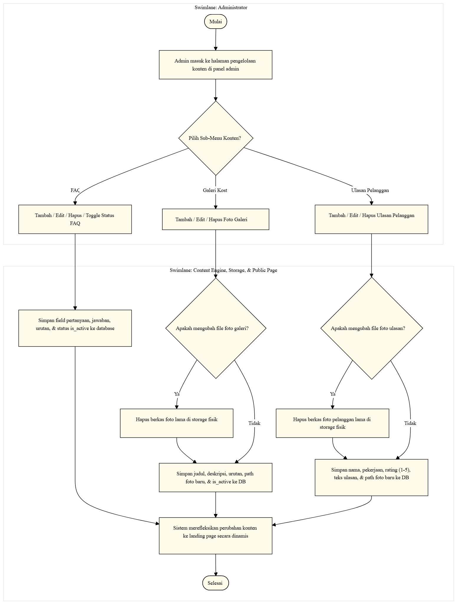

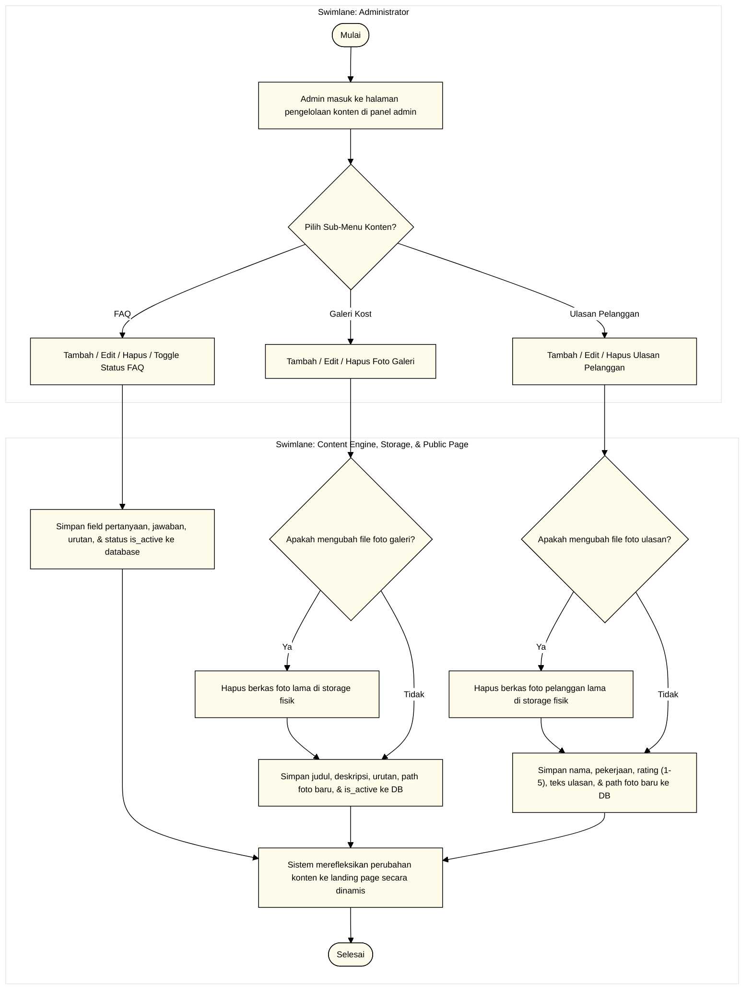
```mermaid
%%{init: {
  'theme': 'base',
  'themeVariables': {
    'primaryColor': '#FFFBEB',
    'primaryTextColor': '#000000',
    'primaryBorderColor': '#000000',
    'lineColor': '#000000',
    'secondaryColor': '#FDE047',
    'tertiaryColor': '#FFFFFF',
    'edgeLabelBackground': '#FFFFFF',
    'fontSize': '12px',
    'fontFamily': 'Inter, system-ui, sans-serif'
  }
}}%%
flowchart TD
    subgraph Swimlane_Admin ["Swimlane: Administrator"]
        Start([Mulai]) --> BukaKonten["Admin masuk ke halaman pengelolaan konten di panel admin"]
        BukaKonten --> PilihSubMenu{"Pilih Sub-Menu Konten?"}
        
        PilihSubMenu -- "FAQ" --> CRUDFAQ["Tambah / Edit / Hapus / Toggle Status FAQ"]
        PilihSubMenu -- "Galeri Kost" --> CRUDGaleri["Tambah / Edit / Hapus Foto Galeri"]
        PilihSubMenu -- "Ulasan Pelanggan" --> CRUDReview["Tambah / Edit / Hapus Ulasan Pelanggan"]
    end

    subgraph Swimlane_Backend ["Swimlane: Content Engine, Storage, & Public Page"]
        CRUDFAQ --> SaveFAQ["Simpan field pertanyaan, jawaban, urutan, & status is_active ke database"]
        
        CRUDGaleri --> CekUbahGaleri{"Apakah mengubah file foto galeri?"}
        CekUbahGaleri -- Ya --> HapusFotoGaleriLama["Hapus berkas foto lama di storage fisik"]
        HapusFotoGaleriLama --> SimpanGaleri["Simpan judul, deskripsi, urutan, path foto baru, & is_active ke DB"]
        CekUbahGaleri -- Tidak --> SimpanGaleri
        
        CRUDReview --> CekUbahReview{"Apakah mengubah file foto ulasan?"}
        CekUbahReview -- Ya --> HapusFotoReviewLama["Hapus berkas foto pelanggan lama di storage fisik"]
        HapusFotoReviewLama --> SimpanReview["Simpan nama, pekerjaan, rating (1-5), teks ulasan, & path foto baru ke DB"]
        CekUbahReview -- Tidak --> SimpanReview
        
        SaveFAQ --> TerapkanPerubahan["Sistem merefleksikan perubahan konten ke landing page secara dinamis"]
        SimpanGaleri --> TerapkanPerubahan
        SimpanReview --> TerapkanPerubahan
        
        TerapkanPerubahan --> Selesai([Selesai])
    end
```

---

### 2.10. Activity Diagram 10: Manajemen Peraturan & Tata Tertib Kost (Admin & Penyewa Aktif)
Diagram ini memetakan pengelolaan daftar tata tertib dinamis oleh administrator dan rendering adaptif (Dark Mode) di portal penyewa aktif.

* **Controller Terkait**: [PeraturanController](file:///c:/xampp/htdocs/asri-boarding-house/app/Http/Controllers/Admin/PeraturanController.php), [DashboardController](file:///c:/xampp/htdocs/asri-boarding-house/app/Http/Controllers/Penyewa/DashboardController.php) (method: `peraturan`)
* **Model Terkait**: [Peraturan](file:///c:/xampp/htdocs/asri-boarding-house/app/Models/Peraturan.php)
* **View Terkait**: [admin/peraturan/index.blade.php](file:///c:/xampp/htdocs/asri-boarding-house/resources/views/admin/peraturan/index.blade.php), [penyewa/peraturan.blade.php](file:///c:/xampp/htdocs/asri-boarding-house/resources/views/penyewa/peraturan.blade.php)
* **Pengujian Otomatis**: [PenyewaPeraturanTest](file:///c:/xampp/htdocs/asri-boarding-house/tests/Feature/PenyewaPeraturanTest.php)

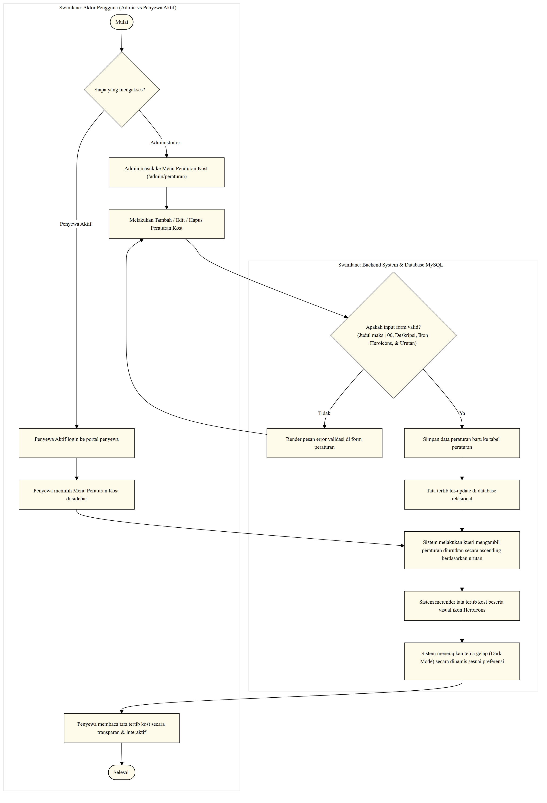

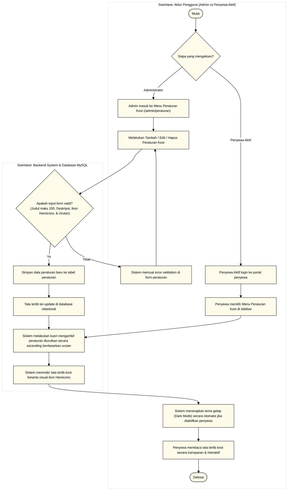
```mermaid
%%{init: {
  'theme': 'base',
  'themeVariables': {
    'primaryColor': '#FFFBEB',
    'primaryTextColor': '#000000',
    'primaryBorderColor': '#000000',
    'lineColor': '#000000',
    'secondaryColor': '#FDE047',
    'tertiaryColor': '#FFFFFF',
    'edgeLabelBackground': '#FFFFFF',
    'fontSize': '12px',
    'fontFamily': 'Inter, system-ui, sans-serif'
  }
}}%%
flowchart TD
    subgraph Swimlane_Actors ["Swimlane: Aktor Pengguna (Admin vs Penyewa Aktif)"]
        Start([Mulai]) --> IdentifikasiAkses{"Siapa yang mengakses?"}
        
        %% Admin
        IdentifikasiAkses -- "Administrator" --> BukaAdminPeraturan["Admin masuk ke Menu Peraturan Kost (/admin/peraturan)"]
        BukaAdminPeraturan --> CRUDPeraturan["Melakukan Tambah / Edit / Hapus Peraturan Kost"]
        TampilErrorValidation["Sistem memuat error validation di form peraturan"] --> CRUDPeraturan
        
        %% Penyewa
        IdentifikasiAkses -- "Penyewa Aktif" --> LoginPortal["Penyewa Aktif login ke portal penyewa"]
        LoginPortal --> KlikMenuPeraturan["Penyewa memilih Menu Peraturan Kost di sidebar"]
        AdaptasiDarkMode["Sistem menerapkan tema gelap (Dark Mode) secara otomatis jika diaktifkan penyewa"] --> BacaPeraturan["Penyewa membaca tata tertib kost secara transparan & interaktif"]
        BacaPeraturan --> SelesaiPenyewa([Selesai])
    end

    subgraph Swimlane_Backend ["Swimlane: Backend System & Database MySQL"]
        CRUDPeraturan --> ValidasiPeraturan{"Apakah input form valid?<br>(Judul maks 100, Deskripsi, Ikon Heroicons, & Urutan)"}
        ValidasiPeraturan -- Tidak --> TampilErrorValidation
        ValidasiPeraturan -- Ya --> SimpanPeraturanDB["Simpan data peraturan baru ke tabel peraturan"]
        SimpanPeraturanDB --> SelesaiUpdateDB["Tata tertib ter-update di database relasional"]
        
        KlikMenuPeraturan --> QueryPeraturanDB["Sistem melakukan kueri mengambil peraturan diurutkan secara ascending berdasarkan urutan"]
        SelesaiUpdateDB --> QueryPeraturanDB
        QueryPeraturanDB --> RenderPeraturan["Sistem merender tata tertib kost beserta visual ikon Heroicons"]
        RenderPeraturan --> AdaptasiDarkMode
    end
```

---

### 2.11. Activity Diagram 11: Penonaktifan Penyewa (Checkout) & Pengelolaan Deposit (Admin)
Diagram ini menggambarkan alur kerja saat penyewa aktif keluar dari kost, proteksi tunggakan tagihan, penonaktifan kontrak, inspeksi fisik kamar, pemotongan/pengembalian deposit jaminan, serta pengubahan status kamar secara manual.

* **Controller Terkait**: [PenyewaController](file:///c:/xampp/htdocs/asri-boarding-house/app/Http/Controllers/Admin/PenyewaController.php) (method: `checkout`), [KamarController](file:///c:/xampp/htdocs/asri-boarding-house/app/Http/Controllers/Admin/KamarController.php) (method: `updateStatus`)
* **Model Terkait**: [Penyewa](file:///c:/xampp/htdocs/asri-boarding-house/app/Models/Penyewa.php), [Kamar](file:///c:/xampp/htdocs/asri-boarding-house/app/Models/Kamar.php)
* **View Terkait**: [admin/penyewa/index.blade.php](file:///c:/xampp/htdocs/asri-boarding-house/resources/views/admin/penyewa/index.blade.php), [admin/kamar/index.blade.php](file:///c:/xampp/htdocs/asri-boarding-house/resources/views/admin/kamar/index.blade.php)
* **Pengujian Otomatis**: [AdminPenyewaCrudAuditTest](file:///c:/xampp/htdocs/asri-boarding-house/tests/Feature/AdminPenyewaCrudAuditTest.php), [AdminKamarCrudTest](file:///c:/xampp/htdocs/asri-boarding-house/tests/Feature/AdminKamarCrudTest.php)

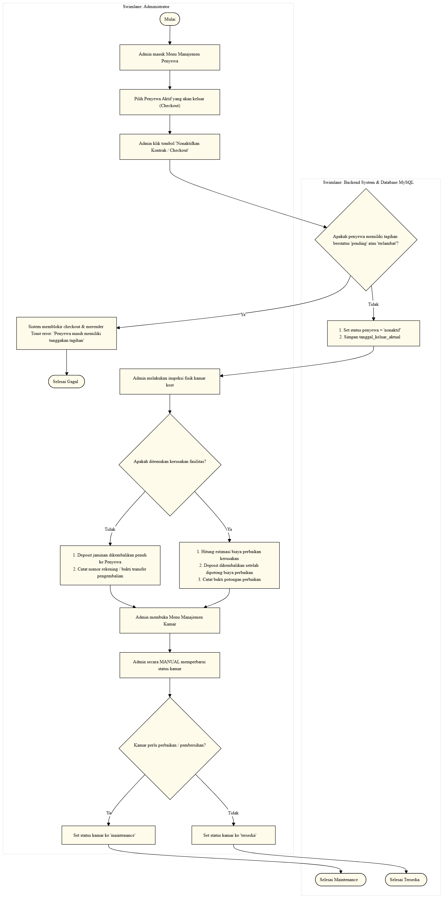

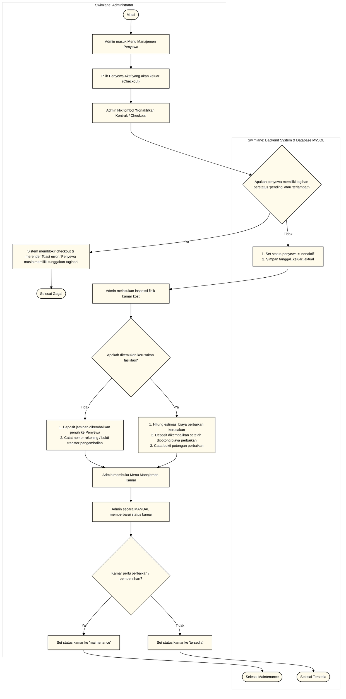
```mermaid
%%{init: {
  'theme': 'base',
  'themeVariables': {
    'primaryColor': '#FFFBEB',
    'primaryTextColor': '#000000',
    'primaryBorderColor': '#000000',
    'lineColor': '#000000',
    'secondaryColor': '#FDE047',
    'tertiaryColor': '#FFFFFF',
    'edgeLabelBackground': '#FFFFFF',
    'fontSize': '12px',
    'fontFamily': 'Inter, system-ui, sans-serif'
  }
}}%%
flowchart TD
    subgraph Swimlane_Admin ["Swimlane: Administrator"]
        Start([Mulai]) --> BukaPenyewa["Admin masuk Menu Manajemen Penyewa"]
        BukaPenyewa --> PilihPenyewa["Pilih Penyewa Aktif yang akan keluar (Checkout)"]
        PilihPenyewa --> KlikNonaktif["Admin klik tombol 'Nonaktifkan Kontrak / Checkout'"]
        
        TolakCheckout["Sistem memblokir checkout & merender Toast error: 'Penyewa masih memiliki tunggakan tagihan'"] --> SelesaiGagal([Selesai Gagal])
        
        LanjutCheckout["Admin melakukan inspeksi fisik kamar kost"] --> CekKerusakan{"Apakah ditemukan kerusakan fasilitas?"}
        CekKerusakan -- Ya --> PotongDeposit["1. Hitung estimasi biaya perbaikan kerusakan<br>2. Deposit dikembalikan setelah dipotong biaya perbaikan<br>3. Catat bukti potongan perbaikan"]
        CekKerusakan -- Tidak --> KembalikanDeposit["1. Deposit jaminan dikembalikan penuh ke Penyewa<br>2. Catat nomor rekening / bukti transfer pengembalian"]
        
        PotongDeposit --> BukaKamar["Admin membuka Menu Manajemen Kamar"]
        KembalikanDeposit --> BukaKamar
        
        BukaKamar --> UbahStatusKamar["Admin secara MANUAL memperbarui status kamar"]
        UbahStatusKamar --> TentukanStatus{"Kamar perlu perbaikan / pembersihan?"}
        TentukanStatus -- Ya --> SetMaintenance["Set status kamar ke 'maintenance'"]
        TentukanStatus -- Tidak --> SetTersedia["Set status kamar ke 'tersedia'"]
    end

    subgraph Swimlane_System ["Swimlane: Backend System & Database MySQL"]
        KlikNonaktif --> CekTunggakan{"Apakah penyewa memiliki tagihan berstatus 'pending' atau 'terlambat'?"}
        CekTunggakan -- Ya --> TolakCheckout
        CekTunggakan -- Tidak --> DbUpdateNonaktif["1. Set status penyewa = 'nonaktif'<br>2. Simpan tanggal_keluar_aktual"]
        DbUpdateNonaktif --> LanjutCheckout
        
        SetMaintenance --> SelesaiMaint([Selesai Maintenance])
        SetTersedia --> SelesaiAvail([Selesai Tersedia])
    end
```

---

### 2.12. Activity Diagram 12: Live Chat Pengunjung Anonim / Guest Chat (Guest & Admin)
Diagram ini memetakan alur diskusi interaktif antara pengunjung umum (Tamu) yang belum terdaftar dengan admin menggunakan sistem live chat widget, termasuk pemulihan sesi percakapan.

* **Controller Terkait**: [GuestChatApiController](file:///c:/xampp/htdocs/asri-boarding-house/app/Http/Controllers/Api/GuestChatApiController.php), [GuestChatController](file:///c:/xampp/htdocs/asri-boarding-house/app/Http/Controllers/Admin/GuestChatController.php)
* **Model Terkait**: [GuestChatThread](file:///c:/xampp/htdocs/asri-boarding-house/app/Models/GuestChatThread.php), [GuestChatMessage](file:///c:/xampp/htdocs/asri-boarding-house/app/Models/GuestChatMessage.php)
* **View Terkait**: [landing/index.blade.php](file:///c:/xampp/htdocs/asri-boarding-house/resources/views/landing/index.blade.php) (chat widget), [admin/guest-chats/index.blade.php](file:///c:/xampp/htdocs/asri-boarding-house/resources/views/admin/guest-chats/index.blade.php)
* **Pengujian Otomatis**: [GuestChatTest](file:///c:/xampp/htdocs/asri-boarding-house/tests/Feature/GuestChatTest.php)

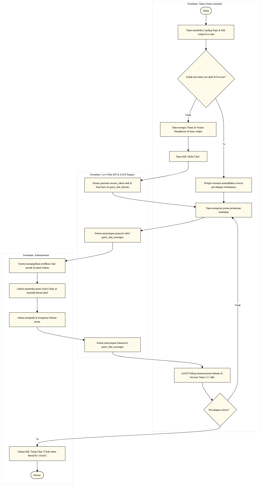

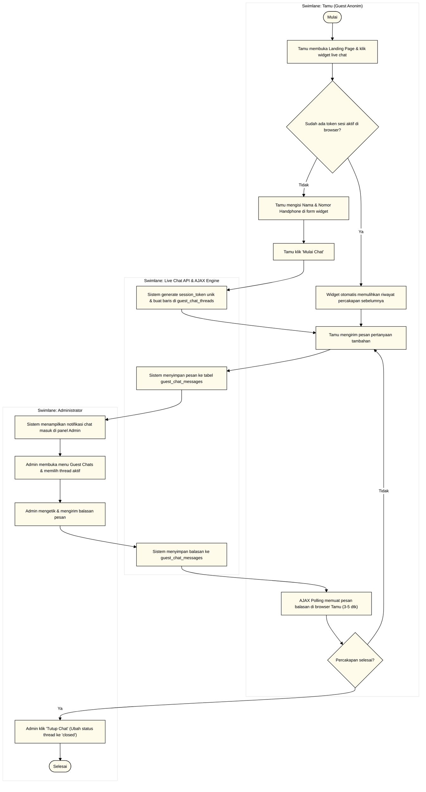
```mermaid
%%{init: {
  'theme': 'base',
  'themeVariables': {
    'primaryColor': '#FFFBEB',
    'primaryTextColor': '#000000',
    'primaryBorderColor': '#000000',
    'lineColor': '#000000',
    'secondaryColor': '#FDE047',
    'tertiaryColor': '#FFFFFF',
    'edgeLabelBackground': '#FFFFFF',
    'fontSize': '12px',
    'fontFamily': 'Inter, system-ui, sans-serif'
  }
}}%%
flowchart TD
    subgraph Swimlane_Guest ["Swimlane: Tamu (Guest Anonim)"]
        Start([Mulai]) --> BukaBeranda["Tamu membuka Landing Page & klik widget live chat"]
        BukaBeranda --> CekSessionAda{"Sudah ada token sesi aktif di browser?"}
        
        CekSessionAda -- Ya --> RestoreChat["Widget otomatis memulihkan riwayat percakapan sebelumnya"]
        CekSessionAda -- Tidak --> IsiIdentitas["Tamu mengisi Nama & Nomor Handphone di form widget"]
        
        IsiIdentitas --> MulaiChat["Tamu klik 'Mulai Chat'"]
        PollingGuest["AJAX Polling memuat pesan balasan di browser Tamu (3-5 dtk)"] --> CekSelesai{"Percakapan selesai?"}
        CekSelesai -- Tidak --> KirimPesanGuest["Tamu mengirim pesan pertanyaan tambahan"]
        RestoreChat --> KirimPesanGuest
    end

    subgraph Swimlane_Admin ["Swimlane: Administrator"]
        AdminNotif["Sistem menampilkan notifikasi chat masuk di panel Admin"] --> BukaThreadAdmin["Admin membuka menu Guest Chats & memilih thread aktif"]
        BukaThreadAdmin --> BalasChatAdmin["Admin mengetik & mengirim balasan pesan"]
        CekSelesai -- Ya --> TutupChat["Admin klik 'Tutup Chat' (Ubah status thread ke 'closed')"]
        TutupChat --> Selesai([Selesai])
    end

    subgraph Swimlane_System ["Swimlane: Live Chat API & AJAX Engine"]
        MulaiChat --> CreateThread["Sistem generate session_token unik & buat baris di guest_chat_threads"]
        CreateThread --> KirimPesanGuest
        KirimPesanGuest --> SimpanPesanGuest["Sistem menyimpan pesan ke tabel guest_chat_messages"]
        SimpanPesanGuest --> AdminNotif
        BalasChatAdmin --> SimpanPesanAdmin["Sistem menyimpan balasan ke guest_chat_messages"]
        SimpanPesanAdmin --> PollingGuest
    end
```

---

### 2.13. Activity Diagram 13: Keamanan Login & Force Change Password Pertama Kali (User / Penyewa Baru)
Diagram ini menunjukkan penanganan keamanan sistem saat pengguna melakukan login, proteksi *Rate Limiting*, alur Lupa Password via WA Fonnte, serta pengujian middleware `EnsurePasswordChanged`.

* **Controller Terkait**: [AdminLoginController](file:///c:/xampp/htdocs/asri-boarding-house/app/Http/Controllers/Auth/AdminLoginController.php), [PenyewaLoginController](file:///c:/xampp/htdocs/asri-boarding-house/app/Http/Controllers/Auth/PenyewaLoginController.php), [PasswordController](file:///c:/xampp/htdocs/asri-boarding-house/app/Http/Controllers/Auth/PasswordController.php)
* **Middleware Terkait**: [EnsurePasswordChanged](file:///c:/xampp/htdocs/asri-boarding-house/app/Http/Middleware/EnsurePasswordChanged.php)
* **Model Terkait**: [User](file:///c:/xampp/htdocs/asri-boarding-house/app/Models/User.php)
* **View Terkait**: [auth/admin-login.blade.php](file:///c:/xampp/htdocs/asri-boarding-house/resources/views/auth/admin-login.blade.php), [auth/penyewa-login.blade.php](file:///c:/xampp/htdocs/asri-boarding-house/resources/views/auth/penyewa-login.blade.php), [auth/admin-force-change-password.blade.php](file:///c:/xampp/htdocs/asri-boarding-house/resources/views/auth/admin-force-change-password.blade.php)
* **Pengujian Otomatis**: [AuthenticationTest](file:///c:/xampp/htdocs/asri-boarding-house/tests/Feature/Auth/AuthenticationTest.php)

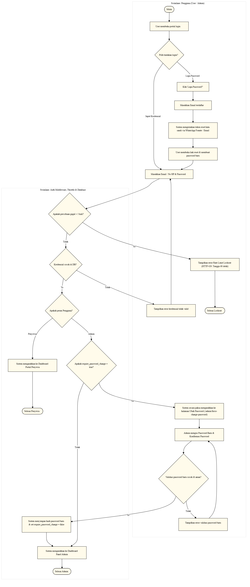

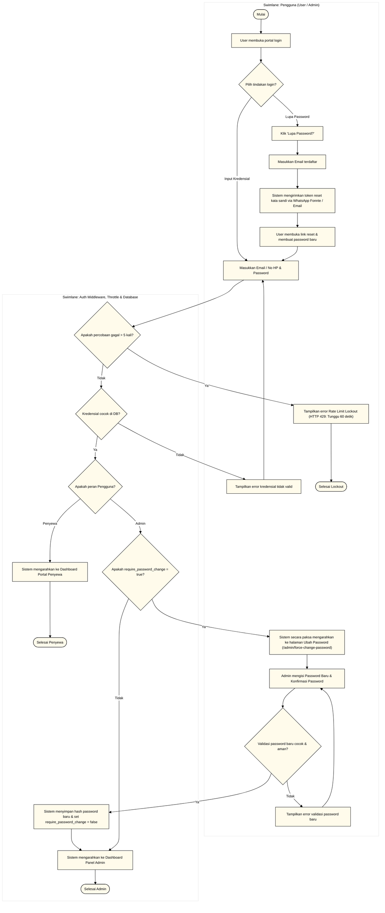
```mermaid
%%{init: {
  'theme': 'base',
  'themeVariables': {
    'primaryColor': '#FFFBEB',
    'primaryTextColor': '#000000',
    'primaryBorderColor': '#000000',
    'lineColor': '#000000',
    'secondaryColor': '#FDE047',
    'tertiaryColor': '#FFFFFF',
    'edgeLabelBackground': '#FFFFFF',
    'fontSize': '12px',
    'fontFamily': 'Inter, system-ui, sans-serif'
  }
}}%%
flowchart TD
    subgraph Swimlane_User ["Swimlane: Pengguna (User / Admin)"]
        Start([Mulai]) --> BukaLogin["User membuka portal login"]
        BukaLogin --> OpsiLogin{"Pilih tindakan login?"}
        
        OpsiLogin -- "Input Kredensial" --> InputKredensial["Masukkan Email / No HP & Password"]
        OpsiLogin -- "Lupa Password" --> KlikLupaPassword["Klik 'Lupa Password?'"]
        
        KlikLupaPassword --> InputEmailWa["Masukkan Email terdaftar"]
        InputEmailWa --> SendResetToken["Sistem mengirimkan token reset kata sandi via WhatsApp Fonnte / Email"]
        SendResetToken --> FormResetPass["User membuka link reset & membuat password baru"]
        FormResetPass --> InputKredensial
        
        TampilErrorLogin["Tampilkan error kredensial tidak valid"] --> InputKredensial
        TampilLockout["Tampilkan error Rate Limit Lockout (HTTP 429: Tunggu 60 detik)"] --> SelesaiLockout([Selesai Lockout])
        
        ForceRedirect["Sistem secara paksa mengarahkan ke halaman Ubah Password (/admin/force-change-password)"] --> InputPasswordBaru["Admin mengisi Password Baru & Konfirmasi Password"]
        InputPasswordBaru --> ValidasiPasswordBaru{"Validasi password baru cocok & aman?"}
        ValidasiPasswordBaru -- Tidak --> TampilErrorPassword["Tampilkan error validasi password baru"]
        TampilErrorPassword --> InputPasswordBaru
    end

    subgraph Swimlane_System ["Swimlane: Auth Middleware, Throttle & Database"]
        InputKredensial --> CekThrottle{"Apakah percobaan gagal > 5 kali?"}
        CekThrottle -- Ya --> TampilLockout
        
        CekThrottle -- Tidak --> ValidasiKredensial{"Kredensial cocok di DB?"}
        ValidasiKredensial -- Tidak --> TampilErrorLogin
        ValidasiKredensial -- Ya --> CekRole{"Apakah peran Pengguna?"}
        
        CekRole -- "Admin" --> CekPasswordDefault{"Apakah require_password_change = true?"}
        CekPasswordDefault -- Ya --> ForceRedirect
        
        ValidasiPasswordBaru -- Ya --> UpdatePasswordDB["Sistem menyimpan hash password baru & set require_password_change = false"]
        UpdatePasswordDB --> RedirectDashboardAdmin["Sistem mengarahkan ke Dashboard Panel Admin"]
        
        CekPasswordDefault -- Tidak --> RedirectDashboardAdmin
        CekRole -- "Penyewa" --> RedirectDashboardPenyewa["Sistem mengarahkan ke Dashboard Portal Penyewa"]
        
        RedirectDashboardAdmin --> SelesaiAdmin([Selesai Admin])
        RedirectDashboardPenyewa --> SelesaiPenyewa([Selesai Penyewa])
    end
```

---

### 2.14. Activity Diagram 14: Manajemen Kamar & Relasi Fasilitas (Admin)
Diagram ini menjelaskan alur admin panel untuk mengelola unit kamar kost, menetapkan relasi fasilitas (M:N), menyembunyikan unit maintenance, serta mengamankan kekosongan data (*safety deletion checks*).

* **Controller Terkait**: [KamarController](file:///c:/xampp/htdocs/asri-boarding-house/app/Http/Controllers/Admin/KamarController.php) (method: `store`, `update`, `destroy`), [FasilitasController](file:///c:/xampp/htdocs/asri-boarding-house/app/Http/Controllers/Admin/FasilitasController.php)
* **Model Terkait**: [Kamar](file:///c:/xampp/htdocs/asri-boarding-house/app/Models/Kamar.php), [Fasilitas](file:///c:/xampp/htdocs/asri-boarding-house/app/Models/Fasilitas.php)
* **View Terkait**: [admin/kamar/index.blade.php](file:///c:/xampp/htdocs/asri-boarding-house/resources/views/admin/kamar/index.blade.php), [admin/kamar/show.blade.php](file:///c:/xampp/htdocs/asri-boarding-house/resources/views/admin/kamar/show.blade.php)
* **Pengujian Otomatis**: [AdminKamarCrudTest](file:///c:/xampp/htdocs/asri-boarding-house/tests/Feature/AdminKamarCrudTest.php)

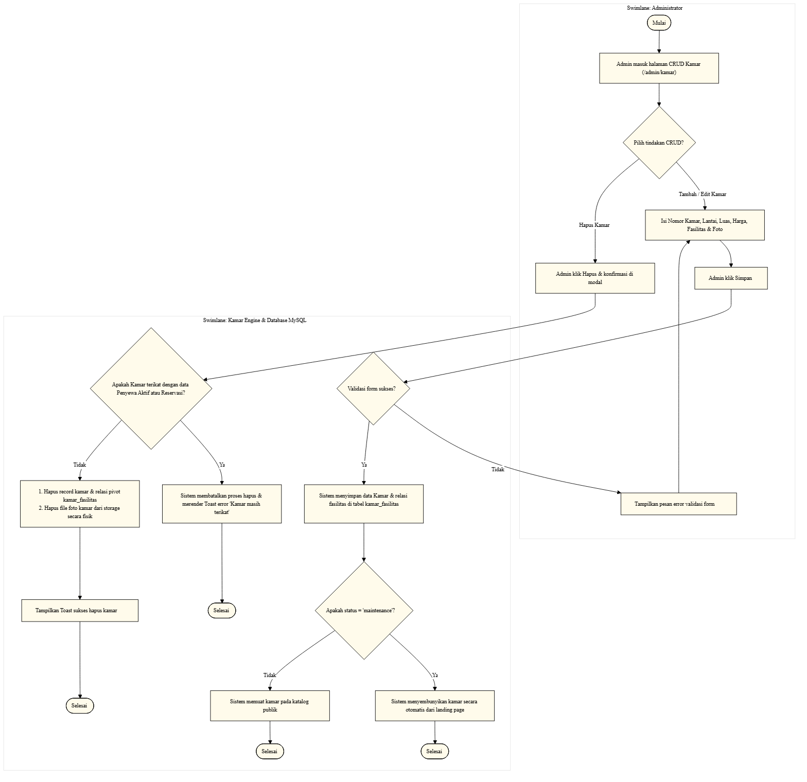

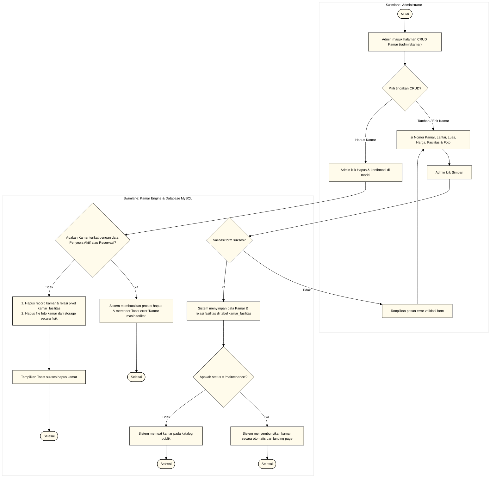
```mermaid
%%{init: {
  'theme': 'base',
  'themeVariables': {
    'primaryColor': '#FFFBEB',
    'primaryTextColor': '#000000',
    'primaryBorderColor': '#000000',
    'lineColor': '#000000',
    'secondaryColor': '#FDE047',
    'tertiaryColor': '#FFFFFF',
    'edgeLabelBackground': '#FFFFFF',
    'fontSize': '12px',
    'fontFamily': 'Inter, system-ui, sans-serif'
  }
}}%%
flowchart TD
    subgraph Swimlane_Admin ["Swimlane: Administrator"]
        Start([Mulai]) --> BukaMenuKamar["Admin masuk halaman CRUD Kamar (/admin/kamar)"]
        BukaMenuKamar --> PilihAksiKamar{"Pilih tindakan CRUD?"}
        
        PilihAksiKamar -- "Tambah / Edit Kamar" --> IsiDataKamar["Isi Nomor Kamar, Lantai, Luas, Harga, Fasilitas & Foto"]
        IsiDataKamar --> KlikSimpan["Admin klik Simpan"]
        TampilErrorKamar["Tampilkan pesan error validasi form"] --> IsiDataKamar
        
        PilihAksiKamar -- "Hapus Kamar" --> KlikHapusKamar["Admin klik Hapus & konfirmasi di modal"]
    end

    subgraph Swimlane_Backend ["Swimlane: Kamar Engine & Database MySQL"]
        KlikSimpan --> ValidasiFormKamar{"Validasi form sukses?"}
        ValidasiFormKamar -- Tidak --> TampilErrorKamar
        
        ValidasiFormKamar -- Ya --> SimpanKamarDB["Sistem menyimpan data Kamar & relasi fasilitas di tabel kamar_fasilitas"]
        SimpanKamarDB --> CekStatusKamar{"Apakah status = 'maintenance'?"}
        CekStatusKamar -- Ya --> HideKatalog["Sistem menyembunyikan kamar secara otomatis dari landing page"]
        CekStatusKamar -- Tidak --> ShowKatalog["Sistem memuat kamar pada katalog publik"]
        HideKatalog --> SelesaiHide([Selesai])
        ShowKatalog --> SelesaiShow([Selesai])
        
        KlikHapusKamar --> CekKamarTerikat{"Apakah Kamar terikat dengan data Penyewa Aktif atau Reservasi?"}
        CekKamarTerikat -- Ya --> BlockDeleteKamar["Sistem membatalkan proses hapus & merender Toast error 'Kamar masih terikat'"]
        BlockDeleteKamar --> SelesaiBlock([Selesai])
        
        CekKamarTerikat -- Tidak --> HapusKamarDB["1. Hapus record kamar & relasi pivot kamar_fasilitas<br>2. Hapus file foto kamar dari storage secara fisik"]
        HapusKamarDB --> TampilSuksesHapus["Tampilkan Toast sukses hapus kamar"]
        TampilSuksesHapus --> SelesaiHapus([Selesai])
    end
```

---

### 2.15. Activity Diagram 15: Manajemen Penyewa & Validasi Kontrak (Admin)
Diagram ini menggambarkan pengelolaan data biodata penyewa kost oleh administrator, termasuk validasi keamanan reaktivasi kontrak terhadap status unit kamar, serta pencegahan penghapusan data jika memiliki riwayat transaksi tagihan.

* **Controller Terkait**: [PenyewaController](file:///c:/xampp/htdocs/asri-boarding-house/app/Http/Controllers/Admin/PenyewaController.php) (method: `store`, `update`, `destroy`)
* **Model Terkait**: [Penyewa](file:///c:/xampp/htdocs/asri-boarding-house/app/Models/Penyewa.php), [User](file:///c:/xampp/htdocs/asri-boarding-house/app/Models/User.php), [Kamar](file:///c:/xampp/htdocs/asri-boarding-house/app/Models/Kamar.php)
* **View Terkait**: [admin/penyewa/index.blade.php](file:///c:/xampp/htdocs/asri-boarding-house/resources/views/admin/penyewa/index.blade.php)
* **Pengujian Otomatis**: [AdminPenyewaCrudAuditTest](file:///c:/xampp/htdocs/asri-boarding-house/tests/Feature/AdminPenyewaCrudAuditTest.php)

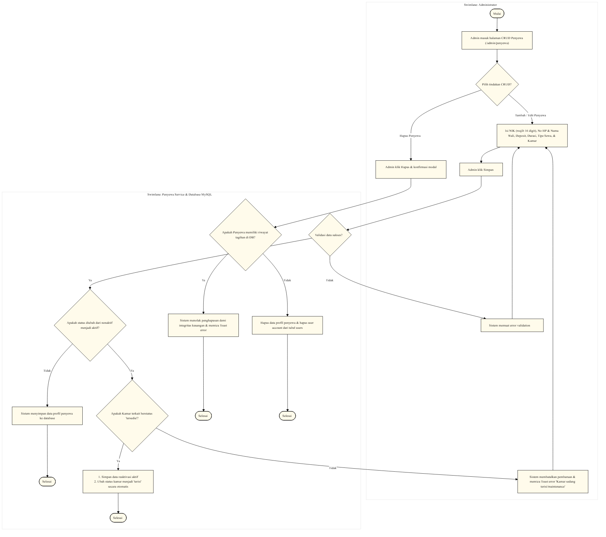

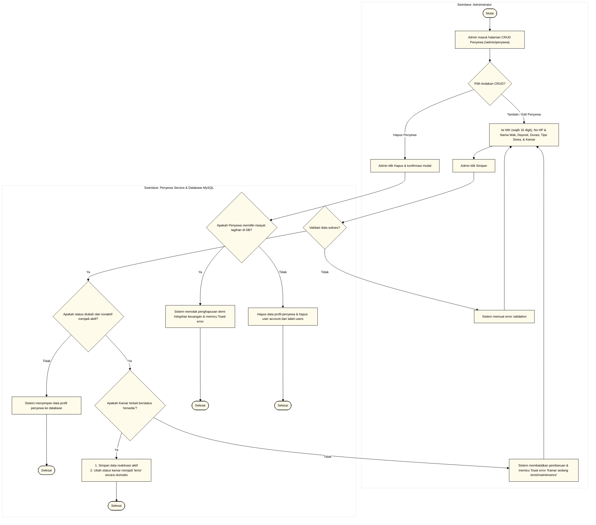
```mermaid
%%{init: {
  'theme': 'base',
  'themeVariables': {
    'primaryColor': '#FFFBEB',
    'primaryTextColor': '#000000',
    'primaryBorderColor': '#000000',
    'lineColor': '#000000',
    'secondaryColor': '#FDE047',
    'tertiaryColor': '#FFFFFF',
    'edgeLabelBackground': '#FFFFFF',
    'fontSize': '12px',
    'fontFamily': 'Inter, system-ui, sans-serif'
  }
}}%%
flowchart TD
    subgraph Swimlane_Admin ["Swimlane: Administrator"]
        Start([Mulai]) --> BukaMenuPenyewa["Admin masuk halaman CRUD Penyewa (/admin/penyewa)"]
        BukaMenuPenyewa --> PilihAksiPenyewa{"Pilih tindakan CRUD?"}
        
        PilihAksiPenyewa -- "Tambah / Edit Penyewa" --> IsiFormPenyewa["Isi NIK (wajib 16 digit), No HP & Nama Wali, Deposit, Durasi, Tipe Sewa, & Kamar"]
        IsiFormPenyewa --> KlikSimpanPenyewa["Admin klik Simpan"]
        TampilErrorPenyewa["Sistem memuat error validation"] --> IsiFormPenyewa
        BlockReaktivasi["Sistem membatalkan pembaruan & memicu Toast error 'Kamar sedang terisi/maintenance'"] --> IsiFormPenyewa
        
        PilihAksiPenyewa -- "Hapus Penyewa" --> KlikHapusPenyewa["Admin klik Hapus & konfirmasi modal"]
    end

    subgraph Swimlane_Backend ["Swimlane: Penyewa Service & Database MySQL"]
        KlikSimpanPenyewa --> ValidasiPenyewaForm{"Validasi data sukses?"}
        ValidasiPenyewaForm -- Tidak --> TampilErrorPenyewa
        
        ValidasiPenyewaForm -- Ya --> CekReaktivasi{"Apakah status diubah dari nonaktif menjadi aktif?"}
        CekReaktivasi -- Tidak --> SimpanDataPenyewa["Sistem menyimpan data profil penyewa ke database"]
        SimpanDataPenyewa --> SelesaiSave([Selesai])
        
        CekReaktivasi -- Ya --> CekKetersediaanKamar{"Apakah Kamar terkait berstatus 'tersedia'?"}
        CekKetersediaanKamar -- Tidak --> BlockReaktivasi
        CekKetersediaanKamar -- Ya --> SimpanReaktivasi["1. Simpan data reaktivasi aktif<br>2. Ubah status kamar menjadi 'terisi' secara otomatis"]
        SimpanReaktivasi --> SelesaiReaktivasi([Selesai])
        
        KlikHapusPenyewa --> CekRiwayatTagihan{"Apakah Penyewa memiliki riwayat tagihan di DB?"}
        CekRiwayatTagihan -- Ya --> BlockDeletePenyewa["Sistem menolak penghapusan demi integritas keuangan & memicu Toast error"]
        BlockDeletePenyewa --> SelesaiBlock([Selesai])
        
        CekRiwayatTagihan -- Tidak --> HapusPenyewaDB["Hapus data profil penyewa & hapus user account dari tabel users"]
        HapusPenyewaDB --> SelesaiHapus([Selesai])
    end
```

---

### 2.16. Activity Diagram 16: Google OAuth Login & Kelengkapan Profil (User / Guest)
Diagram ini menjelaskan alur masuk portal menggunakan layanan Google OAuth (Laravel Socialite), penolakan akun bertipe Admin, penapisan akses otomatis menggunakan middleware `EnsureProfileIsComplete`, serta validasi keunikan nomor WhatsApp.

* **Controller Terkait**: [SocialiteController](file:///c:/xampp/htdocs/asri-boarding-house/app/Http/Controllers/Auth/SocialiteController.php)
* **Middleware Terkait**: [EnsureProfileIsComplete](file:///c:/xampp/htdocs/asri-boarding-house/app/Http/Middleware/EnsureProfileIsComplete.php)
* **View Terkait**: [auth/complete-profile.blade.php](file:///c:/xampp/htdocs/asri-boarding-house/resources/views/auth/complete-profile.blade.php)
* **Pengujian Otomatis**: [SocialiteLoginTest](file:///c:/xampp/htdocs/asri-boarding-house/tests/Feature/Auth/SocialiteLoginTest.php)

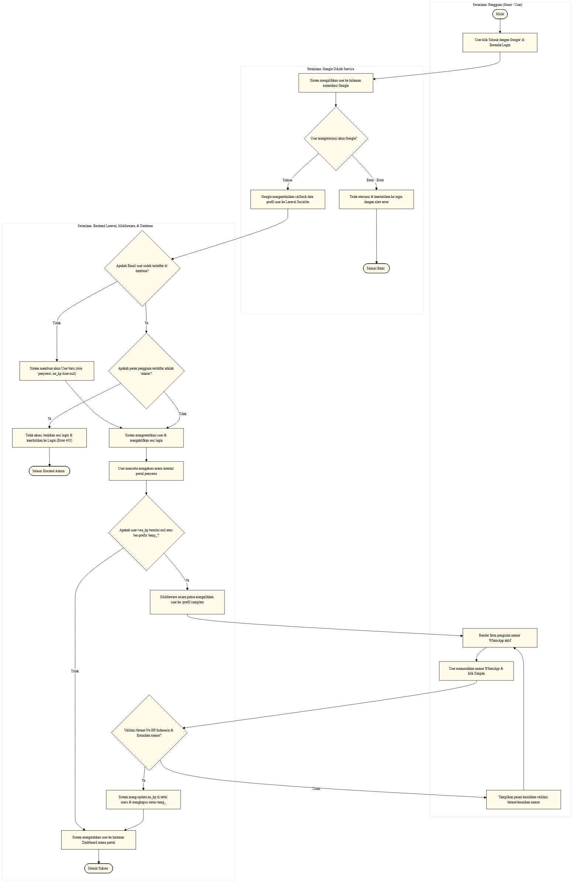

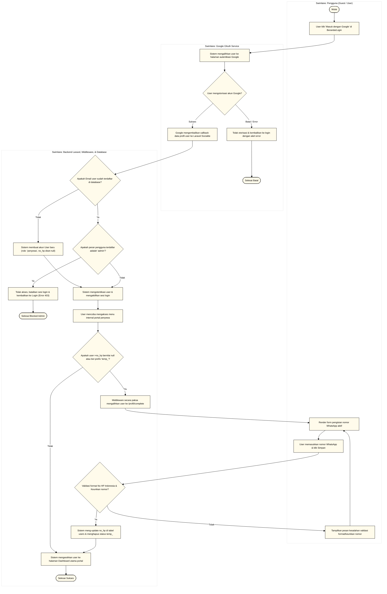
```mermaid
%%{init: {
  'theme': 'base',
  'themeVariables': {
    'primaryColor': '#FFFBEB',
    'primaryTextColor': '#000000',
    'primaryBorderColor': '#000000',
    'lineColor': '#000000',
    'secondaryColor': '#FDE047',
    'tertiaryColor': '#FFFFFF',
    'edgeLabelBackground': '#FFFFFF',
    'fontSize': '12px',
    'fontFamily': 'Inter, system-ui, sans-serif'
  }
}}%%
flowchart TD
    subgraph Swimlane_User ["Swimlane: Pengguna (Guest / User)"]
        Start([Mulai]) --> KlikGoogle["User klik 'Masuk dengan Google' di Beranda/Login"]
        TampilFormHp["Render form pengisian nomor WhatsApp aktif"] --> InputNoHp["User memasukkan nomor WhatsApp & klik Simpan"]
        TampilErrorHp["Tampilkan pesan kesalahan validasi format/keunikan nomor"] --> TampilFormHp
    end

    subgraph Swimlane_Google ["Swimlane: Google OAuth Service"]
        KlikGoogle --> RedirectGoogle["Sistem mengalihkan user ke halaman autentikasi Google"]
        RedirectGoogle --> AutentikasiGoogle{"User mengotorisasi akun Google?"}
        AutentikasiGoogle -- "Batal / Error" --> RejectOauthGoogle["Tolak otorisasi & kembalikan ke login dengan alert error"]
        RejectOauthGoogle --> SelesaiBatalGoogle([Selesai Batal])
        AutentikasiGoogle -- "Sukses" --> CallbackSocialite["Google mengembalikan callback data profil user ke Laravel Socialite"]
    end

    subgraph Swimlane_Backend ["Swimlane: Backend Laravel, Middleware, & Database"]
        CallbackSocialite --> CekEmailTerdaftar{"Apakah Email user sudah terdaftar di database?"}
        
        CekEmailTerdaftar -- Ya --> CekAdminGuardrail{"Apakah peran pengguna terdaftar adalah 'admin'?"}
        CekAdminGuardrail -- Ya --> RejectOAuth["Tolak akses, batalkan sesi login & kembalikan ke Login (Error 403)"]
        RejectOAuth --> SelesaiAdminGuard([Selesai Blocked Admin])
        
        CekAdminGuardrail -- Tidak --> LoginUserExist["Sistem mengotentikasi user & mengaktifkan sesi login"]
        
        CekEmailTerdaftar -- Tidak --> BuatUserBaru["Sistem membuat akun User baru (role: 'penyewa', no_hp diset null)"]
        BuatUserBaru --> LoginUserExist
        
        LoginUserExist --> AksesInternal["User mencoba mengakses menu internal portal penyewa"]
        AksesInternal --> FilterMiddleware{"Apakah user->no_hp bernilai null atau ber-prefix 'temp_'?"}
        
        FilterMiddleware -- Ya --> RedirectLengkapi["Middleware secara paksa mengalihkan user ke /profil/complete"]
        RedirectLengkapi --> TampilFormHp
        
        InputNoHp --> ValidasiNoHp{"Validasi format No HP Indonesia & Keunikan nomor?"}
        ValidasiNoHp -- Tidak --> TampilErrorHp
        ValidasiNoHp -- Ya --> SimpanNoHpDB["Sistem meng-update no_hp di tabel users & menghapus status temp_"]
        SimpanNoHpDB --> RedirectDashboard["Sistem mengarahkan user ke halaman Dashboard utama portal"]
        
        FilterMiddleware -- Tidak --> RedirectDashboard
        RedirectDashboard --> SelesaiOAuth([Selesai Sukses])
    end
```

---

### 2.17. Activity Diagram 17: Pembatalan & Penghapusan Permanen Reservasi Batal (Admin & Calon Penyewa)
Diagram ini menjelaskan siklus pembatalan manual reservasi yang belum dibayar oleh calon penyewa atau dibatalkan oleh admin, serta penanganan khusus admin untuk menghapus reservasi batal secara permanen beserta percakapan di dalamnya (*cascade deletion*).

* **Controller Terkait**: [Penyewa\ReservasiController](file:///c:/xampp/htdocs/asri-boarding-house/app/Http/Controllers/Penyewa/ReservasiController.php) (method: `batal`), [Admin\ReservasiController](file:///c:/xampp/htdocs/asri-boarding-house/app/Http/Controllers/Admin/ReservasiController.php) (method: `batal`, `destroy`)
* **Model Terkait**: [Reservasi](file:///c:/xampp/htdocs/asri-boarding-house/app/Models/Reservasi.php), [ChatMessage](file:///c:/xampp/htdocs/asri-boarding-house/app/Models/ChatMessage.php), [Kamar](file:///c:/xampp/htdocs/asri-boarding-house/app/Models/Kamar.php)
* **View Terkait**: [admin/reservasi/show.blade.php](file:///c:/xampp/htdocs/asri-boarding-house/resources/views/admin/reservasi/show.blade.php)
* **Pengujian Otomatis**: [AdminReservasiWorkflowTest](file:///c:/xampp/htdocs/asri-boarding-house/tests/Feature/AdminReservasiWorkflowTest.php)

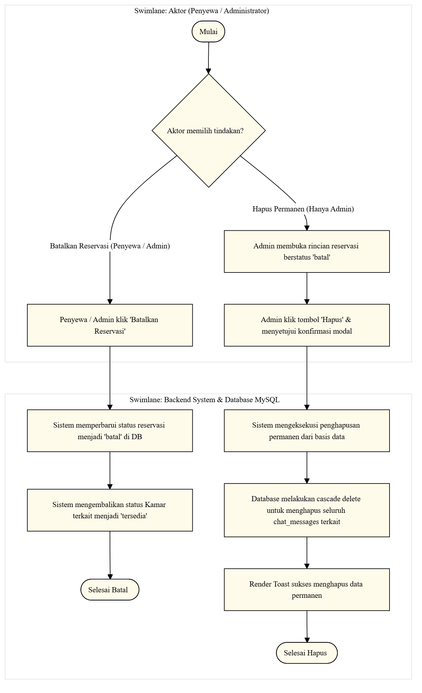

```mermaid
%%{init: {
  'theme': 'base',
  'themeVariables': {
    'primaryColor': '#FFFBEB',
    'primaryTextColor': '#000000',
    'primaryBorderColor': '#000000',
    'lineColor': '#000000',
    'secondaryColor': '#FDE047',
    'tertiaryColor': '#FFFFFF',
    'edgeLabelBackground': '#FFFFFF',
    'fontSize': '12px',
    'fontFamily': 'Inter, system-ui, sans-serif'
  }
}}%%
flowchart TD
    subgraph Swimlane_Actors ["Swimlane: Aktor (Penyewa / Administrator)"]
        Start([Mulai]) --> PilihTindakan{"Aktor memilih tindakan?"}
        
        %% Alur Pembatalan
        PilihTindakan -- "Batalkan Reservasi (Penyewa / Admin)" --> KlikTombolBatal["Penyewa / Admin klik 'Batalkan Reservasi'"]
        
        %% Alur Hapus Permanen
        PilihTindakan -- "Hapus Permanen (Hanya Admin)" --> BukaDetailReservasiBatal["Admin membuka rincian reservasi berstatus 'batal'"]
        BukaDetailReservasiBatal --> KlikHapusPermanen["Admin klik tombol 'Hapus' & menyetujui konfirmasi modal"]
    end

    subgraph Swimlane_Backend ["Swimlane: Backend System & Database MySQL"]
        KlikTombolBatal --> UpdateStatusBatal["Sistem memperbarui status reservasi menjadi 'batal' di DB"]
        UpdateStatusBatal --> LepasKunciKamar["Sistem mengembalikan status Kamar terkait menjadi 'tersedia'"]
        LepasKunciKamar --> SelesaiBatal([Selesai Batal])
        
        KlikHapusPermanen --> ExecuteHapus["Sistem mengeksekusi penghapusan permanen dari basis data"]
        ExecuteHapus --> CascadeChat["Database melakukan cascade delete untuk menghapus seluruh chat_messages terkait"]
        CascadeChat --> TampilSuksesHapusReservasi["Render Toast sukses menghapus data permanen"]
        TampilSuksesHapusReservasi --> SelesaiHapus([Selesai Hapus])
    end
```

---

### 2.18. Activity Diagram 18: Pendaftaran Penyewa Offline / WhatsApp Direct & Input Deposit (Admin)
Diagram ini menjelaskan alur admin ketika mendaftarkan penyewa secara manual (offline / via WhatsApp) langsung ke sistem backend, integrasi akun lama/baru (*Existing Account Check*), penentuan harga sewa personal, pengisian deposit, dan pengiriman kredensial via Fonnte WA.

* **Controller Terkait**: [Admin\PenyewaController](file:///c:/xampp/htdocs/asri-boarding-house/app/Http/Controllers/Admin/PenyewaController.php) (method: `store`, `create`)
* **Model Terkait**: [Penyewa](file:///c:/xampp/htdocs/asri-boarding-house/app/Models/Penyewa.php), [User](file:///c:/xampp/htdocs/asri-boarding-house/app/Models/User.php), [Kamar](file:///c:/xampp/htdocs/asri-boarding-house/app/Models/Kamar.php)
* **Service Terkait**: [BillingService](file:///c:/xampp/htdocs/asri-boarding-house/app/Services/BillingService.php), [FonnteService](file:///c:/xampp/htdocs/asri-boarding-house/app/Services/FonnteService.php)
* **View Terkait**: [admin/penyewa/create.blade.php](file:///c:/xampp/htdocs/asri-boarding-house/resources/views/admin/penyewa/create.blade.php)
* **Pengujian Otomatis**: [AdminPenyewaCrudAuditTest](file:///c:/xampp/htdocs/asri-boarding-house/tests/Feature/AdminPenyewaCrudAuditTest.php)

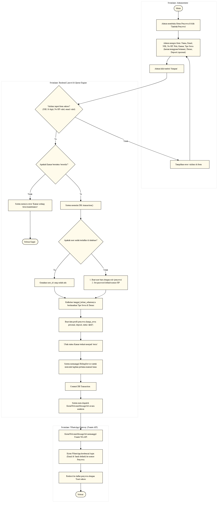

```mermaid
%%{init: {
  'theme': 'base',
  'themeVariables': {
    'primaryColor': '#FFFBEB',
    'primaryTextColor': '#000000',
    'primaryBorderColor': '#000000',
    'lineColor': '#000000',
    'secondaryColor': '#FDE047',
    'tertiaryColor': '#FFFFFF',
    'edgeLabelBackground': '#FFFFFF',
    'fontSize': '12px',
    'fontFamily': 'Inter, system-ui, sans-serif'
  }
}}%%
flowchart TD
    subgraph Swimlane_Admin ["Swimlane: Administrator"]
        Start([Mulai]) --> MasukForm["Admin membuka Menu Penyewa & klik 'Tambah Penyewa'"]
        MasukForm --> IsiForm["Admin mengisi form: Nama, Email, NIK, No HP, Wali, Kamar, Tipe Sewa (harian/mingguan/bulanan), Durasi, Deposit (opsional)"]
        IsiForm --> KlikSimpan["Admin klik tombol 'Simpan'"]
        TampilValidationError["Tampilkan error validasi di form"] --> IsiForm
    end

    subgraph Swimlane_Backend ["Swimlane: Backend Laravel & Queue Engine"]
        KlikSimpan --> ValidasiForm{"Validasi input form sukses?<br>(NIK 16 digit, No HP valid, email valid)"}
        ValidasiForm -- Tidak --> TampilValidationError
        
        ValidasiForm -- Ya --> CekKamar{"Apakah Kamar berstatus 'tersedia'?"}
        CekKamar -- Tidak --> BlockPendaftaran["Sistem memicu error 'Kamar sedang terisi/maintenance'"]
        BlockPendaftaran --> SelesaiBlock([Selesai Gagal])
        
        CekKamar -- Ya --> DbTx["Sistem memulai DB::transaction()"]
        DbTx --> CekUserEksis{"Apakah user sudah terdaftar di database?"}
        
        CekUserEksis -- Ya --> PakaiUserEksis["Gunakan user_id yang sudah ada"]
        CekUserEksis -- Tidak --> CreateUser["1. Buat user baru dengan role 'penyewa'<br>2. Set password default nomor HP"]
        
        PakaiUserEksis --> HitungKeluar["Kalkulasi tanggal_keluar_seharusnya berdasarkan Tipe Sewa & Durasi"]
        CreateUser --> HitungKeluar
        
        HitungKeluar --> CreatePenyewa["Buat data profil penyewa (harga_sewa personal, deposit, status 'aktif')"]
        CreatePenyewa --> UpdateKamarStatus["Ubah status Kamar terkait menjadi 'terisi'"]
        UpdateKamarStatus --> CallBillingManual["Sistem memanggil BillingService untuk mencatat tagihan pertama manual lunas"]
        CallBillingManual --> CommitTx["Commit DB Transaction"]
        
        CommitTx --> DispatchJob["Sistem men-dispatch KirimWelcomeMessageJob secara asinkron"]
    end

    subgraph Swimlane_Fonnte ["Swimlane: WhatsApp Gateway (Fonnte API)"]
        DispatchJob --> PanggilFonnte["KirimWelcomeMessageJob memanggil Fonnte WA API"]
        PanggilFonnte --> KirimWA["Kirim WhatsApp kredensial login (Email & Sandi default) ke nomor Penyewa"]
        KirimWA --> TampilSukses["Redirect ke daftar penyewa dengan Toast sukses"]
        TampilSukses --> Selesai([Selesai])
    end
```

---

### 2.19. Activity Diagram 19: Callback Webhook Midtrans & Verifikasi Signature (Sistem & Midtrans)
Diagram ini menjelaskan alur pemrosesan webhook callback asinkron dari Midtrans Snap API untuk memperbarui status transaksi secara otomatis, normalisasi format nominal, penjaminan idempotensi, dan dukungan status `pending` Virtual Account.

* **Controller Terkait**: [MidtransCallbackController](file:///c:/xampp/htdocs/asri-boarding-house/app/Http/Controllers/Api/MidtransCallbackController.php), [MidtransReservasiCallbackController](file:///c:/xampp/htdocs/asri-boarding-house/app/Http/Controllers/Api/MidtransReservasiCallbackController.php)
* **Model Terkait**: [Tagihan](file:///c:/xampp/htdocs/asri-boarding-house/app/Models/Tagihan.php), [Reservasi](file:///c:/xampp/htdocs/asri-boarding-house/app/Models/Reservasi.php), [Pembayaran](file:///c:/xampp/htdocs/asri-boarding-house/app/Models/Pembayaran.php)
* **Service Terkait**: [NotifikasiService](file:///c:/xampp/htdocs/asri-boarding-house/app/Services/NotifikasiService.php)
* **Pengujian Otomatis**: [ReservasiControllerTest](file:///c:/xampp/htdocs/asri-boarding-house/tests/Feature/ReservasiControllerTest.php), [AdminTagihanTest](file:///c:/xampp/htdocs/asri-boarding-house/tests/Feature/AdminTagihanTest.php)

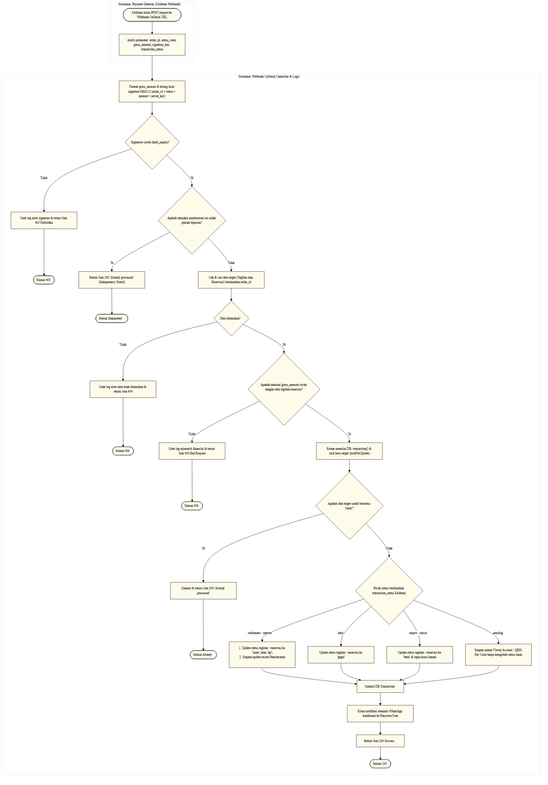

```mermaid
%%{init: {
  'theme': 'base',
  'themeVariables': {
    'primaryColor': '#FFFBEB',
    'primaryTextColor': '#000000',
    'primaryBorderColor': '#000000',
    'lineColor': '#000000',
    'secondaryColor': '#FDE047',
    'tertiaryColor': '#FFFFFF',
    'edgeLabelBackground': '#FFFFFF',
    'fontSize': '12px',
    'fontFamily': 'Inter, system-ui, sans-serif'
  }
}}%%
flowchart TD
    subgraph Swimlane_Midtrans ["Swimlane: Payment Gateway (Midtrans Webhook)"]
        Start([Midtrans kirim POST request ke Webhook Callback URL]) --> AmbilData["Ambil parameter: order_id, status_code, gross_amount, signature_key, transaction_status"]
    end

    subgraph Swimlane_Controller ["Swimlane: Webhook Callback Controller & Logic"]
        AmbilData --> HitungSignature["Format gross_amount & hitung local signature SHA512 (order_id + status + amount + server_key)"]
        HitungSignature --> VerifSignature{"Signature cocok (hash_equals)?"}
        
        VerifSignature -- Tidak --> LogErrorSignature["Catat log error signature & return Json 403 Forbidden"]
        LogErrorSignature --> Selesai403([Selesai 403])
        
        VerifSignature -- Ya --> Idempotensi{"Apakah transaksi pembayaran ini sudah pernah diproses?"}
        Idempotensi -- Ya --> ReturnOkProcessed["Return Json 200 'Already processed' (Idempotency Guard)"]
        ReturnOkProcessed --> SelesaiIdem([Selesai Idempotent])
        
        Idempotensi -- Tidak --> KueriEntitas["Cek & cari data target (Tagihan atau Reservasi) berdasarkan order_id"]
        KueriEntitas --> CekEntitasAda{"Data ditemukan?"}
        
        CekEntitasAda -- Tidak --> LogErrorNotFound["Catat log error data tidak ditemukan & return Json 404"]
        LogErrorNotFound --> Selesai404([Selesai 404])
        
        CekEntitasAda -- Ya --> VerifNominal{"Apakah nominal gross_amount cocok dengan total tagihan/reservasi?"}
        VerifNominal -- Tidak --> LogErrorMismatch["Catat log mismatch financial & return Json 400 Bad Request"]
        LogErrorMismatch --> Selesai400([Selesai 400])
        
        VerifNominal -- Ya --> DbTx["Sistem memulai DB::transaction() & lock baris target (lockForUpdate)"]
        DbTx --> CekLunas{"Apakah data target sudah berstatus 'lunas'?"}
        
        CekLunas -- Ya --> CommitUdahLunas["Commit & return Json 200 'Already processed'"]
        CommitUdahLunas --> SelesaiAlready([Selesai Already])
        
        CekLunas -- Tidak --> MapStatus{"Pecah status berdasarkan transaction_status Midtrans"}
        
        MapStatus -- "settlement / capture" --> UpdateLunas["1. Update status tagihan / reservasi ke 'lunas' (atau 'dp')<br>2. Simpan/update record Pembayaran"]
        MapStatus -- "deny" --> UpdateGagal["Update status tagihan / reservasi ke 'gagal'"]
        MapStatus -- "expire / cancel" --> UpdateBatal["Update status tagihan / reservasi ke 'batal' & lepas kunci kamar"]
        MapStatus -- "pending" --> SimpanInstruksiVA["Simpan nomor Virtual Account / QRIS Pay Code tanpa mengubah status lunas"]
        
        UpdateLunas --> CommitUpdate["Commit DB Transaction"]
        UpdateGagal --> CommitUpdate
        UpdateBatal --> CommitUpdate
        SimpanInstruksiVA --> CommitUpdate
        
        CommitUpdate --> KirimNotifWA["Kirim notifikasi otomatis WhatsApp konfirmasi ke Penyewa/User"]
        KirimNotifWA --> ReturnOk["Return Json 200 Success"]
        ReturnOk --> SelesaiOk([Selesai 200])
    end
```

---

### 2.20. Activity Diagram 20: Manajemen Master Fasilitas & Proteksi Penghapusan (Admin)
Diagram ini menggambarkan pengelolaan data master fasilitas kost oleh administrator, termasuk mekanisme pengamanan relasi database (*relational safety constraints*) dan *auto-invalidation* sistem cache.

* **Controller Terkait**: [Admin\FasilitasController](file:///c:/xampp/htdocs/asri-boarding-house/app/Http/Controllers/Admin/FasilitasController.php)
* **Model Terkait**: [Fasilitas](file:///c:/xampp/htdocs/asri-boarding-house/app/Models/Fasilitas.php), [Kamar](file:///c:/xampp/htdocs/asri-boarding-house/app/Models/Kamar.php)
* **View Terkait**: [admin/fasilitas/index.blade.php](file:///c:/xampp/htdocs/asri-boarding-house/resources/views/admin/fasilitas/index.blade.php)
* **Pengujian Otomatis**: [AdminFasilitasCrudTest](file:///c:/xampp/htdocs/asri-boarding-house/tests/Feature/AdminFasilitasCrudTest.php), [FasilitasCacheTest](file:///c:/xampp/htdocs/asri-boarding-house/tests/Feature/FasilitasCacheTest.php), [FasilitasRenderingTest](file:///c:/xampp/htdocs/asri-boarding-house/tests/Feature/FasilitasRenderingTest.php)

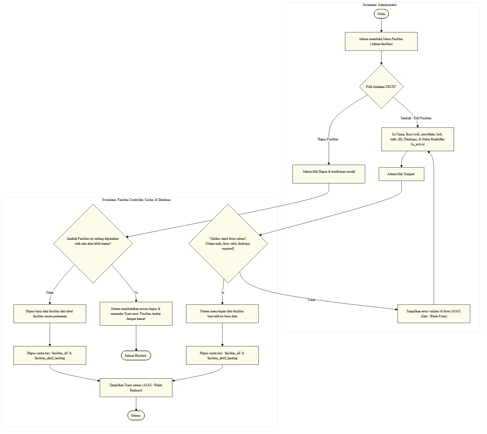

```mermaid
%%{init: {
  'theme': 'base',
  'themeVariables': {
    'primaryColor': '#FFFBEB',
    'primaryTextColor': '#000000',
    'primaryBorderColor': '#000000',
    'lineColor': '#000000',
    'secondaryColor': '#FDE047',
    'tertiaryColor': '#FFFFFF',
    'edgeLabelBackground': '#FFFFFF',
    'fontSize': '12px',
    'fontFamily': 'Inter, system-ui, sans-serif'
  }
}}%%
flowchart TD
    subgraph Swimlane_Admin ["Swimlane: Administrator"]
        Start([Mulai]) --> BukaMenuFasilitas["Admin membuka Menu Fasilitas (/admin/fasilitas)"]
        BukaMenuFasilitas --> PilihAksiFasilitas{"Pilih tindakan CRUD?"}
        
        PilihAksiFasilitas -- "Tambah / Edit Fasilitas" --> FormFasilitas["Isi Nama, Ikon (wifi, snowflake, bolt, bath, dll), Deskripsi, & Status Keaktifan (is_active)"]
        FormFasilitas --> SimpanFasilitas["Admin klik 'Simpan'"]
        TampilValidationError["Tampilkan error validasi di form (AJAX Alert / Blade Form)"] --> FormFasilitas
        
        PilihAksiFasilitas -- "Hapus Fasilitas" --> KlikHapusFasilitas["Admin klik Hapus & konfirmasi modal"]
    end

    subgraph Swimlane_Backend ["Swimlane: Fasilitas Controller, Cache, & Database"]
        SimpanFasilitas --> ValidasiFasilitas{"Validasi input form sukses?<br>(Nama unik, ikon valid, deskripsi required)"}
        ValidasiFasilitas -- Tidak --> TampilValidationError
        
        ValidasiFasilitas -- Ya --> SimpanFasilitasDB["Sistem menyimpan data fasilitas baru/edit ke basis data"]
        SimpanFasilitasDB --> InvalCache["Hapus cache key: 'fasilitas_all' & 'fasilitas_aktif_landing'"]
        InvalCache --> TampilToastSukses["Tampilkan Toast sukses (AJAX / Blade Redirect)"]
        TampilToastSukses --> SelesaiSave([Selesai])
        
        KlikHapusFasilitas --> CekRelasiKamar{"Apakah Fasilitas ini sedang digunakan oleh satu atau lebih kamar?"}
        CekRelasiKamar -- Ya --> BlockDeleteFasilitas["Sistem membatalkan proses hapus & merender Toast error 'Fasilitas terikat dengan kamar'"]
        BlockDeleteFasilitas --> SelesaiBlock([Selesai Blocked])
        
        CekRelasiKamar -- Tidak --> HapusFasilitasDB["Hapus baris data fasilitas dari tabel fasilitas secara permanen"]
        HapusFasilitasDB --> InvalCacheHapus["Hapus cache key: 'fasilitas_all' & 'fasilitas_aktif_landing'"]
        InvalCacheHapus --> TampilToastSukses
    end
```

---

## 3. Code Mapping Spesifikasi Alur (Code Mapping)

Berikut adalah ringkasan pemetaan setiap alur aktivitas (Activity Diagram) ke Controller Laravel, Blade View, Basis Data, serta Test Case terkait:

| ID Diagram | Nama Alur Aktivitas | Controller Laravel | View Blade / Antarmuka | Aset Basis Data / Model | Test Case Verifikasi |
| :---: | :--- | :--- | :--- | :--- | :--- |
| **AD-01** | Pencarian & Cek Kamar | [LandingController](file:///c:/xampp/htdocs/asri-boarding-house/app/Http/Controllers/Public/LandingController.php) | [kamar-list.blade.php](file:///c:/xampp/htdocs/asri-boarding-house/resources/views/landing/kamar-list.blade.php) | [Kamar](file:///c:/xampp/htdocs/asri-boarding-house/app/Models/Kamar.php) | [KamarListRenderingTest](file:///c:/xampp/htdocs/asri-boarding-house/tests/Feature/KamarListRenderingTest.php) |
| **AD-02** | Pembuatan Reservasi | [ReservasiController](file:///c:/xampp/htdocs/asri-boarding-house/app/Http/Controllers/Penyewa/ReservasiController.php) | [landing/show.blade.php](file:///c:/xampp/htdocs/asri-boarding-house/resources/views/landing/show.blade.php) | [Reservasi](file:///c:/xampp/htdocs/asri-boarding-house/app/Models/Reservasi.php) | [ReservasiControllerTest](file:///c:/xampp/htdocs/asri-boarding-house/tests/Feature/ReservasiControllerTest.php) |
| **AD-03** | Pembayaran & Chat Reservasi | [ChatController](file:///c:/xampp/htdocs/asri-boarding-house/app/Http/Controllers/Api/ChatController.php) | [reservasi/chat-box.blade.php](file:///c:/xampp/htdocs/asri-boarding-house/resources/views/reservasi/chat-box.blade.php) | [ChatMessage](file:///c:/xampp/htdocs/asri-boarding-house/app/Models/ChatMessage.php) | [ReservasiControllerTest](file:///c:/xampp/htdocs/asri-boarding-house/tests/Feature/ReservasiControllerTest.php) |
| **AD-04** | Konfirmasi Reservasi | [Admin\ReservasiController](file:///c:/xampp/htdocs/asri-boarding-house/app/Http/Controllers/Admin/ReservasiController.php) | [admin/reservasi/show.blade.php](file:///c:/xampp/htdocs/asri-boarding-house/resources/views/admin/reservasi/show.blade.php) | [Penyewa](file:///c:/xampp/htdocs/asri-boarding-house/app/Models/Penyewa.php) | [AdminReservasiWorkflowTest](file:///c:/xampp/htdocs/asri-boarding-house/tests/Feature/AdminReservasiWorkflowTest.php) |
| **AD-05** | Billing Engine & Denda | [BillingService](file:///c:/xampp/htdocs/asri-boarding-house/app/Services/BillingService.php) | *Sistem Latar Belakang (Scheduler)* | [Tagihan](file:///c:/xampp/htdocs/asri-boarding-house/app/Models/Tagihan.php) | [BusinessPolicyEnforcementTest](file:///c:/xampp/htdocs/asri-boarding-house/tests/Feature/BusinessPolicyEnforcementTest.php) |
| **AD-06** | Pembayaran Tagihan | [Penyewa\TagihanController](file:///c:/xampp/htdocs/asri-boarding-house/app/Http/Controllers/Penyewa/TagihanController.php) | [penyewa/tagihan/show.blade.php](file:///c:/xampp/htdocs/asri-boarding-house/resources/views/penyewa/tagihan/show.blade.php) | [Pembayaran](file:///c:/xampp/htdocs/asri-boarding-house/app/Models/Pembayaran.php) | [AdminTagihanTest](file:///c:/xampp/htdocs/asri-boarding-house/tests/Feature/AdminTagihanTest.php) |
| **AD-07** | Pengaduan & Keluhan | [Penyewa\KeluhanController](file:///c:/xampp/htdocs/asri-boarding-house/app/Http/Controllers/Penyewa/KeluhanController.php) | [keluhan/create.blade.php](file:///c:/xampp/htdocs/asri-boarding-house/resources/views/penyewa/keluhan/create.blade.php) | [Keluhan](file:///c:/xampp/htdocs/asri-boarding-house/app/Models/Keluhan.php) | [KeluhanManagementTest](file:///c:/xampp/htdocs/asri-boarding-house/tests/Feature/KeluhanManagementTest.php) |
| **AD-08** | Laporan Keuangan & Kas | [Admin\LaporanController](file:///c:/xampp/htdocs/asri-boarding-house/app/Http/Controllers/Admin/LaporanController.php) | [admin/laporan/index.blade.php](file:///c:/xampp/htdocs/asri-boarding-house/resources/views/admin/laporan/index.blade.php) | [Pengeluaran](file:///c:/xampp/htdocs/asri-boarding-house/app/Models/Pengeluaran.php) | [AdminPengeluaranTest](file:///c:/xampp/htdocs/asri-boarding-house/tests/Feature/AdminPengeluaranTest.php) |
| **AD-09** | Manajemen Konten Publik | [GalleryController](file:///c:/xampp/htdocs/asri-boarding-house/app/Http/Controllers/Admin/GalleryController.php) | [admin/gallery/index.blade.php](file:///c:/xampp/htdocs/asri-boarding-house/resources/views/admin/gallery/index.blade.php) | [Gallery](file:///c:/xampp/htdocs/asri-boarding-house/app/Models/Gallery.php) | [AdminGalleryTest](file:///c:/xampp/htdocs/asri-boarding-house/tests/Feature/AdminGalleryTest.php) |
| **AD-10** | Tata Tertib / Peraturan | [PeraturanController](file:///c:/xampp/htdocs/asri-boarding-house/app/Http/Controllers/Admin/PeraturanController.php) | [penyewa/peraturan.blade.php](file:///c:/xampp/htdocs/asri-boarding-house/resources/views/penyewa/peraturan.blade.php) | [Peraturan](file:///c:/xampp/htdocs/asri-boarding-house/app/Models/Peraturan.php) | [PenyewaPeraturanTest](file:///c:/xampp/htdocs/asri-boarding-house/tests/Feature/PenyewaPeraturanTest.php) |
| **AD-11** | Checkout & Deposit | [PenyewaController](file:///c:/xampp/htdocs/asri-boarding-house/app/Http/Controllers/Admin/PenyewaController.php) | [admin/penyewa/index.blade.php](file:///c:/xampp/htdocs/asri-boarding-house/resources/views/admin/penyewa/index.blade.php) | [Kamar](file:///c:/xampp/htdocs/asri-boarding-house/app/Models/Kamar.php), [Penyewa](file:///c:/xampp/htdocs/asri-boarding-house/app/Models/Penyewa.php) | [AdminPenyewaCrudAuditTest](file:///c:/xampp/htdocs/asri-boarding-house/tests/Feature/AdminPenyewaCrudAuditTest.php) |
| **AD-12** | Widget Guest Chat | [GuestChatApiController](file:///c:/xampp/htdocs/asri-boarding-house/app/Http/Controllers/Api/GuestChatApiController.php) | [landing/index.blade.php](file:///c:/xampp/htdocs/asri-boarding-house/resources/views/landing/index.blade.php) (widget) | [GuestChatMessage](file:///c:/xampp/htdocs/asri-boarding-house/app/Models/GuestChatMessage.php) | [GuestChatTest](file:///c:/xampp/htdocs/asri-boarding-house/tests/Feature/GuestChatTest.php) |
| **AD-13** | Keamanan Login & Sandi | [AdminLoginController](file:///c:/xampp/htdocs/asri-boarding-house/app/Http/Controllers/Auth/AdminLoginController.php), [PenyewaLoginController](file:///c:/xampp/htdocs/asri-boarding-house/app/Http/Controllers/Auth/PenyewaLoginController.php) | [auth/admin-login.blade.php](file:///c:/xampp/htdocs/asri-boarding-house/resources/views/auth/admin-login.blade.php), [auth/penyewa-login.blade.php](file:///c:/xampp/htdocs/asri-boarding-house/resources/views/auth/penyewa-login.blade.php) | [User](file:///c:/xampp/htdocs/asri-boarding-house/app/Models/User.php) | [AuthenticationTest](file:///c:/xampp/htdocs/asri-boarding-house/tests/Feature/Auth/AuthenticationTest.php) |
| **AD-14** | Manajemen Kamar (CRUD) | [KamarController](file:///c:/xampp/htdocs/asri-boarding-house/app/Http/Controllers/Admin/KamarController.php) | [admin/kamar/index.blade.php](file:///c:/xampp/htdocs/asri-boarding-house/resources/views/admin/kamar/index.blade.php) | [Kamar](file:///c:/xampp/htdocs/asri-boarding-house/app/Models/Kamar.php) | [AdminKamarCrudTest](file:///c:/xampp/htdocs/asri-boarding-house/tests/Feature/AdminKamarCrudTest.php) |
| **AD-15** | Manajemen Penyewa (CRUD) | [PenyewaController](file:///c:/xampp/htdocs/asri-boarding-house/app/Http/Controllers/Admin/PenyewaController.php) | [admin/penyewa/index.blade.php](file:///c:/xampp/htdocs/asri-boarding-house/resources/views/admin/penyewa/index.blade.php) | [Penyewa](file:///c:/xampp/htdocs/asri-boarding-house/app/Models/Penyewa.php) | [AdminPenyewaCrudAuditTest](file:///c:/xampp/htdocs/asri-boarding-house/tests/Feature/AdminPenyewaCrudAuditTest.php) |
| **AD-16** | Google OAuth & Profil | [SocialiteController](file:///c:/xampp/htdocs/asri-boarding-house/app/Http/Controllers/Auth/SocialiteController.php) | [complete-profile.blade.php](file:///c:/xampp/htdocs/asri-boarding-house/resources/views/auth/complete-profile.blade.php) | [User](file:///c:/xampp/htdocs/asri-boarding-house/app/Models/User.php) | [SocialiteLoginTest](file:///c:/xampp/htdocs/asri-boarding-house/tests/Feature/Auth/SocialiteLoginTest.php) |
| **AD-17** | Hapus Reservasi Batal | [Admin\ReservasiController](file:///c:/xampp/htdocs/asri-boarding-house/app/Http/Controllers/Admin/ReservasiController.php) | [admin/reservasi/show.blade.php](file:///c:/xampp/htdocs/asri-boarding-house/resources/views/admin/reservasi/show.blade.php) | [Reservasi](file:///c:/xampp/htdocs/asri-boarding-house/app/Models/Reservasi.php) | [AdminReservasiWorkflowTest](file:///c:/xampp/htdocs/asri-boarding-house/tests/Feature/AdminReservasiWorkflowTest.php) |
| **AD-18** | Penyewa Offline & Deposit | [PenyewaController](file:///c:/xampp/htdocs/asri-boarding-house/app/Http/Controllers/Admin/PenyewaController.php) | [admin/penyewa/create.blade.php](file:///c:/xampp/htdocs/asri-boarding-house/resources/views/admin/penyewa/create.blade.php) | [Penyewa](file:///c:/xampp/htdocs/asri-boarding-house/app/Models/Penyewa.php), [User](file:///c:/xampp/htdocs/asri-boarding-house/app/Models/User.php) | [AdminPenyewaCrudAuditTest](file:///c:/xampp/htdocs/asri-boarding-house/tests/Feature/AdminPenyewaCrudAuditTest.php) |
| **AD-19** | Callback Webhook Midtrans | [MidtransCallbackController](file:///c:/xampp/htdocs/asri-boarding-house/app/Http/Controllers/Api/MidtransCallbackController.php) | *Sistem Webhook API* | [Pembayaran](file:///c:/xampp/htdocs/asri-boarding-house/app/Models/Pembayaran.php), [Tagihan](file:///c:/xampp/htdocs/asri-boarding-house/app/Models/Tagihan.php) | [ReservasiControllerTest](file:///c:/xampp/htdocs/asri-boarding-house/tests/Feature/ReservasiControllerTest.php), [AdminTagihanTest](file:///c:/xampp/htdocs/asri-boarding-house/tests/Feature/AdminTagihanTest.php) |
| **AD-20** | CRUD Master Fasilitas | [FasilitasController](file:///c:/xampp/htdocs/asri-boarding-house/app/Http/Controllers/Admin/FasilitasController.php) | [admin/fasilitas/index.blade.php](file:///c:/xampp/htdocs/asri-boarding-house/resources/views/admin/fasilitas/index.blade.php) | [Fasilitas](file:///c:/xampp/htdocs/asri-boarding-house/app/Models/Fasilitas.php) | [AdminFasilitasCrudTest](file:///c:/xampp/htdocs/asri-boarding-house/tests/Feature/AdminFasilitasCrudTest.php) |
