# Class Diagram - Asri Boarding House

Dokumen ini mendokumentasikan spesifikasi **Class Diagram (Diagram Kelas), Peta Relasi Struktural, & Alur Interaksi Objek Bisnis** untuk **Sistem Informasi Manajemen Kost Terintegrasi Payment Gateway pada Asri Boarding House**. Class diagram ini memetakan arsitektur berorientasi objek (*Object-Oriented Architecture*) sistem berbasis **Laravel 11**, yang mencakup model-model Eloquent, enumerasi status, kelas layanan bisnis (*Service Layer*), abstraksi interface (*Dependency Inversion*), Model Observers, kelas Middleware, Queue Jobs latar belakang, sistem Event/Listener (*Event-Driven Architecture*), Console Commands, Mailables/Notifications, Policies, serta seluruh relasi struktural (*Association, Aggregation, Composition, Generalization/Inheritance, Realization, dan Dependency*) secara menyeluruh, presisi, dan mudah dipahami.

Semua spesifikasi dalam dokumen ini selaras dengan dokumen blueprint lainnya:
* **Project Blueprint**: [Blueprint_Projek_Web_Asri_Boarding_House.md](file:///c:/xampp/htdocs/asri-boarding-house/Blueprint/Blueprint_Projek_Web_Asri_Boarding_House.md)
* **Use Case Specification**: [Use_Case_Diagram_Kost.md](file:///c:/xampp/htdocs/asri-boarding-house/Blueprint/Use_Case_Diagram_Kost.md)
* **Sequence Diagram Specification**: [Sequence_Diagram_Kost.md](file:///c:/xampp/htdocs/asri-boarding-house/Blueprint/Sequence_Diagram_Kost.md)
* **Component Diagram**: [Component_Diagram_Kost.md](file:///c:/xampp/htdocs/asri-boarding-house/Blueprint/Component_Diagram_Kost.md)
* **Entity Relationship Diagram**: [Entity_Relationship_Diagram_Kost.md](file:///c:/xampp/htdocs/asri-boarding-house/Blueprint/Entity_Relationship_Diagram_Kost.md)
* **Flowchart**: [Flowchart_Kost.md](file:///c:/xampp/htdocs/asri-boarding-house/Blueprint/Flowchart_Kost.md)
* **State Machine Diagram**: [State_Machine_Diagram_Kost.md](file:///c:/xampp/htdocs/asri-boarding-house/Blueprint/State_Machine_Diagram_Kost.md)
* **Deployment Diagram**: [Deployment_Diagram_Kost.md](file:///c:/xampp/htdocs/asri-boarding-house/Blueprint/Deployment_Diagram_Kost.md)

---

## 1. Diagram Kelas Global Master (Global Master Class Diagram)

Di bawah ini adalah representasi visual diagram kelas objek model, enumerasi status, kelas layanan bisnis, middleware kustom, antrean job latar belakang, sistem event/listener, serta relasi antar komponen dalam sistem yang dikelompokkan ke dalam *namespace* fungsional:

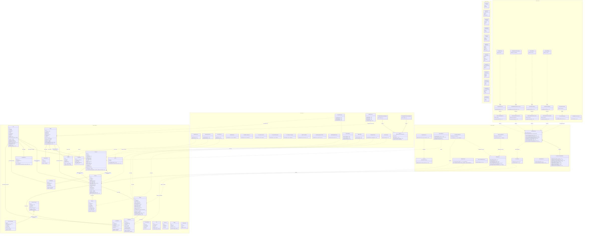

*Berkas skrip sumber Mermaid master tersimpan di: [`Blueprint/class/class_diagram_kost.mmd`](file:///c:/xampp/htdocs/asri-boarding-house/Blueprint/class/class_diagram_kost.mmd)*

```mermaid
classDiagram
    direction TB

    %% ==========================================
    %% 1. DOMAIN MODELS & ENUMS
    %% ==========================================
    namespace Domain_Models {
        class User {
            +int id
            +string nama
            +string email
            +string password
            +string no_hp
            +string nik
            +UserRole role
            +boolean require_password_change
            +penyewa() HasOne
            +reservasi() HasMany
            +getNameAttribute() string
            +getDashboardRouteName() string
            +isProfileComplete() bool
            +isActiveTenant() bool
            +anonymizeAndDelete() void
        }

        class Kamar {
            +int id
            +string nomor_kamar
            +tinyint lantai
            +TipeKamar tipe
            +decimal harga_bulan
            +KamarStatus status
            +fasilitas() BelongsToMany
            +penyewaAktif() HasOne
            +reservasi() HasMany
            +kalkulasiHargaSewa(tipe, durasi) float
            +kalkulasiMinimalDp(total) float
        }

        class Fasilitas {
            +int id
            +string nama
            +string ikon
            +boolean is_active
            +kamar() BelongsToMany
        }

        class Penyewa {
            +int id
            +int user_id
            +int kamar_id
            +decimal harga_sewa
            +date tanggal_masuk
            +date tanggal_keluar_seharusnya
            +PenyewaStatus status
            +tinyint tanggal_billing
            +tagihan() HasMany
            +keluhan() HasMany
            +getIsOverdueAttribute() bool
        }

        class Tagihan {
            +int id
            +int penyewa_id
            +string order_id
            +tinyint periode_bulan
            +smallint periode_tahun
            +decimal nominal_total
            +TagihanStatus status
            +pembayaran() HasMany
            +getComputedStatusAttribute() string
            +scopeTerlambat(query) Builder
        }

        class Pembayaran {
            +int id
            +int tagihan_id
            +string transaction_id
            +decimal nominal
            +string status_midtrans
            +datetime tanggal_bayar
            +string pdf_path
            +tagihan() BelongsTo
        }

        class Reservasi {
            +bigint id
            +int user_id
            +int kamar_id
            +decimal total_harga
            +boolean is_dp
            +decimal nominal_dp
            +decimal nominal_sisa
            +ReservasiStatus status
            +chatMessages() HasMany
            +isKamarTerbooking() bool
        }

        class ChatMessage {
            +bigint id
            +bigint reservasi_id
            +int sender_id
            +text message
            +boolean is_read
        }

        class Keluhan {
            +int id
            +int penyewa_id
            +string judul
            +StatusKeluhan status
            +text tanggapan_admin
        }

        class Pengeluaran {
            +int id
            +string nama_pengeluaran
            +decimal nominal
            +date tanggal_pengeluaran
        }

        class Setting {
            +string key
            +text value
            +static get(key, default) string
        }

        class LogNotifikasi {
            +int id
            +int penyewa_id
            +int tagihan_id
            +StatusNotifikasi status
        }

        class NotifikasiKhusus {
            +int id
            +string sumber
            +string tipe_aktivitas
            +int user_id
        }

        class GuestChatThread {
            +bigint id
            +string session_token
            +string status
        }

        class GuestChatMessage {
            +bigint id
            +bigint guest_chat_thread_id
            +text message
        }
    }

    %% ==========================================
    %% 2. SERVICE LAYER & ABSTRACTIONS
    %% ==========================================
    namespace Service_Layer {
        class PdfGeneratorInterface {
            <<interface>>
            +generate(view, data, paper, orientation) string
        }

        class DompdfGenerator {
            +generate(view, data, paper, orientation) string
        }

        class PdfNotaService {
            #PdfGeneratorInterface pdfGenerator
            +generate(Pembayaran) string
            +getOrGeneratePdfPath(Pembayaran) string
        }

        class BillingService {
            +generateTagihanBulanan() void
            +prosesKeterlambatan() void
            +terapkanDendaDirect(Tagihan) void
            +injectSisaDp(Penyewa, float) void
            +injectLunasPenuh(Penyewa, Reservasi, int) void
        }

        class ReservasiService {
            +hitungHarga(Kamar, string, int) array
            +buatReservasi(array) Reservasi
            +cekDoubleBooking(Kamar, string, string) bool
        }

        class TransisiPenyewaService {
            #BillingService billingService
            +transisi(Reservasi, int, array) Penyewa
        }

        class AdminPenyewaService {
            #BillingService billingService
            +registerPenyewa(array, int) Penyewa
        }

        class TagihanService {
            +confirmCashPayment(Tagihan, int, string) Pembayaran
        }

        class DashboardAnalyticsService {
            +getDashboardMetrics() array
        }

        class NotificationTemplateBuilder {
            +buildTagihanBaru(Tagihan, Penyewa) string
            +buildPembayaranBerhasil(Pembayaran) string
        }

        class NotifikasiService {
            #FonnteService fonnte
            #NotificationTemplateBuilder templateBuilder
            +kirimNotifikasiTagihan(Tagihan, bool) void
            +kirimNotifikasiPembayaran(Pembayaran, bool) void
            +kirimNotifikasiWelcomePenyewa(Penyewa, bool) void
        }

        class FonnteService {
            +kirimPesan(nomor, pesan) bool
            +formatNomor(nomor) string
        }

        class MidtransService {
            +createSnapToken(Tagihan) array
            +createSnapTokenReservasi(Reservasi) array
        }
    }

    %% ==========================================
    %% 3. OBSERVERS, MIDDLEWARES & POLICIES
    %% ==========================================
    namespace Infra_Security {
        class PenyewaObserver {
            +created(Penyewa) void
            +updated(Penyewa) void
        }

        class KamarObserver {
            +saved(Kamar) void
            +deleted(Kamar) void
        }

        class RoleMiddleware {
            +handle(request, next, role) Response
        }

        class VerifyMidtransSignature {
            +handle(request, next) Response
        }

        class BaseResetPasswordNotification {
            <<abstract>>
            #string token
            #getRoleName() string
            #resolveRouteName(notifiable) string
            +toMail(notifiable) MailMessage
        }

        class AdminResetPasswordNotification {
            +ROUTE_NAME string
        }

        class PenyewaResetPasswordNotification {
            +ROUTE_NAME string
        }

        class ReservasiPolicy {
            +view(User, Reservasi) bool
            +pay(User, Reservasi) bool
        }

        class TagihanPolicy {
            +view(User, Tagihan) bool
            +pay(User, Tagihan) bool
        }
    }

    %% ==========================================
    %% 4. EVENTS & QUEUES
    %% ==========================================
    namespace Event_Driven {
        class ReservasiDikonfirmasi {
            +Reservasi reservasi
            +Penyewa penyewa
        }

        class TagihanDibuat {
            +Tagihan tagihan
        }

        class PembayaranBerhasil {
            +Pembayaran pembayaran
        }

        class KirimNotifikasiTagihanJob {
            +Tagihan tagihan
            +handle(NotifikasiService) void
        }

        class GeneratePdfNotaJob {
            +Pembayaran pembayaran
            +handle(PdfNotaService) void
        }
    }

    %% Relasi Model Inti %%
    User "1" -- "0..1" Penyewa : One to One
    Kamar "1" -- "*" Penyewa : One to Many
    Kamar "*" -- "*" Fasilitas : Many to Many
    Penyewa "1" -- "*" Tagihan : One to Many
    Tagihan "1" -- "*" Pembayaran : One to Many
    User "1" -- "*" Reservasi : One to Many
    Kamar "1" -- "*" Reservasi : One to Many
    Reservasi "1" *-- "*" ChatMessage : Composition
    Penyewa "1" -- "*" Keluhan : One to Many
    GuestChatThread "1" *-- "*" GuestChatMessage : Composition
    Penyewa "1" -- "*" LogNotifikasi : One to Many
    Tagihan "1" -- "*" LogNotifikasi : One to Many
    User "1" -- "*" NotifikasiKhusus : One to Many

    %% Relasi Service & Realization %%
    DompdfGenerator ..|> PdfGeneratorInterface : Implements
    PdfNotaService ..> PdfGeneratorInterface : Uses
    TransisiPenyewaService ..> BillingService : Uses
    AdminPenyewaService ..> BillingService : Uses
    NotifikasiService *-- NotificationTemplateBuilder : Composes
    NotifikasiService ..> FonnteService : Uses

    BillingService ..> Tagihan : Creates
    BillingService ..> Penyewa : Manages
    ReservasiService ..> Reservasi : Creates
    TransisiPenyewaService ..> Penyewa : Activates
    TagihanService ..> Pembayaran : Confirms

    %% Relasi Observers & Security %%
    PenyewaObserver ..> Penyewa : Observes
    PenyewaObserver ..> Kamar : Locks room
    KamarObserver ..> Kamar : Observes
    AdminResetPasswordNotification --|> BaseResetPasswordNotification : Extends
    PenyewaResetPasswordNotification --|> BaseResetPasswordNotification : Extends
    ReservasiPolicy ..> Reservasi : Authorizes
    TagihanPolicy ..> Tagihan : Authorizes

    %% Relasi Events & Queue Jobs %%
    TagihanDibuat ..> KirimNotifikasiTagihanJob : Triggers
    KirimNotifikasiTagihanJob ..> NotifikasiService : Calls
    PembayaranBerhasil ..> GeneratePdfNotaJob : Triggers
    GeneratePdfNotaJob ..> PdfNotaService : Calls
```

---

## 2. Peta Relasi Struktural Antar Layer (Structural Relationship Map)

Untuk memberikan gambaran arsitektur sistem secara berjenjang dan seimbang, diagram berikut memetakan relasi antar layer (Tier/Subsystem) dalam sistem:

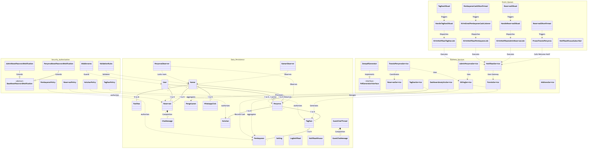

*Berkas skrip sumber Mermaid tersimpan di: [`Blueprint/class/class_relasi_struktural_global.mmd`](file:///c:/xampp/htdocs/asri-boarding-house/Blueprint/class/class_relasi_struktural_global.mmd)*

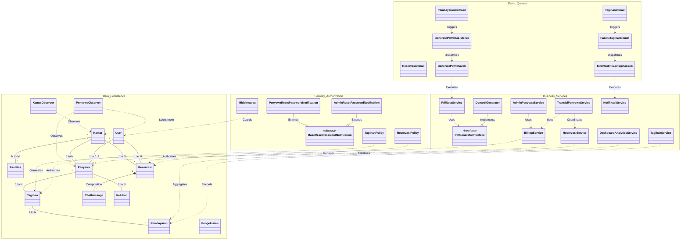
```mermaid
classDiagram
    direction TB

    %% Layer 1: Security & Middlewares %%
    namespace Security_Authorization {
        class BaseResetPasswordNotification { <<abstract>> }
        class AdminResetPasswordNotification
        class PenyewaResetPasswordNotification
        class ReservasiPolicy
        class TagihanPolicy
        class Middlewares
    }

    %% Layer 2: Business Service Layer %%
    namespace Business_Services {
        class PdfGeneratorInterface { <<interface>> }
        class DompdfGenerator
        class PdfNotaService
        class BillingService
        class ReservasiService
        class TransisiPenyewaService
        class AdminPenyewaService
        class TagihanService
        class DashboardAnalyticsService
        class NotifikasiService
    }

    %% Layer 3: Event-Driven Infrastructure %%
    namespace Event_Queues {
        class ReservasiDibuat
        class TagihanDibuat
        class PembayaranBerhasil
        class HandleTagihanDibuat
        class GeneratePdfNotaListener
        class KirimNotifikasiTagihanJob
        class GeneratePdfNotaJob
    }

    %% Layer 4: Data Models & Persistence %%
    namespace Data_Persistence {
        class User
        class Kamar
        class Fasilitas
        class Penyewa
        class Tagihan
        class Pembayaran
        class Reservasi
        class ChatMessage
        class Keluhan
        class Pengeluaran
        class PenyewaObserver
        class KamarObserver
    }

    %% Relasi Realization & Inheritance %%
    AdminResetPasswordNotification --|> BaseResetPasswordNotification : Extends
    PenyewaResetPasswordNotification --|> BaseResetPasswordNotification : Extends
    DompdfGenerator ..|> PdfGeneratorInterface : Implements
    PdfNotaService ..> PdfGeneratorInterface : Uses

    %% Relasi Service Dependencies %%
    TransisiPenyewaService ..> BillingService : Uses
    AdminPenyewaService ..> BillingService : Uses
    TransisiPenyewaService ..> ReservasiService : Coordinates

    %% Relasi Policy & Middlewares to Models %%
    ReservasiPolicy ..> Reservasi : Authorizes
    TagihanPolicy ..> Tagihan : Authorizes
    Middlewares ..> User : Guards

    %% Relasi Service to Models %%
    BillingService ..> Tagihan : Generates
    BillingService ..> Penyewa : Manages
    ReservasiService ..> Reservasi : Processes
    TagihanService ..> Pembayaran : Records
    DashboardAnalyticsService ..> Pembayaran : Aggregates

    %% Relasi Event & Queues %%
    TagihanDibuat ..> HandleTagihanDibuat : Triggers
    HandleTagihanDibuat ..> KirimNotifikasiTagihanJob : Dispatches
    KirimNotifikasiTagihanJob ..> NotifikasiService : Executes
    PembayaranBerhasil ..> GeneratePdfNotaListener : Triggers
    GeneratePdfNotaListener ..> GeneratePdfNotaJob : Dispatches
    GeneratePdfNotaJob ..> PdfNotaService : Executes

    %% Relasi Domain Associations %%
    User "1" -- "0..1" Penyewa : 1 to 0..1
    Kamar "1" -- "*" Penyewa : 1 to N
    Kamar "*" -- "*" Fasilitas : N to M
    Penyewa "1" -- "*" Tagihan : 1 to N
    Tagihan "1" -- "*" Pembayaran : 1 to N
    User "1" -- "*" Reservasi : 1 to N
    Kamar "1" -- "*" Reservasi : 1 to N
    Reservasi "1" *-- "*" ChatMessage : Composition
    Penyewa "1" -- "*" Keluhan : 1 to N

    %% Relasi Observers %%
    PenyewaObserver ..> Penyewa : Observes
    PenyewaObserver ..> Kamar : Locks room
    KamarObserver ..> Kamar : Observes
```

---

## 3. Visualisasi Relasi Khusus & Tanggung Jawab Kelas (Dedicated Relationship Diagrams)

Untuk memahami secara mendalam hubungan antar kelas pada setiap ranah (*domain context*), berikut adalah visualisasi terfokus beserta penjelasan rinci hubungan dan tanggung jawabnya:

### A. Visualisasi Relasi Domain Models Inti (Association & Composition)

Diagram ini mengilustrasikan asosiasi struktural, relasi kepemilikan siklus hidup (*Composition*), dan kardinalitas antar model:

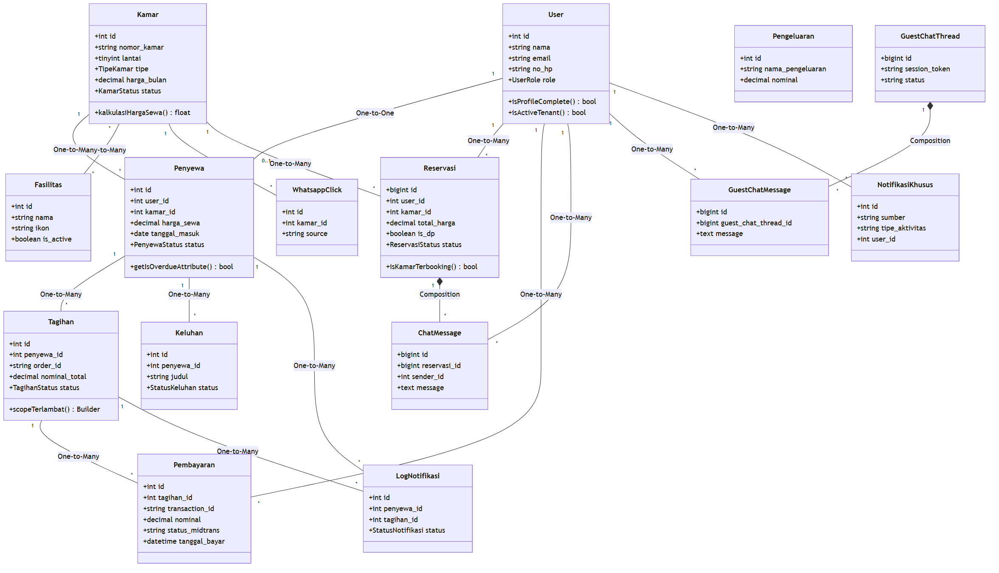

*Berkas skrip sumber Mermaid tersimpan di: [`Blueprint/class/class_relasi_domain_models.mmd`](file:///c:/xampp/htdocs/asri-boarding-house/Blueprint/class/class_relasi_domain_models.mmd)*

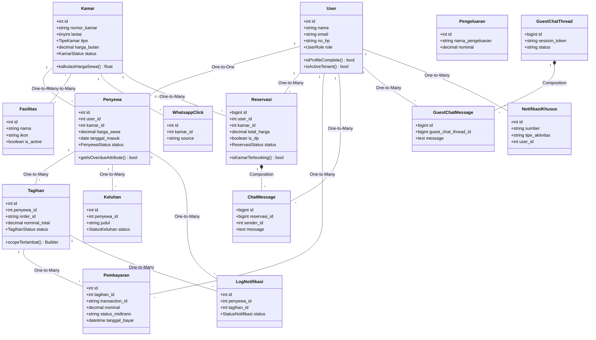
```mermaid
classDiagram
    direction TB

    class User {
        +int id
        +string nama
        +string email
        +string no_hp
        +UserRole role
        +isProfileComplete() bool
        +isActiveTenant() bool
    }

    class Kamar {
        +int id
        +string nomor_kamar
        +tinyint lantai
        +TipeKamar tipe
        +decimal harga_bulan
        +KamarStatus status
        +kalkulasiHargaSewa() float
    }

    class Fasilitas {
        +int id
        +string nama
        +string ikon
        +boolean is_active
    }

    class Penyewa {
        +int id
        +int user_id
        +int kamar_id
        +decimal harga_sewa
        +date tanggal_masuk
        +PenyewaStatus status
        +getIsOverdueAttribute() bool
    }

    class Tagihan {
        +int id
        +int penyewa_id
        +string order_id
        +decimal nominal_total
        +TagihanStatus status
        +scopeTerlambat() Builder
    }

    class Pembayaran {
        +int id
        +int tagihan_id
        +string transaction_id
        +decimal nominal
        +string status_midtrans
        +datetime tanggal_bayar
    }

    class Reservasi {
        +bigint id
        +int user_id
        +int kamar_id
        +decimal total_harga
        +boolean is_dp
        +ReservasiStatus status
        +isKamarTerbooking() bool
    }

    class ChatMessage {
        +bigint id
        +bigint reservasi_id
        +int sender_id
        +text message
    }

    class WhatsappClick {
        +int id
        +int kamar_id
        +string source
    }

    class Keluhan {
        +int id
        +int penyewa_id
        +string judul
        +StatusKeluhan status
    }

    class Pengeluaran {
        +int id
        +string nama_pengeluaran
        +decimal nominal
    }

    class GuestChatThread {
        +bigint id
        +string session_token
        +string status
    }

    class GuestChatMessage {
        +bigint id
        +bigint guest_chat_thread_id
        +text message
    }

    class LogNotifikasi {
        +int id
        +int penyewa_id
        +int tagihan_id
        +StatusNotifikasi status
    }

    class NotifikasiKhusus {
        +int id
        +string sumber
        +string tipe_aktivitas
        +int user_id
    }

    User "1" -- "0..1" Penyewa : One-to-One
    User "1" -- "*" Reservasi : One-to-Many
    User "1" -- "*" Pembayaran : One-to-Many
    User "1" -- "*" ChatMessage : One-to-Many
    User "1" -- "*" GuestChatMessage : One-to-Many
    User "1" -- "*" NotifikasiKhusus : One-to-Many

    Kamar "1" -- "*" Penyewa : One-to-Many
    Kamar "*" -- "*" Fasilitas : Many-to-Many
    Kamar "1" -- "*" WhatsappClick : One-to-Many
    Kamar "1" -- "*" Reservasi : One-to-Many

    Penyewa "1" -- "*" Tagihan : One-to-Many
    Penyewa "1" -- "*" Keluhan : One-to-Many
    Penyewa "1" -- "*" LogNotifikasi : One-to-Many

    Tagihan "1" -- "*" Pembayaran : One-to-Many
    Tagihan "1" -- "*" LogNotifikasi : One-to-Many

    Reservasi "1" *-- "*" ChatMessage : Composition
    GuestChatThread "1" *-- "*" GuestChatMessage : Composition
```

---

### B. Visualisasi Relasi Service Layer & Dependency Inversion (DIP)

Diagram ini mengilustrasikan pemisahan logika bisnis dari controller, penggunaan *Dependency Injection*, dan penerapan *Inversion of Control*:

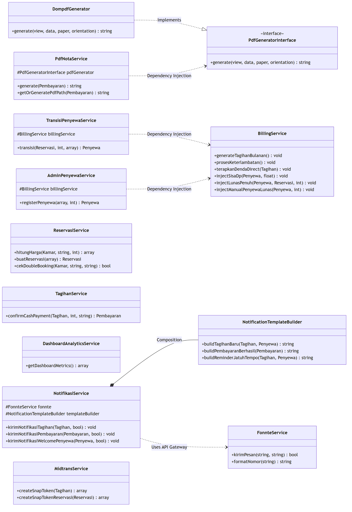

*Berkas skrip sumber Mermaid tersimpan di: [`Blueprint/class/class_relasi_service_layer.mmd`](file:///c:/xampp/htdocs/asri-boarding-house/Blueprint/class/class_relasi_service_layer.mmd)*

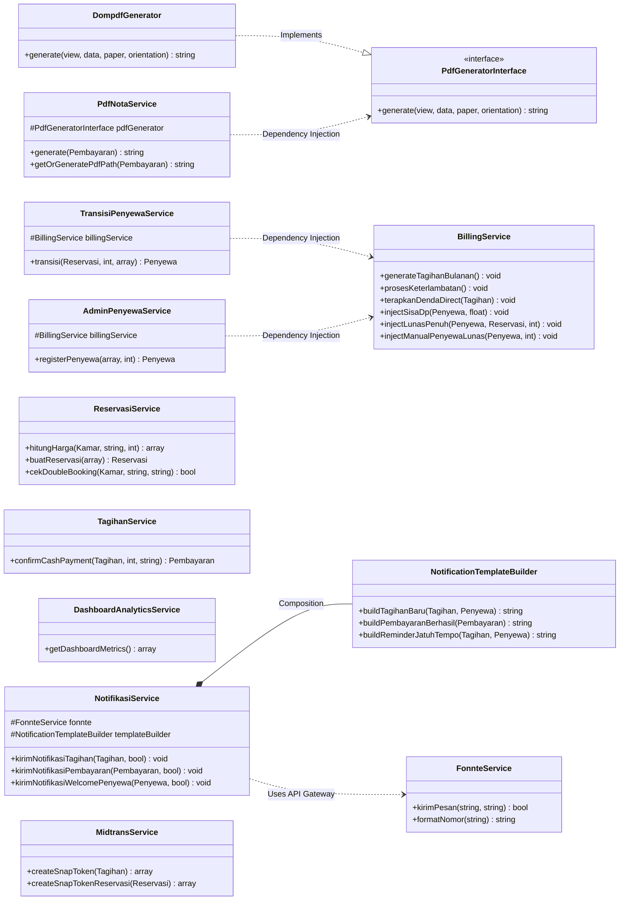
```mermaid
classDiagram
    direction LR

    class PdfGeneratorInterface {
        <<interface>>
        +generate(view, data, paper, orientation) string
    }

    class DompdfGenerator {
        +generate(view, data, paper, orientation) string
    }

    class PdfNotaService {
        #PdfGeneratorInterface pdfGenerator
        +generate(Pembayaran) string
        +getOrGeneratePdfPath(Pembayaran) string
    }

    class BillingService {
        +generateTagihanBulanan() void
        +prosesKeterlambatan() void
        +terapkanDendaDirect(Tagihan) void
        +injectSisaDp(Penyewa, float) void
        +injectLunasPenuh(Penyewa, Reservasi, int) void
        +injectManualPenyewaLunas(Penyewa, int) void
    }

    class TransisiPenyewaService {
        #BillingService billingService
        +transisi(Reservasi, int, array) Penyewa
    }

    class AdminPenyewaService {
        #BillingService billingService
        +registerPenyewa(array, int) Penyewa
    }

    class ReservasiService {
        +hitungHarga(Kamar, string, int) array
        +buatReservasi(array) Reservasi
        +cekDoubleBooking(Kamar, string, string) bool
    }

    class TagihanService {
        +confirmCashPayment(Tagihan, int, string) Pembayaran
    }

    class DashboardAnalyticsService {
        +getDashboardMetrics() array
    }

    class NotificationTemplateBuilder {
        +buildTagihanBaru(Tagihan, Penyewa) string
        +buildPembayaranBerhasil(Pembayaran) string
        +buildReminderJatuhTempo(Tagihan, Penyewa) string
    }

    class NotifikasiService {
        #FonnteService fonnte
        #NotificationTemplateBuilder templateBuilder
        +kirimNotifikasiTagihan(Tagihan, bool) void
        +kirimNotifikasiPembayaran(Pembayaran, bool) void
        +kirimNotifikasiWelcomePenyewa(Penyewa, bool) void
    }

    class FonnteService {
        +kirimPesan(string, string) bool
        +formatNomor(string) string
    }

    class MidtransService {
        +createSnapToken(Tagihan) array
        +createSnapTokenReservasi(Reservasi) array
    }

    DompdfGenerator ..|> PdfGeneratorInterface : Implements
    PdfNotaService ..> PdfGeneratorInterface : Dependency Injection
    TransisiPenyewaService ..> BillingService : Dependency Injection
    AdminPenyewaService ..> BillingService : Dependency Injection
    NotifikasiService *-- NotificationTemplateBuilder : Composition
    NotifikasiService ..> FonnteService : Uses API Gateway
```

---

### C. Visualisasi Alur Event-Driven Architecture (EDA) & Antrean Latar Belakang

Diagram ini mengilustrasikan bagaimana peristiwa mutasi data (*Events*) memicu pendengar (*Listeners*) untuk mengeksekusi tugas latar belakang asinkron (*Queue Jobs*):

*Berkas skrip sumber Mermaid tersimpan di: [`Blueprint/class/class_relasi_event_queue_pipeline.mmd`](file:///c:/xampp/htdocs/asri-boarding-house/Blueprint/class/class_relasi_event_queue_pipeline.mmd)*

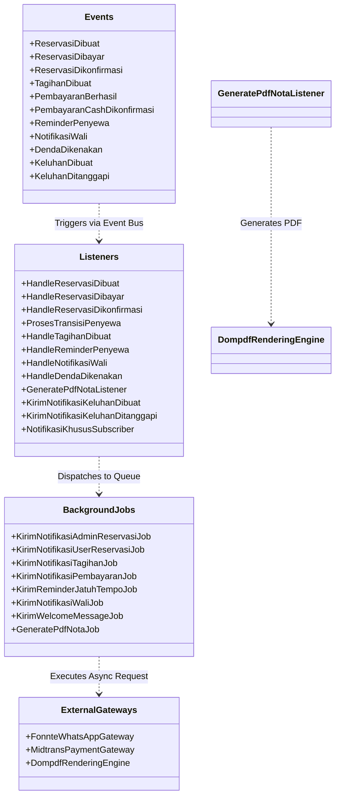
```mermaid
classDiagram
    direction TB

    class Events {
        +ReservasiDibuat
        +ReservasiDibayar
        +ReservasiDikonfirmasi
        +TagihanDibuat
        +PembayaranBerhasil
        +PembayaranCashDikonfirmasi
        +ReminderPenyewa
        +NotifikasiWali
        +DendaDikenakan
        +KeluhanDibuat
        +KeluhanDitanggapi
    }

    class Listeners {
        +HandleReservasiDibuat
        +HandleReservasiDibayar
        +HandleReservasiDikonfirmasi
        +ProsesTransisiPenyewa
        +HandleTagihanDibuat
        +HandleReminderPenyewa
        +HandleNotifikasiWali
        +HandleDendaDikenakan
        +GeneratePdfNotaListener
        +KirimNotifikasiKeluhanDibuat
        +KirimNotifikasiKeluhanDitanggapi
        +NotifikasiKhususSubscriber
    }

    class BackgroundJobs {
        +KirimNotifikasiAdminReservasiJob
        +KirimNotifikasiUserReservasiJob
        +KirimNotifikasiTagihanJob
        +KirimNotifikasiPembayaranJob
        +KirimReminderJatuhTempoJob
        +KirimNotifikasiWaliJob
        +KirimWelcomeMessageJob
        +GeneratePdfNotaJob
    }

    class ExternalGateways {
        +FonnteWhatsAppGateway
        +MidtransPaymentGateway
        +DompdfRenderingEngine
    }

    Events ..> Listeners : Triggers via Event Bus
    Listeners ..> BackgroundJobs : Dispatches to Queue
    BackgroundJobs ..> ExternalGateways : Executes Async Request
    GeneratePdfNotaListener ..> DompdfRenderingEngine : Generates PDF
```

---

### D. Visualisasi Pewarisan (Inheritance) & Kebijakan Otorisasi Keamanan

Diagram ini memperlihatkan pemanfaatan *Object-Oriented Inheritance* dan pemisahan otorisasi *Policy-Based Authorization*:

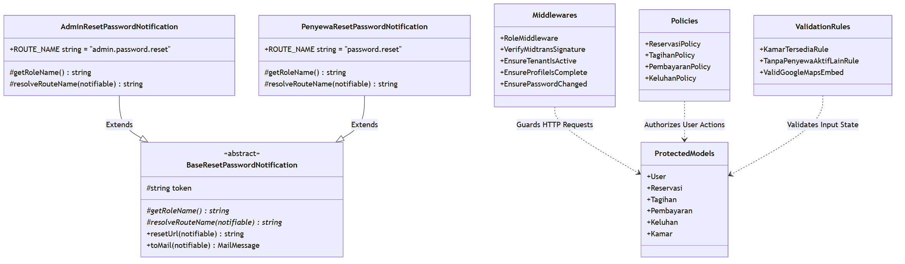

*Berkas skrip sumber Mermaid tersimpan di: [`Blueprint/class/class_relasi_inheritance_security.mmd`](file:///c:/xampp/htdocs/asri-boarding-house/Blueprint/class/class_relasi_inheritance_security.mmd)*

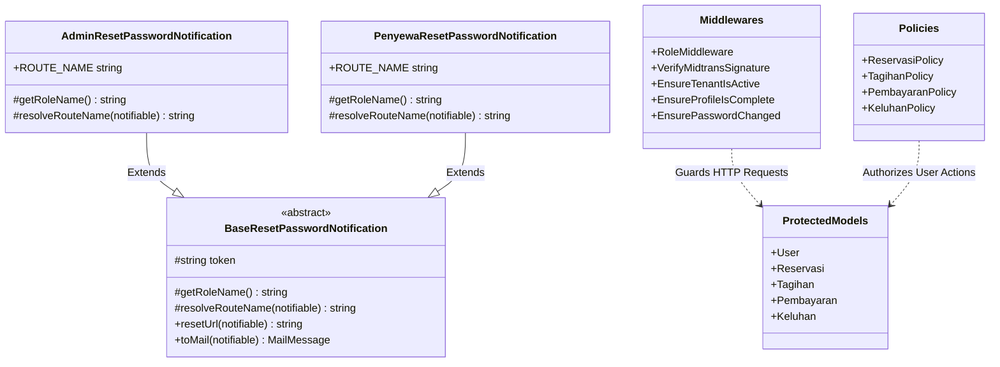
```mermaid
classDiagram
    direction TB

    class BaseResetPasswordNotification {
        <<abstract>>
        #string token
        #getRoleName() string
        #resolveRouteName(notifiable) string
        +resetUrl(notifiable) string
        +toMail(notifiable) MailMessage
    }

    class AdminResetPasswordNotification {
        +ROUTE_NAME string
        #getRoleName() string
        #resolveRouteName(notifiable) string
    }

    class PenyewaResetPasswordNotification {
        +ROUTE_NAME string
        #getRoleName() string
        #resolveRouteName(notifiable) string
    }

    class Policies {
        +ReservasiPolicy
        +TagihanPolicy
        +PembayaranPolicy
        +KeluhanPolicy
    }

    class Middlewares {
        +RoleMiddleware
        +VerifyMidtransSignature
        +EnsureTenantIsActive
        +EnsureProfileIsComplete
        +EnsurePasswordChanged
    }

    class ProtectedModels {
        +User
        +Reservasi
        +Tagihan
        +Pembayaran
        +Keluhan
    }

    AdminResetPasswordNotification --|> BaseResetPasswordNotification : Extends
    PenyewaResetPasswordNotification --|> BaseResetPasswordNotification : Extends

    Middlewares ..> ProtectedModels : Guards HTTP Requests
    Policies ..> ProtectedModels : Authorizes User Actions
```

---

## 4. Visualisasi Alur Proses Bisnis & Interaksi Antar Objek Kelas (Business Workflow Diagrams)

Di bawah ini disajikan diagram alur (*flowcharts*) dan diagram sekuens (*sequences*) yang memvisualisasikan bagaimana kelas-kelas model, layanan (*service*), middleware, event listener, dan gateway eksternal berkolaborasi dalam setiap proses bisnis utama sistem:

---

### Alur 1: Alur Reservasi Kamar & Pembayaran Midtrans Snap

Diagram alur ini memvisualisasikan proses pemesanan kamar online, pemeriksaan kelengkapan profil, kalkulasi diskon & DP 30%, pencegahan bentrok jadwal (*double booking*), penerbitan token Snap Midtrans, dan verifikasi webhook SHA-512:

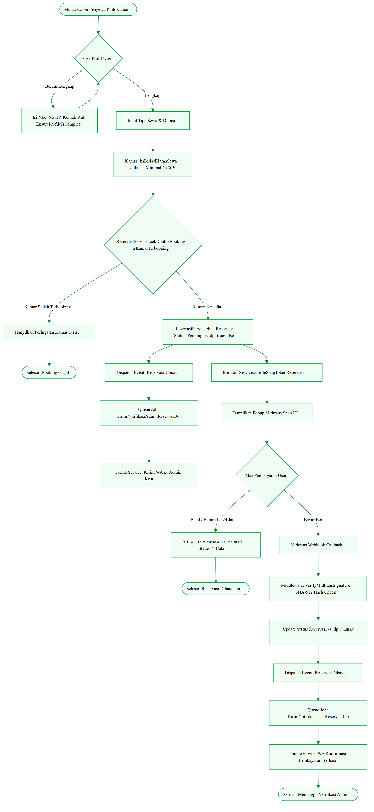

*Berkas skrip sumber Mermaid tersimpan di: [`Blueprint/class/class_alur_reservasi_pembayaran.mmd`](file:///c:/xampp/htdocs/asri-boarding-house/Blueprint/class/class_alur_reservasi_pembayaran.mmd)*

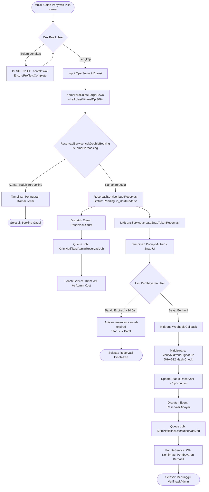
```mermaid
flowchart TD
    Start([Mulai: Calon Penyewa Pilih Kamar]) --> ValidateUser{Cek Profil User}
    ValidateUser -->|Belum Lengkap| FillProfile[Isi NIK, No HP, Kontak Wali<br>EnsureProfileIsComplete]
    FillProfile --> ValidateUser
    ValidateUser -->|Lengkap| InputBooking[Input Tipe Sewa & Durasi]
    
    InputBooking --> CalcPrice[Kamar::kalkulasiHargaSewa<br>+ kalkulasiMinimalDp 30%]
    CalcPrice --> CheckDoubleBooking{ReservasiService::cekDoubleBooking<br>isKamarTerbooking}
    
    CheckDoubleBooking -->|Kamar Sudah Terbooking| RejectBooking[Tampilkan Peringatan Kamar Terisi]
    RejectBooking --> EndFail([Selesai: Booking Gagal])
    
    CheckDoubleBooking -->|Kamar Tersedia| CreateReservation[ReservasiService::buatReservasi<br>Status: Pending, is_dp=true/false]
    CreateReservation --> DispatchEvent[Dispatch Event: ReservasiDibuat]
    DispatchEvent --> TriggerJob[Queue Job: KirimNotifikasiAdminReservasiJob]
    TriggerJob --> SendAdminWA[FonnteService: Kirim WA ke Admin Kost]
    
    CreateReservation --> CallMidtrans[MidtransService::createSnapTokenReservasi]
    CallMidtrans --> RenderSnap[Tampilkan Popup Midtrans Snap UI]
    
    RenderSnap --> PaymentAction{Aksi Pembayaran User}
    PaymentAction -->|Batal / Expired > 24 Jam| CronCancel[Artisan: reservasi:cancel-expired<br>Status -> Batal]
    CronCancel --> EndCancel([Selesai: Reservasi Dibatalkan])
    
    PaymentAction -->|Bayar Berhasil| MidtransWebhook[Midtrans Webhook Callback]
    MidtransWebhook --> VerifySig[Middleware: VerifyMidtransSignature<br>SHA-512 Hash Check]
    VerifySig --> UpdateResStatus[Update Status Reservasi -> 'dp' / 'lunas']
    UpdateResStatus --> DispatchPaidEvent[Dispatch Event: ReservasiDibayar]
    DispatchPaidEvent --> NotifyUserJob[Queue Job: KirimNotifikasiUserReservasiJob]
    NotifyUserJob --> SendUserWA[FonnteService: WA Konfirmasi Pembayaran Berhasil]
    SendUserWA --> EndSuccess([Selesai: Menunggu Verifikasi Admin])
```

---

### Alur 2: Alur Verifikasi Admin & Transisi Aktivasi Penyewa Baru

Diagram alur ini memvisualisasikan bagaimana data reservasi yang disetujui admin dialihkan menjadi profil penyewa aktif dalam transaksi database atomik, memicu `PenyewaObserver` untuk mengunci status kamar menjadi `terisi`, dan menginjeksi tagihan sisa DP:

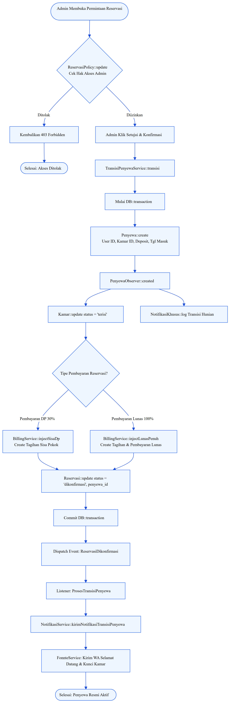

*Berkas skrip sumber Mermaid tersimpan di: [`Blueprint/class/class_alur_transisi_aktivasi_penyewa.mmd`](file:///c:/xampp/htdocs/asri-boarding-house/Blueprint/class/class_alur_transisi_aktivasi_penyewa.mmd)*

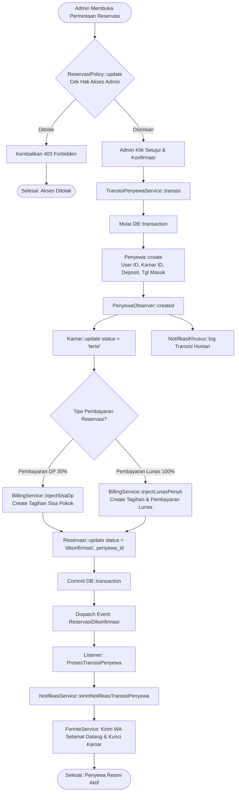
```mermaid
flowchart TD
    Start([Admin Membuka Permintaan Reservasi]) --> CheckAuth{ReservasiPolicy::update<br>Cek Hak Akses Admin}
    CheckAuth -->|Ditolak| Unauthorized[Kembalikan 403 Forbidden]
    Unauthorized --> EndAbort([Selesai: Akses Ditolak])
    
    CheckAuth -->|Diizinkan| SubmitConfirm[Admin Klik Setujui & Konfirmasi]
    SubmitConfirm --> CallService[TransisiPenyewaService::transisi]
    
    CallService --> BeginTx[Mulai DB::transaction]
    BeginTx --> CreatePenyewa[Penyewa::create<br>User ID, Kamar ID, Deposit, Tgl Masuk]
    
    CreatePenyewa --> TriggerObserver[PenyewaObserver::created]
    TriggerObserver --> LockRoom[Kamar::update status = 'terisi']
    TriggerObserver --> AuditLog[NotifikasiKhusus::log Transisi Hunian]
    
    LockRoom --> CheckPaymentType{Tipe Pembayaran Reservasi?}
    CheckPaymentType -->|Pembayaran DP 30%| InjectSisa[BillingService::injectSisaDp<br>Create Tagihan Sisa Pokok]
    CheckPaymentType -->|Pembayaran Lunas 100%| InjectLunas[BillingService::injectLunasPenuh<br>Create Tagihan & Pembayaran Lunas]
    
    InjectSisa --> UpdateRes[Reservasi::update status = 'dikonfirmasi', penyewa_id]
    InjectLunas --> UpdateRes
    
    UpdateRes --> CommitTx[Commit DB::transaction]
    CommitTx --> DispatchConfirmEvent[Dispatch Event: ReservasiDikonfirmasi]
    
    DispatchConfirmEvent --> TriggerListener[Listener: ProsesTransisiPenyewa]
    TriggerListener --> CallNotif[NotifikasiService::kirimNotifikasiTransisiPenyewa]
    CallNotif --> SendWelcomeWA[FonnteService: Kirim WA Selamat Datang & Kunci Kamar]
    
    SendWelcomeWA --> EndOK([Selesai: Penyewa Resmi Aktif])
```

---

### Alur 3: Alur Siklus Billing Otomatis & Penanganan Denda Keterlambatan

Diagram alur ini memvisualisasikan eksekusi cron harian dan bulanan (*Artisan Commands*) untuk penagihan masal otomatis (chunking 100 baris), pemantauan grace period (tgl 10), kalkulasi denda bertahap 5%, dan pengiriman notifikasi WhatsApp ke penyewa & nomor wali:

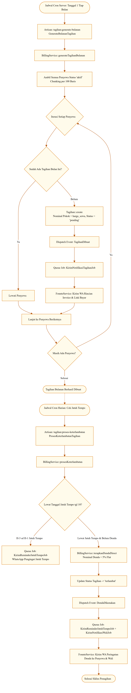

*Berkas skrip sumber Mermaid tersimpan di: [`Blueprint/class/class_alur_siklus_billing.mmd`](file:///c:/xampp/htdocs/asri-boarding-house/Blueprint/class/class_alur_siklus_billing.mmd)*

```mermaid
flowchart TD
    Start([Jadwal Cron Server: Tanggal 1 Tiap Bulan]) --> RunGenerateCmd[Artisan: tagihan:generate-bulanan<br>GenerateBulananTagihan]
    RunGenerateCmd --> CallBilling[BillingService::generateTagihanBulanan]
    
    CallBilling --> QueryTenants[Ambil Semua Penyewa Status 'aktif'<br>Chunking per 100 Baris]
    QueryTenants --> LoopTenant{Iterasi Setiap Penyewa}
    
    LoopTenant --> CheckExisting{Sudah Ada Tagihan Bulan Ini?}
    CheckExisting -->|Ya| SkipTenant[Lewati Penyewa]
    CheckExisting -->|Belum| CreateBill[Tagihan::create<br>Nominal Pokok = harga_sewa, Status = 'pending']
    
    CreateBill --> DispatchBillEvent[Dispatch Event: TagihanDibuat]
    DispatchBillEvent --> DispatchBillJob[Queue Job: KirimNotifikasiTagihanJob]
    DispatchBillJob --> SendBillWA[FonnteService: Kirim WA Rincian Invoice & Link Bayar]
    
    SkipTenant --> NextTenant[Lanjut ke Penyewa Berikutnya]
    SendBillWA --> NextTenant
    NextTenant --> CheckMoreTenants{Masih Ada Penyewa?}
    CheckMoreTenants -->|Ya| LoopTenant
    CheckMoreTenants -->|Selesai| EndGenerate([Tagihan Bulanan Berhasil Dibuat])
    
    EndGenerate -.-> DailyCron([Jadwal Cron Harian: Cek Jatuh Tempo])
    DailyCron --> RunLateCmd[Artisan: tagihan:proses-keterlambatan<br>ProsesKeterlambatanTagihan]
    RunLateCmd --> CallProcessLate[BillingService::prosesKeterlambatan]
    
    CallProcessLate --> CheckDueDate{Lewat Tanggal Jatuh Tempo tgl 10?}
    CheckDueDate -->|H-3 sd H-1 Jatuh Tempo| SendReminderJob[Queue Job: KirimReminderJatuhTempoJob<br>WhatsApp Pengingat Jatuh Tempo]
    CheckDueDate -->|Lewat Jatuh Tempo & Belum Denda| ApplyFine[BillingService::terapkanDendaDirect<br>Nominal Denda = 5% Flat]
    
    ApplyFine --> UpdateLateStatus[Update Status Tagihan -> 'terlambat']
    UpdateLateStatus --> DispatchFineEvent[Dispatch Event: DendaDikenakan]
    DispatchFineEvent --> NotifyLateJob[Queue Job: KirimReminderJatuhTempoJob + KirimNotifikasiWaliJob]
    NotifyLateJob --> SendLateWA[FonnteService: Kirim WA Peringatan Denda ke Penyewa & Wali]
    SendLateWA --> EndBillingCycle([Selesai Siklus Penagihan])
```

---

### Alur 4: Alur Pembayaran Tagihan & Penerbitan Kuitansi PDF Asinkron

Diagram alur ini memvisualisasikan bagaimana pembayaran lunas (baik online via Midtrans maupun tunai di kasir) memicu antrean latar belakang `GeneratePdfNotaJob` yang memanfaatkan `PdfGeneratorInterface` dan pustaka Dompdf untuk menghasilkan kuitansi PDF resmi:

*Berkas skrip sumber Mermaid tersimpan di: [`Blueprint/class/class_alur_pembayaran_kuitansi_pdf.mmd`](file:///c:/xampp/htdocs/asri-boarding-house/Blueprint/class/class_alur_pembayaran_kuitansi_pdf.mmd)*

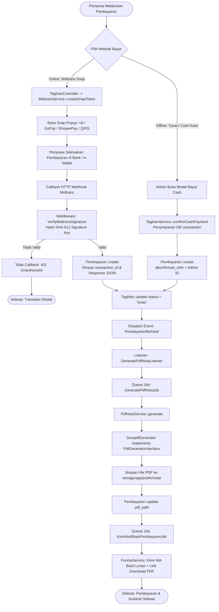
```mermaid
flowchart TD
    Start([Penyewa Melakukan Pembayaran]) --> PaymentMethod{Pilih Metode Bayar}
    
    PaymentMethod -->|Online: Midtrans Snap| RequestSnap[TagihanController -> MidtransService::createSnapToken]
    RequestSnap --> ShowSnap[Buka Snap Popup: VA / GoPay / ShopeePay / QRIS]
    ShowSnap --> PayOnline[Penyewa Selesaikan Pembayaran di Bank / e-Wallet]
    PayOnline --> MidtransCallback[Callback HTTP Webhook Midtrans]
    
    MidtransCallback --> VerifyHMAC[Middleware: VerifyMidtransSignature<br>Hash SHA-512 Signature Key]
    VerifyHMAC -->|Tidak Valid| Reject401[Tolak Callback: 401 Unauthorized]
    Reject401 --> EndFail([Selesai: Transaksi Ditolak])
    
    VerifyHMAC -->|Valid| RecordMidtransPay[Pembayaran::create<br>Simpan transaction_id & Response JSON]
    
    PaymentMethod -->|Offline: Tunai / Cash Kasir| AdminCash[Admin Buka Modal Bayar Cash]
    AdminCash --> CallCashService[TagihanService::confirmCashPayment<br>Penyimpanan DB::transaction]
    CallCashService --> RecordCashPay[Pembayaran::create<br>dikonfirmasi_oleh = Admin ID]
    
    RecordMidtransPay --> UpdateTagihanLunas[Tagihan::update status = 'lunas']
    RecordCashPay --> UpdateTagihanLunas
    
    UpdateTagihanLunas --> DispatchPayEvent[Dispatch Event: PembayaranBerhasil]
    DispatchPayEvent --> ListenerPdf[Listener: GeneratePdfNotaListener]
    
    ListenerPdf --> QueuePdfJob[Queue Job: GeneratePdfNotaJob]
    QueuePdfJob --> CallPdfService[PdfNotaService::generate]
    CallPdfService --> CallEngine["DompdfGenerator implements PdfGeneratorInterface"]
    CallEngine --> SavePdfFile[Simpan File PDF ke storage/app/public/nota/]
    SavePdfFile --> UpdatePdfPath[Pembayaran::update pdf_path]
    
    UpdatePdfPath --> DispatchNotifJob[Queue Job: KirimNotifikasiPembayaranJob]
    DispatchNotifJob --> SendReceiptWA[FonnteService: Kirim WA Bukti Lunas + Link Download PDF]
    SendReceiptWA --> EndSuccess([Selesai: Pembayaran & Kuitansi Selesai])
```

---

### Alur 5: Alur Siklus Hidup Pengaduan Keluhan Fasilitas (*Complaint Lifecycle*)

Diagram alur ini memvisualisasikan siklus hidup tiket pengaduan keluhan fasilitas oleh penyewa aktif, pengiriman notifikasi WhatsApp ke admin, pemrosesan perbaikan fisik, hingga pengiriman konfirmasi penyelesaian ke penyewa:

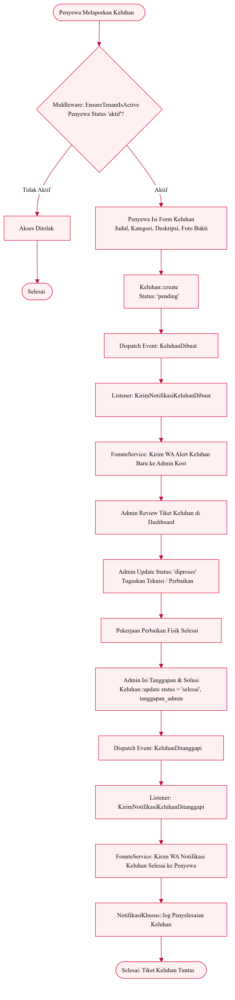

*Berkas skrip sumber Mermaid tersimpan di: [`Blueprint/class/class_alur_pengaduan_keluhan.mmd`](file:///c:/xampp/htdocs/asri-boarding-house/Blueprint/class/class_alur_pengaduan_keluhan.mmd)*

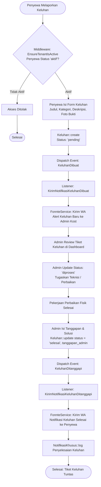
```mermaid
flowchart TD
    Start([Penyewa Melaporkan Keluhan]) --> CheckActiveTenant{Middleware: EnsureTenantIsActive<br>Penyewa Status 'aktif'?}
    CheckActiveTenant -->|Tidak Aktif| RejectAccess[Akses Ditolak]
    RejectAccess --> EndAbort([Selesai])
    
    CheckActiveTenant -->|Aktif| FillComplaint[Penyewa Isi Form Keluhan<br>Judul, Kategori, Deskripsi, Foto Bukti]
    FillComplaint --> SaveComplaint[Keluhan::create<br>Status: 'pending']
    
    SaveComplaint --> DispatchCreateEvent[Dispatch Event: KeluhanDibuat]
    DispatchCreateEvent --> TriggerAdminNotif[Listener: KirimNotifikasiKeluhanDibuat]
    TriggerAdminNotif --> SendAdminWA[FonnteService: Kirim WA Alert Keluhan Baru ke Admin Kost]
    
    SendAdminWA --> AdminReview[Admin Review Tiket Keluhan di Dashboard]
    AdminReview --> ProcessComplaint[Admin Update Status: 'diproses'<br>Tugaskan Teknisi / Perbaikan]
    
    ProcessComplaint --> FinishWork[Pekerjaan Perbaikan Fisik Selesai]
    FinishWork --> AdminRespond[Admin Isi Tanggapan & Solusi<br>Keluhan::update status = 'selesai', tanggapan_admin]
    
    AdminRespond --> DispatchResponseEvent[Dispatch Event: KeluhanDitanggapi]
    DispatchResponseEvent --> TriggerTenantNotif[Listener: KirimNotifikasiKeluhanDitanggapi]
    TriggerTenantNotif --> SendTenantWA[FonnteService: Kirim WA Notifikasi Keluhan Selesai ke Penyewa]
    
    SendTenantWA --> AuditLog[NotifikasiKhusus::log Penyelesaian Keluhan]
    AuditLog --> EndOK([Selesai: Tiket Keluhan Tuntas])
```

---

### Alur 6: Alur Agregasi Arus Kas & Analitik Dashboard (*Financial Flow*)

Diagram alur ini memvisualisasikan agregasi metrik keuangan oleh `DashboardAnalyticsService` dari tabel `reservasi`, `pembayaran`, dan `pengeluaran` untuk menghasilkan laba bersih, tingkat okupansi kamar, dan ekspor laporan PDF/Excel:

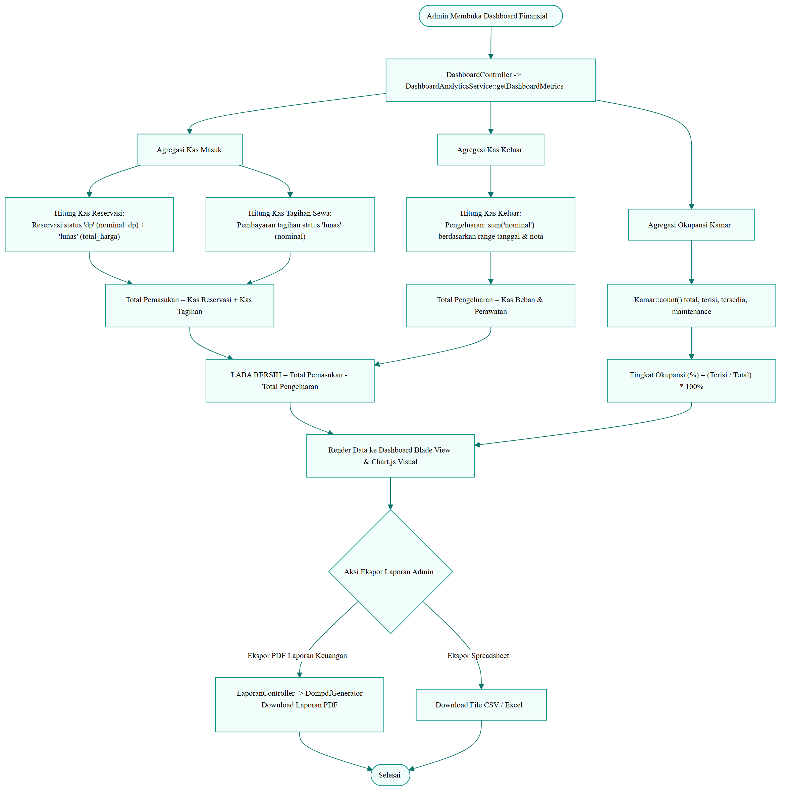

*Berkas skrip sumber Mermaid tersimpan di: [`Blueprint/class/class_alur_integrasi_arus_kas.mmd`](file:///c:/xampp/htdocs/asri-boarding-house/Blueprint/class/class_alur_integrasi_arus_kas.mmd)*

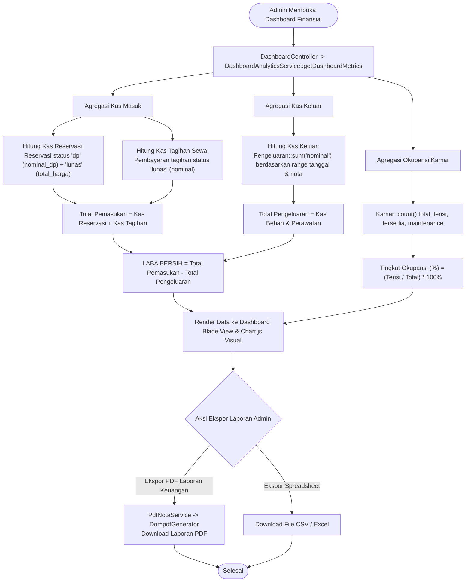
```mermaid
flowchart TD
    Start([Admin Membuka Dashboard Finansial]) --> RequestAnalytics[DashboardController -> DashboardAnalyticsService::getDashboardMetrics]
    
    RequestAnalytics --> AggregateCashIn[Agregasi Kas Masuk]
    RequestAnalytics --> AggregateCashOut[Agregasi Kas Keluar]
    RequestAnalytics --> AggregateOccupancy[Agregasi Okupansi Kamar]
    
    AggregateCashIn --> SumReservasi["Hitung Kas Reservasi:<br>Reservasi status 'dp' (nominal_dp) + 'lunas' (total_harga)"]
    AggregateCashIn --> SumTagihan["Hitung Kas Tagihan Sewa:<br>Pembayaran tagihan status 'lunas' (nominal)"]
    SumReservasi --> TotalPemasukan["Total Pemasukan = Kas Reservasi + Kas Tagihan"]
    SumTagihan --> TotalPemasukan
    
    AggregateCashOut --> SumExpenses["Hitung Kas Keluar:<br>Pengeluaran::sum('nominal') berdasarkan range tanggal & nota"]
    SumExpenses --> TotalPengeluaran["Total Pengeluaran = Kas Beban & Perawatan"]
    
    AggregateOccupancy --> CountRooms["Kamar::count() total, terisi, tersedia, maintenance"]
    CountRooms --> CalcOccupancyRate["Tingkat Okupansi (%) = (Terisi / Total) * 100%"]
    
    TotalPemasukan --> CalcProfit["LABA BERSIH = Total Pemasukan - Total Pengeluaran"]
    TotalPengeluaran --> CalcProfit
    
    CalcProfit --> RenderView[Render Data ke Dashboard Blade View & Chart.js Visual]
    CalcOccupancyRate --> RenderView
    
    RenderView --> ExportAction{Aksi Ekspor Laporan Admin}
    ExportAction -->|Ekspor PDF Laporan Keuangan| GeneratePdfLaporan[PdfNotaService -> DompdfGenerator<br>Download Laporan PDF]
    ExportAction -->|Ekspor Spreadsheet| GenerateExcel[Download File CSV / Excel]
    
    GeneratePdfLaporan --> End([Selesai])
    GenerateExcel --> End
```

---

### Alur 7: Alur Siklus Hidup Penyewa End-to-End (*Tenant Lifecycle Sequence*)

Diagram sekuens komprehensif ini merangkum kolaborasi objek antar kelas sepanjang masa sewa penyewa dari pendaftaran booking awal hingga checkout fisik kamar:

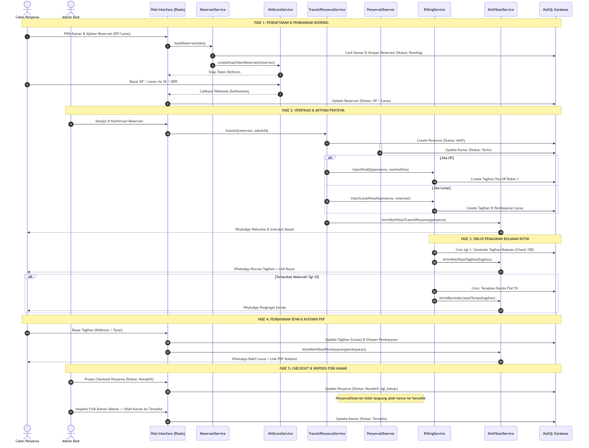

*Berkas skrip sumber Mermaid tersimpan di: [`Blueprint/class/class_alur_siklus_hidup_penyewa.mmd`](file:///c:/xampp/htdocs/asri-boarding-house/Blueprint/class/class_alur_siklus_hidup_penyewa.mmd)*

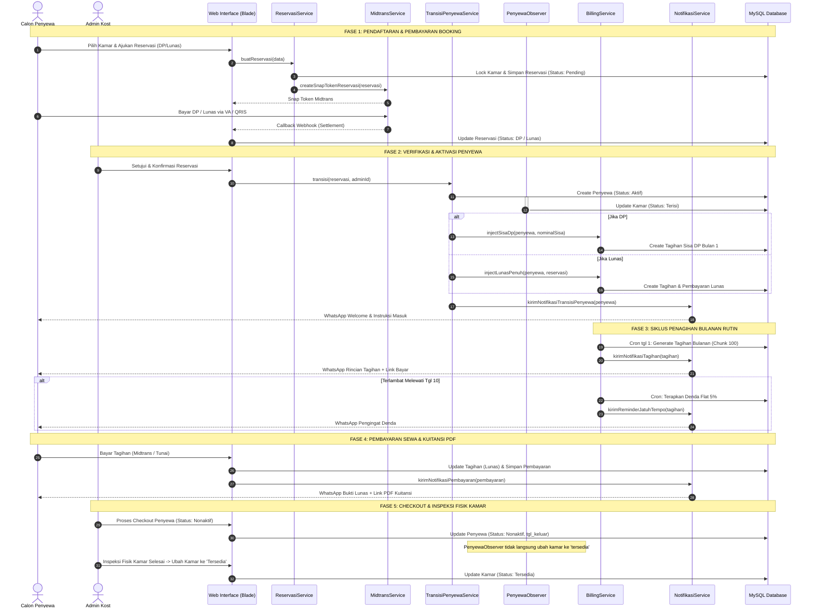
```mermaid
sequenceDiagram
    autonumber
    actor CalonPenyewa as Calon Penyewa
    actor Admin as Admin Kost
    participant Web as Web Interface (Blade)
    participant RS as ReservasiService
    participant MS as MidtransService
    participant TPS as TransisiPenyewaService
    participant PO as PenyewaObserver
    participant BS as BillingService
    participant NS as NotifikasiService
    participant DB as MySQL Database

    Note over CalonPenyewa, DB: FASE 1: PENDAFTARAN & PEMBAYARAN BOOKING
    CalonPenyewa->>Web: Pilih Kamar & Ajukan Reservasi (DP/Lunas)
    Web->>RS: buatReservasi(data)
    RS->>DB: Lock Kamar & Simpan Reservasi (Status: Pending)
    RS->>MS: createSnapTokenReservasi(reservasi)
    MS-->>Web: Snap Token Midtrans
    CalonPenyewa->>MS: Bayar DP / Lunas via VA / QRIS
    MS-->>Web: Callback Webhook (Settlement)
    Web->>DB: Update Reservasi (Status: DP / Lunas)

    Note over Admin, DB: FASE 2: VERIFIKASI & AKTIVASI PENYEWA
    Admin->>Web: Setujui & Konfirmasi Reservasi
    Web->>TPS: transisi(reservasi, adminId)
    TPS->>DB: Create Penyewa (Status: Aktif)
    activate PO
    PO->>DB: Update Kamar (Status: Terisi)
    deactivate PO
    alt Jika DP
        TPS->>BS: injectSisaDp(penyewa, nominalSisa)
        BS->>DB: Create Tagihan Sisa DP Bulan 1
    else Jika Lunas
        TPS->>BS: injectLunasPenuh(penyewa, reservasi)
        BS->>DB: Create Tagihan & Pembayaran Lunas
    end
    TPS->>NS: kirimNotifikasiTransisiPenyewa(penyewa)
    NS-->>CalonPenyewa: WhatsApp Welcome & Instruksi Masuk

    Note over BS, DB: FASE 3: SIKLUS PENAGIHAN BULANAN RUTIN
    BS->>DB: Cron tgl 1: Generate Tagihan Bulanan (Chunk 100)
    BS->>NS: kirimNotifikasiTagihan(tagihan)
    NS-->>CalonPenyewa: WhatsApp Rincian Tagihan + Link Bayar
    alt Terlambat Melewati Tgl 10
        BS->>DB: Cron: Terapkan Denda Flat 5%
        BS->>NS: kirimReminderJatuhTempo(tagihan)
        NS-->>CalonPenyewa: WhatsApp Pengingat Denda
    end

    Note over CalonPenyewa, DB: FASE 4: PEMBAYARAN SEWA & KUITANSI PDF
    CalonPenyewa->>Web: Bayar Tagihan (Midtrans / Tunai)
    Web->>DB: Update Tagihan (Lunas) & Simpan Pembayaran
    Web->>NS: kirimNotifikasiPembayaran(pembayaran)
    NS-->>CalonPenyewa: WhatsApp Bukti Lunas + Link PDF Kuitansi

    Note over Admin, DB: FASE 5: CHECKOUT & INSPEKSI FISIK KAMAR
    Admin->>Web: Proses Checkout Penyewa (Status: Nonaktif)
    Web->>DB: Update Penyewa (Status: Nonaktif, tgl_keluar)
    Note over PO: PenyewaObserver tidak langsung ubah kamar ke 'tersedia'
    Admin->>Web: Inspeksi Fisik Kamar Selesai -> Ubah Kamar ke 'Tersedia'
    Web->>DB: Update Kamar (Status: Tersedia)
```

---

## 5. Rincian Tanggung Jawab Seluruh Kelas (Complete Class Responsibilities)

Berikut adalah ringkasan tanggung jawab tunggal (*Single Responsibility*) seluruh kelas sistem yang dipetakan ke dalam kode sumber:

### A. Model Data Eloquent
1. **[User](file:///c:/xampp/htdocs/asri-boarding-house/app/Models/User.php)**: Mengelola akun otentikasi, otorisasi multi-role (`admin`/`penyewa`), profil penyewa, pengecekan kelengkapan data diri (`isProfileComplete`), verifikasi status tenant aktif, dan anonimisasi data sensitif (`anonymizeAndDelete`).
2. **[Kamar](file:///c:/xampp/htdocs/asri-boarding-house/app/Models/Kamar.php)**: Mengelola atribut fisik unit kamar (lantai, tipe, luas, harga bulanan), perhitungan dinamis tarif sewa harian/mingguan/bulanan (`kalkulasiHargaSewa`), minimal DP 30%, filter status ketersediaan, dan paket promo landing page.
3. **[Fasilitas](file:///c:/xampp/htdocs/asri-boarding-house/app/Models/Fasilitas.php)**: Menyimpan master katalog fasilitas kost (AC, WiFi, Kamar Mandi Dalam, dll.) dengan relasi Many-to-Many (`kamar_fasilitas`) dan query scope fasilitas aktif.
4. **[Penyewa](file:///c:/xampp/htdocs/asri-boarding-house/app/Models/Penyewa.php)**: Mengelola kontrak hunian penyewa aktif, deposit jaminan, billing bulanan rutin, kontak wali darurat, dan deteksi keterlambatan masa sewa (`is_overdue`).
5. **[Tagihan](file:///c:/xampp/htdocs/asri-boarding-house/app/Models/Tagihan.php)**: Mengelola invoice sewa bulanan dan tagihan sisa DP, status tagihan (`pending`, `lunas`, `terlambat`), akumulasi denda flat 5%, serta pesan konfirmasi pembayaran WhatsApp.
6. **[Pembayaran](file:///c:/xampp/htdocs/asri-boarding-house/app/Models/Pembayaran.php)**: Mencatat riwayat transaksi masuk, respon JSON webhook Midtrans (VA/GoPay/QRIS), verifikasi cash manual oleh kasir, dan referensi berkas nota PDF.
7. **[Reservasi](file:///c:/xampp/htdocs/asri-boarding-house/app/Models/Reservasi.php)**: Mengelola pendaftaran booking online, validasi jadwal bebas bentrok (*double booking guard*), Snap token Midtrans, dan status verifikasi DP/Lunas.
8. **[ChatMessage](file:///c:/xampp/htdocs/asri-boarding-house/app/Models/ChatMessage.php)**: Mengelola log pesan diskusi pra-pembayaran calon penyewa dengan admin di bawah konteks reservasi (berelasi Komposisi).
9. **[WhatsappClick](file:///c:/xampp/htdocs/asri-boarding-house/app/Models/WhatsappClick.php)**: Mencatat metrik klik tombol WhatsApp CTA per unit kamar untuk analitik pemasaran.
10. **[Setting](file:///c:/xampp/htdocs/asri-boarding-house/app/Models/Setting.php)**: Menyimpan konfigurasi dinamis sistem berbasis pasangan key-value (kontak, rekening bank, copywriting landing page, persentase diskon durasi sewa).
11. **[CustomerReview](file:///c:/xampp/htdocs/asri-boarding-house/app/Models/CustomerReview.php)**: Mengelola ulasan dan testimonial kepuasan pelanggan untuk katalog publik.
12. **[Pengeluaran](file:///c:/xampp/htdocs/asri-boarding-house/app/Models/Pengeluaran.php)**: Mencatat pengeluaran kas operasional dan pemeliharaan kost beserta lampiran berkas bukti nota.
13. **[Faq](file:///c:/xampp/htdocs/asri-boarding-house/app/Models/Faq.php)**: Menyimpan daftar pertanyaan umum (FAQ) dan jawaban yang ditampilkan pada beranda landing page.
14. **[Keluhan](file:///c:/xampp/htdocs/asri-boarding-house/app/Models/Keluhan.php)**: Mengelola tiket pelaporan kerusakan fasilitas oleh penyewa aktif, foto bukti kendala, dan riwayat tanggapan admin.
15. **[Peraturan](file:///c:/xampp/htdocs/asri-boarding-house/app/Models/Peraturan.php)**: Mengelola daftar tata tertib dan aturan kost yang ditampilkan pada portal penyewa dan halaman publik.
16. **[Gallery](file:///c:/xampp/htdocs/asri-boarding-house/app/Models/Gallery.php)**: Mengelola dokumentasi galeri foto lingkungan fisik dan fasilitas kost putri.
17. **[GuestChatThread](file:///c:/xampp/htdocs/asri-boarding-house/app/Models/GuestChatThread.php)** & **[GuestChatMessage](file:///c:/xampp/htdocs/asri-boarding-house/app/Models/GuestChatMessage.php)**: Mengelola obrolan *live chat* pengunjung landing page berbasis cookie session token (berelasi Komposisi).
18. **[LogNotifikasi](file:///c:/xampp/htdocs/asri-boarding-house/app/Models/LogNotifikasi.php)**: Mencatat log audit riwayat pengiriman notifikasi WhatsApp Fonnte dan Surel untuk tagihan, jatuh tempo, dan kuitansi pembayaran.
19. **[NotifikasiKhusus](file:///c:/xampp/htdocs/asri-boarding-house/app/Models/NotifikasiKhusus.php)**: Mencatat log audit terpusat atas aktivitas mutasi kamar, transaksi, denda, dan pengeluaran untuk pengawasan administrator.
20. **[Pengumuman](file:///c:/xampp/htdocs/asri-boarding-house/app/Models/Pengumuman.php)**: Mengelola pengumuman dan pesan broadcast administrator yang dipublikasikan di dashboard penyewa.

---

### B. Service Layer & Interface
1. **[PdfGeneratorInterface](file:///c:/xampp/htdocs/asri-boarding-house/app/Services/PdfGeneratorInterface.php)** & **[DompdfGenerator](file:///c:/xampp/htdocs/asri-boarding-house/app/Services/DompdfGenerator.php)**: Abstraksi interface dan generator konkrit berbasis Dompdf untuk merender string HTML Blade view menjadi berkas binary PDF.
2. **[PdfNotaService](file:///c:/xampp/htdocs/asri-boarding-house/app/Services/PdfNotaService.php)**: Menggabungkan data pembayaran dengan template kuitansi resmi, memicu perenderan PDF via interface, dan mengelola path berkas kuitansi.
3. **[BillingService](file:///c:/xampp/htdocs/asri-boarding-house/app/Services/BillingService.php)**: Mengeksekusi penagihan masal otomatis (chunk 100 baris) setiap tgl 1, penanganan keterlambatan grace period tgl 10, perhitungan denda bertahap 5%, dan alokasi tagihan sisa DP/lunas.
4. **[ReservasiService](file:///c:/xampp/htdocs/asri-boarding-house/app/Services/ReservasiService.php)**: Memvalidasi formulir booking, pengecekan pencegahan tabrakan tanggal sewa (*double-booking guard*), kalkulasi harga sewa, dan penyimpanan booking baru.
5. **[TransisiPenyewaService](file:///c:/xampp/htdocs/asri-boarding-house/app/Services/TransisiPenyewaService.php)**: Mengorkestrasi pengubahan data reservasi yang disetujui admin menjadi profil penyewa aktif, routing tagihan sisa kewajiban, dan penguncian kamar.
6. **[AdminPenyewaService](file:///c:/xampp/htdocs/asri-boarding-house/app/Services/AdminPenyewaService.php)**: Mengelola pendaftaran manual penyewa offline/walk-in oleh administrator kost, validasi status kamar, dan memicu tagihan awal lunas cash.
7. **[TagihanService](file:///c:/xampp/htdocs/asri-boarding-house/app/Services/TagihanService.php)**: Menangani konfirmasi pembayaran tunai (*cash*) oleh kasir/admin dalam database transaction dan menyediakan kueri terpaginasi dengan filter status.
8. **[DashboardAnalyticsService](file:///c:/xampp/htdocs/asri-boarding-house/app/Services/DashboardAnalyticsService.php)**: Agregasi metrik analitik dashboard admin (tingkat okupansi kamar, arus kas masuk/keluar, keuntungan bersih, breakdown tagihan tertunggak, dan klik CTA WhatsApp).
9. **[MidtransService](file:///c:/xampp/htdocs/asri-boarding-house/app/Services/MidtransService.php)**: Berkomunikasi dengan Midtrans Snap API untuk memuat token transaksi pembayaran tagihan rutin dan reservasi online.
10. **[FonnteService](file:///c:/xampp/htdocs/asri-boarding-house/app/Services/FonnteService.php)**: SDK wrapper API gateway WhatsApp Fonnte dengan nomor tujuan terformat internasional (628xxx).
11. **[NotifikasiService](file:///c:/xampp/htdocs/asri-boarding-house/app/Services/NotifikasiService.php)** & **[NotificationTemplateBuilder](file:///c:/xampp/htdocs/asri-boarding-house/app/Services/Notifications/NotificationTemplateBuilder.php)**: Merakit format pesan terpusat untuk penagihan, pengingat jatuh tempo, eskalasi wali, kuitansi pembayaran, tanggapan keluhan, dan pesan selamat datang.
12. **[SanitizerService](file:///c:/xampp/htdocs/asri-boarding-house/app/Services/SanitizerService.php)**: Sanitasi tag iframe Google Maps agar aman, responsif, dan bebas XSS.
13. **[CalendarStyleHelper](file:///c:/xampp/htdocs/asri-boarding-house/app/Services/CalendarStyleHelper.php)**: Pemetaan kelas warna Tailwind CSS pada visualisasi kalender ketersediaan kamar dan status tagihan.

---

### C. Observers, Middlewares, Jobs, Events, Listeners, Commands, & Policies
1. **Observers (5)**:
   - [PenyewaObserver](file:///c:/xampp/htdocs/asri-boarding-house/app/Observers/PenyewaObserver.php): Mengubah status kamar ke `terisi` saat penyewa dibuat, mencatat tanggal keluar saat checkout, dan mencatat audit log.
   - [FasilitasObserver](file:///c:/xampp/htdocs/asri-boarding-house/app/Observers/FasilitasObserver.php): Membersihkan cache fasilitas landing page saat ada modifikasi data.
   - [KamarObserver](file:///c:/xampp/htdocs/asri-boarding-house/app/Observers/KamarObserver.php): Membersihkan cache kamar katalog publik dan mencatat audit log perubahan kamar.
   - [PengeluaranObserver](file:///c:/xampp/htdocs/asri-boarding-house/app/Observers/PengeluaranObserver.php): Mencatat audit log mutasi pengeluaran kas kost.
   - [SettingObserver](file:///c:/xampp/htdocs/asri-boarding-house/app/Observers/SettingObserver.php): Menyinkronkan cache memori pengaturan landing page.
2. **Middlewares & Validation Rules (8)**:
   - [EnsurePasswordChanged](file:///c:/xampp/htdocs/asri-boarding-house/app/Http/Middleware/EnsurePasswordChanged.php): Mewajibkan penggantian password default saat pertama kali login.
   - [EnsureProfileIsComplete](file:///c:/xampp/htdocs/asri-boarding-house/app/Http/Middleware/EnsureProfileIsComplete.php): Memvalidasi kelengkapan NIK, no HP, dan kontak wali sebelum transaksi.
   - [EnsureTenantIsActive](file:///c:/xampp/htdocs/asri-boarding-house/app/Http/Middleware/EnsureTenantIsActive.php): Membatasi area penyewa hanya untuk pengguna yang memiliki kontrak aktif.
   - [RoleMiddleware](file:///c:/xampp/htdocs/asri-boarding-house/app/Http/Middleware/RoleMiddleware.php): Memvalidasi peran hak akses (`admin` / `penyewa`).
   - [VerifyMidtransSignature](file:///c:/xampp/htdocs/asri-boarding-house/app/Http/Middleware/VerifyMidtransSignature.php): Memvalidasi tanda tangan hash SHA-512 `signature_key` callback webhook Midtrans.
   - [KamarTersediaRule](file:///c:/xampp/htdocs/asri-boarding-house/app/Rules/KamarTersediaRule.php): Memvalidasi ketersediaan unit kamar secara aman.
   - [TanpaPenyewaAktifLainRule](file:///c:/xampp/htdocs/asri-boarding-house/app/Rules/TanpaPenyewaAktifLainRule.php): Mencegah penugasan ganda kamar ke lebih dari satu penyewa aktif.
   - [ValidGoogleMapsEmbed](file:///c:/xampp/htdocs/asri-boarding-house/app/Rules/ValidGoogleMapsEmbed.php): Memvalidasi keabsahan tag iframe embed Google Maps.
3. **Queue Jobs & Notifications (12)**:
   - [GeneratePdfNotaJob](file:///c:/xampp/htdocs/asri-boarding-house/app/Jobs/GeneratePdfNotaJob.php): Merender kuitansi resmi dalam format PDF secara asinkron.
   - [KirimNotifikasiTagihanJob](file:///c:/xampp/htdocs/asri-boarding-house/app/Jobs/KirimNotifikasiTagihanJob.php): Mengirim tagihan bulanan dan link pembayaran ke WA penyewa.
   - [KirimNotifikasiPembayaranJob](file:///c:/xampp/htdocs/asri-boarding-house/app/Jobs/KirimNotifikasiPembayaranJob.php): Mengirim bukti pelunasan dan tautan nota kuitansi PDF ke WA penyewa.
   - [KirimNotifikasiAdminReservasiJob](file:///c:/xampp/htdocs/asri-boarding-house/app/Jobs/KirimNotifikasiAdminReservasiJob.php) & [KirimNotifikasiUserReservasiJob](file:///c:/xampp/htdocs/asri-boarding-house/app/Jobs/KirimNotifikasiUserReservasiJob.php): Mengirim notifikasi status reservasi baru/dibayar/disetujui.
   - [KirimReminderJatuhTempoJob](file:///c:/xampp/htdocs/asri-boarding-house/app/Jobs/KirimReminderJatuhTempoJob.php) & [KirimNotifikasiWaliJob](file:///c:/xampp/htdocs/asri-boarding-house/app/Jobs/KirimNotifikasiWaliJob.php): Mengirim pengingat jatuh tempo dan eskalasi tunggakan ke nomor wali.
   - [KirimWelcomeMessageJob](file:///c:/xampp/htdocs/asri-boarding-house/app/Jobs/KirimWelcomeMessageJob.php): Mengirim pesan WhatsApp selamat datang dan panduan masuk kamar.
   - [BaseResetPasswordNotification](file:///c:/xampp/htdocs/asri-boarding-house/app/Notifications/BaseResetPasswordNotification.php), [AdminResetPasswordNotification](file:///c:/xampp/htdocs/asri-boarding-house/app/Notifications/AdminResetPasswordNotification.php), dan [PenyewaResetPasswordNotification](file:///c:/xampp/htdocs/asri-boarding-house/app/Notifications/PenyewaResetPasswordNotification.php): Mengelola surel reset password berbasis inheritance.
4. **Artisan Console Commands (9)**:
   - [GenerateBulananTagihan](file:///c:/xampp/htdocs/asri-boarding-house/app/Console/Commands/GenerateBulananTagihan.php) (`tagihan:generate-bulanan`): Generasi tagihan bulanan rutin tgl 1.
   - [ProsesKeterlambatanTagihan](file:///c:/xampp/htdocs/asri-boarding-house/app/Console/Commands/ProsesKeterlambatanTagihan.php) (`tagihan:proses-keterlambatan`): Evaluasi denda dan grace period.
   - [CancelExpiredReservations](file:///c:/xampp/htdocs/asri-boarding-house/app/Console/Commands/CancelExpiredReservations.php) (`reservasi:cancel-expired`): Auto-cancel reservasi kadaluarsa > 24 jam.
   - [ReminderHabisKontrakCommand](file:///c:/xampp/htdocs/asri-boarding-house/app/Console/Commands/ReminderHabisKontrakCommand.php) (`kontrak:reminder-habis`): Pengingat masa sewa berakhir pada H-14 dan H-7.
   - [AbhPurgeTrash](file:///c:/xampp/htdocs/asri-boarding-house/app/Console/Commands/AbhPurgeTrash.php) (`abh:purge-trash`): Pembersihan aman record soft-deleted berusia > 90 hari.
   - [PruneClosedGuestChats](file:///c:/xampp/htdocs/asri-boarding-house/app/Console/Commands/PruneClosedGuestChats.php) (`chat-guest:prune`): Pembersihan sesi chat tamu tertutup > 90 hari.
   - [ClearOldNotificationLogs](file:///c:/xampp/htdocs/asri-boarding-house/app/Console/Commands/ClearOldNotificationLogs.php) (`log-notifikasi:clear`), [CheckSystemHealthCommand](file:///c:/xampp/htdocs/asri-boarding-house/app/Console/Commands/CheckSystemHealthCommand.php) (`abh:check-status`), dan [TruncateLogFile](file:///c:/xampp/htdocs/asri-boarding-house/app/Console/Commands/TruncateLogFile.php) (`log:truncate`).
5. **Policies Otorisasi (4)**:
   - [ReservasiPolicy](file:///c:/xampp/htdocs/asri-boarding-house/app/Policies/ReservasiPolicy.php): Otorisasi melihat, membayar, membatalkan, dan berdiskusi pada reservasi.
   - [TagihanPolicy](file:///c:/xampp/htdocs/asri-boarding-house/app/Policies/TagihanPolicy.php): Otorisasi melihat dan membayar invoice bulanan oleh penyewa sah.
   - [PembayaranPolicy](file:///c:/xampp/htdocs/asri-boarding-house/app/Policies/PembayaranPolicy.php): Otorisasi pengunduhan berkas kuitansi PDF resmi.
   - [KeluhanPolicy](file:///c:/xampp/htdocs/asri-boarding-house/app/Policies/KeluhanPolicy.php): Otorisasi pelaporan dan pembacaan tiket keluhan oleh penyewa bersangkutan.

---

## 6. Kesimpulan & Status Validasi Dokumen

Spesifikasi Class Diagram ini telah divalidasi dan dinyatakan:
* **Lengkap (100%)**: Seluruh 21 Model Eloquent, 12 Enumerasi, 13 Layanan & Interface, 5 Observers, 8 Middlewares/Rules, 9 Commands, 11 Events, 14 Listeners/Subscriber, 9 Queue Jobs, dan 4 Policies terpetakan secara utuh.
* **Konsisten**: Menggunakan penamaan method dan tipe data yang sinkron dengan file PHP riil.
* **Semantik Presisi**: Membedakan notasi Asosiasi, Komposisi (`*--`), Realisasi Interface (`..|>`), Pewarisan (`--|>`), dan Injeksi Dependensi (`..>`) secara tepat.
* **Aset Visual Terpadu**: Dilengkapi **19 visualisasi diagram citra PNG** beresolusi tinggi skala 3x dengan *solid white background* pada direktori `Blueprint/class/`.
