# Class Diagram - Asri Boarding House

Dokumen ini mendokumentasikan spesifikasi **Class Diagram (Diagram Kelas), Peta Relasi Struktural, & Alur Interaksi Objek Bisnis** untuk **Sistem Informasi Manajemen Kost Terintegrasi Payment Gateway pada Asri Boarding House**. Class diagram ini memetakan arsitektur berorientasi objek (*Object-Oriented Architecture*) sistem berbasis **Laravel 11**, yang mencakup model-model Eloquent, enumerasi status, kelas layanan bisnis (*Service Layer*), abstraksi interface (*Dependency Inversion*), Model Observers, kelas Middleware, Queue Jobs latar belakang, sistem Event/Listener (*Event-Driven Architecture*), Console Commands, Mailables/Notifications, Policies, serta seluruh relasi struktural (*Association, Aggregation, Composition, Generalization/Inheritance, Realization, dan Dependency*) secara menyeluruh, presisi, dan mudah dipahami.

Semua spesifikasi dalam dokumen ini selaras dengan dokumen blueprint lainnya:
* **Project Blueprint**: [Blueprint_Projek_Web_Asri_Boarding_House.md](file:///c:/xampp/htdocs/asri-boarding-house/Blueprint/Blueprint_Projek_Web_Asri_Boarding_House.md)
* **Use Case Specification**: [Use_Case_Diagram_Kost.md](file:///c:/xampp/htdocs/asri-boarding-house/Blueprint/Use_Case_Diagram_Kost.md)
* **Sequence Diagram Specification**: [Sequence_Diagram_Kost.md](file:///c:/xampp/htdocs/asri-boarding-house/Blueprint/Sequence_Diagram_Kost.md)
* **Component Diagram**: [Component_Diagram_Kost.md](file:///c:/xampp/htdocs/asri-boarding-house/Blueprint/Component_Diagram_Kost.md)
* **Entity Relationship Diagram**: [Entity_Relationship_Diagram_Kost.md](file:///c:/xampp/htdocs/asri-boarding-house/Blueprint/Entity_Relationship_Diagram_Kost.md)
* **Flowchart**: [Flowchart_Kost.md](file:///c:/xampp/htdocs/asri-boarding-house/Blueprint/Flowchart_Kost.md)
* **State Machine Diagram**: [State_Machine_Diagram_Kost.md](file:///c:/xampp/htdocs/asri-boarding-house/Blueprint/State_Machine_Diagram_Kost.md)
* **Deployment Diagram**: [Deployment_Diagram_Kost.md](file:///c:/xampp/htdocs/asri-boarding-house/Blueprint/Deployment_Diagram_Kost.md)

---

## 1. Diagram Kelas Global Master (Global Master Class Diagram)

Di bawah ini adalah representasi visual diagram kelas objek model, enumerasi status, kelas layanan bisnis, middleware kustom, antrean job latar belakang, sistem event/listener, serta relasi antar komponen dalam sistem yang dikelompokkan ke dalam *namespace* fungsional:


*Berkas skrip sumber Mermaid master tersimpan di: [`Blueprint/class/class_diagram_kost.mmd`](file:///c:/xampp/htdocs/asri-boarding-house/Blueprint/class/class_diagram_kost.mmd)*

```mermaid
classDiagram
    direction TB

    %% ==========================================
    %% 1. ENUMERASI KONSEPTUAL DOMAIN (12 ENUMS)
    %% ==========================================
    namespace Domain_Enums {
        class UserRole {
            <<enumeration>>
            ADMIN
            PENYEWA
        }
        class KamarStatus {
            <<enumeration>>
            TERSEDIA
            TERISI
            MAINTENANCE
        }
        class TipeKamar {
            <<enumeration>>
            STANDAR
            DELUXE
            VIP
        }
        class PenyewaStatus {
            <<enumeration>>
            AKTIF
            NONAKTIF
        }
        class TipeSewa {
            <<enumeration>>
            HARIAN
            MINGGUAN
            BULANAN
        }
        class TagihanStatus {
            <<enumeration>>
            PENDING
            LUNAS
            TERLAMBAT
            GAGAL
            KADALUARSA
        }
        class ReservasiStatus {
            <<enumeration>>
            PENDING
            DP
            LUNAS
            DIKONFIRMASI
            BATAL
        }
        class MetodePembayaran {
            <<enumeration>>
            MIDTRANS
            CASH
        }
        class StatusKeluhan {
            <<enumeration>>
            PENDING
            DIPROSES
            SELESAI
        }
        class StatusNotifikasi {
            <<enumeration>>
            SUKSES
            GAGAL
        }
        class ChannelNotifikasi {
            <<enumeration>>
            WHATSAPP
            EMAIL
            SYSTEM
        }
        class GuestChatStatus {
            <<enumeration>>
            ACTIVE
            CLOSED
        }
    }

    %% ==========================================
    %% 2. DOMAIN MODELS (21 MODELS)
    %% ==========================================
    namespace Domain_Models {
        class User {
            +int id
            +string nama
            +string email
            +string password
            +string no_hp
            +string nik
            +string nama_wali
            +string no_wali
            +UserRole role
            +string foto
            +boolean is_active
            +boolean require_password_change
            +penyewa() HasOne
            +reservasi() HasMany
            +chatMessages() HasMany
            +getNameAttribute() string
            +getDashboardRouteName() string
            +isProfileComplete() bool
            +isActiveTenant() bool
            +isAdmin() bool
            +anonymizeAndDelete() void
        }

        class Kamar {
            +int id
            +string nomor_kamar
            +tinyint lantai
            +TipeKamar tipe
            +float luas_m2
            +decimal harga_bulan
            +string deskripsi
            +string foto
            +KamarStatus status
            +fasilitas() BelongsToMany
            +penyewaAktif() HasOne
            +reservasi() HasMany
            +penyewa() HasMany
            +kalkulasiHargaDasar(tipe, durasi) float
            +kalkulasiHargaSewa(tipe, durasi) float
            +kalkulasiMinimalDp(total) float
        }

        class Fasilitas {
            +int id
            +string nama
            +string ikon
            +string deskripsi
            +boolean is_active
            +kamar() BelongsToMany
            +scopeAktif(query) Builder
        }

        class Penyewa {
            +int id
            +int user_id
            +int kamar_id
            +string nik
            +decimal harga_sewa
            +date tanggal_masuk
            +date tanggal_keluar
            +date tanggal_keluar_seharusnya
            +PenyewaStatus status
            +tinyint tanggal_billing
            +TipeSewa tipe_sewa
            +int durasi
            +decimal deposit
            +string nama_wali
            +string no_wali
            +tagihan() HasMany
            +keluhan() HasMany
            +getIsOverdueAttribute() bool
            +getDurasiFormattedAttribute() string
        }

        class Tagihan {
            +int id
            +int penyewa_id
            +string order_id
            +tinyint periode_bulan
            +smallint periode_tahun
            +date tanggal_tagihan
            +date tanggal_jatuh_tempo
            +decimal nominal_pokok
            +decimal nominal_denda
            +decimal nominal_total
            +tinyint bulan_keterlambatan
            +TagihanStatus status
            +MetodePembayaran metode_pembayaran
            +pembayaran() HasMany
            +penyewa() BelongsTo
            +getComputedStatusAttribute() string
            +scopeTerlambat(query) Builder
            +canBeConfirmedManually() bool
        }

        class Pembayaran {
            +int id
            +int tagihan_id
            +string transaction_id
            +string payment_type
            +string bank
            +string va_number
            +decimal nominal
            +string status_midtrans
            +int dikonfirmasi_oleh
            +datetime tanggal_bayar
            +tagihan() BelongsTo
            +dikonfirmasiOleh() BelongsTo
        }

        class Reservasi {
            +bigint id
            +int user_id
            +int kamar_id
            +int dikonfirmasi_oleh
            +int penyewa_id
            +TipeSewa tipe_sewa
            +date tanggal_mulai
            +date tanggal_selesai
            +int durasi
            +decimal total_harga
            +boolean is_dp
            +decimal nominal_dp
            +decimal nominal_sisa
            +string snap_token
            +string order_id
            +string transaction_id
            +ReservasiStatus status
            +chatMessages() HasMany
            +static isKamarTerbooking(kamarId, tglMulai, tglSelesai, excludeId) bool
        }

        class ChatMessage {
            +bigint id
            +bigint reservasi_id
            +int sender_id
            +text message
            +boolean is_read
            +reservasi() BelongsTo
            +sender() BelongsTo
        }

        class Keluhan {
            +int id
            +int penyewa_id
            +string judul
            +string kategori
            +text deskripsi
            +string foto_bukti
            +StatusKeluhan status
            +text tanggapan_admin
            +date tanggal_selesai
            +penyewa() BelongsTo
        }

        class Pengeluaran {
            +int id
            +string nama_pengeluaran
            +string kategori
            +decimal nominal
            +date tanggal_pengeluaran
            +string bukti_nota
        }

        class Setting {
            +string key
            +text value
            +static get(key, default) string
            +static getDiscountForDuration(tipe, durasi) float
        }

        class LogNotifikasi {
            +int id
            +int penyewa_id
            +int tagihan_id
            +ChannelNotifikasi channel
            +string event
            +StatusNotifikasi status
            +text pesan
            +penyewa() BelongsTo
            +tagihan() BelongsTo
        }

        class NotifikasiKhusus {
            +int id
            +string sumber
            +string tipe_aktivitas
            +int user_id
            +user() BelongsTo
            +static log(sumber, tipe, deskripsi, userId, data) void
        }

        class GuestChatThread {
            +bigint id
            +string session_token
            +string name
            +string no_hp
            +GuestChatStatus status
            +messages() HasMany
            +latestMessage() HasOne
        }

        class GuestChatMessage {
            +bigint id
            +bigint guest_chat_thread_id
            +string sender_type
            +int sender_id
            +text message
            +boolean is_read
            +thread() BelongsTo
            +sender() BelongsTo
        }

        class WhatsappClick {
            +int id
            +int kamar_id
            +string source
            +kamar() BelongsTo
        }

        class CustomerReview {
            +int id
            +string nama
            +string pekerjaan
            +tinyint bintang
            +text ulasan
            +string foto
        }

        class Faq {
            +int id
            +string pertanyaan
            +text jawaban
            +int urutan
            +boolean is_active
            +scopeAktif(query) Builder
        }

        class Peraturan {
            +int id
            +string judul
            +text deskripsi
            +string ikon
            +int urutan
        }

        class Gallery {
            +int id
            +string judul
            +string foto
            +boolean is_active
            +scopeAktif(query) Builder
        }

        class Pengumuman {
            +int id
            +string judul
            +text isi
            +boolean is_active
        }
    }

    %% ==========================================
    %% 3. SERVICE LAYER & REPORT ENGINE
    %% ==========================================
    namespace Service_Layer {
        class PdfGeneratorInterface {
            <<interface>>
            +generate(view, data, paper, orientation) string
        }

        class DompdfGenerator {
            +generate(view, data, paper, orientation) string
        }

        class BillingService {
            +generateTagihanBulanan() void
            +prosesKeterlambatan() void
            +terapkanDendaDirect(Tagihan) void
            +injectSisaDp(Penyewa, float) void
            +injectLunasPenuh(Penyewa, Reservasi, int) void
            +injectManualPenyewaLunas(Penyewa, int) void
            +perpanjangKontrakManual(Penyewa, int, int) Tagihan
        }

        class ReservasiService {
            +hitungHarga(Kamar, string, int) array
            +cekDoubleBooking(Kamar, string, string) bool
            +buatReservasi(array) Reservasi
            +batalkanReservasi(Reservasi) void
        }

        class TransisiPenyewaService {
            #BillingService billingService
            +transisi(Reservasi, int, array) Penyewa
        }

        class AdminPenyewaService {
            #BillingService billingService
            +registerPenyewa(array, int) Penyewa
        }

        class TagihanService {
            +confirmCashPayment(Tagihan, int, string) Pembayaran
            +getFilteredPaginatedTagihan(request, perPage) LengthAwarePaginator
        }

        class DashboardAnalyticsService {
            +getDashboardMetrics() array
        }

        class NotificationTemplateBuilder {
            +buildTagihanBaru(Tagihan, Penyewa) string
            +buildPembayaranBerhasil(Pembayaran) string
            +buildReminderJatuhTempo(Tagihan, Penyewa) string
            +buildNotifikasiWali(Tagihan, Penyewa) string
            +buildDenda(Tagihan, Penyewa) string
            +buildWelcomePenyewa(Penyewa) string
            +buildReservasiDibuat(Reservasi) string
            +buildReservasiDibayar(Reservasi) string
            +buildReservasiDikonfirmasi(Reservasi) string
        }

        class NotifikasiService {
            #FonnteService fonnte
            #NotificationTemplateBuilder templateBuilder
            +kirimNotifikasiTagihan(Tagihan, bool) void
            +kirimNotifikasiPembayaran(Pembayaran, bool) void
            +kirimNotifikasiWelcomePenyewa(Penyewa, bool) void
            +kirimNotifikasiTransisiPenyewa(Penyewa, bool) void
            +kirimReminderJatuhTempo(Tagihan, bool) void
            +kirimNotifikasiWali(Tagihan, bool) void
            +kirimNotifikasiKeluhanDibuat(Keluhan, bool) void
            +kirimNotifikasiKeluhanDitanggapi(Keluhan, bool) void
        }

        class FonnteService {
            +kirimPesan(nomor, pesan) bool
            +formatNomor(nomor) string
        }

        class MidtransService {
            +createSnapToken(Tagihan) array
            +createSnapTokenReservasi(Reservasi) array
        }
    }

    %% ==========================================
    %% 4. OBSERVERS, MIDDLEWARES, RULES & POLICIES
    %% ==========================================
    namespace Infra_Security {
        class PenyewaObserver {
            +creating(Penyewa) void
            +created(Penyewa) void
            +updating(Penyewa) void
            +updated(Penyewa) void
        }

        class KamarObserver {
            +created(Kamar) void
            +updated(Kamar) void
            +deleted(Kamar) void
            +restored(Kamar) void
            +forceDeleted(Kamar) void
        }

        class FasilitasObserver {
            +saved(Fasilitas) void
            +deleted(Fasilitas) void
        }

        class PengeluaranObserver {
            +created(Pengeluaran) void
            +deleted(Pengeluaran) void
        }

        class SettingObserver {
            +saved(Setting) void
            +deleted(Setting) void
        }

        class RoleMiddleware {
            +handle(request, next, role) Response
        }

        class VerifyMidtransSignature {
            +handle(request, next) Response
        }

        class EnsureTenantIsActive {
            +handle(request, next) Response
        }

        class EnsureProfileIsComplete {
            +handle(request, next) Response
        }

        class EnsurePasswordChanged {
            +handle(request, next) Response
        }

        class KamarTersediaRule {
            +validate(attribute, value, fail) void
        }

        class TanpaPenyewaAktifLainRule {
            +validate(attribute, value, fail) void
        }

        class ValidGoogleMapsEmbed {
            +passes(attribute, value) bool
        }

        class BaseResetPasswordNotification {
            <<abstract>>
            #string token
            #getRoleName()* string
            #resolveRouteName(notifiable)* string
            +toMail(notifiable) MailMessage
        }

        class AdminResetPasswordNotification {
            +ROUTE_NAME string
        }

        class PenyewaResetPasswordNotification {
            +ROUTE_NAME string
        }

        class ReservasiPolicy {
            +view(User, Reservasi) bool
            +chat(User, Reservasi) bool
            +pay(User, Reservasi) bool
            +update(User, Reservasi) bool
        }

        class TagihanPolicy {
            +view(User, Tagihan) bool
            +pay(User, Tagihan) bool
        }

        class PembayaranPolicy {
            +downloadNota(User, Pembayaran) bool
        }

        class KeluhanPolicy {
            +view(User, Keluhan) bool
        }
    }

    %% ==========================================
    %% 5. EVENTS, LISTENERS & QUEUE JOBS
    %% ==========================================
    namespace Event_Driven {
        class TagihanDibuat {
            +Tagihan tagihan
        }
        class HandleTagihanDibuat {
            +handle(TagihanDibuat) void
        }
        class KirimNotifikasiTagihanJob {
            +Tagihan tagihan
            +handle(NotifikasiService) void
        }

        class PembayaranCashDikonfirmasi {
            +Pembayaran pembayaran
        }
        class KirimEmailPembayaranCashListener {
            +handle(PembayaranCashDikonfirmasi) void
        }
        class KirimNotifikasiPembayaranJob {
            +Pembayaran pembayaran
            +handle(NotifikasiService) void
        }

        class ReservasiDibuat {
            +Reservasi reservasi
        }
        class HandleReservasiDibuat {
            +handle(ReservasiDibuat) void
        }
        class KirimNotifikasiAdminReservasiJob {
            +Reservasi reservasi
            +handle(NotifikasiService) void
        }

        class ReservasiDibayar {
            +Reservasi reservasi
        }
        class HandleReservasiDibayar {
            +handle(ReservasiDibayar) void
        }
        class KirimNotifikasiUserReservasiJob {
            +Reservasi reservasi
            +handle(NotifikasiService) void
        }

        class ReservasiDikonfirmasi {
            +Reservasi reservasi
        }
        class ProsesTransisiPenyewa {
            +handle(ReservasiDikonfirmasi) void
        }

        class NotifikasiKhususSubscriber {
            +subscribe(events) array
        }
    }

    %% Relasi Model Inti %%
    User "1" -- "0..1" Penyewa : One to One (Active Contract)
    Kamar "1" -- "*" Penyewa : One to Many (Historical)
    Kamar "*" -- "*" Fasilitas : Many to Many (Pivot kamar_fasilitas)
    Penyewa "1" -- "*" Tagihan : One to Many
    Tagihan "1" -- "*" Pembayaran : One to Many
    User "1" -- "*" Reservasi : One to Many (Customer)
    Kamar "1" -- "*" Reservasi : One to Many
    Reservasi "1" *-- "*" ChatMessage : Composition (Lifecycle Dependent)
    Penyewa "1" -- "*" Keluhan : One to Many
    GuestChatThread "1" *-- "*" GuestChatMessage : Composition (Lifecycle Dependent)
    Penyewa "1" -- "*" LogNotifikasi : One to Many
    Tagihan "1" -- "*" LogNotifikasi : One to Many
    User "1" -- "*" NotifikasiKhusus : One to Many
    Kamar "1" -- "*" WhatsappClick : One to Many
    User "1" -- "*" ChatMessage : One to Many (Sender)
    Reservasi "1" -- "0..1" Penyewa : References Activated Tenant
    User "1" -- "*" Pembayaran : Confirmed Cash By Admin

    %% Relasi Service & Realization %%
    DompdfGenerator ..|> PdfGeneratorInterface : Implements
    TransisiPenyewaService ..> BillingService : Dependency Injection
    AdminPenyewaService ..> BillingService : Dependency Injection
    NotifikasiService *-- NotificationTemplateBuilder : Composes
    NotifikasiService ..> FonnteService : Uses API Gateway

    BillingService ..> Tagihan : Creates / Updates
    BillingService ..> Penyewa : Manages
    ReservasiService ..> Reservasi : Creates
    TransisiPenyewaService ..> Penyewa : Activates
    TagihanService ..> Pembayaran : Records Cash Payment

    %% Relasi Observers & Security %%
    PenyewaObserver ..> Penyewa : Observes Lifecycle
    PenyewaObserver ..> Kamar : Locks Room 'terisi'
    KamarObserver ..> Kamar : Observes & Clears Cache
    FasilitasObserver ..> Fasilitas : Clears Cache
    PengeluaranObserver ..> Pengeluaran : Observes
    SettingObserver ..> Setting : Syncs Cache

    AdminResetPasswordNotification --|> BaseResetPasswordNotification : Extends
    PenyewaResetPasswordNotification --|> BaseResetPasswordNotification : Extends
    ReservasiPolicy ..> Reservasi : Authorizes
    TagihanPolicy ..> Tagihan : Authorizes
    PembayaranPolicy ..> Pembayaran : Authorizes
    KeluhanPolicy ..> Keluhan : Authorizes

    %% Relasi Event Pipeline Riil %%
    TagihanDibuat ..> HandleTagihanDibuat : Triggers
    HandleTagihanDibuat ..> KirimNotifikasiTagihanJob : Dispatches
    KirimNotifikasiTagihanJob ..> NotifikasiService : Executes

    PembayaranCashDikonfirmasi ..> KirimEmailPembayaranCashListener : Triggers
    KirimEmailPembayaranCashListener ..> KirimNotifikasiPembayaranJob : Dispatches
    KirimNotifikasiPembayaranJob ..> NotifikasiService : Executes

    ReservasiDibuat ..> HandleReservasiDibuat : Triggers
    HandleReservasiDibuat ..> KirimNotifikasiAdminReservasiJob : Dispatches
    KirimNotifikasiAdminReservasiJob ..> NotifikasiService : Executes

    ReservasiDibayar ..> HandleReservasiDibayar : Triggers
    HandleReservasiDibayar ..> KirimNotifikasiUserReservasiJob : Dispatches
    KirimNotifikasiUserReservasiJob ..> NotifikasiService : Executes

    ReservasiDikonfirmasi ..> ProsesTransisiPenyewa : Triggers
    ProsesTransisiPenyewa ..> NotifikasiService : Calls Welcome Notif
```

---

## 2. Peta Relasi Struktural Antar Layer (Structural Relationship Map)

Untuk memberikan gambaran arsitektur sistem secara berjenjang dan seimbang, diagram berikut memetakan relasi antar layer (Tier/Subsystem) dalam sistem:


*Berkas skrip sumber Mermaid tersimpan di: [`Blueprint/class/class_relasi_struktural_global.mmd`](file:///c:/xampp/htdocs/asri-boarding-house/Blueprint/class/class_relasi_struktural_global.mmd)*

```mermaid
classDiagram
    direction TB

    %% Layer 1: Security & Middlewares %%
    namespace Security_Authorization {
        class BaseResetPasswordNotification { <<abstract>> }
        class AdminResetPasswordNotification
        class PenyewaResetPasswordNotification
        class ReservasiPolicy
        class TagihanPolicy
        class PembayaranPolicy
        class KeluhanPolicy
        class Middlewares
        class ValidationRules
    }

    %% Layer 2: Business Service Layer %%
    namespace Business_Services {
        class PdfGeneratorInterface { <<interface>> }
        class DompdfGenerator
        class BillingService
        class ReservasiService
        class TransisiPenyewaService
        class AdminPenyewaService
        class TagihanService
        class DashboardAnalyticsService
        class NotifikasiService
        class FonnteService
        class MidtransService
    }

    %% Layer 3: Event-Driven Infrastructure %%
    namespace Event_Queues {
        class TagihanDibuat
        class HandleTagihanDibuat
        class KirimNotifikasiTagihanJob
        class PembayaranCashDikonfirmasi
        class KirimEmailPembayaranCashListener
        class KirimNotifikasiPembayaranJob
        class ReservasiDibuat
        class HandleReservasiDibuat
        class KirimNotifikasiAdminReservasiJob
        class ReservasiDikonfirmasi
        class ProsesTransisiPenyewa
        class NotifikasiKhususSubscriber
    }

    %% Layer 4: Data Models & Persistence %%
    namespace Data_Persistence {
        class User
        class Kamar
        class Fasilitas
        class Penyewa
        class Tagihan
        class Pembayaran
        class Reservasi
        class ChatMessage
        class Keluhan
        class Pengeluaran
        class Setting
        class LogNotifikasi
        class NotifikasiKhusus
        class GuestChatThread
        class GuestChatMessage
        class WhatsappClick
        class PenyewaObserver
        class KamarObserver
    }

    %% Relasi Realization & Inheritance %%
    AdminResetPasswordNotification --|> BaseResetPasswordNotification : Extends
    PenyewaResetPasswordNotification --|> BaseResetPasswordNotification : Extends
    DompdfGenerator ..|> PdfGeneratorInterface : Implements

    %% Relasi Service Dependencies %%
    TransisiPenyewaService ..> BillingService : Uses
    AdminPenyewaService ..> BillingService : Uses
    TransisiPenyewaService ..> ReservasiService : Coordinates
    NotifikasiService ..> FonnteService : Uses Gateway

    %% Relasi Policy & Middlewares to Models %%
    ReservasiPolicy ..> Reservasi : Authorizes
    TagihanPolicy ..> Tagihan : Authorizes
    PembayaranPolicy ..> Pembayaran : Authorizes
    KeluhanPolicy ..> Keluhan : Authorizes
    Middlewares ..> User : Guards
    ValidationRules ..> Kamar : Validates

    %% Relasi Service to Models %%
    BillingService ..> Tagihan : Generates
    BillingService ..> Penyewa : Manages
    ReservasiService ..> Reservasi : Processes
    TagihanService ..> Pembayaran : Records Cash
    DashboardAnalyticsService ..> Pembayaran : Aggregates
    DashboardAnalyticsService ..> Pengeluaran : Aggregates

    %% Relasi Event & Queues %%
    TagihanDibuat ..> HandleTagihanDibuat : Triggers
    HandleTagihanDibuat ..> KirimNotifikasiTagihanJob : Dispatches
    KirimNotifikasiTagihanJob ..> NotifikasiService : Executes

    PembayaranCashDikonfirmasi ..> KirimEmailPembayaranCashListener : Triggers
    KirimEmailPembayaranCashListener ..> KirimNotifikasiPembayaranJob : Dispatches
    KirimNotifikasiPembayaranJob ..> NotifikasiService : Executes

    ReservasiDibuat ..> HandleReservasiDibuat : Triggers
    HandleReservasiDibuat ..> KirimNotifikasiAdminReservasiJob : Dispatches
    KirimNotifikasiAdminReservasiJob ..> NotifikasiService : Executes

    ReservasiDikonfirmasi ..> ProsesTransisiPenyewa : Triggers
    ProsesTransisiPenyewa ..> NotifikasiService : Calls Welcome Notif

    %% Relasi Domain Associations %%
    User "1" -- "0..1" Penyewa : 1 to 0..1 Active
    Kamar "1" -- "*" Penyewa : 1 to N Historical
    Kamar "*" -- "*" Fasilitas : N to M
    Penyewa "1" -- "*" Tagihan : 1 to N
    Tagihan "1" -- "*" Pembayaran : 1 to N
    User "1" -- "*" Reservasi : 1 to N
    Kamar "1" -- "*" Reservasi : 1 to N
    Reservasi "1" *-- "*" ChatMessage : Composition
    Penyewa "1" -- "*" Keluhan : 1 to N
    GuestChatThread "1" *-- "*" GuestChatMessage : Composition
    Kamar "1" -- "*" WhatsappClick : 1 to N

    %% Relasi Observers %%
    PenyewaObserver ..> Penyewa : Observes
    PenyewaObserver ..> Kamar : Locks room
    KamarObserver ..> Kamar : Observes
```

---

## 3. Visualisasi Relasi Khusus & Tanggung Jawab Kelas (Dedicated Relationship Diagrams)

Untuk memahami secara mendalam hubungan antar kelas pada setiap ranah (*domain context*), berikut adalah visualisasi terfokus beserta penjelasan rinci hubungan dan tanggung jawabnya:

### A. Visualisasi Relasi Domain Models Inti (Association & Composition)

Diagram ini mengilustrasikan asosiasi struktural, relasi kepemilikan siklus hidup (*Composition*), dan kardinalitas antar model:


*Berkas skrip sumber Mermaid tersimpan di: [`Blueprint/class/class_relasi_domain_models.mmd`](file:///c:/xampp/htdocs/asri-boarding-house/Blueprint/class/class_relasi_domain_models.mmd)*

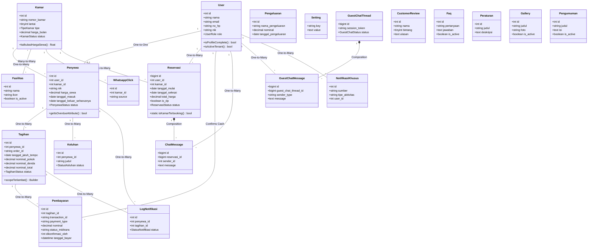

---

### B. Visualisasi Relasi Service Layer & Dependency Inversion (DIP)

Diagram ini mengilustrasikan pemisahan logika bisnis dari controller, penggunaan *Dependency Injection*, dan penerapan *Inversion of Control*:


*Berkas skrip sumber Mermaid tersimpan di: [`Blueprint/class/class_relasi_service_layer.mmd`](file:///c:/xampp/htdocs/asri-boarding-house/Blueprint/class/class_relasi_service_layer.mmd)*

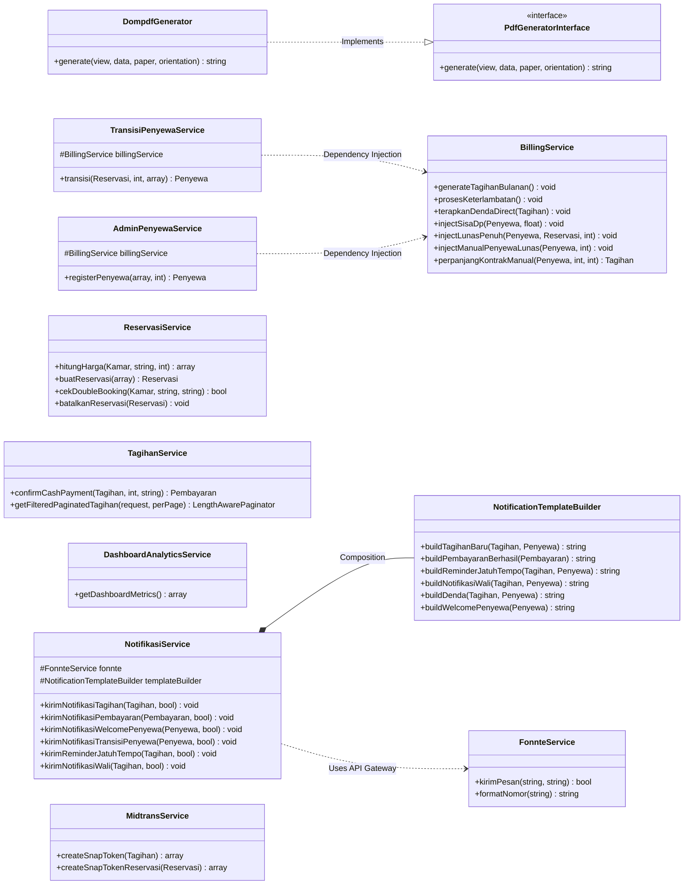

---

### C. Visualisasi Alur Event-Driven Architecture (EDA) & Antrean Latar Belakang

Diagram ini mengilustrasikan bagaimana peristiwa mutasi data (*Events*) memicu pendengar (*Listeners*) untuk mengeksekusi tugas latar belakang asinkron (*Queue Jobs*):


*Berkas skrip sumber Mermaid tersimpan di: [`Blueprint/class/class_relasi_event_queue_pipeline.mmd`](file:///c:/xampp/htdocs/asri-boarding-house/Blueprint/class/class_relasi_event_queue_pipeline.mmd)*

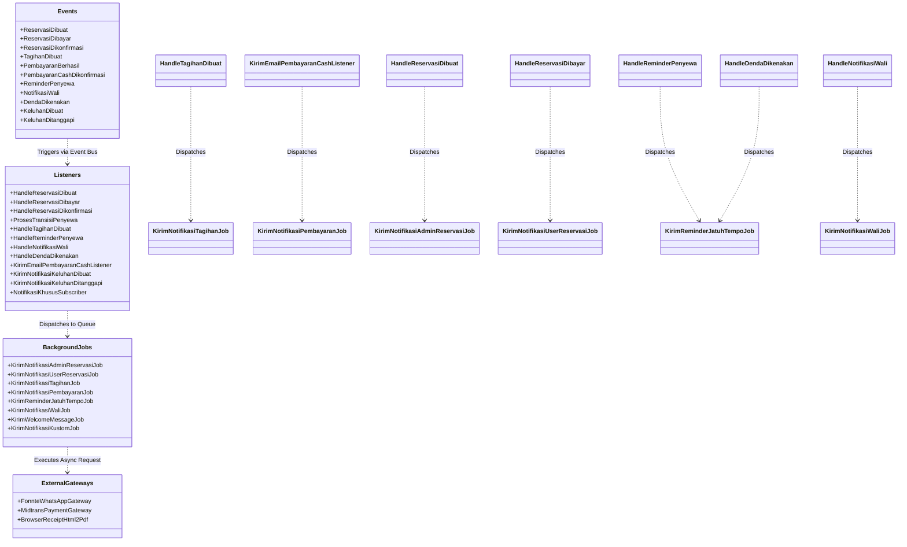

---

### D. Visualisasi Pewarisan (Inheritance) & Kebijakan Otorisasi Keamanan

Diagram ini memperlihatkan pemanfaatan *Object-Oriented Inheritance* dan pemisahan otorisasi *Policy-Based Authorization*:


*Berkas skrip sumber Mermaid tersimpan di: [`Blueprint/class/class_relasi_inheritance_security.mmd`](file:///c:/xampp/htdocs/asri-boarding-house/Blueprint/class/class_relasi_inheritance_security.mmd)*

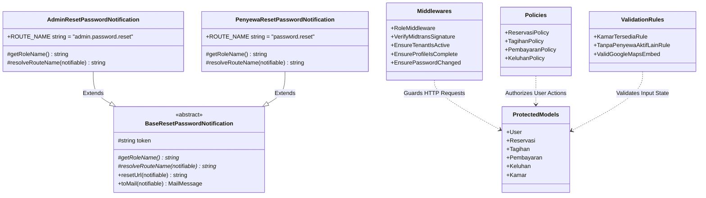

---

## 4. Visualisasi Alur Proses Bisnis & Interaksi Antar Objek Kelas (Business Workflow Diagrams)

Di bawah ini disajikan diagram alur (*flowcharts*) dan diagram sekuens (*sequences*) yang memvisualisasikan bagaimana kelas-kelas model, layanan (*service*), middleware, event listener, dan gateway eksternal berkolaborasi dalam setiap proses bisnis utama sistem:

---

### Alur 1: Alur Reservasi Kamar & Pembayaran Midtrans Snap

Diagram alur ini memvisualisasikan proses pemesanan kamar online, pemeriksaan kelengkapan profil, kalkulasi diskon & DP 30%, pencegahan bentrok jadwal (*double booking*), penerbitan token Snap Midtrans, dan verifikasi webhook SHA-512:


*Berkas skrip sumber Mermaid tersimpan di: [`Blueprint/class/class_alur_reservasi_pembayaran.mmd`](file:///c:/xampp/htdocs/asri-boarding-house/Blueprint/class/class_alur_reservasi_pembayaran.mmd)*

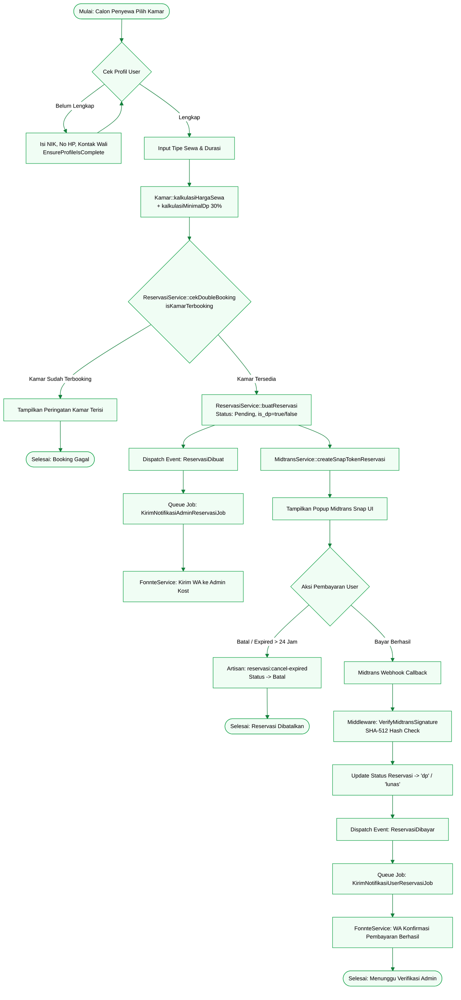

---

### Alur 2: Alur Verifikasi Admin & Transisi Aktivasi Penyewa Baru

Diagram alur ini memvisualisasikan bagaimana data reservasi yang disetujui admin dialihkan menjadi profil penyewa aktif dalam transaksi database atomik, memicu `PenyewaObserver` untuk mengunci status kamar menjadi `terisi`, dan menginjeksi tagihan sisa DP:


*Berkas skrip sumber Mermaid tersimpan di: [`Blueprint/class/class_alur_transisi_aktivasi_penyewa.mmd`](file:///c:/xampp/htdocs/asri-boarding-house/Blueprint/class/class_alur_transisi_aktivasi_penyewa.mmd)*

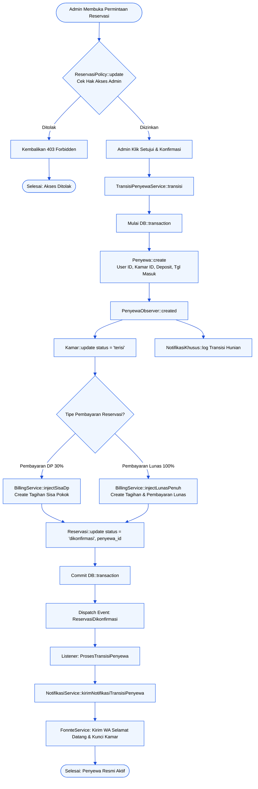

---

### Alur 3: Alur Siklus Billing Otomatis & Penanganan Denda Keterlambatan

Diagram alur ini memvisualisasikan eksekusi cron harian dan bulanan (*Artisan Commands*) untuk penagihan masal otomatis (chunking 100 baris), pemantauan grace period (tgl 10), kalkulasi denda bertahap 5%, dan pengiriman notifikasi WhatsApp ke penyewa & nomor wali:


*Berkas skrip sumber Mermaid tersimpan di: [`Blueprint/class/class_alur_siklus_billing.mmd`](file:///c:/xampp/htdocs/asri-boarding-house/Blueprint/class/class_alur_siklus_billing.mmd)*

```mermaid
%%{init: {
  'theme': 'base',
  'themeVariables': {
    'primaryColor': '#FFFBEB',
    'primaryTextColor': '#000000',
    'primaryBorderColor': '#D97706',
    'lineColor': '#B45309',
    'secondaryColor': '#FEF3C7',
    'tertiaryColor': '#FFFFFF',
    'edgeLabelBackground': '#FFFFFF',
    'fontSize': '12px',
    'fontFamily': 'Inter, system-ui, sans-serif'
  }
}}%%
flowchart TD
    Start([Jadwal Cron Server: Tanggal 1 Tiap Bulan]) --> RunGenerateCmd[Artisan: tagihan:generate-bulanan<br>GenerateBulananTagihan]
    RunGenerateCmd --> CallBilling[BillingService::generateTagihanBulanan]
    
    CallBilling --> QueryTenants[Ambil Semua Penyewa Status 'aktif'<br>Chunking per 100 Baris]
    QueryTenants --> LoopTenant{Iterasi Setiap Penyewa}
    
    LoopTenant --> CheckExisting{Sudah Ada Tagihan Bulan Ini?}
    CheckExisting -->|Ya| SkipTenant[Lewati Penyewa]
    CheckExisting -->|Belum| CreateBill[Tagihan::create<br>Nominal Pokok = harga_sewa, Status = 'pending']
    
    CreateBill --> DispatchBillEvent[Dispatch Event: TagihanDibuat]
    DispatchBillEvent --> DispatchBillJob[Queue Job: KirimNotifikasiTagihanJob]
    DispatchBillJob --> SendBillWA[FonnteService: Kirim WA Rincian Invoice & Link Bayar]
    
    SkipTenant --> NextTenant[Lanjut ke Penyewa Berikutnya]
    SendBillWA --> NextTenant
    NextTenant --> CheckMoreTenants{Masih Ada Penyewa?}
    CheckMoreTenants -->|Ya| LoopTenant
    CheckMoreTenants -->|Selesai| EndGenerate([Tagihan Bulanan Berhasil Dibuat])
    
    EndGenerate -.-> DailyCron([Jadwal Cron Harian: Cek Jatuh Tempo])
    DailyCron --> RunLateCmd[Artisan: tagihan:proses-keterlambatan<br>ProsesKeterlambatanTagihan]
    RunLateCmd --> CallProcessLate[BillingService::prosesKeterlambatan]
    
    CallProcessLate --> CheckDueDate{Lewat Tanggal Jatuh Tempo tgl 10?}
    CheckDueDate -->|H-3 sd H-1 Jatuh Tempo| SendReminderJob[Queue Job: KirimReminderJatuhTempoJob<br>WhatsApp Pengingat Jatuh Tempo]
    CheckDueDate -->|Lewat Jatuh Tempo & Belum Denda| ApplyFine[BillingService::terapkanDendaDirect<br>Nominal Denda = 5% Flat]
    
    ApplyFine --> UpdateLateStatus[Update Status Tagihan -> 'terlambat']
    UpdateLateStatus --> DispatchFineEvent[Dispatch Event: DendaDikenakan]
    DispatchFineEvent --> NotifyLateJob[Queue Job: KirimReminderJatuhTempoJob + KirimNotifikasiWaliJob]
    NotifyLateJob --> SendLateWA[FonnteService: Kirim WA Peringatan Denda ke Penyewa & Wali]
    SendLateWA --> EndBillingCycle([Selesai Siklus Penagihan])
```

---

### Alur 4: Alur Pembayaran Tagihan & Penerbitan Kuitansi Digital (Client-Side Rendering)

Diagram alur ini memvisualisasikan bagaimana pembayaran lunas (baik online via Midtrans maupun tunai di kasir) memicu notifikasi bukti lunas WhatsApp dan perenderan kuitansi resmi langsung di sisi peramban (*Client-Side Rendering*) menggunakan pustaka `html2pdf.js` dengan prinsip *Zero Server Load*:


*Berkas skrip sumber Mermaid tersimpan di: [`Blueprint/class/class_alur_pembayaran_kuitansi_pdf.mmd`](file:///c:/xampp/htdocs/asri-boarding-house/Blueprint/class/class_alur_pembayaran_kuitansi_pdf.mmd)*

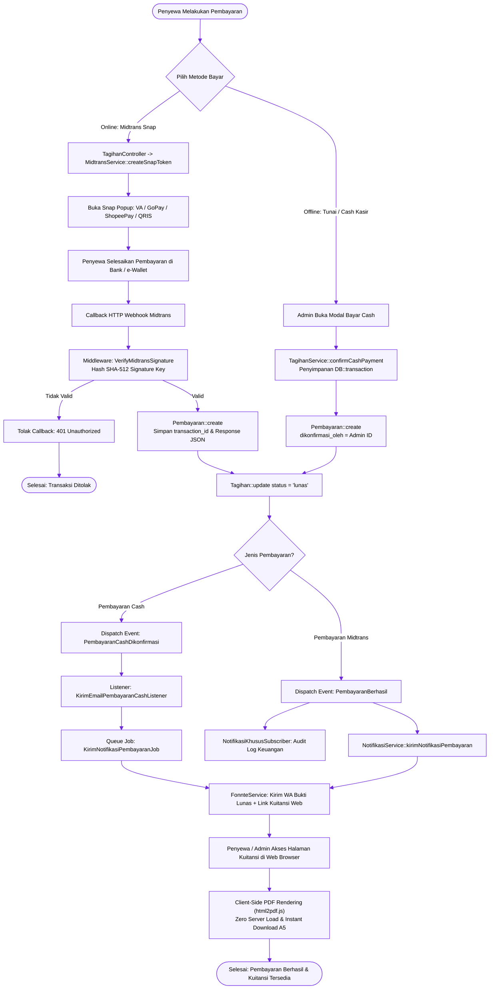

---

### Alur 5: Alur Siklus Hidup Pengaduan Keluhan Fasilitas (*Complaint Lifecycle*)

Diagram alur ini memvisualisasikan siklus hidup tiket pengaduan keluhan fasilitas oleh penyewa aktif, pengiriman notifikasi WhatsApp ke admin, pemrosesan perbaikan fisik, hingga pengiriman konfirmasi penyelesaian ke penyewa:


*Berkas skrip sumber Mermaid tersimpan di: [`Blueprint/class/class_alur_pengaduan_keluhan.mmd`](file:///c:/xampp/htdocs/asri-boarding-house/Blueprint/class/class_alur_pengaduan_keluhan.mmd)*

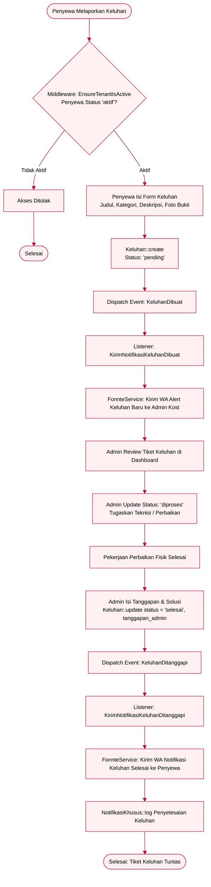

---

### Alur 6: Alur Agregasi Arus Kas & Analitik Dashboard (*Financial Flow*)

Diagram alur ini memvisualisasikan agregasi metrik keuangan oleh `DashboardAnalyticsService` dari tabel `reservasi`, `pembayaran`, dan `pengeluaran` untuk menghasilkan laba bersih, tingkat okupansi kamar, dan ekspor laporan PDF/Excel:


*Berkas skrip sumber Mermaid tersimpan di: [`Blueprint/class/class_alur_integrasi_arus_kas.mmd`](file:///c:/xampp/htdocs/asri-boarding-house/Blueprint/class/class_alur_integrasi_arus_kas.mmd)*

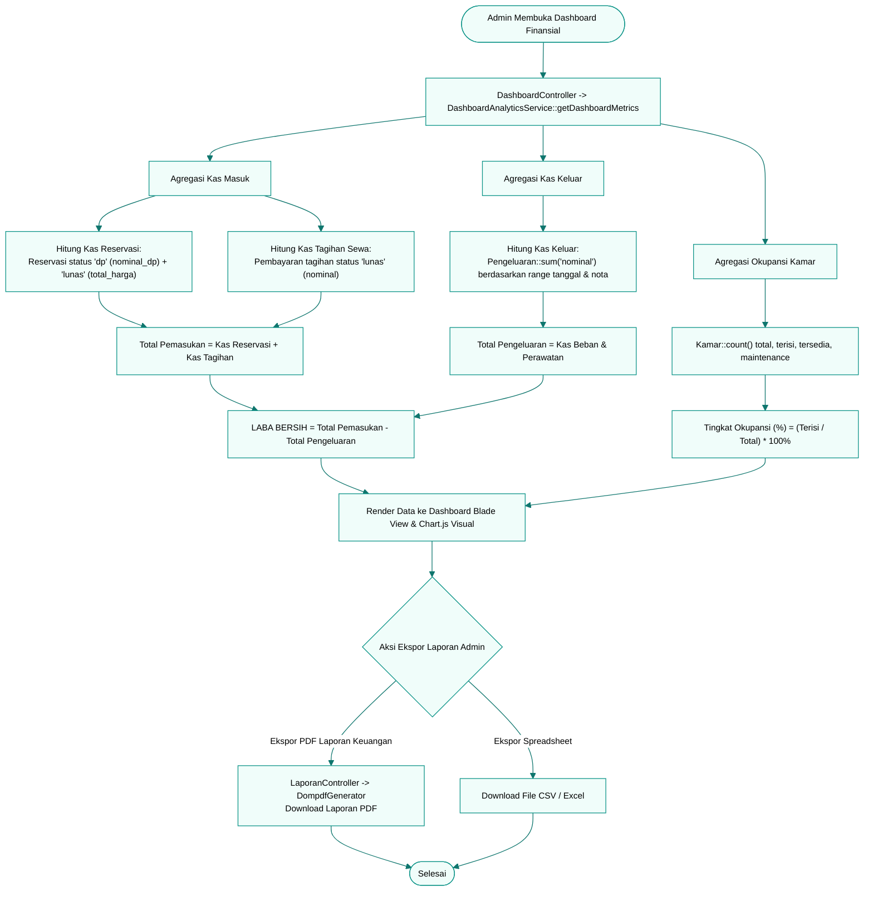

---

### Alur 7: Alur Siklus Hidup Penyewa End-to-End (*Tenant Lifecycle Sequence*)

Diagram sekuens komprehensif ini merangkum kolaborasi objek antar kelas sepanjang masa sewa penyewa dari pendaftaran booking awal hingga checkout fisik kamar:


*Berkas skrip sumber Mermaid tersimpan di: [`Blueprint/class/class_alur_siklus_hidup_penyewa.mmd`](file:///c:/xampp/htdocs/asri-boarding-house/Blueprint/class/class_alur_siklus_hidup_penyewa.mmd)*

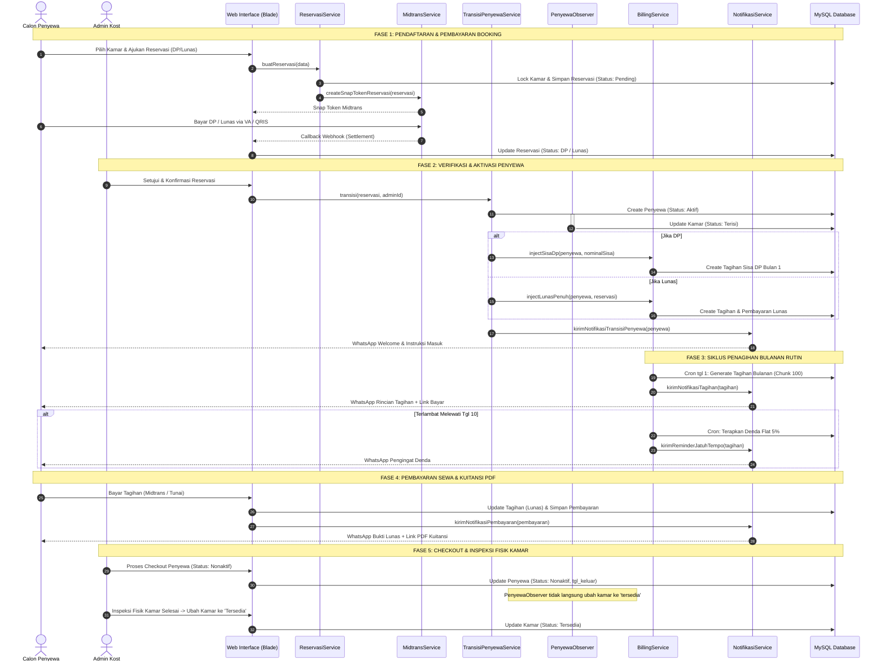

---

## 5. Rincian Tanggung Jawab Seluruh Kelas (Complete Class Responsibilities)

Berikut adalah ringkasan tanggung jawab tunggal (*Single Responsibility*) seluruh kelas sistem yang dipetakan ke dalam kode sumber:

### A. Model Data Eloquent (21 Models & 1 Pivot)
1. **[User](file:///c:/xampp/htdocs/asri-boarding-house/app/Models/User.php)**: Mengelola akun otentikasi, otorisasi multi-role (`admin`/`penyewa`), kontak wali darurat (`nama_wali`, `no_wali`), pengecekan kelengkapan data diri (`isProfileComplete`), verifikasi status tenant aktif (`isActiveTenant`), status admin (`isAdmin`), dan pembersihan data aman saat soft delete (`anonymizeAndDelete`).
2. **[Kamar](file:///c:/xampp/htdocs/asri-boarding-house/app/Models/Kamar.php)**: Mengelola atribut fisik unit kamar (lantai, tipe sewa, luas m2, foto, harga bulanan), perhitungan dinamis tarif sewa harian/mingguan/bulanan (`kalkulasiHargaSewa`), minimal DP 30% (`kalkulasiMinimalDp`), filter status ketersediaan, dan paket promo landing page.
3. **[Fasilitas](file:///c:/xampp/htdocs/asri-boarding-house/app/Models/Fasilitas.php)**: Menyimpan master katalog fasilitas kost (AC, WiFi, Kamar Mandi Dalam, dll.) dengan relasi Many-to-Many (`kamar_fasilitas`) dan query scope fasilitas aktif.
4. **[Penyewa](file:///c:/xampp/htdocs/asri-boarding-house/app/Models/Penyewa.php)**: Mengelola kontrak hunian penyewa aktif, NIK penghuni, uang jaminan deposit, billing bulanan rutin, tanggal checkout aktual, kontak wali darurat, dan deteksi keterlambatan masa sewa (`getIsOverdueAttribute`).
5. **[Tagihan](file:///c:/xampp/htdocs/asri-boarding-house/app/Models/Tagihan.php)**: Mengelola invoice sewa bulanan dan sisa DP, tanggal jatuh tempo (tgl 10), breakdown nominal pokok dan nominal denda, status tagihan (`pending`, `lunas`, `terlambat`, `gagal`, `kadaluarsa`), metode pembayaran, serta konfirmasi cash manual.
6. **[Pembayaran](file:///c:/xampp/htdocs/asri-boarding-house/app/Models/Pembayaran.php)**: Mencatat riwayat transaksi masuk, jenis kanal pembayaran (`payment_type`, `bank`, `va_number`), verifikasi webhook Midtrans (SHA-512), dan konfirmasi kasir cash manual (`dikonfirmasi_oleh`).
7. **[Reservasi](file:///c:/xampp/htdocs/asri-boarding-house/app/Models/Reservasi.php)**: Mengelola booking online, validasi jadwal bebas bentrok (`static isKamarTerbooking`), rentang tanggal sewa (`tanggal_mulai`, `tanggal_selesai`), durasi & tipe sewa, token Snap Midtrans, dan status verifikasi DP/Lunas.
8. **[ChatMessage](file:///c:/xampp/htdocs/asri-boarding-house/app/Models/ChatMessage.php)**: Mengelola log pesan diskusi pra-pembayaran calon penyewa dengan admin di bawah konteks reservasi (berelasi Komposisi).
9. **[WhatsappClick](file:///c:/xampp/htdocs/asri-boarding-house/app/Models/WhatsappClick.php)**: Mencatat metrik klik tombol WhatsApp CTA per unit kamar untuk analitik pemasaran landing page.
10. **[Setting](file:///c:/xampp/htdocs/asri-boarding-house/app/Models/Setting.php)**: Menyimpan konfigurasi dinamis sistem berbasis pasangan key-value (kontak, rekening bank, copywriting landing page, persentase diskon durasi sewa).
11. **[CustomerReview](file:///c:/xampp/htdocs/asri-boarding-house/app/Models/CustomerReview.php)**: Mengelola ulasan dan testimonial kepuasan pelanggan untuk katalog publik.
12. **[Pengeluaran](file:///c:/xampp/htdocs/asri-boarding-house/app/Models/Pengeluaran.php)**: Mencatat pengeluaran kas operasional dan pemeliharaan kost beserta lampiran berkas bukti nota.
13. **[Faq](file:///c:/xampp/htdocs/asri-boarding-house/app/Models/Faq.php)**: Menyimpan daftar pertanyaan umum (FAQ) dan jawaban yang ditampilkan pada beranda landing page.
14. **[Keluhan](file:///c:/xampp/htdocs/asri-boarding-house/app/Models/Keluhan.php)**: Mengelola tiket pelaporan kerusakan fasilitas oleh penyewa aktif, kategori kendala, foto bukti kendala, status penanganan, dan riwayat tanggapan admin.
15. **[Peraturan](file:///c:/xampp/htdocs/asri-boarding-house/app/Models/Peraturan.php)**: Mengelola daftar tata tertib dan aturan kost yang ditampilkan pada portal penyewa dan halaman publik.
16. **[Gallery](file:///c:/xampp/htdocs/asri-boarding-house/app/Models/Gallery.php)**: Mengelola dokumentasi galeri foto lingkungan fisik dan fasilitas kost putri.
17. **[GuestChatThread](file:///c:/xampp/htdocs/asri-boarding-house/app/Models/GuestChatThread.php)** & **[GuestChatMessage](file:///c:/xampp/htdocs/asri-boarding-house/app/Models/GuestChatMessage.php)**: Mengelola obrolan *live chat* pengunjung landing page berbasis cookie session token (berelasi Komposisi).
18. **[LogNotifikasi](file:///c:/xampp/htdocs/asri-boarding-house/app/Models/LogNotifikasi.php)**: Mencatat log audit riwayat pengiriman notifikasi WhatsApp Fonnte dan Surel untuk tagihan, jatuh tempo, dan kuitansi pembayaran.
19. **[NotifikasiKhusus](file:///c:/xampp/htdocs/asri-boarding-house/app/Models/NotifikasiKhusus.php)**: Mencatat log audit terpusat atas aktivitas mutasi kamar, transaksi, denda, dan pengeluaran untuk pengawasan administrator.
20. **[Pengumuman](file:///c:/xampp/htdocs/asri-boarding-house/app/Models/Pengumuman.php)**: Mengelola pengumuman dan pesan broadcast administrator yang dipublikasikan di dashboard penyewa.

---

### B. Service Layer & Interface (12 Layanan & Abstraksi)
1. **[PdfGeneratorInterface](file:///c:/xampp/htdocs/asri-boarding-house/app/Services/PdfGeneratorInterface.php)** & **[DompdfGenerator](file:///c:/xampp/htdocs/asri-boarding-house/app/Services/DompdfGenerator.php)**: Abstraksi interface dan generator konkrit berbasis Dompdf untuk merender laporan rekapitulasi PDF administratif admin ([LaporanController](file:///c:/xampp/htdocs/asri-boarding-house/app/Http/Controllers/Admin/LaporanController.php) dan [PenyewaController](file:///c:/xampp/htdocs/asri-boarding-house/app/Http/Controllers/Admin/PenyewaController.php)).
2. **[BillingService](file:///c:/xampp/htdocs/asri-boarding-house/app/Services/BillingService.php)**: Mengeksekusi penagihan masal otomatis (chunk 100 baris) setiap tgl 1, penanganan keterlambatan grace period tgl 10, perhitungan denda bertahap 5%, alokasi tagihan sisa DP/lunas, dan perpanjangan kontrak manual.
3. **[ReservasiService](file:///c:/xampp/htdocs/asri-boarding-house/app/Services/ReservasiService.php)**: Memvalidasi formulir booking, pengecekan pencegahan tabrakan tanggal sewa (*double-booking guard*), kalkulasi harga sewa, pembuatan reservasi baru, dan pembatalan reservasi kedaluwarsa.
4. **[TransisiPenyewaService](file:///c:/xampp/htdocs/asri-boarding-house/app/Services/TransisiPenyewaService.php)**: Mengorkestrasi pengubahan data reservasi yang disetujui admin menjadi profil penyewa aktif, routing tagihan sisa kewajiban, pemulihan soft-delete mantan penyewa, dan penguncian kamar.
5. **[AdminPenyewaService](file:///c:/xampp/htdocs/asri-boarding-house/app/Services/AdminPenyewaService.php)**: Mengelola pendaftaran manual penyewa offline/walk-in oleh administrator kost, validasi status kamar, dan memicu tagihan awal lunas cash.
6. **[TagihanService](file:///c:/xampp/htdocs/asri-boarding-house/app/Services/TagihanService.php)**: Menangani konfirmasi pembayaran tunai (*cash*) oleh kasir/admin dalam database transaction dan menyediakan kueri terpaginasi dengan filter status.
7. **[DashboardAnalyticsService](file:///c:/xampp/htdocs/asri-boarding-house/app/Services/DashboardAnalyticsService.php)**: Agregasi metrik analitik dashboard admin (tingkat okupansi kamar, arus kas masuk/keluar, keuntungan bersih, breakdown tagihan tertunggak, dan klik CTA WhatsApp).
8. **[MidtransService](file:///c:/xampp/htdocs/asri-boarding-house/app/Services/MidtransService.php)**: Berkomunikasi dengan Midtrans Snap API untuk memuat token transaksi pembayaran tagihan rutin dan reservasi online.
9. **[FonnteService](file:///c:/xampp/htdocs/asri-boarding-house/app/Services/FonnteService.php)**: SDK wrapper API gateway WhatsApp Fonnte dengan nomor tujuan terformat internasional (628xxx).
10. **[NotifikasiService](file:///c:/xampp/htdocs/asri-boarding-house/app/Services/NotifikasiService.php)** & **[NotificationTemplateBuilder](file:///c:/xampp/htdocs/asri-boarding-house/app/Services/Notifications/NotificationTemplateBuilder.php)**: Merakit format pesan terpusat untuk penagihan, pengingat jatuh tempo, eskalasi wali, kuitansi pembayaran, tanggapan keluhan, dan pesan selamat datang.
11. **[SanitizerService](file:///c:/xampp/htdocs/asri-boarding-house/app/Services/SanitizerService.php)**: Sanitasi tag iframe Google Maps agar aman, responsif, dan bebas XSS.
12. **[CalendarStyleHelper](file:///c:/xampp/htdocs/asri-boarding-house/app/Services/CalendarStyleHelper.php)**: Pemetaan kelas warna Tailwind CSS pada visualisasi kalender ketersediaan kamar dan status tagihan.

---

### C. Observers, Middlewares, Jobs, Events, Listeners, Commands, & Policies
1. **Observers (5)**:
   - [PenyewaObserver](file:///c:/xampp/htdocs/asri-boarding-house/app/Observers/PenyewaObserver.php): Mengubah status kamar ke `terisi` saat penyewa dibuat, mencatat tanggal keluar saat checkout, dan mencatat audit log.
   - [FasilitasObserver](file:///c:/xampp/htdocs/asri-boarding-house/app/Observers/FasilitasObserver.php): Membersihkan cache fasilitas landing page saat ada modifikasi data.
   - [KamarObserver](file:///c:/xampp/htdocs/asri-boarding-house/app/Observers/KamarObserver.php): Membersihkan cache kamar katalog publik dan mencatat audit log perubahan kamar (`created`, `updated`, `deleted`, `restored`, `forceDeleted`).
   - [PengeluaranObserver](file:///c:/xampp/htdocs/asri-boarding-house/app/Observers/PengeluaranObserver.php): Mencatat audit log mutasi pengeluaran kas operasional.
   - [SettingObserver](file:///c:/xampp/htdocs/asri-boarding-house/app/Observers/SettingObserver.php): Menyinkronkan cache memori pengaturan landing page.
2. **Middlewares & Validation Rules (8)**:
   - [EnsurePasswordChanged](file:///c:/xampp/htdocs/asri-boarding-house/app/Http/Middleware/EnsurePasswordChanged.php): Mewajibkan penggantian password default saat pertama kali login.
   - [EnsureProfileIsComplete](file:///c:/xampp/htdocs/asri-boarding-house/app/Http/Middleware/EnsureProfileIsComplete.php): Memvalidasi kelengkapan NIK, no HP, dan kontak wali sebelum transaksi.
   - [EnsureTenantIsActive](file:///c:/xampp/htdocs/asri-boarding-house/app/Http/Middleware/EnsureTenantIsActive.php): Membatasi area portal penyewa hanya untuk penghuni berstatus kontrak aktif.
   - [RoleMiddleware](file:///c:/xampp/htdocs/asri-boarding-house/app/Http/Middleware/RoleMiddleware.php): Memvalidasi peran hak akses (`admin` / `penyewa`).
   - [VerifyMidtransSignature](file:///c:/xampp/htdocs/asri-boarding-house/app/Http/Middleware/VerifyMidtransSignature.php): Memvalidasi tanda tangan hash SHA-512 `signature_key` callback webhook Midtrans.
   - [KamarTersediaRule](file:///c:/xampp/htdocs/asri-boarding-house/app/Rules/KamarTersediaRule.php): Memvalidasi ketersediaan unit kamar secara aman.
   - [TanpaPenyewaAktifLainRule](file:///c:/xampp/htdocs/asri-boarding-house/app/Rules/TanpaPenyewaAktifLainRule.php): Mencegah penugasan ganda kamar ke lebih dari satu penyewa aktif.
   - [ValidGoogleMapsEmbed](file:///c:/xampp/htdocs/asri-boarding-house/app/Rules/ValidGoogleMapsEmbed.php): Memvalidasi keabsahan tag iframe embed Google Maps.
3. **Queue Jobs & Notifications (11)**:
   - [KirimNotifikasiTagihanJob](file:///c:/xampp/htdocs/asri-boarding-house/app/Jobs/KirimNotifikasiTagihanJob.php): Mengirim tagihan bulanan dan link pembayaran ke WhatsApp penyewa.
   - [KirimNotifikasiPembayaranJob](file:///c:/xampp/htdocs/asri-boarding-house/app/Jobs/KirimNotifikasiPembayaranJob.php): Mengirim bukti pelunasan dan tautan nota kuitansi digital ke WhatsApp penyewa.
   - [KirimNotifikasiAdminReservasiJob](file:///c:/xampp/htdocs/asri-boarding-house/app/Jobs/KirimNotifikasiAdminReservasiJob.php) & [KirimNotifikasiUserReservasiJob](file:///c:/xampp/htdocs/asri-boarding-house/app/Jobs/KirimNotifikasiUserReservasiJob.php): Mengirim notifikasi status reservasi baru/dibayar/disetujui.
   - [KirimReminderJatuhTempoJob](file:///c:/xampp/htdocs/asri-boarding-house/app/Jobs/KirimReminderJatuhTempoJob.php) & [KirimNotifikasiWaliJob](file:///c:/xampp/htdocs/asri-boarding-house/app/Jobs/KirimNotifikasiWaliJob.php): Mengirim pengingat jatuh tempo dan eskalasi tunggakan ke nomor wali.
   - [KirimWelcomeMessageJob](file:///c:/xampp/htdocs/asri-boarding-house/app/Jobs/KirimWelcomeMessageJob.php): Mengirim pesan WhatsApp selamat datang dan panduan masuk kamar.
   - [KirimNotifikasiKustomJob](file:///c:/xampp/htdocs/asri-boarding-house/app/Jobs/KirimNotifikasiKustomJob.php): Mengirim pesan siaran khusus admin ke penyewa.
   - [BaseResetPasswordNotification](file:///c:/xampp/htdocs/asri-boarding-house/app/Notifications/BaseResetPasswordNotification.php), [AdminResetPasswordNotification](file:///c:/xampp/htdocs/asri-boarding-house/app/Notifications/AdminResetPasswordNotification.php), dan [PenyewaResetPasswordNotification](file:///c:/xampp/htdocs/asri-boarding-house/app/Notifications/PenyewaResetPasswordNotification.php): Mengelola surel reset password berbasis inheritance.
4. **Artisan Console Commands (9)**:
   - [GenerateBulananTagihan](file:///c:/xampp/htdocs/asri-boarding-house/app/Console/Commands/GenerateBulananTagihan.php) (`tagihan:generate-bulanan`): Generasi tagihan bulanan rutin tgl 1.
   - [ProsesKeterlambatanTagihan](file:///c:/xampp/htdocs/asri-boarding-house/app/Console/Commands/ProsesKeterlambatanTagihan.php) (`tagihan:proses-keterlambatan`): Evaluasi denda dan grace period.
   - [CancelExpiredReservations](file:///c:/xampp/htdocs/asri-boarding-house/app/Console/Commands/CancelExpiredReservations.php) (`reservasi:cancel-expired`): Auto-cancel reservasi kadaluarsa > 24 jam.
   - [ReminderHabisKontrakCommand](file:///c:/xampp/htdocs/asri-boarding-house/app/Console/Commands/ReminderHabisKontrakCommand.php) (`kontrak:reminder-habis`): Pengingat masa sewa berakhir pada H-14 dan H-7.
   - [AbhPurgeTrash](file:///c:/xampp/htdocs/asri-boarding-house/app/Console/Commands/AbhPurgeTrash.php) (`abh:purge-trash`): Pembersihan aman record soft-deleted berusia > 90 hari.
   - [PruneClosedGuestChats](file:///c:/xampp/htdocs/asri-boarding-house/app/Console/Commands/PruneClosedGuestChats.php) (`chat-guest:prune`): Pembersihan sesi chat tamu tertutup > 90 hari.
   - [ClearOldNotificationLogs](file:///c:/xampp/htdocs/asri-boarding-house/app/Console/Commands/ClearOldNotificationLogs.php) (`log-notifikasi:clear`), [CheckSystemHealthCommand](file:///c:/xampp/htdocs/asri-boarding-house/app/Console/Commands/CheckSystemHealthCommand.php) (`abh:check-status`), dan [TruncateLogFile](file:///c:/xampp/htdocs/asri-boarding-house/app/Console/Commands/TruncateLogFile.php) (`log:truncate`).
5. **Policies Otorisasi (4)**:
   - [ReservasiPolicy](file:///c:/xampp/htdocs/asri-boarding-house/app/Policies/ReservasiPolicy.php): Otorisasi melihat (`view`), berdiskusi chat (`chat`), membayar (`pay`), dan membatalkan/mengubah (`update`) pada reservasi.
   - [TagihanPolicy](file:///c:/xampp/htdocs/asri-boarding-house/app/Policies/TagihanPolicy.php): Otorisasi melihat dan membayar invoice bulanan oleh penyewa sah.
   - [PembayaranPolicy](file:///c:/xampp/htdocs/asri-boarding-house/app/Policies/PembayaranPolicy.php): Otorisasi pengunduhan berkas kuitansi digital resmi (`downloadNota`).
   - [KeluhanPolicy](file:///c:/xampp/htdocs/asri-boarding-house/app/Policies/KeluhanPolicy.php): Otorisasi pelaporan dan pembacaan tiket keluhan oleh penyewa bersangkutan.

---

## 6. Kesimpulan & Status Validasi Dokumen

Spesifikasi Class Diagram ini telah divalidasi dan dinyatakan:
* **Lengkap (100%)**: Seluruh **21 Model Eloquent & 1 Pivot Table (`kamar_fasilitas`)**, **12 Enumerasi Konseptual**, **12 Layanan Bisnis & Interface**, **5 Observers**, **8 Middlewares/Rules**, **9 Console Commands**, **11 Domain Events**, **12 Event Listeners & Subscriber**, **8 Queue Jobs**, dan **4 Policies** terpetakan secara utuh dan transparan.
* **Konsisten Tanpa Ghost Classes**: Artefak usang pasca-refaktorisasi v235.0 (`PdfNotaService`, `GeneratePdfNotaJob`, `GeneratePdfNotaListener`, dan `pembayaran.pdf_path`) telah dieliminasi total, dan arsitektur rendering kuitansi resmi diselaraskan dengan pustaka client-side `html2pdf.js`.
* **Semantik UML Presisi**: Menggunakan notasi Asosiasi (`--`), Komposisi (`*--`), Realisasi Interface (`..|>`), Pewarisan (`--|>`), dan Injeksi Dependensi (`..>`) secara akurat sesuai kaidah Unified Modeling Language.
* **Aset Visual Terpadu**: Dilengkapi **19 visualisasi diagram citra PNG** beresolusi tinggi skala 3x dengan *solid white background* pada direktori `Blueprint/class/`.
