# Component Diagram - Asri Boarding House

Dokumen ini mendokumentasikan spesifikasi **Component Diagram (Diagram Komponen)** untuk **Sistem Informasi Manajemen Kost Terintegrasi Payment Gateway pada Asri Boarding House**. Diagram komponen ini memvisualisasikan pembagian arsitektur sistem MVC 3-Tier secara jelas ke dalam blok-blok komponen modular, menggambarkan bagaimana Tier 1 (Presentation), Tier 2 (Application), dan Tier 3 (Data) berinteraksi satu sama lain serta terintegrasi dengan layanan eksternal (Midtrans Payment Gateway, Fonnte WhatsApp API, dan Google OAuth API).

Semua spesifikasi dalam dokumen ini selaras dengan dokumen blueprint lainnya:
* **Project Blueprint**: [Blueprint_Projek_Web_Asri_Boarding_House.md](file:///c:/xampp/htdocs/asri-boarding-house/Blueprint/Blueprint_Projek_Web_Asri_Boarding_House.md)
* **Use Case Specification**: [Use_Case_Diagram_Kost.md](file:///c:/xampp/htdocs/asri-boarding-house/Blueprint/Use_Case_Diagram_Kost.md)
* **Sequence Diagram Specification**: [Sequence_Diagram_Kost.md](file:///c:/xampp/htdocs/asri-boarding-house/Blueprint/Sequence_Diagram_Kost.md)
* **Class Diagram**: [Class_Diagram_Kost.md](file:///c:/xampp/htdocs/asri-boarding-house/Blueprint/Class_Diagram_Kost.md)
* **Entity Relationship Diagram**: [Entity_Relationship_Diagram_Kost.md](file:///c:/xampp/htdocs/asri-boarding-house/Blueprint/Entity_Relationship_Diagram_Kost.md)
* **Flowchart**: [Flowchart_Kost.md](file:///c:/xampp/htdocs/asri-boarding-house/Blueprint/Flowchart_Kost.md)
* **State Machine Diagram**: [State_Machine_Diagram_Kost.md](file:///c:/xampp/htdocs/asri-boarding-house/Blueprint/State_Machine_Diagram_Kost.md)
* **Deployment Diagram**: [Deployment_Diagram_Kost.md](file:///c:/xampp/htdocs/asri-boarding-house/Blueprint/Deployment_Diagram_Kost.md)

---

## 1. Diagram Komponen (Mermaid)

Di bawah ini adalah representasi visual diagram komponen sistem yang menggambarkan pembagian lapisan arsitektur (3-Tier) beserta abstraksi interface dan dependensi antarkomponen secara komprehensif sesuai codebase riil:

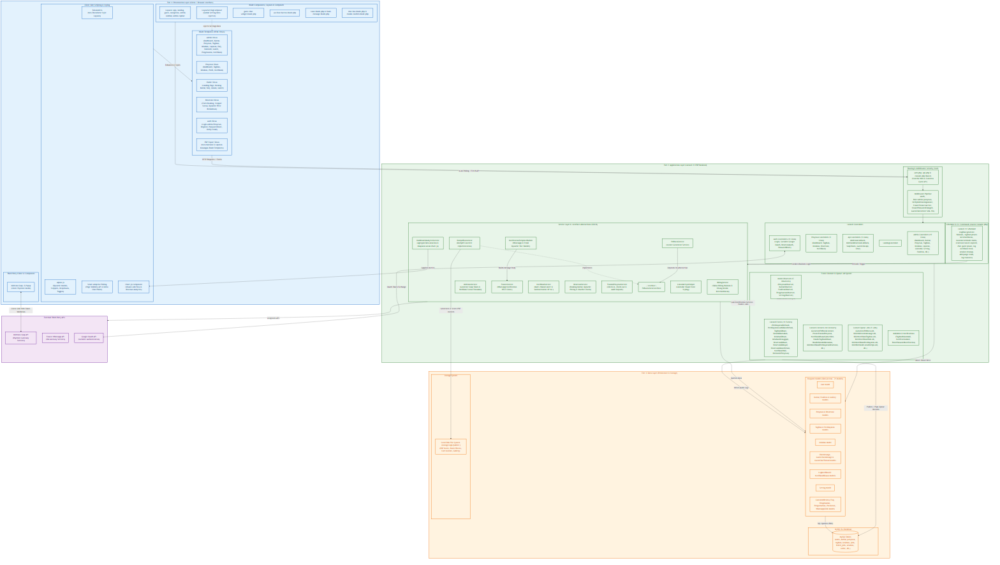

```mermaid
flowchart TB
    %% =========================================================================
    %% TIER 1: PRESENTATION LAYER
    %% =========================================================================
    subgraph PresentationTier["Tier 1: Presentation Layer (Client / Browser Interface)"]
        direction TB
        subgraph Views["Blade Templates (HTML Views)"]
            AdminViews["Admin Views<br/>(Dashboard, Kamar, Penyewa, Tagihan, Keluhan, Laporan, FAQ, Kalender, Galeri, Pengeluaran, Notifikasi)"]
            PenyewaViews["Penyewa Views<br/>(Dashboard, Tagihan, Keluhan, Profil, Notifikasi)"]
            PublicViews["Public Views<br/>(Landing Page, Katalog Kamar, FAQ, Ulasan, Galeri)"]
            ReservasiViews["Reservasi Views<br/>(Form Booking, Stepper Status, Dynamic Price Breakdown)"]
            AuthViews["Auth Views<br/>(Login Admin/Penyewa, Register, Password Reset, Verify Email)"]
            PdfViews["PDF Export Views<br/>(Nota Kuitansi & Laporan Keuangan Blade Templates)"]
        end
        
        subgraph ReusableComp["Blade Components, Layouts & Composers"]
            LayoutComp["Layouts: app, landing, guest, navigation, admin-sidebar, admin-topbar"]
            ViewComposer["LayoutSettingComposer<br/>(Global Setting Data Injector)"]
            ChatBox["guest-chat-widget.blade.php"]
            WAButton["wa-float-button.blade.php"]
            Toast["toast.blade.php & flash-message.blade.php"]
            ChatBoxReserv["chat-box.blade.php & modal-confirm.blade.php"]
        end
        
        subgraph ClientScript["Client-Side Scripting & Styling"]
            Tailwind["TailwindCSS<br/>(Neo-Brutalisme Style Layouts)"]
            AlpineJS["Alpine.js<br/>(Dynamic Modals, Steppers, Dropdowns, Toggles)"]
            AJAXPoll["Smart Adaptive Polling<br/>(Page Visibility API & Delta Chat Poller)"]
            ChartJS["Chart.js Component<br/>(Visual Cash Flow & Revenue Analytics)"]
        end
        
        subgraph ExtClient["Third-Party Client UI Component"]
            MidtransSnap["Midtrans Snap JS Popup<br/>(Client Payment Modal)"]
        end
    end

    %% =========================================================================
    %% TIER 2: APPLICATION LAYER
    %% =========================================================================
    subgraph ApplicationTier["Tier 2: Application Layer (Laravel 11 PHP Backend)"]
        direction TB
        subgraph RoutingMiddleware["Routing & Middleware Security Stack"]
            Routes["web.php, api.php & console.php Routes<br/>(Stateful Web & Stateless Guest API)"]
            Middleware["Middleware Pipeline<br/>(Auth, Role:admin/penyewa, VerifyMidtransSignature, EnsureTenantIsActive, EnsurePasswordChanged, GuestChatLimiter SHA-256)"]
        end
        
        subgraph Controllers["Laravel Controllers"]
            AdminCtrl["Admin Controllers (19 Class)<br/>(Dashboard, Kamar, Penyewa, Tagihan, Keluhan, Laporan, Calendar, Setting, Fasilitas, dll.)"]
            PenyewaCtrl["Penyewa Controllers (5 Class)<br/>(Dashboard, Tagihan, Keluhan, Reservasi, Notifikasi)"]
            ApiCtrl["Api Controllers (5 Class)<br/>(MidtransCallback, MidtransReservasiCallback, SnapToken, GuestChatApi, Chat)"]
            PublicCtrl["LandingController"]
            AuthCtrl["Auth Controllers (11 Class)<br/>(Login, Socialite Google OAuth, ReservasiAuth, PasswordReset)"]
        end
        
        subgraph Services["Service Layer & Interface Abstractions (SOLID)"]
            BillingServ["BillingService<br/>(Siklus Billing Bulanan & Hitung Denda Keterlambatan)"]
            MidtransServ["MidtransService<br/>(Generate Snap Token & Verifikasi Status Transaksi)"]
            FonnteServ["FonnteService<br/>(WhatsApp Notification REST Client)"]
            NotifServ["NotifikasiService<br/>(Multi-channel Alert & Sanitasi Nomor HP '62')"]
            ReservasiServ["ReservasiService<br/>(Booking Kamar, Dynamic Pricing & Voucher Check)"]
            TransisiServ["TransisiPenyewaService<br/>(Check-in, Check-out & Audit Deposit)"]
            DashboardServ["DashboardAnalyticsService<br/>(Agregasi Data Arus Kas & Okupansi untuk Chart.js)"]
            TemplateServ["NotificationTemplateBuilder<br/>(WhatsApp & Email Dynamic Text Builder)"]
            PdfNotaServ["PdfNotaService<br/>(Invoice Generator Service)"]
            PdfInterface["« Interface »<br/>PdfGeneratorInterface"]
            DompdfImpl["DompdfGenerator<br/>(Dompdf Concrete Implementation)"]
            CalendarStyle["CalendarStyleHelper<br/>(Calendar Visual Event Styling)"]
        end
        
        subgraph EventsListeners["Event/Listener & Queue Job System"]
            Events["Laravel Events (11 Events)<br/>(PembayaranBerhasil, PembayaranCashDikonfirmasi, TagihanDibuat, DendaDikenakan, KeluhanDibuat, KeluhanDitanggapi, ReservasiDibuat, ReservasiDibayar, ReservasiDikonfirmasi, NotifikasiWali, ReminderPenyewa)"]
            Listeners["Laravel Listeners (14 Listeners)<br/>(GeneratePdfNotaListener, ProsesTransisiPenyewa, NotifikasiKhususSubscriber, HandleTagihanDibuat, HandleDendaDikenakan, KirimNotifikasiPembayaranReservasi, dll.)"]
            Jobs["Laravel Queue Jobs (9 Jobs)<br/>(GeneratePdfNotaJob, KirimWelcomeMessageJob, KirimNotifikasiTagihanJob, KirimNotifikasiWaliJob, KirimNotifikasiPembayaranJob, KirimReminderJatuhTempoJob, dll.)"]
            MailNotif["Mailables & Notifications<br/>(TagihanBulanMail, NotificationMail, ResetPasswordNotification)"]
            Observers["Model Observers (5 Observers)<br/>(PenyewaObserver, KamarObserver, FasilitasObserver, PengeluaranObserver, SettingObserver)"]
        end

        subgraph SystemScheduler["Scheduler & CLI Commands (routes/console.php)"]
            ConsoleKernel["Laravel 11 Scheduler<br/>(tagihan:generate-bulanan, tagihan:proses-keterlambatan, kontrak:reminder-habis, reservasi:cancel-expired, chat-guest:prune, log-notifikasi:clear, session:cleanup, abh:purge-trash, log:truncate)"]
        end
    end

    %% =========================================================================
    %% TIER 3: DATA LAYER
    %% =========================================================================
    subgraph DataTier["Tier 3: Data Layer (Persistence & Storage)"]
        direction TB
        subgraph EloquentORM["Eloquent Models (Data Access - 21 Models)"]
            UserModel["User Model"]
            KamarModel["Kamar, Fasilitas & Gallery Models"]
            PenyewaModel["Penyewa & Reservasi Models"]
            TagihanModel["Tagihan & Pembayaran Models"]
            KeluhanModel["Keluhan Model"]
            ChatModel["ChatMessage, GuestChatMessage & GuestChatThread Models"]
            LogNotifModel["LogNotifikasi & NotifikasiKhusus Models"]
            SettingModel["Setting Model"]
            AuxModel["CustomerReview, Faq, Pengeluaran, Pengumuman, Peraturan, WhatsappClick Models"]
        end
        
        subgraph RelationalDB["MySQL 8.x Database"]
            Tables[("MySQL Tables<br/>(users, kamar, penyewa, tagihan, keluhan, jobs, failed_jobs, sessions, cache, dll.)")]
        end
        
        subgraph FileStorage["Storage System"]
            Disk["Local Disk File System (storage/app/public/)<br/>(PDF Notes, Room Photos, User Avatars, Gallery)"]
        end
    end

    %% =========================================================================
    %% EXTERNAL GATEWAYS
    %% =========================================================================
    subgraph ExternalSystems["External Third-Party APIs"]
        direction LR
        MidtransAPI["Midtrans Snap API<br/>(Payment Gateway Services)"]
        FonnteAPI["Fonnte WhatsApp API<br/>(WA Gateway Services)"]
        GoogleOAuth["Google OAuth API<br/>(Socialite Authentication)"]
    end

    %% =========================================================================
    %% INTERCONNECTIONS & DEPENDENCIES
    %% =========================================================================
    Views -->|"HTTP Requests / Forms"| Routes
    ReusableComp -->|"AJAX Polling / Fetch API"| Routes
    ViewComposer -.->|"Injects Settings Data"| Views
    ClientScript -->|"Enhances & Styles"| Views
    
    Routes --> Middleware
    Middleware --> Controllers
    
    Controllers -->|"Invokes Business Logic"| Services
    Controllers -->|"Direct Read/Write"| EloquentORM
    
    %% Dependency Inversion Link (DIP)
    PdfNotaServ -->|"Depends On Abstraction"| PdfInterface
    DompdfImpl -.->|"Implements"| PdfInterface
    
    Services -->|"Queries Data"| EloquentORM
    Services -->|"Integrates APIs"| ExternalSystems
    Services -->|"Dispatches Events & Pushes Jobs"| EventsListeners
    DashboardServ -->|"Supplies Metrics"| ChartJS
    TemplateServ -->|"Builds Message Body"| FonnteServ
    
    EventsListeners -->|"Pushes / Pops Queue Records"| Tables
    EventsListeners -->|"Calls Notification Services"| Services
    EventsListeners -->|"Writes Audit Logs"| EloquentORM
    Observers -->|"Hooks Model Lifecycle"| EventsListeners
    
    ConsoleKernel -->|"Periodic Trigger"| Services
    
    EloquentORM -->|"SQL Queries (PDO)"| Tables
    DompdfImpl -->|"Generates & Stores PDF Invoices"| Disk
    
    MidtransSnap <-->|"Client-Side Web Token Validation"| MidtransAPI
    AuthCtrl <-->|"OAuth Token Exchange"| GoogleOAuth
    
    classDef tier1 fill:#E3F2FD,stroke:#1565C0,stroke-width:2px,color:#0D47A1;
    classDef tier2 fill:#E8F5E9,stroke:#2E7D32,stroke-width:2px,color:#1B5E20;
    classDef tier3 fill:#FFF3E0,stroke:#EF6C00,stroke-width:2px,color:#E65100;
    classDef ext fill:#F3E5F5,stroke:#6A1B9A,stroke-width:2px,color:#4A148C;
    
    class PresentationTier,Views,ReusableComp,ClientScript,ExtClient,AdminViews,PenyewaViews,PublicViews,ReservasiViews,AuthViews,PdfViews,LayoutComp,ViewComposer,ChatBox,WAButton,Toast,ChatBoxReserv,Tailwind,AlpineJS,AJAXPoll,ChartJS,MidtransSnap tier1;
    class ApplicationTier,RoutingMiddleware,Controllers,Services,EventsListeners,SystemScheduler,Routes,Middleware,AdminCtrl,PenyewaCtrl,ApiCtrl,PublicCtrl,AuthCtrl,BillingServ,MidtransServ,FonnteServ,NotifServ,ReservasiServ,TransisiServ,DashboardServ,TemplateServ,PdfNotaServ,PdfInterface,DompdfImpl,CalendarStyle,Events,Listeners,Jobs,MailNotif,Observers,ConsoleKernel tier2;
    class DataTier,EloquentORM,RelationalDB,FileStorage,UserModel,KamarModel,PenyewaModel,TagihanModel,KeluhanModel,ChatModel,LogNotifModel,SettingModel,AuxModel,Tables,Disk tier3;
    class ExternalSystems,MidtransAPI,FonnteAPI,GoogleOAuth ext;
```

---

## 2. Rincian Komponen per Lapisan (Tier)

Sistem ini dirancang menggunakan arsitektur MVC 3-Tier yang terbagi sebagai berikut:

### Tier 1 (Presentation): User Interface & Client Logic
Presentation layer menangani rendering halaman ke browser pengguna, interaksi antarmuka secara dinamis tanpa reload halaman penuh, styling visual, serta integrasi input pihak ketiga pada sisi klien.

*   **Blade Templates (HTML Views):**
    *   **Admin Views (`resources/views/admin/`):** Halaman administrasi untuk pemantauan data kamar, pengaturan peraturan kost, peninjauan log tagihan, keluhan penyewa, visualisasi arus kas, kalender hunian ([AdminCalendarController](file:///c:/xampp/htdocs/asri-boarding-house/app/Http/Controllers/Admin/AdminCalendarController.php)), FAQ ([FaqController](file:///c:/xampp/htdocs/asri-boarding-house/app/Http/Controllers/Admin/FaqController.php)), galeri ([GalleryController](file:///c:/xampp/htdocs/asri-boarding-house/app/Http/Controllers/Admin/GalleryController.php)), serta log audit sistem ([NotifikasiKhususController](file:///c:/xampp/htdocs/asri-boarding-house/app/Http/Controllers/Admin/NotifikasiKhususController.php)).
    *   **Penyewa Views (`resources/views/penyewa/`):** Dasbor penyewa untuk melihat kamar aktif, melacak dan membayar tagihan berjalan, memantau riwayat reservasi aktif, mengajukan keluhan fasilitas, melihat inbox pengumuman, serta memperbarui profil.
    *   **Public Views (`resources/views/landing/` & `welcome.blade.php`):** Halaman depan publik untuk pencarian kamar, ketersediaan kamar, ulasan pelanggan, detail informasi kost, tata tertib, dan pengumuman.
    *   **Reservasi Views (`resources/views/reservasi/`):** Formulir pemesanan kamar baru, kalkulator simulasi biaya, stepper pelacakan status reservasi & verifikasi admin, serta widget obrolan pra-sewa.
    *   **Auth Views (`resources/views/auth/`):** Form login admin, login penyewa, pendaftaran akun baru, lupa & reset password, verifikasi email, serta pergantian kata sandi wajib.
    *   **PDF Export Views (`resources/views/pdf/`):** Template Blade khusus rendering PDF kuitansi resmi ([nota-pembayaran.blade.php](file:///c:/xampp/htdocs/asri-boarding-house/resources/views/pdf/nota-pembayaran.blade.php)), laporan laba-rugi operasional, dan data rekapitulasi penyewa.
*   **Blade Components, Layouts & View Composers:**
    *   `resources/views/layouts/`: Template layout utama mencakup `app.blade.php`, `landing.blade.php`, `guest.blade.php`, `navigation.blade.php`, `admin-sidebar.blade.php`, dan `admin-topbar.blade.php`.
    *   [LayoutSettingComposer](file:///c:/xampp/htdocs/asri-boarding-house/app/Http/View/Composers/LayoutSettingComposer.php): View Composer yang secara otomatis menyuntikkan data setting kost global (nama, logo, kontak) ke seluruh layout Blade saat booting.
    *   [guest-chat-widget.blade.php](file:///c:/xampp/htdocs/asri-boarding-house/resources/views/components/guest-chat-widget.blade.php): Widget obrolan mengambang interaktif untuk tamu publik agar dapat langsung berkomunikasi dengan admin secara real-time.
    *   [wa-float-button.blade.php](file:///c:/xampp/htdocs/asri-boarding-house/resources/views/components/wa-float-button.blade.php): Tombol pintas melayang untuk memicu obrolan WhatsApp Direct Link.
    *   [toast.blade.php](file:///c:/xampp/htdocs/asri-boarding-house/resources/views/components/toast.blade.php) & `flash-message.blade.php`: Komponen notifikasi pop-up dinamis untuk menampilkan feedback sukses, info, atau error.
    *   [chat-box.blade.php](file:///c:/xampp/htdocs/asri-boarding-house/resources/views/reservasi/chat-box.blade.php) & `modal-confirm.blade.php`: Widget obrolan interaktif dan modal konfirmasi tindakan pada halaman reservasi.
*   **Client-Side Scripting & Styling:**
    *   **TailwindCSS:** Framework styling utama untuk menyajikan layout berbasis estetika **Neo-Brutalisme** yang responsif, berkarakter tegas, dan modern.
    *   **Alpine.js:** Framework Javascript minimalis untuk menangani logika UI lokal seperti buka-tutup dropdown menu, kontrol modal dialog pembayaran, transisi tab stepper reservasi, serta manipulasi DOM sederhana.
    *   **Smart Adaptive Polling:** Logika penarikan (polling) pesan obrolan secara berkala dengan interval dinamis 4s–12s (didukung Page Visibility API untuk mati otomatis saat tab nonaktif) agar pesan mengalir real-time secara hemat resource.
    *   **Chart.js:** Modul visualisasi statistik grafik keuangan (arus kas masuk, pengeluaran, dan pendapatan sewa) pada dasbor administrasi.
*   **Third-Party Client UI:**
    *   **Midtrans Snap JS:** SDK Javascript dari Midtrans yang dipicu dari browser untuk memunculkan modal bayar (*Snap Popup*) dengan opsi channel terlengkap (QRIS, VA Bank BCA/Mandiri/BNI/BRI, GoPay, ShopeePay, Credit Card).

---

### Tier 2 (Application): Laravel 11 Backend & Business Logic
Application layer bertindak sebagai otak sistem. Lapisan ini memproses masukan dari Tier 1, memvalidasi data, mengeksekusi alur kerja bisnis, mengintegrasikan sistem dengan API eksternal, mematuhi prinsip SOLID, dan mengelola event asynchronous.

*   **Routing & Middleware Security Stack:**
    *   `routes/web.php`, `routes/api.php`, dan `routes/console.php`: Mendefinisikan rute dan memetakan URI endpoint ke controller dan scheduler. Memuat rute stateless API khusus tamu obrolan (`GuestChatApiController`) untuk performa tinggi tanpa session overhead.
    *   `Middleware Pipeline`:
        *   `auth`: Memeriksa autentikasi session user.
        *   `role:admin` & `role:penyewa`: Otorisasi hak akses berbasis peran peran melalui [RoleMiddleware](file:///c:/xampp/htdocs/asri-boarding-house/app/Http/Middleware/RoleMiddleware.php).
        *   [VerifyMidtransSignature](file:///c:/xampp/htdocs/asri-boarding-house/app/Http/Middleware/VerifyMidtransSignature.php): Memverifikasi keabsahan signature hash SHA-512 pada webhook Midtrans.
        *   [EnsureTenantIsActive](file:///c:/xampp/htdocs/asri-boarding-house/app/Http/Middleware/EnsureTenantIsActive.php): Memvalidasi bahwa penyewa masih memiliki masa kontrak sewa yang aktif.
        *   [EnsurePasswordChanged](file:///c:/xampp/htdocs/asri-boarding-house/app/Http/Middleware/EnsurePasswordChanged.php): Memaksa penggantian kata sandi acak pada pengguna baru.
        *   **Guest Chat Rate Limiter (`guest_chat_limiter`):** Membatasi request obrolan tamu maksimal 30 req/menit menggunakan hashing SHA-256 token sesi tamu di [AppServiceProvider.php](file:///c:/xampp/htdocs/asri-boarding-house/app/Providers/AppServiceProvider.php#L104-L129).
*   **Laravel Controllers:**
    *   `Admin Controllers (19 Class)` (e.g., [DashboardController](file:///c:/xampp/htdocs/asri-boarding-house/app/Http/Controllers/Admin/DashboardController.php), [PenyewaController](file:///c:/xampp/htdocs/asri-boarding-house/app/Http/Controllers/Admin/PenyewaController.php), [KamarController](file:///c:/xampp/htdocs/asri-boarding-house/app/Http/Controllers/Admin/KamarController.php), [TagihanController](file:///c:/xampp/htdocs/asri-boarding-house/app/Http/Controllers/Admin/TagihanController.php), [LaporanController](file:///c:/xampp/htdocs/asri-boarding-house/app/Http/Controllers/Admin/LaporanController.php), [AdminCalendarController](file:///c:/xampp/htdocs/asri-boarding-house/app/Http/Controllers/Admin/AdminCalendarController.php), [GuestChatController](file:///c:/xampp/htdocs/asri-boarding-house/app/Http/Controllers/Admin/GuestChatController.php), [NotifikasiKhususController](file:///c:/xampp/htdocs/asri-boarding-house/app/Http/Controllers/Admin/NotifikasiKhususController.php), [SettingController](file:///c:/xampp/htdocs/asri-boarding-house/app/Http/Controllers/Admin/SettingController.php), [CustomerReviewController](file:///c:/xampp/htdocs/asri-boarding-house/app/Http/Controllers/Admin/CustomerReviewController.php), [FasilitasController](file:///c:/xampp/htdocs/asri-boarding-house/app/Http/Controllers/Admin/FasilitasController.php), [ReservasiController](file:///c:/xampp/htdocs/asri-boarding-house/app/Http/Controllers/Admin/ReservasiController.php)): Mengelola data master kost, persetujuan booking, konfirmasi cash manual, checkout penyewa, audit log, dan ekspor laporan.
    *   `Penyewa Controllers (5 Class)` (e.g., [TagihanController](file:///c:/xampp/htdocs/asri-boarding-house/app/Http/Controllers/Penyewa/TagihanController.php), [ReservasiController](file:///c:/xampp/htdocs/asri-boarding-house/app/Http/Controllers/Penyewa/ReservasiController.php), [NotifikasiController](file:///c:/xampp/htdocs/asri-boarding-house/app/Http/Controllers/Penyewa/NotifikasiController.php), [KeluhanController](file:///c:/xampp/htdocs/asri-boarding-house/app/Http/Controllers/Penyewa/KeluhanController.php)): Menyajikan data tagihan penyewa, pelacakan stepper pemesanan, request token Snap, dan pengajuan keluhan fasilitas.
    *   `Api Controllers (5 Class)` (e.g., [MidtransCallbackController](file:///c:/xampp/htdocs/asri-boarding-house/app/Http/Controllers/Api/MidtransCallbackController.php), [MidtransReservasiCallbackController](file:///c:/xampp/htdocs/asri-boarding-house/app/Http/Controllers/Api/MidtransReservasiCallbackController.php), [ChatController](file:///c:/xampp/htdocs/asri-boarding-house/app/Http/Controllers/Api/ChatController.php), [GuestChatApiController](file:///c:/xampp/htdocs/asri-boarding-house/app/Http/Controllers/Api/GuestChatApiController.php), [SnapTokenController](file:///c:/xampp/htdocs/asri-boarding-house/app/Http/Controllers/Api/SnapTokenController.php)): Menyediakan endpoint REST API untuk webhook Midtrans (tagihan bulanan & reservasi), komunikasi AJAX chat, dan API obrolan publik stateless.
    *   `Auth Controllers (11 Class)` (e.g., [SocialiteController](file:///c:/xampp/htdocs/asri-boarding-house/app/Http/Controllers/Auth/SocialiteController.php) untuk login Google OAuth, [ReservasiAuthController](file:///c:/xampp/htdocs/asri-boarding-house/app/Http/Controllers/Auth/ReservasiAuthController.php), [AdminLoginController](file:///c:/xampp/htdocs/asri-boarding-house/app/Http/Controllers/Auth/AdminLoginController.php), [PenyewaLoginController](file:///c:/xampp/htdocs/asri-boarding-house/app/Http/Controllers/Auth/PenyewaLoginController.php), serta controller pemulihan kata sandi).
*   **Service Layer & Interface Abstractions (SOLID Principles):**
    *   [PdfGeneratorInterface](file:///c:/xampp/htdocs/asri-boarding-house/app/Services/PdfGeneratorInterface.php): Interface kontrak abstraksi yang mematuhi *Dependency Inversion Principle (DIP)* untuk lepas-pasang pustaka engine PDF.
    *   [DompdfGenerator](file:///c:/xampp/htdocs/asri-boarding-house/app/Services/DompdfGenerator.php): Implementasi konkret dari `PdfGeneratorInterface` menggunakan pustaka Dompdf, di-bind sebagai *singleton* pada [AppServiceProvider.php](file:///c:/xampp/htdocs/asri-boarding-house/app/Providers/AppServiceProvider.php#L53-L58).
    *   [BillingService](file:///c:/xampp/htdocs/asri-boarding-house/app/Services/BillingService.php): Mengotomatisasi siklus pembuatan tagihan berkala setiap tanggal 1 bulanan, kalkulasi denda keterlambatan pembayaran berbasis locking transaksional `lockForUpdate()`.
    *   [MidtransService](file:///c:/xampp/htdocs/asri-boarding-house/app/Services/MidtransService.php): Membungkus integrasi API Midtrans, menangani komunikasi server-to-server untuk menghasilkan `snap_token` dan memvalidasi notifikasi status pembayaran.
    *   [FonnteService](file:///c:/xampp/htdocs/asri-boarding-house/app/Services/FonnteService.php): Mengintegrasikan HTTP Client Laravel dengan Fonnte API Gateway untuk mengirimkan pesan WhatsApp otomatis.
    *   [NotifikasiService](file:///c:/xampp/htdocs/asri-boarding-house/app/Services/NotifikasiService.php): Mengelola pengiriman notifikasi terpusat (multi-channel UI & WhatsApp) dilengkapi sanitasi nomor handphone internasional (`bersihkanNomorHp()` ke format `62`).
    *   [ReservasiService](file:///c:/xampp/htdocs/asri-boarding-house/app/Services/ReservasiService.php): Memproses reservasi kamar, memvalidasi ketersediaan kamar, memeriksa kupon voucher diskon, dan menghitung nominal pembayaran berjenjang (Harian/Mingguan/Bulanan/Tahunan).
    *   [TransisiPenyewaService](file:///c:/xampp/htdocs/asri-boarding-house/app/Services/TransisiPenyewaService.php): Menangani peralihan status penyewa saat check-in hunian, pemindahan unit kamar, pemutusan kontrak sewa (check-out), serta audit pengembalian/pemotongan deposit jaminan.
    *   [DashboardAnalyticsService](file:///c:/xampp/htdocs/asri-boarding-house/app/Services/DashboardAnalyticsService.php): Mengagregasi metrik pendapatan sewa, tingkat okupansi kamar, dan perbandingan arus kas pemasukan vs pengeluaran untuk menyuplai grafik Chart.js.
    *   [NotificationTemplateBuilder](file:///c:/xampp/htdocs/asri-boarding-house/app/Services/Notifications/NotificationTemplateBuilder.php): Merangkai template pesan dinamis untuk WhatsApp Gateway dan email reminder jatuh tempo.
    *   [PdfNotaService](file:///c:/xampp/htdocs/asri-boarding-house/app/Services/PdfNotaService.php): Memanfaatkan `PdfGeneratorInterface` untuk merender template Blade nota kuitansi menjadi berkas fisik PDF di penyimpanan lokal.
    *   [CalendarStyleHelper](file:///c:/xampp/htdocs/asri-boarding-house/app/Services/CalendarStyleHelper.php): Menentukan visual styling dan pengkodean warna badge event kalender hunian kamar.
*   **Event/Listener & Job Queue System:**
    *   **Laravel Events (11 Domain Events):** `PembayaranBerhasil`, `PembayaranCashDikonfirmasi`, `ReservasiDibuat`, `ReservasiDibayar`, `ReservasiDikonfirmasi`, `KeluhanDibuat`, `KeluhanDitanggapi`, `DendaDikenakan`, `NotifikasiWali`, `ReminderPenyewa`, dan `TagihanDibuat`.
    *   **Laravel Listeners (14 Listeners):** Menangani efek samping modular, seperti [GeneratePdfNotaListener](file:///c:/xampp/htdocs/asri-boarding-house/app/Listeners/GeneratePdfNotaListener.php), [ProsesTransisiPenyewa](file:///c:/xampp/htdocs/asri-boarding-house/app/Listeners/ProsesTransisiPenyewa.php), [NotifikasiKhususSubscriber](file:///c:/xampp/htdocs/asri-boarding-house/app/Listeners/NotifikasiKhususSubscriber.php), [HandleDendaDikenakan](file:///c:/xampp/htdocs/asri-boarding-house/app/Listeners/HandleDendaDikenakan.php), [HandleNotifikasiWali](file:///c:/xampp/htdocs/asri-boarding-house/app/Listeners/HandleNotifikasiWali.php), [HandleReminderPenyewa](file:///c:/xampp/htdocs/asri-boarding-house/app/Listeners/HandleReminderPenyewa.php), [HandleTagihanDibuat](file:///c:/xampp/htdocs/asri-boarding-house/app/Listeners/HandleTagihanDibuat.php), [KirimNotifikasiPembayaranReservasi](file:///c:/xampp/htdocs/asri-boarding-house/app/Listeners/KirimNotifikasiPembayaranReservasi.php), dan [KirimNotifikasiReservasiBaru](file:///c:/xampp/htdocs/asri-boarding-house/app/Listeners/KirimNotifikasiReservasiBaru.php).
    *   **Laravel Queue Jobs (9 Background Jobs):** Tugas-tugas asinkron via database queue driver (`jobs` & `failed_jobs`), meliputi [GeneratePdfNotaJob](file:///c:/xampp/htdocs/asri-boarding-house/app/Jobs/GeneratePdfNotaJob.php), [KirimWelcomeMessageJob](file:///c:/xampp/htdocs/asri-boarding-house/app/Jobs/KirimWelcomeMessageJob.php), [KirimNotifikasiTagihanJob](file:///c:/xampp/htdocs/asri-boarding-house/app/Jobs/KirimNotifikasiTagihanJob.php), [KirimNotifikasiWaliJob](file:///c:/xampp/htdocs/asri-boarding-house/app/Jobs/KirimNotifikasiWaliJob.php), [KirimNotifikasiAdminReservasiJob](file:///c:/xampp/htdocs/asri-boarding-house/app/Jobs/KirimNotifikasiAdminReservasiJob.php), [KirimNotifikasiPembayaranJob](file:///c:/xampp/htdocs/asri-boarding-house/app/Jobs/KirimNotifikasiPembayaranJob.php), [KirimNotifikasiUserReservasiJob](file:///c:/xampp/htdocs/asri-boarding-house/app/Jobs/KirimNotifikasiUserReservasiJob.php), [KirimReminderJatuhTempoJob](file:///c:/xampp/htdocs/asri-boarding-house/app/Jobs/KirimReminderJatuhTempoJob.php), dan [KirimNotifikasiKustomJob](file:///c:/xampp/htdocs/asri-boarding-house/app/Jobs/KirimNotifikasiKustomJob.php).
    *   **Mailables & Notifications:** Pengiriman email tagihan [TagihanBulanMail](file:///c:/xampp/htdocs/asri-boarding-house/app/Mail/TagihanBulanMail.php), [NotificationMail](file:///c:/xampp/htdocs/asri-boarding-house/app/Mail/NotificationMail.php), serta reset password admin/penyewa.
    *   **Model Observers (5 Observers):** [PenyewaObserver](file:///c:/xampp/htdocs/asri-boarding-house/app/Observers/PenyewaObserver.php), [KamarObserver](file:///c:/xampp/htdocs/asri-boarding-house/app/Observers/KamarObserver.php), [FasilitasObserver](file:///c:/xampp/htdocs/asri-boarding-house/app/Observers/FasilitasObserver.php), [PengeluaranObserver](file:///c:/xampp/htdocs/asri-boarding-house/app/Observers/PengeluaranObserver.php), dan [SettingObserver](file:///c:/xampp/htdocs/asri-boarding-house/app/Observers/SettingObserver.php).
*   **System Scheduler (Laravel 11 Task Scheduler):**
    *   **Laravel Scheduler (`routes/console.php`):** Eksekusi berkala otomatis:
        *   `tagihan:generate-bulanan` (Bulanan setiap tgl 1 pk 00:05 WIB)
        *   `tagihan:proses-keterlambatan` (Harian pk 01:00 WIB)
        *   `kontrak:reminder-habis` (Harian pk 08:00 WIB)
        *   `reservasi:cancel-expired` (Tiap jam)
        *   `session:cleanup` (Harian pk 01:30 WIB)
        *   `chat-guest:prune` (Harian pk 03:00 WIB)
        *   `log-notifikasi:clear` (Harian pk 02:00 WIB)
        *   `log:truncate` (Mingguan)
        *   `abh:purge-trash` (Bulanan)

---

### Tier 3 (Data): Persistence & Storage
Data layer bertugas menjaga integritas data, mengelola penyimpanan file fisik, serta menangani pembacaan dan penulisan data secara terstruktur.

*   **Eloquent ORM Models (21 Model Domain):**
    *   [User](file:///c:/xampp/htdocs/asri-boarding-house/app/Models/User.php): Akun pengguna (Admin, Penyewa, Calon).
    *   [Kamar](file:///c:/xampp/htdocs/asri-boarding-house/app/Models/Kamar.php): Informasi kamar, status, harga, dan relasi fasilitas.
    *   [Fasilitas](file:///c:/xampp/htdocs/asri-boarding-house/app/Models/Fasilitas.php): Master fasilitas unit kamar.
    *   [Gallery](file:///c:/xampp/htdocs/asri-boarding-house/app/Models/Gallery.php): Foto-foto galeri kegiatan kost.
    *   [Penyewa](file:///c:/xampp/htdocs/asri-boarding-house/app/Models/Penyewa.php): Data kontrak sewa aktif, kontak wali, dan deposit.
    *   [Reservasi](file:///c:/xampp/htdocs/asri-boarding-house/app/Models/Reservasi.php): Data pemesanan kamar baru oleh calon penyewa.
    *   [Tagihan](file:///c:/xampp/htdocs/asri-boarding-house/app/Models/Tagihan.php) & [Pembayaran](file:///c:/xampp/htdocs/asri-boarding-house/app/Models/Pembayaran.php): Rekam transaksi bulanan, token transaksi, denda, dan status lunas.
    *   [Keluhan](file:///c:/xampp/htdocs/asri-boarding-house/app/Models/Keluhan.php): Aduan kerusakan fasilitas kost oleh penyewa.
    *   [ChatMessage](file:///c:/xampp/htdocs/asri-boarding-house/app/Models/ChatMessage.php): Obrolan internal penyewa dengan admin.
    *   [GuestChatMessage](file:///c:/xampp/htdocs/asri-boarding-house/app/Models/GuestChatMessage.php) & [GuestChatThread](file:///c:/xampp/htdocs/asri-boarding-house/app/Models/GuestChatThread.php): Sesi dan detail obrolan tamu publik.
    *   [LogNotifikasi](file:///c:/xampp/htdocs/asri-boarding-house/app/Models/LogNotifikasi.php): Log pengiriman WhatsApp Gateway.
    *   [NotifikasiKhusus](file:///c:/xampp/htdocs/asri-boarding-house/app/Models/NotifikasiKhusus.php): Log audit internal atas aktivitas sensitif di sistem.
    *   [Setting](file:///c:/xampp/htdocs/asri-boarding-house/app/Models/Setting.php): Konfigurasi parameter operasional kost secara dinamis.
    *   [CustomerReview](file:///c:/xampp/htdocs/asri-boarding-house/app/Models/CustomerReview.php): Ulasan kepuasan dari penyewa.
    *   [Faq](file:///c:/xampp/htdocs/asri-boarding-house/app/Models/Faq.php): Pertanyaan umum seputar kost.
    *   [Pengeluaran](file:///c:/xampp/htdocs/asri-boarding-house/app/Models/Pengeluaran.php): Rekam pengeluaran dana operasional kost.
    *   [Pengumuman](file:///c:/xampp/htdocs/asri-boarding-house/app/Models/Pengumuman.php): Pengumuman massal dari pengelola kost.
    *   [Peraturan](file:///c:/xampp/htdocs/asri-boarding-house/app/Models/Peraturan.php): Tata tertib kost yang berlaku.
    *   [WhatsappClick](file:///c:/xampp/htdocs/asri-boarding-house/app/Models/WhatsappClick.php): Merekam log analitik klik tombol kontak WhatsApp pada halaman depan publik.
*   **MySQL 8.x Database:**
    *   Database relasional yang menyimpan seluruh tabel fisik (`users`, `kamar`, `penyewa`, `tagihan`, `keluhan`, `jobs`, `failed_jobs`, `sessions`, `cache`, `whatsapp_clicks`, dll.). Dilengkapi integritas referensial *Foreign Keys*, optimasi *Compound Indexes* pada tabel chat dan tagihan, serta fitur *Soft Deletes* (`deleted_at`) pada entitas sensitif.
*   **File Storage System:**
    *   Penyimpanan berbasis piringan lokal (`storage/app/public/` yang disymlink ke `public/storage`):
        *   Foto Kamar Kost, Foto Profil Pengguna, dan Gambar Galeri.
        *   Berkas dokumen fisik PDF Nota/Invoice pembayaran hasil generasi `DompdfGenerator`.

---

## 3. Integrasi Sistem Eksternal (External Integrations)

Aplikasi berinteraksi dengan tiga gateway eksternal utama melalui request HTTP REST API:

1.  **Midtrans Payment Gateway API:**
    *   **Outbound:** `MidtransService` mengirim detail tagihan ke server Midtrans untuk mendapatkan `snap_token`.
    *   **Inbound:** Webhook Callback dari Midtrans dikirim secara aman ke `MidtransCallbackController` (tagihan bulanan) dan `MidtransReservasiCallbackController` (reservasi kamar baru) guna memvalidasi status bayar secara real-time.
2.  **Fonnte WhatsApp API Gateway:**
    *   **Outbound:** `FonnteService` melakukan request HTTP POST berisi nomor tujuan dan teks template ke API Fonnte untuk dikirimkan sebagai notifikasi WhatsApp otomatis (tagihan baru, reminder H-3, denda overdue, keluhan, dan reservasi).
3.  **Google OAuth 2.0 API (via Socialite):**
    *   **Inbound & Outbound:** `SocialiteController` berinteraksi dengan Google OAuth API untuk memvalidasi token dan mengautentikasi pengguna secara instan menggunakan akun Google.

---

## 4. Alur Interaksi Antar Komponen (Interaction Flows)

### 4.1. Diagram Alur Interaksi & Komunikasi Lengkap Antar Layer
Diagram di bawah ini menggambarkan arsitektur alur komunikasi end-to-end melintasi Presentation, Application, dan Data Layer, termasuk penanganan request-response, middleware pipeline, dependency inversion, event-driven queue, serta integrasi gateway pihak ketiga:

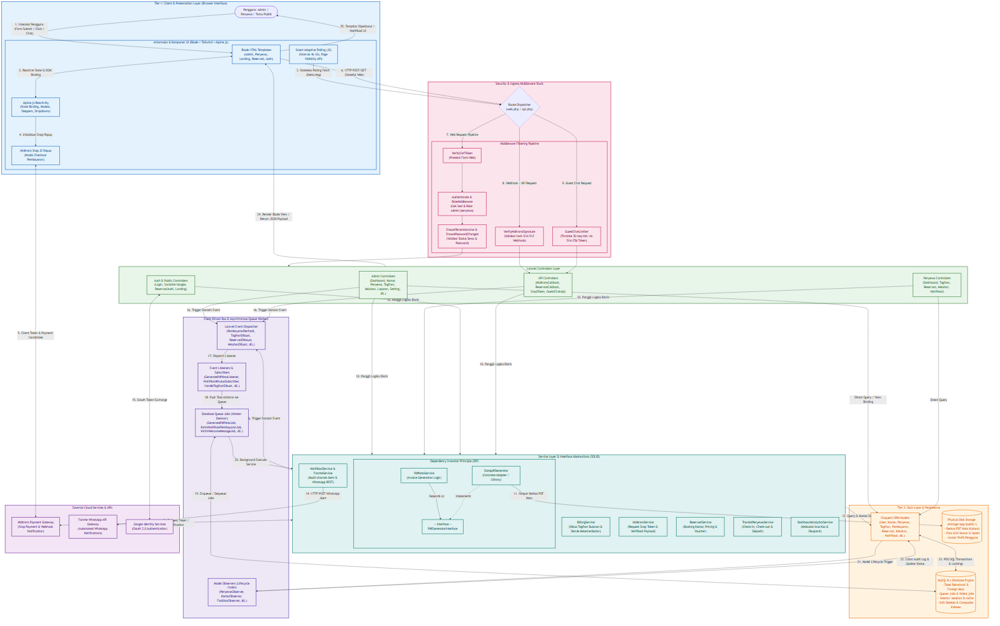

```mermaid
flowchart TD
    %% =========================================================================
    %% CLIENT LAYER (TIER 1)
    %% =========================================================================
    subgraph ClientLayer["Tier 1: Client & Presentation Layer (Browser Interface)"]
        direction TB
        User(["Pengguna: Admin / Penyewa / Tamu Publik"])
        
        subgraph UI_Components["Antarmuka & Komponen UI (Blade + Tailwind + Alpine.js)"]
            BladeViews["Blade HTML Templates<br/>(Admin, Penyewa, Landing, Reservasi, Auth)"]
            AlpineState["Alpine.js Reactivity<br/>(State Binding, Modals, Steppers, Dropdowns)"]
            Poller["Smart Adaptive Polling (JS)<br/>(Interval 4s-12s, Page Visibility API)"]
            SnapModal["Midtrans Snap JS Popup<br/>(Modal Checkout Pembayaran)"]
        end
    end

    %% =========================================================================
    %% INGRESS & SECURITY PIPELINE (TIER 2)
    %% =========================================================================
    subgraph SecurityPipeline["Security & Ingress Middleware Stack"]
        direction TB
        RouteDispatch{"Route Dispatcher<br/>(web.php / api.php)"}
        
        subgraph MiddlewareStack["Middleware Filtering Pipeline"]
            CSRF["VerifyCsrfToken<br/>(Proteksi Form Web)"]
            AuthCheck["Authenticate & RoleMiddleware<br/>(Cek Sesi & Role: admin/penyewa)"]
            TenantCheck["EnsureTenantIsActive & EnsurePasswordChanged<br/>(Validasi Status Sewa & Password)"]
            SigCheck["VerifyMidtransSignature<br/>(Validasi Hash SHA-512 Webhook)"]
            RateLimit["GuestChatLimiter<br/>(Throttle 30 req/min via SHA-256 Token)"]
        end
    end

    %% =========================================================================
    %% APPLICATION CORE & CONTROLLERS (TIER 2)
    %% =========================================================================
    subgraph AppControllers["Laravel Controllers Layer"]
        direction TB
        AdminController["Admin Controllers<br/>(Dashboard, Kamar, Penyewa, Tagihan, Keluhan, Laporan, Setting, dll.)"]
        PenyewaController["Penyewa Controllers<br/>(Dashboard, Tagihan, Reservasi, Keluhan, Notifikasi)"]
        ApiController["API Controllers<br/>(MidtransCallback, ReservasiCallback, SnapToken, GuestChatApi)"]
        AuthController["Auth & Public Controllers<br/>(Login, Socialite Google, ReservasiAuth, Landing)"]
    end

    %% =========================================================================
    %% BUSINESS SERVICE LAYER & INTERFACE DIP (TIER 2)
    %% =========================================================================
    subgraph ServiceLayer["Service Layer & Interface Abstractions (SOLID)"]
        direction TB
        BillingSvc["BillingService<br/>(Siklus Tagihan Bulanan & Denda Keterlambatan)"]
        MidtransSvc["MidtransService<br/>(Request Snap Token & Verifikasi Payload)"]
        ReservasiSvc["ReservasiService<br/>(Booking Kamar, Pricing & Voucher)"]
        TransisiSvc["TransisiPenyewaService<br/>(Check-in, Check-out & Deposit)"]
        NotifSvc["NotifikasiService & FonnteService<br/>(Multi-channel Alert & WhatsApp REST)"]
        AnalyticsSvc["DashboardAnalyticsService<br/>(Kalkulasi Arus Kas & Okupansi)"]
        
        subgraph DIP_Section["Dependency Inversion Principle (DIP)"]
            PdfNotaSvc["PdfNotaService<br/>(Invoice Generation Logic)"]
            PdfInterface["« Interface »<br/>PdfGeneratorInterface"]
            DompdfAdapter["DompdfGenerator<br/>(Concrete Adapter / Library)"]
        end
    end

    %% =========================================================================
    %% EVENT-DRIVEN BUS & BACKGROUND QUEUE (TIER 2)
    %% =========================================================================
    subgraph EventQueueSystem["Event-Driven Bus & Asynchronous Queue Workers"]
        direction TB
        EventBus["Laravel Event Dispatcher<br/>(PembayaranBerhasil, TagihanDibuat, ReservasiDibayar, KeluhanDibuat, dll.)"]
        Listeners["Event Listeners & Subscribers<br/>(GeneratePdfNotaListener, NotifikasiKhususSubscriber, HandleTagihanDibuat, dll.)"]
        QueueJobs["Database Queue Jobs (Worker Daemon)<br/>(GeneratePdfNotaJob, KirimNotifikasiPembayaranJob, KirimWelcomeMessageJob, dll.)"]
        ModelObservers["Model Observers (Lifecycle Hooks)<br/>(PenyewaObserver, KamarObserver, FasilitasObserver, dll.)"]
    end

    %% =========================================================================
    %% DATA PERSISTENCE & STORAGE LAYER (TIER 3)
    %% =========================================================================
    subgraph DataPersistence["Tier 3: Data Layer & Persistence"]
        direction TB
        EloquentORM["Eloquent ORM Models<br/>(User, Kamar, Penyewa, Tagihan, Pembayaran, Reservasi, Keluhan, Notifikasi, dll.)"]
        MySQL_DB[("MySQL 8.x Database Engine<br/>- Tabel Relasional & Foreign Keys<br/>- Queue: jobs & failed_jobs<br/>- Session: sessions & cache<br/>- Soft Deletes & Composite Indexes")]
        LocalDisk[("Physical Disk Storage (storage/app/public/)<br/>- Berkas PDF Nota Kuitansi<br/>- Foto Unit Kamar & Galeri<br/>- Avatar Profil Pengguna")]
    end

    %% =========================================================================
    %% EXTERNAL GATEWAYS
    %% =========================================================================
    subgraph ExternalGateways["External Cloud Services & APIs"]
        direction TB
        MidtransGW["Midtrans Payment Gateway<br/>(Snap Payment & Webhook Notification)"]
        FonnteGW["Fonnte WhatsApp API Gateway<br/>(Automated WhatsApp Notifications)"]
        GoogleGW["Google Identity Services<br/>(OAuth 2.0 Authentication)"]
    end

    %% =========================================================================
    %% INTERACTION CONNECTIONS & REQUEST-RESPONSE FLOWS
    %% =========================================================================
    User -->|"1. Interaksi Pengguna (Form Submit / Click / Chat)"| BladeViews
    BladeViews <-->|"2. Reactive State & DOM Binding"| AlpineState
    Poller -->|"3. Stateless Polling Fetch (Delta Msg)"| RouteDispatch
    AlpineState -->|"4. Inisialisasi Snap Popup"| SnapModal
    SnapModal <-->|"5. Client Token & Payment Handshake"| MidtransGW

    BladeViews -->|"6. HTTP POST/GET (Stateful Web)"| RouteDispatch
    RouteDispatch -->|"7. Web Request Pipeline"| CSRF
    CSRF --> AuthCheck
    AuthCheck --> TenantCheck
    TenantCheck --> AppControllers

    RouteDispatch -->|"8. Webhook / API Request"| SigCheck
    SigCheck --> ApiController
    RouteDispatch -->|"9. Guest Chat Request"| RateLimit
    RateLimit --> ApiController

    AdminController -->|"10. Panggil Logika Bisnis"| ServiceLayer
    PenyewaController -->|"10. Panggil Logika Bisnis"| ServiceLayer
    AuthController -->|"10. Panggil Logika Bisnis"| ServiceLayer
    ApiController -->|"10. Panggil Logika Bisnis"| ServiceLayer

    AdminController -->|"Direct Query / View Binding"| EloquentORM
    PenyewaController -->|"Direct Query"| EloquentORM

    PdfNotaSvc -->|"Depends on"| PdfInterface
    DompdfAdapter -.->|"Implements"| PdfInterface
    DompdfAdapter -->|"11. Simpan Berkas PDF Nota"| LocalDisk

    ServiceLayer -->|"12. Query & Mutasi Data"| EloquentORM
    ServiceLayer <-->|"13. Request Token / Verification"| MidtransGW
    NotifSvc -->|"14. HTTP POST WhatsApp Alert"| FonnteGW
    AuthController <-->|"15. OAuth Token Exchange"| GoogleGW

    ServiceLayer -->|"16. Trigger Domain Event"| EventBus
    AdminController -->|"16. Trigger Domain Event"| EventBus
    ApiController -->|"16. Trigger Domain Event"| EventBus

    EventBus -->|"17. Dispatch Listener"| Listeners
    Listeners -->|"18. Push Task Asinkron ke Queue"| QueueJobs
    QueueJobs <-->|"19. Enqueue / Dequeue Jobs"| MySQL_DB
    QueueJobs -->|"20. Background Execute Service"| ServiceLayer

    EloquentORM -->|"21. Model Lifecycle Trigger"| ModelObservers
    ModelObservers -->|"22. Catat Audit Log & Update Status"| EloquentORM

    EloquentORM <-->|"23. PDO SQL Transactions & Lockings"| MySQL_DB

    AppControllers -->|"24. Render Blade View / Return JSON Payload"| BladeViews
    BladeViews -->|"25. Tampilan Diperbarui / Notifikasi UI"| User

    classDef client fill:#E3F2FD,stroke:#1565C0,stroke-width:2px,color:#0D47A1;
    classDef security fill:#FCE4EC,stroke:#C2185B,stroke-width:2px,color:#880E4F;
    classDef app fill:#E8F5E9,stroke:#2E7D32,stroke-width:2px,color:#1B5E20;
    classDef service fill:#E0F2F1,stroke:#00796B,stroke-width:2px,color:#004D40;
    classDef event fill:#EDE7F6,stroke:#512DA8,stroke-width:2px,color:#311B92;
    classDef data fill:#FFF3E0,stroke:#EF6C00,stroke-width:2px,color:#E65100;
    classDef ext fill:#F3E5F5,stroke:#6A1B9A,stroke-width:2px,color:#4A148C;

    class ClientLayer,UI_Components,BladeViews,AlpineState,Poller,SnapModal client;
    class SecurityPipeline,MiddlewareStack,CSRF,AuthCheck,TenantCheck,SigCheck,RateLimit security;
    class AppControllers,AdminController,PenyewaController,ApiController,AuthController app;
    class ServiceLayer,BillingSvc,MidtransSvc,ReservasiSvc,TransisiSvc,NotifSvc,AnalyticsSvc,DIP_Section,PdfNotaSvc,PdfInterface,DompdfAdapter service;
    class EventQueueSystem,EventBus,Listeners,QueueJobs,ModelObservers event;
    class DataPersistence,EloquentORM,MySQL_DB,LocalDisk data;
    class ExternalGateways,MidtransGW,FonnteGW,GoogleGW ext;
```

---

### 4.2. Visualisasi Arsitektur Komunikasi & Request-Response Pipeline Antar Layer (Sequence)
Diagram di bawah ini memvisualisasikan bagaimana sebuah request dari pengguna mengalir melintasi 3 Tier, memicu middleware, controller, service, abstraksi interface SOLID, event bus, hingga ke database dan layanan eksternal:

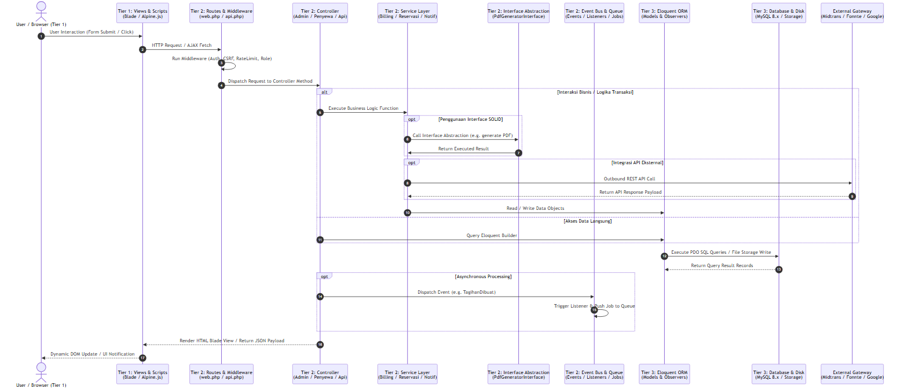

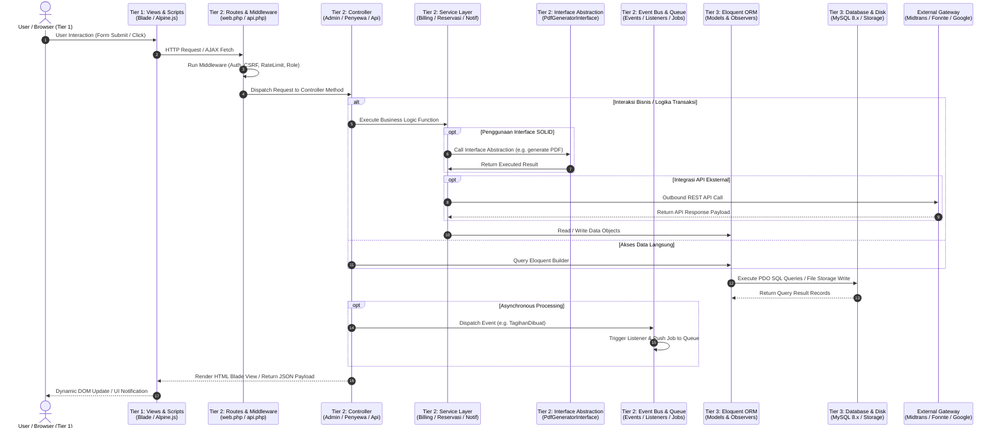

---

### 4.3. Proses Pembayaran Tagihan Online
1.  **Tier 1 (Presentation):** Penyewa menekan tombol "Bayar Sekarang" di UI Blade -> Alpine.js menginisiasi AJAX request.
2.  **Tier 2 (Application):**
    *   `TagihanController` menerima request -> Memanggil `MidtransService`.
    *   `MidtransService` melakukan API Call ke **Midtrans API** -> Mengembalikan token snap pembayaran.
    *   `TagihanController` mengembalikan snap token ke **Tier 1**.
3.  **Tier 1 (Presentation):** Alpine.js memanggil library `snap.pay(token)` -> Menampilkan modal popup pembayaran Midtrans Snap.
4.  **External System:** Penyewa membayar transaksi -> Midtrans mengirim callback pembayaran ke **Tier 2** (`MidtransCallbackController`).
5.  **Tier 2 (Application):**
    *   `VerifyMidtransSignature` middleware memverifikasi keabsahan tanda tangan SHA-512 payload.
    *   `MidtransCallbackController` memperbarui status di **Tier 3** (`Pembayaran` & `Tagihan` Eloquent Models -> MySQL).
    *   Event `PembayaranBerhasil` dipicu -> Memicu `GeneratePdfNotaListener` (memanggil `PdfNotaService` via `PdfGeneratorInterface` / `DompdfGenerator` untuk menghasilkan invoice PDF di Local Storage) dan mengirim pesan WhatsApp notifikasi lunas via `FonnteService` (melalui Queue Job `KirimNotifikasiPembayaranJob`).
6.  **Tier 1 (Presentation):** Tampilan dasbor terupdate secara otomatis dan menyajikan link unduh PDF nota pembayaran.

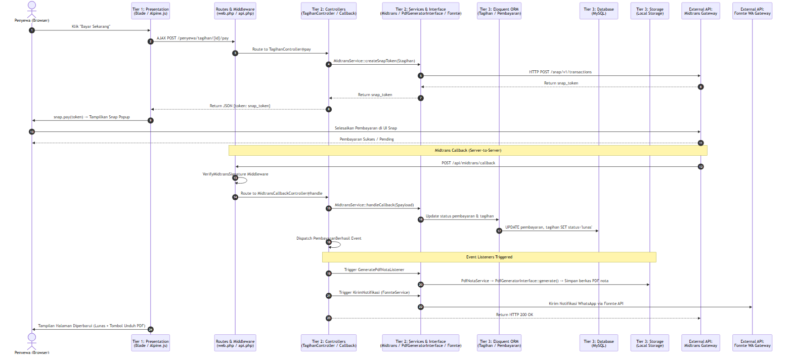

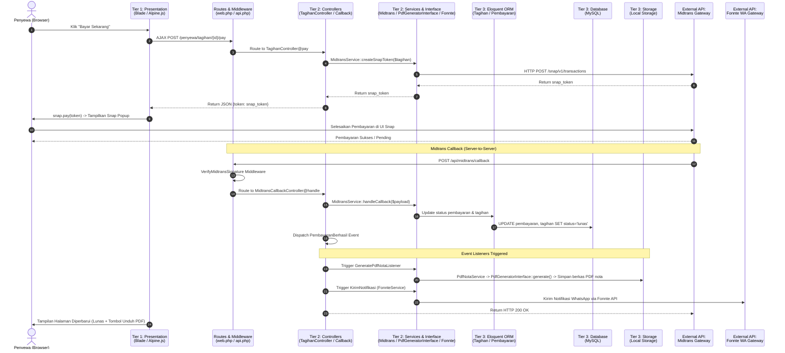

---

### 4.4. Proses Siklus Billing Rutin & Penerapan Denda Otomatis
1. **Artisan Scheduler:** Pemicu terjadwal harian berjalan di server backend via [routes/console.php](file:///c:/xampp/htdocs/asri-boarding-house/routes/console.php).
2. **BillingService:**
    *   Memindai database penyewa aktif yang tanggal kontraknya bertepatan dengan tanggal billing hari ini.
    *   Membuat draf tagihan baru (`TagihanDibuat`) dan menyimpannya di database MySQL.
    *   Mengirim notifikasi WhatsApp tagihan bulanan baru menggunakan Fonnte API.
3. **Penerapan Denda Overdue:**
    *   Sistem mencari tagihan belum lunas (`pending`) yang telah melampaui tanggal jatuh tempo.
    *   Kalkulator denda menghitung denda harian secara transaksional dengan locking `lockForUpdate()`, lalu memperbarui kolom denda di database (`DendaDikenakan`).
    *   WhatsApp peringatan dikirimkan ke penyewa dan kontak wali.

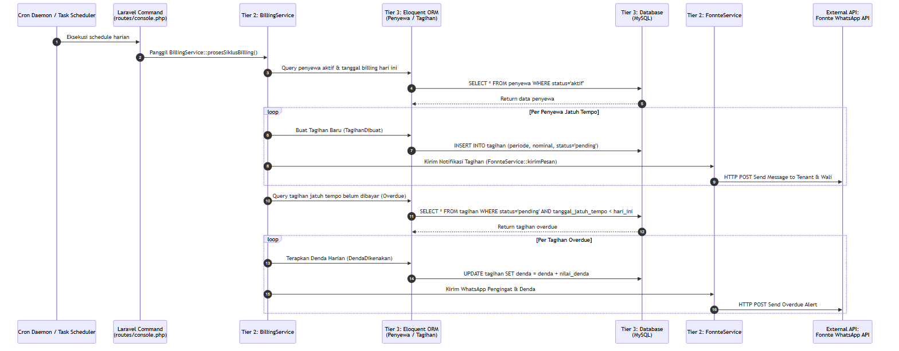

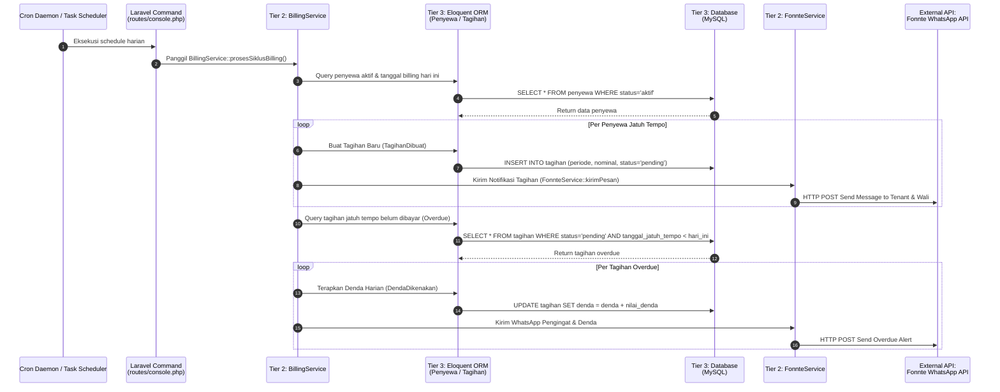

---

### 4.5. Proses Reservasi Kamar & Transisi Status Hunian (Check-in)
Proses pendaftaran reservasi kamar baru oleh calon penyewa, pembayaran DP/Full, verifikasi admin, hingga pembaruan otomatis status kamar dan pendaftaran akun penyewa:

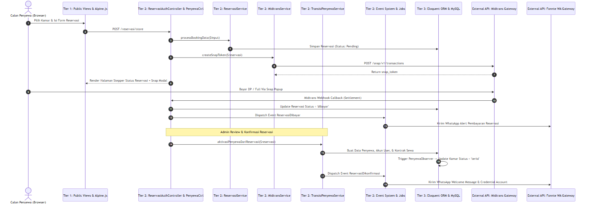

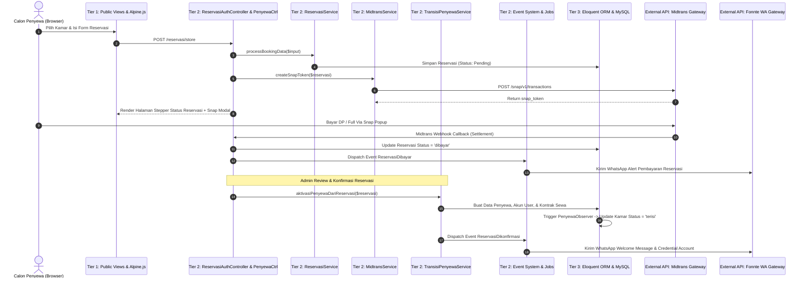

---

### 4.6. Proses Guest Chat Real-Time (Stateless Polling API & Rate Limiting)
Alur komunikasi obrolan interaktif antara pengunjung publik (tamu) dengan pengelola kost menggunakan API stateless, enkripsi token SHA-256, dan smart adaptive polling:

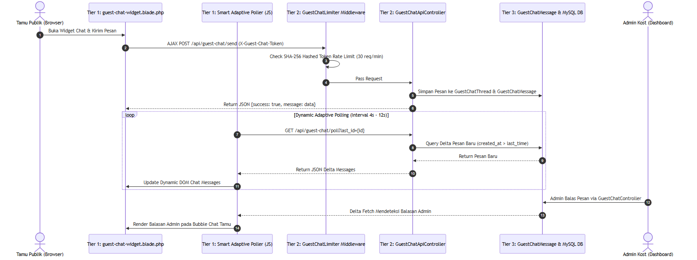

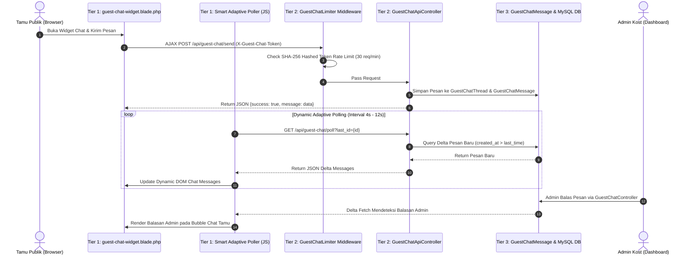

---

## 5. Konfigurasi Komponen & Environment Variables

Logika bisnis dan integrasi API pada Tier 2 dikendalikan secara dinamis melalui file konfigurasi Laravel yang terikat ke variabel lingkungan pada file `.env`. Berikut adalah rincian konfigurasi komponen:

*   **Midtrans Payment Gateway Configuration (`config/midtrans.php`):**
    *   `server_key`: Kunci server rahasia (`MIDTRANS_SERVER_KEY`) untuk otentikasi API callback dan refund.
    *   `client_key`: Kunci klien publik (`MIDTRANS_CLIENT_KEY`) untuk menginisialisasi pustaka Snap JS.
    *   `is_production`: Status lingkungan produksi (`MIDTRANS_IS_PRODUCTION` - default `false` untuk mode sandbox).
    *   `base_url` & `snap_url`: URL endpoint API Sandbox atau Production.
*   **Fonnte WhatsApp Gateway Configuration (`config/fonnte.php`):**
    *   `token`: Kunci API otentikasi (`FONNTE_TOKEN`) untuk mengirimkan payload pesan WhatsApp otomatis melalui gateway Fonnte.
*   **Reservasi Kost Configuration (`config/reservasi.php`):**
    *   `dp_percentage`: Persentase minimal pembayaran uang muka (`RESERVASI_DP_PERCENTAGE` - default `30%` atau `0.30`).
    *   `min_durasi` & `max_durasi`: Rentang validasi durasi hunian untuk tipe sewa Harian, Mingguan, dan Bulanan.
    *   `admin_wa`: Nomor telepon WhatsApp Administrator (`ADMIN_WA_NUMBER`) untuk alur chat manual dan eskalasi keluhan.
    *   `expire_hours`: Batas kedaluwarsa pembayaran reservasi (`RESERVASI_EXPIRE_HOURS` - default `24` jam).
*   **Aplikasi Umum (`config/app.php`):**
    *   Mengatur `timezone` lokal ke `Asia/Jakarta`, serta localization `locale` ke `id` (Bahasa Indonesia) untuk standardisasi format tanggal dan waktu.
*   **Koneksi Database (`config/database.php`):**
    *   Mengonfigurasi koneksi MySQL 8.x utama (`DB_HOST`, `DB_PORT`, `DB_DATABASE`, `DB_USERNAME`, `DB_PASSWORD`) serta setup driver antrean database (`QUEUE_CONNECTION=database`).
*   **File Penyimpanan (`config/filesystems.php`):**
    *   Mengonfigurasi disk `public` untuk direktori penyimpanan yang dapat diakses publik (`storage/app/public/`) dan pembuatan symlink ke folder `public/storage`.
*   **Layanan Pihak Ketiga & SMTP Email (`config/services.php` & `config/mail.php`):**
    *   `services.google`: Menyimpan Google Client ID & Secret untuk otentikasi Google Socialite OAuth.
    *   `services.chat.guest_limit`: Limit request per menit untuk obrolan tamu.
    *   `mail.mailers.smtp`: Menyusun parameter SMTP Mail Host untuk mengirimkan email rincian invoice reminder secara teratur.

---

## 6. Pemetaan Event & Listeners (Event Matrix)

Aplikasi memanfaatkan arsitektur *event-driven* untuk memisahkan logika utama dengan proses sekunder (seperti notifikasi WhatsApp dan pembuatan PDF). Pemetaan event ini didaftarkan di dalam [AppServiceProvider.php](file:///c:/xampp/htdocs/asri-boarding-house/app/Providers/AppServiceProvider.php):

| Kelas Event (Trigger) | Kondisi Pemicu | Listener / Job yang Menangani | Tanggung Jawab / Aksi Eksekusi |
| :--- | :--- | :--- | :--- |
| `PembayaranBerhasil` | Callback Midtrans berstatus settlement (lunas) untuk tagihan bulanan. | [GeneratePdfNotaListener](file:///c:/xampp/htdocs/asri-boarding-house/app/Listeners/GeneratePdfNotaListener.php) [KirimNotifikasiPembayaranJob](file:///c:/xampp/htdocs/asri-boarding-house/app/Jobs/KirimNotifikasiPembayaranJob.php) | Menghasilkan kuitansi resmi PDF di penyimpanan lokal dan mengirim WhatsApp notifikasi lunas ke penyewa. |
| `PembayaranCashDikonfirmasi` | Admin mengonfirmasi pembayaran tagihan secara manual (tunai). | [GeneratePdfNotaListener](file:///c:/xampp/htdocs/asri-boarding-house/app/Listeners/GeneratePdfNotaListener.php) | Menghasilkan berkas kuitansi PDF untuk tagihan yang dibayar via cash. |
| `ReservasiDibuat` | Calon penyewa mengirimkan formulir reservasi kamar baru. | [HandleReservasiDibuat](file:///c:/xampp/htdocs/asri-boarding-house/app/Listeners/HandleReservasiDibuat.php) [KirimNotifikasiReservasiBaru](file:///c:/xampp/htdocs/asri-boarding-house/app/Listeners/KirimNotifikasiReservasiBaru.php) [KirimNotifikasiAdminReservasiJob](file:///c:/xampp/htdocs/asri-boarding-house/app/Jobs/KirimNotifikasiAdminReservasiJob.php) | Mengirimkan pesan WhatsApp rincian reservasi & link bayar ke calon penyewa, serta alert reservasi baru ke admin. |
| `ReservasiDibayar` | Pembayaran DP/Lunas reservasi terverifikasi oleh sistem/Midtrans callback. | [HandleReservasiDibayar](file:///c:/xampp/htdocs/asri-boarding-house/app/Listeners/HandleReservasiDibayar.php) [KirimNotifikasiPembayaranReservasi](file:///c:/xampp/htdocs/asri-boarding-house/app/Listeners/KirimNotifikasiPembayaranReservasi.php) | Mengirimkan notifikasi WhatsApp konfirmasi pembayaran reservasi diterima dan status terupdate. |
| `ReservasiDikonfirmasi` | Admin menyetujui reservasi dan mengaktifkan penyewa di sistem. | [HandleReservasiDikonfirmasi](file:///c:/xampp/htdocs/asri-boarding-house/app/Listeners/HandleReservasiDikonfirmasi.php) [ProsesTransisiPenyewa](file:///c:/xampp/htdocs/asri-boarding-house/app/Listeners/ProsesTransisiPenyewa.php) [KirimWelcomeMessageJob](file:///c:/xampp/htdocs/asri-boarding-house/app/Jobs/KirimWelcomeMessageJob.php) | Mengubah status kamar ke 'terisi', membuat data kontrak sewa, mendaftarkan akun, dan mengirim WhatsApp welcome message + kredensial. |
| `KeluhanDibuat` | Penyewa aktif mengirimkan keluhan fasilitas melalui portal internal. | [KirimNotifikasiKeluhanDibuat](file:///c:/xampp/htdocs/asri-boarding-house/app/Listeners/KirimNotifikasiKeluhanDibuat.php) | Mengirim pesan WhatsApp kepada Admin berisi detail keluhan baru agar segera ditinjau. |
| `KeluhanDitanggapi` | Admin memperbarui status keluhan dan menulis tanggapan solusi. | [KirimNotifikasiKeluhanDitanggapi](file:///c:/xampp/htdocs/asri-boarding-house/app/Listeners/KirimNotifikasiKeluhanDitanggapi.php) | Mengirim pesan WhatsApp kepada penyewa pembuat keluhan mengenai status penanganannya. |
| `DendaDikenakan` | Scheduler mengenakan denda harian pada tagihan yang melebihi jatuh tempo. | [HandleDendaDikenakan](file:///c:/xampp/htdocs/asri-boarding-house/app/Listeners/HandleDendaDikenakan.php) | Mencatat log penambahan denda dan memicu notifikasi peringatan. |
| `TagihanDibuat` | Sistem membuat tagihan bulanan baru secara otomatis untuk penyewa aktif. | [HandleTagihanDibuat](file:///c:/xampp/htdocs/asri-boarding-house/app/Listeners/HandleTagihanDibuat.php) [KirimNotifikasiTagihanJob](file:///c:/xampp/htdocs/asri-boarding-house/app/Jobs/KirimNotifikasiTagihanJob.php) | Mengirimkan WhatsApp rincian tagihan bulanan baru beserta link bayar kepada penyewa. |
| `NotifikasiWali` | Tagihan belum dibayar mendekati / melampaui masa tenggang. | [HandleNotifikasiWali](file:///c:/xampp/htdocs/asri-boarding-house/app/Listeners/HandleNotifikasiWali.php) [KirimNotifikasiWaliJob](file:///c:/xampp/htdocs/asri-boarding-house/app/Jobs/KirimNotifikasiWaliJob.php) | Mengirim notifikasi WhatsApp pengingat tagihan penyewa langsung ke kontak nomor handphone wali. |
| `ReminderPenyewa` | Mengingatkan penyewa mengenai jatuh tempo tagihan sewa. | [HandleReminderPenyewa](file:///c:/xampp/htdocs/asri-boarding-house/app/Listeners/HandleReminderPenyewa.php) [KirimReminderJatuhTempoJob](file:///c:/xampp/htdocs/asri-boarding-house/app/Jobs/KirimReminderJatuhTempoJob.php) | Mengirim notifikasi WhatsApp reminder h-3 jatuh tempo dan email reminder berformat Neo-Brutalisme. |
| `Registered` (Laravel Core) | Pengguna baru berhasil mendaftarkan akun di sistem. | [NotifikasiKhususSubscriber](file:///c:/xampp/htdocs/asri-boarding-house/app/Listeners/NotifikasiKhususSubscriber.php) | Memicu pencatatan log pendaftaran pengguna baru ke tabel log administrasi. |

> [!NOTE]
> Audit log internal dikelola secara terpusat oleh [NotifikasiKhususSubscriber](file:///c:/xampp/htdocs/asri-boarding-house/app/Listeners/NotifikasiKhususSubscriber.php) yang berlangganan langsung ke berbagai event di atas untuk merekam riwayat perubahan operasional sistem secara rinci ke tabel database `notifikasi_khusus`.

---

## 7. Perilaku Model Observers (Audit Trail)

Sistem menggunakan model observers untuk menangkap peristiwa siklus hidup (lifecycle events) dari model Eloquent. Hal ini memastikan integritas status kamar dan mencatat audit log administrasi secara otomatis:

1.  **[PenyewaObserver](file:///c:/xampp/htdocs/asri-boarding-house/app/Observers/PenyewaObserver.php):**
    *   **Created:** Mengubah status kamar terkait menjadi `terisi` secara otomatis begitu data penyewa aktif terdaftar.
    *   **Updated:** Jika status penyewa berubah menjadi `nonaktif` (checkout), observer mengatur `tanggal_keluar` ke hari ini. Sesuai *Aturan Sakral v1.0*, status kamar **tidak diubah** secara otomatis menjadi `tersedia` melainkan wajib diubah manual oleh admin setelah inspeksi fisik. Kejadian ini juga dicatat ke `NotifikasiKhusus`.
2.  **[KamarObserver](file:///c:/xampp/htdocs/asri-boarding-house/app/Observers/KamarObserver.php):**
    *   Mencatat riwayat audit ketika kamar baru dibuat (`created`), diperbarui detailnya (`updated`), diubah status ketersediaannya (`updated` dengan perubahan kolom `status`), atau dihapus dari sistem (`deleted`).
3.  **[FasilitasObserver](file:///c:/xampp/htdocs/asri-boarding-house/app/Observers/FasilitasObserver.php):**
    *   Memantau penambahan, perubahan deskripsi/ikon, atau penghapusan fasilitas kost untuk keperluan pencatatan riwayat administratif.
4.  **[PengeluaranObserver](file:///c:/xampp/htdocs/asri-boarding-house/app/Observers/PengeluaranObserver.php):**
    *   Mencatat penambahan atau pembaruan biaya operasional kost oleh admin guna mengamankan transparansi laporan keuangan arus kas.
5.  **[SettingObserver](file:///c:/xampp/htdocs/asri-boarding-house/app/Observers/SettingObserver.php):**
    *   Memantau perubahan konfigurasi dinamis kost (seperti perubahan nama kost, besaran denda harian, nomor kontak, dll.) dan menyimpannya dalam log audit sistem.

---

## 8. Inisialisasi Database (Migrations & Seeders)

Komponen basis data diinisialisasi secara terstruktur melalui skema migrasi dan data awal (seeding) untuk memastikan kelengkapan relasi antartabel:

*   **Skema Tabel Utama (Migrations):**
    *   `create_users_table.php`: Menyimpan data akun login penyewa dan admin, serta kolom `require_password_change`.
    *   `create_kamar_table.php` & `create_fasilitas_table.php`: Struktur tabel unit kamar, status kamar, serta master fasilitas kost.
    *   `create_penyewa_table.php`: Menyimpan referensi kontrak, tanggal masuk, durasi sewa, deposit jaminan, dan tanggal billing bulanan.
    *   `create_tagihan_table.php` & `create_pembayaran_table.php`: Menangani data pencatatan invoice bulanan, nominal denda, status bayar, serta token pembayaran eksternal.
    *   `create_jobs_table.php` & `create_failed_jobs_table.php`: Struktur antrean latar belakang untuk asynchronous queue tasks.
    *   `create_sessions_table.php` & `create_cache_table.php`: Penampung sesi aktif dan cache aplikasi pada database.
    *   `create_notifikasi_khusus_table.php`: Menyimpan log aktivitas sistem yang diaudit.
    *   `create_whatsapp_clicks_table.php`: Tabel pelacak analitik interaksi tombol WhatsApp.
    *   `add_soft_deletes_to_essential_tables.php`: Menerapkan fitur *Soft Deletes* (`deleted_at`) pada tabel user, kamar, dan penyewa untuk menghindari kehilangan data yang tidak disengaja.
    *   `add_indexes_to_chat_messages_and_tagihan_tables.php`: Optimasi performa database menggunakan indeks gabungan untuk mempercepat pemuatan chat dan pencarian tagihan.
*   **Data Awal Pengisi Sistem (Seeders):**
    *   `AdminUserSeeder.php` & `AdminSeeder.php`: Menginisialisasi akun administrator utama kost.
    *   `KamarSeeder.php` & `FasilitasSeeder.php`: Memasukkan data kamar-kamar kost awal beserta relasi fasilitasnya.
    *   `UserPenyewaSeeder.php` & `ReservasiSeeder.php`: Menyediakan contoh data penyewa aktif dan histori pemesanan kamar untuk lingkungan simulasi.
    *   `PeraturanSeeder.php`, `FaqSeeder.php`, & `CustomerReviewSeeder.php`: Mengisi konten dinamis halaman publik seperti tata tertib kost, FAQ, dan testimoni penyewa.
    *   `GallerySeeder.php`: Mengisi data awal galeri foto kost.
