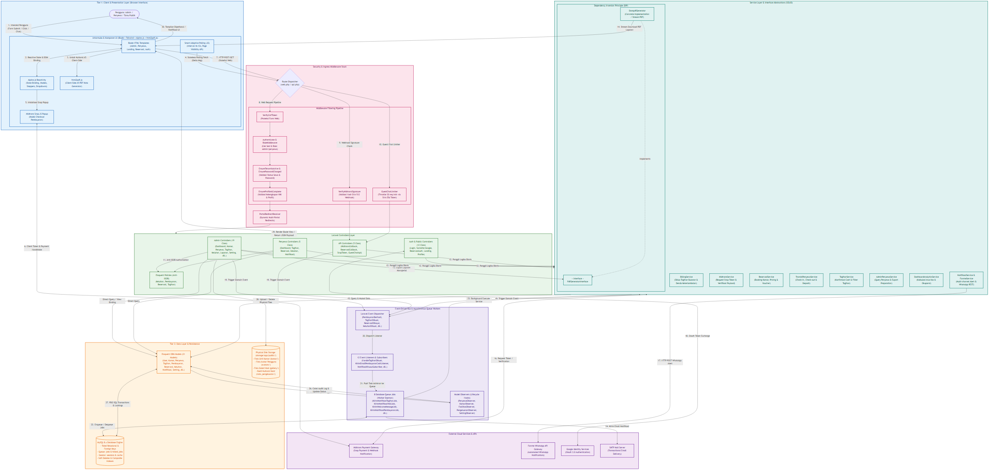
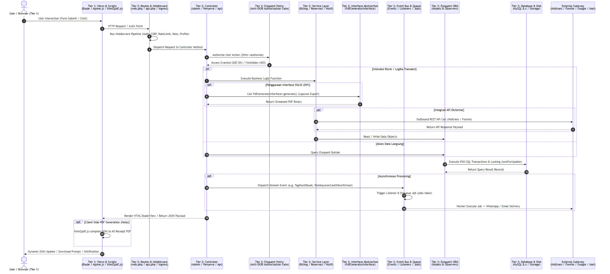
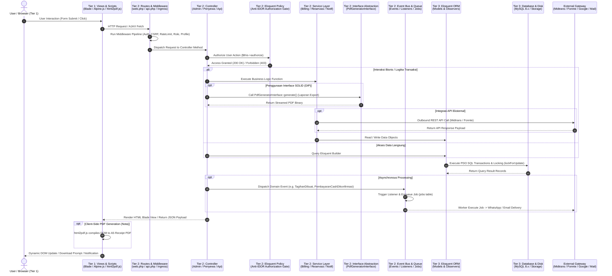
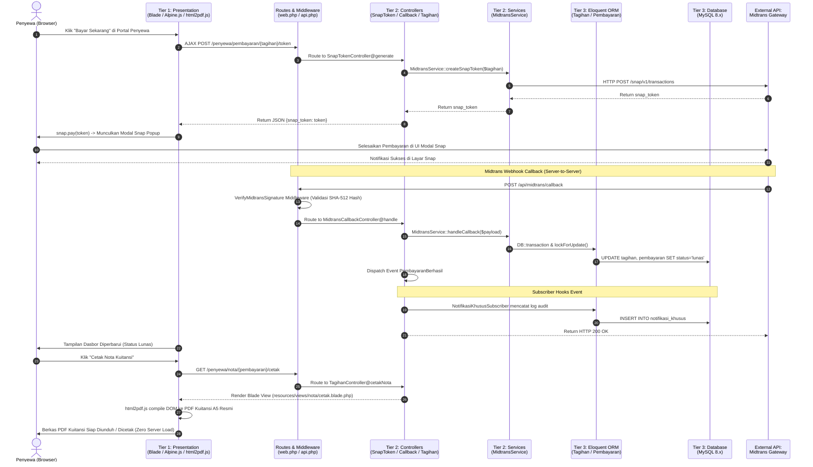
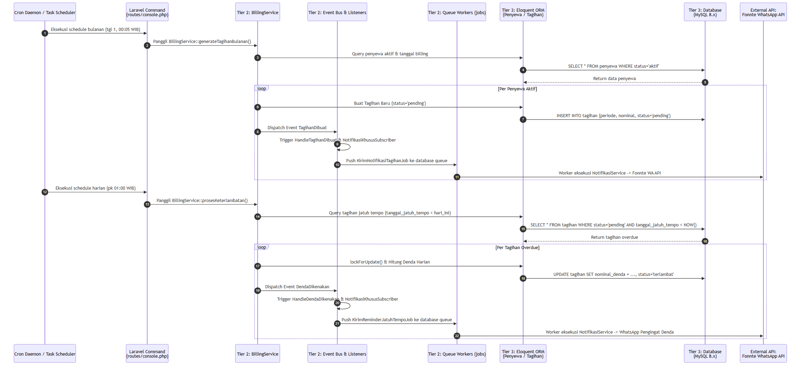
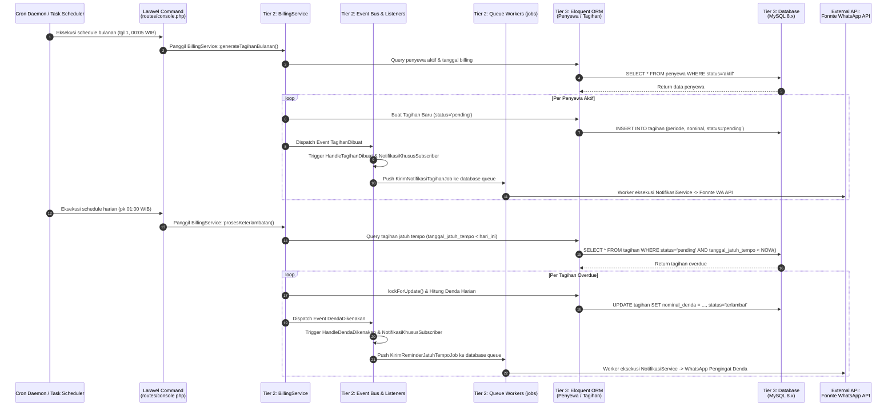
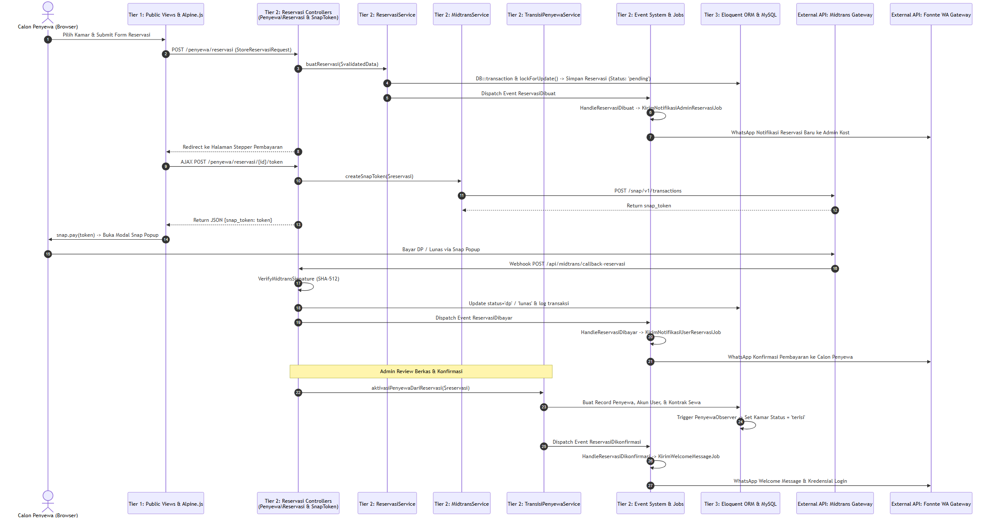
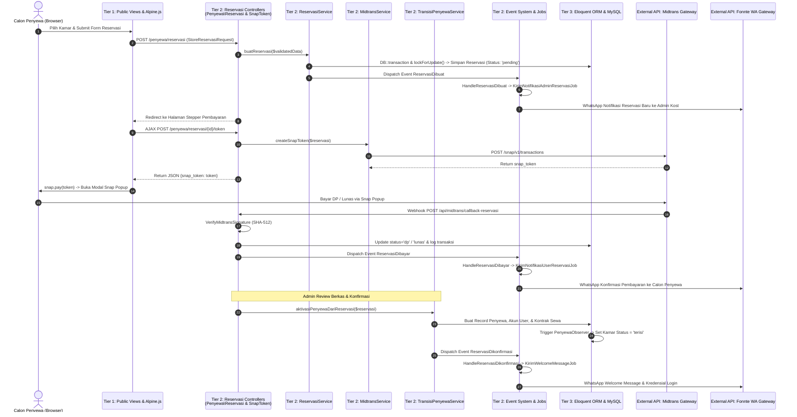
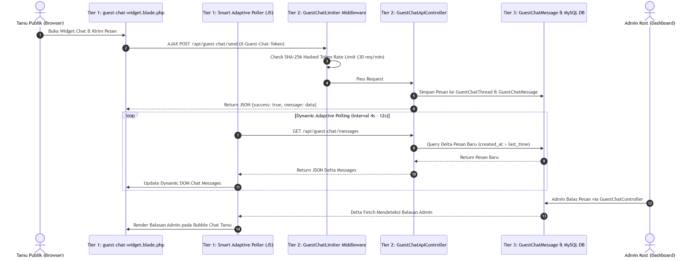
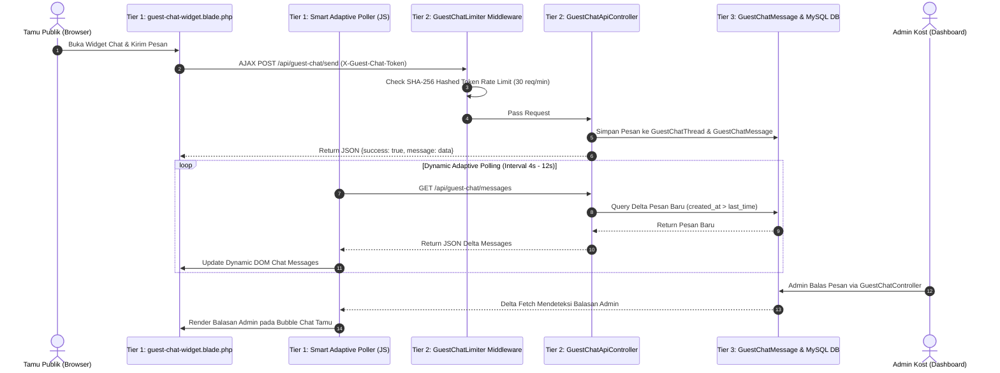

# Component Diagram - Asri Boarding House

Dokumen ini mendokumentasikan spesifikasi **Component Diagram (Diagram Komponen)** untuk **Sistem Informasi Manajemen Kost Terintegrasi Payment Gateway pada Asri Boarding House**. Diagram komponen ini memvisualisasikan pembagian arsitektur sistem MVC 3-Tier secara modular, menggambarkan bagaimana Tier 1 (Presentation), Tier 2 (Application), dan Tier 3 (Data) berinteraksi satu sama lain serta terintegrasi dengan layanan eksternal (Midtrans Payment Gateway, Fonnte WhatsApp API, Google OAuth API, dan SMTP Mail Server).

Semua spesifikasi dalam dokumen ini selaras 100% dengan codebase aktual dan dokumen blueprint lainnya:
* **Project Blueprint**: [Blueprint_Projek_Web_Asri_Boarding_House.md](file:///c:/xampp/htdocs/asri-boarding-house/Blueprint/Blueprint_Projek_Web_Asri_Boarding_House.md)
* **Use Case Specification**: [Use_Case_Diagram_Kost.md](file:///c:/xampp/htdocs/asri-boarding-house/Blueprint/Use_Case_Diagram_Kost.md)
* **Sequence Diagram Specification**: [Sequence_Diagram_Kost.md](file:///c:/xampp/htdocs/asri-boarding-house/Blueprint/Sequence_Diagram_Kost.md)
* **Class Diagram**: [Class_Diagram_Kost.md](file:///c:/xampp/htdocs/asri-boarding-house/Blueprint/Class_Diagram_Kost.md)
* **Entity Relationship Diagram**: [Entity_Relationship_Diagram_Kost.md](file:///c:/xampp/htdocs/asri-boarding-house/Blueprint/Entity_Relationship_Diagram_Kost.md)
* **Flowchart**: [Flowchart_Kost.md](file:///c:/xampp/htdocs/asri-boarding-house/Blueprint/Flowchart_Kost.md)
* **State Machine Diagram**: [State_Machine_Diagram_Kost.md](file:///c:/xampp/htdocs/asri-boarding-house/Blueprint/State_Machine_Diagram_Kost.md)
* **Deployment Diagram**: [Deployment_Diagram_Kost.md](file:///c:/xampp/htdocs/asri-boarding-house/Blueprint/Deployment_Diagram_Kost.md)

---

## 1. Diagram Komponen Utama (Mermaid)

Di bawah ini adalah representasi visual diagram komponen sistem yang menggambarkan pembagian lapisan arsitektur (3-Tier) beserta abstraksi interface dan dependensi antarkomponen secara komprehensif sesuai codebase riil:

```mermaid
flowchart TB
    %% =========================================================================
    %% TIER 1: PRESENTATION LAYER
    %% =========================================================================
    subgraph PresentationTier["Tier 1: Presentation Layer (Client / Browser Interface)"]
        direction TB
        subgraph Views["Blade Templates (HTML Views)"]
            AdminViews["Admin Views<br/>(Dashboard, Kamar, Penyewa, Tagihan, Keluhan, Laporan, Kalender, FAQ, Galeri, Pengeluaran)"]
            PenyewaViews["Penyewa Views<br/>(Dashboard, Tagihan, Keluhan, Profil, Notifikasi)"]
            PublicViews["Public Views<br/>(Landing Page, Fasilitas, FAQ, Testimoni, Galeri)"]
            ReservasiViews["Reservasi Views<br/>(Booking Form, Stepper Tracking, Detail Kamar)"]
            AuthViews["Auth Views<br/>(Multi-portal Login, Register, Password Reset, Verifikasi Email)"]
            NotaView["Nota Receipt View<br/>(resources/views/nota/cetak.blade.php)"]
            PdfExportViews["PDF Report Views<br/>(resources/views/pdf/ Laporan Keuangan, Pengeluaran & Rekap Penyewa)"]
        end
        
        subgraph ReusableComp["Blade Components, Layouts & Composers"]
            LayoutComp["Layouts: app, landing, guest, navigation, admin-sidebar, admin-topbar"]
            ViewComposer["LayoutSettingComposer<br/>(Global Setting Data Injector)"]
            ChatWidget["guest-chat-widget.blade.php & wa-float-button.blade.php"]
            ToastComp["toast.blade.php & flash-message.blade.php"]
        end
        
        subgraph ClientScript["Client-Side Scripting & Styling"]
            Tailwind["TailwindCSS<br/>(Neo-Brutalisme Style Layouts)"]
            AlpineJS["Alpine.js<br/>(Modals, Steppers, Dropdowns, Reactivity)"]
            Html2Pdf["html2pdf.js<br/>(Client-Side A5 Receipt PDF Generator)"]
            AdaptivePoll["Smart Adaptive Polling<br/>(Page Visibility API & Delta Chat Fetcher)"]
            ChartJS["Chart.js<br/>(Visual Cash Flow & Occupancy Analytics)"]
        end
        
        subgraph ExtClient["Third-Party Client SDK"]
            MidtransSnap["Midtrans Snap JS Popup<br/>(Client Multi-Payment Modal)"]
        end
    end

    %% =========================================================================
    %% TIER 2: APPLICATION LAYER
    %% =========================================================================
    subgraph ApplicationTier["Tier 2: Application Layer (Laravel 11 Backend)"]
        direction TB
        subgraph RoutingMiddleware["Routing, Middleware & Ingress Security"]
            Routes["web.php, api.php & console.php Routes<br/>(Stateful Web & Stateless Guest API)"]
            Middleware["Middleware Pipeline<br/>(Auth, Role:admin/penyewa, VerifyMidtransSignature, EnsureTenantIsActive, EnsurePasswordChanged, EnsureProfileIsComplete, RateLimiter SHA-256)"]
            PortalRedirect["PortalRedirectResolver<br/>(Dynamic Multi-Portal Redirections)"]
        end
        
        subgraph Controllers["Laravel Controllers (41 Classes)"]
            AdminCtrl["Admin Controllers (19 Class)<br/>(Dashboard, Kamar, Penyewa, Tagihan, Keluhan, Laporan, Setting, Kalender, dll.)"]
            PenyewaCtrl["Penyewa Controllers (5 Class)<br/>(Dashboard, Tagihan, Reservasi, Keluhan, Notifikasi)"]
            ApiCtrl["API Controllers (5 Class)<br/>(MidtransCallback, ReservasiCallback, SnapToken, GuestChatApi, Chat)"]
            PublicCtrl["Public Controllers<br/>(LandingController)"]
            AuthCtrl["Auth & Profile Controllers (11 Class)<br/>(Socialite Google, ReservasiAuth, Multi-Login, ProfileCompletion)"]
        end

        subgraph SecurityPolicies["Eloquent Policies (Anti-IDOR Authorization)"]
            Policies["Policies: KeluhanPolicy, PembayaranPolicy, ReservasiPolicy, TagihanPolicy"]
        end
        
        subgraph Services["Service Layer & SOLID Interface Abstraction"]
            BillingServ["BillingService<br/>(Siklus Tagihan & Denda Keterlambatan)"]
            MidtransServ["MidtransService<br/>(Snap Token & Webhook Verification)"]
            FonnteServ["FonnteService<br/>(WhatsApp REST Gateway Client)"]
            NotifServ["NotifikasiService<br/>(Multi-channel Alert & Nomor HP Sanitizer)"]
            ReservasiServ["ReservasiService<br/>(Booking Kamar & Dynamic Pricing)"]
            TransisiServ["TransisiPenyewaService<br/>(Check-in, Check-out & Audit Deposit)"]
            TagihanServ["TagihanService<br/>(Cash Confirmation & Filtered Billing Query)"]
            AdminPenyewaServ["AdminPenyewaService<br/>(Tenant Query Filter & Export Processor)"]
            DashboardServ["DashboardAnalyticsService<br/>(Cash Flow & Occupancy Aggregator)"]
            TemplateServ["NotificationTemplateBuilder<br/>(WA & Email Dynamic Text Builder)"]
            CalendarHelper["CalendarStyleHelper<br/>(Occupancy Badge Styling)"]
            SanitizerHelper["SanitizerService<br/>(Data Cleansing & Format Normalizer)"]
            
            %% Abstraksi DIP untuk Laporan Manajerial
            PdfInterface["« Interface »<br/>PdfGeneratorInterface"]
            DompdfAdapter["DompdfGenerator<br/>(Dompdf Stream Download Implementation)"]
        end
        
        subgraph EventsListeners["Event-Driven Bus, Listeners & Queue System"]
            Events["11 Domain Events<br/>(PembayaranBerhasil, TagihanDibuat, DendaDikenakan, ReservasiDibuat, ReservasiDibayar, ReservasiDikonfirmasi, dll.)"]
            Listeners["12 Event Listeners & Subscribers<br/>(HandleTagihanDibuat, KirimEmailPembayaranCashListener, NotifikasiKhususSubscriber, ProsesTransisiPenyewa, dll.)"]
            Jobs["8 Database Queue Jobs<br/>(KirimNotifikasiTagihanJob, KirimNotifikasiWaliJob, KirimWelcomeMessageJob, KirimNotifikasiPembayaranJob, dll.)"]
            Mailables["Mailables & Notifications<br/>(TagihanBulanMail, NotificationMail, PasswordReset)"]
            Observers["5 Model Observers<br/>(Penyewa, Kamar, Fasilitas, Pengeluaran, Setting)"]
        end

        subgraph SystemScheduler["Scheduler & CLI Tasks (routes/console.php)"]
            Scheduler["Laravel 11 Scheduler (9 Commands)<br/>(tagihan:generate-bulanan, tagihan:proses-keterlambatan, kontrak:reminder-habis, reservasi:cancel-expired, session:cleanup, dll.)"]
        end
    end

    %% =========================================================================
    %% TIER 3: DATA LAYER
    %% =========================================================================
    subgraph DataTier["Tier 3: Data Layer (Persistence & Storage)"]
        direction TB
        subgraph EloquentORM["Eloquent ORM Models (21 Models)"]
            UserModel["User Model"]
            KamarGroup["Kamar, Fasilitas & Gallery Models"]
            PenyewaGroup["Penyewa & Reservasi Models"]
            TagihanGroup["Tagihan & Pembayaran Models"]
            KeluhanModel["Keluhan Model"]
            ChatGroup["ChatMessage, GuestChatMessage & GuestChatThread Models"]
            AuditGroup["LogNotifikasi & NotifikasiKhusus Models"]
            SettingModel["Setting Model"]
            AuxGroup["CustomerReview, Faq, Pengeluaran, Pengumuman, Peraturan, WhatsappClick"]
        end
        
        subgraph RelationalDB["MySQL 8.x Database Engine"]
            Tables[("MySQL Relational Tables<br/>- Master Data & Transactions<br/>- Soft Deletes & Composite Indexes<br/>- Queue: jobs & failed_jobs<br/>- Sessions & Cache")]
        end
        
        subgraph FileStorage["Physical File Storage (storage/app/public/)"]
            Disk[("Local Storage Disk<br/>- Foto Unit Kamar (kamar/)<br/>- Foto Avatar Pengguna (avatars/)<br/>- Foto Galeri Kost (gallery/)<br/>- Bukti Kuitansi Kasir (nota_pengeluaran/)")]
        end
    end

    %% =========================================================================
    %% EXTERNAL GATEWAYS
    %% =========================================================================
    subgraph ExternalSystems["External Third-Party APIs & Services"]
        direction LR
        MidtransAPI["Midtrans Snap API<br/>(Payment Gateway & Webhook Notifications)"]
        FonnteAPI["Fonnte WhatsApp API<br/>(Automated WhatsApp Gateway)"]
        GoogleOAuth["Google Identity Services<br/>(OAuth 2.0 Socialite Authentication)"]
        SMTPGateway["SMTP Mail Server<br/>(Symfony Mailer TLS Delivery)"]
    end

    %% =========================================================================
    %% DEPENDENCIES & DATA FLOW CONNECTIONS
    %% =========================================================================
    Views -->|"HTTP Request / Form Submit"| Routes
    ReusableComp -->|"AJAX Polling / Fetch API"| Routes
    NotaView -->|"Client-Side Render via"| Html2Pdf
    ViewComposer -.->|"Injects Dynamic Setting Data"| Views
    ClientScript -->|"Styles & Enhances"| Views
    
    Routes --> Middleware
    Middleware --> PortalRedirect
    PortalRedirect --> Controllers
    
    Controllers -->|"Authorizes via"| Policies
    Controllers -->|"Invokes Business Logic"| Services
    Controllers -->|"Direct Read / Query"| EloquentORM
    
    %% Dependency Inversion Principle (DIP) Connection
    AdminCtrl -->|"Depends on Abstraction"| PdfInterface
    DompdfAdapter -.->|"Implements"| PdfInterface
    PdfExportViews -.->|"Template rendered by"| DompdfAdapter
    
    Services -->|"Queries & Mutates"| EloquentORM
    Services -->|"Dispatches Domain Events"| Events
    Services -->|"Calls REST Gateways"| ExternalSystems
    
    Events -->|"Triggers"| Listeners
    Listeners -->|"Dispatches Asynchronous Tasks"| Jobs
    Listeners -->|"Logs Internal Audits"| EloquentORM
    Jobs <-->|"Enqueue / Dequeue (Database Queue Driver)"| Tables
    Jobs -->|"Sends Alerts via Services"| Services
    Jobs -->|"Sends Emails via"| SMTPGateway
    Observers -->|"Lifecycle Hooks Mutate & Audit"| EloquentORM
    
    Scheduler -->|"Periodic Automated Triggers"| Services
    
    EloquentORM <-->|"PDO SQL Transactions & Row Locking"| Tables
    AdminCtrl -->|"Uploads / Deletes Photos & Receipts"| Disk
    
    MidtransSnap <-->|"Client Token & Payment Handshake"| MidtransAPI
    AuthCtrl <-->|"OAuth Token Exchange"| GoogleOAuth

    classDef tier1 fill:#E3F2FD,stroke:#1565C0,stroke-width:2px,color:#0D47A1;
    classDef tier2 fill:#E8F5E9,stroke:#2E7D32,stroke-width:2px,color:#1B5E20;
    classDef tier3 fill:#FFF3E0,stroke:#EF6C00,stroke-width:2px,color:#E65100;
    classDef ext fill:#F3E5F5,stroke:#6A1B9A,stroke-width:2px,color:#4A148C;
    
    class PresentationTier,Views,ReusableComp,ClientScript,ExtClient,AdminViews,PenyewaViews,PublicViews,ReservasiViews,AuthViews,NotaView,PdfExportViews,LayoutComp,ViewComposer,ChatWidget,ToastComp,Tailwind,AlpineJS,Html2Pdf,AdaptivePoll,ChartJS,MidtransSnap tier1;
    class ApplicationTier,RoutingMiddleware,Controllers,SecurityPolicies,Services,EventsListeners,SystemScheduler,Routes,Middleware,PortalRedirect,AdminCtrl,PenyewaCtrl,ApiCtrl,PublicCtrl,AuthCtrl,Policies,BillingServ,MidtransServ,FonnteServ,NotifServ,ReservasiServ,TransisiServ,TagihanServ,AdminPenyewaServ,DashboardServ,TemplateServ,CalendarHelper,SanitizerHelper,PdfInterface,DompdfAdapter,Events,Listeners,Jobs,Mailables,Observers,Scheduler tier2;
    class DataTier,EloquentORM,RelationalDB,FileStorage,UserModel,KamarGroup,PenyewaGroup,TagihanGroup,KeluhanModel,ChatGroup,AuditGroup,SettingModel,AuxGroup,Tables,Disk tier3;
    class ExternalSystems,MidtransAPI,FonnteAPI,GoogleOAuth,SMTPGateway ext;
```

---

## 2. Rincian Komponen per Lapisan (Tier)

Sistem ini dirancang menggunakan arsitektur MVC 3-Tier yang terbagi sebagai berikut:

### Tier 1 (Presentation): User Interface & Client Logic
Presentation layer menangani rendering halaman ke browser pengguna, interaksi antarmuka secara dinamis tanpa reload halaman penuh, styling visual, serta integrasi input pihak ketiga pada sisi klien.

*   **Blade Templates (HTML Views):**
    *   **Admin Views (`resources/views/admin/`):** Halaman administrasi untuk pemantauan data kamar, pengaturan peraturan kost, peninjauan log tagihan, keluhan penyewa, visualisasi arus kas, kalender hunian ([AdminCalendarController](file:///c:/xampp/htdocs/asri-boarding-house/app/Http/Controllers/Admin/AdminCalendarController.php)), FAQ ([FaqController](file:///c:/xampp/htdocs/asri-boarding-house/app/Http/Controllers/Admin/FaqController.php)), galeri ([GalleryController](file:///c:/xampp/htdocs/asri-boarding-house/app/Http/Controllers/Admin/GalleryController.php)), serta log audit sistem ([NotifikasiKhususController](file:///c:/xampp/htdocs/asri-boarding-house/app/Http/Controllers/Admin/NotifikasiKhususController.php)).
    *   **Penyewa Views (`resources/views/penyewa/`):** Dasbor penyewa untuk melihat kamar aktif, melacak dan membayar tagihan berjalan, memantau riwayat reservasi aktif, mengajukan keluhan fasilitas, melihat inbox pengumuman, serta memperbarui profil.
    *   **Public Views (`resources/views/landing/` & `welcome.blade.php`):** Halaman depan publik untuk pencarian kamar, ketersediaan kamar, ulasan pelanggan, detail informasi kost, tata tertib, dan pengumuman.
    *   **Reservasi Views (`resources/views/reservasi/`):** Formulir pemesanan kamar baru, kalkulator simulasi biaya, stepper pelacakan status reservasi & verifikasi admin, serta widget obrolan pra-sewa.
    *   **Auth Views (`resources/views/auth/`):** Form login admin, login penyewa, pendaftaran akun baru, lupa & reset password, verifikasi email, serta pergantian kata sandi wajib.
    *   **Nota Receipt View (`resources/views/nota/cetak.blade.php`):** Tampilan kuitansi pembayaran resmi format A5 berstempel digital yang di-render langsung di peramban pengguna melalui pustaka `html2pdf.js`.
    *   **PDF Export Views (`resources/views/pdf/`):** Template Blade khusus rendering PDF laporan keuangan laba-rugi operasional, laporan pengeluaran, dan data rekapitulasi penyewa melalui `DompdfGenerator`.
*   **Blade Components, Layouts & View Composers:**
    *   `resources/views/layouts/`: Template layout utama mencakup `app.blade.php`, `landing.blade.php`, `guest.blade.php`, `navigation.blade.php`, `admin-sidebar.blade.php`, dan `admin-topbar.blade.php`.
    *   [LayoutSettingComposer](file:///c:/xampp/htdocs/asri-boarding-house/app/Http/View/Composers/LayoutSettingComposer.php): View Composer yang secara otomatis menyuntikkan data setting kost global (nama, logo, kontak) ke seluruh layout Blade saat booting.
    *   [guest-chat-widget.blade.php](file:///c:/xampp/htdocs/asri-boarding-house/resources/views/components/guest-chat-widget.blade.php): Widget obrolan mengambang interaktif untuk tamu publik agar dapat langsung berkomunikasi dengan admin secara real-time.
    *   [wa-float-button.blade.php](file:///c:/xampp/htdocs/asri-boarding-house/resources/views/components/wa-float-button.blade.php): Tombol pintas melayang untuk memicu obrolan WhatsApp Direct Link.
    *   [toast.blade.php](file:///c:/xampp/htdocs/asri-boarding-house/resources/views/components/toast.blade.php) & `flash-message.blade.php`: Komponen notifikasi pop-up dinamis untuk menampilkan feedback sukses, info, atau error.
*   **Client-Side Scripting & Styling:**
    *   **TailwindCSS:** Framework styling utama untuk menyajikan layout berbasis estetika **Neo-Brutalisme** yang responsif, berkarakter tegas, dan modern.
    *   **Alpine.js:** Framework Javascript minimalis untuk menangani logika UI lokal seperti buka-tutup dropdown menu, kontrol modal dialog pembayaran, transisi tab stepper reservasi, serta manipulasi DOM sederhana.
    *   **html2pdf.js:** Engine generator PDF client-side yang mengonversi template DOM kuitansi menjadi berkas fisik PDF di peramban pengguna dengan zero server load.
    *   **Smart Adaptive Polling:** Logika penarikan (polling) pesan obrolan secara berkala dengan interval dinamis 4s–12s (didukung Page Visibility API untuk mati otomatis saat tab nonaktif) agar pesan mengalir real-time secara hemat resource.
    *   **Chart.js:** Modul visualisasi statistik grafik keuangan (arus kas masuk, pengeluaran, dan pendapatan sewa) pada dasbor administrasi.
*   **Third-Party Client UI:**
    *   **Midtrans Snap JS:** SDK Javascript dari Midtrans yang dipicu dari browser untuk memunculkan modal bayar (*Snap Popup*) dengan opsi channel terlengkap (QRIS, VA Bank BCA/Mandiri/BNI/BRI, GoPay, ShopeePay, Credit Card).

---

### Tier 2 (Application): Laravel 11 Backend & Business Logic
Application layer memproses masukan dari Tier 1, memvalidasi data, menegakkan kebijakan otorisasi, mengeksekusi alur kerja bisnis, mengintegrasikan sistem dengan API eksternal, mematuhi prinsip SOLID, dan mengelola event asynchronous.

*   **Routing, Middleware & Ingress Security:**
    *   `routes/web.php`, `routes/api.php`, dan `routes/console.php`: Mendefinisikan rute dan memetakan URI endpoint ke controller dan scheduler.
    *   `Middleware Pipeline`:
        *   `auth`: Memeriksa autentikasi session user.
        *   `role:admin` & `role:penyewa`: Otorisasi hak akses berbasis peran melalui [RoleMiddleware](file:///c:/xampp/htdocs/asri-boarding-house/app/Http/Middleware/RoleMiddleware.php).
        *   [VerifyMidtransSignature](file:///c:/xampp/htdocs/asri-boarding-house/app/Http/Middleware/VerifyMidtransSignature.php): Memverifikasi keabsahan signature hash SHA-512 pada webhook Midtrans.
        *   [EnsureTenantIsActive](file:///c:/xampp/htdocs/asri-boarding-house/app/Http/Middleware/EnsureTenantIsActive.php): Memvalidasi bahwa penyewa masih memiliki masa kontrak sewa yang aktif.
        *   [EnsurePasswordChanged](file:///c:/xampp/htdocs/asri-boarding-house/app/Http/Middleware/EnsurePasswordChanged.php): Memaksa penggantian kata sandi acak pada pengguna baru.
        *   [EnsureProfileIsComplete](file:///c:/xampp/htdocs/asri-boarding-house/app/Http/Middleware/EnsureProfileIsComplete.php): Memvalidasi kelengkapan identitas profil dan NIK sebelum mengizinkan akses ke area privat.
        *   **Guest Chat Rate Limiter (`guest_chat_limiter`):** Membatasi request obrolan tamu maksimal 30 req/menit menggunakan hashing SHA-256 token sesi tamu di [AppServiceProvider.php](file:///c:/xampp/htdocs/asri-boarding-house/app/Providers/AppServiceProvider.php#L83-L107).
        *   [PortalRedirectResolver](file:///c:/xampp/htdocs/asri-boarding-house/app/Services/Auth/PortalRedirectResolver.php): Pengarah rute dinamis (*dynamic redirect resolver*) multi-portal antara tamu, admin, dan penyewa.
*   **Laravel Controllers (41 Kelas):**
    *   `Admin Controllers (19 Class)`: [DashboardController](file:///c:/xampp/htdocs/asri-boarding-house/app/Http/Controllers/Admin/DashboardController.php), [PenyewaController](file:///c:/xampp/htdocs/asri-boarding-house/app/Http/Controllers/Admin/PenyewaController.php), [KamarController](file:///c:/xampp/htdocs/asri-boarding-house/app/Http/Controllers/Admin/KamarController.php), [TagihanController](file:///c:/xampp/htdocs/asri-boarding-house/app/Http/Controllers/Admin/TagihanController.php), [LaporanController](file:///c:/xampp/htdocs/asri-boarding-house/app/Http/Controllers/Admin/LaporanController.php), [AdminCalendarController](file:///c:/xampp/htdocs/asri-boarding-house/app/Http/Controllers/Admin/AdminCalendarController.php), [GuestChatController](file:///c:/xampp/htdocs/asri-boarding-house/app/Http/Controllers/Admin/GuestChatController.php), [NotifikasiKhususController](file:///c:/xampp/htdocs/asri-boarding-house/app/Http/Controllers/Admin/NotifikasiKhususController.php), [SettingController](file:///c:/xampp/htdocs/asri-boarding-house/app/Http/Controllers/Admin/SettingController.php), [CustomerReviewController](file:///c:/xampp/htdocs/asri-boarding-house/app/Http/Controllers/Admin/CustomerReviewController.php), [FasilitasController](file:///c:/xampp/htdocs/asri-boarding-house/app/Http/Controllers/Admin/FasilitasController.php), [ReservasiController](file:///c:/xampp/htdocs/asri-boarding-house/app/Http/Controllers/Admin/ReservasiController.php), dll.
    *   `Penyewa Controllers (5 Class)`: [DashboardController](file:///c:/xampp/htdocs/asri-boarding-house/app/Http/Controllers/Penyewa/DashboardController.php), [TagihanController](file:///c:/xampp/htdocs/asri-boarding-house/app/Http/Controllers/Penyewa/TagihanController.php), [ReservasiController](file:///c:/xampp/htdocs/asri-boarding-house/app/Http/Controllers/Penyewa/ReservasiController.php), [NotifikasiController](file:///c:/xampp/htdocs/asri-boarding-house/app/Http/Controllers/Penyewa/NotifikasiController.php), [KeluhanController](file:///c:/xampp/htdocs/asri-boarding-house/app/Http/Controllers/Penyewa/KeluhanController.php).
    *   `Api Controllers (5 Class)`: [MidtransCallbackController](file:///c:/xampp/htdocs/asri-boarding-house/app/Http/Controllers/Api/MidtransCallbackController.php), [MidtransReservasiCallbackController](file:///c:/xampp/htdocs/asri-boarding-house/app/Http/Controllers/Api/MidtransReservasiCallbackController.php), [ChatController](file:///c:/xampp/htdocs/asri-boarding-house/app/Http/Controllers/Api/ChatController.php), [GuestChatApiController](file:///c:/xampp/htdocs/asri-boarding-house/app/Http/Controllers/Api/GuestChatApiController.php), [SnapTokenController](file:///c:/xampp/htdocs/asri-boarding-house/app/Http/Controllers/Api/SnapTokenController.php).
    *   `Public Controllers (1 Class)`: [LandingController](file:///c:/xampp/htdocs/asri-boarding-house/app/Http/Controllers/Public/LandingController.php).
    *   `Auth & Common Controllers (11 Class)`: [SocialiteController](file:///c:/xampp/htdocs/asri-boarding-house/app/Http/Controllers/Auth/SocialiteController.php), [ReservasiAuthController](file:///c:/xampp/htdocs/asri-boarding-house/app/Http/Controllers/Auth/ReservasiAuthController.php), [AdminLoginController](file:///c:/xampp/htdocs/asri-boarding-house/app/Http/Controllers/Auth/AdminLoginController.php), [PenyewaLoginController](file:///c:/xampp/htdocs/asri-boarding-house/app/Http/Controllers/Auth/PenyewaLoginController.php), [ProfileCompletionController](file:///c:/xampp/htdocs/asri-boarding-house/app/Http/Controllers/ProfileCompletionController.php), [ProfileController](file:///c:/xampp/htdocs/asri-boarding-house/app/Http/Controllers/ProfileController.php), dll.
*   **Security Policies (Anti-IDOR Authorization):**
    *   [KeluhanPolicy](file:///c:/xampp/htdocs/asri-boarding-house/app/Policies/KeluhanPolicy.php): Membatasi akses keluhan hanya kepada penyewa pembuat atau admin.
    *   [PembayaranPolicy](file:///c:/xampp/htdocs/asri-boarding-house/app/Policies/PembayaranPolicy.php): Mengamankan akses kuitansi pembayaran dan nota.
    *   [ReservasiPolicy](file:///c:/xampp/htdocs/asri-boarding-house/app/Policies/ReservasiPolicy.php): Mencegah calon penyewa lain melihat detail booking atau token Snap penyewa lain.
    *   [TagihanPolicy](file:///c:/xampp/htdocs/asri-boarding-house/app/Policies/TagihanPolicy.php): Membatasi akses rincian invoice sewa bulanan.
*   **Service Layer & Interface Abstractions (SOLID Principles):**
    *   [PdfGeneratorInterface](file:///c:/xampp/htdocs/asri-boarding-house/app/Services/PdfGeneratorInterface.php): Interface kontrak abstraksi yang mematuhi *Dependency Inversion Principle (DIP)* untuk lepas-pasang pustaka engine PDF.
    *   [DompdfGenerator](file:///c:/xampp/htdocs/asri-boarding-house/app/Services/DompdfGenerator.php): Implementasi konkret dari `PdfGeneratorInterface` menggunakan pustaka Dompdf, di-bind sebagai *singleton* pada [AppServiceProvider.php](file:///c:/xampp/htdocs/asri-boarding-house/app/Providers/AppServiceProvider.php#L48-L51) untuk melayani ekspor laporan manajerial di `LaporanController` dan `PenyewaController`.
    *   [BillingService](file:///c:/xampp/htdocs/asri-boarding-house/app/Services/BillingService.php): Mengotomatisasi siklus pembuatan tagihan berkala setiap tanggal 1 bulanan (`generateTagihanBulanan`), kalkulasi denda keterlambatan (`prosesKeterlambatan`), dan pelunasan DP berbasis locking transaksional `lockForUpdate()`.
    *   [MidtransService](file:///c:/xampp/htdocs/asri-boarding-house/app/Services/MidtransService.php): Membungkus integrasi API Midtrans, menangani komunikasi server-to-server untuk menghasilkan `snap_token` dan memvalidasi notifikasi status pembayaran.
    *   [FonnteService](file:///c:/xampp/htdocs/asri-boarding-house/app/Services/FonnteService.php): Mengintegrasikan HTTP Client Laravel dengan Fonnte API Gateway untuk mengirimkan pesan WhatsApp otomatis.
    *   [NotifikasiService](file:///c:/xampp/htdocs/asri-boarding-house/app/Services/NotifikasiService.php): Mengelola pengiriman notifikasi terpusat (multi-channel UI & WhatsApp) dilengkapi sanitasi nomor handphone internasional ke format `62`.
    *   [ReservasiService](file:///c:/xampp/htdocs/asri-boarding-house/app/Services/ReservasiService.php): Memproses reservasi kamar secara atomik (`buatReservasi`), validasi anti-double booking, dan dynamic pricing.
    *   [TransisiPenyewaService](file:///c:/xampp/htdocs/asri-boarding-house/app/Services/TransisiPenyewaService.php): Menangani peralihan status penyewa saat check-in hunian, pemindahan unit kamar, pemutusan kontrak sewa (check-out), serta audit deposit jaminan.
    *   [TagihanService](file:///c:/xampp/htdocs/asri-boarding-house/app/Services/TagihanService.php): Mengenkapsulasi konfirmasi pembayaran tunai kasir (`confirmCashPayment`) dan query filter tagihan.
    *   [AdminPenyewaService](file:///c:/xampp/htdocs/asri-boarding-house/app/Services/AdminPenyewaService.php): Mengelola query filter penyewa dan penyiapan ekspor data CSV/PDF.
    *   [DashboardAnalyticsService](file:///c:/xampp/htdocs/asri-boarding-house/app/Services/DashboardAnalyticsService.php): Mengagregasi metrik arus kas, pendapatan sewa, dan okupansi kamar untuk grafik Chart.js.
    *   [NotificationTemplateBuilder](file:///c:/xampp/htdocs/asri-boarding-house/app/Services/Notifications/NotificationTemplateBuilder.php): Merangkai template pesan dinamis untuk WhatsApp Gateway dan email reminder jatuh tempo.
    *   [CalendarStyleHelper](file:///c:/xampp/htdocs/asri-boarding-house/app/Services/CalendarStyleHelper.php): Menentukan visual styling dan pengkodean warna badge event kalender hunian kamar.
    *   [SanitizerService](file:///c:/xampp/htdocs/asri-boarding-house/app/Services/SanitizerService.php): Utilitas sanitasi normalisasi format mata uang Rupiah dan nomor telepon.
*   **Event/Listener & Job Queue System:**
    *   **Laravel Events (11 Domain Events):** `PembayaranBerhasil`, `PembayaranCashDikonfirmasi`, `ReservasiDibuat`, `ReservasiDibayar`, `ReservasiDikonfirmasi`, `KeluhanDibuat`, `KeluhanDitanggapi`, `DendaDikenakan`, `NotifikasiWali`, `ReminderPenyewa`, dan `TagihanDibuat`.
    *   **Laravel Listeners (12 Listeners & Subscribers):** [HandleTagihanDibuat](file:///c:/xampp/htdocs/asri-boarding-house/app/Listeners/HandleTagihanDibuat.php), [KirimEmailPembayaranCashListener](file:///c:/xampp/htdocs/asri-boarding-house/app/Listeners/KirimEmailPembayaranCashListener.php), [NotifikasiKhususSubscriber](file:///c:/xampp/htdocs/asri-boarding-house/app/Listeners/NotifikasiKhususSubscriber.php), [ProsesTransisiPenyewa](file:///c:/xampp/htdocs/asri-boarding-house/app/Listeners/ProsesTransisiPenyewa.php), [HandleReservasiDibuat](file:///c:/xampp/htdocs/asri-boarding-house/app/Listeners/HandleReservasiDibuat.php), [HandleReservasiDibayar](file:///c:/xampp/htdocs/asri-boarding-house/app/Listeners/HandleReservasiDibayar.php), [HandleReservasiDikonfirmasi](file:///c:/xampp/htdocs/asri-boarding-house/app/Listeners/HandleReservasiDikonfirmasi.php), [HandleDendaDikenakan](file:///c:/xampp/htdocs/asri-boarding-house/app/Listeners/HandleDendaDikenakan.php), [HandleNotifikasiWali](file:///c:/xampp/htdocs/asri-boarding-house/app/Listeners/HandleNotifikasiWali.php), [HandleReminderPenyewa](file:///c:/xampp/htdocs/asri-boarding-house/app/Listeners/HandleReminderPenyewa.php), [KirimNotifikasiKeluhanDibuat](file:///c:/xampp/htdocs/asri-boarding-house/app/Listeners/KirimNotifikasiKeluhanDibuat.php), dan [KirimNotifikasiKeluhanDitanggapi](file:///c:/xampp/htdocs/asri-boarding-house/app/Listeners/KirimNotifikasiKeluhanDitanggapi.php).
    *   **Laravel Queue Jobs (8 Background Jobs):** [KirimNotifikasiTagihanJob](file:///c:/xampp/htdocs/asri-boarding-house/app/Jobs/KirimNotifikasiTagihanJob.php), [KirimNotifikasiWaliJob](file:///c:/xampp/htdocs/asri-boarding-house/app/Jobs/KirimNotifikasiWaliJob.php), [KirimWelcomeMessageJob](file:///c:/xampp/htdocs/asri-boarding-house/app/Jobs/KirimWelcomeMessageJob.php), [KirimNotifikasiPembayaranJob](file:///c:/xampp/htdocs/asri-boarding-house/app/Jobs/KirimNotifikasiPembayaranJob.php), [KirimReminderJatuhTempoJob](file:///c:/xampp/htdocs/asri-boarding-house/app/Jobs/KirimReminderJatuhTempoJob.php), [KirimNotifikasiAdminReservasiJob](file:///c:/xampp/htdocs/asri-boarding-house/app/Jobs/KirimNotifikasiAdminReservasiJob.php), [KirimNotifikasiUserReservasiJob](file:///c:/xampp/htdocs/asri-boarding-house/app/Jobs/KirimNotifikasiUserReservasiJob.php), dan [KirimNotifikasiKustomJob](file:///c:/xampp/htdocs/asri-boarding-house/app/Jobs/KirimNotifikasiKustomJob.php).
    *   **Mailables & Notifications:** Pengiriman email tagihan [TagihanBulanMail](file:///c:/xampp/htdocs/asri-boarding-house/app/Mail/TagihanBulanMail.php), [NotificationMail](file:///c:/xampp/htdocs/asri-boarding-house/app/Mail/NotificationMail.php), serta reset password admin/penyewa.
    *   **Model Observers (5 Observers):** [PenyewaObserver](file:///c:/xampp/htdocs/asri-boarding-house/app/Observers/PenyewaObserver.php), [KamarObserver](file:///c:/xampp/htdocs/asri-boarding-house/app/Observers/KamarObserver.php), [FasilitasObserver](file:///c:/xampp/htdocs/asri-boarding-house/app/Observers/FasilitasObserver.php), [PengeluaranObserver](file:///c:/xampp/htdocs/asri-boarding-house/app/Observers/PengeluaranObserver.php), dan [SettingObserver](file:///c:/xampp/htdocs/asri-boarding-house/app/Observers/SettingObserver.php).
*   **System Scheduler (Laravel 11 Task Scheduler):**
    *   **Laravel Scheduler (`routes/console.php`):** Eksekusi berkala otomatis:
        *   `tagihan:generate-bulanan` (Bulanan setiap tgl 1 pk 00:05 WIB)
        *   `tagihan:proses-keterlambatan` (Harian pk 01:00 WIB)
        *   `kontrak:reminder-habis` (Harian pk 08:00 WIB)
        *   `reservasi:cancel-expired` (Tiap jam)
        *   `session:cleanup` (Harian pk 01:30 WIB)
        *   `chat-guest:prune` (Harian pk 03:00 WIB)
        *   `log-notifikasi:clear` (Harian pk 02:00 WIB)
        *   `log:truncate` (Mingguan)
        *   `abh:purge-trash` (Bulanan)

---

### Tier 3 (Data): Persistence & Storage
Data layer bertugas menjaga integritas data, mengelola penyimpanan file fisik, serta menangani pembacaan dan penulisan data secara terstruktur.

*   **Eloquent ORM Models (21 Model Domain):**
    *   [User](file:///c:/xampp/htdocs/asri-boarding-house/app/Models/User.php): Akun pengguna (Admin, Penyewa, Calon).
    *   [Kamar](file:///c:/xampp/htdocs/asri-boarding-house/app/Models/Kamar.php): Informasi kamar, status, harga, dan relasi fasilitas.
    *   [Fasilitas](file:///c:/xampp/htdocs/asri-boarding-house/app/Models/Fasilitas.php): Master fasilitas unit kamar.
    *   [Gallery](file:///c:/xampp/htdocs/asri-boarding-house/app/Models/Gallery.php): Foto-foto galeri kegiatan kost.
    *   [Penyewa](file:///c:/xampp/htdocs/asri-boarding-house/app/Models/Penyewa.php): Data kontrak sewa aktif, kontak wali, dan deposit.
    *   [Reservasi](file:///c:/xampp/htdocs/asri-boarding-house/app/Models/Reservasi.php): Data pemesanan kamar baru oleh calon penyewa.
    *   [Tagihan](file:///c:/xampp/htdocs/asri-boarding-house/app/Models/Tagihan.php) & [Pembayaran](file:///c:/xampp/htdocs/asri-boarding-house/app/Models/Pembayaran.php): Rekam transaksi bulanan, token transaksi, denda, dan status lunas.
    *   [Keluhan](file:///c:/xampp/htdocs/asri-boarding-house/app/Models/Keluhan.php): Aduan kerusakan fasilitas kost oleh penyewa.
    *   [ChatMessage](file:///c:/xampp/htdocs/asri-boarding-house/app/Models/ChatMessage.php): Obrolan internal penyewa dengan admin.
    *   [GuestChatMessage](file:///c:/xampp/htdocs/asri-boarding-house/app/Models/GuestChatMessage.php) & [GuestChatThread](file:///c:/xampp/htdocs/asri-boarding-house/app/Models/GuestChatThread.php): Sesi dan detail obrolan tamu publik.
    *   [LogNotifikasi](file:///c:/xampp/htdocs/asri-boarding-house/app/Models/LogNotifikasi.php): Log pengiriman WhatsApp Gateway.
    *   [NotifikasiKhusus](file:///c:/xampp/htdocs/asri-boarding-house/app/Models/NotifikasiKhusus.php): Log audit internal atas aktivitas sensitif di sistem.
    *   [Setting](file:///c:/xampp/htdocs/asri-boarding-house/app/Models/Setting.php): Konfigurasi parameter operasional kost secara dinamis.
    *   [CustomerReview](file:///c:/xampp/htdocs/asri-boarding-house/app/Models/CustomerReview.php): Ulasan kepuasan dari penyewa.
    *   [Faq](file:///c:/xampp/htdocs/asri-boarding-house/app/Models/Faq.php): Pertanyaan umum seputar kost.
    *   [Pengeluaran](file:///c:/xampp/htdocs/asri-boarding-house/app/Models/Pengeluaran.php): Rekam pengeluaran dana operasional kost.
    *   [Pengumuman](file:///c:/xampp/htdocs/asri-boarding-house/app/Models/Pengumuman.php): Pengumuman massal dari pengelola kost.
    *   [Peraturan](file:///c:/xampp/htdocs/asri-boarding-house/app/Models/Peraturan.php): Tata tertib kost yang berlaku.
    *   [WhatsappClick](file:///c:/xampp/htdocs/asri-boarding-house/app/Models/WhatsappClick.php): Merekam log analitik klik tombol kontak WhatsApp pada halaman depan publik.
*   **MySQL 8.x Database:**
    *   Database relasional yang menyimpan seluruh tabel fisik (`users`, `kamar`, `penyewa`, `tagihan`, `pembayaran`, `keluhan`, `jobs`, `failed_jobs`, `sessions`, `cache`, dll.). Dilengkapi integritas referensial *Foreign Keys*, optimasi *Compound Indexes* pada tabel chat dan tagihan, serta fitur *Soft Deletes* (`deleted_at`) pada entitas sensitif.
*   **File Storage System:**
    *   Penyimpanan berbasis piringan lokal (`storage/app/public/` yang disymlink ke `public/storage`):
        *   Foto Kamar Kost (`kamar/`)
        *   Foto Profil Pengguna (`avatars/`)
        *   Gambar Galeri (`gallery/`)
        *   Bukti Fisik Kuitansi Pengeluaran Kasir (`nota_pengeluaran/`)
    *   *(Catatan: Kuitansi pembayaran tagihan sewa digenerate secara langsung di sisi peramban menggunakan `html2pdf.js`, sehingga tidak membebani kapasitas disk peladen).*

---

## 3. Integrasi Sistem Eksternal (External Integrations)

Aplikasi berinteraksi dengan empat gateway eksternal utama:

1.  **Midtrans Payment Gateway API:**
    *   **Outbound:** `MidtransService` mengirim detail tagihan ke server Midtrans untuk mendapatkan `snap_token`.
    *   **Inbound:** Webhook Callback dari Midtrans dikirim secara aman ke `MidtransCallbackController` (tagihan bulanan) dan `MidtransReservasiCallbackController` (reservasi kamar baru) guna memvalidasi status bayar secara real-time via hash SHA-512 `VerifyMidtransSignature`.
2.  **Fonnte WhatsApp API Gateway:**
    *   **Outbound:** `FonnteService` melakukan request HTTP POST berisi nomor tujuan dan teks template ke API Fonnte untuk dikirimkan sebagai notifikasi WhatsApp otomatis (tagihan baru, reminder H-3, denda overdue, keluhan, dan reservasi).
3.  **Google OAuth 2.0 API (via Socialite):**
    *   **Inbound & Outbound:** `SocialiteController` berinteraksi dengan Google OAuth API untuk memvalidasi token dan mengautentikasi pengguna secara instan menggunakan akun Google.
4.  **SMTP Mail Server Gateway:**
    *   **Outbound:** Mengirimkan email rincian invoice tagihan sewa bulanan ([TagihanBulanMail.php](file:///c:/xampp/htdocs/asri-boarding-house/app/Mail/TagihanBulanMail.php)), email notifikasi, dan instruksi reset kata sandi menggunakan Symfony Mailer TLS.

---

## 4. Alur Interaksi Antar Komponen (Interaction Flows)

### 4.1. Diagram Alur Interaksi & Komunikasi Lengkap Antar Layer
Diagram di bawah ini menggambarkan arsitektur alur komunikasi end-to-end melintasi Presentation, Application, dan Data Layer, termasuk penanganan request-response, middleware pipeline, kebijakan otorisasi Policies, dependency inversion, event-driven queue, serta integrasi gateway pihak ketiga:

```mermaid
flowchart TD
    %% =========================================================================
    %% CLIENT LAYER (TIER 1)
    %% =========================================================================
    subgraph ClientLayer["Tier 1: Client & Presentation Layer (Browser Interface)"]
        direction TB
        User(["Pengguna: Admin / Penyewa / Tamu Publik"])
        
        subgraph UI_Components["Antarmuka & Komponen UI (Blade + Tailwind + Alpine.js + html2pdf.js)"]
            BladeViews["Blade HTML Templates<br/>(Admin, Penyewa, Landing, Reservasi, Auth)"]
            AlpineState["Alpine.js Reactivity<br/>(State Binding, Modals, Steppers, Dropdowns)"]
            Html2PdfJS["html2pdf.js<br/>(Client-Side A5 PDF Nota Generator)"]
            Poller["Smart Adaptive Polling (JS)<br/>(Interval 4s-12s, Page Visibility API)"]
            SnapModal["Midtrans Snap JS Popup<br/>(Modal Checkout Pembayaran)"]
        end
    end

    %% =========================================================================
    %% INGRESS & SECURITY PIPELINE (TIER 2)
    %% =========================================================================
    subgraph SecurityPipeline["Security & Ingress Middleware Stack"]
        direction TB
        RouteDispatch{"Route Dispatcher<br/>(web.php / api.php)"}
        
        subgraph MiddlewareStack["Middleware Filtering Pipeline"]
            CSRF["VerifyCsrfToken<br/>(Proteksi Form Web)"]
            AuthCheck["Authenticate & RoleMiddleware<br/>(Cek Sesi & Role: admin/penyewa)"]
            TenantCheck["EnsureTenantIsActive & EnsurePasswordChanged<br/>(Validasi Status Sewa & Password)"]
            ProfileCheck["EnsureProfileIsComplete<br/>(Validasi Kelengkapan NIK & Profil)"]
            SigCheck["VerifyMidtransSignature<br/>(Validasi Hash SHA-512 Webhook)"]
            RateLimit["GuestChatLimiter<br/>(Throttle 30 req/min via SHA-256 Token)"]
        end
        PortalResolver["PortalRedirectResolver<br/>(Dynamic Multi-Portal Redirects)"]
    end

    %% =========================================================================
    %% APPLICATION CORE & CONTROLLERS (TIER 2)
    %% =========================================================================
    subgraph AppControllers["Laravel Controllers Layer"]
        direction TB
        AdminController["Admin Controllers (19 Class)<br/>(Dashboard, Kamar, Penyewa, Tagihan, Keluhan, Laporan, Setting, dll.)"]
        PenyewaController["Penyewa Controllers (5 Class)<br/>(Dashboard, Tagihan, Reservasi, Keluhan, Notifikasi)"]
        ApiController["API Controllers (5 Class)<br/>(MidtransCallback, ReservasiCallback, SnapToken, GuestChatApi)"]
        AuthController["Auth & Public Controllers (12 Class)<br/>(Login, Socialite Google, ReservasiAuth, Landing, Profile)"]
        Policies["Eloquent Policies (Anti-IDOR)<br/>(Keluhan, Pembayaran, Reservasi, Tagihan)"]
    end

    %% =========================================================================
    %% BUSINESS SERVICE LAYER & INTERFACE DIP (TIER 2)
    %% =========================================================================
    subgraph ServiceLayer["Service Layer & Interface Abstractions (SOLID)"]
        direction TB
        BillingSvc["BillingService<br/>(Siklus Tagihan Bulanan & Denda Keterlambatan)"]
        MidtransSvc["MidtransService<br/>(Request Snap Token & Verifikasi Payload)"]
        ReservasiSvc["ReservasiService<br/>(Booking Kamar, Pricing & Voucher)"]
        TransisiSvc["TransisiPenyewaService<br/>(Check-in, Check-out & Deposit)"]
        TagihanSvc["TagihanService<br/>(Konfirmasi Cash & Filter Tagihan)"]
        AdminPenyewaSvc["AdminPenyewaService<br/>(Query Penyewa & Export Preparation)"]
        NotifSvc["NotifikasiService & FonnteService<br/>(Multi-channel Alert & WhatsApp REST)"]
        AnalyticsSvc["DashboardAnalyticsService<br/>(Kalkulasi Arus Kas & Okupansi)"]
        
        subgraph DIP_Section["Dependency Inversion Principle (DIP)"]
            PdfInterface["« Interface »<br/>PdfGeneratorInterface"]
            DompdfAdapter["DompdfGenerator<br/>(Concrete Implementation / Stream PDF)"]
        end
    end

    %% =========================================================================
    %% EVENT-DRIVEN BUS & BACKGROUND QUEUE (TIER 2)
    %% =========================================================================
    subgraph EventQueueSystem["Event-Driven Bus & Asynchronous Queue Workers"]
        direction TB
        EventBus["Laravel Event Dispatcher<br/>(PembayaranBerhasil, TagihanDibuat, ReservasiDibayar, KeluhanDibuat, dll.)"]
        Listeners["12 Event Listeners & Subscribers<br/>(HandleTagihanDibuat, KirimEmailPembayaranCashListener, NotifikasiKhususSubscriber, dll.)"]
        QueueJobs["8 Database Queue Jobs (Worker Daemon)<br/>(KirimNotifikasiTagihanJob, KirimNotifikasiWaliJob, KirimWelcomeMessageJob, KirimNotifikasiPembayaranJob, dll.)"]
        ModelObservers["Model Observers (Lifecycle Hooks)<br/>(PenyewaObserver, KamarObserver, FasilitasObserver, PengeluaranObserver, SettingObserver)"]
    end

    %% =========================================================================
    %% DATA PERSISTENCE & STORAGE LAYER (TIER 3)
    %% =========================================================================
    subgraph DataPersistence["Tier 3: Data Layer & Persistence"]
        direction TB
        EloquentORM["Eloquent ORM Models (21 Models)<br/>(User, Kamar, Penyewa, Tagihan, Pembayaran, Reservasi, Keluhan, Notifikasi, Setting, dll.)"]
        MySQL_DB[("MySQL 8.x Database Engine<br/>- Tabel Relasional & Foreign Keys<br/>- Queue: jobs & failed_jobs<br/>- Session: sessions & cache<br/>- Soft Deletes & Composite Indexes")]
        LocalDisk[("Physical Disk Storage (storage/app/public/)<br/>- Foto Unit Kamar (kamar/)<br/>- Foto Avatar Pengguna (avatars/)<br/>- Foto Galeri Kost (gallery/)<br/>- Bukti Kuitansi Kasir (nota_pengeluaran/)")]
    end

    %% =========================================================================
    %% EXTERNAL GATEWAYS
    %% =========================================================================
    subgraph ExternalGateways["External Cloud Services & APIs"]
        direction TB
        MidtransGW["Midtrans Payment Gateway<br/>(Snap Payment & Webhook Notification)"]
        FonnteGW["Fonnte WhatsApp API Gateway<br/>(Automated WhatsApp Notifications)"]
        GoogleGW["Google Identity Services<br/>(OAuth 2.0 Authentication)"]
        MailGW["SMTP Mail Server<br/>(Transactional Email Delivery)"]
    end

    %% =========================================================================
    %% INTERACTION CONNECTIONS & REQUEST-RESPONSE FLOWS
    %% =========================================================================
    User -->|"1. Interaksi Pengguna (Form Submit / Click / Chat)"| BladeViews
    BladeViews <-->|"2. Reactive State & DOM Binding"| AlpineState
    BladeViews -->|"3. Unduh Kuitansi A5 Client-Side"| Html2PdfJS
    Poller -->|"4. Stateless Polling Fetch (Delta Msg)"| RouteDispatch
    AlpineState -->|"5. Inisialisasi Snap Popup"| SnapModal
    SnapModal <-->|"6. Client Token & Payment Handshake"| MidtransGW

    BladeViews -->|"7. HTTP POST/GET (Stateful Web)"| RouteDispatch
    RouteDispatch -->|"8. Web Request Pipeline"| CSRF
    CSRF --> AuthCheck
    AuthCheck --> TenantCheck
    TenantCheck --> ProfileCheck
    ProfileCheck --> PortalResolver
    PortalResolver --> AppControllers

    RouteDispatch -->|"9. Webhook Signature Check"| SigCheck
    SigCheck --> ApiController
    RouteDispatch -->|"10. Guest Chat Limiter"| RateLimit
    RateLimit --> ApiController

    AdminController -->|"11. Anti-IDOR Authorization"| Policies
    PenyewaController -->|"11. Anti-IDOR Authorization"| Policies

    AdminController -->|"12. Panggil Logika Bisnis"| ServiceLayer
    PenyewaController -->|"12. Panggil Logika Bisnis"| ServiceLayer
    AuthController -->|"12. Panggil Logika Bisnis"| ServiceLayer
    ApiController -->|"12. Panggil Logika Bisnis"| ServiceLayer

    AdminController -->|"Direct Query / View Binding"| EloquentORM
    PenyewaController -->|"Direct Query"| EloquentORM

    %% DIP Connection
    AdminController -->|"13. Export Laporan Manajerial"| PdfInterface
    DompdfAdapter -.->|"Implements"| PdfInterface
    DompdfAdapter -->|"14. Stream Download PDF Laporan"| BladeViews

    ServiceLayer -->|"15. Query & Mutasi Data"| EloquentORM
    ServiceLayer <-->|"16. Request Token / Verification"| MidtransGW
    NotifSvc -->|"17. HTTP POST WhatsApp Alert"| FonnteGW
    AuthController <-->|"18. OAuth Token Exchange"| GoogleGW

    ServiceLayer -->|"19. Trigger Domain Event"| EventBus
    AdminController -->|"19. Trigger Domain Event"| EventBus
    ApiController -->|"19. Trigger Domain Event"| EventBus

    EventBus -->|"20. Dispatch Listener"| Listeners
    Listeners -->|"21. Push Task Asinkron ke Queue"| QueueJobs
    QueueJobs <-->|"22. Enqueue / Dequeue Jobs"| MySQL_DB
    QueueJobs -->|"23. Background Execute Service"| ServiceLayer
    QueueJobs -->|"24. Kirim Email Notifikasi"| MailGW

    EloquentORM -->|"25. Model Lifecycle Trigger"| ModelObservers
    ModelObservers -->|"26. Catat Audit Log & Update Status"| EloquentORM

    EloquentORM <-->|"27. PDO SQL Transactions & Lockings"| MySQL_DB
    AdminController -->|"28. Upload / Delete Physical Files"| LocalDisk

    AppControllers -->|"29. Render Blade View / Return JSON Payload"| BladeViews
    BladeViews -->|"30. Tampilan Diperbarui / Notifikasi UI"| User

    classDef client fill:#E3F2FD,stroke:#1565C0,stroke-width:2px,color:#0D47A1;
    classDef security fill:#FCE4EC,stroke:#C2185B,stroke-width:2px,color:#880E4F;
    classDef app fill:#E8F5E9,stroke:#2E7D32,stroke-width:2px,color:#1B5E20;
    classDef service fill:#E0F2F1,stroke:#00796B,stroke-width:2px,color:#004D40;
    classDef event fill:#EDE7F6,stroke:#512DA8,stroke-width:2px,color:#311B92;
    classDef data fill:#FFF3E0,stroke:#EF6C00,stroke-width:2px,color:#E65100;
    classDef ext fill:#F3E5F5,stroke:#6A1B9A,stroke-width:2px,color:#4A148C;

    class ClientLayer,UI_Components,BladeViews,AlpineState,Html2PdfJS,Poller,SnapModal client;
    class SecurityPipeline,MiddlewareStack,CSRF,AuthCheck,TenantCheck,ProfileCheck,SigCheck,RateLimit,PortalResolver security;
    class AppControllers,AdminController,PenyewaController,ApiController,AuthController,Policies app;
    class ServiceLayer,BillingSvc,MidtransSvc,ReservasiSvc,TransisiSvc,TagihanSvc,AdminPenyewaSvc,NotifSvc,AnalyticsSvc,DIP_Section,PdfInterface,DompdfAdapter service;
    class EventQueueSystem,EventBus,Listeners,QueueJobs,ModelObservers event;
    class DataPersistence,EloquentORM,MySQL_DB,LocalDisk data;
    class ExternalGateways,MidtransGW,FonnteGW,GoogleGW,MailGW ext;
```

#### Analisis Dependensi Antar Komponen (Component Dependency Analysis)
Arsitektur sistem Asri Boarding House menganut hierarki dependensi satu arah dari layer atas ke layer bawah (*top-to-bottom dependency hierarchy*) dengan penerapan prinsip *Inversion of Control* pada titik-titik krusial:

1. **Dependensi Tier 1 (Presentation Layer):**
   * **Blade HTML Views** bergantung langsung pada komponen layout (`resources/views/layouts/`), styling CSS atomik ([TailwindCSS](file:///c:/xampp/htdocs/asri-boarding-house/package.json)), dan library JavaScript [Alpine.js](file:///c:/xampp/htdocs/asri-boarding-house/package.json) untuk reaktivitas antarmuka lokal.
   * **Injeksi Data Global:** Seluruh template Blade mendapatkan data setting profil kost (nama, logo, kontak operasional) secara otomatis tanpa deklarasi manual di controller melalui [LayoutSettingComposer](file:///c:/xampp/htdocs/asri-boarding-house/app/Http/View/Composers/LayoutSettingComposer.php).
   * **Client-Side Receipt PDF:** Template kuitansi resmi ([cetak.blade.php](file:///c:/xampp/htdocs/asri-boarding-house/resources/views/nota/cetak.blade.php)) bergantung pada pustaka `html2pdf.js` untuk merender berkas PDF format A5 langsung di peramban pengguna (*zero server compute & storage load*).
   * **Third-Party Client Modal:** Tombol pembayaran pada tampilan web memicu SDK `snap.js` dari Midtrans untuk menampilkan popup transaksi multi-channel secara aman.
   * **Panggilan Jaringan (Network Requests):** Antarmuka klien bergantung pada rute Tier 2 (`routes/web.php` dan `routes/api.php`) via HTTP Request tradisional (formulir HTML) dan asynchronous AJAX fetch (misalnya Smart Adaptive Polling pada fitur obrolan tamu).

2. **Dependensi Tier 2 (Application Layer):**
   * **Routing & Ingress Pipeline:** Rute web dan API bergantung pada tumpukan middleware untuk memfilter request sebelum menyentuh Controller. Dependensi keamanan mencakup `VerifyCsrfToken` (proteksi CSRF web), `Authenticate` & `RoleMiddleware` (otentikasi sesi dan otorisasi peran), `VerifyMidtransSignature` (validasi hash SHA-512 webhook), serta `GuestChatLimiter` (pembatasan laju 30 req/menit via SHA-256 token sesi tamu).
   * **Dynamic Multi-Portal Routing:** Sistem bergantung pada [PortalRedirectResolver](file:///c:/xampp/htdocs/asri-boarding-house/app/Services/Auth/PortalRedirectResolver.php) untuk menentukan perutean dinamis pasca-login (Admin diarahkan ke `/admin/dashboard`, Penyewa aktif ke `/penyewa/dashboard`, dan Pengguna baru/calon ke formulir kelengkapan profil atau reservasi).
   * **Gerbang Kebijakan Otorisasi (Anti-IDOR):** Controller bergantung pada kelas **Eloquent Policies** ([KeluhanPolicy](file:///c:/xampp/htdocs/asri-boarding-house/app/Policies/KeluhanPolicy.php), [PembayaranPolicy](file:///c:/xampp/htdocs/asri-boarding-house/app/Policies/PembayaranPolicy.php), [ReservasiPolicy](file:///c:/xampp/htdocs/asri-boarding-house/app/Policies/ReservasiPolicy.php), [TagihanPolicy](file:///c:/xampp/htdocs/asri-boarding-house/app/Policies/TagihanPolicy.php)) melalui pemanggilan `$this->authorize('action', $model)`. Ini mengeliminasi kerentanan *Insecure Direct Object Reference (IDOR)* sehingga pengguna tidak dapat memanipulasi data milik entitas lain.
   * **Prinsip Dependency Inversion (SOLID DIP):** Controller manajerial ([LaporanController](file:///c:/xampp/htdocs/asri-boarding-house/app/Http/Controllers/Admin/LaporanController.php) dan [PenyewaController](file:///c:/xampp/htdocs/asri-boarding-house/app/Http/Controllers/Admin/PenyewaController.php)) **tidak bergantung langsung** pada pustaka pihak ketiga Dompdf, melainkan bergantung pada kontrak abstraksi [PdfGeneratorInterface](file:///c:/xampp/htdocs/asri-boarding-house/app/Services/PdfGeneratorInterface.php). Implementasi konkret [DompdfGenerator](file:///c:/xampp/htdocs/asri-boarding-house/app/Services/DompdfGenerator.php) disuntikkan secara otomatis melalui Laravel Service Container (IoC Singleton di [AppServiceProvider.php](file:///c:/xampp/htdocs/asri-boarding-house/app/Providers/AppServiceProvider.php#L48-L51)).
   * **Event-Driven Decoupling:** Controller dan Service mendispatch 11 Domain Events saat terjadi status bisnis penting (misal `TagihanDibuat`, `PembayaranBerhasil`). Event Bus memicu 12 Listeners yang melepaskan beban tugas berat (notifikasi WhatsApp, email tagihan) ke 8 Database Queue Jobs (`jobs` table), memastikan siklus request-response HTTP tetap responsif (< 150ms).
   * **Integrasi Eksternal:** Layanan backend bergantung pada REST API gateway pihak ketiga: [MidtransService](file:///c:/xampp/htdocs/asri-boarding-house/app/Services/MidtransService.php) ke Midtrans Snap API, [FonnteService](file:///c:/xampp/htdocs/asri-boarding-house/app/Services/FonnteService.php) ke Fonnte WhatsApp Gateway, [SocialiteController](file:///c:/xampp/htdocs/asri-boarding-house/app/Http/Controllers/Auth/SocialiteController.php) ke Google OAuth 2.0, serta Symfony Mailer ke SMTP Mail Server.

3. **Dependensi Tier 3 (Data Layer):**
   * **Model Domain & Relasional:** 21 Model Eloquent merepresentasikan entitas database dan mendefinisikan relasi relasional (`hasMany`, `belongsTo`, `belongsToMany`).
   * **Integritas Siklus Hidup (Model Observers):** Model bergantung pada 5 Observer ([PenyewaObserver](file:///c:/xampp/htdocs/asri-boarding-house/app/Observers/PenyewaObserver.php), [KamarObserver](file:///c:/xampp/htdocs/asri-boarding-house/app/Observers/KamarObserver.php), [FasilitasObserver](file:///c:/xampp/htdocs/asri-boarding-house/app/Observers/FasilitasObserver.php), [PengeluaranObserver](file:///c:/xampp/htdocs/asri-boarding-house/app/Observers/PengeluaranObserver.php), [SettingObserver](file:///c:/xampp/htdocs/asri-boarding-house/app/Observers/SettingObserver.php)) untuk mencatat riwayat audit administrasi ke tabel `notifikasi_khusus` dan mengotomatisasi pembaruan status kamar.
   * **Database Engine:** Seluruh operasi data menggunakan koneksi PDO MySQL 8.x dengan dukungan transaksi atomik `DB::transaction()` serta penguncian baris eksplisit (`lockForUpdate()`) guna mencegah race condition pada saat booking kamar dan konfirmasi pembayaran.
   * **Storage Fisik Disk:** Upload file multimedia (foto kamar, avatar profil, foto galeri, nota fisik pengeluaran kasir) disimpan pada disk lokal (`storage/app/public/`) dan dihubungkan ke root web melalui symlink `public/storage`.

---

#### Matriks Komunikasi & Protokol Antar Layer (Inter-Layer Communication Matrix)

| Layer Asal | Layer Tujuan | Protokol / Mekanisme Komunikasi | Format Data / Payload | Deskripsi & Tujuan Interaksi |
| :--- | :--- | :--- | :--- | :--- |
| **Tier 1 (Browser)** | **Tier 2 (Ingress/Routes)** | HTTP / HTTPS (GET, POST, PUT, DELETE) | Form-Data, X-WWW-Form-Urlencoded | Pengiriman formulir login, registrasi, pengajuan keluhan, dan reservasi kamar baru. |
| **Tier 1 (Browser)** | **Tier 2 (API Routes)** | Asynchronous AJAX Fetch (REST API) | JSON (`application/json`) | Pengambilan token pembayaran Snap, polling pesan baru chat tamu (`/api/guest-chat/messages`), dan submit pesan obrolan. |
| **Tier 1 (Browser)** | **Tier 1 (DOM Engine)** | JavaScript Execution (`html2pdf.js`) | HTML DOM Node to PDF A5 Canvas | Kompilasi template nota kuitansi berstempel digital langsung di peramban pengguna tanpa beban komputasi server. |
| **Tier 2 (Ingress)** | **Tier 2 (Controllers)** | Internal PHP Pipeline / Request Dispatching | Laravel `Request` Object | Pengecekan middleware keamanan (CSRF, Auth, Signature Midtrans, Tenant Active) sebelum mendelegasikan eksekusi ke method controller terkait. |
| **Tier 2 (Controllers)**| **Tier 2 (Policies)** | Internal PHP Method Invocation (`$this->authorize`) | Eloquent Model Instance & User Session | Validasi otorisasi kepemilikan data (Anti-IDOR) sebelum operasi mutasi data diizinkan. |
| **Tier 2 (Controllers)**| **Tier 2 (Services)** | Inversion of Control & Direct Class Calling | DTO, Array Validasi, Model Instance | Pendelegasian logika bisnis transaksional kompleks (misal kalkulasi denda keterlambatan, pembuatan token bayar, alur check-in penyewa). |
| **Tier 2 (Controllers)**| **Tier 2 (Interface DIP)**| Interface Contract Invocation (`PdfGeneratorInterface`) | Blade View Path & Dataset Array | Abstraksi rendering dan streaming berkas PDF laporan manajerial laba-rugi serta rekapitulasi penyewa kost. |
| **Tier 2 (Services/Ctrl)**| **Tier 2 (Event Bus)** | In-Memory Event Dispatcher (`event(new EventClass)`) | Event Class Object dengan Model Domain | Pemisahan (*decoupling*) eksekusi tugas sampingan dari alur utama request HTTP. |
| **Tier 2 (Event Bus)** | **Tier 2 (Queue Workers)**| Database Queue Serialization (`Queue::push`) | Serialized Job Payload di tabel `jobs` | Penjadwalan tugas asinkron pengiriman pesan WhatsApp dan email agar tidak memblokir peramban pengguna. |
| **Tier 2 (Services)** | **Tier 3 (Eloquent ORM)**| Object-Relational Mapping (Active Record) | Eloquent Query Builder & Collections | Pembacaan dan manipulasi struktur data relasional master data kost dan transaksi. |
| **Tier 3 (Eloquent)** | **Tier 3 (MySQL 8.x)** | PDO SQL Driver over TCP/IP Socket | Prepared SQL Queries & Row Lockings (`FOR UPDATE`)| Eksekusi transaksi database secara konsisten, aman dari SQL Injection, dan bebas konkurensi ganda. |
| **Tier 2 (Controllers)**| **Tier 3 (Local Disk)** | Flysystem Local Storage Driver | Binary File Streams (JPEG, PNG, WebP) | Penyimpanan dan penghapusan foto unit kamar, bukti kuitansi kasir, dan galeri kost. |
| **Tier 2 (Services)** | **Ext: Midtrans Gateway**| HTTPS REST API Client (cURL / Guzzle) | JSON Request & Response Body | Pembuatan transaksi Snap token dan verifikasi status pembayaran server-to-server. |
| **Ext: Midtrans** | **Tier 2 (API Webhook)**| HTTPS POST Webhook Callback | JSON Webhook Payload dengan Hash SHA-512 | Pemberitahuan real-time dari Midtrans saat status transaksi berubah menjadi settlement, expired, atau failure. |
| **Tier 2 (Queue Workers)**| **Ext: Fonnte Gateway** | HTTPS POST Request (REST API) | JSON Payload (Nomor Tujuan, Teks Pesan) | Pengiriman otomatis notifikasi tagihan, reminder jatuh tempo, denda, dan konfirmasi reservasi via WhatsApp. |
| **Tier 2 (Controllers)**| **Ext: Google Identity**| OAuth 2.0 Authorization Flow (Socialite) | OAuth Access Token & User Profile JSON | Otentikasi masuk pengguna secara instan menggunakan kredensial akun Google. |
| **Tier 2 (Queue Workers)**| **Ext: SMTP Mail** | TLS Socket over Port 587 / 465 | MIME Multipart RFC-822 Email Body | Pengiriman surat tagihan sewa bulanan dan link reset kata sandi melalui server email. |

---

### 4.2. Visualisasi Pipeline Request-Response Antar Layer (Sequence)
Diagram di bawah ini memvisualisasikan bagaimana sebuah request dari pengguna mengalir melintasi 3 Tier, memicu middleware pipeline, gerbang otorisasi Policy, controller, service, abstraksi interface SOLID, event bus, hingga ke database dan layanan eksternal:

```mermaid
sequenceDiagram
    autonumber
    actor Client as User / Browser (Tier 1)
    participant Views as Tier 1: Views & Scripts<br/>(Blade / Alpine.js / html2pdf.js)
    participant Router as Tier 2: Routes & Middleware<br/>(web.php / api.php / Ingress)
    participant Controller as Tier 2: Controller<br/>(Admin / Penyewa / Api)
    participant Policy as Tier 2: Eloquent Policy<br/>(Anti-IDOR Authorization Gate)
    participant Service as Tier 2: Service Layer<br/>(Billing / Reservasi / Notif)
    participant Interface as Tier 2: Interface Abstraction<br/>(PdfGeneratorInterface)
    participant Events as Tier 2: Event Bus & Queue<br/>(Events / Listeners / Jobs)
    participant ORM as Tier 3: Eloquent ORM<br/>(Models & Observers)
    participant DB as Tier 3: Database & Disk<br/>(MySQL 8.x / Storage)
    participant External as External Gateway<br/>(Midtrans / Fonnte / Google / Mail)

    Client->>Views: User Interaction (Form Submit / Click)
    Views->>Router: HTTP Request / AJAX Fetch
    Router->>Router: Run Middleware Pipeline (Auth, CSRF, RateLimit, Role, Profile)
    Router->>Controller: Dispatch Request to Controller Method
    
    Controller->>Policy: Authorize User Action ($this->authorize)
    Policy-->>Controller: Access Granted (200 OK) / Forbidden (403)

    alt Interaksi Bisnis / Logika Transaksi
        Controller->>Service: Execute Business Logic Function
        opt Penggunaan Interface SOLID (DIP)
            Controller->>Interface: Call PdfGeneratorInterface::generate() (Laporan Export)
            Interface-->>Controller: Return Streamed PDF Binary
        end
        opt Integrasi API Eksternal
            Service->>External: Outbound REST API Call (Midtrans / Fonnte)
            External-->>Service: Return API Response Payload
        end
        Service->>ORM: Read / Write Data Objects
    else Akses Data Langsung
        Controller->>ORM: Query Eloquent Builder
    end

    ORM->>DB: Execute PDO SQL Transactions & Locking (lockForUpdate)
    DB-->>ORM: Return Query Result Records
    
    opt Asynchronous Processing
        Controller->>Events: Dispatch Domain Event (e.g. TagihanDibuat, PembayaranCashDikonfirmasi)
        Events->>Events: Trigger Listener & Enqueue Job (jobs table)
        Events-->>External: Worker Execute Job -> WhatsApp / Email Delivery
    end

    Controller-->>Views: Render HTML Blade View / Return JSON Payload
    opt Client-Side PDF Generation (Nota)
        Views->>Views: html2pdf.js compiles DOM to A5 Receipt PDF
    end
    Views-->>Client: Dynamic DOM Update / Download Prompt / Notification
```

#### Analisis Mendalam Siklus Alur Request-Response Antar Layer (7-Stage Pipeline Lifecycle)
Alur pemrosesan request-response pada sistem Asri Boarding House dirancang secara modular dan terproteksi berlapis melalui 7 tahapan siklus:

1. **Fase 1: Inisiasi Klien & Request Ingress (Tier 1 -> Tier 2)**
   * Pengguna berinteraksi dengan antarmuka web (klik tombol, input formulir, atau trigger polling).
   * Interaksi diterjemahkan menjadi HTTP Request stateful (GET/POST form) atau AJAX Fetch stateless (JSON payload).
   * Request masuk melalui Web Server (Apache/Nginx) dan diarahkan ke front-controller Laravel `public/index.php`, lalu dialihkan ke dispatcher rute (`routes/web.php` atau `routes/api.php`).

2. **Fase 2: Ingress Filtering & Security Verification (Tier 2 Middleware Stack)**
   * **CSRF Validation:** Middleware `VerifyCsrfToken` memastikan keabsahan token form untuk seluruh request web mutatif guna mencegah *Cross-Site Request Forgery*.
   * **Authentication & Session:** Middleware `Authenticate` memeriksa validitas session ID atau token cookie pengguna.
   * **Role-Based Authorization:** `RoleMiddleware` menguji apakah pengguna memiliki hak akses sesuai perannya (`admin` untuk akses konsol pengelola, `penyewa` untuk dasbor privat penghuni).
   * **State Constraints:** `EnsureTenantIsActive` memverifikasi masa aktif sewa, `EnsurePasswordChanged` memblokir akses jika password bawaan belum diganti, dan `EnsureProfileIsComplete` memvalidasi kelengkapan NIK sebelum akses diizinkan.
   * **Webhook Ingress Signature:** Untuk route callback Midtrans (`/api/midtrans/callback`), middleware `VerifyMidtransSignature` memverifikasi hash kriptografi SHA-512 `hash("sha512", order_id + status_code + gross_amount + server_key)` untuk memastikan payload otentik dari Midtrans.
   * **Rate Limiting:** Rute chat publik (`/api/guest-chat/*`) disaring oleh `guest_chat_limiter` dengan batas 30 req/menit berbasis token sesi hashing SHA-256 untuk menangkal DoS atau brute-force spam.

3. **Fase 3: Route Resolution & Gerbang Otorisasi Anti-IDOR (Tier 2 Controllers & Policies)**
   * Request yang lolos verifikasi disalurkan ke Controller yang relevan melalui `PortalRedirectResolver`.
   * Sebelum memproses mutasi data atau membaca entitas sensitif, Controller memanggil gerbang otorisasi Eloquent Policies (`$this->authorize('view', $tagihan)` atau `$this->authorize('update', $keluhan)`).
   * Policy memverifikasi kepemilikan data (misal `user_id == tagihan->penyewa->user_id` atau role adalah `admin`). Jika terdeteksi akses tidak sah, sistem langsung mengembalikan exception HTTP 403 Forbidden, meniadakan celah IDOR.

4. **Fase 4: Eksekusi Logika Bisnis & Abstraksi Interface SOLID (Tier 2 Service Layer)**
   * Controller menginstansiasi atau memanggil method pada Service Layer untuk mengeksekusi aturan bisnis kost:
     * `BillingService`: Menghitung denda keterlambatan harian pasca-jatuh tempo tanggal 10 atau menghasilkan tagihan sewa bulanan baru.
     * `ReservasiService`: Menjalankan validasi anti-double booking kamar secara atomik dan menerapkan diskon voucher promo.
     * `TransisiPenyewaService`: Mengelola audit uang jaminan (deposit), pemindahan unit kamar, serta check-out hunian.
   * **Penerapan DIP (Dependency Inversion Principle):** Ketika controller memerlukan ekspor laporan manajerial PDF, controller memanggil `PdfGeneratorInterface::generate()` yang secara dinamis mengeksekusi adapter `DompdfGenerator` tanpa keterikatan erat (*loose coupling*).

5. **Fase 5: Persistensi Data, Locking Transaksional & Observers (Tier 2 -> Tier 3)**
   * Service berinteraksi dengan **Eloquent ORM** untuk membaca atau memanipulasi entitas database.
   * Operasi sensitif finansial dan inventaris dibungkus dalam blok transaksi atomik `DB::transaction()` dengan klausa penguncian baris eksplisit `lockForUpdate()`. Hal ini menjamin bahwa dua transaksi bersamaan tidak akan menyebabkan *overbooking* kamar atau status tagihan ganda.
   * Model Observers (`PenyewaObserver`, `KamarObserver`, dll.) menangkap event siklus hidup (`created`, `updated`, `deleted`) untuk secara otomatis mengupdate status keterisian kamar dan mencatat log audit ke tabel `notifikasi_khusus`.

6. **Fase 6: Event Decoupling & Background Asynchronous Workers (Tier 2 Event Bus & Queue)**
   * Setelah transaksi database sukses di-commit, sistem mendispatch Domain Event (misal `PembayaranBerhasil`, `TagihanDibuat`).
   * Listener menangkap event tersebut dan meng-enqueue tugas pengiriman notifikasi ke antrean database (`jobs` table) dalam bentuk serialized job payload (misal `KirimNotifikasiTagihanJob`, `KirimWelcomeMessageJob`).
   * Worker antrean latar belakang (*queue worker*) mengeksekusi job secara terpisah, menghubungi REST API Fonnte WhatsApp Gateway atau SMTP Server tanpa membuat pengguna menunggu latency jaringan pihak ketiga.

7. **Fase 7: Response Assembly & Client-Side Hydration (Tier 2 -> Tier 1)**
   * Controller menyusun payload balasan:
     * **Web HTML:** Me-render template Blade yang telah diinjeksi variabel layout oleh `LayoutSettingComposer`.
     * **REST API:** Mengembalikan JSON Response standar `{ "success": true, "data": ... }` dengan HTTP Status Code yang tepat (200 OK, 201 Created, 422 Unprocessable Content).
   * Peramban pengguna menerima respon, memicu pembaruan DOM lokal secara reaktif via Alpine.js atau menampilkan toast feedback.
   * **Client-Side PDF Nota:** Jika pengguna mengklik unduh nota kuitansi, peramban mengeksekusi pustaka `html2pdf.js` untuk merender tampilan DOM menjadi PDF A5 resmi secara langsung di peramban tanpa membebani disk atau CPU server.

---

### 4.3. Proses Pembayaran Tagihan Online & Kuitansi Client-Side
Alur pembayaran tagihan sewa bulanan oleh penyewa, verifikasi webhook signature Midtrans, pembaruan status transaksi secara transaksional, pencatatan log audit internal, serta pencetakan kuitansi resmi A5 di sisi peramban via `html2pdf.js`:

```mermaid
sequenceDiagram
    autonumber
    actor Tenant as Penyewa (Browser)
    participant Tier1 as Tier 1: Presentation<br/>(Blade / Alpine.js / html2pdf.js)
    participant Routes as Routes & Middleware<br/>(web.php / api.php)
    participant Controller as Tier 2: Controllers<br/>(SnapToken / Callback / Tagihan)
    participant Service as Tier 2: Services<br/>(MidtransService)
    participant Model as Tier 3: Eloquent ORM<br/>(Tagihan / Pembayaran)
    participant DB as Tier 3: Database<br/>(MySQL 8.x)
    participant Midtrans as External API:<br/>Midtrans Gateway

    %% Phase 1: Request Snap Token
    Tenant->>Tier1: Klik "Bayar Sekarang" di Portal Penyewa
    Tier1->>Routes: AJAX POST /penyewa/pembayaran/{tagihan}/token
    Routes->>Controller: Route to SnapTokenController@generate
    Controller->>Service: MidtransService::createSnapToken($tagihan)
    Service->>Midtrans: HTTP POST /snap/v1/transactions
    Midtrans-->>Service: Return snap_token
    Service-->>Controller: Return snap_token
    Controller-->>Tier1: Return JSON {snap_token: token}
    Tier1->>Tenant: snap.pay(token) -> Munculkan Modal Snap Popup

    %% Phase 2: Payment Execution & Webhook Callback
    Tenant->>Midtrans: Selesaikan Pembayaran di UI Modal Snap
    Midtrans-->>Tenant: Notifikasi Sukses di Layar Snap
    Note over Midtrans, Routes: Midtrans Webhook Callback (Server-to-Server)
    Midtrans->>Routes: POST /api/midtrans/callback
    Routes->>Routes: VerifyMidtransSignature Middleware (Validasi SHA-512 Hash)
    Routes->>Controller: Route to MidtransCallbackController@handle
    Controller->>Service: MidtransService::handleCallback($payload)
    
    %% Phase 3: DB Update & Domain Event
    Service->>Model: DB::transaction & lockForUpdate()
    Model->>DB: UPDATE tagihan, pembayaran SET status='lunas'
    Controller->>Controller: Dispatch Event PembayaranBerhasil
    
    %% Phase 4: Audit Trail Logging
    Note over Controller, DB: Subscriber Hooks Event
    Controller->>Model: NotifikasiKhususSubscriber mencatat log audit
    Model->>DB: INSERT INTO notifikasi_khusus
    Controller-->>Midtrans: Return HTTP 200 OK
    
    %% Phase 5: Client Update & Client-Side Receipt Rendering
    Tier1->>Tenant: Tampilan Dasbor Diperbarui (Status Lunas)
    Tenant->>Tier1: Klik "Cetak Nota Kuitansi"
    Tier1->>Routes: GET /penyewa/nota/{pembayaran}/cetak
    Routes->>Controller: Route to TagihanController@cetakNota
    Controller-->>Tier1: Render Blade View (resources/views/nota/cetak.blade.php)
    Tier1->>Tier1: html2pdf.js compile DOM ke PDF Kuitansi A5 Resmi
    Tier1->>Tenant: Berkas PDF Kuitansi Siap Diunduh / Dicetak (Zero Server Load)
```

---

### 4.4. Proses Siklus Billing Rutin & Penerapan Denda Otomatis
Alur eksekusi otomatis oleh Laravel Task Scheduler untuk menerbitkan tagihan bulanan pada tanggal 1 dan mengenakan denda harian bertahap pasca terlewati batas toleransi jatuh tempo tanggal 10:

```mermaid
sequenceDiagram
    autonumber
    participant Cron as Cron Daemon / Task Scheduler
    participant Artisan as Laravel Command<br/>(routes/console.php)
    participant Service as Tier 2: BillingService
    participant EventBus as Tier 2: Event Bus & Listeners
    participant Queue as Tier 2: Queue Workers (jobs)
    participant Model as Tier 3: Eloquent ORM<br/>(Penyewa / Tagihan)
    participant DB as Tier 3: Database<br/>(MySQL 8.x)
    participant Fonnte as External API:<br/>Fonnte WhatsApp API

    %% 1. Generate Bulanan
    Cron->>Artisan: Eksekusi schedule bulanan (tgl 1, 00:05 WIB)
    Artisan->>Service: Panggil BillingService::generateTagihanBulanan()
    Service->>Model: Query penyewa aktif & tanggal billing
    Model->>DB: SELECT * FROM penyewa WHERE status='aktif'
    DB-->>Model: Return data penyewa
    
    loop Per Penyewa Aktif
        Service->>Model: Buat Tagihan Baru (status='pending')
        Model->>DB: INSERT INTO tagihan (periode, nominal, status='pending')
        Service->>EventBus: Dispatch Event TagihanDibuat
        EventBus->>EventBus: Trigger HandleTagihanDibuat & NotifikasiKhususSubscriber
        EventBus->>Queue: Push KirimNotifikasiTagihanJob ke database queue
        Queue->>Fonnte: Worker eksekusi NotifikasiService -> Fonnte WA API
    end

    %% 2. Proses Keterlambatan & Denda
    Cron->>Artisan: Eksekusi schedule harian (pk 01:00 WIB)
    Artisan->>Service: Panggil BillingService::prosesKeterlambatan()
    Service->>Model: Query tagihan jatuh tempo (tanggal_jatuh_tempo < hari_ini)
    Model->>DB: SELECT * FROM tagihan WHERE status='pending' AND tanggal_jatuh_tempo < NOW()
    DB-->>Model: Return tagihan overdue

    loop Per Tagihan Overdue
        Service->>Model: lockForUpdate() & Hitung Denda Harian
        Model->>DB: UPDATE tagihan SET nominal_denda = ..., status='terlambat'
        Service->>EventBus: Dispatch Event DendaDikenakan
        EventBus->>EventBus: Trigger HandleDendaDikenakan & NotifikasiKhususSubscriber
        EventBus->>Queue: Push KirimReminderJatuhTempoJob ke database queue
        Queue->>Fonnte: Worker eksekusi NotifikasiService -> WhatsApp Pengingat Denda
    end
```

---

### 4.5. Proses Reservasi Kamar & Transisi Status Hunian (Check-in)
Proses pendaftaran reservasi kamar baru oleh calon penyewa, pembuatan Snap token on-demand, pembayaran DP/Full, verifikasi admin, hingga pembaruan otomatis status kamar dan pendaftaran akun penyewa:

```mermaid
sequenceDiagram
    autonumber
    actor Guest as Calon Penyewa (Browser)
    participant PublicUI as Tier 1: Public Views & Alpine.js
    participant ReservasiCtrl as Tier 2: Reservasi Controllers<br/>(Penyewa\Reservasi & SnapToken)
    participant ReservasiServ as Tier 2: ReservasiService
    participant MidtransServ as Tier 2: MidtransService
    participant TransisiServ as Tier 2: TransisiPenyewaService
    participant EventBus as Tier 2: Event System & Jobs
    participant ModelDB as Tier 3: Eloquent ORM & MySQL
    participant Midtrans as External API: Midtrans Gateway
    participant Fonnte as External API: Fonnte WA Gateway

    %% Phase 1: Buat Reservasi & Token
    Guest->>PublicUI: Pilih Kamar & Submit Form Reservasi
    PublicUI->>ReservasiCtrl: POST /penyewa/reservasi (StoreReservasiRequest)
    ReservasiCtrl->>ReservasiServ: buatReservasi($validatedData)
    ReservasiServ->>ModelDB: DB::transaction & lockForUpdate() -> Simpan Reservasi (Status: 'pending')
    ReservasiServ->>EventBus: Dispatch Event ReservasiDibuat
    EventBus->>EventBus: HandleReservasiDibuat -> KirimNotifikasiAdminReservasiJob
    EventBus->>Fonnte: WhatsApp Notifikasi Reservasi Baru ke Admin Kost
    ReservasiCtrl-->>PublicUI: Redirect ke Halaman Stepper Pembayaran
    
    PublicUI->>ReservasiCtrl: AJAX POST /penyewa/reservasi/{id}/token
    ReservasiCtrl->>MidtransServ: createSnapToken($reservasi)
    MidtransServ->>Midtrans: POST /snap/v1/transactions
    Midtrans-->>MidtransServ: Return snap_token
    ReservasiCtrl-->>PublicUI: Return JSON {snap_token: token}
    PublicUI->>Guest: snap.pay(token) -> Buka Modal Snap Popup
    
    %% Phase 2: Pembayaran & Webhook Callback
    Guest->>Midtrans: Bayar DP / Lunas via Snap Popup
    Midtrans->>ReservasiCtrl: Webhook POST /api/midtrans/callback-reservasi
    ReservasiCtrl->>ReservasiCtrl: VerifyMidtransSignature (SHA-512)
    ReservasiCtrl->>ModelDB: Update status='dp' / 'lunas' & log transaksi
    ReservasiCtrl->>EventBus: Dispatch Event ReservasiDibayar
    EventBus->>EventBus: HandleReservasiDibayar -> KirimNotifikasiUserReservasiJob
    EventBus->>Fonnte: WhatsApp Konfirmasi Pembayaran ke Calon Penyewa
    
    %% Phase 3: Konfirmasi Admin & Aktivasi Hunian
    Note over ReservasiCtrl, TransisiServ: Admin Review Berkas & Konfirmasi
    ReservasiCtrl->>TransisiServ: aktivasiPenyewaDariReservasi($reservasi)
    TransisiServ->>ModelDB: Buat Record Penyewa, Akun User, & Kontrak Sewa
    ModelDB->>ModelDB: Trigger PenyewaObserver -> Set Kamar Status = 'terisi'
    TransisiServ->>EventBus: Dispatch Event ReservasiDikonfirmasi
    EventBus->>EventBus: HandleReservasiDikonfirmasi -> KirimWelcomeMessageJob
    EventBus->>Fonnte: WhatsApp Welcome Message & Kredensial Login
```

---

### 4.6. Proses Guest Chat Real-Time (Stateless Polling API & Rate Limiting)
Alur komunikasi obrolan interaktif antara pengunjung publik (tamu) dengan pengelola kost menggunakan API stateless, enkripsi token SHA-256, dan smart adaptive polling:

```mermaid
sequenceDiagram
    autonumber
    actor Visitor as Tamu Publik (Browser)
    participant Widget as Tier 1: guest-chat-widget.blade.php
    participant Poller as Tier 1: Smart Adaptive Poller (JS)
    participant RateLimiter as Tier 2: GuestChatLimiter Middleware
    participant ApiCtrl as Tier 2: GuestChatApiController
    participant ModelDB as Tier 3: GuestChatMessage & MySQL DB
    actor Admin as Admin Kost (Dashboard)

    Visitor->>Widget: Buka Widget Chat & Kirim Pesan
    Widget->>RateLimiter: AJAX POST /api/guest-chat/send (X-Guest-Chat-Token)
    RateLimiter->>RateLimiter: Check SHA-256 Hashed Token Rate Limit (30 req/min)
    RateLimiter->>ApiCtrl: Pass Request
    ApiCtrl->>ModelDB: Simpan Pesan ke GuestChatThread & GuestChatMessage
    ApiCtrl-->>Widget: Return JSON {success: true, message: data}
    
    loop Dynamic Adaptive Polling (Interval 4s - 12s)
        Poller->>ApiCtrl: GET /api/guest-chat/messages
        ApiCtrl->>ModelDB: Query Delta Pesan Baru (created_at > last_time)
        ModelDB-->>ApiCtrl: Return Pesan Baru
        ApiCtrl-->>Poller: Return JSON Delta Messages
        Poller->>Widget: Update Dynamic DOM Chat Messages
    end

    Admin->>ModelDB: Admin Balas Pesan via GuestChatController
    ModelDB-->>Poller: Delta Fetch Mendeteksi Balasan Admin
    Poller->>Widget: Render Balasan Admin pada Bubble Chat Tamu
```

---

## 5. Konfigurasi Komponen & Environment Variables

Logika bisnis dan integrasi API pada Tier 2 dikendalikan secara dinamis melalui file konfigurasi Laravel yang terikat ke variabel lingkungan pada file `.env`:

*   **Midtrans Payment Gateway Configuration (`config/midtrans.php`):**
    *   `server_key`: Kunci server rahasia (`MIDTRANS_SERVER_KEY`) untuk otentikasi API callback dan refund.
    *   `client_key`: Kunci klien publik (`MIDTRANS_CLIENT_KEY`) untuk menginisialisasi pustaka Snap JS.
    *   `is_production`: Status lingkungan produksi (`MIDTRANS_IS_PRODUCTION` - default `false` untuk mode sandbox).
    *   `base_url` & `snap_url`: URL endpoint API Sandbox atau Production.
*   **Fonnte WhatsApp Gateway Configuration (`config/fonnte.php`):**
    *   `token`: Kunci API otentikasi (`FONNTE_TOKEN`) untuk mengirimkan payload pesan WhatsApp otomatis melalui gateway Fonnte.
*   **Reservasi Kost Configuration (`config/reservasi.php`):**
    *   `dp_percentage`: Persentase minimal pembayaran uang muka (`RESERVASI_DP_PERCENTAGE` - default `30%` atau `0.30`).
    *   `min_durasi` & `max_durasi`: Rentang validasi durasi hunian untuk tipe sewa Harian, Mingguan, dan Bulanan.
    *   `admin_wa`: Nomor telepon WhatsApp Administrator (`ADMIN_WA_NUMBER`) untuk alur chat manual dan eskalasi keluhan.
    *   `expire_hours`: Batas kedaluwarsa pembayaran reservasi (`RESERVASI_EXPIRE_HOURS` - default `24` jam).
*   **Aplikasi Umum (`config/app.php`):**
    *   Mengatur `timezone` lokal ke `Asia/Jakarta`, serta localization `locale` ke `id` (Bahasa Indonesia) untuk standardisasi format tanggal dan waktu.
*   **Koneksi Database (`config/database.php`):**
    *   Mengonfigurasi koneksi MySQL 8.x utama (`DB_HOST`, `DB_PORT`, `DB_DATABASE`, `DB_USERNAME`, `DB_PASSWORD`) serta setup driver antrean database (`QUEUE_CONNECTION=database`).
*   **File Penyimpanan (`config/filesystems.php`):**
    *   Mengonfigurasi disk `public` untuk direktori penyimpanan yang dapat diakses publik (`storage/app/public/`) dan pembuatan symlink ke folder `public/storage`.
*   **Layanan Pihak Ketiga & SMTP Email (`config/services.php` & `config/mail.php`):**
    *   `services.google`: Menyimpan Google Client ID & Secret untuk otentikasi Google Socialite OAuth.
    *   `services.chat.guest_limit`: Limit request per menit untuk obrolan tamu.
    *   `mail.mailers.smtp`: Menyusun parameter SMTP Mail Host untuk mengirimkan email rincian invoice tagihan secara teratur.

---

## 6. Pemetaan Event & Listeners (Event Matrix)

Aplikasi memanfaatkan arsitektur *event-driven* untuk memisahkan logika utama dengan proses sekunder (seperti notifikasi WhatsApp dan audit log):

| Kelas Event (Trigger) | Kondisi Pemicu | Listener / Subscriber Terkait | Queue Job Asinkron | Tanggung Jawab / Aksi Eksekusi |
| :--- | :--- | :--- | :--- | :--- |
| `PembayaranBerhasil` | Callback Midtrans settlement (lunas) untuk tagihan bulanan. | [NotifikasiKhususSubscriber](file:///c:/xampp/htdocs/asri-boarding-house/app/Listeners/NotifikasiKhususSubscriber.php) | Langsung (Database) | Mencatat riwayat audit log transaksi pembayaran lunas Midtrans ke tabel `notifikasi_khusus`. *(Nota PDF di-render di browser via html2pdf.js)*. |
| `PembayaranCashDikonfirmasi` | Admin mengonfirmasi pembayaran tagihan secara manual (tunai). | [KirimEmailPembayaranCashListener](file:///c:/xampp/htdocs/asri-boarding-house/app/Listeners/KirimEmailPembayaranCashListener.php) [NotifikasiKhususSubscriber](file:///c:/xampp/htdocs/asri-boarding-house/app/Listeners/NotifikasiKhususSubscriber.php) | [KirimNotifikasiPembayaranJob](file:///c:/xampp/htdocs/asri-boarding-house/app/Jobs/KirimNotifikasiPembayaranJob.php) | Mengirim bukti pembayaran tunai & link nota via WhatsApp Fonnte, serta mencatat log audit admin. |
| `ReservasiDibuat` | Calon penyewa mengirimkan formulir reservasi kamar baru. | [HandleReservasiDibuat](file:///c:/xampp/htdocs/asri-boarding-house/app/Listeners/HandleReservasiDibuat.php) [NotifikasiKhususSubscriber](file:///c:/xampp/htdocs/asri-boarding-house/app/Listeners/NotifikasiKhususSubscriber.php) | [KirimNotifikasiAdminReservasiJob](file:///c:/xampp/htdocs/asri-boarding-house/app/Jobs/KirimNotifikasiAdminReservasiJob.php) | Mengirimkan pesan alert pengajuan reservasi baru ke WhatsApp admin kost dan mencatat audit log. |
| `ReservasiDibayar` | Pembayaran DP/Lunas reservasi terverifikasi Midtrans callback. | [HandleReservasiDibayar](file:///c:/xampp/htdocs/asri-boarding-house/app/Listeners/HandleReservasiDibayar.php) [NotifikasiKhususSubscriber](file:///c:/xampp/htdocs/asri-boarding-house/app/Listeners/NotifikasiKhususSubscriber.php) | [KirimNotifikasiUserReservasiJob](file:///c:/xampp/htdocs/asri-boarding-house/app/Jobs/KirimNotifikasiUserReservasiJob.php) | Mengirimkan notifikasi WhatsApp konfirmasi pembayaran reservasi diterima kepada calon penyewa. |
| `ReservasiDikonfirmasi` | Admin menyetujui reservasi dan mengaktifkan penyewa di sistem. | [HandleReservasiDikonfirmasi](file:///c:/xampp/htdocs/asri-boarding-house/app/Listeners/HandleReservasiDikonfirmasi.php) [ProsesTransisiPenyewa](file:///c:/xampp/htdocs/asri-boarding-house/app/Listeners/ProsesTransisiPenyewa.php) [NotifikasiKhususSubscriber](file:///c:/xampp/htdocs/asri-boarding-house/app/Listeners/NotifikasiKhususSubscriber.php) | [KirimWelcomeMessageJob](file:///c:/xampp/htdocs/asri-boarding-house/app/Jobs/KirimWelcomeMessageJob.php) | Mengubah status kamar ke 'terisi', membuat data kontrak sewa, mendaftarkan akun, dan mengirim WhatsApp welcome message + kredensial. |
| `TagihanDibuat` | Sistem membuat tagihan bulanan baru secara otomatis untuk penyewa aktif. | [HandleTagihanDibuat](file:///c:/xampp/htdocs/asri-boarding-house/app/Listeners/HandleTagihanDibuat.php) [NotifikasiKhususSubscriber](file:///c:/xampp/htdocs/asri-boarding-house/app/Listeners/NotifikasiKhususSubscriber.php) | [KirimNotifikasiTagihanJob](file:///c:/xampp/htdocs/asri-boarding-house/app/Jobs/KirimNotifikasiTagihanJob.php) | Mengirimkan WhatsApp rincian tagihan bulanan baru beserta link bayar kepada penyewa. |
| `DendaDikenakan` | Scheduler mengenakan denda pada tagihan yang melebihi tanggal 10. | [HandleDendaDikenakan](file:///c:/xampp/htdocs/asri-boarding-house/app/Listeners/HandleDendaDikenakan.php) [NotifikasiKhususSubscriber](file:///c:/xampp/htdocs/asri-boarding-house/app/Listeners/NotifikasiKhususSubscriber.php) | [KirimReminderJatuhTempoJob](file:///c:/xampp/htdocs/asri-boarding-house/app/Jobs/KirimReminderJatuhTempoJob.php) | Mengirimkan WhatsApp pemberitahuan denda keterlambatan ke penyewa dan kontak wali. |
| `NotifikasiWali` | Tagihan belum dibayar mendekati / melampaui masa tenggang. | [HandleNotifikasiWali](file:///c:/xampp/htdocs/asri-boarding-house/app/Listeners/HandleNotifikasiWali.php) | [KirimNotifikasiWaliJob](file:///c:/xampp/htdocs/asri-boarding-house/app/Jobs/KirimNotifikasiWaliJob.php) | Mengirim notifikasi WhatsApp pengingat tagihan penyewa langsung ke kontak nomor darurat wali. |
| `ReminderPenyewa` | Mengingatkan penyewa mengenai jatuh tempo sewa (H-3 s/d H-1). | [HandleReminderPenyewa](file:///c:/xampp/htdocs/asri-boarding-house/app/Listeners/HandleReminderPenyewa.php) | [KirimReminderJatuhTempoJob](file:///c:/xampp/htdocs/asri-boarding-house/app/Jobs/KirimReminderJatuhTempoJob.php) | Mengirim notifikasi WhatsApp reminder h-3 jatuh tempo dan email reminder berformat Neo-Brutalisme. |
| `KeluhanDibuat` | Penyewa aktif mengirimkan keluhan fasilitas melalui portal internal. | [KirimNotifikasiKeluhanDibuat](file:///c:/xampp/htdocs/asri-boarding-house/app/Listeners/KirimNotifikasiKeluhanDibuat.php) [NotifikasiKhususSubscriber](file:///c:/xampp/htdocs/asri-boarding-house/app/Listeners/NotifikasiKhususSubscriber.php) | Langsung via `NotifikasiService` | Mengirim pesan WhatsApp kepada Admin berisi detail keluhan baru agar segera ditinjau. |
| `KeluhanDitanggapi` | Admin memperbarui status keluhan dan menulis tanggapan solusi. | [KirimNotifikasiKeluhanDitanggapi](file:///c:/xampp/htdocs/asri-boarding-house/app/Listeners/KirimNotifikasiKeluhanDitanggapi.php) [NotifikasiKhususSubscriber](file:///c:/xampp/htdocs/asri-boarding-house/app/Listeners/NotifikasiKhususSubscriber.php) | Langsung via `NotifikasiService` | Mengirim pesan WhatsApp kepada penyewa pembuat keluhan mengenai status penanganannya. |
| `Registered` (Core) | Pengguna baru berhasil mendaftarkan akun di sistem. | [NotifikasiKhususSubscriber](file:///c:/xampp/htdocs/asri-boarding-house/app/Listeners/NotifikasiKhususSubscriber.php) | Langsung (Database) | Memicu pencatatan log pendaftaran pengguna baru ke tabel log administrasi. |

---

## 7. Perilaku Model Observers (Audit Trail)

Sistem menggunakan model observers untuk menangkap peristiwa siklus hidup (lifecycle events) dari model Eloquent. Hal ini memastikan integritas status kamar dan mencatat audit log administrasi secara otomatis:

1.  **[PenyewaObserver](file:///c:/xampp/htdocs/asri-boarding-house/app/Observers/PenyewaObserver.php):**
    *   **Created:** Mengubah status kamar terkait menjadi `terisi` secara otomatis begitu data penyewa aktif terdaftar.
    *   **Updated:** Jika status penyewa berubah menjadi `nonaktif` (checkout), observer mengatur `tanggal_keluar` ke hari ini. Sesuai *Aturan Sakral v1.0*, status kamar **tidak diubah** secara otomatis menjadi `tersedia` melainkan wajib diubah manual oleh admin setelah inspeksi fisik. Kejadian ini juga dicatat ke `NotifikasiKhusus`.
2.  **[KamarObserver](file:///c:/xampp/htdocs/asri-boarding-house/app/Observers/KamarObserver.php):**
    *   Mencatat riwayat audit ketika kamar baru dibuat (`created`), diperbarui detailnya (`updated`), diubah status ketersediaannya (`updated` dengan perubahan kolom `status`), atau dihapus dari sistem (`deleted`).
3.  **[FasilitasObserver](file:///c:/xampp/htdocs/asri-boarding-house/app/Observers/FasilitasObserver.php):**
    *   Memantau penambahan, perubahan deskripsi/ikon, atau penghapusan fasilitas kost untuk keperluan pencatatan riwayat administratif serta membersihkan cache katalog.
4.  **[PengeluaranObserver](file:///c:/xampp/htdocs/asri-boarding-house/app/Observers/PengeluaranObserver.php):**
    *   Mencatat penambahan atau pembaruan biaya operasional kost oleh admin guna mengamankan transparansi laporan keuangan arus kas.
5.  **[SettingObserver](file:///c:/xampp/htdocs/asri-boarding-house/app/Observers/SettingObserver.php):**
    *   Memantau perubahan konfigurasi dinamis kost (seperti perubahan nama kost, besaran denda harian, nomor kontak, dll.) dan menyimpannya dalam log audit sistem.

---

## 8. Inisialisasi Database (Migrations & Seeders)

Komponen basis data diinisialisasi secara terstruktur melalui skema migrasi dan data awal (seeding) untuk memastikan kelengkapan relasi antartabel:

*   **Skema Tabel Utama (Migrations):**
    *   `create_users_table.php`: Menyimpan data akun login penyewa dan admin, serta kolom `require_password_change`.
    *   `create_kamar_table.php` & `create_fasilitas_table.php`: Struktur tabel unit kamar, status kamar, serta master fasilitas kost.
    *   `create_penyewa_table.php`: Menyimpan referensi kontrak, tanggal masuk, durasi sewa, deposit jaminan, dan tanggal billing bulanan.
    *   `create_tagihan_table.php` & `create_pembayaran_table.php`: Menangani data pencatatan invoice bulanan, nominal denda, status bayar, serta token pembayaran eksternal.
    *   `remove_pdf_path_from_pembayaran_table.php`: Menghapus kolom `pdf_path` pasca migrasi generator kuitansi ke client-side rendering (`html2pdf.js`).
    *   `create_jobs_table.php` & `create_failed_jobs_table.php`: Struktur antrean latar belakang untuk asynchronous queue tasks.
    *   `create_sessions_table.php` & `create_cache_table.php`: Penampung sesi aktif dan cache aplikasi pada database.
    *   `create_notifikasi_khusus_table.php`: Menyimpan log aktivitas sistem yang diaudit.
    *   `create_whatsapp_clicks_table.php`: Tabel pelacak analitik interaksi tombol WhatsApp.
    *   `add_soft_deletes_to_essential_tables.php`: Menerapkan fitur *Soft Deletes* (`deleted_at`) pada tabel user, kamar, dan penyewa untuk menghindari kehilangan data yang tidak disengaja.
    *   `add_indexes_to_chat_messages_and_tagihan_tables.php`: Optimasi performa database menggunakan indeks gabungan untuk mempercepat pemuatan chat dan pencarian tagihan.
*   **Data Awal Pengisi Sistem (Seeders):**
    *   `AdminUserSeeder.php` & `AdminSeeder.php`: Menginisialisasi akun administrator utama kost.
    *   `KamarSeeder.php` & `FasilitasSeeder.php`: Memasukkan data kamar-kamar kost awal beserta relasi fasilitasnya.
    *   `UserPenyewaSeeder.php` & `ReservasiSeeder.php`: Menyediakan contoh data penyewa aktif dan histori pemesanan kamar untuk lingkungan simulasi.
    *   `PeraturanSeeder.php`, `FaqSeeder.php`, & `CustomerReviewSeeder.php`: Mengisi konten dinamis halaman publik seperti tata tertib kost, FAQ, dan testimoni penyewa.
    *   `GallerySeeder.php`: Mengisi data awal galeri foto kost.

---

## 9. Verifikasi Kualitas Diagram & Arsitektur Sistem (Quality Assurance)

Untuk memastikan bahwa seluruh diagram komponen yang dihasilkan memenuhi standar akademik dan rekayasa perangkat lunak tertinggi, telah dilakukan pengujian dan verifikasi kualitas secara komprehensif pada dua dimensi utama:

### 9.1. Verifikasi Integritas Arsitektur Sistem
1. **Kesesuaian 3-Tier MVC Murni:**
   * Seluruh komponen terpartisi secara tegas ke dalam **Tier 1 (Presentation)**, **Tier 2 (Application)**, **Tier 3 (Data)**, dan **External Gateways** tanpa pelanggaran batas layer (*leaky abstraction*).
2. **Pembersihan 100% Artefak Usang (*Zero Ghost Classes*):**
   * Kelas warisan yang telah didepresiasi pasca-refaktorisasi v235.0 (`PdfNotaService`, `GeneratePdfNotaJob`, `GeneratePdfNotaListener`, dan kolom fisik `pembayaran.pdf_path`) telah dieliminasi sepenuhnya dari seluruh diagram dan dokumentasi.
3. **Penyelarasan Komponen Baru:**
   * Memetakan pustaka client-side `html2pdf.js` untuk rendering kuitansi A5 instan di peramban pengguna (*zero server compute & disk load*).
   * Memetakan 4 gerbang otorisasi Eloquent Policies Anti-IDOR (`KeluhanPolicy`, `PembayaranPolicy`, `ReservasiPolicy`, `TagihanPolicy`).
   * Memetakan middleware kelengkapan profil `EnsureProfileIsComplete`, pengarah rute dinamis `PortalRedirectResolver`, serta layanan domain pendukung (`TagihanService`, `AdminPenyewaService`, `SanitizerService`).
   * Memetakan integrasi gateway eksternal keempat: `SMTP Mail Server` (Symfony Mailer TLS).
4. **Penerapan Prinsip SOLID (Dependency Inversion Principle):**
   * Controller manajerial (`LaporanController` dan `PenyewaController`) bergantung pada abstraksi kontrak `PdfGeneratorInterface`. Implementasi konkret `DompdfGenerator` diikat sebagai *singleton* pada service container dan disuntikkan secara dinamis saat runtime.
5. **Keamanan Ingress & Pencegahan Konkurensi:**
   * Pemodelan verifikasi hash kriptografi SHA-512 `VerifyMidtransSignature` pada callback webhook Midtrans.
   * Pembatasan laju obrolan tamu (*Rate Limiting*) maksimal 30 req/menit via token hashing SHA-256 oleh `guest_chat_limiter`.
   * Penegakan transaksi basis data atomik `DB::transaction()` dengan penguncian baris pesimistik `lockForUpdate()` pada alur reservasi kamar, penerbitan token bayar, dan billing denda.
6. **Pemisahan Asinkron Bebas Hambatan (*Event-Driven Decoupling*):**
   * 11 Domain Events dan 12 Listeners memisahkan tugas berat (pengiriman notifikasi WhatsApp Fonnte dan email tagihan) ke 8 Database Queue Jobs pada tabel `jobs`, menjamin response time peramban tetap cepat (< 150ms).

### 9.2. Verifikasi Kualitas Visual, Notasi & Keterbacaan
1. **Kerapian Tata Letak (Layout Tidiness):**
   * Pengelompokan komponen menggunakan `subgraph` terisolasi dengan padding proporsional.
   * Arah aliran data top-to-bottom (`flowchart TB`/`flowchart TD`) menjaga alur pembacaan hierarkis yang intuitif sesuai standar IEEE/UML.
   * Diagram sekuens dilengkapi penomoran langkah otomatis (`autonumber`) serta pengelompokan kondisi (`alt`, `opt`, `loop`) yang rapi.
   * Pelabelan relasi pada diagram alur interaksi diberi nomor urut kronologis (Langkah 1 hingga 30) sehingga alur end-to-end mudah ditelusuri.
2. **Konsistensi Notasi Formal UML:**
   * Entitas penyimpanan basis data dan direktori disk fisik menggunakan simbol silinder `[(...)]`.
   * Gerbang percabangan keputusan dan routing ingress menggunakan simbol belah ketupat `{...}`.
   * Aktor pengguna manusia menggunakan simbol kapsul / actor `([...])`.
   * Abstraksi antarmuka menggunakan notasi stereotip formal `« Interface »` dengan garis putus-putus panah terbuka `-.->|Implements|` untuk relasi realisasi (*realization*) dan garis panah solid `-->|Depends on Abstraction|` untuk dependensi pemanggil.
   * Garis panah sekuens konsisten: `->>` untuk sinkronus, `-->>` untuk balasan/return, dan `-)` untuk asinkronus event / queue dispatch.
3. **Keterbacaan, Kontras & Resolusi Tinggi (High-DPI):**
   * Menerapkan palet warna Material Design yang harmonis dan kontras tinggi antar-lapisan (Biru Lembut untuk Tier 1, Hijau Segar untuk Tier 2, Rose untuk Security Ingress, Teal untuk Services, Indigo untuk Event/Queue, Oranye Hangat untuk Tier 3, dan Ungu Deep untuk Layanan Eksternal).
   * Seluruh berkas gambar diagram (`.png`) diekspor pada skala 3x (lebar 2.352 px, High-DPI / setara 300 DPI cetak) dengan latar belakang putih murni solid (`#ffffff`), menjamin seluruh teks dan konektor terbaca ultra-tajam baik saat ditinjau pada layar digital maupun saat dicetak pada buku laporan tugas akhir / skripsi fisik.
