# Deployment Diagram - Asri Boarding House

Dokumen ini mendokumentasikan spesifikasi **Deployment Diagram (Diagram Penyebaran)** untuk **Sistem Informasi Manajemen Kost Terintegrasi Payment Gateway pada Asri Boarding House**. Diagram ini menggambarkan manifestasi fisik dari arsitektur jaringan, topologi infrastruktur server, protokol komunikasi, pembagian node komputasi, serta integrasi layanan cloud eksternal yang menyusun lingkungan pengembangan lokal maupun produksi dari sistem berbasis **Shared Hosting Hostinger (Paket Single)**.

Semua spesifikasi dalam dokumen ini selaras dengan dokumen blueprint lainnya:
* **Project Blueprint**: [Blueprint_Projek_Web_Asri_Boarding_House.md](file:///c:/xampp/htdocs/asri-boarding-house/Blueprint/Blueprint_Projek_Web_Asri_Boarding_House.md)
* **Product Requirement Document**: [product_requirement_document_kost.md](file:///c:/xampp/htdocs/asri-boarding-house/Blueprint/product_requirement_document_kost.md)
* **Component Diagram**: [Component_Diagram_Kost.md](file:///c:/xampp/htdocs/asri-boarding-house/Blueprint/Component_Diagram_Kost.md)
* **Sequence Diagram**: [Sequence_Diagram_Kost.md](file:///c:/xampp/htdocs/asri-boarding-house/Blueprint/Sequence_Diagram_Kost.md)
* **Class Diagram**: [Class_Diagram_Kost.md](file:///c:/xampp/htdocs/asri-boarding-house/Blueprint/Class_Diagram_Kost.md)
* **Entity Relationship Diagram**: [Entity_Relationship_Diagram_Kost.md](file:///c:/xampp/htdocs/asri-boarding-house/Blueprint/Entity_Relationship_Diagram_Kost.md)
* **Activity Diagram**: [Activity_Diagram_Kost.md](file:///c:/xampp/htdocs/asri-boarding-house/Blueprint/Activity_Diagram_Kost.md)
* **Flowchart Specification**: [Flowchart_Kost.md](file:///c:/xampp/htdocs/asri-boarding-house/Blueprint/Flowchart_Kost.md)
* **State Machine Diagram**: [State_Machine_Diagram_Kost.md](file:///c:/xampp/htdocs/asri-boarding-house/Blueprint/State_Machine_Diagram_Kost.md)
* **Use Case Specification**: [Use_Case_Diagram_Kost.md](file:///c:/xampp/htdocs/asri-boarding-house/Blueprint/Use_Case_Diagram_Kost.md)

---

## 1. Diagram Penyebaran (Mermaid)

Untuk memastikan kelengkapan arsitektur berstandar UML 2.5 sekaligus keterbacaan yang maksimal, diagram penyebaran sistem dibagi menjadi 1 diagram terpadu (*Unified UML Deployment Diagram*) dan 4 visualisasi terfokus:

---

### 1.0. Diagram Penyebaran Terpadu (Unified UML 2.5 Deployment Diagram)
Diagram ini merangkum seluruh perangkat keras (*device nodes*), lingkungan eksekusi (*execution environments*), artefak perangkat lunak (*deployed artifacts*), media penyimpanan fisik (*SSD storage*), serta jalur komunikasi protokol jaringan dalam satu kesatuan arsitektur.

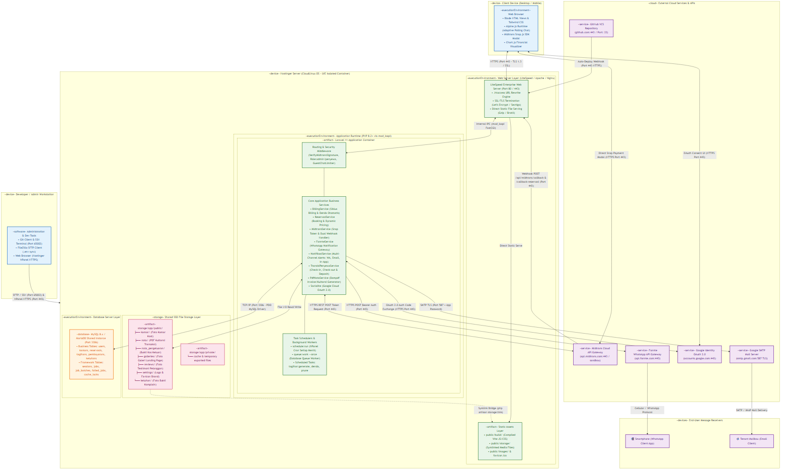

```mermaid
flowchart TB
    %% =========================================================================
    %% CLIENT & DEVELOPER WORKSTATION NODES
    %% =========================================================================
    subgraph ClientDevice["«device» Client Device (Desktop / Mobile)"]
        BrowserApp["«executionEnvironment» Web Browser<br/>• Blade HTML Views & Tailwind CSS<br/>• Alpine.js Runtime (Adaptive Polling Chat)<br/>• Midtrans Snap.js SDK Modal<br/>• Chart.js Financial Visualizer"]
    end

    subgraph DevDevice["«device» Developer / Admin Workstation"]
        DevTools["«software» Administration & Dev Tools<br/>• Git Client & SSH Terminal (Port 65002)<br/>• FileZilla SFTP Client (.env sync)<br/>• Web Browser (Hostinger hPanel HTTPS)"]
    end

    %% =========================================================================
    %% HOSTINGER SHARED HOSTING SERVER NODE
    %% =========================================================================
    subgraph HostingerNode["«device» Hostinger Server (CloudLinux OS - LVE Isolated Container)"]
        
        subgraph WebServerEnv["«executionEnvironment» Web Server Layer (LiteSpeed / Apache / Nginx)"]
            LiteSpeedEngine["LiteSpeed Enterprise Web Server (Port 80 / 443)<br/>• .htaccess URL Rewrite Engine<br/>• SSL/TLS Termination (Let's Encrypt / Sectigo)<br/>• Direct Static File Serving (Gzip / Brotli)"]
            StaticAssets["«artifact» Static Assets Layer<br/>• public/build/ (Compiled Vite JS/CSS)<br/>• public/storage/ (Symlinked Media Files)<br/>• public/images/ & favicon.ico"]
        end

        subgraph PHPEnv["«executionEnvironment» Application Runtime (PHP 8.2+ via mod_lsapi)"]
            subgraph LaravelApp["«artifact» Laravel 11 Application Container"]
                RoutingCore["Routing & Security Middleware<br/>(VerifyMidtransSignature, Role:admin/penyewa, GuestChatLimiter)"]
                
                ServicesLayer["Core Application Business Services<br/>• BillingService (Siklus Billing & Denda Otomatis)<br/>• ReservasiService (Booking & Dynamic Pricing)<br/>• MidtransService (Snap Token & Dual Webhook Handler)<br/>• FonnteService (WhatsApp Notification Gateway)<br/>• NotifikasiService (Multi-Channel Alerts: WA, Email, In-App)<br/>• TransisiPenyewaService (Check-in, Check-out & Deposit)<br/>• PdfNotaService (Dompdf Invoice/Kuitansi Generator)<br/>• Socialite (Google Cloud OAuth 2.0)"]
                
                SchedulerWorker["Task Schedulers & Background Workers<br/>• schedule:run (hPanel Cron Setiap Menit)<br/>• queue:work --once (Database Queue Worker)<br/>• Scheduled Tasks: tagihan:generate, denda, prune"]
            end
        end

        subgraph StorageEnv["«storage» Shared SSD File Storage Layer"]
            PublicDisk["«artifact» storage/app/public/<br/>├── kamar/ (Foto Kamar Kost)<br/>├── nota/ (PDF Kuitansi Transaksi)<br/>├── nota_pengeluaran/ (Bukti Kas Keluar)<br/>├── galleries/ (Foto Galeri Landing Page)<br/>├── reviews/ (Foto Testimoni Pelanggan)<br/>├── settings/ (Logo & Favicon Brand)<br/>└── keluhan/ (Foto Bukti Komplain)"]
            PrivateDisk["«artifact» storage/app/private/<br/>└── cache & temporary exported files"]
        end

        subgraph DBEnv["«executionEnvironment» Database Server Layer"]
            MySQLServer["«database» MySQL 8.x / MariaDB Shared Instance (Port 3306)<br/>• Business Tables: users, kamars, reservasis, tagihans, pembayarans, keluhans<br/>• Framework Tables: sessions, jobs, job_batches, failed_jobs, cache_locks"]
        end
    end

    %% =========================================================================
    %% EXTERNAL CLOUD SERVICES & REPOSITORIES
    %% =========================================================================
    subgraph ExternalServices["«cloud» External Cloud Services & APIs"]
        MidtransAPI["«service» Midtrans Cloud API Gateway<br/>(api.midtrans.com:443 / sandbox)"]
        FonnteAPI["«service» Fonnte WhatsApp API Gateway<br/>(api.fonnte.com:443)"]
        GoogleOAuthAPI["«service» Google Identity OAuth 2.0<br/>(accounts.google.com:443)"]
        GoogleSMTPAPI["«service» Google SMTP Mail Server<br/>(smtp.gmail.com:587 TLS)"]
        GitHubVCS["«service» GitHub VCS Repository<br/>(github.com:443 / Port: 22)"]
    end

    subgraph EndUserRecipients["«devices» End-User Message Receivers"]
        UserPhone["📲 Smartphone (WhatsApp Client App)"]
        UserMail["📬 Tenant Mailbox (Email Client)"]
    end

    %% =========================================================================
    %% PROTOCOL CONNECTIONS & COMMUNICATION PATHS
    %% =========================================================================
    BrowserApp <-->|"HTTPS (Port 443 - TLS 1.3 / SSL)"| LiteSpeedEngine
    LiteSpeedEngine -->|"Direct Static Serve"| StaticAssets
    LiteSpeedEngine <-->|"Internal IPC (mod_lsapi FastCGI)"| RoutingCore
    
    RoutingCore --- ServicesLayer
    ServicesLayer --- SchedulerWorker
    
    ServicesLayer <-->|"TCP/IP (Port 3306 - PDO MySQL Driver)"| MySQLServer
    ServicesLayer <-->|"File I/O Read/Write"| PublicDisk
    PublicDisk -.->|"Symlink Bridge (php artisan storage:link)"| StaticAssets
    
    DevTools -->|"SFTP / SSH (Port 65002) & hPanel HTTPS (Port 443)"| HostingerNode
    GitHubVCS -->|"Auto-Deploy Webhook (Port 443 HTTPS)"| LiteSpeedEngine

    ServicesLayer <-->|"HTTPS REST POST Token Request (Port 443)"| MidtransAPI
    MidtransAPI -->|"Webhook POST /api/midtrans/callback & /callback-reservasi (Port 443)"| LiteSpeedEngine
    BrowserApp <-->|"Direct Snap Payment Modal (HTTPS Port 443)"| MidtransAPI

    ServicesLayer -->|"HTTPS POST Bearer Auth (Port 443)"| FonnteAPI
    FonnteAPI -->|"Cellular / WhatsApp Protocol"| UserPhone

    ServicesLayer <-->|"OAuth 2.0 Auth Code Exchange (HTTPS Port 443)"| GoogleOAuthAPI
    BrowserApp <-->|"OAuth Consent UI (HTTPS Port 443)"| GoogleOAuthAPI

    ServicesLayer -->|"SMTP TLS (Port 587 + App Password)"| GoogleSMTPAPI
    GoogleSMTPAPI -->|"SMTP / IMAP Mail Delivery"| UserMail

    %% =========================================================================
    %% STYLING
    %% =========================================================================
    classDef client fill:#E3F2FD,stroke:#1565C0,stroke-width:2px,color:#0D47A1;
    classDef server fill:#E8F5E9,stroke:#2E7D32,stroke-width:2px,color:#1B5E20;
    classDef db fill:#FFF3E0,stroke:#EF6C00,stroke-width:2px,color:#E65100;
    classDef ext fill:#F3E5F5,stroke:#6A1B9A,stroke-width:2px,color:#4A148C;
    classDef storage fill:#FCE4EC,stroke:#C2185B,stroke-width:1.5px,color:#880E4F;

    class BrowserApp,DevTools client;
    class LiteSpeedEngine,StaticAssets,RoutingCore,ServicesLayer,SchedulerWorker server;
    class MySQLServer db;
    class MidtransAPI,FonnteAPI,GoogleOAuthAPI,GoogleSMTPAPI,GitHubVCS,UserPhone,UserMail ext;
    class PublicDisk,PrivateDisk storage;
```

---

### 1.1. Topologi Infrastruktur Jaringan Utama (High-Level Network Topology)
Diagram ini memetakan batas-batas jaringan fisik (*network boundaries*), alokasi alamat IP host, port komunikasi, serta enkripsi SSL transit dari client browser dan workstation pengembang ke server Hostinger dan database.

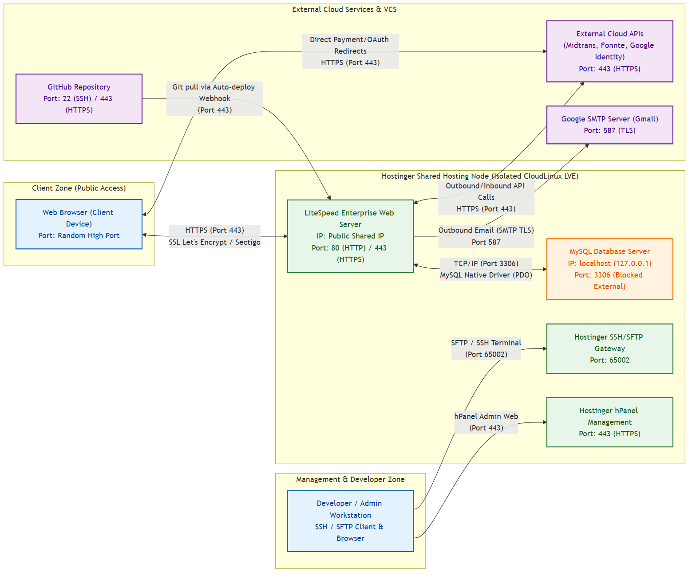

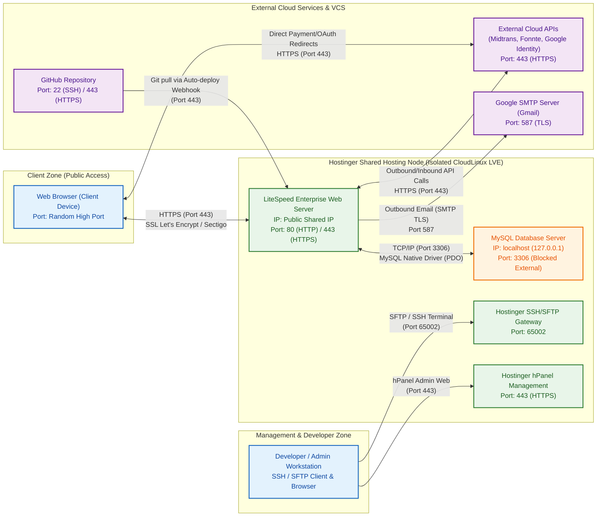

---

### 1.2. Arsitektur Internal Server Produksi (Production Server Internal Architecture)
Diagram ini memvisualisasikan bagaimana kontainer perangkat lunak, virtualisasi PHP, Laravel engine, serta shared SSD storage berinteraksi di dalam Hostinger Shared Hosting Node.

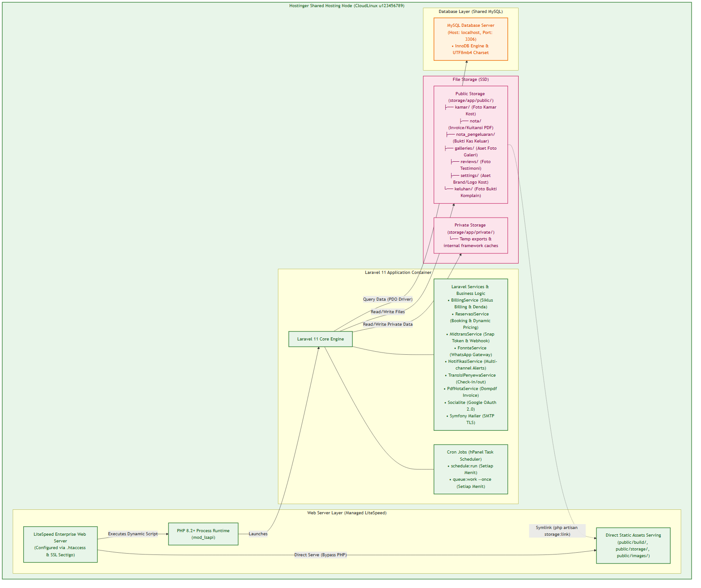

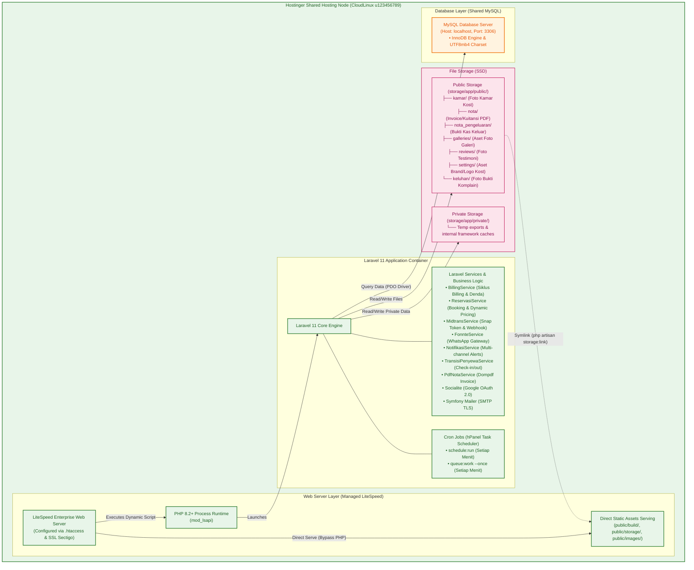

---

### 1.3. Alur Integrasi Layanan Cloud Pihak Ketiga (Third-Party Cloud APIs Integration Flow)
Diagram ini merinci alur komunikasi bolak-balik antara peramban web client, server Laravel, dan masing-masing gerbang layanan API cloud eksternal serta kanal in-app notification.

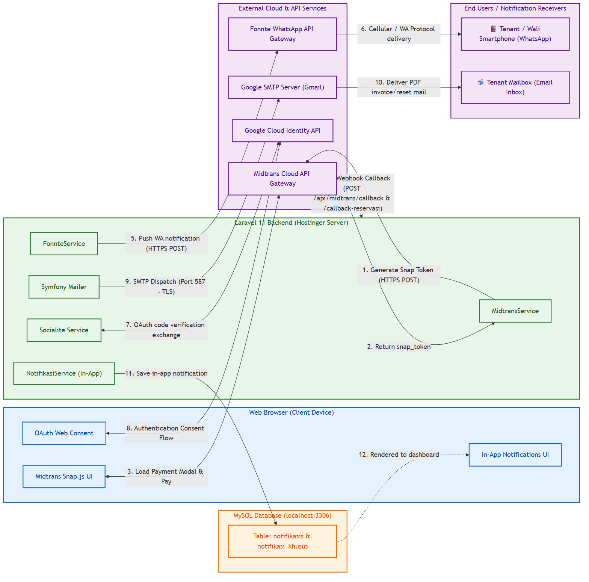

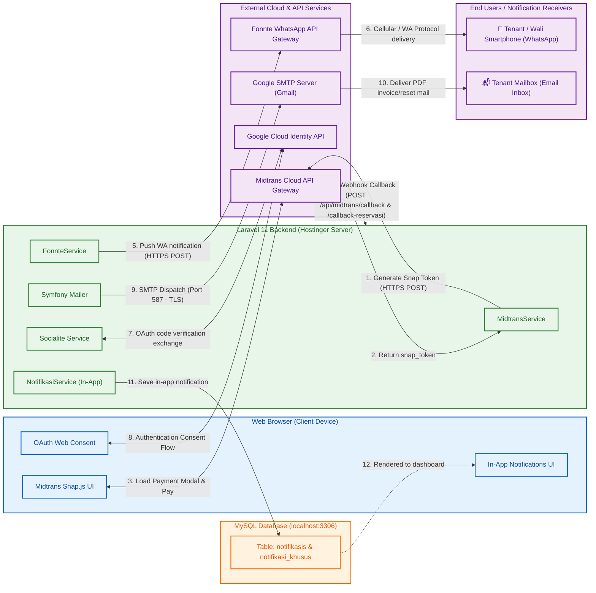

---

### 1.4. Diagram Alur Komunikasi Antar Node Terintegrasi (Integrated Node Communication Flow Diagram)
Diagram urutan (Sequence Diagram) ini menggambarkan visualisasi alur interaksi terpadu, arah koneksi, protokol yang digunakan, serta pertukaran data antar-node secara lengkap dengan memisahkan perangkat akhir penerima pesan (*Smartphone WhatsApp & Email Inbox*).

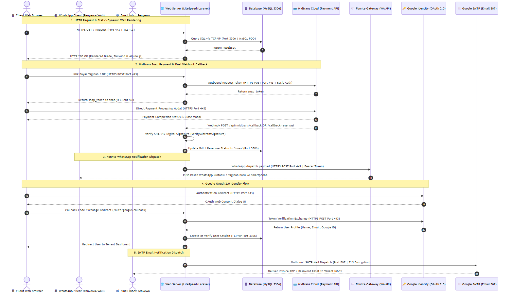

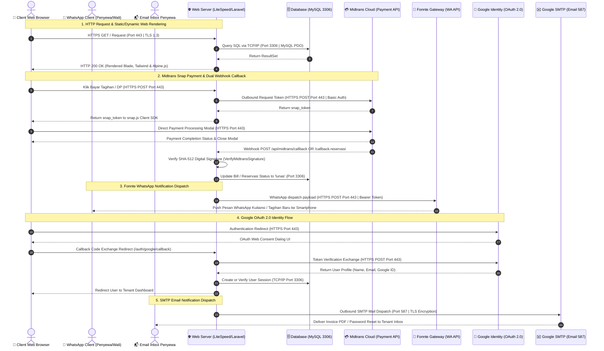

---

### 1.5. Arsitektur Komunikasi & Alur Protokol Multi-Tier (Multi-Tier Inter-Node Communication Architecture)
Diagram ini memetakan arsitektur komunikasi data berlapis secara komprehensif, mencakup arah koneksi, nomor port, protokol transmisi (HTTP/HTTPS, TCP/IP, SMTP, SFTP), serta interaksi end-to-end dengan seluruh gerbang layanan cloud eksternal.

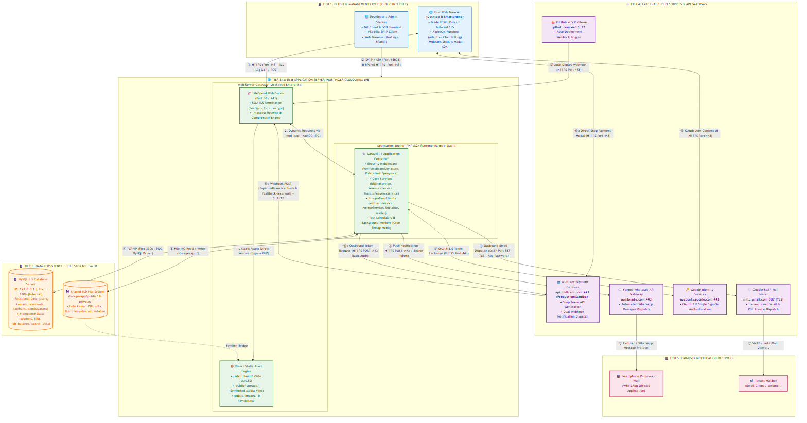

```mermaid
flowchart TD
    %% =========================================================================
    %% TIER 1: CLIENT & MANAGEMENT ACCESS LAYER
    %% =========================================================================
    subgraph Tier1["📱 TIER 1: CLIENT & MANAGEMENT LAYER (PUBLIC INTERNET)"]
        direction LR
        Browser["🌐 User Web Browser<br/><b>(Desktop & Smartphone)</b><br/>• Blade HTML Views & Tailwind CSS<br/>• Alpine.js Runtime (Adaptive Chat Polling)<br/>• Midtrans Snap.js Modal SDK"]
        DevAdmin["💻 Developer / Admin Station<br/>• Git Client & SSH Terminal<br/>• FileZilla SFTP Client<br/>• Web Browser (Hostinger hPanel)"]
    end

    %% =========================================================================
    %% TIER 2: HOSTINGER PRODUCTION SERVER (CLOUDLINUX LVE)
    %% =========================================================================
    subgraph Tier2["🌐 TIER 2: WEB & APPLICATION SERVER (HOSTINGER CLOUDLINUX LVE)"]
        direction TB
        subgraph WebServerSub["Web Server Gateway (LiteSpeed Enterprise)"]
            LiteSpeed["🚀 LiteSpeed Web Server (Port 80 / 443)<br/>• SSL/TLS Termination (Sectigo / Let's Encrypt)<br/>• .htaccess Rewrite & Compression Engine"]
            StaticCache["📦 Direct Static Asset Engine<br/>• public/build/ (Vite JS/CSS)<br/>• public/storage/ (Symlinked Media Files)<br/>• public/images/ & favicon.ico"]
        end

        subgraph AppRuntimeSub["Application Engine (PHP 8.2+ Runtime via mod_lsapi)"]
            LaravelApp["⚙️ Laravel 11 Application Container<br/>• Security Middleware (VerifyMidtransSignature, Role:admin/penyewa)<br/>• Core Services (BillingService, ReservasiService, TransisiPenyewaService)<br/>• Integration Clients (MidtransService, FonnteService, Socialite, Mailer)<br/>• Task Schedulers & Background Workers (Cron Setiap Menit)"]
        end
        
        LiteSpeed -->|"1. Static Assets Direct Serving (Bypass PHP)"| StaticCache
        LiteSpeed <-->|"2. Dynamic Requests via mod_lsapi (FastCGI IPC)"| LaravelApp
    end

    %% =========================================================================
    %% TIER 3: DATA PERSISTENCE & STORAGE LAYER
    %% =========================================================================
    subgraph Tier3["🗄️ TIER 3: DATA PERSISTENCE & FILE STORAGE LAYER"]
        direction LR
        MySQLDB[("🗄️ MySQL 8.x Database Server<br/><b>IP: 127.0.0.1 | Port: 3306 (Internal)</b><br/>• Relational Data (users, kamars, reservasis, tagihans, pembayarans)<br/>• Framework Data (sessions, jobs, job_batches, cache_locks)")]
        SSDDisk[("💾 Shared SSD File System<br/><b>storage/app/public/ & private/</b><br/>• Foto Kamar, PDF Nota, Bukti Pengeluaran, Keluhan")]
    end

    %% =========================================================================
    %% TIER 4: EXTERNAL CLOUD SERVICES & APIS
    %% =========================================================================
    subgraph Tier4["☁️ TIER 4: EXTERNAL CLOUD SERVICES & API GATEWAYS"]
        direction TB
        Midtrans["💳 Midtrans Payment Gateway<br/><b>api.midtrans.com:443 (Production/Sandbox)</b><br/>• Snap Token API Generation<br/>• Dual Webhook Notification Dispatch"]
        Fonnte["💬 Fonnte WhatsApp API Gateway<br/><b>api.fonnte.com:443</b><br/>• Automated WhatsApp Messages Dispatch"]
        GoogleAuth["🔑 Google Identity Services<br/><b>accounts.google.com:443</b><br/>• OAuth 2.0 Single Sign-On Authentication"]
        GoogleMail["✉️ Google SMTP Mail Server<br/><b>smtp.gmail.com:587 (TLS)</b><br/>• Transactional Email & PDF Invoice Dispatch"]
        GitHub["🐙 GitHub VCS Platform<br/><b>github.com:443 / :22</b><br/>• Auto-Deployment Webhook Trigger"]
    end

    %% =========================================================================
    %% TIER 5: END-USER RECEIVER TERMINALS
    %% =========================================================================
    subgraph Tier5["📲 TIER 5: END-USER NOTIFICATION RECEIVERS"]
        direction LR
        UserPhone["📱 Smartphone Penyewa / Wali<br/>(WhatsApp Official Application)"]
        UserMail["📬 Tenant Mailbox<br/>(Email Client / Webmail)"]
    end

    %% =========================================================================
    %% COMMUNICATION FLOWS & PROTOCOLS
    %% =========================================================================
    %% 1. Web Traffic & Management
    Browser <-->|"① HTTPS (Port 443 - TLS 1.3) GET / POST"| LiteSpeed
    DevAdmin -->|"② SFTP / SSH (Port 65002) & hPanel HTTPS (Port 443)"| Tier2
    GitHub -->|"③ Auto-Deploy Webhook (HTTPS Port 443)"| LiteSpeed

    %% 2. Internal Database & Storage
    LaravelApp <-->|"④ TCP/IP (Port 3306 - PDO MySQL Driver)"| MySQLDB
    LaravelApp <-->|"⑤ File I/O Read / Write (storage/app/)"| SSDDisk
    SSDDisk -.->|"Symlink Bridge"| StaticCache

    %% 3. Midtrans Payment Flow
    LaravelApp -->|"⑥a Outbound Token Request (HTTPS POST :443 | Basic Auth)"| Midtrans
    Browser <-->|"⑥b Direct Snap Payment Modal (HTTPS Port 443)"| Midtrans
    Midtrans -->|"⑥c Webhook POST (/api/midtrans/callback & /callback-reservasi) + SHA512"| LiteSpeed

    %% 4. Fonnte WhatsApp Flow
    LaravelApp -->|"⑦ Push Notification (HTTPS POST :443 | Bearer Token)"| Fonnte
    Fonnte -->|"⑧ Cellular / WhatsApp Message Protocol"| UserPhone

    %% 5. Google OAuth Flow
    LaravelApp <-->|"⑨ OAuth 2.0 Token Exchange (HTTPS Port 443)"| GoogleAuth
    Browser <-->|"⑩ OAuth User Consent UI (HTTPS Port 443)"| GoogleAuth

    %% 6. Google SMTP Flow
    LaravelApp -->|"⑪ Outbound Email Dispatch (SMTP Port 587 - TLS + App Password)"| GoogleMail
    GoogleMail -->|"⑫ SMTP / IMAP Mail Delivery"| UserMail

    %% =========================================================================
    %% STYLING
    %% =========================================================================
    classDef client fill:#E3F2FD,stroke:#1565C0,stroke-width:2px,color:#0D47A1;
    classDef server fill:#E8F5E9,stroke:#2E7D32,stroke-width:2px,color:#1B5E20;
    classDef db fill:#FFF3E0,stroke:#EF6C00,stroke-width:2px,color:#E65100;
    classDef ext fill:#F3E5F5,stroke:#6A1B9A,stroke-width:2px,color:#4A148C;
    classDef receiver fill:#FCE4EC,stroke:#C2185B,stroke-width:1.5px,color:#880E4F;

    class Browser,DevAdmin client;
    class LiteSpeed,StaticCache,LaravelApp server;
    class MySQLDB,SSDDisk db;
    class Midtrans,Fonnte,GoogleAuth,GoogleMail,GitHub ext;
    class UserPhone,UserMail receiver;
```

---

## 2. Rincian Node Arsitektur & Perangkat Lunak

### 2.0. Pemetaan Lingkungan Lokal (Development) vs Produksi (Hostinger)

Untuk menjamin kelancaran siklus pengembangan dan penyebaran, infrastruktur sistem dibagi menjadi dua lingkungan dengan komponen yang setara secara fungsional:

| Komponen Infrastruktur | Lingkungan Lokal (XAMPP / Development) | Lingkungan Produksi (Hostinger Shared) |
| :--- | :--- | :--- |
| **Client Layer** | Web Browser mengakses `http://localhost:8000` via koneksi loopback lokal | Web Browser mengakses `https://asri-kost.domain.com` melalui internet dengan enkripsi SSL/TLS |
| **Web Server** | **Apache HTTP Server** (XAMPP default) atau **Nginx** | **LiteSpeed Enterprise Web Server** (berfungsi sebagai Apache-drop-in-replacement yang membaca `.htaccess`) |
| **Application Runtime**| **PHP 8.2+** (CLI / Apache Module) menjalankan Core Engine **Laravel 11** | **PHP 8.2+** (dieksekusi via `mod_lsapi` CloudLinux) menjalankan Core Engine **Laravel 11** |
| **Database Server** | **MySQL 8.x** atau MariaDB (Localhost, Port 3306) | **MySQL / MariaDB Shared Instance** (Localhost / Hostinger Database Host, Port 3306) |
| **External Services** | Koneksi sandbox/development (Midtrans Sandbox API, Fonnte API, Google Console Dev App) | Koneksi production/live (Midtrans Production API, Fonnte WA Gateway, Google Console Live App) |

---

### 2.1. Platform Kode, Deployment & Developer Workstation
* **GitHub Repository:** Repositori git terpusat tempat seluruh pengembang mengunggah kode sumber. Penyebaran ke Hostinger dilakukan menggunakan fitur **Hostinger Git Integration** (otomatis menarik kode via Webhook saat ada push baru ke branch `main`).
* **Developer Workstation & Admin Tools:** Menggunakan klien SFTP/SSH seperti FileZilla atau VSCode SSH Remote pada **Port `65002`** (port SSH khusus Hostinger) untuk mentransfer berkas konfigurasi sensitif ([`.env`](file:///c:/xampp/htdocs/asri-boarding-house/.env)) serta antarmuka **Hostinger hPanel (HTTPS Port 443)** untuk manajemen database MySQL, SSL, DNS, dan Cron Tasks.

### 2.2. Device Pengguna (Client Node)
* **Web Browser:** Berfungsi merender dokumen HTML/CSS Blade responsif.
* **Alpine.js Runtime:** Library Javascript ringan yang berjalan di memori client untuk menangani interaksi dinamis DOM lokal seperti membuka modal, dasbor, stepper formulir sewa, dan adaptive AJAX polling chatbox (interval 4 detik).
* **Midtrans Snap.js SDK:** Memunculkan modal Snap pembayaran instan langsung di sisi peramban web pengguna secara aman.
* **Chart.js:** Komponen visualisasi arus kas masuk/keluar dan grafik okupansi kamar pada dasbor Admin.

### 2.3. Server Produksi (Hostinger Shared Hosting Node - Paket Single)
Node server berbasis shared hosting yang dikelola secara penuh (*fully managed*) oleh Hostinger bersistem operasi CloudLinux (keamanan terisolasi per pengguna via LVE).

* **LiteSpeed Enterprise Web Server:** Menggantikan Nginx/Apache konvensional. LiteSpeed membaca konfigurasi `.htaccess`, menyajikan aset statis (`public/build/`, `public/storage/`) secara langsung dengan kompresi Gzip/Brotli, serta dilengkapi sertifikat SSL lifetime gratis yang diatur melalui hPanel.
* **PHP 8.2+ Runtime:** Dijalankan melalui handler khusus LiteSpeed (`mod_lsapi`) yang mengoptimalkan eksekusi script PHP secara dinamis dengan alokasi resource sesuai batasan Paket Single (RAM 512 MB - 1 GB, 1 Core CPU).
* **Laravel 11 Framework:** Instance aplikasi backend yang memproses logika bisnis sistem.
* **Background Job Management (Shared Hosting Constraint):**
  Karena Shared Hosting **tidak mengizinkan** hak akses root (`sudo`) dan daemons yang berjalan terus menerus (seperti Supervisor), maka antrean backend disesuaikan sebagai berikut:
  * **Pilihan A (Default - Antrean Sinkron):** `QUEUE_CONNECTION=sync` di `.env`, di mana antrean pekerjaan (seperti pengiriman WhatsApp) langsung diproses secara sinkron pada saat request pengguna berlangsung.
  * **Pilihan B (Asinkron via Cron):** `QUEUE_CONNECTION=database` dengan mendaftarkan tugas cron berkala di hPanel Hostinger:
    `* * * * * /usr/local/bin/php /home/uXXXXXX/domains/domain.com/public_html/artisan queue:work --once` (dijalankan setiap menit).
* **hPanel Cron Jobs:** Pengganti sistem daemon. Pengguna mendaftarkan tugas cron scheduler Laravel setiap menit melalui kontrol panel hPanel Hostinger:
  `* * * * * /usr/local/bin/php /home/uXXXXXX/domains/domain.com/public_html/artisan schedule:run >> /dev/null 2>&1`
* **Shared SSD Storage (`public_html/storage/`):** Menyimpan berkas statis dan unggahan media. Tautan simbolik (*symlink*) dibuat dari direktori `public/storage` ke `storage/app/public` melalui perintah `php artisan storage:link`. Berkas yang dikelola meliputi:
  * **Kamar (`storage/app/public/kamar`):** Foto master kamar kost yang diunggah oleh Administrator via CRUD Kamar.
  * **Kuitansi/Nota PDF (`storage/app/public/nota`):** Dokumen invoice bukti transaksi PDF yang di-generate otomatis oleh `PdfNotaService` via Dompdf.
  * **Bukti Pengeluaran (`storage/app/public/nota_pengeluaran`):** Foto kuitansi pengeluaran kas operasional yang diunggah Admin, dibatasi maksimal 2MB.
  * **Galeri Foto (`storage/app/public/galleries`):** Gambar dinamis untuk visualisasi galeri landing page utama.
  * **Ulasan/Testimoni (`storage/app/public/reviews`):** Foto testimoni penyewa yang ditampilkan pada landing page.
  * **Pengaturan Brand (`storage/app/public/settings`):** Aset logo dan ikon kost dinamis yang dapat diubah Administrator.
  * **Keluhan Penyewa (`storage/app/public/keluhan`):** Foto bukti keluhan/kerusakan fasilitas yang dilaporkan penyewa (maksimal 2MB) untuk diteruskan ke Administrator.

### 2.4. Database Server Node
* **Hostinger MySQL / MariaDB Shared Instance:** Database relasional MySQL yang disediakan Hostinger.
* **MySQL Server Host:** Secara default menggunakan `localhost` (`127.0.0.1`) pada Port `3306`.
* **Keamanan:** Port 3306 diblokir dari akses eksternal publik secara default (*firewall blocked*), hanya menerima koneksi internal PDO PHP.
* **Tabel Basis Data:**
  * **Data Bisnis:** `users`, `penyewas`, `kamars`, `fasilitas`, `reservasis`, `tagihans`, `pembayarans`, `pengeluarans`, `keluhans`, `settings`, `customer_reviews`, `galleries`, `faqs`, `peraturans`.
  * **Data Infrastruktur Framework:** `sessions`, `jobs`, `job_batches`, `failed_jobs`, `cache`, `cache_locks`, `log_notifikasis`, `notifikasis`, `notifikasi_khusus`.

### 2.5. Layanan Eksternal Cloud (External Cloud APIs)
* **Midtrans Payment Gateway Cloud API:** Memproses transaksi pembayaran digital penyewa secara aman dan mengirimkan pemberitahuan status transaksi instan melalui 2 Webhook callback (HTTP POST): `/api/midtrans/callback` (Tagihan) dan `/api/midtrans/callback-reservasi` (Reservasi DP).
* **Fonnte WhatsApp API Gateway:** API gateway eksternal pihak ketiga untuk mengirimkan pesan WhatsApp otomatis berisi welcome message (kredensial akun), invoice tagihan bulanan, denda, dan keluhan penyewa.
* **Google Cloud Identity Services:** Layanan autentikasi Google OAuth 2.0 yang digunakan melalui Laravel Socialite untuk login cepat pengguna tanpa kata sandi tradisional.
* **Google SMTP Server (Gmail):** Server surat (mail server) yang digunakan oleh Symfony Mailer Laravel untuk mengirim berkas PDF nota kuitansi dan email reset sandi lewat port TLS 587.

### 2.6. Pengaturan Konten & Bank Dinamis
* **Tabel Settings & Model Setting:** Menyimpan variabel pengaturan konfigurasi dinamis yang dapat diubah Administrator via Dasbor Admin. Hal ini mencakup rincian bank transfer (Nama Bank, Nomor Rekening, dan Nama Pemilik Rekening) serta nomor kontak WhatsApp pemilik kost (`WA_OWNER_NUMBER`). Data ini dimuat secara dinamis oleh Laravel dan disajikan langsung di peramban pengguna, menghilangkan kebutuhan hardcoding data perbankan di dalam file view.

---

## 3. Protokol Jaringan & Keamanan Komunikasi

Infrastruktur sistem pada Shared Hosting Hostinger diamankan menggunakan konfigurasi berikut:

| Jalur Komunikasi (Asal -> Tujuan) | Protokol | Port | Metode Pengamanan | Detail Deskripsi |
| :--- | :--- | :---: | :--- | :--- |
| **Browser Tamu/User -> LiteSpeed Server** | HTTPS (TLS 1.3) | 443 | SSL Certificate (Sectigo/Let's Encrypt) | Enkripsi data transit pengguna, dikonfigurasi melalui menu SSL di hPanel Hostinger. |
| **LiteSpeed Web Server -> PHP Runtime** | CGI / lsapi | Internal | CloudLinux LVE isolation | Isolasi keamanan tingkat sistem operasi oleh Hostinger untuk memisahkan resource proses antar akun hosting. |
| **Laravel Backend -> MySQL Shared Instance** | TCP/IP (MySQL) | 3306 | Hostinger DB Password Auth (PDO) | Database diakses secara lokal (`localhost`) dengan otentikasi kata sandi terenkripsi. Port 3306 terblokir untuk akses publik luar. |
| **Developer PC -> Hostinger SSH/SFTP** | SSH / SFTP | 65002 | SSH Key / Password Authentication | Jalur upload berkas `.env` dan eksekusi perintah manual via terminal. |
| **Developer PC -> Hostinger hPanel** | HTTPS | 443 | 2FA / Session Authentication | Pengelolaan konfigurasi server, database, SSL, dan Cron Tasks. |
| **Laravel Backend -> Midtrans Cloud API** | HTTPS Rest API | 443 | Basic Auth (Server Key Base64) | Pengiriman data transaksi aman menggunakan otentikasi Server Key dari dasbor Midtrans. |
| **Midtrans Webhook -> LiteSpeed Server** | HTTPS Post | 443 | Digital Signature SHA512 Verification | Middleware Laravel `VerifyMidtransSignature` mencocokkan SHA512 signature dari payload webhook Midtrans. |
| **Laravel Backend -> Fonnte Cloud API** | HTTPS Rest API | 443 | Bearer Token Auth | Pengiriman data WhatsApp menyertakan `FONNTE_TOKEN` unik pada header request HTTP POST ke `api.fonnte.com`. |
| **Laravel Backend -> Google Identity Gateway** | HTTPS Redirect | 443 | OAuth 2.0 Client Credentials | Integrasi Laravel Socialite menggunakan kombinasi Client ID dan Client Secret Google Cloud. |
| **Laravel Backend -> Google SMTP Server** | SMTP | 587 | TLS Encryption / App Password | Transmisi email resmi aman menggunakan enkripsi TLS port 587 dengan Google App Password. |
| **GitHub -> Hostinger (Deployment)** | HTTPS Webhook | 443 | Webhook Secrets Verification | Integrasi Git Hostinger dipicu oleh Webhook GitHub resmi untuk memicu git pull otomatis. |

---

## 4. Konfigurasi Environment Jaringan (Pemetaan .env Hostinger)

Parameter topologi jaringan dan kredensial eksternal disesuaikan dengan konfigurasi Shared Hosting Hostinger Paket Single:

```ini
# Konfigurasi Akses Domain Utama & Protokol (Pastikan HTTPS)
APP_NAME="Asri Boarding House"
APP_ENV=production
APP_DEBUG=false
APP_URL=https://asri-kost.domain.com          # URL Utama Web (Akses Browser User)

# Konfigurasi Koneksi Node Basis Data Hostinger
DB_CONNECTION=mysql                           # Driver Database
DB_HOST=localhost                             # IP Host (Localhost pada Shared Hosting Hostinger)
DB_PORT=3306                                  # Port MySQL
DB_DATABASE=u123456789_asri_kost_db           # Nama Database (Sesuai prefix user hPanel Hostinger)
DB_USERNAME=u123456789_asri_db_user           # User Database (Sesuai prefix user hPanel)
DB_PASSWORD=secure_hostinger_db_password      # Sandi database yang diatur di hPanel

# Konfigurasi Cloud Integrasi Midtrans
MIDTRANS_SERVER_KEY=Mid-server-xxxxxxxxx      # Kunci API Server Backend (Auth Header)
MIDTRANS_CLIENT_KEY=Mid-client-xxxxxxxxx      # Kunci API Client Frontend (Snap JS)
MIDTRANS_IS_PRODUCTION=true                   # Mode Server Cloud (False = Sandbox)

# Konfigurasi Fitur & Bisnis Kost
WA_OWNER_NUMBER=62895330031313                # Kontak Utama WA Pemilik (Tujuan chat pengunjung)
WA_OWNER_NAME="Admin Asri Boarding House"
RESERVASI_DP_PERCENTAGE=0.30                  # Ketetapan Uang Muka Reservasi (30%)
RESERVASI_EXPIRE_HOURS=24                     # Batas waktu pembayaran reservasi (Jam)

# Konfigurasi Cloud Integrasi Fonnte
FONNTE_TOKEN=fonnte-jwt-token-production      # Token Autentikasi Kirim WA (Auth Header)

# Konfigurasi Cloud Integrasi Google Sign-In
GOOGLE_CLIENT_ID=xxxxxxxxxx.apps.googleusercontent.com  # OAuth Client ID
GOOGLE_CLIENT_SECRET=GOCSPX-xxxxxxxxxxxxx               # OAuth Client Secret

# Konfigurasi Layanan SMTP Server Email
MAIL_MAILER=smtp                              # Protokol Driver Email
MAIL_HOST=smtp.gmail.com                      # Host Gateway SMTP Google
MAIL_PORT=587                                 # Port SMTP TLS
MAIL_ENCRYPTION=tls                           # Skema Enkripsi Data Transit
MAIL_USERNAME=dev.asrikost@gmail.com          # Email Pengirim Resmi
MAIL_PASSWORD="abcd efgh ijkl mnop"           # App Password Google SMTP
MAIL_FROM_ADDRESS=dev.asrikost@gmail.com
MAIL_FROM_NAME="Asri Boarding House"

# Konfigurasi Queue & Session
QUEUE_CONNECTION=database                     # Opsi database didukung via cron worker hPanel
SESSION_DRIVER=file                           # Atau database
SESSION_LIFETIME=120
SESSION_SECURE_COOKIE=true
```

---

## 5. Alur Aliran Data & Komunikasi Jaringan (Network Data Flow)

### 5.1. Alur HTTP Request & Render Halaman (Siklus Akses Dasbor)
1. **Pengguna** membuka halaman web (Dasbor Penyewa) di browser. Browser mengirimkan permintaan HTTP GET ke **LiteSpeed Web Server** Hostinger melalui port **HTTPS (443)** dengan enkripsi SSL Sectigo/Let's Encrypt.
2. **LiteSpeed** menerima permintaan dan memproses terminasi SSL. Jika request menuju aset statis (`/build/` atau `/storage/`), LiteSpeed menyajikan file langsung. Jika request dinamis, diteruskan melalui handler `mod_lsapi` ke **PHP Runtime (PHP 8.2+)**.
3. PHP menjalankan mesin Laravel 11. Laravel mengeksekusi middleware autentikasi dan controller dasbor terkait.
4. Laravel melakukan query database dengan mengirimkan query SQL ke **MySQL Shared Instance** via port **TCP/IP 3306** lokal (`localhost`).
5. **MySQL Shared Instance** mengembalikan baris data ke Laravel.
6. Laravel merender data tersebut ke dalam dokumen HTML menggunakan **Blade Template Engine** dan menyisipkan *script* Alpine.js.
7. Hasil render HTML dikembalikan ke **LiteSpeed**, lalu dikirimkan kembali ke peramban **Web Browser** pengguna untuk ditampilkan secara visual.

### 5.2. Alur Pembayaran Transaksi Online (Integrasi Midtrans)
1. **Penyewa / Calon Penyewa** mengklik tombol 'Bayar Tagihan' atau 'Bayar DP Reservasi' di browser. Browser mengirimkan permintaan pembuatan token bayar via HTTPS POST ke Laravel.
2. Laravel memproses data tagihan/reservasi, lalu komponen `MidtransService` membuat request outbound HTTP POST (Port 443) ke cloud **Midtrans Snap API** dengan melampirkan parameter transaksi dan `MIDTRANS_SERVER_KEY`.
3. **Midtrans Cloud** memproses transaksi, membuat token pembayaran unik (`snap_token`), dan mengembalikannya ke Laravel.
4. Laravel meneruskan `snap_token` tersebut kembali ke browser pengguna.
5. Skrip **Midtrans Snap.js** di browser menangkap token tersebut dan memunculkan pop-up modal pembayaran (Snap UI) secara langsung di layar pengguna.
6. Pengguna memilih metode pembayaran (misalnya Virtual Account Bank, QRIS, atau GoPay) dan menyelesaikan pembayaran secara cloud langsung ke Midtrans.
7. Setelah pembayaran berhasil, server **Midtrans Cloud** secara asinkron mengirimkan HTTP POST (Webhook) ke endpoint `/api/midtrans/callback` (Tagihan) atau `/api/midtrans/callback-reservasi` (Reservasi DP) di server Hostinger.
8. LiteSpeed menerima callback tersebut lalu meneruskannya ke Laravel. Middleware `VerifyMidtransSignature` memverifikasi *digital signature* SHA-512 callback untuk mencegah pemalsuan data.
9. Jika tanda tangan valid, Laravel memperbarui status tagihan/reservasi di basis data **MySQL Shared Instance** menjadi `lunas` dan memicu pembuatan PDF kuitansi oleh `PdfNotaService`.

### 5.3. Alur Pengiriman Notifikasi Multi-Kanal (WhatsApp & Email)
1. Segera setelah transaksi berhasil atau tagihan baru dibuat, Laravel memicu event terkait.
2. **Kanal WhatsApp (Fonnte):** `FonnteService` menyusun payload pesan teks kuitansi pembayaran dan melakukan panggilan HTTP POST outbound ke **Fonnte WA Gateway** di port 443 dengan menyertakan `FONNTE_TOKEN`. Server Fonnte mengirimkan pesan WhatsApp ke smartphone **Penyewa/Wali**.
3. **Kanal Email (SMTP):** `Symfony Mailer` menyusun email dengan lampiran PDF nota kuitansi dan mengirimkannya melalui port TLS 587 ke **Google SMTP Server**. Server Google meneruskannya ke **Email Inbox Penyewa**.
4. **Kanal In-App:** `NotifikasiService` menyimpan rekaman ke tabel `notifikasis` dan `notifikasi_khusus` di basis data MySQL untuk ditampilkan pada ikon lonceng dasbor pengguna.

### 5.4. Alur Login Terintegrasi Google (Google OAuth 2.0 Flow)
1. **Calon Penyewa** mengklik tombol "Login dengan Google" di halaman autentikasi.
2. Browser dialihkan langsung ke **Google OAuth 2.0 Gateway** di port 443 dengan membawa parameter `Client ID` aplikasi.
3. Pengguna melakukan login menggunakan akun Google dan memberikan persetujuan akses profil dasar pada antarmuka Google.
4. Google mengarahkan kembali browser pengguna ke endpoint callback web server Hostinger (`https://asri-kost.domain.com/auth/google/callback`).
5. Web Server meneruskan permintaan ini ke Laravel. Komponen **Laravel Socialite** secara backend melakukan pertukaran token rahasia (*auth code exchange*) dengan **Google Identity API** untuk memverifikasi keaslian data profil pengguna.
6. Google mengembalikan data profil pengguna (Nama, Email, Google ID).
7. Laravel memeriksa kecocokan email di basis data **MySQL Shared Instance**. Jika ada, session dibuat; jika belum ada, Laravel membuat user baru di database terlebih dahulu, kemudian mengarahkan peramban pengguna masuk ke halaman Dasbor Penyewa.

---

## 6. Panduan Deployment & Optimasi Produksi (Hostinger Shared Hosting)

Untuk menjamin sistem dapat berjalan secara andal, aman, dan berkinerja tinggi di bawah batasan resource paket **Shared Hosting Hostinger (Single)**, prosedur deployment berikut harus diikuti:

### 6.1. Alur Deploy Kode Fisik
1. **GitHub Integration (Otomatis):** Mengatur Git Webhook di repositori GitHub yang mengarah ke URL penarik otomatis (*Auto-deployment URL*) hPanel. Setiap kali ada push baru ke branch `main`, Hostinger akan mengeksekusi `git pull` secara otomatis di direktori `public_html`.
2. **SFTP Transfer (Manual):** Menggunakan klien SFTP seperti FileZilla pada Port `65002` (port SSH Hostinger) dengan kredensial SSH untuk mentransfer berkas yang dikecualikan dari Git (seperti berkas konfigurasi `.env`).

### 6.2. Konfigurasi Symlink Penyimpanan SSD
Shared hosting tidak mengizinkan akses shell root, sehingga perintah pembuatan symbolic link storage harus dijalankan dengan salah satu opsi berikut:
* **Opsi A (Melalui SSH Terminal Hostinger):**
  ```bash
  cd domains/domain.com/public_html
  php artisan storage:link
  ```
* **Opsi B (Melalui hPanel Cron Job - Sekali Pakai):**
  Membuat tugas cron di hPanel untuk berjalan sekali:
  `/usr/local/bin/php /home/u123456789/domains/domain.com/public_html/artisan storage:link`
* **Opsi C (Melalui Web Route Sementara):**
  Menambahkan rute sementara pada `routes/web.php` dan mengaksesnya sekali melalui browser:
  ```php
  Route::get('/symlink', function () {
      \Illuminate\Support\Facades\Artisan::call('storage:link');
      return 'Symlink created successfully!';
  });
  ```

### 6.3. Perintah Optimasi & Caching Produksi
Jalankan perintah optimasi berikut via SSH Terminal Hostinger setiap kali ada pembaruan kode baru untuk mempercepat waktu respons web server LiteSpeed:
```bash
# Masuk ke folder proyek
cd domains/domain.com/public_html

# Optimasi Autoloader Composer (Menghapus dev dependencies)
composer install --optimize-autoloader --no-dev

# Caching Konfigurasi, Rute, View, dan Event
php artisan config:cache
php artisan route:cache
php artisan view:cache
php artisan event:cache

# Jalankan Migrasi Database secara Aman di Produksi
php artisan migrate --force

# Compile Aset Front-End Tailwind & JS
npm run build
```

### 6.4. Pembersihan Data & Log Berkala (Database Health)
Karena basis data MySQL memiliki batasan kuota storage pada paket Single, performa dijaga dengan menjadwalkan command pembersihan log notifikasi secara harian menggunakan Laravel Scheduler:
```bash
# Perintah CLI untuk membersihkan log notifikasi berumur > 90 hari
php artisan log-notifikasi:clear
```
Tugas ini secara otomatis dijalankan oleh scheduler yang dipicu dari cron job hPanel setiap menit (`artisan schedule:run`).
