# Deployment Diagram - Asri Boarding House

Dokumen ini mendokumentasikan spesifikasi **Deployment Diagram (Diagram Penyebaran)** untuk **Sistem Informasi Manajemen Kost Terintegrasi Payment Gateway pada Asri Boarding House**. Diagram ini menggambarkan manifestasi fisik dari arsitektur jaringan, topologi infrastruktur server, protokol komunikasi, pembagian node komputasi, pemisahan struktur direktori server produksi, serta integrasi layanan cloud eksternal yang menyusun lingkungan pengembangan lokal maupun produksi dari sistem berbasis **Shared Hosting Hostinger (CloudLinux OS - LiteSpeed Enterprise)** pada domain resmi publik **[https://asriboardinghouse.weatso.id/](https://asriboardinghouse.weatso.id/)**.

Semua spesifikasi dalam dokumen ini selaras dengan dokumen blueprint lainnya:
* **Project Blueprint**: [Blueprint_Projek_Web_Asri_Boarding_House.md](file:///c:/xampp/htdocs/asri-boarding-house/Blueprint/Blueprint_Projek_Web_Asri_Boarding_House.md)
* **Product Requirement Document**: [product_requirement_document_kost.md](file:///c:/xampp/htdocs/asri-boarding-house/Blueprint/product_requirement_document_kost.md)
* **Component Diagram**: [Component_Diagram_Kost.md](file:///c:/xampp/htdocs/asri-boarding-house/Blueprint/Component_Diagram_Kost.md)
* **Sequence Diagram**: [Sequence_Diagram_Kost.md](file:///c:/xampp/htdocs/asri-boarding-house/Blueprint/Sequence_Diagram_Kost.md)
* **Class Diagram**: [Class_Diagram_Kost.md](file:///c:/xampp/htdocs/asri-boarding-house/Blueprint/Class_Diagram_Kost.md)
* **Entity Relationship Diagram**: [Entity_Relationship_Diagram_Kost.md](file:///c:/xampp/htdocs/asri-boarding-house/Blueprint/Entity_Relationship_Diagram_Kost.md)
* **Activity Diagram**: [Activity_Diagram_Kost.md](file:///c:/xampp/htdocs/asri-boarding-house/Blueprint/Activity_Diagram_Kost.md)
* **Flowchart Specification**: [Flowchart_Kost.md](file:///c:/xampp/htdocs/asri-boarding-house/Blueprint/Flowchart_Kost.md)
* **State Machine Diagram**: [State_Machine_Diagram_Kost.md](file:///c:/xampp/htdocs/asri-boarding-house/Blueprint/State_Machine_Diagram_Kost.md)
* **Use Case Specification**: [Use_Case_Diagram_Kost.md](file:///c:/xampp/htdocs/asri-boarding-house/Blueprint/Use_Case_Diagram_Kost.md)
* **Tutorial Deployment**: [tutorial_deployment_hostinger.md](file:///c:/xampp/htdocs/asri-boarding-house/Skripsi/tutorial_deployment_hostinger.md)

---

## 1. Diagram Penyebaran (Mermaid)

Untuk memastikan kelengkapan arsitektur berstandar UML 2.5 sekaligus keterbacaan yang maksimal, diagram penyebaran sistem dibagi menjadi 1 diagram terpadu (*Unified UML Deployment Diagram*) dan 6 visualisasi terfokus:

---

### 1.0. Diagram Penyebaran Terpadu (Unified UML 2.5 Deployment Diagram)
Diagram ini merangkum seluruh perangkat keras (*device nodes*), pemisahan direktori fisik (`public_html/` vs `asri-core/`), lingkungan eksekusi (*execution environments*), artefak perangkat lunak (*deployed artifacts*), media penyimpanan fisik (*NVMe SSD storage*), serta jalur komunikasi protokol jaringan dalam satu kesatuan arsitektur produksi Hostinger.

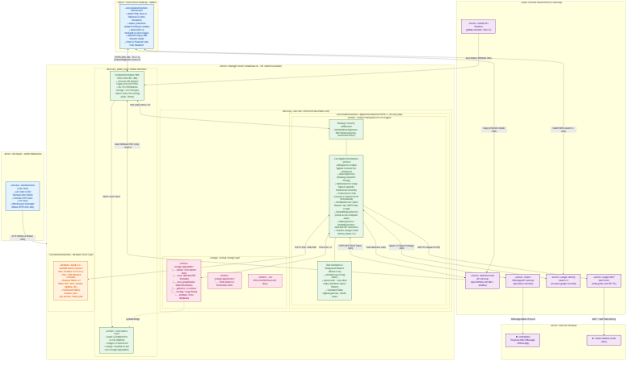


```mermaid
flowchart TB
    %% =========================================================================
    %% CLIENT & DEVELOPER WORKSTATION NODES
    %% =========================================================================
    subgraph ClientDevice["«device» Client Device (Desktop / Mobile)"]
        BrowserApp["«executionEnvironment» Web Browser<br/>• Blade HTML Views & Tailwind CSS (Neo-Brutalism)<br/>• Alpine.js Runtime (Adaptive Polling & Modals)<br/>• Axios Client & html2pdf.js Client Engine<br/>• Midtrans Snap.js SDK Payment Modal<br/>• Chart.js Financial Cash-Flow Visualizer"]
    end

    subgraph DevDevice["«device» Developer / Admin Workstation"]
        DevTools["«software» Administration & Dev Tools<br/>• Git Client & SSH Terminal (Port 65002)<br/>• FileZilla SFTP Client (.env sync)<br/>• Web Browser (Hostinger hPanel HTTPS Port 443)"]
    end

    %% =========================================================================
    %% HOSTINGER SHARED HOSTING SERVER NODE
    %% =========================================================================
    subgraph HostingerNode["«device» Hostinger Server (CloudLinux OS - LVE Isolated Container)"]
        direction TB
        
        %% PUBLIC DIRECTORY LAYER
        subgraph PublicHtmlDir["«directory» public_html/ (Public Web Root)"]
            LiteSpeedEngine["LiteSpeed Enterprise Web Server (Port 80 / 443)<br/>• .htaccess URL Rewrite Engine (Forced HTTPS)<br/>• SSL/TLS Termination (Sectigo / Let's Encrypt)<br/>• Direct Static File Serving (Gzip / Brotli)"]
            StaticAssets["«artifact» Static Assets Layer<br/>• build/ (Compiled Vite JS/CSS minified)<br/>• images/ & favicon.ico<br/>• storage/ (Symlink ke asri-core/storage/app/public)"]
        end

        %% SECURED APPLICATION CORE DIRECTORY
        subgraph CoreDir["«directory» asri-core/ (Protected Non-Public Core)"]
            direction TB
            subgraph PHPEnv["«executionEnvironment» Application Runtime (PHP 8.2+ via mod_lsapi)"]
                subgraph LaravelApp["«artifact» Laravel Framework (v11/v12 Engine)"]
                    RoutingCore["Routing & Security Middleware<br/>(VerifyMidtransSignature, Role:admin/penyewa, GuestChatLimiter)"]
                    
                    ServicesLayer["Core Application Business Services<br/>• BillingService (Siklus Tagihan & Denda Flat Idempoten)<br/>• ReservasiService (Booking & Dynamic Pricing)<br/>• MidtransService (Snap Token & Dynamic Notification Override)<br/>• FonnteService (WA Gateway & Sanitasi No HP Internasional)<br/>• NotifikasiService (Multi-Channel: WA, SMTP Email, In-App)<br/>• TransisiPenyewaService (Check-in/out & Deposit Audit)<br/>• PdfNotaService / DompdfGenerator (Kuitansi PDF Generator)<br/>• Socialite (Google Cloud Identity OAuth 2.0)"]
                    
                    SchedulerWorker["Task Schedulers & Background Workers (hPanel Cron)<br/>• schedule:run (Setiap Menit)<br/>• queue:work --stop-when-empty (Database Queue Worker)<br/>• Scheduled Tasks: tagihan:generate, denda, prune"]
                end
            end

            subgraph StorageEnv["«storage» Internal Storage Layer"]
                direction LR
                PublicDisk["«artifact» storage/app/public/<br/>├── kamar/ (Foto Kamar Kost)<br/>├── nota/ (Kuitansi PDF Transaksi)<br/>├── nota_pengeluaran/ (Bukti Kas Keluar)<br/>├── galleries/ & reviews/<br/>├── settings/ (Logo Brand)<br/>└── keluhan/ (Foto Komplain)"]
                PrivateDisk["«artifact» storage/app/private/<br/>└── Temp exports & framework cache"]
                EnvFile["«artifact» .env<br/>(Protected DB Pass & API Keys)"]
            end
        end

        %% DATABASE SERVER LAYER
        subgraph DBEnv["«executionEnvironment» Database Server Layer"]
            MySQLServer["«database» MySQL 8.x / MariaDB Shared Instance<br/>Host: localhost (127.0.0.1) | Port: 3306 (Blocked External)<br/>• Business Tables (22 Tables 3NF: users, kamars, tagihans, dll.)<br/>• Framework Tables: sessions, jobs, job_batches, failed_jobs"]
        end
    end

    %% =========================================================================
    %% EXTERNAL CLOUD SERVICES & REPOSITORIES
    %% =========================================================================
    subgraph ExternalServices["«cloud» External Cloud Services & Gateways"]
        direction TB
        MidtransAPI["«service» Midtrans Cloud API Gateway<br/>(api.midtrans.com:443 / sandbox)"]
        FonnteAPI["«service» Fonnte WhatsApp API Gateway<br/>(api.fonnte.com:443)"]
        GoogleOAuthAPI["«service» Google Identity OAuth 2.0<br/>(accounts.google.com:443)"]
        GoogleSMTPAPI["«service» Google SMTP Mail Server<br/>(smtp.gmail.com:587 TLS)"]
        GitHubVCS["«service» GitHub VCS Platform<br/>(github.com:443 / Port 22)"]
    end

    subgraph EndUserRecipients["«device» End-User Terminals"]
        direction LR
        UserPhone["📲 Smartphone Penyewa/Wali (WhatsApp Official App)"]
        UserMail["📬 Tenant Mailbox (Email Inbox)"]
    end

    %% =========================================================================
    %% PROTOCOL CONNECTIONS & COMMUNICATION PATHS
    %% =========================================================================
    BrowserApp <-->|"HTTPS (Port 443 - TLS 1.3)<br/>asriboardinghouse.weatso.id"| LiteSpeedEngine
    LiteSpeedEngine -->|"Direct Static Serve"| StaticAssets
    LiteSpeedEngine <-->|"mod_lsapi FastCGI IPC"| RoutingCore
    
    RoutingCore --- ServicesLayer
    ServicesLayer --- SchedulerWorker
    
    ServicesLayer <-->|"TCP/IP (Port 3306) PDO"| MySQLServer
    ServicesLayer <-->|"POSIX File I/O"| PublicDisk
    PublicDisk -.->|"Symlink Bridge"| StaticAssets
    
    DevTools -->|"SFTP (65002) & hPanel (443)"| HostingerNode
    GitHubVCS -->|"Auto-Deploy Webhook (443)"| LiteSpeedEngine

    ServicesLayer <-->|"HTTPS REST POST Token (443)"| MidtransAPI
    MidtransAPI -->|"Dual Webhook POST (443) + SHA512"| LiteSpeedEngine
    BrowserApp <-->|"Snap.js Payment Modal (443)"| MidtransAPI

    ServicesLayer -->|"Push WA Bearer (443)"| FonnteAPI
    FonnteAPI -->|"WhatsApp Mobile Protocol"| UserPhone

    ServicesLayer <-->|"OAuth 2.0 Token Exchange (443)"| GoogleOAuthAPI
    BrowserApp <-->|"OAuth Web Consent UI (443)"| GoogleOAuthAPI

    ServicesLayer -->|"SMTP TLS Dispatch (587)"| GoogleSMTPAPI
    GoogleSMTPAPI -->|"SMTP / IMAP Mail Delivery"| UserMail

    %% =========================================================================
    %% STYLING
    %% =========================================================================
    classDef client fill:#E3F2FD,stroke:#1565C0,stroke-width:2px,color:#0D47A1;
    classDef server fill:#E8F5E9,stroke:#2E7D32,stroke-width:2px,color:#1B5E20;
    classDef db fill:#FFF3E0,stroke:#EF6C00,stroke-width:2px,color:#E65100;
    classDef ext fill:#F3E5F5,stroke:#6A1B9A,stroke-width:2px,color:#4A148C;
    classDef storage fill:#FCE4EC,stroke:#C2185B,stroke-width:1.5px,color:#880E4F;

    class BrowserApp,DevTools client;
    class LiteSpeedEngine,StaticAssets,RoutingCore,ServicesLayer,SchedulerWorker server;
    class MySQLServer db;
    class MidtransAPI,FonnteAPI,GoogleOAuthAPI,GoogleSMTPAPI,GitHubVCS,UserPhone,UserMail ext;
    class PublicDisk,PrivateDisk,EnvFile storage;
```

---

### 1.1. Topologi Infrastruktur Jaringan Utama (High-Level Network Topology)
Diagram ini memetakan batas-batas jaringan fisik (*network boundaries*), alokasi nama domain publik **`asriboardinghouse.weatso.id`**, port komunikasi, serta enkripsi SSL transit dari client browser dan workstation pengembang ke server Hostinger dan database internal.

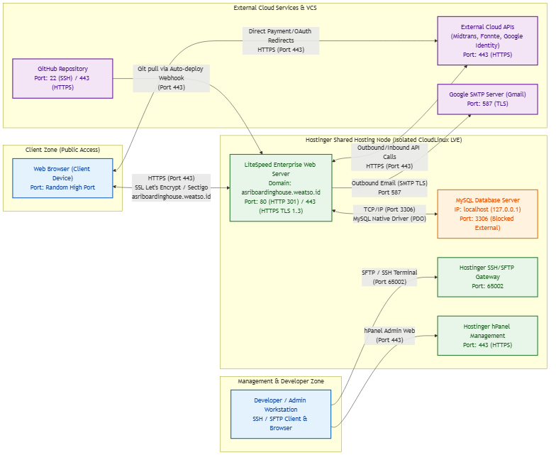

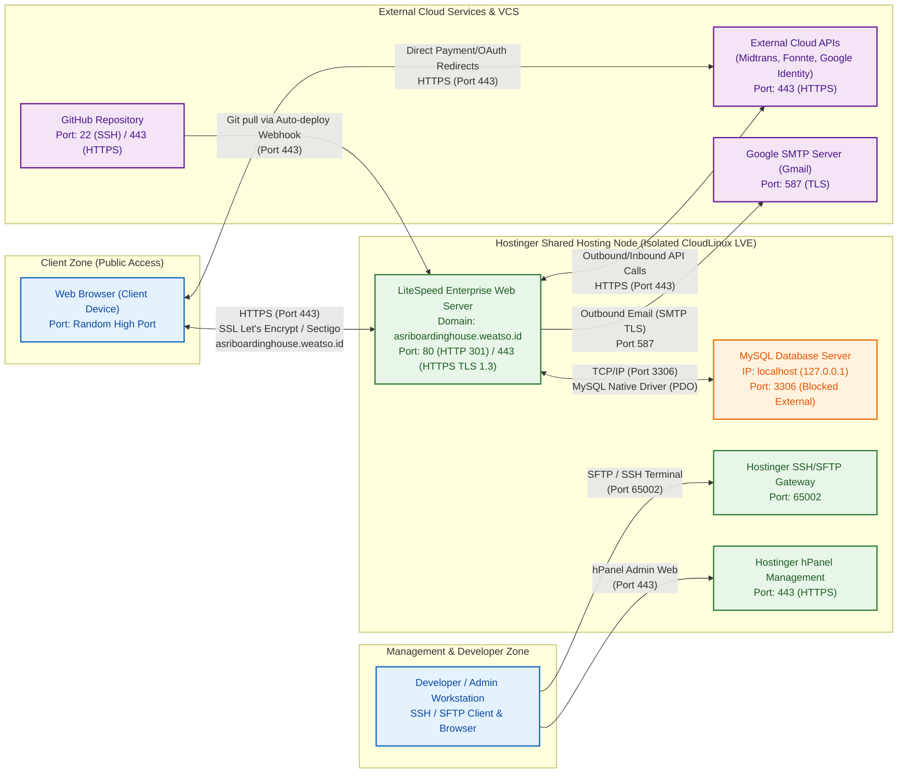
```mermaid
flowchart LR
    subgraph ClientZone["Client Zone (Public Access)"]
        Browser["Web Browser (Client Device)<br/>Port: Random High Port"]
    end

    subgraph DevZone["Management & Developer Zone"]
        DevPC["Developer / Admin Workstation<br/>SSH / SFTP Client & Browser"]
    end

    subgraph HostingerZone["Hostinger Shared Hosting Node (Isolated CloudLinux LVE)"]
        HostingerServer["LiteSpeed Enterprise Web Server<br/>Domain: asriboardinghouse.weatso.id<br/>Port: 80 (HTTP 301) / 443 (HTTPS TLS 1.3)"]
        HostingerDB["MySQL Database Server<br/>IP: localhost (127.0.0.1)<br/>Port: 3306 (Blocked External)"]
        HostingerSSH["Hostinger SSH/SFTP Gateway<br/>Port: 65002"]
        HostingerPanel["Hostinger hPanel Management<br/>Port: 443 (HTTPS)"]
    end

    subgraph ExternalZone["External Cloud Services & VCS"]
        GitHub["GitHub Repository<br/>Port: 22 (SSH) / 443 (HTTPS)"]
        CloudAPIs["External Cloud APIs<br/>(Midtrans, Fonnte, Google Identity)<br/>Port: 443 (HTTPS)"]
        SMTPServer["Google SMTP Server (Gmail)<br/>Port: 587 (TLS)"]
    end

    %% Connections
    Browser <-->|"HTTPS (Port 443)<br/>SSL Let's Encrypt / Sectigo<br/>asriboardinghouse.weatso.id"| HostingerServer
    HostingerServer <-->|"TCP/IP (Port 3306)<br/>MySQL Native Driver (PDO)"| HostingerDB
    DevPC -->|"SFTP / SSH Terminal<br/>(Port 65002)"| HostingerSSH
    DevPC -->|"hPanel Admin Web<br/>(Port 443)"| HostingerPanel
    GitHub -->|"Git pull via Auto-deploy Webhook<br/>(Port 443)"| HostingerServer
    HostingerServer <-->|"Outbound/Inbound API Calls<br/>HTTPS (Port 443)"| CloudAPIs
    Browser <-->|"Direct Payment/OAuth Redirects<br/>HTTPS (Port 443)"| CloudAPIs
    HostingerServer -->|"Outbound Email (SMTP TLS)<br/>Port 587"| SMTPServer

    %% Styling
    classDef client fill:#E3F2FD,stroke:#1565C0,stroke-width:2px,color:#0D47A1;
    classDef server fill:#E8F5E9,stroke:#2E7D32,stroke-width:2px,color:#1B5E20;
    classDef db fill:#FFF3E0,stroke:#EF6C00,stroke-width:2px,color:#E65100;
    classDef ext fill:#F3E5F5,stroke:#6A1B9A,stroke-width:2px,color:#4A148C;

    class Browser,DevPC client;
    class HostingerServer,HostingerSSH,HostingerPanel server;
    class HostingerDB db;
    class CloudAPIs,GitHub,SMTPServer ext;
```

---

### 1.2. Arsitektur Internal Server Produksi (Production Server Internal Architecture)
Diagram ini memvisualisasikan bagaimana kontainer perangkat lunak, pemisahan direktori publik `public_html/` dan direktori privat `asri-core/`, virtualisasi PHP via `mod_lsapi`, Laravel engine, serta penyimpanan SSD NVMe berinteraksi di dalam Hostinger Shared Hosting Node.

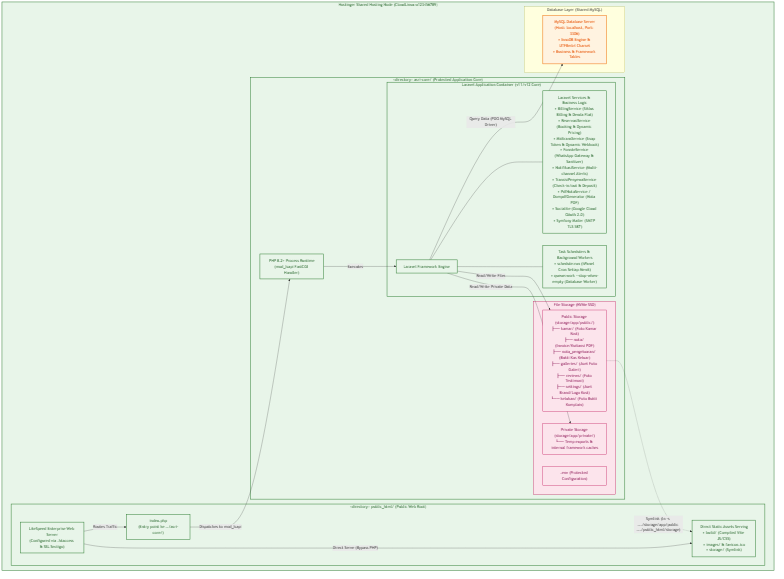

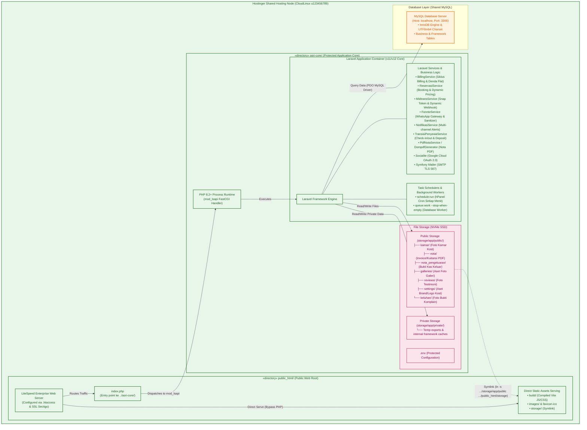
```mermaid
flowchart TB
    subgraph SharedHostingNode["Hostinger Shared Hosting Node (CloudLinux u123456789)"]
        
        subgraph PublicFolder["«directory» public_html/ (Public Web Root)"]
            LiteSpeed["LiteSpeed Enterprise Web Server<br/>(Configured via .htaccess & SSL Sectigo)"]
            StaticAssets["Direct Static Assets Serving<br/>• build/ (Compiled Vite JS/CSS)<br/>• images/ & favicon.ico<br/>• storage/ (Symlink)"]
            IndexPHP["index.php<br/>(Entry point ke ../asri-core/)"]
            LiteSpeed -->|"Direct Serve (Bypass PHP)"| StaticAssets
            LiteSpeed -->|"Routes Traffic"| IndexPHP
        end

        subgraph CoreFolder["«directory» asri-core/ (Protected Application Core)"]
            PHPRuntime["PHP 8.2+ Process Runtime<br/>(mod_lsapi FastCGI Handler)"]
            
            subgraph LaravelApp["Laravel Application Container (v11/v12 Core)"]
                LaravelEngine["Laravel Framework Engine"]
                Services["Laravel Services & Business Logic<br/>• BillingService (Siklus Billing & Denda Flat)<br/>• ReservasiService (Booking & Dynamic Pricing)<br/>• MidtransService (Snap Token & Dynamic Webhook)<br/>• FonnteService (WhatsApp Gateway & Sanitizer)<br/>• NotifikasiService (Multi-channel Alerts)<br/>• TransisiPenyewaService (Check-in/out & Deposit)<br/>• PdfNotaService / DompdfGenerator (Nota PDF)<br/>• Socialite (Google Cloud OAuth 2.0)<br/>• Symfony Mailer (SMTP TLS 587)"]
                Schedulers["Task Schedulers & Background Workers<br/>• schedule:run (hPanel Cron Setiap Menit)<br/>• queue:work --stop-when-empty (Database Worker)"]
                
                LaravelEngine --- Services
                LaravelEngine --- Schedulers
            end

            subgraph Storage["File Storage (NVMe SSD)"]
                PublicSSD["Public Storage (storage/app/public/)<br/>├── kamar/ (Foto Kamar Kost)<br/>├── nota/ (Invoice/Kuitansi PDF)<br/>├── nota_pengeluaran/ (Bukti Kas Keluar)<br/>├── galleries/ (Aset Foto Galeri)<br/>├── reviews/ (Foto Testimoni)<br/>├── settings/ (Aset Brand/Logo Kost)<br/>└── keluhan/ (Foto Bukti Komplain)"]
                PrivateSSD["Private Storage (storage/app/private/)<br/>└── Temp exports & internal framework caches"]
                EnvSecret[".env (Protected Configuration)"]
            end
        end

        subgraph DatabaseLayer["Database Layer (Shared MySQL)"]
            MySQLDB["MySQL Database Server<br/>(Host: localhost, Port: 3306)<br/>• InnoDB Engine & UTF8mb4 Charset<br/>• Business & Framework Tables"]
        end

        IndexPHP -->|"Dispatches to mod_lsapi"| PHPRuntime
        PHPRuntime -->|"Executes"| LaravelEngine
        LaravelEngine -->|"Read/Write Files"| PublicSSD
        LaravelEngine -->|"Read/Write Private Data"| PrivateSSD
        PublicSSD -.->|"Symlink (ln -s .../storage/app/public .../public_html/storage)"| StaticAssets
        LaravelEngine -->|"Query Data (PDO MySQL Driver)"| MySQLDB
    end

    %% Styling
    classDef server fill:#E8F5E9,stroke:#2E7D32,stroke-width:2px,color:#1B5E20;
    classDef db fill:#FFF3E0,stroke:#EF6C00,stroke-width:2px,color:#E65100;
    classDef storage fill:#FCE4EC,stroke:#C2185B,stroke-width:1.5px,color:#880E4F;

    class SharedHostingNode,PublicFolder,CoreFolder,LiteSpeed,PHPRuntime,StaticAssets,IndexPHP,LaravelApp,LaravelEngine,Services,Schedulers server;
    class MySQLDB db;
    class Storage,PublicSSD,PrivateSSD,EnvSecret storage;
```

---

### 1.3. Alur Integrasi Layanan Cloud Pihak Ketiga (Third-Party Cloud APIs Integration Flow)
Diagram ini merinci alur komunikasi bolak-balik antara peramban web client, server Laravel (`asri-core`), dan masing-masing gerbang layanan API cloud eksternal serta kanal in-app notification.

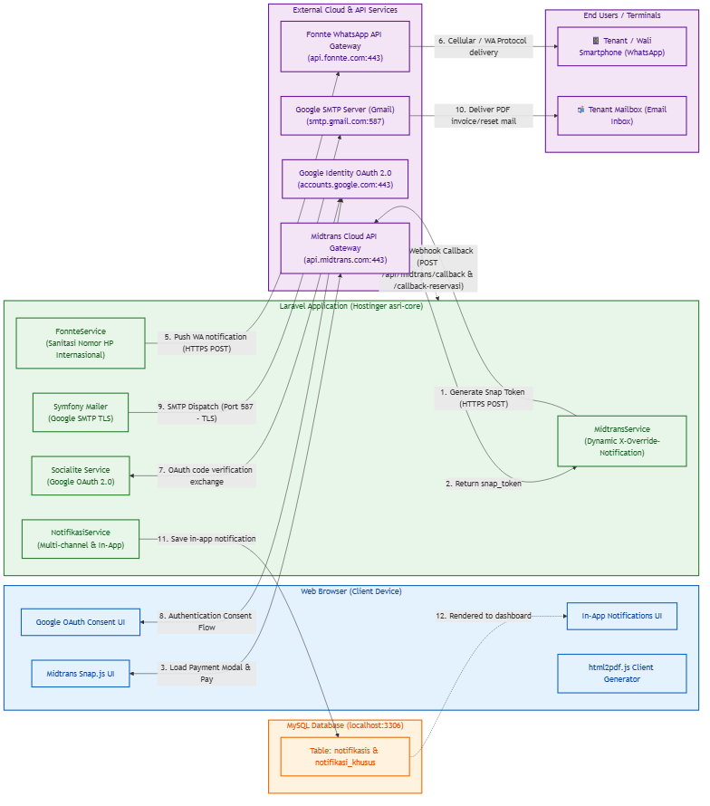

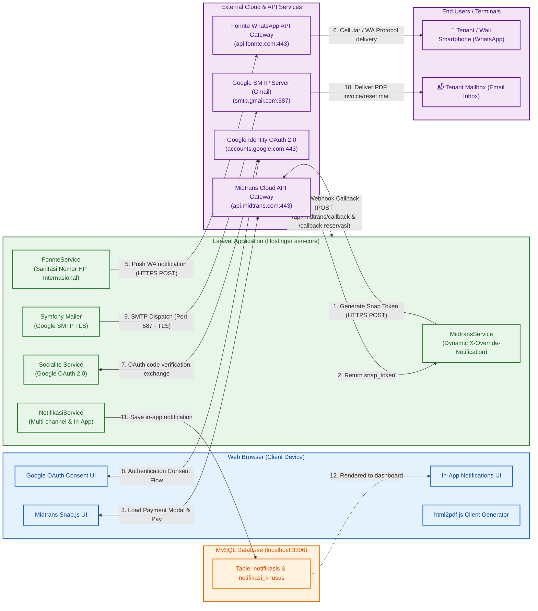
```mermaid
flowchart LR
    subgraph Browser["Web Browser (Client Device)"]
        SnapJS["Midtrans Snap.js UI"]
        OAuthUI["Google OAuth Consent UI"]
        InAppBell["In-App Notifications UI"]
        ClientPdf["html2pdf.js Client Generator"]
    end

    subgraph LaravelApp["Laravel Application (Hostinger asri-core)"]
        MidtransServ["MidtransService<br/>(Dynamic X-Override-Notification)"]
        FonnteServ["FonnteService<br/>(Sanitasi Nomor HP Internasional)"]
        SocialiteServ["Socialite Service<br/>(Google OAuth 2.0)"]
        MailServ["Symfony Mailer<br/>(Google SMTP TLS)"]
        NotifServ["NotifikasiService<br/>(Multi-channel & In-App)"]
    end

    subgraph DatabaseLayer["MySQL Database (localhost:3306)"]
        NotifTable["Table: notifikasis & notifikasi_khusus"]
    end

    subgraph ExternalServices["External Cloud & API Services"]
        Midtrans["Midtrans Cloud API Gateway<br/>(api.midtrans.com:443)"]
        Fonnte["Fonnte WhatsApp API Gateway<br/>(api.fonnte.com:443)"]
        GoogleAuth["Google Identity OAuth 2.0<br/>(accounts.google.com:443)"]
        SMTPServer["Google SMTP Server (Gmail)<br/>(smtp.gmail.com:587)"]
    end

    subgraph Receivers["End Users / Terminals"]
        Subscriber["📱 Tenant / Wali Smartphone (WhatsApp)"]
        MailBox["📬 Tenant Mailbox (Email Inbox)"]
    end

    %% Interactions
    MidtransServ -->|"1. Generate Snap Token (HTTPS POST)"| Midtrans
    Midtrans -->|"2. Return snap_token"| MidtransServ
    SnapJS <-->|"3. Load Payment Modal & Pay"| Midtrans
    Midtrans -.->|"4. Dual Webhook Callback (POST /api/midtrans/callback & /callback-reservasi)"| LaravelApp

    FonnteServ -->|"5. Push WA notification (HTTPS POST)"| Fonnte
    Fonnte -->|"6. Cellular / WA Protocol delivery"| Subscriber

    SocialiteServ <-->|"7. OAuth code verification exchange"| GoogleAuth
    OAuthUI <-->|"8. Authentication Consent Flow"| GoogleAuth

    MailServ -->|"9. SMTP Dispatch (Port 587 - TLS)"| SMTPServer
    SMTPServer -->|"10. Deliver PDF invoice/reset mail"| MailBox

    NotifServ -->|"11. Save in-app notification"| NotifTable
    NotifTable -.->|"12. Rendered to dashboard"| InAppBell

    %% Styling
    classDef server fill:#E8F5E9,stroke:#2E7D32,stroke-width:2px,color:#1B5E20;
    classDef client fill:#E3F2FD,stroke:#1565C0,stroke-width:2px,color:#0D47A1;
    classDef ext fill:#F3E5F5,stroke:#6A1B9A,stroke-width:2px,color:#4A148C;
    classDef db fill:#FFF3E0,stroke:#EF6C00,stroke-width:2px,color:#E65100;

    class LaravelApp,MidtransServ,FonnteServ,SocialiteServ,MailServ,NotifServ server;
    class Browser,SnapJS,OAuthUI,InAppBell,ClientPdf client;
    class ExternalServices,Midtrans,Fonnte,GoogleAuth,SMTPServer,Receivers,Subscriber,MailBox ext;
    class DatabaseLayer,NotifTable db;
```

---

### 1.4. Diagram Alur Komunikasi Antar Node Terintegrasi (Integrated Node Communication Flow Diagram)
Diagram urutan (Sequence Diagram) ini menggambarkan visualisasi alur interaksi terpadu, arah koneksi, protokol yang digunakan, serta pertukaran data antar-node secara lengkap pada domain resmi **`asriboardinghouse.weatso.id`**.

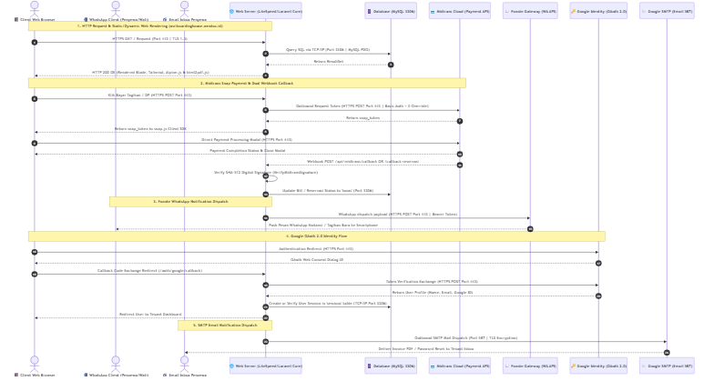

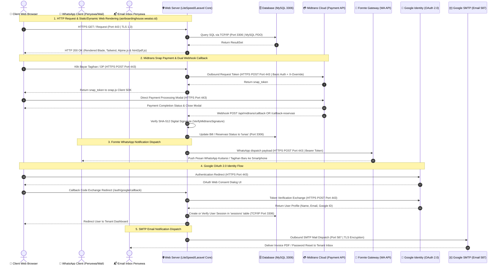
```mermaid
sequenceDiagram
    autonumber
    actor Browser as 📱 Client Web Browser
    actor Phone as 📲 WhatsApp Client (Penyewa/Wali)
    actor MailBox as 📬 Email Inbox Penyewa
    participant HostingerServer as 🌐 Web Server (LiteSpeed/Laravel Core)
    participant Database as 🗄️ Database (MySQL 3306)
    participant Midtrans as 💳 Midtrans Cloud (Payment API)
    participant Fonnte as 💬 Fonnte Gateway (WA API)
    participant GoogleOAuth as 🔑 Google Identity (OAuth 2.0)
    participant SMTPServer as ✉️ Google SMTP (Email 587)

    Note over Browser, HostingerServer: 1. HTTP Request & Static/Dynamic Web Rendering (asriboardinghouse.weatso.id)
    Browser->>HostingerServer: HTTPS GET / Request (Port 443 | TLS 1.3)
    HostingerServer->>Database: Query SQL via TCP/IP (Port 3306 | MySQL PDO)
    Database-->>HostingerServer: Return ResultSet
    HostingerServer-->>Browser: HTTP 200 OK (Rendered Blade, Tailwind, Alpine.js & html2pdf.js)

    Note over Browser, Midtrans: 2. Midtrans Snap Payment & Dual Webhook Callback
    Browser->>HostingerServer: Klik Bayar Tagihan / DP (HTTPS POST Port 443)
    HostingerServer->>Midtrans: Outbound Request Token (HTTPS POST Port 443 | Basic Auth + X-Override)
    Midtrans-->>HostingerServer: Return snap_token
    HostingerServer-->>Browser: Return snap_token to snap.js Client SDK
    Browser->>Midtrans: Direct Payment Processing Modal (HTTPS Port 443)
    Midtrans-->>Browser: Payment Completion Status & Close Modal
    Midtrans-->>HostingerServer: Webhook POST /api/midtrans/callback OR /callback-reservasi
    HostingerServer->>HostingerServer: Verify SHA-512 Digital Signature (VerifyMidtransSignature)
    HostingerServer->>Database: Update Bill / Reservasi Status to 'lunas' (Port 3306)

    Note over HostingerServer, Phone: 3. Fonnte WhatsApp Notification Dispatch
    HostingerServer->>Fonnte: WhatsApp dispatch payload (HTTPS POST Port 443 | Bearer Token)
    Fonnte-->>Phone: Push Pesan WhatsApp Kuitansi / Tagihan Baru ke Smartphone

    Note over Browser, GoogleOAuth: 4. Google OAuth 2.0 Identity Flow
    Browser->>GoogleOAuth: Authentication Redirect (HTTPS Port 443)
    GoogleOAuth-->>Browser: OAuth Web Consent Dialog UI
    Browser->>HostingerServer: Callback Code Exchange Redirect (/auth/google/callback)
    HostingerServer->>GoogleOAuth: Token Verification Exchange (HTTPS POST Port 443)
    GoogleOAuth-->>HostingerServer: Return User Profile (Name, Email, Google ID)
    HostingerServer->>Database: Create or Verify User Session in 'sessions' table (TCP/IP Port 3306)
    HostingerServer-->>Browser: Redirect User to Tenant Dashboard

    Note over HostingerServer, MailBox: 5. SMTP Email Notification Dispatch
    HostingerServer->>SMTPServer: Outbound SMTP Mail Dispatch (Port 587 | TLS Encryption)
    SMTPServer-->>MailBox: Deliver Invoice PDF / Password Reset to Tenant Inbox
```

---

### 1.5. Arsitektur Komunikasi & Alur Protokol Multi-Tier (Multi-Tier Inter-Node Communication Architecture)
Diagram ini memetakan arsitektur komunikasi data berlapis secara komprehensif, mencakup arah koneksi, nomor port, protokol transmisi (HTTP/HTTPS, TCP/IP, SMTP, SFTP), serta interaksi end-to-end dengan seluruh gerbang layanan cloud eksternal.

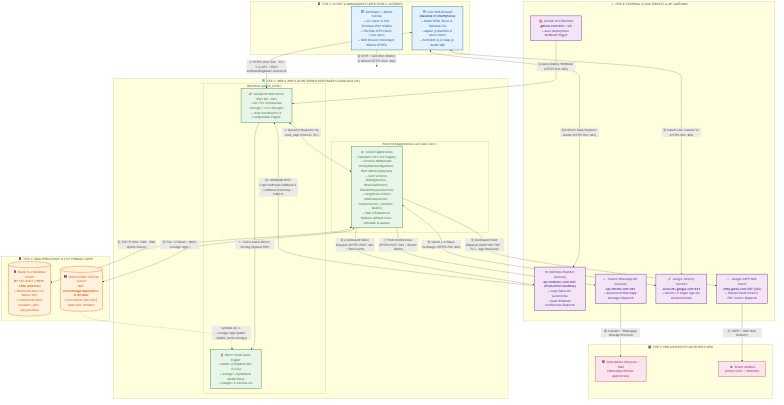


```mermaid
flowchart TD
    %% =========================================================================
    %% TIER 1: CLIENT & MANAGEMENT ACCESS LAYER
    %% =========================================================================
    subgraph Tier1["📱 TIER 1: CLIENT & MANAGEMENT LAYER (PUBLIC INTERNET)"]
        direction LR
        Browser["🌐 User Web Browser<br/><b>(Desktop & Smartphone)</b><br/>• Blade HTML Views & Tailwind CSS<br/>• Alpine.js Runtime & Axios Client<br/>• html2pdf.js & Snap.js Modal SDK"]
        DevAdmin["💻 Developer / Admin Station<br/>• Git Client & SSH Terminal (Port 65002)<br/>• FileZilla SFTP Client (.env sync)<br/>• Web Browser (Hostinger hPanel HTTPS)"]
    end

    %% =========================================================================
    %% TIER 2: HOSTINGER PRODUCTION SERVER (CLOUDLINUX LVE)
    %% =========================================================================
    subgraph Tier2["🌐 TIER 2: WEB & APPLICATION SERVER (HOSTINGER CLOUDLINUX LVE)"]
        direction TB
        subgraph WebServerSub["Web Root (public_html/)"]
            LiteSpeed["🚀 LiteSpeed Web Server (Port 80 / 443)<br/>• SSL/TLS Termination (Sectigo / Let's Encrypt)<br/>• .htaccess Rewrite & Compression Engine"]
            StaticCache["📦 Direct Static Asset Engine<br/>• build/ (Compiled Vite JS/CSS)<br/>• storage/ (Symlinked Media Files)<br/>• images/ & favicon.ico"]
        end

        subgraph AppRuntimeSub["Protected Application Core (asri-core/)"]
            LaravelApp["⚙️ Laravel Application Container (v11/v12 Engine)<br/>• Security Middleware (VerifyMidtransSignature, Role:admin/penyewa)<br/>• Core Services (BillingService, ReservasiService, TransisiPenyewaService)<br/>• Integration Clients (MidtransService, FonnteService, Socialite, Mailer)<br/>• Task Schedulers & Workers (hPanel Cron: schedule & queue)"]
        end
        
        LiteSpeed -->|"1. Static Assets Direct Serving (Bypass PHP)"| StaticCache
        LiteSpeed <-->|"2. Dynamic Requests via mod_lsapi (FastCGI IPC)"| LaravelApp
    end

    %% =========================================================================
    %% TIER 3: DATA PERSISTENCE & STORAGE LAYER
    %% =========================================================================
    subgraph Tier3["🗄️ TIER 3: DATA PERSISTENCE & FILE STORAGE LAYER"]
        direction LR
        MySQLDB[("🗄️ MySQL 8.x Database Server<br/><b>IP: 127.0.0.1 | Port: 3306 (Internal)</b><br/>• Relational Data (22 Tables 3NF)<br/>• Framework Data (sessions, jobs, job_batches)")]
        SSDDisk[("💾 Shared NVMe SSD File System<br/><b>asri-core/storage/app/public/ & private/</b><br/>• Foto Kamar, PDF Nota, Bukti Kas, Keluhan")]
    end

    %% =========================================================================
    %% TIER 4: EXTERNAL CLOUD SERVICES & APIS
    %% =========================================================================
    subgraph Tier4["☁️ TIER 4: EXTERNAL CLOUD SERVICES & API GATEWAYS"]
        direction TB
        Midtrans["💳 Midtrans Payment Gateway<br/><b>api.midtrans.com:443 (Production/Sandbox)</b><br/>• Snap Token API Generation<br/>• Dual Webhook Notification Dispatch"]
        Fonnte["💬 Fonnte WhatsApp API Gateway<br/><b>api.fonnte.com:443</b><br/>• Automated WhatsApp Messages Dispatch"]
        GoogleAuth["🔑 Google Identity Services<br/><b>accounts.google.com:443</b><br/>• OAuth 2.0 Single Sign-On Authentication"]
        GoogleMail["✉️ Google SMTP Mail Server<br/><b>smtp.gmail.com:587 (TLS)</b><br/>• Transactional Email & PDF Invoice Dispatch"]
        GitHub["🐙 GitHub VCS Platform<br/><b>github.com:443 / :22</b><br/>• Auto-Deployment Webhook Trigger"]
    end

    %% =========================================================================
    %% TIER 5: END-USER RECEIVER TERMINALS
    %% =========================================================================
    subgraph Tier5["📲 TIER 5: END-USER NOTIFICATION RECEIVERS"]
        direction LR
        UserPhone["📱 Smartphone Penyewa / Wali<br/>(WhatsApp Official Application)"]
        UserMail["📬 Tenant Mailbox<br/>(Email Client / Webmail)"]
    end

    %% =========================================================================
    %% COMMUNICATION FLOWS & PROTOCOLS
    %% =========================================================================
    %% 1. Web Traffic & Management
    Browser <-->|"① HTTPS (Port 443 - TLS 1.3) GET / POST<br/>asriboardinghouse.weatso.id"| LiteSpeed
    DevAdmin -->|"② SFTP / SSH (Port 65002) & hPanel HTTPS (Port 443)"| Tier2
    GitHub -->|"③ Auto-Deploy Webhook (HTTPS Port 443)"| LiteSpeed

    %% 2. Internal Database & Storage
    LaravelApp <-->|"④ TCP/IP (Port 3306 - PDO MySQL Driver)"| MySQLDB
    LaravelApp <-->|"⑤ File I/O Read / Write (storage/app/)"| SSDDisk
    SSDDisk -.->|"Symlink (ln -s /storage/app/public /public_html/storage)"| StaticCache

    %% 3. Midtrans Payment Flow
    LaravelApp -->|"⑥a Outbound Token Request (HTTPS POST :443 | Basic Auth)"| Midtrans
    Browser <-->|"⑥b Direct Snap Payment Modal (HTTPS Port 443)"| Midtrans
    Midtrans -->|"⑥c Webhook POST (/api/midtrans/callback & /callback-reservasi) + SHA512"| LiteSpeed

    %% 4. Fonnte WhatsApp Flow
    LaravelApp -->|"⑦ Push Notification (HTTPS POST :443 | Bearer Token)"| Fonnte
    Fonnte -->|"⑧ Cellular / WhatsApp Message Protocol"| UserPhone

    %% 5. Google OAuth Flow
    LaravelApp <-->|"⑨ OAuth 2.0 Token Exchange (HTTPS Port 443)"| GoogleAuth
    Browser <-->|"⑩ OAuth User Consent UI (HTTPS Port 443)"| GoogleAuth

    %% 6. Google SMTP Flow
    LaravelApp -->|"⑪ Outbound Email Dispatch (SMTP Port 587 - TLS + App Password)"| GoogleMail
    GoogleMail -->|"⑫ SMTP / IMAP Mail Delivery"| UserMail

    %% =========================================================================
    %% STYLING
    %% =========================================================================
    classDef client fill:#E3F2FD,stroke:#1565C0,stroke-width:2px,color:#0D47A1;
    classDef server fill:#E8F5E9,stroke:#2E7D32,stroke-width:2px,color:#1B5E20;
    classDef db fill:#FFF3E0,stroke:#EF6C00,stroke-width:2px,color:#E65100;
    classDef ext fill:#F3E5F5,stroke:#6A1B9A,stroke-width:2px,color:#4A148C;
    classDef receiver fill:#FCE4EC,stroke:#C2185B,stroke-width:1.5px,color:#880E4F;

    class Browser,DevAdmin client;
    class LiteSpeed,StaticCache,LaravelApp server;
    class MySQLDB,SSDDisk db;
    class Midtrans,Fonnte,GoogleAuth,GoogleMail,GitHub ext;
    class UserPhone,UserMail receiver;
```

---

### 1.6. Diagram Alur Komunikasi Antar Node Terstruktur & Protokol Data (Structured Inter-Node Communication & Protocol Flowchart)
Diagram ini merangkum seluruh alur komunikasi data antar node secara eksplisit, terstruktur, dan mudah dipahami. Diagram memetakan arah koneksi (request-response versus push callback), nomor port jaringan, protokol transmisi (HTTPS TLS 1.3, FastCGI IPC, TCP/IP, SMTP TLS, SFTP), serta format data muatan (*payload*) yang dipertukarkan dengan seluruh layanan eksternal.

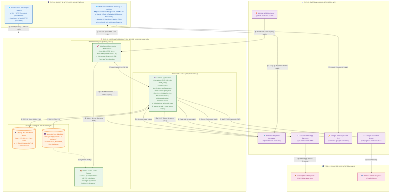


```mermaid
flowchart TB
    %% =========================================================================
    %% TIER 1: CLIENT & DEVELOPER LAYER
    %% =========================================================================
    subgraph ClientZone["📱 TIER 1: CLIENT & DEVELOPER WORKSTATION"]
        direction LR
        Browser["🌐 Web Browser Klien (Desktop / Mobile)<br/><b>https://asriboardinghouse.weatso.id</b><br/>• Blade HTML & Tailwind CSS (Neo-Brutalism)<br/>• Alpine.js Runtime & Axios Client<br/>• html2pdf.js & Midtrans Snap.js"]
        DevPC["💻 Workstation Developer / Admin<br/>• SSH / SFTP Terminal (Port 65002)<br/>• Hostinger hPanel HTTPS (Port 443)"]
    end

    %% =========================================================================
    %% TIER 2: HOSTINGER SHARED HOSTING SERVER
    %% =========================================================================
    subgraph ServerZone["🚀 TIER 2: HOSTINGER PRODUCTION SERVER (CLOUDLINUX LVE)"]
        direction TB
        
        subgraph WebServerSub["Web Root Layer (public_html/)"]
            LiteSpeed["🚀 LiteSpeed Enterprise Web Server<br/>• Port 80 (HTTP 301) / Port 443 (HTTPS TLS 1.3)<br/>• .htaccess Rewrite & SSL Sectigo Termination"]
            StaticFiles["📦 Direct Static Asset Engine<br/>• build/ (Compiled Vite JS/CSS minified)<br/>• storage/ (Symlink Bridge) & images/"]
        end

        subgraph BackendSub["Protected Core Layer (asri-core/)"]
            LaravelApp["⚙️ Laravel Application Container (PHP 8.2+ via mod_lsapi)<br/>• Middleware: VerifyMidtransSignature, Role:admin/penyewa<br/>• Services: BillingService, ReservasiService, MidtransService, FonnteService<br/>• Schedulers: schedule:run & queue:work --stop-when-empty"]
        end

        subgraph DBSub["Internal Storage & Database Layer"]
            direction LR
            MySQLDB[("🗄️ MySQL 8.x Database Server<br/>Host: 127.0.0.1 | Port: 3306<br/>• 22 Tabel Bisnis (3NF) & Sessions/Jobs")]
            SSDDisk[("💾 Shared NVMe SSD Disk<br/>storage/app/public/ & private/<br/>• Foto Kamar, Nota PDF, Kas, Keluhan")]
        end
        
        LiteSpeed -->|"② Direct Serve (Bypass PHP)"| StaticFiles
        LiteSpeed <-->|"③ mod_lsapi FastCGI IPC"| LaravelApp
        LaravelApp <-->|"⑥ TCP/IP (Port 3306) PDO"| MySQLDB
        LaravelApp <-->|"⑦ POSIX File I/O"| SSDDisk
        SSDDisk -.->|"⑧ Symlink Bridge"| StaticFiles
    end

    %% =========================================================================
    %% TIER 3: EXTERNAL CLOUD SERVICES & APIS
    %% =========================================================================
    subgraph CloudZone["☁️ TIER 3: EXTERNAL CLOUD SERVICES & APIS"]
        direction TB
        Midtrans["💳 Midtrans Payment Gateway<br/>(api.midtrans.com:443)"]
        Fonnte["💬 Fonnte WhatsApp Gateway<br/>(api.fonnte.com:443)"]
        GoogleAuth["🔑 Google Identity OAuth 2.0<br/>(accounts.google.com:443)"]
        GoogleSMTP["✉️ Google SMTP Mail Server<br/>(smtp.gmail.com:587 TLS)"]
        GitHub["🐙 GitHub VCS Platform<br/>(github.com:443 / :22)"]
    end

    %% =========================================================================
    %% TIER 4: END-USER RECEIVER TERMINALS
    %% =========================================================================
    subgraph ReceiverZone["📲 TIER 4: END-USER RECEIVER TERMINALS"]
        direction LR
        UserPhone["📱 Smartphone Penyewa / Wali (WhatsApp App)"]
        UserMail["📬 Mailbox Email Penyewa (Email Client)"]
    end

    %% =========================================================================
    %% INTER-TIER COMMUNICATION PATHS
    %% =========================================================================
    Browser <-->|"① HTTPS (Port 443 - TLS 1.3)"| LiteSpeed
    DevPC -->|"④ SFTP (65002) / hPanel (443)"| ServerZone
    GitHub -->|"⑤ Webhook Auto-Deploy (443)"| LiteSpeed

    LaravelApp -->|"⑨a POST Token Request (443)"| Midtrans
    Midtrans -->|"⑨b Return snap_token"| LaravelApp
    Browser <-->|"⑨c Snap.js Payment Modal (443)"| Midtrans
    Midtrans -->|"⑨d Webhook POST + SHA512 (443)"| LiteSpeed

    LaravelApp -->|"⑩ Push WA Bearer (443)"| Fonnte
    Fonnte -->|"⑪ WhatsApp Mobile Protocol"| UserPhone

    Browser <-->|"⑫ OAuth Consent UI (443)"| GoogleAuth
    LaravelApp <-->|"⑬ Token Exchange (443)"| GoogleAuth

    LaravelApp -->|"⑭ SMTP TLS Dispatch (587)"| GoogleSMTP
    GoogleSMTP -->|"⑮ Mail Delivery"| UserMail

    %% =========================================================================
    %% STYLING
    %% =========================================================================
    classDef client fill:#E3F2FD,stroke:#1565C0,stroke-width:2px,color:#0D47A1;
    classDef server fill:#E8F5E9,stroke:#2E7D32,stroke-width:2px,color:#1B5E20;
    classDef db fill:#FFF3E0,stroke:#EF6C00,stroke-width:2px,color:#E65100;
    classDef ext fill:#F3E5F5,stroke:#6A1B9A,stroke-width:2px,color:#4A148C;
    classDef receiver fill:#FCE4EC,stroke:#C2185B,stroke-width:1.5px,color:#880E4F;

    class Browser,DevPC client;
    class LiteSpeed,StaticFiles,LaravelApp server;
    class MySQLDB,SSDDisk db;
    class Midtrans,Fonnte,GoogleAuth,GoogleSMTP,GitHub ext;
    class UserPhone,UserMail receiver;
```

#### Tabel Matriks Rincian Alur Komunikasi & Protokol Data Antar Node

| No | Alur Interaksi | Node Asal (Source) | Node Tujuan (Target) | Arah Koneksi | Protokol & Port | Format & Tipe Data | Deskripsi Teknis |
| :---: | :--- | :--- | :--- | :---: | :--- | :--- | :--- |
| **①** | Akses Web Klien | Web Browser | LiteSpeed Web Server | Duplex (`<-->`) | HTTPS (Port 443) / TLS 1.3 | HTTP Request / HTML Blade, CSS, JS | Pengguna mengakses halaman web; server mengembalikan dokumen responsif. |
| **②** | Static Direct Serve | LiteSpeed Server | Static Assets Engine | Unidirectional (`-->`) | Local POSIX File Read | MIME Types (CSS, JS, WebP, PNG, ICO) | LiteSpeed menyajikan file statis `build/` dan `storage/` langsung tanpa memproses PHP. |
| **③** | Eksekusi Script Dinamis | LiteSpeed Server | Laravel Application (`asri-core`) | Duplex (`<-->`) | mod_lsapi FastCGI IPC | CGI Environment Variables & HTML Body | LiteSpeed meneruskan dynamic request ke PHP 8.2 runtime dan mengembalikan hasil render. |
| **④** | Pemeliharaan & Deploy | Developer Workstation | Hostinger Server Node | Unidirectional (`-->`) | SSH/SFTP (Port 65002) & HTTPS (443) | Enkripsi SSH Keys / Web Admin Sessions | Pengembang memperbarui berkas `.env` dan mengelola database/cron via hPanel. |
| **⑤** | Otomasi Git Deployment | GitHub Repository | LiteSpeed Web Server | Unidirectional (`-->`) | HTTPS Webhook (Port 443) | JSON Webhook Payload (Git Event) | GitHub memberi sinyal auto-deploy saat branch `main` menerima commit baru. |
| **⑥** | Akses Basis Data | Laravel Core Engine | MySQL Database Server | Duplex (`<-->`) | TCP/IP (Port 3306) / PDO Driver | SQL Queries (SELECT, INSERT, UPDATE) | Operasi transaksi ACID dan manajemen tabel sesi pengguna serta antrean antarmuka. |
| **⑦** | Penyimpanan Media SSD | Laravel Core Engine | Shared SSD Disk (`asri-core`) | Duplex (`<-->`) | POSIX File I/O System | Binary Streams (JPG, PNG, PDF Invoice) | Menyimpan unggahan foto kamar/keluhan dan output kuitansi PDF yang dibangkitkan Dompdf. |
| **⑧** | Jembatan Symlink | Internal Storage | Public Web Root | Link Simbolik (`-.->`) | OS Filesystem Symlink | Virtual Filesystem Path Pointer | Menghubungkan direktori privat `asri-core/storage/app/public` ke `public_html/storage`. |
| **⑨a**| Pembuatan Snap Token | Laravel (`MidtransService`)| Midtrans Cloud Gateway | Unidirectional (`-->`) | HTTPS REST POST (Port 443) | JSON Payload (Order ID, Gross Amount, Auth) | Mengirim data transaksi dengan Basic Auth ServerKey dan dynamic override header. |
| **⑨b**| Penerimaan Snap Token | Midtrans Cloud Gateway | Laravel Core Engine | Unidirectional (`-->`) | HTTPS JSON Response (Port 443) | JSON (`snap_token`, `redirect_url`) | Midtrans mengembalikan token unik untuk diteruskan ke frontend. |
| **⑨c**| Pembayaran Sisi Klien | Web Browser (Snap.js) | Midtrans Cloud Gateway | Duplex (`<-->`) | HTTPS (Port 443) | Snap Iframe Modal Interface & VA/QRIS Data | Pengguna menyelesaikan pembayaran digital secara aman langsung ke gerbang Midtrans. |
| **⑨d**| Webhook Notifikasi Bayar | Midtrans Cloud Gateway | LiteSpeed / Laravel Core | Unidirectional (`-->`) | HTTPS POST (Port 443) | JSON Payload + Digital Signature SHA-512 | Server Midtrans mengirim callback instan; Laravel memverifikasi tanda tangan digital. |
| **⑩** | Dispatch Notifikasi WA | Laravel (`FonnteService`)| Fonnte WA Gateway | Unidirectional (`-->`) | HTTPS REST POST (Port 443) | JSON Payload + Bearer Token Auth | Mengirim pesan teks konfirmasi pembayaran/tagihan ke API Fonnte via background queue. |
| **⑪** | Penghantaran Pesan WA | Fonnte WA Gateway | Smartphone Penyewa/Wali | Unidirectional (`-->`) | WhatsApp Mobile Protocol / GSM | Wireless Encrypted Text Messages | Pesan WhatsApp resmi masuk secara otomatis ke perangkat smartphone pengguna. |
| **⑫** | Persetujuan Akun Google | Web Browser | Google Cloud Identity | Duplex (`<-->`) | HTTPS (Port 443) | OAuth 2.0 Web Consent Dialog | Calon penyewa menyetujui akses otentikasi login cepat menggunakan akun Google. |
| **⑬** | Pertukaran Token OAuth | Laravel (`Socialite`) | Google Cloud Identity | Duplex (`<-->`) | HTTPS REST POST (Port 443) | Authorization Code & JSON User Profile | Menukarkan *auth code* dengan data profil pengguna (Nama, Email, Google ID). |
| **⑭** | Pengiriman Email Invoice| Laravel (Symfony Mailer)| Google SMTP Mail Server | Unidirectional (`-->`) | SMTP (Port 587) / TLS Encryption | MIME Multi-part Email + PDF Attachment | Mengirim surat elektronik kuitansi transaksi menggunakan Google App Password. |
| **⑮** | Penerimaan Email | Google SMTP Mail Server | Mailbox Email Penyewa | Unidirectional (`-->`) | SMTP / IMAP Mail Protocol | Standard Electronic Mail Delivery | Surel tagihan dan bukti bayar diterima di kotak masuk email penyewa secara aman. |

---

## 2. Rincian Node Arsitektur & Perangkat Lunak

### 2.0. Pemetaan Lingkungan Lokal (Development) vs Produksi (Hostinger)

Untuk menjamin kelancaran siklus pengembangan dan penyebaran, infrastruktur sistem dibagi menjadi dua lingkungan dengan komponen yang setara secara fungsional:

| Komponen Infrastruktur | Lingkungan Lokal (XAMPP / Development) | Lingkungan Produksi (Hostinger Shared) |
| :--- | :--- | :--- |
| **Client Layer** | Web Browser mengakses `http://localhost:8000` via loopback lokal | Web Browser mengakses `https://asriboardinghouse.weatso.id` melalui internet dengan enkripsi SSL TLS 1.3 |
| **Web Server** | **Apache HTTP Server** (XAMPP default) atau **Nginx** | **LiteSpeed Enterprise Web Server** (berfungsi sebagai Apache-drop-in-replacement yang membaca `.htaccess`) |
| **Application Runtime**| **PHP 8.2+** (CLI / Apache Module) menjalankan Core Engine **Laravel Framework (v11/v12)** | **PHP 8.2+** (dieksekusi via `mod_lsapi` CloudLinux) menjalankan Core Engine **Laravel Framework (v11/v12)** |
| **Database Server** | **MySQL 8.x** atau MariaDB (Localhost, Port 3306) | **MySQL / MariaDB Shared Instance** (Localhost `127.0.0.1`, Port 3306, Blocked External) |
| **External Services** | Koneksi sandbox/development (Midtrans Sandbox API, Fonnte API, Google Console Dev App) | Koneksi production/live (Midtrans Production/Sandbox, Fonnte WA Gateway, Google Console Live App) |

---

### 2.1. Platform Kode, Deployment & Developer Workstation
* **GitHub Repository:** Repositori git terpusat tempat seluruh pengembang mengunggah kode sumber. Penyebaran ke Hostinger didukung menggunakan fitur **Hostinger Git Integration** (menarik kode via Webhook saat ada push baru ke branch `main`).
* **Developer Workstation & Admin Tools:** Menggunakan klien SFTP/SSH seperti FileZilla atau VSCode SSH Remote pada **Port `65002`** (port SSH khusus Hostinger) untuk mentransfer berkas konfigurasi sensitif ([`.env`](file:///c:/xampp/htdocs/asri-boarding-house/.env)) serta antarmuka **Hostinger hPanel (HTTPS Port 443)** untuk manajemen database MySQL, SSL, DNS, dan Cron Tasks.

### 2.2. Device Pengguna (Client Node)
* **Web Browser:** Berfungsi merender dokumen HTML/CSS Blade responsif dengan token visual Neo-Brutalisme.
* **Alpine.js Runtime:** Library Javascript ringan yang berjalan di memori client untuk menangani interaksi dinamis DOM lokal seperti membuka modal, dasbor, stepper formulir sewa, dan adaptive AJAX polling chatbox (interval 4 detik).
* **Axios / Fetch Client:** Menangani komunikasi AJAX asinkron untuk polling chat delta dan pengambilan data tanpa full-page reload.
* **html2pdf.js:** Engine client-side untuk memfasilitasi pengunduhan langsung lembar kuitansi A5 berformat PDF dari layar peramban.
* **Midtrans Snap.js SDK:** Memunculkan modal Snap pembayaran instan langsung di sisi peramban web pengguna secara aman.
* **Chart.js:** Komponen visualisasi arus kas masuk/keluar dan grafik okupansi kamar pada dasbor Admin.

### 2.3. Server Produksi (Hostinger Shared Hosting Node - Metode Struktur Terpisah)
Node server berbasis shared hosting yang dikelola secara penuh (*fully managed*) oleh Hostinger bersistem operasi CloudLinux (keamanan terisolasi per pengguna via LVE).

* **Pemisahan Direktori Fisik demi Keamanan:**
  * **Direktori Publik (`public_html/`):** Merupakan *DocumentRoot* yang dapat diakses langsung oleh publik. Hanya berisi `index.php` (yang memanggil bootstrap Laravel ke `../asri-core/`), berkas konfigurasi web server `.htaccess`, folder aset terkompilasi `build/`, aset gambar `images/`, dan tautan simbolik `storage/`.
  * **Direktori Inti Terproteksi (`asri-core/`):** Diletakkan di luar `public_html/`. Berisi kode sumber aplikasi (`app/`, `bootstrap/`, `config/`, `routes/`, `vendor/`) serta file konfigurasi sensitif [`.env`](file:///c:/xampp/htdocs/asri-boarding-house/.env). Dengan arsitektur ini, file `.env` **secara fisik mustahil diakses publik** via URL browser, mencegah kebocoran kredensial database dan API key.
* **LiteSpeed Enterprise Web Server:** Menggantikan Nginx/Apache konvensional. LiteSpeed membaca konfigurasi `.htaccess`, menyajikan aset statis (`public_html/build/`, `public_html/storage/`) secara langsung dengan kompresi Gzip/Brotli, serta dilengkapi sertifikat SSL lifetime gratis yang diatur melalui hPanel.
* **PHP 8.2+ Runtime:** Dijalankan melalui handler khusus LiteSpeed (`mod_lsapi`) yang mengoptimalkan eksekusi script PHP secara dinamis dengan alokasi resource sesuai batasan Paket Shared Hosting (RAM 512 MB - 1 GB, 1 Core CPU).
* **Laravel Framework Core Engine:** Instance aplikasi backend yang memproses logika bisnis sistem.
* **Background Job Management (Shared Hosting Constraint):**
  Karena Shared Hosting **tidak mengizinkan** hak akses root (`sudo`) dan daemons yang berjalan terus menerus (seperti Supervisor), maka antrean backend disesuaikan sebagai berikut:
  * **Driver Antrean:** `QUEUE_CONNECTION=database` di `.env`. Pekerjaan asinkron (pengiriman pesan WhatsApp Fonnte dan surel kuitansi invoice) disimpan ke tabel `jobs`.
  * **Worker via Cron Job:** Mendaftarkan tugas cron berkala di hPanel Hostinger:
    `* * * * * /usr/bin/php8.2 /home/uXXXXXX/domains/asriboardinghouse.weatso.id/asri-core/artisan queue:work --stop-when-empty >> /dev/null 2>&1`
    Parameter `--stop-when-empty` menjamin antrean diproses hingga bersih lalu proses menutup diri, menjaga alokasi RAM hosting tetap stabil.
* **hPanel Cron Jobs (Task Scheduler):** Pengguna mendaftarkan tugas cron scheduler Laravel setiap menit melalui kontrol panel hPanel Hostinger:
  `* * * * * /usr/bin/php8.2 /home/uXXXXXX/domains/asriboardinghouse.weatso.id/asri-core/artisan schedule:run >> /dev/null 2>&1`
* **Shared NVMe SSD Storage & Symlink:** Menyimpan berkas statis dan unggahan media di `asri-core/storage/app/public/`. Tautan simbolik (*symbolic link*) dibuat menghubungkan folder publik dengan folder penyimpanan internal:
  `ln -s /home/uXXXXXX/domains/asriboardinghouse.weatso.id/asri-core/storage/app/public /home/uXXXXXX/domains/asriboardinghouse.weatso.id/public_html/storage`
  Berkas yang dikelola meliputi:
  * **Kamar (`storage/app/public/kamar`):** Foto master kamar kost yang diunggah oleh Administrator via CRUD Kamar.
  * **Kuitansi/Nota PDF (`storage/app/public/nota`):** Dokumen invoice bukti transaksi PDF yang di-generate otomatis oleh `PdfNotaService` / `DompdfGenerator`.
  * **Bukti Pengeluaran (`storage/app/public/nota_pengeluaran`):** Foto kuitansi pengeluaran kas operasional yang diunggah Admin.
  * **Galeri Foto (`storage/app/public/galleries`):** Gambar dinamis untuk visualisasi galeri landing page utama.
  * **Ulasan/Testimoni (`storage/app/public/reviews`):** Foto testimoni penyewa yang ditampilkan pada landing page.
  * **Pengaturan Brand (`storage/app/public/settings`):** Aset logo dan ikon kost dinamis yang dapat diubah Administrator.
  * **Keluhan Penyewa (`storage/app/public/keluhan`):** Foto bukti keluhan/kerusakan fasilitas yang dilaporkan penyewa untuk diteruskan ke Administrator.

### 2.4. Database Server Node
* **Hostinger MySQL / MariaDB Shared Instance:** Database relasional MySQL yang disediakan Hostinger.
* **MySQL Server Host:** Menggunakan `localhost` (`127.0.0.1`) pada Port `3306`.
* **Keamanan:** Port 3306 diblokir dari akses eksternal publik secara default (*firewall blocked*), hanya menerima koneksi internal PDO PHP.
* **Encoding & Collation:** `utf8mb4_unicode_ci` / InnoDB Engine mendukung penyimpanan teks karakter multibyte dan emoji.
* **Tabel Basis Data:**
  * **Data Bisnis (22 Tabel 3NF):** `users`, `penyewas`, `kamars`, `fasilitas`, `reservasis`, `tagihans`, `pembayarans`, `pengeluarans`, `keluhans`, `settings`, `customer_reviews`, `galleries`, `faqs`, `peraturans`, `guest_chat_threads`, `guest_chat_messages`, `pengumuman`, dll.
  * **Data Infrastruktur Framework:** `sessions` (driver sesi database), `jobs`, `job_batches`, `failed_jobs`, `cache`, `cache_locks`, `log_notifikasis`, `notifikasis`, `notifikasi_khusus`.

### 2.5. Layanan Eksternal Cloud (External Cloud APIs)
* **Midtrans Payment Gateway Cloud API:** Memproses transaksi pembayaran digital penyewa secara aman dan mengirimkan pemberitahuan status transaksi instan melalui 2 Webhook callback (HTTP POST): `/api/midtrans/callback` (Tagihan) dan `/api/midtrans/callback-reservasi` (Reservasi DP). Fitur header `X-Override-Notification` pada `MidtransService` secara otomatis menyuntikkan URL callback domain aktif `https://asriboardinghouse.weatso.id` ke server Midtrans.
* **Fonnte WhatsApp API Gateway:** API gateway eksternal pihak ketiga (`api.fonnte.com:443`) untuk mengirimkan pesan WhatsApp otomatis berisi welcome message (kredensial akun), invoice tagihan bulanan, denda, dan keluhan penyewa ke nomor yang telah disanitasi ke standar internasional `628...`.
* **Google Cloud Identity Services:** Layanan autentikasi Google OAuth 2.0 yang digunakan melalui Laravel Socialite untuk login cepat pengguna tanpa kata sandi tradisional, terdaftar resmi pada URI callback: `https://asriboardinghouse.weatso.id/auth/google/callback`.
* **Google SMTP Server (Gmail):** Server surat (mail server) yang digunakan oleh Symfony Mailer Laravel (`smtp.gmail.com:587 TLS`) menggunakan Google App Password untuk mengirim berkas PDF nota kuitansi dan email reset sandi.

### 2.6. Pengaturan Konten & Bank Dinamis
* **Tabel Settings & Model Setting:** Menyimpan variabel pengaturan konfigurasi dinamis yang dapat diubah Administrator via Dasbor Admin (Nama Bank, Nomor Rekening, Nama Pemilik Rekening, dan nomor kontak WhatsApp pemilik kost `WA_OWNER_NUMBER`). Data ini dimuat secara dinamis oleh Laravel dan disajikan langsung di peramban pengguna, menghilangkan kebutuhan hardcoding data perbankan di dalam file view.

---

## 3. Protokol Jaringan & Keamanan Komunikasi

Infrastruktur sistem pada Shared Hosting Hostinger diamankan menggunakan konfigurasi berikut:

| Jalur Komunikasi (Asal -> Tujuan) | Protokol | Port | Metode Pengamanan | Detail Deskripsi |
| :--- | :--- | :---: | :--- | :--- |
| **Browser Tamu/User -> LiteSpeed Server** | HTTPS (TLS 1.3) | 443 | SSL Certificate (Sectigo/Let's Encrypt) | Enkripsi data transit pengguna pada domain `asriboardinghouse.weatso.id`, dipaksa via rewrite rule `.htaccess`. |
| **LiteSpeed Web Server -> PHP Runtime** | CGI / mod_lsapi | Internal | CloudLinux LVE isolation | Isolasi keamanan tingkat sistem operasi oleh Hostinger untuk memisahkan resource proses antar akun hosting. |
| **Laravel Backend -> MySQL Shared Instance** | TCP/IP (MySQL) | 3306 | Hostinger DB Password Auth (PDO) | Database diakses secara lokal (`127.0.0.1`) dengan otentikasi kata sandi terenkripsi. Port 3306 terblokir untuk akses luar. |
| **Developer PC -> Hostinger SSH/SFTP** | SSH / SFTP | 65002 | SSH Key / Password Authentication | Jalur upload berkas `.env` dan eksekusi perintah manual via terminal pada port SSH khusus Hostinger. |
| **Developer PC -> Hostinger hPanel** | HTTPS | 443 | 2FA / Session Authentication | Pengelolaan konfigurasi server, database, SSL, dan Cron Tasks. |
| **Laravel Backend -> Midtrans Cloud API** | HTTPS Rest API | 443 | Basic Auth (Server Key Base64) | Pengiriman data transaksi aman menggunakan otentikasi Server Key dari dasbor Midtrans. |
| **Midtrans Webhook -> LiteSpeed Server** | HTTPS Post | 443 | Digital Signature SHA512 Verification | Middleware Laravel `VerifyMidtransSignature` mencocokkan SHA512 signature dari payload webhook Midtrans. |
| **Laravel Backend -> Fonnte Cloud API** | HTTPS Rest API | 443 | Bearer Token Auth | Pengiriman data WhatsApp menyertakan `FONNTE_TOKEN` unik pada header request HTTP POST ke `api.fonnte.com`. |
| **Laravel Backend -> Google Identity Gateway** | HTTPS Redirect | 443 | OAuth 2.0 Client Credentials | Integrasi Laravel Socialite menggunakan kombinasi Client ID dan Client Secret Google Cloud. |
| **Laravel Backend -> Google SMTP Server** | SMTP | 587 | TLS Encryption / App Password | Transmisi email resmi aman menggunakan enkripsi TLS port 587 dengan Google App Password. |
| **GitHub -> Hostinger (Deployment)** | HTTPS Webhook | 443 | Webhook Secrets Verification | Integrasi Git Hostinger dipicu oleh Webhook GitHub resmi untuk memicu git pull otomatis. |

---

## 4. Konfigurasi Environment Jaringan (Pemetaan .env Hostinger)

Parameter topologi jaringan dan kredensial eksternal disesuaikan dengan konfigurasi Shared Hosting Hostinger Paket Produksi:

```ini
# Konfigurasi Akses Domain Utama & Protokol (HTTPS Produksi Resmi)
APP_NAME="Asri Boarding House"
APP_ENV=production
APP_DEBUG=false
APP_URL=https://asriboardinghouse.weatso.id     # URL Utama Web Produksi

# Konfigurasi Koneksi Node Basis Data Hostinger
DB_CONNECTION=mysql                           # Driver Database
DB_HOST=127.0.0.1                             # IP Host (Localhost pada Hostinger)
DB_PORT=3306                                  # Port MySQL
DB_DATABASE=u123456789_asri_db                # Nama Database (Sesuai prefix user hPanel)
DB_USERNAME=u123456789_asri_user              # User Database (Sesuai prefix user hPanel)
DB_PASSWORD=secure_hostinger_db_password      # Sandi database yang diatur di hPanel

# Konfigurasi Cloud Integrasi Midtrans
MIDTRANS_SERVER_KEY=Mid-server-xxxxxxxxx      # Kunci API Server Backend (Auth Header)
MIDTRANS_CLIENT_KEY=Mid-client-xxxxxxxxx      # Kunci API Client Frontend (Snap JS)
MIDTRANS_IS_PRODUCTION=true                   # Mode Server Cloud (False = Sandbox)
MIDTRANS_SYNC_FALLBACK_ENABLED=false          # Mengandalkan webhook server-to-server

# Konfigurasi Fitur & Bisnis Kost
WA_OWNER_NUMBER=62895330031313                # Kontak Utama WA Pemilik (Tujuan chat pengunjung)
WA_OWNER_NAME="Admin Asri Boarding House"
RESERVASI_DP_PERCENTAGE=0.30                  # Ketetapan Uang Muka Reservasi (30%)
RESERVASI_EXPIRE_HOURS=24                     # Batas waktu pembayaran reservasi (Jam)

# Konfigurasi Cloud Integrasi Fonnte
FONNTE_TOKEN=fonnte-jwt-token-production      # Token Autentikasi Kirim WA (Auth Header)

# Konfigurasi Cloud Integrasi Google Sign-In (OAuth 2.0)
GOOGLE_CLIENT_ID=xxxxxxxxxx.apps.googleusercontent.com  # OAuth Client ID
GOOGLE_CLIENT_SECRET=GOCSPX-xxxxxxxxxxxxx               # OAuth Client Secret

# Konfigurasi Layanan SMTP Server Email
MAIL_MAILER=smtp                              # Protokol Driver Email
MAIL_HOST=smtp.gmail.com                      # Host Gateway SMTP Google
MAIL_PORT=587                                 # Port SMTP TLS
MAIL_ENCRYPTION=tls                           # Skema Enkripsi Data Transit
MAIL_USERNAME=asriboardinghouse@gmail.com     # Email Pengirim Resmi
MAIL_PASSWORD="abcd efgh ijkl mnop"           # App Password Google SMTP
MAIL_FROM_ADDRESS=asriboardinghouse@gmail.com
MAIL_FROM_NAME="Asri Boarding House"

# Konfigurasi Queue & Session (Menggunakan Basis Data MySQL)
QUEUE_CONNECTION=database                     # Didukung via cron worker hPanel --stop-when-empty
SESSION_DRIVER=database                       # Terkelola di tabel 'sessions' MySQL
SESSION_LIFETIME=120
SESSION_SECURE_COOKIE=true                    # Mengamankan session cookie hanya lewat HTTPS
```

---

## 5. Alur Aliran Data & Komunikasi Jaringan (Network Data Flow)

### 5.1. Alur HTTP Request & Render Halaman (Siklus Akses Dasbor)
1. **Pengguna** membuka halaman web di browser (`https://asriboardinghouse.weatso.id`). Browser mengirimkan permintaan HTTP GET ke **LiteSpeed Web Server** Hostinger melalui port **HTTPS (443)** dengan enkripsi TLS 1.3 (Sectigo/Let's Encrypt).
2. **LiteSpeed** menerima permintaan dan memproses terminasi SSL. Jika request menuju aset statis (`/build/` atau `/storage/`), LiteSpeed menyajikan file langsung dari `public_html/`. Jika request dinamis, diteruskan melalui handler `mod_lsapi` ke **PHP Runtime (PHP 8.2+)** yang mengeksekusi `public_html/index.php` dan memuat inti aplikasi di `asri-core/`.
3. PHP menjalankan mesin Laravel. Laravel mengeksekusi middleware autentikasi dan controller terkait.
4. Laravel melakukan query database dengan mengirimkan query SQL ke **MySQL Shared Instance** via port **TCP/IP 3306** lokal (`127.0.0.1`).
5. **MySQL Shared Instance** mengembalikan baris data ke Laravel.
6. Laravel merender data tersebut ke dalam dokumen HTML menggunakan **Blade Template Engine** dan menyisipkan skrip Alpine.js, Tailwind CSS, dan komponen pendukung.
7. Hasil render HTML dikembalikan ke **LiteSpeed**, lalu dikirimkan kembali ke peramban **Web Browser** pengguna untuk ditampilkan secara visual.

### 5.2. Alur Pembayaran Transaksi Online (Integrasi Midtrans)
1. **Penyewa / Calon Penyewa** mengklik tombol 'Bayar Tagihan' atau 'Bayar DP Reservasi' di browser. Browser mengirimkan permintaan pembuatan token bayar via HTTPS POST ke Laravel.
2. Laravel memproses data tagihan/reservasi, lalu komponen `MidtransService` membuat request outbound HTTP POST (Port 443) ke cloud **Midtrans Snap API** dengan melampirkan parameter transaksi, `MIDTRANS_SERVER_KEY`, serta header dynamic notification URL override.
3. **Midtrans Cloud** memproses transaksi, membuat token pembayaran unik (`snap_token`), dan mengembalikannya ke Laravel.
4. Laravel meneruskan `snap_token` tersebut kembali ke browser pengguna.
5. Skrip **Midtrans Snap.js** di browser menangkap token tersebut dan memunculkan pop-up modal pembayaran (Snap UI) secara langsung di layar pengguna.
6. Pengguna memilih metode pembayaran (misalnya Virtual Account Bank, QRIS, atau GoPay) dan menyelesaikan pembayaran secara cloud langsung ke Midtrans.
7. Setelah pembayaran berhasil, server **Midtrans Cloud** secara asinkron mengirimkan HTTP POST (Webhook) ke endpoint `https://asriboardinghouse.weatso.id/api/midtrans/callback` (Tagihan) atau `/api/midtrans/callback-reservasi` (Reservasi DP) di server Hostinger.
8. LiteSpeed menerima callback tersebut lalu meneruskannya ke Laravel. Middleware `VerifyMidtransSignature` memverifikasi *digital signature* SHA-512 callback untuk mencegah pemalsuan data.
9. Jika tanda tangan valid, Laravel memperbarui status tagihan/reservasi di basis data **MySQL Shared Instance** menjadi `lunas` dan memicu pembuatan PDF kuitansi oleh `PdfNotaService`.

### 5.3. Alur Pengiriman Notifikasi Multi-Kanal (WhatsApp & Email)
1. Segera setelah transaksi berhasil atau tagihan baru dibuat, Laravel memicu event terkait dan memasukkan tugas ke tabel `jobs` (`QUEUE_CONNECTION=database`).
2. Tugas dieksekusi secara asinkron oleh cron queue worker Hostinger (`queue:work --stop-when-empty`).
3. **Kanal WhatsApp (Fonnte):** `FonnteService` menyusun payload pesan teks kuitansi pembayaran dan melakukan panggilan HTTP POST outbound ke **Fonnte WA Gateway** di port 443 dengan menyertakan `FONNTE_TOKEN`. Server Fonnte mengirimkan pesan WhatsApp ke smartphone **Penyewa/Wali**.
4. **Kanal Email (SMTP):** `Symfony Mailer` menyusun email dengan lampiran PDF nota kuitansi dan mengirimkannya melalui port TLS 587 ke **Google SMTP Server**. Server Google meneruskannya ke **Email Inbox Penyewa**.
5. **Kanal In-App:** `NotifikasiService` menyimpan rekaman ke tabel `notifikasis` dan `notifikasi_khusus` di basis data MySQL untuk ditampilkan pada ikon lonceng dasbor pengguna.

### 5.4. Alur Login Terintegrasi Google (Google OAuth 2.0 Flow)
1. **Calon Penyewa** mengklik tombol "Login dengan Google" di halaman autentikasi.
2. Browser dialihkan langsung ke **Google OAuth 2.0 Gateway** di port 443 dengan membawa parameter `Client ID` aplikasi.
3. Pengguna melakukan login menggunakan akun Google dan memberikan persetujuan akses profil dasar pada antarmuka Google.
4. Google mengarahkan kembali browser pengguna ke endpoint callback web server Hostinger (`https://asriboardinghouse.weatso.id/auth/google/callback`).
5. Web Server meneruskan permintaan ini ke Laravel. Komponen **Laravel Socialite** secara backend melakukan pertukaran token rahasia (*auth code exchange*) dengan **Google Identity API** untuk memverifikasi keaslian data profil pengguna.
6. Google mengembalikan data profil pengguna (Nama, Email, Google ID).
7. Laravel memeriksa kecocokan email di basis data **MySQL Shared Instance**. Jika ada, session dibuat pada tabel `sessions`; jika belum ada, Laravel membuat user baru di database terlebih dahulu dan mengarahkan melalui middleware `EnsureProfileIsComplete` untuk melengkapi nomor WhatsApp riil.

---

## 6. Panduan Deployment & Optimasi Produksi (Hostinger Shared Hosting)

Untuk menjamin sistem dapat berjalan secara andal, aman, dan berkinerja tinggi di bawah batasan resource paket **Shared Hosting Hostinger**, prosedur deployment berikut diterapkan:

### 6.1. Alur Deploy Kode Fisik
1. **GitHub Integration (Otomatis):** Mengatur Git Webhook di repositori GitHub yang mengarah ke URL penarik otomatis (*Auto-deployment URL*) hPanel. Setiap kali ada push baru ke branch `main`, Hostinger akan mengeksekusi `git pull` secara otomatis di direktori `asri-core`.
2. **SFTP Transfer (Manual):** Menggunakan klien SFTP seperti FileZilla pada Port `65002` (port SSH Hostinger) dengan kredensial SSH untuk mentransfer berkas yang dikecualikan dari Git (seperti berkas konfigurasi `.env`).

### 6.2. Konfigurasi Symlink Penyimpanan SSD
Dengan pemisahan struktur folder `asri-core` dan `public_html`, symbolic link dibuat menghubungkan folder upload media internal ke direktori publik:
* **Melalui SSH Terminal Hostinger (Port 65002):**
  ```bash
  cd domains/asriboardinghouse.weatso.id/asri-core
  ln -s /home/uXXXXXX/domains/asriboardinghouse.weatso.id/asri-core/storage/app/public /home/uXXXXXX/domains/asriboardinghouse.weatso.id/public_html/storage
  ```

### 6.3. Perintah Optimasi & Caching Produksi
Jalankan perintah optimasi berikut via SSH Terminal Hostinger setiap kali ada pembaruan kode baru untuk mempercepat waktu respons web server LiteSpeed:
```bash
# Masuk ke folder core aplikasi
cd domains/asriboardinghouse.weatso.id/asri-core

# Optimasi Autoloader Composer (Menghapus dev dependencies)
composer install --optimize-autoloader --no-dev

# Caching Konfigurasi, Rute, View, dan Event
php artisan config:cache
php artisan route:cache
php artisan view:cache
php artisan event:cache

# Jalankan Migrasi Database secara Aman di Produksi
php artisan migrate --force

# Compile Aset Front-End Tailwind & JS (Dijalankan lokal sebelum upload)
npm run build
```

### 6.4. Pembersihan Data & Log Berkala (Database Health)
Karena basis data MySQL memiliki batasan kuota storage pada paket Shared Hosting, performa dijaga dengan menjadwalkan command pembersihan log notifikasi secara berkala menggunakan Laravel Scheduler:
```bash
# Perintah CLI untuk membersihkan log notifikasi berumur > 90 hari
php artisan log-notifikasi:clear
```
Tugas ini secara otomatis dijalankan oleh scheduler yang dipicu dari cron job hPanel setiap menit (`artisan schedule:run`).
