# Entity Relationship Diagram (ERD) - Asri Boarding House

Dokumen ini mendokumentasikan desain basis data relasional (*Entity Relationship Diagram* - ERD) versi final terintegrasi untuk **Sistem Informasi Manajemen Kost Terintegrasi Payment Gateway pada Asri Boarding House**. Basis data ini dibangun menggunakan MySQL 8.x dengan integrasi framework Laravel 11.

---

## 1. Diagram ERD Master (21 Entitas Sistem)

Di bawah ini adalah representasi visual dari seluruh 21 entitas (20 entitas relasional + 1 tabel pivot), atribut (beserta tipe data, modifier & constraint), serta relasi antarentitas dalam sistem manajemen kost.

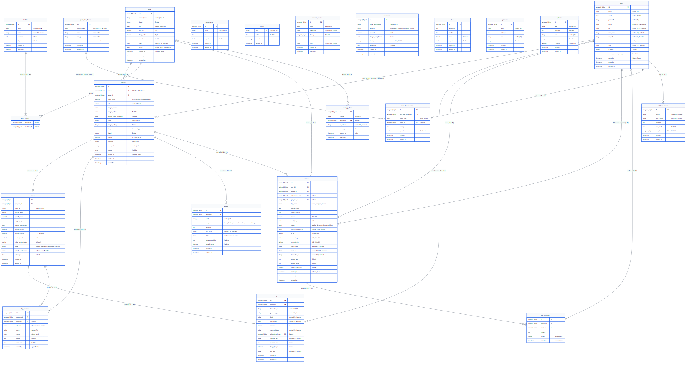

*Berkas skrip sumber Mermaid master tersimpan di: [`Blueprint/erd/diagram_erd.mmd`](file:///c:/xampp/htdocs/asri-boarding-house/Blueprint/erd/diagram_erd.mmd)*

```mermaid
%%{init: {
  'theme': 'base',
  'themeVariables': {
    'primaryColor': '#F8FAFC',
    'primaryTextColor': '#0F172A',
    'primaryBorderColor': '#2563EB',
    'lineColor': '#334155',
    'secondaryColor': '#FEF3C7',
    'tertiaryColor': '#ECFDF5',
    'fontSize': '12px',
    'fontFamily': 'Inter, system-ui, -apple-system, sans-serif'
  }
}}%%
erDiagram
    users {
        unsigned_bigint id PK
        string nama "varchar(100)"
        string email "varchar(150) UK"
        string password "varchar(255)"
        string no_hp "varchar(20) UK, Nullable"
        string nik "varchar(20) UK, Nullable"
        string nama_wali "varchar(100), Nullable"
        string no_wali "varchar(20), Nullable"
        enum role "admin, penyewa"
        string foto "varchar(255), Nullable"
        tinyint is_active "Default 1"
        boolean require_password_change "Default false"
        timestamp deleted_at "Nullable, Index"
        timestamp created_at
        timestamp updated_at
    }

    kamar {
        unsigned_bigint id PK
        string nomor_kamar "varchar(50) UK"
        tinyint lantai "Default 1"
        enum tipe "standar, deluxe, vip"
        decimal luas_m2 "5,2"
        decimal harga_bulan "12,2"
        text deskripsi "Nullable"
        string foto "varchar(255), Nullable"
        enum status "tersedia, terisi, maintenance"
        timestamp deleted_at "Nullable, Index"
        timestamp created_at
        timestamp updated_at
    }

    fasilitas {
        unsigned_bigint id PK
        string nama "varchar(100) UK"
        string ikon "varchar(50), Nullable"
        text deskripsi "Nullable"
        boolean is_active "Default true"
        timestamp created_at
        timestamp updated_at
    }

    kamar_fasilitas {
        unsigned_bigint kamar_id PK, FK
        unsigned_bigint fasilitas_id PK, FK
    }

    penyewa {
        unsigned_bigint id PK
        unsigned_bigint user_id FK "1:1 Aktif / 1:N Historis"
        unsigned_bigint kamar_id FK
        decimal harga_sewa "12,2, Nullable (Immutable copy)"
        string nik "varchar(20) UK"
        date tanggal_masuk
        date tanggal_keluar "Nullable"
        date tanggal_keluar_seharusnya "Nullable"
        enum status "aktif, nonaktif"
        tinyint tanggal_billing "Default 1"
        enum tipe_sewa "harian, mingguan, bulanan"
        tinyint durasi "Default 1"
        decimal deposit "12,2, Default 0"
        string no_wali "varchar(20)"
        string nama_wali "varchar(100)"
        text catatan "Nullable"
        timestamp deleted_at "Nullable, Index"
        timestamp created_at
        timestamp updated_at
    }

    tagihan {
        unsigned_bigint id PK
        unsigned_bigint penyewa_id FK
        string order_id "varchar(50) UK"
        tinyint periode_bulan
        smallint periode_tahun
        date tanggal_tagihan
        date tanggal_jatuh_tempo
        decimal nominal_pokok "12,2"
        decimal nominal_denda "12,2, Default 0"
        decimal nominal_total "12,2"
        tinyint bulan_keterlambatan "Default 0"
        enum status "pending, lunas, gagal, kadaluarsa, terlambat"
        enum metode_pembayaran "midtrans, cash, Nullable"
        text keterangan "Nullable"
        timestamp created_at
        timestamp updated_at
    }

    pembayaran {
        unsigned_bigint id PK
        unsigned_bigint tagihan_id FK
        string transaction_id "varchar(100) UK"
        string payment_type "varchar(50), Nullable"
        string bank "varchar(20), Nullable"
        string va_number "varchar(30), Nullable"
        decimal nominal "12,2"
        string status_midtrans "varchar(50), Nullable"
        unsigned_bigint dikonfirmasi_oleh FK "Nullable"
        string signature_key "varchar(255), Nullable"
        json response_json "Nullable"
        datetime tanggal_bayar "Nullable"
        string pdf_path "varchar(255), Nullable"
        timestamp created_at
        timestamp updated_at
    }

    log_notifikasi {
        unsigned_bigint id PK
        unsigned_bigint penyewa_id FK
        unsigned_bigint tagihan_id FK "Nullable"
        enum channel "whatsapp, email, system"
        string event "varchar(50)"
        enum status "sukses, gagal"
        text pesan "Nullable"
        text error_msg "Nullable"
        timestamp created_at "Append-only"
    }

    reservasi {
        unsigned_bigint id PK
        unsigned_bigint user_id FK
        unsigned_bigint kamar_id FK
        unsigned_bigint dikonfirmasi_oleh FK "Nullable"
        unsigned_bigint penyewa_id FK "Nullable"
        enum tipe_sewa "harian, mingguan, bulanan"
        date tanggal_mulai
        date tanggal_selesai
        tinyint durasi "Default 1"
        decimal total_harga "12,2"
        enum status "pending, dp, lunas, dikonfirmasi, batal"
        enum metode_pembayaran "midtrans, cash, Nullable"
        boolean is_dp "Default false"
        decimal nominal_dp "12,2, Default 0"
        decimal nominal_sisa "12,2, Default 0"
        string snap_token "varchar(255), Nullable"
        string order_id "varchar(100) UK, Nullable"
        string transaction_id "varchar(100), Nullable"
        text catatan_user "Nullable"
        text catatan_admin "Nullable"
        datetime tanggal_konfirmasi "Nullable"
        timestamp deleted_at "Nullable, Index"
        timestamp created_at
        timestamp updated_at
    }

    chat_messages {
        unsigned_bigint id PK
        unsigned_bigint reservasi_id FK
        unsigned_bigint sender_id FK
        text message
        boolean is_read "Default false"
        timestamp created_at "Append-only"
    }

    pengumuman {
        unsigned_bigint id PK
        string judul "varchar(150)"
        text isi
        boolean is_active "Default true"
        timestamp created_at
        timestamp updated_at
    }

    notifikasi_khusus {
        unsigned_bigint id PK
        string sumber "varchar(255), Index"
        string tipe_aktivitas "varchar(255), Index"
        text deskripsi
        json data_detail "Nullable"
        unsigned_bigint user_id FK "Nullable"
        timestamp created_at
        timestamp updated_at
    }

    settings {
        string key PK "varchar(255)"
        text value "Nullable"
        timestamp created_at
        timestamp updated_at
    }

    customer_reviews {
        unsigned_bigint id PK
        string nama "varchar(100)"
        string pekerjaan "varchar(100), Nullable"
        unsigned_tinyint bintang "Default 5"
        text ulasan
        string foto "varchar(255), Nullable"
        timestamp created_at
        timestamp updated_at
    }

    pengeluaran {
        unsigned_bigint id PK
        string nama_pengeluaran "varchar(150)"
        enum kategori "maintenance, utilitas, operasional, lainnya"
        decimal nominal "12,2"
        date tanggal_pengeluaran "Index"
        string bukti_nota "varchar(255), Nullable"
        text keterangan "Nullable"
        timestamp created_at
        timestamp updated_at
    }

    faqs {
        unsigned_bigint id PK
        text pertanyaan
        text jawaban
        tinyint urutan "Default 0"
        tinyint is_active "Default 1"
        timestamp created_at
        timestamp updated_at
    }

    keluhan {
        unsigned_bigint id PK
        unsigned_bigint penyewa_id FK
        string judul "varchar(150)"
        enum kategori "kamar, fasilitas_bersama, kebersihan, keamanan, lainnya"
        text deskripsi
        string foto_bukti "varchar(255), Nullable"
        enum status "pending, diproses, selesai"
        text tanggapan_admin "Nullable"
        datetime tanggal_selesai "Nullable"
        timestamp created_at
        timestamp updated_at
    }

    peraturan {
        unsigned_bigint id PK
        string judul "varchar(100)"
        text deskripsi
        string ikon "varchar(50)"
        integer urutan "Default 0"
        timestamp created_at
        timestamp updated_at
    }

    galleries {
        unsigned_bigint id PK
        string judul "varchar(100)"
        text deskripsi "Nullable"
        string foto "varchar(255)"
        integer urutan "Default 0"
        boolean is_active "Default true"
        timestamp created_at
        timestamp updated_at
    }

    guest_chat_threads {
        unsigned_bigint id PK
        string session_token "varchar(255) UK, Index"
        string name "varchar(255)"
        string no_hp "varchar(255)"
        enum status "active, closed"
        timestamp created_at
        timestamp updated_at
    }

    guest_chat_messages {
        unsigned_bigint id PK
        unsigned_bigint guest_chat_thread_id FK
        enum sender_type "guest, admin"
        unsigned_bigint sender_id FK "Nullable"
        text message
        boolean is_read "Default false"
        timestamp created_at
        timestamp updated_at
    }

    whatsapp_clicks {
        unsigned_bigint id PK
        string source "varchar(50)"
        unsigned_bigint kamar_id FK "Nullable"
        string ip_address "varchar(45), Nullable"
        text user_agent "Nullable"
        timestamp created_at "Index"
        timestamp updated_at
    }

    %% Relationship Definitions %%
    users ||--o{ penyewa : "user_id (1:1 Aktif / 1:N Historis)"
    kamar ||--o{ penyewa : "kamar_id (1:N)"
    
    kamar ||--|{ kamar_fasilitas : "kamar_id (1:N)"
    fasilitas ||--|{ kamar_fasilitas : "fasilitas_id (1:N)"

    penyewa ||--o{ tagihan : "penyewa_id (1:N)"
    tagihan ||--o{ pembayaran : "tagihan_id (1:N)"
    users ||--o{ pembayaran : "dikonfirmasi_oleh (1:N)"

    penyewa ||--o{ log_notifikasi : "penyewa_id (1:N)"
    tagihan ||--o{ log_notifikasi : "tagihan_id (1:N)"
    penyewa ||--o{ keluhan : "penyewa_id (1:N)"

    users ||--o{ reservasi : "user_id (1:N)"
    kamar ||--o{ reservasi : "kamar_id (1:N)"
    users ||--o{ reservasi : "dikonfirmasi_oleh (1:N)"
    penyewa ||--o{ reservasi : "penyewa_id (1:N)"

    reservasi ||--o{ chat_messages : "reservasi_id (1:N)"
    users ||--o{ chat_messages : "sender_id (1:N)"

    guest_chat_threads ||--o{ guest_chat_messages : "guest_chat_thread_id (1:N)"
    users ||--o{ guest_chat_messages : "sender_id (1:N)"

    users ||--o{ notifikasi_khusus : "user_id (1:N)"
    kamar ||--o{ whatsapp_clicks : "kamar_id (1:N)"
```

---

## 1.1. Visualisasi Relasi Antar-Entitas & Analisis Kardinalitas Lengkap

Bagian ini menyajikan representasi visual topologi keterhubungan antar 21 entitas sistem, dikelompokkan berdasarkan klasifikasi kardinalitas: **One-to-One (1:1)**, **Many-to-Many (N:M)**, dan **One-to-Many (1:N)**.

### A. Peta Topologi Relasi & Kardinalitas Global Sistem
*Berkas skrip: [`Blueprint/erd/peta_relasi_kardinalitas_global.mmd`](file:///c:/xampp/htdocs/asri-boarding-house/Blueprint/erd/peta_relasi_kardinalitas_global.mmd)*

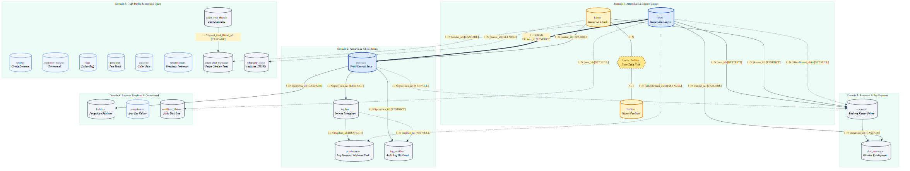

Diagram di bawah ini memetakan seluruh keterkaitan antar 21 entitas lintas 5 domain sistem:

```mermaid
%%{init: {
  'theme': 'base',
  'themeVariables': {
    'primaryColor': '#EFF6FF',
    'primaryTextColor': '#1E293B',
    'primaryBorderColor': '#2563EB',
    'lineColor': '#334155',
    'secondaryColor': '#FEF3C7',
    'tertiaryColor': '#ECFDF5',
    'fontSize': '12px',
    'fontFamily': 'Inter, system-ui, sans-serif'
  }
}}%%
flowchart TB
    %% Subgraphs per Domain
    subgraph D1["Domain 1: Autentikasi & Master Kamar"]
        direction TB
        USERS[("users<br><i>Master Akun Login</i>")]
        KAMAR[("kamar<br><i>Master Unit Fisik</i>")]
        FASILITAS[("fasilitas<br><i>Master Fasilitas</i>")]
        KF{{"kamar_fasilitas<br><i>Pivot Table N:M</i>"}}
    end

    subgraph D2["Domain 2: Penyewa & Siklus Billing"]
        direction TB
        PENYEWA[("penyewa<br><i>Profil Kontrak Sewa</i>")]
        TAGIHAN[("tagihan<br><i>Invoice Penagihan</i>")]
        PEMBAYARAN[("pembayaran<br><i>Log Transaksi Midtrans/Cash</i>")]
        LOG_NOTIF[("log_notifikasi<br><i>Audit Log WA/Email</i>")]
    end

    subgraph D3["Domain 3: Reservasi & Pre-Payment"]
        direction TB
        RESERVASI[("reservasi<br><i>Booking Kamar Online</i>")]
        CHAT_MSG[("chat_messages<br><i>Obrolan Pre-Payment</i>")]
    end

    subgraph D4["Domain 4: Layanan Penghuni & Operasional"]
        direction TB
        KELUHAN[("keluhan<br><i>Pengaduan Fasilitas</i>")]
        PENGELUARAN[("pengeluaran<br><i>Arus Kas Keluar</i>")]
        NOTIF_KHUSUS[("notifikasi_khusus<br><i>Audit Trail Log</i>")]
    end

    subgraph D5["Domain 5: CMS Publik & Interaksi Guest"]
        direction TB
        SETTINGS[("settings<br><i>Config Dinamis</i>")]
        REVIEWS[("customer_reviews<br><i>Testimonial</i>")]
        FAQS[("faqs<br><i>Daftar FAQ</i>")]
        PERATURAN[("peraturan<br><i>Tata Tertib</i>")]
        GALLERIES[("galleries<br><i>Galeri Foto</i>")]
        PENGUMUMAN[("pengumuman<br><i>Broadcast Informasi</i>")]
        GUEST_THREADS[("guest_chat_threads<br><i>Sesi Chat Tamu</i>")]
        GUEST_MSGS[("guest_chat_messages<br><i>Pesan Obrolan Tamu</i>")]
        WA_CLICKS[("whatsapp_clicks<br><i>Analytics CTR WA</i>")]
    end

    %% Relasi 1:1 (Biru Tebal)
    USERS ===|"1 : 1 (Aktif)<br>FK: user_id [RESTRICT]"| PENYEWA

    %% Relasi N:M Pivot (Oranye)
    KAMAR ---|"1 : N"| KF
    KF ---|"N : 1"| FASILITAS

    %% Relasi 1:N Domain Sewa & Billing (Hijau / Slate)
    KAMAR -->|"1 : N (kamar_id) [RESTRICT]"| PENYEWA
    PENYEWA -->|"1 : N (penyewa_id) [RESTRICT]"| TAGIHAN
    TAGIHAN -->|"1 : N (tagihan_id) [RESTRICT]"| PEMBAYARAN
    USERS -.->|"1 : N (dikonfirmasi_oleh) [SET NULL]"| PEMBAYARAN
    PENYEWA -->|"1 : N (penyewa_id) [RESTRICT]"| LOG_NOTIF
    TAGIHAN -.->|"1 : N (tagihan_id) [SET NULL]"| LOG_NOTIF

    %% Relasi 1:N Reservasi
    USERS -->|"1 : N (user_id) [RESTRICT]"| RESERVASI
    KAMAR -->|"1 : N (kamar_id) [RESTRICT]"| RESERVASI
    USERS -.->|"1 : N (dikonfirmasi_oleh) [SET NULL]"| RESERVASI
    PENYEWA -.->|"1 : N (penyewa_id) [SET NULL]"| RESERVASI
    RESERVASI -->|"1 : N (reservasi_id) [CASCADE]"| CHAT_MSG
    USERS -->|"1 : N (sender_id) [CASCADE]"| CHAT_MSG

    %% Relasi 1:N Layanan & Analytics
    PENYEWA -->|"1 : N (penyewa_id) [CASCADE]"| KELUHAN
    GUEST_THREADS -->|"1 : N (guest_chat_thread_id) [CASCADE]"| GUEST_MSGS
    USERS -.->|"1 : N (sender_id) [CASCADE]"| GUEST_MSGS
    USERS -.->|"1 : N (user_id) [SET NULL]"| NOTIF_KHUSUS
    KAMAR -.->|"1 : N (kamar_id) [SET NULL]"| WA_CLICKS

    %% Styling
    classDef otoClass fill:#DBEAFE,stroke:#1D4ED8,stroke-width:2px,color:#1E3A8A;
    classDef mtmClass fill:#FEF3C7,stroke:#D97706,stroke-width:2px,color:#78350F;
    classDef otmClass fill:#F1F5F9,stroke:#475569,stroke-width:1.5px,color:#0F172A;
    classDef pivotClass fill:#FDE68A,stroke:#B45309,stroke-width:2px,stroke-dasharray: 4 4,color:#78350F;

    class USERS,PENYEWA otoClass;
    class KAMAR,FASILITAS mtmClass;
    class KF pivotClass;
    class TAGIHAN,PEMBAYARAN,LOG_NOTIF,RESERVASI,CHAT_MSG,KELUHAN,GUEST_THREADS,GUEST_MSGS,NOTIF_KHUSUS,WA_CLICKS otmClass;
```

---

### B. Analisis & Visualisasi Khusus per Tipe Kardinalitas

#### B.1. Relasi One-to-One (1:1 Logis): `users` ↔ `penyewa`
*Berkas skrip: [`Blueprint/erd/diagram_relasi_one_to_one.mmd`](file:///c:/xampp/htdocs/asri-boarding-house/Blueprint/erd/diagram_relasi_one_to_one.mmd)*

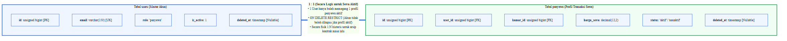

```mermaid
%%{init: {
  'theme': 'base',
  'themeVariables': {
    'primaryColor': '#EFF6FF',
    'primaryTextColor': '#1E293B',
    'primaryBorderColor': '#2563EB',
    'lineColor': '#2563EB',
    'fontSize': '12px',
    'fontFamily': 'Inter, system-ui, sans-serif'
  }
}}%%
flowchart LR
    subgraph USER_CONTAINER["Tabel users (Master Akun Login)"]
        direction TB
        U1["<b>id</b>: unsigned bigint [PK]"]
        U2["<b>email</b>: varchar(150) [UK]"]
        U3["<b>role</b>: 'penyewa'"]
        U4["<b>is_active</b>: 1"]
        U5["<b>deleted_at</b>: timestamp [Nullable]"]
    end

    subgraph PENYEWA_CONTAINER["Tabel penyewa (Profil Transaksi Sewa)"]
        direction TB
        P1["<b>id</b>: unsigned bigint [PK]"]
        P2["<b>user_id</b>: unsigned bigint [FK]"]
        P3["<b>kamar_id</b>: unsigned bigint [FK]"]
        P4["<b>harga_sewa</b>: decimal(12,2)"]
        P5["<b>status</b>: 'aktif' | 'nonaktif'"]
        P6["<b>deleted_at</b>: timestamp [Nullable]"]
    end

    USER_CONTAINER ===|"<b>1 : 1 (Secara Logis untuk Sewa Aktif)</b><br>• 1 User hanya boleh memegang 1 profil penyewa aktif<br>• ON DELETE RESTRICT (Akun tidak boleh dihapus jika profil aktif)<br>• Secara fisik 1:N historis untuk arsip kontrak masa lalu"| PENYEWA_CONTAINER

    style USER_CONTAINER fill:#EFF6FF,stroke:#2563EB,stroke-width:2px
    style PENYEWA_CONTAINER fill:#F0FDF4,stroke:#16A34A,stroke-width:2px
```

* **Penjelasan Hubungan 1:1**:
  - **Prinsip Bisnis**: Menghubungkan akun login autentikasi (`users`) dengan data operasional transaksi sewa (`penyewa`). Satu pengguna penyewa hanya diizinkan memiliki **1 profil penyewa berstatus `aktif`**.
  - **Prinsip Fisik Database**: Pada level fisik database, relasi menggunakan FK biasa tanpa Unique Key fisik kaku (diperbarui via migrasi `fix_penyewa_unique_constraints`) agar ketika penyewa melakukan *checkout* (status `nonaktif`), lalu di masa depan menyewa kamar kembali, riwayat kontrak lama tetap tersimpan (*historical contract audit trail*).
  - **Integritas Aksi (`ON DELETE RESTRICT`)**: Akun user yang memiliki data sewa aktif tidak dapat dihapus sembarangan oleh admin guna melindungi riwayat transaksi keuangan.

---

#### B.2. Relasi Many-to-Many (N:M Pivot): `kamar` ↔ `fasilitas`
*Berkas skrip: [`Blueprint/erd/diagram_relasi_many_to_many.mmd`](file:///c:/xampp/htdocs/asri-boarding-house/Blueprint/erd/diagram_relasi_many_to_many.mmd)*

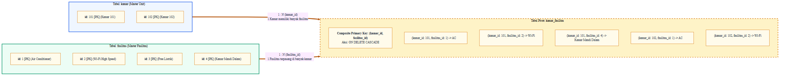

```mermaid
%%{init: {
  'theme': 'base',
  'themeVariables': {
    'primaryColor': '#FFFBEB',
    'primaryTextColor': '#1E293B',
    'primaryBorderColor': '#D97706',
    'lineColor': '#B45309',
    'fontSize': '12px',
    'fontFamily': 'Inter, system-ui, sans-serif'
  }
}}%%
flowchart LR
    subgraph KAMAR_NODE["Tabel: kamar (Master Unit)"]
        direction TB
        K1["<b>id</b>: 101 [PK] (Kamar 101)"]
        K2["<b>id</b>: 102 [PK] (Kamar 102)"]
    end

    subgraph PIVOT_NODE["Tabel Pivot: kamar_fasilitas"]
        direction TB
        P_TITLE["<b>Composite Primary Key: (kamar_id, fasilitas_id)</b><br>Aksi: ON DELETE CASCADE"]
        P1["(kamar_id: 101, fasilitas_id: 1) -> AC"]
        P2["(kamar_id: 101, fasilitas_id: 2) -> Wi-Fi"]
        P3["(kamar_id: 101, fasilitas_id: 4) -> Kamar Mandi Dalam"]
        P4["(kamar_id: 102, fasilitas_id: 1) -> AC"]
        P5["(kamar_id: 102, fasilitas_id: 2) -> Wi-Fi"]
    end

    subgraph FASILITAS_NODE["Tabel: fasilitas (Master Fasilitas)"]
        direction TB
        F1["<b>id</b>: 1 [PK] (Air Conditioner)"]
        F2["<b>id</b>: 2 [PK] (Wi-Fi High Speed)"]
        F3["<b>id</b>: 3 [PK] (Free Listrik)"]
        F4["<b>id</b>: 4 [PK] (Kamar Mandi Dalam)"]
    end

    KAMAR_NODE ==>|"1 : N (kamar_id)<br>1 Kamar memiliki banyak fasilitas"| PIVOT_NODE
    FASILITAS_NODE ==>|"1 : N (fasilitas_id)<br>1 Fasilitas terpasang di banyak kamar"| PIVOT_NODE

    style KAMAR_NODE fill:#EFF6FF,stroke:#2563EB,stroke-width:2px
    style PIVOT_NODE fill:#FEF3C7,stroke:#D97706,stroke-width:2px,stroke-dasharray: 5 5
    style FASILITAS_NODE fill:#ECFDF5,stroke:#059669,stroke-width:2px
```

* **Penjelasan Hubungan N:M**:
  - **Prinsip Bisnis**: Satu kamar kost dilengkapi oleh banyak fasilitas penunjang (AC, Wi-Fi, Kamar Mandi Dalam, Kasur Springbed), dan satu jenis master fasilitas dipasang pada banyak unit kamar.
  - **Resolusi Normalisasi**: Relasi N:M diurai menjadi dua relasi 1:N melalui tabel perantara (*pivot table*) `kamar_fasilitas`.
  - **Constraint & Aksi**: Menggunakan *Composite Primary Key* `(kamar_id, fasilitas_id)` untuk mencegah pemetaan duplikat, serta `ON DELETE CASCADE` sehingga apabila kamar atau jenis fasilitas dihapus, baris asosiasi di tabel pivot terhapus otomatis.

---

#### B.3. Relasi One-to-Many (1:N): Rantai Transaksional Utama
*Berkas skrip: [`Blueprint/erd/diagram_relasi_one_to_many.mmd`](file:///c:/xampp/htdocs/asri-boarding-house/Blueprint/erd/diagram_relasi_one_to_many.mmd)*

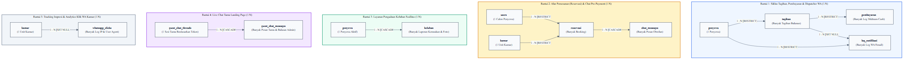

```mermaid
%%{init: {
  'theme': 'base',
  'themeVariables': {
    'primaryColor': '#F8FAFC',
    'primaryTextColor': '#0F172A',
    'primaryBorderColor': '#334155',
    'lineColor': '#475569',
    'fontSize': '12px',
    'fontFamily': 'Inter, system-ui, sans-serif'
  }
}}%%
flowchart TD
    %% Rantai 1: Penagihan & Pembayaran
    subgraph CHAIN1["Rantai 1: Siklus Tagihan, Pembayaran & Dispatcher WA (1:N)"]
        direction LR
        P["<b>penyewa</b><br>(1 Penyewa)"] -->|"1 : N [RESTRICT]"| T["<b>tagihan</b><br>(Banyak Tagihan Bulanan)"]
        T -->|"1 : N [RESTRICT]"| PAY["<b>pembayaran</b><br>(Banyak Log Midtrans/Cash)"]
        T -->|"1 : N [SET NULL]"| NOTIF["<b>log_notifikasi</b><br>(Banyak Log WA/Email)"]
        P -->|"1 : N [RESTRICT]"| NOTIF
    end

    %% Rantai 2: Reservasi & Pre-Payment Chat
    subgraph CHAIN2["Rantai 2: Alur Pemesanan (Reservasi) & Chat Pre-Payment (1:N)"]
        direction LR
        U["<b>users</b><br>(1 Calon Penyewa)"] -->|"1 : N [RESTRICT]"| RES["<b>reservasi</b><br>(Banyak Booking)"]
        K["<b>kamar</b><br>(1 Unit Kamar)"] -->|"1 : N [RESTRICT]"| RES
        RES -->|"1 : N [CASCADE]"| CHAT["<b>chat_messages</b><br>(Banyak Pesan Obrolan)"]
    end

    %% Rantai 3: Helpdesk Keluhan
    subgraph CHAIN3["Rantai 3: Layanan Pengaduan Keluhan Fasilitas (1:N)"]
        direction LR
        P2["<b>penyewa</b><br>(1 Penyewa Aktif)"] -->|"1 : N [CASCADE]"| KEL["<b>keluhan</b><br>(Banyak Laporan Kerusakan & Foto)"]
    end

    %% Rantai 4: Sesi Chat Tamu
    subgraph CHAIN4["Rantai 4: Live Chat Tamu Landing Page (1:N)"]
        direction LR
        TH["<b>guest_chat_threads</b><br>(1 Sesi Tamu Berdasarkan Token)"] -->|"1 : N [CASCADE]"| MSG["<b>guest_chat_messages</b><br>(Banyak Pesan Tamu & Balasan Admin)"]
    end

    %% Rantai 5: Analytics Tracking
    subgraph CHAIN5["Rantai 5: Tracking Impresi & Analytics Klik WA Kamar (1:N)"]
        direction LR
        K2["<b>kamar</b><br>(1 Unit Kamar)"] -->|"1 : N [SET NULL]"| WA["<b>whatsapp_clicks</b><br>(Banyak Log IP & User Agent)"]
    end

    style CHAIN1 fill:#EFF6FF,stroke:#2563EB,stroke-width:1.5px
    style CHAIN2 fill:#FEF3C7,stroke:#D97706,stroke-width:1.5px
    style CHAIN3 fill:#ECFDF5,stroke:#059669,stroke-width:1.5px
    style CHAIN4 fill:#F3E8FF,stroke:#9333EA,stroke-width:1.5px
    style CHAIN5 fill:#F1F5F9,stroke:#64748B,stroke-width:1.5px
```

* **Rincian Hubungan 1:N**:
  1. **`penyewa` ➔ `tagihan` (1:N)**: 1 Penyewa menerima serangkaian invoice tagihan sewa bulanan rutin.
  2. **`tagihan` ➔ `pembayaran` (1:N)**: 1 Tagihan dapat memiliki beberapa baris percobaan pembayaran transaksi Midtrans (misal: order pending yang expired lalu diulang hingga settlement, atau pembayaran cash).
  3. **`reservasi` ➔ `chat_messages` (1:N)**: 1 Transaksi booking kamar membuka 1 ruang obrolan pre-payment berisikan banyak baris pesan obrolan antara calon penyewa dan admin.
  4. **`penyewa` ➔ `keluhan` (1:N)**: 1 Penyewa aktif dapat mengajukan banyak laporan keluhan kerusakan fasilitas secara berkala.
  5. **`guest_chat_threads` ➔ `guest_chat_messages` (1:N)**: 1 Sesi obrolan pengunjung web landing page anonim menampung banyak pesan tanya jawab sebelum calon penyewa membuat akun resmi.
  6. **`kamar` ➔ `whatsapp_clicks` (1:N)**: 1 Unit kamar dapat diklik tombol WhatsApp-nya berulang kali oleh banyak pengunjung web, dicatat log IP dan User Agent untuk analitik minat pasar.

---

### C. Matriks Komprehensif Seluruh Relasi Antar-Entitas dalam Sistem

Tabel berikut merangkum seluruh 20 relasi antarentitas dalam sistem basis data:

| No | Entitas Induk (Parent) | Entitas Anak (Child) | Jenis Kardinalitas | Foreign Key (FK) | Primary Key (PK) | Aksi `ON DELETE` | Aturan Bisnis & Skenario |
| :-: | :--- | :--- | :---: | :--- | :--- | :---: | :--- |
| 1 | `users` | `penyewa` | **1 : 1 (Aktif)** / **1 : N (Historis)** | `user_id` | `id` | **RESTRICT** | 1 User login penyewa hanya boleh memegang 1 profil penyewa aktif. Akun tidak boleh dihapus jika profil sewanya masih aktif. |
| 2 | `kamar` | `penyewa` | **1 : N** | `kamar_id` | `id` | **RESTRICT** | 1 Kamar dapat dihuni oleh banyak penyewa secara bergantian. Kamar tidak boleh dihapus jika sedang dihuni. |
| 3 | `kamar` | `kamar_fasilitas` | **N : M** (Pivot) | `kamar_id` | `id` | **CASCADE** | Memetakan fasilitas kamar. Jika kamar dihapus, pemetaan fasilitas otomatis dibersihkan. |
| 4 | `fasilitas` | `kamar_fasilitas` | **N : M** (Pivot) | `fasilitas_id` | `id` | **CASCADE** | Memetakan kamar per fasilitas. Jika master fasilitas dihapus, pemetaan di kamar otomatis dibersihkan. |
| 5 | `penyewa` | `tagihan` | **1 : N** | `penyewa_id` | `id` | **RESTRICT** | 1 Penyewa memiliki banyak tagihan rutin bulanan. Penyewa tidak boleh dihapus jika punya riwayat billing. |
| 6 | `tagihan` | `pembayaran` | **1 : N** | `tagihan_id` | `id` | **RESTRICT** | 1 Tagihan dapat memiliki beberapa percobaan pembayaran. Tagihan tidak boleh dihapus jika ada log transaksi. |
| 7 | `users` | `pembayaran` | **1 : N** | `dikonfirmasi_oleh` | `id` | **SET NULL** | 1 Admin memverifikasi banyak pembayaran cash. Jika akun admin dihapus, log konfirmasi cash tetap utuh. |
| 8 | `penyewa` | `log_notifikasi` | **1 : N** | `penyewa_id` | `id` | **RESTRICT** | 1 Penyewa memiliki banyak log notifikasi WA/Email pengingat tagihan. |
| 9 | `tagihan` | `log_notifikasi` | **1 : N** | `tagihan_id` | `id` | **SET NULL** | 1 Tagihan memicu notifikasi WA/Email. Mempertahankan audit log walau tagihan dibersihkan. |
| 10 | `penyewa` | `keluhan` | **1 : N** | `penyewa_id` | `id` | **CASCADE** | 1 Penyewa dapat mengajukan banyak pengaduan keluhan fasilitas. Jika penyewa dibersihkan, log keluhan terhapus. |
| 11 | `users` | `reservasi` | **1 : N** | `user_id` | `id` | **RESTRICT** | 1 User calon penyewa dapat melakukan pemesanan kamar online. |
| 12 | `kamar` | `reservasi` | **1 : N** | `kamar_id` | `id` | **RESTRICT** | 1 Kamar dapat dipesan oleh calon penyewa. Kamar master terkunci jika ada reservasi aktif. |
| 13 | `users` | `reservasi` | **1 : N** | `dikonfirmasi_oleh` | `id` | **SET NULL** | 1 Admin menyetujui/mengonfirmasi banyak pemesanan kamar. |
| 14 | `penyewa` | `reservasi` | **1 : N** | `penyewa_id` | `id` | **SET NULL** | Memetakan reservasi asal yang menghasilkan profil penyewa aktif. |
| 15 | `reservasi` | `chat_messages` | **1 : N** | `reservasi_id` | `id` | **CASCADE** | 1 Reservasi memiliki 1 ruang obrolan pre-payment. Jika reservasi dibatalkan/dihapus, seluruh chat terhapus. |
| 16 | `users` | `chat_messages` | **1 : N** | `sender_id` | `id` | **CASCADE** | 1 User/Admin mengirim banyak baris pesan obrolan reservasi. |
| 17 | `guest_chat_threads`| `guest_chat_messages`| **1 : N** | `guest_chat_thread_id`| `id` | **CASCADE** | 1 Thread chat tamu berisi banyak pesan. Jika thread ditutup/dihapus, pesan otomatis dibersihkan. |
| 18 | `users` | `guest_chat_messages`| **1 : N** | `sender_id` | `id` | **CASCADE** | 1 Admin membalas pesan obrolan tamu landing page. |
| 19 | `users` | `notifikasi_khusus` | **1 : N** | `user_id` | `id` | **SET NULL** | 1 User memicu/menerima notifikasi sistem (reservasi baru, tagihan lunas, dll). |
| 20 | `kamar` | `whatsapp_clicks` | **1 : N** | `kamar_id` | `id` | **SET NULL** | 1 Kamar diklik tombol WA-nya oleh tamu. Jika kamar dihapus, log analitik tetap tersimpan. |

---

## 2. Kamus Data & Detail Entitas (21 Tabel)

Berikut adalah penjelasan detail mengenai struktur kolom, tipe data, modifier, serta fungsi dari 21 tabel dalam basis data:

### 2.1. Tabel `users`
Menyimpan akun pengguna untuk otentikasi login (`admin` atau `penyewa`).
- **id**: Primary Key (`unsigned bigint auto_increment`).
- **nama**: Nama lengkap pengguna (`varchar 100`).
- **email**: Alamat email unik (`varchar 150`) sebagai kredensial login.
- **password**: Hash password bcrypt (`varchar 255`).
- **no_hp**: Nomor handphone unik (`varchar 20`, nullable).
- **nik**: Nomor Induk Kependudukan 16 digit (`varchar 20`, nullable).
- **nama_wali**: Nama lengkap orang tua / wali penyewa (`varchar 100`, nullable).
- **no_wali**: Nomor handphone aktif orang tua / wali (`varchar 20`, nullable).
- **role**: Hak akses pengguna (`enum('admin', 'penyewa')`).
- **foto**: Path file foto profil (`varchar 255`, nullable).
- **is_active**: Status keaktifan akun (`tinyint`, default 1).
- **require_password_change**: Status keharusan ubah password saat login pertama kali (`boolean`, default false).
- **deleted_at**: Kolom timestamp penanganan Soft Deletes (`nullable`, `index`).
- *Catatan Indeks Soft Deletes*: Menerapkan kolom virtual generated `active_email`, `active_no_hp`, dan `active_nik` dengan Unique Index.

### 2.2. Tabel `kamar`
Menyimpan informasi fisik dan status ketersediaan unit kamar kost.
- **id**: Primary Key (`unsigned bigint auto_increment`).
- **nomor_kamar**: Nomor identifikasi kamar unik (`varchar 50`).
- **lantai**: Posisi lantai kamar (`tinyint`, default 1).
- **tipe**: Klasifikasi kelas kamar (`enum('standar', 'deluxe', 'vip')`).
- **luas_m2**: Luas dimensi kamar dalam meter persegi (`decimal 5,2`).
- **harga_bulan**: Tarif dasar sewa bulanan kamar (`decimal 12,2`).
- **deskripsi**: Catatan kelengkapan/kondisi kamar (`text`, nullable).
- **foto**: Path file foto galeri kamar (`varchar 255`, nullable).
- **status**: Ketersediaan fisik kamar (`enum('tersedia', 'terisi', 'maintenance')`).
- **deleted_at**: Kolom timestamp penanganan Soft Deletes (`nullable`, `index`).

### 2.3. Tabel `fasilitas`
Menyimpan master data fasilitas penunjang kost.
- **id**: Primary Key (`unsigned bigint auto_increment`).
- **nama**: Nama fasilitas unik (`varchar 100`).
- **ikon**: Kelas ikon representasi grafis Heroicons/FontAwesome (`varchar 50`, nullable).
- **deskripsi**: Penjelasan spesifikasi fasilitas (`text`, nullable).
- **is_active**: Status aktivasi ketersediaan fasilitas (`boolean`, default true).

### 2.4. Tabel `kamar_fasilitas`
Tabel pivot *Many-to-Many* yang menghubungkan entitas `kamar` dan `fasilitas`.
- **kamar_id**: Foreign Key merujuk ke `kamar.id` (`onDelete: cascade`).
- **fasilitas_id**: Foreign Key merujuk ke `fasilitas.id` (`onDelete: cascade`).
- *Composite Primary Key*: `(kamar_id, fasilitas_id)`.

### 2.5. Tabel `penyewa`
Menyimpan profil transaksi sewa aktif pengguna yang mengikat kamar tertentu beserta parameter keuangannya.
- **id**: Primary Key (`unsigned bigint auto_increment`).
- **user_id**: Foreign Key merujuk ke `users.id` (`onDelete: restrict`). 1:1 untuk sewa aktif, 1:N secara historis.
- **kamar_id**: Foreign Key merujuk ke `kamar.id` (`onDelete: restrict`).
- **harga_sewa**: Tarif sewa personal yang mengunci nilai riil saat pemesanan disetujui (`decimal 12,2`, nullable). *Mencegah fluktuasi tagihan bulanan jika harga master kamar di kemudian hari diubah admin.*
- **nik**: Nomor Induk Kependudukan wajib 16 digit (`varchar 20`).
- **tanggal_masuk**: Tanggal efektif mulai sewa (`date`).
- **tanggal_keluar**: Tanggal penyewa keluar secara resmi (`date`, nullable).
- **tanggal_keluar_seharusnya**: Perkiraan tanggal selesai sewa berdasarkan durasi awal kontrak (`date`, nullable).
- **status**: Status kontrak penyewa (`enum('aktif', 'nonaktif')`).
- **tanggal_billing**: Tanggal penerbitan invoice rutin (`tinyint`, default 1).
- **tipe_sewa**: Durasi basis pembayaran (`enum('harian', 'mingguan', 'bulanan')`).
- **durasi**: Angka pengali dari tipe sewa (`tinyint`, default 1).
- **deposit**: Uang jaminan awal sewa (`decimal 12,2`, default 0).
- **no_wali**: Kontak darurat wali/orang tua penyewa (`varchar 20`).
- **nama_wali**: Nama lengkap wali penyewa (`varchar 100`).
- **catatan**: Catatan internal admin mengenai penyewa (`text`, nullable).
- **deleted_at**: Kolom timestamp penanganan Soft Deletes (`nullable`, `index`).

### 2.6. Tabel `tagihan`
Menyimpan riwayat invoice rutin (billing engine) bulanan serta tagihan sisa pembayaran reservasi.
- **id**: Primary Key (`unsigned bigint auto_increment`).
- **penyewa_id**: Foreign Key merujuk ke `penyewa.id` (`onDelete: restrict`).
- **order_id**: Nomor order unik untuk transaksi Midtrans / Invoice (`varchar 50`, unique).
- **periode_bulan**: Periode bulan tagihan (`tinyint`, 1-12).
- **periode_tahun**: Periode tahun tagihan (`smallint`).
- **tanggal_tagihan**: Tanggal penerbitan tagihan (`date`).
- **tanggal_jatuh_tempo**: Batas akhir pembayaran seragam tgl 10 (`date`).
- **nominal_pokok**: Tagihan pokok sesuai `penyewa.harga_sewa` (`decimal 12,2`).
- **nominal_denda**: Akumulasi denda keterlambatan flat 5% (`decimal 12,2`, default 0).
- **nominal_total**: Jumlah keseluruhan pokok + denda (`decimal 12,2`).
- **bulan_keterlambatan**: Jumlah bulan keterlambatan berturut-turut (`tinyint`, default 0).
- **status**: Status pelunasan (`enum('pending', 'lunas', 'gagal', 'kadaluarsa', 'terlambat')`).
- **metode_pembayaran**: Cara pembayaran (`enum('midtrans', 'cash')`, nullable).
- **keterangan**: Detail deskripsi tagihan (`text`, nullable).
- *Constraint*: Composite Unique `uq_periode (penyewa_id, periode_bulan, periode_tahun)`.

### 2.7. Tabel `pembayaran`
Menyimpan data detail log transaksi finansial, baik pembayaran otomatis lewat Midtrans Snap Gateway maupun pencatatan tunai (cash) oleh admin.
- **id**: Primary Key (`unsigned bigint auto_increment`).
- **tagihan_id**: Foreign Key merujuk ke `tagihan.id` (`onDelete: restrict`).
- **transaction_id**: Kode referensi unik transaksi / Midtrans Transaction ID (`varchar 100`, unique).
- **payment_type**: Tipe transaksi Midtrans, e.g. bank_transfer, gopay, qris (`varchar 50`, nullable).
- **bank**: Nama bank tujuan Virtual Account (`varchar 20`, nullable).
- **va_number**: Nomor Virtual Account yang diterbitkan Midtrans (`varchar 30`, nullable).
- **nominal**: Jumlah uang yang dibayarkan (`decimal 12,2`).
- **status_midtrans**: Kode respon status dari webhook Midtrans / cash_confirmed (`varchar 50`, nullable).
- **dikonfirmasi_oleh**: Foreign Key merujuk ke `users.id` (`onDelete: set null`, nullable). Mengidentifikasi administrator yang memvalidasi pembayaran manual cash.
- **signature_key**: Kunci verifikasi keamanan webhook Midtrans (`varchar 255`, nullable).
- **response_json**: Payload JSON lengkap kiriman Midtrans (`json`, nullable).
- **tanggal_bayar**: Waktu penyelesaian transaksi (`datetime`, nullable).
- **pdf_path**: Penyimpanan berkas nota bukti pembayaran PDF Dompdf (`varchar 255`, nullable).

### 2.8. Tabel `log_notifikasi`
Menyimpan log audit *append-only* pengiriman pesan WhatsApp (Fonnte) maupun E-mail pengingat tagihan dan denda kepada penyewa/wali.
- **id**: Primary Key (`unsigned bigint auto_increment`).
- **penyewa_id**: Foreign Key merujuk ke `penyewa.id` (`onDelete: restrict`).
- **tagihan_id**: Referensi tagihan pemicu notifikasi (`unsigned bigint`, nullable, FK to `tagihan.id`, `onDelete: set null`).
- **channel**: Media penyampaian (`enum('whatsapp', 'email', 'system')`).
- **event**: Pemicu pengiriman, e.g. 'billing_created', 'denda_warning', 'keluhan_resolved' (`varchar 50`).
- **status**: Status keberhasilan pengantaran pesan (`enum('sukses', 'gagal')`).
- **pesan**: Konten teks pesan yang dikirim (`text`, nullable).
- **error_msg**: Pesan kegagalan API jika status gagal (`text`, nullable).
- **created_at**: Waktu pengiriman pesan (`timestamp`, useCurrent). *Kolom `updated_at` sengaja ditiadakan karena bersifat append-only audit log.*

### 2.9. Tabel `reservasi`
Menyimpan log pemesanan kamar secara online oleh calon penyewa pra-pembayaran DP/Lunas.
- **id**: Primary Key (`unsigned bigint auto_increment`).
- **user_id**: Foreign Key merujuk ke `users.id` (`onDelete: restrict`).
- **kamar_id**: Foreign Key merujuk ke `kamar.id` (`onDelete: restrict`).
- **dikonfirmasi_oleh**: Foreign Key merujuk ke `users.id` (`onDelete: set null`, nullable). Menandai admin yang menyetujui pengajuan sewa.
- **penyewa_id**: Foreign Key merujuk ke `penyewa.id` (`onDelete: set null`, nullable). Terisi otomatis setelah konfirmasi sukses membentuk profil penyewa aktif.
- **tipe_sewa**: Opsi durasi sewa (`enum('harian', 'mingguan', 'bulanan')`).
- **tanggal_mulai**: Tanggal efektif mulai sewa (`date`).
- **tanggal_selesai**: Tanggal efektif selesai kontrak (`date`).
- **durasi**: Jumlah pengali waktu (`tinyint`, default 1).
- **total_harga**: Total nilai transaksi awal sewa (`decimal 12,2`).
- **status**: Status reservasi (`enum('pending', 'dp', 'lunas', 'dikonfirmasi', 'batal')`).
- **metode_pembayaran**: Metode penyelesaian transaksi (`enum('midtrans', 'cash')`, nullable).
- **is_dp**: Status pilihan opsi pembayaran uang muka 30% (`boolean`, default false).
- **nominal_dp**: Besaran nominal uang muka (`decimal 12,2`, default 0).
- **nominal_sisa**: Sisa pembayaran yang harus dilunasi kemudian (`decimal 12,2`, default 0).
- **snap_token**: Token Snap Midtrans untuk portal pop-up bayar (`varchar 255`, nullable).
- **order_id**: Referensi pesanan untuk Midtrans API (`varchar 100`, nullable).
- **transaction_id**: Referensi id transaksi Midtrans (`varchar 100`, nullable).
- **catatan_user**: Permintaan khusus dari calon penyewa (`text`, nullable).
- **catatan_admin**: Catatan internal admin (`text`, nullable).
- **tanggal_konfirmasi**: Waktu status disetujui admin (`datetime`, nullable).
- **deleted_at**: Kolom timestamp penanganan Soft Deletes (`nullable`, `index`).

### 2.10. Tabel `chat_messages`
Menyimpan riwayat obrolan real-time berbasis AJAX polling antara Calon Penyewa dengan Admin di portal reservasi (pra-konfirmasi).
- **id**: Primary Key (`unsigned bigint auto_increment`).
- **reservasi_id**: Foreign Key merujuk ke `reservasi.id` (`onDelete: cascade`).
- **sender_id**: Foreign Key pengirim pesan merujuk ke `users.id` (`onDelete: cascade`).
- **message**: Konten teks obrolan (`text`).
- **is_read**: Status dibaca oleh penerima (`boolean`, default false).
- **created_at**: Waktu pesan dikirim (`timestamp`). *Bersifat append-only log.*

### 2.11. Tabel `settings`
Menyimpan parameter konfigurasi global website (informasi bank dinamis, kontak WhatsApp owner/admin, teks hero landing page, persentase denda, diskon promo paket).
- **key**: Primary Key (`varchar 255`). Kunci konfigurasi seperti `bank_name`, `bank_account_number`, `wa_owner`, `denda_flat_persen`.
- **value**: Nilai pengaturan (`text`, nullable).

### 2.12. Tabel `customer_reviews`
Menyimpan data testimonial ulasan dari alumni/pelanggan kost untuk ditampilkan pada landing page.
- **id**: Primary Key (`unsigned bigint auto_increment`).
- **nama**: Nama pemberi ulasan (`varchar 100`).
- **pekerjaan**: Pekerjaan/institusi pemberi ulasan (`varchar 100`, nullable).
- **bintang**: Rating skor kepuasan 1-5 (`unsigned tinyint`, default 5).
- **ulasan**: Konten teks ulasan (`text`).
- **foto**: Path file foto pelanggan (`varchar 255`, nullable).

### 2.13. Tabel `pengeluaran`
Menyimpan riwayat pembukuan pengeluaran biaya operasional kost (arus kas keluar).
- **id**: Primary Key (`unsigned bigint auto_increment`).
- **nama_pengeluaran**: Nama/deskripsi transaksi pengeluaran (`varchar 150`).
- **kategori**: Jenis alokasi biaya (`enum('maintenance', 'utilitas', 'operasional', 'lainnya')`).
- **nominal**: Jumlah biaya pengeluaran (`decimal 12,2`).
- **tanggal_pengeluaran**: Tanggal pengeluaran biaya dilakukan (`date`, `index`).
- **bukti_nota**: Path file foto kuitansi/nota bukti fisik (`varchar 255`, nullable).
- **keterangan**: Detail deskripsi pengeluaran (`text`, nullable).

### 2.14. Tabel `faqs`
Menyimpan daftar pertanyaan umum (FAQ) interaktif untuk halaman publik `/faq` dan `/cara-booking`.
- **id**: Primary Key (`unsigned bigint auto_increment`).
- **pertanyaan**: Teks pertanyaan (`text`).
- **jawaban**: Teks jawaban (`text`).
- **urutan**: Prioritas posisi tampil (`tinyint`, default 0).
- **is_active**: Status publikasi faq (`tinyint`, default 1).

### 2.15. Tabel `keluhan`
Menyimpan riwayat pengaduan laporan kerusakan fasilitas kost yang diajukan oleh penyewa aktif.
- **id**: Primary Key (`unsigned bigint auto_increment`).
- **penyewa_id**: Foreign Key merujuk ke `penyewa.id` (`onDelete: cascade`).
- **judul**: Topik keluhan (`varchar 150`).
- **kategori**: Kategori pengaduan (`enum('kamar', 'fasilitas_bersama', 'kebersihan', 'keamanan', 'lainnya')`).
- **deskripsi**: Detail kronologis keluhan (`text`).
- **foto_bukti**: Path file foto bukti pendukung keluhan (`varchar 255`, nullable).
- **status**: Status eskalasi keluhan (`enum('pending', 'diproses', 'selesai')`).
- **tanggapan_admin**: Teks tanggapan resolusi dari admin (`text`, nullable).
- **tanggal_selesai**: Waktu keluhan dinyatakan selesai/resolved (`datetime`, nullable).

### 2.16. Tabel `peraturan`
Menyimpan data tata tertib kost putri Asri Boarding House secara dinamis.
- **id**: Primary Key (`unsigned bigint auto_increment`).
- **judul**: Judul peraturan (`varchar 100`).
- **deskripsi**: Penjelasan detail peraturan (`text`).
- **ikon**: Nama ikon representasi visual Heroicons (`varchar 50`).
- **urutan**: Urutan penampilan peraturan (`integer`, default 0).

### 2.17. Tabel `galleries`
Menyimpan data galeri foto fasilitas atau lingkungan kost untuk halaman landing utama.
- **id**: Primary Key (`unsigned bigint auto_increment`).
- **judul**: Nama/keterangan foto (`varchar 100`).
- **deskripsi**: Penjelasan foto galeri (`text`, nullable).
- **foto**: Path file foto / tautan eksternal (`varchar 255`).
- **urutan**: Urutan penampilan foto (`integer`, default 0).
- **is_active**: Status publikasi foto (`boolean`, default true).

### 2.18. Tabel `guest_chat_threads` & `guest_chat_messages`
Menyimpan data percakapan pengunjung anonim (tamu landing page) dengan administrator sebelum melakukan registrasi akun resmi.
- **guest_chat_threads**:
  - **id**: Primary Key (`unsigned bigint auto_increment`).
  - **session_token**: Token session unik pengidentifikasi browser guest (`varchar 255`, unique, index).
  - **name**: Nama pengunjung (`varchar 255`).
  - **no_hp**: Nomor handphone pengunjung (`varchar 255`).
  - **status**: Status status chat (`enum('active', 'closed')`, default 'active').
- **guest_chat_messages**:
  - **id**: Primary Key (`unsigned bigint auto_increment`).
  - **guest_chat_thread_id**: Foreign Key merujuk ke `guest_chat_threads.id` (`onDelete: cascade`).
  - **sender_type**: Tipe pengirim pesan (`enum('guest', 'admin')`).
  - **sender_id**: Foreign Key admin yang membalas, merujuk ke `users.id` (`onDelete: cascade`, nullable).
  - **message**: Isi pesan obrolan (`text`).
  - **is_read**: Status keterbacaan (`boolean`, default false).

### 2.19. Tabel `pengumuman`
Menyimpan data pengumuman umum yang dipublikasikan oleh administrator untuk dibaca oleh seluruh penyewa kost.
- **id**: Primary Key (`unsigned bigint auto_increment`).
- **judul**: Judul pengumuman (`varchar 150`).
- **isi**: Konten teks lengkap pengumuman (`text`).
- **is_active**: Status publikasi pengumuman (`boolean`, default true).

### 2.20. Tabel `notifikasi_khusus`
Menyimpan log audit sistem dan notifikasi internal untuk mencatat aktivitas penting.
- **id**: Primary Key (`unsigned bigint auto_increment`).
- **sumber**: Sumber pemicu notifikasi, e.g. 'reservasi', 'tagihan', 'admin' (`varchar 255`, index).
- **tipe_aktivitas**: Klasifikasi jenis aktivitas, e.g. 'reservasi_baru', 'tagihan_lunas', 'kamar_diubah' (`varchar 255`, index).
- **deskripsi**: Teks penjelasan detail aktivitas (`text`).
- **data_detail**: Payload data tambahan terstruktur dalam format JSON (`json`, nullable).
- **user_id**: Foreign Key merujuk ke `users.id` (`onDelete: set null`, nullable) untuk mengidentifikasi aktor pemicu.

### 2.21. Tabel `whatsapp_clicks`
Menyimpan data log analytics pengunjung web yang mengklik tombol WhatsApp ke pengelola dari halaman katalog atau detail kamar.
- **id**: Primary Key (`unsigned bigint auto_increment`).
- **sumber**: Lokasi tombol yang diklik, e.g. 'landing_kamar', 'detail_kamar' (`varchar 50`).
- **kamar_id**: Foreign Key merujuk ke `kamar.id` (`onDelete: set null`, nullable).
- **ip_address**: Alamat IP pengunjung web (`varchar 45`, nullable).
- **user_agent**: Informasi user agent browser (`text`, nullable).
- **created_at**: Tanggal dan waktu tombol diklik (`timestamp`, `index`).

---

## 3. Aturan Bisnis & Batasan Basis Data (Database Constraints)

1. **Harga Sewa Bersifat Immutable (`penyewa.harga_sewa`)**:
   Ketika reservasi disetujui, harga sewa disalin dari `kamar.harga_bulan` ke `penyewa.harga_sewa`. Kenaikan tarif master kamar di kemudian hari tidak mengubah tarif bulanan penyewa lama.
2. **Siklus Pembayaran & Batas Jatuh Tempo**:
   Penerbitan tagihan bulanan rutin dilakukan seragam setiap **tanggal 1** tiap bulannya. Tenggat waktu pembayaran (*grace period*) dibatasi hingga **tanggal 10** tiap bulannya (`tagihan.tanggal_jatuh_tempo`).
3. **Eskalasi Denda Keterlambatan**:
   - Bulan 1: Bebas denda, hanya pengingat WhatsApp dikirim ke penyewa.
   - Bulan 2: Bebas denda, eskalasi WhatsApp dikirim ke nomor wali/orang tua (`penyewa.no_wali`).
   - Bulan 3+: Denda flat 5% per bulan keterlambatan dari nominal pokok tagihan (`tagihan.nominal_pokok`).
4. **Pola Pencatatan Finansial**:
   - Transaksi awal sewa dicatat langsung pada entitas `reservasi` (DP 30% / Lunas).
   - Setelah konfirmasi admin, jika reservasi berstatus DP, sistem otomatis men-generate baris `tagihan` sisa pelunasan yang bermuara pada pencatatan di tabel `pembayaran`.
5. **Konsistensi Status Kamar Pasca Check-Out**:
   Ketika status `penyewa` diubah menjadi `nonaktif`, status `kamar` terkait tetap dipertahankan pada status `terisi`. Hal ini mewajibkan administrator melakukan inspeksi fisik kamar terlebih dahulu sebelum mengubah status kamar secara manual menjadi `tersedia` atau `maintenance`.
6. **Pengelolaan Deposit Jaminan (`penyewa.deposit`)**:
   Uang jaminan awal kontrak disimpan dalam kolom `penyewa.deposit`. Dana ini dikembalikan manual secara utuh atau dipotong untuk biaya perbaikan fasilitas yang rusak saat *checkout*.

---

## 4. Alur Proses Kerja Utama (Workflows & Flowcharts)

### 4.1. Alur Reservasi Online & Konfirmasi Penyewa Baru
*Berkas skrip: [`Blueprint/erd/alur_reservasi_pembayaran.mmd`](file:///c:/xampp/htdocs/asri-boarding-house/Blueprint/erd/alur_reservasi_pembayaran.mmd)*

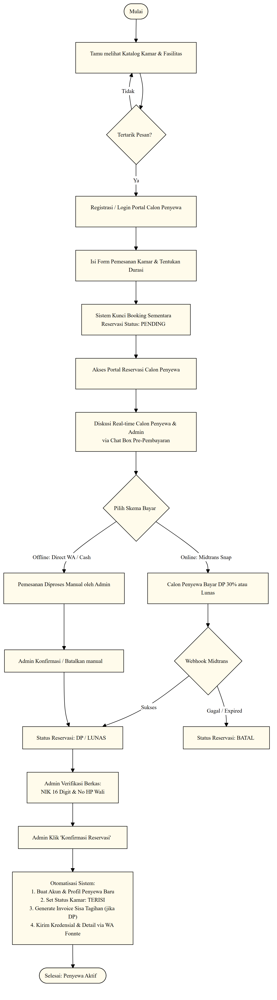

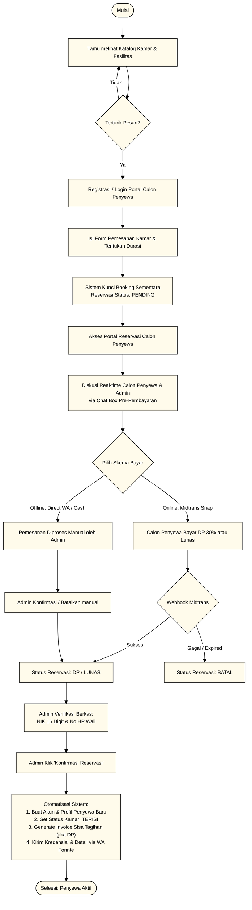

---

### 4.2. Siklus Billing Rutin & Pembayaran Tagihan Penyewa
*Berkas skrip: [`Blueprint/erd/alur_siklus_billing.mmd`](file:///c:/xampp/htdocs/asri-boarding-house/Blueprint/erd/alur_siklus_billing.mmd)*

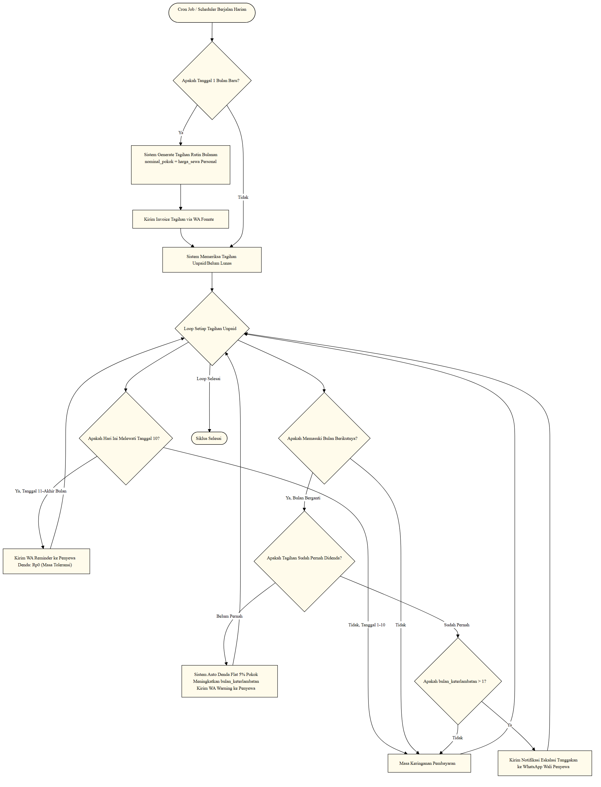

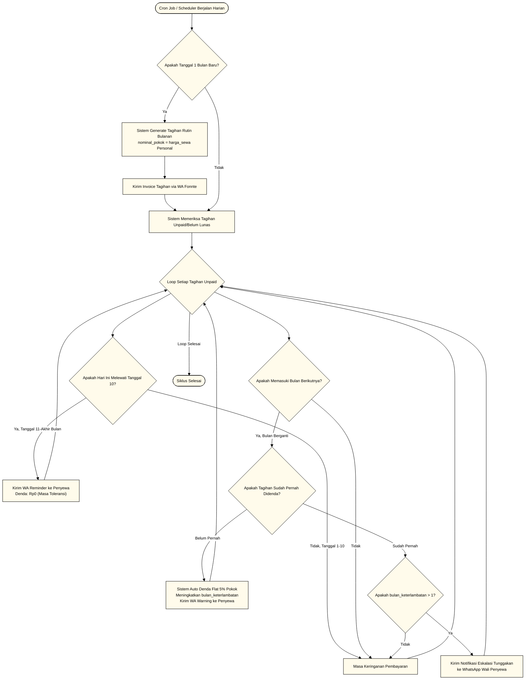

---

### 4.3. Alur Pengaduan Keluhan & Perbaikan Fasilitas
*Berkas skrip: [`Blueprint/erd/alur_pengaduan_keluhan.mmd`](file:///c:/xampp/htdocs/asri-boarding-house/Blueprint/erd/alur_pengaduan_keluhan.mmd)*

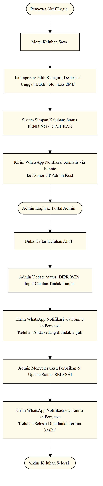

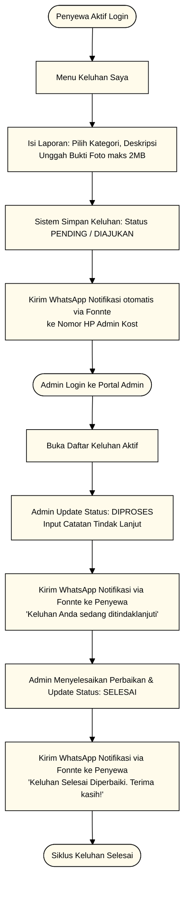

---

### 4.4. Alur Integrasi Laporan Keuangan (Arus Kas / Akuntansi)
*Berkas skrip: [`Blueprint/erd/alur_integrasi_arus_kas.mmd`](file:///c:/xampp/htdocs/asri-boarding-house/Blueprint/erd/alur_integrasi_arus_kas.mmd)*

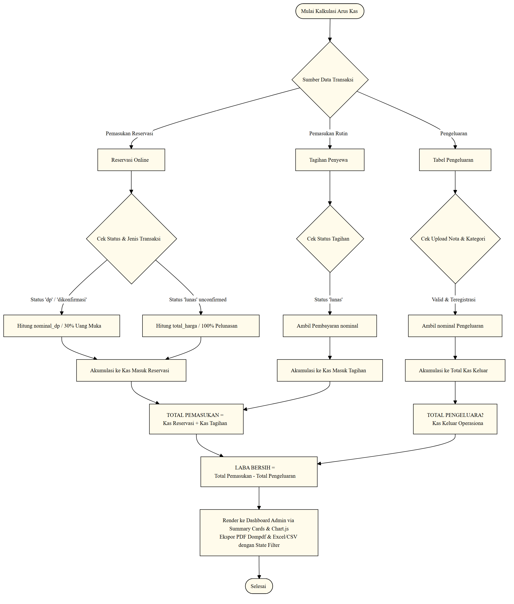

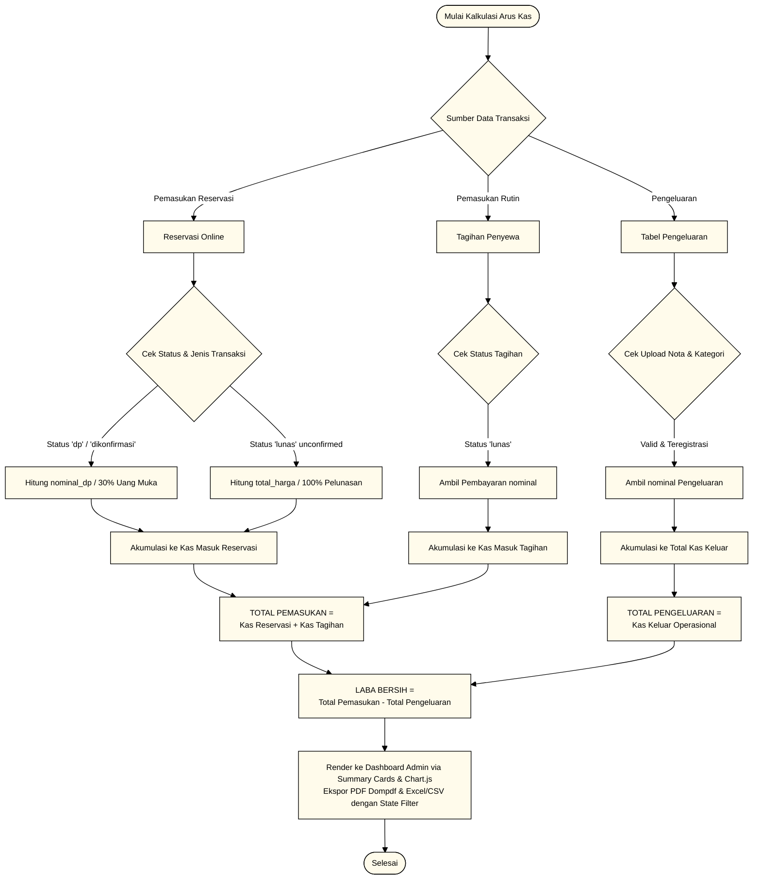

---

## 5. Ringkasan Kepatuhan Referensi & Integritas Data

### 5.1. Tabel Kebijakan Kunci Asing (Foreign Key Integrity)

| Nama Tabel Anak | Kolom FK | Tabel Induk | Kolom PK Induk | Aksi saat Baris Induk Dihapus (`ON DELETE`) | Penjelasan Bisnis |
| :--- | :--- | :--- | :--- | :--- | :--- |
| `penyewa` | `user_id` | `users` | `id` | **RESTRICT** | Akun pengguna penyewa tidak boleh dihapus jika profil sewanya masih aktif. |
| `penyewa` | `kamar_id` | `kamar` | `id` | **RESTRICT** | Kamar kost tidak boleh dihapus selama masih dihuni oleh penyewa. |
| `kamar_fasilitas` | `kamar_id` | `kamar` | `id` | **CASCADE** | Jika kamar dihapus, maka pemetaan fasilitas kamar otomatis ikut terhapus. |
| `kamar_fasilitas` | `fasilitas_id` | `fasilitas` | `id` | **CASCADE** | Jika jenis fasilitas dihapus, pemetaan fasilitas di kamar otomatis terhapus. |
| `tagihan` | `penyewa_id` | `penyewa` | `id` | **RESTRICT** | Penyewa tidak boleh dihapus jika memiliki riwayat tagihan (audit trail keuangan). |
| `pembayaran` | `tagihan_id` | `tagihan` | `id` | **RESTRICT** | Data tagihan tidak boleh dihapus jika sudah mencatat data transaksi pembayaran. |
| `pembayaran` | `dikonfirmasi_oleh` | `users` | `id` | **SET NULL** | Jika akun admin dihapus, log konfirmasi cash tetap utuh dengan nama konfirmator kosong. |
| `log_notifikasi` | `penyewa_id` | `penyewa` | `id` | **RESTRICT** | Menolak penghapusan penyewa jika masih memiliki log notifikasi untuk keperluan audit. |
| `log_notifikasi` | `tagihan_id` | `tagihan` | `id` | **SET NULL** | Mempertahankan log notifikasi tagihan walaupun tagihan dibersihkan. |
| `reservasi` | `user_id` | `users` | `id` | **RESTRICT** | Akun user tidak boleh dihapus jika memiliki riwayat pemesanan/reservasi. |
| `reservasi` | `kamar_id` | `kamar` | `id` | **RESTRICT** | Kamar master tidak boleh dihapus jika memiliki keterikatan dengan riwayat reservasi. |
| `reservasi` | `dikonfirmasi_oleh`| `users` | `id` | **SET NULL** | Menjaga riwayat reservasi tetap ada walaupun admin pengonfirmasi sudah dihapus. |
| `reservasi` | `penyewa_id` | `penyewa` | `id` | **SET NULL** | Riwayat reservasi tetap tersimpan walaupun profil penyewa dinonaktifkan/dihapus. |
| `chat_messages` | `reservasi_id` | `reservasi` | `id` | **CASCADE** | Jika data reservasi batal dihapus permanen oleh admin, chat room otomatis terhapus. |
| `chat_messages` | `sender_id` | `users` | `id` | **CASCADE** | Jika user dihapus, pesan obrolan yang bersangkutan otomatis terhapus. |
| `keluhan` | `penyewa_id` | `penyewa` | `id` | **CASCADE** | Jika data penyewa dihapus, log keluhan yang diajukan otomatis ikut dibersihkan. |
| `guest_chat_messages`| `guest_chat_thread_id` | `guest_chat_threads` | `id` | **CASCADE** | Menghapus seluruh pesan saat thread obrolan tamu dibersihkan. |
| `guest_chat_messages`| `sender_id` | `users` | `id` | **CASCADE** | Menghapus relasi pengirim jika akun admin yang membalas dihapus dari sistem. |
| `notifikasi_khusus` | `user_id` | `users` | `id` | **SET NULL** | Menjaga riwayat log notifikasi tetap utuh meskipun aktor yang memicu aksi dihapus. |
| `whatsapp_clicks` | `kamar_id` | `kamar` | `id` | **SET NULL** | Catatan tracking analitik klik WA tetap tersimpan walaupun kamar master dihapus. |

---

### 5.2. Indeks Database & Optimasi Performa Query

1. **Unique Indexes & Virtual Generated Columns (Pencegahan Duplikasi dengan Soft Delete)**:
   - `users`: Kolom virtual `active_email`, `active_no_hp`, dan `active_nik` (`CASE WHEN deleted_at IS NULL THEN ... ELSE NULL END`) dengan Unique Index.
   - `kamar`: Kolom virtual `active_nomor_kamar` dengan Unique Index untuk mencegah nomor kamar aktif ganda.
   - `penyewa`: Kolom virtual `active_nik` untuk mencegah NIK aktif ganda.
   - `reservasi`: Kolom virtual `active_order_id`.
   - `tagihan.order_id` & `guest_chat_threads.session_token`: Unique index transaksi & session token.
   - *Composite Unique Index* `uq_periode` (`penyewa_id`, `periode_bulan`, `periode_tahun`): Menjamin idempotensi penagihan bulanan.

2. **Performance Indexes (Akselerasi Query & Filter)**:
   - `kamar.status`: Mempercepat kueri pengecekan ketersediaan kamar di Landing Page.
   - `tagihan` (`[status, tanggal_jatuh_tempo]` & `[penyewa_id, status]`): Digunakan oleh scheduler Cron Job denda dan portal penyewa.
   - `keluhan` (`[penyewa_id, status]`): Mempercepat pemuatan keluhan di portal penyewa.
   - `pembayaran` (`[status_midtrans, tanggal_bayar]`): Mempercepat rekapitulasi arus kas masuk.
   - `pengeluaran` (`tanggal_pengeluaran`): Mempercepat rekapitulasi arus kas keluar.
   - `whatsapp_clicks` (`created_at`): Mempercepat pencarian statistik impresi WA.
   - `chat_messages` (`[reservasi_id, id]` & read status): Mempercepat pemuatan dan update read status obrolan.
   - `notifikasi_khusus` (`[user_id, created_at]`): Indeks komposit untuk log audit notifikasi user.

---

## 6. Struktur File Dokumentasi ERD pada Blueprint

Struktur folder artefak dokumentasi ERD telah distandarisasi di bawah subfolder [`Blueprint/erd/`](file:///c:/xampp/htdocs/asri-boarding-house/Blueprint/erd):

```
Blueprint/
├── Entity_Relationship_Diagram_Kost.md              # Dokumen Utama ERD & Kamus Data
└── erd/
    ├── diagram_erd.mmd                             # Skrip Master ERD 21 Entitas
    ├── diagram_erd.png                             # Visual Gambar Master ERD
    ├── peta_relasi_kardinalitas_global.mmd         # Peta Topologi Relasi & Kardinalitas Global
    ├── diagram_relasi_one_to_one.mmd               # Visual Khusus Relasi 1:1 (Users - Penyewa)
    ├── diagram_relasi_many_to_many.mmd             # Visual Khusus Relasi N:M Pivot (Kamar - Fasilitas)
    ├── diagram_relasi_one_to_many.mmd              # Visual Khusus Relasi 1:N (Rantai Transaksional)
    ├── erd_relasi_users_kamar_penyewa.mmd          # Skrip Sub-Sistem 1 (Users, Kamar, Penyewa)
    ├── erd_relasi_kamar_fasilitas.mmd              # Skrip Sub-Sistem 2 (Pivot Kamar-Fasilitas)
    ├── erd_relasi_billing_pembayaran.mmd           # Skrip Sub-Sistem 3 (Billing & Payment)
    ├── erd_relasi_reservasi_chat.mmd               # Skrip Sub-Sistem 4 (Reservasi & Chat)
    ├── erd_relasi_keluhan_guest_analytics.mmd      # Skrip Sub-Sistem 5 (Keluhan & Analytics)
    ├── alur_reservasi_pembayaran.mmd               # Skrip Flowchart Reservasi & Konfirmasi
    ├── alur_reservasi_pembayaran.png               # Visual Flowchart Reservasi & Konfirmasi
    ├── alur_siklus_billing.mmd                     # Skrip Flowchart Billing & Denda
    ├── alur_siklus_billing.png                     # Visual Flowchart Billing & Denda
    ├── alur_pengaduan_keluhan.mmd                  # Skrip Flowchart Pengaduan Keluhan
    ├── alur_pengaduan_keluhan.png                  # Visual Flowchart Pengaduan Keluhan
    ├── alur_integrasi_arus_kas.mmd                 # Skrip Flowchart Konsolidasi Arus Kas
    └── alur_integrasi_arus_kas.png                 # Visual Flowchart Konsolidasi Arus Kas
```

---

## 7. Inisialisasi Basis Data & Lingkungan

### 7.1. Konfigurasi Environment (`.env`)

```env
DB_CONNECTION=mysql
DB_HOST=127.0.0.1
DB_PORT=3306
DB_DATABASE=asri_kost_db
DB_USERNAME=root
DB_PASSWORD=
```

* **Collation & Engine**: Seluruh tabel di dalam database menggunakan database engine **InnoDB** dengan set karakter **`utf8mb4`** dan kolasi **`utf8mb4_unicode_ci`**.

### 7.2. Perintah Inisialisasi Basis Data

Untuk membersihkan database dan mengisi kembali seluruh struktur tabel beserta data seeder secara bersih (*fresh database initialization*):

```bash
php artisan migrate:fresh --seed
```
