# Flowchart - Asri Boarding House

Dokumen ini berisi spesifikasi **Flowchart (Diagram Alir) Final** untuk **Sistem Informasi Manajemen Kost Terintegrasi Payment Gateway pada Asri Boarding House**. Setiap diagram alur dirancang menggunakan syntax Mermaid terkini yang mematuhi standar internasional **ISO 5807 / ANSI Flowchart** (memisahkan notasi I/O `[/.../]`, Sub-Proses `[[...]]`, Keputusan `{"..."}`, Proses `["..."]`, dan Terminator `([...])`). 

Diagram ini memetakan seluruh aktivitas Tamu (Guest), Calon Penyewa, Penyewa Aktif, Administrator, serta interaksi terotomatisasi dengan sistem (Laravel Scheduler Cron, Midtrans Snap Payment Gateway, & Fonnte WhatsApp API).

---

## 1. Daftar Flowchart Terintegrasi (22 Diagram)

Berikut adalah 22 Flowchart utama dan sub-flowchart yang mendokumentasikan seluruh proses bisnis Asri Boarding House secara terperinci, matematis, dan tanpa celah logika (*airtight*):

1. **Flowchart Utama**: Siklus Hidup Pengguna End-to-End (*User Lifecycle Master Flowchart*)
2. **Sub-Flowchart 1**: Pencarian & Cek Ketersediaan Kamar (*Guest / Calon Penyewa - Include Empty State*)
3. **Sub-Flowchart 2**: Pendaftaran & Pembuatan Reservasi Kamar (*Calon Penyewa - Race Condition Guard*)
4. **Sub-Flowchart 3**: Pembayaran Reservasi, Pre-Chat, & Pembatalan Manual (*Calon Penyewa & Admin*)
5. **Sub-Flowchart 4**: Verifikasi & Konfirmasi Reservasi Baru (*Admin & Penyewa Baru - Atomic Transition*)
6. **Sub-Flowchart 5**: Siklus Billing Rutin Bulanan Otomatis (*Laravel Scheduler & Retry Engine*)
7. **Sub-Flowchart 6**: Pembayaran Tagihan Bulanan & Eskalasi Wali (*Hybrid Payment & Escalation*)
8. **Sub-Flowchart 7**: Pelaporan & Resolusi Keluhan Fasilitas (*Penyewa Aktif & Admin*)
9. **Sub-Flowchart 8**: Pencatatan Pengeluaran & Integrasi Laporan Arus Kas (*Admin / Akuntansi*)
10. **Sub-Flowchart 9**: Manajemen Konten Dinamis - FAQ, Galeri, Ulasan (*Admin*)
11. **Sub-Flowchart 10**: Manajemen Peraturan & Tata Tertib Kost (*Admin & Penyewa*)
12. **Sub-Flowchart 11**: Penonaktifan Penyewa (Checkout) & Pengelolaan Deposit (*Admin*)
13. **Sub-Flowchart 12**: Live Chat Pengunjung Anonim / Guest Chat (*Tamu & Admin*)
14. **Sub-Flowchart 13**: Keamanan Login & Force Change Password Pertama Kali (*User / Penyewa*)
15. **Sub-Flowchart 14**: Penghapusan Reservasi Batal & Pembersihan Cascade Chat (*Admin*)
16. **Sub-Flowchart 15**: Pendaftaran Penyewa Offline / WhatsApp Direct & Input Deposit (*Admin*)
17. **Sub-Flowchart 16**: Manajemen Kamar & Proteksi Penghapusan Kamar Aktif (*Admin*)
18. **Sub-Flowchart 17**: Otentikasi Laravel Socialite / Google Login & Complete Profile (*Calon Penyewa*)
19. **Sub-Flowchart 18**: Callback Webhook Midtrans & Verifikasi Signature (*Sistem & Midtrans*)
20. **Sub-Flowchart 19**: Manajemen Master Fasilitas & Proteksi Penghapusan (*Admin*)
21. **Sub-Flowchart 20**: Manajemen Penyewa & Validasi Kontrak (*Admin*)
22. **Sub-Flowchart 21**: Broadcast Notifikasi Massal & Re-send Engine (*Admin*)

---

## 1.1 Visualisasi Peta Hubungan Antar-Proses Bisnis (Process Architecture & Decision Flow Map)

Diagram berikut memetakan **hubungan antar-proses (inter-process mapping)**, keterkaitan antara 6 Fase Utama Sistem, serta percabangan keputusan kunci (*core decision flow*) yang menghubungkan seluruh 21 Sub-Flowchart di dalam sistem:

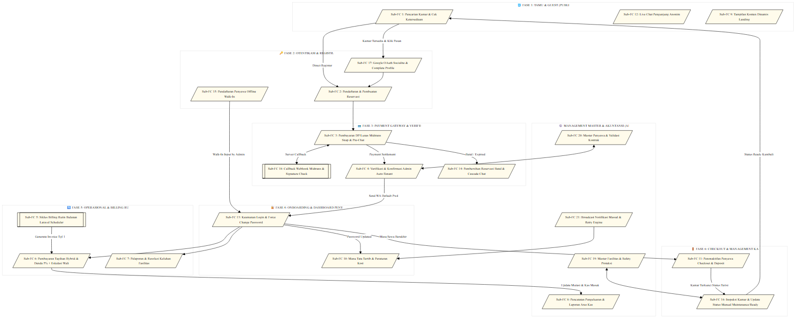

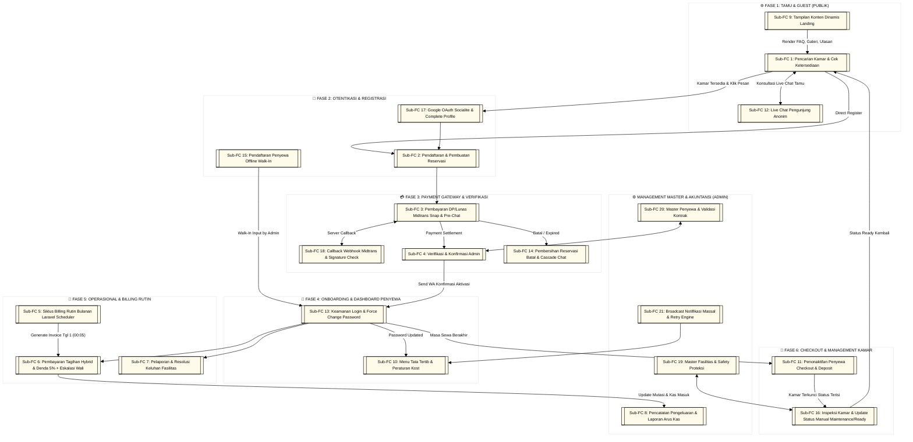
```mermaid
%%{init: {
  'theme': 'base',
  'themeVariables': {
    'primaryColor': '#FFFBEB',
    'primaryTextColor': '#000000',
    'primaryBorderColor': '#000000',
    'lineColor': '#000000',
    'secondaryColor': '#FDE047',
    'tertiaryColor': '#FFFFFF',
    'edgeLabelBackground': '#FFFFFF',
    'fontSize': '11px',
    'fontFamily': 'Inter, system-ui, sans-serif'
  }
}}%%
flowchart TB
    subgraph GUEST["🌐 FASE 1: TAMU & GUEST (PUBLIK)"]
        A1[[Sub-FC 1: Pencarian Kamar & Cek Ketersediaan]]
        A2[[Sub-FC 12: Live Chat Pengunjung Anonim]]
        A3[[Sub-FC 9: Tampilan Konten Dinamis Landing]]
    end

    subgraph AUTH["🔑 FASE 2: OTENTIKASI & REGISTRASI"]
        B1[[Sub-FC 17: Google OAuth Socialite & Complete Profile]]
        B2[[Sub-FC 2: Pendaftaran & Pembuatan Reservasi]]
        B3[[Sub-FC 15: Pendaftaran Penyewa Offline Walk-In]]
    end

    subgraph PAYMENT["💳 FASE 3: PAYMENT GATEWAY & VERIFIKASI"]
        C1[[Sub-FC 3: Pembayaran DP/Lunas Midtrans Snap & Pre-Chat]]
        C2[[Sub-FC 18: Callback Webhook Midtrans & Signature Check]]
        C3[[Sub-FC 4: Verifikasi & Konfirmasi Admin]]
        C4[[Sub-FC 14: Pembersihan Reservasi Batal & Cascade Chat]]
    end

    subgraph ONBOARDING["🔐 FASE 4: ONBOARDING & DASHBOARD PENYEWA"]
        D1[[Sub-FC 13: Keamanan Login & Force Change Password]]
        D2[[Sub-FC 10: Menu Tata Tertib & Peraturan Kost]]
    end

    subgraph CYCLIC["🔄 FASE 5: OPERASIONAL & BILLING RUTIN"]
        E1[[Sub-FC 5: Siklus Billing Rutin Bulanan Laravel Scheduler]]
        E2[[Sub-FC 6: Pembayaran Tagihan Hybrid & Denda 5% + Eskalasi Wali]]
        E3[[Sub-FC 7: Pelaporan & Resolusi Keluhan Fasilitas]]
    end

    subgraph OFFBOARDING["🚪 FASE 6: CHECKOUT & MANAGEMENT KAMAR"]
        F1[[Sub-FC 11: Penonaktifan Penyewa Checkout & Deposit]]
        F2[[Sub-FC 16: Inspeksi Kamar & Update Status Manual Maintenance/Ready]]
    end

    subgraph ADMIN_MASTER["⚙️ MANAGEMENT MASTER & AKUNTANSI (ADMIN)"]
        M1[[Sub-FC 8: Pencatatan Pengeluaran & Laporan Arus Kas]]
        M2[[Sub-FC 19: Master Fasilitas & Safety Proteksi]]
        M3[[Sub-FC 20: Master Penyewa & Validasi Kontrak]]
        M4[[Sub-FC 21: Broadcast Notifikasi Massal & Retry Engine]]
    end

    %% Keterhubungan Antar Proses %%
    A3 -->|"Render FAQ, Galeri, Ulasan"| A1
    A1 <-->|"Konsultasi Live Chat Tamu"| A2
    A1 -->|"Kamar Tersedia & Klik Pesan"| B1
    A1 -->|"Direct Register"| B2
    B1 --> B2
    B2 --> C1
    C1 <-->|"Server Callback"| C2
    C1 -->|"Payment Settlement"| C3
    C1 -->|"Batal / Expired"| C4
    
    B3 -->|"Walk-In Input by Admin"| D1
    
    C3 -->|"Send WA Konfirmasi Aktivasi"| D1
    D1 -->|"Password Updated"| D2
    D1 --> E3
    D1 --> E2
    
    E1 -->|"Generate Invoice Tgl 1 (00:05)"| E2
    E2 -->|"Update Mutasi & Kas Masuk"| M1
    
    D1 -->|"Masa Sewa Berakhir"| F1
    F1 -->|"Kamar Terkunci Status Terisi"| F2
    
    F2 -->|"Status Ready Kembali"| A1
    
    M2 <--> F2
    M3 <--> C3
    M4 --> D2
```

---

---

## 1.2 Grand Architecture: Peta Visualisasi Alur Proses & Percabangan Terintegrasi (Global Decision & Process Flow Map)

Diagram alir tingkat arsitektural (*Grand Process & Decision Flow Diagram*) di bawah ini memberikan visualisasi **menyeluruh, terstruktur, dan hierarkis** mengenai bagaimana 6 Fase Utama Sistem berinteraksi secara mulus, bagaimana setiap data berpindah antar-entitas, serta bagaimana **18 Titik Keputusan Kunci (D1 s/d D18)** dievaluasi dan diarahkan ke masing-masing Sub-Flowchart secara presisi:

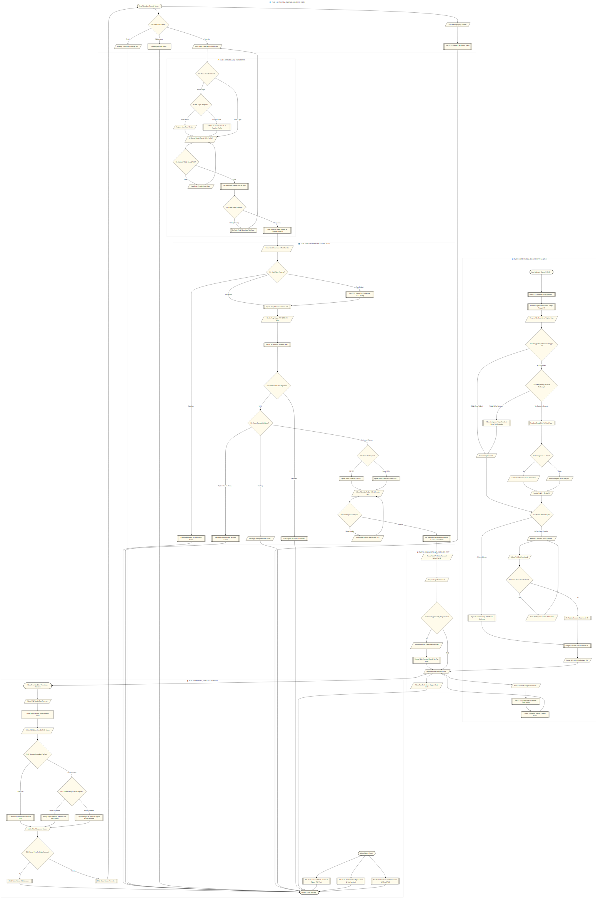

```mermaid
%%{init: {
  'theme': 'base',
  'themeVariables': {
    'primaryColor': '#FFFBEB',
    'primaryTextColor': '#000000',
    'primaryBorderColor': '#000000',
    'lineColor': '#000000',
    'secondaryColor': '#FDE047',
    'tertiaryColor': '#FFFFFF',
    'edgeLabelBackground': '#FFFFFF',
    'fontSize': '12px',
    'fontFamily': 'Inter, system-ui, sans-serif'
  }
}}%%
flowchart TB
    %% ==========================================
    %% FASE 1: PENEMUAN & KATALOG PUBLIK
    %% ==========================================
    subgraph FASE1["🌐 FASE 1: KATALOG & EKSPLORASI (GUEST / PUBLIK)"]
        StartNode([Tamu Mengakses Beranda /kamar]) --> D_RoomStatus{"D1: Status Unit Kamar?"}
        
        D_RoomStatus -- "Maintenance" --> HideRoom["Sembunyikan dari Publik"]
        D_RoomStatus -- "Terisi" --> CTAChatAdmin[/Hubungi Admin via WhatsApp WA/]
        D_RoomStatus -- "Tersedia" --> ViewDetail[/Buka Detail Kamar & Kalkulator Tarif/]
        
        StartNode --> GuestChatWidget[/Live Chat Pengunjung Anonim/]
        GuestChatWidget --> GuestChatSub[[Sub-FC 12: Thread Chat Session Token]]
    end

    %% ==========================================
    %% FASE 2: OTENTIKASI & RESERVASI
    %% ==========================================
    subgraph FASE2["🔑 FASE 2: OTENTIKASI & FORM RESERVASI"]
        ViewDetail --> D_AuthMethod{"D2: Status Otentikasi User?"}
        
        D_AuthMethod -- "Belum Login" --> ChoiceAuth{"Pilihan Login / Register?"}
        ChoiceAuth -- "Form Manual" --> FormAuth[/Register Akun Baru / Login/]
        ChoiceAuth -- "Google OAuth" --> GoogleAuth[[Sub-FC 17: Socialite OAuth & Complete Profile]]
        
        FormAuth --> ReserveForm[/Isi Tanggal Mulai, Durasi, NIK, No Wali/]
        GoogleAuth --> ReserveForm
        D_AuthMethod -- "Sudah Login" --> ReserveForm
        
        ReserveForm --> D_FormValidation{"D3: Validasi NIK & Kontak Wali?"}
        D_FormValidation -- "Gagal" --> ToastValError[/Toast Error: Perbaiki Input Data/]
        ToastValError --> ReserveForm
        
        D_FormValidation -- "Lolos" --> DB_LockTx[[DB Transaction: Kamar lockForUpdate]]
        DB_LockTx --> D_RaceCondition{"D4: Kamar Masih Tersedia?"}
        
        D_RaceCondition -- "Tidak (Bentrok)" --> RollbackBooking[[Rollback Tx & Munculkan Notifikasi]]
        RollbackBooking --> ViewDetail
        
        D_RaceCondition -- "Ya (Aman)" --> CreateReservation[[Buat Reservasi Status Pending & Generate Order ID]]
    end

    %% ==========================================
    %% FASE 3: PAYMENT GATEWAY & VERIFIKASI
    %% ==========================================
    subgraph FASE3["💳 FASE 3: MIDTRANS SNAP & VERIFIKASI ADMIN"]
        CreateReservation --> PortalReservation[/Portal Detail Reservasi & Pre-Chat Box/]
        PortalReservation --> D_UserAction{"D5: Aksi Calon Penyewa?"}
        
        D_UserAction -- "Batalkan" --> UserCancel[[Update Status Batal & Lepas Kunci Kamar]]
        D_UserAction -- "Chat Diskusi" --> PreChatSub[[Sub-FC 3: Diskusi Pre-Pembayaran AJAX Polling]]
        D_UserAction -- "Bayar Now" --> RequestSnap[[Request Snap Token ke Midtrans API]]
        PreChatSub --> RequestSnap
        
        RequestSnap --> OpenSnapUI[/Render Snap Popup: VA / QRIS / E-Wallet/]
        OpenSnapUI --> MidtransWebhook[[Sub-FC 18: Webhook Midtrans POST]]
        
        MidtransWebhook --> D_SignatureCheck{"D6: Verifikasi SHA512 Signature?"}
        D_SignatureCheck -- "Mismatch" --> RejectWebhook[[Tolak Request: HTTP 403 Forbidden]]
        
        D_SignatureCheck -- "Valid" --> D_MidtransStatus{"D7: Status Transaksi Midtrans?"}
        D_MidtransStatus -- "Expire / Cancel / Deny" --> AutoCancelBooking[[Set Status Reservasi Batal & Lepas Kamar]]
        D_MidtransStatus -- "Pending" --> WaitMidtrans[/Menunggu Pembayaran Max 24 Jam/]
        
        D_MidtransStatus -- "Settlement / Capture" --> D_PayScheme{"D8: Skema Pembayaran?"}
        D_PayScheme -- "DP 30%" --> SetStatusDP[[Update Status Reservasi: DP 30%]]
        D_PayScheme -- "Lunas 100%" --> SetStatusLunas[[Update Status Reservasi: Lunas 100%]]
        
        SetStatusDP --> AdminReview[/Admin Meninjau Berkas NIK & Kontak Wali/]
        SetStatusLunas --> AdminReview
        
        AdminReview --> D_AdminVerify{"D9: Data Penyewa Disetujui?"}
        D_AdminVerify -- "Minta Koreksi" --> RequestCorrection[/Kirim Pesan Revisi Data via Chat / WA/]
        RequestCorrection --> AdminReview
        
        D_AdminVerify -- "Disetujui" --> AdminConfirmTx[[DB Transaction: Konfirmasi Reservasi & Kunci Kamar Terisi]]
    end

    %% ==========================================
    %% FASE 4: ONBOARDING & AKTIVASI AKUN
    %% ==========================================
    subgraph FASE4["🔐 FASE 4: ONBOARDING & DASHBOARD PENYEWA"]
        AdminConfirmTx --> SendWACredential[/Fonnte WA API: Kirim Password Default No HP/]
        SendWACredential --> TenantFirstLogin[/Penyewa Login Pertama Kali/]
        
        TenantFirstLogin --> D_ForcePwd{"D10: require_password_change == true?"}
        D_ForcePwd -- "Ya" --> ForceChangePage[/Redirect Paksa ke Form Ganti Password/]
        ForceChangePage --> UpdateNewPwd[[Simpan Hash Password Baru & Set Flag False]]
        UpdateNewPwd --> TenantDashboard[/Dashboard Portal Penyewa Aktif/]
        D_ForcePwd -- "Tidak" --> TenantDashboard
        
        TenantDashboard --> RulesView[/Menu Tata Tertib Kost - Support Dark Mode/]
    end

    %% ==========================================
    %% FASE 5: OPERASIONAL, BILLING & KELUHAN
    %% ==========================================
    subgraph FASE5["🔄 FASE 5: OPERASIONAL, BILLING RUTIN & KELUHAN"]
        CronTrigger([Cron Scheduler Tanggal 1 00:00]) --> BillingCommand[[Sub-FC 5: Command billing:generate]]
        BillingCommand --> CreateInvoices[[Generate Tagihan Pokok Jatuh Tempo Tanggal 10]]
        CreateInvoices --> TenantPayTagihan[/Penyewa Membuka Menu Tagihan Saya/]
        
        TenantPayTagihan --> D_OverdueCheck{"D11: Tanggal Bayar Melewati Tanggal 10?"}
        D_OverdueCheck -- "Tidak (Tepat Waktu)" --> NormalRate[/Nominal Tagihan Pokok/]
        
        D_OverdueCheck -- "Ya (Terlambat)" --> D_CrossMonth{"D12: Menyeberang ke Bulan Berikutnya?"}
        D_CrossMonth -- "Tidak (Bulan Berjalan)" --> GracePeriod[[Masa Keringanan: Tanpa Denda & Kirim WA Reminder]]
        GracePeriod --> NormalRate
        
        D_CrossMonth -- "Ya (Bulan Berikutnya)" --> ApplyPenalty[[Terapkan Denda Flat 5% Sekali Saja]]
        ApplyPenalty --> D_TunggakanLanjut{"D13: Tunggakan > 1 Bulan?"}
        D_TunggakanLanjut -- "Ya" --> EscalateGuardian[/Kirim Pesan Eskalasi WA ke Nomor Wali/]
        D_TunggakanLanjut -- "Tidak" --> SendWarningWA[/Kirim Peringatan WA ke Penyewa/]
        EscalateGuardian --> RatePlusPenalty[/Nominal Pokok + Denda 5%/]
        SendWarningWA --> RatePlusPenalty
        
        NormalRate --> D_PaymentMethod{"D14: Pilihan Metode Bayar?"}
        RatePlusPenalty --> D_PaymentMethod
        
        D_PaymentMethod -- "Online Midtrans" --> PayOnlineSnap[[Bayar via Midtrans Snap & Webhook Settlement]]
        D_PaymentMethod -- "Offline Cash / Transfer" --> SubmitOfflineDoc[/Serahkan Cash Fisik / Bukti Transfer/]
        
        SubmitOfflineDoc --> AdminCheckCash[/Admin Verifikasi Kas Masuk/]
        AdminCheckCash --> D_CashValid{"D15: Dana Fisik / Transfer Valid?"}
        D_CashValid -- "Tidak" --> RejectCash[/Tolak Pembayaran & Minta Bukti Valid/]
        D_CashValid -- "Ya" --> ConfirmCash[[Set Tagihan Lunas & Catat Admin ID]]
        
        PayOnlineSnap --> GenReceipt[[Dompdf: Generate Nota Kuitansi PDF]]
        ConfirmCash --> GenReceipt
        GenReceipt --> SendWAReceipt[/Fonnte WA API: Kirim Kuitansi PDF/]
        
        TenantDashboard --> ComplaintMenu[/Menu Keluhan & Pengaduan Fasilitas/]
        ComplaintMenu --> SubmitComplaint[[Sub-FC 7: Upload Bukti Keluhan & Notif Admin]]
        SubmitComplaint --> AdminResolveComplaint[[Admin Koordinasi Teknisi -> Status Selesai]]
    end

    %% ==========================================
    %% FASE 6: OFFBOARDING & MANAGEMENT MASTER
    %% ==========================================
    subgraph FASE6["🚪 FASE 6: CHECKOUT, DEPOSIT & MASTER DATA"]
        TenantDashboard --> EndOfLease([Masa Sewa Berakhir / Permintaan Checkout])
        EndOfLease --> AdminCheckoutAction[/Admin Klik Nonaktifkan Penyewa/]
        AdminCheckoutAction --> LockRoomTerisi["Aturan Bisnis: Kamar Tetap Berstatus Terisi"]
        
        LockRoomTerisi --> PhysicalInspection[/Admin Melakukan Inspeksi Fisik Kamar/]
        PhysicalInspection --> D_DamageCheck{"D16: Terdapat Kerusakan Fasilitas?"}
        
        D_DamageCheck -- "Tidak Ada" --> ReturnFullDeposit[[Kembalikan Deposit Jaminan Penuh 100%]]
        D_DamageCheck -- "Ada Kerusakan" --> D_CostVsDeposit{"D17: Estimasi Biaya > Nilai Deposit?"}
        
        D_CostVsDeposit -- "Biaya <= Deposit" --> DeductDeposit[[Potong Biaya Perbaikan & Kembalikan Sisa Deposit]]
        D_CostVsDeposit -- "Biaya > Deposit" --> ForfeitDeposit[[Deposit Hangus & Terbitkan Tagihan Klaim Tambahan]]
        
        ReturnFullDeposit --> AdminManualRoomStatus[/Admin Buka Manajemen Kamar/]
        DeductDeposit --> AdminManualRoomStatus
        ForfeitDeposit --> AdminManualRoomStatus
        
        AdminManualRoomStatus --> D_RoomNextState{"D18: Kamar Perlu Perbaikan Lanjutan?"}
        D_RoomNextState -- "Ya" --> SetMaintState[[Ubah Status Kamar: Maintenance]]
        D_RoomNextState -- "Tidak" --> SetReadyState[[Ubah Status Kamar: Tersedia]]
        
        SetMaintState --> EndNode([Selesai / Siklus Berulang])
        SetReadyState --> StartNode
        
        %% Admin Master & Akuntansi %%
        AdminDashboard([Admin Master Control]) --> CashFlowSub[[Sub-FC 8: Arus Kas Masuk - Keluar & Ekspor PDF/Excel]]
        AdminDashboard --> MasterSafetySub[[Sub-FC 16 & 19: Proteksi Hapus Kamar & Fasilitas Aktif]]
        AdminDashboard --> BroadcastSub[[Sub-FC 21: Broadcast Notifikasi Massal WA/Email/Web]]
    end

    %% KONEKTOR LINTAS FASE %%
    UserCancel --> EndNode
    AutoCancelBooking --> EndNode
    CTAChatAdmin --> EndNode
    HideRoom --> EndNode
    GuestChatSub --> EndNode
    WaitMidtrans --> EndNode
    RejectWebhook --> EndNode
    RulesView --> EndNode
    RejectCash --> SubmitOfflineDoc
    AdminResolveComplaint --> TenantDashboard
    SendWAReceipt --> TenantDashboard
    CashFlowSub --> EndNode
    MasterSafetySub --> EndNode
    BroadcastSub --> EndNode
```

### 1.2.1 Matriks 18 Titik Keputusan Logika Kunci (Key Decision Flow Matrix)

Tabel berikut merinci setiap percabangan keputusan (*Decision Point*) yang digambarkan pada diagram arsitektur di atas:

| Kode Keputusan | Lokasi / Fase | Kondisi Evaluasi (*Condition Evaluated*) | Cabang Alur (*Branching*) | Tindakan Sistem (*System Action & Destination*) | Ref. Sub-FC |
| :--- | :--- | :--- | :--- | :--- | :--- |
| **D1** | Fase 1 (Publik) | Status ketersediaan kamar di katalog | `Maintenance` / `Terisi` / `Tersedia` | Sembunyikan unit / Tampilkan CTA WA / Buka detail form reservasi | Sub-FC 1 |
| **D2** | Fase 2 (Auth) | Sesi otentikasi calon penyewa | `Belum Login` vs `Sudah Login` | Arahkan ke Form Login/Register atau Google OAuth vs Lanjut form | Sub-FC 17 |
| **D3** | Fase 2 (Auth) | Validasi format NIK & Nomor Telepon Wali | `Gagal` vs `Lolos` | Munculkan Toast Error validation vs Buka transaksi basis data | Sub-FC 2 |
| **D4** | Fase 2 (Auth) | Cek konkurensi kamar (`lockForUpdate`) | `Bentrok` vs `Tersedia` | Rollback DB & toast notifikasi vs Buat reservasi status pending | Sub-FC 2 |
| **D5** | Fase 3 (Payment)| Pilihan interaksi calon penyewa | `Batalkan` / `Chat` / `Bayar Now` | Set status batal & lepas kamar / AJAX Polling / Request Snap Token | Sub-FC 3 |
| **D6** | Fase 3 (Payment)| Verifikasi HMAC SHA-512 Midtrans | `Mismatch` vs `Valid` | Tolak webhook HTTP 403 Forbidden vs Lanjut routing payload | Sub-FC 18 |
| **D7** | Fase 3 (Payment)| Status transaksi dari Midtrans callback | `Settlement` / `Pending` / `Expired`| Update status bayar / Tunggu 24 jam / Auto-cancel & lepas kamar | Sub-FC 18 |
| **D8** | Fase 3 (Payment)| Skema pembayaran reservasi | `DP 30%` vs `Lunas 100%` | Update status reservasi 'dp' vs 'lunas' & simpan mutasi | Sub-FC 3, 4 |
| **D9** | Fase 3 (Payment)| Verifikasi berkas NIK & data oleh Admin | `Minta Koreksi` vs `Disetujui` | Kirim chat/WA revisi data vs DB transaction konfirmasi aktivasi | Sub-FC 4 |
| **D10** | Fase 4 (Security)| Flag `require_password_change` user | `True` vs `False` | Intercept paksa ke form ganti sandi vs Akses dashboard penuh | Sub-FC 13 |
| **D11** | Fase 5 (Billing)| Tanggal pembayaran tagihan bulanan | `<= Tgl 10` vs `> Tgl 10` | Tagihan nominal pokok biasa vs Evaluasi keterlambatan denda | Sub-FC 6 |
| **D12** | Fase 5 (Billing)| Penyeberangan bulan kalender | `Bulan Berjalan` vs `Bulan Baru` | Masa keringanan (tanpa denda) vs Terapkan denda flat 5% | Sub-FC 6 |
| **D13** | Fase 5 (Billing)| Durasi akumulasi tunggakan tagihan | `Tunggakan > 1 Bulan` | Kirim pesan peringatan eskalasi darurat ke nomor WhatsApp Wali | Sub-FC 6 |
| **D14** | Fase 5 (Billing)| Saluran metode pembayaran tagihan | `Online Snap` vs `Offline Cash`| Render Midtrans modal vs Serahkan cash / bukti transfer fisik | Sub-FC 6 |
| **D15** | Fase 5 (Billing)| Validasi penerimaan dana fisik/transfer | `Tidak Valid` vs `Valid` | Admin tolak pembayaran & revisi vs Admin set tagihan lunas | Sub-FC 6 |
| **D16** | Fase 6 (Checkout)| Temuan kerusakan saat inspeksi fisik | `Tidak Ada` vs `Ada Kerusakan` | Kembalikan deposit 100% penuh vs Evaluasi biaya perbaikan | Sub-FC 11 |
| **D17** | Fase 6 (Checkout)| Komparasi biaya perbaikan vs deposit | `Biaya <= Deposit` vs `Biaya > Deposit`| Potong biaya & kembalikan sisa saldo vs Hangus 100% & klaim ganti rugi | Sub-FC 11 |
| **D18** | Fase 6 (Room) | Kebutuhan renovasi fisik kamar | `Perlu Perbaikan` vs `Siap Huni`| Ubah status kamar 'maintenance' vs 'tersedia' untuk publik | Sub-FC 11, 16 |

---

## 1.3 Diagram Visualisasi Alur Proses & Percabangan Keputusan Terpadu (Unified Process & Decision Flow Diagram)

Diagram alir terpadu (*Unified Process & Decision Flow Diagram*) di bawah ini memadukan **hubungan antar-proses (inter-process relationships)** dan **18 titik keputusan logika kunci (decision flow D1 s/d D18)** ke dalam tata letak 6 Fase Bisnis yang terstruktur, berurutan, dan mudah dipahami:

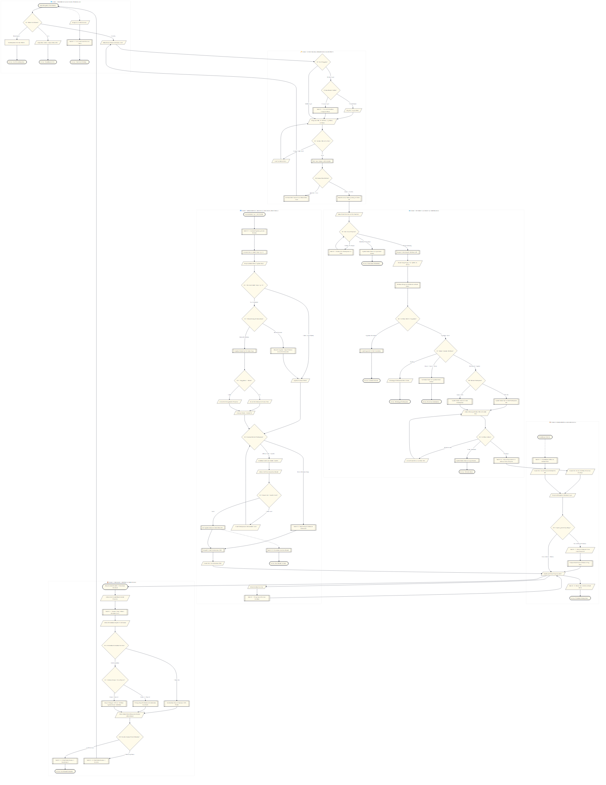

`mermaid
%%{init: {
  'theme': 'base',
  'themeVariables': {
    'primaryColor': '#FFFBEB',
    'primaryTextColor': '#0F172A',
    'primaryBorderColor': '#0F172A',
    'lineColor': '#0F172A',
    'secondaryColor': '#FEF08A',
    'tertiaryColor': '#FFFFFF',
    'edgeLabelBackground': '#FFFFFF',
    'fontSize': '12px',
    'fontFamily': 'Inter, system-ui, sans-serif'
  }
}}%%
flowchart TB
    %% ========================================================
    %% FASE 1: PENEMUAN & KATALOG PUBLIK
    %% ========================================================
    subgraph FASE1["🌐 FASE 1: PENEMUAN & KATALOG PUBLIK (GUEST)"]
        StartNode([Tamu Mengakses Web /kamar]) --> D1{"D1: Status Unit Kamar?"}
        
        D1 -- "Maintenance" --> P_Hide["Sembunyikan Unit dari Publik"]
        D1 -- "Terisi" --> P_CTAWA[/Tampilkan Tombol 'Tanya Admin WA'/]
        D1 -- "Tersedia" --> P_Detail[/Buka Detail Kamar & Estimasi Tarif/]
        
        StartNode -.-> P_GuestChat[/Widget Live Chat Anonim/]
        P_GuestChat --> SubFC12[[Sub-FC 12: Live Chat Guest Session Token]]
        
        P_Hide --> TermF1_Hide([Selesai: Unit Disembunyikan])
        P_CTAWA --> TermF1_WA([Selesai: Diarahkan ke WA])
        SubFC12 --> TermF1_Chat([Selesai: Chat Guest Ditutup])
    end

    %% ========================================================
    %% FASE 2: OTENTIKASI & FORM RESERVASI
    %% ========================================================
    subgraph FASE2["🔑 FASE 2: OTENTIKASI & RESERVASI (CALON PENYEWA)"]
        P_Detail --> D2{"D2: Sesi Pengguna?"}
        
        D2 -- "Belum Login" --> ChoiceAuth{"Pilihan Masuk / Daftar?"}
        ChoiceAuth -- "Form Manual" --> FormManual[/Register / Login Akun/]
        ChoiceAuth -- "Google Login" --> SubFC17[[Sub-FC 17: Socialite OAuth & Complete Phone]]
        
        FormManual --> FormReservasi[/Pengisian NIK, No HP Wali, Tgl Mulai, & Durasi/]
        SubFC17 --> FormReservasi
        D2 -- "Sudah Login" --> FormReservasi
        
        FormReservasi --> D3{"D3: Validasi NIK & No Wali?"}
        D3 -- "Format Tidak Valid" --> ToastError[/Toast Validation Error/]
        ToastError --> FormReservasi
        
        D3 -- "Valid" --> LockDB[[DB Trans: Kamar lockForUpdate]]
        LockDB --> D4{"D4: Kamar Masih Bebas?"}
        
        D4 -- "Bentrok / Terisi" --> RollbackDB[[Rollback DB Transaction & Munculkan Toast]]
        RollbackDB --> P_Detail
        
        D4 -- "Aman / Tersedia" --> CreatePending[[Buat Reservasi Status 'pending' & Order ID]]
    end

    %% ========================================================
    %% FASE 3: MIDTRANS SNAP & VERIFIKASI ADMIN
    %% ========================================================
    subgraph FASE3["💳 FASE 3: PAYMENT GATEWAY & VERIFIKASI ADMIN"]
        CreatePending --> DetailReservasi[/Buka Portal Reservasi & Pre-Chat Box/]
        
        DetailReservasi --> D5{"D5: Aksi Calon Penyewa?"}
        D5 -- "Diskusi Pre-Bayar" --> SubFC3_Chat[[Sub-FC 3: Diskusi Pre-Pembayaran via Chat]]
        SubFC3_Chat --> D5
        
        D5 -- "Batalkan Pemesanan" --> UserBatal[[Update Status 'batal' & Lepas Kunci Kamar]]
        UserBatal --> TermF3_Batal([Selesai: Pemesanan Dibatalkan])
        
        D5 -- "Bayar Sekarang" --> SnapReq[[Request Token Snap ke Midtrans API]]
        SnapReq --> SnapPopup[/Render Snap Popup: VA / QRIS / E-Wallet/]
        SnapPopup --> WebhookCall[[Midtrans Mengirim Webhook Callback POST]]
        
        WebhookCall --> D6{"D6: Verifikasi SHA512 Signature?"}
        D6 -- "Signature Mismatch" --> RejectWH[[Tolak Request HTTP 403 Forbidden]]
        RejectWH --> TermF3_Reject([Selesai: Callback Ditolak])
        
        D6 -- "Signature Valid" --> D7{"D7: Status Transaksi Midtrans?"}
        D7 -- "Pending" --> WaitPay[/Menunggu Pembayaran Max 24 Jam/]
        WaitPay --> TermF3_Wait([Selesai: Menunggu Pembayaran])
        D7 -- "Expire / Cancel / Deny" --> AutoBatal[[Set Status 'batal' & Lepaskan Kunci Kamar]]
        AutoBatal --> TermF3_Expired([Selesai: Reservasi Kadaluarsa])
        
        D7 -- "Settlement / Capture" --> D8{"D8: Skema Pembayaran?"}
        D8 -- "DP 30%" --> SetDP[[Update Status 'dp' & Catat Pembayaran DP]]
        D8 -- "Lunas 100%" --> SetLunas[[Update Status 'lunas' & Catat Pembayaran]]
        
        SetDP --> AdminReview[/Admin Meninjau Berkas NIK & Kontak Wali/]
        SetLunas --> AdminReview
        
        AdminReview --> D9{"D9: Verifikasi Admin?"}
        D9 -- "Minta Koreksi" --> ReqRevisi[/Kirim Pesan Revisi via Chat / WA/]
        ReqRevisi --> AdminReview
        D9 -- "Tolak / Batalkan" --> AdminReject[[Update Status 'batal' & Lepas Kamar]]
        AdminReject --> TermF3_AdminBatal([Selesai: Ditolak Admin])
        
        D9 -- "Disetujui" --> ConfirmTx[[Sub-FC 4: TransisiPenyewaService Aktivasi Profil Penyewa]]
    end

    %% ========================================================
    %% FASE 4: ONBOARDING & DASHBOARD PENYEWA
    %% ========================================================
    subgraph FASE4["🔐 FASE 4: ONBOARDING & KEAMANAN AKUN"]
        ConfirmTx --> SendNotifAktif[/Fonnte WA: Kirim Notifikasi Reservasi Disetujui/]
        
        %% Jalur Alternatif Walk-in Offline %%
        WalkInStart([Pendaftaran Walk-In]) -.-> SubFC15[[Sub-FC 15: Pendaftaran Offline & Default Pwd]]
        SubFC15 --> SendWACreds[/Fonnte WA: Kirim Password Default No HP/]
        
        SendNotifAktif --> TenantLogin[/Penyewa Mengakses Halaman Login/]
        SendWACreds --> TenantLogin
        
        TenantLogin --> D10{"D10: require_password_change?"}
        D10 -- "True (Walk-In Pertama)" --> ForcePwd[/Sub-FC 13: Redirect Paksa ke Form Ganti Password/]
        ForcePwd --> SaveNewPwd[[Simpan Hash Password Baru & Flag = false]]
        SaveNewPwd --> DashboardPenyewa[/Dashboard Portal Penyewa Aktif/]
        
        D10 -- "False (Online / Rutin)" --> DashboardPenyewa
        DashboardPenyewa --> MenuTataTertib[/Sub-FC 10: Menu Tata Tertib Kost Dark Mode/]
        MenuTataTertib --> TermF4_TataTertib([Selesai: Peraturan Ditampilkan])
    end

    %% ========================================================
    %% FASE 5: OPERASIONAL, BILLING & KELUHAN
    %% ========================================================
    subgraph FASE5["🔄 FASE 5: OPERASIONAL, BILLING & KELUHAN (PENYEWA AKTIF)"]
        CronBulan([Cron Scheduler Tgl 1, 00:05 WIB]) --> SubFC5[[Sub-FC 5: Command tagihan:generate-bulanan]]
        SubFC5 --> InvoicesGenerated[[Generate Invoice Jatuh Tempo Tgl 10]]
        
        InvoicesGenerated --> MenuTagihan[/Penyewa Buka Menu 'Tagihan Saya'/]
        
        MenuTagihan --> D11{"D11: Melewati Jatuh Tempo Tgl 10?"}
        D11 -- "Tidak (Tepat Waktu)" --> TagihanPokok[/Tagihan Nominal Pokok/]
        
        D11 -- "Ya (Terlambat)" --> D12{"D12: Menyeberang ke Bulan Baru?"}
        D12 -- "Bulan Berjalan" --> MasaKeringanan[[Masa Keringanan: Tanpa Denda & Kirim WA Reminder]]
        MasaKeringanan --> TagihanPokok
        
        D12 -- "Bulan Berikutnya" --> ApplyDenda[[Terapkan Denda Flat 5% Sekali Saja]]
        ApplyDenda --> D13{"D13: Tunggakan > 1 Bulan?"}
        D13 -- "Ya" --> EskalasiWali[/Kirim WA Eskalasi ke Nomor Wali/]
        D13 -- "Tidak" --> WarningTenant[/Kirim WA Peringatan ke Penyewa/]
        EskalasiWali --> TagihanPlusDenda[/Nominal Pokok + Denda 5%/]
        WarningTenant --> TagihanPlusDenda
        
        TagihanPokok --> D14{"D14: Saluran Metode Pembayaran?"}
        TagihanPlusDenda --> D14
        
        D14 -- "Online Midtrans Snap" --> SnapBill[[Sub-FC 6: Bayar Snap & Webhook Settlement]]
        D14 -- "Offline Cash / Transfer" --> InputManualDoc[/Serahkan Cash Fisik / Bukti Transfer/]
        
        InputManualDoc --> AdminCekFisik[/Admin Cek Penerimaan Kas Masuk/]
        AdminCekFisik --> D15{"D15: Dana Fisik / Transfer Valid?"}
        D15 -- "Tidak Valid" --> TolakOffline[/Tolak Pembayaran & Minta Bukti Valid/]
        TolakOffline --> D14
        
        D15 -- "Valid" --> AdminKonfirmasiCash[[Set Tagihan Lunas & Catat Admin ID]]
        
        SnapBill --> GenPDF[[Dompdf: Cetak Nota Kuitansi PDF]]
        AdminKonfirmasiCash --> GenPDF
        GenPDF --> SendWAReceipt[/Fonnte WA: Kirim Kuitansi PDF/]
        SendWAReceipt --> DashboardPenyewa
        
        %% Keluhan Fasilitas %%
        DashboardPenyewa --> MenuKeluhan[/Menu Keluhan Fasilitas/]
        MenuKeluhan --> SubFC7[[Sub-FC 7: Pelaporan & Resolusi Keluhan]]
        SubFC7 --> DashboardPenyewa
        
        %% Integrasi Akuntansi %%
        AdminKonfirmasiCash -.-> SubFC8[[Sub-FC 8: Pencatatan Arus Kas Masuk]]
        SubFC8 --> TermF5_Akuntansi([Selesai: Kas Masuk Tercatat])
    end

    %% ========================================================
    %% FASE 6: CHECKOUT, DEPOSIT & SIKLUS KAMAR
    %% ========================================================
    subgraph FASE6["🚪 FASE 6: CHECKOUT, DEPOSIT & SIKLUS KAMAR"]
        DashboardPenyewa --> MasaHabis([Masa Kontrak Berakhir / Permintaan Checkout])
        MasaHabis --> AdminCheckout[/Admin Klik Nonaktifkan Kontrak Penyewa/]
        AdminCheckout --> LockKamarTetapTerisi[[Sub-FC 11: Kamar Tetap Terkunci Berstatus 'terisi']]
        
        LockKamarTetapTerisi --> InspeksiKamar[/Admin Melakukan Inspeksi Fisik Kamar/]
        InspeksiKamar --> D16{"D16: Ditemukan Kerusakan Fasilitas?"}
        
        D16 -- "Tidak Ada" --> BalikDeposit100[[Kembalikan Deposit Jaminan 100% Penuh]]
        D16 -- "Ada Kerusakan" --> D17{"D17: Estimasi Biaya > Nilai Deposit?"}
        
        D17 -- "Biaya <= Deposit" --> PotongSebagian[[Potong Biaya Perbaikan & Kembalikan Sisa Saldo]]
        D17 -- "Biaya > Deposit" --> HangusKlaim[[Deposit Hangus 100% & Terbitkan Tagihan Klaim Tambahan]]
        
        BalikDeposit100 --> AdminKelolaKamar[/Admin Buka Menu Manajemen Kamar /admin/kamar/]
        PotongSebagian --> AdminKelolaKamar
        HangusKlaim --> AdminKelolaKamar
        
        AdminKelolaKamar --> D18{"D18: Kondisi Kamar Perlu Perbaikan?"}
        D18 -- "Ya (Renovasi)" --> SetMaintenance[[Sub-FC 16: Ubah Status Kamar -> 'maintenance']]
        D18 -- "Tidak (Siap Huni)" --> SetTersedia[[Sub-FC 16: Ubah Status Kamar -> 'tersedia']]
        
        SetMaintenance --> TermF6_Maint([Selesai: Unit Masuk Perbaikan])
        SetTersedia --> StartNode
    end
`## 2. Detail Visualisasi & Alur Flowchart (Mermaid)

### 2.1. Flowchart Utama: Siklus Hidup Pengguna End-to-End (Master Flowchart)
* **Controller Terkait**: Seluruh Controller Utama (Public, Auth, Penyewa, & Admin)
* **Model Terkait**: [User](file:///c:/xampp/htdocs/asri-boarding-house/app/Models/User.php), [Kamar](file:///c:/xampp/htdocs/asri-boarding-house/app/Models/Kamar.php), [Penyewa](file:///c:/xampp/htdocs/asri-boarding-house/app/Models/Penyewa.php), [Reservasi](file:///c:/xampp/htdocs/asri-boarding-house/app/Models/Reservasi.php), [Tagihan](file:///c:/xampp/htdocs/asri-boarding-house/app/Models/Tagihan.php), [Keluhan](file:///c:/xampp/htdocs/asri-boarding-house/app/Models/Keluhan.php)
* **View Terkait**: Seluruh View Landing Page & Dashboard Portal (Penyewa & Admin)
* **Pengujian Otomatis**: Seluruh Integration & Feature Tests

Diagram alir ini menggambarkan siklus hidup lengkap pengguna Asri Boarding House, mulai dari pengunjung umum (Guest), melakukan reservasi, menjadi penyewa aktif, melakukan pembayaran tagihan berkala, menyampaikan keluhan, hingga akhirnya checkout (keluar dari kost).

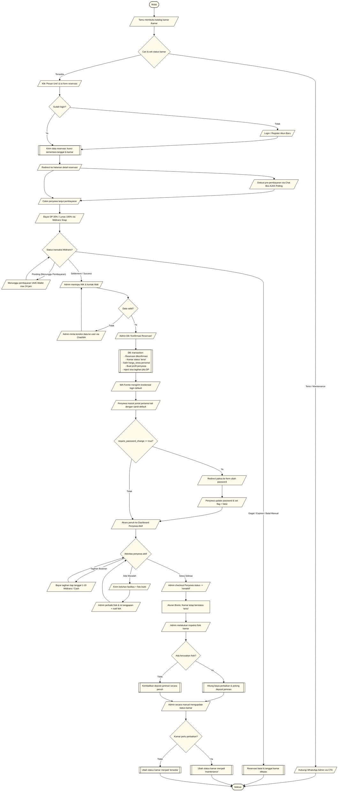
```mermaid
%%{init: {
  'theme': 'base',
  'themeVariables': {
    'primaryColor': '#FFFBEB',
    'primaryTextColor': '#000000',
    'primaryBorderColor': '#000000',
    'lineColor': '#000000',
    'secondaryColor': '#FDE047',
    'tertiaryColor': '#FFFFFF',
    'edgeLabelBackground': '#FFFFFF',
    'fontSize': '12px',
    'fontFamily': 'Inter, system-ui, sans-serif'
  }
}}%%
flowchart TD
    Start([Mulai]) --> Guest[/Tamu membuka katalog kamar /kamar/]
    Guest --> CariKamar{"Cari & cek status kamar"}
    
    CariKamar -- "Terisi / Maintenance" --> HubungiAdmin[/Hubungi WhatsApp Admin via CTA/]
    HubungiAdmin --> Selesai([Selesai])
    
    CariKamar -- "Tersedia" --> PesanUnit[/Klik 'Pesan Unit' & isi form reservasi/]
    PesanUnit --> CekAuth{"Sudah login?"}
    
    CekAuth -- "Tidak" --> LoginReg[/Login / Register Akun Baru/]
    LoginReg --> IsiForm[[Kirim data reservasi: kunci sementara tanggal & kamar]]
    CekAuth -- "Ya" --> IsiForm
    
    IsiForm --> HalamanReservasi[/Redirect ke halaman detail reservasi/]
    HalamanReservasi --> ChatPrePembayaran[/Diskusi pre-pembayaran via Chat Box AJAX Polling/]
    ChatPrePembayaran --> BayarDP[/Calon penyewa lanjut pembayaran/]
    HalamanReservasi --> BayarDP
    
    BayarDP --> BayarSnap[/Bayar DP 30% / Lunas 100% via Midtrans Snap/]
    BayarSnap --> VerifBayar{"Status transaksi Midtrans?"}
    
    VerifBayar -- "Gagal / Expired / Batal Manual" --> BatalAuto[[Reservasi batal & tanggal kamar dilepas]]
    BatalAuto --> Selesai
    
    VerifBayar -- "Pending (Menunggu Pembayaran)" --> WaitBayar[/Menunggu pembayaran VA/E-Wallet max 24 jam/]
    WaitBayar --> VerifBayar
    
    VerifBayar -- "Settlement / Success" --> TinjauDataAdmin[/Admin meninjau NIK & kontak Wali/]
    TinjauDataAdmin --> ValidData{"Data valid?"}
    
    ValidData -- "Tidak" --> MintaKoreksi[/Admin minta koreksi data ke user via Chat/WA/]
    MintaKoreksi --> TinjauDataAdmin
    
    ValidData -- "Ya" --> KonfirmasiAdmin[/Admin klik 'Konfirmasi Reservasi'/]
    
    KonfirmasiAdmin --> DBTrans[[DB::transaction:<br>- Reservasi dikonfirmasi<br>- Kamar status 'terisi'<br>- Salin harga_sewa personal<br>- Buat profil penyewa<br>- Inject sisa tagihan jika DP]]
    
    DBTrans --> KirimKredensial[/WA Fonnte mengirim kredensial login default/]
    KirimKredensial --> LoginPenyewa[/Penyewa masuk portal pertama kali dengan sandi default/]
    
    LoginPenyewa --> CekForceChange{"require_password_change == true?"}
    CekForceChange -- "Ya" --> ForceRedirect[/Redirect paksa ke form ubah password/]
    ForceRedirect --> UbahPassword[/Penyewa update password & set flag = false/]
    UbahPassword --> DashboardActive[/Akses penuh ke Dashboard Penyewa Aktif/]
    CekForceChange -- "Tidak" --> DashboardActive
    
    DashboardActive --> SiklusAktif{"Aktivitas penyewa aktif"}
    
    SiklusAktif -- "Tagihan Bulanan" --> BayarTagihan[/Bayar tagihan tiap tanggal 1-10 Midtrans / Cash/]
    BayarTagihan --> SiklusAktif
    
    SiklusAktif -- "Ada Masalah" --> LaporkanKeluhan[/Kirim keluhan fasilitas + foto bukti/]
    LaporkanKeluhan --> TindakanAdmin[/Admin perbaiki fisik & isi tanggapan + notif WA/]
    TindakanAdmin --> SiklusAktif
    
    SiklusAktif -- "Sewa Selesai" --> CheckoutPenyewa[/Admin checkout Penyewa status -> 'nonaktif'/]
    
    CheckoutPenyewa --> KamarLocked["Aturan Bisnis: Kamar tetap berstatus 'terisi'"]
    KamarLocked --> InspeksiKamar[/Admin melakukan inspeksi fisik kamar/]
    
    InspeksiKamar --> CekRusak{"Ada kerusakan fisik?"}
    CekRusak -- "Ya" --> PotongJaminan[[Hitung biaya perbaikan & potong deposit jaminan]]
    CekRusak -- "Tidak" --> BalikJaminan[[Kembalikan deposit jaminan secara penuh]]
    
    PotongJaminan --> UpdateKamarManual[/Admin secara manual mengupdate status kamar/]
    BalikJaminan --> UpdateKamarManual
    
    UpdateKamarManual --> KamarKondisi{"Kamar perlu perbaikan?"}
    KamarKondisi -- "Ya" --> SetMaint[[Ubah status kamar menjadi 'maintenance']]
    KamarKondisi -- "Tidak" --> SetReady[[Ubah status kamar menjadi 'tersedia']]
    
    SetMaint --> Selesai
    SetReady --> Selesai
```

---

### 2.2. Sub-Flowchart 1: Pencarian & Cek Ketersediaan Kamar
* **Controller Terkait**: [LandingController](file:///c:/xampp/htdocs/asri-boarding-house/app/Http/Controllers/Public/LandingController.php) (method: `kamarList`, `showKamar`, `hitungHarga`)
* **Model Terkait**: [Kamar](file:///c:/xampp/htdocs/asri-boarding-house/app/Models/Kamar.php)
* **View Terkait**: [landing/kamar-list.blade.php](file:///c:/xampp/htdocs/asri-boarding-house/resources/views/landing/kamar-list.blade.php), [landing/show.blade.php](file:///c:/xampp/htdocs/asri-boarding-house/resources/views/landing/show.blade.php)
* **Pengujian Otomatis**: [KamarListRenderingTest](file:///c:/xampp/htdocs/asri-boarding-house/tests/Feature/KamarListRenderingTest.php)

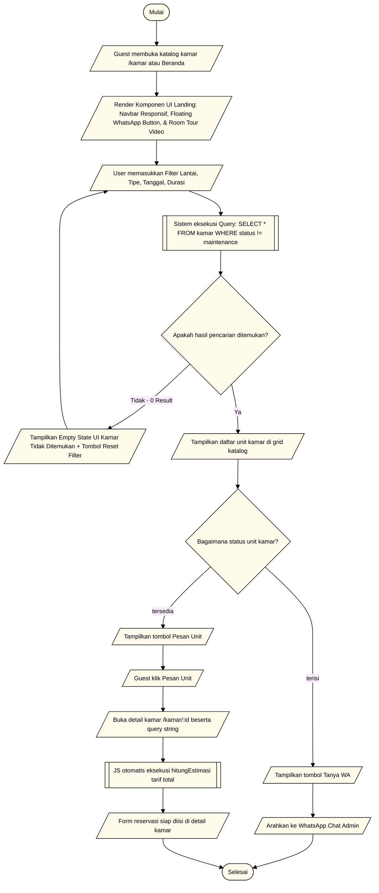
```mermaid
%%{init: {
  'theme': 'base',
  'themeVariables': {
    'primaryColor': '#FFFBEB',
    'primaryTextColor': '#000000',
    'primaryBorderColor': '#000000',
    'lineColor': '#000000',
    'fontSize': '12px',
    'fontFamily': 'Inter, system-ui, sans-serif'
  }
}}%%
flowchart TD
    Start([Mulai]) --> BukaKatalog[/Guest membuka katalog kamar /kamar atau Beranda/]
    BukaKatalog --> RenderLandingUI[/Render Komponen UI Landing: Navbar Responsif, Floating WhatsApp Button, & Room Tour Video/]
    
    RenderLandingUI --> InputFilter[/User memasukkan Filter Lantai, Tipe, Tanggal, Durasi/]
    
    InputFilter --> QueryKamar[[Sistem eksekusi Query: SELECT * FROM kamar WHERE status != maintenance]]
    
    QueryKamar --> CekKosong{"Apakah hasil pencarian ditemukan?"}
    CekKosong -- "Tidak - 0 Result" --> RenderEmptyState[/Tampilkan Empty State UI Kamar Tidak Ditemukan + Tombol Reset Filter/]
    RenderEmptyState --> InputFilter
    
    CekKosong -- "Ya" --> Tampilkan[/Tampilkan daftar unit kamar di grid katalog/]
    Tampilkan --> EvaluasiStatus{"Bagaimana status unit kamar?"}
    
    EvaluasiStatus -- "terisi" --> TampilTombolWA[/Tampilkan tombol Tanya WA/]
    TampilTombolWA --> KlikWA[/Arahkan ke WhatsApp Chat Admin/]
    KlikWA --> Selesai([Selesai])
    
    EvaluasiStatus -- "tersedia" --> TampilTombolPesan[/Tampilkan tombol Pesan Unit/]
    TampilTombolPesan --> KlikPesan[/Guest klik Pesan Unit/]
    KlikPesan --> BukaDetail[/Buka detail kamar /kamar/:id beserta query string/]
    BukaDetail --> AutoKalkulasi[[JS otomatis eksekusi hitungEstimasi tarif total]]
    AutoKalkulasi --> TampilForm[/Form reservasi siap diisi di detail kamar/]
    TampilForm --> Selesai
```

---

### 2.3. Sub-Flowchart 2: Pendaftaran & Pembuatan Reservasi Kamar
* **Controller Terkait**: [ReservasiAuthController](file:///c:/xampp/htdocs/asri-boarding-house/app/Http/Controllers/Auth/ReservasiAuthController.php), [ReservasiController](file:///c:/xampp/htdocs/asri-boarding-house/app/Http/Controllers/Penyewa/ReservasiController.php)
* **Model Terkait**: [Reservasi](file:///c:/xampp/htdocs/asri-boarding-house/app/Models/Reservasi.php), [Kamar](file:///c:/xampp/htdocs/asri-boarding-house/app/Models/Kamar.php), [User](file:///c:/xampp/htdocs/asri-boarding-house/app/Models/User.php)

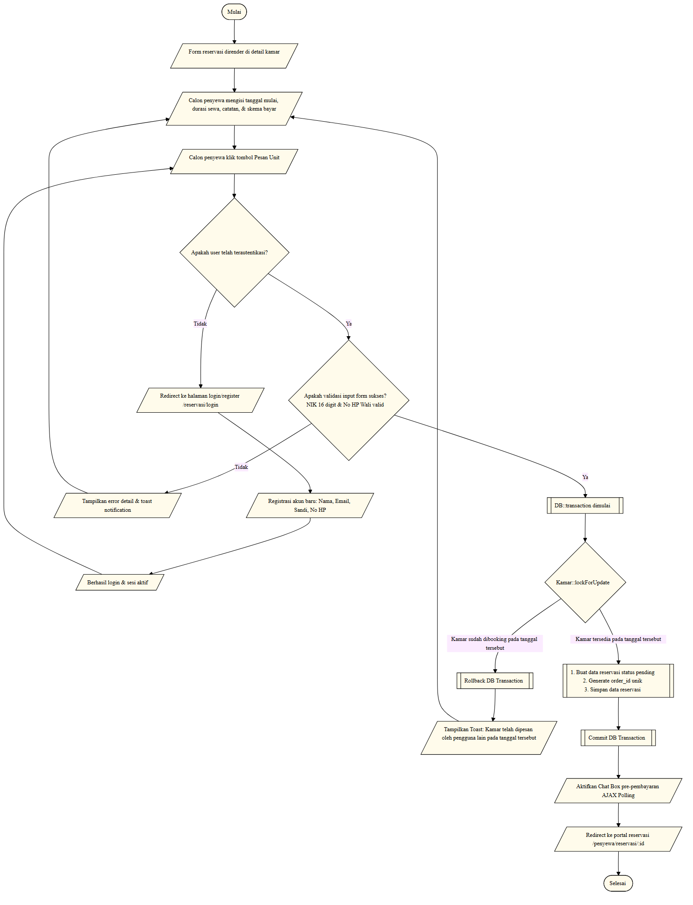

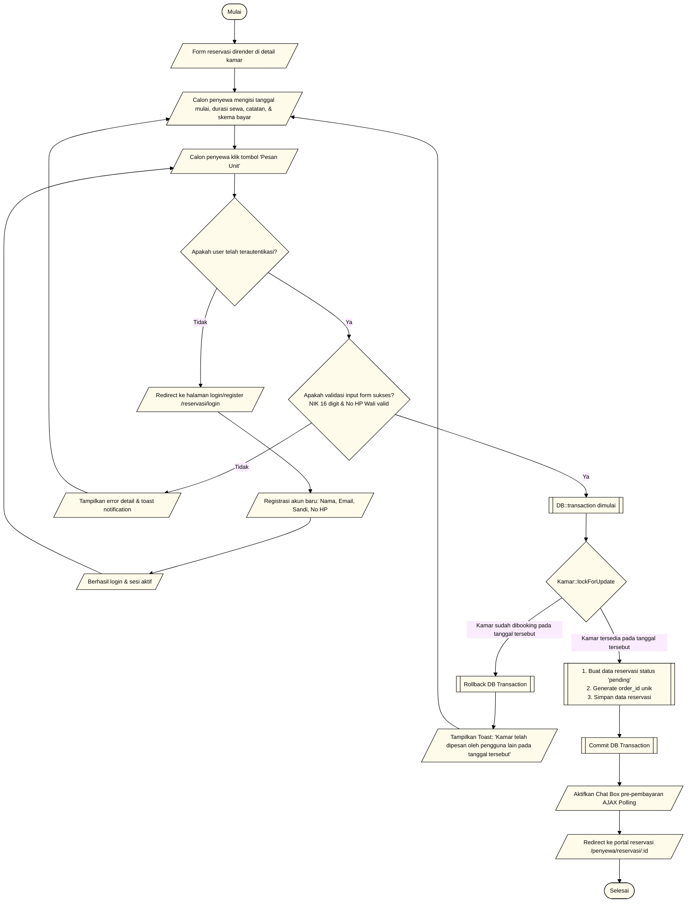
```mermaid
%%{init: {
  'theme': 'base',
  'themeVariables': {
    'primaryColor': '#FFFBEB',
    'primaryTextColor': '#000000',
    'primaryBorderColor': '#000000',
    'lineColor': '#000000',
    'fontSize': '12px',
    'fontFamily': 'Inter, system-ui, sans-serif'
  }
}}%%
flowchart TD
    Start([Mulai]) --> TampilForm[/Form reservasi dirender di detail kamar/]
    TampilForm --> IsiData[/Calon penyewa mengisi tanggal mulai, durasi sewa, catatan, & skema bayar/]
    IsiData --> KlikKirim[/Calon penyewa klik tombol 'Pesan Unit'/]
    
    KlikKirim --> CekLogin{"Apakah user telah terautentikasi?"}
    CekLogin -- "Tidak" --> RedirectLogin[/Redirect ke halaman login/register /reservasi/login/]
    RedirectLogin --> RegisterForm[/Registrasi akun baru: Nama, Email, Sandi, No HP/]
    RegisterForm --> LoginSuccess[/Berhasil login & sesi aktif/]
    LoginSuccess --> KlikKirim
    
    CekLogin -- "Ya" --> ValidasiForm{"Apakah validasi input form sukses?<br>NIK 16 digit & No HP Wali valid"}
    ValidasiForm -- "Tidak" --> TampilErrorValidation[/Tampilkan error detail & toast notification/]
    TampilErrorValidation --> IsiData
    
    ValidasiForm -- "Ya" --> DBTrans[[DB::transaction dimulai]]
    DBTrans --> LockRoom{"Kamar::lockForUpdate"}
    
    LockRoom -- "Kamar sudah dibooking pada tanggal tersebut" --> RollbackTx[[Rollback DB Transaction]]
    RollbackTx --> ToastBentrok[/Tampilkan Toast: 'Kamar telah dipesan oleh pengguna lain pada tanggal tersebut'/]
    ToastBentrok --> IsiData
    
    LockRoom -- "Kamar tersedia pada tanggal tersebut" --> LockRoomSuccess[[1. Buat data reservasi status 'pending'<br>2. Generate order_id unik<br>3. Simpan data reservasi]]
    LockRoomSuccess --> CommitTx[[Commit DB Transaction]]
    CommitTx --> BukaChatBox[/Aktifkan Chat Box pre-pembayaran AJAX Polling/]
    BukaChatBox --> RedirectDetail[/Redirect ke portal reservasi /penyewa/reservasi/:id/]
    RedirectDetail --> Selesai([Selesai])
```

---

### 2.4. Sub-Flowchart 3: Pembayaran Reservasi, Pre-Chat, & Pembatalan Manual
* **Controller Terkait**: [ChatController](file:///c:/xampp/htdocs/asri-boarding-house/app/Http/Controllers/Api/ChatController.php), [SnapTokenController](file:///c:/xampp/htdocs/asri-boarding-house/app/Http/Controllers/Api/SnapTokenController.php)
* **Model Terkait**: [ChatMessage](file:///c:/xampp/htdocs/asri-boarding-house/app/Models/ChatMessage.php), [Reservasi](file:///c:/xampp/htdocs/asri-boarding-house/app/Models/Reservasi.php)

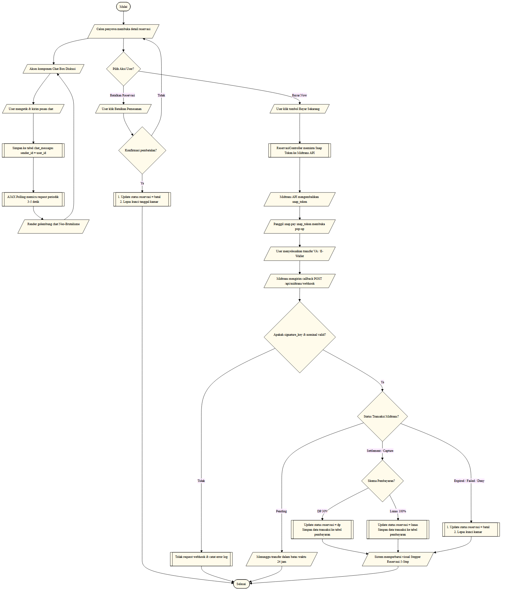

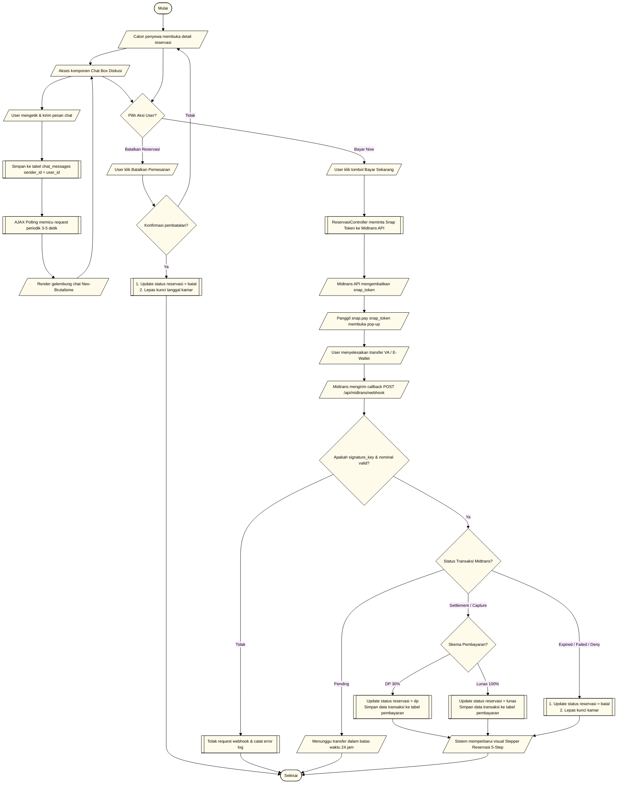
```mermaid
%%{init: {
  'theme': 'base',
  'themeVariables': {
    'primaryColor': '#FFFBEB',
    'primaryTextColor': '#000000',
    'primaryBorderColor': '#000000',
    'lineColor': '#000000',
    'fontSize': '12px',
    'fontFamily': 'Inter, system-ui, sans-serif'
  }
}}%%
flowchart TD
    Start([Mulai]) --> BukaDetailReservasi[/Calon penyewa membuka detail reservasi/]
    
    BukaDetailReservasi --> ChatSection[/Akses komponen Chat Box Diskusi/]
    ChatSection --> KirimPesan[/User mengetik & kirim pesan chat/]
    KirimPesan --> SimpanPesan[[Simpan ke tabel chat_messages sender_id = user_id]]
    SimpanPesan --> AJAXPolling[[AJAX Polling memicu request periodik 3-5 detik]]
    AJAXPolling --> RenderBubble[/Render gelembung chat Neo-Brutalisme/]
    RenderBubble --> ChatSection
    
    %% Exit gate dari Chat Box menuju tindakan reservasi %%
    ChatSection --> PilihAksi{"Pilih Aksi User?"}
    BukaDetailReservasi --> PilihAksi
    
    PilihAksi -- "Batalkan Reservasi" --> KlikBatal[/User klik Batalkan Pemesanan/]
    KlikBatal --> KonfirmasiBatal{"Konfirmasi pembatalan?"}
    KonfirmasiBatal -- "Tidak" --> BukaDetailReservasi
    KonfirmasiBatal -- "Ya" --> SetBatalUser[[1. Update status reservasi = batal<br>2. Lepas kunci tanggal kamar]]
    SetBatalUser --> Selesai([Selesai])
    
    PilihAksi -- "Bayar Now" --> KlikBayar[/User klik tombol Bayar Sekarang/]
    KlikBayar --> ReqSnapToken[[ReservasiController meminta Snap Token ke Midtrans API]]
    ReqSnapToken --> ReturnSnapToken[/Midtrans API mengembalikan snap_token/]
    ReturnSnapToken --> OpenSnapModal[/Panggil snap.pay snap_token membuka pop-up/]
    OpenSnapModal --> SelesaikanPembayaran[/User menyelesaikan transfer VA / E-Wallet/]
    
    SelesaikanPembayaran --> WebhookMidtrans[/Midtrans mengirim callback POST /api/midtrans/webhook/]
    WebhookMidtrans --> ValidasiSignature{"Apakah signature_key & nominal valid?"}
    
    ValidasiSignature -- "Tidak" --> RejectWebhook[[Tolak request webhook & catat error log]]
    RejectWebhook --> Selesai
    
    ValidasiSignature -- "Ya" --> EvaluasiStatusMidtrans{"Status Transaksi Midtrans?"}
    
    EvaluasiStatusMidtrans -- "Settlement / Capture" --> CekSkemaBayar{"Skema Pembayaran?"}
    CekSkemaBayar -- "DP 30%" --> SetStatusDP[[Update status reservasi = dp<br>Simpan data transaksi ke tabel pembayaran]]
    CekSkemaBayar -- "Lunas 100%" --> SetStatusLunas[[Update status reservasi = lunas<br>Simpan data transaksi ke tabel pembayaran]]
    
    EvaluasiStatusMidtrans -- "Pending" --> WaitStatus[/Menunggu transfer dalam batas waktu 24 jam/]
    WaitStatus --> Selesai
    
    EvaluasiStatusMidtrans -- "Expired / Failed / Deny" --> SetBatalSystem[[1. Update status reservasi = batal<br>2. Lepas kunci kamar]]
    
    SetStatusDP --> ReloadUI[/Sistem memperbarui visual Stepper Reservasi 5-Step/]
    SetStatusLunas --> ReloadUI
    SetBatalSystem --> ReloadUI
    ReloadUI --> Selesai
```

---

### 2.5. Sub-Flowchart 4: Verifikasi & Konfirmasi Reservasi Baru
* **Controller Terkait**: [ReservasiController](file:///c:/xampp/htdocs/asri-boarding-house/app/Http/Controllers/Admin/ReservasiController.php) (method: `konfirmasi`, `batal`, `destroy`), [TransisiPenyewaService](file:///c:/xampp/htdocs/asri-boarding-house/app/Services/TransisiPenyewaService.php)
* **Model Terkait**: [Reservasi](file:///c:/xampp/htdocs/asri-boarding-house/app/Models/Reservasi.php), [Penyewa](file:///c:/xampp/htdocs/asri-boarding-house/app/Models/Penyewa.php), [User](file:///c:/xampp/htdocs/asri-boarding-house/app/Models/User.php)

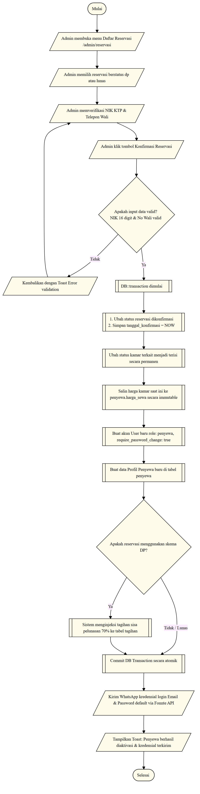

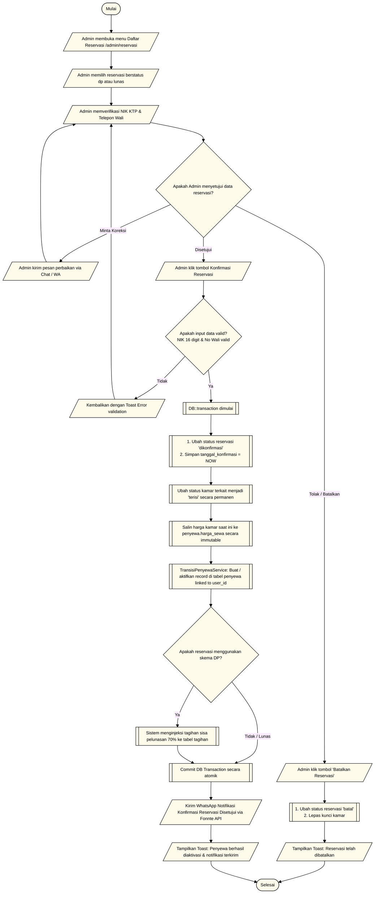
```mermaid
%%{init: {
  'theme': 'base',
  'themeVariables': {
    'primaryColor': '#FFFBEB',
    'primaryTextColor': '#000000',
    'primaryBorderColor': '#000000',
    'lineColor': '#000000',
    'fontSize': '12px',
    'fontFamily': 'Inter, system-ui, sans-serif'
  }
}}%%
flowchart TD
    Start([Mulai]) --> AdminBukaReservasi[/Admin membuka menu Daftar Reservasi /admin/reservasi/]
    AdminBukaReservasi --> PilihReservasi[/Admin memilih reservasi berstatus dp atau lunas/]
    PilihReservasi --> TinjauBerkas[/Admin memverifikasi NIK KTP & Telepon Wali/]
    
    TinjauBerkas --> KeputusanAdmin{"Apakah Admin menyetujui data reservasi?"}
    
    KeputusanAdmin -- "Tolak / Batalkan" --> KlikBatalAdmin[/Admin klik tombol 'Batalkan Reservasi'/]
    KlikBatalAdmin --> BatalReservasiDB[[1. Ubah status reservasi 'batal'<br>2. Lepas kunci kamar]]
    BatalReservasiDB --> ToastBatal[/Tampilkan Toast: Reservasi telah dibatalkan/]
    ToastBatal --> Selesai([Selesai])
    
    KeputusanAdmin -- "Minta Koreksi" --> ChatRevisi[/Admin kirim pesan perbaikan via Chat / WA/]
    ChatRevisi --> TinjauBerkas
    
    KeputusanAdmin -- "Disetujui" --> KlikKonfirmasi[/Admin klik tombol Konfirmasi Reservasi/]
    KlikKonfirmasi --> ValidasiInput{"Apakah input data valid?<br>NIK 16 digit & No Wali valid"}
    ValidasiInput -- "Tidak" --> TampilToastError[/Kembalikan dengan Toast Error validation/]
    TampilToastError --> TinjauBerkas
    
    ValidasiInput -- "Ya" --> DBTrans[[DB::transaction dimulai]]
    DBTrans --> UpdateReservasi[[1. Ubah status reservasi 'dikonfirmasi'<br>2. Simpan tanggal_konfirmasi = NOW]]
    UpdateReservasi --> LockKamarTerisi[[Ubah status kamar terkait menjadi 'terisi' secara permanen]]
    LockKamarTerisi --> SalinHargaSewa[[Salin harga kamar saat ini ke penyewa.harga_sewa secara immutable]]
    SalinHargaSewa --> CreateProfilPenyewa[[TransisiPenyewaService: Buat / aktifkan record di tabel penyewa linked to user_id]]
    
    CreateProfilPenyewa --> CekSkemaDP{"Apakah reservasi menggunakan skema DP?"}
    CekSkemaDP -- "Ya" --> InjectTagihanSisa[[Sistem menginjeksi tagihan sisa pelunasan 70% ke tabel tagihan]]
    CekSkemaDP -- "Tidak / Lunas" --> CommitTx
    InjectTagihanSisa --> CommitTx
    CommitTx[[Commit DB Transaction secara atomik]]
    
    CommitTx --> DispatchFonnteWA[/Kirim WhatsApp Notifikasi Konfirmasi Reservasi Disetujui via Fonnte API/]
    DispatchFonnteWA --> ToastSuccess[/Tampilkan Toast: Penyewa berhasil diaktivasi & notifikasi terkirim/]
    ToastSuccess --> Selesai
```

---

### 2.6. Sub-Flowchart 5: Siklus Billing Rutin Bulanan Otomatis
* **Controller Terkait**: [BillingService](file:///c:/xampp/htdocs/asri-boarding-house/app/Services/BillingService.php) (Laravel Command: `tagihan:generate-bulanan` pada `00:05 WIB`)
* **Model Terkait**: [Tagihan](file:///c:/xampp/htdocs/asri-boarding-house/app/Models/Tagihan.php), [LogNotifikasi](file:///c:/xampp/htdocs/asri-boarding-house/app/Models/LogNotifikasi.php)

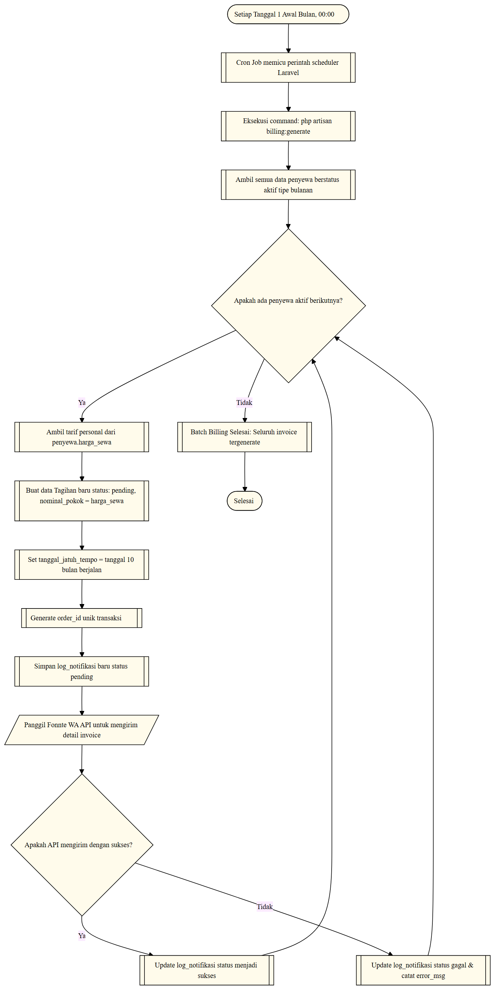

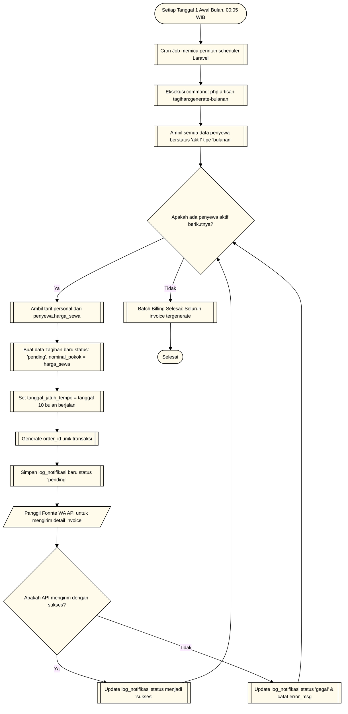
```mermaid
%%{init: {
  'theme': 'base',
  'themeVariables': {
    'primaryColor': '#FFFBEB',
    'primaryTextColor': '#000000',
    'primaryBorderColor': '#000000',
    'lineColor': '#000000',
    'fontSize': '12px',
    'fontFamily': 'Inter, system-ui, sans-serif'
  }
}}%%
flowchart TD
    Start([Setiap Tanggal 1 Awal Bulan, 00:05 WIB]) --> TriggerScheduler[[Cron Job memicu perintah scheduler Laravel]]
    TriggerScheduler --> RunBillingCommand[[Eksekusi command: php artisan tagihan:generate-bulanan]]
    RunBillingCommand --> FetchPenyewaAktif[[Ambil semua data penyewa berstatus 'aktif' tipe 'bulanan']]
    
    FetchPenyewaAktif --> LoopPenyewa{"Apakah ada penyewa aktif berikutnya?"}
    
    LoopPenyewa -- "Ya" --> GetImmutableRate[[Ambil tarif personal dari penyewa.harga_sewa]]
    GetImmutableRate --> BuatTagihan[[Buat data Tagihan baru status: 'pending', nominal_pokok = harga_sewa]]
    BuatTagihan --> SetJatuhTempo[[Set tanggal_jatuh_tempo = tanggal 10 bulan berjalan]]
    SetJatuhTempo --> CreateOrderId[[Generate order_id unik transaksi]]
    CreateOrderId --> LogNotifPending[[Simpan log_notifikasi baru status 'pending']]
    LogNotifPending --> CallFonnteAPI[/Panggil Fonnte WA API untuk mengirim detail invoice/]
    
    CallFonnteAPI --> CekResponse{"Apakah API mengirim dengan sukses?"}
    CekResponse -- "Ya" --> SetLogSukses[[Update log_notifikasi status menjadi 'sukses']]
    CekResponse -- "Tidak" --> SetLogGagal[[Update log_notifikasi status 'gagal' & catat error_msg]]
    
    SetLogSukses --> LoopPenyewa
    SetLogGagal --> LoopPenyewa
    
    LoopPenyewa -- "Tidak" --> SelesaiBatch[[Batch Billing Selesai: Seluruh invoice tergenerate]]
    SelesaiBatch --> Selesai([Selesai])
```

---

### 2.7. Sub-Flowchart 6: Pembayaran Tagihan Bulanan & Eskalasi Wali
* **Controller Terkait**: [TagihanController](file:///c:/xampp/htdocs/asri-boarding-house/app/Http/Controllers/Penyewa/TagihanController.php), [TagihanController](file:///c:/xampp/htdocs/asri-boarding-house/app/Http/Controllers/Admin/TagihanController.php)

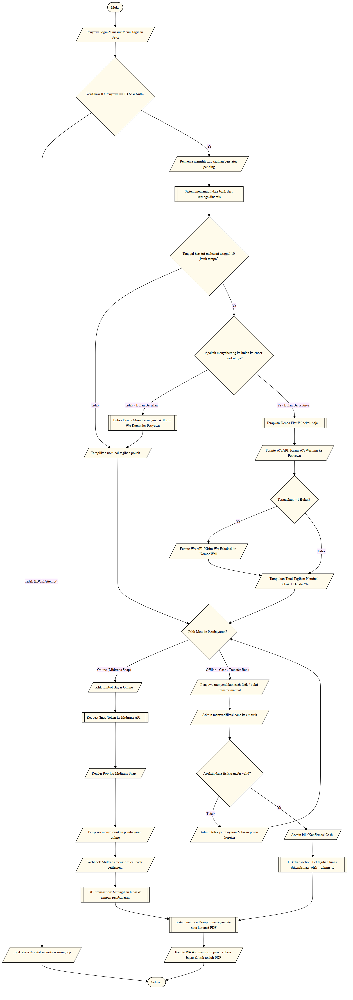

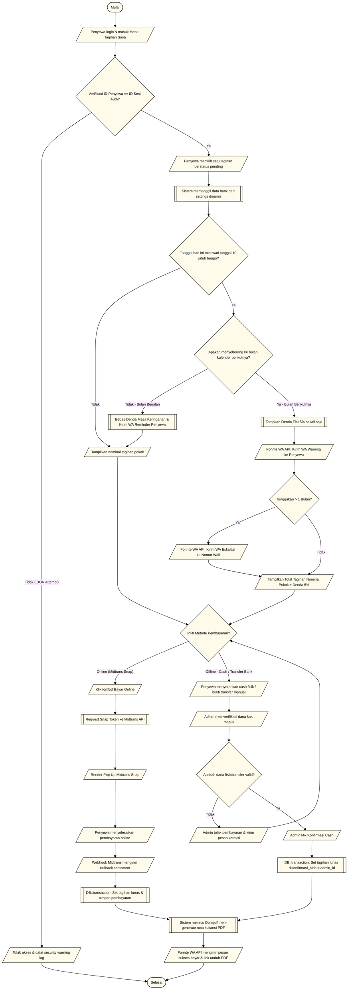
```mermaid
%%{init: {
  'theme': 'base',
  'themeVariables': {
    'primaryColor': '#FFFBEB',
    'primaryTextColor': '#000000',
    'primaryBorderColor': '#000000',
    'lineColor': '#000000',
    'fontSize': '12px',
    'fontFamily': 'Inter, system-ui, sans-serif'
  }
}}%%
flowchart TD
    Start([Mulai]) --> PenyewaLogin[/Penyewa login & masuk Menu Tagihan Saya/]
    PenyewaLogin --> CekIDOR{"Verifikasi ID Penyewa == ID Sesi Auth?"}
    CekIDOR -- "Tidak (IDOR Attempt)" --> BlockIDOR[/Tolak akses & catat security warning log/]
    BlockIDOR --> Selesai([Selesai])
    
    CekIDOR -- "Ya" --> PilihTagihan[/Penyewa memilih satu tagihan berstatus pending/]
    PilihTagihan --> LoadBankDinamis[[Sistem memanggil data bank dari settings dinamis]]
    
    LoadBankDinamis --> CekTerlambat{"Tanggal hari ini melewati tanggal 10 jatuh tempo?"}
    CekTerlambat -- "Tidak" --> TampilkanTotal[/Tampilkan nominal tagihan pokok/]
    
    CekTerlambat -- "Ya" --> CekBulanTunggakan{"Apakah menyeberang ke bulan kalender berikutnya?"}
    CekBulanTunggakan -- "Tidak - Bulan Berjalan" --> MasaKeringanan[[Bebas Denda Masa Keringanan & Kirim WA Reminder Penyewa]]
    MasaKeringanan --> TampilkanTotal
    
    CekBulanTunggakan -- "Ya - Bulan Berikutnya" --> HitungDendaFlat[[Terapkan Denda Flat 5% sekali saja]]
    HitungDendaFlat --> KirimWAWarning[/Fonnte WA API: Kirim WA Warning ke Penyewa/]
    KirimWAWarning --> CekBulan2{"Tunggakan > 1 Bulan?"}
    CekBulan2 -- "Ya" --> KirimWAEskalasiWali[/Fonnte WA API: Kirim WA Eskalasi ke Nomor Wali/]
    CekBulan2 -- "Tidak" --> TampilkanTotalDenda[/Tampilkan Total Tagihan Nominal Pokok + Denda 5%/]
    KirimWAEskalasiWali --> TampilkanTotalDenda
    
    TampilkanTotal --> PilihMetode{"Pilih Metode Pembayaran?"}
    TampilkanTotalDenda --> PilihMetode
    
    PilihMetode -- "Online (Midtrans Snap)" --> KlikBayarOnline[/Klik tombol Bayar Online/]
    KlikBayarOnline --> ReqSnapToken[[Request Snap Token ke Midtrans API]]
    ReqSnapToken --> OpenSnap[/Render Pop-Up Midtrans Snap/]
    OpenSnap --> BayarOnline[/Penyewa menyelesaikan pembayaran online/]
    BayarOnline --> WebhookMidtrans[/Webhook Midtrans mengirim callback settlement/]
    WebhookMidtrans --> DBTransOnline[[DB::transaction: Set tagihan lunas & simpan pembayaran]]
    
    PilihMetode -- "Offline - Cash / Transfer Bank" --> TransferManual[/Penyewa menyerahkan cash fisik / bukti transfer manual/]
    TransferManual --> AdminVerifikasiKas[/Admin memverifikasi dana kas masuk/]
    AdminVerifikasiKas --> AdminValidasiUang{"Apakah dana fisik/transfer valid?"}
    
    AdminValidasiUang -- "Tidak" --> TolakPembayaranOffline[/Admin tolak pembayaran & kirim pesan koreksi/]
    TolakPembayaranOffline --> PilihMetode
    
    AdminValidasiUang -- "Ya" --> AdminKonfirmasiCash[/Admin klik Konfirmasi Cash/]
    AdminKonfirmasiCash --> DBTransOffline[[DB::transaction: Set tagihan lunas dikonfirmasi_oleh = admin_id]]
    
    DBTransOnline --> GenReceiptPDF[[Sistem memicu Dompdf men-generate nota kuitansi PDF]]
    DBTransOffline --> GenReceiptPDF
    
    GenReceiptPDF --> CallFonnteReceipt[/Fonnte WA API mengirim pesan sukses bayar & link unduh PDF/]
    CallFonnteReceipt --> Selesai
```

---

### 2.8. Sub-Flowchart 7: Pelaporan & Resolusi Keluhan Fasilitas
* **Controller Terkait**: [KeluhanController](file:///c:/xampp/htdocs/asri-boarding-house/app/Http/Controllers/Penyewa/KeluhanController.php), [KeluhanController](file:///c:/xampp/htdocs/asri-boarding-house/app/Http/Controllers/Admin/KeluhanController.php)

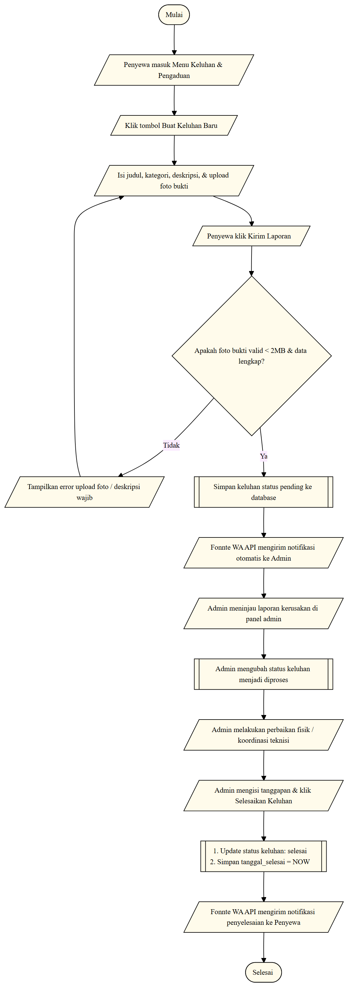

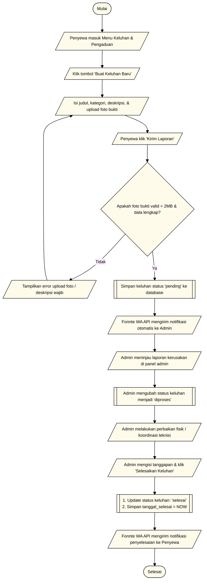
```mermaid
%%{init: {
  'theme': 'base',
  'themeVariables': {
    'primaryColor': '#FFFBEB',
    'primaryTextColor': '#000000',
    'primaryBorderColor': '#000000',
    'lineColor': '#000000',
    'fontSize': '12px',
    'fontFamily': 'Inter, system-ui, sans-serif'
  }
}}%%
flowchart TD
    Start([Mulai]) --> BukaKeluhan[/Penyewa masuk Menu Keluhan & Pengaduan/]
    BukaKeluhan --> KlikBuatLaporan[/Klik tombol 'Buat Keluhan Baru'/]
    IsiFormLaporan[/Isi judul, kategori, deskripsi, & upload foto bukti/]
    KlikBuatLaporan --> IsiFormLaporan
    IsiFormLaporan --> KlikKirim[/Penyewa klik 'Kirim Laporan'/]
    
    KlikKirim --> ValidasiFoto{"Apakah foto bukti valid < 2MB & data lengkap?"}
    ValidasiFoto -- "Tidak" --> TampilErrorForm[/Tampilkan error upload foto / deskripsi wajib/]
    TampilErrorForm --> IsiFormLaporan
    
    ValidasiFoto -- "Ya" --> SimpanKeluhanDB[[Simpan keluhan status 'pending' ke database]]
    SimpanKeluhanDB --> NotifWAAdmin[/Fonnte WA API mengirim notifikasi otomatis ke Admin/]
    NotifWAAdmin --> AdminReviewKeluhan[/Admin meninjau laporan kerusakan di panel admin/]
    
    AdminReviewKeluhan --> UbahStatusProses[[Admin mengubah status keluhan menjadi 'diproses']]
    UbahStatusProses --> LakukanTindakan[/Admin melakukan perbaikan fisik / koordinasi teknisi/]
    LakukanTindakan --> IsiTanggapan[/Admin mengisi tanggapan & klik 'Selesaikan Keluhan'/]
    
    IsiTanggapan --> UpdateSelesaiKeluhan[[1. Update status keluhan: 'selesai'<br>2. Simpan tanggal_selesai = NOW]]
    UpdateSelesaiKeluhan --> KirimWANotifPenyewa[/Fonnte WA API mengirim notifikasi penyelesaian ke Penyewa/]
    KirimWANotifPenyewa --> Selesai([Selesai])
```

---

### 2.9. Sub-Flowchart 8: Pencatatan Pengeluaran & Integrasi Laporan Arus Kas
* **Controller Terkait**: [PengeluaranController](file:///c:/xampp/htdocs/asri-boarding-house/app/Http/Controllers/Admin/PengeluaranController.php), [LaporanController](file:///c:/xampp/htdocs/asri-boarding-house/app/Http/Controllers/Admin/LaporanController.php)

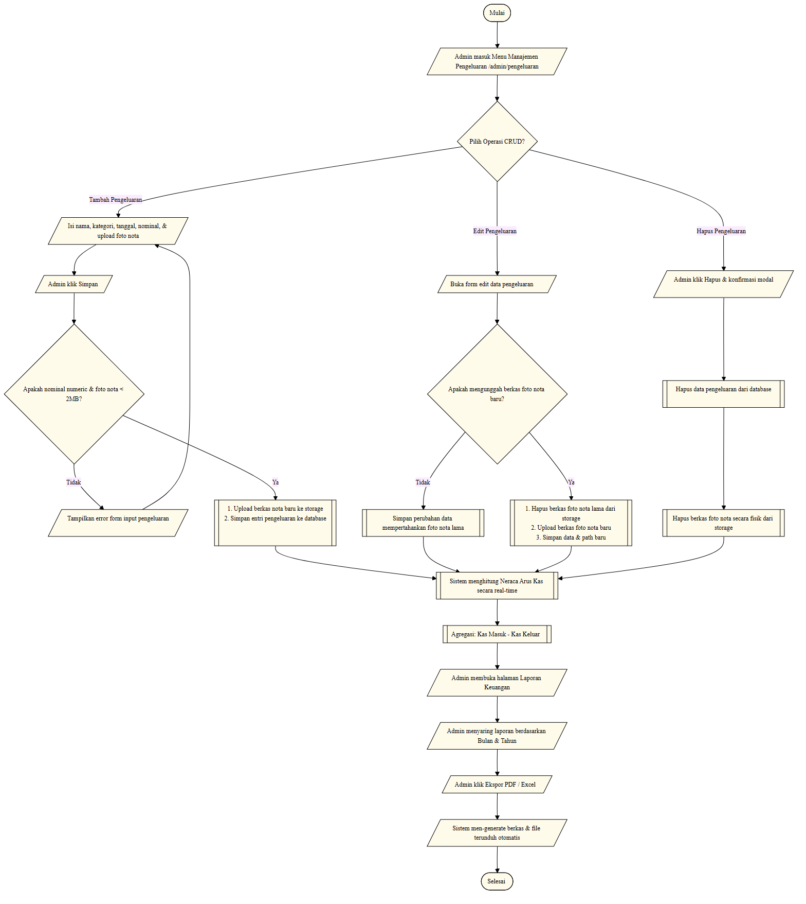

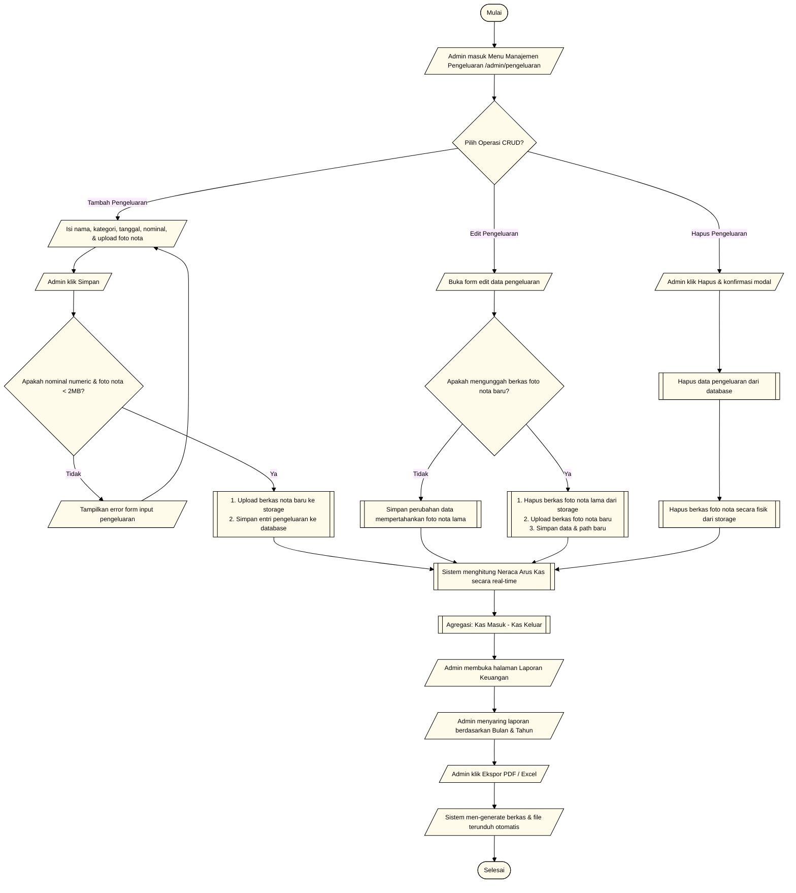
```mermaid
%%{init: {
  'theme': 'base',
  'themeVariables': {
    'primaryColor': '#FFFBEB',
    'primaryTextColor': '#000000',
    'primaryBorderColor': '#000000',
    'lineColor': '#000000',
    'fontSize': '12px',
    'fontFamily': 'Inter, system-ui, sans-serif'
  }
}}%%
flowchart TD
    Start([Mulai]) --> BukaPengeluaran[/Admin masuk Menu Manajemen Pengeluaran /admin/pengeluaran/]
    BukaPengeluaran --> PilihAksi{"Pilih Operasi CRUD?"}
    
    PilihAksi -- "Tambah Pengeluaran" --> IsiFormTambah[/Isi nama, kategori, tanggal, nominal, & upload foto nota/]
    IsiFormTambah --> KlikSimpan[/Admin klik Simpan/]
    KlikSimpan --> ValidasiForm{"Apakah nominal numeric & foto nota < 2MB?"}
    ValidasiForm -- "Tidak" --> TampilErrorVal[/Tampilkan error form input pengeluaran/]
    TampilErrorVal --> IsiFormTambah
    ValidasiForm -- "Ya" --> SimpanDBPengeluaran[[1. Upload berkas nota baru ke storage<br>2. Simpan entri pengeluaran ke database]]
    
    PilihAksi -- "Edit Pengeluaran" --> BukaFormEdit[/Buka form edit data pengeluaran/]
    BukaFormEdit --> CekFotoBaru{"Apakah mengunggah berkas foto nota baru?"}
    CekFotoBaru -- "Tidak" --> SimpanPerubahan[[Simpan perubahan data mempertahankan foto nota lama]]
    CekFotoBaru -- "Ya" --> GantiFotoNota[[1. Hapus berkas foto nota lama dari storage<br>2. Upload berkas foto nota baru<br>3. Simpan data & path baru]]
    
    PilihAksi -- "Hapus Pengeluaran" --> KlikHapus[/Admin klik Hapus & konfirmasi modal/]
    KlikHapus --> HapusDBPengeluaran[[Hapus data pengeluaran dari database]]
    HapusDBPengeluaran --> CleanupFileNota[[Hapus berkas foto nota secara fisik dari storage]]
    
    SimpanDBPengeluaran --> AgregasiKeuangan[[Sistem menghitung Neraca Arus Kas secara real-time]]
    SimpanPerubahan --> AgregasiKeuangan
    GantiFotoNota --> AgregasiKeuangan
    CleanupFileNota --> AgregasiKeuangan
    
    AgregasiKeuangan --> HitungArusKas[[Agregasi: Kas Masuk - Kas Keluar]]
    HitungArusKas --> BukaLaporan[/Admin membuka halaman Laporan Keuangan/]
    BukaLaporan --> FilterLaporan[/Admin menyaring laporan berdasarkan Bulan & Tahun/]
    FilterLaporan --> KlikEkspor[/Admin klik Ekspor PDF / Excel/]
    KlikEkspor --> DownloadFile[/Sistem men-generate berkas & file terunduh otomatis/]
    DownloadFile --> Selesai([Selesai])
```

---

### 2.10. Sub-Flowchart 9: Manajemen Konten Dinamis - FAQ, Galeri, Ulasan
* **Controller Terkait**: [FaqController](file:///c:/xampp/htdocs/asri-boarding-house/app/Http/Controllers/Admin/FaqController.php), [GalleryController](file:///c:/xampp/htdocs/asri-boarding-house/app/Http/Controllers/Admin/GalleryController.php), [CustomerReviewController](file:///c:/xampp/htdocs/asri-boarding-house/app/Http/Controllers/Admin/CustomerReviewController.php)

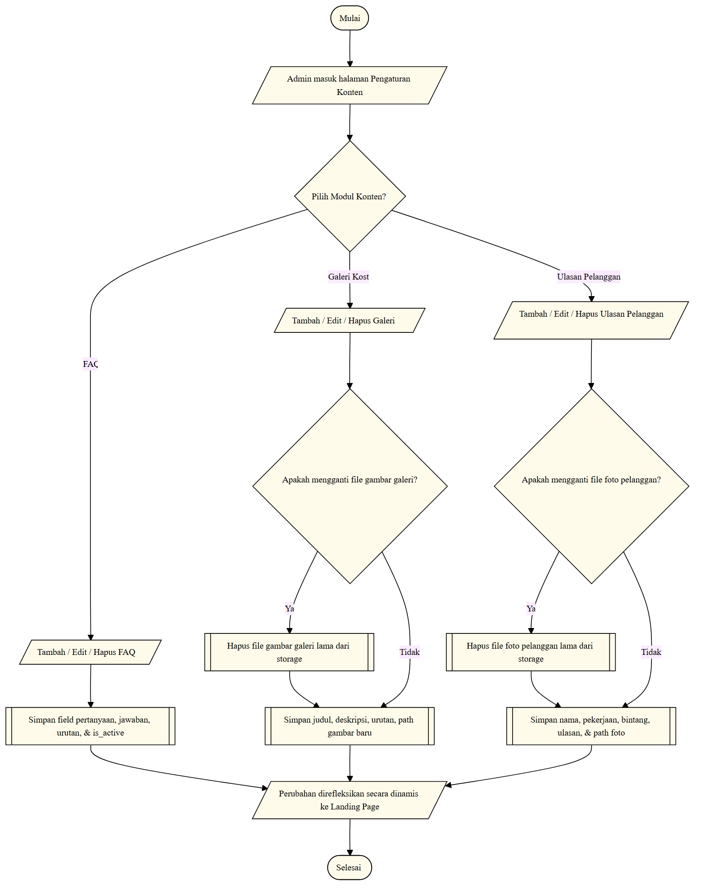

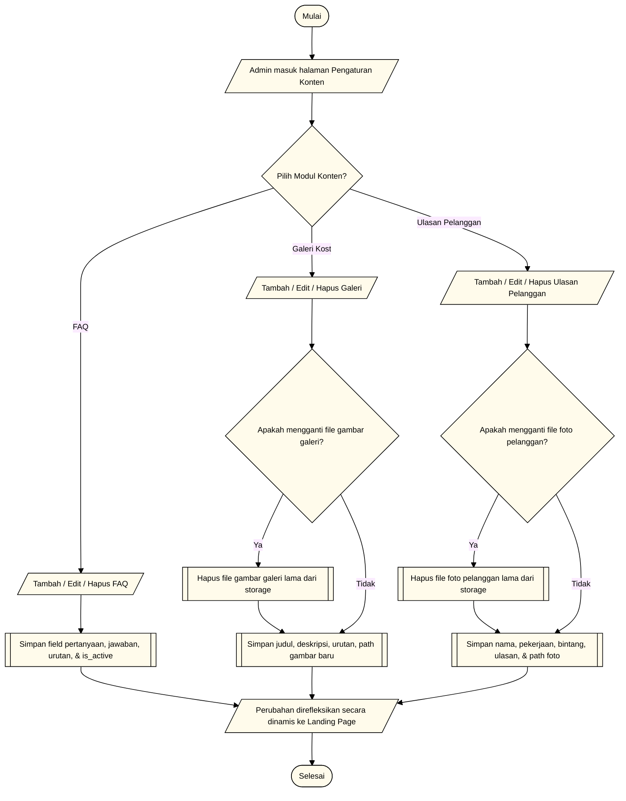
```mermaid
%%{init: {
  'theme': 'base',
  'themeVariables': {
    'primaryColor': '#FFFBEB',
    'primaryTextColor': '#000000',
    'primaryBorderColor': '#000000',
    'lineColor': '#000000',
    'fontSize': '12px',
    'fontFamily': 'Inter, system-ui, sans-serif'
  }
}}%%
flowchart TD
    Start([Mulai]) --> AdminBukaKonten[/Admin masuk halaman Pengaturan Konten/]
    AdminBukaKonten --> PilihModul{"Pilih Modul Konten?"}
    
    PilihModul -- "FAQ" --> CRUDFAQ[/Tambah / Edit / Hapus FAQ/]
    CRUDFAQ --> SaveFAQ[[Simpan field pertanyaan, jawaban, urutan, & is_active]]
    
    PilihModul -- "Galeri Kost" --> CRUDGaleri[/Tambah / Edit / Hapus Galeri/]
    CRUDGaleri --> CekFotoGaleri{"Apakah mengganti file gambar galeri?"}
    CekFotoGaleri -- "Ya" --> HapusFotoGaleriLama[[Hapus file gambar galeri lama dari storage]]
    HapusFotoGaleriLama --> SaveGaleri[[Simpan judul, deskripsi, urutan, path gambar baru]]
    CekFotoGaleri -- "Tidak" --> SaveGaleri
    
    PilihModul -- "Ulasan Pelanggan" --> CRUDReview[/Tambah / Edit / Hapus Ulasan Pelanggan/]
    CRUDReview --> CekFotoReview{"Apakah mengganti file foto pelanggan?"}
    CekFotoReview -- "Ya" --> HapusFotoReviewLama[[Hapus file foto pelanggan lama dari storage]]
    HapusFotoReviewLama --> SaveReview[[Simpan nama, pekerjaan, bintang, ulasan, & path foto]]
    CekFotoReview -- "Tidak" --> SaveReview
    
    SaveFAQ --> RenderPublik[/Perubahan direfleksikan secara dinamis ke Landing Page/]
    SaveGaleri --> RenderPublik
    SaveReview --> RenderPublik
    RenderPublik --> Selesai([Selesai])
```

---

### 2.11. Sub-Flowchart 10: Manajemen Peraturan & Tata Tertib Kost
* **Controller Terkait**: [PeraturanController](file:///c:/xampp/htdocs/asri-boarding-house/app/Http/Controllers/Admin/PeraturanController.php), [DashboardController](file:///c:/xampp/htdocs/asri-boarding-house/app/Http/Controllers/Penyewa/DashboardController.php)

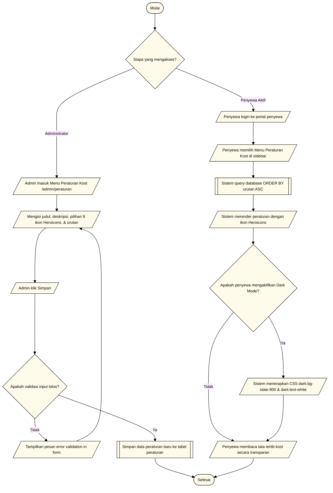
```mermaid
%%{init: {
  'theme': 'base',
  'themeVariables': {
    'primaryColor': '#FFFBEB',
    'primaryTextColor': '#000000',
    'primaryBorderColor': '#000000',
    'lineColor': '#000000',
    'fontSize': '12px',
    'fontFamily': 'Inter, system-ui, sans-serif'
  }
}}%%
flowchart TD
    Start([Mulai]) --> TentukanAktor{"Siapa yang mengakses?"}
    
    TentukanAktor -- "Administrator" --> BukaAdminPeraturan[/Admin masuk Menu Peraturan Kost /admin/peraturan/]
    BukaAdminPeraturan --> FormPeraturan[/Mengisi judul, deskripsi, pilihan 9 ikon Heroicons, & urutan/]
    FormPeraturan --> KlikSimpan[/Admin klik Simpan/]
    KlikSimpan --> ValidasiPeraturan{"Apakah validasi input lolos?"}
    ValidasiPeraturan -- "Tidak" --> TampilErrorPeraturan[/Tampilkan pesan error validation in form/]
    TampilErrorPeraturan --> FormPeraturan
    ValidasiPeraturan -- "Ya" --> SimpanPeraturanDB[[Simpan data peraturan baru ke tabel peraturan]]
    SimpanPeraturanDB --> Selesai([Selesai])
    
    TentukanAktor -- "Penyewa Aktif" --> LoginPortal[/Penyewa login ke portal penyewa/]
    LoginPortal --> BukaMenuPeraturan[/Penyewa memilih Menu Peraturan Kost di sidebar/]
    BukaMenuPeraturan --> QueryPeraturan[[Sistem query database ORDER BY urutan ASC]]
    QueryPeraturan --> RenderTataTertib[/Sistem merender peraturan dengan ikon Heroicons/]
    RenderTataTertib --> CekDarkMode{"Apakah penyewa mengaktifkan Dark Mode?"}
    CekDarkMode -- "Ya" --> ApplyDarkMode[/Sistem menerapkan CSS dark:bg-slate-900 & dark:text-white/]
    CekDarkMode -- "Tidak" --> BacaPeraturan[/Penyewa membaca tata tertib kost secara transparan/]
    ApplyDarkMode --> BacaPeraturan
    BacaPeraturan --> Selesai
```

---

### 2.12. Sub-Flowchart 11: Penonaktifan Penyewa (Checkout) & Pengelolaan Deposit
* **Controller Terkait**: [PenyewaController](file:///c:/xampp/htdocs/asri-boarding-house/app/Http/Controllers/Admin/PenyewaController.php) (method: `checkout`)
* **Model Terkait**: [Penyewa](file:///c:/xampp/htdocs/asri-boarding-house/app/Models/Penyewa.php), [Kamar](file:///c:/xampp/htdocs/asri-boarding-house/app/Models/Kamar.php)

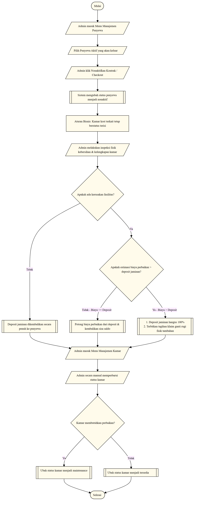

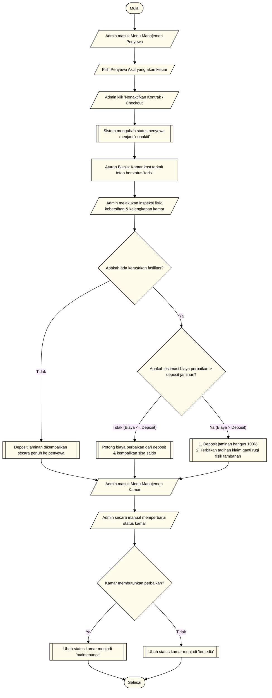
```mermaid
%%{init: {
  'theme': 'base',
  'themeVariables': {
    'primaryColor': '#FFFBEB',
    'primaryTextColor': '#000000',
    'primaryBorderColor': '#000000',
    'lineColor': '#000000',
    'fontSize': '12px',
    'fontFamily': 'Inter, system-ui, sans-serif'
  }
}}%%
flowchart TD
    Start([Mulai]) --> BukaPenyewaAdmin[/Admin masuk Menu Manajemen Penyewa/]
    BukaPenyewaAdmin --> PilihPenyewaCheckout[/Pilih Penyewa Aktif yang akan keluar/]
    PilihPenyewaCheckout --> KlikNonaktifkan[/Admin klik 'Nonaktifkan Kontrak / Checkout'/]
    KlikNonaktifkan --> DBUpdateNonaktif[[Sistem mengubah status penyewa menjadi 'nonaktif']]
    DBUpdateNonaktif --> KamarTerkunci["Aturan Bisnis: Kamar kost terkait tetap berstatus 'terisi'"]
    
    KamarTerkunci --> LakukanInspeksi[/Admin melakukan inspeksi fisik kebersihan & kelengkapan kamar/]
    LakukanInspeksi --> CekFasilitasRusak{"Apakah ada kerusakan fasilitas?"}
    
    CekFasilitasRusak -- "Tidak" --> BalikDepositPenuh[[Deposit jaminan dikembalikan secara penuh ke penyewa]]
    
    CekFasilitasRusak -- "Ya" --> EvaluasiBiaya{"Apakah estimasi biaya perbaikan > deposit jaminan?"}
    EvaluasiBiaya -- "Tidak (Biaya <= Deposit)" --> PotongDeposit[[Potong biaya perbaikan dari deposit & kembalikan sisa saldo]]
    EvaluasiBiaya -- "Ya (Biaya > Deposit)" --> HangusDeposit[[1. Deposit jaminan hangus 100%<br>2. Terbitkan tagihan klaim ganti rugi fisik tambahan]]
    
    BalikDepositPenuh --> BukaMenuKamar[/Admin masuk Menu Manajemen Kamar/]
    PotongDeposit --> BukaMenuKamar
    HangusDeposit --> BukaMenuKamar
    
    BukaMenuKamar --> UpdateKamarManual[/Admin secara manual memperbarui status kamar/]
    UpdateKamarManual --> KamarKondisi{"Kamar membutuhkan perbaikan?"}
    
    KamarKondisi -- "Ya" --> SetStatusMaintenance[[Ubah status kamar menjadi 'maintenance']]
    KamarKondisi -- "Tidak" --> SetStatusTersedia[[Ubah status kamar menjadi 'tersedia']]
    
    SetStatusMaintenance --> Selesai([Selesai])
    SetStatusTersedia --> Selesai
```

---

### 2.13. Sub-Flowchart 12: Live Chat Pengunjung Anonim / Guest Chat
* **Controller Terkait**: [GuestChatApiController](file:///c:/xampp/htdocs/asri-boarding-house/app/Http/Controllers/Api/GuestChatApiController.php), [GuestChatController](file:///c:/xampp/htdocs/asri-boarding-house/app/Http/Controllers/Admin/GuestChatController.php)

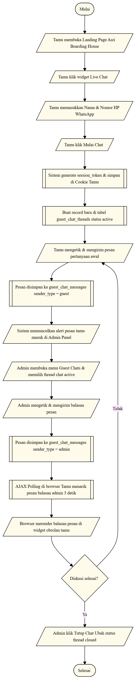

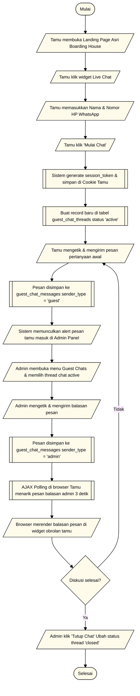
```mermaid
%%{init: {
  'theme': 'base',
  'themeVariables': {
    'primaryColor': '#FFFBEB',
    'primaryTextColor': '#000000',
    'primaryBorderColor': '#000000',
    'lineColor': '#000000',
    'fontSize': '12px',
    'fontFamily': 'Inter, system-ui, sans-serif'
  }
}}%%
flowchart TD
    Start([Mulai]) --> BukaBerandaTamu[/Tamu membuka Landing Page Asri Boarding House/]
    BukaBerandaTamu --> KlikWidgetChat[/Tamu klik widget Live Chat/]
    KlikWidgetChat --> IsiNamaHP[/Tamu memasukkan Nama & Nomor HP WhatsApp/]
    IsiNamaHP --> KlikMulaiChat[/Tamu klik 'Mulai Chat'/]
    
    KlikMulaiChat --> GenerateToken[[Sistem generate session_token & simpan di Cookie Tamu]]
    GenerateToken --> CreateChatThread[[Buat record baru di tabel guest_chat_threads status 'active']]
    CreateChatThread --> KirimPesanTamu[/Tamu mengetik & mengirim pesan pertanyaan awal/]
    KirimPesanTamu --> SimpanPesanTamu[[Pesan disimpan ke guest_chat_messages sender_type = 'guest']]
    
    SimpanPesanTamu --> TampilNotifAdmin[/Sistem memunculkan alert pesan tamu masuk di Admin Panel/]
    TampilNotifAdmin --> BukaChatAdmin[/Admin membuka menu Guest Chats & memilih thread chat active/]
    BukaChatAdmin --> BalasPesanAdmin[/Admin mengetik & mengirim balasan pesan/]
    BalasPesanAdmin --> SimpanPesanAdmin[[Pesan disimpan ke guest_chat_messages sender_type = 'admin']]
    
    SimpanPesanAdmin --> AJAXPollingTamu[[AJAX Polling di browser Tamu menarik pesan balasan admin 3 detik]]
    AJAXPollingTamu --> RenderPesanAdmin[/Browser merender balasan pesan di widget obrolan tamu/]
    RenderPesanAdmin --> CekDiskusiSelesai{"Diskusi selesai?"}
    
    CekDiskusiSelesai -- "Tidak" --> KirimPesanTamu
    CekDiskusiSelesai -- "Ya" --> TutupChatAdmin[/Admin klik 'Tutup Chat' Ubah status thread 'closed'/]
    TutupChatAdmin --> Selesai([Selesai])
```

---

### 2.14. Sub-Flowchart 13: Keamanan Login & Force Change Password Pertama Kali
* **Controller Terkait**: [AdminLoginController](file:///c:/xampp/htdocs/asri-boarding-house/app/Http/Controllers/Auth/AdminLoginController.php), [PenyewaLoginController](file:///c:/xampp/htdocs/asri-boarding-house/app/Http/Controllers/Auth/PenyewaLoginController.php)
* **Middleware Terkait**: [EnsurePasswordChanged](file:///c:/xampp/htdocs/asri-boarding-house/app/Http/Middleware/EnsurePasswordChanged.php)

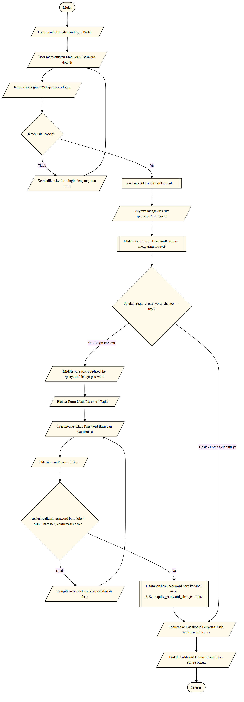

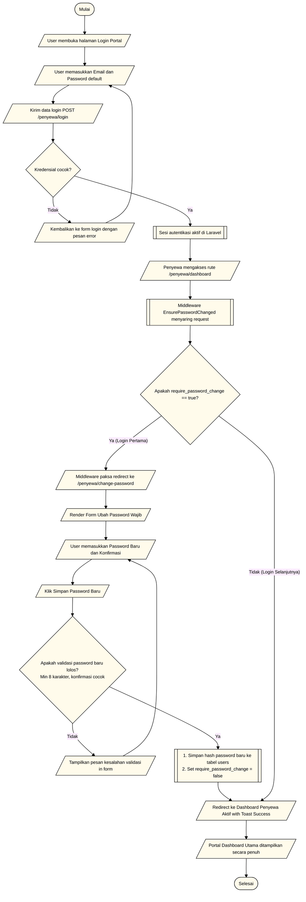
```mermaid
%%{init: {
  'theme': 'base',
  'themeVariables': {
    'primaryColor': '#FFFBEB',
    'primaryTextColor': '#000000',
    'primaryBorderColor': '#000000',
    'lineColor': '#000000',
    'fontSize': '12px',
    'fontFamily': 'Inter, system-ui, sans-serif'
  }
}}%%
flowchart TD
    Start([Mulai]) --> BukaFormLogin[/User membuka halaman Login Portal/]
    BukaFormLogin --> InputKredensial[/User memasukkan Email dan Password default/]
    InputKredensial --> KirimLogin[/Kirim data login POST /penyewa/login/]
    
    KirimLogin --> CekKredensial{"Kredensial cocok?"}
    CekKredensial -- "Tidak" --> TampilErrorLogin[/Kembalikan ke form login dengan pesan error/]
    TampilErrorLogin --> InputKredensial
    
    CekKredensial -- "Ya" --> SesiAktif[[Sesi autentikasi aktif di Laravel]]
    SesiAktif --> AksesDashboard[/Penyewa mengakses rute /penyewa/dashboard/]
    AksesDashboard --> SaringMiddleware[[Middleware EnsurePasswordChanged menyaring request]]
    
    SaringMiddleware --> CekFlag{"Apakah require_password_change == true?"}
    
    CekFlag -- "Ya (Login Pertama)" --> InterceptRedirect[/Middleware paksa redirect ke /penyewa/change-password/]
    InterceptRedirect --> TampilFormUbahPwd[/Render Form Ubah Password Wajib/]
    TampilFormUbahPwd --> UserInputPwd[/User memasukkan Password Baru dan Konfirmasi/]
    UserInputPwd --> KlikSimpanPwd[/Klik Simpan Password Baru/]
    
    KlikSimpanPwd --> ValidasiPwd{"Apakah validasi password baru lolos?<br>Min 8 karakter, konfirmasi cocok"}
    ValidasiPwd -- "Tidak" --> TampilErrorPwdForm[/Tampilkan pesan kesalahan validasi in form/]
    TampilErrorPwdForm --> UserInputPwd
    
    ValidasiPwd -- "Ya" --> SimpanPwdDB[[1. Simpan hash password baru ke tabel users<br>2. Set require_password_change = false]]
    SimpanPwdDB --> RedirectDashboard[/Redirect ke Dashboard Penyewa Aktif with Toast Success/]
    
    CekFlag -- "Tidak (Login Selanjutnya)" --> RedirectDashboard
    RedirectDashboard --> TampilkanDashboardPenuh[/Portal Dashboard Utama ditampilkan secara penuh/]
    TampilkanDashboardPenuh --> Selesai([Selesai])
```

---

### 2.15. Sub-Flowchart 14: Penghapusan Reservasi Batal & Pembersihan Cascade Chat
* **Controller Terkait**: [ReservasiController](file:///c:/xampp/htdocs/asri-boarding-house/app/Http/Controllers/Admin/ReservasiController.php) (method: `destroy`)

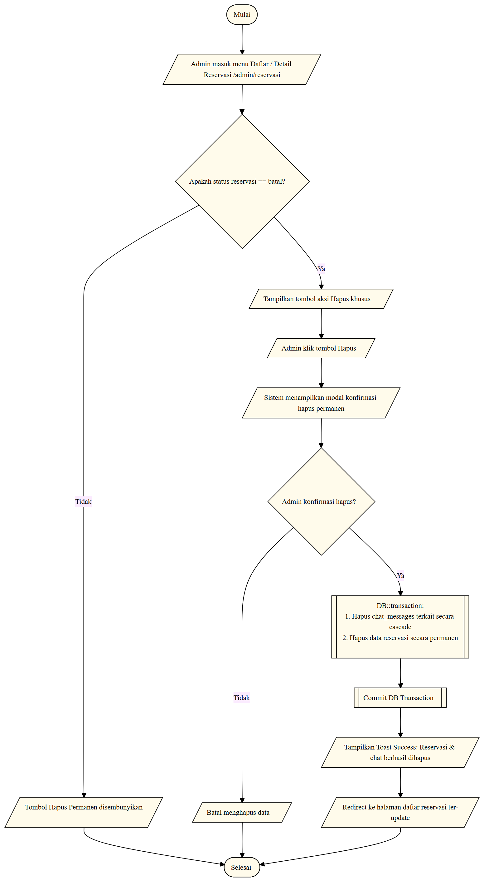

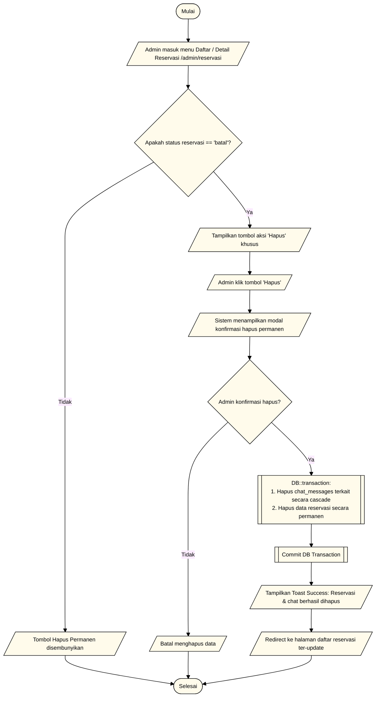
```mermaid
%%{init: {
  'theme': 'base',
  'themeVariables': {
    'primaryColor': '#FFFBEB',
    'primaryTextColor': '#000000',
    'primaryBorderColor': '#000000',
    'lineColor': '#000000',
    'fontSize': '12px',
    'fontFamily': 'Inter, system-ui, sans-serif'
  }
}}%%
flowchart TD
    Start([Mulai]) --> BukaReservasi[/Admin masuk menu Daftar / Detail Reservasi /admin/reservasi/]
    BukaReservasi --> CekStatusBatal{"Apakah status reservasi == 'batal'?"}
    
    CekStatusBatal -- "Tidak" --> SembunyikanTombol[/Tombol Hapus Permanen disembunyikan/]
    SembunyikanTombol --> Selesai([Selesai])
    
    CekStatusBatal -- "Ya" --> TampilkanTombol[/Tampilkan tombol aksi 'Hapus' khusus/]
    TampilkanTombol --> KlikHapus[/Admin klik tombol 'Hapus'/]
    KlikHapus --> TampilModal[/Sistem menampilkan modal konfirmasi hapus permanen/]
    
    TampilModal --> Konfirmasi{"Admin konfirmasi hapus?"}
    Konfirmasi -- "Tidak" --> BatalHapus[/Batal menghapus data/]
    BatalHapus --> Selesai
    
    Konfirmasi -- "Ya" --> DBTrans[[DB::transaction:<br>1. Hapus chat_messages terkait secara cascade<br>2. Hapus data reservasi secara permanen]]
    DBTrans --> CommitTx[[Commit DB Transaction]]
    CommitTx --> ToastSuccess[/Tampilkan Toast Success: Reservasi & chat berhasil dihapus/]
    ToastSuccess --> RedirectDaftar[/Redirect ke halaman daftar reservasi ter-update/]
    RedirectDaftar --> Selesai
```

---

### 2.16. Sub-Flowchart 15: Pendaftaran Penyewa Offline / WhatsApp Direct & Input Deposit
* **Controller Terkait**: [PenyewaController](file:///c:/xampp/htdocs/asri-boarding-house/app/Http/Controllers/Admin/PenyewaController.php) (method: `store`)

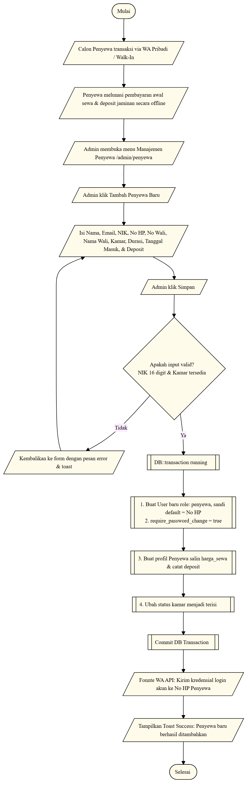

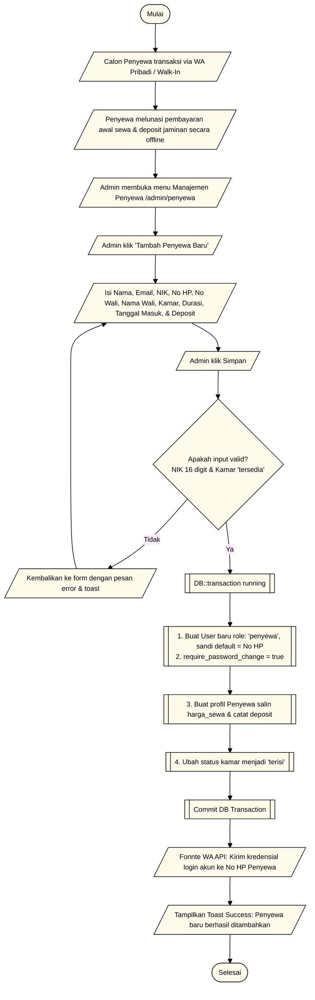
```mermaid
%%{init: {
  'theme': 'base',
  'themeVariables': {
    'primaryColor': '#FFFBEB',
    'primaryTextColor': '#000000',
    'primaryBorderColor': '#000000',
    'lineColor': '#000000',
    'fontSize': '12px',
    'fontFamily': 'Inter, system-ui, sans-serif'
  }
}}%%
flowchart TD
    Start([Mulai]) --> WalkIn[/Calon Penyewa transaksi via WA Pribadi / Walk-In/]
    WalkIn --> BayarOffline[/Penyewa melunasi pembayaran awal sewa & deposit jaminan secara offline/]
    BayarOffline --> BukaMenuPenyewa[/Admin membuka menu Manajemen Penyewa /admin/penyewa/]
    
    BukaMenuPenyewa --> KlikTambah[/Admin klik 'Tambah Penyewa Baru'/]
    KlikTambah --> IsiFormPenyewa[/Isi Nama, Email, NIK, No HP, No Wali, Nama Wali, Kamar, Durasi, Tanggal Masuk, & Deposit/]
    
    IsiFormPenyewa --> KlikSimpan[/Admin klik Simpan/]
    
    KlikSimpan --> ValidasiForm{"Apakah input valid?<br>NIK 16 digit & Kamar 'tersedia'"}
    ValidasiForm -- "Tidak" --> TampilError[/Kembalikan ke form dengan pesan error & toast/]
    TampilError --> IsiFormPenyewa
    
    ValidasiForm -- "Ya" --> DBTrans[[DB::transaction running]]
    DBTrans --> AutoCreateUser[[1. Buat User baru role: 'penyewa', sandi default = No HP<br>2. require_password_change = true]]
    AutoCreateUser --> CreateProfil[[3. Buat profil Penyewa salin harga_sewa & catat deposit]]
    CreateProfil --> LockKamar[[4. Ubah status kamar menjadi 'terisi']]
    
    LockKamar --> CommitTx[[Commit DB Transaction]]
    CommitTx --> CallFonnte[/Fonnte WA API: Kirim kredensial login akun ke No HP Penyewa/]
    CallFonnte --> ToastSuccess[/Tampilkan Toast Success: Penyewa baru berhasil ditambahkan/]
    ToastSuccess --> Selesai([Selesai])
```

---

### 2.17. Sub-Flowchart 16: Manajemen Kamar & Proteksi Penghapusan Kamar Aktif
* **Controller Terkait**: [KamarController](file:///c:/xampp/htdocs/asri-boarding-house/app/Http/Controllers/Admin/KamarController.php)

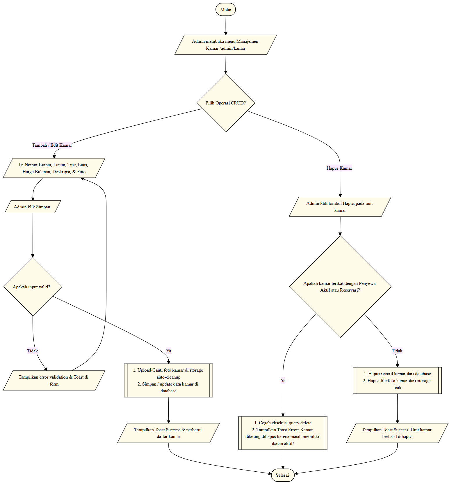

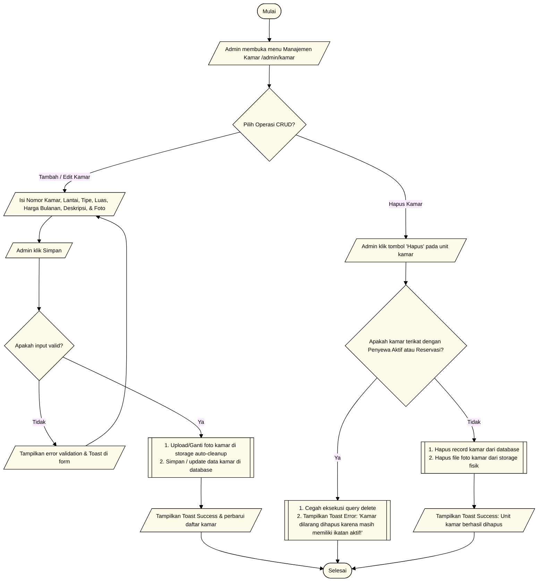
```mermaid
%%{init: {
  'theme': 'base',
  'themeVariables': {
    'primaryColor': '#FFFBEB',
    'primaryTextColor': '#000000',
    'primaryBorderColor': '#000000',
    'lineColor': '#000000',
    'fontSize': '12px',
    'fontFamily': 'Inter, system-ui, sans-serif'
  }
}}%%
flowchart TD
    Start([Mulai]) --> BukaKamarAdmin[/Admin membuka menu Manajemen Kamar /admin/kamar/]
    BukaKamarAdmin --> PilihAksi{"Pilih Operasi CRUD?"}
    
    PilihAksi -- "Tambah / Edit Kamar" --> IsiFormKamar[/Isi Nomor Kamar, Lantai, Tipe, Luas, Harga Bulanan, Deskripsi, & Foto/]
    IsiFormKamar --> KlikSimpanKamar[/Admin klik Simpan/]
    KlikSimpanKamar --> ValidasiKamar{"Apakah input valid?"}
    ValidasiKamar -- "Tidak" --> ErrorKamar[/Tampilkan error validation & Toast di form/]
    ErrorKamar --> IsiFormKamar
    ValidasiKamar -- "Ya" --> SimpanKamarDB[[1. Upload/Ganti foto kamar di storage auto-cleanup<br>2. Simpan / update data kamar di database]]
    SimpanKamarDB --> SelesaiKamar[/Tampilkan Toast Success & perbarui daftar kamar/]
    SelesaiKamar --> Selesai([Selesai])
    
    PilihAksi -- "Hapus Kamar" --> KlikHapusKamar[/Admin klik tombol 'Hapus' pada unit kamar/]
    KlikHapusKamar --> CekIkatan{"Apakah kamar terikat dengan Penyewa Aktif atau Reservasi?"}
    
    CekIkatan -- "Ya" --> CegahHapus[[1. Cegah eksekusi query delete<br>2. Tampilkan Toast Error: 'Kamar dilarang dihapus karena masih memiliki ikatan aktif!']]
    CegahHapus --> Selesai
    
    CekIkatan -- "Tidak" --> HapusKamarDB[[1. Hapus record kamar dari database<br>2. Hapus file foto kamar dari storage fisik]]
    HapusKamarDB --> ToastHapusSukses[/Tampilkan Toast Success: Unit kamar berhasil dihapus/]
    ToastHapusSukses --> Selesai
```

---

### 2.18. Sub-Flowchart 17: Otentikasi Laravel Socialite (Google Login) & Complete Profile
* **Controller Terkait**: [SocialiteController](file:///c:/xampp/htdocs/asri-boarding-house/app/Http/Controllers/Auth/SocialiteController.php)
* **Middleware Terkait**: [EnsureProfileIsComplete](file:///c:/xampp/htdocs/asri-boarding-house/app/Http/Middleware/EnsureProfileIsComplete.php)

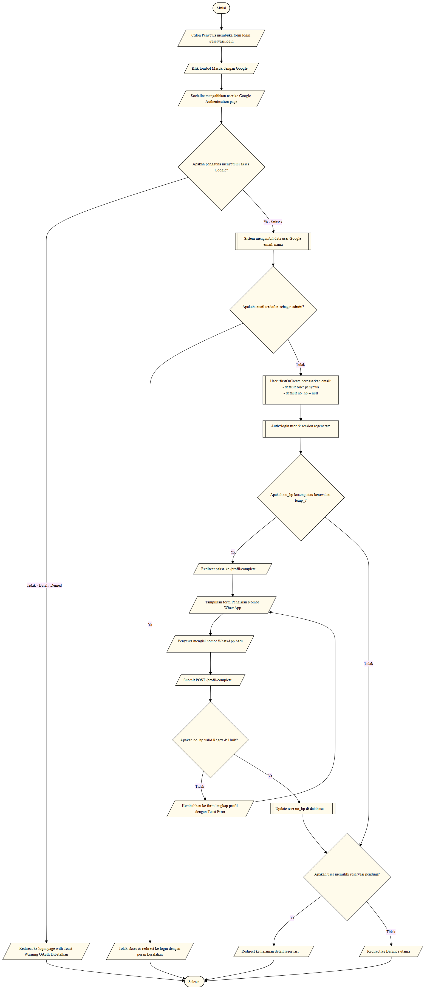

```mermaid
%%{init: {
  'theme': 'base',
  'themeVariables': {
    'primaryColor': '#FFFBEB',
    'primaryTextColor': '#000000',
    'primaryBorderColor': '#000000',
    'lineColor': '#000000',
    'fontSize': '12px',
    'fontFamily': 'Inter, system-ui, sans-serif'
  }
}}%%
flowchart TD
    Start([Mulai]) --> UserLogin[/Calon Penyewa membuka form login /reservasi/login/]
    UserLogin --> KlikGoogle[/Klik tombol 'Masuk dengan Google'/]
    KlikGoogle --> RedirectGoogle[/Socialite mengalihkan user ke Google Authentication page/]
    
    RedirectGoogle --> CekOAuthResult{"Apakah pengguna menyetujui akses Google?"}
    CekOAuthResult -- "Tidak (Batal / Denied)" --> RedirectCancel[/Redirect ke login page with Toast Warning OAuth Dibatalkan/]
    RedirectCancel --> Selesai([Selesai])
    
    CekOAuthResult -- "Ya (Sukses)" --> FetchGoogleUser[[Sistem mengambil data user Google email, nama]]
    FetchGoogleUser --> CekAdmin{"Apakah email terdaftar sebagai admin?"}
    CekAdmin -- "Ya" --> RejectOAuth[/Tolak akses & redirect ke login dengan pesan kesalahan/]
    RejectOAuth --> Selesai
    
    CekAdmin -- "Tidak" --> GetOrCreateUser[[User::firstOrCreate berdasarkan email:<br>- default role: 'penyewa'<br>- default no_hp = null]]
    
    GetOrCreateUser --> LoginUser[[Auth::login(user) & session regenerate]]
    LoginUser --> CheckProfileComplete{"Apakah no_hp kosong atau berawalan 'temp_'?"}
    
    CheckProfileComplete -- "Ya" --> RedirectCompleteProfile[/Redirect paksa ke /profil/complete/]
    RedirectCompleteProfile --> ViewCompleteForm[/Tampilkan form Pengisian Nomor WhatsApp/]
    ViewCompleteForm --> InputNoHP[/Penyewa mengisi nomor WhatsApp baru/]
    InputNoHP --> SubmitForm[/Submit POST /profil/complete/]
    SubmitForm --> ValidasiNoHP{"Apakah no_hp valid Regex & Unik?"}
    ValidasiNoHP -- "Tidak" --> ErrorValidation[/Kembalikan ke form lengkap profil dengan Toast Error/]
    ErrorValidation --> ViewCompleteForm
    ValidasiNoHP -- "Ya" --> UpdateUser[[Update user.no_hp di database]]
    UpdateUser --> CheckPendingReservasi{"Apakah user memiliki reservasi pending?"}
    
    CheckProfileComplete -- "Tidak" --> CheckPendingReservasi
    
    CheckPendingReservasi -- "Ya" --> RedirectReservasi[/Redirect ke halaman detail reservasi/]
    CheckPendingReservasi -- "Tidak" --> RedirectLanding[/Redirect ke Beranda utama /]
    
    RedirectReservasi --> Selesai
    RedirectLanding --> Selesai
```

---

### 2.19. Sub-Flowchart 18: Callback Webhook Midtrans & Verifikasi Signature
* **Controller Terkait**: [MidtransCallbackController](file:///c:/xampp/htdocs/asri-boarding-house/app/Http/Controllers/Api/MidtransCallbackController.php)

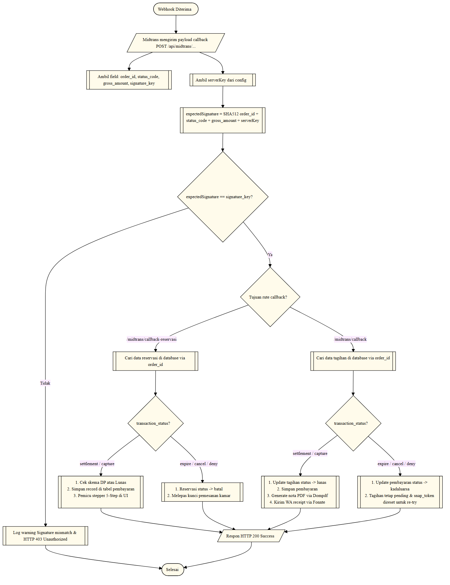

```mermaid
%%{init: {
  'theme': 'base',
  'themeVariables': {
    'primaryColor': '#FFFBEB',
    'primaryTextColor': '#000000',
    'primaryBorderColor': '#000000',
    'lineColor': '#000000',
    'fontSize': '12px',
    'fontFamily': 'Inter, system-ui, sans-serif'
  }
}}%%
flowchart TD
    Start([Webhook Diterima]) --> GetPayload[/Midtrans mengirim payload callback POST /api/midtrans/.../]
    GetPayload --> ExtractFields[[Ambil field: order_id, status_code, gross_amount, signature_key]]
    GetPayload --> LoadServerKey[[Ambil serverKey dari config]]
    
    ExtractFields --> CalcSignature[[expectedSignature = SHA512 order_id + status_code + gross_amount + serverKey]]
    LoadServerKey --> CalcSignature
    CalcSignature --> VerifySig{"expectedSignature == signature_key?"}
    
    VerifySig -- "Tidak" --> RejectSig[[Log warning Signature mismatch & HTTP 403 Unauthorized]]
    RejectSig --> Selesai([Selesai])
    
    VerifySig -- "Ya" --> RouteCallback{"Tujuan rute callback?"}
    
    RouteCallback -- "/midtrans/callback-reservasi" --> GetReservasi[[Cari data reservasi di database via order_id]]
    GetReservasi --> ReservasiStatus{"transaction_status?"}
    
    ReservasiStatus -- "settlement / capture" --> SetReservasiBayar[[1. Cek skema DP atau Lunas<br>2. Simpan record di tabel pembayaran<br>3. Pemicu stepper 5-Step di UI]]
    ReservasiStatus -- "expire / cancel / deny" --> SetReservasiBatal[[1. Reservasi status -> batal<br>2. Melepas kunci pemesanan kamar]]
    ReservasiStatus -- "pending" --> ResponPending[/Respon HTTP 200: Menunggu Pembayaran Selesai/]
    
    RouteCallback -- "/midtrans/callback" --> GetTagihan[[Cari data tagihan di database via order_id]]
    GetTagihan --> TagihanStatus{"transaction_status?"}
    
    TagihanStatus -- "settlement / capture" --> SetTagihanLunas[[1. Update tagihan status -> lunas<br>2. Simpan pembayaran<br>3. Generate nota PDF via Dompdf<br>4. Kirim WA receipt via Fonnte]]
    TagihanStatus -- "expire / cancel / deny" --> SetTagihanGagal[[1. Update pembayaran status -> kadaluarsa<br>2. Tagihan tetap pending & snap_token direset untuk re-try]]
    TagihanStatus -- "pending" --> ResponPending
    
    SetReservasiBayar --> ResponSuccess[/Respon HTTP 200 Success/]
    SetReservasiBatal --> ResponSuccess
    SetTagihanLunas --> ResponSuccess
    SetTagihanGagal --> ResponSuccess
    ResponPending --> Selesai
    
    ResponSuccess --> Selesai
```

---

### 2.20. Sub-Flowchart 19: Manajemen Master Fasilitas & Proteksi Penghapusan
* **Controller Terkait**: [FasilitasController](file:///c:/xampp/htdocs/asri-boarding-house/app/Http/Controllers/Admin/FasilitasController.php)

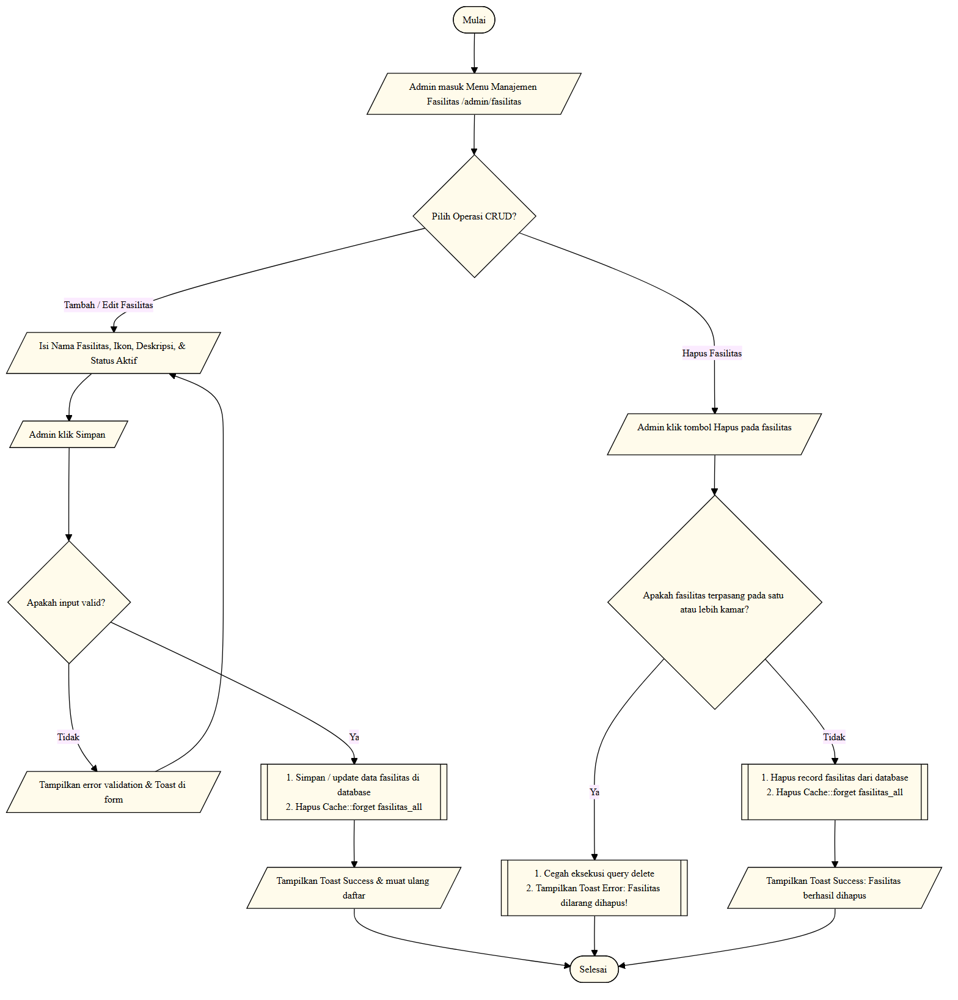

```mermaid
%%{init: {
  'theme': 'base',
  'themeVariables': {
    'primaryColor': '#FFFBEB',
    'primaryTextColor': '#000000',
    'primaryBorderColor': '#000000',
    'lineColor': '#000000',
    'fontSize': '12px',
    'fontFamily': 'Inter, system-ui, sans-serif'
  }
}}%%
flowchart TD
    Start([Mulai]) --> BukaFasilitas[/Admin masuk Menu Manajemen Fasilitas /admin/fasilitas/]
    BukaFasilitas --> PilihAksi{"Pilih Operasi CRUD?"}
    
    PilihAksi -- "Tambah / Edit Fasilitas" --> IsiFormFasilitas[/Isi Nama Fasilitas, Ikon, Deskripsi, & Status Aktif/]
    IsiFormFasilitas --> KlikSimpan[/Admin klik Simpan/]
    KlikSimpan --> ValidasiFasilitas{"Apakah input valid?"}
    ValidasiFasilitas -- "Tidak" --> ErrorFasilitas[/Tampilkan error validation & Toast di form/]
    ErrorFasilitas --> IsiFormFasilitas
    ValidasiFasilitas -- "Ya" --> SimpanDB[[1. Simpan / update data fasilitas di database<br>2. Hapus Cache::forget fasilitas_all]]
    SimpanDB --> SuccessToast[/Tampilkan Toast Success & muat ulang daftar/]
    SuccessToast --> Selesai([Selesai])
    
    PilihAksi -- "Hapus Fasilitas" --> KlikHapus[/Admin klik tombol 'Hapus' pada fasilitas/]
    KlikHapus --> CekIkatan{"Apakah fasilitas terpasang pada satu atau lebih kamar?"}
    
    CekIkatan -- "Ya" --> CegahHapus[[1. Cegah eksekusi query delete<br>2. Tampilkan Toast Error: Fasilitas dilarang dihapus!]]
    CegahHapus --> Selesai
    
    CekIkatan -- "Tidak" --> HapusDB[[1. Hapus record fasilitas dari database<br>2. Hapus Cache::forget fasilitas_all]]
    HapusDB --> SuccessHapusToast[/Tampilkan Toast Success: Fasilitas berhasil dihapus/]
    SuccessHapusToast --> Selesai
```

---

### 2.21. Sub-Flowchart 20: Manajemen Penyewa & Validasi Kontrak
* **Controller Terkait**: [PenyewaController](file:///c:/xampp/htdocs/asri-boarding-house/app/Http/Controllers/Admin/PenyewaController.php)

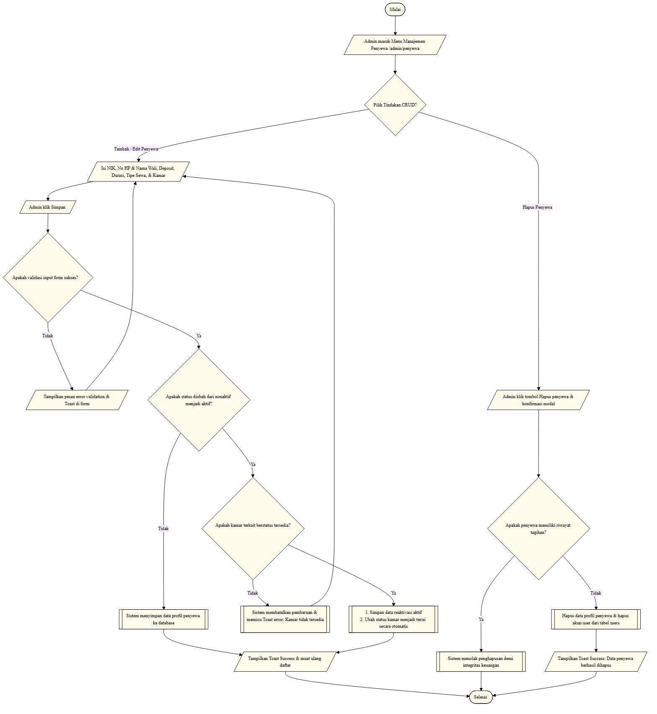

```mermaid
%%{init: {
  'theme': 'base',
  'themeVariables': {
    'primaryColor': '#FFFBEB',
    'primaryTextColor': '#000000',
    'primaryBorderColor': '#000000',
    'lineColor': '#000000',
    'fontSize': '12px',
    'fontFamily': 'Inter, system-ui, sans-serif'
  }
}}%%
flowchart TD
    Start([Mulai]) --> BukaMenuPenyewa[/Admin masuk Menu Manajemen Penyewa /admin/penyewa/]
    BukaMenuPenyewa --> PilihAksi{"Pilih Tindakan CRUD?"}
    
    PilihAksi -- "Tambah / Edit Penyewa" --> IsiFormPenyewa[/Isi NIK, No HP & Nama Wali, Deposit, Durasi, Tipe Sewa, & Kamar/]
    IsiFormPenyewa --> KlikSimpan[/Admin klik Simpan/]
    KlikSimpan --> ValidasiForm{"Apakah validasi input form sukses?"}
    ValidasiForm -- "Tidak" --> TampilError[/Tampilkan pesan error validation & Toast di form/]
    TampilError --> IsiFormPenyewa
    
    ValidasiForm -- "Ya" --> CekReaktivasi{"Apakah status diubah dari nonaktif menjadi aktif?"}
    CekReaktivasi -- "Tidak" --> SimpanDB[[Sistem menyimpan data profil penyewa ke database]]
    SimpanDB --> SuccessToast[/Tampilkan Toast Success & muat ulang daftar/]
    SuccessToast --> Selesai([Selesai])
    
    CekReaktivasi -- "Ya" --> CekKetersediaanKamar{"Apakah kamar terkait berstatus 'tersedia'?"}
    CekKetersediaanKamar -- "Tidak" --> BlockReaktivasi[[Sistem membatalkan pembaruan & memicu Toast error: Kamar tidak tersedia]]
    BlockReaktivasi --> IsiFormPenyewa
    CekKetersediaanKamar -- "Ya" --> SimpanReaktivasi[[1. Simpan data reaktivasi aktif<br>2. Ubah status kamar menjadi 'terisi' secara otomatis]]
    SimpanReaktivasi --> SuccessToast
    
    PilihAksi -- "Hapus Penyewa" --> KlikHapus[/Admin klik tombol 'Hapus' penyewa & konfirmasi modal/]
    KlikHapus --> CekRiwayatTagihan{"Apakah penyewa memiliki riwayat tagihan?"}
    
    CekRiwayatTagihan -- "Ya" --> BlockDelete[[Sistem menolak penghapusan demi integritas keuangan]]
    BlockDelete --> Selesai
    
    CekRiwayatTagihan -- "Tidak" --> HapusDB[[Hapus data profil penyewa & hapus akun user dari tabel users]]
    HapusDB --> SuccessHapusToast[/Tampilkan Toast Success: Data penyewa berhasil dihapus/]
    SuccessHapusToast --> Selesai
```

---

### 2.22. Sub-Flowchart 21: Broadcast Notifikasi Massal & Re-send Engine
* **Controller Terkait**: [PengumumanController](file:///c:/xampp/htdocs/asri-boarding-house/app/Http/Controllers/Admin/PengumumanController.php)
* **Model Terkait**: [LogNotifikasi](file:///c:/xampp/htdocs/asri-boarding-house/app/Models/LogNotifikasi.php), [User](file:///c:/xampp/htdocs/asri-boarding-house/app/Models/User.php)

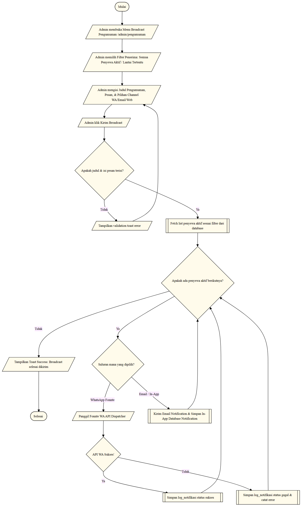

```mermaid
%%{init: {
  'theme': 'base',
  'themeVariables': {
    'primaryColor': '#FFFBEB',
    'primaryTextColor': '#000000',
    'primaryBorderColor': '#000000',
    'lineColor': '#000000',
    'fontSize': '12px',
    'fontFamily': 'Inter, system-ui, sans-serif'
  }
}}%%
flowchart TD
    Start([Mulai]) --> BukaBroadcastAdmin[/Admin membuka Menu Broadcast Pengumuman /admin/pengumuman/]
    BukaBroadcastAdmin --> PilihPenerima[/Admin memilih Filter Penerima: Semua Penyewa Aktif / Lantai Tertentu/]
    PilihPenerima --> IsiKonten[/Admin mengisi Judul Pengumuman, Pesan, & Pilihan Channel WA/Email/Web/]
    IsiKonten --> KlikBroadcast[/Admin klik 'Kirim Broadcast'/]
    
    KlikBroadcast --> ValidasiForm{"Apakah judul & isi pesan terisi?"}
    ValidasiForm -- "Tidak" --> TampilError[/Tampilkan validation toast error/]
    TampilError --> IsiKonten
    
    ValidasiForm -- "Ya" --> QueryPenerima[[Fetch list penyewa aktif sesuai filter dari database]]
    QueryPenerima --> LoopPenerima{"Apakah ada penyewa aktif berikutnya?"}
    
    LoopPenerima -- "Tidak" --> BroadcastFinish[/Tampilkan Toast Success: Broadcast selesai dikirim/]
    BroadcastFinish --> Selesai([Selesai])
    
    LoopPenerima -- "Ya" --> CekChannel{"Saluran mana yang dipilih?"}
    
    CekChannel -- "WhatsApp Fonnte" --> CallWA[/Panggil Fonnte WA API Dispatcher/]
    CallWA --> CekWASukses{"API WA Sukses?"}
    CekWASukses -- "Ya" --> LogWASukses[[Simpan log_notifikasi status 'sukses']]
    CekWASukses -- "Tidak" --> LogWAGagal[[Simpan log_notifikasi status 'gagal' & catat error]]
    LogWASukses --> LoopPenerima
    LogWAGagal --> LoopPenerima
    
    CekChannel -- "Email / In-App" --> SendMailWeb[[Kirim Email Notification & Simpan In-App Database Notification]]
    SendMailWeb --> LoopPenerima
```

---

## 3. Glosarium Simbol Flowchart (Standard ISO 5807 / ANSI)

* **Terminator (`([Teks])`)**: Menandakan titik awal (*Start*) atau titik akhir (*Selesai*) dari suatu alur proses sistem.
* **Input / Output (`[/Teks/]`)**: Menyatakan operasi pembacaan data input dari pengguna (form NIK, filter, klik tombol) atau luaran sistem (render visual UI, kirim notifikasi WA, download berkas PDF).
* **Proses / Persegi (`["Teks"]`)**: Mewakili instruksi komputasi internal, penugasan variabel memori, atau aturan bisnis umum.
* **Sub-Proses / Transaksi Atomik (`[[Teks]]`)**: Menunjukkan instruksi pra-definisi atau serangkaian proses internal yang berjalan dalam transaksi database atomik `DB::transaction()` atau scheduler batch command.
* **Keputusan / Belah Ketupat (`{"Teks"}`)**: Menunjukkan titik percabangan kondisional yang memerlukan evaluasi logika Ya/Tidak atau evaluasi opsi status.
* **Aliran / Panah (`-->`)**: Menghubungkan satu simbol dengan simbol lainnya untuk menggambarkan arah aliran kontrol & eksekusi.

---

## 4. Matriks Keterhubungan Antar-Diagram & Arsitektur Sistem

| Entitas / Proses Bisnis | Use Case | Activity Diagram | State Machine | Class Diagram | ERD Diagram | Flowchart |
| :--- | :---: | :---: | :---: | :---: | :---: | :---: |
| **Pencarian Kamar** | UC-01 | AD-01 | `Kamar::tersedia` | `LandingController` | `kamar` | Sub-FC 1 |
| **Reservasi & Payment** | UC-02, UC-03 | AD-02, AD-03 | `Reservasi::pending->dp/lunas` | `ReservasiController` | `reservasi`, `pembayaran` | Sub-FC 2, Sub-FC 3 |
| **Konfirmasi & Aktivasi**| UC-16 | AD-04 | `User::require_password_change` | `ReservasiController@confirm` | `penyewa`, `users` | Sub-FC 4 |
| **Billing & Denda 5%** | UC-07, UC-21 | AD-05, AD-06 | `Tagihan::pending->lunas/denda`| `BillingService`, `Tagihan` | `tagihan`, `log_notifikasi` | Sub-FC 5, Sub-FC 6 |
| **Keluhan Fasilitas** | UC-08, UC-22 | AD-07 | `Keluhan::pending->diproses->selesai`| `KeluhanController` | `keluhan` | Sub-FC 7 |
| **Checkout & Deposit** | UC-18 | AD-11 | `Penyewa::aktif->nonaktif` | `PenyewaController@checkout` | `penyewa`, `kamar` | Sub-FC 11 |
| **Keamanan Password** | UC-06 | AD-13 | `require_password_change: false` | `EnsurePasswordChanged` | `users` | Sub-FC 13 |
| **Webhook Midtrans** | UC-26 | AD-18 | SHA-512 Verification | `MidtransCallbackController` | `pembayaran`, `tagihan` | Sub-FC 18 |
