# Sequence Diagram - Asri Boarding House

Dokumen ini mendokumentasikan spesifikasi **Sequence Diagram (Diagram Urutan)** untuk **Sistem Informasi Manajemen Kost Terintegrasi Payment Gateway pada Asri Boarding House**. Setiap diagram memetakan interaksi terperinci antara Aktor, antarmuka pengguna (View), pengontrol logic (Controller), model Eloquent, database MySQL, serta API pihak ketiga (Midtrans Payment Gateway dan Fonnte WhatsApp API) yang menyusun arsitektur sistem MVC 3-Tier.

---

## 1. Daftar Sequence Diagram

Berikut adalah 21 Sequence Diagram utama yang mendeskripsikan siklus hidup dan operasional sistem secara kronologis:

1. **Sequence Diagram 1**: Pencarian, Cek Ketersediaan Kamar & Simulasi Harga (Guest / Calon Penyewa)
2. **Sequence Diagram 2**: Pendaftaran & Pembuatan Reservasi Kamar (Calon Penyewa)
3. **Sequence Diagram 3**: Pembayaran Reservasi & Chat Box Diskusi Pre-Pembayaran (Calon Penyewa & Midtrans Snap)
4. **Sequence Diagram 4**: Verifikasi & Konfirmasi Reservasi Baru (Admin & Penyewa Baru)
5. **Sequence Diagram 5**: Siklus Billing Rutin Bulanan & Reminder Habis Kontrak Otomatis (Sistem Scheduler)
6. **Sequence Diagram 6**: Pembayaran Tagihan Bulanan (Penyewa Aktif, Admin, Midtrans Snap & Fonnte WA)
7. **Sequence Diagram 7**: Pelaporan & Resolusi Keluhan Fasilitas (Penyewa Aktif & Admin)
8. **Sequence Diagram 8**: Pencatatan Pengeluaran & Integrasi Laporan Arus Kas (Admin)
9. **Sequence Diagram 9**: Manajemen Konten Dinamis - FAQ, Galeri, Ulasan (Admin)
10. **Sequence Diagram 10**: Manajemen Peraturan & Tata Tertib Kost (Admin & Penyewa Aktif)
11. **Sequence Diagram 11**: Penonaktifan Penyewa (Checkout) & Pengelolaan Deposit (Admin)
12. **Sequence Diagram 12**: Live Chat Pengunjung Anonim / Guest Chat (Guest & Admin)
13. **Sequence Diagram 13**: Keamanan Login & Force Change Password Pertama Kali (Admin Baru / Administrator)
14. **Sequence Diagram 14**: Manajemen Kamar & Relasi Fasilitas (Admin)
15. **Sequence Diagram 15**: Manajemen Penyewa & Validasi Kontrak (Admin)
16. **Sequence Diagram 16**: Google OAuth Login & Kelengkapan Profil (User / Guest)
17. **Sequence Diagram 17**: Pembatalan & Penghapusan Permanen Reservasi Batal (Admin & Calon Penyewa)
18. **Sequence Diagram 18**: Broadcast Pengumuman & Manajemen Notifikasi Manual/Gagal (Admin & Penyewa)
19. **Sequence Diagram 19**: Visualisasi Dasbor Kalender Aktivitas & Agenda Kost (Admin)
20. **Sequence Diagram 20**: Visualisasi Metrik & Tren Grafik Keuangan Dasbor Utama (Admin)
21. **Sequence Diagram 21**: Permohonan & Reset Password Akun Pengguna / Admin (User / Admin)

---

## 2. Visualisasi & Alur Detail Sequence Diagram

### 2.0. Peta Hubungan Alur Sequence Diagram (Sequence Diagram Flow Map)
Diagram alir di bawah ini menggambarkan peta hubungan kronologis dan logis antara ke-21 Sequence Diagram yang menyusun operasional Asri Boarding House secara keseluruhan:

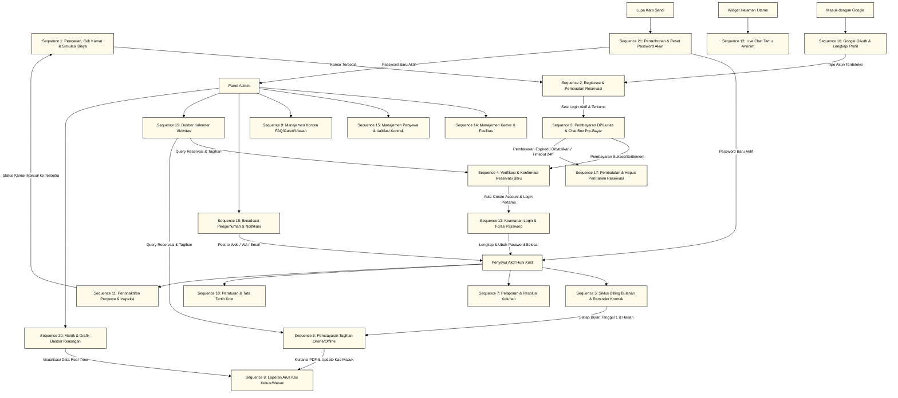
```mermaid
%%{init: {
  'theme': 'base',
  'themeVariables': {
    'primaryColor': '#FFFBEB',
    'primaryTextColor': '#000000',
    'primaryBorderColor': '#000000',
    'lineColor': '#000000',
    'secondaryColor': '#FDE047',
    'tertiaryColor': '#FFFFFF',
    'edgeLabelBackground': '#FFFFFF',
    'fontSize': '12px',
    'fontFamily': 'Inter, system-ui, sans-serif'
  }
}}%%
flowchart TD
    SD1[Sequence 1: Pencarian, Cek Kamar & Simulasi Biaya] -->|Kamar Tersedia| SD2[Sequence 2: Registrasi & Pembuatan Reservasi]
    SD2 -->|Sesi Login Aktif & Terkunci| SD3[Sequence 3: Pembayaran DP/Lunas & Chat Box Pre-Bayar]
    
    SD3 -->|Pembayaran Sukses/Settlement| SD4[Sequence 4: Verifikasi & Konfirmasi Reservasi Baru]
    SD3 -->|Pembayaran Expired / Dibatalkan / Timeout 24h| SD17[Sequence 17: Pembatalan & Hapus Permanen Reservasi]
    
    SD4 -->|Auto-Create Account & Login Pertama| SD13[Sequence 13: Keamanan Login & Force Password]
    SD13 -->|Lengkap & Ubah Password Selesai| ActiveTenant[Penyewa Aktif Huni Kost]
    
    ActiveTenant --> SD5[Sequence 5: Siklus Billing Bulanan & Reminder Kontrak]
    SD5 -->|Setiap Bulan Tanggal 1 & Harian| SD6[Sequence 6: Pembayaran Tagihan Online/Offline]
    SD6 -->|Kuitansi PDF & Update Kas Masuk| SD8[Sequence 8: Laporan Arus Kas Keluar/Masuk]
    
    ActiveTenant --> SD7[Sequence 7: Pelaporan & Resolusi Keluhan]
    ActiveTenant --> SD10[Sequence 10: Peraturan & Tata Tertib Kost]
    
    ActiveTenant --> SD11[Sequence 11: Penonaktifan Penyewa & Inspeksi]
    SD11 -->|Status Kamar Manual ke Tersedia| SD1
    
    %% Admin Panel Master operations
    AdminPanel[Panel Admin] --> SD14[Sequence 14: Manajemen Kamar & Fasilitas]
    AdminPanel --> SD15[Sequence 15: Manajemen Penyewa & Validasi Kontrak]
    AdminPanel --> SD9[Sequence 9: Manajemen Konten FAQ/Galeri/Ulasan]
    AdminPanel --> SD18[Sequence 18: Broadcast Pengumuman & Notifikasi]
    AdminPanel --> SD19[Sequence 19: Dasbor Kalender Aktivitas]
    AdminPanel --> SD20[Sequence 20: Metrik & Grafik Dasbor Keuangan]
    
    %% Other pathways
    GuestWidget[Widget Halaman Utama] --> SD12[Sequence 12: Live Chat Tamu Anonim]
    GoogleOAuth[Masuk dengan Google] --> SD16[Sequence 16: Google OAuth & Lengkapi Profil]
    SD16 -->|Tipe Akun Terdeteksi| SD2
    
    UserAuth[Lupa Kata Sandi] --> SD21[Sequence 21: Permohonan & Reset Password Akun]
    SD21 -->|Password Baru Aktif| ActiveTenant
    SD21 -->|Password Baru Aktif| AdminPanel
    
    SD18 -->|Post to Web / WA / Email| ActiveTenant
    SD19 -->|Query Reservasi & Tagihan| SD4
    SD19 -->|Query Reservasi & Tagihan| SD6
    SD20 -->|Visualisasi Data Real-Time| SD8
```

---

### 2.0.1. Diagram Master Interaksi Alur End-to-End Sistem (Grand Lifecycle Sequence Diagram)
Diagram urutan di bawah ini menyajikan **alur interaksi terintegrasi dari awal hingga akhir (End-to-End)** yang menghubungkan seluruh partisipan/lifeline sistem (User, Admin, Scheduler, View, Controller, Service & Queue Layer, Database MySQL, dan External APIs) sepanjang 7 fasa siklus hidup operasional kost:

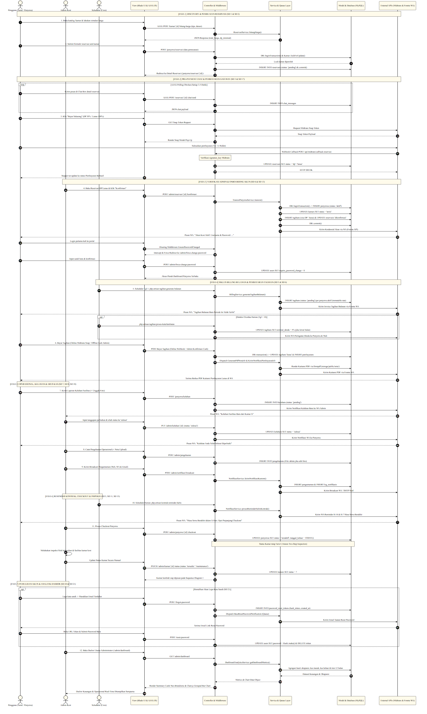

```mermaid
%%{init: {
  'theme': 'base',
  'themeVariables': {
    'fontFamily': 'Inter, system-ui, sans-serif',
    'fontSize': '11px',
    'actorBkg': '#FFFBEB',
    'actorBorder': '#000000',
    'actorTextColor': '#000000',
    'actorLineColor': '#000000',
    'noteBkgColor': '#FFFBEB',
    'noteBorderColor': '#000000',
    'noteTextColor': '#000000',
    'signalColor': '#000000',
    'signalTextColor': '#000000',
    'activationBkgColor': '#FDE047',
    'activationBorderColor': '#000000',
    'labelBoxBorderColor': '#000000',
    'labelBoxBkgColor': '#FFFFFF',
    'labelTextTextColor': '#000000',
    'primaryColor': '#FFFBEB',
    'primaryTextColor': '#000000',
    'primaryBorderColor': '#000000',
    'lineColor': '#000000'
  }
}}%%
sequenceDiagram
    autonumber
    actor U as Pengguna (Tamu / Penyewa)
    actor A as Admin Kost
    actor S as Scheduler (Cron)
    participant V as View (Blade UI & AJAX JS)
    participant C as Controller & Middleware
    participant Srv as Service & Queue Layer
    participant DB as Model & Database (MySQL)
    participant API as External APIs (Midtrans & Fonnte WA)

    %% ==========================================
    %% FASA 1: DISCOVERY & PEMBUATAN RESERVASI (SD 1 & SD 2)
    %% ==========================================
    Note over U, API: [FASA 1] DISCOVERY & PEMBUATAN RESERVASI (SD 1 & SD 2)
    U->>V: 1. Buka katalog /kamar & lakukan simulasi harga
    V->>C: AJAX POST /kamar/{id}/hitung-harga (tipe, durasi)
    C->>Srv: ReservasiService::hitungHarga()
    Srv-->>V: JSON Response (total_harga, dp_minimal)
    U->>V: 2. Submit formulir reservasi unit kamar
    V->>C: POST /penyewa/reservasi (data pemesanan)
    C->>DB: DB::beginTransaction() & Kamar::lockForUpdate()
    DB-->>C: Lock kamar diperoleh
    C->>DB: INSERT INTO reservasis (status: 'pending') & commit()
    C-->>V: Redirect ke Detail Reservasi (/penyewa/reservasi/{id})

    %% ==========================================
    %% FASA 2: PEMBAYARAN ONLINE & PRE-PAYMENT CHAT (SD 3 & SD 17)
    %% ==========================================
    Note over U, API: [FASA 2] PRE-PAYMENT CHAT & PEMBAYARAN GATEWAY (SD 3 & SD 17)
    loop AJAX Polling Obrolan (Setiap 3-5 Detik)
        U->>V: Kirim pesan di Chat Box detail reservasi
        V->>C: AJAX POST /reservasi/{id}/chat/send
        C->>DB: INSERT INTO chat_messages
        C-->>V: JSON chat payload
    end
    U->>V: 3. Klik "Bayar Sekarang" (DP 30% / Lunas 100%)
    V->>C: GET Snap Token Request
    C->>API: Request Midtrans Snap Token
    API-->>C: Snap Token Payload
    C-->>V: Render Snap Modal Pop-Up
    U->>API: Selesaikan pembayaran (VA / E-Wallet)
    API->>C: Webhook Callback POST /api/midtrans/callback-reservasi
    Note over C: Verifikasi signature_key Midtrans
    C->>DB: UPDATE reservasis SET status = 'dp' / 'lunas'
    C-->>API: HTTP 200 OK
    V-->>U: Stepper ter-update ke status Pembayaran Berhasil

    %% ==========================================
    %% FASA 3: VERIFIKASI ADMIN & ONBOARDING AKUN (SD 4, SD 13, SD 16)
    %% ==========================================
    Note over A, API: [FASA 3] VERIFIKASI ADMIN & ONBOARDING AKUN (SD 4 & SD 13)
    A->>V: 4. Buka Reservasi DP/Lunas & Klik "Konfirmasi"
    V->>C: POST /admin/reservasi/{id}/konfirmasi
    C->>Srv: TransisiPenyewaService::transisi()
    Srv->>DB: DB::beginTransaction() -> INSERT penyewas (status: 'aktif')
    Srv->>DB: UPDATE kamars SET status = 'terisi'
    Srv->>DB: INSERT tagihans (sisa DP / lunas) & UPDATE reservasis 'dikonfirmasi'
    Srv->>DB: DB::commit()
    Srv->>API: Kirim Kredensial Akun via WA (Fonnte API)
    API-->>U: Pesan WA: "Akun Kost Aktif. Username & Password: ..."
    U->>V: Login pertama kali ke portal
    V->>C: Disaring Middleware EnsurePasswordChanged
    C-->>V: Intercept & Force Redirect ke /admin/force-change-password
    U->>V: Input sandi baru & konfirmasi
    V->>C: POST /admin/force-change-password
    C->>DB: UPDATE users SET require_password_change = 0
    C-->>V: Akses Penuh Dashboard Penyewa Terbuka

    %% ==========================================
    %% FASA 4: SIKLUS BILLING, REMINDER & BAYAR TAGIHAN (SD 5 & SD 6)
    %% ==========================================
    Note over S, API: [FASA 4] SIKLUS BILLING BULANAN & PEMBAYARAN TAGIHAN (SD 5 & SD 6)
    S->>C: 5. Scheduler Tgl 1: php artisan tagihan:generate-bulanan
    C->>Srv: BillingService::generateTagihanBulanan()
    Srv->>DB: INSERT tagihans (status: 'pending') per penyewa aktif (immutable rate)
    Srv->>API: Kirim Invoice Tagihan Bulanan via Fonnte WA
    API-->>U: Pesan WA: "Tagihan Bulanan Baru Periode Ini Telah Terbit"
    
    opt Deteksi Overdue Harian (Tgl > 10)
        S->>C: php artisan tagihan:proses-keterlambatan
        C->>DB: UPDATE tagihans SET nominal_denda = 5% (jika lewat bulan)
        C->>API: Kirim WA Peringatan Denda ke Penyewa & Wali
    end

    U->>V: 6. Bayar Tagihan (Online Midtrans Snap / Offline Cash Admin)
    V->>C: POST Bayar Tagihan (Online Webhook / Admin Konfirmasi Cash)
    C->>DB: DB::transaction() -> UPDATE tagihans 'lunas' & INSERT pembayarans
    C->>Srv: Dispatch GeneratePdfNotaJob & KirimNotifikasiPembayaranJob
    Srv->>DB: Render Kuitansi PDF via Dompdf (storage/public/nota/)
    Srv->>API: Kirim Kuitansi PDF via Fonnte WA
    API-->>U: Terima Berkas PDF Kuitansi Pembayaran Lunas di WA

    %% ==========================================
    %% FASA 5: OPERASIONAL, KELUHAN, BROADCAST & ARUS KAS (SD 7, 8, 10, 18)
    %% ==========================================
    Note over U, A: [FASA 5] OPERASIONAL, KELUHAN & ARUS KAS (SD 7, SD 8, SD 18)
    U->>V: 7. Kirim Laporan Keluhan Fasilitas (+ Unggah Foto)
    V->>C: POST /penyewa/keluhan
    C->>DB: INSERT INTO keluhans (status: 'pending')
    C->>API: Kirim Notifikasi Keluhan Baru ke WA Admin
    API-->>A: Pesan WA: "Keluhan Fasilitas Baru dari Kamar X"
    A->>V: Input tanggapan perbaikan & ubah status ke 'selesai'
    V->>C: PUT /admin/keluhan/{id} (status: 'selesai')
    C->>DB: UPDATE keluhans SET status = 'selesai'
    C->>API: Kirim Notifikasi WA ke Penyewa
    API-->>U: Pesan WA: "Keluhan Anda Telah Selesai Diperbaiki"
    
    A->>V: 8. Catat Pengeluaran Operasional (+ Nota Upload)
    V->>C: POST /admin/pengeluaran
    C->>DB: INSERT INTO pengeluarans (File::delete jika edit foto)
    
    A->>V: 9. Kirim Broadcast Pengumuman (Web, WA & Email)
    V->>C: POST /admin/notifikasi/broadcast
    C->>Srv: NotifikasiService::kirimNotifikasiKustom()
    Srv->>DB: INSERT pengumumen & INSERT log_notifikasis
    Srv->>API: Kirim Broadcast WA / SMTP Mail

    %% ==========================================
    %% FASA 6: REMINDER KONTRAK, CHECKOUT & INSPEKSI (SD 11, 15, 19)
    %% ==========================================
    Note over S, A: [FASA 6] REMINDER KONTRAK, CHECKOUT & INSPEKSI (SD 5, SD 11, SD 15)
    S->>C: 10. Scheduler Harian: php artisan kontrak:reminder-habis
    C->>Srv: NotifikasiService::prosesReminderHabisKontrak()
    Srv->>API: Kirim WA Reminder H-14 & H-7 Masa Sewa Berakhir
    API-->>U: Pesan WA: "Masa Sewa Berakhir dalam X Hari. Opsi Perpanjang/Checkout"
    
    A->>V: 11. Proses Checkout Penyewa
    V->>C: POST /admin/penyewa/{id}/checkout
    C->>DB: UPDATE penyewas SET status = 'nonaktif', tanggal_keluar = TODAY()
    Note over C, DB: Status Kamar tetap 'terisi' (Aturan Two-Step Inspection)
    A->>A: Melakukan inspeksi fisik kebersihan & fasilitas kamar kost
    A->>V: Update Status Kamar Secara Manual
    V->>C: PATCH /admin/kamar/{id}/status (status: 'tersedia' / 'maintenance')
    C->>DB: UPDATE kamars SET status = ?
    C-->>V: Kamar kembali siap dipesan pada Sequence Diagram 1

    %% ==========================================
    %% FASA 7: ACCOUNT RECOVERY & ANALYTICS DASBOR (SD 20 & SD 21)
    %% ==========================================
    Note over U, A: [FASA 7] PEMULIHAN AKUN & ANALITIK DASBOR (SD 20 & SD 21)
    opt Pemulihan Akun Lupa Kata Sandi (SD 21)
        U->>V: Lupa kata sandi -> Masukkan Email Terdaftar
        V->>C: POST /forgot-password
        C->>DB: INSERT INTO password_reset_tokens (hash_token, created_at)
        C->>Srv: Dispatch BaseResetPasswordNotification (Queue)
        Srv->>API: Kirim Email Tautan Reset Password
        API-->>U: Terima Email Link Reset Password
        U->>V: Buka URL Token & Submit Password Baru
        V->>C: POST /reset-password
        C->>DB: UPDATE users SET password = Hash::make() & DELETE token
    end

    A->>V: 12. Buka Dasbor Utama Administrator (/admin/dashboard)
    V->>C: GET /admin/dashboard
    C->>Srv: DashboardAnalyticsService::getDashboardMetrics()
    Srv->>DB: Agregasi kueri okupansi, kas masuk, kas keluar & tren 12 bulan
    DB-->>Srv: Dataset Keuangan & Okupansi
    Srv-->>C: Metrics & Chart Data Object
    C-->>V: Render Summary Cards Neo-Brutalisme & Chart.js Grouped Bar Chart
    V-->>A: Dasbor Keuangan & Operasional Real-Time Ditampilkan Sempurna
```

---

### 2.1. Sequence Diagram 1: Pencarian, Cek Ketersediaan Kamar & Simulasi Harga (Guest / Calon Penyewa)
Diagram ini menjelaskan interaksi saat pengunjung umum (Tamu) melakukan pencarian unit kamar kost putri berdasarkan filter tertentu pada katalog publik, simulasi kalkulasi biaya sewa dinamis via AJAX, tracking konversi klik WhatsApp, serta navigasi ke formulir reservasi.

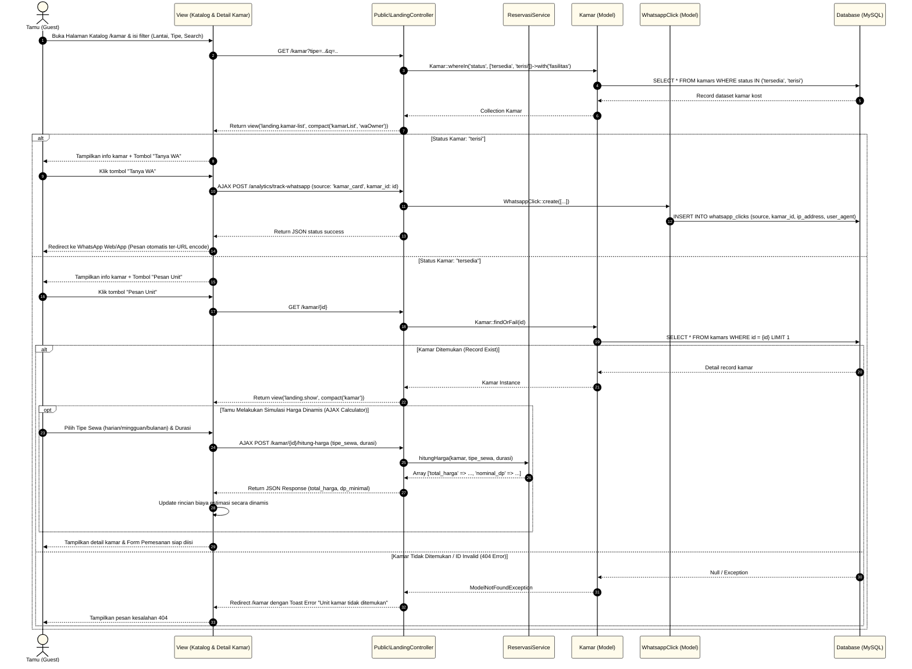
```mermaid
%%{init: {
  'theme': 'base',
  'themeVariables': {
    'fontFamily': 'Inter, system-ui, sans-serif',
    'fontSize': '12px',
    'actorBkg': '#FFFBEB',
    'actorBorder': '#000000',
    'actorTextColor': '#000000',
    'actorLineColor': '#000000',
    'noteBkgColor': '#FFFBEB',
    'noteBorderColor': '#000000',
    'noteTextColor': '#000000',
    'signalColor': '#000000',
    'signalTextColor': '#000000',
    'activationBkgColor': '#FDE047',
    'activationBorderColor': '#000000',
    'loopLimitBorderColor': '#000000',
    'loopLimitBkgColor': '#FDE047',
    'labelBoxBorderColor': '#000000',
    'labelBoxBkgColor': '#FFFFFF',
    'labelTextTextColor': '#000000',
    'primaryColor': '#FFFBEB',
    'primaryTextColor': '#000000',
    'primaryBorderColor': '#000000',
    'lineColor': '#000000'
  }
}}%%
sequenceDiagram
    autonumber
    actor T as Tamu (Guest)
    participant V as View (Katalog & Detail Kamar)
    participant C as Public\LandingController
    participant S as ReservasiService
    participant M as Kamar (Model)
    participant WA as WhatsappClick (Model)
    participant DB as Database (MySQL)

    T->>V: Buka Halaman Katalog /kamar & isi filter (Lantai, Tipe, Search)
    V->>C: GET /kamar?tipe=..&q=..
    C->>M: Kamar::whereIn('status', ['tersedia', 'terisi'])->with('fasilitas')
    M->>DB: SELECT * FROM kamars WHERE status IN ('tersedia', 'terisi')
    DB-->>M: Record dataset kamar kost
    M-->>C: Collection Kamar
    C-->>V: Return view('landing.kamar-list', compact('kamarList', 'waOwner'))
    
    alt Status Kamar: "terisi"
        V-->>T: Tampilkan info kamar + Tombol "Tanya WA"
        T->>V: Klik tombol "Tanya WA"
        V->>C: AJAX POST /analytics/track-whatsapp (source: 'kamar_card', kamar_id: id)
        C->>WA: WhatsappClick::create([...])
        WA->>DB: INSERT INTO whatsapp_clicks (source, kamar_id, ip_address, user_agent)
        C-->>V: Return JSON status success
        V-->>T: Redirect ke WhatsApp Web/App (Pesan otomatis ter-URL encode)
    else Status Kamar: "tersedia"
        V-->>T: Tampilkan info kamar + Tombol "Pesan Unit"
        T->>V: Klik tombol "Pesan Unit"
        V->>C: GET /kamar/{id}
        C->>M: Kamar::findOrFail(id)
        M->>DB: SELECT * FROM kamars WHERE id = {id} LIMIT 1
        
        alt Kamar Ditemukan (Record Exist)
            DB-->>M: Detail record kamar
            M-->>C: Kamar Instance
            C-->>V: Return view('landing.show', compact('kamar'))
            
            opt Tamu Melakukan Simulasi Harga Dinamis (AJAX Calculator)
                T->>V: Pilih Tipe Sewa (harian/mingguan/bulanan) & Durasi
                V->>C: AJAX POST /kamar/{id}/hitung-harga (tipe_sewa, durasi)
                C->>S: hitungHarga(kamar, tipe_sewa, durasi)
                S-->>C: Array ['total_harga' => ..., 'nominal_dp' => ...]
                C-->>V: Return JSON Response (total_harga, dp_minimal)
                V->>V: Update rincian biaya estimasi secara dinamis
            end

            V-->>T: Tampilkan detail kamar & Form Pemesanan siap diisi
        else Kamar Tidak Ditemukan / ID Invalid (404 Error)
            DB-->>M: Null / Exception
            M-->>C: ModelNotFoundException
            C-->>V: Redirect /kamar dengan Toast Error "Unit kamar tidak ditemukan"
            V-->>T: Tampilkan pesan kesalahan 404
        end
    end
```

* **Partisipan Utama**:
  * **Tamu (Guest)**: Aktor yang mencari kamar.
  * [Public\LandingController](file:///c:/xampp/htdocs/asri-boarding-house/app/Http/Controllers/Public/LandingController.php): Menangani rute publik katalog kamar, simulasi harga, dan tracking klik.
  * [ReservasiService](file:///c:/xampp/htdocs/asri-boarding-house/app/Services/ReservasiService.php): Menghitung simulasi tarif sewa dinamis berdasarkan tipe durasi.
  * [Kamar](file:///c:/xampp/htdocs/asri-boarding-house/app/Models/Kamar.php): Representasi model kamar di database.
  * [WhatsappClick](file:///c:/xampp/htdocs/asri-boarding-house/app/Models/WhatsappClick.php): Model pencatat analitik konversi klik WhatsApp.
* **Logika Penting**: Kamar dengan status `'maintenance'` disembunyikan sepenuhnya dari kueri halaman publik. Simulasi harga dilakukan secara atomik via AJAX tanpa memuat ulang halaman penuh.

---

### 2.2. Sequence Diagram 2: Pendaftaran & Pembuatan Reservasi Kamar (Calon Penyewa)
Diagram ini memetakan alur ketika Calon Penyewa mengirimkan data reservasi kamar kost putri melalui formulir hingga kamar terkunci sementara dan dialihkan ke portal reservasi calon penyewa.

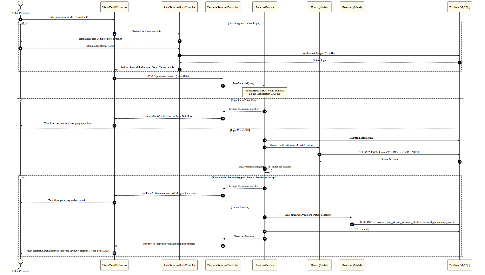

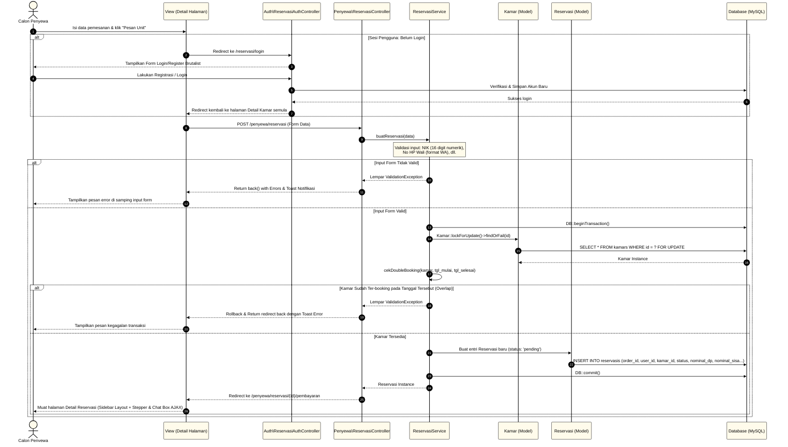
```mermaid
%%{init: {
  'theme': 'base',
  'themeVariables': {
    'fontFamily': 'Inter, system-ui, sans-serif',
    'fontSize': '12px',
    'actorBkg': '#FFFBEB',
    'actorBorder': '#000000',
    'actorTextColor': '#000000',
    'actorLineColor': '#000000',
    'noteBkgColor': '#FFFBEB',
    'noteBorderColor': '#000000',
    'noteTextColor': '#000000',
    'signalColor': '#000000',
    'signalTextColor': '#000000',
    'activationBkgColor': '#FDE047',
    'activationBorderColor': '#000000',
    'loopLimitBorderColor': '#000000',
    'loopLimitBkgColor': '#FDE047',
    'labelBoxBorderColor': '#000000',
    'labelBoxBkgColor': '#FFFFFF',
    'labelTextTextColor': '#000000',
    'primaryColor': '#FFFBEB',
    'primaryTextColor': '#000000',
    'primaryBorderColor': '#000000',
    'lineColor': '#000000'
  }
}}%%
sequenceDiagram
    autonumber
    actor CP as Calon Penyewa
    participant V as View (Detail Halaman)
    participant Auth as Auth\ReservasiAuthController
    participant C as Penyewa\ReservasiController
    participant S as ReservasiService
    participant K as Kamar (Model)
    participant R as Reservasi (Model)
    participant DB as Database (MySQL)

    CP->>V: Isi data pemesanan & klik "Pesan Unit"
    
    alt Sesi Pengguna: Belum Login
        V->>Auth: Redirect ke /reservasi/login
        Auth-->>CP: Tampilkan Form Login/Register Brutalist
        CP->>Auth: Lakukan Registrasi / Login
        Auth->>DB: Verifikasi & Simpan Akun Baru
        DB-->>Auth: Sukses login
        Auth-->>V: Redirect kembali ke halaman Detail Kamar semula
    end

    V->>C: POST /penyewa/reservasi (Form Data)
    C->>S: buatReservasi(data)
    
    Note over S: Validasi input: NIK (16 digit numerik),<br/>No HP Wali (format WA), dll.
    
    alt Input Form Tidak Valid
        S-->>C: Lempar ValidationException
        C-->>V: Return back() with Errors & Toast Notifikasi
        V-->>CP: Tampilkan pesan error di samping input form
    else Input Form Valid
        S->>DB: DB::beginTransaction()
        S->>K: Kamar::lockForUpdate()->findOrFail(id)
        K->>DB: SELECT * FROM kamars WHERE id = ? FOR UPDATE
        DB-->>K: Kamar Instance
        
        S->>S: cekDoubleBooking(kamar, tgl_mulai, tgl_selesai)
        
        alt Kamar Sudah Ter-booking pada Tanggal Tersebut (Overlap)
            S-->>C: Lempar ValidationException
            C-->>V: Rollback & Return redirect back dengan Toast Error
            V-->>CP: Tampilkan pesan kegagalan transaksi
        else Kamar Tersedia
            S->>R: Buat entri Reservasi baru (status: 'pending')
            R->>DB: INSERT INTO reservasis (order_id, user_id, kamar_id, status, nominal_dp, nominal_sisa...)
            S->>DB: DB::commit()
            S-->>C: Reservasi Instance
            C-->>V: Redirect ke /penyewa/reservasi/{id}/pembayaran
            V-->>CP: Muat halaman Detail Reservasi (Sidebar Layout + Stepper & Chat Box AJAX)
        end
    end
```

* **Partisipan Utama**:
  * [Auth\ReservasiAuthController](file:///c:/xampp/htdocs/asri-boarding-house/app/Http/Controllers/Auth/ReservasiAuthController.php): Mengatur autentikasi calon penyewa.
  * [Penyewa\ReservasiController](file:///c:/xampp/htdocs/asri-boarding-house/app/Http/Controllers/Penyewa/ReservasiController.php): Menangani pembuatan dan riwayat reservasi.
  * [ReservasiService](file:///c:/xampp/htdocs/asri-boarding-house/app/Services/ReservasiService.php): Layanan inti validasi ketersediaan dan pembuatan reservasi secara atomik.
* **Logika Penting**: Penggunaan klausa `lockForUpdate()` pada model `Kamar` di dalam transaksi database wajib diterapkan untuk mencegah *race condition* (dua pengguna memesan kamar yang sama pada detik yang bersamaan).

---

### 2.3. Sequence Diagram 3: Pembayaran Reservasi & Chat Box Diskusi Pre-Pembayaran (Calon Penyewa & Midtrans Snap)
Diagram ini menggambarkan alur komunikasi obrolan real-time (AJAX Polling) dan eksekusi pembayaran uang muka (DP 30%) atau pelunasan reservasi via Midtrans Snap.

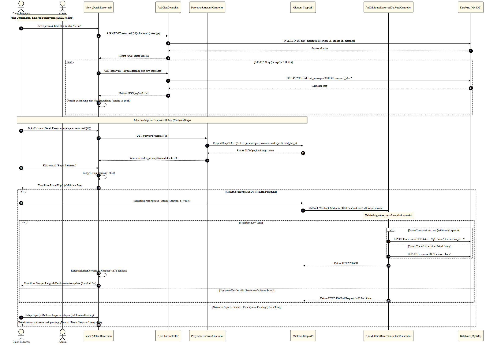

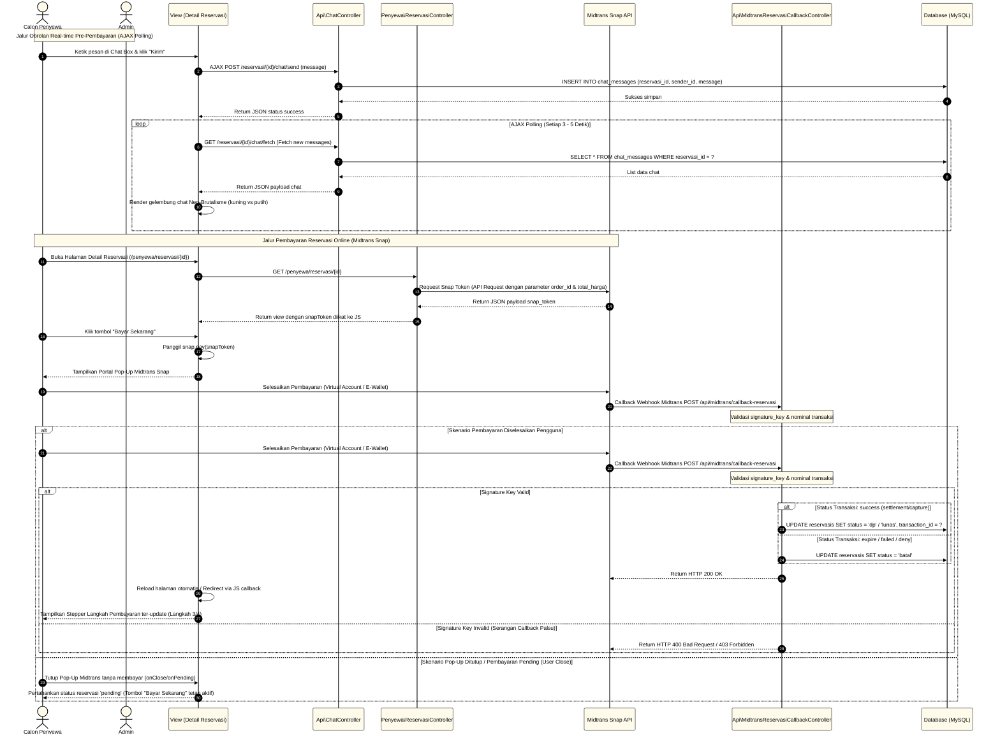
```mermaid
%%{init: {
  'theme': 'base',
  'themeVariables': {
    'fontFamily': 'Inter, system-ui, sans-serif',
    'fontSize': '12px',
    'actorBkg': '#FFFBEB',
    'actorBorder': '#000000',
    'actorTextColor': '#000000',
    'actorLineColor': '#000000',
    'noteBkgColor': '#FFFBEB',
    'noteBorderColor': '#000000',
    'noteTextColor': '#000000',
    'signalColor': '#000000',
    'signalTextColor': '#000000',
    'activationBkgColor': '#FDE047',
    'activationBorderColor': '#000000',
    'loopLimitBorderColor': '#000000',
    'loopLimitBkgColor': '#FDE047',
    'labelBoxBorderColor': '#000000',
    'labelBoxBkgColor': '#FFFFFF',
    'labelTextTextColor': '#000000',
    'primaryColor': '#FFFBEB',
    'primaryTextColor': '#000000',
    'primaryBorderColor': '#000000',
    'lineColor': '#000000'
  }
}}%%
sequenceDiagram
    autonumber
    actor CP as Calon Penyewa
    actor A as Admin
    participant V as View (Detail Reservasi)
    participant CC as Api\ChatController
    participant C as Penyewa\ReservasiController
    participant Mid as Midtrans Snap API
    participant Web as Api\MidtransReservasiCallbackController
    participant DB as Database (MySQL)

    Note over CP, A: Jalur Obrolan Real-time Pre-Pembayaran (AJAX Polling)
    CP->>V: Ketik pesan di Chat Box & klik "Kirim"
    V->>CC: AJAX POST /reservasi/{id}/chat/send (message)
    CC->>DB: INSERT INTO chat_messages (reservasi_id, sender_id, message)
    DB-->>CC: Sukses simpan
    CC-->>V: Return JSON status success
    loop AJAX Polling (Setiap 3 - 5 Detik)
        V->>CC: GET /reservasi/{id}/chat/fetch (Fetch new messages)
        CC->>DB: SELECT * FROM chat_messages WHERE reservasi_id = ?
        DB-->>CC: List data chat
        CC-->>V: Return JSON payload chat
        V->>V: Render gelembung chat Neo-Brutalisme (kuning vs putih)
    end

    Note over CP, Mid: Jalur Pembayaran Reservasi Online (Midtrans Snap)
    CP->>V: Buka Halaman Detail Reservasi (/penyewa/reservasi/{id})
    V->>C: GET /penyewa/reservasi/{id}
    C->>Mid: Request Snap Token (API Request dengan parameter order_id & total_harga)
    Mid-->>C: Return JSON payload snap_token
    C-->>V: Return view dengan snapToken diikat ke JS
    CP->>V: Klik tombol "Bayar Sekarang"
    V->>V: Panggil snap.pay(snapToken)
    V-->>CP: Tampilkan Portal Pop-Up Midtrans Snap
    CP->>Mid: Selesaikan Pembayaran (Virtual Account / E-Wallet)
    Mid->>Web: Callback Webhook Midtrans POST /api/midtrans/callback-reservasi
    Note over Web: Validasi signature_key & nominal transaksi
    
    alt Skenario Pembayaran Diselesaikan Pengguna
        CP->>Mid: Selesaikan Pembayaran (Virtual Account / E-Wallet)
        Mid->>Web: Callback Webhook Midtrans POST /api/midtrans/callback-reservasi
        Note over Web: Validasi signature_key & nominal transaksi
        
        alt Signature Key Valid
            alt Status Transaksi: success (settlement/capture)
                Web->>DB: UPDATE reservasis SET status = 'dp' / 'lunas', transaction_id = ?
            else Status Transaksi: expire / failed / deny
                Web->>DB: UPDATE reservasis SET status = 'batal'
            end
            Web-->>Mid: Return HTTP 200 OK
            V->>V: Reload halaman otomatis / Redirect via JS callback
            V-->>CP: Tampilkan Stepper Langkah Pembayaran ter-update (Langkah 3/4)
        else Signature Key Invalid (Serangan Callback Palsu)
            Web-->>Mid: Return HTTP 400 Bad Request / 403 Forbidden
        end
    else Skenario Pop-Up Ditutup / Pembayaran Pending (User Close)
        CP->>V: Tutup Pop-Up Midtrans tanpa membayar (onClose/onPending)
        V-->>CP: Pertahankan status reservasi 'pending' (Tombol "Bayar Sekarang" tetap aktif)
    end
```

* **Partisipan Utama**:
  * [Api\ChatController](file:///c:/xampp/htdocs/asri-boarding-house/app/Http/Controllers/Api/ChatController.php): Menangani pengiriman dan polling pesan obrolan reservasi.
  * [Api\MidtransReservasiCallbackController](file:///c:/xampp/htdocs/asri-boarding-house/app/Http/Controllers/Api/MidtransReservasiCallbackController.php): Memproses notifikasi callback pembayaran otomatis untuk reservasi dari server Midtrans.
* **Logika Penting**: Sesi obrolan di halaman detail reservasi diaktifkan pada status `'pending'` (sebelum bayar) agar calon penyewa dapat berdiskusi terlebih dahulu mengenai kesiapan unit sebelum membayar DP/lunas.

---

### 2.4. Sequence Diagram 4: Verifikasi & Konfirmasi Reservasi Baru (Admin & Penyewa Baru)
Diagram ini memetakan alur kerja administrator dalam memvalidasi dokumen identitas dan mengonfirmasi reservasi sehingga memicu pembuatan akun penyewa aktif serta pengiriman kredensial.

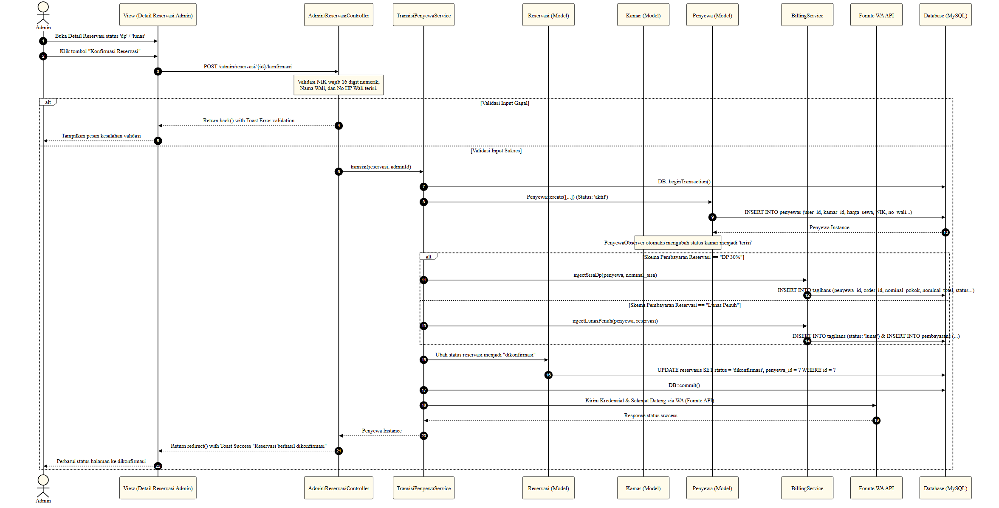

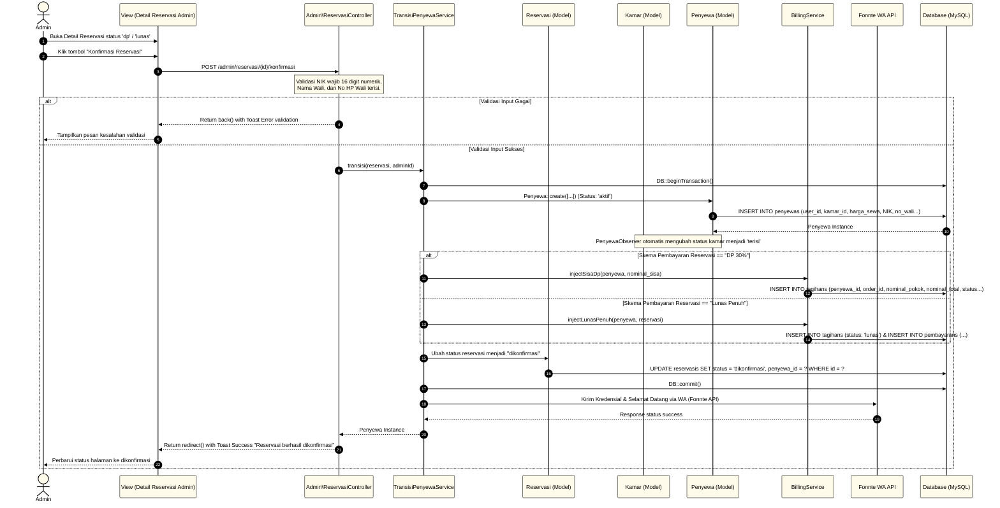
```mermaid
%%{init: {
  'theme': 'base',
  'themeVariables': {
    'fontFamily': 'Inter, system-ui, sans-serif',
    'fontSize': '12px',
    'actorBkg': '#FFFBEB',
    'actorBorder': '#000000',
    'actorTextColor': '#000000',
    'actorLineColor': '#000000',
    'noteBkgColor': '#FFFBEB',
    'noteBorderColor': '#000000',
    'noteTextColor': '#000000',
    'signalColor': '#000000',
    'signalTextColor': '#000000',
    'activationBkgColor': '#FDE047',
    'activationBorderColor': '#000000',
    'loopLimitBorderColor': '#000000',
    'loopLimitBkgColor': '#FDE047',
    'labelBoxBorderColor': '#000000',
    'labelBoxBkgColor': '#FFFFFF',
    'labelTextTextColor': '#000000',
    'primaryColor': '#FFFBEB',
    'primaryTextColor': '#000000',
    'primaryBorderColor': '#000000',
    'lineColor': '#000000'
  }
}}%%
sequenceDiagram
    autonumber
    actor A as Admin
    participant V as View (Detail Reservasi Admin)
    participant C as Admin\ReservasiController
    participant TService as TransisiPenyewaService
    participant R as Reservasi (Model)
    participant K as Kamar (Model)
    participant P as Penyewa (Model)
    participant BService as BillingService
    participant F as Fonnte WA API
    participant DB as Database (MySQL)

    A->>V: Buka Detail Reservasi status 'dp' / 'lunas'
    A->>V: Klik tombol "Konfirmasi Reservasi"
    V->>C: POST /admin/reservasi/{id}/konfirmasi
    Note over C: Validasi NIK wajib 16 digit numerik,<br/>Nama Wali, dan No HP Wali terisi.

    alt Validasi Input Gagal
        C-->>V: Return back() with Toast Error validation
        V-->>A: Tampilkan pesan kesalahan validasi
    else Validasi Input Sukses
        C->>TService: transisi(reservasi, adminId)
        TService->>DB: DB::beginTransaction()
        
        TService->>P: Penyewa::create([...]) (Status: 'aktif')
        P->>DB: INSERT INTO penyewas (user_id, kamar_id, harga_sewa, NIK, no_wali...)
        DB-->>P: Penyewa Instance
        
        Note over P, K: PenyewaObserver otomatis mengubah status kamar menjadi 'terisi'
        
        alt Skema Pembayaran Reservasi == "DP 30%"
            TService->>BService: injectSisaDp(penyewa, nominal_sisa)
            BService->>DB: INSERT INTO tagihans (penyewa_id, order_id, nominal_pokok, nominal_total, status...)
        else Skema Pembayaran Reservasi == "Lunas Penuh"
            TService->>BService: injectLunasPenuh(penyewa, reservasi)
            BService->>DB: INSERT INTO tagihans (status: 'lunas') & INSERT INTO pembayarans (...)
        end
        
        TService->>R: Ubah status reservasi menjadi "dikonfirmasi"
        R->>DB: UPDATE reservasis SET status = 'dikonfirmasi', penyewa_id = ? WHERE id = ?
        
        TService->>DB: DB::commit()
        
        TService->>F: Kirim Kredensial & Selamat Datang via WA (Fonnte API)
        F-->>TService: Response status success
        
        TService-->>C: Penyewa Instance
        C-->>V: Return redirect() with Toast Success "Reservasi berhasil dikonfirmasi"
        V-->>A: Perbarui status halaman ke dikonfirmasi
    end
```

* **Partisipan Utama**:
  * [Admin\ReservasiController](file:///c:/xampp/htdocs/asri-boarding-house/app/Http/Controllers/Admin/ReservasiController.php): Mengelola persetujuan reservasi oleh pengelola.
  * [TransisiPenyewaService](file:///c:/xampp/htdocs/asri-boarding-house/app/Services/TransisiPenyewaService.php): Mengorkestrasi transaksi pembuatan penyewa baru dari data reservasi.
  * [BillingService](file:///c:/xampp/htdocs/asri-boarding-house/app/Services/BillingService.php): Menangani injeksi tagihan sisa DP atau tagihan lunas pada bulan pertama.
* **Logika Penting**: Hubungan transisi menggunakan `DB::transaction()` untuk menjamin seluruh data terbuat lengkap secara atomik, dan asinkron menggunakan Fonnte WA API untuk mengirim informasi akun.

---

### 2.5. Sequence Diagram 5: Siklus Billing Rutin Bulanan & Reminder Habis Kontrak Otomatis (Sistem Scheduler)
Diagram ini menjelaskan bagaimana sistem scheduler (cron job) berjalan secara otomatis setiap tanggal 1 awal bulan untuk menerbitkan tagihan rutin kepada seluruh penyewa aktif, mendeteksi keterlambatan pembayaran harian untuk penagihan denda, serta mengirimkan notifikasi pengingat masa habis kontrak sewa (H-14 dan H-7).

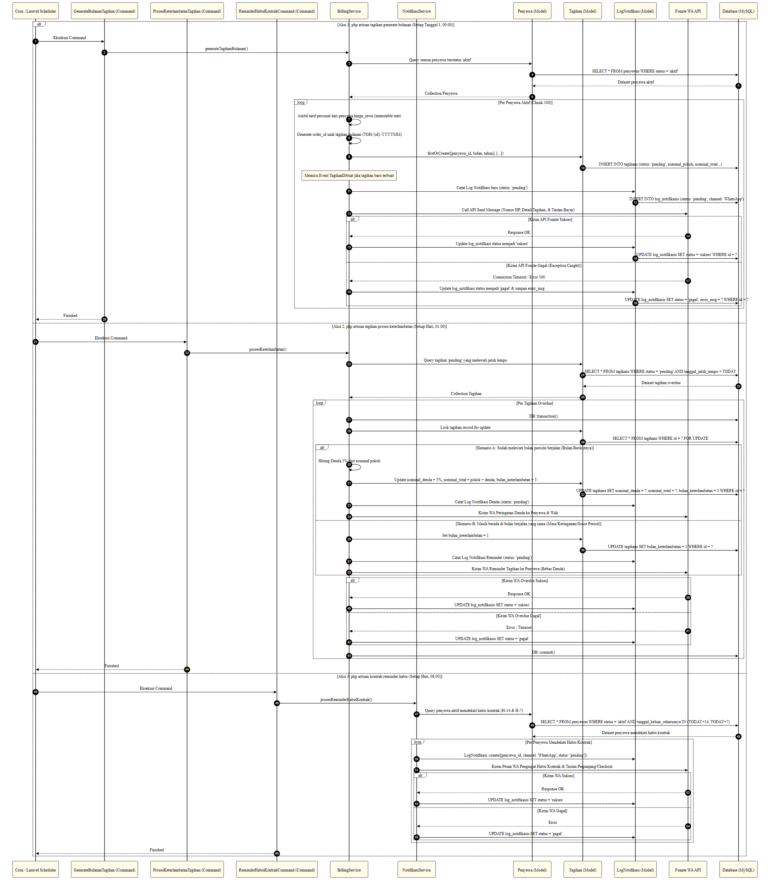

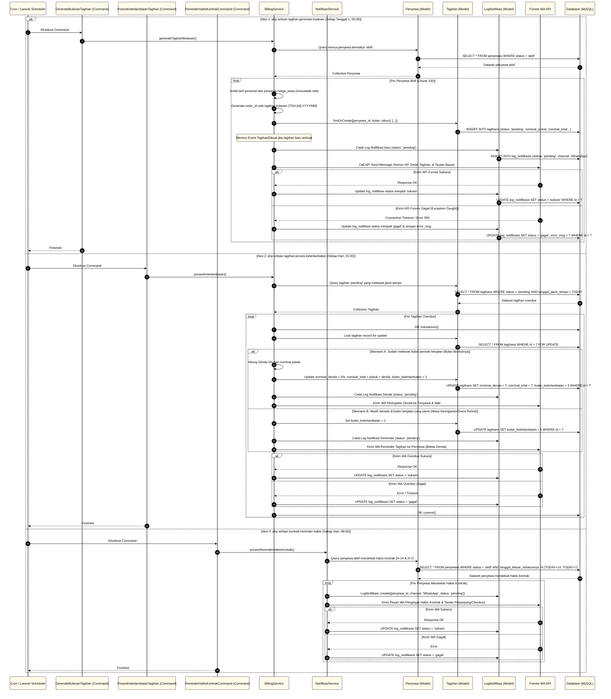
```mermaid
%%{init: {
  'theme': 'base',
  'themeVariables': {
    'fontFamily': 'Inter, system-ui, sans-serif',
    'fontSize': '12px',
    'actorBkg': '#FFFBEB',
    'actorBorder': '#000000',
    'actorTextColor': '#000000',
    'actorLineColor': '#000000',
    'noteBkgColor': '#FFFBEB',
    'noteBorderColor': '#000000',
    'noteTextColor': '#000000',
    'signalColor': '#000000',
    'signalTextColor': '#000000',
    'activationBkgColor': '#FDE047',
    'activationBorderColor': '#000000',
    'loopLimitBorderColor': '#000000',
    'loopLimitBkgColor': '#FDE047',
    'labelBoxBorderColor': '#000000',
    'labelBoxBkgColor': '#FFFFFF',
    'labelTextTextColor': '#000000',
    'primaryColor': '#FFFBEB',
    'primaryTextColor': '#000000',
    'primaryBorderColor': '#000000',
    'lineColor': '#000000'
  }
}}%%
sequenceDiagram
    autonumber
    participant S as Cron / Laravel Scheduler
    participant E1 as GenerateBulananTagihan (Command)
    participant E2 as ProsesKeterlambatanTagihan (Command)
    participant E3 as ReminderHabisKontrakCommand (Command)
    participant B as BillingService
    participant NS as NotifikasiService
    participant P as Penyewa (Model)
    participant T as Tagihan (Model)
    participant L as LogNotifikasi (Model)
    participant F as Fonnte WA API
    participant DB as Database (MySQL)

    alt Aksi 1: php artisan tagihan:generate-bulanan (Setiap Tanggal 1, 00:00)
        S->>E1: Eksekusi Command
        E1->>B: generateTagihanBulanan()
        B->>P: Query semua penyewa berstatus 'aktif'
        P->>DB: SELECT * FROM penyewas WHERE status = 'aktif'
        DB-->>P: Dataset penyewa aktif
        P-->>B: Collection Penyewa
        
        loop Per Penyewa Aktif (Chunk 100)
            B->>B: Ambil tarif personal dari penyewa.harga_sewa (immutable rate)
            B->>B: Generate order_id unik tagihan bulanan (TGH-{id}-YYYYMM)
            B->>T: firstOrCreate([penyewa_id, bulan, tahun], [...])
            T->>DB: INSERT INTO tagihans (status: 'pending', nominal_pokok, nominal_total...)
            Note over B: Memicu Event TagihanDibuat jika tagihan baru terbuat
            B->>L: Catat Log Notifikasi baru (status: 'pending')
            L->>DB: INSERT INTO log_notifikasis (status: 'pending', channel: 'WhatsApp')
            
            B->>F: Call API Send Message (Nomor HP, Detail Tagihan, & Tautan Bayar)
            
            alt Kirim API Fonnte Sukses
                F-->>B: Response OK
                B->>L: Update log_notifikasi status menjadi 'sukses'
                L->>DB: UPDATE log_notifikasis SET status = 'sukses' WHERE id = ?
            else Kirim API Fonnte Gagal (Exception Caught)
                F-->>B: Connection Timeout / Error 500
                B->>L: Update log_notifikasi status menjadi 'gagal' & simpan error_msg
                L->>DB: UPDATE log_notifikasis SET status = 'gagal', error_msg = ? WHERE id = ?
            end
        end
        E1-->>S: Finished

    else Aksi 2: php artisan tagihan:proses-keterlambatan (Setiap Hari, 01:00)
        S->>E2: Eksekusi Command
        E2->>B: prosesKeterlambatan()
        B->>T: Query tagihan 'pending' yang melewati jatuh tempo
        T->>DB: SELECT * FROM tagihans WHERE status = 'pending' AND tanggal_jatuh_tempo < TODAY
        DB-->>T: Dataset tagihan overdue
        T-->>B: Collection Tagihan

        loop Per Tagihan Overdue
            B->>DB: DB::transaction()
            B->>T: Lock tagihan record for update
            T->>DB: SELECT * FROM tagihans WHERE id = ? FOR UPDATE
            
            alt Skenario A: Sudah melewati bulan periode berjalan (Bulan Berikutnya)
                B->>B: Hitung Denda 5% dari nominal pokok
                B->>T: Update nominal_denda = 5%, nominal_total = pokok + denda, bulan_keterlambatan = 3
                T->>DB: UPDATE tagihans SET nominal_denda = ?, nominal_total = ?, bulan_keterlambatan = 3 WHERE id = ?
                B->>L: Catat Log Notifikasi Denda (status: 'pending')
                B->>F: Kirim WA Peringatan Denda ke Penyewa & Wali
            else Skenario B: Masih berada di bulan berjalan yang sama (Masa Keringanan/Grace Period)
                B->>T: Set bulan_keterlambatan = 1
                T->>DB: UPDATE tagihans SET bulan_keterlambatan = 1 WHERE id = ?
                B->>L: Catat Log Notifikasi Reminder (status: 'pending')
                B->>F: Kirim WA Reminder Tagihan ke Penyewa (Bebas Denda)
            end
            
            alt Kirim WA Overdue Sukses
                F-->>B: Response OK
                B->>L: UPDATE log_notifikasis SET status = 'sukses'
            else Kirim WA Overdue Gagal
                F-->>B: Error / Timeout
                B->>L: UPDATE log_notifikasis SET status = 'gagal'
            end
            B->>DB: DB::commit()
        end
        E2-->>S: Finished

    else Aksi 3: php artisan kontrak:reminder-habis (Setiap Hari, 08:00)
        S->>E3: Eksekusi Command
        E3->>NS: prosesReminderHabisKontrak()
        NS->>P: Query penyewa aktif mendekati habis kontrak (H-14 & H-7)
        P->>DB: SELECT * FROM penyewas WHERE status = 'aktif' AND tanggal_keluar_seharusnya IN (TODAY+14, TODAY+7)
        DB-->>P: Dataset penyewa mendekati habis kontrak
        loop Per Penyewa Mendekati Habis Kontrak
            NS->>L: LogNotifikasi::create([penyewa_id, channel: 'WhatsApp', status: 'pending'])
            NS->>F: Kirim Pesan WA Pengingat Habis Kontrak & Tautan Perpanjang/Checkout
            alt Kirim WA Sukses
                F-->>NS: Response OK
                NS->>L: UPDATE log_notifikasis SET status = 'sukses'
            else Kirim WA Gagal
                F-->>NS: Error
                NS->>L: UPDATE log_notifikasis SET status = 'gagal'
            end
        end
        E3-->>S: Finished
    end
```

* **Partisipan Utama**:
  * [GenerateBulananTagihan Command](file:///c:/xampp/htdocs/asri-boarding-house/app/Console/Commands/GenerateBulananTagihan.php): Command CLI untuk menjalankan pembuatan tagihan bulanan.
  * [ProsesKeterlambatanTagihan Command](file:///c:/xampp/htdocs/asri-boarding-house/app/Console/Commands/ProsesKeterlambatanTagihan.php): Command CLI harian untuk mendeteksi keterlambatan pembayaran dan menerapkan denda flat.
  * [ReminderHabisKontrakCommand](file:///c:/xampp/htdocs/asri-boarding-house/app/Console/Commands/ReminderHabisKontrakCommand.php): Command CLI harian untuk mendeteksi masa sewa berakhir pada H-14 dan H-7.
  * [BillingService](file:///c:/xampp/htdocs/asri-boarding-house/app/Services/BillingService.php): Mengatur alur penagihan bulanan, masa tenggang, dan logika denda secara transaksional.
  * [NotifikasiService](file:///c:/xampp/htdocs/asri-boarding-house/app/Services/NotifikasiService.php): Mengatur orkestrasi pengiriman notifikasi pengingat ke WhatsApp via Fonnte API.
* **Logika Penting**: Tagihan bulanan didasarkan pada kolom `penyewa.harga_sewa` yang bernilai tetap sejak dikonfirmasi. Jatuh tempo diatur seragam pada tanggal 10. Jika pembayaran terlambat dan memasuki bulan kalender berikutnya, sistem menerapkan denda flat 5% tepat satu kali dan mengirimkan notifikasi eskalasi denda ke WhatsApp wali penyewa via Fonnte API. Notifikasi pengingat kontrak berakhir dikirimkan secara otomatis pada H-14 dan H-7 sebelum `tanggal_keluar_seharusnya`.

---

### 2.6. Sequence Diagram 6: Pembayaran Tagihan Bulanan (Penyewa Aktif, Admin, Midtrans Snap & Fonnte WA)
Diagram ini menjelaskan opsi pembayaran tagihan bulanan: secara online (Midtrans) oleh penyewa, atau secara offline (tunai/transfer bank manual) yang diverifikasi oleh administrator di dalam transaksi aman, serta pemrosesan pencetakan kuitansi PDF dan WhatsApp secara asinkron (Background Queue).

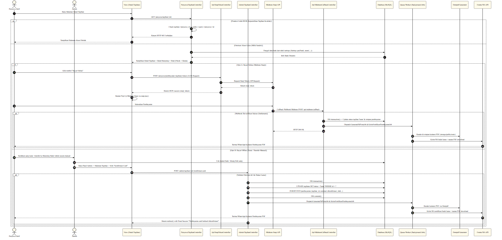

```mermaid
%%{init: {
  'theme': 'base',
  'themeVariables': {
    'fontFamily': 'Inter, system-ui, sans-serif',
    'fontSize': '12px',
    'actorBkg': '#FFFBEB',
    'actorBorder': '#000000',
    'actorTextColor': '#000000',
    'actorLineColor': '#000000',
    'noteBkgColor': '#FFFBEB',
    'noteBorderColor': '#000000',
    'noteTextColor': '#000000',
    'signalColor': '#000000',
    'signalTextColor': '#000000',
    'activationBkgColor': '#FDE047',
    'activationBorderColor': '#000000',
    'loopLimitBorderColor': '#000000',
    'loopLimitBkgColor': '#FDE047',
    'labelBoxBorderColor': '#000000',
    'labelBoxBkgColor': '#FFFFFF',
    'labelTextTextColor': '#000000',
    'primaryColor': '#FFFBEB',
    'primaryTextColor': '#000000',
    'primaryBorderColor': '#000000',
    'lineColor': '#000000'
  }
}}%%
sequenceDiagram
    autonumber
    actor PA as Penyewa Aktif
    actor A as Admin
    participant V as View (Detail Tagihan)
    participant C as Penyewa\TagihanController
    participant TokenC as Api\SnapTokenController
    participant AC as Admin\TagihanController
    participant Mid as Midtrans Snap API
    participant Web as Api\MidtransCallbackController
    participant DB as Database (MySQL)
    participant Q as Queue Worker (Background Jobs)
    participant Pdf as Dompdf Generator
    participant F as Fonnte WA API

    PA->>V: Buka Halaman Detail Tagihan
    V->>C: GET /penyewa/tagihan/{id}
    
    alt Proteksi Celah IDOR (Kepemilikan Tagihan Invalide)
        C->>C: Check tagihan->penyewa_id == auth()->user()->penyewa->id
        C-->>V: Return HTTP 403 Forbidden
        V-->>PA: Tampilkan Halaman Akses Ditolak
    else Otorisasi Akses Lulus (Milik Sendiri)
        C->>DB: Panggil data bank dari tabel settings (Setting::get('bank_name',...))
        DB-->>C: Info Bank Dinamis
        C-->>V: Tampilkan Detail Tagihan + Detail Rekening + Total (Pokok + Denda)

        alt Opsi A: Bayar Online (Midtrans Snap)
            PA->>V: Klik tombol "Bayar Online"
            V->>TokenC: POST /penyewa/pembayaran/{tagihan}/token (AJAX Request)
            TokenC->>Mid: Request Snap Token (API Request)
            Mid-->>TokenC: Return snap_token
            TokenC-->>V: Return JSON success (snap_token)
            V->>V: Render Pop-Up Midtrans Snap via snap.pay()
            PA->>Mid: Selesaikan Pembayaran
            Mid->>Web: Callback Webhook Midtrans POST /api/midtrans/callback
            
            alt Webhook Terverifikasi Sukses (Settlement)
                Web->>DB: DB::transaction() -> Update status tagihan 'lunas' & simpan pembayaran
                Web->>Q: Dispatch GeneratePdfNotaJob & KirimNotifikasiPembayaranJob
                Web-->>Mid: HTTP 200 OK
                Q->>Pdf: Render & simpan kuitansi PDF (storage/public/nota/)
                Q->>F: Kirim WA bukti lunas + tautan PDF download
                F-->>PA: Terima WhatsApp Kuitansi Pembayaran PDF
            end
            
        else Opsi B: Bayar Offline (Tunai / Transfer Manual)
            PA->>A: Serahkan uang tunai / transfer ke Rekening Bank Admin secara manual
            A->>DB: Cek mutasi bank / hitung fisik uang
            A->>V: Buka Panel Admin -> Halaman Tagihan -> Klik "Konfirmasi Cash"
            V->>AC: POST /admin/tagihan/{id}/konfirmasi-cash
            
            alt Validasi Otorisasi & Cek Status Lunas
                AC->>DB: DB::transaction()
                AC->>DB: UPDATE tagihans SET status = 'lunas' WHERE id = ?
                AC->>DB: INSERT INTO pembayarans (tagihan_id, nominal, dikonfirmasi_oleh...)
                AC->>DB: DB::commit()
                AC->>Q: Dispatch GeneratePdfNotaJob & KirimNotifikasiPembayaranJob
                Q->>Pdf: Render kuitansi PDF via Dompdf
                Q->>F: Kirim WA notifikasi bukti lunas + tautan PDF download
                F-->>PA: Terima WhatsApp Kuitansi Pembayaran PDF
                AC-->>V: Return redirect() with Toast Success "Pembayaran cash berhasil dikonfirmasi"
            end
        end
    end
    end
```

* **Partisipan Utama**:
  * [Penyewa\TagihanController](file:///c:/xampp/htdocs/asri-boarding-house/app/Http/Controllers/Penyewa/TagihanController.php): Mengelola tagihan di sisi penyewa aktif.
  * [Api\SnapTokenController](file:///c:/xampp/htdocs/asri-boarding-house/app/Http/Controllers/Api/SnapTokenController.php): Endpoint AJAX API untuk meminta Token Snap Midtrans.
  * [Admin\TagihanController](file:///c:/xampp/htdocs/asri-boarding-house/app/Http/Controllers/Admin/TagihanController.php): Mengelola konfirmasi pembayaran tunai oleh pengelola.
  * [Api\MidtransCallbackController](file:///c:/xampp/htdocs/asri-boarding-house/app/Http/Controllers/Api/MidtransCallbackController.php): Menangani callback tagihan rutin bulanan.
* **Logika Penting**: Pembayaran manual cash dibungkus menggunakan `DB::transaction` untuk menjamin integritas (ACID) antara pembaruan status `'lunas'` di tabel `tagihans` dan penulisan log pembayaran di tabel `pembayarans`.

---

### 2.7. Sequence Diagram 7: Pelaporan & Resolusi Keluhan Fasilitas (Penyewa Aktif & Admin)
Diagram ini menjelaskan alur pengajuan laporan kerusakan fasilitas oleh penyewa aktif dan penanganannya oleh admin sampai dengan selesai (*solved*).

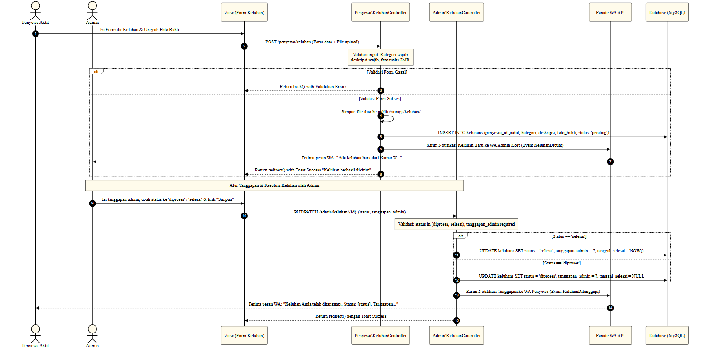

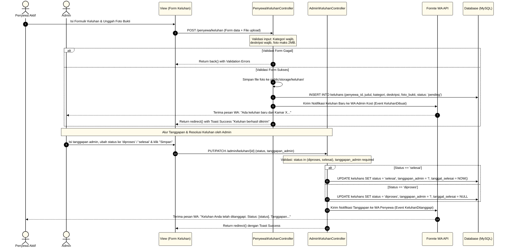
```mermaid
%%{init: {
  'theme': 'base',
  'themeVariables': {
    'fontFamily': 'Inter, system-ui, sans-serif',
    'fontSize': '12px',
    'actorBkg': '#FFFBEB',
    'actorBorder': '#000000',
    'actorTextColor': '#000000',
    'actorLineColor': '#000000',
    'noteBkgColor': '#FFFBEB',
    'noteBorderColor': '#000000',
    'noteTextColor': '#000000',
    'signalColor': '#000000',
    'signalTextColor': '#000000',
    'activationBkgColor': '#FDE047',
    'activationBorderColor': '#000000',
    'loopLimitBorderColor': '#000000',
    'loopLimitBkgColor': '#FDE047',
    'labelBoxBorderColor': '#000000',
    'labelBoxBkgColor': '#FFFFFF',
    'labelTextTextColor': '#000000',
    'primaryColor': '#FFFBEB',
    'primaryTextColor': '#000000',
    'primaryBorderColor': '#000000',
    'lineColor': '#000000'
  }
}}%%
sequenceDiagram
    autonumber
    actor PA as Penyewa Aktif
    actor A as Admin
    participant V as View (Form Keluhan)
    participant C as Penyewa\KeluhanController
    participant AC as Admin\KeluhanController
    participant F as Fonnte WA API
    participant DB as Database (MySQL)

    PA->>V: Isi Formulir Keluhan & Unggah Foto Bukti
    V->>C: POST /penyewa/keluhan (Form data + File upload)
    Note over C: Validasi input: Kategori wajib,<br/>deskripsi wajib, foto maks 2MB.
    
    alt Validasi Form Gagal
        C-->>V: Return back() with Validation Errors
    else Validasi Form Sukses
        C->>C: Simpan file foto ke public/storage/keluhan/
        C->>DB: INSERT INTO keluhans (penyewa_id, judul, kategori, deskripsi, foto_bukti, status: 'pending')
        C->>F: Kirim Notifikasi Keluhan Baru ke WA Admin Kost (Event KeluhanDibuat)
        F-->>A: Terima pesan WA: "Ada keluhan baru dari Kamar X..."
        C-->>V: Return redirect() with Toast Success "Keluhan berhasil dikirim"
    end

    Note over A, AC: Alur Tanggapan & Resolusi Keluhan oleh Admin
    A->>V: Isi tanggapan admin, ubah status ke 'diproses' / 'selesai' & klik "Simpan"
    V->>AC: PUT/PATCH /admin/keluhan/{id} (status, tanggapan_admin)
    Note over AC: Validasi: status in (diproses, selesai), tanggapan_admin required
    
    alt Status == 'selesai'
        AC->>DB: UPDATE keluhans SET status = 'selesai', tanggapan_admin = ?, tanggal_selesai = NOW()
    else Status == 'diproses'
        AC->>DB: UPDATE keluhans SET status = 'diproses', tanggapan_admin = ?, tanggal_selesai = NULL
    end
    
    AC->>F: Kirim Notifikasi Tanggapan ke WA Penyewa (Event KeluhanDitanggapi)
    F-->>PA: Terima pesan WA: "Keluhan Anda telah ditanggapi. Status: [status]. Tanggapan..."
    AC-->>V: Return redirect() dengan Toast Success
```

* **Partisipan Utama**:
  * [Penyewa\KeluhanController](file:///c:/xampp/htdocs/asri-boarding-house/app/Http/Controllers/Penyewa/KeluhanController.php): Menangani pelaporan keluhan penyewa.
  * [Admin\KeluhanController](file:///c:/xampp/htdocs/asri-boarding-house/app/Http/Controllers/Admin/KeluhanController.php): Mengatur pembaruan status keluhan dan tanggapan admin.

---

### 2.8. Sequence Diagram 8: Pencatatan Pengeluaran & Integrasi Laporan Arus Kas (Admin)
Diagram ini menggambarkan pencatatan biaya operasional bulanan kost (arus kas keluar) beserta unggah bukti nota fisik, pembersihan file lama, serta konsolidasi laporan laba bersih.

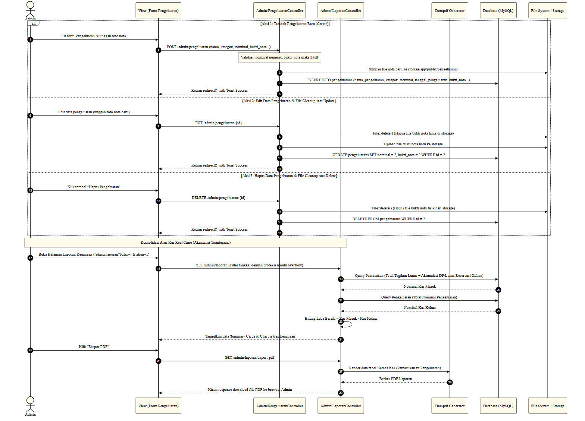

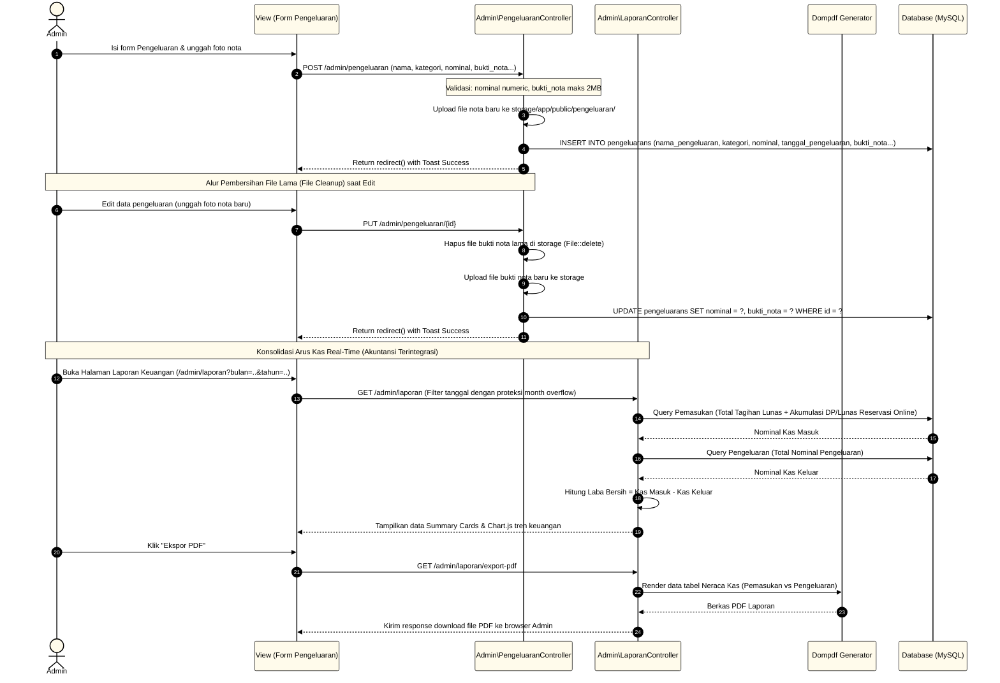
```mermaid
%%{init: {
  'theme': 'base',
  'themeVariables': {
    'fontFamily': 'Inter, system-ui, sans-serif',
    'fontSize': '12px',
    'actorBkg': '#FFFBEB',
    'actorBorder': '#000000',
    'actorTextColor': '#000000',
    'actorLineColor': '#000000',
    'noteBkgColor': '#FFFBEB',
    'noteBorderColor': '#000000',
    'noteTextColor': '#000000',
    'signalColor': '#000000',
    'signalTextColor': '#000000',
    'activationBkgColor': '#FDE047',
    'activationBorderColor': '#000000',
    'loopLimitBorderColor': '#000000',
    'loopLimitBkgColor': '#FDE047',
    'labelBoxBorderColor': '#000000',
    'labelBoxBkgColor': '#FFFFFF',
    'labelTextTextColor': '#000000',
    'primaryColor': '#FFFBEB',
    'primaryTextColor': '#000000',
    'primaryBorderColor': '#000000',
    'lineColor': '#000000'
  }
}}%%
sequenceDiagram
    autonumber
    actor A as Admin
    participant V as View (Form Pengeluaran)
    participant C as Admin\PengeluaranController
    participant LC as Admin\LaporanController
    participant Pdf as Dompdf Generator
    participant DB as Database (MySQL)

    A->>V: Isi form Pengeluaran & unggah foto nota
    V->>C: POST /admin/pengeluaran (nama, kategori, nominal, bukti_nota...)
    Note over C: Validasi: nominal numeric, bukti_nota maks 2MB
    C->>C: Upload file nota baru ke storage/app/public/pengeluaran/
    C->>DB: INSERT INTO pengeluarans (nama_pengeluaran, kategori, nominal, tanggal_pengeluaran, bukti_nota...)
    C-->>V: Return redirect() with Toast Success

    Note over A, C: Alur Pembersihan File Lama (File Cleanup) saat Edit
    A->>V: Edit data pengeluaran (unggah foto nota baru)
    V->>C: PUT /admin/pengeluaran/{id}
    C->>C: Hapus file bukti nota lama di storage (File::delete)
    C->>C: Upload file bukti nota baru ke storage
    C->>DB: UPDATE pengeluarans SET nominal = ?, bukti_nota = ? WHERE id = ?
    C-->>V: Return redirect() with Toast Success

    Note over A, LC: Konsolidasi Arus Kas Real-Time (Akuntansi Terintegrasi)
    A->>V: Buka Halaman Laporan Keuangan (/admin/laporan?bulan=..&tahun=..)
    V->>LC: GET /admin/laporan (Filter tanggal dengan proteksi month overflow)
    LC->>DB: Query Pemasukan (Total Tagihan Lunas + Akumulasi DP/Lunas Reservasi Online)
    DB-->>LC: Nominal Kas Masuk
    LC->>DB: Query Pengeluaran (Total Nominal Pengeluaran)
    DB-->>LC: Nominal Kas Keluar
    LC->>LC: Hitung Laba Bersih = Kas Masuk - Kas Keluar
    LC-->>V: Tampilkan data Summary Cards & Chart.js tren keuangan
    
    A->>V: Klik "Ekspor PDF"
    V->>LC: GET /admin/laporan/export-pdf
    LC->>Pdf: Render data tabel Neraca Kas (Pemasukan vs Pengeluaran)
    Pdf-->>LC: Berkas PDF Laporan
    LC-->>V: Kirim response download file PDF ke browser Admin
```

* **Partisipan Utama**:
  * [Admin\PengeluaranController](file:///c:/xampp/htdocs/asri-boarding-house/app/Http/Controllers/Admin/PengeluaranController.php): Menangani data transaksi biaya operasional.
  * [Admin\LaporanController](file:///c:/xampp/htdocs/asri-boarding-house/app/Http/Controllers/Admin/LaporanController.php): Mengatur agregasi laba rugi dan ekspor laporan.

---

### 2.9. Sequence Diagram 9: Manajemen Konten Dinamis - FAQ, Galeri, Ulasan (Admin)
Diagram ini menjelaskan bagaimana administrator mengelola data master FAQ, Galeri Foto, dan Ulasan Pelanggan secara dinamis dari database, termasuk penanganan pembersihan file lama secara fisik saat ulasan/galeri diperbarui atau dihapus.

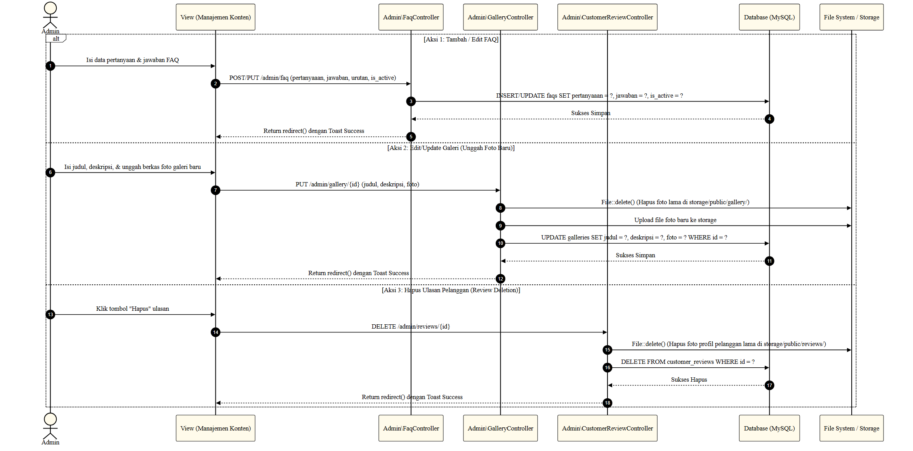

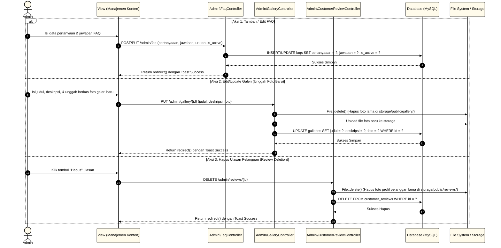
```mermaid
%%{init: {
  'theme': 'base',
  'themeVariables': {
    'fontFamily': 'Inter, system-ui, sans-serif',
    'fontSize': '12px',
    'actorBkg': '#FFFBEB',
    'actorBorder': '#000000',
    'actorTextColor': '#000000',
    'actorLineColor': '#000000',
    'noteBkgColor': '#FFFBEB',
    'noteBorderColor': '#000000',
    'noteTextColor': '#000000',
    'signalColor': '#000000',
    'signalTextColor': '#000000',
    'activationBkgColor': '#FDE047',
    'activationBorderColor': '#000000',
    'loopLimitBorderColor': '#000000',
    'loopLimitBkgColor': '#FDE047',
    'labelBoxBorderColor': '#000000',
    'labelBoxBkgColor': '#FFFFFF',
    'labelTextTextColor': '#000000',
    'primaryColor': '#FFFBEB',
    'primaryTextColor': '#000000',
    'primaryBorderColor': '#000000',
    'lineColor': '#000000'
  }
}}%%
sequenceDiagram
    autonumber
    actor A as Admin
    participant V as View (Manajemen Konten)
    participant FC as Admin\FaqController
    participant GC as Admin\GalleryController
    participant RC as Admin\CustomerReviewController
    participant DB as Database (MySQL)
    participant FS as File System / Storage

    alt Aksi 1: Tambah / Edit FAQ
        A->>V: Isi data pertanyaan & jawaban FAQ
        V->>FC: POST/PUT /admin/faq (pertanyaaan, jawaban, urutan, is_active)
        FC->>DB: INSERT/UPDATE faqs SET pertanyaaan = ?, jawaban = ?, is_active = ?
        DB-->>FC: Sukses Simpan
        FC-->>V: Return redirect() dengan Toast Success
    else Aksi 2: Edit/Update Galeri (Unggah Foto Baru)
        A->>V: Isi judul, deskripsi, & unggah berkas foto galeri baru
        V->>GC: PUT /admin/gallery/{id} (judul, deskripsi, foto)
        GC->>FS: File::delete() (Hapus foto lama di storage/public/gallery/)
        GC->>FS: Upload file foto baru ke storage
        GC->>DB: UPDATE galleries SET judul = ?, deskripsi = ?, foto = ? WHERE id = ?
        DB-->>GC: Sukses Simpan
        GC-->>V: Return redirect() dengan Toast Success
    else Aksi 3: Hapus Ulasan Pelanggan (Review Deletion)
        A->>V: Klik tombol "Hapus" ulasan
        V->>RC: DELETE /admin/reviews/{id}
        RC->>FS: File::delete() (Hapus foto profil pelanggan lama di storage/public/reviews/)
        RC->>DB: DELETE FROM customer_reviews WHERE id = ?
        DB-->>RC: Sukses Hapus
        RC-->>V: Return redirect() dengan Toast Success
    end
```

* **Partisipan Utama**:
  * [Admin\FaqController](file:///c:/xampp/htdocs/asri-boarding-house/app/Http/Controllers/Admin/FaqController.php): Mengelola data tanya jawab FAQ.
  * [Admin\GalleryController](file:///c:/xampp/htdocs/asri-boarding-house/app/Http/Controllers/Admin/GalleryController.php): Mengelola konten foto galeri kost.
  * [Admin\CustomerReviewController](file:///c:/xampp/htdocs/asri-boarding-house/app/Http/Controllers/Admin/CustomerReviewController.php): Mengelola ulasan kepuasan pelanggan.
* **Logika Penting**: Saat proses *update* atau *delete* media gambar, sistem mengeksekusi penghapusan file fisik di storage (`File::delete`) untuk mencegah penumpukan file sampah yang tidak digunakan.

---

### 2.10. Sequence Diagram 10: Manajemen Peraturan & Tata Tertib Kost (Admin & Penyewa Aktif)
Diagram ini menggambarkan penambahan/pembaruan tata tertib kost secara dinamis dari database oleh pengelola serta rendering adaptif tata tertib pada sidebar portal penyewa aktif yang mendukung kegelapan (Dark Mode).

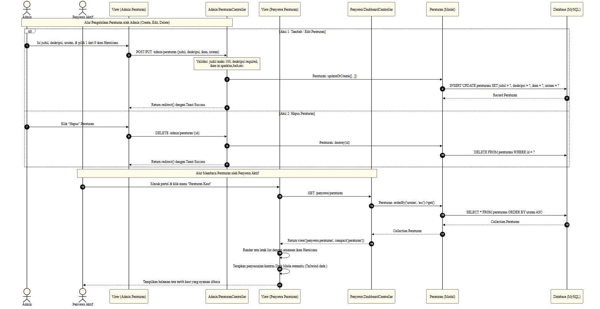

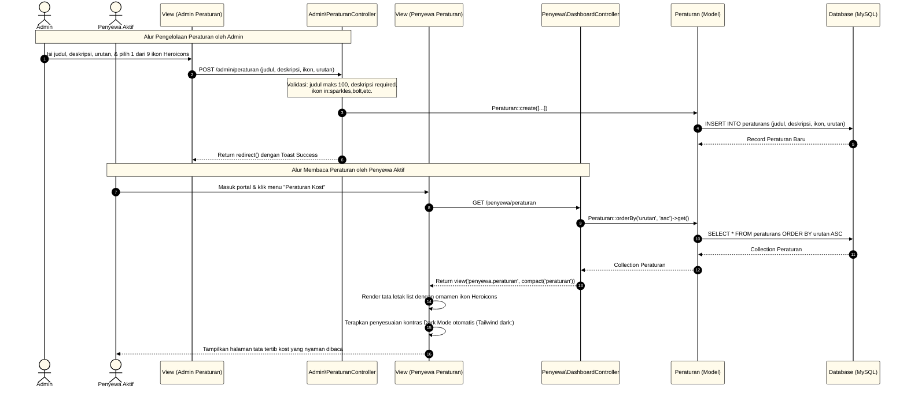
```mermaid
%%{init: {
  'theme': 'base',
  'themeVariables': {
    'fontFamily': 'Inter, system-ui, sans-serif',
    'fontSize': '12px',
    'actorBkg': '#FFFBEB',
    'actorBorder': '#000000',
    'actorTextColor': '#000000',
    'actorLineColor': '#000000',
    'noteBkgColor': '#FFFBEB',
    'noteBorderColor': '#000000',
    'noteTextColor': '#000000',
    'signalColor': '#000000',
    'signalTextColor': '#000000',
    'activationBkgColor': '#FDE047',
    'activationBorderColor': '#000000',
    'loopLimitBorderColor': '#000000',
    'loopLimitBkgColor': '#FDE047',
    'labelBoxBorderColor': '#000000',
    'labelBoxBkgColor': '#FFFFFF',
    'labelTextTextColor': '#000000',
    'primaryColor': '#FFFBEB',
    'primaryTextColor': '#000000',
    'primaryBorderColor': '#000000',
    'lineColor': '#000000'
  }
}}%%
sequenceDiagram
    autonumber
    actor A as Admin
    actor P as Penyewa Aktif
    participant V_Admin as View (Admin Peraturan)
    participant C_Admin as Admin\PeraturanController
    participant V_Penyewa as View (Penyewa Peraturan)
    participant C_Penyewa as Penyewa\DashboardController
    participant M as Peraturan (Model)
    participant DB as Database (MySQL)

    Note over A, C_Admin: Alur Pengelolaan Peraturan oleh Admin
    A->>V_Admin: Isi judul, deskripsi, urutan, & pilih 1 dari 9 ikon Heroicons
    V_Admin->>C_Admin: POST /admin/peraturan (judul, deskripsi, ikon, urutan)
    Note over C_Admin: Validasi: judul maks 100, deskripsi required,<br/>ikon in:sparkles,bolt,etc.
    C_Admin->>M: Peraturan::create([...])
    M->>DB: INSERT INTO peraturans (judul, deskripsi, ikon, urutan)
    DB-->>M: Record Peraturan Baru
    C_Admin-->>V_Admin: Return redirect() dengan Toast Success

    Note over P, C_Penyewa: Alur Membaca Peraturan oleh Penyewa Aktif
    P->>V_Penyewa: Masuk portal & klik menu "Peraturan Kost"
    V_Penyewa->>C_Penyewa: GET /penyewa/peraturan
    C_Penyewa->>M: Peraturan::orderBy('urutan', 'asc')->get()
    M->>DB: SELECT * FROM peraturans ORDER BY urutan ASC
    DB-->>M: Collection Peraturan
    M-->>C_Penyewa: Collection Peraturan
    C_Penyewa-->>V_Penyewa: Return view('penyewa.peraturan', compact('peraturan'))
    V_Penyewa->>V_Penyewa: Render tata letak list dengan ornamen ikon Heroicons
    V_Penyewa->>V_Penyewa: Terapkan penyesuaian kontras Dark Mode otomatis (Tailwind dark:)
    V_Penyewa-->>P: Tampilkan halaman tata tertib kost yang nyaman dibaca
```

* **Partisipan Utama**:
  * [Admin\PeraturanController](file:///c:/xampp/htdocs/asri-boarding-house/app/Http/Controllers/Admin/PeraturanController.php): Mengelola data peraturan di panel administrator.
  * [Penyewa\DashboardController](file:///c:/xampp/htdocs/asri-boarding-house/app/Http/Controllers/Penyewa/DashboardController.php): Mengatur penyajian halaman dashboard dan peraturan di modul penyewa.
* **Logika Penting**: Set ikon dibatasi pada 9 ikon SVG standar (Heroicons) yang terdaftar di basis data, dan diurutkan menaik berdasarkan properti kolom `urutan` untuk memastikan konsistensi alur tata tertib kost.

---

### 2.11. Sequence Diagram 11: Penonaktifan Penyewa (Checkout) & Pengelolaan Deposit (Admin)
Diagram ini menjelaskan alur kerja saat kontrak sewa dihentikan (Checkout), penyelesaian penahanan uang jaminan (deposit), inspeksi kamar kost, hingga admin mengubah status unit kamar secara manual.

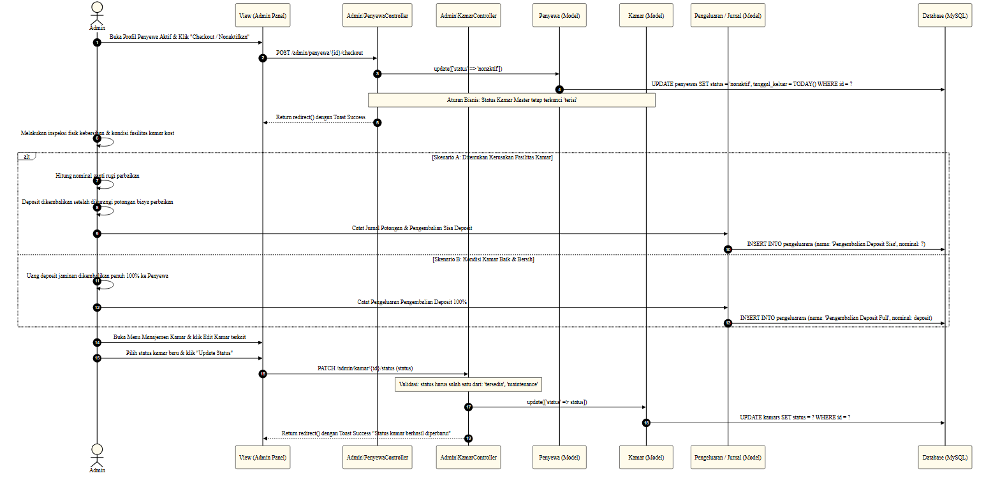

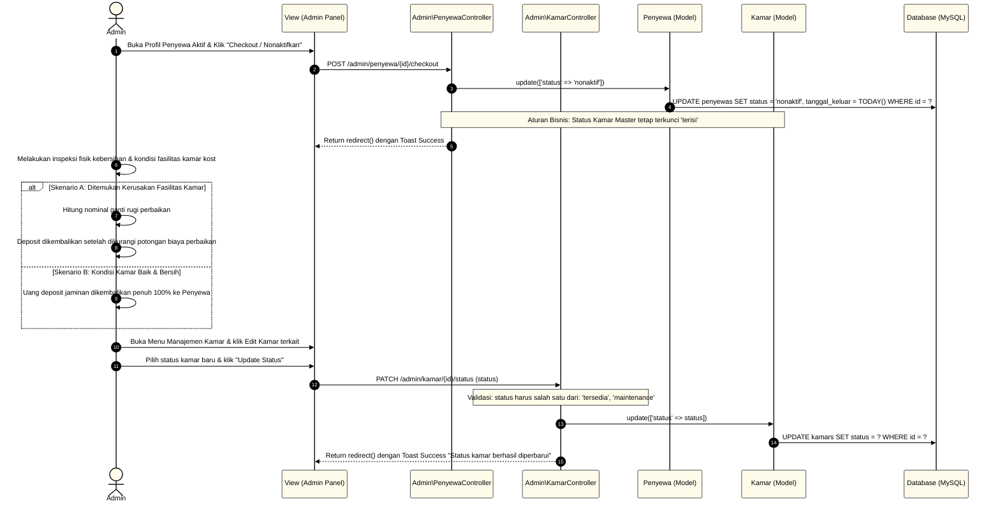
```mermaid
%%{init: {
  'theme': 'base',
  'themeVariables': {
    'fontFamily': 'Inter, system-ui, sans-serif',
    'fontSize': '12px',
    'actorBkg': '#FFFBEB',
    'actorBorder': '#000000',
    'actorTextColor': '#000000',
    'actorLineColor': '#000000',
    'noteBkgColor': '#FFFBEB',
    'noteBorderColor': '#000000',
    'noteTextColor': '#000000',
    'signalColor': '#000000',
    'signalTextColor': '#000000',
    'activationBkgColor': '#FDE047',
    'activationBorderColor': '#000000',
    'loopLimitBorderColor': '#000000',
    'loopLimitBkgColor': '#FDE047',
    'labelBoxBorderColor': '#000000',
    'labelBoxBkgColor': '#FFFFFF',
    'labelTextTextColor': '#000000',
    'primaryColor': '#FFFBEB',
    'primaryTextColor': '#000000',
    'primaryBorderColor': '#000000',
    'lineColor': '#000000'
  }
}}%%
sequenceDiagram
    autonumber
    actor A as Admin
    participant V as View (Admin Panel)
    participant C_Penyewa as Admin\PenyewaController
    participant C_Kamar as Admin\KamarController
    participant P as Penyewa (Model)
    participant K as Kamar (Model)
    participant DB as Database (MySQL)

    A->>V: Buka Profil Penyewa Aktif & Klik "Checkout / Nonaktifkan"
    V->>C_Penyewa: POST /admin/penyewa/{id}/checkout
    C_Penyewa->>P: update(['status' => 'nonaktif'])
    P->>DB: UPDATE penyewas SET status = 'nonaktif', tanggal_keluar = TODAY() WHERE id = ?
    Note over C_Penyewa, K: Aturan Bisnis: Status Kamar Master tetap terkunci 'terisi'
    C_Penyewa-->>V: Return redirect() dengan Toast Success

    A->>A: Melakukan inspeksi fisik kebersihan & kondisi fasilitas kamar kost
    
    alt Skenario A: Ditemukan Kerusakan Fasilitas Kamar
        A->>A: Hitung nominal ganti rugi perbaikan
        A->>A: Deposit dikembalikan setelah dikurangi potongan biaya perbaikan
    else Skenario B: Kondisi Kamar Baik & Bersih
        A->>A: Uang deposit jaminan dikembalikan penuh 100% ke Penyewa
    end

    A->>V: Buka Menu Manajemen Kamar & klik Edit Kamar terkait
    A->>V: Pilih status kamar baru & klik "Update Status"
    V->>C_Kamar: PATCH /admin/kamar/{id}/status (status)
    Note over C_Kamar: Validasi: status harus salah satu dari: 'tersedia', 'maintenance'
    C_Kamar->>K: update(['status' => status])
    K->>DB: UPDATE kamars SET status = ? WHERE id = ?
    C_Kamar-->>V: Return redirect() dengan Toast Success "Status kamar berhasil diperbarui"
```

* **Partisipan Utama**:
  * [Admin\PenyewaController](file:///c:/xampp/htdocs/asri-boarding-house/app/Http/Controllers/Admin/PenyewaController.php): Mengelola biodata penyewa dan penonaktifan status kontrak.
  * [Admin\KamarController](file:///c:/xampp/htdocs/asri-boarding-house/app/Http/Controllers/Admin/KamarController.php): Mengelola data master kamar.
* **Logika Penting**: Kamar tidak secara otomatis berubah menjadi `'tersedia'` ketika penyewa keluar. Admin diwajibkan mengubah status kamar secara MANUAL setelah melakukan inspeksi fisik di lapangan untuk menjamin kelayakan kamar hunian berikutnya.

---

### 2.12. Sequence Diagram 12: Live Chat Pengunjung Anonim / Guest Chat (Guest & Admin)
Diagram ini memetakan obrolan dinamis antara pengunjung umum (Tamu) yang belum mendaftarkan akun dengan administrator menggunakan modul Widget Live Chat (AJAX Polling).

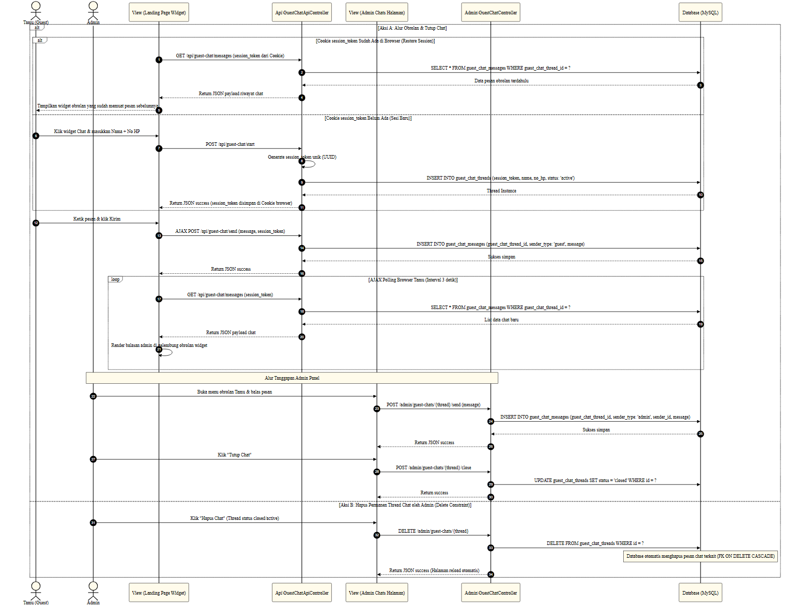

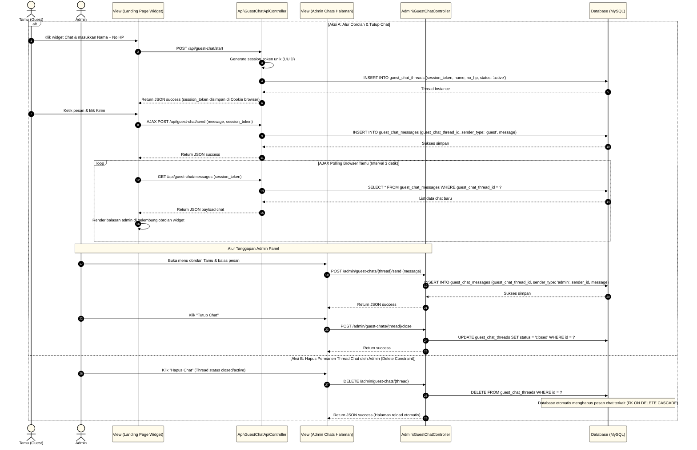
```mermaid
%%{init: {
  'theme': 'base',
  'themeVariables': {
    'fontFamily': 'Inter, system-ui, sans-serif',
    'fontSize': '12px',
    'actorBkg': '#FFFBEB',
    'actorBorder': '#000000',
    'actorTextColor': '#000000',
    'actorLineColor': '#000000',
    'noteBkgColor': '#FFFBEB',
    'noteBorderColor': '#000000',
    'noteTextColor': '#000000',
    'signalColor': '#000000',
    'signalTextColor': '#000000',
    'activationBkgColor': '#FDE047',
    'activationBorderColor': '#000000',
    'loopLimitBorderColor': '#000000',
    'loopLimitBkgColor': '#FDE047',
    'labelBoxBorderColor': '#000000',
    'labelBoxBkgColor': '#FFFFFF',
    'labelTextTextColor': '#000000',
    'primaryColor': '#FFFBEB',
    'primaryTextColor': '#000000',
    'primaryBorderColor': '#000000',
    'lineColor': '#000000'
  }
}}%%
sequenceDiagram
    autonumber
    actor T as Tamu (Guest)
    actor A as Admin
    participant V as View (Landing Page Widget)
    participant C as Api\GuestChatApiController
    participant AV as View (Admin Chats Halaman)
    participant AC as Admin\GuestChatController
    participant DB as Database (MySQL)

    alt Aksi A: Alur Obrolan & Tutup Chat
        T->>V: Klik widget Chat & masukkan Nama + No HP
        V->>C: POST /api/guest-chat/start
        C->>C: Generate session_token unik (UUID)
        C->>DB: INSERT INTO guest_chat_threads (session_token, name, no_hp, status: 'active')
        DB-->>C: Thread Instance
        C-->>V: Return JSON success (session_token disimpan di Cookie browser)

        T->>V: Ketik pesan & klik Kirim
        V->>C: AJAX POST /api/guest-chat/send (message, session_token)
        C->>DB: INSERT INTO guest_chat_messages (guest_chat_thread_id, sender_type: 'guest', message)
        DB-->>C: Sukses simpan
        C-->>V: Return JSON success
        
        loop AJAX Polling Browser Tamu (Interval 3 detik)
            V->>C: GET /api/guest-chat/messages (session_token)
            C->>DB: SELECT * FROM guest_chat_messages WHERE guest_chat_thread_id = ?
            DB-->>C: List data chat baru
            C-->>V: Return JSON payload chat
            V->>V: Render balasan admin di gelembung obrolan widget
        end

        Note over A, AC: Alur Tanggapan Admin Panel
        A->>AV: Buka menu obrolan Tamu & balas pesan
        AV->>AC: POST /admin/guest-chats/{thread}/send (message)
        AC->>DB: INSERT INTO guest_chat_messages (guest_chat_thread_id, sender_type: 'admin', sender_id, message)
        DB-->>AC: Sukses simpan
        AC-->>AV: Return JSON success
        
        A->>AV: Klik "Tutup Chat"
        AV->>AC: POST /admin/guest-chats/{thread}/close
        AC->>DB: UPDATE guest_chat_threads SET status = 'closed' WHERE id = ?
        AC-->>AV: Return success

    else Aksi B: Hapus Permanen Thread Chat oleh Admin (Delete Constraint)
        A->>AV: Klik "Hapus Chat" (Thread status closed/active)
        AV->>AC: DELETE /admin/guest-chats/{thread}
        AC->>DB: DELETE FROM guest_chat_threads WHERE id = ?
        Note over DB: Database otomatis menghapus pesan chat terkait (FK ON DELETE CASCADE)
        AC-->>AV: Return JSON success (Halaman reload otomatis)
    end
```

* **Partisipan Utama**:
  * [Api\GuestChatApiController](file:///c:/xampp/htdocs/asri-boarding-house/app/Http/Controllers/Api/GuestChatApiController.php): Mengontrol penyimpanan dan penarikan log pesan tamu di sisi klien publik.
  * [Admin\GuestChatController](file:///c:/xampp/htdocs/asri-boarding-house/app/Http/Controllers/Admin/GuestChatController.php): Mengontrol panel obrolan admin untuk merespons chat tamu.

---

### 2.13. Sequence Diagram 13: Keamanan Login & Force Change Password Pertama Kali (Admin Baru / Administrator)
Diagram ini menunjukkan penanganan keamanan sistem yang secara paksa mengaluhkan rute administrator baru untuk mengubah sandi default pertama kali sebelum diizinkan mengakses dashboard utama dan menu admin lainnya.

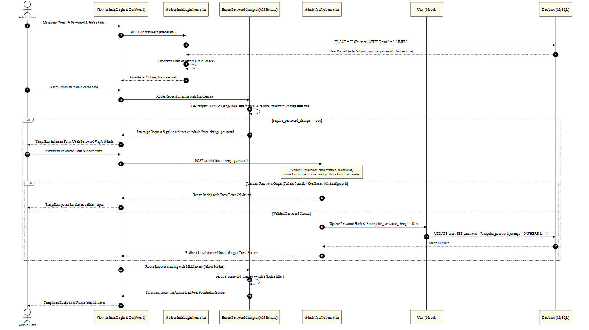

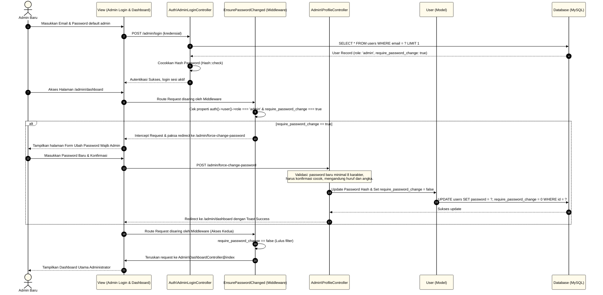
```mermaid
%%{init: {
  'theme': 'base',
  'themeVariables': {
    'fontFamily': 'Inter, system-ui, sans-serif',
    'fontSize': '12px',
    'actorBkg': '#FFFBEB',
    'actorBorder': '#000000',
    'actorTextColor': '#000000',
    'actorLineColor': '#000000',
    'noteBkgColor': '#FFFBEB',
    'noteBorderColor': '#000000',
    'noteTextColor': '#000000',
    'signalColor': '#000000',
    'signalTextColor': '#000000',
    'activationBkgColor': '#FDE047',
    'activationBorderColor': '#000000',
    'loopLimitBorderColor': '#000000',
    'loopLimitBkgColor': '#FDE047',
    'labelBoxBorderColor': '#000000',
    'labelBoxBkgColor': '#FFFFFF',
    'labelTextTextColor': '#000000',
    'primaryColor': '#FFFBEB',
    'primaryTextColor': '#000000',
    'primaryBorderColor': '#000000',
    'lineColor': '#000000'
  }
}}%%
sequenceDiagram
    autonumber
    actor A as Admin Baru
    participant V as View (Admin Login & Dashboard)
    participant C as Auth\AdminLoginController
    participant M as EnsurePasswordChanged (Middleware)
    participant PC as Admin\ProfileController
    participant U as User (Model)
    participant DB as Database (MySQL)

    A->>V: Masukkan Email & Password default admin
    V->>C: POST /admin/login (kredensial)
    C->>DB: SELECT * FROM users WHERE email = ? LIMIT 1
    DB-->>C: User Record (role: 'admin', require_password_change: true)
    C->>C: Cocokkan Hash Password (Hash::check)
    C-->>V: Autentikasi Sukses, login sesi aktif
    
    A->>V: Akses Halaman /admin/dashboard
    V->>M: Route Request disaring oleh Middleware
    M->>M: Cek properti auth()->user()->role === 'admin' & require_password_change === true
    
    alt require_password_change == true
        M-->>V: Intercept Request & paksa redirect ke /admin/force-change-password
        V-->>A: Tampilkan halaman Form Ubah Password Wajib Admin
        A->>V: Masukkan Password Baru & Konfirmasi
        V->>PC: POST /admin/force-change-password
        Note over PC: Validasi: password baru minimal 8 karakter,<br/>harus konfirmasi cocok, mengandung huruf dan angka.
        PC->>U: Update Password Hash & Set require_password_change = false
        U->>DB: UPDATE users SET password = ?, require_password_change = 0 WHERE id = ?
        DB-->>PC: Sukses update
        PC-->>V: Redirect ke /admin/dashboard dengan Toast Success
    end

    V->>M: Route Request disaring oleh Middleware (Akses Kedua)
    M->>M: require_password_change == false (Lulus filter)
    M->>V: Teruskan request ke Admin\DashboardController@index
    V-->>A: Tampilkan Dashboard Utama Administrator
```

* **Partisipan Utama**:
  * [Auth\AdminLoginController](file:///c:/xampp/htdocs/asri-boarding-house/app/Http/Controllers/Auth/AdminLoginController.php): Menangani autentikasi portal admin.
  * [EnsurePasswordChanged Middleware](file:///c:/xampp/htdocs/asri-boarding-house/app/Http/Middleware/EnsurePasswordChanged.php): Penjaga rute internal admin agar wajib mengubah password default terlebih dahulu.
  * [Admin\ProfileController](file:///c:/xampp/htdocs/asri-boarding-house/app/Http/Controllers/Admin/ProfileController.php): Mengolah permohonan penggantian password admin secara paksa.
* **Logika Penting**: Flag `require_password_change` yang bernilai `true` membatasi seluruh rute admin dari penyalahgunaan akun baru ber-password default.

---

### 2.14. Sequence Diagram 14: Manajemen Kamar & Relasi Fasilitas (Admin)
Diagram ini menjelaskan manajemen unit kamar kost oleh admin panel, pengelolaan relasi pivot data fasilitas kamar (Many-to-Many), serta pengamanan integritas database jika data kamar hendak dihapus.

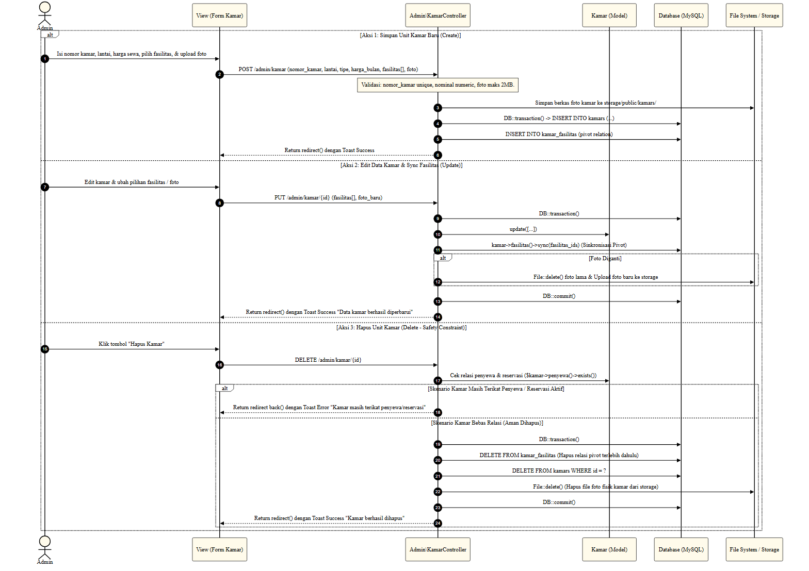

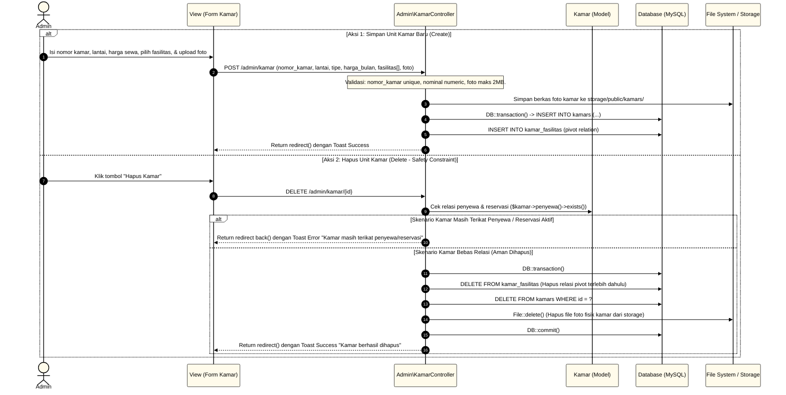
```mermaid
%%{init: {
  'theme': 'base',
  'themeVariables': {
    'fontFamily': 'Inter, system-ui, sans-serif',
    'fontSize': '12px',
    'actorBkg': '#FFFBEB',
    'actorBorder': '#000000',
    'actorTextColor': '#000000',
    'actorLineColor': '#000000',
    'noteBkgColor': '#FFFBEB',
    'noteBorderColor': '#000000',
    'noteTextColor': '#000000',
    'signalColor': '#000000',
    'signalTextColor': '#000000',
    'activationBkgColor': '#FDE047',
    'activationBorderColor': '#000000',
    'loopLimitBorderColor': '#000000',
    'loopLimitBkgColor': '#FDE047',
    'labelBoxBorderColor': '#000000',
    'labelBoxBkgColor': '#FFFFFF',
    'labelTextTextColor': '#000000',
    'primaryColor': '#FFFBEB',
    'primaryTextColor': '#000000',
    'primaryBorderColor': '#000000',
    'lineColor': '#000000'
  }
}}%%
sequenceDiagram
    autonumber
    actor A as Admin
    participant V as View (Form Kamar)
    participant C as Admin\KamarController
    participant K as Kamar (Model)
    participant DB as Database (MySQL)
    participant FS as File System / Storage

    alt Aksi 1: Simpan Unit Kamar Baru (Create)
        A->>V: Isi nomor kamar, lantai, harga sewa, pilih fasilitas, & upload foto
        V->>C: POST /admin/kamar (nomor_kamar, lantai, tipe, harga_bulan, fasilitas[], foto)
        Note over C: Validasi: nomor_kamar unique, nominal numeric, foto maks 2MB.
        C->>FS: Simpan berkas foto kamar ke storage/public/kamars/
        C->>DB: DB::transaction() -> INSERT INTO kamars (...)
        C->>DB: INSERT INTO kamar_fasilitas (pivot relation)
        C-->>V: Return redirect() dengan Toast Success
    else Aksi 2: Hapus Unit Kamar (Delete - Safety Constraint)
        A->>V: Klik tombol "Hapus Kamar"
        V->>C: DELETE /admin/kamar/{id}
        C->>K: Cek relasi penyewa & reservasi ($kamar->penyewa()->exists())
        
        alt Skenario Kamar Masih Terikat Penyewa / Reservasi Aktif
            C-->>V: Return redirect back() dengan Toast Error "Kamar masih terikat penyewa/reservasi"
        else Skenario Kamar Bebas Relasi (Aman Dihapus)
            C->>DB: DB::transaction()
            C->>DB: DELETE FROM kamar_fasilitas (Hapus relasi pivot terlebih dahulu)
            C->>DB: DELETE FROM kamars WHERE id = ?
            C->>FS: File::delete() (Hapus file foto fisik kamar dari storage)
            C->>DB: DB::commit()
            C-->>V: Return redirect() dengan Toast Success "Kamar berhasil dihapus"
        end
    end
```

* **Partisipan Utama**:
  * [Admin\KamarController](file:///c:/xampp/htdocs/asri-boarding-house/app/Http/Controllers/Admin/KamarController.php): Mengelola data master kamar kost putri dan statusnya.
* **Logika Penting**: Penerapan *Safety Constraint* mencegah terjadinya *Integrity constraint violation* pada database dengan memastikan kamar yang masih dihuni atau sudah dipesan tidak dapat dihapus secara tidak sengaja oleh administrator.

---

### 2.15. Sequence Diagram 15: Manajemen Penyewa & Validasi Kontrak (Admin)
Diagram ini menjelaskan pendaftaran manual penyewa kost baru (walk-in/offline) oleh administrator, serta validasi ketat ketersediaan unit kamar saat reaktivasi penyewa nonaktif, serta pengamanan penghapusan data jika memiliki riwayat transaksi tagihan.

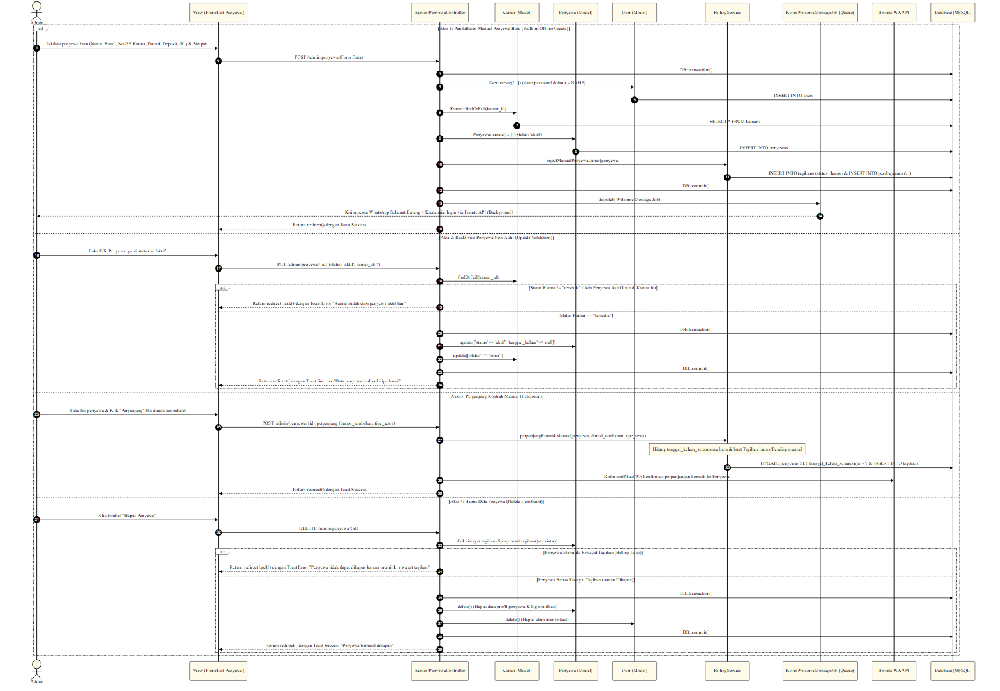

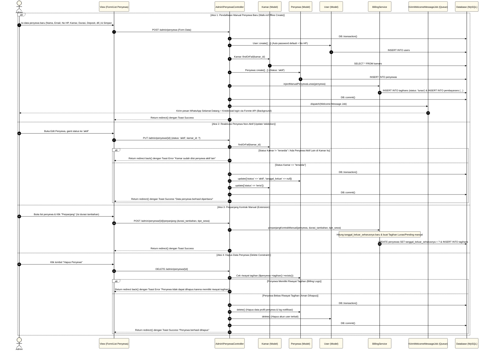
```mermaid
%%{init: {
  'theme': 'base',
  'themeVariables': {
    'fontFamily': 'Inter, system-ui, sans-serif',
    'fontSize': '12px',
    'actorBkg': '#FFFBEB',
    'actorBorder': '#000000',
    'actorTextColor': '#000000',
    'actorLineColor': '#000000',
    'noteBkgColor': '#FFFBEB',
    'noteBorderColor': '#000000',
    'noteTextColor': '#000000',
    'signalColor': '#000000',
    'signalTextColor': '#000000',
    'activationBkgColor': '#FDE047',
    'activationBorderColor': '#000000',
    'loopLimitBorderColor': '#000000',
    'loopLimitBkgColor': '#FDE047',
    'labelBoxBorderColor': '#000000',
    'labelBoxBkgColor': '#FFFFFF',
    'labelTextTextColor': '#000000',
    'primaryColor': '#FFFBEB',
    'primaryTextColor': '#000000',
    'primaryBorderColor': '#000000',
    'lineColor': '#000000'
  }
}}%%
sequenceDiagram
    autonumber
    actor A as Admin
    participant V as View (Form/List Penyewa)
    participant C as Admin\PenyewaController
    participant K as Kamar (Model)
    participant P as Penyewa (Model)
    participant U as User (Model)
    participant BService as BillingService
    participant Job as KirimWelcomeMessageJob (Queue)
    participant DB as Database (MySQL)

    alt Aksi 1: Pendaftaran Manual Penyewa Baru (Walk-in/Offline Create)
        A->>V: Isi data penyewa baru (Nama, Email, No HP, Kamar, Durasi, Deposit, dll.) & Simpan
        V->>C: POST /admin/penyewa (Form Data)
        C->>DB: DB::transaction()
        C->>U: User::create([...]) (Auto password default = No HP)
        U->>DB: INSERT INTO users
        C->>K: Kamar::findOrFail(kamar_id)
        K->>DB: SELECT * FROM kamars
        C->>P: Penyewa::create([...]) (Status: 'aktif')
        P->>DB: INSERT INTO penyewas
        C->>BService: injectManualPenyewaLunas(penyewa)
        BService->>DB: INSERT INTO tagihans (status: 'lunas') & INSERT INTO pembayarans (...)
        C->>DB: DB::commit()
        C->>Job: dispatch(Welcome Message Job)
        Job-->>A: Kirim pesan WhatsApp Selamat Datang + Kredensial login via Fonnte API (Background)
        C-->>V: Return redirect() dengan Toast Success

    else Aksi 2: Reaktivasi Penyewa Non-Aktif (Update Validation)
        A->>V: Buka Edit Penyewa, ganti status ke 'aktif'
        V->>C: PUT /admin/penyewa/{id} (status: 'aktif', kamar_id: ?)
        C->>K: findOrFail(kamar_id)
        
        alt Status Kamar != "tersedia" / Ada Penyewa Aktif Lain di Kamar Itu
            C-->>V: Return redirect back() dengan Toast Error "Kamar sudah diisi penyewa aktif lain"
        else Status Kamar == "tersedia"
            C->>DB: DB::transaction()
            C->>P: update(['status' => 'aktif', 'tanggal_keluar' => null])
            C->>K: update(['status' => 'terisi'])
            C->>DB: DB::commit()
            C-->>V: Return redirect() dengan Toast Success "Data penyewa berhasil diperbarui"
        end

    else Aksi 3: Perpanjang Kontrak Manual (Extension)
        A->>V: Buka list penyewa & Klik "Perpanjang" (Isi durasi tambahan)
        V->>C: POST /admin/penyewa/{id}/perpanjang (durasi_tambahan, tipe_sewa)
        C->>BService: perpanjangKontrakManual(penyewa, durasi_tambahan, tipe_sewa)
        Note over BService: Hitung tanggal_keluar_seharusnya baru & buat Tagihan Lunas/Pending manual
        BService->>DB: UPDATE penyewas SET tanggal_keluar_seharusnya = ? & INSERT INTO tagihans
        C-->>V: Return redirect() dengan Toast Success
        
    else Aksi 4: Hapus Data Penyewa (Delete Constraint)
        A->>V: Klik tombol "Hapus Penyewa"
        V->>C: DELETE /admin/penyewa/{id}
        C->>P: Cek riwayat tagihan ($penyewa->tagihan()->exists())
        
        alt Penyewa Memiliki Riwayat Tagihan (Billing Logs)
            C-->>V: Return redirect back() dengan Toast Error "Penyewa tidak dapat dihapus karena memiliki riwayat tagihan"
        else Penyewa Bebas Riwayat Tagihan (Aman Dihapus)
            C->>DB: DB::transaction()
            C->>P: delete() (Hapus data profil penyewa & log notifikasi)
            C->>U: delete() (Hapus akun user terkait)
            C->>DB: DB::commit()
            C-->>V: Return redirect() dengan Toast Success "Penyewa berhasil dihapus"
        end
    end
```

* **Partisipan Utama**:
  * [Admin\PenyewaController](file:///c:/xampp/htdocs/asri-boarding-house/app/Http/Controllers/Admin/PenyewaController.php): Mengelola profil, pembuatan tagihan sisa, deposit, perpanjangan kontrak, dan reaktivasi kontrak penyewa.
  * [BillingService](file:///c:/xampp/htdocs/asri-boarding-house/app/Services/BillingService.php): Layanan pembentukan tagihan sewa manual dan perpanjangan kontrak secara transaksional.
  * [KirimWelcomeMessageJob](file:///c:/xampp/htdocs/asri-boarding-house/app/Jobs/KirimWelcomeMessageJob.php): Job antrean background untuk mengirimkan kredensial akun pengguna ke WhatsApp.
* **Logika Penting**: Hubungan data dijaga ketat agar penyewa dengan riwayat pembayaran tidak dapat dihapus, guna menjaga keutuhan laporan keuangan akuntansi. Pada pendaftaran manual offline (walk-in), password akun default diatur menggunakan nomor WhatsApp untuk login portal. Kamar tujuan reaktivasi atau perpanjangan diverifikasi ketersediaannya demi mencegah *double booking* fisik.

---

### 2.16. Sequence Diagram 16: Google OAuth Login & Kelengkapan Profil (User / Guest)
Diagram ini menjelaskan alur masuk pengguna secara instan via Google OAuth (Laravel Socialite) serta penanganan keamanan sistem untuk mendeteksi profil yang belum lengkap (nomor WhatsApp wajib) sebelum diizinkan bertransaksi.

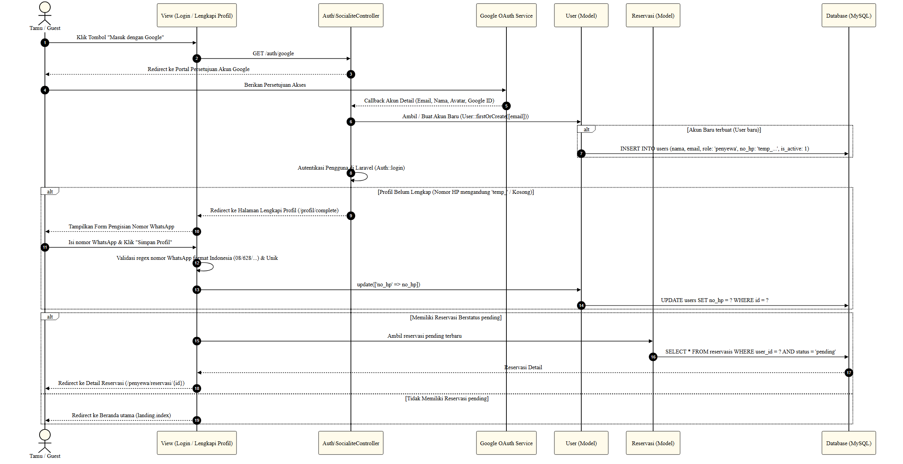

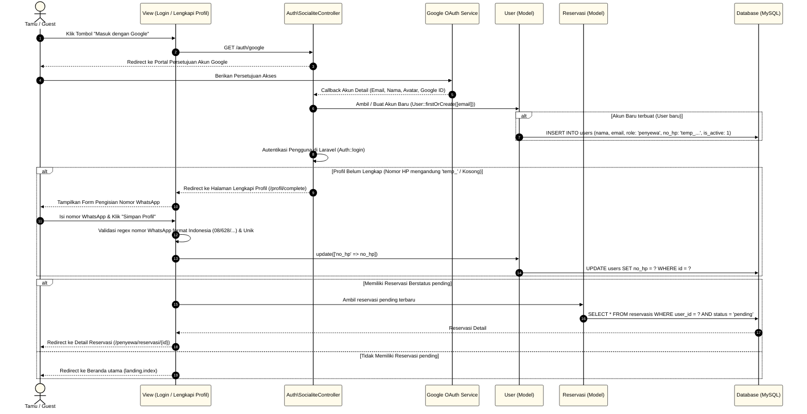
```mermaid
%%{init: {
  'theme': 'base',
  'themeVariables': {
    'fontFamily': 'Inter, system-ui, sans-serif',
    'fontSize': '12px',
    'actorBkg': '#FFFBEB',
    'actorBorder': '#000000',
    'actorTextColor': '#000000',
    'actorLineColor': '#000000',
    'noteBkgColor': '#FFFBEB',
    'noteBorderColor': '#000000',
    'noteTextColor': '#000000',
    'signalColor': '#000000',
    'signalTextColor': '#000000',
    'activationBkgColor': '#FDE047',
    'activationBorderColor': '#000000',
    'loopLimitBorderColor': '#000000',
    'loopLimitBkgColor': '#FDE047',
    'labelBoxBorderColor': '#000000',
    'labelBoxBkgColor': '#FFFFFF',
    'labelTextTextColor': '#000000',
    'primaryColor': '#FFFBEB',
    'primaryTextColor': '#000000',
    'primaryBorderColor': '#000000',
    'lineColor': '#000000'
  }
}}%%
sequenceDiagram
    autonumber
    actor G as Tamu / Guest
    participant V as View (Login / Lengkapi Profil)
    participant C_Social as Auth\SocialiteController
    participant S_Auth as Google OAuth Service
    participant U as User (Model)
    participant R as Reservasi (Model)
    participant DB as Database (MySQL)

    G->>V: Klik Tombol "Masuk dengan Google"
    V->>C_Social: GET /auth/google
    C_Social-->>G: Redirect ke Portal Persetujuan Akun Google
    G->>S_Auth: Berikan Persetujuan Akses
    S_Auth-->>C_Social: Callback Akun Detail (Email, Nama, Avatar, Google ID)
    
    C_Social->>U: Ambil / Buat Akun Baru (User::firstOrCreate([email]))
    
    alt Akun Baru terbuat (User baru)
        U->>DB: INSERT INTO users (nama, email, role: 'penyewa', no_hp: 'temp_...', is_active: 1)
    end
    
    C_Social->>C_Social: Autentikasi Pengguna di Laravel (Auth::login)
    
    alt Profil Belum Lengkap (Nomor HP mengandung 'temp_' / Kosong)
        C_Social-->>V: Redirect ke Halaman Lengkapi Profil (/profil/complete)
        V-->>G: Tampilkan Form Pengisian Nomor WhatsApp
        G->>V: Isi nomor WhatsApp & Klik "Simpan Profil"
        V->>V: Validasi regex nomor WhatsApp format Indonesia (08/628/...) & Unik
        V->>U: update(['no_hp' => no_hp])
        U->>DB: UPDATE users SET no_hp = ? WHERE id = ?
    end
    
    alt Memiliki Reservasi Berstatus pending
        V->>R: Ambil reservasi pending terbaru
        R->>DB: SELECT * FROM reservasis WHERE user_id = ? AND status = 'pending'
        DB-->>V: Reservasi Detail
        V-->>G: Redirect ke Detail Reservasi (/penyewa/reservasi/{id})
    else Tidak Memiliki Reservasi pending
        V-->>G: Redirect ke Beranda utama (landing.index)
    end
```

* **Partisipan Utama**:
  * [Auth\SocialiteController](file:///c:/xampp/htdocs/asri-boarding-house/app/Http/Controllers/Auth/SocialiteController.php): Menangani komunikasi pertukaran token Google OAuth dengan server Laravel.
* **Logika Penting**: Nomor WhatsApp penyewa adalah data vital yang digunakan sebagai jalur komunikasi notifikasi (Fonnte WA API). Sistem secara paksa menangguhkan pemesanan dan mengalihkan pengguna ke form `/profil/complete` jika nomor HP masih berupa data bayangan (`temp_...`).

---

### 2.17. Sequence Diagram 17: Pembatalan & Penghapusan Permanen Reservasi Batal (Admin & Calon Penyewa)
Diagram ini menjelaskan mekanisme pembatalan reservasi oleh penyewa atau pengelola (mengubah status ke 'batal'), pembatalan otomatis oleh Scheduler jika pembayaran pending melewati batas waktu 24 jam, serta fitur khusus admin untuk menghapus reservasi batal secara permanen beserta chat pendukungnya (Cascading Delete).

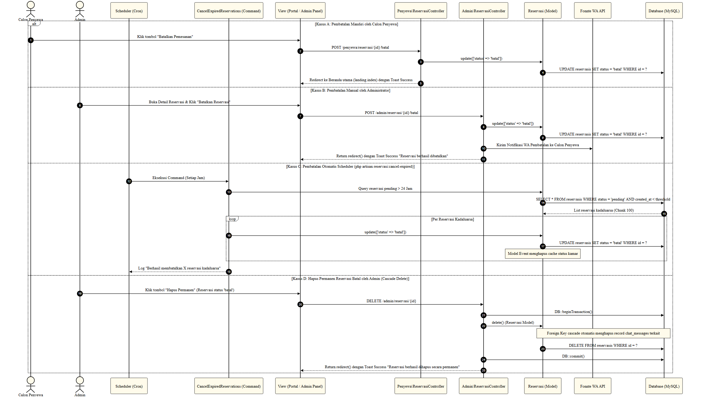

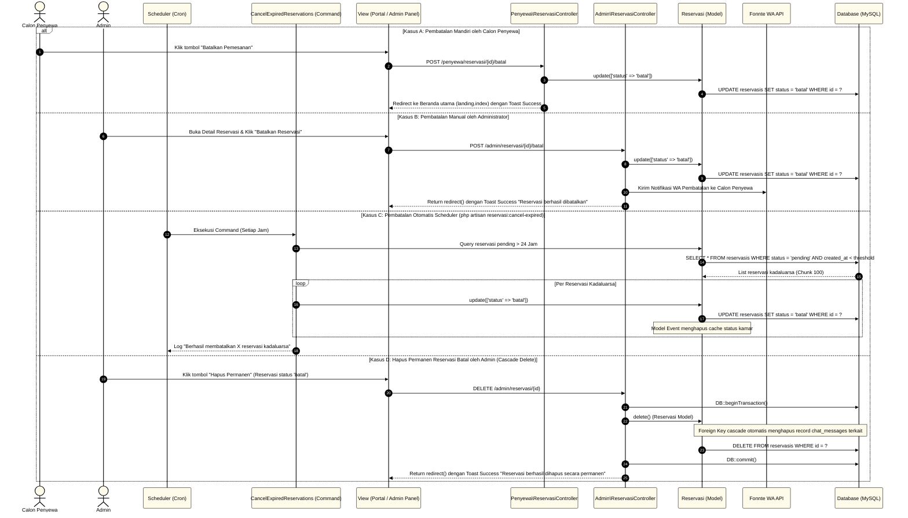
```mermaid
%%{init: {
  'theme': 'base',
  'themeVariables': {
    'fontFamily': 'Inter, system-ui, sans-serif',
    'fontSize': '12px',
    'actorBkg': '#FFFBEB',
    'actorBorder': '#000000',
    'actorTextColor': '#000000',
    'actorLineColor': '#000000',
    'noteBkgColor': '#FFFBEB',
    'noteBorderColor': '#000000',
    'noteTextColor': '#000000',
    'signalColor': '#000000',
    'signalTextColor': '#000000',
    'activationBkgColor': '#FDE047',
    'activationBorderColor': '#000000',
    'loopLimitBorderColor': '#000000',
    'loopLimitBkgColor': '#FDE047',
    'labelBoxBorderColor': '#000000',
    'labelBoxBkgColor': '#FFFFFF',
    'labelTextTextColor': '#000000',
    'primaryColor': '#FFFBEB',
    'primaryTextColor': '#000000',
    'primaryBorderColor': '#000000',
    'lineColor': '#000000'
  }
}}%%
sequenceDiagram
    autonumber
    actor CP as Calon Penyewa
    actor A as Admin
    participant S as Scheduler (Cron)
    participant Cmd as CancelExpiredReservations (Command)
    participant V as View (Portal / Admin Panel)
    participant C_Penyewa as Penyewa\ReservasiController
    participant C_Admin as Admin\ReservasiController
    participant R as Reservasi (Model)
    participant F as Fonnte WA API
    participant DB as Database (MySQL)

    alt Kasus A: Pembatalan Mandiri oleh Calon Penyewa
        CP->>V: Klik tombol "Batalkan Pemesanan"
        V->>C_Penyewa: POST /penyewa/reservasi/{id}/batal
        C_Penyewa->>R: update(['status' => 'batal'])
        R->>DB: UPDATE reservasis SET status = 'batal' WHERE id = ?
        C_Penyewa-->>V: Redirect ke Beranda utama (landing.index) dengan Toast Success
    
    else Kasus B: Pembatalan Manual oleh Administrator
        A->>V: Buka Detail Reservasi & Klik "Batalkan Reservasi"
        V->>C_Admin: POST /admin/reservasi/{id}/batal
        C_Admin->>R: update(['status' => 'batal'])
        R->>DB: UPDATE reservasis SET status = 'batal' WHERE id = ?
        C_Admin->>F: Kirim Notifikasi WA Pembatalan ke Calon Penyewa
        C_Admin-->>V: Return redirect() dengan Toast Success "Reservasi berhasil dibatalkan"

    else Kasus C: Pembatalan Otomatis Scheduler (php artisan reservasi:cancel-expired)
        S->>Cmd: Eksekusi Command (Setiap Jam)
        Cmd->>R: Query reservasi pending > 24 Jam
        R->>DB: SELECT * FROM reservasis WHERE status = 'pending' AND created_at < threshold
        DB-->>R: List reservasi kadaluarsa (Chunk 100)
        loop Per Reservasi Kadaluarsa
            Cmd->>R: update(['status' => 'batal'])
            R->>DB: UPDATE reservasis SET status = 'batal' WHERE id = ?
            Note over R: Model Event menghapus cache status kamar
        end
        Cmd-->>S: Log "Berhasil membatalkan X reservasi kadaluarsa"

    else Kasus D: Hapus Permanen Reservasi Batal oleh Admin (Cascade Delete)
        A->>V: Klik tombol "Hapus Permanen" (Reservasi status 'batal')
        V->>C_Admin: DELETE /admin/reservasi/{id}
        C_Admin->>DB: DB::beginTransaction()
        C_Admin->>R: delete() (Reservasi Model)
        Note over R, DB: Foreign Key cascade otomatis menghapus record chat_messages terkait
        R->>DB: DELETE FROM reservasis WHERE id = ?
        C_Admin->>DB: DB::commit()
        C_Admin-->>V: Return redirect() dengan Toast Success "Reservasi berhasil dihapus secara permanen"
    end
```

* **Partisipan Utama**:
  * [Penyewa\ReservasiController](file:///c:/xampp/htdocs/asri-boarding-house/app/Http/Controllers/Penyewa/ReservasiController.php): Menangani pembatalan reservasi di sisi calon penyewa.
  * [Admin\ReservasiController](file:///c:/xampp/htdocs/asri-boarding-house/app/Http/Controllers/Admin/ReservasiController.php): Menangani pembatalan dan penghapusan data reservasi di sisi pengelola.
  * [CancelExpiredReservations Command](file:///c:/xampp/htdocs/asri-boarding-house/app/Console/Commands/CancelExpiredReservations.php): Command otomatis scheduler pembersihan reservasi pending kadaluarsa.
* **Logika Penting**: Pembatalan menjaga riwayat transaksi tetap tercatat dengan status `'batal'`. Pembatalan otomatis dilakukan oleh scheduler setiap jam untuk membebaskan kunci kamar dari pemesanan terlantar. Administrator diberikan hak khusus untuk menghapus reservasi batal secara permanen yang otomatis membersihkan seluruh percakapan terikat (*cascade delete*).

---

### 2.18. Sequence Diagram 18: Broadcast Pengumuman & Manajemen Notifikasi Manual/Gagal (Admin & Penyewa)
Diagram ini menjelaskan mekanisme administrator dalam mengirimkan pesan pengumuman broadcast kepada penyewa aktif via WhatsApp, Email, atau mempostingnya ke portal web, serta melakukan pengiriman ulang (*retry*) notifikasi otomatis/manual yang berstatus gagal.

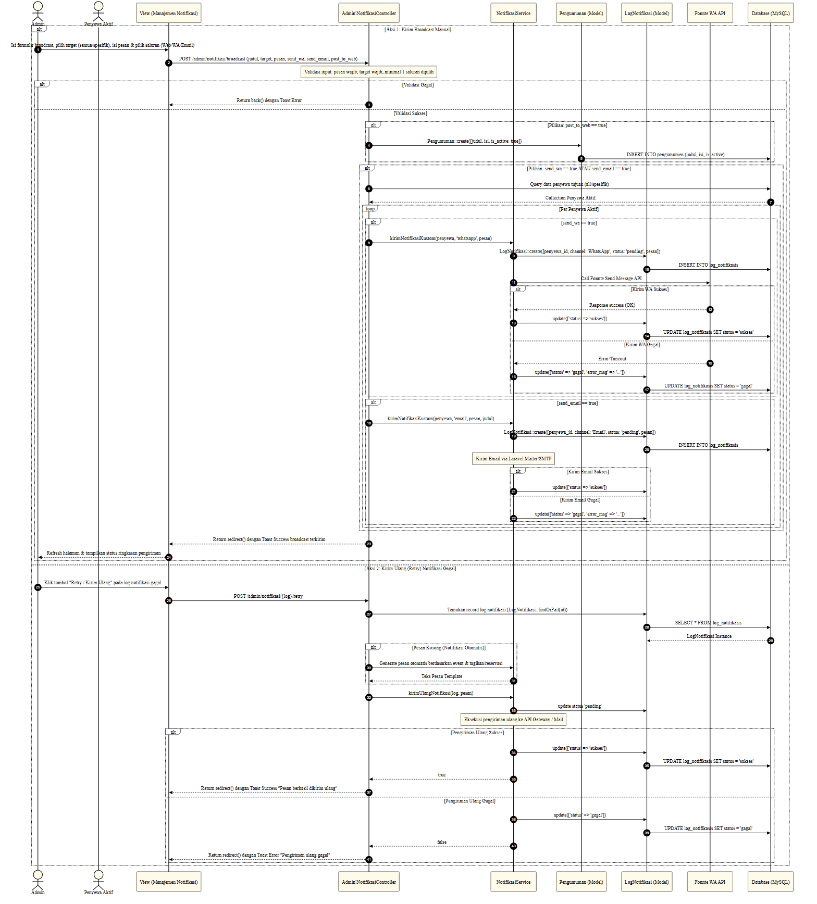

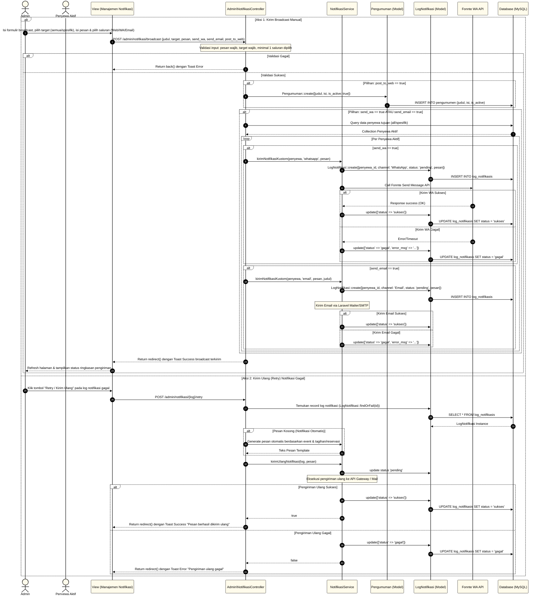
```mermaid
%%{init: {
  'theme': 'base',
  'themeVariables': {
    'fontFamily': 'Inter, system-ui, sans-serif',
    'fontSize': '12px',
    'actorBkg': '#FFFBEB',
    'actorBorder': '#000000',
    'actorTextColor': '#000000',
    'actorLineColor': '#000000',
    'noteBkgColor': '#FFFBEB',
    'noteBorderColor': '#000000',
    'noteTextColor': '#000000',
    'signalColor': '#000000',
    'signalTextColor': '#000000',
    'activationBkgColor': '#FDE047',
    'activationBorderColor': '#000000',
    'loopLimitBorderColor': '#000000',
    'loopLimitBkgColor': '#FDE047',
    'labelBoxBorderColor': '#000000',
    'labelBoxBkgColor': '#FFFFFF',
    'labelTextTextColor': '#000000',
    'primaryColor': '#FFFBEB',
    'primaryTextColor': '#000000',
    'primaryBorderColor': '#000000',
    'lineColor': '#000000'
  }
}}%%
sequenceDiagram
    autonumber
    actor A as Admin
    actor PA as Penyewa Aktif
    participant V as View (Manajemen Notifikasi)
    participant C as Admin\NotifikasiController
    participant NS as NotifikasiService
    participant P as Pengumuman (Model)
    participant LN as LogNotifikasi (Model)
    participant F as Fonnte WA API
    participant DB as Database (MySQL)

    alt Aksi 1: Kirim Broadcast Manual
        A->>V: Isi formulir broadcast, pilih target (semua/spesifik), isi pesan & pilih saluran (Web/WA/Email)
        V->>C: POST /admin/notifikasi/broadcast (judul, target, pesan, send_wa, send_email, post_to_web)
        Note over C: Validasi input: pesan wajib, target wajib, minimal 1 saluran dipilih

        alt Validasi Gagal
            C-->>V: Return back() dengan Toast Error
        else Validasi Sukses
            alt Pilihan: post_to_web == true
                C->>P: Pengumuman::create([judul, isi, is_active: true])
                P->>DB: INSERT INTO pengumumen (judul, isi, is_active)
            end

            alt Pilihan: send_wa == true ATAU send_email == true
                C->>DB: Query data penyewa tujuan (all/spesifik)
                DB-->>C: Collection Penyewa Aktif
                
                loop Per Penyewa Aktif
                    alt send_wa == true
                        C->>NS: kirimNotifikasiKustom(penyewa, 'whatsapp', pesan)
                        NS->>LN: LogNotifikasi::create([penyewa_id, channel: 'WhatsApp', status: 'pending', pesan])
                        LN->>DB: INSERT INTO log_notifikasis
                        NS->>F: Call Fonnte Send Message API
                        
                        alt Kirim WA Sukses
                            F-->>NS: Response success (OK)
                            NS->>LN: update(['status' => 'sukses'])
                            LN->>DB: UPDATE log_notifikasis SET status = 'sukses'
                        else Kirim WA Gagal
                            F-->>NS: Error/Timeout
                            NS->>LN: update(['status' => 'gagal', 'error_msg' => '...'])
                            LN->>DB: UPDATE log_notifikasis SET status = 'gagal'
                        end
                    end
                    
                    alt send_email == true
                        C->>NS: kirimNotifikasiKustom(penyewa, 'email', pesan, judul)
                        NS->>LN: LogNotifikasi::create([penyewa_id, channel: 'Email', status: 'pending', pesan])
                        LN->>DB: INSERT INTO log_notifikasis
                        Note over NS: Kirim Email via Laravel Mailer/SMTP
                        alt Kirim Email Sukses
                            NS->>LN: update(['status' => 'sukses'])
                        else Kirim Email Gagal
                            NS->>LN: update(['status' => 'gagal', 'error_msg' => '...'])
                        end
                    end
                end
            end
            
            C-->>V: Return redirect() dengan Toast Success broadcast terkirim
            V-->>A: Refresh halaman & tampilkan status ringkasan pengiriman
        end

    else Aksi 2: Kirim Ulang (Retry) Notifikasi Gagal
        A->>V: Klik tombol "Retry / Kirim Ulang" pada log notifikasi gagal
        V->>C: POST /admin/notifikasi/{log}/retry
        C->>LN: Temukan record log notifikasi (LogNotifikasi::findOrFail(id))
        LN->>DB: SELECT * FROM log_notifikasis
        DB-->>LN: LogNotifikasi Instance
        
        alt Pesan Kosong (Notifikasi Otomatis)
            C->>NS: Generate pesan otomatis berdasarkan event & tagihan/reservasi
            NS-->>C: Teks Pesan Template
        end
        
        C->>NS: kirimUlangNotifikasi(log, pesan)
        NS->>LN: update status 'pending'
        Note over NS: Eksekusi pengiriman ulang ke API Gateway / Mail
        
        alt Pengiriman Ulang Sukses
            NS->>LN: update(['status' => 'sukses'])
            LN->>DB: UPDATE log_notifikasis SET status = 'sukses'
            NS-->>C: true
            C-->>V: Return redirect() dengan Toast Success "Pesan berhasil dikirim ulang"
        else Pengiriman Ulang Gagal
            NS->>LN: update(['status' => 'gagal'])
            LN->>DB: UPDATE log_notifikasis SET status = 'gagal'
            NS-->>C: false
            C-->>V: Return redirect() dengan Toast Error "Pengiriman ulang gagal"
        end
    end
```

* **Partisipan Utama**:
  * [Admin\NotifikasiController](file:///c:/xampp/htdocs/asri-boarding-house/app/Http/Controllers/Admin/NotifikasiController.php): Mengelola pengiriman broadcast pengumuman dan retry pengiriman log notifikasi.
  * [NotifikasiService](file:///c:/xampp/htdocs/asri-boarding-house/app/Services/NotifikasiService.php): Layanan inti untuk validasi format, pengiriman API eksternal (WA Fonnte / Mail), dan pembaruan database audit log notifikasi.
* **Logika Penting**: Broadcast web terintegrasi langsung dengan model `Pengumuman` yang dimuat pada dashboard web penyewa aktif. Pengiriman pesan asinkron melalui gateway luar dipantau ketat melalui entri status `LogNotifikasi` (`pending`, `sukses`, `gagal`), yang memungkinkan administrator melakukan pengiriman ulang jika koneksi internet terputus atau saldo gateway habis.

---

### 2.19. Sequence Diagram 19: Visualisasi Dasbor Kalender Aktivitas & Agenda Kost (Admin)
Diagram ini menjelaskan mekanisme halaman kalender kontrol pengelola (Admin Calendar) dalam memuat agenda dinamis seperti rencana survei kamar, tanggal check-in, tanggal check-out, serta batas jatuh tempo tagihan menggunakan AJAX JSON API.

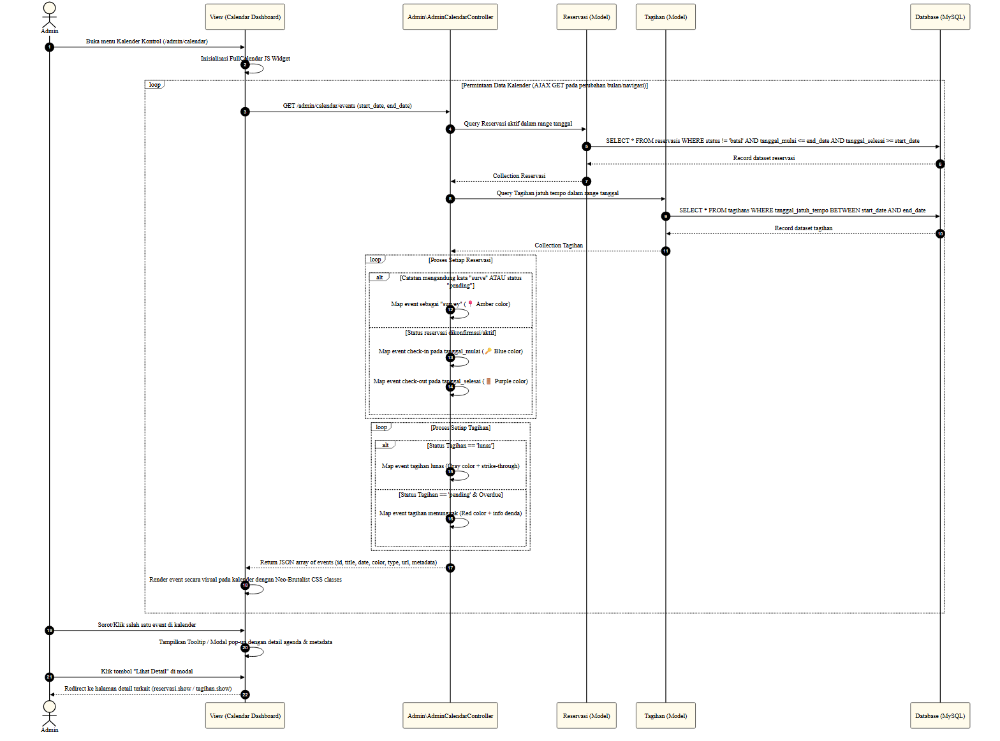

```mermaid
%%{init: {
  'theme': 'base',
  'themeVariables': {
    'fontFamily': 'Inter, system-ui, sans-serif',
    'fontSize': '12px',
    'actorBkg': '#FFFBEB',
    'actorBorder': '#000000',
    'actorTextColor': '#000000',
    'actorLineColor': '#000000',
    'noteBkgColor': '#FFFBEB',
    'noteBorderColor': '#000000',
    'noteTextColor': '#000000',
    'signalColor': '#000000',
    'signalTextColor': '#000000',
    'activationBkgColor': '#FDE047',
    'activationBorderColor': '#000000',
    'loopLimitBorderColor': '#000000',
    'loopLimitBkgColor': '#FDE047',
    'labelBoxBorderColor': '#000000',
    'labelBoxBkgColor': '#FFFFFF',
    'labelTextTextColor': '#000000',
    'primaryColor': '#FFFBEB',
    'primaryTextColor': '#000000',
    'primaryBorderColor': '#000000',
    'lineColor': '#000000'
  }
}}%%
sequenceDiagram
    autonumber
    actor A as Admin
    participant V as View (Calendar Dashboard)
    participant C as Admin\AdminCalendarController
    participant R as Reservasi (Model)
    participant T as Tagihan (Model)
    participant DB as Database (MySQL)

    A->>V: Buka menu Kalender Kontrol (/admin/calendar)
    V->>V: Inisialisasi FullCalendar JS Widget
    
    loop Permintaan Data Kalender (AJAX GET pada perubahan bulan/navigasi)
        V->>C: GET /admin/calendar/events (start_date, end_date)
        C->>R: Query Reservasi aktif dalam range tanggal
        R->>DB: SELECT * FROM reservasis WHERE status != 'batal' AND tanggal_mulai <= end_date AND tanggal_selesai >= start_date
        DB-->>R: Record dataset reservasi
        R-->>C: Collection Reservasi

        C->>T: Query Tagihan jatuh tempo dalam range tanggal
        T->>DB: SELECT * FROM tagihans WHERE tanggal_jatuh_tempo BETWEEN start_date AND end_date
        DB-->>T: Record dataset tagihan
        T-->>C: Collection Tagihan

        loop Proses Setiap Reservasi
            alt Catatan mengandung kata "surve" ATAU status "pending"
                C->>C: Map event sebagai "survey" (📍 Amber color)
            else Status reservasi dikonfirmasi/aktif
                C->>C: Map event check-in pada tanggal_mulai (🔑 Blue color)
                C->>C: Map event check-out pada tanggal_selesai (🚪 Purple color)
            end
        end

        loop Proses Setiap Tagihan
            alt Status Tagihan == 'lunas'
                C->>C: Map event tagihan lunas (Gray color + strike-through)
            else Status Tagihan == 'pending' & Overdue
                C->>C: Map event tagihan menunggak (Red color + info denda)
            end
        end

        C-->>V: Return JSON array of events (id, title, date, color, type, url, metadata)
        V->>V: Render event secara visual pada kalender dengan Neo-Brutalist CSS classes
    end

    A->>V: Sorot/Klik salah satu event di kalender
    V->>V: Tampilkan Tooltip / Modal pop-up dengan detail agenda & metadata
    A->>V: Klik tombol "Lihat Detail" di modal
    V-->>A: Redirect ke halaman detail terkait (reservasi.show / tagihan.show)
```

* **Partisipan Utama**:
  * [Admin\AdminCalendarController](file:///c:/xampp/htdocs/asri-boarding-house/app/Http/Controllers/Admin/AdminCalendarController.php): Menangani penarikan data jadwal dinamis berdasarkan rentang tanggal kalender.
  * [Reservasi](file:///c:/xampp/htdocs/asri-boarding-house/app/Models/Reservasi.php) & [Tagihan](file:///c:/xampp/htdocs/asri-boarding-house/app/Models/Tagihan.php): Model data penentu entri kalender.
* **Logika Penting**: Agenda survei dibedakan secara dinamis dari reservasi normal berdasarkan status `'pending'` atau adanya pencocokan kata kunci (case-insensitive) `'surve'` pada kolom `catatan_user`, memungkinkannya dipetakan terpisah sebagai agenda survei fisik kamar bagi administrator.

---

### 2.20. Sequence Diagram 20: Visualisasi Metrik & Tren Grafik Keuangan Dasbor Utama (Admin)
Diagram ini menggambarkan pemanggilan dan perhitungan statistik real-time (kamar, okupansi, pendapatan kotor, pengeluaran operasional, laba bersih, serta tren cash flow 12 bulan terakhir) via DashboardAnalyticsService untuk menyusun grafik Chart.js di dashboard administrator.

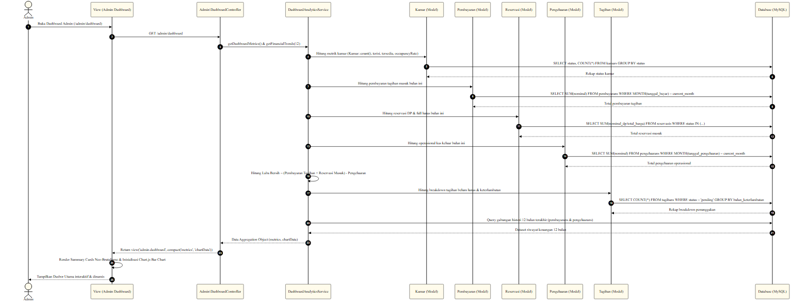

```mermaid
%%{init: {
  'theme': 'base',
  'themeVariables': {
    'fontFamily': 'Inter, system-ui, sans-serif',
    'fontSize': '12px',
    'actorBkg': '#FFFBEB',
    'actorBorder': '#000000',
    'actorTextColor': '#000000',
    'actorLineColor': '#000000',
    'noteBkgColor': '#FFFBEB',
    'noteBorderColor': '#000000',
    'noteTextColor': '#000000',
    'signalColor': '#000000',
    'signalTextColor': '#000000',
    'activationBkgColor': '#FDE047',
    'activationBorderColor': '#000000',
    'loopLimitBorderColor': '#000000',
    'loopLimitBkgColor': '#FDE047',
    'labelBoxBorderColor': '#000000',
    'labelBoxBkgColor': '#FFFFFF',
    'labelTextTextColor': '#000000',
    'primaryColor': '#FFFBEB',
    'primaryTextColor': '#000000',
    'primaryBorderColor': '#000000',
    'lineColor': '#000000'
  }
}}%%
sequenceDiagram
    autonumber
    actor A as Admin
    participant V as View (Admin Dashboard)
    participant C as Admin\DashboardController
    participant DAS as DashboardAnalyticsService
    participant K as Kamar (Model)
    participant P as Pembayaran (Model)
    participant R as Reservasi (Model)
    participant PE as Pengeluaran (Model)
    participant T as Tagihan (Model)
    participant DB as Database (MySQL)

    A->>V: Buka Dashboard Admin (/admin/dashboard)
    V->>C: GET /admin/dashboard
    C->>DAS: getDashboardMetrics() & getFinancialTrends(12)
    
    DAS->>K: Hitung metrik kamar (Kamar::count(), terisi, tersedia, occupancyRate)
    K->>DB: SELECT status, COUNT(*) FROM kamars GROUP BY status
    DB-->>K: Rekap status kamar
    
    DAS->>P: Hitung pembayaran tagihan masuk bulan ini
    P->>DB: SELECT SUM(nominal) FROM pembayarans WHERE MONTH(tanggal_bayar) = current_month
    DB-->>P: Total pembayaran tagihan
    
    DAS->>R: Hitung reservasi DP & full lunas bulan ini
    R->>DB: SELECT SUM(nominal_dp/total_harga) FROM reservasis WHERE status IN (...)
    DB-->>R: Total reservasi masuk

    DAS->>PE: Hitung operasional kas keluar bulan ini
    PE->>DB: SELECT SUM(nominal) FROM pengeluarans WHERE MONTH(tanggal_pengeluaran) = current_month
    DB-->>PE: Total pengeluaran operasional

    DAS->>DAS: Hitung Laba Bersih = (Pembayaran Tagihan + Reservasi Masuk) - Pengeluaran

    DAS->>T: Hitung breakdown tagihan belum lunas & keterlambatan
    T->>DB: SELECT COUNT(*) FROM tagihans WHERE status = 'pending' GROUP BY bulan_keterlambatan
    DB-->>T: Rekap breakdown penunggakan

    DAS->>DB: Query gabungan histori 12 bulan terakhir (pembayarans & pengeluarans)
    DB-->>DAS: Dataset riwayat keuangan 12 bulan

    DAS-->>C: Data Aggregation Object (metrics, chartData)
    C-->>V: Return view('admin.dashboard', compact('metrics', 'chartData'))
    V->>V: Render Summary Cards Neo-Brutalisme & Inisialisasi Chart.js Bar Chart
    V-->>A: Tampilkan Dasbor Utama interaktif & dinamis
```

* **Partisipan Utama**:
  * [Admin\DashboardController](file:///c:/xampp/htdocs/asri-boarding-house/app/Http/Controllers/Admin/DashboardController.php): Mengorkestrasi request dashboard administrator.
  * [DashboardAnalyticsService](file:///c:/xampp/htdocs/asri-boarding-house/app/Services/DashboardAnalyticsService.php): Layanan terpusat kalkulasi statistik kamar, keuangan, okupansi, dan tren cash flow.
  * Model-Model: [Kamar](file:///c:/xampp/htdocs/asri-boarding-house/app/Models/Kamar.php), [Pembayaran](file:///c:/xampp/htdocs/asri-boarding-house/app/Models/Pembayaran.php), [Reservasi](file:///c:/xampp/htdocs/asri-boarding-house/app/Models/Reservasi.php), [Pengeluaran](file:///c:/xampp/htdocs/asri-boarding-house/app/Models/Pengeluaran.php), [Tagihan](file:///c:/xampp/htdocs/asri-boarding-house/app/Models/Tagihan.php).
* **Logika Penting**: Pemasukan terintegrasi menghitung tiga sumber secara atomik: pembayaran cicilan tagihan bulanan lunas, nominal DP 30% dari reservasi baru masuk, dan pembayaran lunas penuh dari reservasi baru masuk.

---

### 2.21. Sequence Diagram 21: Permohonan & Reset Password Akun Pengguna / Admin (User / Admin)
Diagram ini menjelaskan alur keamanan pemulihan akun (*Account Recovery*) ketika pengguna (Penyewa atau Admin) lupa kata sandi, meminta token reset unik via email, hingga memperbarui kata sandi baru secara aman di database.

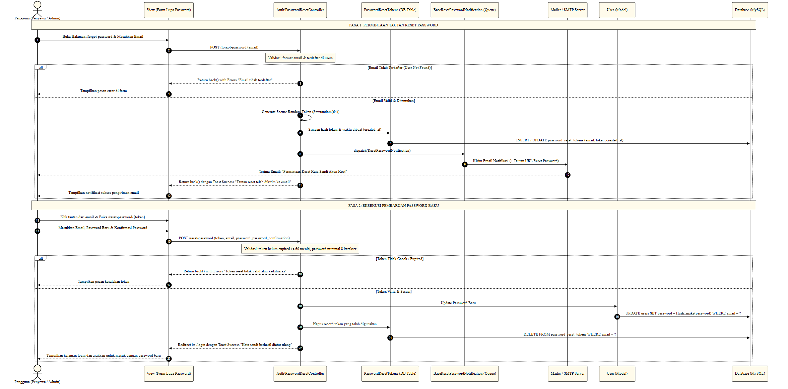

```mermaid
%%{init: {
  'theme': 'base',
  'themeVariables': {
    'fontFamily': 'Inter, system-ui, sans-serif',
    'fontSize': '12px',
    'actorBkg': '#FFFBEB',
    'actorBorder': '#000000',
    'actorTextColor': '#000000',
    'actorLineColor': '#000000',
    'noteBkgColor': '#FFFBEB',
    'noteBorderColor': '#000000',
    'noteTextColor': '#000000',
    'signalColor': '#000000',
    'signalTextColor': '#000000',
    'activationBkgColor': '#FDE047',
    'activationBorderColor': '#000000',
    'loopLimitBorderColor': '#000000',
    'loopLimitBkgColor': '#FDE047',
    'labelBoxBorderColor': '#000000',
    'labelBoxBkgColor': '#FFFFFF',
    'labelTextTextColor': '#000000',
    'primaryColor': '#FFFBEB',
    'primaryTextColor': '#000000',
    'primaryBorderColor': '#000000',
    'lineColor': '#000000'
  }
}}%%
sequenceDiagram
    autonumber
    actor U as Pengguna (Penyewa / Admin)
    participant V as View (Form Lupa Password)
    participant C as Auth\PasswordResetController
    participant Token as PasswordResetTokens (DB Table)
    participant Notif as BaseResetPasswordNotification (Queue)
    participant Mail as Mailer / SMTP Server
    participant User as User (Model)
    participant DB as Database (MySQL)

    Note over U, DB: FASA 1: PERMINTAAN TAUTAN RESET PASSWORD
    U->>V: Buka Halaman /forgot-password & Masukkan Email
    V->>C: POST /forgot-password (email)
    Note over C: Validasi: format email & terdaftar di users

    alt Email Tidak Terdaftar (User Not Found)
        C-->>V: Return back() with Errors "Email tidak terdaftar"
        V-->>U: Tampilkan pesan error di form
    else Email Valid & Ditemukan
        C->>C: Generate Secure Random Token (Str::random(64))
        C->>Token: Simpan hash token & waktu dibuat (created_at)
        Token->>DB: INSERT / UPDATE password_reset_tokens (email, token, created_at)
        C->>Notif: dispatch(ResetPasswordNotification)
        Notif->>Mail: Kirim Email Notifikasi (+ Tautan URL Reset Password)
        Mail-->>U: Terima Email: "Permintaan Reset Kata Sandi Akun Kost"
        C-->>V: Return back() dengan Toast Success "Tautan reset telah dikirim ke email"
        V-->>U: Tampilkan notifikasi sukses pengiriman email
    end

    Note over U, DB: FASA 2: EKSEKUSI PEMBARUAN PASSWORD BARU
    U->>V: Klik tautan dari email -> Buka /reset-password/{token}
    U->>V: Masukkan Email, Password Baru & Konfirmasi Password
    V->>C: POST /reset-password (token, email, password, password_confirmation)
    Note over C: Validasi: token belum expired (< 60 menit), password minimal 8 karakter

    alt Token Tidak Cocok / Expired
        C-->>V: Return back() with Errors "Token reset tidak valid atau kadaluarsa"
        V-->>U: Tampilkan pesan kesalahan token
    else Token Valid & Sesuai
        C->>User: Update Password Baru
        User->>DB: UPDATE users SET password = Hash::make(password) WHERE email = ?
        C->>Token: Hapus record token yang telah digunakan
        Token->>DB: DELETE FROM password_reset_tokens WHERE email = ?
        C-->>V: Redirect ke /login dengan Toast Success "Kata sandi berhasil diatur ulang"
        V-->>U: Tampilkan halaman login dan arahkan untuk masuk dengan password baru
    end
```

* **Partisipan Utama**:
  * [PenyewaPasswordResetController](file:///c:/xampp/htdocs/asri-boarding-house/app/Http/Controllers/Auth/PenyewaPasswordResetController.php) & [AdminPasswordResetController](file:///c:/xampp/htdocs/asri-boarding-house/app/Http/Controllers/Auth/AdminPasswordResetController.php): Menangani otorisasi permintaan reset kata sandi.
  * [BaseResetPasswordNotification](file:///c:/xampp/htdocs/asri-boarding-house/app/Notifications/BaseResetPasswordNotification.php): Notification class yang menangani pembuatan payload URL dan diserialisasi ke antrean *ShouldQueue*.
  * [User](file:///c:/xampp/htdocs/asri-boarding-house/app/Models/User.php): Model entitas akun pengguna di database.
* **Logika Penting**: Token reset di-generate menggunakan `Str::random(64)` dan disimpan dalam bentuk ter-hash dengan masa berlaku 60 menit. Setelah password berhasil diperbarui, token otomatis dihapus dari basis data untuk mencegah *replay attack*.

---

## 3. Integrasi Alur dengan Kepatuhan Aturan Bisnis (Business Rules Compliance)

Seluruh rancangan sequence diagram di atas telah diselaraskan dengan aturan bisnis utama sistem manajemen Asri Boarding House:

1. **Imutabilitas Tarif Sewa (`penyewa.harga_sewa`)**:
   Pada *Sequence Diagram 4 (Konfirmasi Reservasi)*, tarif kamar disalin secara permanen ke field `harga_sewa` di profil penyewa. Pada *Sequence Diagram 5 (Siklus Billing)*, perhitungan tagihan bulanan mengambil nilai dari tabel `penyewa` bukan dari tabel `kamar`, sehingga penyewa lama terlindungi dari perubahan harga master kamar sewaktu-waktu.
2. **Denda Keterlambatan Bertahap**:
   Pada *Sequence Diagram 6 (Pembayaran Tagihan)*, perhitungan denda dilakukan dinamis di runtime saat penyewa mengakses detail tagihan setelah lewat jatuh tempo tanggal 10. Denda bertahap dihitung berdasarkan jumlah `bulan_keterlambatan` (Bulan 1 & 2 bebas denda dengan peringatan WA, Bulan 3+ denda 5% flat per bulan).
3. **Persistensi File Cleanup**:
   Pada *Sequence Diagram 8 (Pencatatan Pengeluaran)* dan *Sequence Diagram 9 (Manajemen Konten Dinamis)*, saat admin mengubah nota bukti transaksi atau menghapus data pengeluaran/galeri/ulasan, sistem mengeksekusi penghapusan file fisik di storage (`File::delete`) sebelum melakukan update/delete record di database MySQL.
4. **Inspeksi Kamar Sebelum Checkout**:
   Pada *Sequence Diagram 11 (Penonaktifan Penyewa)*, saat status penyewa dinonaktifkan (checkout), status kamar tidak berubah otomatis menjadi `'tersedia'`. Admin harus melakukan inspeksi fisik kamar terlebih dahulu dan memperbarui status kamar secara manual menjadi `'tersedia'` atau `'maintenance'` di menu manajemen kamar.

---

## 4. Perlindungan Keamanan & Optimasi Kinerja dalam Sequence Flows

Aspek non-fungsional diintegrasikan langsung ke dalam alur pemanggilan metode:

1. **Pencegahan Celah IDOR (Insecure Direct Object Reference)**:
   Pada *Sequence Diagram 6 (Pembayaran Tagihan)*, sebelum mengambil data rekening bank dan token snap, controller melakukan validasi kepemilikan tagihan (`tagihan->penyewa_id == auth()->user()->penyewa->id`). Jika penyewa mencoba mengganti ID tagihan pada URL milik penyewa lain, sistem langsung mengembalikan HTTP 403 Forbidden.
2. **Integritas Database Transaksional (ACID)**:
   Proses krusial seperti konfirmasi cash (*Sequence 6*), konfirmasi reservasi (*Sequence 4*), reaktivasi penyewa (*Sequence 15*), dan hapus permanen (*Sequence 14, 15, 17*) dibungkus menggunakan blok `DB::transaction()` untuk menjamin seluruh aksi berhasil 100% atau gagal seutuhnya (*rollback*).
3. **Pencegahan Masalah N+1 Query**:
   Pada pemanggilan polling chat (*Sequence 3*) dan daftar tagihan (*Sequence 6*), controller memanggil data menggunakan eager loading (contoh: `Reservasi::with('kamar', 'user')->get()`) untuk mencegah query berulang ke database yang dapat menurunkan performa server.
4. **Throttling resource AJAX Polling**:
   Interval AJAX Polling pada modul chat pre-pembayaran (*Sequence 3*) dan live chat tamu (*Sequence 12*) disetel secara berkala setiap 3 hingga 5 detik untuk meminimalkan beban konkurensi request pada localhost.

---

## 5. Glosarium Teknis Diagram Urutan (UML Sequence Diagram Glossary)

Untuk mempermudah pemahaman tim pengembang terhadap notasi visual diagram urutan di atas, berikut adalah glosarium istilahnya:

* **Lifeline (Garis Hidup)**: Mewakili instansi objek, kelas, atau aktor yang berpartisipasi aktif dalam komunikasi selama durasi proses (misal: `PenyewaTagihanController`, `Database (MySQL)`).
* **Synchronous Message (Pesan Sinkron)**: Digambarkan dengan panah solid berujung segitiga solid (`->i`). Menandakan bahwa pengirim pesan menunggu respons balik sebelum melanjutkan eksekusi langkah berikutnya.
* **Asynchronous Message (Pesan Asinkron)**: Digambarkan dengan panah solid berujung terbuka (`->`). Pengirim mengirimkan pesan lalu langsung melanjutkan instruksi berikutnya tanpa harus menunggu respons objek penerima (misal: pengiriman API ke WhatsApp Fonnte).
* **Return Message (Pesan Kembalian)**: Digambarkan dengan panah putus-putus berujung terbuka (`-->>`). Mewakili pengembalian informasi atau kendali kembali ke objek pemanggil (misal: data JSON, status response, atau file view Blade).
* **Alt/Else Fragment**: Mewakili logika percabangan kondisional (*Conditional Branching*) yang setara dengan struktur kode `if - else` di PHP/Laravel.
* **Loop Fragment**: Mewakili blok perulangan (*Iteration*) yang setara dengan perulangan `loop` atau `foreach` di PHP untuk memproses sekumpulan data secara berulang.
* **Note Over**: Kotak keterangan tambahan yang ditempelkan pada garis hidup partisipan untuk menjelaskan aturan bisnis, status variabel, atau proses internal di titik waktu tertentu.
