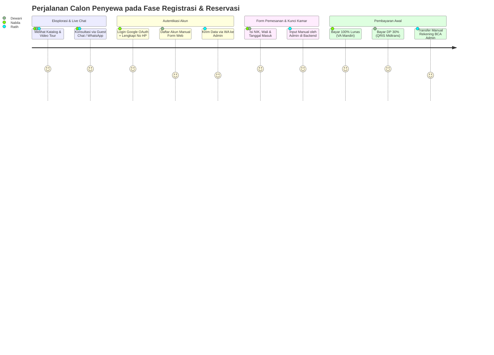
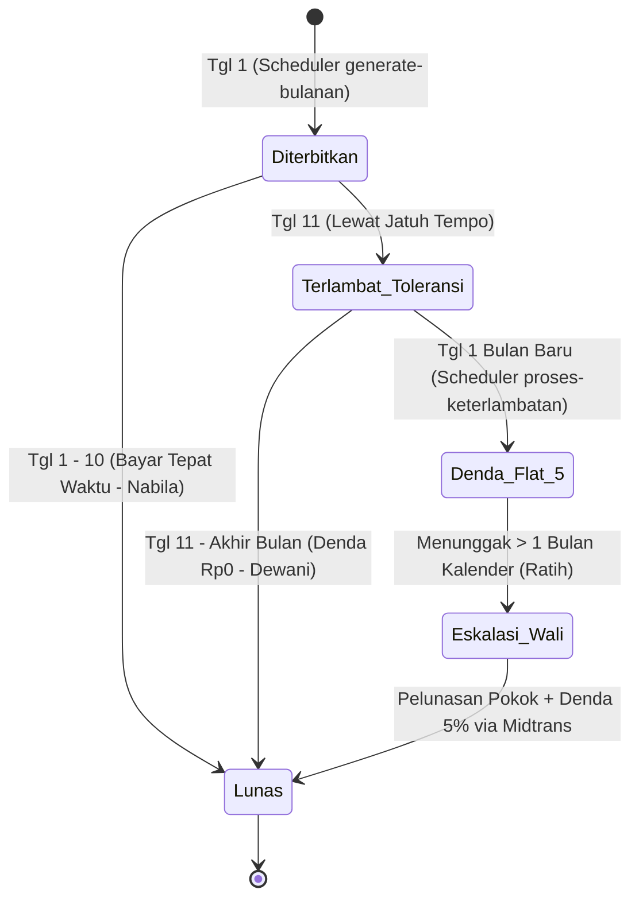
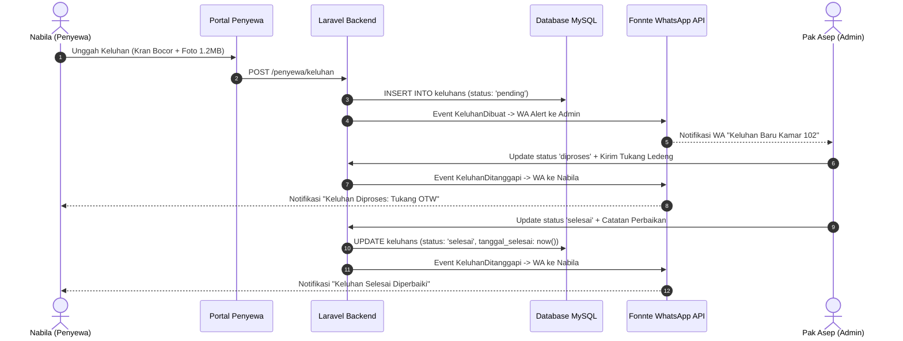

# Skenario Cerita Perjalanan Penyewa (End-to-End Tenant Lifecycle Scenario)
## Proyek: Asri Boarding House (Laravel 11, MySQL 8.x, Midtrans Snap, & Fonnte WA API)

---

## 📌 Pengantar & Gambaran Umum Skenario

Dokumen ini menyajikan narasi perjalanan komprehensif (*End-to-End User Journey*) dari sudut pandang **Penyewa Kost**, mulai dari tahap penemuan properti dan konsultasi pra-pemesanan, proses reservasi awal (**Bulan ke-0**), siklus kehidupan tinggal selama 12 bulan penuh (**Bulan ke-1 s.d. Bulan ke-11**) yang mencakup otomasi billing, toleransi keterlambatan, pengenaan denda flat kalender, eskalasi wali, penanganan keluhan fasilitas berfoto, penerimaan broadcast darurat, hingga fase akhir masa tinggal (**Bulan ke-12**) meliputi audit keuangan checkout, klaim deposit kerusakan fasilitas, dan pengembalian sisa deposit.

Skenario ini secara khusus mengilustrasikan **3 (tiga) jalur pendaftaran dan kepribadian penyewa yang berbeda**:
1. **Jalur 1 (Nabila - Mahasiswi Baru Luar Kota)**: Pendaftaran & Login instan via **Google OAuth 2.0 (Laravel Socialite)**, melengkapi nomor WhatsApp via middleware `EnsureProfileIsComplete`, pembayaran sewa penuh 12 bulan (Lunas 100%) via **Midtrans Snap (Virtual Account)**, dan memiliki rekam jejak pembayaran selalu tepat waktu (*Disiplin*).
2. **Jalur 2 (Dewani - Mahasiswi Tingkat Akhir)**: Pendaftaran akun manual via website, pemesanan dengan skema **Uang Muka (DP) 30%** via **Midtrans Snap (QRIS)**, pelunasan sisa 70% via portal, dan sempat mengalami masa toleransi jatuh tempo (*Masa Keringanan Bebas Denda*).
3. **Jalur 3 (Ratih - Karyawati / Walk-in Offline)**: Pendaftaran langsung melalui chat WhatsApp dengan Admin (Pak Asep), transfer bank manual langsung ke rekening pengelola, didaftarkan secara manual oleh Admin di portal backend, serta mengalami kasus tunggakan melewati bulan kalender sehingga terkena **Denda Flat 5%** dan **Eskalasi Notifikasi WhatsApp ke Wali**.

---

## 👥 Profil Karakter, Properti & Parameter Awal

### 1. Data Properti Kost
* **Nama Properti**: Asri Boarding House (Kost Putri Eksklusif).
* **Lokasi**: Jl. Maera Sari No. 12, Tembalang, Semarang, Jawa Tengah.
* **Pengelola / Owner**: **Pak Asep (48 Tahun)**, pengelola operasional yang teliti dan disiplin.

### 2. Kamar Kost Yang Dipesan
* **Kamar 102 (Lantai 1, Tipe Deluxe A)**: Harga sewa dasar **Rp1.400.000 / bulan** (Fasilitas: AC, Kamar Mandi Dalam, Kasur Springbed Queen, Meja Belajar, Lemari Pakaian, Wi-Fi 100 Mbps).
* **Kamar 105 (Lantai 1, Tipe Standar B)**: Harga sewa dasar **Rp750.000 / bulan** (Fasilitas: Kipas Angin, Kamar Mandi Luar Bersih, Kasur Single, Lemari, Wi-Fi 100 Mbps).
* **Kamar 203 (Lantai 2, Tipe Deluxe Balkon)**: Harga sewa dasar **Rp1.400.000 / bulan** (Fasilitas: AC, Kamar Mandi Dalam, Kasur Springbed, Balkon Pribadi, Lemari, Wi-Fi 100 Mbps).

### 3. Ketentuan Finansial & Parameter Kontrak
* **Uang Deposit Jaminan (Security Deposit)**: Ditetapkan flat **Rp1.000.000** per kamar (wajib dibayar di awal dan ditahan di kas penampungan selama masa sewa untuk proteksi kerusakan fisik kamar).
* **Durasi Kontrak Sewa**: 12 Bulan (Periode: 1 Agustus 2026 s.d. 31 Juli 2027).
* **Skema Billing Rutin**: Terbit otomatis setiap **tanggal 1** pukul 00:05 WIB via Laravel Scheduler `tagihan:generate-bulanan`.
* **Batas Waktu Jatuh Tempo (Grace Period)**: **Tanggal 10** setiap bulannya.
* **Masa Toleransi (Keringanan)**: Tanggal 11 s.d. akhir bulan berjalan (Denda = Rp0, Reminder berkala).
* **Aturan Denda Flat Kalender**: Denda flat **5% dari sewa pokok** diterapkan pada **tanggal 1 bulan berikutnya** jika tagihan bulan sebelumnya belum lunas via task `tagihan:proses-keterlambatan`.

---

## 📍 Bagian 1: Fase Registrasi & Reservasi Awal (Bulan ke-0 / Juli 2026)



---

### 1. Jalur 1: Google OAuth 2.0 via Website (Penyewa: Nabila - Kamar 102)

#### Langkah 1.1: Eksplorasi Landing Page & Floating Guest Live Chat
* Pada tanggal **15 Juli 2026**, Nabila (19 tahun, calon mahasiswi baru asal Surabaya) membuka laptopnya dan mengakses Landing Page publik Asri Boarding House (`https://asriboardinghouse.com`).
* Nabila melihat katalog kamar interaktif yang bersih dengan nuansa modern. Nabila tertarik dengan **Kamar 102 (Lantai 1)**.
* Sebelum memutuskan memesan, Nabila memperhatikan ada **Floating Guest Live Chat Widget** di pojok kanan bawah layar. Tanpa harus mendaftar akun, Nabila mengklik widget tersebut.
* Sistem secara otomatis menerbitkan cookie `guest_chat_token` berisi string UUID unik yang di-hash SHA-256 (`session_token`) pada tabel `guest_chat_threads`.
* Nabila mengetik pesan singkat: *"Halo admin, apakah lingkungan kost aman untuk mahasiswi yang sering pulang malam karena tugas lab?"*
* Di panel admin, Pak Asep menerima pesan tamu tersebut dan membalas secara instan: *"Halo Kak Nabila! Sangat aman, gerbang kost menggunakan akses kartu khusus dan area terpantau CCTV 24 jam."*
* Merasa yakin, Nabila menutup chat dan mengklik tombol **"Pesan Unit"** pada kartu Kamar 102.

#### Langkah 1.2: Otentikasi Google OAuth 2.0 & Penapisan Profil (`EnsureProfileIsComplete`)
* Karena Nabila belum terautentikasi di sistem, aplikasi secara otomatis mengalihkannya ke halaman login (`/reservasi/login`).
* Nabila memilih tombol **"Masuk dengan Google"** (didukung oleh `Laravel Socialite`).
* Browser mengarahkan Nabila ke halaman persetujuan akun Google. Nabila memilih akun `nabila.anindya@gmail.com`.
* Google OAuth mengembalikan payload identitas (Email, Nama Lengkap: `Nabila Anindya`, Avatar Google, dan Google ID) ke endpoint callback sistem (`SocialiteController`).
* Sistem melakukan pencarian pada tabel `users`. Karena email belum ada di database, sistem membuat record user baru:
  ```sql
  INSERT INTO users (nama, email, password, role, is_active, no_hp, google_id)
  VALUES ('Nabila Anindya', 'nabila.anindya@gmail.com', [HASHED_RANDOM], 'penyewa', 1, 'temp_socialite_6695a1bc', '1092837465192837465');
  ```
* Middleware keamanan sistem `EnsureProfileIsComplete` segera mendeteksi bahwa kolom `no_hp` masih berawalan `temp_` (nomor sementara).
* Sistem secara otomatis mengalihkan Nabila ke halaman **Lengkapi Profil Kontak** (`/profil/complete` / `complete-profile.blade.php`).
* Nabila memasukkan nomor WhatsApp aktifnya: `081234567891`.
* Backend memvalidasi format regex nomor ponsel Indonesia (`^(\+62|62|0)8[1-9][0-9]{6,10}$`), mengubahnya ke format standar internasional (`6281234567891`), dan memastikan nomor tersebut belum pernah digunakan di sistem.
* Setelah disimpan, sesi Nabila berstatus lengkap dan diarahkan langsung kembali ke formulir pemesanan Kamar 102.

#### Langkah 1.3: Pengisian Form Reservasi & Pessimistic Concurrency Locking
* Halaman pemesanan menampilkan detail Kamar 102 dengan formulir reservasi:
  * **NIK (Nomor Induk Kependudukan)**: `3578012345670001` (16 digit valid).
  * **Tipe Sewa**: `Bulanan`.
  * **Durasi Kontrak**: `12 Bulan`.
  * **Tanggal Mulai Sewa**: `2026-08-01` (1 Agustus 2026).
  * **Tanggal Selesai Sewa**: Dihitung otomatis oleh sistem menjadi `2027-07-31` (31 Juli 2027).
  * **Uang Deposit Jaminan**: `Rp1.000.000` (terkunci otomatis).
  * **Nama Kontak Darurat / Wali**: `Budi Anindya (Ayah Kandung)`.
  * **Nomor WhatsApp Wali**: `081298765432`.
* Nabila menekan tombol **"Lanjut ke Pembayaran"**.
* **Eksekusi Backend Atomik (`ReservasiService::buatReservasi`)**:
  1. Sistem membuka transaksi database `DB::beginTransaction()`.
  2. Sistem menerapkan **Lock Ordering** ketat untuk mencegah kebuntuan (*deadlock*): Mengunci baris data Kamar 102 terlebih dahulu menggunakan `Kamar::lockForUpdate()->findOrFail(102)`.
  3. Memeriksa benturan jadwal (*overlap double-booking check*) via `ReservasiService::cekDoubleBooking`: Memastikan tidak ada reservasi aktif atau penyewa aktif di Kamar 102 pada rentang tanggal 1 Agustus 2026 s.d. 31 Juli 2027.
  4. Menghitung rincian harga via `ReservasiService::hitungHarga`:
     * Total Sewa Pokok: 12 Bulan x Rp1.400.000 = **Rp16.800.000**.
     * Uang Deposit Jaminan: **Rp1.000.000**.
     * Total Biaya Keseluruhan: **Rp17.800.000**.
  5. Membuat entri baru pada tabel `reservasis`:
     * `order_id`: `RSV-1-1721045678-8921`
     * `status`: `pending`
     * `tipe_sewa`: `bulanan`, `durasi`: 12
     * `is_dp`: false, `nominal_dp`: 0, `nominal_sisa`: 0
     * `total_harga`: 17800000
  6. Mengirimkan event `ReservasiDibuat` dan melakukan `DB::commit()`.

#### Langkah 1.4: Pre-Payment Chat Box & Transaksi Midtrans Snap
* Nabila diarahkan ke halaman Detail & Pembayaran Reservasi (`/penyewa/reservasi/{id}`). Halaman ini dilengkapi **5-Step Stepper Dinamis** dan **Pre-Payment Chat Box** real-time (tabel `chat_messages`).
* Nabila menggunakan chat box tersebut untuk menanyakan hal spesifik ke Pak Asep:
  > **Nabila**: *"Selamat sore Pak Asep, untuk Kamar 102 apakah sudah termasuk sprei kasur dan ember kamar mandi?"*
* Pesan tersanitasi secara aman (mencegah XSS) dan tersimpan di database. Melalui mekanisme AJAX Polling, Pak Asep membalas dari panel admin:
  > **Pak Asep (Admin)**: *"Sore Mbak Nabila. Sprei baru dan perlengkapan ember sudah disiapkan lengkap di dalam kamar. Mbak Nabila cukup membawa koper pakaian saja."*
* Nabila merasa sangat puas. Dia memilih skema pembayaran **Lunas 100% (Rp17.800.000)** dan mengklik tombol **"Bayar Sekarang (Midtrans)"**.
* Frontend memanggil API `POST /api/snap-token/reservasi/{id}`. `SnapTokenController` melakukan otorisasi via `ReservasiPolicy`, mengunci data reservasi dan kamar secara transaksional, lalu meminta token transaksi dari server Midtrans via `MidtransService::createSnapTokenReservasi`.
* Popup **Midtrans Snap** terbuka di layar laptop Nabila. Nabila memilih metode pembayaran **Virtual Account Bank Mandiri**. Midtrans menerbitkan Nomor VA Mandiri dan kode perusahaan.
* Nabila membuka aplikasi Livin' by Mandiri di ponselnya dan menyelesaikan transfer sebesar Rp17.800.000.
* **Proses Webhook Asinkron (`MidtransReservasiCallbackController`)**:
  1. Midtrans mengirimkan notifikasi HTTP POST ke webhook sistem `/api/midtrans/reservasi-callback`.
  2. Sistem memverifikasi SHA-512 Signature Key (`hash_equals`) untuk menjamin keaslian data.
  3. Sistem melakukan *idempotency check* dengan `lockForUpdate()`.
  4. Memvalidasi kecocokan nominal `gross_amount == 17800000`.
  5. Memperbarui status reservasi Nabila dari `pending` menjadi **`lunas`**, mencatat `transaction_id`, metode pembayaran `midtrans`, dan `tanggal_konfirmasi`.
  6. Memicu event `ReservasiDibayar`.
* Tampilan layar Nabila otomatis berganti menampilkan status **"Pembayaran Berhasil Diverifikasi - Menunggu Konfirmasi & Aktivasi Admin"** (Langkah 3 pada Stepper).

---

### 2. Jalur 2: Registrasi Akun Manual via Website (Penyewa: Dewani - Kamar 105)

#### Langkah 2.1: Eksplorasi & Registrasi Akun Mandiri
* Pada tanggal **16 Juli 2026**, Dewani (21 tahun, mahasiswi tingkat akhir asal Solo) meninjau landing page dan tertarik menyewa **Kamar 105 (Lantai 1)** dengan tarif hemat Rp750.000/bulan.
* Dewani mengklik **"Pesan Unit"** dan diarahkan ke `/reservasi/login`. Dewani memilih tab **"Daftar Akun Baru"**.
* Dewani mengisi formulir registrasi:
  * Nama: `Dewani Safitri`
  * Email: `dewani.safitri@gmail.com`
  * No. WhatsApp: `082155556666`
  * Password: `PasswordDewani2026!`
* Sistem memvalidasi keunikan email & nomor WhatsApp, mengenkripsi password dengan `bcrypt`, menyimpan data user ber-role `penyewa` di tabel `users`, dan mengautentikasi login Dewani secara otomatis.

#### Langkah 2.2: Pengisian Reservasi Skema Uang Muka (DP 30%)
* Dewani mengisi form reservasi untuk Kamar 105:
  * NIK: `3372019876540002` (16 digit).
  * Durasi: `12 Bulan` (1 Agustus 2026 s.d. 31 Juli 2027).
  * Nama Wali: `Siti Rahayu (Ibu Kandung)`.
  * No HP Wali: `082177778888`.
  * Deposit: `Rp1.000.000`.
* Pada pilihan skema pembayaran, Dewani memilih **Uang Muka (DP 30%)**:
  * Total Sewa 12 Bulan (12 x Rp750.000) = Rp9.000.000.
  * Uang Muka DP 30% dari Pokok = **Rp2.700.000**.
  * Uang Deposit Jaminan (Wajib di Awal) = **Rp1.000.000**.
  * **Total Pembayaran Awal DP = Rp3.700.000**.
  * Sisa Kewajiban (70% Pokok) = **Rp6.300.000** (wajib dilunasi sebelum check-in).
* Dewani menekan tombol **"Kirim Pemesanan"**. Sistem mengunci Kamar 105 dengan `lockForUpdate()`, memverifikasi anti double-booking, dan membuat record reservasi baru dengan `status: 'pending'`, `is_dp: true`, `nominal_dp: 3700000`, dan `nominal_sisa: 6300000`.

#### Langkah 2.3: Pembayaran DP via QRIS Midtrans Snap
* Dewani diarahkan ke halaman pembayaran reservasi. Dewani mengklik **"Bayar DP Sekarang"**.
* Token Snap di-generate, dan popup Midtrans muncul. Dewani memilih metode pembayaran **QRIS (GoPay/ShopeePay/BCA Mobile)**.
* Dewani memindai kode QR dinamis di layar laptop menggunakan aplikasi BCA Mobile miliknya dan menyelesaikan pembayaran Rp3.700.000.
* Webhook Midtrans terkirim ke server Asri Boarding House, terverifikasi aman melalui SHA-512, dan secara transaksional mengubah status reservasi Dewani menjadi **`dp`** serta mencatat detail transaksi.
* Halaman reservasi Dewani terupdate menampilkan badge **"DP 30% Diterima (Sisa Tagihan Rp6.300.000 Diterbitkan Saat Aktivasi)"**.

---

### 3. Jalur 3: Pendaftaran Offline / WhatsApp Walk-in (Penyewa: Ratih - Kamar 203)

#### Langkah 3.1: Komunikasi Langsung via WhatsApp & Transfer Bank Manual
* Pada tanggal **18 Juli 2026**, Ratih (20 tahun, karyawati baru yang belum terbiasa dengan portal web) menemukan kontak WhatsApp Asri Boarding House dari listing Google Maps kost.
* Ratih mengirim pesan WhatsApp ke Pak Asep (Admin):
  > **Ratih**: *"Selamat pagi Pak Asep, saya melihat profil Asri Boarding House di Google Maps. Apakah ada kamar kosong ber-AC di lantai 2 untuk sewa 1 tahun mulai 1 Agustus?"*
* Pak Asep mengecek ketersediaan di sistem dan membalas:
  > **Pak Asep**: *"Pagi Mbak Ratih. Masih ada Kamar 203 (Lantai 2 Deluxe dengan Balkon Pribadi). Tarif sewa Rp1.400.000 per bulan ditambah uang deposit jaminan Rp1.000.000 di awal yang akan dikembalikan saat selesai sewa."*
* Ratih setuju dan mengirimkan data dokumen kependudukannya melalui WhatsApp:
  * Nama: `Ratih Kusuma Dewi`
  * Email: `ratih.kusuma@gmail.com`
  * No. HP: `085799990000`
  * NIK: `3374023456780003`
  * Nama Wali: `Harto Kusumo (Ayah)`
  * No. HP Wali: `085711112222`
* Ratih melakukan transfer manual melalui ATM Bank Mandiri ke rekening BCA resmi Asri Boarding House sebesar **Rp2.400.000** (Pembayaran awal: Sewa Bulan Pertama Rp1.400.000 + Uang Deposit Jaminan Rp1.000.000). Ratih memfoto struk ATM dan mengirimkannya ke Pak Asep.

#### Langkah 3.2: Pendaftaran Manual oleh Admin (`AdminPenyewaService::registerPenyewa`)
* Pak Asep membuka Portal Admin -> Menu **Manajemen Penyewa** -> klik tombol **"Pendaftaran Manual Penyewa (Walk-in/Offline)"**.
* Pak Asep mengisi form dengan seluruh data Ratih, memilih Kamar 203, menetapkan durasi 12 bulan (1 Agustus 2026 s.d. 31 Juli 2027), harga sewa Rp1.400.000, deposit Rp1.000.000, dan mengunggah foto struk ATM sebagai bukti lampiran.
* Pak Asep menekan tombol **"Simpan Data Penyewa"**.
* **Eksekusi Backend Atomik (`AdminPenyewaService::registerPenyewa`)**:
  1. `DB::transaction()` dijalankan.
  2. Membuat akun `users`: `nama: 'Ratih Kusuma Dewi'`, `email: 'ratih.kusuma@gmail.com'`, `no_hp: '085799990000'`, password di-hash dari nomor HP-nya, `role: 'penyewa'`, `is_active: 1`, `require_password_change: true`.
  3. Mengunci Kamar 203 via `lockForUpdate()`, memastikan statusnya `tersedia`.
  4. Membuat profil `penyewa`: `user_id`, `kamar_id: 203`, `harga_sewa: 1400000` (*immutable personal rate*), `deposit: 1000000`, `status: 'aktif'`, `tipe_sewa: 'bulanan'`, `durasi: 12`, `tanggal_masuk: '2026-08-01'`, `tanggal_keluar_seharusnya: '2027-07-31'`.
  5. `PenyewaObserver::created` otomatis mengubah status Kamar 203 menjadi **`terisi`**.
  6. Memanggil `BillingService::injectManualPenyewaLunas`:
     * Membuat tagihan `Tagihan` bulan pertama (Agustus 2026) dengan order_id `TGH-MNL-{penyewa_id}-202608`, nominal pokok Rp1.400.000 + Deposit Rp1.000.000 = Total Rp2.400.000, berstatus **`lunas`**, metode `cash`.
     * Membuat record `Pembayaran` (`PAY-MNL-...`) berstatus `cash_confirmed` dengan `dikonfirmasi_oleh: admin_id`.
     * Memicu event `PembayaranCashDikonfirmasi` (menerbitkan file PDF kuitansi resmi Dompdf).
  7. Menjadwalkan `KirimWelcomeMessageJob` ke antrean sistem (Laravel Queue).
* Engine WhatsApp (API Fonnte) mengirimkan pesan otomatis ke WhatsApp Ratih:
  > *"Selamat datang di Asri Boarding House, Mbak Ratih Kusuma Dewi! Akun Anda telah berhasil diaktifkan untuk Kamar 203 (Lantai 2). Anda dapat masuk ke Portal Penyewa kami di https://asriboardinghouse.com/login untuk memantau tagihan bulanan dan mengajukan pengaduan fasilitas. Kredensial Login Anda: Email: ratih.kusuma@gmail.com, Password Default: 085799990000. Demi keamanan, harap segera mengubah password Anda setelah login pertama kali. Terima kasih!"*

---

## 🔒 Bagian 2: Fase Audit & Konfirmasi Reservasi Online oleh Admin

*Pada tanggal **20 Juli 2026**, Pak Asep melakukan verifikasi akhir terhadap berkas pendaftaran online milik **Nabila** dan **Dewani**.*

### 1. Konfirmasi Reservasi Nabila (Lunas 100%)
* Pak Asep membuka Portal Admin -> Menu **Manajemen Reservasi** -> Membuka data Nabila (`order_id: RSV-1-1721045678-8921`, status `lunas`).
* Pak Asep memeriksa keabsahan 16 digit NIK dan nomor kontak darurat Ayah Nabila. Semua dinyatakan valid.
* Pak Asep mengklik tombol **"Konfirmasi Reservasi & Aktivasi Penyewa"**.
* **Eksekusi Backend (`TransisiPenyewaService::transisi`)**:
  1. Mengunci Kamar 102 dengan `lockForUpdate()`.
  2. Membuat record di tabel `penyewa`: `user_id: [Nabila]`, `kamar_id: 102`, `harga_sewa: 1400000`, `deposit: 1000000`, `status: 'aktif'`, `durasi: 12`.
  3. `PenyewaObserver::created` mengubah status Kamar 102 menjadi **`terisi`**.
  4. Karena reservasi berstatus `lunas` penuh, memanggil `BillingService::injectLunasPenuh`:
     * Membuat tagihan `Tagihan` bulan Agustus 2026 senilai Rp17.800.000 dengan status langsung **`lunas`**.
     * Membuat record `Pembayaran` (`PAY-RSV-...`) berstatus `settlement`.
     * Memicu event `PembayaranBerhasil` untuk mencetak kuitansi resmi Dompdf.
  5. Memperbarui status reservasi menjadi **`dikonfirmasi`**, menetapkan `penyewa_id`, `dikonfirmasi_oleh: [AdminId]`, dan `tanggal_konfirmasi: now()`.
  6. Mengirimkan event `ReservasiDikonfirmasi`.
* WhatsApp Engine (API Fonnte) mengirim pesan otomatis ke WhatsApp Nabila:
  > *"Halo Mbak Nabila Anindya! Reservasi Kamar 102 Anda telah dikonfirmasi dan akun penyewa Anda telah AKTIF. Anda dapat login ke portal penyewa menggunakan akun Google Anda. Selamat bergabung di keluarga besar Asri Boarding House!"*

### 2. Konfirmasi Reservasi Dewani (Skema DP 30%) & Penerbitan Tagihan Sisa
* Pak Asep membuka data reservasi Dewani (status `dp`, pembayaran DP Rp3.700.000 sukses).
* Pak Asep mengklik tombol **"Konfirmasi Reservasi & Aktivasi Penyewa"**.
* **Eksekusi Backend (`TransisiPenyewaService::transisi`)**:
  1. Mengunci Kamar 105 dengan `lockForUpdate()`.
  2. Membuat record `penyewa` untuk Dewani dengan `status: 'aktif'`, `kamar_id: 105`, `harga_sewa: 750000`, `deposit: 1000000`. Status Kamar 105 menjadi **`terisi`**.
  3. Karena `is_dp == true` dan `nominal_sisa == 6300000`, memanggil `BillingService::injectSisaDp`:
     * Menerbitkan `Tagihan` bulan pertama (Agustus 2026) dengan order_id `TGH-{DewaniId}-202608`, nominal pokok Rp6.300.000, `nominal_denda: 0`, `nominal_total: 6300000`, `status: 'pending'`, `tanggal_jatuh_tempo: 2026-08-10`.
     * Memicu event `TagihanDibuat`.
  4. Memperbarui status reservasi Dewani menjadi **`dikonfirmasi`**.
* Fonnte API mengirimkan pesan WhatsApp ke Dewani berisi notifikasi aktivasi akun dan tautan tagihan pelunasan sisa sewa 70% (Rp6.300.000).
* **Pelunasan Sebelum Check-In**: Pada tanggal **28 Juli 2026**, Dewani login ke Portal Penyewa -> Menu **Tagihan Saya**, mengklik **"Bayar Sekarang"** pada tagihan sisa Rp6.300.000, dan melunasinya via Virtual Account BCA Midtrans Snap. Status tagihan berubah menjadi **`lunas`**.

*Tepat pada tanggal **1 Agustus 2026**, Nabila, Dewani, dan Ratih resmi melakukan check-in fisik dan menempati kamar masing-masing sebagai penyewa aktif sah.*

---

## 📅 Bagian 3: Fase Siklus Tinggal & Billing Bulanan (Bulan ke-1 s.d. Bulan ke-11)



---

### 1. Siklus Billing Bulanan Otomatis (Setiap Tanggal 1, Pukul 00:05 WIB)
* Pada **tanggal 1 September 2026** (dan tanggal 1 pada setiap bulan berikutnya), Laravel Console Scheduler mengeksekusi perintah:
  ```bash
  php artisan tagihan:generate-bulanan
  ```
* Task `GenerateBulananTagihan` memanggil `BillingService::generateTagihanBulanan`:
  1. Mengambil seluruh data penyewa dengan filter `status = 'aktif'` dan `tipe_sewa = 'bulanan'` menggunakan pemrosesan memori efisien `chunkById(100)`.
  2. Menerbitkan entri tagihan rutin pada tabel `tagihans`:
     * `tanggal_tagihan`: `2026-09-01`
     * `tanggal_jatuh_tempo`: `2026-09-10` (Grace period 10 hari)
     * `status`: `pending`
     * `nominal_pokok` & `nominal_total`: Ditarik dari kolom `harga_sewa` personal masing-masing penyewa:
       * **Nabila (Kamar 102)**: Rp1.400.000
       * **Dewani (Kamar 105)**: Rp750.000
       * **Ratih (Kamar 203)**: Rp1.400.000
  3. Memicu event `TagihanDibuat` untuk setiap tagihan yang baru terbentuk.
* Listener `KirimNotifikasiTagihanListener` memanggil `NotifikasiService` dan `DompdfGenerator` untuk mengirimkan pesan WhatsApp personal via Fonnte API ke nomor Nabila, Dewani, dan Ratih lengkap dengan tautan unduh invoice PDF resmi.

---

### 2. Skenario Nabila: Pembayaran Disiplin Tepat Waktu (Bebas Denda)
* Pada tanggal 1 setiap bulannya, Nabila menerima notifikasi WhatsApp invoice sewa.
* Nabila membuka tautan pada pesan tersebut di ponselnya, masuk ke Portal Penyewa -> Menu **Tagihan Saya**.
* Nabila mengklik tombol **"Bayar via Midtrans"**, memilih metode pembayaran **GoPay**.
* Saldo GoPay Nabila terpotong Rp1.400.000.
* Webhook Midtrans terverifikasi dalam waktu kurang dari 3 detik. Status tagihan Nabila di database berubah menjadi **`lunas`**, dan record `pembayarans` tercatat rapi.
* Sistem secara otomatis mengirimkan kuitansi digital tanda terima pelunasan ke WhatsApp Nabila.
* Nabila selalu membayar antara tanggal 1 s.d. 5 setiap bulannya. **Nabila tidak pernah dikenakan denda keterlambatan sepanjang masa sewa.**

---

### 3. Skenario Dewani: Pembayaran pada Masa Toleransi (Jatuh Tempo Terlewat, Denda Rp0)
* Pada bulan **Oktober 2026**, Dewani sedang sangat sibuk mempersiapkan sidang seminar proposal skripsinya sehingga lupa melakukan pembayaran tagihan sewa Kamar 105 yang terbit pada 1 Oktober.
* Batas jatuh tempo **10 Oktober 2026** terlewati.
* Pada tanggal **11 Oktober 2026 pukul 01:00 WIB**, scheduler harian `tagihan:proses-keterlambatan` berjalan (`BillingService::prosesKeterlambatan`):
  * Sistem mendeteksi tagihan Dewani (`periode_bulan: 10, periode_tahun: 2026`) berstatus `pending` dan `tanggal_jatuh_tempo < 2026-10-11`.
  * Sistem mengecek apakah sudah berganti bulan kalender (`isBulanBerikutnya`). Karena tanggal saat ini masih **11 Oktober** (masih di bulan Oktober yang sama), tagihan Dewani berada di **Masa Toleransi / Keringanan**.
  * Kolom `nominal_denda` tetap **`0`**, `bulan_keterlambatan` diset menjadi `1`, dan status tagihan diubah menjadi **`terlambat`**.
  * Sistem memicu event `ReminderPenyewa`.
* Fonnte API mengirimkan pesan **WhatsApp Reminder Sopan** ke Dewani:
  > *"Halo Kak Dewani Safitri. Kami mengingatkan bahwa tagihan sewa Kamar 105 untuk periode Oktober 2026 sebesar Rp750.000 telah melewati batas jatuh tempo (10 Oktober). Mohon kesediaannya untuk melakukan pembayaran melalui portal. Saat ini denda masih Rp0 (Masa Toleransi Bebas Denda hingga akhir bulan). Terima kasih."*
* Pada tanggal **15 Oktober 2026**, Dewani membaca pesan WhatsApp tersebut. Dewani segera login ke portal penyewa dan melunasi tagihannya senilai **Rp750.000** (tanpa denda tambahan) melalui QRIS Midtrans Snap. Status tagihan terupdate menjadi **`lunas`**.

---

### 4. Skenario Ratih: Kasus Menunggak, Denda Flat 5% & Eskalasi Wali

#### A. Penerbitan Tagihan & Terlewatinya Masa Toleransi (Desember 2026)
* Pada **1 Desember 2026**, tagihan sewa bulan Desember untuk Kamar 203 milik Ratih terbit senilai Rp1.400.000.
* Ratih mengalami kendala keuangan tak terduga dan tidak melakukan pembayaran hingga tanggal 31 Desember 2026.

#### B. Penerapan Denda Flat Kalender 5% (1 Januari 2027)
* Pada tanggal **1 Januari 2027 pukul 01:00 WIB**, scheduler `tagihan:proses-keterlambatan` dijalankan oleh sistem.
* Sistem mengunci baris tagihan Ratih bulan Desember 2026 (`lockForUpdate()`) dan mendeteksi kondisi:
  1. Status tagihan masih `terlambat` / `pending`.
  2. Terjadi pergantian bulan kalender: Bulan saat ini (`Januari 2027`) > Periode Tagihan (`Desember 2026`).
  3. `nominal_denda == 0` (*Idempotency Gate* terpenuhi).
* **Kalkulasi Denda Backend**:
  * Denda Flat 5% = 5% x Rp1.400.000 = **Rp70.000**.
  * `nominal_denda` di-update menjadi `70000`.
  * `nominal_total` bertambah menjadi **`Rp1.470.000`** (Rp1.400.000 + Rp70.000).
  * `bulan_keterlambatan` diset menjadi `3`.
  * Kolom `keterangan` ditambahkan: *"Denda keterlambatan flat 5% dikenakan karena melampaui bulan periode berjalan."*
  * Menyimpan perubahan dan memicu event `DendaDikenakan` serta `NotifikasiWali`.
* Fonnte API mengirimkan pesan peringatan resmi ke WhatsApp Ratih bahwa tagihan Desember telah dikenakan denda flat 5%.

#### C. Eskalasi Tunggakan ke WhatsApp Wali (1 Februari 2027)
* Memasuki tanggal **1 Februari 2027**, Ratih ternyata masih belum melunasi tagihan bulan Desember 2026 tersebut (dan kini sistem juga telah menerbitkan tagihan baru bulan Februari).
* Scheduler `tagihan:proses-keterlambatan` mendeteksi bahwa tagihan Desember 2026 milik Ratih telah menunggak selama lebih dari 1 bulan kalender penuh.
* Berdasarkan aturan eskalasi, sistem memicu notifikasi otomatis ke nomor WhatsApp Wali Ratih (**Pak Harto Kusumo**):
  > *"Yth. Bapak Harto Kusumo selaku Wali dari Ratih Kusuma Dewi (Penghuni Kamar 203 Asri Boarding House). Kami menginformasikan bahwa ananda Ratih memiliki tagihan sewa kost yang telah menunggak melampaui batas toleransi (>1 bulan kalender) untuk periode Desember 2026 sebesar Rp1.470.000 (termasuk denda 5%). Mohon bantuan Bapak untuk berkoordinasi dengan ananda guna penyelesaian kewajiban sewa. Rincian tagihan dapat dicek melalui portal kami. Terima kasih atas kerja samanya."*
* Setelah dihubungi oleh ayahnya, pada tanggal **5 Februari 2027**, Ratih login ke portal penyewa, membuka menu **Tagihan Saya**, dan melunasi tagihan tertunggak tersebut sebesar **Rp1.470.000** menggunakan Virtual Account Mandiri Midtrans Snap. Status tagihan terupdate menjadi **`lunas`** dan denda ter-clear sepenuhnya.

---

## 🔧 Bagian 4: Pengaduan Keluhan Fasilitas Berfoto (Bulan ke-8 / April 2027)



*Pada tanggal **10 April 2027**, terjadi masalah pada fasilitas kamar mandi Kamar 102 milik Nabila.*

### 1. Pengajuan Keluhan oleh Nabila
* Pipa kran wastafel kamar mandi di Kamar 102 mengalami kebocoran sambungan sehingga air terus menetes deras.
* Nabila membuka Portal Penyewa -> Menu **Keluhan & Pengaduan** -> Mengklik tombol **"Buat Pengaduan Baru"** (`/penyewa/keluhan/create`).
* Nabila mengisi formulir keluhan:
  * **Judul Keluhan**: `Kran Wastafel Kamar Mandi Bocor`
  * **Kategori**: `Kamar` (Pilihan: Kamar, Fasilitas Bersama, Kebersihan, Keamanan)
  * **Deskripsi Masalah**: *"Selamat siang Pak Asep, kran wastafel di kamar mandi Kamar 102 bocor di bagian drat sambungan pipa bawah. Air menggenang di lantai jika tidak dimatikan dari kran utama."*
  * **Foto Bukti**: Nabila mengambil foto kondisi kran bocor dengan kamera ponselnya (file `kran_bocor.jpg`, ukuran 1.2 MB, lolos validasi ukuran maksimal 2 MB dan format gambar JPG/PNG).
* Nabila menekan tombol **"Kirim Pengaduan"**.
* Backend memproses request via `StoreKeluhanRequest`, menyimpan berkas foto ke disk publik (`storage/app/public/keluhan/`), membuat record pada tabel `keluhans` dengan `status: 'pending'`, dan memicu event `KeluhanDibuat`.
* Fonnte API mengirimkan notifikasi WhatsApp instan ke nomor ponsel Pak Asep (Admin):
  > *"🚨 [LAPORAN KELUHAN BARU] Ada keluhan fasilitas baru dari Nabila Anindya (Kamar 102): 'Kran Wastafel Kamar Mandi Bocor'. Silakan buka Portal Admin untuk meninjau foto dan menindaklanjuti."*

### 2. Penanganan & Pemrosesan oleh Admin
* Pak Asep menerima notifikasi WA, membuka dashboard admin (`/admin/keluhan`), melihat foto bukti kerusakan yang dilampirkan Nabila, dan langsung menghubungi teknisi ledeng langganan kost.
* Pak Asep mengubah status keluhan Nabila menjadi **`diproses`** dan menginput tanggapan admin:
  > *"Tukang ledeng (Pak Joko) sedang menuju ke kamar Anda pukul 14.00 WIB untuk mengganti seal tape dan drat kran yang aus. Mohon pastikan ada orang di kamar atau izin masuk diberikan."*
* Sistem memicu event `KeluhanDitanggapi`. Fonnte API mengirimkan pesan WhatsApp ke Nabila memberitahukan bahwa laporannya sedang ditangani.

### 3. Penyelesaian & Penutupan Keluhan
* Pukul 14.30 WIB, teknisi tiba dan mengganti unit sambungan kran wastafel dengan suku cadang baru hingga berfungsi normal tanpa kebocoran.
* Pak Asep mengecek hasil perbaikan di Kamar 102, lalu membuka kembali menu keluhan di portal admin dan mengubah status keluhan menjadi **`selesai`** dengan catatan:
  > *"Perbaikan sambungan kran wastafel telah selesai dilakukan oleh teknisi dan telah diuji coba berfungsi normal."*
* Sistem mencatat kolom `tanggal_selesai = Carbon::now()` di database dan mengirimkan notifikasi penutupan keluhan ke WhatsApp Nabila.

---

## 📢 Bagian 5: Penerimaan Broadcast Notifikasi Multi-Saluran (Bulan ke-10 / Juni 2027)

*Pada tanggal **15 Juni 2027**, pihak pengelola kost menerima surat edaran dari Dinas Kesehatan setempat mengenai pelaksanaan fogging nyamuk DBD.*

* Pak Asep membuka Portal Admin -> Menu **Manajemen Notifikasi** (`/admin/notifikasi`) -> Bagian **Broadcast Pengumuman**.
* Pak Asep menyusun draf pesan:
  * **Judul**: `Jadwal Fogging Nyamuk DBD & Himbauan Keamanan Kamar`
  * **Target Penerima**: `Semua Penyewa Aktif`
  * **Saluran Pengiriman**: Mencentang **Posting ke Web Portal**, **WhatsApp Broadcast**, dan **Email Broadcast**.
  * **Isi Pesan**: *"Diberitahukan kepada seluruh penghuni Asri Boarding House, besok hari Kamis pukul 09.00 WIB akan dilaksanakan pengasapan (fogging) nyamuk DBD di seluruh area lorong dan kamar. Harap menutup rapat makanan, mematikan perangkat elektronik, dan mengamankan barang berharga Anda. Terima kasih atas perhatiannya."*
* Pak Asep menekan tombol **"Kirim Broadcast"**.
* **Eksekusi Asinkron Backend (`NotifikasiController::broadcast`)**:
  1. Membuat entri baru pada tabel `pengumumans` (`is_active = true`), sehingga pengumuman langsung tampil sebagai banner peringatan di dashboard portal Nabila, Dewani, dan Ratih.
  2. Mendaftarkan job antrean `KirimNotifikasiKustomJob` untuk setiap penyewa aktif dengan proteksi jeda rate-limit 2 detik per pengiriman guna menghindari blokir spam provider WhatsApp/Email.
* Dalam hitungan detik:
  * Nabila, Dewani, dan Ratih menerima pesan broadcast di aplikasi WhatsApp masing-masing.
  * Masing-masing menerima salinan email resmi di kotak masuk email mereka.
  * Banner pengumuman berwarna biru tampil di bagian atas dashboard portal penyewa mereka.

---

## 🚪 Bagian 6: Akhir Kontrak, Checkout, Klaim Kerusakan & Pengembalian Deposit (Bulan ke-12 / Juli 2027)

```mermaid
flowchart TD
    A[31 Juli 2027: Kontrak 12 Bulan Berakhir] --> B[Admin Buka Form Checkout di Portal]
    B --> C{Cek Seluruh Tagihan Bulanan}
    C -->|Masih Ada Unpaid| D[Ditolak Sistem: Selesaikan Tagihan Dulu]
    C -->|Semua Lunas 100%| E[Inspeksi Fisik Bersama Penyewa]
    E --> F{Apakah Ada Kerusakan Fasilitas?}
    F -->|Tidak Ada Kerusakan (Nabila & Ratih)| G[Refund Deposit Penuh Rp1.000.000]
    F -->|Ada Kerusakan (Dewani: Pintu Lemari Pecah Rp250.000)| H[Potong Deposit Rp250.000 + Catat Kas Keluar Perbaikan]
    H --> I[Refund Sisa Deposit Rp750.000]
    G --> J[Simpan Checkout: Status Penyewa Nonaktif, Akun User Disabled]
    I --> J
    J --> K[Catatan Kritis: Status Kamar TETAP 'terisi' / Terkunci]
    K --> L[Pembersihan Menyeluruh & Sterilisasi Kamar oleh Tim Kost]
    L --> M[Admin Secara MANUAL Mengubah Status Kamar ke 'tersedia']
    M --> N[Kamar Tayang Kembali di Katalog Landing Page Publik]
```

*Pada tanggal **31 Juli 2027**, masa kontrak sewa 12 bulan untuk Nabila, Dewani, dan Ratih resmi berakhir. Ketiganya memutuskan untuk menyelesaikan masa studi/kontrak kerja dan bersiap meninggalkan kost.*

---

### 1. Skenario Checkout Nabila & Ratih (Kondisi Kamar Prima - Pengembalian Deposit Penuh 100%)
* Pak Asep membuka Portal Admin -> Menu **Manajemen Penyewa** -> Memilih profil Nabila (Kamar 102).
* **Validasi Finansial Sistem**: Sistem memeriksa seluruh tagihan sewa Nabila dari Bulan 1 s.d. Bulan 12. Sistem mengonfirmasi bahwa `unpaidBillsCount == 0` (semua tagihan berstatus `lunas`).
* Pak Asep bersama Nabila melakukan inspeksi fisik kamar: AC dingin prima, kasur dan sprei terawat, dinding bersih, dan kran wastafel berfungsi normal.
* Pak Asep membuka formulir checkout (`/admin/penyewa/{id}/checkout`):
  * Memilih opsi: `Apakah ada kerusakan? = TIDAK (0)`.
* Pak Asep menekan tombol **"Selesaikan Prosedur Checkout"**.
* **Eksekusi Backend Atomik (`PenyewaController::processCheckout`)**:
  1. `DB::transaction()` dijalankan dengan mengunci baris penyewa (`lockForUpdate()`).
  2. Mengubah status penyewa Nabila menjadi **`nonaktif`**, mengisi `tanggal_keluar = '2027-07-31'`, dan mereset kolom `deposit = 0`.
  3. Akun `users` Nabila dinonaktifkan (`is_active = 0`) sehingga tidak dapat lagi mengakses menu operasional internal penyewa aktif.
  4. Mencatat arus kas keluar pada tabel `pengeluarans`:
     * `nama_pengeluaran`: `Pengembalian Jaminan Deposit Penyewa: Nabila Anindya`
     * `kategori`: `operasional`
     * `nominal`: `1000000` (Rp1.000.000)
     * `tanggal_pengeluaran`: `2027-07-31`
     * `keterangan`: `Pengembalian penuh uang jaminan deposit sewa kamar 102 tanpa potongan kerusakan.`
  5. `PenyewaObserver::updated` mencatat log audit pada `notifikasi_khusus`.
* Pak Asep melakukan transfer pengembalian uang deposit sebesar **Rp1.000.000** secara langsung ke nomor rekening Bank Mandiri pribadi milik Nabila via m-banking.
* Hal serupa diproses untuk **Ratih (Kamar 203)**: seluruh tagihan telah lunas, kondisi kamar baik, dan uang deposit Rp1.000.000 ditransfer kembali ke rekening BCA Ratih.

---

### 2. Skenario Checkout Dewani (Terdapat Kerusakan Fasilitas - Klaim Pemotongan Deposit)
* Pak Asep membuka profil Dewani (Kamar 105) di menu checkout penyewa. Seluruh tagihan bulanan Dewani dipastikan telah berstatus `lunas`.
* Pak Asep dan Dewani melakukan inspeksi fisik di Kamar 105. Ditemukan bahwa cermin rias pada pintu lemari pakaian pecah retak akibat benturan koper saat pemindahan barang.
* Pak Asep dan Dewani sepakat atas biaya penggantian kaca cermin lemari sebesar **Rp250.000**.
* Pak Asep mengisi form checkout Dewani di portal admin:
  * `Apakah ada kerusakan fasilitas? = YA (1)`
  * `Nominal Potongan Biaya Perbaikan`: `Rp250.000` (sistem memvalidasi nominal potongan <= uang deposit Rp1.000.000).
  * `Unggah Bukti Nota / Estimasi Tukang`: Mengunggah foto nota estimasi kaca `nota_kaca_lemari.jpg` (ukuran 800 KB).
  * `Keterangan Detail Perbaikan`: *"Penggantian kaca cermin pintu lemari pakaian Kamar 105 yang pecah retak."*
* Pak Asep mengklik tombol **"Selesaikan Prosedur Checkout"**.
* **Eksekusi Backend Atomik (`PenyewaController::processCheckout`)**:
  1. Mengunci data penyewa Dewani via `lockForUpdate()`.
  2. Menghitung sisa deposit yang berhak dikembalikan: Rp1.000.000 - Rp250.000 = **Rp750.000**.
  3. Mencatat kas keluar perbaikan pada tabel `pengeluarans`:
     * `nama_pengeluaran`: `Perbaikan Kerusakan Kamar 105`
     * `kategori`: `maintenance`
     * `nominal`: `250000` (Rp250.000)
     * `bukti_nota`: `nota_pengeluaran/nota_kaca_lemari.jpg`
     * `keterangan`: `Penggantian kaca cermin pintu lemari pakaian Kamar 105 yang pecah retak.`
  4. Mencatat kas keluar pengembalian sisa deposit pada tabel `pengeluarans`:
     * `nama_pengeluaran`: `Pengembalian Jaminan Deposit Penyewa: Dewani Safitri`
     * `kategori`: `operasional`
     * `nominal`: `750000` (Rp750.000)
     * `keterangan`: `Pengembalian sisa uang jaminan sewa (deposit) setelah dipotong biaya perbaikan kerusakan cermin lemari Rp250.000.`
  5. Mengubah status Dewani menjadi **`nonaktif`**, `deposit = 0`, `tanggal_keluar = '2027-07-31'`, dan menonaktifkan akun user (`is_active = 0`).
* Pak Asep mentransfer sisa uang jaminan deposit sebesar **Rp750.000** ke rekening BCA Dewani dan menyerahkan salinan bukti potong nota perbaikan secara transparan. Dewani menerima hasil audit tersebut dengan sangat puas dan saling berpamitan dengan baik.

---

### 3. Protokol Penahanan Kamar (Manual Inspection Hold) & Pelepasan Kunci Kamar
* **Aturan Bisnis Kritis**: Setelah prosedur checkout di sistem selesai, **status Kamar 102, 105, dan 203 di database TIDAK otomatis berubah menjadi `tersedia`**. Status kamar tetap **`terisi`** (atau terkunci).
* Hal ini dirancang secara sengaja untuk mencegah pengguna umum di internet memesan kamar yang baru ditinggalkan sebelum kamar tersebut dibersihkan dan disiapkan secara fisik.
* Pada tanggal **1 Agustus 2027 pagi**, tim kebersihan kost melakukan pembersihan total pada Kamar 102, 105, dan 203: mencuci sprei cadangan, menyapu, mengepel, membersihkan kamar mandi, mengganti cermin Kamar 105, dan melakukan penyemprotan pengharum ruangan.
* Setelah memastikan kamar telah 100% bersih, rapi, dan siap huni kembali, Pak Asep membuka Portal Admin -> Menu **Manajemen Kamar** (`/admin/kamar`).
* Pak Asep mengedit masing-masing Kamar 102, 105, dan 203, lalu secara **MANUAL** mengubah dropdown status kamar dari `terisi` menjadi **`tersedia`**.
* `KamarObserver::updated` dijalankan:
  1. Membersihkan cache memori landing page via `Cache::forget('kamar_aktif_landing')`.
  2. Mencatat log event `kamar_status_diperbarui` pada tabel `notifikasi_khusus`.
* Dalam hitungan milidetik, Kamar 102, 105, dan 203 kembali tampil di katalog publik landing page Asri Boarding House dengan tombol hijau bertuliskan **"Pesan Unit"**, siap menyambut calon penghuni baru untuk siklus kehidupan kost tahun berikutnya.

---

## 📊 Matriks Pemetaan Status Sistem & State Database Lengkap

Tabel di bawah ini merangkum evolusi status seluruh entitas database utama sepanjang siklus hidup penyewa:

| Fase / Peristiwa Siklus Hidup | Status Kamar | Status Reservasi | Status Penyewa | Status Tagihan | Status Pembayaran | Event Bus Laravel | Notifikasi Fonnte WA |
| :--- | :---: | :---: | :---: | :---: | :---: | :---: | :--- |
| **1. Reservasi Online Dibuat** | `tersedia` *(Row-Locked)* | `pending` | *Belum ada* | *Belum ada* | *Belum ada* | `ReservasiDibuat` | - |
| **2. Pembayaran Midtrans Lunas 100%** | `tersedia` *(Row-Locked)* | `lunas` | *Belum ada* | *Belum ada* | `settlement` | `ReservasiDibayar` | Notifikasi ke Admin |
| **3. Pembayaran Midtrans DP 30%** | `tersedia` *(Row-Locked)* | `dp` | *Belum ada* | *Belum ada* | `settlement` | `ReservasiDibayar` | Notifikasi ke Admin |
| **4. Konfirmasi Reservasi Lunas** | `terisi` | `dikonfirmasi` | `aktif` | `lunas` (Bulan 1) | `settlement` | `ReservasiDikonfirmasi`, `PembayaranBerhasil` | Welcome & Kredensial WA |
| **5. Konfirmasi Reservasi DP 30%** | `terisi` | `dikonfirmasi` | `aktif` | `pending` (Sisa 70%)| - | `ReservasiDikonfirmasi`, `TagihanDibuat` | Welcome & Link Sisa 70% |
| **6. Pendaftaran Walk-in oleh Admin** | `terisi` | *Bypass (Null)* | `aktif` | `lunas` (Bulan 1) | `cash_confirmed` | `PembayaranCashDikonfirmasi` | Welcome & Kredensial WA |
| **7. Billing Bulanan (Tgl 1, 00:05)** | `terisi` | - | `aktif` | `pending` | - | `TagihanDibuat` | Invoice PDF ke Penyewa |
| **8. Bayar Tepat Waktu (Tgl 1-10)** | `terisi` | - | `aktif` | `lunas` | `settlement` | `PembayaranBerhasil` | Kuitansi Digital ke Penyewa|
| **9. Toleransi Jatuh Tempo (Tgl 11+)**| `terisi` | - | `aktif` | `terlambat` *(Denda Rp0)*| - | `ReminderPenyewa` | WA Reminder Sopan |
| **10. Denda Kalender (Bulan Baru)** | `terisi` | - | `aktif` | `terlambat` *(+Denda 5%)*| - | `DendaDikenakan`, `NotifikasiWali` | Peringatan Denda 5% |
| **11. Eskalasi Wali (>1 Bln Nunggak)**| `terisi` | - | `aktif` | `terlambat` *(+Denda 5%)*| - | `NotifikasiWali` | Eskalasi Chat ke Nomor Wali |
| **12. Pengaduan Keluhan Masuk** | `terisi` | - | `aktif` | - | - | `KeluhanDibuat` | Notifikasi Masuk ke Admin |
| **13. Tanggapan Keluhan Admin** | `terisi` | - | `aktif` | - | - | `KeluhanDitanggapi` | Update Status ke Penyewa |
| **14. Multi-Channel Broadcast** | `terisi` | - | `aktif` | - | - | `KirimNotifikasiKustomJob`| Broadcast Massal WA/Email |
| **15. Prosedur Checkout Selesai** | `terisi` *(Locked)* | - | `nonaktif` | Semua `lunas` | Refund / Potong Deposit | `PengeluaranObserver` | Konfirmasi Checkout |
| **16. Inspeksi Selesai (Manual)** | `tersedia` | - | `nonaktif` | - | - | `KamarObserver::updated` | - (Katalog Live Update) |

---
*Dokumen ini merupakan spesifikasi narasi alur kerja penyewa resmi untuk platform Asri Boarding House dan selaras 100% dengan implementasi kode sumber Laravel 11, skema database MySQL 8.x, serta diagram arsitektur teknis sistem.*
