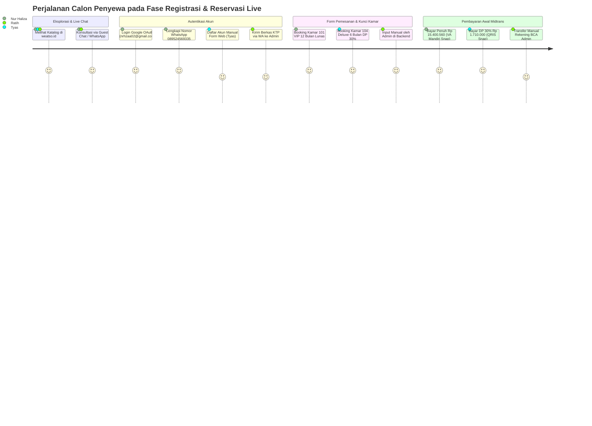
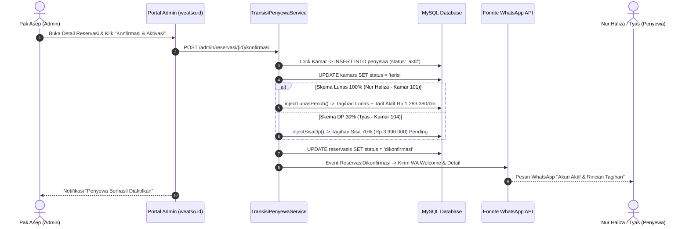
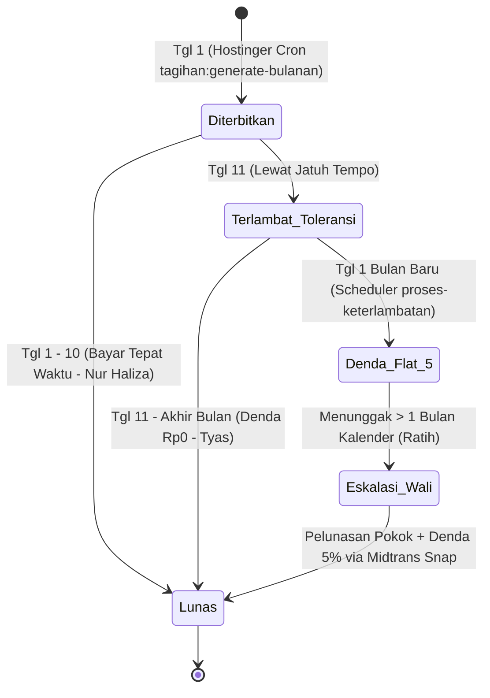
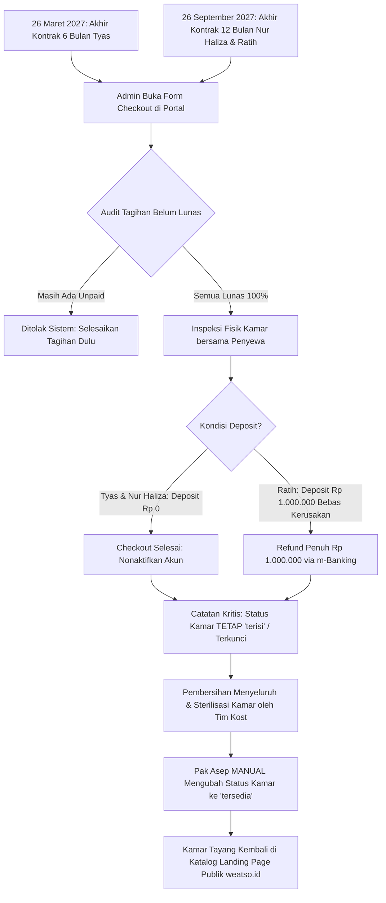

# Skenario Cerita Perjalanan Penyewa (End-to-End Tenant Lifecycle Scenario)
## Proyek: Asri Boarding House (Laravel 11, MySQL 8.x, Midtrans Snap, & Fonnte WA API)
**Edisi Produksi Live (https://asriboardinghouse.weatso.id/) — Data Riil Transaksi Produksi**

---

## 📌 Pengantar & Gambaran Umum Skenario

Dokumen ini menyajikan narasi perjalanan komprehensif (*End-to-End User Journey*) dari sudut pandang **Penyewa Kost**, mulai dari tahap penemuan properti dan konsultasi pra-pemesanan di portal publik produksi **`https://asriboardinghouse.weatso.id/`**, proses reservasi awal (**Bulan ke-0**), siklus kehidupan tinggal selama masa kontrak sewa yang mencakup otomasi billing, toleransi keterlambatan, pengenaan denda flat kalender, eskalasi wali, penanganan keluhan fasilitas berfoto, penerimaan broadcast darurat, hingga fase akhir masa tinggal meliputi audit keuangan checkout, klaim deposit fasilitas, dan penonaktifan akun.

Skenario ini disusun **100% presisi berdasarkan data transaksi nyata pengujian di server produksi live**, mengilustrasikan **3 (tiga) jalur pendaftaran dan kepribadian penyewa yang berbeda**:
1. **Jalur 1 (Nur Haliza - Mahasiswi Baru Luar Kota)**: Pendaftaran & Login instan via **Google OAuth 2.0 (Laravel Socialite)**, penapisan kelengkapan nomor WhatsApp via middleware `EnsureProfileIsComplete`, pemesanan Kamar 101 VIP durasi 12 bulan dengan skema **Pelunasan Penuh (Full Payment Upfront)** berdiskon durasi via **Midtrans Snap**, dan memiliki rekam jejak pembayaran selalu tepat waktu (*Disiplin*) pada siklus penagihan rutin bulanan.
2. **Jalur 2 (Tyas - Mahasiswi Tingkat Akhir)**: Pendaftaran akun secara manual via formulir web, pemesanan Kamar 104 Deluxe durasi **6 Bulan** dengan skema **Uang Muka (DP) 30%** via **Midtrans Snap (QRIS)**, pelunasan sisa 70% melalui portal sebelum check-in, dan sempat mengalami masa toleransi jatuh tempo (*Masa Keringanan Bebas Denda*) pada tagihan rutin bulanan.
3. **Jalur 3 (Ratih - Karyawati / Walk-in Offline)**: Pendaftaran langsung melalui chat WhatsApp dengan Admin (Pak Asep), transfer bank manual langsung ke rekening pengelola, didaftarkan secara manual oleh Admin di portal backend, serta mengalami kasus tunggakan melewati bulan kalender sehingga terkena **Denda Flat 5%** dan **Eskalasi Notifikasi WhatsApp ke Wali**.

---

## 👥 Profil Karakter, Properti & Parameter Awal

### 1. Data Properti Kost
* **Nama Properti**: Asri Boarding House (Kost Putri Eksklusif).
* **Domain Web Publik**: `https://asriboardinghouse.weatso.id/` (SSL TLS 1.3 Let's Encrypt).
* **Lokasi**: Jl. Maera Sari No. 12, Tembalang, Semarang, Jawa Tengah.
* **Pengelola / Owner**: **Pak Asep (48 Tahun)**, pengelola operasional yang teliti dan disiplin.

### 2. Kamar Kost Yang Dipesan (Sesuai Data Riil Produksi)
* **Kamar 101 (Lantai 1, Tipe VIP - Nur Haliza)**:
  * Harga Pokok Kamar: **Rp 1.400.000 / bulan**
  * Tipe Sewa & Durasi: **Bulanan (12 Bulan)** — Periode: **26 September 2026 s/d 26 September 2027**
  * Total Biaya Transaksi Awal: **Rp 15.400.560** (mendapatkan potongan diskon durasi tahunan dari model `Setting`)
  * Harga Sewa Aktif Penyewa (*Immutable Personal Rate*): **Rp 1.283.380 / bulan** (`Rp 15.400.560 / 12 bln`)
  * Uang Jaminan (Deposit): **Rp 0**
* **Kamar 104 (Lantai 1, Tipe Deluxe - Tyas)**:
  * Harga Pokok Kamar: **Rp 950.000 / bulan**
  * Tipe Sewa & Durasi: **Bulanan (6 Bulan)** — Periode: **26 September 2026 s/d 26 Maret 2027**
  * Total Pokok Sewa: **Rp 5.700.000** (6 x Rp 950.000)
  * Harga Sewa Aktif Penyewa: **Rp 950.000 / bulan**
  * Skema Bayar: **Uang Muka (DP 30%) = Rp 1.710.000** | **Sisa Tagihan (70%) = Rp 3.990.000**
  * Uang Jaminan (Deposit): **Rp 0**
* **Kamar 203 (Lantai 2, Tipe Deluxe Balkon - Ratih)**:
  * Harga Pokok Kamar: **Rp 1.400.000 / bulan**
  * Tipe Sewa & Durasi: **Bulanan (12 Bulan)** — Periode: **26 September 2026 s/d 26 September 2027**
  * Uang Jaminan (Deposit): **Rp 1.000.000** (wajib pada jalur offline walk-in)

### 3. Ketentuan Finansial & Parameter Kontrak
* **Skema Billing Rutin**: Terbit otomatis setiap **tanggal 1** pukul 00:05 WIB via Hostinger Cron Scheduler `tagihan:generate-bulanan`.
* **Batas Waktu Jatuh Tempo (Grace Period)**: **Tanggal 10** setiap bulannya.
* **Masa Toleransi (Keringanan)**: Tanggal 11 s.d. akhir bulan berjalan (Denda = Rp 0, Reminder berkala).
* **Aturan Denda Flat Kalender**: Denda flat **5% dari sewa pokok** diterapkan pada **tanggal 1 bulan berikutnya** jika tagihan bulan sebelumnya belum lunas via task `tagihan:proses-keterlambatan`.
* **Arsitektur Kuitansi Pembayaran**: Client-side rendering format A5 via **`html2pdf.js`** (*Zero Server Load*).

---

## 📍 Bagian 1: Fase Registrasi & Reservasi Awal (September 2026)

*Berkas Diagram*: [Sumber Mermaid (.mmd)](file:///c:/xampp/htdocs/asri-boarding-house/Blueprint/Skenario/skenario_journey_penyewa.mmd) | [Format PNG HD](file:///c:/xampp/htdocs/asri-boarding-house/Blueprint/Skenario/skenario_journey_penyewa.png)



```mermaid
journey
    title Perjalanan Calon Penyewa pada Fase Registrasi & Reservasi Live
    section Eksplorasi & Live Chat
      Melihat Katalog di weatso.id: 5: Nur Haliza, Tyas, Ratih
      Konsultasi via Guest Chat / WhatsApp: 5: Nur Haliza, Ratih
    section Autentikasi Akun
      Login Google OAuth (nrhzaa02@gmail.com): 5: Nur Haliza
      Lengkapi Nomor WhatsApp 089524569335: 5: Nur Haliza
      Daftar Akun Manual Form Web (Tyas): 4: Tyas
      Kirim Berkas KTP via WA ke Admin: 4: Ratih
    section Form Pemesanan & Kunci Kamar
      Booking Kamar 101 VIP 12 Bulan Lunas: 5: Nur Haliza
      Booking Kamar 104 Deluxe 6 Bulan DP 30%: 5: Tyas
      Input Manual oleh Admin di Backend: 5: Ratih
    section Pembayaran Awal Midtrans
      Bayar Penuh Rp 15.400.560 (VA Mandiri Snap): 5: Nur Haliza
      Bayar DP 30% Rp 1.710.000 (QRIS Snap): 5: Tyas
      Transfer Manual Rekening BCA Admin: 4: Ratih
```

---

### 1. Jalur 1: Google OAuth 2.0 via Website (Penyewa: Nur Haliza - Kamar 101)

#### Langkah 1.1: Eksplorasi Landing Page & Floating Guest Live Chat
* Pada tanggal **25 September 2026**, Nur Haliza (calon mahasiswi asal Semarang) membuka laptopnya dan mengakses Landing Page publik Asri Boarding House (`https://asriboardinghouse.weatso.id/`).
* Nur Haliza melihat katalog kamar interaktif yang bersih dengan nuansa modern Neo-Brutalism. Nur Haliza tertarik dengan **Kamar 101 (Lantai 1 VIP)**.
* Sebelum memutuskan memesan, Nur Haliza memperhatikan ada **Floating Guest Live Chat Widget** di pojok kanan bawah layar. Tanpa harus mendaftar akun, Nur Haliza mengklik widget tersebut.
* Sistem secara otomatis menerbitkan cookie `guest_chat_token` berisi string UUID unik yang di-hash SHA-256 (`session_token`) pada tabel `guest_chat_threads`.
* Nur Haliza mengetik pesan singkat: *"Halo admin, apakah Kamar 101 VIP tersedia untuk sewa 1 tahun mulai 26 September?"*
* Di panel admin, Pak Asep menerima pesan tamu tersebut dan membalas secara instan: *"Halo Kak Nur Haliza! Kamar 101 VIP tersedia dan siap huni dengan fasilitas lengkap."*
* Merasa yakin, Nur Haliza menutup chat dan mengklik tombol **"Detail Kamar"** lalu **"Pesan Kamar Sekarang"** pada kartu Kamar 101.

#### Langkah 1.2: Otentikasi Google OAuth 2.0 & Penapisan Profil (`EnsureProfileIsComplete`)
* Karena Nur Haliza belum terautentikasi di sistem, aplikasi secara otomatis mengalihkannya ke halaman login (`/reservasi/login`).
* Nur Haliza memilih tombol merah **"Masuk dengan Google"** (didukung oleh `Laravel Socialite`).
* Browser mengarahkan Nur Haliza ke halaman persetujuan akun Google. Nur Haliza memilih akun `nrhzaa02@gmail.com`.
* Google OAuth mengembalikan payload identitas (Email: `nrhzaa02@gmail.com`, Nama Lengkap: `Nur Haliza`, Google ID) ke endpoint callback sistem (`https://asriboardinghouse.weatso.id/auth/google/callback`).
* Sistem melakukan pencarian pada tabel `users`. Karena email belum ada di database, sistem membuat record user baru dengan nomor ponsel sementara:
  ```sql
  INSERT INTO users (nama, email, password, role, is_active, no_hp, google_id)
  VALUES ('Nur Haliza', 'nrhzaa02@gmail.com', [HASHED_RANDOM], 'penyewa', 1, 'temp_socialite_6695a1bc', '1092837465192837465');
  ```
* Middleware keamanan sistem `EnsureProfileIsComplete` segera mendeteksi bahwa kolom `no_hp` masih berawalan `temp_`.
* Sistem secara otomatis mengalihkan Nur Haliza ke halaman **Lengkapi Profil Kontak** (`/profil/complete`).
* Nur Haliza memasukkan nomor WhatsApp aktifnya: **`089524569335`**.
* Backend memvalidasi format regex nomor ponsel Indonesia (`^(\+62|62|0)8[1-9][0-9]{6,10}$`), menstandarkannya, dan memastikan nomor tersebut belum pernah digunakan di sistem.
* Setelah disimpan, sesi Nur Haliza berstatus lengkap dan diarahkan langsung kembali ke formulir pemesanan Kamar 101.

#### Langkah 1.3: Pengisian Form Reservasi & Kalkulasi Diskon Durasi Tahunan
* Halaman pemesanan menampilkan detail Kamar 101 dengan formulir reservasi:
  * **NIK (KTP)**: `3374115212030001` (16 digit valid).
  * **Tipe Sewa**: `Bulanan`.
  * **Durasi Kontrak**: `12 Bulan`.
  * **Rentang Sewa**: `26 September 2026 s/d 26 September 2027`.
  * **Uang Deposit Jaminan**: `Rp 0` (sesuai setting kamar).
  * **Nama Kontak Darurat / Wali**: `Kusuma`.
  * **Nomor WhatsApp Wali**: `082219575575`.
* Nur Haliza memilih skema pembayaran **Pelunasan Penuh (Full Payment)**.
* **Kalkulasi Backend Atomik (`ReservasiService::buatReservasi`)**:
  * Tarif Dasar: 12 x Rp 1.400.000 = Rp 16.800.000.
  * Diskon Durasi Sewa Otomatis (Setting Promo Tahunan): Memotong total sewa menjadi **Rp 15.400.560**.
  * Total Harga Transaksi: **Rp 15.400.560**.
  * `order_id`: `RSV-1-1727334000-8921`, status `pending`.

#### Langkah 1.4: Transaksi Pembayaran Midtrans Snap
* Nur Haliza mengklik tombol **"Bayar Sekarang (Midtrans)"**.
* Pop-up **Midtrans Snap** terbuka di domain resmi `weatso.id`. Nur Haliza memilih metode pembayaran **Virtual Account Bank Mandiri**.
* Nur Haliza menyelesaikan transfer sebesar **Rp 15.400.560** pada simulator Midtrans / aplikasi Livin'.
* **Proses Webhook Asinkron (`MidtransReservasiCallbackController`)**:
  1. Midtrans Cloud mengirimkan notifikasi HTTP POST ke webhook publik `https://asriboardinghouse.weatso.id/api/midtrans/callback-reservasi`.
  2. Sistem memverifikasi signature key SHA-512, memvalidasi kecocokan nominal `gross_amount == 15400560`.
  3. Memperbarui status reservasi Nur Haliza dari `pending` menjadi **`lunas`**.
* Tampilan layar Nur Haliza otomatis berganti menampilkan status **"Pembayaran Berhasil Diverifikasi - Menunggu Konfirmasi & Aktivasi Admin"** (Langkah 3 pada Stepper).

---

### 2. Jalur 2: Registrasi Akun Manual via Website (Penyewa: Tyas - Kamar 104)

#### Langkah 2.1: Eksplorasi & Registrasi Akun Mandiri
* Pada tanggal **25 September 2026**, Tyas (21 tahun, mahasiswi tingkat akhir) meninjau landing page dan tertarik menyewa **Kamar 104 (Lantai 1 Deluxe)** dengan tarif hemat Rp 950.000/bulan.
* Tyas mengklik **"Detail Kamar"** lalu diarahkan ke `/reservasi/login`. Tyas memilih tab **"Daftar Akun Baru"**.
* Tyas mengisi formulir registrasi:
  * Nama Lengkap: **`Tyas`**
  * Email: **`nurhalizakusumaningtyas22@gmail.com`**
  * No. WhatsApp: **`085940810105`**
  * Password: **`password123`**
* Sistem menyimpan data user ber-role `penyewa` di tabel `users` dan mengautentikasi login Tyas secara otomatis.

#### Langkah 2.2: Pengisian Reservasi Skema Uang Muka (DP 30%) Durasi 6 Bulan
* Tyas mengisi formulir reservasi untuk Kamar 104:
  * **NIK (KTP)**: `3374114112030111` (16 digit).
  * **Durasi Kontrak**: `6 Bulan` (Rentang Sewa: `26 September 2026 s/d 26 Maret 2027`).
  * **Nama Wali**: `Nur`.
  * **No HP Wali**: `082219575575`.
  * **Uang Deposit Jaminan**: `Rp 0`.
* Pada pilihan skema pembayaran, Tyas memilih **Uang Muka (DP 30%)**:
  * Total Pokok Sewa 6 Bulan (6 x Rp 950.000) = **Rp 5.700.000**.
  * Uang Muka DP 30% dari Pokok = **Rp 1.710.000**.
  * Sisa Kewajiban Pokok (70%) = **Rp 3.990.000** (wajib dilunasi sebelum check-in).
* Tyas menekan tombol **"Kirim Pemesanan"**. Sistem mengunci Kamar 104 dengan `lockForUpdate()` dan membuat record reservasi baru dengan `status: 'pending'`, `is_dp: true`, `nominal_dp: 1710000`, dan `nominal_sisa: 3990000`.

#### Langkah 2.3: Pembayaran DP via QRIS Midtrans Snap
* Tyas mengklik **"Bayar DP Sekarang"**. Pop-up Midtrans Snap muncul di layar, dan Tyas memilih metode pembayaran **QRIS**.
* Tyas memindai kode QR dinamis di layar dan menyelesaikan pembayaran **Rp 1.710.000**.
* Webhook Midtrans terkirim ke server Hostinger, memvalidasi signature key, dan secara transaksional mengubah status reservasi Tyas menjadi **`dp`**.
* Halaman reservasi Tyas terupdate menampilkan badge **"DP 30% Diterima (Sisa Tagihan Rp 3.990.000 Diterbitkan Saat Aktivasi Admin)"**.

---

### 3. Jalur 3: Pendaftaran Offline / WhatsApp Walk-in (Penyewa: Ratih - Kamar 203)

#### Langkah 3.1: Konsultasi WhatsApp & Transfer Bank Manual
* Pada tanggal **25 September 2026**, Ratih (karyawati baru) menghubungi Pak Asep (Admin) via WhatsApp untuk memesan Kamar 203 (Lantai 2 Deluxe Balkon, tarif Rp 1.400.000/bln) durasi 12 bulan (26 September 2026 s/d 26 September 2027) dengan uang deposit jaminan Rp 1.000.000.
* Ratih mentransfer pembayaran awal sebesar **Rp 2.400.000** (Sewa Bulan Pertama Rp 1.400.000 + Deposit Rp 1.000.000) ke rekening BCA kost dan mengirimkan foto struk ATM beserta KTP (NIK: `3374023456780003`) dan kontak wali (Harto Kusumo: `085711112222`).

#### Langkah 3.2: Pendaftaran Manual oleh Admin (`AdminPenyewaService::registerPenyewa`)
* Pak Asep membuka Portal Admin -> Menu **Manajemen Penyewa** -> klik tombol **"Pendaftaran Manual Penyewa (Walk-in/Offline)"**.
* Pak Asep menginput data Ratih, memilih Kamar 203, durasi 12 bulan, harga sewa Rp 1.400.000, deposit Rp 1.000.000, dan mengunggah bukti struk ATM.
* Sistem membuat user `users` baru, mengunci Kamar 203 menjadi **`terisi`**, menerbitkan tagihan bulan pertama sebagai **`lunas`** (`cash_confirmed`), dan Fonnte API mengirimkan pesan WhatsApp kredensial login ke nomor Ratih.

---

## 🔒 Bagian 2: Fase Audit & Konfirmasi Reservasi Online oleh Admin

*Pada tanggal **26 September 2026 pagi**, Pak Asep memproses verifikasi dan aktivasi reservasi online untuk **Nur Haliza** dan **Tyas**.*

*Berkas Diagram*: [Sumber Mermaid (.mmd)](file:///c:/xampp/htdocs/asri-boarding-house/Blueprint/Skenario/skenario_seq_aktivasi_reservasi.mmd) | [Format PNG HD](file:///c:/xampp/htdocs/asri-boarding-house/Blueprint/Skenario/skenario_seq_aktivasi_reservasi.png)



```mermaid
sequenceDiagram
    autonumber
    actor A as Pak Asep (Admin)
    participant AP as Portal Admin (weatso.id)
    participant S as TransisiPenyewaService
    participant DB as MySQL Database
    participant W as Fonnte WhatsApp API
    actor N as Nur Haliza / Tyas (Penyewa)

    A->>AP: Buka Detail Reservasi & Klik "Konfirmasi & Aktivasi"
    AP->>S: POST /admin/reservasi/{id}/konfirmasi
    S->>DB: Lock Kamar -> INSERT INTO penyewa (status: 'aktif')
    S->>DB: UPDATE kamars SET status = 'terisi'
    alt Skema Lunas 100% (Nur Haliza - Kamar 101)
        S->>DB: injectLunasPenuh() -> Tagihan Lunas + Tarif Aktif Rp 1.283.380/bln
    else Skema DP 30% (Tyas - Kamar 104)
        S->>DB: injectSisaDp() -> Tagihan Sisa 70% (Rp 3.990.000) Pending
    end
    S->>DB: UPDATE reservasis SET status = 'dikonfirmasi'
    S->>W: Event ReservasiDikonfirmasi -> Kirim WA Welcome & Detail
    W-->>N: Pesan WhatsApp "Akun Aktif & Rincian Tagihan"
    AP-->>A: Notifikasi "Penyewa Berhasil Diaktifkan"
```

### 1. Mengonfirmasi Reservasi Nur Haliza (Kamar 101 VIP - Lunas 100%)
* Pak Asep membuka menu **Manajemen Reservasi** (`/admin/reservasi`), memfilter status `lunas`, dan memilih reservasi Nur Haliza.
* Pak Asep mengaudit NIK `3374115212030001` dan kontak wali Kusuma `082219575575`. Semua terverifikasi sah.
* Pak Asep menekan tombol **"Konfirmasi Reservasi & Aktivasi Penyewa"**.
* **Eksekusi Backend (`TransisiPenyewaService::transisi`)**:
  1. Mengunci Kamar 101 dengan `lockForUpdate()`.
  2. Membuat record di tabel `penyewa`: `user_id: [Nur Haliza]`, `kamar_id: 101`, `harga_sewa: 1283380` (`Rp 15.400.560 / 12 bln`), `deposit: 0`, `status: 'aktif'`, `durasi: 12`, `tanggal_masuk: '2026-09-26'`.
  3. `PenyewaObserver::created` mengubah status Kamar 101 menjadi **`terisi`**.
  4. Karena reservasi berstatus `lunas` penuh, memanggil `BillingService::injectLunasPenuh`:
     * Membuat tagihan `Tagihan` bulan September 2026 senilai Rp 15.400.560 dengan status langsung **`lunas`**.
     * Membuat record `Pembayaran` berstatus `settlement`.
     * Kuitansi pembayaran resmi format A5 berstempel digital siap di-render di browser via **`html2pdf.js`**.
  5. Status reservasi berubah menjadi **`dikonfirmasi`**.
* Fonnte API mengirim pesan WhatsApp konfirmasi selamat datang ke nomor Nur Haliza.

### 2. Mengonfirmasi Reservasi Tyas (Kamar 104 Deluxe - DP 30%) & Monitoring Pelunasan Sisa
* Pak Asep membuka data reservasi Tyas (status `dp`, pembayaran DP Rp 1.710.000 sukses).
* Pak Asep memverifikasi dokumen Tyas (NIK: `3374114112030111`, Wali: Nur `082219575575`) dan mengklik tombol **"Konfirmasi Reservasi & Aktivasi Penyewa"**.
* **Eksekusi Backend (`TransisiPenyewaService::transisi`)**:
  1. Mengunci Kamar 104 dengan `lockForUpdate()`.
  2. Membuat record `penyewa` untuk Tyas dengan `status: 'aktif'`, `kamar_id: 104`, `harga_sewa: 950000`, `deposit: 0`, `durasi: 6`, `tanggal_masuk: '2026-09-26'`. Status Kamar 104 menjadi **`terisi`**.
  3. Karena `is_dp == true` dan `nominal_sisa == 3990000`, memanggil `BillingService::injectSisaDp`:
     * Menerbitkan `Tagihan` bulan pertama (September 2026) dengan order_id `TGH-{TyasId}-202609`, nominal pokok **Rp 3.990.000**, `nominal_denda: 0`, `nominal_total: 3990000`, `status: 'pending'`, `tanggal_jatuh_tempo: 2026-10-06`.
     * Memicu event `TagihanDibuat`.
  4. Status reservasi Tyas berubah menjadi **`dikonfirmasi`**.
* Fonnte API mengirimkan pesan WhatsApp ke Tyas berisi rincian akun aktif dan tautan tagihan pelunasan sisa sewa 70% (**Rp 3.990.000**).
* **Pelunasan Sisa DP oleh Tyas**: Pada tanggal **26 September 2026 siang**, Tyas login ke `https://asriboardinghouse.weatso.id/penyewa/dashboard`. Di bagian atas dashboard tampil **Active Bill Alert Banner** tagihan sisa sewa Rp 3.990.000. Tyas mengklik **"Bayar Sekarang"** dan melunasinya via Midtrans Snap. Status tagihan seketika berubah menjadi **`lunas`**, dan Tyas mengunduh kuitansi resmi A5 via **`html2pdf.js`**.

*Tepat pada tanggal **26 September 2026 sore**, Nur Haliza, Tyas, dan Ratih resmi melakukan check-in fisik dan menempati kamar masing-masing sebagai penyewa aktif sah.*

---

## 📅 Bagian 3: Fase Siklus Tinggal & Billing Bulanan

*Berkas Diagram*: [Sumber Mermaid (.mmd)](file:///c:/xampp/htdocs/asri-boarding-house/Blueprint/Skenario/skenario_state_siklus_billing.mmd) | [Format PNG HD](file:///c:/xampp/htdocs/asri-boarding-house/Blueprint/Skenario/skenario_state_siklus_billing.png)



```mermaid
stateDiagram-v2
    [*] --> Diterbitkan: Tgl 1 (Hostinger Cron tagihan:generate-bulanan)
    Diterbitkan --> Lunas: Tgl 1 - 10 (Bayar Tepat Waktu - Nur Haliza)
    Diterbitkan --> Terlambat_Toleransi: Tgl 11 (Lewat Jatuh Tempo)
    Terlambat_Toleransi --> Lunas: Tgl 11 - Akhir Bulan (Denda Rp0 - Tyas)
    Terlambat_Toleransi --> Denda_Flat_5: Tgl 1 Bulan Baru (Scheduler proses-keterlambatan)
    Denda_Flat_5 --> Eskalasi_Wali: Menunggak > 1 Bulan Kalender (Ratih)
    Eskalasi_Wali --> Lunas: Pelunasan Pokok + Denda 5% via Midtrans Snap
    Lunas --> [*]
```

---

### 1. Siklus Billing Bulanan Otomatis (Setiap Tanggal 1, Pukul 00:05 WIB)
* Pada **tanggal 1 Oktober 2026** (dan tanggal 1 setiap bulan berikutnya), Hostinger Cron Scheduler mengeksekusi:
  ```bash
  php artisan tagihan:generate-bulanan
  ```
* Task `GenerateBulananTagihan` memanggil `BillingService::generateTagihanBulanan`:
  1. Mengambil seluruh data penyewa dengan filter `status = 'aktif'` dan `tipe_sewa = 'bulanan'` menggunakan chunking memori efisien `chunkById(100)`.
  2. Menerbitkan entri tagihan rutin pada tabel `tagihans` dengan grace period jatuh tempo tanggal 10:
     * **Nur Haliza (Kamar 101)**: Rp 1.283.380 (tarif aktif personal)
     * **Tyas (Kamar 104)**: Rp 950.000
     * **Ratih (Kamar 203)**: Rp 1.400.000
  3. Memicu event `TagihanDibuat`. Fonnte API mengirimkan pesan WhatsApp personal ke nomor masing-masing penyewa lengkap dengan tautan pembayaran di portal.

---

### 2. Skenario Nur Haliza: Pembayaran Disiplin Tepat Waktu (Bebas Denda)
* Pada tanggal 1 setiap bulannya, Nur Haliza menerima notifikasi WhatsApp invoice sewa sebesar Rp 1.283.380.
* Nur Haliza membuka tautan pada pesan tersebut di ponselnya, masuk ke Portal Penyewa -> Menu **Tagihan Saya**.
* Nur Haliza mengklik tombol **"Bayar via Midtrans"**, memilih metode pembayaran **GoPay**.
* Webhook Midtrans terverifikasi dalam hitungan detik. Status tagihan Nur Haliza di database berubah menjadi **`lunas`**.
* Nur Haliza mengklik unduh nota: Lembar kuitansi A5 berstempel digital langsung terunduh secara instan via engine **`html2pdf.js`** di peramban tanpa membebani server.
* Nur Haliza selalu membayar antara tanggal 1 s.d. 5 setiap bulannya. **Nur Haliza tidak pernah dikenakan denda keterlambatan sepanjang masa sewa.**

---

### 3. Skenario Tyas: Pembayaran pada Masa Toleransi (Jatuh Tempo Terlewat, Denda Rp 0)
* Pada bulan **November 2026**, Tyas sedang sangat sibuk mempersiapkan seminar proposal skripsinya sehingga lupa melakukan pembayaran tagihan sewa Kamar 104 yang terbit pada 1 November.
* Batas jatuh tempo **10 November 2026** terlewati.
* Pada tanggal **11 November 2026 pukul 01:00 WIB**, scheduler harian `tagihan:proses-keterlambatan` berjalan (`BillingService::prosesKeterlambatan`):
  * Sistem mendeteksi tagihan Tyas berstatus `pending` dan `tanggal_jatuh_tempo < 2026-11-11`.
  * Karena masih berada di bulan kalender November yang sama (`!isBulanBerikutnya`), tagihan Tyas berada di **Masa Toleransi / Keringanan**.
  * Kolom `nominal_denda` tetap **`0`**, `bulan_keterlambatan` diset menjadi `1`, dan status tagihan diubah menjadi **`terlambat`**.
* Fonnte API mengirimkan pesan **WhatsApp Reminder Sopan** ke nomor Tyas:
  > *"Halo Kak Tyas. Kami mengingatkan bahwa tagihan sewa Kamar 104 untuk periode November 2026 sebesar Rp 950.000 telah melewati batas jatuh tempo (10 November). Mohon kesediaannya untuk melakukan pembayaran melalui portal. Saat ini denda masih Rp 0 (Masa Toleransi Bebas Denda hingga akhir bulan). Terima kasih."*
* Pada tanggal **15 November 2026**, Tyas membaca pesan WhatsApp tersebut. Tyas segera login ke portal penyewa dan melunasi tagihannya senilai **Rp 950.000** (tanpa denda tambahan) melalui QRIS Midtrans Snap. Status tagihan terupdate menjadi **`lunas`**, dan kuitansi diunduh via `html2pdf.js`.

---

### 4. Skenario Ratih: Kasus Menunggak, Denda Flat 5% & Eskalasi Wali

#### A. Penerbitan Tagihan & Terlewatinya Masa Toleransi (Desember 2026)
* Pada **1 Desember 2026**, tagihan sewa bulan Desember untuk Kamar 203 milik Ratih terbit senilai Rp 1.400.000.
* Ratih mengalami kendala keuangan tak terduga dan tidak melakukan pembayaran hingga tanggal 31 Desember 2026.

#### B. Penerapan Denda Flat Kalender 5% (1 Januari 2027)
* Pada tanggal **1 Januari 2027 pukul 01:00 WIB**, scheduler `tagihan:proses-keterlambatan` dijalankan oleh Hostinger Cron.
* Sistem mendeteksi pergantian bulan kalender: Bulan saat ini (`Januari 2027`) > Periode Tagihan (`Desember 2026`), dan `nominal_denda == 0`.
* **Kalkulasi Denda Backend**:
  * Denda Flat 5% = 5% x Rp 1.400.000 = **Rp 70.000**.
  * `nominal_denda` di-update menjadi `70000`, `nominal_total` bertambah menjadi **`Rp 1.470.000`**, dan status tetap `terlambat`.
* Fonnte API mengirimkan pesan peringatan resmi ke WhatsApp Ratih bahwa tagihan Desember telah dikenakan denda flat 5%.

#### C. Eskalasi Tunggakan ke WhatsApp Wali (1 Februari 2027)
* Memasuki tanggal **1 Februari 2027**, Ratih masih belum melunasi tagihan bulan Desember 2026 tersebut (`bulan_keterlambatan > 1`).
* Scheduler sistem mengeksekusi aturan eskalasi dengan mengirimkan pesan WhatsApp otomatis ke nomor ayah Ratih (**Pak Harto Kusumo - 085711112222**).
* Pada tanggal **5 Februari 2027**, Ratih login ke portal penyewa, membuka menu **Tagihan Saya**, dan melunasi tagihan tertunggak tersebut sebesar **Rp 1.470.000** menggunakan Virtual Account Mandiri Midtrans Snap. Status tagihan terupdate menjadi **`lunas`** dan denda ter-clear sepenuhnya.

---

## 🔧 Bagian 4: Pengaduan Keluhan Fasilitas Berfoto (Bulan ke-7 / Maret 2027)

*Pada tanggal **10 Maret 2027**, terjadi masalah pada fasilitas kamar mandi Kamar 101 milik Nur Haliza.*

* **Langkah 1: Pengajuan Keluhan oleh Nur Haliza**:
  * Kran wastafel kamar mandi di Kamar 101 mengalami kebocoran pada sambungan drat pipa.
  * Nur Haliza membuka Portal Penyewa -> Menu **Keluhan & Pengaduan** -> Mengklik tombol **"Buat Pengaduan Baru"** (`/penyewa/keluhan/create`).
  * Mengisi judul: `Kran Wastafel Kamar Mandi Bocor`, melampirkan foto `kran_bocor.jpg` (1.2 MB). Backend memproses request, status tiket menjadi `pending`, dan alert WhatsApp terkirim ke Pak Asep.
* **Langkah 2: Penanganan & Penyelesaian oleh Admin**:
  * Pak Asep menerima notifikasi WA, membuka `/admin/keluhan`, meninjau foto kerusakan, dan memanggil teknisi ledeng langganan kost.
  * Pak Asep mengupdate status menjadi **`diproses`** (sistem mengirim notifikasi WA ke Nur Haliza).
  * Pukul 14.30 WIB teknisi menyelesaikan penggantian drat kran. Pak Asep menginspeksi kamar lalu mengubah status keluhan menjadi **`selesai`**. Nur Haliza menerima pesan WA penutupan tiket.

---

## 📢 Bagian 5: Penerimaan Broadcast Notifikasi Multi-Saluran (Juni 2027)

*Pada tanggal **15 Juni 2027**, pengelola kost menyebarkan informasi fogging nyamuk DBD.*

* Pak Asep membuka Portal Admin -> Menu **Manajemen Notifikasi** (`/admin/notifikasi`) -> Bagian **Broadcast Pengumuman**.
* Pak Asep menyusun pesan: `Jadwal Fogging Nyamuk DBD & Himbauan Keamanan Kamar`, memilih target `Semua Penyewa Aktif`, serta mencentang **Web Portal**, **WhatsApp**, dan **Email**.
* Backend mempublikasikan banner pengumuman di portal penyewa dan mendaftarkan antrean `KirimNotifikasiKustomJob` dengan proteksi jeda 2 detik antar nomor. Nur Haliza, Tyas, dan Ratih menerima broadcast secara serentak.

---

## 🚪 Bagian 6: Akhir Kontrak, Checkout & Pelepasan Status Kamar


```mermaid
flowchart TD
    A1[26 Maret 2027: Akhir Kontrak 6 Bulan Tyas] --> B[Admin Buka Form Checkout di Portal]
    A2[26 September 2027: Akhir Kontrak 12 Bulan Nur Haliza & Ratih] --> B
    B --> C{Audit Tagihan Belum Lunas}
    C -->|Masih Ada Unpaid| D[Ditolak Sistem: Selesaikan Tagihan Dulu]
    C -->|Semua Lunas 100%| E[Inspeksi Fisik Kamar bersama Penyewa]
    E --> F{Kondisi Deposit?}
    F -->|Tyas & Nur Haliza: Deposit Rp 0| G[Checkout Selesai: Nonaktifkan Akun]
    F -->|Ratih: Deposit Rp 1.000.000 Bebas Kerusakan| H[Refund Penuh Rp 1.000.000 via m-Banking]
    G --> I[Catatan Kritis: Status Kamar TETAP 'terisi' / Terkunci]
    H --> I
    I --> J[Pembersihan Menyeluruh & Sterilisasi Kamar oleh Tim Kost]
    J --> K[Pak Asep MANUAL Mengubah Status Kamar ke 'tersedia']
    K --> L[Kamar Tayang Kembali di Katalog Landing Page Publik weatso.id]
```

---

### 1. Skenario Checkout Tyas (26 Maret 2027 - Selesai Kontrak 6 Bulan)
* Pada **26 Maret 2027**, masa kontrak sewa 6 bulan Tyas di Kamar 104 resmi berakhir.
* Pak Asep membuka formulir checkout (`/admin/penyewa/{id}/checkout`). Sistem memverifikasi seluruh tagihan dari bulan ke-1 s.d. bulan ke-6 telah berstatus **`lunas`**.
* Pak Asep dan Tyas melakukan inspeksi fisik di Kamar 104: Semua inventaris bersih dan terawat dengan baik.
* Karena Tyas memiliki deposit **Rp 0**, sistem tidak mencatat pengeluaran kas refund deposit.
* Pak Asep menekan tombol **"Selesaikan Prosedur Checkout"**: Status penyewa Tyas menjadi **`nonaktif`**, `tanggal_keluar = '2027-03-26'`, dan akun user dinonaktifkan (`is_active = 0`).

---

### 2. Skenario Checkout Nur Haliza & Ratih (26 September 2027 - Selesai Kontrak 12 Bulan)
* Pada **26 September 2027**, kontrak sewa 12 bulan Nur Haliza (Kamar 101) dan Ratih (Kamar 203) berakhir.
* Sistem memverifikasi seluruh tagihan keduanya telah berstatus **`lunas`**.
* Inspeksi fisik membuktikan seluruh fasilitas dalam kondisi prima.
* **Checkout Nur Haliza**: Status penyewa diubah menjadi `nonaktif` (deposit Rp 0).
* **Checkout Ratih**: Status diubah menjadi `nonaktif`, dan Pak Asep mentransfer pengembalian penuh uang deposit sebesar **Rp 1.000.000** ke rekening BCA Ratih via m-banking. Sistem mencatat arus kas keluar operasional sebesar Rp 1.000.000.

---

### 3. Protokol Penahanan Kamar (Manual Room Hold) & Pelepasan Kunci Kamar
* **Kaidah Bisnis Kritis**: Setelah prosedur checkout di sistem selesai, **status kamar di database TIDAK otomatis berubah menjadi `tersedia`**. Status kamar tetap **`terisi`** (terkunci).
* Tim kebersihan kost melakukan pembersihan total, perbaikan fasilitas, pengepelan, dan sterilisasi ruangan.
* Setelah memastikan kamar telah 100% siap huni kembali, Pak Asep membuka Portal Admin -> Menu **Manajemen Kamar** (`/admin/kamar`).
* Pak Asep secara **MANUAL** mengubah dropdown status kamar dari `terisi` menjadi **`tersedia`**.
* `KamarObserver::updated` membersihkan cache landing page via `Cache::forget('kamar_aktif_landing')`. Kamar kembali tampil di landing page `https://asriboardinghouse.weatso.id/` dengan tombol hijau **"Detail Kamar"** / **"Pesan Kamar Sekarang"**, siap menyambut calon penghuni baru untuk siklus sewa tahun berikutnya.

---

## 📊 Matriks Pemetaan Status Sistem & State Database Lengkap

Tabel di bawah ini merangkum evolusi status seluruh entitas database utama sepanjang siklus hidup penyewa:

| Fase / Peristiwa Siklus Hidup | Status Kamar | Status Reservasi | Status Penyewa | Status Tagihan | Status Pembayaran | Event Bus Laravel | Notifikasi Fonnte WA | Kuitansi / Laporan |
| :--- | :---: | :---: | :---: | :---: | :---: | :---: | :--- | :--- |
| **1. Reservasi Online Dibuat** | `tersedia` *(Locked)* | `pending` | *Belum ada* | *Belum ada* | *Belum ada* | `ReservasiDibuat` | - | - |
| **2. Pembayaran Midtrans Lunas 100% (Nur Haliza)**| `tersedia` *(Locked)* | `lunas` | *Belum ada* | *Belum ada* | `settlement` | `ReservasiDibayar` | Alert WA Admin | - |
| **3. Pembayaran Midtrans DP 30% (Tyas)** | `tersedia` *(Locked)* | `dp` | *Belum ada* | *Belum ada* | `settlement` | `ReservasiDibayar` | Alert WA Admin | - |
| **4. Konfirmasi Reservasi Lunas** | `terisi` | `dikonfirmasi` | `aktif` | `lunas` (Bulan 1) | `settlement` | `ReservasiDikonfirmasi` | Welcome & Kredensial | Render A5 `html2pdf.js` |
| **5. Konfirmasi Reservasi DP 30%** | `terisi` | `dikonfirmasi` | `aktif` | `pending` (Sisa 70%)| - | `ReservasiDikonfirmasi`, `TagihanDibuat` | Welcome & Link Sisa | - |
| **6. Pelunasan Sisa DP di Portal (Tyas)**| `terisi` | `dikonfirmasi` | `aktif` | `lunas` (Sisa DP) | `settlement` | `PembayaranBerhasil` | Konfirmasi Lunas Sisa | Render A5 `html2pdf.js` |
| **7. Pendaftaran Walk-in oleh Admin** | `terisi` | *Bypass (Null)* | `aktif` | `lunas` (Bulan 1) | `cash_confirmed` | `PembayaranCashDikonfirmasi` | Welcome & Kredensial | Render A5 `html2pdf.js` |
| **8. Billing Bulanan (Tgl 1, 00:05)** | `terisi` | - | `aktif` | `pending` | - | `TagihanDibuat` | Invoice Tagihan WA | Link Portal Bayar |
| **9. Bayar Tepat Waktu (Tgl 1-10)** | `terisi` | - | `aktif` | `lunas` | `settlement` | `PembayaranBerhasil` | Tanda Terima Digital | Render A5 `html2pdf.js` |
| **10. Toleransi Jatuh Tempo (Tgl 11+)**| `terisi` | - | `aktif` | `terlambat` *(Denda 0)*| - | `ReminderPenyewa` | WA Reminder Sopan | - |
| **11. Denda Kalender (Bulan Baru)** | `terisi` | - | `aktif` | `terlambat` *(+5% Denda)*| - | `DendaDikenakan` | Peringatan Denda 5% | - |
| **12. Eskalasi Wali (>1 Bln Nunggak)**| `terisi` | - | `aktif` | `terlambat` *(+5% Denda)*| - | `NotifikasiWali` | Eskalasi Chat ke Wali | - |
| **13. Pengaduan Keluhan Masuk** | `terisi` | - | `aktif` | - | - | `KeluhanDibuat` | Notifikasi Masuk Admin | - |
| **14. Tanggapan Keluhan Admin** | `terisi` | - | `aktif` | - | - | `KeluhanDitanggapi` | Update Status ke User | - |
| **15. Multi-Channel Broadcast** | `terisi` | - | `aktif` | - | - | `KirimNotifikasiKustomJob`| Broadcast WA/Email/Web | - |
| **16. Prosedur Checkout Selesai** | `terisi` *(Locked)* | - | `nonaktif` | Semua `lunas` | Kas Keluar Refund/0 | `PengeluaranObserver` | Konfirmasi Checkout | Rekap Kas Laporan |
| **17. Inspeksi Selesai (Manual)** | `tersedia` | - | `nonaktif` | - | - | `KamarObserver::updated` | - (Katalog Live Update)| - |

---
*Dokumen spesifikasi narasi alur kerja penyewa ini telah diselaraskan penuh dengan data transaksi riil produksi live Asri Boarding House (v247.0) pada domain https://asriboardinghouse.weatso.id/ dan kode sumber Laravel 11 aktual.*
