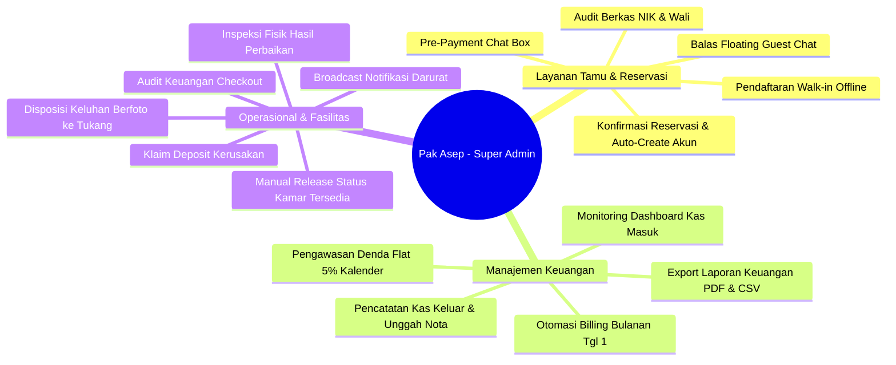
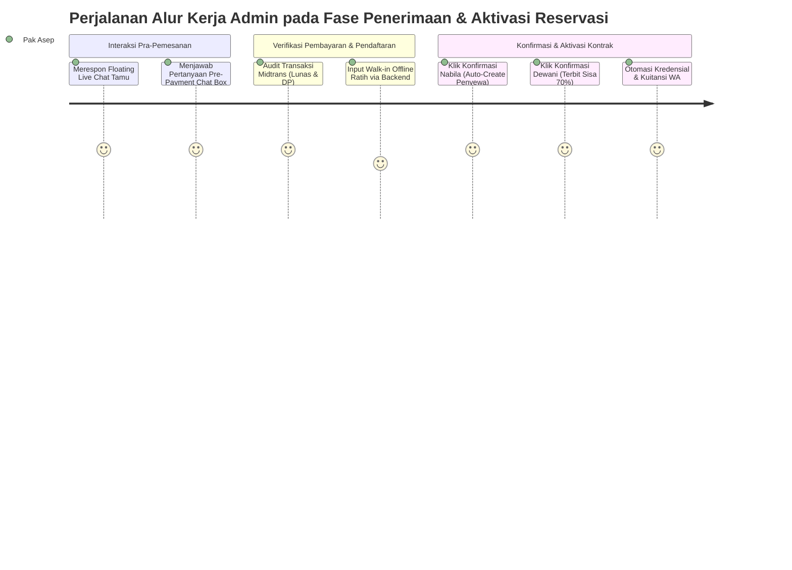
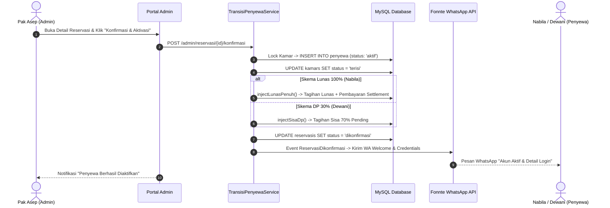
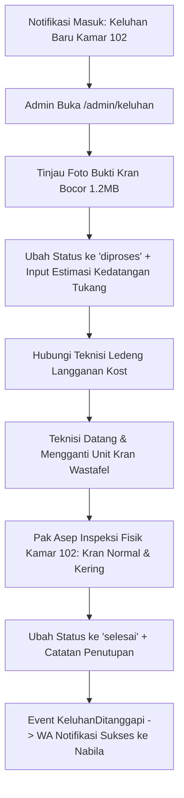

# Skenario Cerita Alur Kerja Admin (End-to-End Admin Lifecycle Scenario)
## Proyek: Asri Boarding House (Laravel 11, MySQL 8.x, Midtrans Snap, & Fonnte WA API)

---

## 📌 Pengantar & Gambaran Umum Skenario Admin

Dokumen ini menyajikan narasi operasional harian komprehensif (*End-to-End Administrator Lifecycle Scenario*) dari sudut pandang **Pengelola / Administrator Kost (Pak Asep, 48 Tahun)** dalam mengelola operasional Asri Boarding House. Skenario ini mencakup seluruh spektrum pengelolaan properti digital: merespon konsultasi tamu via live chat, audit dan verifikasi reservasi online, pendaftaran manual calon penghuni walk-in/offline, pemantauan otomatisasi billing dan denda bulanan, penanganan keluhan fasilitas berfoto, pengiriman broadcast darurat multi-saluran, pelaksanaan checkout administratif dengan klaim pemotongan deposit kerusakan, pencatatan kas keluar operasional, hingga pelepasan status kamar secara manual pasca inspeksi fisik.

Skenario ini menyoroti bagaimana platform web Laravel 11 mengotomatisasi beban kerja administratif Pak Asep, memangkas risiko *human-error*, dan menjamin transparansi akuntansi arus kas properti kost.

---

## 👥 Profil & Tanggung Jawab Operasional Administrator



* **Nama Pengelola / Owner**: **Pak Asep (48 Tahun)**.
* **Peran Sistem (Role)**: `admin` (Super Administrator & Property Manager).
* **Karakteristik & Nilai Kerja**: Disiplin, teliti dalam pencatatan keuangan, responsif terhadap kebutuhan penyewa, dan mengutamakan pemeliharaan aset properti.
* **Tanggung Jawab Utama**:
  1. **Layanan Tamu & Pra-Pemesanan**: Menjawab pertanyaan calon penghuni pada *Floating Guest Live Chat* dan *Pre-Payment Chat Box*.
  2. **Audit & Aktivasi Reservasi**: Memverifikasi dokumen identitas calon penyewa (NIK & Kontak Wali) serta mengaktifkan kontrak sewa.
  3. **Pendaftaran Manual Walk-in**: Mendaftarkan calon penyewa yang datang langsung atau memesan via WhatsApp pribadi ke sistem backend.
  4. **Pengawasan Billing & Denda**: Memantau penerbitan invoice bulanan otomatis oleh Laravel Scheduler, masa toleransi, dan penegakan denda flat 5% kalender.
  5. **Disposisi Keluhan & Maintenance**: Meninjau foto kerusakan fasilitas, memanggil teknisi/tukang, memperbarui progress perbaikan, dan menutup tiket keluhan.
  6. **Komunikasi Publik & Broadcast**: Mengirimkan pengumuman darurat atau operasional secara simultan melalui Web Portal, WhatsApp Gateway (Fonnte API), dan Email.
  7. **Checkout, Audit Deposit & Inspeksi Fisik**: Memeriksa kelunasan tagihan, memvalidasi klaim kerusakan fasilitas, memproses pengembalian sisa deposit via m-banking, mencatat kas keluar, dan melepaskan kunci kamar secara manual setelah kamar bersih.

---

## 📍 Bagian 1: Penerimaan Tamu & Aktivasi Reservasi Awal (Bulan ke-0 / Juli 2026)



---

### 1. Penanganan Jalur 1: Google OAuth 2.0 (Penyewa: Nabila - Kamar 102)

#### Langkah 1.1: Merespon Floating Guest Live Chat
* Pada **15 Juli 2026 pukul 14.15 WIB**, Pak Asep sedang memantau panel admin di laptopnya. Notifikasi badge merah berbunyi pada menu **Guest Chat** (`/admin/guest-chats`).
* Pak Asep membuka thread obrolan tamu baru yang berasal dari pengunjung landing page (Nabila) dengan token sesi anonim:
  > *"Halo admin, apakah lingkungan kost aman untuk mahasiswi yang sering pulang malam karena tugas lab?"*
* Pak Asep mengetikkan balasan langsung dari konsol admin:
  > *"Halo Kak! Sangat aman, gerbang kost menggunakan akses kartu khusus dan area lorong serta parkiran terpantau kamera CCTV 24 jam."*
* Jawaban tersebut terkirim seketika ke widget obrolan di layar Nabila.

#### Langkah 1.2: Komunikasi Pra-Pembayaran via Pre-Payment Chat Box
* Pukul 14.40 WIB, Nabila telah membuat reservasi untuk **Kamar 102** dengan `order_id: RSV-1-1721045678-8921` berstatus `pending`.
* Pak Asep membuka halaman Detail Reservasi (`/admin/reservasi/{id}`). Di bagian bawah, Pak Asep melihat pesan baru pada komponen **Pre-Payment Chat Box**:
  > *"Selamat sore Pak Asep, untuk Kamar 102 apakah sudah termasuk sprei kasur dan ember kamar mandi?"*
* Pak Asep membalas:
  > *"Sore Mbak Nabila. Sprei baru dan perlengkapan ember sudah disiapkan lengkap di dalam kamar. Mbak Nabila cukup membawa koper pakaian saja."*

#### Langkah 1.3: Pemantauan Pembayaran Otomatis Midtrans Lunas 100%
* Sepuluh menit kemudian, sistem webhook Midtrans menerima pembayaran Virtual Account Mandiri dari Nabila senilai **Rp17.800.000** (Sewa 12 Bulan Rp16.800.000 + Deposit Rp1.000.000).
* Pak Asep melihat status reservasi Nabila di tabel data reservasi secara otomatis berubah dari `pending` menjadi **`lunas`**. Pak Asep tidak perlu melakukan konfirmasi mutasi bank secara manual.

---

### 2. Penanganan Jalur 2: Registrasi Akun Manual & DP 30% (Penyewa: Dewani - Kamar 105)

#### Langkah 2.1: Pemantauan Pembayaran DP via QRIS
* Pada **16 Juli 2026**, Pak Asep menerima notifikasi di dashboard bahwa ada reservasi baru untuk **Kamar 105** atas nama Dewani Safitri dengan status **`dp`**.
* Pak Asep membuka detail reservasi dan memeriksa data keuangan:
  * Total Biaya Sewa 1 Tahun: Rp9.000.000.
  * Uang Deposit Jaminan: Rp1.000.000.
  * DP 30% yang Dibayar: **Rp3.700.000** (Rp2.700.000 sewa + Rp1.000.000 deposit). Status pembayaran Midtrans: `settlement` via QRIS.
  * Sisa Kewajiban yang Belum Terbayar: **Rp6.300.000**.
* Pak Asep menandai data ini siap untuk diaudit dan diaktivasi.

---

### 3. Penanganan Jalur 3: Pendaftaran Offline Walk-in (Penyewa: Ratih - Kamar 203)

#### Langkah 3.1: Konsultasi WhatsApp & Pengecekan Mutasi Bank
* Pada **18 Juli 2026**, Pak Asep menerima pesan WhatsApp di ponsel pribadinya dari calon penyewa baru bernama Ratih Kusuma Dewi yang menanyakan ketersediaan kamar ber-AC di lantai 2.
* Pak Asep membuka menu **Manajemen Kamar** di portal admin dan melihat Kamar 203 (Lantai 2 Balkon) berstatus `tersedia`.
* Pak Asep menginfokan tarif sewa Rp1.400.000/bulan + deposit Rp1.000.000. Ratih setuju dan mengirimkan data KTP, kontak wali, serta bukti transfer ATM senilai **Rp2.400.000** ke rekening BCA kost.
* Pak Asep membuka aplikasi BCA Mobile miliknya dan memastikan dana Rp2.400.000 telah masuk mutasi rekening.

#### Langkah 3.2: Pendaftaran Manual Penyewa di Portal Admin (`AdminPenyewaService::registerPenyewa`)
* Pak Asep membuka Portal Admin -> Menu **Manajemen Penyewa** -> Mengklik tombol **"Pendaftaran Manual Penyewa (Walk-in/Offline)"** (`/admin/penyewa/create`).
* Pak Asep mengisi formulir pendaftaran:
  * Nama Lengkap: `Ratih Kusuma Dewi`
  * Email: `ratih.kusuma@gmail.com`
  * Nomor WhatsApp: `085799990000`
  * NIK: `3374023456780003`
  * Nomor Kamar: Memilih `Kamar 203` dari dropdown kamar tersedia.
  * Tipe Sewa: `Bulanan`, Durasi: `12 Bulan` (Tanggal Masuk: 1 Agustus 2026).
  * Harga Sewa: `Rp1.400.000` (*Disimpan permanen sebagai immutable tenant rate*).
  * Uang Deposit: `Rp1.000.000`.
  * Kontak Wali: `Harto Kusumo (Ayah)` - `085711112222`.
  * Bukti Pembayaran: Mengunggah foto struk ATM Ratih.
* Pak Asep menekan tombol **"Simpan Data Penyewa"**.
* **Eksekusi Backend Otomatis**:
  1. Sistem membuat user `users` baru dengan password awal ter-hash dari nomor HP Ratih dan flag `require_password_change = true`.
  2. Sistem mengunci Kamar 203 dengan row-level lock dan mengubah status Kamar 203 menjadi **`terisi`**.
  3. `BillingService::injectManualPenyewaLunas` secara otomatis menerbitkan tagihan bulan pertama sebagai **`lunas`** dan mencatat record `pembayarans` kas masuk (`cash_confirmed`).
  4. Memicu job antrean `KirimWelcomeMessageJob` yang memerintahkan Fonnte API mengirimkan pesan WhatsApp selamat datang berisi kredensial akun ke nomor Ratih.
* Pak Asep menerima alert sukses: *"Penyewa Ratih Kusuma Dewi berhasil didaftarkan dan kredensial login telah dikirimkan via WhatsApp."*

---

## 🔒 Bagian 2: Fase Audit & Konfirmasi Reservasi Online oleh Admin

*Pada tanggal **20 Juli 2026**, Pak Asep menyelesaikan proses audit dokumen reservasi online untuk Nabila dan Dewani.*



### 1. Mengonfirmasi Reservasi Nabila (Lunas 100%)
* Pak Asep membuka menu **Manajemen Reservasi** (`/admin/reservasi`), memfilter status `lunas`, dan memilih reservasi Nabila.
* Pak Asep mengaudit NIK (16 digit) dan kelayakan nomor wali.
* Pak Asep mengisi form catatan admin: *"Berkas lengkap dan pembayaran lunas via Midtrans VA Mandiri."*
* Pak Asep menekan tombol **"Konfirmasi Reservasi & Aktivasi Penyewa"**.
* Sistem secara transaksional (`TransisiPenyewaService::transisi`) membuat profil penyewa aktif untuk Nabila, mengubah status Kamar 102 menjadi **`terisi`**, mencatat tagihan lunas bulan Agustus, mengubah status reservasi menjadi **`dikonfirmasi`**, dan mengirimkan pesan WhatsApp konfirmasi selamat datang ke Nabila via Fonnte API.

### 2. Mengonfirmasi Reservasi Dewani (DP 30%)
* Pak Asep memilih reservasi Dewani (status `dp`).
* Pak Asep memverifikasi dokumen Dewani dan mengklik tombol **"Konfirmasi Reservasi & Aktivasi Penyewa"**.
* Sistem membuat profil penyewa aktif untuk Dewani di Kamar 105 (status Kamar 105 berubah menjadi **`terisi`**), mengupdate reservasi menjadi **`dikonfirmasi`**, dan secara otomatis memanggil `BillingService::injectSisaDp` untuk menerbitkan tagihan pelunasan sisa sewa 70% (**Rp6.300.000**) dengan jatuh tempo 10 Agustus 2026.
* Fonnte API mengirimkan pesan WhatsApp ke Dewani berisi rincian akun aktif dan tautan tagihan pelunasan.
* Pada tanggal **28 Juli 2026**, Pak Asep memantau di menu **Manajemen Pembayaran** bahwa Dewani telah melunasi tagihan sisa Rp6.300.000 via Midtrans Snap sebelum hari pertama masuk kost.

---

## 📅 Bagian 3: Fase Siklus Tinggal & Pemantauan Billing Bulanan (Bulan ke-1 s.d. Bulan ke-11)

### 1. Monitoring Otomasi Billing Bulanan (Setiap Tanggal 1, Pukul 00:05 WIB)
* Pak Asep tidak perlu lagi mengetik atau membuat invoice sewa secara manual satu per satu.
* Pada tanggal **1 September 2026 pukul 00:05 WIB**, cron scheduler server menjalankan perintah `php artisan tagihan:generate-bulanan`.
* Pada pagi harinya, Pak Asep membuka **Dashboard Keuangan Admin** (`/admin/dashboard` & `/admin/tagihan`) dan melihat rekap tagihan bulan September telah terbit otomatis:
  * Kamar 102 (Nabila): Tagihan baru Rp1.400.000 (status `pending`).
  * Kamar 105 (Dewani): Tagihan baru Rp750.000 (status `pending`).
  * Kamar 203 (Ratih): Tagihan baru Rp1.400.000 (status `pending`).
* Pak Asep membuka tab **Log Notifikasi** (`/admin/notifikasi`) dan memverifikasi bahwa Fonnte API telah berhasil mengirimkan link invoice PDF ke WhatsApp seluruh penyewa aktif dengan status `sent`.

---

### 2. Monitoring Pembayaran Tepat Waktu (Nabila)
* Pada tanggal 3 September 2026, Pak Asep melihat di dashboard bahwa tagihan Nabila telah berubah menjadi **`lunas`** melalui kanal pembayaran GoPay (Midtrans).
* Sistem secara otomatis mengkreditkan nominal Rp1.400.000 ke dalam grafik pemasukan kas bulan September tanpa perlu intervensi manual dari Pak Asep.

---

### 3. Monitoring Masa Toleransi Keterlambatan (Dewani - Oktober 2026)
* Pada tanggal **11 Oktober 2026**, batas grace period jatuh tempo tanggal 10 telah terlewati.
* Pak Asep memeriksa daftar tagihan dan melihat tagihan Dewani berstatus **`terlambat`** dengan nilai `nominal_denda: Rp0` (karena masih berada di bulan kalender Oktober).
* Pak Asep melihat di log notifikasi bahwa sistem harian `tagihan:proses-keterlambatan` telah mengirimkan pesan *WhatsApp Reminder Sopan* secara otomatis ke ponsel Dewani.
* Pada tanggal **15 Oktober 2026**, Pak Asep melihat tagihan Dewani telah lunas senilai Rp750.000 via QRIS Midtrans. Pak Asep mencatat bahwa penegakan masa toleransi berjalan harmonis tanpa komplain dari penyewa.

---

### 4. Penanganan Kasus Menunggak, Denda Kalender & Eskalasi Wali (Ratih)

#### A. Penerapan Denda Flat 5% Kalender (1 Januari 2027)
* Pada tanggal **1 Januari 2027**, Pak Asep membuka menu tagihan menunggak.
* Sistem mendeteksi tagihan sewa Ratih bulan Desember 2026 belum terbayar.
* Karena telah berganti bulan kalender (Januari 2027), sistem otomatis menerapkan denda flat 5% (Rp70.000) pada record tagihan Desember Ratih. Total kewajiban tagihan Desember Ratih di sistem membengkak menjadi **Rp1.470.000**.
* Sistem mengirimkan pesan WhatsApp peringatan denda ke nomor Ratih.

#### B. Eskalasi WhatsApp ke Wali Penyewa (1 Februari 2027)
* Memasuki tanggal **1 Februari 2027**, Pak Asep mendapati tagihan Desember Ratih masih belum lunas (`bulan_keterlambatan > 1`).
* Scheduler sistem mengeksekusi aturan eskalasi dengan mengirimkan pesan WhatsApp resmi langsung ke nomor ayah Ratih (**Pak Harto Kusumo**).
* Pada tanggal **5 Februari 2027**, Pak Harto menghubungi Pak Asep via WhatsApp mengonfirmasi bahwa anandanya telah diingatkan. Beberapa saat kemudian, sistem menerima notifikasi pelunasan online sebesar **Rp1.470.000** dari Ratih. Tunggakan dan denda terselesaikan dengan tertib.

---

## 🔧 Bagian 4: Manajemen Keluhan & Disposisi Pemeliharaan (Bulan ke-8 / April 2027)



*Pada tanggal **10 April 2027 pukul 13.00 WIB**, timbul kendala teknis fasilitas di kamar Nabila.*

* **Langkah 1: Menerima & Meninjau Laporan Keluhan**:
  * Pak Asep menerima notifikasi WhatsApp instan dari Fonnte API mengenai adanya pengaduan baru dari Nabila (Kamar 102).
  * Pak Asep membuka menu **Manajemen Keluhan** (`/admin/keluhan/show/{id}`).
  * Pak Asep melihat foto bukti `kran_bocor.jpg` berukuran 1.2 MB dengan resolusi jernih yang memperlihatkan kebocoran pada sambungan drat pipa wastafel.
* **Langkah 2: Disposisi Penanganan & Update Status**:
  * Pak Asep segera menghubungi teknisi ledeng langganan kost (Pak Joko) agar datang pukul 14.00 WIB.
  * Pak Asep mengupdate status keluhan menjadi **`diproses`** dan mengisi formulir tanggapan admin:
    > *"Tukang ledeng (Pak Joko) sedang menuju ke kamar Anda pukul 14.00 WIB untuk mengganti seal tape dan drat kran yang aus. Mohon pastikan ada orang di kamar atau izin masuk diberikan."*
  * Sistem otomatis mengirimkan pesan WhatsApp ke Nabila mengabarkan bahwa perbaikan sedang meluncur.
* **Langkah 3: Inspeksi Hasil & Penutupan Keluhan**:
  * Pukul 14.45 WIB, setelah teknisi menyelesaikan pemasangan kran baru, Pak Asep mendatangi Kamar 102 untuk menginspeksi langsung: kran berfungsi sempurna tanpa tetesan air.
  * Pak Asep kembali ke portal admin, mengubah status keluhan menjadi **`selesai`**, dan memasukkan tanggapan penutup:
    > *"Perbaikan sambungan kran wastafel telah selesai dilakukan oleh teknisi dan telah diuji coba berfungsi normal."*
  * Database mencatat `tanggal_selesai = now()`, dan Nabila menerima notifikasi WhatsApp bahwa tiket keluhannya telah selesai diselesaikan.

---

## 📢 Bagian 5: Pengiriman Broadcast Pengumuman Multi-Saluran (Bulan ke-10 / Juni 2027)

*Pada tanggal **15 Juni 2027**, Pak Asep menerima jadwal fogging DBD dari kelurahan.*

* **Langkah 1: Menyusun Pesan Broadcast**:
  * Pak Asep membuka Portal Admin -> Menu **Manajemen Notifikasi** (`/admin/notifikasi`).
  * Pada form Broadcast Pengumuman, Pak Asep memasukkan judul: `Jadwal Fogging Nyamuk DBD & Himbauan Keamanan Kamar`.
  * Target Penerima: Memilih `Semua Penyewa Aktif`.
  * Saluran Komunikasi: Mencentang ketiga opsi: **Posting ke Web Portal**, **WhatsApp Broadcast**, dan **Email Broadcast**.
  * Isi Pesan: Menuliskan instruksi penutupan makanan, mematikan listrik, dan pengamanan barang berharga.
* **Langkah 2: Eksekusi Pengiriman Asinkron**:
  * Pak Asep mengklik tombol **"Kirim Broadcast"**.
  * Sistem (`NotifikasiController::broadcast`) langsung mempublikasikan pengumuman di web portal penyewa (`pengumumans.is_active = true`), dan mendaftarkan job antrean `KirimNotifikasiKustomJob` untuk pengiriman WA dan Email secara bertahap dengan jeda aman 2 detik antar pesan.
* **Langkah 3: Pemantauan Log Audit**:
  * Pak Asep memantau tabel log pengiriman di halaman yang sama (`log_notifikasis`). Semua pesan tercatat terkirim sukses tanpa hambatan.

---

## 🚪 Bagian 6: Fase Check-Out, Klaim Kerusakan & Pelepasan Status Kamar (Bulan ke-12 / Juli 2027)

```mermaid
flowchart TD
    A[31 Juli 2027: Akhir Kontrak Sewa 12 Bulan] --> B[Admin Buka /admin/penyewa/{id}/checkout]
    B --> C{Audit Tagihan Belum Lunas}
    C -->|unpaidBillsCount > 0| D[Ditolak: Lunasi Tagihan Dulu]
    C -->|unpaidBillsCount == 0| E[Inspeksi Fisik Kamar bersama Penyewa]
    E --> F{Kondisi Kamar?}
    F -->|Kamar 102 & 203: Bagus| G[Pilih 'Tidak Ada Kerusakan' -> Refund Deposit 100%]
    F -->|Kamar 105: Cermin Lemari Pecah| H[Pilih 'Ada Kerusakan' -> Input Potongan Rp250.000 + Upload Nota Estimasi]
    G --> I[Sistem Catat Kas Keluar Operasional Rp1.000.000]
    H --> J[Sistem Catat Kas Keluar Maintenance Rp250.000 + Kas Keluar Operasional Rp750.000]
    I --> K[Penyewa Nonaktif, Akun User Disabled, Deposit Diselesaikan = 0]
    J --> K
    K --> L[Transfer m-Banking ke Rekening Pribadi Penyewa]
    L --> M[Catatan Kritis: Status Kamar TETAP 'terisi' di Database]
    M --> N[Tim Kebersihan Kost Membersihkan & Mensterilkan Kamar]
    N --> O[Pak Asep Buka /admin/kamar -> MANUAL Ubah Status ke 'tersedia']
    O --> P[Kamar Tayang Kembali di Katalog Landing Page Publik]
```

*Pada tanggal **31 Juli 2027**, masa kontrak sewa 12 bulan berakhir. Pak Asep memproses prosedur kepulangan para penghuni.*

---

### 1. Checkout Nabila (Kamar 102) & Ratih (Kamar 203) - Bebas Kerusakan
* Pak Asep membuka menu **Manajemen Penyewa** (`/admin/penyewa`), mencari nama Nabila Anindya, dan mengklik tombol **"Checkout Penyewa"** (`/admin/penyewa/{id}/checkout`).
* **Pemeriksaan Finansial Sistem**: Backend memverifikasi tidak ada tagihan tertunggak (`tagihan pending/terlambat == 0`).
* Pak Asep mendatangi Kamar 102 bersama Nabila untuk memeriksa inventaris: AC, kasur, lemari, meja, dan kamar mandi semuanya dalam kondisi baik dan bersih.
* Pak Asep memilih opsi `Apakah ada kerusakan? = TIDAK`, lalu mengklik **"Proses Checkout"**.
* **Eksekusi Backend (`PenyewaController::processCheckout`)**:
  1. Status penyewa Nabila diubah menjadi **`nonaktif`**, `tanggal_keluar = '2027-07-31'`, dan `deposit = 0`.
  2. Akun `users` Nabila dinonaktifkan (`is_active = 0`).
  3. Mencatat arus kas keluar pada tabel `pengeluarans`:
     * Nama: `Pengembalian Jaminan Deposit Penyewa: Nabila Anindya`
     * Kategori: `operasional`, Nominal: `Rp1.000.000`.
* Pak Asep membuka m-banking Mandiri dan mentransfer uang deposit sebesar Rp1.000.000 ke rekening Nabila.
* Prosedur yang sama dilakukan untuk **Ratih (Kamar 203)**: pengembalian penuh deposit Rp1.000.000 via transfer BCA.

---

### 2. Checkout Dewani (Kamar 105) - Klaim Pemotongan Deposit Kerusakan Cermin
* Pak Asep membuka form checkout untuk Dewani Safitri (Kamar 105). Seluruh tagihan bulanan Dewani dipastikan telah berstatus `lunas`.
* Pak Asep melakukan inspeksi fisik di Kamar 105 dan mendapati cermin rias pintu lemari pecah akibat benturan koper.
* Pak Asep dan Dewani menyepakati estimasi biaya penggantian kaca cermin sebesar **Rp250.000**.
* Pak Asep mengisi form checkout di portal admin:
  * `Apakah ada kerusakan fasilitas? = YA (1)`
  * `Nominal Potongan Perbaikan`: `Rp250.000` (sistem memvalidasi nominal tidak melebihi deposit Rp1.000.000).
  * `Bukti Nota / Estimasi Tukang`: Mengunggah foto nota pembelian kaca `nota_kaca_lemari.jpg`.
  * `Keterangan Detail`: *"Penggantian kaca cermin pintu lemari pakaian Kamar 105 yang pecah retak."*
* Pak Asep mengklik tombol **"Proses Checkout"**.
* **Eksekusi Backend Transaksional (`PenyewaController::processCheckout`)**:
  1. Menghitung sisa deposit pengembalian: Rp1.000.000 - Rp250.000 = **Rp750.000**.
  2. Mencatat kas keluar perbaikan: `Pengeluaran` (Kategori: `maintenance`, Nominal: `Rp250.000`, Foto: `nota_kaca_lemari.jpg`).
  3. Mencatat kas keluar refund: `Pengeluaran` (Kategori: `operasional`, Nominal: `Rp750.000`).
  4. Menonaktifkan status penyewa Dewani (`nonaktif`, `deposit = 0`, `tanggal_keluar = '2027-07-31'`) dan menonaktifkan akun login (`is_active = 0`).
* Pak Asep mentransfer sisa uang jaminan deposit sebesar **Rp750.000** ke rekening Dewani. Dewani menerima transparansi pemotongan ini dengan sangat baik.

---

### 3. Ekspor Laporan Keuangan Tahunan (Dompdf & CSV Export)
* Setelah seluruh transaksi operasional dan checkout selesai dicatat di sistem, Pak Asep membuka menu **Laporan Keuangan** (`/admin/laporan`).
* Pak Asep memilih rentang periode 1 Agustus 2026 s.d. 31 Juli 2027.
* Dashboard menyajikan neraca konsolidasi laba bersih:
  * Total Pemasukan Bersih (Sewa Reservasi + Tagihan Bulanan): **Rp34.800.000**.
  * Total Pengeluaran Kas (Operasional, Maintenance, Refund Deposit): **Rp4.550.000**.
  * **Laba Bersih Riil Properti**: **Rp30.250.000**.
* Pak Asep mengklik tombol **"Export PDF Laporan"**: Sistem (`PdfGeneratorInterface` / `DompdfGenerator`) mengompilasi laporan format A4 Landscape resmi berstempel digital.
* Pak Asep juga mengklik **"Export CSV/Excel"** untuk arsip pembukuan spreadsheet akuntansi kost.

---

### 4. Protokol Penahanan Kamar (Manual Inspection Hold) & Pelepasan Status Kamar
* **Kaidah Bisnis Mutlak**: Pasca checkout penyewa selesai di sistem, **status Kamar 102, 105, dan 203 di database TIDAK berubah otomatis menjadi `tersedia`**. Status kamar tetap **`terisi`** (atau terkunci).
* Pada **1 Agustus 2027 pagi**, tim kebersihan kost membersihkan seluruh kamar, mengganti kaca lemari Kamar 105, mengepel, dan mensterilkan ruangan.
* Setelah Pak Asep memastikan kamar telah 100% siap huni, Pak Asep membuka Portal Admin -> Menu **Manajemen Kamar** (`/admin/kamar`).
* Pak Asep mengedit data Kamar 102, 105, dan 203, lalu secara **MANUAL** mengubah dropdown status kamar dari `terisi` menjadi **`tersedia`**.
* `KamarObserver::updated` membersihkan cache memori landing page via `Cache::forget('kamar_aktif_landing')`.
* Kamar-kamar tersebut seketika kembali tampil aktif di landing page utama website Asri Boarding House, siap menerima calon penyewa baru untuk siklus berikutnya.

---

## 📊 Matriks Pemetaan Tindakan Admin & State Database Lengkap

| Peristiwa / Modul Operasional | Tindakan Langsung Admin (Pak Asep) | Status Kamar | Status Reservasi | Status Penyewa | Status Tagihan / Kas | Eksekusi Event & Job Laravel |
| :--- | :--- | :---: | :---: | :---: | :---: | :--- |
| **Guest Live Chat** | Membalas pesan tamu dari konsol admin `/admin/guest-chats` | `tersedia` | *Belum ada* | *Belum ada* | - | `GuestChatApiController` |
| **Pre-Payment Chat Box** | Menjawab pertanyaan di detail reservasi `/admin/reservasi/{id}` | `tersedia (locked)`| `pending` | *Belum ada* | - | `ChatController::send` |
| **Reservasi Online Masuk** | Memantau mutasi pembayaran otomatis Midtrans di dashboard | `tersedia (locked)`| `lunas` / `dp`| *Belum ada* | `settlement` | `ReservasiDibayar` |
| **Konfirmasi Reservasi Lunas**| Audit berkas NIK & Wali lalu klik "Konfirmasi & Aktivasi" | `terisi` | `dikonfirmasi` | `aktif` | `lunas` (Bulan 1) | `TransisiPenyewaService`, `PembayaranBerhasil` |
| **Konfirmasi Reservasi DP** | Audit berkas lalu klik "Konfirmasi & Aktivasi" (Terbit Sisa 70%)| `terisi` | `dikonfirmasi` | `aktif` | `pending` (Sisa 70%) | `BillingService::injectSisaDp`, `TagihanDibuat` |
| **Pendaftaran Walk-in Offline**| Input data manual di `/admin/penyewa/create` & unggah bukti struk| `terisi` | *Bypass (Null)* | `aktif` | `lunas` (Bulan 1) | `AdminPenyewaService`, `KirimWelcomeMessageJob` |
| **Billing Bulanan (Tgl 1)** | Memantau dashboard keuangan & rekap tagihan yang terbit otomatis| `terisi` | - | `aktif` | `pending` | `GenerateBulananTagihan`, `TagihanDibuat` |
| **Toleransi Jatuh Tempo** | Mengawasi reminder otomatis WhatsApp tanpa mengenakan denda | `terisi` | - | `aktif` | `terlambat` (Denda Rp0)| `ProsesKeterlambatanTagihan`, `ReminderPenyewa` |
| **Penerapan Denda Kalender** | Memantau penambahan denda flat 5% kalender di bulan baru | `terisi` | - | `aktif` | `terlambat` (+5% Denda)| `BillingService::prosesKeterlambatan`, `DendaDikenakan`|
| **Eskalasi Tunggakan Wali** | Menghubungi penyewa/wali saat tagihan menunggak >1 bulan | `terisi` | - | `aktif` | `terlambat` (+5% Denda)| `NotifikasiWali` (WA ke Nomor Wali) |
| **Penanganan Keluhan Fasilitas**| Tinjau foto kerusakan, panggil tukang, update progress `diproses`| `terisi` | - | `aktif` | - | `KeluhanDitanggapi` (WA ke Penyewa) |
| **Penyelesaian Keluhan** | Inspeksi hasil kerja tukang, ubah status keluhan ke `selesai` | `terisi` | - | `aktif` | - | `KeluhanController::update` |
| **Broadcast Pengumuman** | Menulis draf pengumuman dan kirim via Web, WA, dan Email | `terisi` | - | `aktif` | - | `KirimNotifikasiKustomJob` (Jeda 2 detik) |
| **Checkout Bebas Kerusakan** | Audit tagihan lunas, klik checkout, transfer manual refund deposit | `terisi (locked)`| - | `nonaktif` | Kas Keluar Operasional | `PenyewaController::processCheckout` |
| **Checkout Klaim Kerusakan** | Audit tagihan, input potongan Rp250rb + nota, transfer sisa refund | `terisi (locked)`| - | `nonaktif` | Kas Maintenance + Operasional | `Pengeluaran::create` (Maintenance & Operasional) |
| **Ekspor Laporan Keuangan** | Download PDF A4 Landscape & CSV/Excel konsolidasi arus kas | `terisi (locked)`| - | `nonaktif` | Rekap Laba Bersih | `PdfGeneratorInterface::generate` |
| **Manual Release Status Kamar**| Inspeksi fisik kamar bersih, lalu MANUAL ubah status ke "tersedia"| `tersedia` | - | `nonaktif` | - | `KamarObserver::updated` (Clear Landing Cache) |

---
*Dokumen ini merupakan spesifikasi narasi alur kerja administrator resmi untuk platform Asri Boarding House dan selaras 100% dengan implementasi kode sumber Laravel 11, skema database MySQL 8.x, serta diagram arsitektur teknis sistem.*
