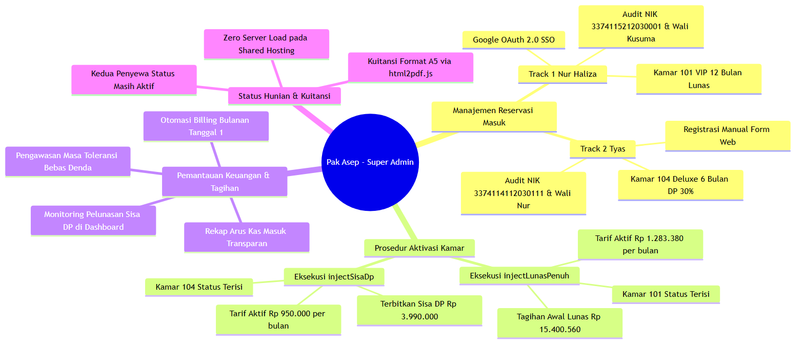
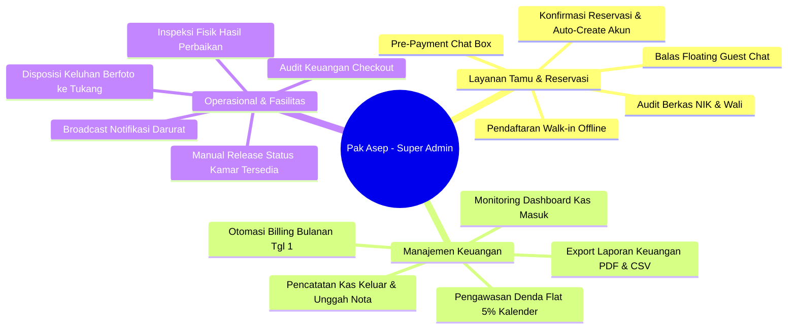
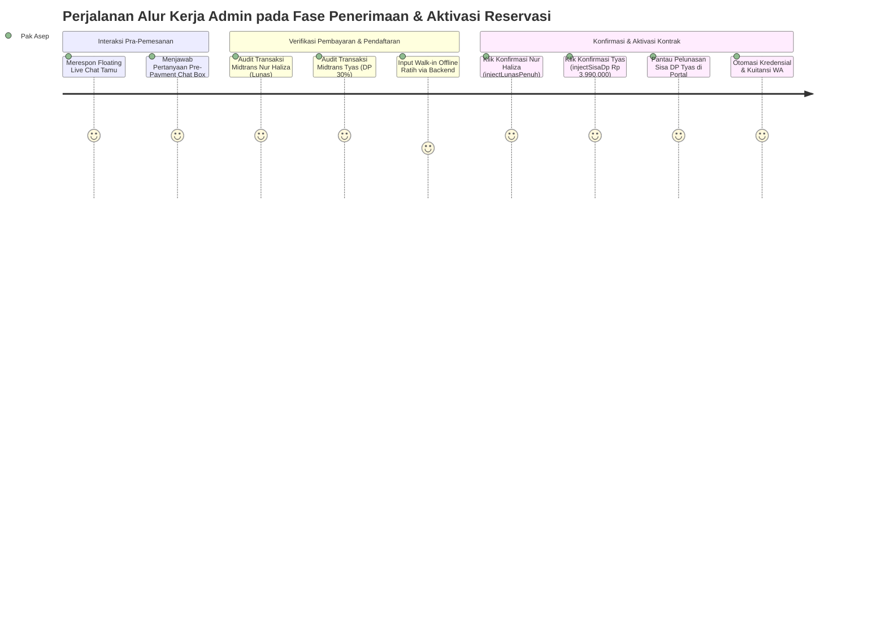
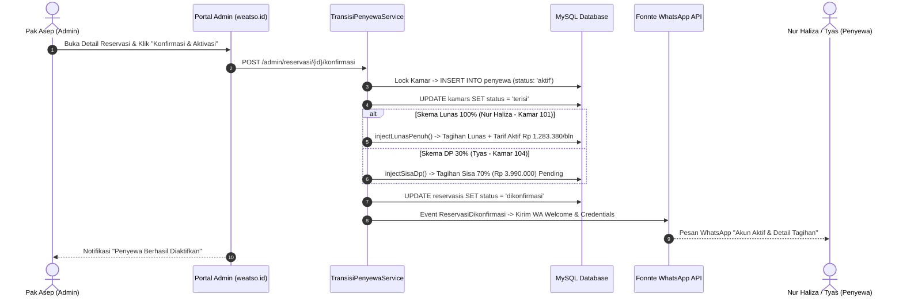
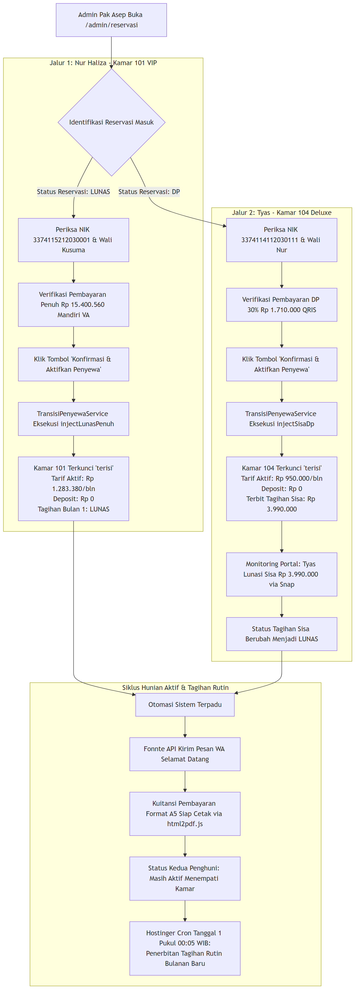
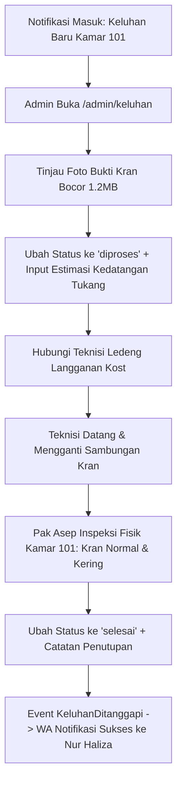
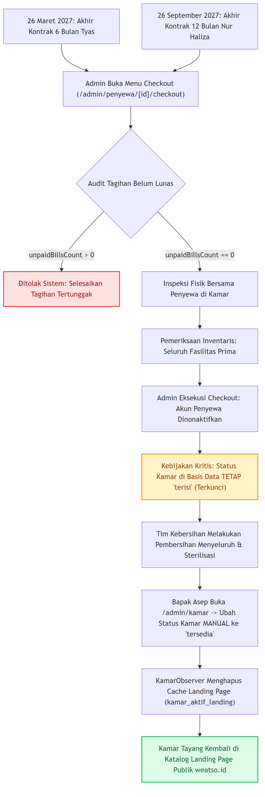

# Skenario Cerita Alur Kerja Admin (End-to-End Admin Lifecycle Scenario)
## Proyek: Asri Boarding House (Laravel 11, MySQL 8.x, Midtrans Snap, & Fonnte WA API)
**Edisi Produksi Live (https://asriboardinghouse.weatso.id/) — Data Riil Transaksi Produksi**

---

## 📌 Pengantar & Gambaran Umum Skenario Admin

Dokumen ini menyajikan narasi operasional harian komprehensif (*End-to-End Administrator Lifecycle Scenario*) dari sudut pandang **Pengelola / Administrator Kost (Pak Asep, 48 Tahun)** dalam mengelola operasional Asri Boarding House melalui portal administrasi produksi live di **`https://asriboardinghouse.weatso.id/admin/`**. Skenario ini mencakup seluruh spektrum pengelolaan properti digital: merespon konsultasi tamu via live chat, audit dan verifikasi reservasi online, pendaftaran manual calon penghuni walk-in/offline, pemantauan otomatisasi billing dan denda bulanan, penanganan keluhan fasilitas berfoto, pengiriman broadcast darurat multi-saluran, pelaksanaan checkout administratif, pencatatan kas keluar operasional, hingga pelepasan status kamar secara manual pasca inspeksi fisik.

Skenario ini disusun **100% presisi berdasarkan rekaman data transaksi nyata pengujian di server produksi live**, menyoroti bagaimana platform web Laravel 11 mengotomatisasi beban kerja administratif Pak Asep, memangkas risiko *human-error*, dan menjamin transparansi akuntansi arus kas properti kost.

---

## 👥 Profil & Tanggung Jawab Operasional Administrator

*Berkas Diagram*: [Sumber Mermaid (.mmd)](file:///c:/xampp/htdocs/asri-boarding-house/Blueprint/Skenario/skenario_admin_mindmap_pengelolaan.mmd) | [Format PNG HD](file:///c:/xampp/htdocs/asri-boarding-house/Blueprint/Skenario/skenario_admin_mindmap_pengelolaan.png)




```mermaid
mindmap
  root((Pak Asep - Super Admin))
    Layanan Tamu & Reservasi
      Balas Floating Guest Chat
      Pre-Payment Chat Box
      Audit Berkas NIK & Wali
      Konfirmasi Reservasi & Auto-Create Akun
      Pendaftaran Walk-in Offline
    Manajemen Keuangan
      Monitoring Dashboard Kas Masuk
      Otomasi Billing Bulanan Tgl 1
      Pengawasan Denda Flat 5% Kalender
      Pencatatan Kas Keluar & Unggah Nota
      Export Laporan Keuangan PDF & CSV
    Operasional & Fasilitas
      Disposisi Keluhan Berfoto ke Tukang
      Inspeksi Fisik Hasil Perbaikan
      Broadcast Notifikasi Darurat
      Audit Keuangan Checkout
      Manual Release Status Kamar Tersedia
```

* **Nama Pengelola / Owner**: **Pak Asep (48 Tahun)**.
* **Peran Sistem (Role)**: `admin` (Super Administrator & Property Manager).
* **Domain Konsol Admin**: `https://asriboardinghouse.weatso.id/admin/login`
* **Karakteristik & Nilai Kerja**: Disiplin, teliti dalam pencatatan keuangan, responsif terhadap kebutuhan penyewa, dan mengutamakan pemeliharaan aset properti.
* **Tanggung Jawab Utama**:
  1. **Layanan Tamu & Pra-Pemesanan**: Menjawab pertanyaan calon penghuni pada *Floating Guest Live Chat* dan *Pre-Payment Chat Box*.
  2. **Audit & Aktivasi Reservasi**: Memverifikasi dokumen identitas calon penyewa (NIK & Kontak Wali) serta mengaktifkan kontrak sewa (baik skema lunas maupun DP).
  3. **Pendaftaran Manual Walk-in**: Mendaftarkan calon penyewa yang datang langsung atau memesan via WhatsApp pribadi ke sistem backend.
  4. **Pengawasan Billing & Denda**: Memantau penerbitan invoice bulanan otomatis oleh Laravel Scheduler (Hostinger Cron), masa toleransi, dan penegakan denda flat 5% kalender.
  5. **Disposisi Keluhan & Maintenance**: Meninjau foto kerusakan fasilitas, memanggil teknisi/tukang, memperbarui progress perbaikan, dan menutup tiket keluhan.
  6. **Komunikasi Publik & Broadcast**: Mengirimkan pengumuman darurat atau operasional secara simultan melalui Web Portal, WhatsApp Gateway (Fonnte API), dan Email.
  7. **Checkout & Inspeksi Fisik**: Memeriksa kelunasan tagihan, memproses pengembalian deposit (jika ada), mencatat kas keluar, dan melepaskan kunci kamar secara manual setelah kamar bersih.

---

## 📍 Bagian 1: Penerimaan Tamu & Aktivasi Reservasi Awal (September 2026)


```mermaid
journey
    title Perjalanan Alur Kerja Admin pada Fase Penerimaan & Aktivasi Reservasi
    section Interaksi Pra-Pemesanan
      Merespon Floating Live Chat Tamu: 5: Pak Asep
      Menjawab Pertanyaan Pre-Payment Chat Box: 5: Pak Asep
    section Verifikasi Pembayaran & Pendaftaran
      Audit Transaksi Midtrans Nur Haliza (Lunas): 5: Pak Asep
      Audit Transaksi Midtrans Tyas (DP 30%): 5: Pak Asep
      Input Walk-in Offline Ratih via Backend: 4: Pak Asep
    section Konfirmasi & Aktivasi Kontrak
      Klik Konfirmasi Nur Haliza (injectLunasPenuh): 5: Pak Asep
      Klik Konfirmasi Tyas (injectSisaDp Rp 3.990.000): 5: Pak Asep
      Pantau Pelunasan Sisa DP Tyas di Portal: 5: Pak Asep
      Otomasi Kredensial & Kuitansi WA: 5: Pak Asep
```

---

### 1. Penanganan Jalur 1: Google OAuth 2.0 (Penyewa: Nur Haliza - Kamar 101)

#### Langkah 1.1: Merespon Floating Guest Live Chat
* Pada **25 September 2026 pukul 14.15 WIB**, Pak Asep sedang memantau panel admin di laptopnya (`https://asriboardinghouse.weatso.id/admin/guest-chats`). Notifikasi badge merah berbunyi pada menu **Guest Chat**.
* Pak Asep membuka thread obrolan tamu baru yang berasal dari pengunjung landing page (Nur Haliza) dengan token sesi anonim:
  > *"Halo admin, apakah Kamar 101 VIP tersedia untuk sewa 1 tahun mulai 26 September?"*
* Pak Asep mengetikkan balasan langsung dari konsol admin:
  > *"Halo Kak Nur Haliza! Kamar 101 VIP tersedia dan siap huni dengan fasilitas lengkap."*
* Jawaban tersebut terkirim seketika ke widget obrolan di layar Nur Haliza.

#### Langkah 1.2: Komunikasi Pra-Pembayaran via Pre-Payment Chat Box
* Pukul 14.40 WIB, Nur Haliza telah membuat reservasi untuk **Kamar 101 VIP** dengan `order_id: RSV-1-1727334000-8921` berstatus `pending`.
* Pak Asep membuka halaman Detail Reservasi (`/admin/reservasi/{id}`). Di bagian bawah, Pak Asep melihat pesan baru pada komponen **Pre-Payment Chat Box**:
  > *"Selamat sore Pak Asep, untuk Kamar 101 VIP apakah sudah termasuk sprei kasur dan ember kamar mandi?"*
* Pak Asep membalas:
  > *"Sore Mbak Nur Haliza. Sprei baru dan perlengkapan ember sudah disiapkan lengkap di dalam kamar. Mbak Nur Haliza cukup membawa koper pakaian saja."*

#### Langkah 1.3: Pemantauan Pembayaran Otomatis Midtrans Lunas 100%
* Sepuluh menit kemudian, sistem webhook Midtrans menerima pembayaran Virtual Account Mandiri dari Nur Haliza senilai **Rp 15.400.560** (Sewa 12 Bulan berdiskon durasi sewa, Deposit Rp 0).
* Pak Asep melihat status reservasi Nur Haliza di tabel data reservasi secara otomatis berubah dari `pending` menjadi **`lunas`**. Pak Asep tidak perlu melakukan konfirmasi mutasi bank secara manual.

---

### 2. Penanganan Jalur 2: Registrasi Akun Manual & DP 30% Durasi 6 Bulan (Penyewa: Tyas - Kamar 104)

#### Langkah 2.1: Pemantauan Pembayaran DP via QRIS
* Pada **25 September 2026**, Pak Asep menerima notifikasi di dashboard bahwa ada reservasi baru untuk **Kamar 104 (Tarif Rp 950.000/bln)** atas nama Tyas dengan status **`dp`** untuk durasi sewa **6 Bulan**.
* Pak Asep membuka detail reservasi dan memeriksa rincian data keuangan riil:
  * Total Biaya Sewa Pokok 6 Bulan (6 x Rp 950.000): **Rp 5.700.000**.
  * Uang Deposit Jaminan: **Rp 0**.
  * DP 30% Pokok yang Dibayar: **Rp 1.710.000**. Status pembayaran Midtrans: `settlement` via QRIS.
  * Sisa Kewajiban Pokok yang Belum Terbayar: **Rp 3.990.000** (70% dari pokok sewa 6 bulan).
* Pak Asep menandai berkas NIK `3374114112030111` dan wali Nur `082219575575` siap untuk diverifikasi dan diaktivasi.

---

### 3. Penanganan Jalur 3: Pendaftaran Offline Walk-in (Penyewa: Ratih - Kamar 203)

#### Langkah 3.1: Konsultasi WhatsApp & Pengecekan Mutasi Bank
* Pada **25 September 2026**, Pak Asep menerima pesan WhatsApp dari calon penyewa baru bernama Ratih Kusuma Dewi yang menanyakan ketersediaan Kamar 203 (Lantai 2 Deluxe Balkon) sewa 1 tahun mulai 26 September.
* Pak Asep menginfokan tarif sewa Rp 1.400.000/bulan + deposit Rp 1.000.000. Ratih setuju dan mentransfer dana **Rp 2.400.000** ke rekening BCA kost. Pak Asep memeriksa mutasi m-banking dan memastikan dana telah masuk.

#### Langkah 3.2: Pendaftaran Manual Penyewa di Portal Admin (`AdminPenyewaService::registerPenyewa`)
* Pak Asep membuka Portal Admin -> Menu **Manajemen Penyewa** -> Mengklik tombol **"Pendaftaran Manual Penyewa (Walk-in/Offline)"** (`/admin/penyewa/create`).
* Pak Asep menginput seluruh data Ratih, memilih Kamar 203, durasi 12 bulan (26 September 2026 s.d. 26 September 2027), harga sewa Rp 1.400.000, deposit Rp 1.000.000, dan mengunggah foto struk ATM.
* **Eksekusi Backend Otomatis**:
  1. Sistem membuat user `users` baru dengan password default nomor HP Ratih dan flag `require_password_change = true`.
  2. Sistem mengunci Kamar 203 menjadi **`terisi`**.
  3. `BillingService::injectManualPenyewaLunas` menerbitkan tagihan bulan pertama sebagai **`lunas`** (`cash_confirmed`). Kuitansi A5 siap di-render di browser via `html2pdf.js`.
  4. Fonnte API mengirimkan pesan WhatsApp selamat datang berisi kredensial akun ke nomor Ratih.

---

## 🔒 Bagian 2: Fase Audit & Konfirmasi Reservasi Online oleh Admin

*Pada tanggal **26 September 2026 pagi**, Pak Asep menyelesaikan proses audit dokumen reservasi online untuk Nur Haliza dan Tyas.*

*Berkas Diagram*: [Sumber Mermaid (.mmd)](file:///c:/xampp/htdocs/asri-boarding-house/Blueprint/Skenario/skenario_seq_aktivasi_reservasi.mmd) | [Format PNG HD](file:///c:/xampp/htdocs/asri-boarding-house/Blueprint/Skenario/skenario_seq_aktivasi_reservasi.png)



```mermaid
sequenceDiagram
    autonumber
    actor A as Pak Asep (Admin)
    participant AP as Portal Admin (weatso.id)
    participant S as TransisiPenyewaService
    participant DB as MySQL Database
    participant W as Fonnte WhatsApp API
    actor N as Nur Haliza / Tyas (Penyewa)

    A->>AP: Buka Detail Reservasi & Klik "Konfirmasi & Aktivasi"
    AP->>S: POST /admin/reservasi/{id}/konfirmasi
    S->>DB: Lock Kamar -> INSERT INTO penyewa (status: 'aktif')
    S->>DB: UPDATE kamars SET status = 'terisi'
    alt Skema Lunas 100% (Nur Haliza - Kamar 101)
        S->>DB: injectLunasPenuh() -> Tagihan Lunas + Tarif Aktif Rp 1.283.380/bln
    else Skema DP 30% (Tyas - Kamar 104)
        S->>DB: injectSisaDp() -> Tagihan Sisa 70% (Rp 3.990.000) Pending
    end
    S->>DB: UPDATE reservasis SET status = 'dikonfirmasi'
    S->>W: Event ReservasiDikonfirmasi -> Kirim WA Welcome & Credentials
    W-->>N: Pesan WhatsApp "Akun Aktif & Detail Tagihan"
    AP-->>A: Notifikasi "Penyewa Berhasil Diaktifkan"
```

### 1. Mengonfirmasi Reservasi Nur Haliza (Kamar 101 VIP - Lunas 100%)
* Pak Asep membuka menu **Manajemen Reservasi** (`/admin/reservasi`), memfilter status `lunas`, dan memilih reservasi Nur Haliza.
* Pak Asep mengaudit NIK `3374115212030001` dan kontak wali Kusuma `082219575575`.
* Pak Asep menekan tombol **"Konfirmasi Reservasi & Aktivasi Penyewa"**.
* Sistem secara transaksional (`TransisiPenyewaService::transisi`) membuat profil penyewa aktif untuk Nur Haliza dengan tarif sewa aktif **Rp 1.283.380 / bulan** (`Rp 15.400.560 / 12 bln`), mengubah status Kamar 101 menjadi **`terisi`**, mencatat tagihan lunas awal, mengubah status reservasi menjadi **`dikonfirmasi`**, dan Fonnte API mengirimkan pesan WhatsApp konfirmasi selamat datang.

### 2. Mengonfirmasi Reservasi Tyas (Kamar 104 Deluxe - DP 30%) & Monitoring Pelunasan Sisa
* Pak Asep memilih reservasi Tyas (status `dp`, pembayaran DP Rp 1.710.000 sukses).
* Pak Asep memverifikasi dokumen Tyas (NIK `3374114112030111`, Wali Nur `082219575575`) dan mengklik tombol **"Konfirmasi Reservasi & Aktivasi Penyewa"**.
* Sistem membuat profil penyewa aktif untuk Tyas di Kamar 104 (status Kamar 104 berubah menjadi **`terisi`**, tarif aktif Rp 950.000/bln), mengupdate reservasi menjadi **`dikonfirmasi`**, dan secara otomatis memanggil `BillingService::injectSisaDp` untuk menerbitkan tagihan pelunasan sisa sewa 70% (**Rp 3.990.000**) dengan jatuh tempo 6 Oktober 2026.
* Fonnte API mengirimkan pesan WhatsApp ke Tyas berisi rincian akun aktif dan tautan tagihan pelunasan sisa.
* **Monitoring Pelunasan Sisa DP**: Pada tanggal **26 September 2026 siang**, Pak Asep memantau di menu **Manajemen Pembayaran** (`/admin/pembayaran`) bahwa Tyas telah melunasi tagihan sisa sewa Rp 3.990.000 via Midtrans Snap (settlement) sebelum masuk hunian.
* Pak Asep memeriksa bahwa tagihan sisa tersebut telah berstatus **`lunas`**, dan kuitansi pembayaran format A5 telah diterbitkan secara instan via pustaka client-side **`html2pdf.js`**.

### 3. Diagram Alur Keputusan Aktivasi & Monitoring Penagihan

Diagram di bawah ini menggambarkan alur kerja komprehensif Pak Asep dalam mengaudit, mengaktivasi, dan memonitor penagihan Nur Haliza dan Tyas:

*Berkas Diagram*: [Sumber Mermaid (.mmd)](file:///c:/xampp/htdocs/asri-boarding-house/Blueprint/Skenario/skenario_admin_flow_aktivasi_dan_monitoring.mmd) | [Format PNG HD](file:///c:/xampp/htdocs/asri-boarding-house/Blueprint/Skenario/skenario_admin_flow_aktivasi_dan_monitoring.png)



---

## 📅 Bagian 3: Fase Siklus Tinggal & Pemantauan Billing Bulanan

### 1. Monitoring Otomasi Billing Bulanan (Setiap Tanggal 1, Pukul 00:05 WIB)
* Pak Asep tidak perlu lagi mengetik atau membuat invoice sewa secara manual satu per satu.
* Pada tanggal **1 Oktober 2026 pukul 00:05 WIB**, cron scheduler server Hostinger menjalankan perintah:
  ```bash
  php artisan tagihan:generate-bulanan
  ```
* Pada pagi harinya, Pak Asep membuka **Dashboard Keuangan Admin** (`/admin/dashboard` & `/admin/tagihan`) dan melihat rekap tagihan bulan Oktober telah terbit otomatis:
  * Kamar 101 (Nur Haliza): Tagihan baru Rp 1.283.380 (status `pending`).
  * Kamar 104 (Tyas): Tagihan baru Rp 950.000 (status `pending`).
  * Kamar 203 (Ratih): Tagihan baru Rp 1.400.000 (status `pending`).
* Pak Asep memverifikasi bahwa Fonnte API telah berhasil mengirimkan notifikasi WhatsApp invoice sewa ke seluruh penyewa aktif.

---

### 2. Monitoring Pembayaran Tepat Waktu (Nur Haliza)
* Pada tanggal 3 Oktober 2026, Pak Asep melihat di dashboard bahwa tagihan Nur Haliza telah berubah menjadi **`lunas`** melalui kanal pembayaran GoPay (Midtrans) senilai Rp 1.283.380.
* Sistem secara otomatis mengkreditkan dana ke dalam grafik pemasukan kas bulan Oktober tanpa intervensi manual dari Pak Asep.

---

### 3. Monitoring Masa Toleransi Keterlambatan (Tyas - November 2026)
* Pada tanggal **11 November 2026**, batas grace period jatuh tempo tanggal 10 telah terlewati.
* Pak Asep memeriksa daftar tagihan dan melihat tagihan Tyas berstatus **`terlambat`** dengan nilai `nominal_denda: Rp 0` (karena masih berada di bulan kalender November).
* Sistem harian `tagihan:proses-keterlambatan` telah mengirimkan pesan *WhatsApp Reminder Sopan* secara otomatis ke ponsel Tyas.
* Pada tanggal **15 November 2026**, Pak Asep melihat tagihan Tyas telah lunas senilai Rp 950.000 via QRIS Midtrans. Penegakan masa toleransi berjalan harmonis tanpa friksi.

---

### 4. Penanganan Kasus Menunggak, Denda Kalender & Eskalasi Wali (Ratih)

#### A. Penerapan Denda Flat 5% Kalender (1 Januari 2027)
* Pada tanggal **1 Januari 2027**, Pak Asep membuka menu tagihan menunggak.
* Sistem mendeteksi tagihan sewa Ratih bulan Desember 2026 belum terbayar.
* Karena telah berganti bulan kalender (Januari 2027), sistem otomatis menerapkan denda flat 5% (Rp 70.000) pada record tagihan Desember Ratih. Total kewajiban tagihan Desember Ratih membengkak menjadi **Rp 1.470.000**. Sistem mengirimkan pesan WhatsApp peringatan denda ke nomor Ratih.

#### B. Eskalasi WhatsApp ke Wali Penyewa (1 Februari 2027)
* Memasuki tanggal **1 Februari 2027**, Pak Asep mendapati tagihan Desember Ratih masih belum lunas (`bulan_keterlambatan > 1`).
* Scheduler sistem mengeksekusi aturan eskalasi dengan mengirimkan pesan WhatsApp resmi langsung ke nomor ayah Ratih (**Pak Harto Kusumo - 085711112222**).
* Pada tanggal **5 Februari 2027**, Ratih login ke portal penyewa dan melunasi tagihan tertunggak tersebut sebesar **Rp 1.470.000** menggunakan Virtual Account Mandiri Midtrans Snap. Status tagihan terupdate menjadi **`lunas`** dan denda ter-clear sepenuhnya.

---

## 🔧 Bagian 4: Manajemen Keluhan & Disposisi Pemeliharaan (Maret 2027)


```mermaid
flowchart TD
    A[Notifikasi Masuk: Keluhan Baru Kamar 101] --> B[Admin Buka /admin/keluhan]
    B --> C[Tinjau Foto Bukti Kran Bocor 1.2MB]
    C --> D[Ubah Status ke 'diproses' + Input Estimasi Kedatangan Tukang]
    D --> E[Hubungi Teknisi Ledeng Langganan Kost]
    E --> F[Teknisi Datang & Mengganti Sambungan Kran]
    F --> G[Pak Asep Inspeksi Fisik Kamar 101: Kran Normal & Kering]
    G --> H[Ubah Status ke 'selesai' + Catatan Penutupan]
    H --> I[Event KeluhanDitanggapi -> WA Notifikasi Sukses ke Nur Haliza]
```

*Pada tanggal **10 Maret 2027 pukul 13.00 WIB**, timbul kendala teknis fasilitas di kamar Nur Haliza.*

* Pak Asep menerima notifikasi WhatsApp instan dari Fonnte API mengenai adanya pengaduan baru dari Nur Haliza (Kamar 101).
* Pak Asep membuka `/admin/keluhan`, meninjau foto bukti `kran_bocor.jpg` (1.2 MB), dan menghubungi teknisi ledeng langganan kost.
* Pak Asep mengupdate status menjadi **`diproses`** (sistem mengirim notifikasi WA ke Nur Haliza).
* Pukul 14.30 WIB teknisi menyelesaikan perbaikan. Pak Asep mendatangi Kamar 101 menginspeksi hasil perbaikan, lalu mengubah status keluhan menjadi **`selesai`**. Database mencatat `tanggal_selesai = now()`, dan Nur Haliza menerima notifikasi penutupan keluhan.

---

## 📢 Bagian 5: Pengiriman Broadcast Pengumuman Multi-Saluran (Juni 2027)

*Pada tanggal **15 Juni 2027**, Pak Asep menerima jadwal fogging DBD dari kelurahan.*

* Pak Asep membuka Portal Admin -> Menu **Manajemen Notifikasi** (`/admin/notifikasi`).
* Pada form Broadcast Pengumuman, Pak Asep memasukkan judul: `Jadwal Fogging Nyamuk DBD & Himbauan Keamanan Kamar`, memilih target `Semua Penyewa Aktif`, serta mencentang **Web Portal**, **WhatsApp**, dan **Email**.
* Pak Asep mengklik tombol **"Kirim Broadcast"**. Sistem (`NotifikasiController::broadcast`) langsung mempublikasikan pengumuman di portal penyewa dan mendaftarkan job antrean `KirimNotifikasiKustomJob` dengan jeda aman 2 detik antar nomor. Seluruh pesan terkirim sukses.

---

## 🚪 Bagian 6: Fase Check-Out & Pelepasan Status Kamar

*Berkas Diagram*: [Sumber Mermaid (.mmd)](file:///c:/xampp/htdocs/asri-boarding-house/Blueprint/Skenario/skenario_flow_checkout_manual_inspection_hold.mmd) | [Format PNG HD](file:///c:/xampp/htdocs/asri-boarding-house/Blueprint/Skenario/skenario_flow_checkout_manual_inspection_hold.png)



```mermaid
flowchart TD
    A1[26 Maret 2027: Akhir Kontrak 6 Bulan Tyas] --> B[Admin Buka /admin/penyewa/{id}/checkout]
    A2[26 September 2027: Akhir Kontrak 12 Bulan Nur Haliza & Ratih] --> B
    B --> C{Audit Tagihan Belum Lunas}
    C -->|unpaidBillsCount > 0| D[Ditolak: Lunasi Tagihan Dulu]
    C -->|unpaidBillsCount == 0| E[Inspeksi Fisik Kamar bersama Penyewa]
    E --> F{Kondisi Deposit?}
    F -->|Tyas & Nur Haliza: Deposit Rp 0| G[Checkout Selesai: Nonaktifkan Akun]
    F -->|Ratih: Deposit Rp 1.000.000 Bebas Kerusakan| H[Refund Penuh Rp 1.000.000 via m-Banking]
    G --> I[Catatan Kritis: Status Kamar TETAP 'terisi' di Database]
    H --> I
    I --> J[Tim Kebersihan Kost Membersihkan & Mensterilkan Kamar]
    J --> K[Pak Asep Buka /admin/kamar -> MANUAL Ubah Status ke 'tersedia']
    K --> L[Kamar Tayang Kembali di Katalog Landing Page Publik weatso.id]
```

---

### 1. Checkout Tyas (Kamar 104 - 26 Maret 2027 Selesai Kontrak 6 Bulan)
* Pak Asep membuka form checkout untuk Tyas (Kamar 104). Seluruh tagihan dari bulan ke-1 s.d. bulan ke-6 dipastikan telah berstatus `lunas`.
* Pak Asep dan Tyas melakukan inspeksi fisik di Kamar 104: Semua inventaris bersih dan terawat dengan baik.
* Karena Tyas memiliki deposit **Rp 0**, sistem tidak mencatat pengeluaran kas refund.
* Pak Asep mengklik tombol **"Proses Checkout"**: Status penyewa Tyas menjadi **`nonaktif`**, `tanggal_keluar = '2027-03-26'`, dan akun user dinonaktifkan (`is_active = 0`).

---

### 2. Checkout Nur Haliza (Kamar 101) & Ratih (Kamar 203) - 26 September 2027
* Pada **26 September 2027**, kontrak sewa 12 bulan Nur Haliza dan Ratih berakhir.
* Backend memverifikasi seluruh tagihan keduanya telah berstatus **`lunas`**.
* **Checkout Nur Haliza**: Status diubah menjadi `nonaktif` (deposit Rp 0).
* **Checkout Ratih**: Status diubah menjadi `nonaktif`, dan Pak Asep mentransfer uang jaminan deposit sebesar **Rp 1.000.000** ke rekening BCA Ratih via m-banking. Sistem mencatat arus kas keluar operasional sebesar Rp 1.000.000.

---

### 3. Ekspor Laporan Keuangan Tahunan (Dompdf & CSV Export)
* Pak Asep membuka menu **Laporan Keuangan** (`/admin/laporan`) untuk rentang periode 26 September 2026 s.d. 26 September 2027.
* Dashboard menyajikan neraca konsolidasi laba bersih yang presisi:
  * Pemasukan Kamar 101 (Nur Haliza - 12 Bulan Lunas Diskon): **Rp 15.400.560**.
  * Pemasukan Kamar 104 (Tyas - 6 Bulan x Rp 950.000): **Rp 5.700.000**.
  * Pemasukan Kamar 203 (Ratih - 12 Bulan x Rp 1.400.000 + Denda 5% Rp 70.000): **Rp 16.870.000**.
  * **Total Pemasukan Bersih (Sewa Pokok + Denda)**: **Rp 37.970.560**.
  * Total Pengeluaran Kas (Maintenance fasilitas & operasional berkala Rp 3.850.000 + Refund deposit Ratih Rp 1.000.000): **Rp 4.850.000**.
  * **Laba Bersih Riil Properti**: Rp 37.970.560 - Rp 4.850.000 = **Rp 33.120.560**.
* Pak Asep mengklik tombol **"Export PDF Laporan"**: Sistem (`PdfGeneratorInterface` / `DompdfGenerator`) mengompilasi laporan manajerial format A4 Landscape resmi berstempel digital.
* Pak Asep juga mengklik **"Export CSV/Excel"** untuk arsip pembukuan spreadsheet akuntansi kost.

---

### 4. Protokol Penahanan Kamar (Manual Inspection Hold) & Pelepasan Status Kamar
* **Kaidah Bisnis Mutlak**: Pasca checkout penyewa selesai di sistem, **status Kamar 101, 104, dan 203 di database TIDAK berubah otomatis menjadi `tersedia`**. Status kamar tetap **`terisi`** (atau terkunci).
* Tim kebersihan kost membersihkan seluruh kamar, mengepel, dan mensterilkan ruangan.
* Setelah Pak Asep memastikan kamar telah 100% siap huni, Pak Asep membuka Portal Admin -> Menu **Manajemen Kamar** (`/admin/kamar`).
* Pak Asep secara **MANUAL** mengubah dropdown status kamar dari `terisi` menjadi **`tersedia`**.
* `KamarObserver::updated` membersihkan cache memori landing page via `Cache::forget('kamar_aktif_landing')`.
* Kamar-kamar tersebut seketika kembali tampil aktif di landing page utama website Asri Boarding House `https://asriboardinghouse.weatso.id/`, siap menerima calon penyewa baru untuk siklus berikutnya.

---

## 📊 Matriks Pemetaan Tindakan Admin & State Database Lengkap

| Peristiwa / Modul Operasional | Tindakan Langsung Admin (Pak Asep) | Status Kamar | Status Reservasi | Status Penyewa | Status Tagihan / Kas | Eksekusi Event & Job Laravel | Kuitansi / Laporan |
| :--- | :--- | :---: | :---: | :---: | :---: | :--- | :--- |
| **Guest Live Chat** | Membalas pesan tamu dari konsol admin `/admin/guest-chats` | `tersedia` | *Belum ada* | *Belum ada* | - | `GuestChatApiController` | - |
| **Pre-Payment Chat Box** | Menjawab pertanyaan di detail reservasi `/admin/reservasi/{id}` | `tersedia (locked)`| `pending` | *Belum ada* | - | `ChatController::send` | - |
| **Reservasi Online Masuk** | Memantau mutasi pembayaran otomatis Midtrans di dashboard | `tersedia (locked)`| `lunas` / `dp`| *Belum ada* | `settlement` | `ReservasiDibayar` | - |
| **Konfirmasi Reservasi Lunas**| Audit berkas NIK & Wali lalu klik "Konfirmasi & Aktivasi" | `terisi` | `dikonfirmasi` | `aktif` | `lunas` (Bulan 1) | `TransisiPenyewaService`, `PembayaranBerhasil` | Render A5 `html2pdf.js` |
| **Konfirmasi Reservasi DP** | Audit berkas lalu klik "Konfirmasi & Aktivasi" (Terbit Sisa 70%)| `terisi` | `dikonfirmasi` | `aktif` | `pending` (Sisa 70%) | `BillingService::injectSisaDp`, `TagihanDibuat` | - |
| **Pelunasan Sisa DP di Portal**| Memantau status pembayaran sisa tagihan DP berubah lunas | `terisi` | `dikonfirmasi` | `aktif` | `lunas` (Sisa DP) | `PembayaranBerhasil` | Render A5 `html2pdf.js` |
| **Pendaftaran Walk-in Offline**| Input data manual di `/admin/penyewa/create` & unggah bukti struk| `terisi` | *Bypass (Null)* | `aktif` | `lunas` (Bulan 1) | `AdminPenyewaService`, `KirimWelcomeMessageJob` | Render A5 `html2pdf.js` |
| **Billing Bulanan (Tgl 1)** | Memantau dashboard keuangan & rekap tagihan yang terbit otomatis| `terisi` | - | `aktif` | `pending` | `GenerateBulananTagihan`, `TagihanDibuat` | Link Portal Bayar |
| **Toleransi Jatuh Tempo** | Mengawasi reminder otomatis WhatsApp tanpa mengenakan denda | `terisi` | - | `aktif` | `terlambat` (Denda Rp 0)| `ProsesKeterlambatanTagihan`, `ReminderPenyewa` | - |
| **Penerapan Denda Kalender** | Memantau penambahan denda flat 5% kalender di bulan baru | `terisi` | - | `aktif` | `terlambat` (+5% Denda)| `BillingService::prosesKeterlambatan`, `DendaDikenakan`| - |
| **Eskalasi Tunggakan Wali** | Menghubungi penyewa/wali saat tagihan menunggak >1 bulan | `terisi` | - | `aktif` | `terlambat` (+5% Denda)| `NotifikasiWali` (WA ke Nomor Wali) | - |
| **Penanganan Keluhan Fasilitas**| Tinjau foto kerusakan, panggil tukang, update progress `diproses`| `terisi` | - | `aktif` | - | `KeluhanDitanggapi` (WA ke Penyewa) | - |
| **Penyelesaian Keluhan** | Inspeksi hasil kerja tukang, ubah status keluhan ke `selesai` | `terisi` | - | `aktif` | - | `KeluhanController::update` | - |
| **Broadcast Pengumuman** | Menulis draf pengumuman dan kirim via Web, WA, dan Email | `terisi` | - | `aktif` | - | `KirimNotifikasiKustomJob` (Jeda 2 detik) | - |
| **Checkout Bebas Kerusakan** | Audit tagihan lunas, klik checkout, verifikasi deposit | `terisi (locked)`| - | `nonaktif` | Kas Keluar Refund/0 | `PenyewaController::processCheckout` | - |
| **Ekspor Laporan Keuangan** | Download PDF A4 Landscape & CSV/Excel konsolidasi arus kas | `terisi (locked)`| - | `nonaktif` | Rekap Laba Bersih | `PdfGeneratorInterface::generate` | Ekspor Server `Dompdf` |
| **Manual Release Status Kamar**| Inspeksi fisik kamar bersih, lalu MANUAL ubah status ke "tersedia"| `tersedia` | - | `nonaktif` | - | `KamarObserver::updated` (Clear Landing Cache) | - |

---
*Dokumen spesifikasi narasi alur kerja administrator ini telah diselaraskan penuh dengan data transaksi riil produksi live Asri Boarding House (v247.0) pada domain https://asriboardinghouse.weatso.id/ dan kode sumber Laravel 11 aktual.*
