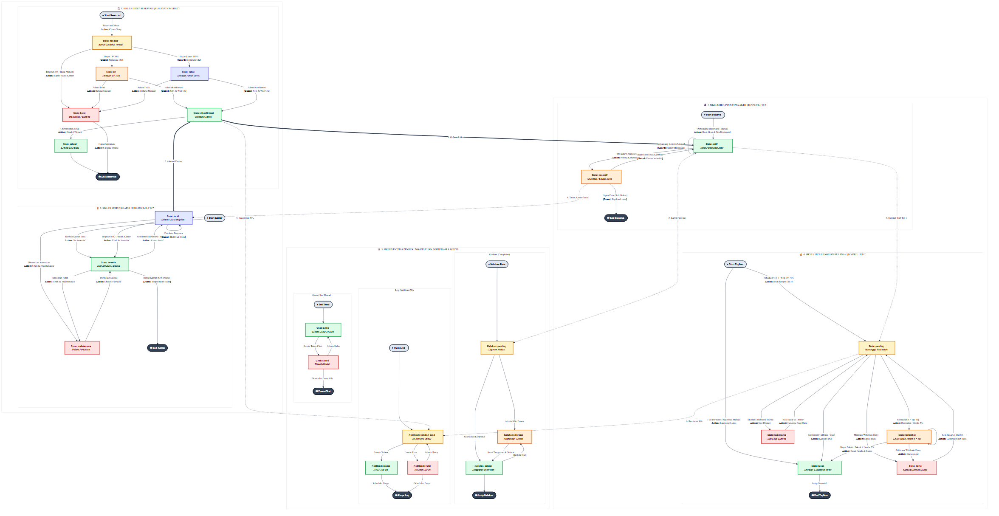
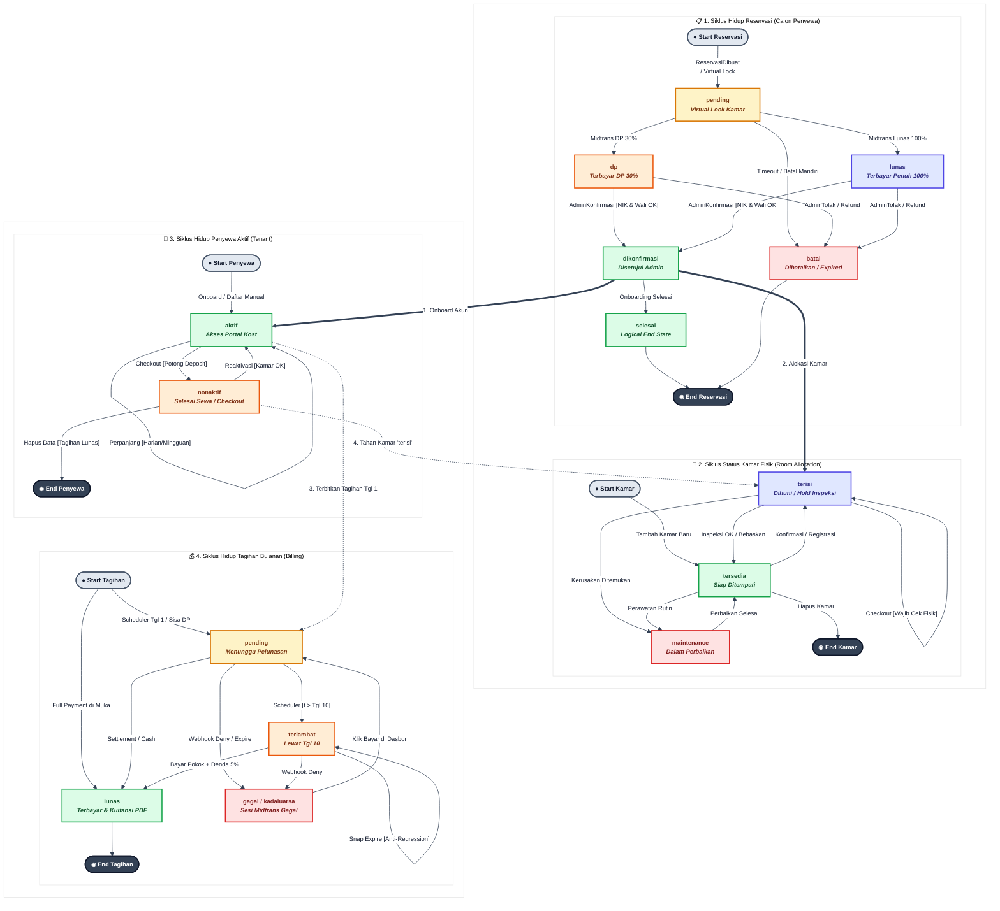
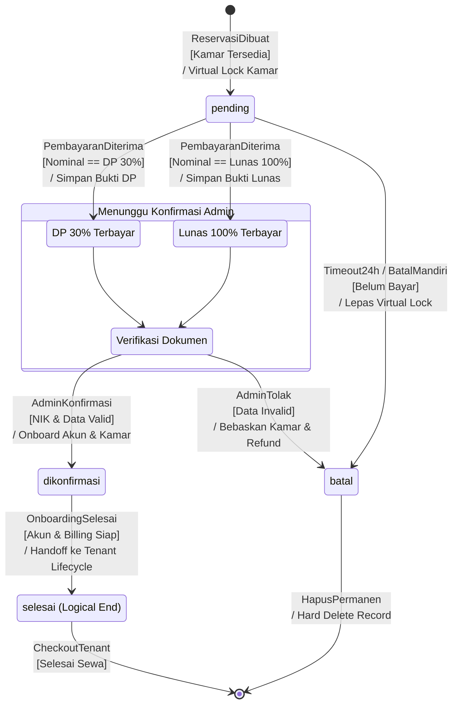
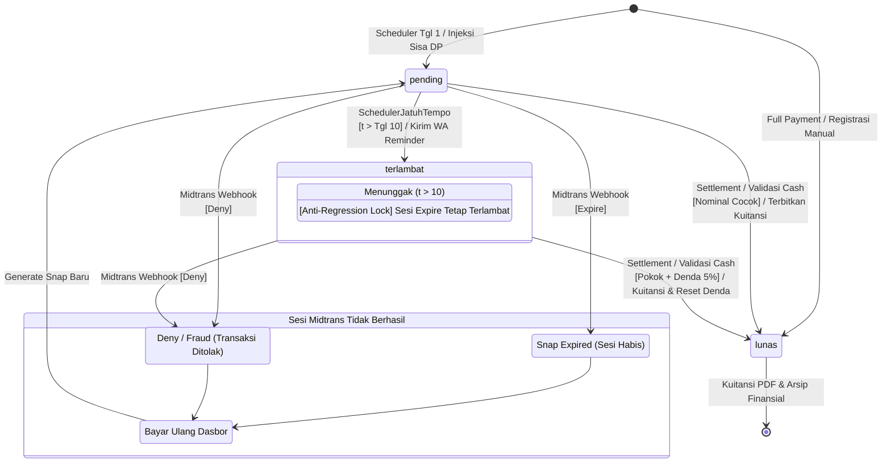
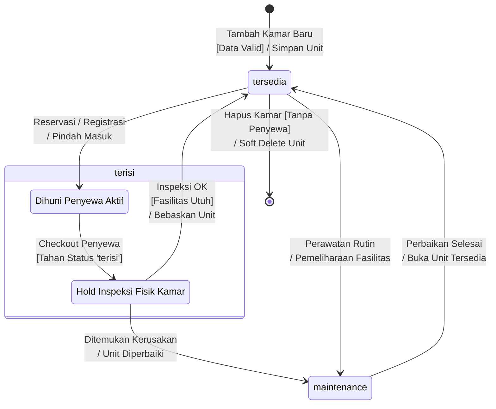
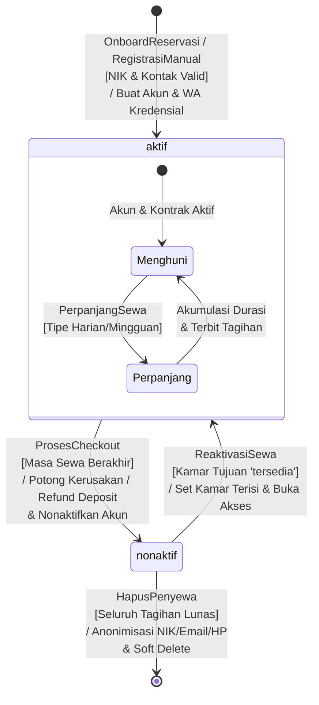
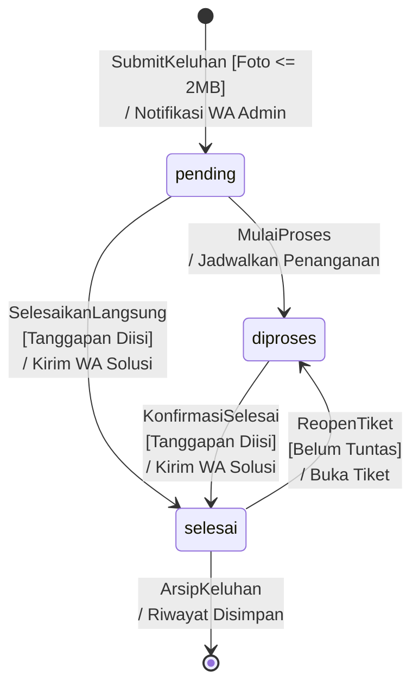
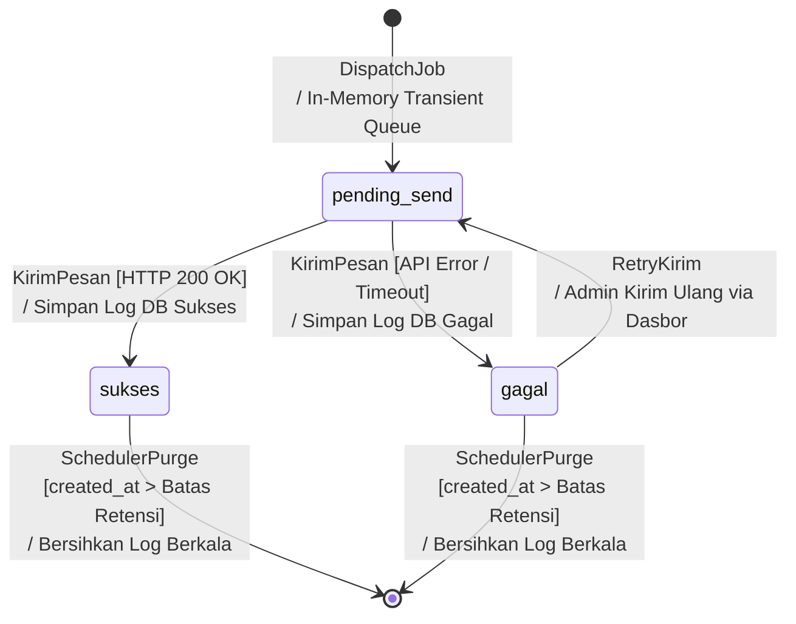
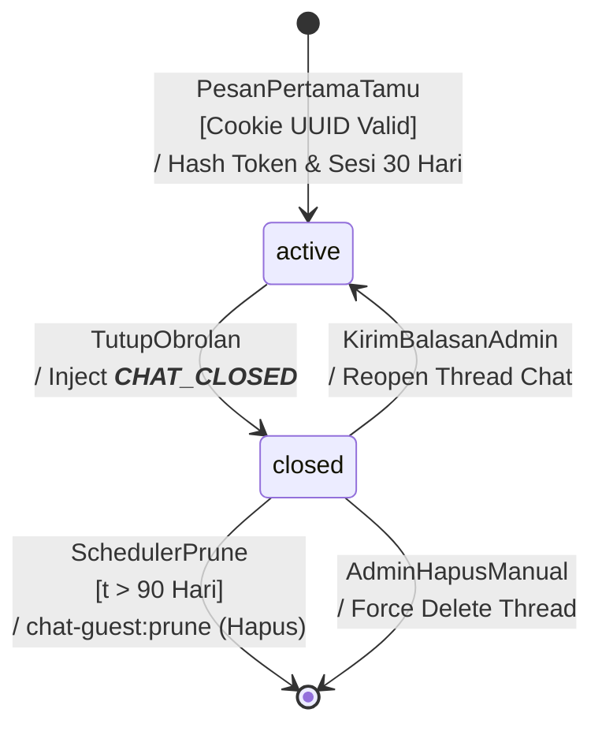

# State Machine Diagram - Asri Boarding House

Dokumen ini mendokumentasikan spesifikasi **State Machine Diagram (Diagram Mesin State)** untuk **Sistem Informasi Manajemen Kost Terintegrasi Payment Gateway pada Asri Boarding House**. State machine diagram ini memvisualisasikan seluruh siklus hidup (*lifecycle*) entitas utama dan pendukung sistem yang memiliki transisi status kompleks: **Reservasi**, **Tagihan**, **Kamar**, **Penyewa**, **Keluhan**, **Log Notifikasi**, dan **Guest Chat Thread**.

Siklus transisi status ini disinkronkan secara ketat dengan aturan bisnis database, event listener, cron job scheduler, dan sistem webhook pihak ketiga (Midtrans Payment Gateway & Fonnte WhatsApp API).

Semua spesifikasi dalam dokumen ini selaras dengan dokumen blueprint lainnya:
* **Project Blueprint**: [Blueprint_Projek_Web_Asri_Boarding_House.md](file:///c:/xampp/htdocs/asri-boarding-house/Blueprint/Blueprint_Projek_Web_Asri_Boarding_House.md)
* **Product Requirement Document**: [product_requirement_document_kost.md](file:///c:/xampp/htdocs/asri-boarding-house/Blueprint/product_requirement_document_kost.md)
* **Use Case Specification**: [Use_Case_Diagram_Kost.md](file:///c:/xampp/htdocs/asri-boarding-house/Blueprint/Use_Case_Diagram_Kost.md)
* **Sequence Diagram Specification**: [Sequence_Diagram_Kost.md](file:///c:/xampp/htdocs/asri-boarding-house/Blueprint/Sequence_Diagram_Kost.md)
* **Class Diagram**: [Class_Diagram_Kost.md](file:///c:/xampp/htdocs/asri-boarding-house/Blueprint/Class_Diagram_Kost.md)
* **Entity Relationship Diagram**: [Entity_Relationship_Diagram_Kost.md](file:///c:/xampp/htdocs/asri-boarding-house/Blueprint/Entity_Relationship_Diagram_Kost.md)
* **Flowchart**: [Flowchart_Kost.md](file:///c:/xampp/htdocs/asri-boarding-house/Blueprint/Flowchart_Kost.md)
* **Component Diagram**: [Component_Diagram_Kost.md](file:///c:/xampp/htdocs/asri-boarding-house/Blueprint/Component_Diagram_Kost.md)

---

## 0. Peta Arsitektur Transisi State Terpadu (Grand Master State Flow Map)

Diagram arsitektur tingkat tinggi berikut memvisualisasikan seluruh siklus hidup entitas sistem secara terintegrasi (Reservasi, Kamar, Penyewa, Tagihan, Keluhan, Notifikasi, dan Guest Chat). Diagram ini secara eksplisit merinci **arah transisi**, **event pemicu (*Trigger*)**, **kondisi batas (*Guard Conditions*)**, dan **aksi/efek samping (*Action/Side Effects*)** antar-status:

```mermaid
%%{init: {
  'theme': 'base',
  'themeVariables': {
    'primaryColor': '#F8FAFC',
    'primaryTextColor': '#0F172A',
    'primaryBorderColor': '#334155',
    'lineColor': '#334155',
    'secondaryColor': '#FEF3C7',
    'tertiaryColor': '#FFFFFF',
    'edgeLabelBackground': '#FFFFFF',
    'fontSize': '12px',
    'fontFamily': 'Inter, system-ui, sans-serif'
  }
}}%%
flowchart TB
    %% ========================================================
    %% KELAS GAYA VISUAL UNTUK STATE NODES
    %% ========================================================
    classDef initialNode fill:#E2E8F0,stroke:#475569,stroke-width:2px,color:#0F172A,font-weight:bold;
    classDef pendingNode fill:#FEF3C7,stroke:#D97706,stroke-width:2px,color:#78350F,font-weight:bold;
    classDef activeNode fill:#E0E7FF,stroke:#4F46E5,stroke-width:2px,color:#312E81,font-weight:bold;
    classDef successNode fill:#DCFCE7,stroke:#16A34A,stroke-width:2px,color:#14532D,font-weight:bold;
    classDef dangerNode fill:#FEE2E2,stroke:#DC2626,stroke-width:2px,color:#7F1D1D,font-weight:bold;
    classDef warningNode fill:#FFEDD5,stroke:#EA580C,stroke-width:2px,color:#7C2D12,font-weight:bold;
    classDef terminalNode fill:#334155,stroke:#0F172A,stroke-width:2px,color:#FFFFFF,font-weight:bold;

    %% ========================================================
    %% ROW 1: RESERVASI & KAMAR
    %% ========================================================
    subgraph ROW1 [" "]
        direction LR

        subgraph SUB_RES["📋 1. SIKLUS HIDUP RESERVASI (RESERVATION LIFECYCLE)"]
            direction TB
            InitRes(["● Start Reservasi"]):::initialNode
            Res_Pending["State: pending<br><i>Kamar Terkunci Virtual</i>"]:::pendingNode
            Res_DP["State: dp<br><i>Terbayar DP 30%</i>"]:::warningNode
            Res_Lunas["State: lunas<br><i>Terbayar Penuh 100%</i>"]:::activeNode
            Res_Konfirmasi["State: dikonfirmasi<br><i>Disetujui Admin</i>"]:::successNode
            Res_Selesai["State: selesai<br><i>Logical End State</i>"]:::successNode
            Res_Batal["State: batal<br><i>Dibatalkan / Expired</i>"]:::dangerNode
            TermRes(["◉ End Reservasi"]):::terminalNode

            InitRes -->|"ReservasiDibuat<br><b>Action:</b> Create Snap"| Res_Pending
            Res_Pending -->|"Bayar DP 30%<br><b>[Guard:</b> Signature OK<b>]</b>"| Res_DP
            Res_Pending -->|"Bayar Lunas 100%<br><b>[Guard:</b> Signature OK<b>]</b>"| Res_Lunas
            Res_Pending -->|"Timeout 24h / Batal Mandiri<br><b>Action:</b> Lepas Kunci Kamar"| Res_Batal

            Res_DP -->|"AdminKonfirmasi<br><b>[Guard:</b> NIK & Wali OK<b>]</b>"| Res_Konfirmasi
            Res_Lunas -->|"AdminKonfirmasi<br><b>[Guard:</b> NIK & Wali OK<b>]</b>"| Res_Konfirmasi

            Res_DP -->|"AdminTolak<br><b>Action:</b> Refund Manual"| Res_Batal
            Res_Lunas -->|"AdminTolak<br><b>Action:</b> Refund Manual"| Res_Batal

            Res_Konfirmasi -->|"OnboardingSelesai<br><b>Action:</b> Handoff Tenant"| Res_Selesai
            Res_Selesai --> TermRes
            Res_Batal -->|"HapusPermanen<br><b>Action:</b> Cascade Delete"| TermRes
        end

        subgraph SUB_KAM["🚪 2. SIKLUS STATUS KAMAR FISIK (ROOM LIFECYCLE)"]
            direction TB
            InitKam(["● Start Kamar"]):::initialNode
            Kam_Tersedia["State: tersedia<br><i>Siap Dipesan / Disewa</i>"]:::successNode
            Kam_Terisi["State: terisi<br><i>Dihuni / Hold Inspeksi</i>"]:::activeNode
            Kam_Maintenance["State: maintenance<br><i>Dalam Perbaikan</i>"]:::dangerNode
            TermKam(["◉ End Kamar"]):::terminalNode

            InitKam -->|"Tambah Kamar Baru<br><b>Action:</b> Set 'tersedia'"| Kam_Tersedia
            Kam_Tersedia -->|"Konfirmasi Reservasi / Registrasi<br><b>Action:</b> Kamar 'terisi'"| Kam_Terisi
            Kam_Terisi -->|"Checkout Penyewa<br><b>[Guard:</b> Hold Cek Fisik<b>]</b>"| Kam_Terisi
            Kam_Terisi -->|"Inspeksi OK / Pindah Kamar<br><b>Action:</b> Ubah ke 'tersedia'"| Kam_Tersedia
            Kam_Terisi -->|"Ditemukan Kerusakan<br><b>Action:</b> Ubah ke 'maintenance'"| Kam_Maintenance
            Kam_Tersedia -->|"Perawatan Rutin<br><b>Action:</b> Ubah ke 'maintenance'"| Kam_Maintenance
            Kam_Maintenance -->|"Perbaikan Selesai<br><b>Action:</b> Ubah ke 'tersedia'"| Kam_Tersedia
            Kam_Tersedia -->|"Hapus Kamar (Soft Delete)<br><b>[Guard:</b> Tanpa Relasi Aktif<b>]</b>"| TermKam
        end
    end

    %% ========================================================
    %% ROW 2: PENYEWA & TAGIHAN
    %% ========================================================
    subgraph ROW2 [" "]
        direction LR

        subgraph SUB_PEN["👤 3. SIKLUS HIDUP PENYEWA AKTIF (TENANT LIFECYCLE)"]
            direction TB
            InitPen(["● Start Penyewa"]):::initialNode
            Pen_Aktif["State: aktif<br><i>Akses Portal Kost Aktif</i>"]:::successNode
            Pen_Nonaktif["State: nonaktif<br><i>Checkout / Selesai Sewa</i>"]:::warningNode
            TermPen(["◉ End Penyewa"]):::terminalNode

            InitPen -->|"Onboarding Reservasi / Manual<br><b>Action:</b> Buat Akun & WA Kredensial"| Pen_Aktif
            Pen_Aktif -->|"Perpanjang Kontrak Manual<br><b>[Guard:</b> Harian/Mingguan<b>]</b>"| Pen_Aktif
            Pen_Aktif -->|"Prosedur Checkout Admin<br><b>Action:</b> Potong Kerusakan / Refund"| Pen_Nonaktif
            Pen_Nonaktif -->|"Reaktivasi Sewa Kembali<br><b>[Guard:</b> Kamar 'tersedia'<b>]</b>"| Pen_Aktif
            Pen_Nonaktif -->|"Hapus Data (Soft Delete)<br><b>[Guard:</b> Tagihan Lunas<b>]</b>"| TermPen
        end

        subgraph SUB_TAG["💰 4. SIKLUS HIDUP TAGIHAN BULANAN (INVOICE LIFECYCLE)"]
            direction TB
            InitTag(["● Start Tagihan"]):::initialNode
            Tag_Pending["State: pending<br><i>Menunggu Pelunasan</i>"]:::pendingNode
            Tag_Terlambat["State: terlambat<br><i>Lewat Jatuh Tempo (t > 10)</i>"]:::warningNode
            Tag_Lunas["State: lunas<br><i>Terbayar & Kuitansi Terbit</i>"]:::successNode
            Tag_Gagal["State: gagal<br><i>Gateway Ditolak (Deny)</i>"]:::dangerNode
            Tag_Kadaluarsa["State: kadaluarsa<br><i>Sesi Snap Expired</i>"]:::dangerNode
            TermTag(["◉ End Tagihan"]):::terminalNode

            InitTag -->|"Scheduler Tgl 1 / Sisa DP 70%<br><b>Action:</b> Jatuh Tempo Tgl 10"| Tag_Pending
            InitTag -->|"Full Payment / Registrasi Manual<br><b>Action:</b> Langsung Lunas"| Tag_Lunas

            Tag_Pending -->|"Settlement Callback / Cash<br><b>Action:</b> Kuitansi PDF"| Tag_Lunas
            Tag_Pending -->|"Scheduler [t > Tgl 10]<br><b>Action:</b> Reminder / Denda 5%"| Tag_Terlambat
            Tag_Pending -->|"Midtrans Webhook Deny<br><b>Action:</b> Status gagal"| Tag_Gagal
            Tag_Pending -->|"Midtrans Webhook Expire<br><b>Action:</b> Sesi Ditutup"| Tag_Kadaluarsa

            Tag_Terlambat -->|"Bayar Pokok / Pokok + Denda 5%<br><b>Action:</b> Reset Denda & Lunas"| Tag_Lunas
            Tag_Terlambat -->|"Snap Expired Saat Terlambat<br><b>[Guard:</b> Anti-Regression<b>]</b>"| Tag_Terlambat
            Tag_Terlambat -->|"Midtrans Webhook Deny<br><b>Action:</b> Status gagal"| Tag_Gagal

            Tag_Gagal -->|"Klik Bayar di Dasbor<br><b>Action:</b> Generate Snap Baru"| Tag_Pending
            Tag_Kadaluarsa -->|"Klik Bayar di Dasbor<br><b>Action:</b> Generate Snap Baru"| Tag_Pending
            Tag_Lunas -->|"Arsip Finansial"| TermTag
        end
    end

    %% ========================================================
    %% ROW 3: ENTITAS PENDUKUNG
    %% ========================================================
    subgraph SUB_SUPP["🛠️ 5. SIKLUS ENTITAS PENDUKUNG (KELUHAN, NOTIFIKASI & GUEST CHAT)"]
        direction LR

        subgraph SUB_KEL["Keluhan (Complaint)"]
            direction TB
            InitKel(["● Keluhan Baru"]):::initialNode
            Kel_Pending["Keluhan: pending<br><i>Laporan Masuk</i>"]:::pendingNode
            Kel_Diproses["Keluhan: diproses<br><i>Pengerjaan Teknisi</i>"]:::warningNode
            Kel_Selesai["Keluhan: selesai<br><i>Tanggapan Diberikan</i>"]:::successNode
            TermKel(["◉ Arsip Keluhan"]):::terminalNode

            InitKel --> Kel_Pending
            Kel_Pending -->|"Admin Klik Proses"| Kel_Diproses
            Kel_Pending -->|"Selesaikan Langsung"| Kel_Selesai
            Kel_Diproses -->|"Input Tanggapan & Selesai"| Kel_Selesai
            Kel_Selesai -->|"Reopen Tiket"| Kel_Diproses
            Kel_Selesai --> TermKel
        end

        subgraph SUB_NOTIF["Log Notifikasi WA"]
            direction TB
            InitNotif(["● Queue Job"]):::initialNode
            Notif_Queue["Notifikasi: pending_send<br><i>In-Memory Queue</i>"]:::pendingNode
            Notif_Sukses["Notifikasi: sukses<br><i>HTTP 200 OK</i>"]:::successNode
            Notif_Gagal["Notifikasi: gagal<br><i>Timeout / Down</i>"]:::dangerNode
            TermNotif(["◉ Purge Log"]):::terminalNode

            InitNotif --> Notif_Queue
            Notif_Queue -->|"Fonnte Sukses"| Notif_Sukses
            Notif_Queue -->|"Fonnte Error"| Notif_Gagal
            Notif_Gagal -->|"Admin Retry"| Notif_Queue
            Notif_Sukses -->|"Scheduler Purge"| TermNotif
            Notif_Gagal -->|"Scheduler Purge"| TermNotif
        end

        subgraph SUB_CHAT["Guest Chat Thread"]
            direction TB
            InitChat(["● Sesi Tamu"]):::initialNode
            Chat_Active["Chat: active<br><i>Cookie UUID 30 Hari</i>"]:::successNode
            Chat_Closed["Chat: closed<br><i>Thread Ditutup</i>"]:::dangerNode
            TermChat(["◉ Prune Chat"]):::terminalNode

            InitChat --> Chat_Active
            Chat_Active -->|"Admin Tutup Chat"| Chat_Closed
            Chat_Closed -->|"Admin Balas"| Chat_Active
            Chat_Closed -->|"Scheduler Prune 90h"| TermChat
        end
    end

    %% ========================================================
    %% VERTICAL STACKING CONSTRAINTS
    %% ========================================================
    ROW1 ~~~ ROW2
    ROW2 ~~~ SUB_SUPP

    %% ========================================================
    %% INTER-LIFECYCLE RELATIONS
    %% ========================================================
    Res_Konfirmasi ==>|"1. Onboard Akun"| Pen_Aktif
    Res_Konfirmasi ==>|"2. Alokasi Kamar"| Kam_Terisi
    Pen_Aktif -.->|"3. Tagihan Tiap Tgl 1"| Tag_Pending
    Pen_Nonaktif -.->|"4. Tahan Kamar 'terisi'"| Kam_Terisi
    Pen_Aktif -.->|"5. Lapor Fasilitas"| Kel_Pending
    Tag_Pending -.->|"6. Reminder WA"| Notif_Queue
    Res_Konfirmasi -.->|"7. Kredensial WA"| Notif_Queue
```





---

### 0.1. Diagram Terpadu Siklus Hidup Sistem (End-to-End System Lifecycle)

Diagram berikut memvisualisasikan bagaimana seluruh siklus hidup entitas utama sistem saling terhubung, berinteraksi, dan memicu perubahan status satu sama lain (mulai dari calon penyewa melakukan reservasi, alokasi unit kamar, penerbitan tagihan sewa, hingga penyewa menyelesaikan masa sewa).




---

## 1. State Machine: Reservasi (Reservation Lifecycle)

Entitas Reservasi melacak pengajuan sewa kamar kost oleh calon penyewa baru. Alur ini memiliki sifat krusial karena melibatkan alokasi unit kamar (*locking mechanism*) dan integrasi pembayaran deposit (DP 30%) atau pelunasan penuh (*Full Payment* 100%) via Midtrans Payment Gateway maupun pembayaran tunai langsung (*cash/transfer*) yang diverifikasi Admin.

### 1.1. Diagram State Reservasi (Mermaid)




### 1.2. Penjelasan State Reservasi

| Nama State | Deskripsi | Status Database (`reservasi.status`) | Efek Sistem / Bisnis |
| :--- | :--- | :--- | :--- |
| **`pending`** | Awal mula siklus setelah calon penyewa mengisi data simulasi sewa & memilih kamar. Kamar terkait dikunci tanggalnya sementara (`isKamarTerbooking`) agar tidak dapat dibooking orang lain selama transaksi berjalan. | `'pending'` | Menghasilkan token Snap Midtrans. Batas waktu pembayaran diatur 24 jam. |
| **`dp`** | Calon penyewa telah membayar Down Payment (DP sebesar 30% dari total sewa) baik via Midtrans maupun transfer tunai manual ke Admin. | `'dp'` | Mengubah status transaksi Midtrans menjadi `settlement`. Menunggu verifikasi NIK dan data wali oleh admin. |
| **`lunas`** | Calon penyewa telah melunasi tagihan reservasi secara penuh (*Full Payment* 100%) di awal. | `'lunas'` | Mengubah status transaksi Midtrans menjadi `settlement`. Menunggu verifikasi NIK dan data wali oleh admin. |
| **`dikonfirmasi`** | Reservasi disetujui penuh oleh Admin setelah data identitas (NIK 16 digit & data Wali) diverifikasi dengan benar. | `'dikonfirmasi'` | Mengunci kamar menjadi `'terisi'`, auto-create user & penyewa aktif, generate WhatsApp kredensial via Fonnte, dan inject tagihan sisa DP (70%) atau tagihan lunas. |
| **`selesai`** | **Logical End State**. Reservasi secara resmi selesai setelah penyewa berhasil dibuatkan akun aktif dan kamar kost siap dihuni. | `'dikonfirmasi'` | Seluruh alur selanjutnya berpindah ke siklus hidup penyewa aktif (*Tenant Lifecycle*). |
| **`batal`** | Pembayaran gagal, kedaluwarsa, ditolak, terjadi *double-booking*, atau dibatalkan oleh pihak admin/calon penyewa. | `'batal'` | Melepas kunci kamar terkait sehingga kamar kembali tersedia. Riwayat chat dilepaskan / dihapus (`cascade`). |

### 1.3. Matriks Transisi Reservasi

| Status Awal | Status Akhir | Pemicu (*Trigger*) | Aktor | Proses Internal & Perubahan Database | Event & Listener |
| :--- | :--- | :--- | :--- | :--- | :--- |
| `[Initial]` | `pending` | Mengisi form detail kamar & Checkout | Calon Penyewa | Membuat baris `reservasi` baru. Set `status = 'pending'`, `is_dp` (true/false) sesuai pilihan, create snap_token via `MidtransService`. | `ReservasiDibuat` |
| `pending` | `dp` | Webhook status `settlement`/`capture` (DP 30%) ATAU Pembayaran Cash dikonfirmasi admin | Midtrans API / Admin | Update `reservasi.status = 'dp'`, isi `transaction_id`, set `tanggal_konfirmasi = now()`. | `ReservasiDibayar` |
| `pending` | `lunas` | Webhook status `settlement`/`capture` (Lunas 100%) ATAU Pembayaran Cash dikonfirmasi admin | Midtrans API / Admin | Update `reservasi.status = 'lunas'`, isi `transaction_id`, set `tanggal_konfirmasi = now()`. | `ReservasiDibayar` |
| `pending` | `batal` | Batas waktu 24 jam terlampaui (webhook `expire`/`cancel`/`deny` dari Midtrans), terjadi tabrakan ketersediaan kamar, Pembatalan mandiri di portal, ATAU Pembatalan manual admin | Midtrans API / Scheduler / Calon Penyewa / Admin | Update `reservasi.status = 'batal'`. Set status kamar terkait kembali menjadi `'tersedia'`. | - (Direct DB Update) |
| `dp` | `batal` | Pembatalan manual oleh admin sebelum status dikonfirmasi | Admin | Update `reservasi.status = 'batal'`. Set status kamar terkait kembali menjadi `'tersedia'`. Proses refund manual di luar sistem. | - (Direct DB Update) |
| `lunas` | `batal` | Pembatalan manual oleh admin sebelum status dikonfirmasi | Admin | Update `reservasi.status = 'batal'`. Set status kamar terkait kembali menjadi `'tersedia'`. Proses refund manual di luar sistem. | - (Direct DB Update) |
| `dp` | `dikonfirmasi` | Klik "Konfirmasi Reservasi" setelah NIK & Wali tervalidasi | Admin | Update `reservasi.status = 'dikonfirmasi'`. Jalankan `TransisiPenyewaService`: kamar.status menjadi `'terisi'`, buat model `User` & `Penyewa` (aktif), kirim WA via Fonnte, inject sisa DP (70%) ke tagihan bulan berjalan (`BillingService::injectSisaDp`). | `ReservasiDikonfirmasi` |
| `lunas` | `dikonfirmasi` | Klik "Konfirmasi Reservasi" setelah NIK & Wali tervalidasi | Admin | Update `reservasi.status = 'dikonfirmasi'`. Jalankan `TransisiPenyewaService`: kamar.status menjadi `'terisi'`, buat model `User` & `Penyewa` (aktif), kirim WA via Fonnte, inject tagihan bulan berjalan berstatus langsung lunas (`BillingService::injectLunasPenuh`). | `ReservasiDikonfirmasi` |
| `dikonfirmasi` | `selesai` | Auto-Onboarding berhasil (User aktif, Tenant aktif, Kamar 'terisi', Tagihan terinjeksi) | Sistem (`TransisiPenyewaService`) | Resolusi akhir siklus reservasi (*Logical End State*). Alur transaksi secara resmi selesai dan diserahkan ke Siklus Hidup Penyewa Aktif (*Tenant Lifecycle*). | `ReservasiDikonfirmasi` |

### 1.4. Guard Conditions (Syarat Batas Transisi Reservasi)

| Transisi Status | Syarat Batas (*Guard Conditions*) | Penanganan Jika Gagal |
| :--- | :--- | :--- |
| `pending` $\rightarrow$ `dp` / `lunas` | 1. Signature Key Midtrans terverifikasi valid (SHA-512 `hash_equals`).<br>2. Nilai `gross_amount` dari webhook sama persis dengan `total_harga` atau `nominal_dp` di database.<br>3. Unit kamar tidak mengalami bentrok ketersediaan pada tanggal sewa. | Jika *gross amount* atau *signature* salah: transaksi ditolak HTTP 400/403. Jika *double-booking*: status diubah ke `batal` dengan instruksi *refund* manual. |
| `dp` / `lunas` $\rightarrow$ `dikonfirmasi` | 1. Input NIK calon penyewa wajib tepat 16 digit numerik.<br>2. Data wali (nama dan nomor telepon) wajib diisi lengkap.<br>3. Status kamar tujuan wajib `'tersedia'` (tidak boleh terisi atau maintenance). | Proses konfirmasi diblokir, sistem menampilkan pesan peringatan (*toast error*) di dashboard admin. |
| `pending` $\rightarrow$ `batal` | 1. Tanggal sekarang melampaui `created_at` + 24 jam.<br>2. Kamar masih dalam keadaan terkunci (status `'tersedia'` namun reservasi aktif).<br>3. Calon penyewa hanya boleh membatalkan jika status masih `pending`. | Kunci kamar dilepas (status kamar diubah kembali menjadi `'tersedia'`). Jika calon penyewa mencoba membatalkan selain `pending`, sistem menolak redirect back dengan pesan error. |
| `dp` / `lunas` $\rightarrow$ `batal` | Pembatalan manual oleh admin sebelum dikonfirmasi (misalnya data identitas salah, unit bermasalah, atau permintaan batal). | Kamar dilepaskan dari reservasi. Pengembalian dana (refund) diproses manual di luar sistem. |
| `dikonfirmasi` $\rightarrow$ `batal` | **DILARANG SISTEM (Illegal State Transition)**. Status reservasi yang telah dikonfirmasi tidak dapat dibatalkan melalui reservasi (`!in_array($reservasi->status, ['pending', 'dp', 'lunas'])`). | Admin diblokir melakukan pembatalan. Jika penyewa memutuskan batal menghuni setelah dikonfirmasi, entitas wajib dialihkan melalui prosedur **Checkout Resmi** pada Siklus Hidup Penyewa (*Tenant Lifecycle*) untuk pencatatan deposit & kuitansi. |

---

## 2. State Machine: Tagihan (Invoice Lifecycle)

Tagihan melacak kewajiban pembayaran sewa bulanan penyewa aktif serta sisa kewajiban pelunasan dari skema DP maupun tagihan pendaftaran manual. Transisi status ini dikelola secara dinamis melalui kombinasi database update dan *dynamic Eloquent accessors*.

### 2.1. Diagram State Tagihan (Mermaid)




### 2.2. Penjelasan State Tagihan

| Nama State | Deskripsi | Status Database (`tagihan.status`) | Efek Sistem / Bisnis |
| :--- | :--- | :--- | :--- |
| **`pending`** | Tagihan baru diterbitkan oleh sistem scheduler (tiap tanggal 1) atau sisa DP baru diinjeksi. Menunggu pelunasan. | `'pending'` | Dapat menghasilkan token Snap Midtrans untuk pembayaran digital. |
| **`lunas`** | Pembayaran berhasil diproses dan divalidasi, baik via Midtrans Callback, input cash manual, maupun inisialisasi awal (*Full Payment* / Pendaftaran Manual). | `'lunas'` | Membuat baris `pembayaran`, trigger event cetak PDF nota pembayaran otomatis, kirim notifikasi WA terima kasih via Fonnte. |
| **`terlambat`** | **Persistent & Computed State**. Ditampilkan di UI jika status DB `'pending'`/`'terlambat'`, tanggal jatuh tempo (tanggal 10) terlewati, dan scheduler mendeteksi keterlambatan (`bulan_keterlambatan > 0`). | `'terlambat'` / `'pending'` (di DB) | Memicu eskalasi peringatan (Bulan 1: WA ke penyewa, Bulan 2: WA ke wali, Bulan 3+: Denda flat 5% dikenakan ke `nominal_denda`). |
| **`gagal`** | Transaksi pembayaran via payment gateway diblokir, ditolak oleh bank, atau terdeteksi fraud. | `'gagal'` | Kirim notifikasi WA gagal bayar, penyewa diarahkan mencoba bayar ulang dengan metode lain. |
| **`kadaluarsa`** | **Logical/Midtrans State**. Sesi token pembayaran digital kedaluwarsa tanpa penyelesaian transaksi. | `'pending'` (di DB) | Midtrans webhook memetakan status `expire` ke `'pending'` agar tagihan tetap aktif untuk dicoba bayar ulang dengan snap token baru. |

### 2.3. Dualitas Arsitektur Status `terlambat` (Database & Eloquent Accessor)

Sebagai bagian dari integritas arsitektur:
1. **Persistensi Database**: Berdasarkan migrasi `2026_07_20_102435_add_terlambat_to_tagihan_status.php`, nilai enum database `tagihan.status` mencakup `['pending', 'lunas', 'gagal', 'kadaluarsa', 'terlambat']`. Perintah harian [BillingService::prosesKeterlambatan](file:///c:/xampp/htdocs/asri-boarding-house/app/Services/BillingService.php#L97) memperbarui status fisik baris tagihan menjadi `'terlambat'`.
2. **Dynamic Runtime Accessor**: Pada Model [Tagihan.php](file:///c:/xampp/htdocs/asri-boarding-house/app/Models/Tagihan.php#L145-L151), sistem menyediakan metode accessor `getComputedStatusAttribute()`:
```php
public function getComputedStatusAttribute(): string
{
    $rawStatus = $this->attributes['status'] ?? 'pending';
    if ($rawStatus === 'pending' && $this->tanggal_jatuh_tempo && $this->tanggal_jatuh_tempo->endOfDay()->isPast()) {
        return 'terlambat';
    }
    return $rawStatus;
}
```
Pendekatan *defense-in-depth* ini memastikan dashboard penyewa dan penghitungan denda selalu akurat secara *real-time* meskipun scheduler harian belum berjalan pada hari jatuh tempo.

### 2.4. Matriks Transisi Tagihan

| Status Awal | Status Akhir | Pemicu (*Trigger*) | Aktor | Proses Internal & Perubahan Database | Event & Listener |
| :--- | :--- | :--- | :--- | :--- | :--- |
| `[Initial]` | `pending` | Scheduler berjalan (Tanggal 1), Konfirmasi Reservasi DP, ATAU Perpanjangan Kontrak Manual Harian/Mingguan | Laravel Scheduler / Admin | Menyisipkan baris `tagihan` baru. Set `status = 'pending'`, `tanggal_jatuh_tempo = tanggal 10` (atau H+2 jika perpanjangan manual), `bulan_keterlambatan = 0`. | `TagihanDibuat` |
| `[Initial]` | `lunas` | Konfirmasi Reservasi Full Payment ATAU Pendaftaran Manual Baru | Admin / Sistem | Menyisipkan baris `tagihan` dengan `status = 'lunas'` via `injectLunasPenuh` atau `injectManualPenyewaLunas`, membuat record `pembayaran`, cetak PDF nota kuitansi. | `PembayaranBerhasil` / `PembayaranCashDikonfirmasi` |
| `pending` | `lunas` | Webhook status `settlement`/`capture` ATAU Admin klik konfirmasi cash | Midtrans API / Admin | Update `tagihan.status = 'lunas'`, buat baris `pembayaran`, simpan metadata bank/VA. | `PembayaranBerhasil` / `PembayaranCashDikonfirmasi` |
| `pending` | `terlambat` | Scheduler mendeteksi tanggal berjalan > `tanggal_jatuh_tempo` (t > 10) ATAU akses runtime via `computed_status` | Laravel Scheduler / Runtime System | Update `tagihan.status = 'terlambat'`. Jika masih dalam bulan berjalan (Masa Keringanan): `bulan_keterlambatan = 1, nominal_denda = 0`. Jika melampaui bulan periode berjalan (`isBulanBerikutnya`): hitung denda flat 5% `nominal_denda = nominal_pokok * 0.05` dan `nominal_total = nominal_pokok + nominal_denda`. | `ReminderPenyewa` (Bulan berjalan), `DendaDikenakan` & `NotifikasiWali` (Bulan berikutnya) |
| `terlambat` | `lunas` | Pembayaran lunas (Pokok sewa jika masa keringanan, atau Pokok + Denda 5% jika melampaui bulan berjalan) via Midtrans / Cash | Penyewa / Admin | Update `tagihan.status = 'lunas'`. Catat transaksi pembayaran, cetak PDF nota kuitansi. | `PembayaranBerhasil` / `PembayaranCashDikonfirmasi` |
| `terlambat` | `terlambat` | Sesi Snap dibatalkan atau expired saat tagihan terlambat | Midtrans API | Proteksi Anti-Regression di `MidtransCallbackController`: status tagihan tetap `'terlambat'` (tidak turun ke `'pending'`). | - |
| `terlambat` | `gagal` | Webhook status `deny` dari Midtrans saat pembayaran tagihan terlambat | Midtrans API | Update `tagihan.status = 'gagal'`. Tagihan tetap dapat dibayar ulang dengan metode lain. | - |
| `pending` | `gagal` | Webhook status `deny` dari Midtrans | Midtrans API | Update `tagihan.status = 'gagal'`. | - |
| `pending` | `kadaluarsa` | Webhook status `expire` / `cancel` dari Midtrans | Midtrans API | Sesi Midtrans expired. Di DB status tetap aktif `'pending'` untuk dicoba bayar ulang. | - |
| `gagal` / `kadaluarsa` | `pending` | Penyewa klik "Bayar Sekarang" lagi di Dashboard | Penyewa | Tagihan menghasilkan Snap Token baru dengan menambahkan timestamp pada order ID (`order_id-{timestamp}`). | - |

### 2.5. Pemetaan Sub-State Transaksi Gateway (`pembayaran.status_midtrans`) ke State Tagihan

Hubungan status webhook payment gateway Midtrans terhadap transisi status tagihan kost dimodelkan sebagai berikut:

| Status Gateway Midtrans (`status_midtrans`) | Dampak ke `tagihan.status` | Catatan & Penanganan Khusus |
| :--- | :--- | :--- |
| `settlement`, `capture` | $\rightarrow$ `'lunas'` | Transaksi tuntas. Membuat baris `pembayaran` dan menerbitkan kuitansi digital. |
| `pending` | $\rightarrow$ Tetap `'pending'` / `'terlambat'` | Menunggu pembayaran oleh penyewa. Tidak mengubah status menjadi pending jika sudah terlambat. |
| `deny` | $\rightarrow$ `'gagal'` | Transaksi ditolak atau terdeteksi fraud. Penyewa diarahkan menggunakan channel lain. |
| `expire`, `cancel` | $\rightarrow$ Tetap `'pending'` / `'terlambat'` | Sesi Snap hangus. Sistem menahan status agar tagihan tidak terkunci permanen dan dapat diulang. |
| `cash_confirmed` (Internal) | $\rightarrow$ `'lunas'` | Verifikasi tunai langsung oleh Admin via `TagihanService::confirmCashPayment`. |

* **Aturan Khusus 1: Penghapusan Denda Otomatis (*Waiving Denda*)**: Jika Snap Token di-generate oleh penyewa sebelum denda diterapkan (dalam bulan kalender berjalan yang sama), lalu denda 5% sempat teraplikasi sebelum pembayaran selesai di gateway, sistem memverifikasi kesamaan nominal pokok dan secara otomatis menghapus denda (`nominal_denda = 0, nominal_total = nominal_pokok`) saat webhook `settlement` masuk agar pembayaran penyewa tidak gagal akibat *amount mismatch*.
* **Aturan Khusus 2: Reset Tagihan Re-Reservasi (*Old Bill Reset*)**: Jika penyewa lama yang pernah checkout melakukan reservasi ulang pada bulan yang sama dengan riwayat masa sewa sebelumnya, [BillingService::injectSisaDp](file:///c:/xampp/htdocs/asri-boarding-house/app/Services/BillingService.php#L258-L274) secara atomik me-reset tagihan lama yang sudah `lunas` kembali menjadi `'pending'`, mengosongkan `tanggal_bayar`, dan menghapus record pembayaran terdahulu agar tagihan mengikat ke masa kontrak yang baru.

---

## 3. State Machine Entitas Pendukung

### 3.1. State Kamar (Room Status Lifecycle)

Mencegah terjadinya reservasi ganda (*double-booking*) dan menjamin inspeksi fisik check-out terlaksana.




* **Aturan Bisnis Konsistensi Check-Out**: Saat penyewa dinonaktifkan (`status = 'nonaktif'`), status unit kamar terkait **tetap `'terisi'`**. Ini memaksa admin melakukan inspeksi fisik kamar terlebih dahulu sebelum mengubah status kamar secara manual di menu manajemen kamar menjadi `'tersedia'` atau `'maintenance'`.
* **Prosedur Pindah Kamar (*Room Relocation*)**: Jika admin memindahkan kamar penyewa aktif di menu edit penyewa, sistem secara otomatis mengosongkan kamar lama (`terisi --> tersedia`) dan mengisi kamar baru (`tersedia --> terisi`).
* **Proteksi Penghapusan Kamar**: Kamar hanya dapat dihapus (soft-delete) jika tidak memiliki penyewa aktif atau reservasi aktif terkait (`$kamar->penyewaAktif()->exists() || $kamar->reservasiAktif()->exists()`). Kamar yang terhapus dapat dipulihkan kembali melalui fungsi *restore*.

### 3.2. State Penyewa (Tenant Lifecycle)

Mengontrol akses masuk ke portal aplikasi dan mengelola masa sewa.




* **Mekanisme Check-out dan Deposit**:
  * **Check-out Tanpa Kerusakan**: Status berubah menjadi `'nonaktif'`, nominal deposit jaminan (`penyewa.deposit`) dikembalikan penuh dan dicatat pada pengeluaran operasional.
  * **Check-out Dengan Kerusakan (*Damage Flow*)**: Status berubah menjadi `'nonaktif'`, nominal deposit dipotong sebesar biaya kerusakan. Sistem membuat baris pengeluaran baru pada tabel `pengeluaran` dengan kategori `maintenance` beserta foto nota pendukung.
* **Perpanjangan Sewa (*Self-Transition*)**: Penyewa harian/mingguan dapat memperpanjang kontrak sewa via `BillingService::perpanjangKontrakManual`. Status penyewa tetap `'aktif'`, durasi diakumulasikan, `tanggal_keluar_seharusnya` diperbarui, dan diterbitkan tagihan baru.
* **Proteksi Reaktivasi**: Jika admin mengaktifkan kembali penyewa lama, sistem memvalidasi kamar tujuan. Jika kamar berstatus `'terisi'` atau `'maintenance'`, reaktivasi diblokir.
* **Penghapusan & Anonimisasi Data (*Data Purging/Soft-Delete*)**: Penyewa nonaktif dapat dihapus oleh admin jika seluruh riwayat tagihannya berstatus lunas. Sistem mengisolasi data dengan menganonimkan NIK, Email, dan Nomor Telepon melalui penambahan suffix `_deleted_{timestamp}` untuk membebaskan *unique database constraint*, menghapus log notifikasi terkait, lalu mengeksekusi *soft-delete*. Data ini dapat dipulihkan kembali melalui fungsi *restore*.

### 3.3. State Keluhan (Complaint Lifecycle)

Melacak penanganan masalah fasilitas kost yang dilaporkan oleh penyewa.




* Saat penyewa mengirim keluhan (`pending`), notifikasi WA dikirim ke Admin via Fonnte.
* Saat status diubah menjadi `selesai`, sistem mencatat `tanggal_selesai` dan mengirimkan notifikasi WA solusi penutupan tiket ke penyewa.

### 3.4. State Log Notifikasi WhatsApp (`log_notifikasi`)

Sistem melacak status pengiriman notifikasi WhatsApp ke penyewa dan admin melalui tabel `log_notifikasi`.




* **Resilience Non-Blocking**: Kegagalan pengiriman Fonnte API tidak akan me-rollback transaksi utama. Status tercatat `'gagal'` dengan pesan kesalahan (`error_msg`). Admin dapat melakukan retry manual via dashboard.
* **Transient vs Persisted Status**: State `pending_send` merupakan *Transient / In-Memory Queue State* saat event terpicu atau job notifikasi didorong ke queue worker sebelum mendapatkan balasan dari Fonnte API. Pada basis data (tabel `log_notifikasi`), kolom `status` bernilai enum `['sukses', 'gagal']`.
* **Pembersihan Log Terjadwal (*Log Pruning*)**: Konsol perintah artisan `notifikasi:clear-old` ([ClearOldNotificationLogs.php](file:///c:/xampp/htdocs/asri-boarding-house/app/Console/Commands/ClearOldNotificationLogs.php)) dijalankan secara berkala oleh scheduler untuk menghapus log pengiriman lama yang telah melewati batas retensi (`created_at < threshold`), melengkapi transisi akhir `sukses --> [*]` dan `gagal --> [*]`.

### 3.5. State Guest Chat Thread (Guest Chat Lifecycle)

Melacak status sesi obrolan antara pengunjung anonim (Tamu/Guest) dengan Administrator pada landing page.




* Sesi obrolan diidentifikasi menggunakan `guest_chat_token` (UUID) yang disimpan di cookie browser selama 30 hari dan di-hash SHA-256 (`session_token`).
* Saat admin menutup obrolan (`closeThread`), status menjadi `closed` dan sistem menginjeksi pesan `___CHAT_CLOSED___`.
* Jika admin mengirim balasan baru ke thread `closed`, status obrolan otomatis aktif kembali (`closed --> active`).
* Laravel Scheduler menjalankan perintah `chat-guest:prune` setiap hari pukul 03:00 WIB untuk menghapus secara permanen thread `closed` yang berumur lebih dari 90 hari.

---

## 4. Keamanan Transaksi Finansial (ACID Compliance & Idempotency)

Setiap transisi status yang melibatkan perubahan data finansial atau mutasi log wajib dibungkus dalam transaksi database (`DB::transaction`) dan menggunakan penguncian baris data (`lockForUpdate()`) guna mengantisipasi *race condition* dan *double-click*:
```php
DB::transaction(function () use ($tagihan, $tagihanStatus, $request) {
    // Lock data secara eksklusif
    $lockedTagihan = Tagihan::where('id', $tagihan->id)->lockForUpdate()->first();
    
    // Validasi Idempotensi di bawah proteksi lock
    if ($lockedTagihan->status === 'lunas') {
        return ['status' => 200, 'message' => 'Already processed'];
    }
    
    $lockedTagihan->update(['status' => $tagihanStatus]);
});
```
