# Use Case Specification - Asri Boarding House

Dokumen ini mendokumentasikan spesifikasi **Use Case** tingkat final (terintegrasi penuh) untuk **Sistem Informasi Manajemen Kost Terintegrasi Payment Gateway pada Asri Boarding House**. Dokumen ini dirancang untuk menyelaraskan kebutuhan bisnis, interaksi pengguna (aktor internal dan eksternal), serta fungsionalitas sistem yang terhubung dengan basis data relasional, API pihak ketiga, dan otomasi tugas latar belakang (*cron job*).

Semua spesifikasi dalam dokumen ini selaras dengan dokumen [Blueprint_Projek_Web_Asri_Boarding_House.md](file:///c:/xampp/htdocs/asri-boarding-house/Blueprint/Blueprint_Projek_Web_Asri_Boarding_House.md) dan naskah [Skripsi Sub-bab 4.1.2](file:///c:/xampp/htdocs/asri-boarding-house/Skripsi/Skripsi_Rafif_Arsya_Pradiva_22N40014.md#L471-L488).

---

## 1. Identifikasi Aktor (Actors)

Sistem Asri Boarding House melibatkan **4 (empat) Aktor Utama (Primary Actors)**, **4 (empat) Aktor Sekunder / Sistem Eksternal (Secondary Actors)**, dan **1 (satu) Aktor Otomasi Waktu (Time-based System Actor)**:

### 1.1. Aktor Utama (Primary Actors)

| No | Aktor | Deskripsi | Hak Akses Utama |
| :--- | :--- | :--- | :--- |
| 1 | **Tamu (Guest)** | Pengunjung umum website/landing page yang belum mendaftarkan akun. | Menjelajahi informasi kost, pencarian & filter kamar, konsultasi via Guest Chat tanpa login, dan inisiasi registrasi/login. |
| 2 | **Calon Penyewa** | Pengguna yang terdaftar dan masuk ke sistem, tetapi belum berstatus sebagai penyewa aktif kontrak. | Pengajuan formulir reservasi kamar, chat diskusi pra-pembayaran, pembayaran DP/Lunas via Midtrans Snap, dan monitoring riwayat pemesanan. |
| 3 | **Penyewa Aktif** | Pengguna kost yang kontrak sewanya telah diverifikasi dan disetujui oleh admin. | Akses penuh ke portal internal penyewa: pelunasan tagihan bulanan, unduh kuitansi PDF, pengajuan keluhan fasilitas, tata tertib hunian, dan notifikasi. |
| 4 | **Administrator** | Pengelola operasional kost (Bapak Asep & tim pengelola). | Manajemen kamar & fasilitas, verifikasi & konfirmasi reservasi/kasir tunai, resolusi keluhan, checkout/perpanjang kontrak, pencatatan pengeluaran, kalender visual, ekspor laporan, dan broadcast notifikasi. |

> **Catatan Konseptual Wali / Orang Tua Penyewa**:
> Wali penyewa **bukan merupakan Aktor sistem interaktif**, karena tidak memiliki hak akses/login langsung ke aplikasi web. Wali diposisikan sebagai **pihak penerima pasif (recipient contact)** yang menerima eskalasi notifikasi persuasif WhatsApp via `WhatsApp Gateway (Fonnte)` saat keterlambatan pembayaran tagihan memasuki bulan kedua.

### 1.2. Aktor Sekunder & Otomasi Sistem (Secondary & Time-based Actors)

| No | Aktor Eksternal / System | Deskripsi | Standar Integrasi |
| :--- | :--- | :--- | :--- |
| 1 | **Payment Gateway (Midtrans)** | Sistem pihak ketiga yang memproses transaksi pembayaran digital nontunai secara otomatis. | Midtrans Snap API (Frontend Popup) & Server-to-Server Webhook Notification (Verifikasi SHA-512 Signature Key). |
| 2 | **WhatsApp Gateway (Fonnte)** | Layanan pihak ketiga yang mendistribusikan pesan notifikasi WhatsApp otomatis secara terprogram. | REST API Fonnte via HTTP POST (`Authorization: Token`), dilengkapi pencatatan status pengiriman pada tabel `log_notifikasi`. |
| 3 | **Google Identity Services (OAuth 2.0)** | Layanan penyedia otentikasi identitas pihak ketiga (*Third-party Identity Provider*). | Laravel Socialite SSO, memvalidasi identitas akun Google dan mengisi data profil awal pengguna secara aman. |
| 4 | **SMTP Mail Server** | Layanan server surat elektronik untuk pengiriman email transaksional sistem. | Protokol SMTP (Laravel Mailer), digunakan untuk pengiriman token tautan reset password (`UC-24`) dan broadcast notifikasi email. |
| 5 | **System Scheduler (Timer/Cron)** | Layanan jadwal otomatis Laravel Console Engine yang mengeksekusi tugas latar belakang berkala tanpa intervensi manusia. | Laravel Task Scheduler (`routes/console.php`), menjalankan billing bulanan tgl 1, denda flat 5% harian, auto-cancel reservasi 24 jam, dan pembersihan log. |

---

## 2. Diagram Use Case & Visualisasi Alur Proses (Mermaid UML 2.5)

Berikut adalah visualisasi diagram Use Case sistem yang disusun secara terstruktur per modul, **Master Unified Boundary**, **Graph Keterkaitan Include & Extend**, **Peta Alur Keterkaitan Inter-Use Case**, serta **Visualisasi Alur Proses Interaksi End-to-End**.

> **Standar Kepatuhan Notasi UML 2.5**:
> Sesuai spesifikasi formal OMG UML 2.5, relasi `<<extend>>` menghubungkan *Extension Use Case* ke *Base Use Case* ($Extension \xrightarrow{\ll extend \gg} Base$). Seluruh hubungan antara Use Case dengan Aktor Sekunder dimodelkan menggunakan **Asosiasi Berarah (*Directed Association*)** garis solid (`-->`), bukan stereotype `<<include>>`.

### 2.1. Diagram Use Case - Modul Publik & Calon Penyewa

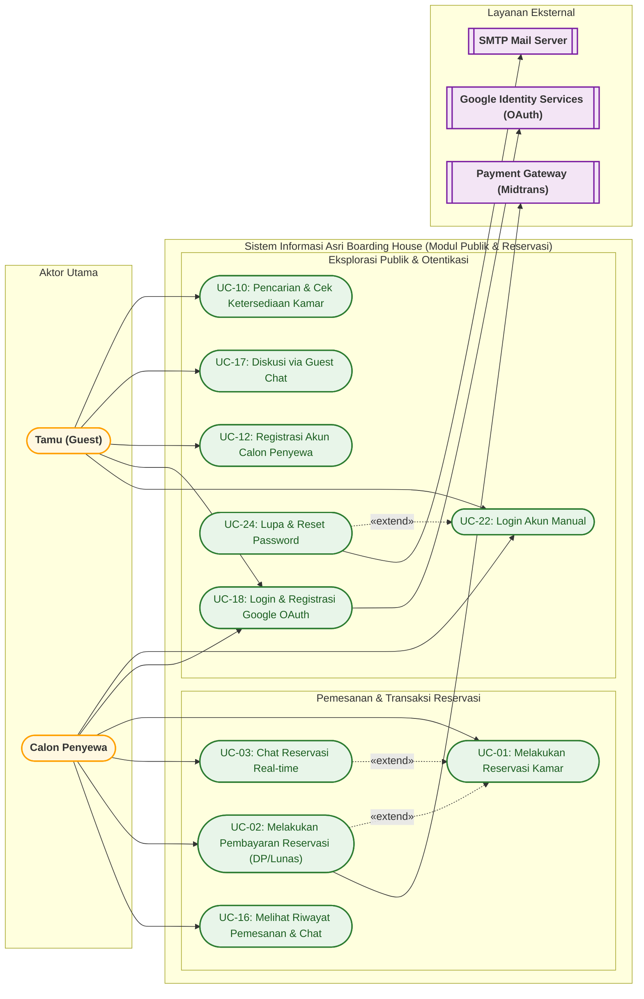

---

### 2.2. Diagram Use Case - Modul Penyewa Aktif

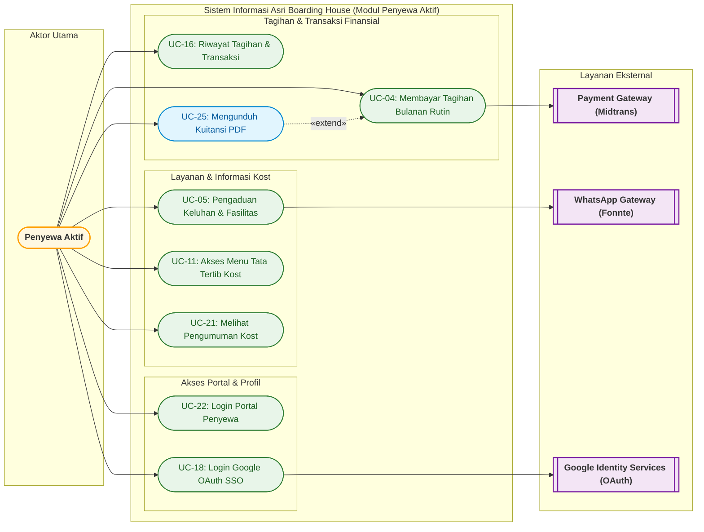

---

### 2.3. Diagram Use Case - Modul Admin Panel & Operasional

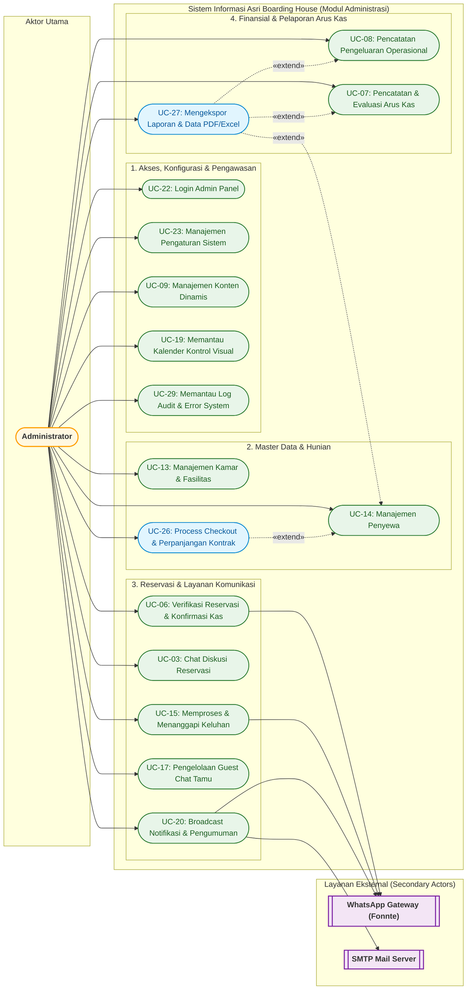

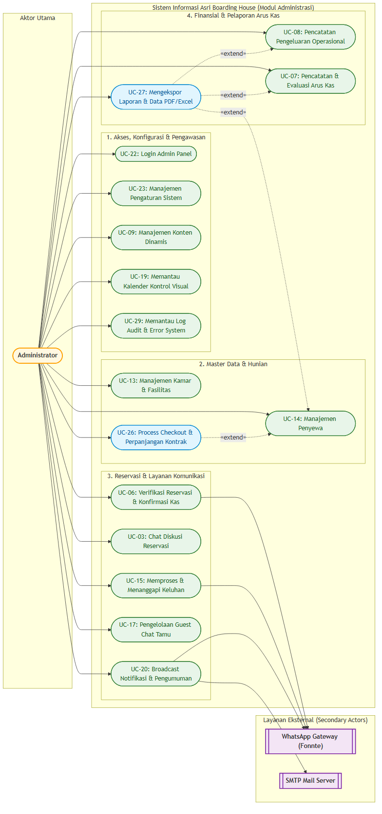

---

### 2.4. Diagram Use Case Master (Unified Master Boundary)

```mermaid
flowchart LR
    classDef primaryActor fill:#fff8e1,stroke:#ffa000,stroke-width:2px,font-weight:bold;
    classDef secondaryActor fill:#f3e5f5,stroke:#7b1fa2,stroke-width:2px,font-weight:bold;
    classDef timerActor fill:#e0f7fa,stroke:#00acc1,stroke-width:2px,font-weight:bold;
    classDef ucNode fill:#e8f5e9,stroke:#2e7d32,stroke-width:1.5px,color:#1b5e20;
    classDef extNode fill:#e1f5fe,stroke:#0288d1,stroke-width:1.5px,color:#01579b;

    %% Panel Kiri: Primary Actors
    subgraph ColPrimary ["Aktor Utama (Pengguna Sistem)"]
        direction TB
        Guest(["Tamu (Guest)"]):::primaryActor
        Calon(["Calon Penyewa"]):::primaryActor
        Penyewa(["Penyewa Aktif"]):::primaryActor
        Admin(["Administrator"]):::primaryActor
    end

    %% Boundary Sistem Inti
    subgraph CoreSystem ["Boundary Sistem: Sistem Informasi Asri Boarding House"]
        direction TB

        %% 1. Modul Otentikasi & Keamanan Akun
        subgraph AuthMod ["1. Otentikasi & Keamanan Akun"]
            UC12(["UC-12: Registrasi Akun"]):::ucNode
            UC18(["UC-18: Login SSO Google OAuth"]):::ucNode
            UC22(["UC-22: Login Kredensial Manual"]):::ucNode
            UC24(["UC-24: Reset Password"]):::extNode
        end

        %% 2. Modul Publik & Reservasi
        subgraph PublicMod ["2. Eksplorasi Publik & Reservasi"]
            UC10(["UC-10: Cek Katalog & Fasilitas"]):::ucNode
            UC17(["UC-17: Guest Chat Interaktif"]):::ucNode
            UC01(["UC-01: Booking Reservasi Kamar"]):::ucNode
            UC03(["UC-03: Chat Diskusi Reservasi"]):::extNode
            UC02(["UC-02: Pembayaran DP / Lunas Booking"]):::extNode
        end

        %% 3. Modul Penyewa Aktif
        subgraph TenantMod ["3. Portal Layanan Penyewa Aktif"]
            UC04(["UC-04: Bayar Tagihan Sewa & Denda"]):::ucNode
            UC25(["UC-25: Unduh Kuitansi PDF"]):::extNode
            UC05(["UC-05: Pengaduan Keluhan & Kerusakan"]):::ucNode
            UC11(["UC-11: Cek Tata Tertib Kost"]):::ucNode
            UC21(["UC-21: Baca Pengumuman Kost"]):::ucNode
            UC16(["UC-16: Histori Riwayat Transaksi"]):::ucNode
        end

        %% 4. Modul Admin Operations & Master Data
        subgraph AdminMod ["4. Operasional Administrator & Master Data"]
            UC06(["UC-06: Verifikasi Reservasi & Konfirmasi Kas"]):::ucNode
            UC13(["UC-13: Manajemen Kamar & Fasilitas"]):::ucNode
            UC14(["UC-14: Manajemen Penyewa"]):::ucNode
            UC26(["UC-26: Process Checkout & Perpanjangan"]):::extNode
            UC15(["UC-15: Tanggapi & Resolusi Keluhan"]):::ucNode
            UC08(["UC-08: Pencatatan Biaya Operasional"]):::ucNode
            UC07(["UC-07: Pencatatan & Evaluasi Arus Kas"]):::ucNode
            UC27(["UC-27: Ekspor Data & Laporan PDF/Excel"]):::extNode
            UC19(["UC-19: Kalender Kontrol Hunian"]):::ucNode
            UC20(["UC-20: Broadcast Pengumuman Massal"]):::ucNode
            UC09(["UC-09: Manajemen Konten Landing Page"]):::ucNode
            UC23(["UC-23: Konfigurasi Pengaturan Sistem"]):::ucNode
            UC29(["UC-29: Log Audit & Error System"]):::ucNode
        end

        %% 5. Modul Otomasi Latar Belakang
        subgraph AutoMod ["5. Otomasi Latar Belakang (Scheduled Tasks)"]
            UC28(["UC-28: Otomasi Billing, Denda & Tugas Terjadwal"]):::ucNode
        end
    end

    %% Panel Kanan: Secondary & Timer Actors
    subgraph ColSecondary ["Aktor Pendukung (Layanan Eksternal & Timer)"]
        direction TB
        Midtrans[["Payment Gateway (Midtrans)"]]:::secondaryActor
        Fonnte[["WhatsApp Gateway (Fonnte)"]]:::secondaryActor
        Google[["Google Identity Services (OAuth)"]]:::secondaryActor
        MailServer[["SMTP Mail Server"]]:::secondaryActor
        Cron[["System Scheduler (Cron Job)"]]:::timerActor
    end

    %% Relasi Aktor Tamu (Guest)
    Guest --> UC10
    Guest --> UC17
    Guest --> UC12
    Guest --> UC18
    Guest --> UC22

    %% Relasi Aktor Calon Penyewa
    Calon --> UC22
    Calon --> UC18
    Calon --> UC01
    Calon --> UC03
    Calon --> UC02
    Calon --> UC16

    %% Relasi Aktor Penyewa Aktif
    Penyewa --> UC22
    Penyewa --> UC18
    Penyewa --> UC04
    Penyewa --> UC25
    Penyewa --> UC05
    Penyewa --> UC11
    Penyewa --> UC21
    Penyewa --> UC16

    %% Relasi Aktor Administrator
    Admin --> UC22
    Admin --> UC03
    Admin --> UC06
    Admin --> UC13
    Admin --> UC14
    Admin --> UC26
    Admin --> UC15
    Admin --> UC08
    Admin --> UC07
    Admin --> UC27
    Admin --> UC19
    Admin --> UC20
    Admin --> UC09
    Admin --> UC23
    Admin --> UC17
    Admin --> UC29

    %% Relasi Timer Actor
    Cron --> UC28
    Cron --> |"Auto-cancel 24 jam"| UC01

    %% Relasi Extend Antar Use Case (Extension -> Base)
    UC24 -.-> |"&laquo;extend&raquo;"| UC22
    UC03 -.-> |"&laquo;extend&raquo;"| UC01
    UC02 -.-> |"&laquo;extend&raquo;"| UC01
    UC25 -.-> |"&laquo;extend&raquo;"| UC04
    UC26 -.-> |"&laquo;extend&raquo;"| UC14
    UC27 -.-> |"&laquo;extend&raquo;"| UC07
    UC27 -.-> |"&laquo;extend&raquo;"| UC14
    UC27 -.-> |"&laquo;extend&raquo;"| UC08

    %% Directed Associations ke Secondary Actors
    UC18 --> Google
    UC02 --> Midtrans
    UC04 --> Midtrans
    UC06 --> Fonnte
    UC15 --> Fonnte
    UC20 --> Fonnte
    UC28 --> Fonnte
    UC20 --> MailServer
    UC24 --> MailServer
```

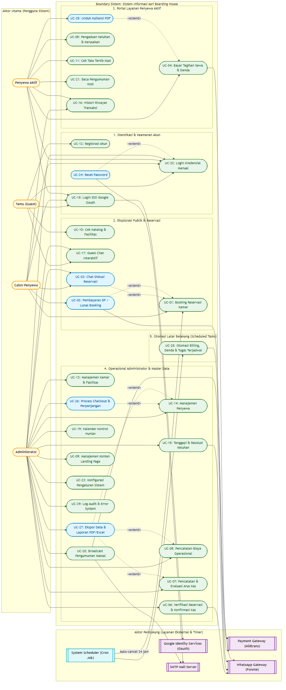

---

### 2.5. Visualisasi Keterkaitan Antar Use Case (Graph Relasi UML 2.5)

```mermaid
flowchart TD
    classDef includeStyle fill:#e1f5fe,stroke:#0288d1,stroke-width:2px,font-weight:bold;
    classDef extendStyle fill:#fff3e0,stroke:#f57c00,stroke-width:2px,font-weight:bold;
    classDef coreStyle fill:#e8f5e9,stroke:#388e3c,stroke-width:2px,font-weight:bold,color:#1b5e20;
    classDef externalStyle fill:#f3e5f5,stroke:#7b1fa2,stroke-width:2px,font-weight:bold;

    %% Base Use Cases
    UC01["UC-01: Melakukan Reservasi Kamar"]:::coreStyle
    UC04["UC-04: Membayar Tagihan Bulanan"]:::coreStyle
    UC06["UC-06: Konfirmasi Reservasi & Kas"]:::coreStyle
    UC14["UC-14: Manajemen Penyewa"]:::coreStyle
    UC07["UC-07: Laporan Arus Kas"]:::coreStyle
    UC08["UC-08: Manajemen Pengeluaran"]:::coreStyle
    UC22["UC-22: Login Akun Manual"]:::coreStyle
    UC28["UC-28: Otomasi Billing & Denda Eskalasi"]:::coreStyle
    UC15["UC-15: Resolusi Keluhan"]:::coreStyle
    UC20["UC-20: Broadcast Notifikasi"]:::coreStyle
    UC18["UC-18: Login Google OAuth SSO"]:::coreStyle

    %% Extension Use Cases
    UC03["UC-03: Chat Reservasi Real-time"]:::extendStyle
    UC02["UC-02: Pembayaran Reservasi Online"]:::extendStyle
    UC25["UC-25: Mengunduh Kuitansi PDF"]:::extendStyle
    UC26["UC-26: Checkout & Perpanjang Kontrak"]:::extendStyle
    UC27["UC-27: Ekspor Data & Laporan (PDF/Excel/CSV)"]:::extendStyle
    UC24["UC-24: Lupa & Reset Password"]:::extendStyle

    %% External System Services (Secondary Actors)
    Midtrans[["Layanan Payment Gateway (Midtrans)"]]:::externalStyle
    Fonnte[["Layanan WhatsApp Gateway (Fonnte)"]]:::externalStyle
    Google[["Google Identity Services (OAuth)"]]:::externalStyle
    MailServer[["SMTP Mail Server"]]:::externalStyle

    %% Extend Relations (Antar Use Case)
    UC03 -.-> |extend| UC01
    UC02 -.-> |extend| UC01
    UC25 -.-> |extend| UC04
    UC26 -.-> |extend| UC14
    UC27 -.-> |extend| UC07
    UC27 -.-> |extend| UC14
    UC27 -.-> |extend| UC08
    UC24 -.-> |extend| UC22

    %% Directed Associations ke Secondary Actors (UML 2.5 Standard)
    UC02 --> Midtrans
    UC04 --> Midtrans
    UC06 --> Fonnte
    UC15 --> Fonnte
    UC20 --> Fonnte
    UC28 --> Fonnte
    UC18 --> Google
    UC20 --> MailServer
    UC24 --> MailServer
```

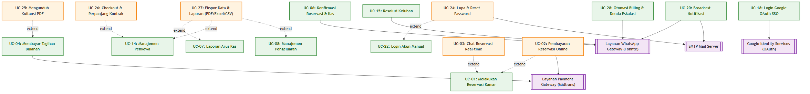

---

### 2.6. Peta Alur Keterkaitan Antar Use Case (Master Inter-Use Case Process Flow Map)

```mermaid
flowchart TB
    classDef actorNode fill:#fff8e1,stroke:#ffa000,stroke-width:2px,font-weight:bold;
    classDef externalNode fill:#f3e5f5,stroke:#7b1fa2,stroke-width:2px,font-weight:bold;
    classDef timerNode fill:#e0f7fa,stroke:#00acc1,stroke-width:2px,font-weight:bold;
    classDef baseUC fill:#e8f5e9,stroke:#2e7d32,stroke-width:2px,color:#1b5e20,font-weight:bold;
    classDef extendUC fill:#fff3e0,stroke:#f57c00,stroke-width:2px,font-weight:bold;

    %% ACTORS
    Guest(["Tamu (Guest)"]):::actorNode
    Calon(["Calon Penyewa"]):::actorNode
    Penyewa(["Penyewa Aktif"]):::actorNode
    Admin(["Administrator"]):::actorNode
    Cron[["System Scheduler (Timer/Cron)"]]:::timerNode

    %% EXTERNAL SERVICES
    Midtrans[["Payment Gateway (Midtrans Snap)"]]:::externalNode
    Fonnte[["WhatsApp Gateway (Fonnte)"]]:::externalNode
    Google[["Google Identity Services (OAuth)"]]:::externalNode
    MailServer[["SMTP Mail Server"]]:::externalNode

    %% FLOW PHASE 1: AUTHENTICATION & DISCOVERY
    subgraph Phase1 ["Fase 1: Penemuan & Otentikasi"]
        UC10(["UC-10: Cek Katalog & Ketersediaan Kamar"]):::baseUC
        UC12(["UC-12: Registrasi Akun Calon"]):::baseUC
        UC18(["UC-18: Login / SSO Google OAuth"]):::baseUC
        UC22(["UC-22: Login Akun Manual"]):::baseUC
        UC24(["UC-24: Lupa & Reset Password"]):::extendUC
        UC17(["UC-17: Diskusi via Guest Chat"]):::baseUC
    end

    %% FLOW PHASE 2: RESERVATION & PRE-PAYMENT
    subgraph Phase2 ["Fase 2: Reservasi & Transisi Penyewa"]
        UC01(["UC-01: Melakukan Reservasi Kamar"]):::baseUC
        UC03(["UC-03: Chat Reservasi Real-time"]):::extendUC
        UC02(["UC-02: Melakukan Pembayaran Reservasi"]):::extendUC
        UC06(["UC-06: Verifikasi Reservasi & Konfirmasi Kas"]):::baseUC
    end

    %% FLOW PHASE 3: ACTIVE TENANCY & AUTOMATED BILLING
    subgraph Phase3 ["Fase 3: Masa Sewa Aktif & Penagihan"]
        UC28(["UC-28: Otomasi Billing & Denda Eskalasi"]):::baseUC
        UC04(["UC-04: Membayar Tagihan Bulanan"]):::baseUC
        UC25(["UC-25: Mengunduh Kuitansi Bukti PDF"]):::extendUC
        UC05(["UC-05: Mengajukan Keluhan Fasilitas"]):::baseUC
        UC15(["UC-15: Memproses & Menanggapi Keluhan"]):::baseUC
        UC11(["UC-11: Mengakses Menu Peraturan"]):::baseUC
        UC21(["UC-21: Melihat Pengumuman & Notifikasi"]):::baseUC
    end

    %% FLOW PHASE 4: ADMIN CONTROLS & REPORTING
    subgraph Phase4 ["Fase 4: Operasional & Pengakhiran Sewa"]
        UC14(["UC-14: Manajemen Data Master Penyewa"]):::baseUC
        UC26(["UC-26: Process Checkout & Perpanjangan"]):::extendUC
        UC07(["UC-07: Laporan Arus Kas"]):::baseUC
        UC08(["UC-08: Pencatatan Pengeluaran (CRUD)"]):::baseUC
        UC27(["UC-27: Ekspor Data & Laporan (PDF/Excel)"]):::extendUC
        UC19(["UC-19: Memantau Kalender Kontrol Visual"]):::baseUC
        UC20(["UC-20: Broadcast Notifikasi Massal"]):::baseUC
    end

    %% CONNECTIONS & INTERACTIONS
    Guest --> UC10
    Guest --> UC17
    Guest --> UC12
    Guest --> UC18
    Guest --> UC22

    UC24 -.-> |extend| UC22
    UC24 --> MailServer
    UC12 --> Calon
    UC18 --> Calon
    UC18 --> Google

    Calon --> UC01
    UC03 -.-> |extend| UC01
    UC02 -.-> |extend| UC01
    UC02 --> Midtrans
    Calon --> UC03
    Calon --> UC02

    Admin --> UC03
    Admin --> UC06
    Admin --> UC17
    UC06 --> Fonnte
    UC06 --> |Transisi Sukses -> Akun Terbit| Penyewa

    Cron --> UC28
    Cron --> |Auto-cancel 24 jam| UC01
    UC28 --> Fonnte
    UC28 --> |Terbit Tagihan Rutin| UC04

    Penyewa --> UC04
    UC04 --> Midtrans
    Admin --> |Konfirmasi Kas Manual| UC06
    UC06 -.-> |Update Status Lunas| UC04

    UC25 -.-> |extend| UC04
    Penyewa --> UC25

    Penyewa --> UC05
    UC05 --> Fonnte
    Fonnte --> |Notifikasi WA Masuk| Admin
    Admin --> UC15
    UC15 --> Fonnte
    Fonnte --> |Notifikasi Status Selesai| Penyewa

    Admin --> UC14
    UC26 -.-> |extend| UC14
    Admin --> UC26
    Admin --> UC07
    Admin --> UC08
    Admin --> UC19
    Admin --> UC20
    UC20 --> Fonnte
    UC20 --> MailServer

    UC27 -.-> |extend| UC07
    UC27 -.-> |extend| UC14
    UC27 -.-> |extend| UC08
    Admin --> UC27
```

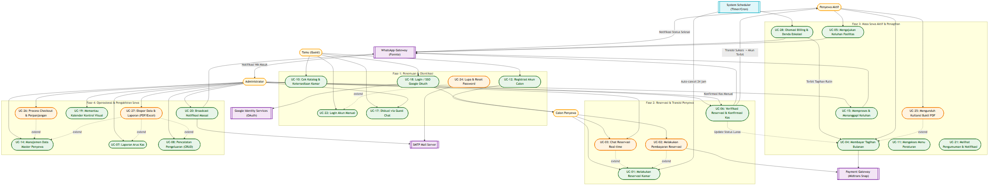

---

### 2.7. Diagram Alur Proses Interaksi Terpadu Lintas Aktor & Sistem (Master Cross-Functional Interaction Flow)

Diagram alur berikut menyajikan integrasi komprehensif antara **Aktor Pengguna (Primary Actors)**, **Boundary Sistem Web Laravel**, **Keterkaitan Relasi Use Case (`<<extend>>` dan alur prasyarat)**, **Layanan Pihak Ketiga (Secondary Actors & Timer)**, serta **Transisi Status Entitas Utama** dalam satu representasi proses bisnis terpadu:

```mermaid
flowchart TD
    classDef primaryActor fill:#fff8e1,stroke:#ffa000,stroke-width:2px,font-weight:bold;
    classDef baseUC fill:#e8f5e9,stroke:#2e7d32,stroke-width:2px,color:#1b5e20,font-weight:bold;
    classDef extendUC fill:#fff3e0,stroke:#f57c00,stroke-width:2px,color:#e65100,font-weight:bold;
    classDef secondaryActor fill:#f3e5f5,stroke:#7b1fa2,stroke-width:2px,font-weight:bold;
    classDef timerActor fill:#e0f7fa,stroke:#00acc1,stroke-width:2px,font-weight:bold;
    classDef decisionNode fill:#fffde7,stroke:#fbc02d,stroke-width:2px;
    classDef stateNode fill:#e1f5fe,stroke:#0288d1,stroke-width:2px,font-weight:bold;

    %% ==========================================
    %% 1. ACTORS & EXTERNAL SYSTEM LANES
    %% ==========================================
    subgraph AktorPengguna ["👤 AKTOR PENGGUNA (PRIMARY ACTORS)"]
        Guest(["Tamu (Guest)"]):::primaryActor
        Calon(["Calon Penyewa"]):::primaryActor
        Penyewa(["Penyewa Aktif"]):::primaryActor
        Admin(["Administrator Kost"]):::primaryActor
    end

    subgraph LayananEksternal ["🔌 LAYANAN EKSTERNAL & TIMER (SECONDARY & TIME ACTORS)"]
        Google[["Google Identity Services (OAuth)"]]:::secondaryActor
        Midtrans[["Payment Gateway (Midtrans Snap)"]]:::secondaryActor
        Fonnte[["WhatsApp Gateway (Fonnte)"]]:::secondaryActor
        MailServer[["SMTP Mail Server"]]:::secondaryActor
        Cron[["Laravel Task Scheduler (Cron Engine)"]]:::timerActor
    end

    %% ==========================================
    %% 2. SYSTEM BOUNDARY & DETAILED INTERACTION FLOW
    %% ==========================================
    subgraph BoundarySystem ["🖥️ SISTEM INFORMASI ASRI BOARDING HOUSE (INTERACTION & USE CASE FLOW)"]
        
        %% FASE 1: DISCOVERY & OTENTIKASI
        subgraph F1 ["Fase 1: Penemuan Hunian & Otentikasi Pengguna"]
            direction TB
            UC10(["UC-10: Cek Katalog & Filter Ketersediaan"]):::baseUC
            UC17(["UC-17: Diskusi via Guest Chat Publik"]):::baseUC
            UC12(["UC-12: Registrasi Akun Calon Penyewa"]):::baseUC
            UC18(["UC-18: Login / SSO Google OAuth"]):::baseUC
            UC22(["UC-22: Login Akun Manual"]):::baseUC
            UC24(["UC-24: Lupa & Reset Password"]):::extendUC

            UC24 -.-> |extend: bila lupa password| UC22
        end

        %% FASE 2: RESERVASI & PRE-PAYMENT
        subgraph F2 ["Fase 2: Reservasi Unit, Diskusi Pra-Bayar & Pembayaran Snap"]
            direction TB
            UC01(["UC-01: Melakukan Reservasi Kamar"]):::baseUC
            UC03(["UC-03: Chat Reservasi Real-Time"]):::extendUC
            UC02(["UC-02: Pembayaran Reservasi Online"]):::extendUC
            StatePending[("Status: 'pending' & Kamar Terkunci")]:::stateNode
            StatePaid[("Status: 'dp' / 'lunas'")]:::stateNode

            UC03 -.-> |extend: negosiasi & tanya kamar| UC01
            UC02 -.-> |extend: bayar DP / Lunas| UC01
        end

        %% FASE 3: VERIFIKASI ADMIN & TRANSISI AKUN
        subgraph F3 ["Fase 3: Verifikasi Dokumen, Konfirmasi & Transisi Penyewa"]
            direction TB
            UC06(["UC-06: Verifikasi Reservasi & Konfirmasi Kas"]):::baseUC
            DecVerif{Admin Setujui Identitas NIK?}:::decisionNode
            StateBatal[("Status: 'dibatalkan' & Kamar Bebas")]:::stateNode
            StateConfirmed[("Status: 'dikonfirmasi', Kamar 'terisi', Akun Penyewa Terbit")]:::stateNode
        end

        %% FASE 4: OPERASIONAL HUNIAN, AUTO-BILLING & KELUHAN
        subgraph F4 ["Fase 4: Masa Sewa Aktif, Penagihan Otomatis, Keluhan & Kuitansi"]
            direction TB
            UC28(["UC-28: Otomasi Billing, Denda & Tugas Terjadwal"]):::baseUC
            UC04(["UC-04: Membayar Tagihan Bulanan Rutin"]):::baseUC
            UC25(["UC-25: Mengunduh Kuitansi Bukti PDF"]):::extendUC
            UC05(["UC-05: Mengajukan Keluhan Fasilitas"]):::baseUC
            UC15(["UC-15: Memproses & Menanggapi Keluhan"]):::baseUC
            UC11(["UC-11: Mengakses Peraturan & Tata Tertib"]):::baseUC
            UC21(["UC-21: Melihat Pengumuman & Notifikasi"]):::baseUC

            UC25 -.-> |extend: tagihan status 'lunas'| UC04
        end

        %% FASE 5: OPERASIONAL ADMIN, PELAPORAN & CHECKOUT
        subgraph F5 ["Fase 5: Operasional Lanjutan, Visual Control, Pelaporan & Pengakhiran Sewa"]
            direction TB
            UC13(["UC-13: Kelola Kamar & Fasilitas"]):::baseUC
            UC14(["UC-14: Manajemen Data Master Penyewa"]):::baseUC
            UC26(["UC-26: Process Checkout & Perpanjangan"]):::extendUC
            UC08(["UC-08: Pencatatan Pengeluaran Operasional"]):::baseUC
            UC07(["UC-07: Laporan Arus Kas & Evaluasi Keuangan"]):::baseUC
            UC27(["UC-27: Ekspor Data & Laporan"]):::extendUC
            UC19(["UC-19: Memantau Kalender Kontrol Visual"]):::baseUC
            UC20(["UC-20: Broadcast Notifikasi Massal"]):::baseUC
            UC09(["UC-09: Manajemen Konten Dinamis"]):::baseUC
            UC23(["UC-23: Pengaturan Sistem"]):::baseUC
            UC29(["UC-29: Memantau Log Audit & Error"]):::baseUC

            UC26 -.-> |extend: aksi kontrak penyewa| UC14
            UC27 -.-> |extend: ekspor PDF/Excel/CSV| UC07
            UC27 -.-> |extend: ekspor data penyewa| UC14
            UC27 -.-> |extend: ekspor data pengeluaran| UC08
        end
    end

    %% ==========================================
    %% 3. INTER-STAGE & ACTOR-SYSTEM FLOW MAPPING
    %% ==========================================
    
    %% Alur Fase 1
    Guest --> UC10
    Guest --> UC17
    Guest --> UC12
    Guest --> UC18
    Guest --> UC22
    UC12 --> |Registrasi Sukses| Calon
    UC18 --> |OAuth Berhasil| Calon
    UC18 --> Google
    UC24 --> MailServer

    %% Alur Fase 2
    Calon --> UC01
    Calon --> UC03
    Calon --> UC02
    UC01 --> StatePending
    UC02 --> Midtrans
    Midtrans --> |Webhook Callback| StatePaid

    %% Alur Otomasi Pembatalan Timeout
    Cron --> |Tugas: cancel-expired >24 jam| StatePending
    StatePending --> |Timeout 24 Jam| StateBatal

    %% Alur Fase 3
    StatePaid --> UC06
    Admin --> UC06
    Admin --> UC03
    UC06 --> DecVerif
    DecVerif -- Ditolak NIK Palsu --> StateBatal
    DecVerif -- Disetujui Admin --> StateConfirmed
    StateConfirmed --> Fonnte
    Fonnte --> |Kirim WA Kredensial Akun| Penyewa

    %% Alur Fase 4
    Cron --> |Tgl 1 Jam 00:05 Terbitkan Tagihan| UC28
    Cron --> |Harian Jam 01:00 Denda Flat 5%| UC28
    UC28 --> Fonnte
    Fonnte --> |WA Tagihan & Eskalasi Wali| Penyewa

    Penyewa --> UC22
    Penyewa --> UC18
    Penyewa --> UC04
    Penyewa --> UC25
    Penyewa --> UC05
    Penyewa --> UC11
    Penyewa --> UC21

    UC04 --> Midtrans
    Admin --> |Konfirmasi Kasir Tunai| UC06
    UC06 -.-> |Update Status Lunas| UC04

    UC05 --> Fonnte
    Fonnte --> |Notifikasi WA Masuk| Admin
    Admin --> UC15
    UC15 --> Fonnte
    Fonnte --> |Notifikasi Selesai| Penyewa

    %% Alur Fase 5
    Admin --> UC13
    Admin --> UC14
    Admin --> UC26
    Admin --> UC08
    Admin --> UC07
    Admin --> UC27
    Admin --> UC19
    Admin --> UC20
    Admin --> UC09
    Admin --> UC23
    Admin --> UC17
    Admin --> UC29
    UC20 --> Fonnte
    UC20 --> MailServer
```

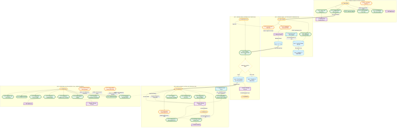

#### Matriks Pemetaan Interaksi Aktor vs Use Case vs Keterkaitan Relasi vs Sistem Eksternal

| No | Fase Siklus Hidup | Aktor Pemrakarsa | Use Case Pemicu (Base UC) | Relasi Keterkaitan (`<<extend>>` / Pre-condition) | Layanan Eksternal / Timer | Respon Sistem & Mutasi Data |
| :---: | :--- | :--- | :--- | :--- | :--- | :--- |
| **1** | Penemuan Hunian | Tamu (*Guest*) | **UC-10** (Cek Katalog) | Standar Asosiasi | - | Query katalog kamar aktif, kamar maintenance disembunyikan. |
| **2** | Diskusi Awal | Tamu (*Guest*) | **UC-17** (Guest Chat) | Standar Asosiasi | - | Inisialisasi token cookie UUID & buat thread `guest_chat_threads`. |
| **3** | Registrasi Akun | Tamu (*Guest*) | **UC-12** (Registrasi Manual) | Mentransformasi Tamu $\rightarrow$ Calon Penyewa | - | Insert ke tabel `users` dengan peran `'penyewa'`. |
| **4** | Login Akun | Tamu / Calon / Penyewa / Admin | **UC-22** (Login Manual) | Pre-condition seluruh modul internal | - | Validasi kredensial hash bcrypt & buat session cookie. |
| **5** | Reset Sandi | Pengguna Terdaftar | **UC-22** (Login Manual) | `UC-24 -.-> \|extend\| UC-22` (bila lupa sandi) | **SMTP Mail Server** | Generate token reset di `password_reset_tokens` & kirim link email. |
| **6** | Single Sign-On | Tamu / Calon / Penyewa | **UC-18** (Google OAuth) | Alternatif autentikasi UC-22 | **Google OAuth API** | Handshake Socialite, middleware `EnsureProfileIsComplete` no HP. |
| **7** | Reservasi Kamar | Calon Penyewa | **UC-01** (Reservasi Kamar) | Syarat: Calon sudah login (Pre-condition) | - | Insert `reservasi` status `'pending'`, kunci status kamar. |
| **8** | Chat Pra-Bayar | Calon Penyewa & Admin | **UC-01** (Reservasi Kamar) | `UC-03 -.-> \|extend\| UC-01` (opsi diskusi) | - | Polling AJAX 3 detik via tabel `chat_messages`. |
| **9** | Bayar Reservasi | Calon Penyewa | **UC-01** (Reservasi Kamar) | `UC-02 -.-> \|extend\| UC-01` (opsi bayar) | **Midtrans Snap API** | Generate snap token, webhook memvalidasi SHA-512 $\rightarrow$ `'dp'` / `'lunas'`. |
| **10** | Timeout Reservasi | Otomasi Waktu | **UC-01** (Reservasi Kamar) | Scheduler trigger `reservasi:cancel-expired` | **Laravel Scheduler (Cron)** | Melepas kamar menjadi `'tersedia'`, update status `'dibatalkan'`. |
| **11** | Verifikasi & Transisi | Administrator | **UC-06** (Verifikasi Reservasi) | Mentransformasi Calon $\rightarrow$ Penyewa Aktif | **WhatsApp Gateway (Fonnte)** | `DB::transaction`: status `'dikonfirmasi'`, kamar `'terisi'`, buat record `penyewa`, kirim WA kredensial. |
| **12** | Tolak Reservasi | Administrator | **UC-06** (Verifikasi Reservasi) | Exception Flow penolakan dokumen | - | Update status reservasi `'dibatalkan'`, lepas status kamar. |
| **13** | Auto-Billing Bulanan | Otomasi Waktu | **UC-28** (Tugas Terjadwal) | Scheduler tgl 1 jam 00:05 WIB | **WhatsApp Gateway (Fonnte)** | Filter penyewa bulanan, generate `tagihan` tempo tgl 10, kirim WA rincian. |
| **14** | Denda & Eskalasi | Otomasi Waktu | **UC-28** (Tugas Terjadwal) | Scheduler harian jam 01:00 WIB | **WhatsApp Gateway (Fonnte)** | Idempotency guard: denda flat 5% saat ganti bulan; eskalasi WA ke wali di bulan ke-2. |
| **15** | Bayar Tagihan Online | Penyewa Aktif | **UC-04** (Bayar Tagihan Bulanan) | Standar Asosiasi Pembayaran | **Midtrans Snap API** | Webhook callback $\rightarrow$ update status tagihan `'lunas'`, insert `pembayaran`. |
| **16** | Bayar Tagihan Tunai | Penyewa & Admin | **UC-04** (Bayar Tagihan Bulanan) | Diverifikasi oleh Admin via **UC-06** | - | `DB::transaction`: Admin klik konfirmasi cash $\rightarrow$ tagihan `'lunas'`. |
| **17** | Unduh Kuitansi | Penyewa Aktif | **UC-04** (Bayar Tagihan Bulanan) | `UC-25 -.-> \|extend\| UC-04` (hanya jika lunas) | - | Stream unduhan berkas PDF kuitansi resmi berbasis Dompdf. |
| **18** | Pengaduan Keluhan | Penyewa Aktif | **UC-05** (Mengajukan Keluhan) | Standar Asosiasi Layanan Hunian | **WhatsApp Gateway (Fonnte)** | Simpan ke `keluhan` status `'pending'`, trigger WA ke nomor admin kost. |
| **19** | Resolusi Keluhan | Administrator | **UC-15** (Memproses Keluhan) | Menindaklanjuti data dari **UC-05** | **WhatsApp Gateway (Fonnte)** | Admin ubah status `'diproses'` $\rightarrow$ `'selesai'`, trigger WA ke penyewa. |
| **20** | Checkout Penyewa | Administrator | **UC-14** (Manajemen Penyewa) | `UC-26 -.-> \|extend\| UC-14` (aksi selesai sewa) | - | Status penyewa `'nonaktif'`, kamar tetap `'terisi'` untuk inspeksi fisik. |
| **21** | Perpanjang Sewa | Administrator | **UC-14** (Manajemen Penyewa) | `UC-26 -.-> \|extend\| UC-14` (aksi lanjut sewa) | - | Update `tanggal_selesai` dan terbitkan tagihan sewa periode baru. |
| **22** | Ekspor Laporan | Administrator | **UC-07** / **UC-14** / **UC-08** | `UC-27 -.-> \|extend\| UC-07/14/08` | - | Ekspor berkas cetak PDF atau spreadsheet Excel/CSV (BOM UTF-8). |
| **23** | Visual Kalender | Administrator | **UC-19** (Kalender Visual) | Standar Asosiasi Kontrol | - | Render event survei, check-in, check-out, jatuh tempo tagihan & denda. |
| **24** | Broadcast Pesan | Administrator | **UC-20** (Broadcast Notifikasi) | Standar Asosiasi Komunikasi | **Fonnte (WA)** & **SMTP (Mail)** | Dispatch notifikasi massal ke seluruh penyewa dan simpan ke `log_notifikasi`. |
| **25** | Audit & Error Log | Administrator | **UC-29** (Log Audit Sistem) | Standar Asosiasi Maintenance | - | Tinjauan rekam jejak error teknis, perubahan data, dan otentikasi. |

---

### 2.8. Visualisasi Alur Proses Interaksi End-to-End per Siklus Bisnis

#### 2.8.1. Alur Siklus 1: Registrasi, Reservasi Kamar, Chat Pre-Payment, Pembayaran Snap, dan Transisi Akun Otomatis

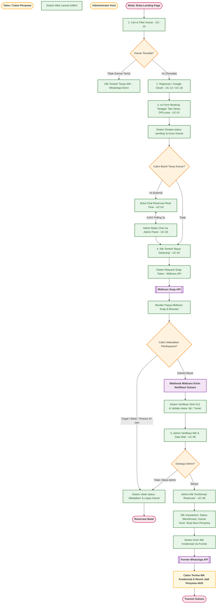

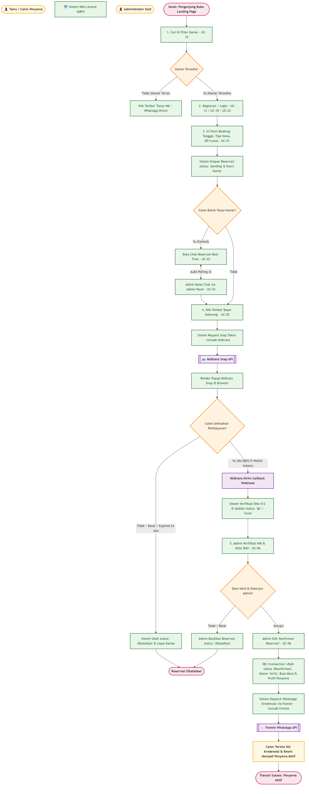

---

#### 2.8.2. Alur Siklus 2: Penagihan Bulanan Otomatis, Denda Flat 5% Idempoten, Eskalasi WhatsApp Wali, Pembayaran, dan Unduh Kuitansi PDF

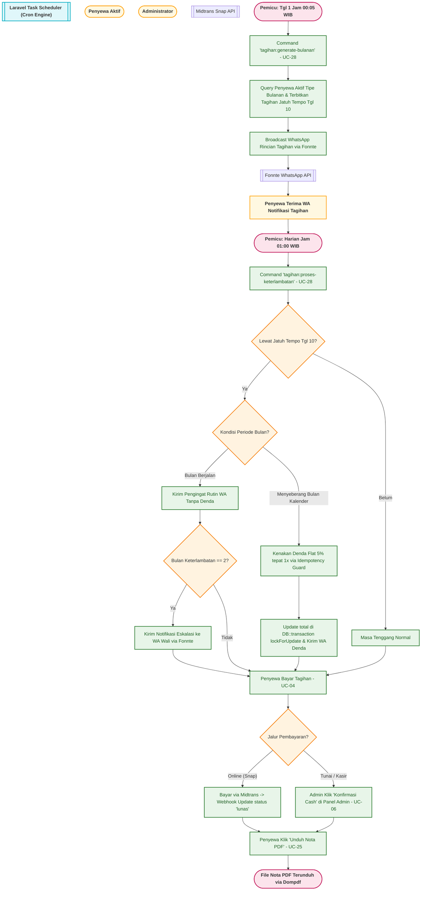

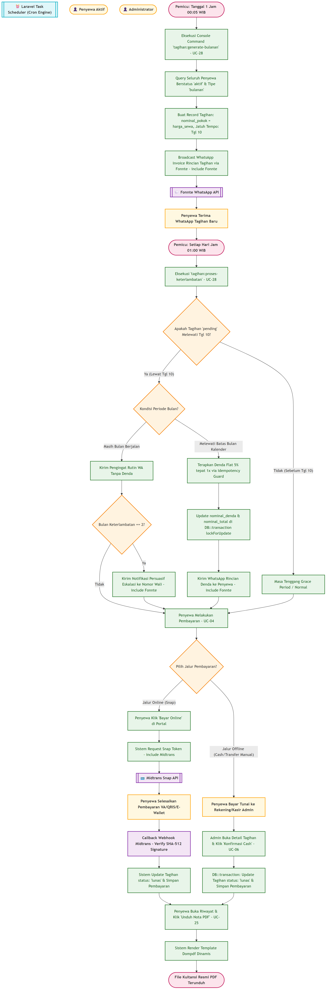

---

#### 2.8.3. Alur Siklus 3: Pengaduan Keluhan Fasilitas, Penanganan Operasional, dan Notifikasi WA

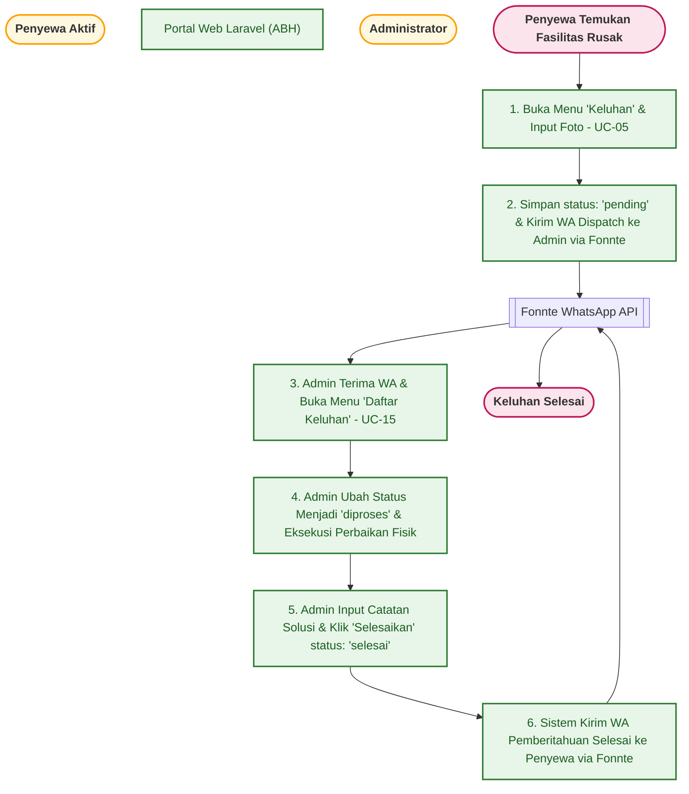

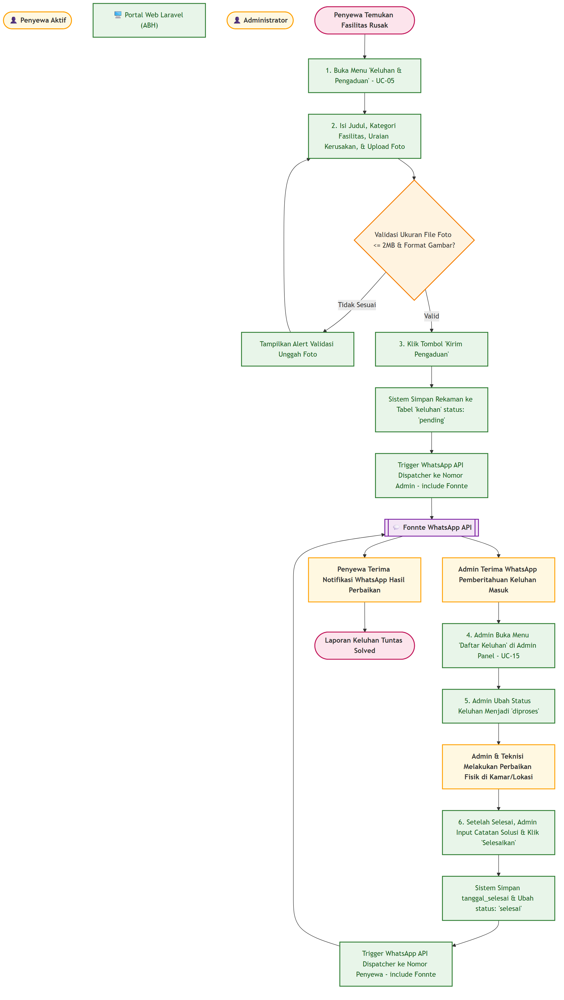

---

#### 2.8.4. Alur Siklus 4: Pengakhiran Kontrak (Checkout & Refund Deposit) vs Perpanjangan Sewa

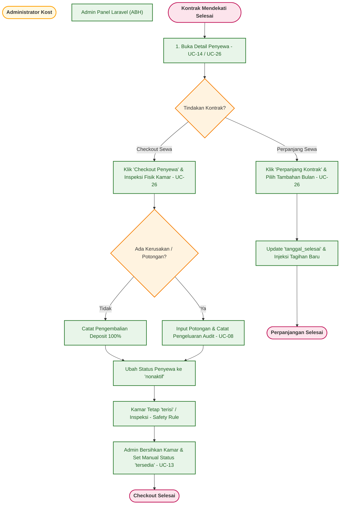

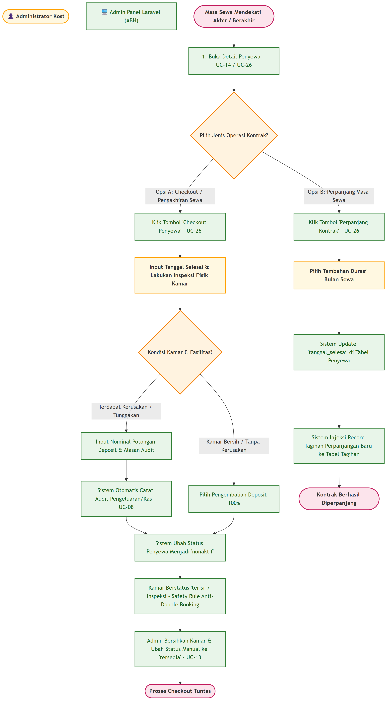

---

#### 2.8.5. Alur Siklus 5: Interaksi Guest Chat Publik Tanpa Login & Pelacakan Tombol WhatsApp

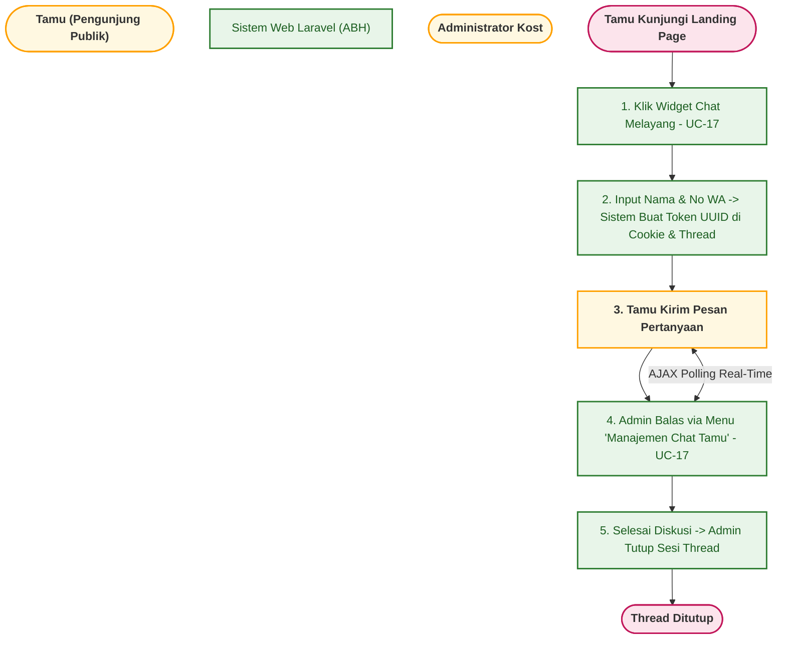

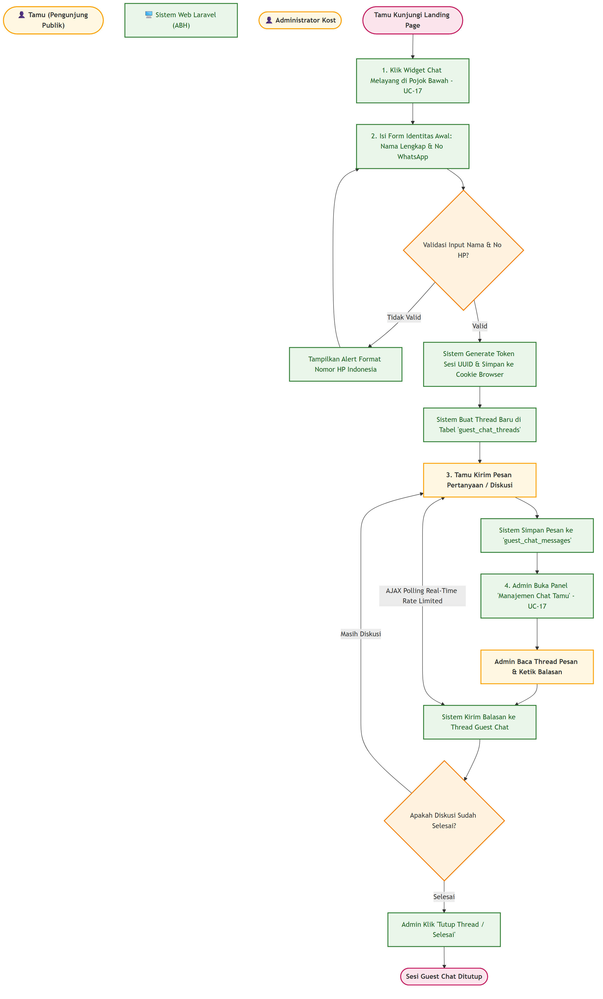

---

## 3. Spesifikasi Detail 29 Use Case Fungsional

Berikut adalah penjabaran langkah-langkah, kondisi batas, serta alur kerja dari 29 use case utama sistem.

### 3.1. Kelompok Use Case: Otentikasi, Publik & Calon Penyewa

#### UC-01: Melakukan Reservasi Kamar
* **Aktor Utama**: Calon Penyewa
* **Aktor Otomasi**: System Scheduler (Timer/Cron) untuk batas kedaluwarsa
* **Deskripsi**: Calon penyewa memesan unit kamar kost tertentu secara online dengan menentukan tanggal masuk, durasi sewa, tipe sewa, dan skema pembayaran.
* **Kondisi Awal (Pre-condition)**: Calon penyewa sudah terdaftar dan melakukan login ke sistem. Kamar yang dipilih berstatus `'tersedia'`.
* **Alur Utama (Main Flow)**:
  1. Calon penyewa membuka halaman katalog kamar (`/kamar`) atau detail kamar.
  2. Sistem menampilkan spesifikasi kamar, harga sewa, foto, dan status ketersediaan.
  3. Calon penyewa mengisi formulir pemesanan: Tanggal Mulai, Durasi Sewa, Tipe Sewa (harian, mingguan, bulanan), Catatan Khusus, dan memilih Opsi Pembayaran (DP 30% atau Lunas 100%).
  4. Calon penyewa menekan tombol **"Pesan Unit"**.
  5. Sistem menghitung estimasi total harga secara otomatis.
  6. Calon penyewa mengonfirmasi pemesanan.
  7. Sistem membuat entri baru di tabel `reservasi` dengan status `'pending'` dan menerbitkan nomor transaksi unik (`order_id`).
  8. Sistem mengunci kamar sementara dan membuka akses chat room diskusi reservasi (`UC-03`).
* **Alur Alternatif (Alternative Flow)**:
  * *Alur 1A (Pembatalan Mandiri oleh Calon)*: Calon penyewa dapat menekan tombol **"Batalkan Pemesanan"** pada halaman detail reservasi pending (`POST /penyewa/reservasi/{id}/batal`). Sistem mengubah status reservasi menjadi `'dibatalkan'` dan melepas penguncian kamar menjadi `'tersedia'`.
  * *Alur 1B (Auto-Expire Timeout 24 Jam via Scheduler)*: Jika calon penyewa tidak menyelesaikan pembayaran dalam batas waktu (24 jam), tugas terjadwal `reservasi:cancel-expired` secara otomatis mengubah status menjadi `'dibatalkan'` dan melepas kunci kamar.
* **Kondisi Akhir (Post-condition)**: Reservasi baru tersimpan di database dengan status `'pending'`, dan kamar terkunci dari pemesanan pengguna lain.

#### UC-02: Melakukan Pembayaran Reservasi (Midtrans Snap)
* **Aktor Utama**: Calon Penyewa
* **Aktor Sekunder**: Payment Gateway (Midtrans)
* **Deskripsi**: Calon penyewa membayar uang muka (DP 30%) atau pelunasan (100%) reservasi secara online melalui Payment Gateway Midtrans Snap.
* **Kondisi Awal (Pre-condition)**: Reservasi tersimpan dengan status `'pending'` dan `snap_token` berhasil digenerasi oleh sistem.
* **Alur Utama (Main Flow)**:
  1. Calon penyewa membuka halaman detail reservasi (`/penyewa/reservasi/{id}`).
  2. Sistem menampilkan detail pesanan, rincian biaya, stepper alur pembayaran, dan tombol **"Bayar Sekarang"**.
  3. Calon penyewa menekan tombol **"Bayar Sekarang"**.
  4. Sistem memicu pop-up portal Midtrans Snap di antarmuka browser.
  5. Calon penyewa memilih metode pembayaran (Virtual Account, E-wallet QRIS, dll.) dan menyelesaikan transfer.
  6. Webhook Midtrans mengirim callback notifikasi status transaksi ke sistem (`/api/midtrans/callback-reservasi`).
  7. Sistem memverifikasi kecocokan `signature_key` SHA-512 dan nominal bayar.
  8. Sistem memperbarui status reservasi menjadi `'dp'` atau `'lunas'` di tabel `reservasi`.
  9. Sistem mencatat log transaksi keuangan ke tabel `pembayaran`.
* **Kondisi Akhir (Post-condition)**: Status reservasi di database berubah menjadi `'dp'` atau `'lunas'`, dan tercatat transaksi pembayaran yang sah.

#### UC-03: Diskusi Real-time Chat Reservasi
* **Aktor Utama**: Calon Penyewa, Administrator
* **Deskripsi**: Media komunikasi interaktif real-time menggunakan AJAX Polling untuk membahas kesiapan kamar, aturan, atau negosiasi sebelum reservasi disetujui.
* **Kondisi Awal (Pre-condition)**: Reservasi aktif dan tersimpan di database.
* **Alur Utama (Main Flow)**:
  1. Calon penyewa membuka detail reservasi lalu masuk ke menu chat (`/penyewa/reservasi/{id}/chat`).
  2. Administrator membuka detail reservasi di admin panel (`/admin/reservasi/{id}`).
  3. Salah satu pihak mengetik pesan lalu menekan kirim.
  4. Sistem menyimpan pesan ke tabel `chat_messages` dengan pengenal `reservasi_id` dan `sender_id`.
  5. Secara berkala (AJAX polling interval 3 detik), antarmuka Calon Penyewa dan Administrator menyinkronkan dan merender pesan baru.
* **Kondisi Akhir (Post-condition)**: Riwayat percakapan tersimpan secara urut kronologis berdasarkan waktu (`created_at`).

#### UC-10: Pencarian & Pengecekan Ketersediaan Kamar
* **Aktor Utama**: Tamu (Guest), Calon Penyewa
* **Deskripsi**: Menguji ketersediaan unit kamar kost putri secara real-time pada katalog publik menggunakan pencarian teks, tingkat lantai, dan tipe kelas kamar.
* **Kondisi Awal (Pre-condition)**: Pengunjung membuka halaman katalog `/kamar` atau landing page.
* **Alur Utama (Main Flow)**:
  1. Pengunjung memasukkan kata kunci pencarian, memfilter berdasarkan Lantai, Tipe Kamar, atau Tanggal Masuk & Durasi Sewa.
  2. Sistem menyaring kamar kost yang aktif (kamar berstatus `'maintenance'` disembunyikan).
  3. Untuk kamar berstatus `'tersedia'`, sistem memuat tombol **"Pesan Unit"**.
  4. Untuk kamar berstatus `'terisi'`, sistem memuat tombol WhatsApp **"Tanya WA"** (klik dicatat di tabel `whatsapp_clicks`).
* **Kondisi Akhir (Post-condition)**: Pengunjung melihat ketersediaan kamar yang akurat dan dialihkan ke form reservasi.

#### UC-12: Registrasi Akun Calon Penyewa
* **Aktor Utama**: Tamu (Guest)
* **Deskripsi**: Tamu mendaftarkan akun di sistem agar dapat melakukan pemesanan kamar dan melakukan diskusi pra-pembayaran.
* **Kondisi Awal (Pre-condition)**: Tamu belum memiliki akun terdaftar atau belum login ke sistem.
* **Alur Utama (Main Flow)**:
  1. Tamu membuka halaman registrasi (`/reservasi/register`).
  2. Sistem menampilkan formulir registrasi (Nama Lengkap, Email, Password, Konfirmasi Password, No HP opsional).
  3. Tamu mengisi formulir dan menekan daftar.
  4. Sistem melakukan validasi isian.
  5. Jika nomor HP kosong, sistem menghasilkan HP bayangan sementara (`temp_[timestamp]_[rand]`).
  6. Sistem membuat entri di tabel `users` dengan peran `'penyewa'`.
* **Kondisi Akhir (Post-condition)**: Akun user baru tersimpan di database dan pengguna langsung terautentikasi.

#### UC-16: Mengakses Riwayat Pemesanan, Pembayaran, dan Chat
* **Aktor Utama**: Calon Penyewa, Penyewa Aktif
* **Deskripsi**: Penyewa/calon mengakses riwayat transaksi pemesanan, pembayaran tagihan, serta log obrolan chat reservasi mereka melalui portal internal secara terpisah.
* **Kondisi Awal (Pre-condition)**: Pengguna sudah login sebagai peran `'penyewa'`.
* **Alur Utama (Main Flow)**:
  1. Pengguna membuka sidebar navigasi portal penyewa.
  2. **Riwayat Pemesanan**: Mengakses `/penyewa/reservasi/pemesanan`.
  3. **Riwayat Pembayaran**: Mengakses `/penyewa/reservasi/pembayaran`.
  4. **Riwayat Log Chat**: Mengakses `/penyewa/reservasi/{reservasi}/chat` atau `/penyewa/reservasi/riwayat-chat`.
* **Kondisi Akhir (Post-condition)**: Pengguna melihat daftar riwayat transaksi dan log chat secara transparan.

#### UC-17: Diskusi via Guest Chat (Tamu & Admin)
* **Aktor Utama**: Tamu (Guest), Administrator
* **Deskripsi**: Tamu memulai obrolan dengan memasukkan Nama dan nomor WhatsApp pada widget obrolan di halaman landing (tanpa login). Obrolan dilacak menggunakan token sesi berbasis cookie (`guest_chat_token`). Administrator dapat membalas dan mengelola obrolan dari panel admin.
* **Kondisi Awal (Pre-condition)**: Tamu membuka website / landing page.
* **Alur Utama (Main Flow)**:
  1. Tamu mengklik widget obrolan melayang di pojok kanan bawah.
  2. Tamu mengisi formulir awal (Nama Lengkap dan Nomor WhatsApp).
  3. Sistem memvalidasi input, membuat token sesi UUID, menyimpannya di cookie, dan mendaftarkan thread di `guest_chat_threads`.
  4. Tamu mengetik pesan obrolan. Sistem menyimpan ke `guest_chat_messages`.
  5. Admin membuka dashboard **"Manajemen Chat Tamu"** (`/admin/guest-chats`) untuk membalas atau menutup sesi obrolan.
* **Kondisi Akhir (Post-condition)**: Riwayat obrolan tamu tersimpan di database dan terkelola secara interaktif.

#### UC-18: Login & Registrasi via Google OAuth (SSO) & Kelengkapan Profil
* **Aktor Utama**: Tamu (Guest), Calon Penyewa, Penyewa Aktif
* **Aktor Sekunder**: Google Identity Services (OAuth 2.0)
* **Deskripsi**: Membantu pengguna mendaftar atau masuk ke sistem menggunakan akun Google secara instan, lengkap dengan pengisian nomor WhatsApp dan filter keamanan email admin.
* **Kondisi Awal (Pre-condition)**: Pengguna memiliki akun Google aktif dan belum login ke sistem.
* **Alur Utama (Main Flow)**:
  1. Pengguna mengklik tombol **"Masuk dengan Google"**.
  2. Sistem mengalihkan pengguna ke consent screen Google OAuth.
  3. Google mengembalikan callback data profil pengguna (Nama, Email, Avatar) ke server Laravel via Socialite.
  4. Sistem memeriksa apakah email terdaftar; jika belum, dibuat entri baru di tabel `users` dengan peran `'penyewa'`.
  5. **Middleware EnsureProfileIsComplete**: Jika nomor HP masih format sementara/kosong, sistem mengalihkan user ke form kelengkapan profil (`/profil/complete`).
  6. Pengguna menginput nomor WhatsApp berformat Indonesia yang valid dan sistem menyimpan profil lengkap.
* **Kondisi Akhir (Post-condition)**: Pengguna berhasil login/registrasi dan seluruh profil wajib tersimpan di database.

#### UC-22: Login Akun Manual (Portal Admin, Calon Penyewa, & Penyewa Aktif)
* **Aktor Utama**: Calon Penyewa, Penyewa Aktif, Administrator
* **Deskripsi**: Aktor masuk ke portal/aplikasi menggunakan kombinasi Email/Username dan Kata Sandi (Password) secara terpisah untuk menjamin isolasi portal keamanan.
* **Kondisi Awal (Pre-condition)**: Akun aktor telah terdaftar dan aktif di sistem.
* **Alur Utama (Main Flow)**:
  1. Aktor membuka halaman portal login rute masing-masing (`/login` atau `/admin/login`).
  2. Aktor memasukkan Email dan Password.
  3. Sistem memverifikasi kredensial dan memeriksa peran (`role`) aktor.
  4. Sesi login dibuat dan sistem mengalihkan pengguna ke dashboard yang sesuai.
* **Kondisi Akhir (Post-condition)**: Sesi aktor aktif dan pengguna mendapatkan akses ke fungsionalitas internal portal.

#### UC-24: Lupa & Reset Kata Sandi (Forgot & Reset Password)
* **Aktor Utama**: Calon Penyewa, Penyewa Aktif, Administrator
* **Aktor Sekunder**: SMTP Mail Server
* **Deskripsi**: Pengguna yang lupa kata sandi mengajukan permohonan reset password melalui tautan verifikasi email berbatas waktu (memperluas Use Case Login UC-22).
* **Kondisi Awal (Pre-condition)**: Pengguna memiliki email terdaftar di database dan mengakses form login.
* **Alur Utama (Main Flow)**:
  1. Pengguna mengklik tautan **"Lupa Password?"** di halaman login.
  2. Pengguna memasukkan alamat email yang terdaftar.
  3. Sistem memverifikasi email dan membuat token reset password di `password_reset_tokens`.
  4. Sistem memicu SMTP Mail Server untuk mengirimkan surel berisi tautan reset password unik.
  5. Pengguna mengklik tautan di email dan memasukkan password baru.
  6. Sistem memperbarui password terenkripsi di tabel `users`.
* **Kondisi Akhir (Post-condition)**: Password berhasil diperbarui dan pengguna dapat login dengan password baru.

---

### 3.2. Kelompok Use Case: Penyewa Aktif

#### UC-04: Membayar Tagihan Bulanan Rutin
* **Aktor Utama**: Penyewa Aktif
* **Aktor Sekunder**: Payment Gateway (Midtrans)
* **Deskripsi**: Penyewa melakukan pelunasan tagihan bulanan yang diterbitkan sistem via Midtrans online atau transfer manual ke rekening admin.
* **Kondisi Awal (Pre-condition)**: Akun penyewa aktif dan memiliki tagihan berstatus `'pending'`.
* **Alur Utama (Main Flow)**:
  1. Penyewa login ke portal penyewa dan masuk ke halaman **"Tagihan Saya"**.
  2. Sistem menampilkan daftar tagihan bulanan beserta rincian pokok dan denda.
  3. **Opsi Online**: Penyewa memilih bayar via Midtrans Snap. Webhook memperbarui status tagihan menjadi `'lunas'`.
  4. **Opsi Offline**: Penyewa transfer manual/cash dan admin mengonfirmasi secara manual di panel admin (`UC-06`).
  5. Sistem mencatat log transaksi keuangan ke tabel `pembayaran`.
* **Kondisi Akhir (Post-condition)**: Status tagihan berubah menjadi `'lunas'` dan tercatat transaksi pembayaran yang sah.

#### UC-05: Mengajukan Keluhan & Laporan Kerusakan
* **Aktor Utama**: Penyewa Aktif
* **Aktor Sekunder**: WhatsApp Gateway (Fonnte)
* **Deskripsi**: Penyewa melaporkan kerusakan fasilitas kamar atau fasilitas bersama melalui portal untuk ditanggapi oleh admin.
* **Kondisi Awal (Pre-condition)**: Penyewa memiliki kontrak aktif di sistem.
* **Alur Utama (Main Flow)**:
  1. Penyewa membuka halaman **"Keluhan & Pengaduan"** di portal penyewa.
  2. Penyewa mengisi form: Judul, Kategori Fasilitas, Deskripsi Detail Kerusakan, dan Unggah Foto Bukti ($\le$ 2MB).
  3. Penyewa mengirim laporan.
  4. Sistem menyimpan pengaduan ke tabel `keluhan` dengan status `'pending'`.
  5. Sistem memicu Fonnte WhatsApp API untuk mengirimkan notifikasi otomatis ke nomor WhatsApp Admin Kost.
* **Kondisi Akhir (Post-condition)**: Keluhan tersimpan di database dan admin menerima pemberitahuan WhatsApp secara instan.

#### UC-11: Mengakses Menu Peraturan & Tata Tertib
* **Aktor Utama**: Penyewa Aktif
* **Deskripsi**: Penyewa kost putri mengakses tata tertib hunian kost yang terdata dinamis di database.
* **Kondisi Awal (Pre-condition)**: Penyewa aktif login ke portal penyewa.
* **Alur Utama (Main Flow)**:
  1. Penyewa membuka sidebar menu portal penyewa dan memilih **"Peraturan Kost"** (`/penyewa/peraturan`).
  2. Sistem mengambil daftar peraturan dari tabel `peraturan` diurutkan berdasarkan kolom `urutan`.
  3. Sistem merender halaman dengan list tata tertib.
* **Kondisi Akhir (Post-condition)**: Penyewa melihat tata tertib kost terbaru secara transparan.

#### UC-21: Melihat Pengumuman & Notifikasi Pengelola
* **Aktor Utama**: Penyewa Aktif
* **Deskripsi**: Penyewa melihat riwayat log pesan notifikasi otomatis atau pengumuman manual yang diterbitkan oleh administrator melalui halaman notifikasi internal.
* **Kondisi Awal (Pre-condition)**: Penyewa aktif telah login ke portal penyewa.
* **Alur Utama (Main Flow)**:
  1. Penyewa membuka menu **"Notifikasi"** di sidebar portal penyewa (`/penyewa/notifikasi`).
  2. Sistem mengambil data log dari tabel `log_notifikasi` yang berasosiasi dengan ID penyewa.
  3. Sistem menyajikan log notifikasi secara kronologis terbalik dengan pagination.
* **Kondisi Akhir (Post-condition)**: Penyewa dapat meninjau seluruh riwayat pemberitahuan.

#### UC-25: Mengunduh Kuitansi Bukti Pembayaran PDF
* **Aktor Utama**: Penyewa Aktif
* **Deskripsi**: Penyewa mengunduh kuitansi resmi bukti pembayaran tagihan/reservasi yang telah lunas dalam format PDF (Dompdf).
* **Kondisi Awal (Pre-condition)**: Tagihan atau reservasi terkait berstatus `'lunas'`.
* **Alur Utama (Main Flow)**:
  1. Penyewa membuka detail tagihan atau riwayat pembayaran yang sudah lunas.
  2. Penyewa mengklik tombol **"Unduh Nota PDF"**.
  3. Sistem me-render template kuitansi Dompdf secara dinamis.
  4. Berkas PDF diunduh secara otomatis ke perangkat pengguna.
* **Kondisi Akhir (Post-condition)**: Berkas kuitansi PDF tersimpan di perangkat pengguna.

---

### 3.3. Kelompok Use Case: Administrator & Otomasi Sistem

#### UC-06: Verifikasi Reservasi Baru & Konfirmasi Pembayaran Tagihan Tunai (Cash)
* **Aktor Utama**: Administrator
* **Aktor Sekunder**: WhatsApp Gateway (Fonnte)
* **Deskripsi**: Admin meninjau data pengajuan reservasi, mencocokkan kelengkapan identitas KTP (NIK 16 digit), dan mengonfirmasi reservasi menjadi akun penyewa resmi, atau membatalkan reservasi, serta memverifikasi pembayaran tunai tagihan bulanan.
* **Kondisi Awal (Pre-condition)**: Terdapat data reservasi berstatus `'dp'`/`'lunas'` atau tagihan tunai yang menunggu konfirmasi.
* **Alur Utama (Main Flow)**:
  1. **Sub-Alur 1 (Konfirmasi Reservasi)**:
     - Admin membuka menu **"Daftar Reservasi"** (`/admin/reservasi`).
     - Admin memverifikasi NIK dan Data Wali, lalu menekan **"Konfirmasi Reservasi"**.
     - Sistem membungkus transaksi dalam `DB::transaction()`: status reservasi `'dikonfirmasi'`, kamar `'terisi'`, membuat profil penyewa, menyalin tarif sewa kamar ke `penyewa.harga_sewa`, menginjeksi tagihan sisa (jika DP), dan memicu pengiriman kredensial login via Fonnte WhatsApp API.
  2. **Sub-Alur 2 (Konfirmasi Pembayaran Kas Tunai)**:
     - Admin membuka menu **"Manajemen Tagihan"** (`/admin/tagihan`).
     - Admin memeriksa bukti transfer/uang tunai fisik dari penyewa, lalu menekan tombol **"Konfirmasi Cash"** (`POST /admin/tagihan/{id}/konfirmasi-cash`).
     - Sistem mengubah status tagihan menjadi `'lunas'` dan mencatat transaksi ke tabel `pembayaran`.
* **Alur Alternatif (Alternative Flow)**:
  * *Alur Alternatif 2A (Penolakan Reservasi oleh Admin)*: Admin menolak reservasi jika data identitas palsu atau kamar bermasalah teknis. Sistem mengubah status reservasi menjadi `'dibatalkan'` dan mengembalikan status kamar menjadi `'tersedia'`.
  * *Alur Alternatif 2B (Penghapusan Permanen Reservasi Batal)*: Pada reservasi yang telah dibatalkan, admin dapat menekan tombol **"Hapus Permanen"** untuk membersihkan record dari database beserta cascade riwayat chat-nya demi efisiensi storage.
* **Kondisi Akhir (Post-condition)**: Akun penyewa aktif terbuat atau tagihan tunai tervalidasi lunas secara atomik.

#### UC-07: Pencatatan & Evaluasi Laporan Arus Kas
* **Aktor Utama**: Administrator
* **Deskripsi**: Admin memantau arus keuangan masuk dan keluar, mencatat pengeluaran operasional, serta mengunduh laporan bulanan.
* **Kondisi Awal (Pre-condition)**: Data transaksi sudah terisi di database.
* **Alur Utama (Main Flow)**:
  1. Admin membuka menu **"Laporan Keuangan"** di dashboard admin panel.
  2. Sistem merinci arus kas masuk dan kas keluar.
  3. Admin menyaring laporan berdasarkan rentang Bulan & Tahun.
* **Kondisi Akhir (Post-condition)**: Laporan arus kas tervisualisasikan secara real-time.

#### UC-08: Pencatatan Pengeluaran Operasional (CRUD)
* **Aktor Utama**: Administrator
* **Deskripsi**: Admin mencatat pengeluaran operasional bulanan kost (arus kas keluar) beserta unggah foto bukti nota fisik.
* **Kondisi Awal (Pre-condition)**: Admin masuk ke panel admin.
* **Alur Utama (Main Flow)**:
  1. Admin masuk ke menu **"Manajemen Pengeluaran"** di panel admin.
  2. Admin menekan tombol **"Tambah Pengeluaran"**.
  3. Admin mengisi form (Nama, Kategori, Tanggal, Nominal, Foto Bukti Nota).
  4. Sistem menyimpan catatan transaksi ke tabel `pengeluaran`.
* **Kondisi Akhir (Post-condition)**: Riwayat pengeluaran tercatat di database dan kas keluar ter-update.

#### UC-09: Manajemen Konten Dinamis (Peraturan, FAQ, Galeri, Testimoni)
* **Aktor Utama**: Administrator
* **Deskripsi**: Admin mengelola konten pendukung halaman publik (peraturan tata tertib, FAQ interaktif, foto galeri kost, ulasan pelanggan).
* **Kondisi Awal (Pre-condition)**: Admin masuk ke panel admin.
* **Alur Utama (Main Flow)**:
  1. Admin membuka sub-menu manajemen konten (Galeri, FAQ, Peraturan, Ulasan/Review).
  2. Admin melakukan operasi Tambah, Edit, atau Hapus data konten.
  3. Sistem memperbarui database dan mengelola berkas media publik.
* **Kondisi Akhir (Post-condition)**: Perubahan data master ter-update secara dinamis.

#### UC-13: Manajemen Kamar & Fasilitas (CRUD & Soft Delete/Restore)
* **Aktor Utama**: Administrator
* **Deskripsi**: Admin menambah, memperbarui, memantau ketersediaan, menghapus (soft delete), serta memulihkan data kamar dan fasilitasnya.
* **Kondisi Awal (Pre-condition)**: Admin telah login ke panel admin.
* **Alur Utama (Main Flow)**:
  1. Admin membuka menu **"Manajemen Kamar"** (`/admin/kamar`) atau **"Manajemen Fasilitas"** (`/admin/fasilitas`).
  2. Admin mengelola data kamar (nomor, lantai, tipe, harga, status, foto) dan fasilitas terkait.
  3. **Safety Constraint Hapus**: Jika kamar terikat data penyewa/reservasi aktif, penghapusan diblokir demi integritas data. Jika aman, sistem mengeksekusi *Soft Delete*.
  4. **Restore**: Admin dapat memulihkan kamar yang terhapus via rute `/admin/kamar/{id}/restore`.
* **Kondisi Akhir (Post-condition)**: Data kamar dan fasilitas ter-update di database.

#### UC-14: Manajemen Penyewa (CRUD & Soft Delete/Restore)
* **Aktor Utama**: Administrator
* **Deskripsi**: Admin mengelola profil biodata penyewa, setup kontrak (tipe sewa harian/mingguan/bulanan, durasi), deposit jaminan, dan mengelola reaktivasi/restore kontrak.
* **Kondisi Awal (Pre-condition)**: Admin telah login ke panel admin.
* **Alur Utama (Main Flow)**:
  1. Admin membuka menu **"Manajemen Penyewa"** (`/admin/penyewa`).
  2. Admin mengedit data penyewa, deposit, NIK, dan data wali.
  3. **Safety Constraint**: Jika penyewa memiliki riwayat tagihan, akun tidak dapat dihapus permanen melainkan soft delete.
* **Kondisi Akhir (Post-condition)**: Data penyewa terkelola dengan aman dan integritas basis data terjaga.

#### UC-15: Memproses & Menanggapi Keluhan (CRUD)
* **Aktor Utama**: Administrator
* **Aktor Sekunder**: WhatsApp Gateway (Fonnte)
* **Deskripsi**: Admin meninjau laporan keluhan kerusakan dari penyewa aktif, memproses perbaikan, dan memberikan tanggapan status selesai.
* **Kondisi Awal (Pre-condition)**: Ada laporan keluhan masuk dengan status `'pending'`.
* **Alur Utama (Main Flow)**:
  1. Admin membuka menu **"Daftar Keluhan"** (`/admin/keluhan`).
  2. Admin mengubah status menjadi `'diproses'` saat perbaikan berlangsung.
  3. Setelah selesai, admin menulis tanggapan dan mengubah status menjadi `'selesai'`.
  4. Sistem memicu Fonnte WA API untuk mengirim notifikasi ke WhatsApp penyewa.
* **Kondisi Akhir (Post-condition)**: Status keluhan berubah menjadi `'selesai'` dan penyewa menerima konfirmasi via WhatsApp.

#### UC-19: Memantau Kalender Kontrol Visual (Visual Control Center)
* **Aktor Utama**: Administrator
* **Deskripsi**: Admin memantau seluruh jadwal aktivitas reservasi, rencana kunjungan survei, jadwal check-in/out, serta tagihan denda keterlambatan penyewa dalam format kalender visual Alpine.js.
* **Kondisi Awal (Pre-condition)**: Admin telah login ke panel admin.
* **Alur Utama (Main Flow)**:
  1. Admin membuka rute `/admin/kalender`.
  2. Sistem memuat kalender berbasis Alpine.js yang mengambil event dari endpoint `/api/kalender/events`.
  3. Sistem menyajikan visual event berkode warna (Survei, Check-in, Check-out, Tagihan & Denda).
* **Kondisi Akhir (Post-condition)**: Seluruh jadwal operasional tervisualisasikan secara presisi.

#### UC-20: Broadcast Notifikasi & Pengumuman Kustom
* **Aktor Utama**: Administrator
* **Aktor Sekunder**: WhatsApp Gateway (Fonnte), SMTP Mail Server
* **Deskripsi**: Admin membuat pesan pengumuman kustom dan mendistribusikannya secara langsung kepada penyewa via WhatsApp, Email, dan web portal.
* **Kondisi Awal (Pre-condition)**: Admin login ke panel admin.
* **Alur Utama (Main Flow)**:
  1. Admin masuk ke menu **"Manajemen Notifikasi"** (`/admin/notifikasi`).
  2. Admin memilih penerima, menginput judul & isi pesan, dan memilih media pengiriman (WhatsApp / Email).
  3. Sistem memproses pengiriman asinkron dan mencatat log di `log_notifikasi`.
* **Kondisi Akhir (Post-condition)**: Pengumuman terkirim ke penyewa dan log pengiriman tersimpan.

#### UC-23: Manajemen Pengaturan Sistem (Settings)
* **Aktor Utama**: Administrator
* **Deskripsi**: Admin mengelola konfigurasi umum sistem kost seperti rekening bank penerima transfer manual, kontak darurat WhatsApp, nominal jaminan deposit, dan iframe Google Maps.
* **Kondisi Awal (Pre-condition)**: Admin login ke panel admin.
* **Alur Utama (Main Flow)**:
  1. Admin membuka halaman **"Pengaturan Aplikasi"** (`/admin/settings`).
  2. Admin mengubah data konfigurasi dan menyimpannya.
  3. Sistem memperbarui tabel `settings` di database.
* **Kondisi Akhir (Post-condition)**: Pengaturan sistem ter-update secara global.

#### UC-26: Process Checkout & Perpanjangan Kontrak Penyewa
* **Aktor Utama**: Administrator
* **Deskripsi**: Admin memproses pengakhiran sewa (Checkout) termasuk pengembalian deposit dan pelepasan status kamar, atau memproses perpanjangan durasi sewa penyewa.
* **Kondisi Awal (Pre-condition)**: Penyewa berstatus `'aktif'`.
* **Alur Utama (Main Flow)**:
  1. Admin membuka halaman detail penyewa di panel admin.
  2. **Sub-Alur Checkout**: Admin menekan tombol **"Checkout Penyewa"**, mengonfirmasi tanggal keluar dan kondisi deposit. Sistem mengubah status penyewa menjadi `'nonaktif'`. Kamar tetap berstatus `'terisi'` untuk inspeksi fisik, sebelum diubah manual oleh admin ke `'tersedia'` (`UC-13`).
  3. **Sub-Alur Perpanjang**: Admin menekan tombol **"Perpanjang Kontrak"**, memilih tambahan durasi bulan. Sistem memperbarui tanggal selesai sewa dan menerbitkan tagihan perpanjangan baru.
* **Kondisi Akhir (Post-condition)**: Status penyewa dan kamar ter-update sesuai tindakan checkout/perpanjang.

#### UC-27: Mengekspor Laporan & Data (PDF / Excel / CSV)
* **Aktor Utama**: Administrator
* **Deskripsi**: Admin mengekspor dokumen fisik cetak atau berkas spreadsheet untuk data Laporan Arus Kas, Daftar Penyewa, dan Pengeluaran Operasional yang melestarikan status filter pencarian aktif.
* **Kondisi Awal (Pre-condition)**: Data terkait tersedia pada modul laporan atau data master admin.
* **Alur Utama (Main Flow)**:
  1. Admin masuk ke halaman Laporan Keuangan, Manajemen Penyewa, atau Manajemen Pengeluaran.
  2. Admin memilih filter rentang tanggal/status data.
  3. Admin menekan tombol **"Ekspor PDF"**, **"Ekspor Excel"**, atau **"Ekspor CSV"** (BOM UTF-8).
  4. Sistem memproses file stream dan mengunduh berkas ke perangkat admin.
* **Kondisi Akhir (Post-condition)**: Berkas ekspor terunduh secara aman di perangkat admin.

#### UC-28: Otomasi Billing Bulanan, Denda Keterlambatan Flat 5%, dan Tugas Terjadwal
* **Aktor Otomasi**: System Scheduler (Timer/Cron)
* **Aktor Sekunder**: WhatsApp Gateway (Fonnte)
* **Deskripsi**: Proses latar belakang otomatis Laravel Scheduler yang mengeksekusi 4 siklus penting secara berkala tanpa intervensi manusia.
* **Kondisi Awal (Pre-condition)**: Waktu server mencapai jadwal eksekusi Laravel Scheduler.
* **Alur Utama (Main Flow)**:
  1. **Siklus 1: Penerbitan Tagihan Bulanan (Setiap Tanggal 1 Jam 00:05 WIB)**:
     - Scheduler memicu command `tagihan:generate-bulanan`.
     - Sistem mengambil penyewa aktif bertipe bulanan (`whereNotIn('tipe_sewa', ['harian', 'mingguan'])`).
     - Sistem menerbitkan tagihan baru dengan `nominal_pokok = penyewa.harga_sewa` dan jatuh tempo seragam tanggal 10.
     - Sistem memicu Fonnte WA API untuk mengirimkan notifikasi rincian tagihan ke penyewa.
  2. **Siklus 2: Denda Keterlambatan Flat 5% & Eskalasi Wali (Setiap Hari Jam 01:00 WIB)**:
     - Scheduler memicu command `tagihan:proses-keterlambatan`.
     - Sistem mengambil tagihan pending yang melewati jatuh tempo tanggal 10.
     - Jika masih dalam bulan berjalan, kirim pengingat reguler tanpa denda.
     - Jika keterlambatan memasuki bulan kedua, kirim notifikasi persuasif ke nomor Wali (`no_wali`).
     - Jika keterlambatan menyeberang batas bulan kalender, kenakan denda flat 5% tepat satu kali melalui *Idempotency Guard* di dalam `DB::transaction()` dengan `lockForUpdate()`.
  3. **Siklus 3: Pembatalan Reservasi Kedaluwarsa (Setiap Jam / Harian)**:
     - Scheduler memicu command `reservasi:cancel-expired`.
     - Mengubah status reservasi pending yang melebihi batas toleransi 24 jam menjadi `'dibatalkan'` dan melepas kunci kamar.
  4. **Siklus 4: Pembersihan Log Notifikasi (Harian)**:
     - Scheduler memicu command `log-notifikasi:clear`.
     - Menghapus log pengiriman berumur $> 90$ hari demi menjaga efisiensi database produksi.
* **Kondisi Akhir (Post-condition)**: Tagihan rutin terbit, denda terhitung idempoten, dan tugas housekeeping sistem berjalan bersih.

#### UC-29: Memantau Log Audit & Activity System
* **Aktor Utama**: Administrator
* **Deskripsi**: Admin memantau log aktivitas sistem, jejak error teknis, dan catatan audit transaksi khusus untuk keperluan pemeliharaan aplikasi.
* **Kondisi Awal (Pre-condition)**: Admin login ke panel admin.
* **Alur Utama (Main Flow)**:
  1. Admin membuka rute `/admin/notifikasi-khusus`.
  2. Sistem menyajikan daftar log audit aktivitas sistem.
  3. Admin dapat meninjau rincian log atau menghapus log aktivitas lama.
* **Kondisi Akhir (Post-condition)**: Log audit tervisualisasikan dan dapat dikelola oleh admin.

---

## 4. Kepatuhan Aturan Bisnis (Business Rules Compliance)

Seluruh use case wajib mematuhi aturan bisnis database berikut:

1. **Keamanan Transaksi Finansial (Atomic Transactions)**:
   Setiap pencatatan pelunasan tagihan manual cash wajib dibungkus dalam transaksi database (`DB::transaction`) untuk memastikan status tagihan menjadi `'lunas'` dan baris log pada tabel `pembayaran` dibuat secara atomik.
2. **Imutabilitas Tarif Sewa (`penyewa.harga_sewa`)**:
   Saat konfirmasi reservasi berhasil, tarif bulanan dasar disalin permanen dari `kamar.harga_bulan` ke `penyewa.harga_sewa`. Tarif ini personal dan dapat disesuaikan admin di masa depan tanpa mengubah harga kamar umum.
3. **Eskalasi Denda Keterlambatan Flat Kalender**:
   Tagihan bulanan diterbitkan tanggal 1 dengan jatuh tempo tanggal 10. Denda flat 5% diberlakukan secara otomatis tepat satu kali saat menyeberang bulan kalender berikutnya melalui *Idempotency Guard*. Notifikasi eskalasi dikirim ke wali saat keterlambatan memasuki bulan ke-2.
4. **Keamanan Hapus (Safety Deletion Constraints & Soft Deletes)**:
   * Unit **Kamar** dan **Penyewa** menerapkan *Soft Delete* (`deleted_at`).
   * Kamar tidak dapat dihapus jika terikat dengan data `penyewa` atau `reservasi` aktif.
   * Profil **Penyewa** tidak dapat dihapus jika memiliki riwayat transaksi/tagihan di database.
5. **Konsistensi Check-Out**:
   Saat status penyewa diubah menjadi `'nonaktif'`, kamar tetap dalam status `'terisi'` (dalam inspeksi fisik) sebelum statusnya dikembalikan manual oleh admin ke `'tersedia'`.

---

## 5. Pemetaan Complete Use Case ke Modul & Rute Laravel (Code Mapping Table)

Berikut adalah rujukan teknis 29 Use Case yang terhubung langsung dengan Controller, Route URL, dan View Blade di codebase Laravel:

| ID Use Case | Nama Use Case | Controller Pengendali | Rute / Endpoint URL | View Template / Blade |
| :--- | :--- | :--- | :--- | :--- |
| **UC-01** | Melakukan Reservasi | [ReservasiController](file:///c:/xampp/htdocs/asri-boarding-house/app/Http/Controllers/Penyewa/ReservasiController.php)@store | POST `/penyewa/reservasi` POST `/penyewa/reservasi/{id}/batal` | [landing/show.blade.php](file:///c:/xampp/htdocs/asri-boarding-house/resources/views/landing/show.blade.php) |
| **UC-02** | Pembayaran Reservasi | [ReservasiController](file:///c:/xampp/htdocs/asri-boarding-house/app/Http/Controllers/Penyewa/ReservasiController.php)@pay   [MidtransReservasiCallbackController](file:///c:/xampp/htdocs/asri-boarding-house/app/Http/Controllers/Api/MidtransReservasiCallbackController.php) | GET `/penyewa/reservasi/{id}`   POST `/api/midtrans/callback-reservasi` | [penyewa/reservasi/show.blade.php](file:///c:/xampp/htdocs/asri-boarding-house/resources/views/penyewa/reservasi/show.blade.php) |
| **UC-03** | Chat Reservasi Real-time | [ChatController](file:///c:/xampp/htdocs/asri-boarding-house/app/Http/Controllers/Api/ChatController.php) | GET/POST `/chat-box/{reservasi}/*` GET `/penyewa/reservasi/{id}/chat` | [components/chat-box.blade.php](file:///c:/xampp/htdocs/asri-boarding-house/resources/views/components/chat-box.blade.php) |
| **UC-04** | Membayar Tagihan Rutin | [TagihanController](file:///c:/xampp/htdocs/asri-boarding-house/app/Http/Controllers/Penyewa/TagihanController.php)   [MidtransCallbackController](file:///c:/xampp/htdocs/asri-boarding-house/app/Http/Controllers/Api/MidtransCallbackController.php) | GET `/penyewa/tagihan/{id}`   POST `/api/midtrans/callback` | [penyewa/tagihan/show.blade.php](file:///c:/xampp/htdocs/asri-boarding-house/resources/views/penyewa/tagihan/show.blade.php) |
| **UC-05** | Mengajukan Keluhan | [KeluhanController](file:///c:/xampp/htdocs/asri-boarding-house/app/Http/Controllers/Penyewa/KeluhanController.php) | POST `/penyewa/keluhan` | [penyewa/keluhan/index.blade.php](file:///c:/xampp/htdocs/asri-boarding-house/resources/views/penyewa/keluhan/index.blade.php) |
| **UC-06** | Konfirmasi Reservasi & Kas | [ReservasiController](file:///c:/xampp/htdocs/asri-boarding-house/app/Http/Controllers/Admin/ReservasiController.php) [TagihanController](file:///c:/xampp/htdocs/asri-boarding-house/app/Http/Controllers/Admin/TagihanController.php) | POST `/admin/reservasi/{id}/konfirmasi` POST `/admin/tagihan/{id}/konfirmasi-cash` | [admin/reservasi/show.blade.php](file:///c:/xampp/htdocs/asri-boarding-house/resources/views/admin/reservasi/show.blade.php) [admin/tagihan/show.blade.php](file:///c:/xampp/htdocs/asri-boarding-house/resources/views/admin/tagihan/show.blade.php) |
| **UC-07** | Laporan Arus Kas | [LaporanController](file:///c:/xampp/htdocs/asri-boarding-house/app/Http/Controllers/Admin/LaporanController.php) | GET `/admin/laporan` | [admin/laporan/index.blade.php](file:///c:/xampp/htdocs/asri-boarding-house/resources/views/admin/laporan/index.blade.php) |
| **UC-08** | Manajemen Pengeluaran | [PengeluaranController](file:///c:/xampp/htdocs/asri-boarding-house/app/Http/Controllers/Admin/PengeluaranController.php) | GET/POST/DELETE `/admin/pengeluaran` | [admin/pengeluaran/index.blade.php](file:///c:/xampp/htdocs/asri-boarding-house/resources/views/admin/pengeluaran/index.blade.php) |
| **UC-09** | Manajemen Konten Dinamis | [PeraturanController](file:///c:/xampp/htdocs/asri-boarding-house/app/Http/Controllers/Admin/PeraturanController.php)   [FaqController](file:///c:/xampp/htdocs/asri-boarding-house/app/Http/Controllers/Admin/FaqController.php)   [GalleryController](file:///c:/xampp/htdocs/asri-boarding-house/app/Http/Controllers/Admin/GalleryController.php)   [CustomerReviewController](file:///c:/xampp/htdocs/asri-boarding-house/app/Http/Controllers/Admin/CustomerReviewController.php) | GET/POST/DELETE `/admin/peraturan`   `/admin/faq`   `/admin/gallery`   `/admin/reviews` | [admin/peraturan/index.blade.php](file:///c:/xampp/htdocs/asri-boarding-house/resources/views/admin/peraturan/index.blade.php) |
| **UC-10** | Pencarian & Cek Kamar | [LandingController](file:///c:/xampp/htdocs/asri-boarding-house/app/Http/Controllers/Public/LandingController.php) | GET `/kamar`   GET `/` | [landing/kamar-list.blade.php](file:///c:/xampp/htdocs/asri-boarding-house/resources/views/landing/kamar-list.blade.php) |
| **UC-11** | Mengakses Peraturan | [DashboardController](file:///c:/xampp/htdocs/asri-boarding-house/app/Http/Controllers/Penyewa/DashboardController.php) | GET `/penyewa/peraturan` | [penyewa/peraturan.blade.php](file:///c:/xampp/htdocs/asri-boarding-house/resources/views/penyewa/peraturan.blade.php) |
| **UC-12** | Registrasi Akun | [ReservasiAuthController](file:///c:/xampp/htdocs/asri-boarding-house/app/Http/Controllers/Auth/ReservasiAuthController.php) | GET/POST `/reservasi/register` | [auth/reservasi-register.blade.php](file:///c:/xampp/htdocs/asri-boarding-house/resources/views/auth/reservasi-register.blade.php) |
| **UC-13** | Kelola Kamar & Fasilitas | [KamarController](file:///c:/xampp/htdocs/asri-boarding-house/app/Http/Controllers/Admin/KamarController.php)   [FasilitasController](file:///c:/xampp/htdocs/asri-boarding-house/app/Http/Controllers/Admin/FasilitasController.php) | GET/POST/PUT/DELETE `/admin/kamar`   POST `/admin/kamar/{id}/restore` | [admin/kamar/index.blade.php](file:///c:/xampp/htdocs/asri-boarding-house/resources/views/admin/kamar/index.blade.php) |
| **UC-14** | Kelola Penyewa (CRUD) | [PenyewaController](file:///c:/xampp/htdocs/asri-boarding-house/app/Http/Controllers/Admin/PenyewaController.php) | GET/POST/PUT/DELETE `/admin/penyewa`   POST `/admin/penyewa/{id}/restore` | [admin/penyewa/index.blade.php](file:///c:/xampp/htdocs/asri-boarding-house/resources/views/admin/penyewa/index.blade.php) |
| **UC-15** | Memproses Keluhan | [KeluhanController](file:///c:/xampp/htdocs/asri-boarding-house/app/Http/Controllers/Admin/KeluhanController.php) | GET/PUT `/admin/keluhan` | [admin/keluhan/index.blade.php](file:///c:/xampp/htdocs/asri-boarding-house/resources/views/admin/keluhan/index.blade.php) |
| **UC-16** | Riwayat Transaksi & Chat | [ReservasiController](file:///c:/xampp/htdocs/asri-boarding-house/app/Http/Controllers/Penyewa/ReservasiController.php) | GET `/penyewa/reservasi/pemesanan`   GET `/penyewa/reservasi/pembayaran` | [penyewa/riwayat-pembayaran.blade.php](file:///c:/xampp/htdocs/asri-boarding-house/resources/views/penyewa/riwayat-pembayaran.blade.php) |
| **UC-17** | Diskusi via Guest Chat | [GuestChatApiController](file:///c:/xampp/htdocs/asri-boarding-house/app/Http/Controllers/Api/GuestChatApiController.php)   [GuestChatController](file:///c:/xampp/htdocs/asri-boarding-house/app/Http/Controllers/Admin/GuestChatController.php) | POST `/api/guest-chat/*`   GET `/admin/guest-chats` | [admin/guest-chats/index.blade.php](file:///c:/xampp/htdocs/asri-boarding-house/resources/views/admin/guest-chats/index.blade.php) |
| **UC-18** | Login Google OAuth | [SocialiteController](file:///c:/xampp/htdocs/asri-boarding-house/app/Http/Controllers/Auth/SocialiteController.php) | GET `/auth/google`   GET `/auth/google/callback` | [auth/complete-profile.blade.php](file:///c:/xampp/htdocs/asri-boarding-house/resources/views/auth/complete-profile.blade.php) |
| **UC-19** | Kalender Kontrol Visual | [AdminCalendarController](file:///c:/xampp/htdocs/asri-boarding-house/app/Http/Controllers/Admin/AdminCalendarController.php) | GET `/admin/kalender`   GET `/api/kalender/events` | [admin/calendar/index.blade.php](file:///c:/xampp/htdocs/asri-boarding-house/resources/views/admin/calendar/index.blade.php) |
| **UC-20** | Broadcast Notifikasi | [NotifikasiController](file:///c:/xampp/htdocs/asri-boarding-house/app/Http/Controllers/Admin/NotifikasiController.php) | POST `/admin/notifikasi/broadcast` | [admin/notifikasi/index.blade.php](file:///c:/xampp/htdocs/asri-boarding-house/resources/views/admin/notifikasi/index.blade.php) |
| **UC-21** | Melihat Pengumuman | [NotifikasiController](file:///c:/xampp/htdocs/asri-boarding-house/app/Http/Controllers/Penyewa/NotifikasiController.php) | GET `/penyewa/notifikasi` | [penyewa/notifikasi/index.blade.php](file:///c:/xampp/htdocs/asri-boarding-house/resources/views/penyewa/notifikasi/index.blade.php) |
| **UC-22** | Login Akun Manual | [AdminLoginController](file:///c:/xampp/htdocs/asri-boarding-house/app/Http/Controllers/Auth/AdminLoginController.php)   [PenyewaLoginController](file:///c:/xampp/htdocs/asri-boarding-house/app/Http/Controllers/Auth/PenyewaLoginController.php) | GET/POST `/admin/login`   GET/POST `/login` | [auth/admin-login.blade.php](file:///c:/xampp/htdocs/asri-boarding-house/resources/views/auth/admin-login.blade.php) |
| **UC-23** | Pengaturan Sistem | [SettingController](file:///c:/xampp/htdocs/asri-boarding-house/app/Http/Controllers/Admin/SettingController.php) | GET/PUT `/admin/settings` | [admin/settings/index.blade.php](file:///c:/xampp/htdocs/asri-boarding-house/resources/views/admin/settings/index.blade.php) |
| **UC-24** | Lupa & Reset Password | [PenyewaPasswordResetController](file:///c:/xampp/htdocs/asri-boarding-house/app/Http/Controllers/Auth/PenyewaPasswordResetController.php)   [AdminPasswordResetController](file:///c:/xampp/htdocs/asri-boarding-house/app/Http/Controllers/Auth/AdminPasswordResetController.php) | GET/POST `/forgot-password`   `/reset-password` | [auth/forgot-password.blade.php](file:///c:/xampp/htdocs/asri-boarding-house/resources/views/auth/forgot-password.blade.php) |
| **UC-25** | Unduh Kuitansi PDF | [TagihanController](file:///c:/xampp/htdocs/asri-boarding-house/app/Http/Controllers/Penyewa/TagihanController.php)@downloadNota | GET `/penyewa/nota/{pembayaran}/download` | PDF Generated via Dompdf |
| **UC-26** | Checkout & Perpanjang | [PenyewaController](file:///c:/xampp/htdocs/asri-boarding-house/app/Http/Controllers/Admin/PenyewaController.php) | POST `/admin/penyewa/{penyewa}/checkout`   POST `/admin/penyewa/{penyewa}/perpanjang` | [admin/penyewa/index.blade.php](file:///c:/xampp/htdocs/asri-boarding-house/resources/views/admin/penyewa/index.blade.php) |
| **UC-27** | Ekspor Data & Laporan | [LaporanController](file:///c:/xampp/htdocs/asri-boarding-house/app/Http/Controllers/Admin/LaporanController.php)   [PenyewaController](file:///c:/xampp/htdocs/asri-boarding-house/app/Http/Controllers/Admin/PenyewaController.php)   [PengeluaranController](file:///c:/xampp/htdocs/asri-boarding-house/app/Http/Controllers/Admin/PengeluaranController.php) | GET `/admin/laporan/export-pdf`   GET `/admin/penyewa/export-csv`   GET `/admin/pengeluaran/export-excel` | PDF & Excel Stream Downloads |
| **UC-28** | Otomasi Billing & Denda Eskalasi | Console (`tagihan:generate-bulanan`, `tagihan:proses-keterlambatan`) | Scheduled Task (Tgl 1 & Daily) | Background Scheduler Service |
| **UC-29** | Log Audit & Error System | [NotifikasiKhususController](file:///c:/xampp/htdocs/asri-boarding-house/app/Http/Controllers/Admin/NotifikasiKhususController.php) | GET `/admin/notifikasi-khusus` | [admin/notifikasi-khusus/index.blade.php](file:///c:/xampp/htdocs/asri-boarding-house/resources/views/admin/notifikasi-khusus/index.blade.php) |
