# Product Requirement Document (PRD)
## Sistem Informasi Manajemen Kost Terintegrasi Payment Gateway & WhatsApp Notifikasi
### Proyek: Asri Boarding House (Laravel 11 & MySQL 8.x)

---

## 📌 Document Control & History

| Versi | Tanggal | Penulis | Deskripsi Perubahan |
| :---: | :---: | :---: | :--- |
| **1.0.0** | 2026-07-18 | Tim Engineering Asri Boarding House | Initial PRD Baseline Release |
| **1.1.0** | 2026-07-18 | Lead Systems Architect | Finalisasi PRD: Penambahan User Personas, Out-of-Scope, Acceptance Criteria (Given-When-Then), serta Risk & Assumptions |
| **1.2.0** | 2026-07-18 | Principal Solutions Architect | Pengayaan Visualisasi Diagram: High-Level System Architecture, End-to-End Tenant Lifecycle State Diagram, Midtrans Transaction State Machine, dan Fonnte WA Dispatcher Sequence Diagram |
| **1.3.0** | 2026-07-18 | Lead System Architect | Inisialisasi Subfolder `Blueprint/prd/` & Penautan Berkas Gambar PNG Eksternal Pendukung ke Subfolder PRD |
| **1.4.0** | 2026-08-19 | Principal Enterprise Solutions Architect | **Finalisasi Komprehensif & Standarisasi Produksi**: Penambahan spesifikasi Google OAuth 2.0 (Socialite) & `EnsureProfileIsComplete`, isolasi arsitektur Dual-Chat, protokol Transfer Bank Manual, aturan Prorata Sewa & Potongan Deposit Kerusakan, perluasan Acceptance Criteria (AC-AUTH, AC-CHAT, AC-PAY, AC-KEL, AC-EXP, AC-NOTIF), tabel KPI & SLA kuantitatif, Fault Tolerance/Fallback API, Log Pruning, serta sinkronisasi berkas `.mmd` ke folder `Blueprint/prd/`. |
| **1.5.0** | 2026-08-19 | Lead Solutions & Enterprise Architect | **Ekspansi Visualisasi Terstruktur (User & System Flows)**: Penambahan 5 diagram visual pendukung baru: Diagram 5.8 (Google OAuth & Complete Profile User Flow), Diagram 5.9 (Dual-Chat Architecture System Flow), Diagram 5.10 (Protokol Verifikasi Transfer Manual Flow), Diagram 5.11 (Siklus Penanganan Keluhan Resolusi Flow), dan Diagram 5.12 (Multi-Channel Broadcast Notification Engine Flow). |
| **1.6.0** | 2026-08-19 | Lead Enterprise Solutions Architect | **Rendering & Embedding Gambar PNG Lengkap**: Kompilasi dan penautan 13 berkas visual diagram PNG resolusi tinggi secara 1:1 ke dalam seluruh sub-bab diagram PRD di folder `Blueprint/prd/`. |

---

## 📑 Daftar Isi (Table of Contents)

1. [Ringkasan Eksekutif (Executive Summary)](#1-ringkasan-eksekutif-executive-summary)
   - 1.1 [Latar Belakang](#11-latar-belakang)
   - 1.2 [Tujuan Proyek, Visi Produk & KPI Metrik](#12-tujuan-proyek-visi-produk--kpi-metrik)
   - 1.3 [Lingkup Proyek (In-Scope vs Out-of-Scope)](#13-lingkup-proyek-in-scope-vs-out-of-scope)
2. [Target Pengguna & User Personas](#2-target-pengguna--user-personas)
   - 2.1 [Matriks Hak Akses Pengguna (Multirole Access Matrix)](#21-matriks-hak-akses-pengguna-multirole-access-matrix)
   - 2.2 [Profil User Personas](#22-profil-user-personas)
3. [Spesifikasi Fungsionalitas Modul (Detailed Feature Specifications - MVP)](#3-spesifikasi-fungsionalitas-modul-detailed-feature-specifications---mvp)
   - 3.1 [Halaman Publik & Guest Live Chat (Landing Page)](#31-halaman-publik--guest-live-chat-landing-page)
   - 3.2 [Portal Reservasi Calon Penyewa & Google OAuth](#32-portal-reservasi-calon-penyewa--google-oauth)
   - 3.3 [Portal Penyewa Aktif](#33-portal-penyewa-aktif)
   - 3.4 [Portal Admin & Manager](#34-portal-admin--manager)
4. [Aturan Bisnis Utama (Core Business Rules)](#4-aturan-bisnis-utama-core-business-rules)
   - 4.1 [Kebijakan Siklus Billing & Prorata Sewa Awal](#41-kebijakan-siklus-billing--prorata-sewa-awal)
   - 4.2 [Kebijakan Denda Flat Kalender & Idempotency Guard](#42-kebijakan-denda-flat-kalender--idempotency-guard)
   - 4.3 [Jaminan Deposit Sewa & Klaim Kerusakan Fasilitas](#43-jaminan-deposit-sewa--klaim-kerusakan-fasilitas)
   - 4.4 [Fleksibilitas Tipe Sewa (Harian, Mingguan, Bulanan)](#44-fleksibilitas-tipe-sewa-harian-mingguan-bulanan)
   - 4.5 [Status Kamar Pasca Check-Out (Manual Inspection Hold)](#45-status-kamar-pasca-check-out-manual-inspection-hold)
   - 4.6 [Protokol Pembayaran Transfer Bank Manual](#46-protokol-pembayaran-transfer-bank-manual)
5. [Alur dan Diagram Alir Proses Bisnis (Visual Workflows)](#5-alur-dan-diagram-alir-proses-bisnis-visual-workflows)
   - [Diagram 5.1: High-Level System Architecture & Topologi Diagram](#diagram-51-high-level-system-architecture--topologi-diagram)
   - [Diagram 5.2: Peta Siklus Perjalanan Pengguna (End-to-End Tenant Lifecycle State Diagram)](#diagram-52-peta-siklus-perjalanan-pengguna-end-to-end-tenant-lifecycle-state-diagram)
   - [Diagram 5.3: Alur Reservasi Online & Pembayaran Ganda](#diagram-53-alur-reservasi-online--pembayaran-ganda)
   - [Diagram 5.4: State Machine Transaksi & Webhook Verification Midtrans](#diagram-54-state-machine-transaksi--webhook-verification-midtrans)
   - [Diagram 5.5: Siklus Billing Bulanan & Perhitungan Denda Flat Kalender](#diagram-55-siklus-billing-bulanan--perhitungan-denda-flat-kalender)
   - [Diagram 5.6: Manajemen Keluhan & WhatsApp Notification Dispatcher](#diagram-56-manajemen-keluhan--whatsapp-notification-dispatcher)
   - [Diagram 5.7: Akuntansi Keuangan & Konsolidasi Arus Kas](#diagram-57-akuntansi-keuangan--konsolidasi-arus-kas)
   - [Diagram 5.8: User Flow - Otentikasi Google OAuth 2.0 & Penapisan Profil](#diagram-58-user-flow---otentikasi-google-oauth-20--penapisan-profil)
   - [Diagram 5.9: System Flow - Arsitektur & Siklus Hidup Dual-Chat](#diagram-59-system-flow---arsitektur--siklus-hidup-dual-chat)
   - [Diagram 5.10: System Flow - Protokol Verifikasi Pembayaran Transfer Bank Manual](#diagram-510-system-flow---protokol-verifikasi-pembayaran-transfer-bank-manual)
   - [Diagram 5.11: User & System Flow - Siklus Penanganan Keluhan Fasilitas](#diagram-511-user--system-flow---siklus-penanganan-keluhan-fasilitas)
   - [Diagram 5.12: System Flow - Multi-Channel Broadcast Notification Engine](#diagram-512-system-flow---multi-channel-broadcast-notification-engine)
6. [Kebutuhan Non-Fungsional & Keamanan (Non-Functional Requirements)](#6-kebutuhan-non-fungsional--keamanan-non-functional-requirements)
   - 6.1 [Keamanan, Otorisasi & Audit Trail](#61-keamanan-otorisasi--audit-trail)
   - 6.2 [Performa, Skalabilitas & Kebijakan Siklus Hidup Data (Data Lifecycle)](#62-performa-skalabilitas--kebijakan-siklus-hidup-data-data-lifecycle)
   - 6.3 [Desain Visual & Aksesibilitas (WCAG 2.1)](#63-desain-visual--aksesibilitas-wcag-21)
7. [Kriteria Penerimaan (Acceptance Criteria / Definition of Done)](#7-kriteria-penerimaan-acceptance-criteria--definition-of-done)
8. [Manajemen Risiko, Asumsi & Fallback System (Risks, Assumptions & Fallback)](#8-manajemen-risiko-asumsi--fallback-system-risks-assumptions--fallback)
   - 8.1 [Asumsi Utama Properti & Teknis](#81-asumsi-utama-properti--teknis)
   - 8.2 [Matriks Identifikasi Risiko & Mitigasi Arsitektural](#82-matriks-identifikasi-risiko--mitigasi-arsitektural)
   - 8.3 [Protokol Penanganan Kegagalan Layanan Eksternal (Fault Tolerance & Fallback)](#83-protokol-penanganan-kegagalan-layanan-eksternal-fault-tolerance--fallback)
9. [Matriks Skema Database (Database Entity Mapping - 20 Entitas)](#9-matriks-skema-database-database-entity-mapping---20-entitas)
10. [Arsitektur Komponen Sistem (Component Diagram 3-Tier)](#10-arsitektur-komponen-sistem-component-diagram-3-tier)

---

## 1. Ringkasan Eksekutif (Executive Summary)

### 1.1 Latar Belakang
Asri Boarding House adalah penyedia hunian kost putri eksklusif yang berlokasi strategis di kawasan Tembalang, Semarang. Pengelolaan konvensional kost (seperti pencatatan manual di buku kas, penagihan personal via pesan chat pribadi, verifikasi bukti transfer manual, dan keluhan penyewa yang tidak terdokumentasi rapi) menimbulkan kerentanan human-error, keterlambatan pembayaran sewa, serta risiko ketidaktransparanan arus kas operasional.

Untuk mengatasi permasalahan tersebut, dibangunlah platform berbasis web terintegrasi menggunakan **Laravel 11** dan **MySQL 8.x**. Sistem ini merombak alur operasional kost dengan mengintegrasikan **Payment Gateway (Midtrans Snap)** untuk pembayaran instan otomatis, **WhatsApp Gateway (Fonnte API)** untuk pengiriman tagihan, kredensial, & eskalasi denda otomatis, portal keluhan fasilitas berbasis foto, serta modul akuntansi konsolidasi arus kas (pemasukan reservasi, tagihan rutin, dan pengeluaran operasional).

### 1.2 Tujuan Proyek, Visi Produk & KPI Metrik
* **Visi Produk**: Menjadi platform manajemen hunian kost digital terdepan yang memberikan pengalaman reservasi yang *seamlessly safe* bagi calon penyewa, kemudahan pembayaran bagi penghuni aktif, serta transparansi penuh atas arus kas dan operasional bagi pemilik kost.
* **Tujuan Strategis**:
  1. **Otomatisasi Pembayaran & Tagihan**: Memangkas waktu verifikasi transfer bank secara instan melalui Midtrans Snap dan modul verifikasi transfer manual terstruktur.
  2. **Notifikasi Proaktif**: Mengirimkan pengingat tagihan dan notifikasi status keluhan secara langsung ke nomor WhatsApp pengguna menggunakan Fonnte API secara asinkron.
  3. **Pusat Keluhan Terpadu**: Memberikan wadah bagi penyewa aktif untuk melaporkan kerusakan fasilitas secara real-time dan terukur.
  4. **Transparansi Arus Kas**: Menyediakan dashboard analitik laporan keuangan terpadu (pemasukan dan pengeluaran operasional) untuk memantau laba bersih riil.

#### Target Metrik Keberhasilan (Key Performance Indicators / SLA)

| Kategori Metrik | Key Performance Indicator (KPI) | Target Kuantitatif |
| :--- | :--- | :---: |
| **Kecepatan Verifikasi** | Waktu pemrosesan verifikasi pembayaran reservasi online | < 10 detik (Midtrans Snap) |
| **Disiplin Pembayaran** | Penurunan rasio keterlambatan pembayaran sewa bulanan | Menurun minimal 35% |
| **Respon Operasional** | Waktu respon pertama admin terhadap laporan keluhan fasilitas | < 12 jam kerja |
| **Reliabilitas Sistem** | Ketersediaan sistem dan antarmuka web (*Uptime SLA*) | Minimal 99.5% |
| **Performa Halaman** | Waktu muat halaman utama publik (*Largest Contentful Paint*) | < 2.5 detik |
| **Integritas Transaksi** | Kegagalan transaksi akibat kesalahan data multi-tabel | 0% (Jaminan `DB::transaction`) |

### 1.3 Lingkup Proyek (In-Scope vs Out-of-Scope)

#### A. In-Scope (Fitur MVP Fase 1)
* Landing page publik dinamis dengan katalog kamar, filter tanggal/durasi, video tour YouTube, ulasan pelanggan, FAQ Alpine.js, dan **Floating Live Chat Tamu** berbasis token cookie UUID.
* Autentikasi modern mendukung login kredensial manual dan **Google OAuth 2.0 (Laravel Socialite)** lengkap dengan middleware kelengkapan nomor WhatsApp (`EnsureProfileIsComplete`).
* Portal reservasi calon penyewa terintegrasi Midtrans Snap (DP 30% / Lunas 100%) & Transfer Bank Manual serta **Pre-Payment Chat Box** real-time.
* Portal penyewa aktif dengan billing bulanan seragam (tgl 1), stepper denda, pengaduan keluhan berlampiran foto (maks 2MB), dan tata tertib dinamis.
* Portal admin dengan dashboard analitik operasional & akuntansi arus kas (Dompdf PDF & Excel/CSV export), manajemen kamar dengan *safety constraint*, tarif sewa personal (*immutable*), auto-create tenant saat konfirmasi reservasi, serta broadcast WA/Email.
* Penegakan denda flat 5% kalender otomatis via Laravel Cron Scheduler dengan *idempotency guard*.

#### B. Out-of-Scope (Future Scope / Rencana Pengembangan Fase Lanjutan)
* **Aplikasi Mobile Native**: Sistem dikembangkan sebagai *Responsive Web Application*, tidak mencakup pembuatan APK Android atau iOS di App Store/Play Store.
* **Integrasi Perangkat Keras / IoT**: Tidak mencakup integrasi *smart door lock*, meteran listrik pulsa otomatis, atau sensor air IoT.
* **Multi-Branch Management**: Platform didesain khusus untuk mengelola 1 lokasi properti (Asri Boarding House Tembalang).
* **Auto-Refund Midtrans**: Pengembalian dana pembatalan reservasi dilakukan secara manual oleh pengelola di luar sistem; sistem tidak memicu API *auto-disbursement*.
* **Modul POS / Laundry / Kantin**: Tidak mencakup kasir penjualan makanan atau jasa binatu laundry sampingan.

---

## 2. Target Pengguna & User Personas

Sistem ini menerapkan pemisahan hak akses menggunakan tiga rute otentikasi yang terisolasi (`admin`, `penyewa` aktif, dan `calon penyewa` / reservasi) serta akses publik umum.

### 2.1 Matriks Hak Akses Pengguna (Multirole Access Matrix)

| Fitur / Modul | Pengunjung Publik | Calon Penyewa (Reservasi) | Penyewa Aktif | Administrator |
| :--- | :---: | :---: | :---: | :---: |
| Mengakses Landing Page & Room Tour Video | ✔ | ✔ | ✔ | ✔ |
| Mengirim Pesan di Floating Live Chat Tamu | ✔ (Cookie Token) | ✔ | ✔ | ✔ (Balas Pesan) |
| Login via Google OAuth (Laravel Socialite) | ❌ | ✔ | ✔ | ❌ (Guard: Form Admin Only) |
| Melakukan Reservasi Kamar & Cek Ketersediaan | ✔ | ✔ | ✔ | ✔ (Walk-in Entry) |
| Pre-Payment Chat Box di Detail Reservasi | ❌ | ✔ (Khusus Reservasinya) | ❌ | ✔ (Semua Reservasi) |
| Bayar DP/Lunas (Midtrans Snap & Transfer Manual)| ❌ | ✔ (Khusus Reservasinya) | ❌ | ✔ (Verifikasi Manual) |
| Mengakses Dashboard Portal Penyewa Aktif | ❌ | ❌ | ✔ | ❌ |
| Mengakses Halaman Tagihan Saya & Stepper Denda | ❌ | ❌ | ✔ (Milik Sendiri) | ✔ (Semua Tagihan) |
| Mengirim Pengaduan & Keluhan Kerusakan Berfoto| ❌ | ❌ | ✔ | ✔ (Tanggapi & Selesaikan)|
| Mengakses Halaman Peraturan Kost | ❌ | ✔ (Read-only) | ✔ (Read-only) | ✔ (CRUD Peraturan) |
| Mengelola Master Kamar, Fasilitas, & Pengguna | ❌ | ❌ | ❌ | ✔ (CRUD Lengkap) |
| Mengelola Akuntansi Kas Keluar & Nota Bukti | ❌ | ❌ | ❌ | ✔ (CRUD & Rekap) |
| Mengunduh Laporan Keuangan (PDF / Excel) | ❌ | ❌ | ❌ | ✔ (Export Filtered) |
| Mengirim Broadcast Notifikasi Massal | ❌ | ❌ | ❌ | ✔ (Web, WA, Email) |

---

### 2.2 Profil User Personas

#### Persona 1: Calon Penyewa (Nabila, 19 Tahun - Mahasiswi Baru Luar Kota)
* **Karakteristik**: Menginginkan proses booking kamar yang cepat dari luar kota tanpa harus datang langsung ke lokasi. Terbiasa menggunakan Google Sign-In di smartphone.
* **Goals**: Melihat foto/video kamar yang akurat, bertanya mengenai aturan kost via live chat sebelum bayar, dan mengamankan unit kamar dengan DP 30% instan.
* **Pain Points**: Takut penipuan transaksi sewa kost bodong; admin lambat merespon WhatsApp pribadi; ragu ketersediaan kamar yang ditampilkan riil atau tidak.

#### Persona 2: Penyewa Aktif (Dewani, 21 Tahun - Mahasiswi Tingkat Akhir)
* **Karakteristik**: Padat aktivitas kuliah dan skripsi, sangat mengandalkan smartphone untuk urusan keuangan harian.
* **Goals**: Menerima pengingat tagihan bulanan langsung via WhatsApp, membayar sewa lewat QRIS/Snap atau transfer, dan melaporkan fasilitas rusak tanpa harus mencari pengelola secara langsung.
* **Pain Points**: Sering lupa tanggal jatuh tempo tagihan sewa; bukti kuitansi kertas mudah hilang; status penanganan perbaikan fasilitas tidak transparan.

#### Persona 3: Administrator / Owner Kost (Pak Asep, 48 Tahun - Pengelola Properti)
* **Karakteristik**: Mengawasi operasional harian kost dan membutuhkan pencatatan keuangan yang rapi, transparan, dan dapat dipertanggungjawabkan.
* **Goals**: Mengetahui laba bersih bulanan secara otomatis, mengirim pengingat tagihan massal, mengonfirmasi reservasi baru secara instan, dan mengaudit nota pengeluaran.
* **Pain Points**: Rekapitulasi kas manual yang memakan waktu berjam-jam; sering luput mencocokkan mutasi bank manual; riwayat pengeluaran nota kertas mudah tercecer.

---

## 3. Spesifikasi Fungsionalitas Modul (Detailed Feature Specifications - MVP)

### 3.1 Halaman Publik & Guest Live Chat (Landing Page)
* **Katalog Kamar Dinamis**: Menampilkan unit kamar yang aktif, menyembunyikan kamar berstatus `maintenance`. Kamar `tersedia` dilengkapi tombol "Pesan Unit", sedangkan kamar `terisi` menyajikan tombol WhatsApp "Tanya WA" untuk memfasilitasi antrean daftar tunggu.
* **Form Cek Ketersediaan**: Form pencarian tanggal masuk dan durasi sewa di hero section. Parameter input otomatis dilekatkan ke form reservasi untuk memotong langkah input berulang.
* **Video Room Tour**: Section video YouTube tersemat (`iframe`) dengan informasi jumper waktu (review detail fasilitas) dan tombol direct WhatsApp owner.
* **Galeri Kost & Testimonial**: Foto fasilitas bersumber dari tabel dinamis `galleries`, serta ulasan pelanggan dari tabel `customer_reviews` dengan desain *Neo-Brutalisme*.
* **Tentang Kami & FAQ**: Profil kost, visi misi, lokasi Jl. Maera Sari Tembalang, dan akordeon FAQ interaktif berbasis Alpine.js.
* **Floating Live Chat Tamu (Anonymous Guest Chat)**:
  * Widget obrolan melayang di pojok layar landing page untuk pengunjung umum tanpa perlu mendaftar akun.
  * Sesi tamu diidentifikasi menggunakan `guest_chat_token` (UUID) yang disimpan di cookie browser selama 30 hari dan di-hash SHA-256 (`session_token`) pada tabel `guest_chat_threads`.
  * Dilindungi *Guest Chat Rate Limiter* (maksimal 30 request/menit) di [AppServiceProvider.php](file:///c:/xampp/htdocs/asri-boarding-house/app/Providers/AppServiceProvider.php).
  * Administrator dapat membalas pesan tamu langsung dari panel admin dan menutup/menghapus thread jika sudah selesai.

### 3.2 Portal Reservasi Calon Penyewa & Google OAuth
* **Autentikasi Google OAuth 2.0 (Laravel Socialite)**:
  * Calon penyewa dapat masuk/mendaftar secara instan menggunakan akun Google.
  * *Role Protection Guard*: Akun ber-role `admin` dilarang login via Google OAuth (ditolak dengan notifikasi error).
  * *Middleware `EnsureProfileIsComplete`*: Jika akun baru Google belum memiliki nomor WhatsApp, pengguna diarahkan ke halaman [complete-profile.blade.php](file:///c:/xampp/htdocs/asri-boarding-house/resources/views/auth/complete-profile.blade.php) untuk melengkapi nomor kontak sebelum diizinkan membuat reservasi.
* **Pre-Payment Chat Box (Obrolan Khusus Reservasi)**:
  * Ruang diskusi real-time (AJAX Polling) aktif pada status reservasi `pending` (sebelum pembayaran) pada tabel `chat_messages` agar calon penyewa dapat berkomunikasi langsung dengan admin.
* **5-Step Stepper Dinamis**: Panduan visual langkah reservasi berbasis status database (`pending` ➔ `dp` / `lunas` ➔ `dikonfirmasi` ➔ `selesai/aktif`).
* **Metode Pembayaran Ganda**:
  1. **Midtrans Snap Popup**: Pembayaran instan via QRIS, GoPay, ShopeePay, Virtual Account Bank (BCA, BNI, BRI, Mandiri) untuk skema DP 30% atau Lunas 100%.
  2. **Transfer Bank Manual**: Transfer ke rekening kost dinamis (BCA/Mandiri/BRI) dengan form unggah bukti transfer berformat gambar (maks 2MB).
* **Auto-Cancel & Fallback**: Reservasi berstatus `pending` yang melewati batas 24 jam otomatis dibatalkan sistem, melepaskan kunci kamar kembali ke status `tersedia`.

### 3.3 Portal Penyewa Aktif
* **Dashboard Finansial**: Grafik status riwayat tagihan bulanan (Chart.js), indikator kamar dihuni, dan sisa masa sewa.
* **Tagihan Saya & Stepper Keterlambatan**:
  * Daftar tagihan bulanan rutin dengan **Stepper Indikator Keterlambatan 3-Tahap**:
    1. *Tahap 1 (Tgl 1–10)*: Masa Pembayaran Lancar (Bebas Denda).
    2. *Tahap 2 (Tgl 11–Akhir Bulan)*: Masa Toleransi (Reminder WhatsApp, Denda Rp0).
    3. *Tahap 3 (Bulan Baru)*: Masa Menunggak (Denda Flat 5% Pokok + Eskalasi WA Wali).
  * Opsi pelunasan tagihan melalui Midtrans Snap atau Transfer Bank Manual.
* **Keluhan & Pengaduan Fasilitas**:
  * Form pelaporan kerusakan (kategori: kamar, fasilitas bersama, kebersihan, keamanan) dengan kewajiban melampirkan foto bukti (JPG/PNG maks 2MB).
  * Timeline status penanganan interaktif: `diajukan` ➔ `diproses` ➔ `selesai` disertai tanggapan catatan perbaikan dari admin.
* **Tata Tertib & Peraturan Kost**: Menampilkan peraturan resmi kost dinamis bersumber dari tabel `peraturan` lengkap dengan ikon Heroicons.

### 3.4 Portal Admin & Manager
* **Dashboard Analitik & Operasional**:
  * Ringkasan statistik (Kamar terisi, Kamar kosong, Reservasi baru masuk, Keluhan aktif).
  * Summary Cards Keuangan (Total Pemasukan Bersih, Total Pengeluaran Kas, Laba Bersih Operasional).
  * Grouped Bar Chart Keuangan (Tren pemasukan vs pengeluaran 12 bulan terakhir).
* **Manajemen Kamar & Safety Constraints**:
  * CRUD Kamar dengan filter lantai dan fasilitas.
  * *Constraint Pengaman Hapus*: Kamar yang sedang dihuni penyewa aktif atau memiliki riwayat reservasi terkunci dilarang dihapus (menampilkan Toast error visual).
* **Manajemen Penyewa & Tarif Personal (Immutable)**:
  * Pendaftaran penyewa baru mewajibkan pengisian data Wali (Nama & No HP Wali) serta deposit jaminan sewa.
  * *Tarif Sewa Personal (Immutable Price)*: Nilai sewa disimpan pada kolom `harga_sewa` tabel `penyewa` saat registrasi/konfirmasi. Tagihan bulanan ditarik dari nilai personal ini (sehingga kenaikan harga kamar umum di kemudian hari tidak membebani penyewa lama).
* **Manajemen Reservasi & Auto-Create Tenant**:
  * Admin meninjau data reservasi masuk (`dp` atau `lunas`).
  * Saat admin menekan tombol "Konfirmasi", sistem secara otomatis: (1) Mengubah status kamar menjadi `terisi`, (2) Membuat profil user & penyewa baru di database, (3) Menerbitkan tagihan pelunasan sisa sewa (jika skema DP), dan (4) Mengirimkan kredensial login (Email & Password nomor HP) via WhatsApp API Fonnte.
* **Manajemen Pengeluaran & Kas Keluar**: CRUD pengeluaran operasional kost lengkap dengan unggah foto nota/struk (maks 2MB, auto-delete berkas lama saat diedit/dihapus).
* **Laporan Arus Kas Terintegrasi**: Fitur ekspor neraca kas masuk vs kas keluar ke format PDF (Dompdf A4 Landscape) dan Excel/CSV dengan preservasi filter pencarian dan periode bulan/tahun.
* **Broadcast Notifikasi Massal**: Form untuk mengirim pengumuman broadcast serentak ke penyewa aktif melalui platform Web, Email SMTP, dan WhatsApp Fonnte.

---

## 4. Aturan Bisnis Utama (Core Business Rules)

### 4.1 Kebijakan Siklus Billing & Prorata Sewa Awal
1. **Siklus Seragam**: Seluruh tagihan bulanan rutin diterbitkan serentak pada **tanggal 1 setiap bulan** kalender untuk seluruh penyewa aktif.
2. **Jatuh Tempo (Grace Period)**: Batas waktu jatuh tempo pembayaran ditetapkan pada **tanggal 10 setiap bulan**.
3. **Masa Toleransi Bebas Denda**: Pembayaran yang dilakukan antara tanggal 11 hingga akhir bulan berjalan tidak dikenakan denda keterlambatan (Denda = Rp0), namun sistem akan mengirimkan pesan WhatsApp Reminder otomatis ke penyewa.
4. **Aturan Sewa Masuk Awal (First Month Policy)**: Pembayaran awal saat reservasi mencakup durasi sewa periode pertama yang dipilih. Jika masuk pertengahan bulan untuk sewa bulanan, tagihan rutin tanggal 1 berikutnya mulai berlaku pada bulan kalender baru sesuai kesepakatan registrasi.

### 4.2 Kebijakan Denda Flat Kalender & Idempotency Guard
Sistem penegakan denda menerapkan aturan **Denda Flat Kalender** dengan **Idempotency Guard** untuk memastikan keadilan dan mencegah pengenaan denda ganda:
* **Pengenaan Denda**: Denda sebesar **5% dari nominal sewa pokok** hanya dikenakan jika tagihan sewa belum lunas saat memasuki **tanggal 1 bulan kalender berikutnya** (misalnya tagihan bulan Juni belum lunas saat memasuki tanggal 1 Juli).
* **Idempotency (Tepat 1 Kali)**: Denda flat 5% hanya dikenakan **tepat satu kali** per nomor tagihan bulanan, ditandai oleh flag denda pada sistem.
* **Eskalasi Notifikasi Wali**: Ketika denda diterapkan, sistem meningkatkan nilai kolom `bulan_keterlambatan`. Jika tunggakan melebihi 1 bulan kalender (`bulan_keterlambatan > 1`), sistem secara otomatis mengirimkan notifikasi eskalasi peringatan tunggakan ke nomor WhatsApp Wali penyewa.

### 4.3 Jaminan Deposit Sewa & Klaim Kerusakan Fasilitas
* Calon penyewa wajib menyetorkan uang jaminan (security deposit) di awal masa sewa yang dicatat pada kolom `deposit` di tabel `penyewa`.
* **Protokol Check-Out & Refund**: Uang deposit ditahan selama masa sewa dan dikembalikan kepada penyewa saat check-out dengan ketentuan:
  1. *Kondisi Kamar Baik*: Dikembalikan 100% penuh.
  2. *Terdapat Kerusakan Fasilitas*: Uang deposit dipotong sebesar estimasi biaya perbaikan kerusakan. Nilai potongan otomatis dicatat sebagai entri kas masuk penyesuaian dan biaya perbaikannya dicatat ke tabel `pengeluaran`. Sisa deposit (jika ada) dikembalikan ke penyewa.

### 4.4 Fleksibilitas Tipe Sewa (Harian, Mingguan, Bulanan)
* Kost Asri tidak menerapkan aturan kontrak kaku minimal 3 bulan.
* Sistem mendukung penuh tipe sewa harian, mingguan, dan bulanan baik melalui reservasi online maupun pendaftaran walk-in oleh admin.

### 4.5 Status Kamar Pasca Check-Out (Manual Inspection Hold)
* Saat penyewa dinonaktifkan (di-check-out) dari sistem oleh admin, status kamar **TIDAK berubah otomatis menjadi tersedia**.
* Status kamar tetap berstatus `terisi` atau terkunci sementara. Admin wajib mengubah status kamar menjadi `tersedia` secara **manual** pada menu Master Kamar setelah melakukan inspeksi fisik kamar (memastikan kebersihan, inventaris lengkap, dan tidak ada kerusakan).

### 4.6 Protokol Pembayaran Transfer Bank Manual
* Untuk pembayaran transfer manual, sistem menampilkan nomor rekening resmi kost (BCA/Mandiri/BRI) yang diambil secara dinamis dari tabel `settings`.
* Bukti transfer yang diunggah pengguna berstatus `menunggu_konfirmasi`. Admin melakukan verifikasi:
  - *Disetujui*: Status tagihan/reservasi berubah menjadi `lunas` / `dp`.
  - *Ditolak*: Status diubah menjadi `ditolak` disertai catatan alasan penolakan, dan pengguna diberi kesempatan mengunggah ulang bukti bayar yang sah.

---

## 5. Alur dan Diagram Alir Proses Bisnis (Visual Workflows)

### Diagram 5.1: High-Level System Architecture & Topologi Diagram
Diagram ini memetakan arsitektur infrastruktur sistem tingkat tinggi yang menghubungkan antarmuka pengguna, web server Laravel 11, storage internal, dan API eksternal.

*Berkas Sumber Mermaid*: [Blueprint/prd/prd_diagram_1_architecture.mmd](file:///c:/xampp/htdocs/asri-boarding-house/Blueprint/prd/prd_diagram_1_architecture.mmd)

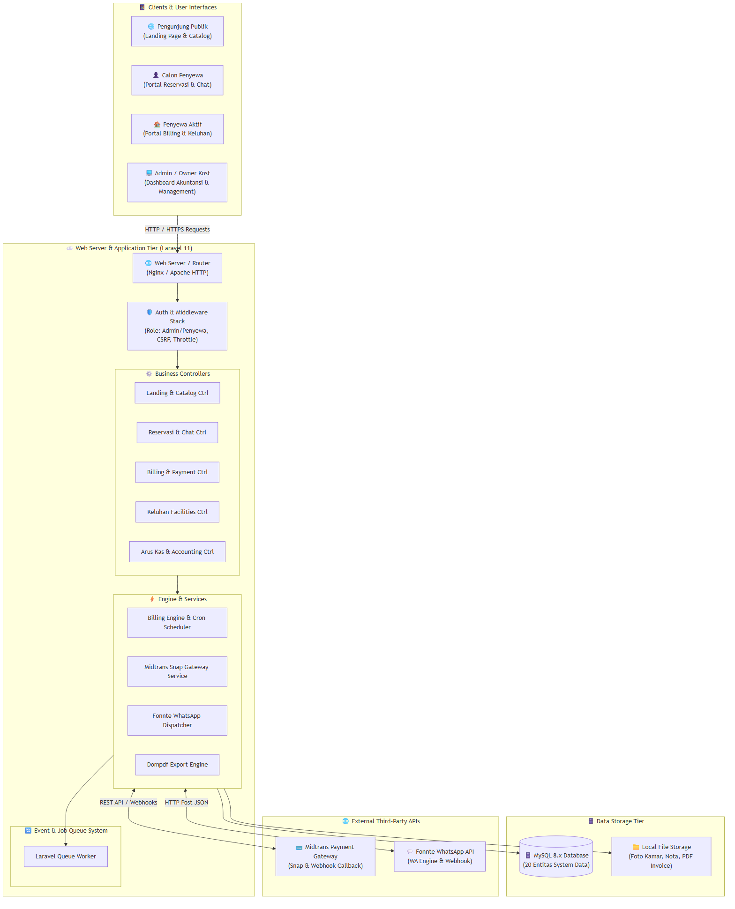

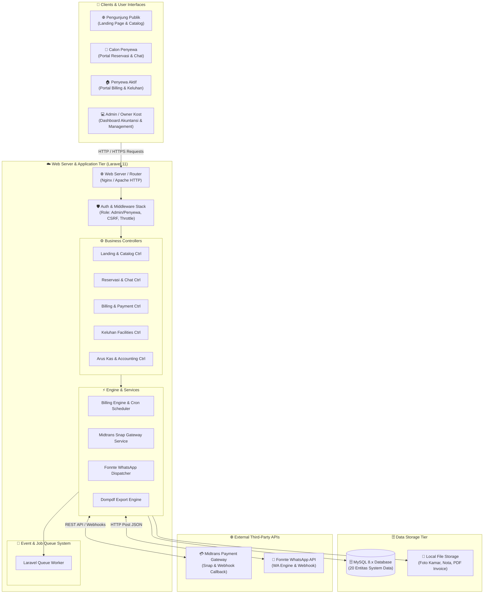
```mermaid
graph TB
    subgraph Clients["📱 Clients & User Interfaces"]
        Visitor["🌐 Pengunjung Publik<br/>(Landing Page & Catalog)"]
        GuestUser["👤 Calon Penyewa<br/>(Portal Reservasi & Chat)"]
        ActiveTenant["🏠 Penyewa Aktif<br/>(Portal Billing & Keluhan)"]
        AdminUser["💻 Admin / Owner Kost<br/>(Dashboard Akuntansi & Management)"]
    end

    subgraph Infrastructure["☁️ Web Server & Application Tier (Laravel 11)"]
        Nginx["🌐 Web Server / Router<br/>(Nginx / Apache HTTP)"]
        AuthMiddleware["🛡️ Auth & Middleware Stack<br/>(Role: Admin/Penyewa, CSRF, Throttle)"]
        
        subgraph Controllers["⚙️ Business Controllers"]
            LandingCtrl["Landing & Catalog Ctrl"]
            ReservasiCtrl["Reservasi & Chat Ctrl"]
            BillingCtrl["Billing & Payment Ctrl"]
            KeluhanCtrl["Keluhan Facilities Ctrl"]
            ArusKasCtrl["Arus Kas & Accounting Ctrl"]
        end

        subgraph Engine["⚡ Engine & Services"]
            BillingEngine["Billing Engine & Cron Scheduler"]
            MidtransService["Midtrans Snap Gateway Service"]
            FonnteService["Fonnte WhatsApp Dispatcher"]
            PdfGenerator["Dompdf Export Engine"]
        end

        subgraph QueueJob["🔄 Event & Job Queue System"]
            QueueWorker["Laravel Queue Worker"]
        end
    end

    subgraph DataStorage["🗄️ Data Storage Tier"]
        MySQL[("🗄️ MySQL 8.x Database<br/>(20 Entitas System Data)")]
        FileStorage["📁 Local File Storage<br/>(Foto Kamar, Nota, PDF Invoice)"]
    end

    subgraph ExternalAPIs["🌐 External Third-Party APIs"]
        MidtransAPI["💳 Midtrans Payment Gateway<br/>(Snap & Webhook Callback)"]
        FonnteAPI["💬 Fonnte WhatsApp API<br/>(WA Engine & Webhook)"]
    end

    Clients -->|"HTTP / HTTPS Requests"| Nginx
    Nginx --> AuthMiddleware
    AuthMiddleware --> Controllers
    Controllers --> Engine
    Engine --> QueueWorker
    Engine --> MySQL
    Engine --> FileStorage
    Engine <-->|"REST API / Webhooks"| MidtransAPI
    Engine <-->|"HTTP Post JSON"| FonnteAPI
```

---

### Diagram 5.2: Peta Siklus Perjalanan Pengguna (End-to-End Tenant Lifecycle State Diagram)
Diagram ini menggambarkan transisi status pengguna sejak pertama kali berkunjung sebagai tamu hingga check-out dari kost.

*Berkas Sumber Mermaid*: [Blueprint/prd/prd_diagram_2_lifecycle.mmd](file:///c:/xampp/htdocs/asri-boarding-house/Blueprint/prd/prd_diagram_2_lifecycle.mmd)

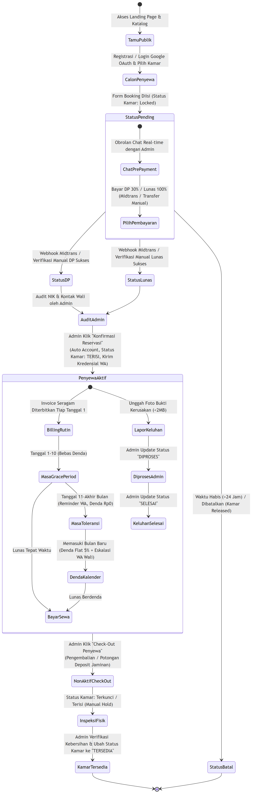

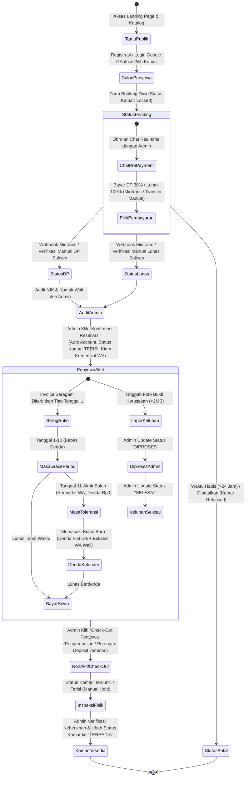
```mermaid
stateDiagram-v2
    [*] --> TamuPublik: Akses Landing Page & Katalog
    TamuPublik --> CalonPenyewa: Registrasi / Login Google OAuth & Pilih Kamar
    CalonPenyewa --> StatusPending: Form Booking Diisi (Status Kamar: Locked)
    
    state StatusPending {
        [*] --> ChatPrePayment: Obrolan Chat Real-time dengan Admin
        ChatPrePayment --> PilihPembayaran: Bayar DP 30% / Lunas 100% (Midtrans / Transfer Manual)
    }
    
    StatusPending --> StatusBatal: Waktu Habis (>24 Jam) / Dibatalkan (Kamar Released)
    StatusPending --> StatusDP: Webhook Midtrans / Verifikasi Manual DP Sukses
    StatusPending --> StatusLunas: Webhook Midtrans / Verifikasi Manual Lunas Sukses
    
    StatusDP --> AuditAdmin: Audit NIK & Kontak Wali oleh Admin
    StatusLunas --> AuditAdmin
    
    AuditAdmin --> PenyewaAktif: Admin Klik "Konfirmasi Reservasi"<br/>(Auto Account, Status Kamar: TERISI, Kirim Kredensial WA)
    
    state PenyewaAktif {
        [*] --> BillingRutin: Invoice Seragam Diterbitkan Tiap Tanggal 1
        BillingRutin --> MasaGracePeriod: Tanggal 1-10 (Bebas Denda)
        MasaGracePeriod --> BayarSewa: Lunas Tepat Waktu
        MasaGracePeriod --> MasaToleransi: Tanggal 11-Akhir Bulan (Reminder WA, Denda Rp0)
        MasaToleransi --> DendaKalender: Memasuki Bulan Baru (Denda Flat 5% + Eskalasi WA Wali)
        DendaKalender --> BayarSewa: Lunas Berdenda
        
        [*] --> LaporKeluhan: Unggah Foto Bukti Kerusakan (<2MB)
        LaporKeluhan --> DiprosesAdmin: Admin Update Status "DIPROSES"
        DiprosesAdmin --> KeluhanSelesai: Admin Update Status "SELESAI"
    }
    
    PenyewaAktif --> NonAktifCheckOut: Admin Klik "Check-Out Penyewa"<br/>(Pengembalian / Potongan Deposit Jaminan)
    NonAktifCheckOut --> InspeksiFisik: Status Kamar: Terkunci / Terisi (Manual Hold)
    InspeksiFisik --> KamarTersedia: Admin Verifikasi Kebersihan & Ubah Status Kamar ke "TERSEDIA"
    KamarTersedia --> [*]
    StatusBatal --> [*]
```

---

### Diagram 5.3: Alur Reservasi Online & Pembayaran Ganda
*Berkas Sumber Mermaid*: [Blueprint/prd/prd_diagram_3_reservasi.mmd](file:///c:/xampp/htdocs/asri-boarding-house/Blueprint/prd/prd_diagram_3_reservasi.mmd)

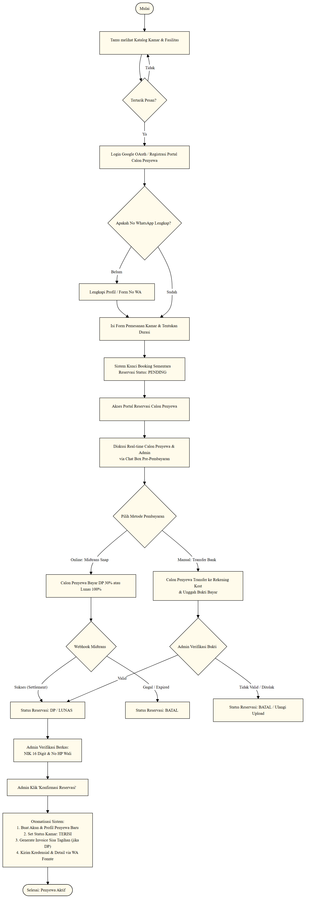

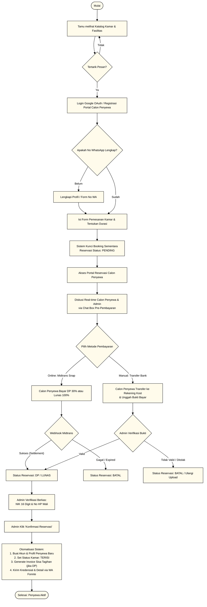
```mermaid
%%{init: {
  'theme': 'base',
  'themeVariables': {
    'primaryColor': '#FFFBEB',
    'primaryTextColor': '#000000',
    'primaryBorderColor': '#000000',
    'lineColor': '#000000',
    'secondaryColor': '#FDE047',
    'tertiaryColor': '#FFFFFF',
    'edgeLabelBackground': '#FFFFFF',
    'fontSize': '12px',
    'fontFamily': 'Inter, system-ui, sans-serif'
  }
}}%%
flowchart TD
    Start([Mulai]) --> Guest["Tamu melihat Katalog Kamar & Fasilitas"]
    Guest --> CheckInterest{Tertarik Pesan?}
    CheckInterest -- Ya --> Register[Login Google OAuth / Registrasi Portal Calon Penyewa]
    CheckInterest -- Tidak --> Guest
    Register --> CheckProfile{Apakah No WhatsApp Lengkap?}
    CheckProfile -- Belum --> CompleteProf[Lengkapi Profil / Form No WA]
    CompleteProf --> FillForm
    CheckProfile -- Sudah --> FillForm[Isi Form Pemesanan Kamar & Tentukan Durasi]
    
    FillForm --> SystemLock[Sistem Kunci Booking Sementara<br>Reservasi Status: PENDING]
    SystemLock --> AccessPortal[Akses Portal Reservasi Calon Penyewa]
    AccessPortal --> ChatBox[Diskusi Real-time Calon Penyewa & Admin<br>via Chat Box Pre-Pembayaran]
    ChatBox --> SelectScheme{Pilih Metode Pembayaran}
    
    SelectScheme -- Online: Midtrans Snap --> PayOnline["Calon Penyewa Bayar DP 30% atau Lunas 100%"]
    SelectScheme -- Manual: Transfer Bank --> PayManual["Calon Penyewa Transfer ke Rekening Kost<br>& Unggah Bukti Bayar"]
    
    PayOnline --> Webhook{Webhook Midtrans}
    Webhook -- Sukses (Settlement) --> UpdateStatus[Status Reservasi: DP / LUNAS]
    Webhook -- Gagal / Expired --> CancelReservasi[Status Reservasi: BATAL]
    
    PayManual --> AdminVerifManual{Admin Verifikasi Bukti}
    AdminVerifManual -- Valid --> UpdateStatus
    AdminVerifManual -- Tidak Valid / Ditolak --> RejectManual[Status Reservasi: BATAL / Ulangi Upload]
    
    UpdateStatus --> AdminAudit["Admin Verifikasi Berkas:<br>NIK 16 Digit & No HP Wali"]
    AdminAudit --> AdminConfirm["Admin Klik 'Konfirmasi Reservasi'"]
    
    AdminConfirm --> AutoSystem["Otomatisasi Sistem:<br>1. Buat Akun & Profil Penyewa Baru<br>2. Set Status Kamar: TERISI<br>3. Generate Invoice Sisa Tagihan (jika DP)<br>4. Kirim Kredensial & Detail via WA Fonnte"]
    AutoSystem --> ActiveTenant(["Selesai: Penyewa Aktif"])
```

---

### Diagram 5.4: State Machine Transaksi & Webhook Verification Midtrans
Diagram ini menggambarkan siklus perubahan status transaksi pembayaran online dan validasi signature key webhook Midtrans.

*Berkas Sumber Mermaid*: [Blueprint/prd/prd_diagram_4_midtrans.mmd](file:///c:/xampp/htdocs/asri-boarding-house/Blueprint/prd/prd_diagram_4_midtrans.mmd)

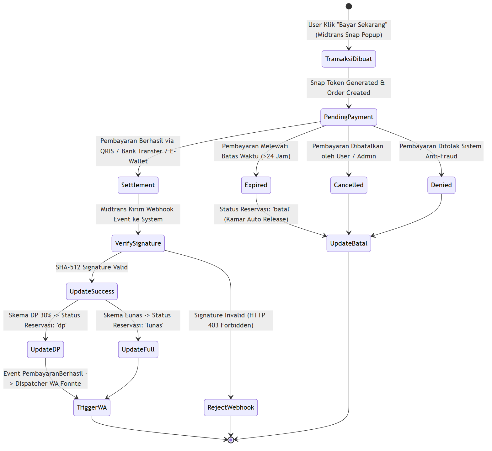

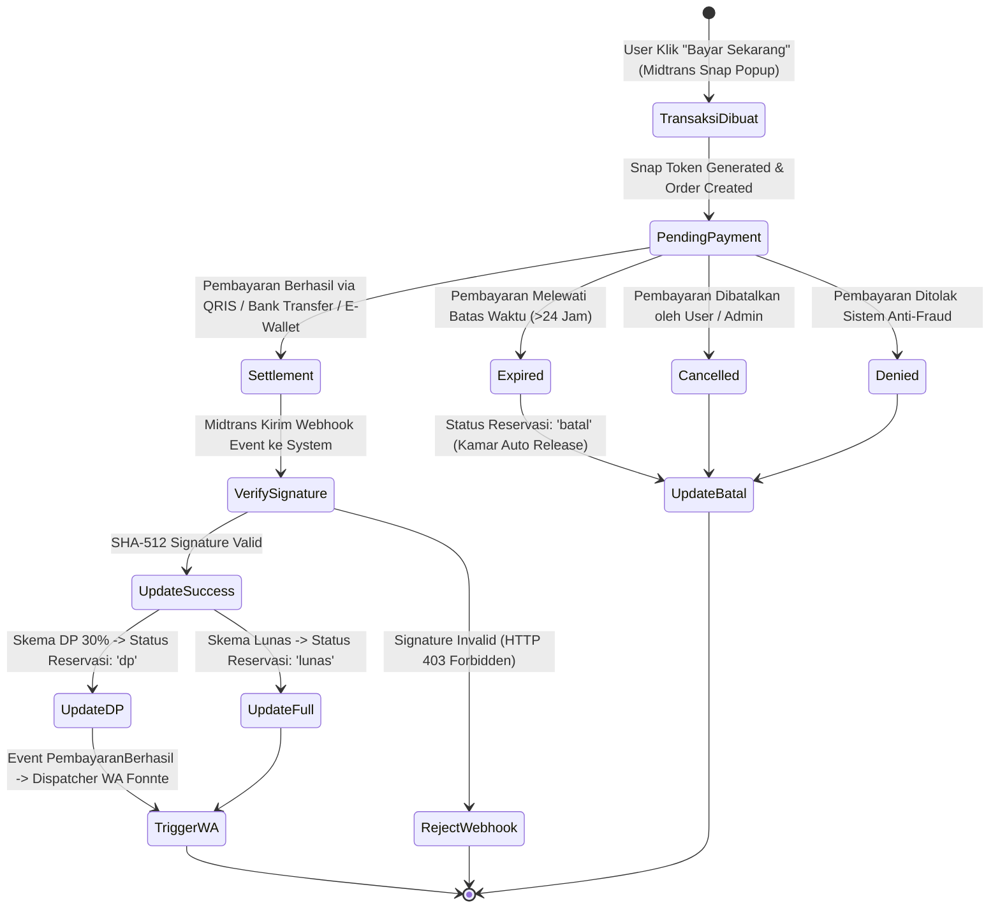
```mermaid
stateDiagram-v2
    [*] --> TransaksiDibuat: User Klik "Bayar Sekarang" (Midtrans Snap Popup)
    TransaksiDibuat --> PendingPayment: Snap Token Generated & Order Created
    
    PendingPayment --> Settlement: Pembayaran Berhasil via QRIS / Bank Transfer / E-Wallet
    PendingPayment --> Expired: Pembayaran Melewati Batas Waktu (>24 Jam)
    PendingPayment --> Cancelled: Pembayaran Dibatalkan oleh User / Admin
    PendingPayment --> Denied: Pembayaran Ditolak Sistem Anti-Fraud
    
    Settlement --> VerifySignature: Midtrans Kirim Webhook Event ke System
    VerifySignature --> UpdateSuccess: SHA-512 Signature Valid
    VerifySignature --> RejectWebhook: Signature Invalid (HTTP 403 Forbidden)
    
    UpdateSuccess --> UpdateDP: Skema DP 30% -> Status Reservasi: 'dp'
    UpdateSuccess --> UpdateFull: Skema Lunas -> Status Reservasi: 'lunas'
    
    Expired --> UpdateBatal: Status Reservasi: 'batal' (Kamar Auto Release)
    Cancelled --> UpdateBatal
    Denied --> UpdateBatal
    
    UpdateDP --> TriggerWA: Event PembayaranBerhasil -> Dispatcher WA Fonnte
    UpdateFull --> TriggerWA
    TriggerWA --> [*]
    UpdateBatal --> [*]
    RejectWebhook --> [*]
```

---

### Diagram 5.5: Siklus Billing Bulanan & Perhitungan Denda Flat Kalender
*Berkas Sumber Mermaid*: [Blueprint/prd/prd_diagram_5_billing.mmd](file:///c:/xampp/htdocs/asri-boarding-house/Blueprint/prd/prd_diagram_5_billing.mmd)

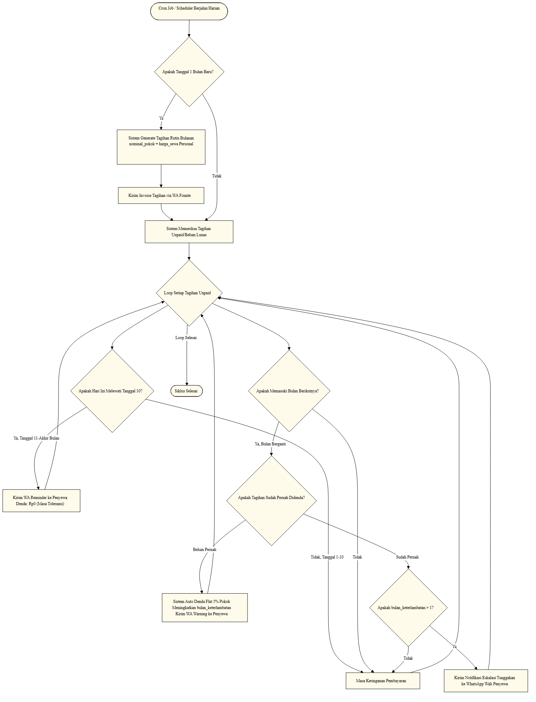

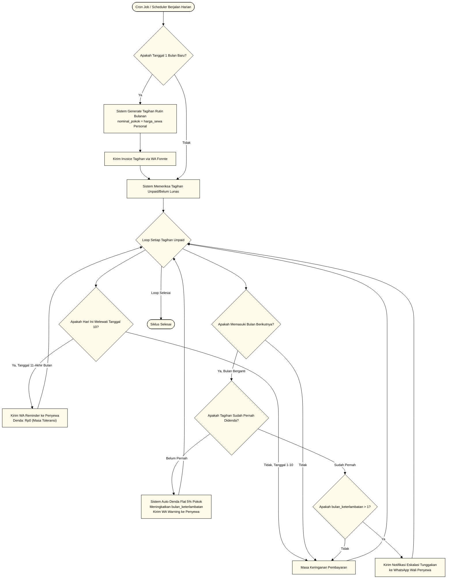
```mermaid
%%{init: {
  'theme': 'base',
  'themeVariables': {
    'primaryColor': '#FFFBEB',
    'primaryTextColor': '#000000',
    'primaryBorderColor': '#000000',
    'lineColor': '#000000',
    'secondaryColor': '#FDE047',
    'tertiaryColor': '#FFFFFF',
    'edgeLabelBackground': '#FFFFFF',
    'fontSize': '12px',
    'fontFamily': 'Inter, system-ui, sans-serif'
  }
}}%%
flowchart TD
    StartCron([Cron Job / Scheduler Berjalan Harian]) --> DateCheck{Apakah Tanggal 1 Bulan Baru?}
    DateCheck -- Ya --> GenerateBilling["Sistem Generate Tagihan Rutin Bulanan<br>nominal_pokok = harga_sewa Personal"]
    GenerateBilling --> SendWAInvoice[Kirim Invoice Tagihan via WA Fonnte]
    SendWAInvoice --> CheckOverdue
    
    DateCheck -- Tidak --> CheckOverdue[Sistem Memeriksa Tagihan Unpaid/Belum Lunas]
    CheckOverdue --> LoopStart{Loop Setiap Tagihan Unpaid}
    
    LoopStart --> CheckOverdue10{Apakah Hari Ini Melewati Tanggal 10?}
    CheckOverdue10 -- Ya, Tanggal 11-Akhir Bulan --> SendReminder["Kirim WA Reminder ke Penyewa<br>Denda: Rp0 (Masa Toleransi)"]
    CheckOverdue10 -- Tidak, Tanggal 1-10 --> NoAction[Masa Keringanan Pembayaran]
    
    LoopStart --> CheckMonthTransition{Apakah Memasuki Bulan Berikutnya?}
    CheckMonthTransition -- Ya, Bulan Berganti --> CheckDendaApplied{Apakah Tagihan Sudah Pernah Didenda?}
    CheckMonthTransition -- Tidak --> NoAction
    
    CheckDendaApplied -- Belum Pernah --> ApplyFine["Sistem Auto Denda Flat 5% Pokok<br>Meningkatkan bulan_keterlambatan<br>Kirim WA Warning ke Penyewa"]
    CheckDendaApplied -- Sudah Pernah --> CheckEskalasi{Apakah bulan_keterlambatan > 1?}
    
    CheckEskalasi -- Ya --> SendWaliWA["Kirim Notifikasi Eskalasi Tunggakan<br>ke WhatsApp Wali Penyewa"]
    CheckEskalasi -- Tidak --> NoAction
    
    ApplyFine --> LoopStart
    SendWaliWA --> LoopStart
    NoAction --> LoopStart
    SendReminder --> LoopStart
    LoopStart -- Loop Selesai --> End(["Siklus Selesai"])
```

---

### Diagram 5.6: Manajemen Keluhan & WhatsApp Notification Dispatcher
Diagram urutan (Sequence Diagram) menunjukkan alur pemrosesan event asinkron pengiriman pesan WhatsApp via Laravel Queue & Fonnte Service.

*Berkas Sumber Mermaid*: [Blueprint/prd/prd_diagram_6_keluhan.mmd](file:///c:/xampp/htdocs/asri-boarding-house/Blueprint/prd/prd_diagram_6_keluhan.mmd)

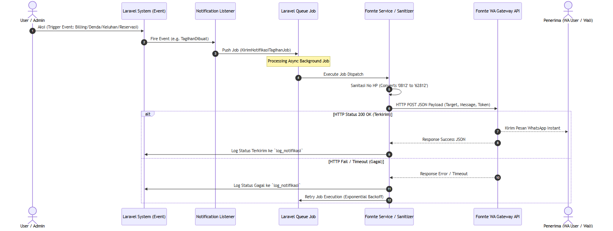

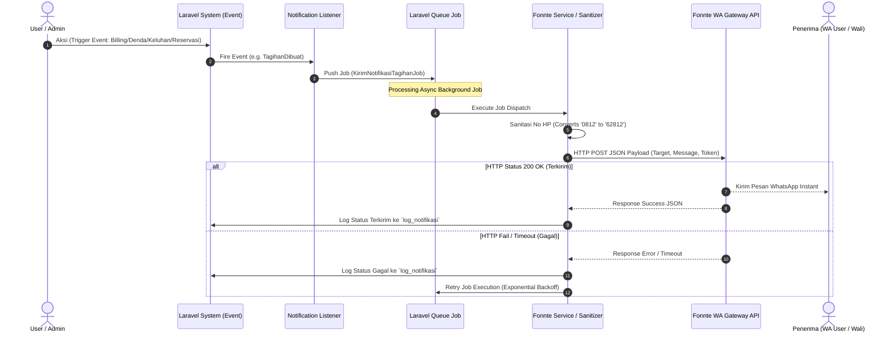
```mermaid
sequenceDiagram
    autonumber
    actor User as User / Admin
    participant System as Laravel System (Event)
    participant Listener as Notification Listener
    participant Queue as Laravel Queue Job
    participant FonnteService as Fonnte Service / Sanitizer
    participant FonnteAPI as Fonnte WA Gateway API
    actor TargetWA as Penerima (WA User / Wali)

    User->>System: Aksi (Trigger Event: Billing/Denda/Keluhan/Reservasi)
    System->>Listener: Fire Event (e.g. TagihanDibuat)
    Listener->>Queue: Push Job (KirimNotifikasiTagihanJob)
    Note over Queue: Processing Async Background Job
    Queue->>FonnteService: Execute Job Dispatch
    FonnteService->>FonnteService: Sanitasi No HP (Converts '0812' to '62812')
    FonnteService->>FonnteAPI: HTTP POST JSON Payload (Target, Message, Token)
    
    alt HTTP Status 200 OK (Terkirim)
        FonnteAPI-->>TargetWA: Kirim Pesan WhatsApp Instant
        FonnteAPI-->>FonnteService: Response Success JSON
        FonnteService->>System: Log Status Terkirim ke `log_notifikasi`
    else HTTP Fail / Timeout (Gagal)
        FonnteAPI-->>FonnteService: Response Error / Timeout
        FonnteService->>System: Log Status Gagal ke `log_notifikasi`
        FonnteService->>Queue: Retry Job Execution (Exponential Backoff)
    end
```

---

### Diagram 5.7: Akuntansi Keuangan & Konsolidasi Arus Kas
*Berkas Sumber Mermaid*: [Blueprint/prd/prd_diagram_7_aruskas.mmd](file:///c:/xampp/htdocs/asri-boarding-house/Blueprint/prd/prd_diagram_7_aruskas.mmd)

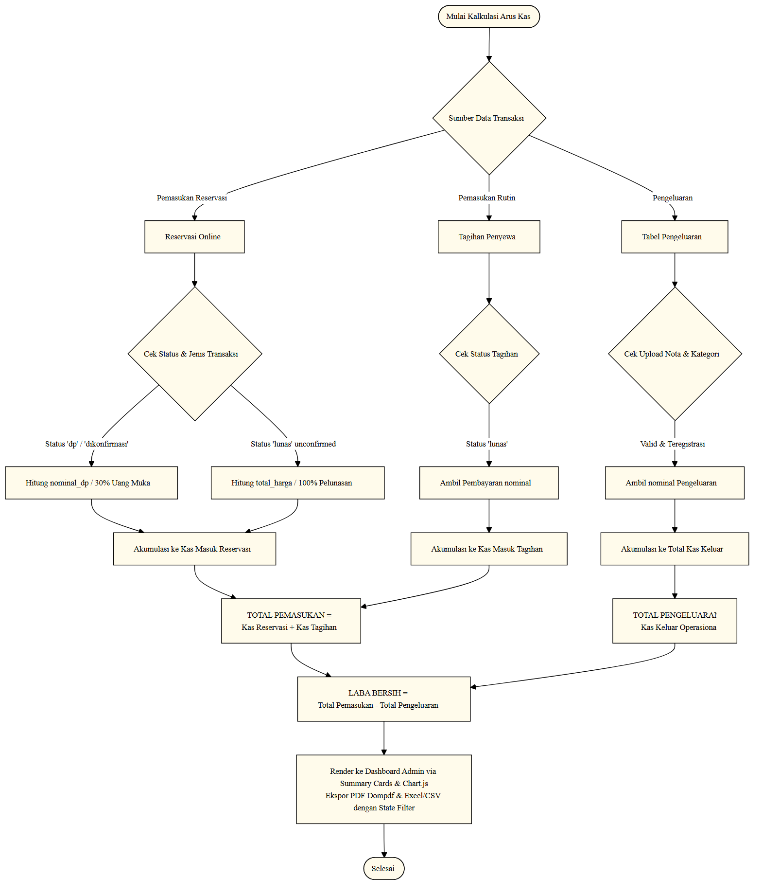

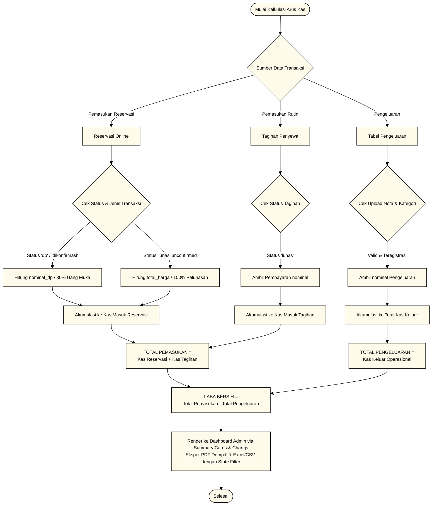
```mermaid
%%{init: {
  'theme': 'base',
  'themeVariables': {
    'primaryColor': '#FFFBEB',
    'primaryTextColor': '#000000',
    'primaryBorderColor': '#000000',
    'lineColor': '#000000',
    'secondaryColor': '#FDE047',
    'tertiaryColor': '#FFFFFF',
    'edgeLabelBackground': '#FFFFFF',
    'fontSize': '12px',
    'fontFamily': 'Inter, system-ui, sans-serif'
  }
}}%%
flowchart TD
    Start([Mulai Kalkulasi Arus Kas]) --> DataSource{Sumber Data Transaksi}
    
    DataSource -->|Pemasukan Reservasi| Reservasi[Reservasi Online]
    DataSource -->|Pemasukan Rutin| Tagihan[Tagihan Penyewa]
    DataSource -->|Pengeluaran| Pengeluaran[Tabel Pengeluaran]
    
    Reservasi --> CheckResStatus{Cek Status & Jenis Transaksi}
    CheckResStatus -->|"Status 'dp' / 'dikonfirmasi'"| CalcDP["Hitung nominal_dp / 30% Uang Muka"]
    CheckResStatus -->|"Status 'lunas' unconfirmed"| CalcFull["Hitung total_harga / 100% Pelunasan"]
    CalcDP --> AccumReservasi[Akumulasi ke Kas Masuk Reservasi]
    CalcFull --> AccumReservasi
    
    Tagihan --> CheckTagihanStatus{Cek Status Tagihan}
    CheckTagihanStatus -->|"Status 'lunas'"| CalcTagihan[Ambil Pembayaran nominal]
    CalcTagihan --> AccumTagihan[Akumulasi ke Kas Masuk Tagihan]
    
    Pengeluaran --> CheckPengeluaran{Cek Upload Nota & Kategori}
    CheckPengeluaran -->|Valid & Teregistrasi| CalcExp[Ambil nominal Pengeluaran]
    CalcExp --> AccumExp[Akumulasi ke Total Kas Keluar]
    
    AccumReservasi --> CalcTotal["TOTAL PEMASUKAN =<br>Kas Reservasi + Kas Tagihan"]
    AccumTagihan --> CalcTotal
    AccumExp --> CalcTotalExp["TOTAL PENGELUARAN =<br>Kas Keluar Operasional"]
    
    CalcTotal --> CalcNet["LABA BERSIH =<br>Total Pemasukan - Total Pengeluaran"]
    CalcTotalExp --> CalcNet
    
    CalcNet --> RenderDashboard["Render ke Dashboard Admin via Summary Cards & Chart.js<br>Ekspor PDF Dompdf & Excel/CSV dengan State Filter"]
    RenderDashboard --> End(["Selesai"])
```

---

### Diagram 5.8: User Flow - Otentikasi Google OAuth 2.0 & Penapisan Profil
Diagram ini memetakan perjalanan calon penyewa saat masuk melalui Google OAuth 2.0 (Socialite), penolakan peran Admin, serta filter middleware `EnsureProfileIsComplete`.

*Berkas Sumber Mermaid*: [Blueprint/prd/prd_diagram_9_google_oauth_flow.mmd](file:///c:/xampp/htdocs/asri-boarding-house/Blueprint/prd/prd_diagram_9_google_oauth_flow.mmd)

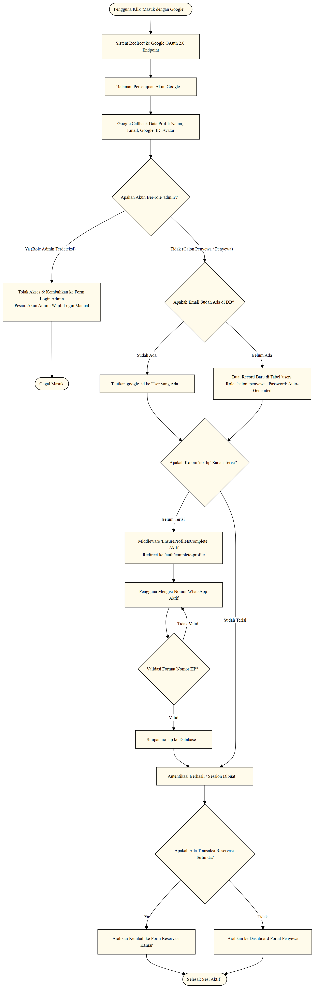

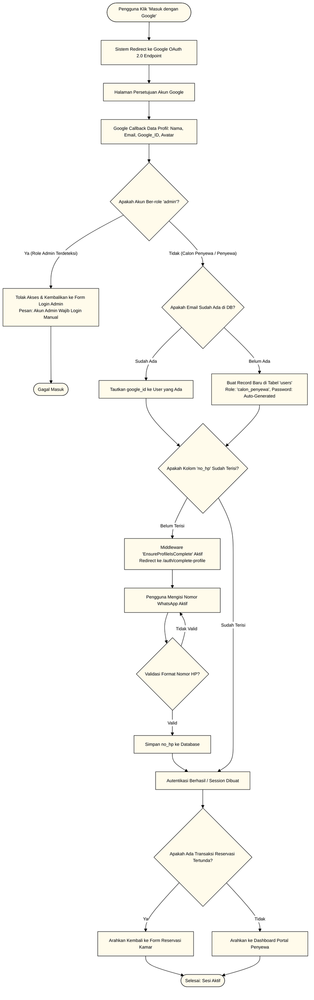
```mermaid
%%{init: {
  'theme': 'base',
  'themeVariables': {
    'primaryColor': '#FFFBEB',
    'primaryTextColor': '#000000',
    'primaryBorderColor': '#000000',
    'lineColor': '#000000',
    'secondaryColor': '#FDE047',
    'tertiaryColor': '#FFFFFF',
    'edgeLabelBackground': '#FFFFFF',
    'fontSize': '12px',
    'fontFamily': 'Inter, system-ui, sans-serif'
  }
}}%%
flowchart TD
    Start([Pengguna Klik 'Masuk dengan Google']) --> RedirectGoogle[Sistem Redirect ke Google OAuth 2.0 Endpoint]
    RedirectGoogle --> GoogleConsent[Halaman Persetujuan Akun Google]
    GoogleConsent --> CallbackSocialite[Google Callback Data Profil: Nama, Email, Google_ID, Avatar]
    
    CallbackSocialite --> CheckRole{Apakah Akun Ber-role 'admin'?}
    CheckRole -- Ya (Role Admin Terdeteksi) --> RejectAdmin[Tolak Akses & Kembalikan ke Form Login Admin<br>Pesan: Akun Admin Wajib Login Manual]
    RejectAdmin --> EndFail([Gagal Masuk])
    
    CheckRole -- Tidak (Calon Penyewa / Penyewa) --> CheckExisting{Apakah Email Sudah Ada di DB?}
    
    CheckExisting -- Sudah Ada --> UpdateGoogleId[Tautkan google_id ke User yang Ada]
    CheckExisting -- Belum Ada --> CreateUser[Buat Record Baru di Tabel 'users'<br>Role: 'calon_penyewa', Password: Auto-Generated]
    
    UpdateGoogleId --> CheckPhone{Apakah Kolom 'no_hp' Sudah Terisi?}
    CreateUser --> CheckPhone
    
    CheckPhone -- Belum Terisi --> RedirectComplete[Middleware 'EnsureProfileIsComplete' Aktif<br>Redirect ke /auth/complete-profile]
    RedirectComplete --> InputPhone[Pengguna Mengisi Nomor WhatsApp Aktif]
    InputPhone --> ValidatePhone{Validasi Format Nomor HP?}
    ValidatePhone -- Tidak Valid --> InputPhone
    ValidatePhone -- Valid --> SavePhone[Simpan no_hp ke Database]
    SavePhone --> AuthSuccess
    
    CheckPhone -- Sudah Terisi --> AuthSuccess[Autentikasi Berhasil / Session Dibuat]
    AuthSuccess --> CheckIntended{Apakah Ada Transaksi Reservasi Tertunda?}
    CheckIntended -- Ya --> RedirectBooking[Arahkan Kembali ke Form Reservasi Kamar]
    CheckIntended -- Tidak --> RedirectDashboard[Arahkan ke Dashboard Portal Penyewa]
    
    RedirectBooking --> EndSuccess([Selesai: Sesi Aktif])
    RedirectDashboard --> EndSuccess
```

---

### Diagram 5.9: System Flow - Arsitektur & Siklus Hidup Dual-Chat
Diagram ini membedakan secara arsitektural dua kanal obrolan real-time: **Guest Live Chat Publik** (anonim via cookie token UUID) dan **Pre-Payment Chat Box** (portal reservasi).

*Berkas Sumber Mermaid*: [Blueprint/prd/prd_diagram_10_dual_chat_flow.mmd](file:///c:/xampp/htdocs/asri-boarding-house/Blueprint/prd/prd_diagram_10_dual_chat_flow.mmd)

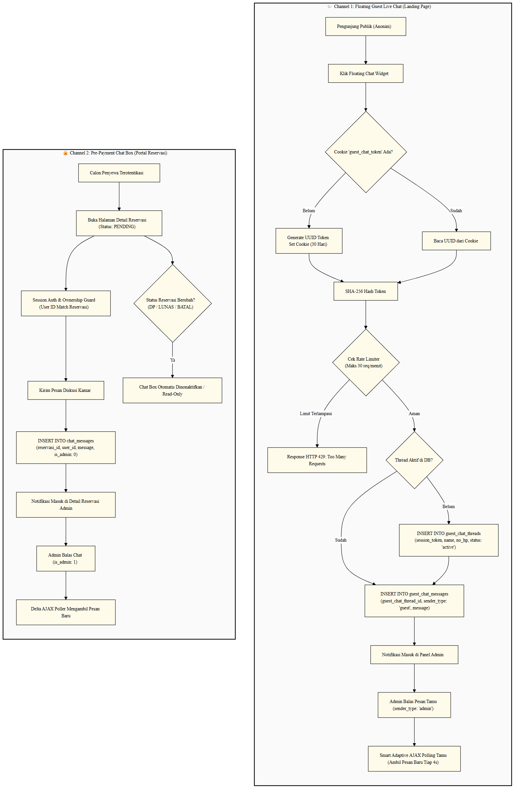

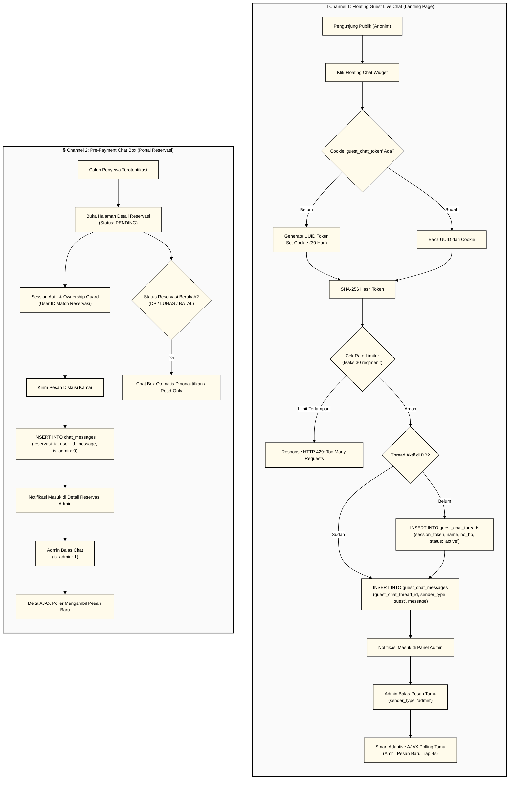
```mermaid
%%{init: {
  'theme': 'base',
  'themeVariables': {
    'primaryColor': '#FFFBEB',
    'primaryTextColor': '#000000',
    'primaryBorderColor': '#000000',
    'lineColor': '#000000',
    'secondaryColor': '#FDE047',
    'tertiaryColor': '#FFFFFF',
    'edgeLabelBackground': '#FFFFFF',
    'fontSize': '12px',
    'fontFamily': 'Inter, system-ui, sans-serif'
  }
}}%%
flowchart TB
    subgraph ChannelA["💬 Channel 1: Floating Guest Live Chat (Landing Page)"]
        direction TB
        VisitorA["Pengunjung Publik (Anonim)"] --> WidgetOpen["Klik Floating Chat Widget"]
        WidgetOpen --> CheckCookie{"Cookie 'guest_chat_token' Ada?"}
        CheckCookie -- Belum --> GenUUID["Generate UUID Token<br>Set Cookie (30 Hari)"]
        CheckCookie -- Sudah --> ReadUUID["Baca UUID dari Cookie"]
        GenUUID --> HashToken["SHA-256 Hash Token"]
        ReadUUID --> HashToken
        
        HashToken --> RateLimit{"Cek Rate Limiter<br>(Maks 30 req/menit)"}
        RateLimit -- Limit Terlampaui --> HTTP429["Response HTTP 429: Too Many Requests"]
        RateLimit -- Aman --> QueryThread{"Thread Aktif di DB?"}
        
        QueryThread -- Belum --> InsertThread["INSERT INTO guest_chat_threads<br>(session_token, name, no_hp, status: 'active')"]
        QueryThread -- Sudah --> InsertMsg["INSERT INTO guest_chat_messages<br>(guest_chat_thread_id, sender_type: 'guest', message)"]
        InsertThread --> InsertMsg
        
        InsertMsg --> AdminPanelA["Notifikasi Masuk di Panel Admin"]
        AdminPanelA --> AdminReplyA["Admin Balas Pesan Tamu<br>(sender_type: 'admin')"]
        AdminReplyA --> GuestPoll["Smart Adaptive AJAX Polling Tamu<br>(Ambil Pesan Baru Tiap 4s)"]
    end

    subgraph ChannelB["🔒 Channel 2: Pre-Payment Chat Box (Portal Reservasi)"]
        direction TB
        TenantB["Calon Penyewa Terotentikasi"] --> ViewBooking["Buka Halaman Detail Reservasi<br>(Status: PENDING)"]
        ViewBooking --> AuthCheck["Session Auth & Ownership Guard<br>(User ID Match Reservasi)"]
        AuthCheck --> SendChatB["Kirim Pesan Diskusi Kamar"]
        SendChatB --> InsertChatB["INSERT INTO chat_messages<br>(reservasi_id, user_id, message, is_admin: 0)"]
        InsertChatB --> AdminPanelB["Notifikasi Masuk di Detail Reservasi Admin"]
        AdminPanelB --> AdminReplyB["Admin Balas Chat<br>(is_admin: 1)"]
        AdminReplyB --> PollingB["Delta AJAX Poller Mengambil Pesan Baru"]
        
        ViewBooking --> StatusChange{"Status Reservasi Berubah?<br>(DP / LUNAS / BATAL)"}
        StatusChange -- Ya --> LockChat["Chat Box Otomatis Dinonaktifkan / Read-Only"]
    end

    classDef channelBox fill:#FAFAFA,stroke:#000000,stroke-width:2px;
    class ChannelA,ChannelB channelBox;
```

---

### Diagram 5.10: System Flow - Protokol Verifikasi Pembayaran Transfer Bank Manual
Diagram alir proses pengunggahan bukti bayar fisik, audit mutasi bank oleh admin, dan atomisitas status transaksi.

*Berkas Sumber Mermaid*: [Blueprint/prd/prd_diagram_11_manual_transfer_flow.mmd](file:///c:/xampp/htdocs/asri-boarding-house/Blueprint/prd/prd_diagram_11_manual_transfer_flow.mmd)

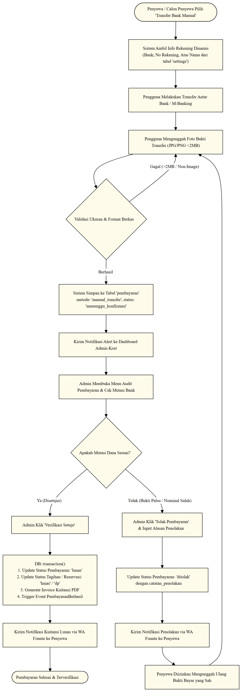

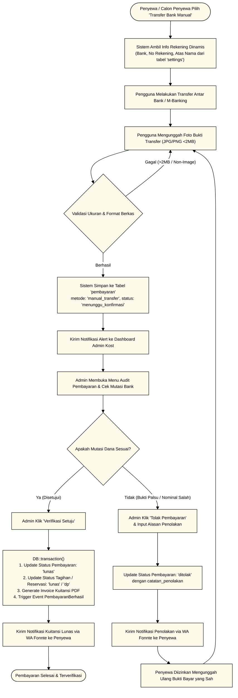
```mermaid
%%{init: {
  'theme': 'base',
  'themeVariables': {
    'primaryColor': '#FFFBEB',
    'primaryTextColor': '#000000',
    'primaryBorderColor': '#000000',
    'lineColor': '#000000',
    'secondaryColor': '#FDE047',
    'tertiaryColor': '#FFFFFF',
    'edgeLabelBackground': '#FFFFFF',
    'fontSize': '12px',
    'fontFamily': 'Inter, system-ui, sans-serif'
  }
}}%%
flowchart TD
    Start([Penyewa / Calon Penyewa Pilih 'Transfer Bank Manual']) --> FetchBank["Sistem Ambil Info Rekening Dinamis<br>(Bank, No Rekening, Atas Nama dari tabel 'settings')"]
    FetchBank --> UserTransfer["Pengguna Melakukan Transfer Antar Bank / M-Banking"]
    UserTransfer --> UploadProof["Pengguna Mengunggah Foto Bukti Transfer (JPG/PNG <2MB)"]
    UploadProof --> ValidateFile{Validasi Ukuran & Format Berkas}
    
    ValidateFile -- Gagal (>2MB / Non-Image) --> UploadProof
    ValidateFile -- Berhasil --> SavePayment["Sistem Simpan ke Tabel 'pembayaran'<br>metode: 'manual_transfer', status: 'menunggu_konfirmasi'"]
    
    SavePayment --> NotifyAdmin["Kirim Notifikasi Alert ke Dashboard Admin Kost"]
    NotifyAdmin --> AdminAudit["Admin Membuka Menu Audit Pembayaran & Cek Mutasi Bank"]
    AdminAudit --> DecisionAudit{Apakah Mutasi Dana Sesuai?}
    
    DecisionAudit -- Ya (Disetujui) --> ApprovePayment["Admin Klik 'Verifikasi Setuju'"]
    ApprovePayment --> DBTrans["DB::transaction()<br>1. Update Status Pembayaran: 'lunas'<br>2. Update Status Tagihan / Reservasi: 'lunas' / 'dp'<br>3. Generate Invoice Kuitansi PDF<br>4. Trigger Event PembayaranBerhasil"]
    DBTrans --> SendWASuccess["Kirim Notifikasi Kuitansi Lunas via WA Fonnte ke Penyewa"]
    SendWASuccess --> EndSuccess([Pembayaran Selesai & Terverifikasi])
    
    DecisionAudit -- Tidak (Bukti Palsu / Nominal Salah) --> RejectPayment["Admin Klik 'Tolak Pembayaran'<br>& Input Alasan Penolakan"]
    RejectPayment --> UpdateReject["Update Status Pembayaran: 'ditolak'<br>dengan catatan_penolakan"]
    UpdateReject --> SendWAReject["Kirim Notifikasi Penolakan via WA Fonnte ke Penyewa"]
    SendWAReject --> ReuploadOption["Penyewa Diizinkan Mengunggah Ulang Bukti Bayar yang Sah"]
    ReuploadOption --> UploadProof
```

---

### Diagram 5.11: User & System Flow - Siklus Penanganan Keluhan Fasilitas
Diagram alir proses pelaporan keluhan kerusakan kamar, notifikasi status bertahap via WhatsApp, hingga verifikasi penyelesaian.

*Berkas Sumber Mermaid*: [Blueprint/prd/prd_diagram_12_keluhan_resolution_flow.mmd](file:///c:/xampp/htdocs/asri-boarding-house/Blueprint/prd/prd_diagram_12_keluhan_resolution_flow.mmd)

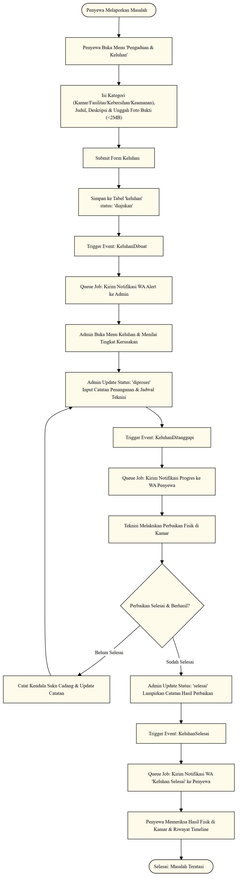

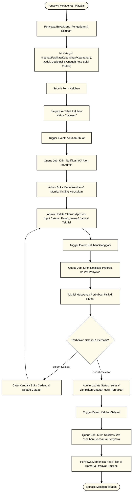
```mermaid
%%{init: {
  'theme': 'base',
  'themeVariables': {
    'primaryColor': '#FFFBEB',
    'primaryTextColor': '#000000',
    'primaryBorderColor': '#000000',
    'lineColor': '#000000',
    'secondaryColor': '#FDE047',
    'tertiaryColor': '#FFFFFF',
    'edgeLabelBackground': '#FFFFFF',
    'fontSize': '12px',
    'fontFamily': 'Inter, system-ui, sans-serif'
  }
}}%%
flowchart TD
    Start([Penyewa Melaporkan Masalah]) --> OpenForm["Penyewa Buka Menu 'Pengaduan & Keluhan'"]
    OpenForm --> FillKeluhan["Isi Kategori (Kamar/Fasilitas/Kebersihan/Keamanan),<br>Judul, Deskripsi & Unggah Foto Bukti (<2MB)"]
    FillKeluhan --> SubmitKeluhan["Submit Form Keluhan"]
    
    SubmitKeluhan --> SaveDB["Simpan ke Tabel 'keluhan'<br>status: 'diajukan'"]
    SaveDB --> TriggerEventA["Trigger Event: KeluhanDibuat"]
    TriggerEventA --> DispatchWAAdmin["Queue Job: Kirim Notifikasi WA Alert ke Admin"]
    
    DispatchWAAdmin --> AdminReview["Admin Buka Menu Keluhan & Menilai Tingkat Kerusakan"]
    AdminReview --> ProcessKeluhan["Admin Update Status: 'diproses'<br>Input Catatan Penanganan & Jadwal Teknisi"]
    
    ProcessKeluhan --> TriggerEventB["Trigger Event: KeluhanDitanggapi"]
    TriggerEventB --> DispatchWATenantA["Queue Job: Kirim Notifikasi Progres ke WA Penyewa"]
    
    DispatchWATenantA --> PhysicalRepair["Teknisi Melakukan Perbaikan Fisik di Kamar"]
    PhysicalRepair --> RepairDone{"Perbaikan Selesai & Berhasil?"}
    
    RepairDone -- Belum Selesai --> PendingParts["Catat Kendala Suku Cadang & Update Catatan"]
    PendingParts --> ProcessKeluhan
    
    RepairDone -- Sudah Selesai --> ResolveKeluhan["Admin Update Status: 'selesai'<br>Lampirkan Catatan Hasil Perbaikan"]
    ResolveKeluhan --> TriggerEventC["Trigger Event: KeluhanSelesai"]
    TriggerEventC --> DispatchWATenantB["Queue Job: Kirim Notifikasi WA 'Keluhan Selesai' ke Penyewa"]
    
    DispatchWATenantB --> TenantVerify["Penyewa Memeriksa Hasil Fisik di Kamar & Riwayat Timeline"]
    TenantVerify --> EndKeluhan([Selesai: Masalah Teratasi])
```

---

### Diagram 5.12: System Flow - Multi-Channel Broadcast Notification Engine
Diagram alir kerja pengiriman pesan broadcast massal secara asinkron melalui tiga kanal komunikasi (Web In-App, WhatsApp API, dan Email SMTP).

*Berkas Sumber Mermaid*: [Blueprint/prd/prd_diagram_13_broadcast_dispatcher_flow.mmd](file:///c:/xampp/htdocs/asri-boarding-house/Blueprint/prd/prd_diagram_13_broadcast_dispatcher_flow.mmd)

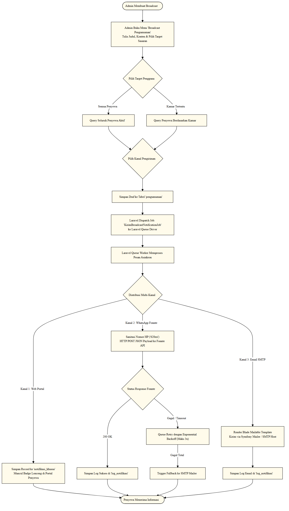

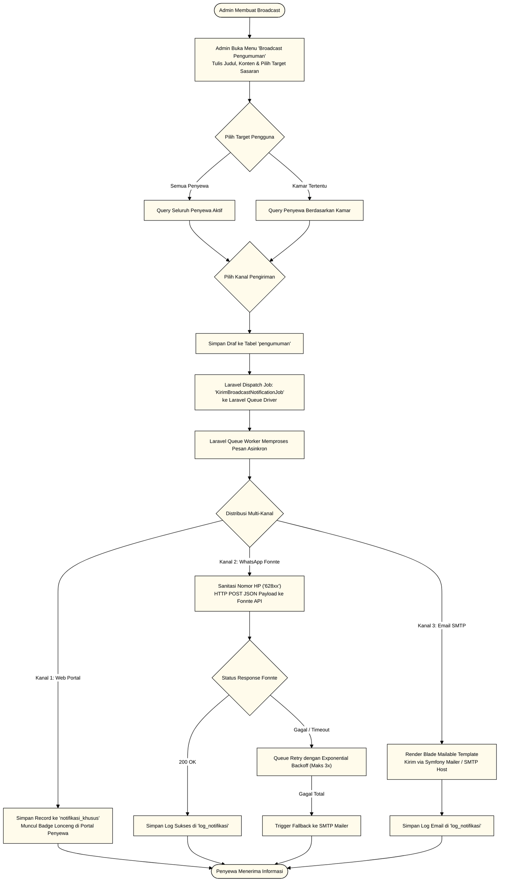
```mermaid
%%{init: {
  'theme': 'base',
  'themeVariables': {
    'primaryColor': '#FFFBEB',
    'primaryTextColor': '#000000',
    'primaryBorderColor': '#000000',
    'lineColor': '#000000',
    'secondaryColor': '#FDE047',
    'tertiaryColor': '#FFFFFF',
    'edgeLabelBackground': '#FFFFFF',
    'fontSize': '12px',
    'fontFamily': 'Inter, system-ui, sans-serif'
  }
}}%%
flowchart TD
    Start([Admin Membuat Broadcast]) --> AdminForm["Admin Buka Menu 'Broadcast Pengumuman'<br>Tulis Judul, Konten & Pilih Target Sasaran"]
    AdminForm --> SelectTarget{"Pilih Target Pengguna"}
    SelectTarget -->|Semua Penyewa| AllTenants["Query Seluruh Penyewa Aktif"]
    SelectTarget -->|Kamar Tertentu| SpecificTenants["Query Penyewa Berdasarkan Kamar"]
    
    AllTenants --> SelectChannels{"Pilih Kanal Pengiriman"}
    SpecificTenants --> SelectChannels
    
    SelectChannels --> SaveDraft["Simpan Draf ke Tabel 'pengumuman'"]
    SaveDraft --> DispatchJob["Laravel Dispatch Job: 'KirimBroadcastNotificationJob'<br>ke Laravel Queue Driver"]
    
    DispatchJob --> Worker["Laravel Queue Worker Memproses Pesan Asinkron"]
    
    Worker --> ChannelSplit{Distribusi Multi-Kanal}
    
    ChannelSplit -->|Kanal 1: Web Portal| InAppChannel["Simpan Record ke 'notifikasi_khusus'<br>Muncul Badge Lonceng di Portal Penyewa"]
    
    ChannelSplit -->|Kanal 2: WhatsApp Fonnte| WAChannel["Sanitasi Nomor HP ('628xx')<br>HTTP POST JSON Payload ke Fonnte API"]
    WAChannel --> WAResponse{"Status Response Fonnte"}
    WAResponse -- 200 OK --> LogWASuccess["Simpan Log Sukses di 'log_notifikasi'"]
    WAResponse -- Gagal / Timeout --> RetryWA["Queue Retry dengan Exponential Backoff (Maks 3x)"]
    RetryWA -- Gagal Total --> FallbackMail["Trigger Fallback ke SMTP Mailer"]
    
    ChannelSplit -->|Kanal 3: Email SMTP| MailChannel["Render Blade Mailable Template<br>Kirim via Symfony Mailer / SMTP Host"]
    MailChannel --> LogMail["Simpan Log Email di 'log_notifikasi'"]
    
    InAppChannel --> EndBroadcast([Penyewa Menerima Informasi])
    LogWASuccess --> EndBroadcast
    FallbackMail --> EndBroadcast
    LogMail --> EndBroadcast
```

---

## 6. Kebutuhan Non-Fungsional & Keamanan (Non-Functional Requirements)

### 6.1 Keamanan, Otorisasi & Audit Trail
1. **Proteksi IDOR (Insecure Direct Object Reference)**: Sistem wajib memvalidasi kepemilikan data sebelum memproses request (`TagihanController` dan `KeluhanController` memverifikasi match `penyewa_id` dengan session login).
2. **Keamanan Transaksional (DB Transactions)**: Seluruh operasi modifikasi database multi-tabel (seperti konfirmasi reservasi dan eksekusi denda) wajib dibungkus dalam `DB::transaction()` untuk menjamin atomisitas data (mencegah data korup/separuh tersimpan jika ada kegagalan).
3. **Midtrans Webhook Security**: Endpoint callback pembayaran mewajibkan *Signature Key Verification* (`sha512(order_id + status_code + gross_amount + ServerKey)`) untuk memverifikasi keabsahan payload webhook dari Midtrans.
4. **Validasi & Proteksi File Upload**: File bukti bayar, bukti nota, dan bukti keluhan divalidasi format gambar (`jpg, jpeg, png`), ukuran maksimal `2MB`, dan auto-delete file lama dari storage saat terjadi perubahan/penghapusan.
5. **Role Protection & Complete Profile**: Proteksi akses rute berdasarkan role (`admin` vs `penyewa`), pencegahan login Admin via Google OAuth, serta penapisan profil via middleware `EnsureProfileIsComplete`.

### 6.2 Performa, Skalabilitas & Kebijakan Siklus Hidup Data (Data Lifecycle)
1. **Optimasi Query & Eager Loading**: Penegakan `Model::preventLazyLoading(!app()->isProduction())` untuk mendeteksi N+1 query sejak dini. Pemuatan relasi wajib menggunakan Eager Loading (`with()`).
2. **Indeksasi Komposit Database**:
   * Chat Obrolan: `chat_messages(reservasi_id, created_at)`
   * Sesi Tamu: Unique index `guest_chat_threads(session_token)`
   * Scheduler Denda: `tagihan(status, tanggal_jatuh_tempo)`
   * Idempotensi Tagihan: Unique key `tagihan(penyewa_id, periode_bulan, periode_tahun)`
3. **Queue & Resilience Notifikasi**: Pengiriman notifikasi Fonnte WA dan Email dikirimkan secara asinkron via Laravel Queue Job agar tidak membebani respon HTTP antarmuka pengguna.
4. **Kebijakan Pembersihan Log (Log Pruning)**: Sistem menjalankan scheduler pembersihan berkala `php artisan log:prune` untuk mengarsipkan rekaman `log_notifikasi` yang berumur lebih dari 180 hari secara otomatis.
5. **Pembersihan Storage Yatim (Storage Orphan Cleanup)**: Model observer (`KamarObserver`, `KeluhanObserver`, `PengeluaranObserver`) bertugas menghapus berkas fisik lama dari disk storage ketika data gambar diperbarui atau entitas dihapus.

### 6.3 Desain Visual & Aksesibilitas (WCAG 2.1)
1. **Dual-Theme Architecture**:
   * **Neo-Brutalisme**: Antarmuka publik (Landing page, Katalog, FAQ, Testimoni) dengan ciri khas border tebal 4px solid, warna retro datar (kuning cerah, hitam, putih), dan bayangan kaku responsif.
   * **Sleek Modern Premium**: Dashboard internal Admin dan Portal Penyewa Aktif untuk keterbacaan data finansial yang profesional, bersih, dan elegan.
2. **Aksesibilitas Tombol Floating WhatsApp & Live Chat**: Tombol melayang di pojok kanan bawah memiliki touch target minimal `44px x 44px` dan `z-index z-50` sesuai standar WCAG 2.1.

---

## 7. Kriteria Penerimaan (Acceptance Criteria / Definition of Done)

### AC-AUTH-01: Google OAuth 2.0 & Complete Profile
* **Given** Calon penyewa berada di halaman login/registrasi.
* **When** Calon penyewa menekan tombol "Masuk dengan Google" dan menyetujui otorisasi akun.
* **Then** Jika akun baru belum memiliki nomor WhatsApp, sistem mengalihkan ke form `complete-profile`. Setelah nomor WA disimpan, akun aktif dan diarahkan kembali ke alur reservasi.

### AC-CHAT-01: Guest Live Chat Rate Limiting
* **Given** Pengunjung anonim membuka landing page publik.
* **When** Pengunjung mengirim lebih dari 30 pesan dalam 1 menit via floating live chat.
* **Then** Sistem mengembalikan status HTTP 429 (Too Many Requests) dan memblokir pengiriman sementara guna mencegah serangan spam.

### AC-RES-01: Reservasi Online via Midtrans Snap
* **Given** Calon penyewa berada di halaman booking kamar `tersedia`.
* **When** Calon penyewa memilih skema DP 30% / Lunas 100% dan menyelesaikan transaksi di popup Midtrans Snap (`settlement`).
* **Then** Status reservasi di database berubah dari `pending` ke `dp`/`lunas`, sistem mengunci tanggal booking, dan WhatsApp notifikasi otomatis terkirim ke Admin.

### AC-PAY-01: Pembayaran Transfer Bank Manual & Verifikasi Admin
* **Given** Calon penyewa atau penyewa aktif memilih metode "Transfer Bank Manual".
* **When** Pengguna mentransfer ke rekening kost dan mengunggah berkas foto bukti bayar (< 2MB).
* **Then** Sistem menyimpan bukti bayar dengan status `menunggu_konfirmasi`. Saat Admin menekan "Verifikasi Setuju", status otomatis berubah menjadi `lunas` / `dp`.

### AC-RES-02: Auto-Cancel Reservasi Expired
* **Given** Ada data reservasi berstatus `pending` yang dibuat > 24 jam lalu tanpa konfirmasi pembayaran.
* **When** Webhook Midtrans mengirim status `expire` atau Scheduler membersihkan reservasi pending.
* **Then** Status reservasi berubah menjadi `batal`, kamar dibuka kembali (`tersedia`), dan calon penyewa diarahkan kembali ke landing page jika mengakses halaman reservasi tersebut.

### AC-BIL-01: Pengenaan Denda Flat 5% Idempotent
* **Given** Penyewa memiliki tagihan sewa berstatus `unpaid` yang sudah melewati tanggal 10 di bulan berjalan.
* **When** Kalender berganti ke tanggal 1 bulan berikutnya dan Cron Job `billing:apply-fines` mengeksekusi pemeriksaan denda.
* **Then** Sistem menambahkan denda flat 5% dari sewa pokok tepat 1 kali, memperbarui `bulan_keterlambatan`, dan mengunggah pesan WhatsApp Warning ke penyewa (serta ke Wali jika keterlambatan > 1 bulan).

### AC-KEL-01: Pelaporan Keluhan & Respon Penanganan
* **Given** Penyewa aktif berada di halaman Keluhan Fasilitas.
* **When** Penyewa mengisi kategori keluhan, deskripsi, dan melampirkan foto kerusakan kamar (< 2MB).
* **Then** Sistem mencatat keluhan dengan status `diajukan`, mengirimkan notifikasi WA ke admin, dan menampilkan progres timeline penanganan.

### AC-ACC-01: Konfirmasi Reservasi & Auto-Create Tenant Account
* **Given** Admin meninjau data reservasi masuk dengan status `dp` atau `lunas`.
* **When** Admin mengklik tombol "Konfirmasi Reservasi".
* **Then** Sistem secara otomatis: (1) Membuat akun `User` & `Penyewa` baru, (2) Mengubah status kamar menjadi `terisi`, (3) Menerbitkan tagihan pelunasan sisa sewa (jika skema DP), dan (4) Mengirimkan kredensial login (Email & Password nomor HP) ke WhatsApp penyewa via Fonnte API.

### AC-EXP-01: Pencatatan Kas Keluar & Unggah Nota
* **Given** Admin berada di menu Manajemen Pengeluaran.
* **When** Admin mengisi nominal pengeluaran, kategori, dan melampirkan foto nota fisik (< 2MB).
* **Then** Sistem menyimpan data kas keluar, memperbarui ringkasan total pengeluaran dan laba bersih di dashboard secara real-time.

### AC-KAM-01: Safety Constraint Hapus Kamar
* **Given** Admin berada di menu Master Kamar.
* **When** Admin mengklik tombol "Hapus" pada kamar yang sedang dihuni penyewa aktif atau memiliki riwayat reservasi.
* **Then** Sistem membatalkan perintah hapus, menampilkan Toast error "Kamar tidak dapat dihapus karena memiliki relasi penyewa/reservasi", dan data kamar tetap aman.

### AC-NOTIF-01: Broadcast Pengumuman Massal
* **Given** Admin membuat draf pengumuman bertarget "Semua Penyewa Aktif".
* **When** Admin memilih kanal (Web, WhatsApp, Email) dan menekan "Kirim Broadcast".
* **Then** Sistem memasukkan job ke antrean *Laravel Queue* dan mendistribusikan notifikasi secara asinkron tanpa memblokir antarmuka admin.

---

## 8. Manajemen Risiko, Asumsi & Fallback System (Risks, Assumptions & Fallback)

### 8.1 Asumsi Utama Properti & Teknis
1. **Availability API Pihak Ketiga**: Diansumsikan Uptime API Midtrans Snap dan Fonnte WhatsApp Gateway berada di atas 99.5%.
2. **Keterjangkauan WhatsApp**: Diansumsikan nomor HP penyewa yang terdaftar aktif di jaringan WhatsApp.
3. **Operasional Inspeksi Manual**: Diansumsikan pengelola melakukan inspeksi fisik kamar secara disiplin setelah penyewa check-out sebelum mengubah status kamar menjadi `tersedia`.

### 8.2 Matriks Identifikasi Risiko & Mitigasi Arsitektural

| Kategori Risiko | Identifikasi Risiko | Tingkat Risiko | Strategi Mitigasi / Solusi Teknis |
| :--- | :--- | :---: | :--- |
| **Teknis / WA** | Service Fonnte WA down atau nomor pengirim terblokir. | **Sedang** | Menyimpan log pesan ke `log_notifikasi`, fallback otomatis ke email SMTP, dan antrean di-retry dengan *exponential backoff*. |
| **Keamanan** | Webhook Payment Callback dipalsukan (*HTTP Spoofing*). | **Tinggi** | Menerapkan Signature Key Verification SHA-512 pada `MidtransCallbackController`. |
| **Operasional** | Penyewa mengganti nomor HP tanpa melapor ke admin. | **Sedang** | Menyediakan form edit profil mandiri di portal penyewa + pengiriman invoice cadangan via Email SMTP. |
| **Integritas Data** | Gagal simpan DB di pertengahan proses konfirmasi reservasi multi-tabel. | **Tinggi** | Membungkus seluruh proses konfirmasi di dalam blok `DB::transaction()` (Auto Rollback jika terjadi kegagalan). |
| **Spam / Bot** | Spam flooding pada widget Live Chat Tamu publik. | **Sedang** | Pembatasan Rate Limiter 30 request/menit berbasis SHA-256 session token cookie. |

### 8.3 Protokol Penanganan Kegagalan Layanan Eksternal (Fault Tolerance & Fallback)
1. **Midtrans Gateway Down / Timeout**: Jika koneksi Midtrans Snap gagal, antarmuka checkout secara otomatis mengaktifkan opsi *"Transfer Bank Manual"* lengkap dengan nomor rekening tujuan dari tabel `settings`.
2. **Fonnte WA Gateway Limit / Offline**: Jika API Fonnte mengembalikan error HTTP 5xx/429, listener sistem memicu *Fallback Mailer* (mengirim invoice/notifikasi via email SMTP) serta mencatat status `failed` pada `log_notifikasi` untuk dijadwalkan ulang oleh Queue Worker.

---

## 9. Matriks Skema Database (Database Entity Mapping - 20 Entitas)

Daftar 20 entitas utama pada database MySQL `asri_kost_db`:

1. **`users`**: Kredensial otentikasi login pengguna (Admin, Penyewa Aktif, Calon Penyewa).
2. **`penyewa`**: Profil penyewa, tarif sewa personal (`harga_sewa`), deposit jaminan, dan kontak Wali.
3. **`kamar`**: Nomor kamar, lantai, harga sewa dasar, dan status kamar (tersedia, terisi, maintenance).
4. **`fasilitas`**: Master fasilitas kost (WiFi, AC, Kamar Mandi Dalam, Kasur, dll).
5. **`kamar_fasilitas`**: Tabel pivot relasi many-to-many antara kamar dan fasilitas.
6. **`reservasi`**: Data transaksi pemesanan kamar online (skema DP/Lunas, status, data check-in).
7. **`pembayaran`**: Histori pembayaran riil (Midtrans Snap / Transfer manual, nominal, bukti bayar).
8. **`tagihan`**: Invoice bulanan rutin penyewa, denda flat keterlambatan, dan status pembayaran.
9. **`pengeluaran`**: Arus kas keluar operasional/perbaikan kost lengkap dengan berkas foto nota.
10. **`keluhan`**: Laporan keluhan kerusakan fasilitas penyewa aktif, status pengerjaan, foto, dan tanggapan admin.
11. **`peraturan`**: Tata tertib kost dinamis lengkap dengan ikon dropdown Heroicons.
12. **`customer_reviews`**: Ulasan dan testimoni pelanggan di landing page.
13. **`galleries`**: Foto galeri kost dari database dinamis.
14. **`settings`**: Konfigurasi sistem dinamis (No WA admin, nama bank, no rekening, pemilik rekening).
15. **`chat_messages`**: Log obrolan chat real-time antara calon penyewa dan admin di halaman reservasi.
16. **`guest_chat_threads`**: Sesi chat obrolan tamu non-autentikasi di beranda.
17. **`guest_chat_messages`**: Detail pesan di dalam thread obrolan tamu.
18. **`pengumuman`**: Draf pengumuman massal buatan admin.
19. **`notifikasi_khusus`**: Data notifikasi individual penyewa di portal.
20. **`log_notifikasi`**: Log pengiriman notifikasi Fonnte WA dan SMTP Email.

---

## 10. Arsitektur Komponen Sistem (Component Diagram 3-Tier)

*Berkas Sumber Mermaid*: [Blueprint/prd/prd_diagram_8_component_3tier.mmd](file:///c:/xampp/htdocs/asri-boarding-house/Blueprint/prd/prd_diagram_8_component_3tier.mmd)

```mermaid
flowchart TB
    %% Presentation Tier (Tier 1)
    subgraph PresentationTier["Tier 1: Presentation Layer (Client / Browser Interface)"]
        direction TB
        subgraph Views["Blade Templates (HTML Views)"]
            AdminViews["Admin Views<br/>(Dashboard, Kamar, Penyewa, Tagihan, Keluhan, Laporan, FAQ, Kalender, Galeri, Pengeluaran, Notifikasi)"]
            PenyewaViews["Penyewa Views<br/>(Dashboard, Tagihan, Keluhan, Reservasi, Profil, Notifikasi)"]
            PublicViews["Public Views<br/>(Landing Page, Detail Kamar, FAQ, Ulasan)"]
        end
        
        subgraph ReusableComp["Blade Components"]
            ChatBox["guest-chat-widget.blade.php"]
            WAButton["wa-float-button.blade.php"]
            Toast["toast.blade.php"]
            ChatBoxReserv["chat-box.blade.php (Reservasi)"]
        end
        
        subgraph ClientScript["Client-Side Scripting & Styling"]
            Tailwind["TailwindCSS<br/>(Neo-Brutalisme Style Layouts)"]
            AlpineJS["Alpine.js<br/>(Dynamic Modals, Dropdowns, Toggles)"]
            AJAXPoll["Smart Adaptive Polling<br/>(Focus & Delta Chat Poller)"]
            ChartJS["Chart.js Component<br/>(Visual Cash Flow Chart)"]
        end
        
        subgraph ExtClient["Third-Party Client UI Component"]
            MidtransSnap["Midtrans Snap JS Popup<br/>(Client Payment Modal)"]
        end
    end

    %% Application Tier (Tier 2)
    subgraph ApplicationTier["Tier 2: Application Layer (Laravel 11 PHP Backend)"]
        direction TB
        subgraph RoutingMiddleware["Routing & Middleware Stack"]
            Routes["web.php & api.php Routes<br/>(Stateless API for Guest Chat)"]
            Middleware["Middleware Pipeline<br/>(Auth, Role:admin/penyewa, VerifyMidtransSignature, CSRF, Throttle)"]
        end
        
        subgraph Controllers["Laravel Controllers"]
            AdminCtrl["Admin Controllers<br/>(Dashboard, Kamar, Penyewa, Tagihan, Keluhan, Laporan, Calendar, Faq, Gallery, GuestChat, Notifikasi, Pengeluaran, Peraturan, Setting, Profile)"]
            PenyewaCtrl["Penyewa Controllers<br/>(Dashboard, Tagihan, Keluhan, Reservasi, Notifikasi)"]
            ApiCtrl["Api Controllers<br/>(ChatController, GuestChatApiController, MidtransCallbackController, MidtransReservasiCallbackController, SnapTokenController)"]
            PublicCtrl["LandingController"]
            AuthCtrl["Auth Controllers<br/>(Login, Socialite Google OAuth, ReservasiAuth, PasswordReset, Register)"]
        end
        
        subgraph Services["Service Layer (Business Logic)"]
            BillingServ["BillingService<br/>(Siklus Billing & Hitung Denda)"]
            MidtransServ["MidtransService<br/>(Generate Snap Token & Status Check)"]
            FonnteServ["FonnteService<br/>(WhatsApp Notification Sender)"]
            NotifServ["NotifikasiService<br/>(Multi-channel Alert & HP Sanitizer)"]
            ReservasiServ["ReservasiService<br/>(Booking Kamar & Voucher Check)"]
            TransisiServ["TransisiPenyewaService<br/>(Check-in, Check-out & Deposit)"]
            PdfNotaServ["PdfNotaService<br/>(Dompdf Invoice Generator)"]
        end
        
        subgraph EventsListeners["Event/Listener & Job Queue System"]
            Events["Laravel Events<br/>(PembayaranBerhasil, TagihanDibuat, DendaDikenakan, KeluhanDibuat, KeluhanDitanggapi, ReservasiDibuat, ReservasiDibayar, ReservasiDikonfirmasi, NotifikasiWali, ReminderPenyewa)"]
            Listeners["Laravel Listeners<br/>(GeneratePdfNotaListener, KirimNotifikasi, ProsesTransisiPenyewa, NotifikasiKhususSubscriber, HandleDendaDikenakan, HandleNotifikasiWali, HandleReminderPenyewa, HandleTagihanDibuat, KirimNotifikasiPembayaranReservasi, KirimNotifikasiReservasiBaru)"]
            Jobs["Laravel Queue Jobs<br/>(GeneratePdfNotaJob, KirimWelcomeMessageJob, KirimNotifikasiTagihanJob, KirimNotifikasiWaliJob, KirimNotifikasiAdminReservasiJob, KirimNotifikasiPembayaranJob, KirimNotifikasiUserReservasiJob, KirimReminderJatuhTempoJob)"]
            MailNotif["Mailables & Notifications<br/>(TagihanBulanMail, TagihanReminderMail, ResetPasswordNotification)"]
            Observers["Model Observers<br/>(KamarObserver, PenyewaObserver, FasilitasObserver, PengeluaranObserver, SettingObserver)"]
        end

        subgraph SystemScheduler["Scheduler & CLI Commands"]
            ConsoleKernel["Laravel Scheduler<br/>(Daily Automatic Billing & Overdue Checks)"]
        end
    end

    %% Data Tier (Tier 3)
    subgraph DataTier["Tier 3: Data Layer"]
        direction TB
        subgraph EloquentORM["Eloquent Models (Data Access)"]
            UserModel["User Model"]
            KamarModel["Kamar, Fasilitas & Gallery Models"]
            PenyewaModel["Penyewa & Reservasi Models"]
            TagihanModel["Tagihan & Pembayaran Models"]
            KeluhanModel["Keluhan Model"]
            ChatModel["ChatMessage, GuestChatMessage & GuestChatThread Models"]
            LogNotifModel["LogNotifikasi & NotifikasiKhusus Models"]
            SettingModel["Setting Model"]
            AuxModel["CustomerReview, Faq, Pengeluaran, Pengumuman, Peraturan Models"]
        end
        
        subgraph RelationalDB["MySQL 8.x Database"]
            Tables[("MySQL Tables<br/>(users, kamar, penyewa, tagihan, keluhan, dll.)")]
        end
        
        subgraph FileStorage["Storage System"]
            Disk["Local Disk File System<br/>(PDF Notes, Room Photos, User Avatars, Gallery)"]
        end
    end

    %% External Systems
    subgraph ExternalSystems["External Third-Party APIs"]
        direction LR
        MidtransAPI["Midtrans Snap API<br/>(Payment Gateway Services)"]
        FonnteAPI["Fonnte WhatsApp API<br/>(WA Gateway Services)"]
    end

    %% Interconnection / Component Dependencies
    Views -->|"HTTP Requests / Forms"| Routes
    ReusableComp -->|"AJAX Polling / Fetch API"| Routes
    ClientScript -->|"Enhances & Styles"| Views
    
    Routes --> Middleware
    Middleware --> Controllers
    
    Controllers -->|"Invokes Business Logic"| Services
    Controllers -->|"Direct Read/Write"| EloquentORM
    
    Services -->|"Queries Data"| EloquentORM
    Services -->|"Integrates APIs"| ExternalSystems
    Services -->|"Triggers Async Jobs"| EventsListeners
    
    EventsListeners -->|"Writes Logs / Updates Status"| EloquentORM
    EventsListeners -->|"Calls Notification Services"| Services
    Observers -->|"Hooks Model Lifecycle"| EventsListeners
    
    ConsoleKernel -->|"Daily Automatic Billing Checks"| Services
    
    EloquentORM -->|"SQL Queries (PDO)"| Tables
    Services -->|"Generates & Stores PDF Invoices"| Disk
    
    MidtransSnap <-->|"Client-Side Web Token Validation"| MidtransAPI
    
    classDef tier1 fill:#E3F2FD,stroke:#1565C0,stroke-width:2px,color:#0D47A1;
    classDef tier2 fill:#E8F5E9,stroke:#2E7D32,stroke-width:2px,color:#1B5E20;
    classDef tier3 fill:#FFF3E0,stroke:#EF6C00,stroke-width:2px,color:#E65100;
    classDef ext fill:#F3E5F5,stroke:#6A1B9A,stroke-width:2px,color:#4A148C;
    
    class PresentationTier,Views,ReusableComp,ClientScript,ExtClient tier1;
    class ApplicationTier,RoutingMiddleware,Controllers,Services,EventsListeners,SystemScheduler tier2;
    class DataTier,EloquentORM,RelationalDB,FileStorage tier3;
    class ExternalSystems,MidtransAPI,FonnteAPI ext;
```
