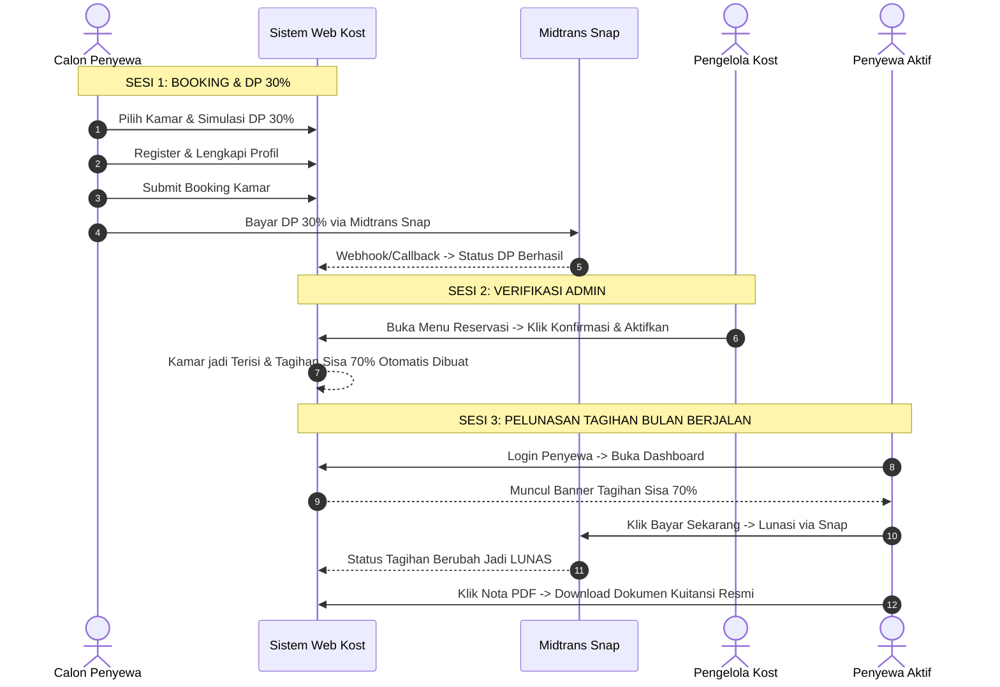

# PANDUAN LENGKAP UJI COBA & DEMO SISTEM
## Asri Boarding House — Modul Reservasi Online & Payment Gateway Midtrans
**Panduan Khusus Seminar Proposal, Seminar Hasil, dan Sidang Skripsi**

---

## 🎓 A. KESIAPAN UNTUK SEMINAR & SIDANG SKRIPSI

### Apakah Sistem Saat Ini Bisa dan Mudah Didemokan?
> **JAWABAN: SANGAT BISA, SANGAT MUDAH, DAN SANGAT MEMUKAU DOSEN PENGUJI!**

### Mengapa Sistem Ini Sangat Kuat untuk Ujian Skripsi?
1. **Integrasi Nyata (Real Industry-Grade Tech):** Menggunakan **Midtrans Snap API** (Payment Gateway Resmi) yang memunculkan pop-up pembayaran instan di layar tanpa redirect kaku.
2. **Otomatisasi End-to-End:** Pembayaran lunas langsung memicu pembuatan **Nota PDF Resmi (Dompdf)** dan notifikasi **WhatsApp Gateway (Fonnte API)**.
3. **Pemisahan Peran Nyata (Role Isolation):** Menunjukkan alur multi-role yang jelas antara:
   * **Calon Penyewa** (Booking & Pembayaran Awal / DP),
   * **Admin Kost** (Verifikasi & Aktivasi Kamar), dan
   * **Penyewa Aktif** (Dashboard Hunian & Pelunasan Tagihan Rutin Bulanan).
4. **Desain Visual Neo-Brutalism & Dark Mode:** UI modern, interaktif, dan berkarakter kuat yang langsung menarik perhatian penguji saat demo proyektor.

---

## 💡 B. LOGIKA FINANSIAL: BOOKING BULAN PERTAMA VS BULAN SELANJUTNYA

Bagaimana sistem membedakan pembayaran saat booking dan tagihan bulan-bulan berikutnya?

```mermaid
graph TD
    subgraph TAHAP 1: Pembayaran Awal (Bulan Pertama)
        A[Calon Penyewa Reservasi] --> B{Pilih Skema Bayar}
        B -->|Opsi 1: Bayar Full 100%| C[Lunas Bulan Pertama via Midtrans]
        B -->|Opsi 2: Bayar DP 30%| D[Bayar DP via Midtrans]
        C --> E[Admin Klik Konfirmasi]
        D --> E
        E -->|Jika Bayar Full| F[Tagihan Bulan 1 Otomatis LUNAS + Nota PDF]
        E -->|Jika Skema DP| G[Tagihan Sisa 70% Terbit di Dashboard Detik Itu Juga]
    end

    subgraph TAHAP 2: Tagihan Bulan Selanjutnya (Recurring)
        H[Tanggal 1 Setiap Bulan] --> I[Cron Scheduler: tagihan:generate-bulanan]
        I --> J[Tagihan Baru Muncul Otomatis di Dashboard Penyewa]
        J --> K[Penyewa Bayar via Midtrans / Transfer]
    end
```

### 1. Saat Booking (Bulan Pertama):
* **Jika Calon Penyewa Bayar Full (100%):** Uang sewa bulan pertama sudah lunas saat reservasi. Begitu admin mengonfirmasi, sistem langsung mencatat tagihan bulan ke-1 berstatus **LUNAS** dan menerbitkan nota PDF resmi otomatis.
* **Jika Calon Penyewa Bayar DP (30%):** Uang muka 30% dibayar saat reservasi. Begitu admin mengonfirmasi, sistem otomatis menerbitkan tagihan bulan pertama untuk **Sisa 70%** berstatus **PENDING** di akun penyewa detik itu juga.

### 2. Saat Masuk Bulan Selanjutnya (Bulan ke-2, ke-3, dst):
* Sistem memiliki background scheduler otomatis (`php artisan tagihan:generate-bulanan`) yang berjalan setiap tanggal 1 bulan baru untuk seluruh penyewa aktif.
* *Untuk kebutuhan demo sidang skripsi di hari yang sama*, Anda bisa langsung memicu tagihan bulan baru lewat terminal menggunakan opsi `--force`.

---

## 🛠️ C. PERSIAPAN SEBELUM DEMO (PRE-FLIGHT CHECKLIST)

Sebelum membuka presentasi di depan dosen penguji, pastikan:
1. **XAMPP Berjalan:** Apache dan MySQL aktif (hijau).
2. **Koneksi Internet Aktif:** Diperlukan untuk memuat script Snap Midtrans (`app.sandbox.midtrans.com`).
3. **Environment `.env` Siap:**
   * `MIDTRANS_SERVER_KEY` & `MIDTRANS_CLIENT_KEY` (Mode Sandbox).
   * `MIDTRANS_IS_PRODUCTION=false`.
4. **Browser Siap:** Buka 2 jendela browser (atau 1 jendela biasa + 1 jendela Incognito/Private):
   * **Jendela 1 (Private):** Untuk simulasi Calon Penyewa & Penyewa Aktif.
   * **Jendela 2 (Biasa):** Untuk panel Admin (`/admin/login`).
5. **Bookmark Simulator Midtrans:**
   * URL Simulator VA BCA/Mandiri/BRI: [https://simulator.sandbox.midtrans.com/openapi/va/index](https://simulator.sandbox.midtrans.com/openapi/va/index)

---

# 📌 D. SKENARIO DEMO UTAMA (FLOW SIDANG SKRIPSI)

Berikut adalah alur demo paling direkomendasikan yang mendemokan **Booking Midtrans + Pelunasan Tagihan Midtrans secara berurutan dalam 1 sesi**:



---

### TAHAP 1: Demo Calon Penyewa (Booking & Bayar DP 30% via Midtrans)

1. **Eksplorasi & Simulasi Realtime:**
   * Buka katalog kamar: `http://localhost/asri-boarding-house/public/kamar` (atau `http://127.0.0.1:8000/kamar`).
   * Pilih kamar (misal: *Kamar 101*), lalu klik **Detail Kamar**.
   * Di kolom *Simulasi & Reservasi*: Pilih tipe **Bulanan**, Durasi **1 Bulan**, lalu pilih opsi **Uang Muka / DP (30%)** (contoh: DP Rp 300.000 dari total Rp 1.000.000).
   * *Tunjukkan ke Dosen:* Sistem menghitung rincian biaya secara instan via AJAX.
2. **Registrasi Akun Baru:**
   * Klik tombol **Pesan Kamar Sekarang**.
   * Isi nama: `Rina Maharani`, email: `rina.demo@gmail.com`, password: `password123`.
   * Di halaman *Lengkapi Profil*: Isi No. HP: `081234567890`, NIK: `3201025508010001`, Nama Wali: `Bambang Sudarmanto`, HP Wali: `081298765432`.
   * Klik **Simpan & Lanjutkan →**.
3. **Pembayaran DP via Midtrans Snap:**
   * Klik tombol kuning: **Bayar Sekarang (Midtrans)**.
   * **Pop-up Midtrans Snap muncul di layar.**
   * Pilih metode **Bank Transfer** → **BCA** (atau Bank Lain) → Salin **Nomor Virtual Account**.
   * Buka tab Simulator Midtrans: [https://simulator.sandbox.midtrans.com/openapi/va/index](https://simulator.sandbox.midtrans.com/openapi/va/index).
   * Masukkan Nomor VA → Klik **Inquire** → Klik **Pay**.
   * Kembali ke tab kost: Popup otomatis menutup dan status berubah menjadi **✅ Pembayaran Diterima (Status DP)**.

---

### TAHAP 2: Demo Admin (Konfirmasi & Aktivasi Kamar)

1. Buka jendela Admin: `http://localhost/asri-boarding-house/public/admin/login`.
2. Login Admin (`admin@asrikost.com` / `password`).
3. Klik menu **Reservasi** → Buka detail reservasi *Rina Maharani* yang berstatus `DP`.
4. Klik tombol hijau: **Konfirmasi & Aktifkan Penyewa**.
5. *Sorot ke Dosen Penguji:* Sistem secara atomik mengeksekusi multi-tabel:
   * Mengubah status reservasi menjadi `Dikonfirmasi`.
   * Mengubah status *Kamar 101* menjadi `Terisi`.
   * Mengaktifkan akun *Rina Maharani* resmi menjadi **Penyewa Aktif**.
   * **Otomatis menerbitkan Tagihan Sisa 70% (Rp 700.000) di akun penyewa.**

---

### TAHAP 3: Demo Penyewa Aktif (Bayar Tagihan Sisa/Bulan Berjalan via Midtrans)

1. Buka tab Penyewa: Login sebagai `rina.demo@gmail.com` / `password123`.
2. Masuk ke **Dashboard Penyewa** (`/penyewa/dashboard`).
3. *Tunjukkan ke Dosen:* Di puncak dashboard langsung muncul **Active Bill Alert Banner** berwarna kuning/oranye untuk **Tagihan Sisa 70% (Rp 700.000)** dengan jatuh tempo tanggal 10.
4. Klik tombol **Bayar Sekarang** di dashboard.
5. Klik **Bayar Online Sekarang (Midtrans Snap)** → Pop-up Snap muncul kembali → Selesaikan pembayaran di simulator Midtrans.
6. Halaman ter-refresh dan status tagihan otomatis menjadi **LUNAS** (Badge Hijau).
7. Klik tombol hijau: **📄 Nota PDF**.
8. Sistem otomatis mengunduh kuitansi resmi ber-desain Neo-Brutalism dengan stempel lunas digital Dompdf.

---

### TAHAP 4: Demo Tambahan (Simulasi Terbitnya Tagihan Bulan Depan via Terminal)

Jika dosen penguji bertanya: *"Bagaimana cara sistem menagih untuk bulan ke-2 dan seterusnya?"*, lakukan demonstrasi perintah scheduler ini:

1. Buka Terminal / PowerShell di folder proyek.
2. Jalankan perintah artisan:
   ```bash
   php artisan tagihan:generate-bulanan --force
   ```
3. Refresh halaman dashboard penyewa di browser.
4. *Hasil:* Tagihan bulan baru langsung otomatis terbit di layar detik itu juga dan siap dibayar kembali via Midtrans Snap!

---

# 💬 E. CONTOH "TALK TRACK" (SKENARIO KATA-KATA SAAT SIDANG)

Gunakan panduan kalimat ini saat mendemonstrasikan ke dosen penguji:

### 1. Saat Mendemokan Calon Penyewa (Booking DP):
> *"Bapak/Ibu Penguji, calon penyewa dapat memilih skema pembayaran penuh 100% atau Uang Muka (DP) 30%. Ketika menekan tombol bayar, aplikasi langsung memanggil API Midtrans Snap secara asinkron. Pembayaran terverifikasi otomatis melalui webhook tanpa memerlukan upload bukti transfer manual."*

### 2. Saat Mendemokan Konfirmasi Admin:
> *"Setelah calon penyewa membayar DP, sistem menerapkan prinsip verifikasi ganda di mana Admin memvalidasi kesiapan fisik kamar sebelum menekan tombol 'Konfirmasi & Aktifkan'. Pada saat tombol ini ditekan, sistem secara otomatis mengunci kamar menjadi terisi dan langsung meng-inject sisa kewajiban pembayaran 70% ke dalam sistem penagihan bulanan penyewa."*

### 3. Saat Mendemokan Pelunasan Tagihan Penyewa:
> *"Untuk penyewa yang sudah aktif, sistem menyediakan Active Bill Alert Banner di dashboard untuk memangkas proses pembayaran tagihan rutin menjadi hanya 1-2 klik. Setelah pembayaran Midtrans selesai, penyewa dapat langsung mengunduh bukti kuitansi PDF resmi yang digenerate otomatis oleh server menggunakan Dompdf."*

### 4. Saat Menjelaskan Tagihan Bulan Selanjutnya:
> *"Untuk penagihan rutin di bulan-bulan berikutnya, sistem memiliki background cron scheduler yang berjalan otomatis setiap tanggal 1 bulan baru untuk menerbitkan invoice seluruh penyewa aktif dengan grace period pembayaran hingga tanggal 10."*

---

# 📋 F. TABEL DATA AKUN PENGUJIAN CEPAT (DUMMY DATA)

| Role | Email Login | Password Default | Tujuan Demo |
| :--- | :--- | :--- | :--- |
| **Admin Kost** | `admin@asrikost.com` | `password` | Konfirmasi reservasi, kelola kamar, cek laporan keuangan & kalender. |
| **Penyewa Aktif 1 (Existing)** | `penyewa@asrikost.com` | `password` | Demo pembayaran tagihan bulanan rutin & download nota PDF. |
| **Calon Penyewa Baru** | Buat baru saat demo (`demo@test.com`) | `password123` | Demo alur registrasi, simulasi kamar, dan Midtrans DP 30%. |

---
*Dokumen ini dibuat khusus sebagai panduan operasional uji coba demo seminar & sidang skripsi Asri Boarding House.*
