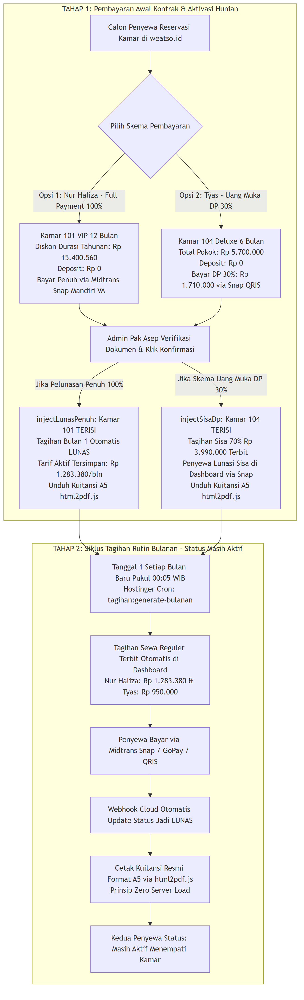
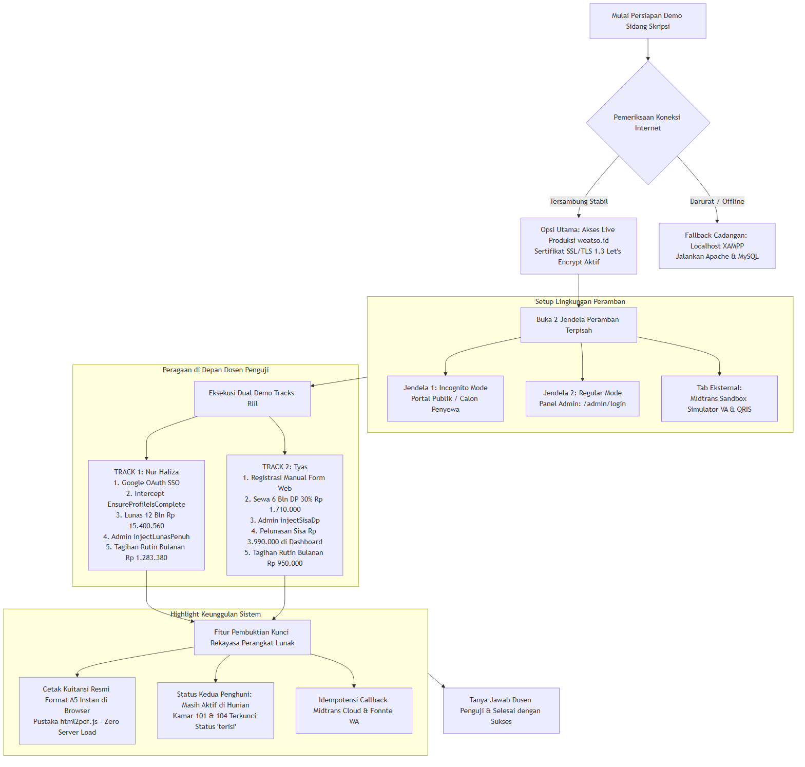
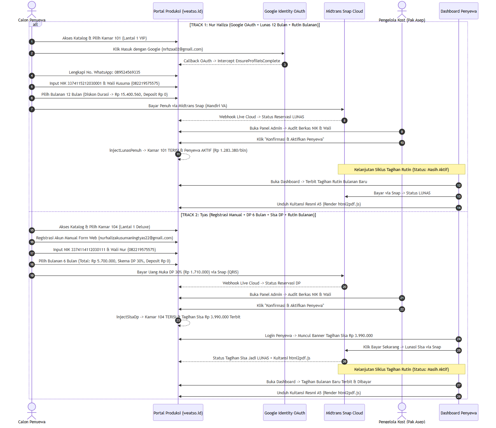
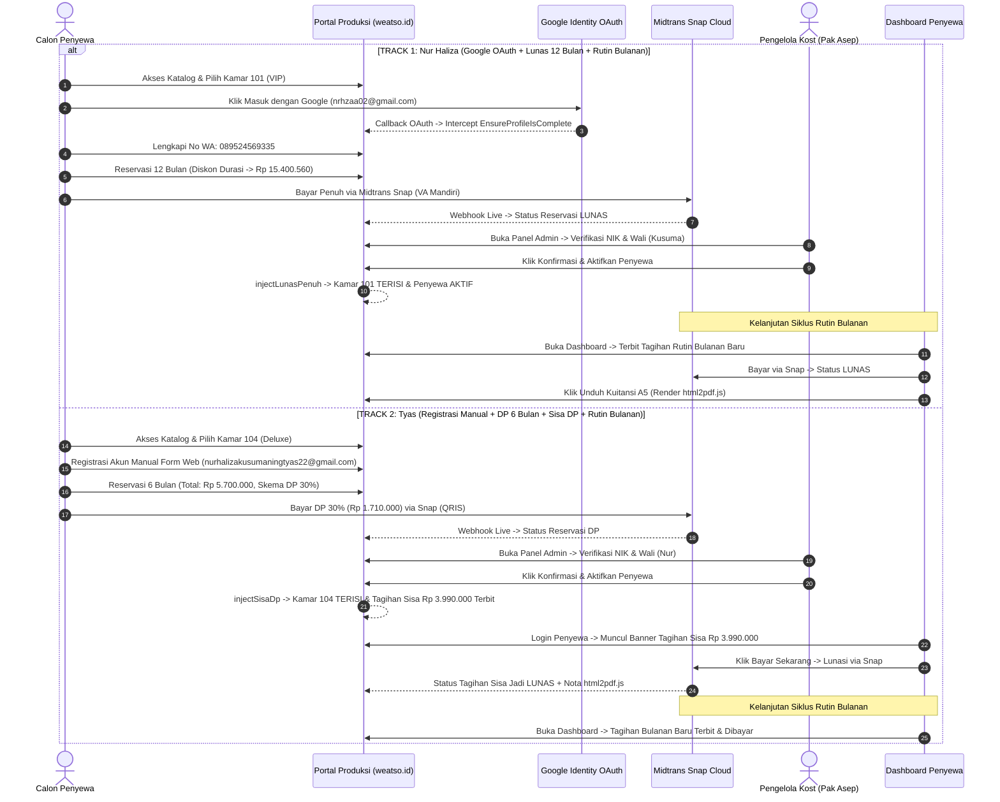
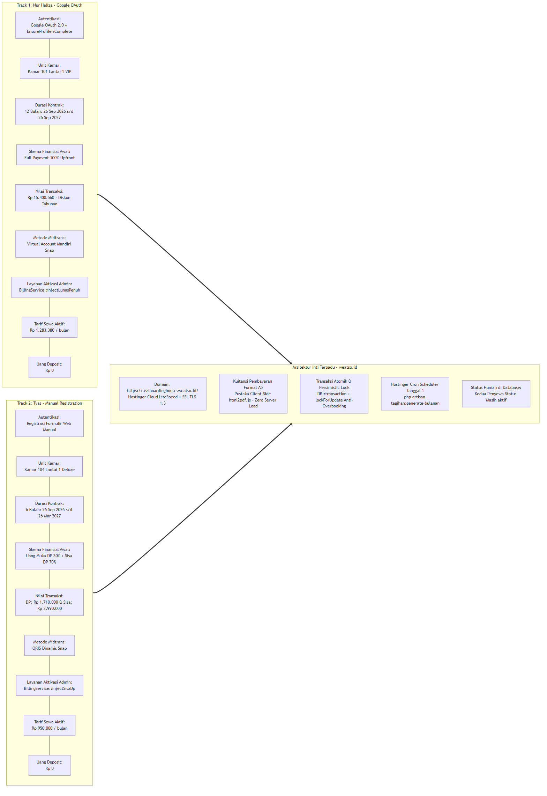

# PANDUAN LENGKAP UJI COBA & DEMO SISTEM
## Asri Boarding House — Modul Reservasi Online & Payment Gateway Midtrans
**Edisi Produksi Live (https://asriboardinghouse.weatso.id/) — Panduan Seminar Proposal, Seminar Hasil, dan Sidang Skripsi**

---

## 🎓 A. KESIAPAN UNTUK SEMINAR & SIDANG SKRIPSI

### Apakah Sistem Saat Ini Bisa dan Mudah Didemokan?
> **JAWABAN: SANGAT BISA, SANGAT MUDAH, DAN SANGAT MEMUKAU DOSEN PENGUJI!**  
> Sistem saat ini telah beroperasi secara penuh di lingkungan **Produksi Live (Cloud Shared Hosting Hostinger - LiteSpeed Enterprise)** pada domain resmi: **`https://asriboardinghouse.weatso.id/`** terproteksi sertifikat SSL/TLS 1.3 Let's Encrypt. Seluruh skenario pengujian telah diuji coba secara langsung menggunakan data riil transaksi dan terbukti berjalan lancar 100% tanpa hambatan (*zero defects*).

### Mengapa Sistem Ini Sangat Kuat untuk Ujian Skripsi?
1. **Live Production Domain:** Berjalan langsung di domain publik resmi `https://asriboardinghouse.weatso.id/`, membuktikan kematangan rekayasa perangkat lunak (*Industry-Grade Architecture*) yang siap digunakan langsung oleh masyarakat.
2. **Dual Authentication Channels:** Mendukung autentikasi modern Single Sign-On via **Google OAuth 2.0 (Laravel Socialite)** dengan proteksi penapisan nomor WhatsApp via middleware `EnsureProfileIsComplete`, berdampingan secara harmonis dengan pendaftaran konvensional formulir web (*Manual Registration*).
3. **Kalkulasi Finansial Cerdas & Diskon Durasi:** Menghitung potongan harga otomatis untuk sewa tahunan (model `Setting`), pemisahan uang muka (DP 30%) dan sisa tagihan (70%), serta tarif sewa aktif penyewa yang bersifat *immutable personal rate*.
4. **Integrasi Midtrans Snap API & Webhook Cloud:** Memunculkan *seamless payment pop-up* di layar peramban dengan verifikasi *signature SHA-512* otomatis melalui webhook cloud asinkron tanpa memerlukan konfirmasi bukti transfer manual.
5. **Otomatisasi End-to-End & Zero-Server-Load Kuitansi:** Pembayaran lunas memicu notifikasi **WhatsApp Gateway (Fonnte API)** dan perenderan kuitansi format A5 resmi berstempel digital langsung di peramban pengguna menggunakan pustaka **`html2pdf.js`** (mengeliminasi beban CPU server hosting).
6. **Pemisahan Peran Nyata (Role Isolation):** Menunjukkan alur multi-role yang tegas antara **Calon Penyewa** (Booking & Pembayaran Awal), **Admin Kost** (Audit Berkas, Verifikasi & Aktivasi Kamar), dan **Penyewa Aktif** (Dashboard Hunian, Pembayaran Sisa DP & Tagihan Rutin Bulanan).

---

## 💡 B. LOGIKA FINANSIAL: SKEMA AWAL (LUNAS 12 BULAN VS DP) & TAGIHAN RUTIN

Bagaimana sistem mengakomodasi fleksibilitas pembayaran di awal kontrak serta mengaturnya ke dalam siklus penagihan rutin bulanan?

*Berkas Diagram*: [Sumber Mermaid (.mmd)](file:///c:/xampp/htdocs/asri-boarding-house/Blueprint/UjiCoba/ujicoba_flow_logika_finansial.mmd) | [Format PNG HD](file:///c:/xampp/htdocs/asri-boarding-house/Blueprint/UjiCoba/ujicoba_flow_logika_finansial.png)

```mermaid
graph TD
    subgraph TAHAP 1: Pembayaran Awal Kontrak (Bulan Pertama)
        A[Calon Penyewa Reservasi Kamar] --> B{Pilih Skema Sewa}
        
        B -->|Opsi 1: Nur Haliza - Lunas 100% Upfront| C[Kamar 101 VIP 12 Bulan<br/>Diskon Durasi: Rp 15.400.560<br/>Bayar Penuh via Midtrans Snap]
        B -->|Opsi 2: Tyas - Uang Muka DP 30%| D[Kamar 104 Deluxe 6 Bulan<br/>Total: Rp 5.700.000<br/>Bayar DP 30%: Rp 1.710.000 via Snap]
        
        C --> E[Admin Verifikasi & Klik Konfirmasi]
        D --> E
        
        E -->|Jika Bayar Penuh 100%| F[injectLunasPenuh: Kamar 101 Terisi<br/>Tagihan Bulan 1 Otomatis LUNAS<br/>Tarif Aktif: Rp 1.283.380/bln<br/>Unduh Kuitansi A5 html2pdf.js]
        E -->|Jika Skema DP 30%| G[injectSisaDp: Kamar 104 Terisi<br/>Tagihan Sisa 70% Rp 3.990.000 Terbit<br/>Penyewa Lunasi Sisa DP via Snap]
    end

    subgraph TAHAP 2: Tagihan Rutin Bulanan (Recurring Billing)
        H[Tanggal 1 Setiap Bulan Baru<br/>Hostinger Cron: tagihan:generate-bulanan] --> I[Tagihan Sewa Reguler Terbit Otomatis di Dashboard]
        I --> J[Penyewa Bayar via Midtrans Snap / VA / QRIS]
        J --> K[Webhook Update Status Jadi LUNAS<br/>Cetak Kuitansi Resmi html2pdf.js]
    end
```

### 1. Perbedaan Dua Skema Awal Saat Reservasi (Berdasarkan Data Riil):
* **Skema Lunas Langsung 12 Bulan (Nur Haliza):** Calon penyewa menyewa Kamar 101 VIP selama 12 bulan (26 Sep 2026 s/d 26 Sep 2027). Sistem menerapkan diskon durasi tahunan dari tarif pokok Rp 1.400.000/bln menjadi total **Rp 15.400.560** (Deposit Rp 0). Saat admin mengonfirmasi, `BillingService::injectLunasPenuh` mencatat tagihan awal lunas, mengunci Kamar 101 `terisi`, dan menetapkan tarif sewa aktif penyewa menjadi **Rp 1.283.380 / bulan** (`Rp 15.400.560 / 12`).
* **Skema DP 30% Durasi 6 Bulan (Tyas):** Calon penyewa menyewa Kamar 104 Deluxe selama 6 bulan (26 Sep 2026 s/d 26 Mar 2027) dengan tarif Rp 950.000/bln (total pokok Rp 5.700.000, Deposit Rp 0). Calon penyewa membayar DP 30% sebesar **Rp 1.710.000** via Midtrans Snap. Saat admin mengonfirmasi, `BillingService::injectSisaDp` mengunci Kamar 104 `terisi` dan otomatis menginjeksi tagihan **Sisa DP 70% (Rp 3.990.000)** ke dashboard penyewa. Tyas melunasi sisa tagihan tersebut sebelum hari pertama menempati kamar kost.

### 2. Transisi Menuju Siklus Penagihan Rutin Bulanan:
* Begitu akun penyewa berstatus `aktif`, sistem memasukkan penghuni ke dalam siklus penagihan rutin bulanan (*monthly billing cycle*).
* Setiap **tanggal 1** bulan baru, Hostinger Cron Scheduler mengeksekusi `php artisan tagihan:generate-bulanan` untuk menerbitkan invoice sewa bulanan reguler dengan batas jatuh tempo tanggal 10 (*grace period*).
* *Untuk kebutuhan demonstrasi cepat di hadapan dewan penguji di hari yang sama*, penguji/admin dapat memicu tagihan bulan baru secara instan melalui baris perintah artisan dengan opsi `--force`.

---

## 🛠️ C. PERSIAPAN SEBELUM DEMO (PRE-FLIGHT CHECKLIST)

Sebelum memulai presentasi di depan dosen penguji, lakukan persiapan berikut:

### Opsi 1: Demonstrasi Live Produksi (Sangat Direkomendasikan ⭐⭐⭐⭐⭐)
1. **Perangkat & Koneksi:** Pastikan laptop presentasi terhubung ke internet (Wi-Fi kampus atau Tethering HP).
2. **Buka Domain Resmi:** Akses **`https://asriboardinghouse.weatso.id/`** (pastikan ikon gembok SSL HTTPS aktif).
3. **Siapkan 2 Jendela Peramban (Browser Window):**
   * **Jendela 1 (Private / Incognito Window):** Untuk demonstrasi Calon Penyewa & Penyewa Aktif (agar sesi tidak bentrok).
   * **Jendela 2 (Regular Window):** Untuk demonstrasi panel Administrator (`https://asriboardinghouse.weatso.id/admin/login`).
4. **Bookmark Simulator Midtrans Sandbox:**
   * URL Simulator Virtual Account: [https://simulator.sandbox.midtrans.com/openapi/va/index](https://simulator.sandbox.midtrans.com/openapi/va/index)
   * URL Simulator QRIS / GoPay: [https://simulator.sandbox.midtrans.com/qris/index](https://simulator.sandbox.midtrans.com/qris/index)

### Opsi 2: Demonstrasi Lokal Cadangan (Offline Fallback)
*Gunakan opsi ini HANYA jika jaringan internet kampus mengalami pemadaman total:*
1. XAMPP Control Panel: Jalankan Apache dan MySQL (indikator hijau).
2. Akses lokal: `http://localhost/asri-boarding-house/public` atau `http://127.0.0.1:8000`.

*Berkas Diagram*: [Sumber Mermaid (.mmd)](file:///c:/xampp/htdocs/asri-boarding-house/Blueprint/UjiCoba/ujicoba_flow_preflight_live_demo.mmd) | [Format PNG HD](file:///c:/xampp/htdocs/asri-boarding-house/Blueprint/UjiCoba/ujicoba_flow_preflight_live_demo.png)

---

## 📌 D. SKENARIO DEMO UTAMA (DUAL DEMO TRACKS RIIL)

Berikut adalah 2 (dua) alur pengujian komprehensif yang diadaptasi langsung dari data transaksi riil sistem produksi:

*Berkas Diagram*: [Sumber Mermaid (.mmd)](file:///c:/xampp/htdocs/asri-boarding-house/Blueprint/UjiCoba/ujicoba_seq_dual_demo_tracks.mmd) | [Format PNG HD](file:///c:/xampp/htdocs/asri-boarding-house/Blueprint/UjiCoba/ujicoba_seq_dual_demo_tracks.png)

```mermaid
sequenceDiagram
    autonumber
    actor User as Calon Penyewa
    participant Web as Portal Produksi (weatso.id)
    participant Google as Google Identity OAuth
    participant Midtrans as Midtrans Snap Cloud
    actor Admin as Pengelola Kost (Pak Asep)
    participant Tenant as Dashboard Penyewa

    alt TRACK 1: Nur Haliza (Google OAuth + Lunas 12 Bulan + Rutin Bulanan)
        User->>Web: Akses Katalog & Pilih Kamar 101 (VIP)
        User->>Google: Klik Masuk dengan Google (nrhzaa02@gmail.com)
        Google-->>Web: Callback OAuth -> Intercept EnsureProfileIsComplete
        User->>Web: Lengkapi No WA: 089524569335
        User->>Web: Reservasi 12 Bulan (Diskon Durasi -> Rp 15.400.560)
        User->>Midtrans: Bayar Penuh via Midtrans Snap (VA Mandiri)
        Midtrans-->>Web: Webhook Live -> Status Reservasi LUNAS
        Admin->>Web: Buka Panel Admin -> Verifikasi NIK & Wali (Kusuma)
        Admin->>Web: Klik Konfirmasi & Aktifkan Penyewa
        Web-->>Web: injectLunasPenuh -> Kamar 101 TERISI & Penyewa AKTIF
        Note over Tenant,Midtrans: Kelanjutan Siklus Rutin Bulanan
        Tenant->>Web: Buka Dashboard -> Terbit Tagihan Rutin Bulanan Baru
        Tenant->>Midtrans: Bayar via Snap -> Status LUNAS
        Tenant->>Web: Klik Unduh Kuitansi A5 (Render html2pdf.js)
    else TRACK 2: Tyas (Registrasi Manual + DP 6 Bulan + Sisa DP + Rutin Bulanan)
        User->>Web: Akses Katalog & Pilih Kamar 104 (Deluxe)
        User->>Web: Registrasi Akun Manual Form Web (nurhalizakusumaningtyas22@gmail.com)
        User->>Web: Reservasi 6 Bulan (Total: Rp 5.700.000, Skema DP 30%)
        User->>Midtrans: Bayar DP 30% (Rp 1.710.000) via Snap (QRIS)
        Midtrans-->>Web: Webhook Live -> Status Reservasi DP
        Admin->>Web: Buka Panel Admin -> Verifikasi NIK & Wali (Nur)
        Admin->>Web: Klik Konfirmasi & Aktifkan Penyewa
        Web-->>Web: injectSisaDp -> Kamar 104 TERISI & Tagihan Sisa Rp 3.990.000 Terbit
        Tenant->>Web: Login Penyewa -> Muncul Banner Tagihan Sisa Rp 3.990.000
        Tenant->>Midtrans: Klik Bayar Sekarang -> Lunasi via Snap
        Midtrans-->>Web: Status Tagihan Sisa Jadi LUNAS + Nota html2pdf.js
        Note over Tenant,Midtrans: Kelanjutan Siklus Rutin Bulanan
        Tenant->>Web: Buka Dashboard -> Tagihan Bulanan Baru Terbit & Dibayar
    end
```

---

### 🚀 TRACK 1: Demo Google OAuth + Lunas Langsung 12 Bulan + Rutin Bulanan (Nur Haliza)

Alur ini mendemonstrasikan integrasi cloud mutakhir, autentikasi Single Sign-On (SSO), kalkulasi diskon sewa tahunan otomatis, serta pelunasan kontrak penuh di muka:

#### Tahap 1.1: Eksplorasi Katalog & Login Google OAuth 2.0
1. Buka Jendela Incognito: `https://asriboardinghouse.weatso.id/kamar`.
2. Pilih kamar: **Kamar 101 (Lantai 1 VIP)**, lalu klik **Detail Kamar**.
3. Di kolom *Simulasi & Reservasi*:
   * Tipe Sewa: **Bulanan**
   * Durasi: **12 Bulan**
   * Skema Bayar: Pilih **Pelunasan Penuh (Full Payment)**
   * *Sorot ke Dosen:* Sistem menghitung potongan harga durasi tahunan dari tarif pokok Rp 1.400.000/bln menjadi total **Rp 15.400.560** (Deposit Rp 0).
4. Klik tombol **Pesan Kamar Sekarang**.
5. Sistem mengarahkan ke halaman login (`/reservasi/login`). Klik tombol merah: **"Masuk dengan Google"**.
6. Pilih akun Google `nrhzaa02@gmail.com` pada jendela dialog Google OAuth.
7. *Tunjukkan ke Dosen:* Sistem memicu middleware `EnsureProfileIsComplete` dan mengalihkan pengguna ke `/profil/complete` karena akun Google baru belum memiliki nomor kontak telepon.
8. Masukkan nomor WhatsApp aktif: `089524569335`, lalu klik **Simpan & Lanjutkan**. Profil tersimpan aman dan pengguna langsung kembali ke formulir pemesanan kamar.

#### Tahap 1.2: Pengisian Data Reservasi & Pembayaran Lunas Midtrans
1. Formulir reservasi terisi otomatis dengan nama: `Nur Haliza` dan email: `nrhzaa02@gmail.com`.
2. Lengkapi formulir:
   * NIK (KTP): `3374115212030001` (16 digit)
   * Nama Wali / Orang Tua: `Kusuma`
   * No. WhatsApp Wali: `082219575575`
   * Rentang Sewa: `26 Sep 2026 s/d 26 Sep 2027`
3. Klik **Lanjut ke Pembayaran**. Sistem menerapkan transaksi atomik dengan *row-level locking* (`lockForUpdate()`) untuk mencegah benturan jadwal reservasi (*double-booking*).
4. Klik **Bayar Sekarang (Midtrans)**. Pop-up Midtrans Snap terbuka di domain resmi `weatso.id`.
5. Pilih metode **Bank Transfer** → **Mandiri** (atau Bank Lain) → Salin Nomor VA.
6. Buka Simulator Midtrans: Masukkan Nomor VA → Klik **Inquire** → Klik **Pay**.
7. Kembali ke tab kost: Modal tertutup otomatis dan status reservasi seketika terupdate menjadi **`lunas` (Langkah 3 pada Stepper Progres)**.

#### Tahap 1.3: Konfirmasi Admin & Aktivasi Penyewa
1. Buka Jendela Browser Reguler: `https://asriboardinghouse.weatso.id/admin/login`.
2. Login Admin: `admin@asrikost.com` / `password`.
3. Buka menu **Reservasi** → Pilih data reservasi Nur Haliza yang berstatus `lunas`.
4. Periksa data diri, NIK, dan wali Kusuma.
5. Klik tombol hijau: **"Konfirmasi & Aktifkan Penyewa"**.
6. *Sorot ke Dosen Penguji:* Sistem mengeksekusi multi-tabel atomik via `TransisiPenyewaService`:
   * Mengubah status Kamar 101 menjadi **`terisi`**.
   * Membuat profil **Penyewa Aktif** Nur Haliza dengan harga sewa aktif: **Rp 1.283.380 / bulan** (`Rp 15.400.560 / 12 bln`).
   * Memanggil `BillingService::injectLunasPenuh` untuk mencatat tagihan bulan pertama berstatus **`lunas`**.
   * WhatsApp Gateway (Fonnte API) mengirimkan pesan selamat datang ke WhatsApp Nur Haliza.

#### Tahap 1.4: Simulasi Tagihan Rutin Bulanan & Unduh Nota html2pdf.js
1. Buka tab Penyewa: Masuk ke Dashboard Penyewa (`/penyewa/dashboard`).
2. Tunjukkan bahwa tagihan awal telah lunas.
3. *Simulasikan terbitnya tagihan bulan berikutnya:* (melalui cron server atau command `php artisan tagihan:generate-bulanan --force`).
4. Refresh dashboard penyewa: Tagihan sewa bulan baru langsung terbit secara otomatis sebesar Rp 1.283.380.
5. Klik **Bayar Sekarang** → Selesaikan via Midtrans Snap simulator.
6. Status tagihan berubah menjadi **LUNAS** (Badge Hijau).
7. Klik tombol **📄 Nota PDF**: Peramban seketika mengompilasi dan mengunduh kuitansi resmi A5 berstempel digital menggunakan engine client-side **`html2pdf.js`** tanpa membebani memori CPU server hostinger. Alur tuntas dengan sempurna!

---

### ⚡ TRACK 2: Demo Registrasi Manual + DP 6 Bulan + Sisa DP + Rutin Bulanan (Tyas)

Alur ini mendemonstrasikan pendaftaran mandiri form web konvensional, fleksibilitas uang muka (DP 30%) untuk durasi sewa 6 bulan, dan pelunasan sisa kewajiban penagihan:

#### Tahap 2.1: Registrasi Akun Manual & Reservasi DP Kamar 104
1. Buka Jendela Incognito: `https://asriboardinghouse.weatso.id/kamar`.
2. Pilih kamar: **Kamar 104 (Lantai 1 Deluxe, Rp 950.000/bln)**, lalu klik **Detail Kamar**.
3. Di kolom *Simulasi & Reservasi*:
   * Tipe Sewa: **Bulanan**
   * Durasi: **6 Bulan** (Rentang sewa: `26 Sep 2026 s/d 26 Mar 2027`)
   * Skema Bayar: Pilih opsi **Uang Muka / DP (30%)**
   * *Sorot ke Dosen:* Sistem menghitung rincian biaya secara instan:
     * Total Pokok Sewa (6 x Rp 950.000) = **Rp 5.700.000**
     * Uang Muka DP 30% dari Pokok = **Rp 1.710.000**
     * Uang Deposit Jaminan = **Rp 0**
     * **Total Pembayaran Awal DP = Rp 1.710.000**
     * Sisa Kewajiban Pokok (70%) = **Rp 3.990.000**
4. Klik **Pesan Kamar Sekarang**. Pada halaman login, klik tab **"Daftar Akun Baru"**.
5. Isi formulir pendaftaran:
   * Nama Lengkap: `Tyas`
   * Email: `nurhalizakusumaningtyas22@gmail.com`
   * No. WhatsApp: `085940810105`
   * Password: `password123`
6. Akun berhasil dibuat dan otomatis terautentikasi ke sistem.
7. Lengkapi formulir pemesanan: NIK `3374114112030111`, Nama Wali: `Nur`, No HP Wali: `082219575575`, lalu klik **Kirim Pemesanan**.

#### Tahap 2.2: Pembayaran DP via QRIS Midtrans Snap
1. Di halaman detail reservasi, klik tombol **"Bayar DP Sekarang"**.
2. Pop-up Midtrans Snap muncul di layar. Pilih metode pembayaran **QRIS**.
3. Di simulator Midtrans QRIS, selesaikan pembayaran sebesar **Rp 1.710.000**.
4. Webhook live server Hostinger memproses transaksi: Status reservasi otomatis terbarui menjadi **`dp`** dengan keterangan sisa kewajiban Rp 3.990.000.

#### Tahap 2.3: Konfirmasi Admin & Penerbitan Tagihan Sisa DP 70%
1. Pindah ke Jendela Admin (`/admin/reservasi`).
2. Buka data reservasi Tyas yang berstatus `dp`.
3. Verifikasi berkas NIK dan kontak wali Nur, lalu klik **"Konfirmasi & Aktifkan Penyewa"**.
4. *Sorot ke Dosen Penguji:* Sistem mengeksekusi `BillingService::injectSisaDp`:
   * Kamar 104 resmi terkunci menjadi **`terisi`**.
   * Profil Tyas berubah menjadi **Penyewa Aktif** dengan harga sewa aktif: Rp 950.000/bln.
   * Sistem secara otomatis menerbitkan tagihan baru untuk **Sisa DP 70% (Rp 3.990.000)** dengan tenggat waktu jatuh tempo dinamis.

#### Tahap 2.4: Pelunasan Sisa Tagihan DP oleh Penyewa
1. Kembali ke Jendela Penyewa: Akses Dashboard Penyewa (`/penyewa/dashboard`).
2. *Tunjukkan ke Dosen:* Di bagian atas dashboard langsung tampil **Active Bill Alert Banner** oranye mencolok yang menginfokan tagihan pelunasan **Sisa DP Reservasi sebesar Rp 3.990.000**.
3. Penyewa mengklik tombol **"Bayar Sekarang"** pada banner tersebut.
4. Klik **Bayar Online Sekarang (Midtrans Snap)** → Pop-up Snap muncul kembali → Selesaikan pembayaran di simulator.
5. Halaman dashboard ter-refresh otomatis: Status tagihan sisa berubah menjadi **LUNAS** (Badge Hijau).
6. Penyewa mengklik tombol **📄 Nota PDF** untuk mengunduh bukti tanda terima pelunasan A5 berbasis `html2pdf.js`.

#### Tahap 2.5: Transisi ke Siklus Tagihan Rutin Bulanan
1. Setelah kewajiban kontrak awal dan sisa DP lunas, pada periode bulan berikutnya sistem menjadwalkan penagihan sewa bulanan reguler (Rp 950.000/bln).
2. Simulasikan penerbitan tagihan bulan baru, dan tunjukkan proses pelunasan rutin yang berjalan lancar tanpa friksi. Alur tuntas 100% dari hulu ke hilir!

---

## 💬 E. CONTOH "TALK TRACK" (SKENARIO KATA-KATA SAAT SIDANG)

Gunakan panduan narasi verbal ini saat mempresentasikan sistem di depan dewan penguji:

### 1. Pembuka & Kesiapan Produksi Live:
> *"Bapak dan Ibu Dewan Penguji, sistem informasi Asri Boarding House ini tidak sekadar berjalan di lingkungan lokal development, melainkan telah kami deploy secara penuh pada infrastruktur cloud server produksi di domain publik resmi https://asriboardinghouse.weatso.id/ dengan sertifikat keamanan SSL TLS 1.3. Seluruh skenario telah kami uji menggunakan data transaksi nyata dari awal pemesanan hingga pelunasan."*

### 2. Saat Menjelaskan Track 1 (Nur Haliza - Google OAuth & Lunas 12 Bulan):
> *"Pada skenario pertama atas nama Nur Haliza, calon penghuni memanfaatkan Single Sign-On Google OAuth 2.0. Sistem kami lengkapi dengan middleware cerdas EnsureProfileIsComplete yang mendeteksi ketiadaan nomor telepon dan mewajibkan input nomor WhatsApp aktif sebelum melanjutkan booking. Untuk sewa 12 bulan di Kamar 101 VIP, sistem secara otomatis memberikan diskon durasi dari tarif pokok Rp 1.400.000/bln menjadi Rp 15.400.560. Begitu pembayaran Midtrans terverifikasi dan Admin mengonfirmasi, service injectLunasPenuh otomatis mencatat tagihan awal lunas dan menetapkan harga sewa aktif Rp 1.283.380/bln untuk penagihan rutin berikutnya."*

### 3. Saat Menjelaskan Track 2 (Tyas - Pendaftaran Manual, DP & Sisa Pelunasan):
> *"Pada skenario kedua atas nama Tyas, sistem mengakomodasi pendaftaran manual form web dan memilih skema Uang Muka (DP 30%) untuk sewa 6 bulan di Kamar 104 Deluxe senilai Rp 5.700.000. Calon penyewa cukup membayar DP Rp 1.710.000. Saat Admin menekan 'Konfirmasi & Aktifkan Penyewa', service injectSisaDp secara otomatis meng-inject sisa tagihan 70% sebesar Rp 3.990.000 langsung ke akun penyewa. Penyewa dapat melunasinya dengan 1 klik melalui Active Bill Alert Banner sebelum hari pertama menempati kamar kost."*

### 4. Saat Menjelaskan Arsitektur Kuitansi (html2pdf.js):
> *"Pencetakan kuitansi format A5 berstempel digital diproses sepenuhnya di sisi peramban pengguna menggunakan library html2pdf.js dengan prinsip Zero Server Load. Hal ini mengeliminasi pemborosan kapasitas CPU server shared hosting Hostinger dan meniadakan penumpukan file kuitansi fisik di penyimpanan peladen."*

---

## 📋 F. TABEL DATA AKUN PENGUJIAN CEPAT (DATA RIIL PRODUKSI)

| Role Pengujian | URL Akses | Email Login / Identitas | Password Default | Data Transaksi & Kamar Uji |
| :--- | :--- | :--- | :--- | :--- |
| **Admin Kost (Super Admin)** | `https://asriboardinghouse.weatso.id/admin/login` | `admin@asrikost.com` | `password` | Audit berkas NIK & wali, konfirmasi aktivasi kamar, monitor arus kas & laporan manajerial. |
| **Calon Penyewa (Track 1)** | `https://asriboardinghouse.weatso.id/kamar` | `nrhzaa02@gmail.com` *(Nur Haliza)* | *Google SSO* | Kamar 101 (VIP, 12 Bulan Lunas Rp 15.400.560, NIK: `3374115212030001`, Wali: Kusuma). |
| **Calon Penyewa (Track 2)** | `https://asriboardinghouse.weatso.id/reservasi/login` | `nurhalizakusumaningtyas22@gmail.com` *(Tyas)* | `password123` | Kamar 104 (Deluxe, 6 Bulan DP Rp 1.710.000 & Sisa Rp 3.990.000, NIK: `3374114112030111`, Wali: Nur). |
| **Penyewa Aktif (Existing)** | `https://asriboardinghouse.weatso.id/login` | `penyewa@asrikost.com` | `password` | Demo cepat pembayaran tagihan rutin bulanan & unduh kuitansi resmi A5 `html2pdf.js`. |

---

## 🏛️ G. MATRIKS KOMPARASI FITUR & ARSITEKTUR DUAL DEMO TRACKS

Diagram di bawah ini menyajikan peta perbandingan komparatif arsitektural antara Track 1 dan Track 2 dalam implementasi sistem live produksi:

*Berkas Diagram*: [Sumber Mermaid (.mmd)](file:///c:/xampp/htdocs/asri-boarding-house/Blueprint/UjiCoba/ujicoba_architecture_komparasi_fitur.mmd) | [Format PNG HD](file:///c:/xampp/htdocs/asri-boarding-house/Blueprint/UjiCoba/ujicoba_architecture_komparasi_fitur.png)

---
*Dokumen panduan operasional ini telah diselaraskan penuh dengan infrastruktur produksi live Asri Boarding House (v247.0) dan siap digunakan untuk demonstrasi seminar proposal, seminar hasil, dan sidang tugas akhir / skripsi.*
