SISTEM INFORMASI MANAJEMEN KOST TERINTEGRASI PAYMENT GATEWAY PADA ASRI BOARDING HOUSE

SKRIPSI
Diajukan sebagai salah satu syarat untuk menyusun Tugas Akhir guna mencapai gelar Sarjana Komputer pada Program Studi Sistem Informasi Universitas Katolik Soegijapranata Semarang
 


Disusun oleh:
RAFIF ARSYA PRADIVA
NIM: 22.N4.0014


Kepada
PROGRAM STUDI SISTEM INFORMASI
FAKULTAS ILMU KOMPUTER
UNIVERSITAS KATOLIK SOEGIJAPRANATA
SEMARANG
2026 
SISTEM INFORMASI MANAJEMEN KOST TERINTEGRASI PAYMENT GATEWAY PADA ASRI BOARDING HOUSE


Skripsi
Diajukan sebagai salah satu syarat untuk menyusun Tugas Akhir guna mencapai gelar Sarjana Komputer pada Program Studi Sistem Informasi Universitas Katolik Soegijapranata Semarang


Disusun oleh:
RAFIF ARSYA PRADIVA
22.N4.0014

Disetujui oleh:
Dosen Pembimbing Skripsi


Ir. Andre Kurniawan Pamudji, S.Kom, M.Ling.
NPP: 058.1.1994.161

Kepada
PROGRAM STUDI SISTEM INFORMASI
FAKULTAS ILMU KOMPUTER
UNIVERSITAS KATOLIK SOEGIJAPRANATA
SEMARANG
2026 
## HALAMAN PERNYATAAN ORISINALITAS
Saya yang bertanda tangan di bawah ini:

Nama			: Rafif Arsya Pradiva
NIM			: 22.N4.0014
Program Studi		: Sistem Informasi
Fakultas		: Ilmu Komputer

menyatakan dengan sesungguhnya bahwa Skripsi dengan judul “Sistem Informasi Manajemen Kost Terintegrasi Payment Gateway pada Asri Boarding House” adalah benar-benar hasil karya saya sendiri, bukan merupakan jiplakan dari karya tulis orang lain, baik sebagian maupun keseluruhan. Pendapat, gagasan, atau temuan orang lain yang terdapat di dalam Skripsi ini telah dikutip dan dirujuk berdasarkan kaidah penulisan ilmiah yang berlaku.
Apabila di kemudian hari terbukti bahwa pernyataan ini tidak benar, saya bersedia menerima sanksi akademik sesuai dengan ketentuan yang berlaku di Universitas Katolik Soegijapranata Semarang.

Semarang, ........................ 2026
Yang menyatakan,

Materai
Rp10.000

Rafif Arsya Pradiva
NIM. 22.N4.0014
## HALAMAN PERNYATAAN BEBAS PLAGIASI
Saya yang bertanda tangan di bawah ini:

Nama			: Rafif Arsya Pradiva
NIM			: 22.N4.0014
Program Studi		: Sistem Informasi
Fakultas		: Ilmu Komputer

menyatakan dengan sesungguhnya bahwa Skripsi yang saya susun telah bebas dari unsur plagiasi. Seluruh sumber, baik berupa kutipan langsung maupun tidak langsung, yang berasal dari karya orang lain telah disebutkan sumbernya secara jujur dan dicantumkan dalam Daftar Pustaka sesuai dengan format penulisan ilmiah yang berlaku.
Apabila di kemudian hari ditemukan adanya pelanggaran terhadap etika keilmuan dalam karya ini, atau terdapat klaim dari pihak lain terhadap keaslian karya ini, saya bersedia mempertanggungjawabkannya dan menerima sanksi sesuai dengan peraturan yang berlaku.

Semarang, ........................ 2026
Yang menyatakan,

Rafif Arsya Pradiva
NIM. 22.N4.0014
## HALAMAN PENGESAHAN
Skripsi dengan judul:

SISTEM INFORMASI MANAJEMEN KOST TERINTEGRASI PAYMENT GATEWAY PADA ASRI BOARDING HOUSE

yang dipersiapkan dan disusun oleh:
Rafif Arsya Pradiva — NIM. 22.N4.0014

telah diperiksa dan disetujui oleh Dosen Pembimbing untuk diajukan dalam Seminar Skripsi pada Program Studi Sistem Informasi Fakultas Ilmu Komputer Universitas Katolik Soegijapranata Semarang.


Semarang, ........................ 2026

Telah diperiksa dan disetujui
Semarang, 13-07-2026

	Pembimbing 1	Pembimbing 2


	Ir. Andre Kurniawan Pamudji, S.Kom, M.Ling	NAMA
NPP. 581.2021.403					NPP. ….
## KATA PENGANTAR
Puji dan syukur penulis panjatkan ke hadirat Tuhan Yang Maha Esa atas segala rahmat dan karunia-Nya sehingga penulis dapat menyelesaikan penyusunan Skripsi yang berjudul “Sistem Informasi Manajemen Kost Terintegrasi Payment Gateway pada Asri Boarding House” dengan baik. Skripsi ini disusun sebagai salah satu syarat untuk menyusun Tugas Akhir guna mencapai gelar Sarjana Komputer pada Program Studi Sistem Informasi Fakultas Ilmu Komputer Universitas Katolik Soegijapranata Semarang.
Penulis menyadari bahwa penyusunan Skripsi ini tidak terlepas dari bantuan, bimbingan, dan dukungan berbagai pihak. Oleh karena itu, pada kesempatan ini penulis menyampaikan ucapan terima kasih yang sebesar-besarnya kepada:
•	Rektor Universitas Katolik Soegijapranata Semarang beserta seluruh jajarannya;
•	Dekan Fakultas Ilmu Komputer Universitas Katolik Soegijapranata Semarang;
•	Ketua Program Studi Sistem Informasi atas dukungan dan arahan akademik yang diberikan;
•	Dosen Pembimbing yang dengan penuh kesabaran telah meluangkan waktu, tenaga, dan pikiran untuk membimbing penulis selama proses penyusunan Skripsi ini;
•	Bapak Asep selaku pemilik Asri Boarding House yang telah berkenan menjadi objek penelitian dan memberikan data serta informasi operasional yang dibutuhkan;
•	Kedua orang tua dan keluarga penulis atas doa, kasih sayang, serta dukungan moral dan material yang tiada henti;
•	Rekan-rekan mahasiswa serta semua pihak yang tidak dapat penulis sebutkan satu per satu, yang telah memberikan bantuan dalam penyusunan Skripsi ini.
Penulis menyadari bahwa Skripsi ini masih jauh dari kata sempurna. Oleh karena itu, kritik dan saran yang membangun sangat penulis harapkan demi penyempurnaan penelitian pada tahap selanjutnya. Semoga Skripsi ini dapat memberikan manfaat bagi pengembangan ilmu pengetahuan, khususnya di bidang sistem informasi dan e-commerce.

Semarang, ........................ 2026
Penulis,

Rafif Arsya Pradiva
## HALAMAN PERNYATAAN PERSETUJUAN PUBLIKASI KARYA ILMIAH UNTUK KEPENTINGAN AKADEMIS
Sebagai sivitas akademika Universitas Katolik Soegijapranata Semarang, saya yang bertanda tangan di bawah ini:

Nama			: Rafif Arsya Pradiva
NIM			: 22.N4.0014
Program Studi		: Sistem Informasi
Fakultas		: Ilmu Komputer
Jenis Karya		: Skripsi

demi pengembangan ilmu pengetahuan, menyetujui untuk memberikan kepada Program Studi Sistem Informasi Fakultas Ilmu Komputer Universitas Katolik Soegijapranata Semarang Hak Bebas Royalti Noneksklusif (Non-exclusive Royalty-Free Right) atas karya ilmiah saya yang berjudul di atas beserta perangkat yang ada (jika diperlukan).
Dengan Hak Bebas Royalti Noneksklusif ini, Program Studi Sistem Informasi berhak menyimpan, mengalih-media/format-kan, merawat, dan memublikasikan karya ilmiah tersebut untuk kepentingan akademis tanpa perlu meminta izin dari saya selama tetap mencantumkan nama saya sebagai penulis/pencipta dan sebagai pemilik Hak Cipta. Hak Cipta atas karya ilmiah ini tetap berada pada penulis.
Demikian pernyataan ini saya buat dengan sebenarnya.

Dibuat di Semarang
Pada tanggal ........................ 2026
Yang menyatakan,

Rafif Arsya Pradiva
NIM. 22.N4.0014
## ABSTRAK
Rafif Arsya Pradiva. 22.N4.0014. SISTEM INFORMASI MANAJEMEN KOST TERINTEGRASI PAYMENT GATEWAY PADA ASRI BOARDING HOUSE (Studi Kasus: Asri Boarding House, Tembalang, Kota Semarang).
Asri Boarding House merupakan usaha kos di kawasan Tembalang, Kota Semarang, yang mengelola 32 unit kamar dengan potensi pendapatan mencapai Rp28.500.000 per bulan. Pengelolaan yang masih bersifat konvensional menyebabkan sistem rentan terhadap kesalahan pencatatan keuangan, sengketa validasi pembayaran tunai, ketiadaan pelacakan keterlambatan pembayaran secara otomatis, serta risiko pemesanan ganda (double booking). Penelitian ini bertujuan merancang dan membangun Sistem Informasi Manajemen Kost yang terintegrasi payment gateway dan modul reservasi online berbasis framework Laravel 11 untuk mengatasi permasalahan tersebut. Metode pengembangan yang digunakan adalah Research and Development dengan model Waterfall yang meliputi tahap analisis kebutuhan, perancangan, implementasi, dan pengujian. Sistem dirancang menggunakan arsitektur 3-tier dengan pola Model-View-Controller, basis data MySQL yang dinormalisasi hingga bentuk normal ketiga (3NF), integrasi Midtrans Snap sebagai gerbang pembayaran, serta Fonnte WhatsApp API dan SMTP sebagai kanal notifikasi. Fitur utama meliputi penagihan otomatis bulanan, mekanisme denda keterlambatan flat yang idempoten (dikenakan tepat satu kali pada bulan kalender berikutnya) disertai eskalasi notifikasi berjenjang kepada wali penyewa, reservasi mandiri melalui dua jalur (online dan konvensional), serta kanal komunikasi chat berbasis AJAX polling. Pengujian dilakukan menggunakan metode blackbox testing dan automated feature test PHPUnit untuk memvalidasi logika penagihan, denda, dan pencegahan kondisi balapan (race condition). Hasil yang diharapkan adalah tersedianya sistem yang mampu mengotomatisasi siklus penagihan, meningkatkan akurasi data keuangan dan hunian secara real-time, serta memperluas jangkauan pemasaran kamar melalui reservasi daring.
Kata kunci: sistem informasi manajemen kos, payment gateway, Laravel 11, reservasi online, penagihan otomatis
## ABSTRACT
Rafif Arsya Pradiva. 22.N4.0014. Design and Development of an Integrated Boarding House Management Information System with Payment Gateway in Asri Boarding House (Case Study: Asri Boarding House, Tembalang, Semarang City).
Asri Boarding House is a boarding house business located in the Tembalang area of Semarang City, managing 32 rooms with a potential monthly revenue of IDR 28,500,000. Its conventional management makes the operation prone to financial recording errors, cash payment validation disputes, the absence of automatic payment-delay tracking, and the risk of double-booking. This research aims to design and build a Boarding House Management Information System integrated with a payment gateway and an online reservation module based on the Laravel 11 framework. The development method used is Research and Development with the Waterfall model, covering requirements analysis, design, implementation, and testing. The system is designed using a 3-tier architecture with the Model-View-Controller pattern, a MySQL database normalized to the third normal form (3NF), Midtrans Snap integration as the payment gateway, and the Fonnte WhatsApp API together with SMTP as notification channels. The main features include automated monthly billing, an idempotent flat late-fee mechanism (charged exactly once in the following calendar month) complemented by tiered notification escalation to the tenant’s guardian, self-service reservation through two paths (online and conventional), and an AJAX-polling-based chat channel. Testing is conducted using blackbox testing and PHPUnit automated feature tests to validate the billing logic, late fees, and race-condition prevention. The expected result is a system capable of automating the billing cycle, improving the accuracy of financial and occupancy data in real time, and expanding room marketing reach through online reservation.
Keywords: boarding house management information system, payment gateway, Laravel 11, online reservation, automated billing

 

## DAFTAR ISI
HALAMAN PERNYATAAN ORISINALITAS	ii
HALAMAN PERNYATAAN BEBAS PLAGIASI	iii
HALAMAN PENGESAHAN	iv
KATA PENGANTAR	v
HALAMAN PERNYATAAN PERSETUJUAN PUBLIKASI KARYA ILMIAH UNTUK KEPENTINGAN AKADEMIS	vii
ABSTRAK	viii
ABSTRACT	ix
DAFTAR ISI	x
DAFTAR TABEL	xii
DAFTAR GAMBAR	xiii
BAB I PENDAHULUAN	1
1.1 Latar Belakang	1
1.2 Rumusan Masalah	4
1.3 Tujuan Penelitian	5
1.4 Batasan Masalah	6
1.5 Manfaat Penelitian	8
1.5.1 Manfaat Teoretis	8
1.5.2 Manfaat Praktis	8
1.6 Sistematika Penulisan	9
BAB II  TINJAUAN PUSTAKA DAN LANDASAN TEORI	11
2.1 Landasan Teori	11
2.1.1 Sistem Informasi dan Sistem Informasi Manajemen	11
2.1.2 Sistem Berbasis Web dan E-Commerce Model B2C	11
2.1.3 Sistem Manajemen Basis Data Relasional dan Normalisasi 3NF	12
2.1.4 Arsitektur 3-Tier dan Model-View-Controller pada Laravel 11	12
2.1.5 Antarmuka Pemrograman Aplikasi (API) Eksternal: Midtrans dan Fonnte	13
2.1.6 Penjadwalan Tugas, Mesin Penagihan Otomatis, dan Cron Job	13
2.1.7 Teori Interaktivitas UI/UX: Neo-Brutalism dan WCAG 2.1	14
2.1.8 Keamanan Web dan Integritas Data	14
2.1.9 Concurrency Control dan Mekanisme Penguncian Basis Data	15
2.2 Penelitian Terdahulu (State of the Art)	15
2.3 Kerangka Pemikiran	17
BAB III  METODOLOGI PENELITIAN	20
3.1 Jenis Penelitian	20
3.2 Teknik Pengumpulan Data	20
3.3 Metode Pengembangan Sistem	21


BAB IV HASIL DAN PEMBAHASAN	44
4.1 Analisis dan Perancangan Sistem	22
4.1.1 Analisis Kebutuhan Fungsional dan Non-Fungsional	22
4.1.2 Use Case Diagram	24
4.1.3 Activity Diagram Proses Kritis	27
4.1.4 Sequence Diagram	31
4.1.5 Class Diagram	33
4.1.6 Perancangan Skema Basis Data Relasional 3NF dan ERD	34
4.1.7 Arsitektur Sistem 3-Tier MVC	37
4.2 Implementasi Kode Program Backend dan Logika Bisnis	44
4.2.1 Arsitektur 3-Tier MVC dan Service Layer Decoupling	44
4.2.2 Cronjob Pembangkitan Invoice Bulanan dan Idempotency Guard Late Fee	46
4.2.3 Penanganan Webhook Callback Payment Gateway Midtrans Snap API	49
4.2.4 Otentikasi Google OAuth API via Laravel Socialite dan Complete Profile	52
4.2.5 Subsistem Notifikasi Asinkron Fonnte WhatsApp API dan SMTP TLS Mailer	55
4.2.6 Penanganan Konflik Unique Constraint Soft Deletes Berbasis Virtual Generated Columns	57
4.3 Hasil Implementasi Antarmuka Lingkungan Lokal (Localhost)	58
4.3.1 Pengecekan Server Lokal dan Kompilasi Bundel Aset	58
4.3.2 Halaman Publik Portal Informasi dan Detail Unit Kamar	59
4.3.3 Panel Kontrol Dasbor Administrasi Utama Kost	60
4.3.4 Portal Mandiri Transaksional dan Unduh Dokumen Penyewa Kost	61
4.3.5 Workspace Alur Pemesanan (5-Step Stepper & Middleware)	62
4.4 Konfigurasi Penyiapan Perangkat Peladen Produksi (Shared Hosting Production)	63
4.4.1 Integrasi Server Produksi (Hostinger LiteSpeed Enterprise)	63
4.4.2 Analisis Komparasi Parameter Lingkungan Perangkat Peladen	64
4.5 Pengujian Sistem (Testing, Validasi, dan Quality Assurance)	66
4.5.1 Hasil Eksekusi Automated Testing Suite Framework PHPUnit	66
4.5.2 Hasil Pengujian Validasi Fungsionalitas Kotak Hitam (Black-Box Testing)	67
4.6 Sesi Wawancara Evaluasi Pengguna (Pemilik Kost)	70
4.6.1 Hasil Tanya Jawab (Q&A) Evaluasi Operasional Aplikasi Bersama Bapak Asep	70
4.6.2 Implikasi Penggunaan Sistem Terhadap Efisiensi Operasional Kost	71
DAFTAR PUSTAKA	73

## DAFTAR TABEL
Tabel 2.1  Perbandingan Penelitian Terdahulu (State of the Art)	16
Tabel 4.1  Kebutuhan Non-Fungsional Sistem	22
Tabel 4.2  Struktur Tabel Utama Basis Data Sistem	34
Tabel 4.3  Perbandingan Parameter Konfigurasi Lingkungan Server	64
Tabel 4.4  Matriks Hasil Pengujian Kotak Hitam (Black-Box Testing)	67
Tabel 4.5  Rangkuman Hasil Wawancara Evaluasi Operasional	70

## DAFTAR GAMBAR
Gambar 2.1  Kerangka Pemikiran Penelitian	18
Gambar 3.1  Diagram Model Waterfall Pengembangan Sistem	20
Gambar 4.1  Use Case Diagram Sistem Asri Boarding House	25
Gambar 4.2  Activity Diagram Tiga Proses Kritis Sistem	27
Gambar 4.3  Sequence Diagram Alur Utama Sistem	32
Gambar 4.4  Class Diagram Model, Service, dan Observer Sistem	33
Gambar 4.5  Entity Relationship Diagram (ERD) Skema Basis Data Lengkap 22 Tabel	35
Gambar 4.6  Mekanisme Billing Engine Massal	46
Gambar 4.7  Middleware Validasi Webhook Signature	49
Gambar 4.8  Alur Interseptor Profil Google OAuth	52
Gambar 4.9  Sistem Notifikasi Fonnte WA Service	55
Gambar 4.10  Kompilasi Bundel Aset Vite Produksi	58
Gambar 4.11  Antarmuka Katalog Kamar Publik Neo-Brutalisme	59
Gambar 4.12  Dasbor Administrasi Keuangan Administrator	60
Gambar 4.13  Portal Invoice and Kuitansi PDF Penyewa	61
Gambar 4.14  Workspace Stepper Alur Reservasi Calon Penyewa	62
Gambar 4.15  Output Terminal php artisan test Passed	66
Gambar 4.16  Dokumentasi UAT Sesi Wawancara dan Penyerahan Sistem	71

 
## BAB I PENDAHULUAN
## 1.1 Latar Belakang
Transformasi digital pada dekade terakhir telah menggeser model bisnis konvensional ke arah ekosistem berbasis web dan mobile secara menyeluruh, termasuk pada sektor jasa dan perdagangan elektronik (e-commerce). Pertumbuhan penetrasi internet, dompet digital (e-wallet), serta ekspektasi konsumen terhadap layanan mandiri (self-service) yang tersedia selama dua puluh empat jam mendorong pelaku usaha untuk merancang sistem informasi yang mengintegrasikan proses transaksi, pencatatan, dan komunikasi pelanggan dalam satu kesatuan platform [1]. Pergeseran ini tidak hanya menyentuh sektor ritel, tetapi juga merambah sektor properti dan akomodasi yang secara historis dikelola secara manual dan berbasis kepercayaan personal.
Sektor teknologi properti (property technology atau proptech) muncul sebagai respons terhadap kebutuhan digitalisasi pengelolaan hunian, mulai dari pemasaran unit, reservasi, hingga administrasi keuangan penyewaan. Dalam konteks pasar Indonesia, salah satu segmen properti yang paling dinamis namun paling tertinggal dalam adopsi teknologi adalah usaha rumah kos (boarding house), khususnya yang berlokasi di sekitar kawasan kampus. Tingginya mobilitas penyewa berbasis siklus akademik, keragaman tipe kamar, serta dominasi pembayaran tunai membuat pengelolaan kos rentan terhadap kesalahan administratif apabila masih bersandar pada pencatatan kertas dan komunikasi lisan.
Sistem informasi manajemen (management information system) didefinisikan sebagai gabungan terpadu antara manusia, perangkat keras, perangkat lunak, basis data, dan prosedur yang berfungsi mengumpulkan, mengolah, menyimpan, dan mendistribusikan informasi guna mendukung pengambilan keputusan operasional maupun strategis dalam suatu organisasi [2]. Penerapan sistem informasi manajemen pada usaha kos memungkinkan pemilik untuk mengubah data transaksi yang sebelumnya tersebar dan bersifat volatile menjadi basis data relasional yang konsisten, terverifikasi, dan dapat diaudit. Dengan demikian, kebutuhan akan sistem yang mampu mengotomatisasi siklus penagihan dan menstandarkan alur kerja menjadi semakin mendesak. 
Asri Boarding House merupakan usaha kos milik Bapak Asep (usia 48 tahun) yang berlokasi di Jalan Maera Sari Nomor 1/Nomor 12, Tembalang, Kecamatan Tembalang, Kota Semarang, Jawa Tengah 50275. Usaha ini beroperasi dengan total 32 unit kamar yang tersebar pada dua lantai dan terbagi ke dalam tiga kategori, yaitu tipe VIP sebanyak 6 kamar (Rp1.400.000 per bulan), tipe Deluxe sebanyak 3 kamar (Rp950.000 per bulan), dan tipe Standar sebanyak 23 kamar (Rp750.000 per bulan). Apabila seluruh kamar terisi penuh, potensi pendapatan bruto maksimum yang dapat dihimpun mencapai Rp28.500.000 per bulan. Nilai perputaran kas yang signifikan ini menuntut tata kelola keuangan yang akurat, sebab kesalahan pencatatan sekecil apa pun berpotensi menimbulkan kerugian material dan sengketa dengan penyewa.
Permasalahan utama yang dihadapi Asri Boarding House terletak pada proses penagihan bulanan yang masih dilakukan secara manual, yakni administrator harus menghubungi setiap penyewa satu per satu untuk mengingatkan kewajiban pembayaran. Mekanisme ini tidak hanya tidak efisien, tetapi juga rentan menyebabkan tagihan terlambat disampaikan, penyewa lupa membayar, dan pendapatan tertunda tanpa dapat dimonitor secara terukur. Selain itu, ketiadaan sistem eskalasi keterlambatan yang terstruktur menyebabkan penyewa yang menunggak tidak memperoleh pengingat (reminder) yang konsisten, sementara pihak wali atau orang tua penyewa tidak pernah dilibatkan dalam proses penagihan meskipun secara kultural memiliki tanggung jawab finansial.
Kelemahan berikutnya berkaitan dengan pencatatan pembayaran yang masih bertumpu pada buku catatan fisik sehingga rawan terjadi penghitungan ganda (double counting), kehilangan data, serta tidak tersedianya jejak audit (audit trail) digital. Ketika terjadi perselisihan mengenai status lunas atau belum lunasnya suatu tagihan, pemilik tidak memiliki bukti transaksi yang sahih untuk menyelesaikan sengketa. Kondisi serupa juga terjadi pada pengelolaan ketersediaan kamar: tanpa pembaruan status secara real-time, administrator kesulitan mengetahui kamar mana yang benar-benar kosong, sehingga timbul risiko pemesanan ganda (double booking) terhadap satu unit kamar yang sama, terutama ketika permintaan dari calon penyewa berlangsung simultan.
Pada aspek pemasaran dan akuisisi penyewa, model konvensional mengharuskan calon penyewa datang langsung ke lokasi untuk melihat kamar dan melakukan pemesanan. Pendekatan ini menutup peluang menjangkau calon penyewa berkarakter digital-native yang lebih nyaman melakukan reservasi secara online. Lebih jauh, pada masa pemesanan calon penyewa kerap membutuhkan kepastian mengenai kesiapan fisik kamar sebelum bersedia melakukan pembayaran; tanpa kanal komunikasi yang terintegrasi dengan sistem, proses verifikasi ini berlangsung di luar sistem dan tidak terdokumentasi. Ketiadaan umpan balik taktil (tactile feedback) pra-pembayaran demikian menurunkan tingkat kepercayaan calon penyewa dan menaikkan angka pembatalan.
Ditinjau dari sisi keuangan, pengelolaan kas yang tidak terkomputerisasi membuka celah kebocoran data keuangan dan menyulitkan pemilik dalam menyusun laporan periodik yang menggambarkan pendapatan, tingkat hunian (occupancy rate), serta tren keterlambatan pembayaran. Tanpa laporan terintegrasi, keputusan operasional — seperti penetapan tarif, penjadwalan perawatan, atau evaluasi profitabilitas per tipe kamar — diambil berdasarkan estimasi subjektif alih-alih data faktual. Akumulasi seluruh permasalahan ini menunjukkan bahwa pengelolaan Asri Boarding House berada pada titik di mana intervensi teknologi informasi bukan lagi sekadar pilihan, melainkan kebutuhan strategis.
Berbagai penelitian terdahulu memang telah mengembangkan sistem informasi pengelolaan kos berbasis web, namun mayoritas berhenti pada fungsi katalog kamar, pencatatan penyewa, dan pemesanan sederhana [3], [4], [5], dan belum banyak yang mengintegrasikan payment gateway secara penuh dengan kebijakan denda keterlambatan otomatis yang idempoten (flat calendar late fee) yang melibatkan eskalasi notifikasi kepada wali penyewa. Sistem yang ada umumnya juga belum menangani secara eksplisit pencegahan kondisi balapan (race condition) yang memicu double booking, belum menyediakan kanal chat pra-pembayaran yang aktif pada status pemesanan tertunda (pending), serta belum mengakomodasi alur kerja hibrida (hybrid workflow) yang menyatukan jalur reservasi online mandiri dengan jalur konvensional berbasis WhatsApp dalam satu basis data yang konsisten. Kesenjangan inilah yang menjadi celah penelitian (research gap) yang hendak dijawab.
Berdasarkan paparan di atas, penelitian ini mengajukan solusi berupa rancang bangun Sistem Informasi Manajemen Kost Terintegrasi Payment Gateway dan Modul Reservasi Online berbasis framework Laravel 11 dengan mengacu pada dokumen “Blueprint_Projek_Website_Asri_Boarding_House”. Sistem ini dirancang untuk mengotomatisasi siklus penagihan seragam yang dibangkitkan setiap tanggal 1 dengan jatuh tempo tanggal 10, menerapkan denda keterlambatan flat sebesar 5% dari nominal pokok yang dikenakan tepat satu kali pada bulan kalender berikutnya melalui mekanisme Idempotency Guard, mengintegrasikan payment gateway Midtrans Snap beserta opsi pembayaran tunai terkonfirmasi, mengirimkan notifikasi multi-channel melalui Fonnte WhatsApp API dan surel SMTP, serta menyediakan modul reservasi online berfitur Google OAuth dan chat berbasis AJAX polling. Dengan arsitektur tiga lapis (3-tier architecture) dan pola Model-View-Controller (MVC), sistem diharapkan mampu meningkatkan efisiensi operasional, menjamin integritas data keuangan, dan memperluas jangkauan pasar Asri Boarding House secara terukur dan berkelanjutan.
## 1.2 Rumusan Masalah
Berdasarkan latar belakang yang telah diuraikan, rumusan masalah dalam penelitian ini dirumuskan sebagai berikut:
1.	Bagaimana menganalisis kebutuhan fungsional dan non-fungsional Sistem Informasi Manajemen Kost pada Asri Boarding House berdasarkan kondisi operasional dan aturan bisnis aktual yang berlaku?
2.	Bagaimana merancang arsitektur tiga lapis (3-tier) dengan pola MVC pada framework Laravel 11 beserta skema basis data relasional ternormalisasi (Third Normal Form) yang mampu menampung seluruh entitas manajemen kos, reservasi, dan transaksi pembayaran?
3.	Bagaimana mengimplementasikan mesin penagihan otomatis (automated billing engine) dengan kebijakan denda keterlambatan flat kalender (flat calendar late fee) yang idempoten dan tetap mengeskalasi notifikasi dari penyewa menuju wali secara terstruktur?
4.	Bagaimana mengintegrasikan payment gateway Midtrans Snap dan notifikasi multi-channel (WhatsApp via Fonnte dan surel via SMTP) secara idempotent dan aman ke dalam alur transaksi sistem?
5.	Bagaimana mencegah kondisi balapan (race condition) yang memicu pemesanan ganda (double booking) serta menjaga konsistensi status kamar pada alur kerja hibrida (hybrid workflow) antara reservasi online dan jalur konvensional WhatsApp?
6.	Bagaimana merancang antarmuka publik bergaya Neo-Brutalism yang memenuhi standar aksesibilitas Web Content Accessibility Guidelines (WCAG) 2.1 — antara lain dengan target sentuh (touch target) minimum 44 piksel dan rasio kontras yang memadai — sehingga mampu menekan kesalahan masukan data finansial (input error) pada perangkat bergerak, meningkatkan kepercayaan serta tingkat konversi calon penyewa berkarakter digital-native, dan menguji kelayakan fungsional sistem secara menyeluruh?
## 1.3 Tujuan Penelitian
Sejalan dengan rumusan masalah, tujuan yang hendak dicapai dalam penelitian ini adalah:
1.	Menganalisis kebutuhan fungsional dan non-fungsional Sistem Informasi Manajemen Kost Asri Boarding House secara komprehensif berdasarkan observasi, wawancara, dan studi dokumen blueprint.
2.	Merancang arsitektur 3-tier dengan pola MVC pada Laravel 11 serta skema basis data relasional 3NF yang menjamin integritas referensial seluruh entitas sistem.
3.	Mengimplementasikan automated billing engine dengan denda keterlambatan flat 5% yang idempoten (dikenakan tepat satu kali pada bulan kalender berikutnya) dan tetap mengeskalasi notifikasi secara otomatis dari penyewa kepada wali.
4.	Mengintegrasikan payment gateway Midtrans Snap dan notifikasi multi-channel WhatsApp serta surel secara idempotent dan aman.
5.	Menerapkan mekanisme pencegahan race condition dan double booking serta menjaga konsistensi status kamar pada hybrid workflow.
6.	Merancang dan memvalidasi antarmuka publik bergaya Neo-Brutalism yang patuh WCAG 2.1 sebagai instrumen untuk meminimalkan kesalahan masukan finansial dan meningkatkan konversi calon penyewa, sekaligus menguji kelayakan fungsional sistem menggunakan black box testing dan automated suite testing.
## 1.4 Batasan Masalah
Agar penelitian terfokus, terukur, dan dapat diselesaikan dalam linimasa yang ditetapkan, ruang lingkup penelitian ini dibatasi sebagaimana diuraikan berikut. Batasan dirumuskan dari pemetaan modul pada dokumen blueprint sistem sehingga lingkup penelitian bersifat ketat dan dapat dipertanggungjawabkan secara ilmiah.
A. Ruang Lingkup Fungsional (yang dikerjakan). Sistem yang dibangun mencakup lima kelompok fungsi yang selaras dengan dokumen blueprint:
•	Modul Administrator, meliputi manajemen kamar (CRUD, unggah foto, dan perubahan status kamar secara manual), manajemen penyewa (CRUD beserta data wali, deposit, tipe sewa, dan durasi), konfirmasi pembayaran tunai, manajemen tagihan, manajemen reservasi online, laporan keuangan dengan ekspor Excel/PDF, pemantauan log notifikasi, serta dasbor statistik real-time.
•	Modul Penyewa/Pengguna, meliputi dasbor informasi kamar, tampilan tagihan aktif beserta status keterlambatan, pembayaran melalui Midtrans Snap, riwayat pembayaran, unduhan nota PDF, pelacakan status reservasi, serta kanal chat real-time dengan administrator yang aktif pada status reservasi pending.
•	Modul Publik, meliputi landing page dengan grid kamar, halaman detail kamar dan formulir pemesanan, login Google OAuth, tombol WhatsApp Direct Link melayang, dan kalkulasi harga real-time berbasis AJAX, halaman informasi mandiri Tentang Kami (profil pemilik, visi, dan misi), halaman Galeri terpisah, section pemutaran video room tour via YouTube Embed, serta paket promo pemasaran dinamis (Dynamic Marketing Promo Packages) pada halaman detail kamar yang menerapkan persentase diskon dinamis lintas tipe sewa harian, mingguan, dan bulanan.
•	Modul Otomasi, meliputi cron job pembangkitan tagihan setiap tanggal 1, scheduler harian pemrosesan keterlambatan dan denda, queue job notifikasi asinkron (WhatsApp dan surel), serta pembangkitan nota PDF otomatis.
•	Integrasi Eksternal, dibatasi pada layanan: Midtrans Snap v2 (gerbang pembayaran), Fonnte WhatsApp API v2 (notifikasi sisi peladen), SMTP TLS (surel), Laravel Socialite untuk Google OAuth (autentikasi), Dompdf (cetak PDF), Chart.js (visualisasi data), Google Maps Embed API (peta lokasi fisik kos pada halaman publik), YouTube Player/Embed API (pemutaran video room tour), dan WhatsApp Direct Link sisi klien.
B. Batasan Operasional, Platform, dan Asumsi (yang tidak dikerjakan/dibatasi).
•	Objek penelitian tunggal. Sistem dirancang untuk satu lokasi, yakni Asri Boarding House di Tembalang, Kota Semarang (32 unit kamar). Dukungan multilokasi (multi-branch) diposisikan sebagai rekomendasi pengembangan lanjutan dan berada di luar lingkup.
•	Platform berbasis web responsif. Sistem diakses melalui peramban dengan desain mobile-first yang responsif, dan bukan berupa aplikasi native Android/iOS.
•	Cakupan metode pembayaran. Transaksi nontunai dibatasi pada metode yang difasilitasi Midtrans Snap; pembayaran tunai hanya tercatat melalui mekanisme konfirmasi manual oleh administrator, tanpa integrasi mesin EDC/POS fisik.
•	Pengelolaan deposit bersifat pasif. Nominal deposit dicatat di basis data, sedangkan pengembalian atau pemotongan deposit dilakukan secara manual oleh administrator saat checkout; sistem tidak melakukan refund otomatis melalui payment gateway.
•	Konsistensi status kamar pasca-checkout. Status kamar tidak dilepas secara otomatis ketika penyewa dinonaktifkan; perubahan status menjadi tersedia wajib dilakukan manual oleh administrator setelah inspeksi fisik, sebagai aturan pencegahan double booking.
•	Kanal notifikasi terbatas. Notifikasi hanya melalui WhatsApp (Fonnte) dan surel (SMTP); tidak mencakup SMS gateway maupun push notification.
•	Modul akuntansi sederhana. Pelaporan keuangan dibatasi pada arus kas sederhana (pemasukan, pengeluaran, dan laba bersih); tidak mencakup pembukuan akrual penuh, perhitungan pajak, atau integrasi dengan perangkat lunak akuntansi pihak ketiga.
•	Batas linimasa riset. Penelitian berhenti pada fase pengujian dan penyerahan laporan; fase pemeliharaan (maintenance) jangka panjang berada di luar linimasa enam bulan sebagaimana ditegaskan pada Sub-bab 3.3.
•	Penghapusan logis (soft delete) terstruktur. Integritas historis data — termasuk jejak keuangan — dijaga melalui mekanisme Soft Deletes dengan kolom deleted_at pada tabel master maupun transaksional (antara lain users, kamar, penyewa, dan reservasi), sehingga penghapusan bersifat reversibel dan dapat dipulihkan (restore) tanpa menghilangkan data historis; kebijakan kunci asing RESTRICT/CASCADE tetap diberlakukan untuk mencegah penghapusan permanen yang merusak integritas referensial.
•	Cakupan pengujian. Pengujian dibatasi pada black box testing, validasi formulir, serta automated unit/feature testing berbasis PHPUnit untuk mengunci alur penagihan, denda flat, dan mitigasi race condition; pengujian tidak mencakup uji penetrasi keamanan menyeluruh maupun uji beban (load test) skala besar di luar pembatasan laju (rate limiting).
## 1.5 Manfaat Penelitian
### 1.5.1 Manfaat Teoretis
Secara teoretis, penelitian ini diharapkan menyumbang kontribusi terhadap khazanah literatur ilmiah di bidang e-commerce model Business-to-Consumer (B2C), manajemen basis data relasional, serta rekayasa perangkat lunak berbasis framework modern. Kajian ini turut memperkaya pembahasan mengenai integrasi automated messaging gateway dan payment gateway dalam konteks digitalisasi usaha properti skala menengah, dengan penekanan khusus pada pemodelan kebijakan denda keterlambatan flat yang idempoten (idempotent flat late fee) dan alur kerja hibrida (hybrid workflow) yang sejauh ini belum banyak diuraikan pada penelitian sejenis. Dokumentasi rancangan arsitektur tiga lapis berpola MVC yang dilengkapi Service Layer serta mekanisme Event–Listener–Observer juga dapat menjadi rujukan konseptual bagi pengembangan sistem transaksional serupa.
### 1.5.2 Manfaat Praktis
Secara praktis, penelitian ini memberikan manfaat bagi tiga pemangku kepentingan utama:
1)	Bagi pemilik kos (Bapak Asep): mengeliminasi kesalahan manusia (human error) dalam pencatatan keuangan, menghadirkan akurasi data hunian secara real-time, melindungi kas operasional dari kebocoran (cash leakage) melalui jejak audit (audit trail) digital, serta memperluas jangkauan pasar lewat reservasi daring.
2)	Bagi penyewa: memberikan kenyamanan transaksi multi-kanal (Midtrans dan tunai terkonfirmasi), transparansi tagihan dan riwayat pembayaran, kemudahan reservasi mandiri, serta kanal komunikasi chat yang terdokumentasi untuk memverifikasi kesiapan kamar sebelum pembayaran.
3)	Bagi institusi dan dunia akademik: menjadi rujukan implementasi sistem informasi manajemen akomodasi terintegrasi payment gateway yang dapat dikembangkan lebih lanjut pada studi kasus serupa.
## 1.6 Sistematika Penulisan
Penyusunan skripsi ini dibagi ke dalam lima bab yang saling berkaitan secara sistematis, dengan uraian sebagai berikut.
BAB I PENDAHULUAN memuat latar belakang yang menelusuri fenomena digitalisasi proptech hingga permasalahan operasional aktual Asri Boarding House, kemudian dilanjutkan dengan rumusan masalah, tujuan penelitian, batasan masalah, manfaat penelitian, serta sistematika penulisan yang menjadi kerangka berpikir keseluruhan penelitian.
BAB II TINJAUAN PUSTAKA DAN LANDASAN TEORI membahas teori-teori pendukung yang relevan, meliputi sistem informasi manajemen, e-commerce B2C, sistem manajemen basis data relasional dan normalisasi 3NF, arsitektur 3-tier dan MVC pada Laravel 11, mekanisme Application Programming Interface (API) eksternal, automated billing engine dan penjadwalan tugas (task scheduling), teori interaktivitas UI/UX Neo-Brutalism dan WCAG 2.1, pengontrolan konkurensi (concurrency control), serta konsep keamanan web. Bab ini turut menyajikan penelitian terdahulu (state of the art) dalam bentuk tabel komparatif beserta kerangka pemikiran penelitian.
BAB III METODOLOGI PENELITIAN menguraikan jenis penelitian (Research and Development / R&D), teknik pengumpulan data kualitatif melalui observasi lapangan, wawancara mendalam, dan studi dokumentasi, serta metode pengembangan sistem berbasis model Waterfall beserta justifikasinya.
BAB IV HASIL DAN PEMBAHASAN menyajikan perancangan dan hasil rekayasa sistem yang meliputi analisis kebutuhan fungsional dan non-fungsional, pemodelan UML (use case diagram, activity diagram, sequence diagram, dan class diagram), perancangan basis data relasional 3NF beserta ERD 22 tabel, arsitektur 3-tier MVC berpola Service Layer dan Event–Listener–Observer, implementasi kode program kritis (billing engine, idempotency guard late fee, callback payment gateway Midtrans, dan rate limiting), pengujian perangkat lunak berbasis pengujian kotak hitam (black-box testing) dan pengujian otomatis PHPUnit, serta evaluasi implikasi operasional sistem terhadap efisiensi Asri Boarding House.
BAB V KESIMPULAN DAN SARAN merangkum kesimpulan akademis dan empiris yang ditarik dari seluruh tahapan penelitian, serta memberikan saran-saran praktis dan teoretis sebagai peta jalan (product roadmap) bagi pengembangan sistem informasi manajemen kost di masa mendatang.
## BAB II TINJAUAN PUSTAKA DAN LANDASAN TEORI
## 2.1 Landasan Teori
### 2.1.1 Sistem Informasi dan Sistem Informasi Manajemen
Sistem informasi adalah suatu kesatuan komponen yang saling berinteraksi untuk mengumpulkan, memproses, menyimpan, dan menyebarkan informasi guna mendukung pengambilan keputusan, koordinasi, pengendalian, analisis, dan visualisasi dalam organisasi. Komponen tersebut mencakup perangkat keras (hardware), perangkat lunak (software), basis data (database), jaringan (network), prosedur, dan sumber daya manusia. Sistem Informasi Manajemen (Management Information System) merupakan penerapan sistem informasi pada tingkat manajerial yang menghasilkan laporan rutin dan ringkasan terstruktur dari data operasional untuk menunjang fungsi perencanaan, pengorganisasian, dan pengendalian. Dalam konteks Asri Boarding House, sistem informasi manajemen berperan mengubah data penyewa, kamar, tagihan, dan pembayaran yang sebelumnya tersebar menjadi informasi yang akurat, terkini, dan dapat diaudit oleh pemilik.
### 2.1.2 Sistem Berbasis Web dan E-Commerce Model B2C
Sistem berbasis web (website-based system) adalah aplikasi yang diakses melalui peramban (browser) dengan arsitektur client-server sehingga tidak memerlukan instalasi pada perangkat pengguna dan dapat diakses lintas platform. Dalam praktik rekayasanya, aplikasi transaksi berbasis web lazim dibangun di atas framework yang mengusung pola pemisahan tanggung jawab Model-View-Controller (MVC); sebagai contoh, sistem penjualan berbasis web yang dibangun menggunakan framework CodeIgniter membuktikan bahwa pemisahan lapisan data, tampilan, dan kontrol menjadi fondasi arsitektural yang menopang keterawatan dan keteraturan alur transaksi pada aplikasi e-commerce [6]. Model bisnis e-commerce Business-to-Consumer (B2C) menggambarkan transaksi elektronik langsung antara pelaku usaha dan konsumen akhir, yang menuntut antarmuka intuitif, katalog produk yang informatif, serta mekanisme pembayaran yang aman dan tepercaya. Sistem yang dikembangkan pada penelitian ini mengadopsi model B2C, di mana Asri Boarding House sebagai penyedia jasa akomodasi berinteraksi langsung dengan calon penyewa melalui landing page publik, formulir pemesanan, dan kanal pembayaran daring.
### 2.1.3 Sistem Manajemen Basis Data Relasional dan Normalisasi 3NF
Sistem Manajemen Basis Data Relasional (Relational Database Management System atau RDBMS) mengelola data dalam bentuk tabel (relasi) yang saling terhubung melalui kunci primer (primary key) dan kunci asing (foreign key). MySQL 8.x dengan engine InnoDB dipilih karena mendukung constraint integritas referensial, transaksi yang memenuhi properti ACID (Atomicity, Consistency, Isolation, Durability), serta strategi pengindeksan (indexing) yang optimal. Normalisasi merupakan proses penataan struktur tabel guna mengurangi redundansi dan anomali data. Bentuk Normal Ketiga (Third Normal Form atau 3NF) tercapai apabila seluruh atribut nonkunci bergantung penuh dan hanya bergantung pada kunci primer, tanpa adanya ketergantungan transitif. Penerapan 3NF pada perancangan basis data sistem ini menjamin bahwa data tagihan, pembayaran, dan penyewa tersimpan secara konsisten tanpa duplikasi yang merusak integritas keuangan.
### 2.1.4 Arsitektur 3-Tier dan Model-View-Controller pada Laravel 11
Arsitektur tiga lapis (3-tier architecture) memisahkan sistem menjadi lapisan presentasi (presentation tier), lapisan aplikasi/logika bisnis (application tier), dan lapisan data (data tier) sehingga setiap lapisan dapat dikembangkan dan dipelihara secara independen. Pola Model-View-Controller (MVC) yang diterapkan framework Laravel 11 (berbasis PHP 8.2+) merupakan perwujudan konkret arsitektur tersebut: Model mewakili representasi data dan relasi melalui Eloquent ORM, View menangani penyajian antarmuka melalui template engine Blade, dan Controller menjembatani permintaan pengguna dengan logika bisnis. Penelitian ini memperkuat pemisahan tanggung jawab dengan menambahkan Service Layer untuk menampung logika bisnis murni seperti BillingService, MidtransService, dan ReservasiService, serta memanfaatkan mekanisme Event, Listener, dan Observer untuk menjalankan proses sampingan secara asinkron. Pendekatan berlapis ini telah terbukti meningkatkan keterawatan (maintainability) dan skalabilitas sistem informasi berbasis Laravel. Dengan demikian, pemilihan framework berpola MVC pada penelitian ini bukan sekadar preferensi teknis, melainkan kelanjutan dari praktik arsitektural yang telah terbukti menopang aplikasi transaksi berbasis web terdahulu, yang kemudian diperkuat melalui penambahan Service Layer serta mekanisme Event–Listener–Observer pada Laravel 11.
### 2.1.5 Antarmuka Pemrograman Aplikasi (API) Eksternal: Midtrans dan Fonnte
Antarmuka Pemrograman Aplikasi (Application Programming Interface atau API) adalah seperangkat aturan yang memungkinkan dua sistem berkomunikasi dan bertukar data. Payment gateway Midtrans menyediakan REST API Snap yang memfasilitasi lebih dari dua puluh metode pembayaran nontunai seperti transfer bank, QRIS, dompet digital, dan kartu kredit [7], [8]. Integrasi dilakukan dengan membangkitkan snap token dari sisi peladen (server-side), menampilkan popup pembayaran di sisi klien melalui Snap.js, lalu menerima pemberitahuan status (callback) secara server-to-server yang divalidasi menggunakan tanda tangan digital SHA-512. Adapun Fonnte WhatsApp API merupakan messaging automation gateway yang memungkinkan sistem mengirim pesan WhatsApp terprogram kepada penyewa dan wali untuk berbagai peristiwa penting, seperti tagihan baru, pengingat, eskalasi keterlambatan, dan pengiriman kredensial akun. Pemanfaatan kedua API ini menjadikan sistem mampu menjalankan transaksi dan komunikasi secara otomatis tanpa intervensi manual.
### 2.1.6 Penjadwalan Tugas, Mesin Penagihan Otomatis, dan Cron Job
Penjadwalan tugas (task scheduling) adalah mekanisme menjalankan perintah secara terjadwal tanpa campur tangan pengguna. Pada lingkungan peladen Linux, cron job dikonfigurasi untuk memanggil scheduler Laravel setiap menit, yang selanjutnya mengeksekusi perintah terjadwal sesuai aturan waktu yang ditetapkan. Mesin penagihan otomatis (automated billing engine) yang dirancang pada sistem ini membangkitkan tagihan untuk seluruh penyewa aktif setiap tanggal 1 dengan batas jatuh tempo seragam pada tanggal 10 (memberikan masa tenggang atau grace period selama sepuluh hari). Proses keterlambatan dijalankan setiap hari untuk menambah nilai kolom bulan keterlambatan dan menentukan tingkat eskalasi. Mekanisme antiduplikasi diterapkan melalui constraint unik gabungan atas kombinasi identitas penyewa, periode bulan, dan periode tahun, sehingga satu penyewa hanya memperoleh satu tagihan per periode.
### 2.1.7 Teori Interaktivitas UI/UX: Neo-Brutalism dan WCAG 2.1
Antarmuka pengguna (User Interface) dan pengalaman pengguna (User Experience) merupakan faktor penentu keberhasilan adopsi sistem. Sistem ini menerapkan sistem desain terpadu (unified Neo-Brutalism design system) yang diberlakukan secara konsisten di seluruh portal — halaman publik, dasbor penyewa, maupun panel administrator. Gaya Neo-Brutalism ini dicirikan oleh tipografi tegas (Space Grotesk), bingkai hitam kaku setebal empat piksel, bayangan keras tanpa gradasi (hard shadows), serta interaksi tombol bergaya tekan (tactile push-down interaction) yang memberikan umpan balik visual jelas. Untuk menjamin inklusivitas, elemen antarmuka termasuk tombol WhatsApp melayang dirancang memenuhi standar Web Content Accessibility Guidelines (WCAG) 2.1 dengan target sentuh (touch target) minimum 44 piksel guna memudahkan akses bagi seluruh pengguna pada perangkat bergerak. Visualisasi data pada dasbor penyewa dan panel administrator tetap disajikan melalui Chart.js dalam bahasa visual Neo-Brutalisme yang sama, sehingga keterbacaan dan kepadatan informasi terjaga tanpa memecah identitas desain. Sebagai bagian tak terpisahkan dari sistem desain ini, diberlakukan pula kebijakan Zero Native Browser Interaction: seluruh dialog bawaan peramban (alert() dan confirm()) dihapus dan digantikan oleh komponen Custom Modal Neo-Brutalisme terpusat beserta toast dinamis, agar konfirmasi dan notifikasi tampil konsisten secara visual di seluruh sistem.
### 2.1.8 Keamanan Web dan Integritas Data
Keamanan menjadi pertimbangan utama karena sistem mengelola data pribadi dan transaksi keuangan. Sistem menerapkan proteksi Cross-Site Request Forgery (CSRF) melalui token pada setiap formulir, pencegahan SQL Injection melalui prepared statement bawaan Eloquent ORM, serta pencegahan Cross-Site Scripting (XSS) melalui auto-escaping Blade. Pembatasan laju permintaan (rate limiting) diberlakukan pada endpoint autentikasi untuk meredam serangan brute force, sementara penanganan idempotency pada callback pembayaran mencegah pemrosesan ganda atas satu transaksi. Otentikasi terisolasi pada tiga portal terpisah (administrator, penyewa aktif, dan calon penyewa) menerapkan prinsip Role-Based Access Control (RBAC) yang menghindari kebocoran hak akses antarperan, sebagaimana pentingnya kepatuhan keamanan pada ekosistem OAuth 2.0 yang dipakai untuk Google Sign-In [9]. Sebagai lapisan kestabilan tambahan, sistem mengimplementasikan null-safety guardrails melalui operator nullsafe dan nilai bawaan untuk mencegah kesalahan HTTP 500 ketika data relasi kosong atau telah dihapus.
### 2.1.9 Concurrency Control dan Mekanisme Penguncian Basis Data
Pencegahan kondisi balapan (race condition) dan pemesanan ganda (*double booking*) pada transaksi konkuren memerlukan landasan teori pengontrolan konkurensi (concurrency control). Dalam RDBMS seperti MySQL 8.x dengan engine penyimpanan InnoDB, terdapat dua pendekatan utama dalam menangani transaksi konkuren: Pessimistic Locking dan Optimistic Locking.
Optimistic Locking berasumsi bahwa konflik jarang terjadi, sehingga transaksi dibiarkan membaca dan memodifikasi data tanpa mengunci baris tersebut. Saat data disimpan, sistem akan memeriksa versi baris data. Jika versi telah berubah karena dimodifikasi oleh utas lain, transaksi saat ini akan dibatalkan (abort) dan pengguna harus mengulangi prosesnya. Pendekatan ini kurang cocok untuk transaksi yang sensitif terhadap kegagalan, seperti alokasi kamar kos atau pembayaran tagihan online di mana pembatalan transaksi di tingkat akhir dapat menimbulkan ketidaknyamanan pengguna secara finansial.
Sebaliknya, Pessimistic Locking mengasumsikan konflik sangat mungkin terjadi. Oleh karena itu, baris data dikunci secara eksklusif sejak kueri dibaca hingga transaksi secara resmi selesai (committed atau rolled back). Di tingkat MySQL, mekanisme ini diimplementasikan menggunakan perintah `SELECT ... FOR UPDATE` (atau metode `lockForUpdate()` di Laravel Eloquent). InnoDB akan menempatkan kunci baris eksklusif (exclusive row lock) pada baris data yang ditargetkan. Setiap transaksi lain yang mencoba membaca baris tersebut dengan mode kunci yang sama atau mencoba memodifikasinya akan ditangguhkan (*blocked*) hingga kunci dilepaskan. Hal ini menjamin bahwa alokasi kamar dan transaksi pembayaran tagihan diproses secara berurutan (*serialized*), mengeliminasi pemesanan ganda dan kebocoran dana akibat balapan data secara mutlak.
## 2.2 Penelitian Terdahulu (State of the Art)
Tinjauan terhadap penelitian terdahulu dilakukan untuk memetakan posisi penelitian ini di antara karya-karya sejenis serta menegaskan kebaruan (novelty) yang ditawarkan. Sejumlah penelitian telah mengembangkan sistem informasi pengelolaan kos berbasis web menggunakan beragam framework dan metode pengembangan [10], [11]. Penelitian lain berfokus pada integrasi payment gateway Midtrans pada berbagai domain usaha [12], [13], [14], serta pemanfaatan WhatsApp gateway untuk notifikasi dan pencatatan transaksi [15]. Secara umum, penelitian-penelitian tersebut berhasil meningkatkan efisiensi proses, namun belum ada yang secara simultan memadukan mesin penagihan otomatis berkebijakan denda flat yang idempoten, alur kerja hibrida, pencegahan race condition, dan kanal chat pra-pembayaran dalam satu sistem terpadu. Tabel 2.1 merangkum perbandingan penelitian terdahulu dengan sistem yang diusulkan.
Tabel 2.1 Perbandingan Penelitian Terdahulu (State of the Art)
Penulis & Tahun	Metode	Hasil Penelitian	Kesenjangan (Gap) dengan Sistem Asri Boarding House
Cornellya & Afriyadi (2025) 	Waterfall (SDLC)	Sistem pemesanan kos berbasis Laravel yang mempermudah pencatatan penyewa, transaksi, dan laporan; diuji dengan black box.	Belum terdapat denda keterlambatan otomatis, eskalasi ke wali, maupun chat pra-pembayaran terintegrasi.
Nizar (2021)	Rancang bangun web	Sistem sewa rumah kos (E-Kost) berbasis website untuk informasi dan pemesanan.	Tidak mengintegrasikan payment gateway penuh dan mesin penagihan otomatis bersiklus seragam.
Jannah dkk. (2020) 	Pengembangan web	Sistem informasi pemasaran rumah kos berbasis web yang memperluas promosi.	Berfokus pada pemasaran; belum menangani billing, denda, dan transaksi daring.
Malaikosa & Mokola (2024) 	Rapid Application Development	Sistem monitoring rumah kos dan pembayarannya berbasis web.	Belum ada hybrid workflow dan pencegahan double booking berbasis concurrency control.
Purnia dkk. (2021) 	Prototyping	Marketplace rumah kos berbasis mobile untuk pencarian dan pemesanan.	Tidak menerapkan denda otomatis dan notifikasi multi-channel otomatis kepada wali.
Sutisna & Aziz (2025) 	Waterfall	Sistem penyewaan alat event dengan integrasi Midtrans; diuji black box, GTmetrix, dan Sucuri.	Domain berbeda; tidak ada siklus tagihan bulanan seragam dan eskalasi keterlambatan.
Fatman dkk. (2023) 	Pengembangan web	Implementasi Midtrans pada website UMKM Geberco untuk pembayaran nontunai.	Tidak memodelkan manajemen hunian, status kamar, dan reservasi.
Surya Pratama (2025) 	Prototyping	Integrasi payment gateway pada aplikasi Point of Sales berbasis ReactJS.	Tidak menangani penyewaan jangka panjang, denda, dan wali penyewa.
Pramita dkk. (2024) 	Agile	Penerapan Midtrans pada sistem pembayaran SPP berbasis Android.	Berbasis mobile dengan domain pendidikan; tanpa modul kamar dan reservasi.
Wijaya dkk. (2023) 	Pengembangan web	Sistem informasi laundry berbasis web dengan Midtrans.	Tidak ada billing periodik seragam dan kanal chat pra-pembayaran.
Hakim dkk. (2021) 	Pengembangan web	Aplikasi penerimaan dan pengeluaran kas berbasis web dan WhatsApp gateway.	Berfokus pada kas; belum terintegrasi dengan reservasi dan payment gateway.
Sonata (2019) 	Perancangan UML	Pemanfaatan UML pada perancangan sistem informasi e-commerce.	Bersifat konseptual; belum mengimplementasikan billing otomatis dan integrasi API.
Sumber: Hasil analisis penulis terhadap literatur terkait (2026)
Berdasarkan Tabel 2.1, kebaruan penelitian ini terletak pada integrasi menyeluruh antara mesin penagihan otomatis berkebijakan denda keterlambatan flat yang idempoten (bulan berjalan bebas denda disertai pengingat berkala, kemudian denda flat 5% dari nominal pokok dikenakan tepat satu kali pada bulan kalender berikutnya melalui Idempotency Guard, tanpa akumulasi maupun batas atas) yang tetap dilengkapi eskalasi notifikasi persuasif kepada wali penyewa pada bulan kedua keterlambatan, alur kerja hibrida yang menyatukan jalur reservasi online dan jalur konvensional WhatsApp dalam satu basis data, pencegahan double booking melalui kebijakan penguncian status kamar, serta kanal chat berbasis AJAX polling yang aktif pada status pemesanan pending untuk verifikasi kesiapan kamar pra-pembayaran. Kombinasi fitur ini belum ditemukan secara utuh pada penelitian terdahulu mana pun.
## 2.3 Kerangka Pemikiran
Kerangka pemikiran penelitian ini disusun mengikuti paradigma rekayasa perangkat lunak Research and Development yang mengalir secara logis dari masukan (identifikasi masalah), menuju proses (analisis, perancangan, implementasi, dan pengujian), menghasilkan keluaran (artefak sistem), dan bermuara pada dampak (manfaat operasional).
Pada tahap masukan, kondisi operasional Asri Boarding House diidentifikasi sebagai akar persoalan: penagihan manual yang tidak efisien, ketiadaan eskalasi keterlambatan yang terstruktur, risiko pemesanan ganda (double booking), kebocoran serta ketidakakuratan data keuangan, absennya kanal reservasi online, dan ketiadaan jejak audit (audit trail) digital. Permasalahan ini ditransformasikan menjadi spesifikasi kebutuhan fungsional dan non-fungsional berdasarkan data nyata serta aturan bisnis yang tertuang dalam dokumen blueprint.
Pada tahap proses, kebutuhan tersebut dirancang melalui pemodelan UML (use case, activity, sequence, dan class diagram) serta perancangan basis data relasional ternormalisasi 3NF yang divisualisasikan dalam bentuk ERD. Hasil perancangan diwujudkan menjadi kode menggunakan tumpukan teknologi Laravel 11, MySQL 8.x, TailwindCSS, Midtrans Snap, dan Fonnte WhatsApp API, lalu dikunci perilakunya melalui black box testing, validasi formulir, dan automated suite testing berbasis PHPUnit.
Pada tahap keluaran, dihasilkan Sistem Informasi Manajemen Kost Terintegrasi Payment Gateway dan Modul Reservasi Online yang fungsional; sistem ini menjadi dampak (outcome) yang diharapkan mampu mengotomatisasi operasional, menjamin integritas data keuangan, mencegah pemesanan ganda, dan memperluas jangkauan pasar. Alur logis tersebut disajikan pada Gambar 2.1.

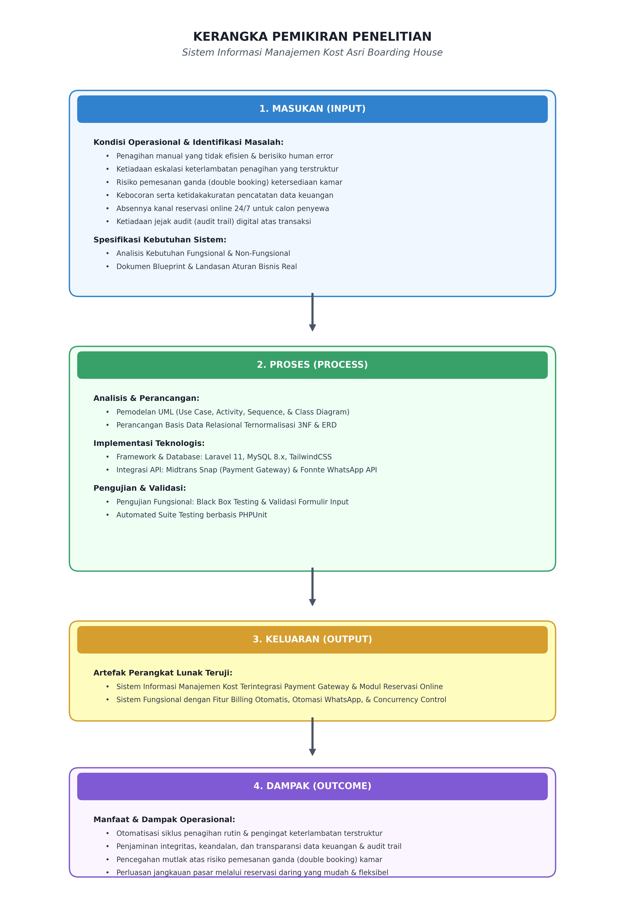

```mermaid
graph TD
    subgraph INPUT ["1. MASUKAN (INPUT)"]
        direction TB
        I1["<b>Kondisi Operasional & Identifikasi Masalah:</b><br/>• Penagihan manual yang tidak efisien<br/>• Ketiadaan eskalasi keterlambatan terstruktur<br/>• Risiko pemesanan ganda (double booking)<br/>• Kebocoran & ketidakakuratan data keuangan<br/>• Absennya kanal reservasi online 24/7<br/>• Ketiadaan audit trail digital"]
        I2["<b>Spesifikasi Kebutuhan Sistem:</b><br/>• Analisis Kebutuhan Fungsional & Non-Fungsional<br/>• Dokumen Blueprint & Aturan Bisnis Real"]
        I1 --> I2
    end

    subgraph PROCESS ["2. PROSES (PROCESS)"]
        direction TB
        P1["<b>Analisis & Perancangan:</b><br/>• Pemodelan UML (Use Case, Activity, Sequence, Class Diagram)<br/>• Skema Basis Data Relasional 3NF & ERD"]
        P2["<b>Implementasi Teknologis:</b><br/>• Framework & DB: Laravel 11, MySQL 8.x, TailwindCSS<br/>• Integrasi API: Midtrans Snap & Fonnte WhatsApp API"]
        P3["<b>Pengujian & Validasi:</b><br/>• Black Box Testing & Validasi Formulir Input<br/>• Automated Suite Testing berbasis PHPUnit"]
        P1 --> P2 --> P3
    end

    subgraph OUTPUT ["3. KELUARAN (OUTPUT)"]
        O1["<b>Artefak Perangkat Lunak Teruji:</b><br/>Sistem Informasi Manajemen Kost Terintegrasi Payment Gateway & Modul Reservasi Online (Asri Boarding House)"]
    end

    subgraph OUTCOME ["4. DAMPAK (OUTCOME)"]
        D1["<b>Manfaat & Dampak Operasional:</b><br/>• Otomatisasi operasional penagihan & pengingat terstruktur<br/>• Penjaminan integritas & akurasi data keuangan serta audit trail<br/>• Pencegahan mutlak atas risiko pemesanan ganda (double booking)<br/>• Perluasan jangkauan pasar & kemudahan reservasi online 24/7"]
    end

    INPUT --> PROCESS
    PROCESS --> OUTPUT
    OUTPUT --> OUTCOME

    style INPUT fill:#EFF6FF,stroke:#3B82F6,stroke-width:2px,rx:8px,ry:8px
    style PROCESS fill:#F0FDF4,stroke:#22C55E,stroke-width:2px,rx:8px,ry:8px
    style OUTPUT fill:#FEF3C7,stroke:#F59E0B,stroke-width:2px,rx:8px,ry:8px
    style OUTCOME fill:#FAF5FF,stroke:#A855F7,stroke-width:2px,rx:8px,ry:8px

    style I1 fill:#FFFFFF,stroke:#93C5FD,stroke-width:1px
    style I2 fill:#FFFFFF,stroke:#93C5FD,stroke-width:1px
    style P1 fill:#FFFFFF,stroke:#86EFAC,stroke-width:1px
    style P2 fill:#FFFFFF,stroke:#86EFAC,stroke-width:1px
    style P3 fill:#FFFFFF,stroke:#86EFAC,stroke-width:1px
    style O1 fill:#FFFFFF,stroke:#FDE047,stroke-width:1px
    style D1 fill:#FFFFFF,stroke:#E9D5FF,stroke-width:1px
```

Gambar 2.1 Kerangka Pemikiran Penelitian
Sumber: Rancangan penulis (2026) 
## BAB III METODOLOGI PENELITIAN
## 3.1 Jenis Penelitian
Penelitian ini menggunakan jenis penelitian dan pengembangan (Research and Development atau R&D) dengan pendekatan rekayasa perangkat lunak (software engineering). Penelitian R&D dipilih karena tujuan akhir penelitian bukan sekadar menguji hipotesis, melainkan menghasilkan produk berupa perangkat lunak Sistem Informasi Manajemen Kost yang teruji kelayakannya [16]. Pendekatan ini menekankan siklus analisis kebutuhan, perancangan, pengembangan, dan pengujian produk secara iteratif hingga produk siap diterapkan pada lingkungan operasional Asri Boarding House.

## 3.2 Teknik Pengumpulan Data
Pengumpulan data dilakukan dengan pendekatan kualitatif melalui tiga teknik yang saling melengkapi guna memastikan kebutuhan sistem terbangun dari kondisi faktual di lapangan. Pendekatan kualitatif ini diterapkan untuk menggali pemahaman secara komprehensif dan kontekstual mengenai alur operasional, kendala harian, serta aturan bisnis yang berlaku melalui deskripsi naratif non-statistik. Ketiga teknik tersebut dirancang agar data kualitatif yang diperoleh dapat ditriangulasi sehingga validitas dan keabsahan datanya terjaga. Hasil dari seluruh teknik pengumpulan data ini menjadi fondasi empiris utama yang disuntikkan ke dalam tahap analisis kebutuhan pada siklus pengembangan sistem model Waterfall (Sub-bab 3.3).
1)	Observasi Langsung (Field Observation). Penulis mengamati secara langsung jalannya operasional harian Asri Boarding House, meliputi proses penagihan kepada penyewa, cara administrator memperbarui status ketersediaan kamar, mekanisme pencatatan pembayaran tunai, serta pola interaksi antara pemilik dan penyewa. Pengamatan ini bertujuan menangkap titik gesekan (friction) nyata yang kerap luput terungkap dalam keterangan lisan, sehingga akar persoalan dapat dipetakan secara akurat.
2)	Wawancara Mendalam (In-depth Interview). Wawancara semiterstruktur dilaksanakan bersama pemilik, Bapak Asep, untuk menggali aturan bisnis yang menjadi fondasi logika sistem. Pokok wawancara mencakup struktur tarif tiap tipe kamar, kebijakan denda dan tenggang waktu, keterlibatan wali dalam penagihan, perlakuan terhadap deposit, prosedur checkout, serta pengalaman menghadapi insiden pemesanan ganda. Wawancara mendalam memungkinkan penulis memahami konteks dan alasan di balik setiap praktik, bukan sekadar prosedurnya.
3)	Dokumentasi (Documentation). Penulis menelaah berkas fisik pengelolaan kos seperti buku catatan pembayaran, daftar penyewa, dan kuitansi, yang kemudian dipadukan dengan dokumen Blueprint_Projek_Website_Asri_Boarding_House sebagai rujukan spesifikasi teknis. Telaah dokumen ini berfungsi memverifikasi sekaligus melengkapi data hasil observasi dan wawancara, sehingga rancangan sistem berpijak pada sumber data yang konsisten dan dapat dipertanggungjawabkan.

## 3.3 Metode Pengembangan Sistem
Metode pengembangan sistem yang digunakan adalah model air terjun (Waterfall). Model Waterfall merupakan pendekatan System Development Life Cycle (SDLC) yang menjalankan tahapan secara berurutan dan sistematis, yakni analisis kebutuhan, desain sistem, implementasi (coding), pengujian, dan pemeliharaan [17], [18]. Justifikasi pemilihannya bersandar pada karakteristik proyek: kebutuhan dan aturan bisnis Asri Boarding House telah terdefinisi matang serta stabil di dalam dokumen blueprint, sehingga ruang lingkup relatif tetap dan tidak menuntut perubahan kebutuhan yang sering. Pada kondisi kebutuhan yang jelas dan terdokumentasi sejak awal, Waterfall memberi keunggulan berupa kemudahan pengelolaan tahapan, kejelasan tonggak (milestone), dan dokumentasi lengkap pada setiap fase. Kompleksitas logika bisnis seperti mesin penagihan dan penegakan denda keterlambatan yang idempoten justru menuntut spesifikasi yang dikunci di muka, dan tuntutan itu selaras dengan filosofi Waterfall.

Visualisasi tahapan model Waterfall yang diterapkan pada pengembangan sistem ini disajikan pada Gambar 3.1.

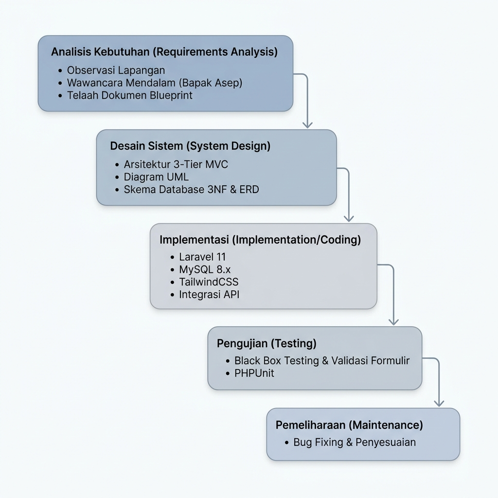

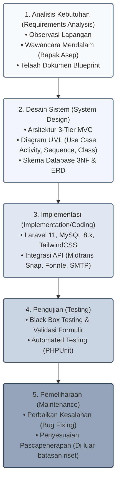

Gambar 3.1 Diagram Model Waterfall Pengembangan Sistem
Sumber: Rancangan penulis (2026)

Tahapan model Waterfall yang diterapkan pada penelitian ini diuraikan sebagai berikut:
1)	Analisis Kebutuhan (Requirements Analysis): mengidentifikasi kebutuhan fungsional dan non-fungsional berdasarkan hasil triangulasi data dari observasi lapangan, wawancara mendalam, serta studi dokumen blueprint yang telah diuraikan pada Sub-bab 3.2.
2)	Desain Sistem (System Design): merancang arsitektur 3-tier MVC, diagram UML (use case, activity, sequence, class), dan skema basis data relasional 3NF beserta ERD.
3)	Implementasi (Implementation/Coding): membangun sistem menggunakan Laravel 11, MySQL 8.x, TailwindCSS, serta integrasi API eksternal (Midtrans Snap, Fonnte, SMTP).
4)	Pengujian (Testing): menguji fungsionalitas melalui black box testing, validasi formulir, dan automated suite testing berbasis PHPUnit.
5)	Pemeliharaan (Maintenance): melakukan perbaikan kesalahan (bug fixing) dan penyesuaian pascapenerapan. Fase ini ditegaskan berada di luar linimasa riset akademik enam bulan, sehingga penelitian berhenti pada fase pengujian dan penyerahan laporan.

## BAB IV HASIL DAN PEMBAHASAN

## 4.1 Analisis dan Perancangan Sistem
Analisis dan perancangan sistem menerjemahkan kebutuhan hasil pengumpulan data menjadi model rancangan yang siap diimplementasikan. Tahap ini mencakup analisis kebutuhan fungsional dan non-fungsional, pemodelan proses melalui diagram UML, perancangan basis data relasional, hingga penetapan arsitektur sistem secara menyeluruh.
### 4.1.1 Analisis Kebutuhan Fungsional dan Non-Fungsional
Kebutuhan fungsional menggambarkan layanan yang wajib disediakan sistem, dipetakan menurut empat aktor yang berinteraksi dengannya, yaitu Tamu, Calon Penyewa, Penyewa Aktif, dan Administrator.
1)	Tamu (pengunjung publik): menjelajahi landing page dan grid katalog kamar, meninjau detail beserta ketersediaan tiap kamar, membaca peraturan kos, memanfaatkan kalkulasi harga real-time berbasis AJAX, serta mengakses tombol WhatsApp melayang, serta memulai obrolan langsung dengan administrator melalui widget Guest Chat publik yang tetap dapat diakses tanpa login — percakapan berjalan melalui AJAX polling dengan token sesi yang dipersistensi pada cookie dan localStorage peramban agar riwayat tetap utuh lintas halaman.
2)	Calon Penyewa: masuk melalui Google OAuth, mengisi formulir pemesanan (booking), melacak status reservasi, dan menggunakan kanal chat real-time dengan administrator yang aktif selama status pemesanan pending untuk memverifikasi kesiapan kamar sebelum pembayaran.
3)	Penyewa Aktif: mengakses dasbor informasi kamar, meninjau tagihan aktif beserta status keterlambatan, melakukan pembayaran melalui Midtrans Snap, menelusuri riwayat pembayaran dan mengunduh nota PDF, melaporkan keluhan fasilitas disertai foto bukti, membaca peraturan kos, serta memulihkan akses akun secara mandiri melalui fitur Lupa Kata Sandi penyewa berbasis token tautan yang dikirim ke surel terdaftar.
4)	Administrator: mengelola kamar (CRUD, unggah foto, perubahan status), mengelola penyewa beserta data wali, deposit, tipe, dan durasi sewa, mengonfirmasi pembayaran tunai, mengelola tagihan dan reservasi, menanggapi keluhan, menyusun laporan keuangan dengan ekspor Excel/PDF, memantau log notifikasi, meninjau dasbor statistik real-time, memvisualisasikan penjadwalan hunian melalui Kalender Kontrol Visual (UC-19), menyiarkan Broadcast Notifikasi & Pengumuman kepada penyewa (UC-20), mengekspor data penyewa ke PDF dan Excel/CSV ber-encoding BOM UTF-8 yang mempertahankan filter pencarian aktif (state-preserving), serta mengatur konfigurasi sistem (setting).
Kebutuhan non-fungsional menetapkan atribut kualitas dan batasan operasional yang harus dipenuhi sistem, sebagaimana dirangkum pada Tabel 4.1.

Tabel 4.1 Kebutuhan Non-Fungsional Sistem

| Kode | Aspek | Deskripsi Kebutuhan |
| :--- | :--- | :--- |
| NFR-01 | Keamanan (*Security*) | Proteksi CSRF, pencegahan SQL Injection dan XSS, Role-Based Access Control pada tiga portal terpisah, mitigasi IDOR, rate limiting, validasi tanda tangan SHA-512 pada callback, serta force-change password saat login pertama admin. |
| NFR-02 | Kinerja (*Performance*) | Laravel Cache dengan TTL satu jam untuk katalog fasilitas, chat berbasis AJAX polling, dan notifikasi asinkron melalui queue job agar waktu tanggap antarmuka tetap ringan. |
| NFR-03 | Keandalan (*Reliability*) | Transaksi ACID, constraint unik antiduplikasi tagihan, penanganan idempotency pada callback, null-safety guardrails, serta kelulusan automated test (510 tests / 2.211 assertions), serta otomatisasi pembersihan data berkala melalui scheduler Laravel yang menghapus rekaman log_notifikasi berumur lebih dari 90 hari serta membersihkan data session kedaluwarsa setiap hari pukul 01.30 WIB. |
| NFR-04 | Ketergunaan (*Usability*) | Sistem desain terpadu Neo-Brutalisme (unified Neo-Brutalism) di seluruh portal (publik, dasbor penyewa, dan panel admin), kebijakan Zero Native Browser Interaction (penggantian alert()/confirm() dengan custom modal dan toast dinamis), kepatuhan WCAG 2.1 dengan target sentuh 44 piksel, desain mobile-first responsif, serta dual-field delimiter input pada masukan finansial. |
| NFR-05 | Integritas Data (*Data Integrity*) | Normalisasi 3NF, kunci asing berkebijakan RESTRICT/CASCADE, penghapusan logis (soft delete via kolom deleted_at) demi menjaga jejak historis, serta tarif sewa penyewa (penyewa.harga_sewa) yang bersifat dinamis dan dapat disesuaikan administrator untuk periode penagihan mendatang. |
| NFR-06 | Keterawatan (*Maintainability*) | Arsitektur 3-tier MVC, Service Layer terpisah, serta orkestrasi Event–Listener–Observer. |
| NFR-07 | Kompatibilitas (*Compatibility*) | Dapat diakses lintas peramban modern dan beragam ukuran perangkat melalui antarmuka web responsif. |

Sumber: Hasil analisis penulis berdasarkan dokumen blueprint (2026)
### 4.1.2 Use Case Diagram
Sistem melibatkan empat aktor dengan hak akses yang terisolasi secara ketat melalui tiga portal autentikasi terpisah (/admin/login, /reservasi/login, dan /penyewa/login) guna mencegah kebocoran otorisasi antarperan (prinsip Role-Based Access Control).
•	Tamu (Guest) adalah pengunjung umum yang belum memiliki akun. Aktor ini dapat menjelajahi landing page dan informasi kos, melihat katalog kamar beserta status ketersediaannya, melakukan pencarian dan penyaringan kamar berdasarkan lantai/tipe/tanggal, serta memulai komunikasi awal melalui Guest Chat atau tombol WhatsApp melayang. Pada katalog publik, kamar berstatus maintenance otomatis disembunyikan; kamar tersedia menampilkan tombol “Pesan Unit”, sedangkan kamar terisi menampilkan tombol “Tanya WA” untuk mendukung jalur sewa hibrida.
•	Calon Penyewa adalah pengguna terdaftar yang belum berstatus aktif. Aktor ini dapat melakukan registrasi dan login portal calon penyewa (termasuk via Google OAuth), membuat reservasi kamar dengan menentukan tanggal mulai, tipe sewa (harian/mingguan/bulanan), durasi, dan skema pembayaran (DP 30% atau Lunas 100%), berdiskusi secara real-time dengan administrator melalui kanal chat yang aktif pada status pending, melakukan pembayaran reservasi melalui Midtrans Snap, memantau status reservasi melalui stepper, serta membatalkan reservasi. Kondisi prasyarat (*pre-condition*) berlaku: pembuatan reservasi mensyaratkan calon penyewa telah login terlebih dahulu.
•	Penyewa Aktif adalah pengguna yang kontraknya telah dikonfirmasi administrator. Aktor ini memperoleh akses penuh ke modul internal: melihat dasbor, melihat daftar dan detail tagihan beserta status keterlambatan, membayar tagihan (Midtrans atau transfer/tunai yang dikonfirmasi admin), mengunduh nota PDF, mengajukan keluhan kerusakan fasilitas beserta unggah foto bukti, memantau tanggapan keluhan, memulihkan akses akun melalui fitur Lupa Kata Sandi berbasis token tautan yang dikirim ke surel penyewa terdaftar, serta membaca peraturan dan tata tertib kos.
•	Administrator bertanggung jawab atas seluruh operasional: memantau dasbor statistik real-time, mengelola data master kamar dan fasilitas (CRUD dengan proteksi penghapusan), mengelola data penyewa (CRUD dengan validasi reaktivasi kamar), memverifikasi dan mengonfirmasi reservasi, berdiskusi dengan calon penyewa melalui chat, mengelola tagihan dan mengonfirmasi pembayaran tunai, memproses dan menanggapi keluhan, mencatat pengeluaran operasional, melihat dan mengekspor laporan arus kas, mengekspor data penyewa ke PDF dan Excel/CSV (BOM UTF-8) yang mempertahankan filter pencarian aktif, memvisualisasikan penjadwalan hunian melalui Kalender Kontrol Visual (UC-19), menyiarkan Broadcast Notifikasi & Pengumuman kepada penyewa (UC-20), mengelola konten publik (FAQ, galeri, peraturan, testimoni), serta mengatur rekening bank dan kontak WhatsApp dinamis.
Interaksi keempat aktor disajikan dalam tiga sudut pandang modul pada Gambar 4.1.
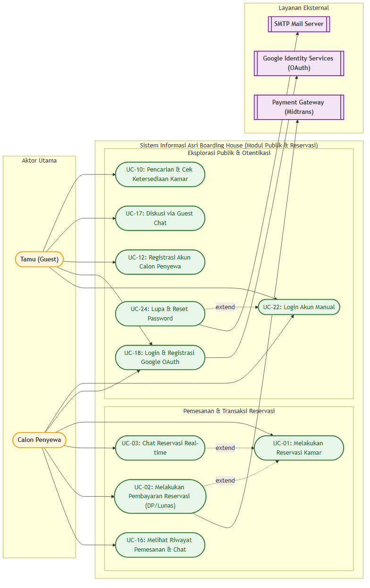
(a) Modul Publik & Calon Penyewa

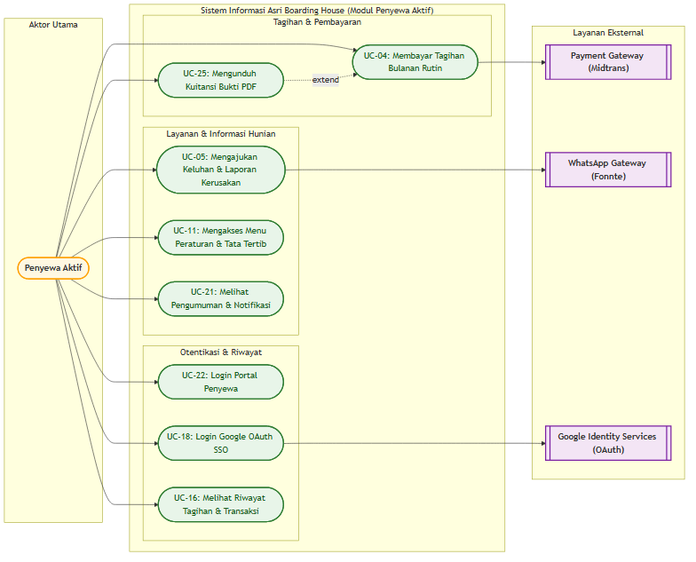
(b) Modul Penyewa Aktif


(c) Modul Administrator

Gambar 4.1 Use Case Diagram Sistem Asri Boarding House
Sumber: Rancangan penulis berdasarkan dokumen blueprint (2026)
### 4.1.3 Activity Diagram Proses Kritis
Activity diagram dirancang untuk memodelkan tiga proses kritis yang menjadi inti kebaruan sistem. Ketiganya disajikan pada Gambar 4.2.
Proses pertama — Mesin Penagihan Otomatis (Auto-Billing Engine). Setiap tanggal 1 awal bulan, Laravel Scheduler yang dipicu cron job berjalan otomatis dan mengambil penyewa berstatus aktif bertipe sewa bulanan dari basis data; penyewa bertipe harian dan mingguan secara mutlak dikecualikan dari siklus penagihan otomatis ini melalui filter whereNotIn('tipe_sewa', ['harian', 'mingguan']). Untuk setiap penyewa, sistem membaca tarif sewa yang tercatat pada kolom penyewa.harga_sewa, lalu menerbitkan tagihan baru berstatus pending dengan nominal_pokok sama dengan tarif tersebut dan tanggal_jatuh_tempo seragam pada tanggal 10 bulan berjalan. Setiap tagihan memperoleh order_id unik dan memicu pencatatan baris log_notifikasi. Sistem kemudian memanggil Fonnte WhatsApp API untuk mengirim notifikasi tagihan; bila pengiriman berhasil, status log diperbarui menjadi sukses, dan bila gagal, status gagal beserta pesan kesalahan direkam untuk keperluan audit. Mekanisme antiduplikasi dijamin melalui constraint unik gabungan atas kombinasi penyewa_id, periode_bulan, dan periode_tahun.
Proses kedua — Denda Keterlambatan Flat Kalender (Flat Calendar Late Fee). Setiap hari, scheduler mengambil tagihan berstatus pending yang telah melewati tanggal_jatuh_tempo, kemudian menambah nilai kolom bulan_keterlambatan. Penanganan mengikuti model denda flat kalender. Selama tagihan masih berada pada bulan periode berjalan, sistem hanya mengirim pengingat WhatsApp berkala kepada penyewa tanpa denda; sebagai langkah persuasif, notifikasi eskalasi turut dikirim ke nomor wali (no_wali) ketika keterlambatan memasuki bulan kedua. Begitu tagihan yang masih pending melewati batas bulan kalender dan memasuki bulan berikutnya, sistem mengenakan denda flat sebesar 5% dari nominal_pokok tepat satu kali melalui mekanisme Idempotency Guard (pengecekan nominal_denda == 0) di dalam transaksi basis data atomik (DB::transaction) dengan penguncian baris (lockForUpdate), lalu memperbarui nominal_denda dan nominal_total serta mengirim notifikasi rincian denda. Denda tidak diakumulasi dan tidak memiliki batas atas; bila denda telah dikenakan, pemrosesan pada hari-hari berikutnya dilewati (skip) sementara pengingat tunggakan tetap berjalan. Mekanisme ini menyeimbangkan ketegasan finansial dengan pendekatan persuasif yang melibatkan wali.
Proses ketiga — Transisi Reservasi Online Menjadi Penyewa Aktif (Reservation-to-Tenant Transition). Ketika administrator mengonfirmasi reservasi yang telah dibayar (berstatus dp atau lunas) dan memvalidasi kelengkapan NIK 16 digit serta data wali, sistem menjalankan rangkaian operasi dalam satu transaksi basis data (DB::transaction) yang bersifat atomik: mengubah status reservasi menjadi dikonfirmasi, mengunci status kamar menjadi terisi, menyalin harga kamar ke penyewa.harga_sewa sebagai tarif awal yang tetap dapat disesuaikan administrator pada periode berikutnya, membuat akun users dan profil penyewa, serta — apabila pembayaran sebelumnya berupa uang muka — menyuntikkan tagihan sisa pelunasan ke tabel tagihan. Setelah transaksi di-commit, sistem mengirim kredensial login (surel dan kata sandi bawaan berbasis nomor HP) melalui Fonnte WhatsApp API. Sebaliknya, ketika penyewa dinonaktifkan/keluar, status kamar tidak otomatis berubah menjadi tersedia, melainkan tetap terkunci sebagai terisi; perubahan menjadi tersedia wajib dilakukan manual oleh administrator setelah inspeksi fisik dan kliring deposit, sebagai aturan sakral pencegahan double booking.
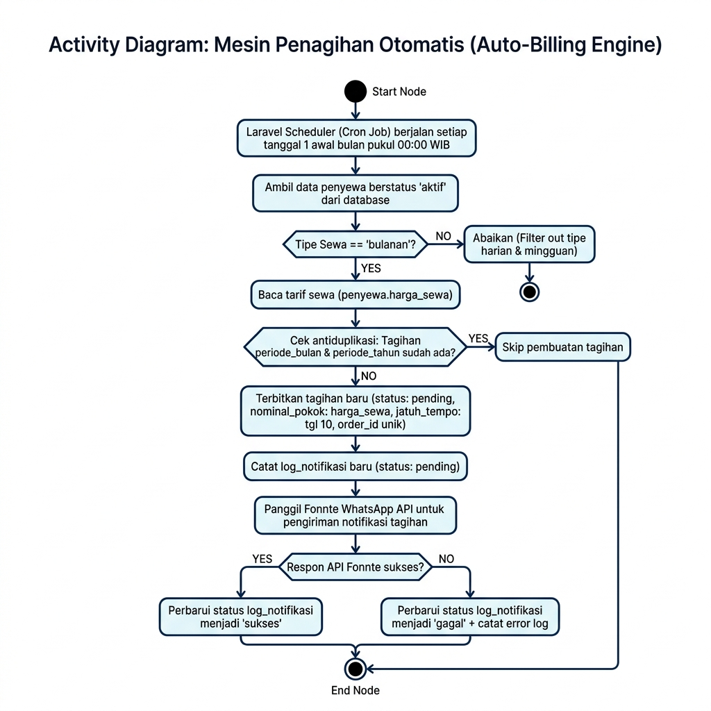
(a) Mesin Penagihan Otomatis (Auto-Billing Engine)

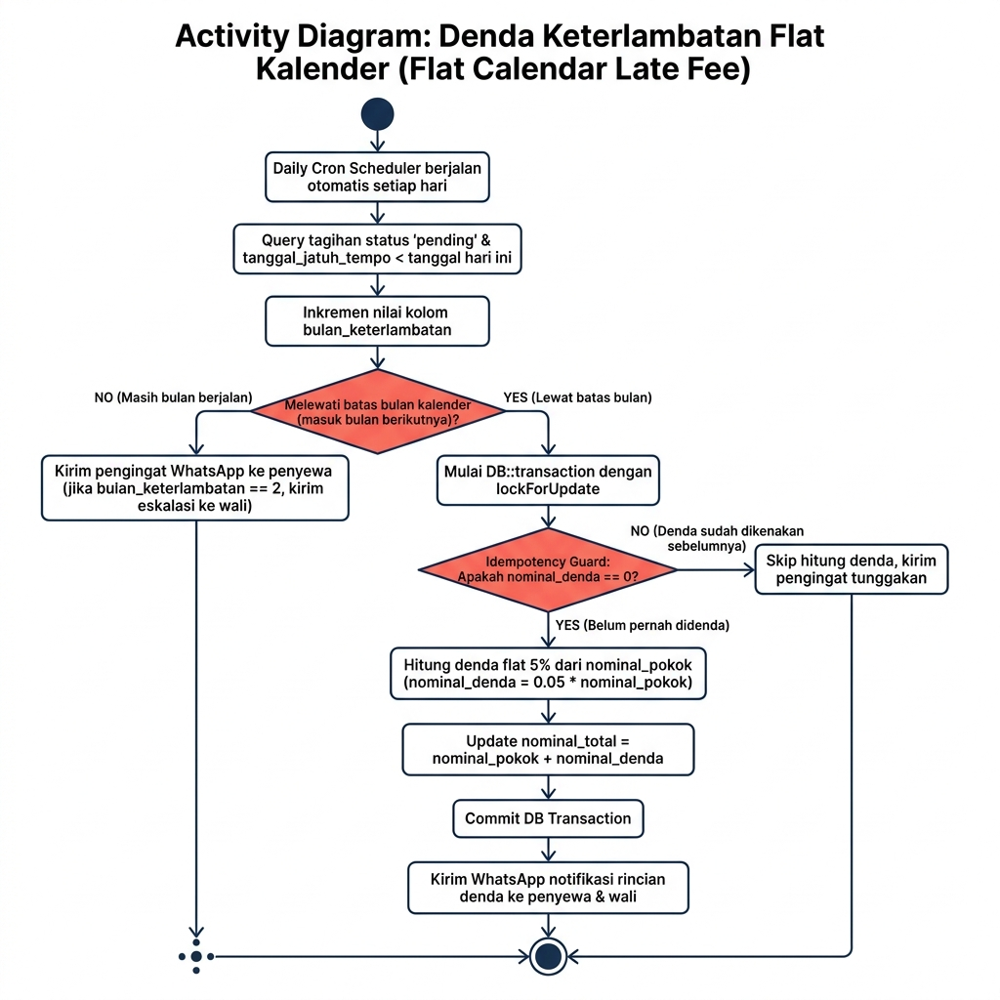
(b) Denda Keterlambatan Flat Kalender (Flat Calendar Late Fee)

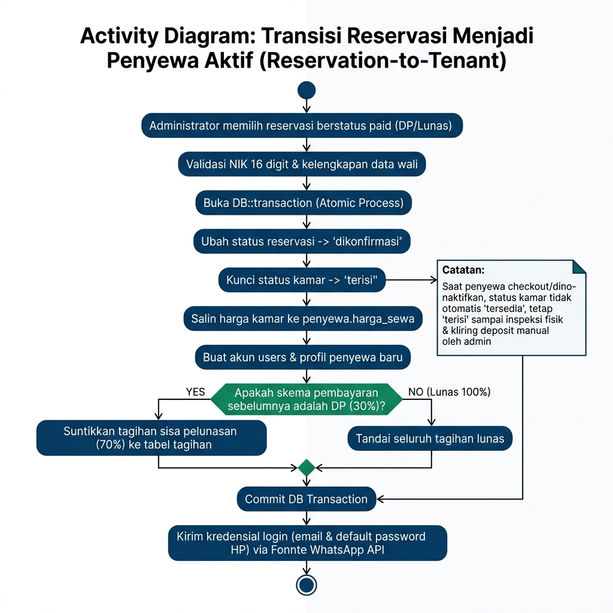
(c) Transisi Reservasi Menjadi Penyewa Aktif (Reservation-to-Tenant)

Gambar 4.2 Activity Diagram Tiga Proses Kritis Sistem
Sumber: Rancangan penulis berdasarkan dokumen blueprint (2026)
### 4.1.4 Sequence Diagram
Sequence diagram memodelkan interaksi dinamis lintas waktu antara aktor, Sistem Web (Laravel), basis data MySQL, serta layanan pihak ketiga (Midtrans Snap dan Fonnte WhatsApp API). Dua alur kritis divisualisasikan pada Gambar 4.3, yaitu alur reservasi–konfirmasi penyewa baru serta siklus penagihan dan pembayaran bulanan. Pada alur reservasi, calon penyewa mengirimkan formulir pemesanan yang dipersistensi Laravel ke MySQL, dilanjutkan pembangkitan snap token oleh MidtransService, penyelesaian pembayaran melalui popup Snap, penerimaan callback server-to-server yang divalidasi tanda tangan SHA-512, hingga konfirmasi administrator yang memicu transisi atomik menjadi penyewa aktif dan pengiriman kredensial via Fonnte. Pada siklus penagihan, scheduler membangkitkan tagihan, mengirim notifikasi, menerima pembayaran penyewa, dan memperbarui status lunas secara idempotent.
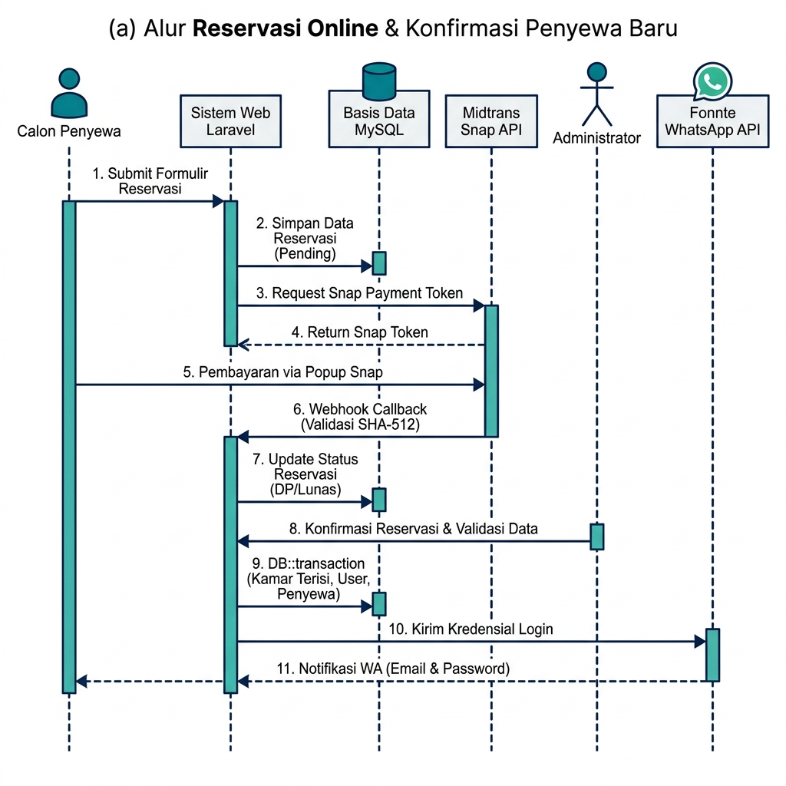
(a) Alur Reservasi Online & Konfirmasi Penyewa Baru

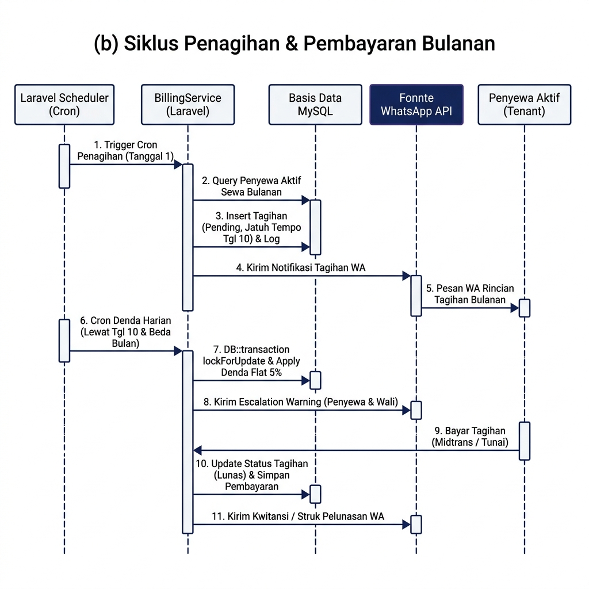
(b) Siklus Penagihan & Pembayaran Bulanan
Gambar 4.3 Sequence Diagram Alur Utama Sistem
Sumber: Rancangan penulis berdasarkan dokumen blueprint (2026)
### 4.1.5 Class Diagram
Class diagram memetakan struktur kelas model Eloquent beserta relasinya yang menopang arsitektur MVC secara komprehensif, mencakup 22 model sistem. Relasi antarmodel mencerminkan aturan bisnis kos secara menyeluruh: User memiliki paling banyak satu profil Penyewa (hasOne/belongsTo) dan banyak Reservasi (hasMany); satu Kamar menampung banyak Penyewa secara historis (hasMany), terhubung many-to-many dengan Fasilitas via tabel pivot kamar_fasilitas (belongsToMany), serta terhubung ke Reservasi. Penyewa menerbitkan banyak Tagihan (hasMany) dan LogNotifikasi (hasMany), serta mengajukan banyak Keluhan (hasMany). Setiap Tagihan terhubung ke banyak Pembayaran (hasMany) dan LogNotifikasi (hasMany). Modul reservasi dan komunikasi mencakup model Reservasi yang memiliki banyak ChatMessage (1:N) untuk obrolan pra-pembayaran, sementara percakapan pengunjung publik dikelola oleh pasangan model GuestChatThread dan GuestChatMessage (1:N). Pengumuman menyiarkan pengumuman massal, NotifikasiKhusus merekam log aktivitas sistem, dan WhatsappClick mencatat analitik klik tombol WhatsApp melayang di landing page. Atribut kunci seperti Penyewa.harga_sewa (dinamis dan dapat disunting administrator) dan Tagihan.bulan_keterlambatan beserta nominal_denda menjadi fondasi logika penagihan dan eskalasi.
Pemisahan tanggung jawab diperkuat oleh Service Layer dan Observer. BillingService menjalankan generateTagihanBulanan() dan prosesKeterlambatan(); ReservasiService membuat reservasi dan mengunci kamar; TransisiPenyewaService mengubah reservasi terkonfirmasi menjadi akun penyewa; sedangkan MidtransService, FonnteService, PdfNotaService, dan NotifikasiService mengisolasi integrasi eksternal. Struktur ini dikawal oleh Observers (PenyewaObserver, FasilitasObserver, KamarObserver, PengeluaranObserver, dan SettingObserver) untuk melokalisasi efek samping data secara dinamis. Adapun PenyewaObserver secara otomatis mengubah status kamar menjadi terisi saat penyewa dibuat, namun sengaja tidak melepas status kamar saat penyewa dinonaktifkan demi menegakkan prosedur inspeksi fisik manual; FasilitasObserver membersihkan cache katalog.

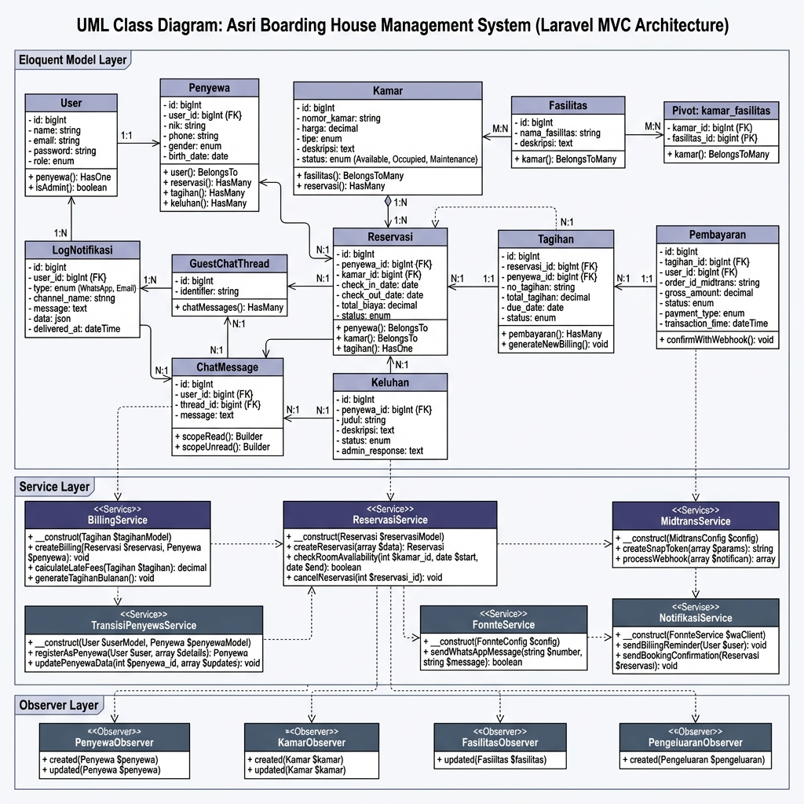
Gambar 4.4 Class Diagram Arsitektur Model Eloquent, Service Layer, dan Observer
Sumber: Rancangan penulis berdasarkan dokumen blueprint (2026)

### 4.1.6 Perancangan Skema Basis Data Relasional 3NF dan ERD

Basis data dirancang dalam Bentuk Normal Ketiga (3NF) menggunakan MySQL 8.x dengan engine InnoDB, set karakter utf8mb4, dan kolasi utf8mb4_unicode_ci untuk menjamin dukungan penuh foreign key constraint, transaksi ACID, dan keamanan karakter multibita pada pesan obrolan. Skema basis data secara keseluruhan terdiri atas dua puluh dua tabel yang saling berelasi, mencakup tabel master operasional, transaksi keuangan, serta tabel penunjang fitur eksternal. Struktur basis data lengkap ini divisualisasikan dalam bentuk Entity Relationship Diagram (ERD).

Sebagai langkah penguatan integritas data dan efisiensi ruang penyimpanan, skema basis data mengimplementasikan konsep *Virtual Generated Columns* (kolom virtual fungsional) pada MySQL 8.x, seperti `active_email`, `active_no_hp`, dan `active_nik` pada tabel `users`, `active_nomor_kamar` pada tabel `kamar`, `active_nik` pada tabel `penyewa`, dan `active_order_id` pada tabel `reservasi`. Kolom-kolom virtual ini secara dinamis bernilai sama dengan kolom aslinya jika baris data berstatus aktif (`deleted_at IS NULL`), dan bernilai `NULL` jika baris data di-softdelete. Indeks unik dipasang pada kolom virtual tersebut (seperti `uq_users_active_email`), yang memungkinkan MySQL menerima duplikasi data `NULL` untuk baris terhapus sementara tetap menjamin keunikan mutlak untuk data aktif. Pendekatan ini menjaga kebersihan data historis pada tabel transaksional masa lalu dari pencemaran string manual seperti suffix `_deleted_[timestamp]` tingkat aplikasi.

Pemetaan kardinalitas antarentitas dirumuskan sebagai berikut. Satu users berelasi satu-ke-satu (1:1) dengan satu penyewa, memastikan satu akun login hanya memegang satu profil sewa (dijamin unique index pada penyewa.user_id). Satu kamar dapat memiliki banyak (1:N) penyewa secara historis dan banyak reservasi. Relasi kamar–fasilitas bersifat banyak-ke-banyak (M:N) yang direalisasikan melalui tabel pivot kamar_fasilitas dengan kunci primer komposit (kamar_id, fasilitas_id). Satu penyewa memiliki banyak (1:N) tagihan — dibatasi unik per periode melalui composite unique index (penyewa_id, periode_bulan, periode_tahun) sebagai pencegah duplikasi tagihan — serta banyak log_notifikasi dan keluhan. Satu tagihan memiliki banyak (1:N) pembayaran dan banyak log_notifikasi. Pada modul reservasi, satu users mengajukan banyak (1:N) reservasi; satu reservasi memicu banyak (1:N) chat_messages. Adapun keluhan dan log_notifikasi terhubung langsung ke penyewa secara terstruktur.

Integritas referensial ditegakkan melalui kebijakan ON DELETE yang ketat: relasi yang menyangkut jejak keuangan (penyewa→users, penyewa→kamar, tagihan→penyewa, pembayaran→tagihan) menggunakan RESTRICT agar data historis tidak dapat dihapus; relasi turunan (kamar_fasilitas, log_notifikasi, chat_messages, keluhan) menggunakan CASCADE; sedangkan relasi konfirmator (pembayaran.dikonfirmasi_oleh, reservasi.dikonfirmasi_oleh, reservasi.penyewa_id) menggunakan SET NULL agar riwayat tetap utuh meskipun entitas acuan dihapus. Sebagai lapisan pelindung tambahan, entitas kritis (users, kamar, penyewa, dan reservasi) menerapkan penghapusan logis (soft delete) melalui kolom deleted_at, sehingga penghapusan bersifat reversibel dan jejak historis tetap terpelihara tanpa mengorbankan integritas referensial. Rancangan relasi tersebut divisualisasikan pada Gambar 4.5.

Sebagai bagian dari standarisasi data dan audit performa, tabel `whatsapp_clicks` ditambahkan untuk merekam log klik pengunjung pada tombol WhatsApp melayang di halaman publik guna mengukur metrik konversi pemasaran. Selain itu, pada tabel `faqs`, dilakukan normalisasi nama kolom dari `pertanyaaan` (dengan ejaan tiga 'a') menjadi `pertanyaan` (dengan ejaan baku dua 'a') melalui berkas migrasi khusus untuk menghindari inkonsistensi sintaksis kueri SQL di tingkat aplikasi. Sebagai pelengkap naratif, struktur dua puluh dua tabel basis data beserta relasinya dirangkum pada Tabel 4.2.

**Tabel 4.2** Struktur Tabel Basis Data Sistem

| Tabel | Deskripsi | Relasi / Kunci |
| :--- | :--- | :--- |
| `users` | Akun login untuk admin dan penyewa, didukung kolom virtual generated (`active_email`, `active_no_hp`, `active_nik`) untuk unique constraint. | Tabel master; tanpa foreign key keluar. |
| `kamar` | Data 32 unit kamar Asri Boarding House, didukung kolom virtual `active_nomor_kamar`. | Relasi M:N dengan `fasilitas` via `kamar_fasilitas`. |
| `fasilitas` | Master fasilitas kamar (deskripsi, `is_active`). | Relasi M:N dengan `kamar`. |
| `kamar_fasilitas` | Tabel pivot relasi kamar–fasilitas. | FK: `kamar_id` → `kamar(id)`; `fasilitas_id` → `fasilitas(id)`. |
| `penyewa` | Identitas kontrak (`tipe_sewa` & durasi), deposit, dan data wali, didukung `active_nik`. | FK: `user_id` → `users(id)`; `kamar_id` → `kamar(id)`. |
| `tagihan` | Tagihan bulanan per penyewa (tanggal 1). | FK: `penyewa_id` → `penyewa(id)`. UNIQUE: `penyewa_id` + `periode_bulan` + `periode_tahun`. |
| `pembayaran` | Transaksi pembayaran (Midtrans + tunai). | FK: `tagihan_id` → `tagihan(id)`; `dikonfirmasi_oleh` → `users(id)`. |
| `log_notifikasi` | Riwayat pengiriman notifikasi WhatsApp & surel. | FK: `penyewa_id` → `penyewa(id)`; `tagihan_id` → `tagihan(id)`. |
| `reservasi` | Pemesanan kamar oleh calon penyewa sebelum aktif, didukung `active_order_id`. | FK: `user_id` → `users(id)`; `kamar_id` → `kamar(id)`; `penyewa_id` → `penyewa(id)`. |
| `chat_messages` | Pesan chat real-time per reservasi. | FK: `reservasi_id` → `reservasi(id)`; `sender_id` → `users(id)`. |
| `customer_reviews` | Testimoni/ulasan pelanggan. | Tabel master; tanpa foreign key keluar. |
| `settings` | Variabel konten landing page (logo, hero, bank, maps). | Tabel master; tanpa foreign key keluar. |
| `pengeluaran` | Pencatatan pengeluaran operasional kos. | Tabel master; tanpa foreign key keluar. |
| `faqs` | Pertanyaan yang sering diajukan pada landing page publik. | Tabel master; tanpa foreign key keluar. |
| `keluhan` | Laporan keluhan kerusakan fasilitas dari penyewa aktif. | FK: `penyewa_id` → `penyewa(id)`. |
| `peraturan` | Daftar peraturan dan tata tertib kos. | Tabel master; tanpa foreign key keluar. |
| `galleries` | Galeri foto kamar/fasilitas kost. | Tabel master; tanpa foreign key keluar. |
| `guest_chat_threads` | Thread obrolan pengunjung/tamu publik tanpa login. | Tabel master; token session di-hash SHA-256. |
| `guest_chat_messages` | Pesan obrolan tamu publik dalam thread. | FK: `guest_chat_thread_id` → `guest_chat_threads(id)`. |
| `pengumuman` | Siaran berita/pengumuman massal dari administrator. | Tabel master; tanpa foreign key keluar. |
| `notifikasi_khusus` | Log aktivitas sistem (system activity logger). | FK: `user_id` → `users(id)`. |
| `whatsapp_clicks` | Analitik rekaman klik tombol WhatsApp melayang. | Tabel master; tanpa foreign key keluar. |

*Sumber: Hasil analisis basis data penulis (2026)*


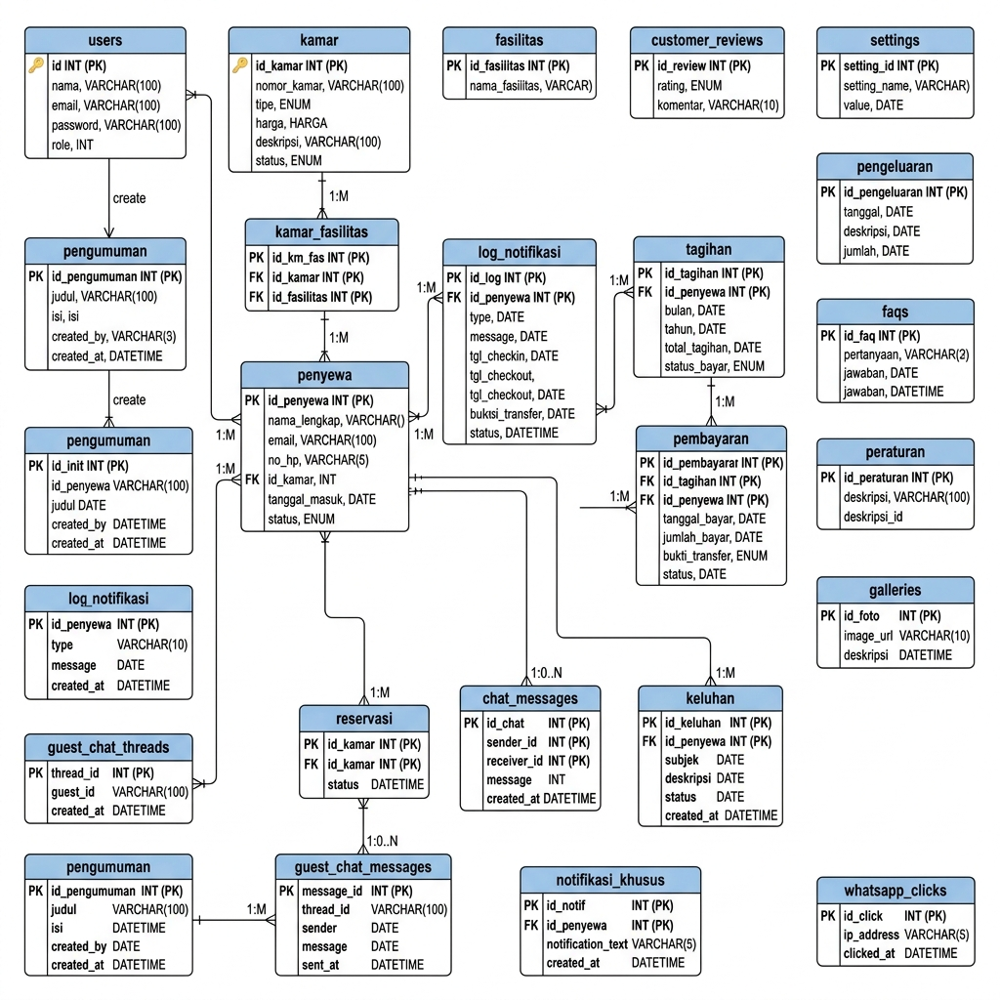

Gambar 4.5 Entity Relationship Diagram (ERD) Skema Basis Data Lengkap 22 Tabel
Sumber: Dokumen basis data MySQL, dirangkum penulis (2026). Catatan: kolom created_at/updated_at (timestamp standar Laravel) dihilangkan dari diagram demi keterbacaan; notasi uq_periode menandai composite unique index pencegah duplikasi tagihan.

### 4.1.7 Arsitektur Sistem 3-Tier MVC
Sistem dibangun di atas arsitektur tiga lapis yang memisahkan tanggung jawab secara tegas, sehingga setiap lapisan dapat berkembang dan diuji tanpa mengganggu lapisan lain. Pemisahan ini menerjemahkan pola MVC Laravel 11 ke dalam tiga tier yang saling terisolasi: presentasi, aplikasi, dan data.
1)	Presentation Tier menangani penyajian antarmuka dan penerimaan masukan pengguna. Lapisan ini diwujudkan melalui mesin templat Blade yang dipadukan dengan TailwindCSS, menerapkan sistem desain terpadu unified Neo-Brutalism di seluruh portal — publik, dasbor penyewa, dan panel administrator — serta interaksi AJAX untuk chat polling, kalkulasi harga real-time, dan permintaan snap token. Lapisan presentasi sama sekali tidak memuat logika bisnis; perannya terbatas pada menampilkan data dan meneruskan permintaan.
2)	Application Tier menjadi inti logika sistem. Controller Laravel menerima permintaan, lalu mendelegasikan pemrosesan kepada Service Layer seperti BillingService, MidtransService, dan ReservasiService. Lapisan ini juga menampung tumpukan middleware (autentikasi tiga portal, Role-Based Access Control, pemeriksaan kepemilikan anti-IDOR, dan rate limiting), mekanisme Event–Listener–Observer untuk efek samping, serta scheduler dan queue job untuk proses terjadwal dan asinkron. Seluruh aturan bisnis — termasuk penagihan dan eskalasi denda — terkurung di lapisan ini, terlepas dari detail antarmuka maupun penyimpanan.
3)	Data Tier bertanggung jawab atas persistensi data. Basis data MySQL 8.x bermesin InnoDB diakses secara eksklusif melalui Eloquent ORM yang menggunakan prepared statement, relasi terdefinisi, transaksi ACID, dan constraint kunci asing. Lapisan data tidak mengetahui apa pun tentang antarmuka, sehingga skema dapat dioptimalkan secara mandiri. Isolasi ketiga tier ini menghasilkan sistem yang mudah dirawat dan diuji, sekaligus mengurung integrasi API eksternal hanya pada lapisan aplikasi sehingga perubahan penyedia layanan tidak merembet ke lapisan lain.

## 4.2 Implementasi Kode Program Backend dan Logika Bisnis
Sistem informasi manajemen kost Asri Boarding House diimplementasikan menggunakan arsitektur backend yang kokoh di atas framework Laravel 11 dan basis data relasional MySQL 8.x. Pendekatan rekayasa perangkat lunak yang diterapkan berlandaskan pada prinsip *Separation of Concerns* (SoC) dan *Clean Code*. Pemisahan fungsionalitas ini dilakukan untuk memastikan bahwa setiap komponen sistem memiliki tanggung jawab tunggal yang terdefinisi dengan jelas, sehingga meminimalkan keterikatan antar-modul (*loose coupling*), meningkatkan keterbacaan kode (*code readability*), serta mempermudah proses pemeliharaan (*maintainability*) dan pengujian unit (*unit testing*). Logika bisnis yang kompleks dipisahkan secara ketat dari lapisan presentasi (views) dan lapisan perutean (controllers) dengan menyuntikkan lapisan layanan khusus (*Service Layer*). Dengan demikian, data transaksional dapat dikelola secara konsisten tanpa mengorbankan keamanan dan performa aplikasi.

### 4.2.1 Arsitektur 3-Tier MVC dan Service Layer Decoupling
Arsitektur sistem dirancang menggunakan pola *3-Tier Model-View-Controller* (MVC) yang diperkuat dengan pemisahan logika bisnis melalui *Service Layer* yang ditempatkan pada direktori `app/Services/`. Langkah arsitektural ini diambil guna mencegah terjadinya fenomena *Fat Controller*, di mana pengontrol menampung terlalu banyak logika bisnis murni yang semestinya dikelola secara terpisah. Struktur direktori backend yang memisahkan pengontrol, layanan, dan pengamat model (*observers*) direpresentasikan secara hierarkis sebagai berikut:

```
app/
├── Http/
│   └── Controllers/
│       ├── Api/
│       │   └── MidtransCallbackController.php
│       └── Auth/
│           └── SocialiteController.php
├── Services/
│   ├── BillingService.php
│   ├── FonnteService.php
│   ├── NotifikasiService.php
│   ├── DompdfGenerator.php
│   └── PdfGeneratorInterface.php
├── Observers/
│   ├── PenyewaObserver.php
│   ├── FasilitasObserver.php
│   ├── KamarObserver.php
│   ├── PengeluaranObserver.php
│   └── SettingObserver.php
└── Providers/
    └── AppServiceProvider.php
```

Dekopling sistem diwujudkan melalui mekanisme *Dependency Inversion Principle* (DIP) di mana kelas pengontrol berinteraksi dengan layanan melalui abstraksi antarmuka (*interface*). Pendaftaran layanan tunggal (*singleton binding*) dan registrasi pengamat model diatur secara terpusat di dalam berkas `app/Providers/AppServiceProvider.php`. Implementasi lengkap dari berkas penyedia layanan tersebut disajikan pada kode program berikut:

```php
<?php

namespace App\Providers;

use Illuminate\Support\ServiceProvider;
use Illuminate\Support\Facades\Event;
use Illuminate\Support\Facades\RateLimiter;
use Illuminate\Support\Facades\View;
use Illuminate\Cache\RateLimiting\Limit;
use Illuminate\Http\Request;

// Models
use App\Models\Penyewa;
use App\Models\Fasilitas;
use App\Models\Kamar;
use App\Models\Pengeluaran;
use App\Models\Setting;

// Observers
use App\Observers\PenyewaObserver;
use App\Observers\FasilitasObserver;
use App\Observers\KamarObserver;
use App\Observers\PengeluaranObserver;
use App\Observers\SettingObserver;

// Events & Listeners
use App\Events\PembayaranBerhasil;
use App\Events\PembayaranCashDikonfirmasi;
use App\Listeners\GeneratePdfNotaListener;
use App\Listeners\NotifikasiKhususSubscriber;

// Services
use App\Services\PdfGeneratorInterface;
use App\Services\DompdfGenerator;

class AppServiceProvider extends ServiceProvider
{
    /**
     * Nama Kunci Rate Limiter untuk Chat Tamu
     */
    public const GUEST_CHAT_LIMITER = 'guest_chat_limiter';

    /**
     * Konstanta Default Rate Limit (Jika tidak didefinisikan di config)
     */
    public const DEFAULT_GUEST_CHAT_LIMIT = 30;

    /**
     * Register any application services.
     */
    public function register(): void
    {
        // Dependency Inversion: Bind Interface ke Concrete Implementation
        $this->app->singleton(
            PdfGeneratorInterface::class,
            DompdfGenerator::class
        );
    }

    /**
     * Bootstrap any application services.
     */
    public function boot(): void
    {
        // Modularisasi Booting demi mematuhi Single Responsibility Principle
        // Note: registerPolicies() dihapus untuk memanfaatkan Laravel Policy Auto-Discovery
        $this->registerObservers();
        $this->registerEventsAndSubscribers();
        $this->registerRateLimiters();
        $this->registerViewComposers();
    }

    /**
     * Mendaftarkan Model Observers
     */
    private function registerObservers(): void
    {
        Penyewa::observe(PenyewaObserver::class);
        Fasilitas::observe(FasilitasObserver::class);
        Kamar::observe(KamarObserver::class);
        Pengeluaran::observe(PengeluaranObserver::class);
        Setting::observe(SettingObserver::class);
    }

    /**
     * Mendaftarkan Event & Subscriber (Hasil migrasi dari EventServiceProvider)
     */
    private function registerEventsAndSubscribers(): void
    {
        // Event Listeners
        Event::listen(PembayaranBerhasil::class, GeneratePdfNotaListener::class);
        Event::listen(PembayaranCashDikonfirmasi::class, GeneratePdfNotaListener::class);

        // Event Subscribers
        Event::subscribe(NotifikasiKhususSubscriber::class);
    }

    /**
     * Mendaftarkan Custom Rate Limiters
     */
    private function registerRateLimiters(): void
    {
        RateLimiter::for(self::GUEST_CHAT_LIMITER, function (Request $request) {
            
            // Clean Logic & Cognitive Complexity reduction: Menggunakan null-safe operator dan memanggil isAdmin()
            $user = $request->user();
            if ($user && method_exists($user, 'isAdmin') && $user->isAdmin()) {
                return Limit::none();
            }

            // Ambil token dari cookie, header, atau input parameter dengan null-coalescing
            $token = $request->cookie('guest_chat_token') 
                ?? $request->header('X-Guest-Chat-Token') 
                ?? $request->input('session_token');

            // Clean Logic: Validasi tipe data token (mencegah manipulasi input bertipe array / empty string)
            // Hashing token menggunakan SHA-256 untuk keamanan data di cache/database
            $rateKey = (is_string($token) && trim($token) !== '') 
                ? hash('sha256', $token) 
                : ($request->ip() ?? '127.0.0.1');

            // Bersifat testable: mengambil limit dari config, fallback ke konstanta kelas
            $limitAmount = config('services.chat.guest_limit', self::DEFAULT_GUEST_CHAT_LIMIT);

            // Batasi request per menit per token/IP sesuai konfigurasi
            return Limit::perMinute($limitAmount)->by($rateKey);
        });
    }

    /**
     * Mendaftarkan View Composers untuk menyuntikkan data settings ke layout views.
     */
    private function registerViewComposers(): void
    {
        View::composer(
            ['layouts.landing', 'layouts.navigation-landing', 'layouts.guest', 'layouts.navigation'],
            function ($view) {
                $rawWa = Setting::get('contact_whatsapp') ?? config('reservasi.admin_wa') ?? '62895330031313';
                $view->with([
                    'waNumber' => Setting::formatWhatsapp($rawWa),
                    'logoText' => Setting::get('logo_text', 'Asri Boarding House'),
                    'logoIcon' => Setting::get('logo_icon', '🏡'),
                ]);
            }
        );
    }
}
```

Berdasarkan implementasi kode program di atas, diperoleh manfaat arsitektural yang signifikan terkait dekopling struktural. Pertama, pendaftaran *singleton* untuk `PdfGeneratorInterface` memungkinkan penggantian mesin generator PDF di kemudian hari (misalnya bermigrasi dari Dompdf ke Snappy atau wkhtmltopdf) tanpa harus memodifikasi kelas pemanggil. Kedua, penggunaan *Model Observers* melokalisasi efek samping dari manipulasi data (seperti pembaruan status ketersediaan kamar secara otomatis saat data penyewa dibuat atau diperbarui) keluar dari logika pengontrol utama, sehingga kode program pengontrol tetap ringkas dan terfokus pada penerimaan permintaan dan pengembalian respons (*Single Responsibility Principle*). Ketiga, penyusunan *custom rate limiter* terpusat menjamin keamanan subsistem percakapan tanpa mencampuri logika inti autentikasi. Keempat, pengamanan *unique constraint* di tingkat penyimpanan data diselaraskan dengan aman melalui deklarasi kolom virtual (*Virtual Generated Columns*) pada berkas-berkas migrasi database Laravel. Dengan memetakan kondisi validitas baris data (aktif vs *soft deleted*) di tingkat basis data MySQL 8.x, sistem tidak perlu melakukan perombakan string (*dirty string manipulation*) pada kolom sensitif seperti email, nomor handphone, atau nomor kamar ketika terjadi penghapusan logis. Hal ini menjamin bahwa seluruh data riwayat di tingkat aplikasi tetap bersih dan tepercaya untuk keperluan kueri audit finansial.

### 4.2.2 Cronjob Pembangkitan Invoice Bulanan dan Idempotency Guard Late Fee
Proses administrasi billing operasional Asri Boarding House dikoordinasikan secara otomatis oleh penjadwal tugas (*Laravel Scheduler*) yang terhubung dengan mekanisme *cron* sistem operasi peladen. Pembangkitan invoice bulanan secara massal dieksekusi oleh perintah konsol `tagihan:generate-bulanan` pada setiap tanggal 1 pukul 00:00 WIB. Perintah ini dirancang untuk melakukan iterasi terhadap seluruh penyewa aktif dengan tipe sewa bulanan. Guna menghindari lonjakan penggunaan memori peladen (*memory exhaustion*), kueri dieksekusi menggunakan pembagian porsi data melalui metode `chunkById(100)`. Selain itu, nominal pokok tagihan ditarik langsung secara statik dari kolom immutable `penyewa.harga_sewa` untuk memastikan bahwa nilai tagihan konsisten dengan kesepakatan awal kontrak sewa, sekalipun harga tipe kamar bersangkutan mengalami kenaikan di kemudian hari. Mekanisme Billing Engine massal ini ditunjukkan secara visual pada Gambar 4.6:


*Gambar 4.6 Mekanisme Billing Engine Massal*

Selain pembangkitan invoice, sistem juga menjalankan mesin pemrosesan denda harian melalui perintah `tagihan:proses-keterlambatan` yang dieksekusi setiap pukul 01:00 WIB. Berdasarkan kebijakan bisnis Asri Boarding House, tagihan yang belum dilunasi hingga melewati tanggal jatuh tempo (tanggal 10) pada bulan periode berjalan tetap bebas denda (masa keringanan/grace period) namun memicu pengiriman notifikasi pengingat harian secara berkala. Denda flat keterlambatan sebesar 5% dari nominal pokok baru dikenakan tepat satu kali saat tagihan yang masih tertunda (*pending*) memasuki bulan kalender berikutnya. Kebijakan ini dikawal ketat oleh *Idempotency Guard* berbasis basis data untuk menjamin bahwa denda tidak akan terakumulasi secara salah akibat eksekusi ganda scheduler.

Implementasi logika penerapan denda tersebut diletakkan di dalam kelas `app/Services/BillingService.php` pada metode `terapkanDendaDirect` sebagaimana ditunjukkan pada potongan kode di bawah ini:

```php
    /**
     * Menerapkan denda flat 5% secara langsung (idempotent & atomik).
     */
    public function terapkanDendaDirect(Tagihan $tagihan): void
    {
        try {
            DB::transaction(function () use ($tagihan) {
                // Lock data menggunakan lockForUpdate untuk mengantisipasi race condition
                $tagihanLocked = Tagihan::where('id', $tagihan->id)->lockForUpdate()->first();

                if ($tagihanLocked && in_array($tagihanLocked->status, ['pending', 'terlambat']) && $tagihanLocked->nominal_denda == 0) {
                    $nominalDenda = $tagihanLocked->nominal_pokok * self::DENDA_RATE;
                    $tagihanLocked->nominal_denda = $nominalDenda;
                    $tagihanLocked->nominal_total += $nominalDenda;

                    // Pastikan bulan_keterlambatan minimal bernilai 3 agar NotifikasiService mengirim notifikasi denda
                    if ($tagihanLocked->bulan_keterlambatan < 3) {
                        $tagihanLocked->bulan_keterlambatan = 3;
                    }

                    // Perbarui kolom keterangan secara atomik
                    $tambahanKeterangan = "Denda keterlambatan flat 5% dikenakan karena melampaui bulan periode berjalan.";
                    $tagihanLocked->keterangan = $tagihanLocked->keterangan
                        ? $tagihanLocked->keterangan . ' ' . $tambahanKeterangan
                        : $tambahanKeterangan;

                    $tagihanLocked->save();

                    // Sinkronisasi data ke objek tagihan asli
                    $tagihan->fill($tagihanLocked->toArray());

                    event(new DendaDikenakan($tagihan));
                    event(new NotifikasiWali($tagihan));
                }
            });
        } catch (\Exception $e) {
            Log::error("Gagal menerapkan denda direct untuk Tagihan ID {$tagihan->id}: " . $e->getMessage());
            throw $e;
        }
    }
```

Mitigasi kondisi balapan finansial (*financial race condition*) dicapai dengan menerapkan penguncian baris pesimistik (*pessimistic row-locking*) berupa klausa `lockForUpdate()` di dalam transaksi basis data `DB::transaction`. Melalui mekanisme ini, baris data tagihan yang sedang dievaluasi akan dikunci secara eksklusif oleh utas (*thread*) basis data yang pertama kali mengaksesnya. Apabila terdapat proses paralel lain — seperti admin melakukan konfirmasi pembayaran tunai secara simultan atau Scheduler mengeksekusi ulang perintah denda secara bersamaan — proses kedua akan dipaksa menunggu hingga proses pertama selesai melakukan komitmen transaksi (*commit*). Setelah kunci dilepaskan, proses kedua akan membaca nilai `nominal_denda` terbaru yang sudah bernilai lebih besar dari nol, sehingga kondisi percabangan `if ($tagihanLocked->nominal_denda == 0)` bernilai salah (*false*), mencegah terjadinya pengenaan denda ganda dan memastikan sifat idempoten secara mutlak.

### 4.2.3 Penanganan Webhook Callback Payment Gateway Midtrans Snap API
Proses otomatisasi rekonsiliasi pembayaran daring dilakukan dengan mengintegrasikan titik akhir (*endpoint*) webhook callback dari Midtrans Snap REST API v2. Webhook ini dipanggil secara asinkron dari server Midtrans menuju peladen aplikasi untuk mengirimkan notifikasi status transaksi. Guna menahan serangan pemalsuan permintaan (*HTTP spoofing*), sistem menerapkan verifikasi tanda tangan digital berbasis algoritma SHA-512 dengan mencocokkan payload `signature_key` yang dikirimkan. Tanda tangan divalidasi dengan membandingkan nilai SHA-512 dari gabungan parameter `order_id`, `status_code`, `gross_amount`, serta `server_key` rahasia Midtrans.

Keamanan entitas transaksional diperkuat dengan memisahkan rute callback secara mutlak menjadi dua pengendali terisolasi: `MidtransCallbackController` yang menangani tagihan bulanan penyewa aktif, serta `MidtransReservasiCallbackController` yang menangani reservasi kamar baru oleh calon penyewa. Pembagian tugas ini mengeliminasi risiko tumpang tindih logika pembaruan data dan mempermudah pelacakan kesalahan. Alur validasi webhook tersebut secara konseptual divisualisasikan pada Gambar 4.7:


*Gambar 4.7 Middleware Validasi Webhook Signature*

Logika utama dalam memproses callback pembayaran bulanan pada `app/Http/Controllers/Api/MidtransCallbackController.php` diimplementasikan secara terstruktur sebagai berikut:

```php
<?php

namespace App\Http\Controllers\Api;

use App\Http\Controllers\Controller;
use App\Models\Tagihan;
use App\Models\Pembayaran;
use Illuminate\Http\Request;
use Illuminate\Http\JsonResponse;
use Illuminate\Support\Facades\DB;
use Illuminate\Support\Facades\Log;

class MidtransCallbackController extends Controller
{
    /**
     * Menangani webhook callback server-to-server dari Midtrans.
     */
    public function handle(Request $request): JsonResponse
    {
        $orderId = $request->order_id;
        $grossAmount = $request->gross_amount;
        $transactionId = $request->transaction_id;

        // Fast-path IDEMPOTENCY CHECK (tanpa lock, untuk request biasa/lambat)
        $existingPembayaran = Pembayaran::where('transaction_id', $transactionId)->first();
        if ($existingPembayaran && in_array($existingPembayaran->status_midtrans, ['settlement', 'capture'])) {
            return response()->json(['message' => 'Already processed'], 200);
        }
        // Gunakan regex untuk menghapus suffix timestamp dinamis (10 digit numerik) di akhir order_id
        $baseOrderId = preg_replace('/-\d{10,}$/', '', $orderId);
        $tagihan = Tagihan::where('order_id', $baseOrderId)->first();

        if (!$tagihan) {
            Log::warning('Midtrans callback tagihan not found', ['order_id' => $orderId, 'base_order_id' => $baseOrderId]);
            return response()->json(['message' => 'Tagihan not found'], 404);
        }

        $transactionStatus = $request->transaction_status;

        // Mappings status Midtrans ke status tagihan kost Asri Boarding House
        $statusMap = [
            'capture' => 'lunas',
            'settlement' => 'lunas',
            'pending' => 'pending',
            'deny' => 'gagal',
            'expire' => 'pending',
            'cancel' => 'pending',
        ];

        $tagihanStatus = $statusMap[$transactionStatus] ?? 'pending';

        $result = DB::transaction(function () use ($tagihan, $tagihanStatus, $grossAmount, $request) {
            // Lock data menggunakan lockForUpdate untuk mengantisipasi race condition
            $lockedTagihan = Tagihan::where('id', $tagihan->id)->lockForUpdate()->first();

            if (!$lockedTagihan) {
                return ['status' => 404, 'message' => 'Tagihan not found'];
            }

            // IDEMPOTENCY LOCK: Cek pembayaran di bawah protection lock pesimistik
            $lockedPembayaran = Pembayaran::where('transaction_id', $request->transaction_id)
                ->lockForUpdate()
                ->first();

            if ($lockedPembayaran && in_array($lockedPembayaran->status_midtrans, ['settlement', 'capture'])) {
                return ['status' => 200, 'message' => 'Already processed'];
            }

            if ($lockedTagihan->status === 'lunas') {
                return ['status' => 200, 'message' => 'Already processed'];
            }

            // VALIDASI KEAMANAN FINANSIAL DI DALAM TRANSAKSI
            if ((int) $grossAmount !== (int) $lockedTagihan->nominal_total) {
                // Skenario Waiving Denda: Jika grossAmount sama dengan nominal_pokok dan ada denda,
                // hapus denda secara otomatis agar pembayaran Midtrans Snap yang terlanjur terbit tetap sukses.
                if ($lockedTagihan->nominal_denda > 0 && (int) $grossAmount === (int) $lockedTagihan->nominal_pokok) {
                    Log::info('Midtrans callback matching nominal_pokok. Waiving denda since it was applied after snap token generation.', [
                        'tagihan_id' => $lockedTagihan->id,
                        'gross_amount' => $grossAmount,
                        'original_denda' => $lockedTagihan->nominal_denda
                    ]);
                    $lockedTagihan->update([
                        'nominal_denda' => 0,
                        'nominal_total' => $lockedTagihan->nominal_pokok,
                    ]);
                } else {
                    Log::error('Midtrans callback gross_amount mismatch with tagihan nominal_total inside transaction', [
                        'order_id' => $request->order_id,
                        'received_gross_amount' => $grossAmount,
                        'expected_nominal_total' => $lockedTagihan->nominal_total,
                    ]);
                    return ['status' => 400, 'message' => 'Gross amount mismatch'];
                }
            }

            // Update status tagihan
            $lockedTagihan->update([
                'status' => $tagihanStatus,
                'metode_pembayaran' => 'midtrans',
            ]);

            // Ekstrak bank & va_number jika ada
            $bank = null;
            $vaNumber = null;
            
            if ($request->has('va_numbers')) {
                $vaNumbers = $request->va_numbers;
                if (!empty($vaNumbers) && is_array($vaNumbers)) {
                    $bank = $vaNumbers[0]['bank'] ?? null;
                    $vaNumber = $vaNumbers[0]['va_number'] ?? null;
                }
            } elseif ($request->has('permata_va_number')) {
                $bank = 'permata';
                $vaNumber = $request->permata_va_number;
            } elseif ($request->payment_type === 'echannel') {
                $bank = 'mandiri';
                $vaNumber = $request->bill_key;
            } elseif ($request->payment_type === 'cstore') {
                $bank = $request->store ?? 'cstore';
                $vaNumber = $request->payment_code;
            } else {
                $bank = $request->payment_type;
                $vaNumber = null;
            }

            // Simpan / update record pembayaran
            $pembayaran = Pembayaran::updateOrCreate([
                'transaction_id' => $request->transaction_id,
            ], [
                'tagihan_id' => $lockedTagihan->id,
                'payment_type' => $request->payment_type,
                'bank' => $bank,
                'va_number' => $vaNumber,
                'nominal' => $request->gross_amount,
                'status_midtrans' => $request->transaction_status,
                'signature_key' => $request->signature_key,
                'response_json' => $request->all(),
                'tanggal_bayar' => $request->settlement_time ?? $request->transaction_time,
            ]);

            if ($tagihanStatus === 'lunas') {
                event(new \App\Events\PembayaranBerhasil($pembayaran));
            }

            return ['status' => 200, 'message' => 'Callback handled successfully'];
        });

        return response()->json(['message' => $result['message']], $result['status']);
    }
}
```

Penyusunan kode program di atas menyelesaikan masalah pembagian dana transaksional secara atomik. Apabila tagihan mengalami denda keterlambatan namun transaksi Midtrans yang dibayarkan hanya menutupi nominal sewa pokok (misalnya token pembayaran dibangkitkan tepat sebelum denda dikenakan oleh Scheduler), sistem mengimplementasikan *Waiving Denda* secara dinamis. Denda keterlambatan akan dihilangkan (`nominal_denda` diset ke 0) agar rekonsiliasi pembayaran tetap lunas penuh secara konsisten di basis data. Seluruh rangkaian instruksi pembaruan ini diisolasi di dalam blok `DB::transaction` untuk mencegah kegagalan parsial data (*dirty read*).

### 4.2.4 Otentikasi Google OAuth API via Laravel Socialite dan Complete Profile
Autentikasi calon penyewa difasilitasi dengan menyediakan fitur *Single Sign-In* (SSO) menggunakan protokol OAuth 2.0 melalui pustaka *Laravel Socialite* yang terhubung ke Google API. Fitur ini dirancang untuk menyederhanakan alur registrasi penyewa baru berkarakter *digital-native*. Namun, untuk menjaga aspek keamanan administratif, diterapkan pembatasan ketat (*security guardrail*) berupa pelarangan masuk bagi akun dengan peran (*role*) administrator melalui Google OAuth. Jika terdeteksi email administrator mencoba melakukan masuk melalui Google, sistem akan segera membatalkan proses dan memotong alur dengan mengembalikan pesan penolakan yang tegas untuk meminimalkan potensi serangan eskalasi hak akses (*privilege escalation*).

Aspek higienitas data (*data hygiene*) dikawal oleh interseptor middleware `EnsureProfileIsComplete`. Ketika calon penyewa berhasil melakukan otentikasi menggunakan akun Google untuk pertama kalinya, sistem secara dinamis menghasilkan nomor ponsel sementara yang berformat acak (`temp_...`). Middleware ini mendeteksi keberadaan nomor sementara atau kosong tersebut, lalu secara paksa mengalihkan (*redirect*) sesi pengguna ke halaman pengisian profil mandiri di `/profil/complete` guna melengkapi nomor WhatsApp riil. Pengguna tidak diperbolehkan mengakses halaman transaksional (seperti memilih kamar atau mengajukan reservasi) sebelum data profil tersebut terisi secara sahih. Diagram alur interseptor ini ditunjukkan pada Gambar 4.8:


*Gambar 4.8 Alur Interseptor Profil Google OAuth*

Fungsi penanganan callback Google OAuth di dalam `app/Http/Controllers/Auth/SocialiteController.php` ditunjukkan pada implementasi berikut:

```php
    /**
     * Obtain the user information from Google.
     */
    public function handleGoogleCallback()
    {
        try {
            $googleUser = Socialite::driver('google')->stateless()->user();
            
            $rawEmail = $googleUser->getEmail();
            if (empty($rawEmail)) {
                $from = session('socialite_login_from', 'reservasi');
                $redirectRoute = ($from === 'penyewa') ? 'penyewa.login' : 'reservasi.login';
                return redirect()->route($redirectRoute)->withErrors([
                    'email' => 'Gagal mendapatkan data email dari akun Google Anda. Pastikan izin berbagi email telah diaktifkan.',
                ]);
            }
            
            $email = trim(strtolower($rawEmail));

            // Guardrail: Non-penyewa MUST NOT be allowed to log in via Google OAuth
            $existingUser = User::where('email', $email)->first();
            if ($existingUser && $existingUser->role !== 'penyewa') {
                $from = session('socialite_login_from', 'reservasi');
                $redirectRoute = ($from === 'penyewa') ? 'penyewa.login' : 'reservasi.login';
                return redirect()->route($redirectRoute)->withErrors([
                    'email' => $existingUser->role === 'admin'
                        ? 'Akses ditolak. Administrator tidak diperbolehkan login menggunakan Google OAuth.'
                        : 'Akses ditolak. Akun Anda tidak terdaftar as penyewa.',
                ]);
            }

            // Strictly verify that user has role 'penyewa' AND has an active relation in 'penyewa' table with status 'aktif'
            // if login is initiated from tenant portal (from === 'penyewa')
            $from = session('socialite_login_from', 'reservasi');
            if ($from === 'penyewa') {
                $isActiveTenant = $existingUser && $existingUser->penyewa && ($existingUser->penyewa->status === 'aktif');
                if (!$existingUser || $existingUser->role !== 'penyewa' || !$isActiveTenant) {
                    return redirect()->route('penyewa.login')->withErrors([
                        'email' => 'Akses ditolak. Portal ini khusus untuk Penyewa Aktif yang terdaftar.',
                    ]);
                }
            }

            // Layer 2: OAuth Auto-Registration for Guests / Whitelist for Tenants
            if (!$existingUser) {
                $from = session('socialite_login_from', 'reservasi');
                if ($from === 'penyewa') {
                    return redirect()->route('penyewa.login')->withErrors([
                        'email' => 'Akses ditolak. Portal ini khusus untuk Penyewa Aktif yang terdaftar.',
                    ]);
                }

                // PENANGANAN CONCURRENCY RACE CONDITION SECARA ATOMIK
                try {
                    // Masuk ke dalam transaksi database eksklusif
                    $user = \Illuminate\Support\Facades\DB::transaction(function () use ($googleUser, $email) {
                        // Kunci baris email terkait untuk menahan request paralel
                        $userInside = User::where('email', $email)->lockForUpdate()->first();
                        if ($userInside) {
                            return $userInside;
                        }

                        // Fallback dan pembersihan nama dari payload Google
                        $googleName = trim($googleUser->getName() ?? '');
                        if ($googleName === '') {
                            $emailParts = explode('@', $email);
                            $googleName = $emailParts[0] ?? 'Penyewa Baru';
                        }
                        $formattedName = ucwords(str_replace(['.', '-', '_'], ' ', $googleName));

                        // Generate nomor HP sementara yang unik mutlak di bawah batas 20 karakter
                        $tempPhone = 'temp_' . \Illuminate\Support\Str::random(15);

                        // Buat data user baru jika benar-benar belum ada
                        return User::create([
                            'nama' => $formattedName,
                            'email' => $email,
                            'password' => bcrypt(\Illuminate\Support\Str::random(16)),
                            'no_hp' => $tempPhone,
                            'role' => 'penyewa',
                            'is_active' => 1,
                        ]);
                    });
                } catch (\Illuminate\Database\QueryException $e) {
                    // Tangkap QueryException jika error berupa constraint duplikasi (code: 23000)
                    if ($e->getCode() === '23000' || str_contains($e->getMessage(), '1062 Duplicate entry')) {
                        // Ambil user yang berhasil dibuat oleh request paralel pemenang
                        $user = User::where('email', $email)->first();
                        if (!$user) {
                            throw $e;
                        }
                    } else {
                        throw $e;
                    }
                }
            } else {
                $user = $existingUser;
            }

            Auth::login($user, true);

            // Session Fixation Protection
            request()->session()->regenerate();

            // Apply the EnsureProfileIsComplete check:
            // If a user registers via Google OAuth and the no_hp is empty/temporary/null, redirect immediately to route('profil.complete')
            if (empty($user->no_hp) || ($user->no_hp && str_starts_with($user->no_hp, 'temp_'))) {
                return redirect()->route('profil.complete');
            }

            // First check and process intended URL if present
            $intended = session()->pull('url.intended');
            if ($intended) {
                $isAdminRoute = \Illuminate\Support\Str::contains($intended, '/admin');
                $isActiveTenantRoute = \Illuminate\Support\Str::contains($intended, '/penyewa') && !\Illuminate\Support\Str::contains($intended, '/penyewa/reservasi') && !\Illuminate\Support\Str::contains($intended, '/penyewa/profile');
                
                if (!$isAdminRoute) {
                    if ($isActiveTenantRoute) {
                        if ($user->penyewa && $user->penyewa->status === 'aktif') {
                            return redirect()->to($intended);
                        }
                    } else {
                        // User can be redirected to public, guest or non-active-tenant portal routes (e.g. /penyewa/reservasi/pembayaran, profile edit, etc.)
                        if (session()->has('reservasi_tipe_sewa') && session()->has('reservasi_durasi')) {
                            $tipeSewa = session()->pull('reservasi_tipe_sewa');
                            $durasi = session()->pull('reservasi_durasi');
                            $querySymbol = str_contains($intended, '?') ? '&' : '?';
                            $intended .= $querySymbol . 'tipe_sewa=' . urlencode($tipeSewa) . '&durasi=' . urlencode($durasi);
                        }
                        return redirect()->to($intended);
                    }
                }
            }

            // Fallback dashboard/landing redirects if no intended URL is found
            if ($user->penyewa && $user->penyewa->status === 'aktif') {
                return redirect()->route('penyewa.dashboard');
            }

            // Check if the user has an active pending/inactive reservation
            $pendingReservasi = Reservasi::where('user_id', $user->id)
                ->where('status', '!=', 'batal')
                ->latest()
                ->first();

            if ($pendingReservasi) {
                return redirect()->route('penyewa.reservasi.dashboard');
            }

            return redirect()->route('landing.index');
        } catch (\Laravel\Socialite\Two\InvalidStateException $e) {
            $from = session('socialite_login_from', 'reservasi');
            $redirectRoute = ($from === 'penyewa') ? 'penyewa.login' : 'reservasi.login';
            return redirect()->route($redirectRoute)->withErrors([
                'email' => 'Sesi masuk dengan Google telah kedaluwarsa atau tidak valid. Silakan coba kembali.',
            ]);
        } catch (\InvalidArgumentException $e) {
            $from = session('socialite_login_from', 'reservasi');
            $redirectRoute = ($from === 'penyewa') ? 'penyewa.login' : 'reservasi.login';
            return redirect()->route($redirectRoute)->withErrors([
                'email' => 'Permintaan otentikasi tidak valid. Silakan coba kembali.',
            ]);
        } catch (\Exception $e) {
            \Illuminate\Support\Facades\Log::error('Google Socialite callback exception: ' . $e->getMessage(), [
                'exception' => $e
            ]);
            $from = session('socialite_login_from', 'reservasi');
            $redirectRoute = ($from === 'penyewa') ? 'penyewa.login' : 'reservasi.login';
            return redirect()->route($redirectRoute)->withErrors([
                'email' => 'Gagal melakukan login dengan akun Google. Silakan coba beberapa saat lagi.',
            ]);
        }
    }
```

### 4.2.5 Subsistem Notifikasi Asinkron Fonnte WhatsApp API dan SMTP TLS Mailer
Penghantaran notifikasi tagihan kepada penyewa dan wali dikelola melalui Fonnte WhatsApp API dan surel SMTP TLS secara asinkron. Untuk memastikan bahwa nomor ponsel yang tersimpan memiliki format yang valid sebelum dikirimkan ke gerbang Fonnte, sistem menerapkan sanitasi higienitas data melalui fungsi `formatNomor` di dalam `FonnteService.php`. Fungsi ini memanfaatkan regex `preg_replace('/[^0-9]/', '', $nomor)` untuk menyingkirkan karakter non-numerik (seperti spasi, tanda hubung, atau tanda tambah), lalu mengonversi awalan nomor berprefix `0` atau `620` menjadi kode negara standar internasional `62`.

Pengiriman broadcast massal berpotensi memicu latensi tinggi dan diblokir oleh server jika dikirim secara berurutan dalam satu utas HTTP. Untuk mengatasinya, beban eksekusi dialihkan ke *background worker* melalui antrean kerja (*Laravel Job Queues*) yang mengimplementasikan antarmuka `ShouldQueue`. Sistem menerapkan pembatasan laju pengiriman (*rate limiting throttling*) dengan memberikan delay progresif sebesar +3 detik untuk setiap pesan antrean. Selain itu, kebijakan penanganan kegagalan diatur secara dinamis melalui trait `QueueConfiguration` dengan melakukan maksimal 3 kali percobaan (`tries = 3`) disertai waktu jeda *exponential backoff* bertingkat `[30, 60, 120]` detik sebelum antrean dinyatakan gagal sepenuhnya.

Implementasi kelas antrean pengiriman notifikasi ini diletakkan pada berkas `app/Jobs/KirimNotifikasiTagihanJob.php` dengan struktur lengkap sebagai berikut:

```php
<?php

namespace App\Jobs;

use App\Models\Tagihan;
use App\Services\NotifikasiService;
use App\Jobs\Traits\QueueConfiguration;
use Illuminate\Contracts\Queue\ShouldQueue;
use Illuminate\Support\Facades\Log;

class KirimNotifikasiTagihanJob implements ShouldQueue
{
    use QueueConfiguration;

    /**
     * Create a new job instance.
     */
    public function __construct(public Tagihan $tagihan)
    {
    }

    /**
     * Execute the job.
     */
    public function handle(NotifikasiService $notifikasiService): void
    {
        $notifikasiService->kirimNotifikasiTagihan($this->tagihan, true);
    }

    /**
     * Handle a job failure.
     */
    public function failed(\Throwable $exception): void
    {
        Log::error('KirimNotifikasiTagihanJob exhausted all attempts.', [
            'tagihan_id' => $this->tagihan->id,
            'error' => $exception->getMessage(),
        ]);
    }
}
```

Subsistem komunikasi asinkron ini dipadukan dengan modul obrolan *real-time* berbasis AJAX Polling yang aktif saat reservasi berstatus *pending*. Guna menjaga beban basis data tetap ringan saat klien melakukan penarikan pesan secara berkala setiap 4 detik, kueri dioptimalkan menggunakan teknik *eager loading* melalui relasi `latestMessage()` (aliased as `latestChatMessage()`) yang didefinisikan dengan metode `latestOfMany('id')` pada model `Reservasi.php`. Teknik ini memastikan bahwa penarikan pesan terakhir untuk daftar reservasi hanya memicu satu kueri teragregasi tunggal (*eager loading*), mengeliminasi masalah performa klasik *N+1 Queries* secara efektif di sisi basis data. Alur interaksi subsistem notifikasi ini digambarkan secara skematis pada Gambar 4.9:


*Gambar 4.9 Sistem Notifikasi Fonnte WA Service*

### 4.2.6 Penanganan Konflik Unique Constraint Soft Deletes Berbasis Virtual Generated Columns
Ketika entitas dalam sistem (seperti `User`, `Kamar`, atau `Reservasi`) dihapus secara logis (*Soft Deletes*), kolom `deleted_at` diisi dengan stempel waktu saat penghapusan terjadi. Permasalahan klasik yang timbul pada implementasi *Soft Deletes* adalah terjadinya tabrakan indeks unik (*unique index collision*). Sebagai contoh, apabila penyewa dengan email `budiman@gmail.com` dinonaktifkan (di-softdelete), lalu di kemudian hari mendaftar kembali menggunakan email yang sama, MySQL akan menolak proses penyimpanan baru karena email tersebut sudah terdaftar pada baris non-aktif yang masih tersimpan secara fisik di basis data.

Untuk mengatasinya secara elegan tanpa mencemari data asli dengan suffix buatan tingkat aplikasi (seperti mengubah email menjadi `budiman@gmail.com_deleted_1719656822` yang akan merusak laporan historis keuangan), sistem mengimplementasikan *Virtual Generated Columns* di tingkat basis data MySQL 8.x. Kolom virtual ini dibuat hanya untuk mengevaluasi data aktif, yang diatur melalui deklarasi migrasi skema database berikut:

```php
        Schema::table('users', function (Blueprint $table) {
            $table->string('active_email', 150)->nullable()
                ->virtualAs("CASE WHEN deleted_at IS NULL THEN email ELSE NULL END");
            $table->string('active_no_hp', 20)->nullable()
                ->virtualAs("CASE WHEN deleted_at IS NULL THEN no_hp ELSE NULL END");
            $table->string('active_nik', 20)->nullable()
                ->virtualAs("CASE WHEN deleted_at IS NULL THEN nik ELSE NULL END");

            $table->unique('active_email', 'uq_users_active_email');
            $table->unique('active_no_hp', 'uq_users_active_no_hp');
            $table->unique('active_nik', 'uq_users_active_nik');
        });
```

Melalui deklarasi `virtualAs` tersebut, MySQL secara dinamis mengevaluasi nilai kolom virtual `active_email`: apabila baris data aktif (`deleted_at IS NULL`), kolom virtual akan berisi nilai email yang sama, sedangkan apabila baris data dihapus (non-aktif), kolom virtual secara otomatis bernilai `NULL`. Karena MySQL mengizinkan keberadaan nilai `NULL` berulang kali pada indeks unik, tabrakan data unik tidak akan pernah terjadi pada baris yang telah terhapus. Sebaliknya, keunikan email pada baris aktif tetap terkawal secara absolut. Dengan cara ini, integritas kueri rekapitulasi finansial masa lalu tetap utuh dan data email/NIK yang tercetak di nota PDF tetap bersih 100% dari stempel teks sampah.

---

## 4.3 Hasil Implementasi Antarmuka Lingkungan Lokal (Localhost)
Implementasi sistem informasi manajemen kost Asri Boarding House diuji secara lokal (*localhost environment*) untuk memastikan seluruh fungsionalitas visual, keselarasan komponen, dan logika antarmuka pengguna dapat beroperasi secara optimal sebelum dipindahkan ke server produksi. Sub-bab 4.2 mendokumentasikan representasi visual dari setiap modul halaman, interaksi dinamis di sisi klien, serta konfigurasi peladen lokal dan manifest kompilasi aset yang mendukung operasional sistem.

### 4.3.1 Pengecekan Server Lokal dan Kompilasi Bundel Aset
Sebelum pengujian antarmuka pengguna dilakukan, peladen lokal dikonfigurasi menggunakan tumpukan Apache pada paket XAMPP dan dijalankan menggunakan server web bawaan PHP melalui eksekusi perintah `php artisan serve` yang dipetakan ke alamat port lokal `http://127.0.0.1:8000`. Guna mengoptimalkan waktu muat halaman dan mengeliminasi polusi ruang nama global (*global namespace pollution*) dari skrip pemrograman, seluruh aset frontend dikompilasi ke dalam bundel produksi menggunakan *Vite Asset Bundler* melalui eksekusi perintah `npm run build`. Proses kompilasi ini meminifikasi berkas skrip `app.js` dan lembar gaya `app.css` secara otomatis ke dalam direktori `public/build/assets/` dengan menambahkan hash unik untuk mengawal penanganan tembolok peramban (*browser cache control*). 

Kompilasi tersebut turut melahirkan berkas manifes produksi di `public/build/manifest.json` yang akan dibaca secara dinamis oleh peladen Laravel via direktif `@vite` guna menjamin keakuratan resolusi nama berkas terenkripsi saat *runtime*. Untuk memfasilitasi akses peramban terhadap berkas statis dinamis (seperti gambar kamar kost dan dokumen PDF nota tagihan yang dibangkitkan sistem), dijalankan tautan simbolis melalui perintah `php artisan storage:link` yang memetakan folder penyimpanan privat `storage/app/public/` ke direktori publik `public/storage/`. Keluaran manifest dari proses kompilasi bundel aset Vite produksi ditunjukkan pada Gambar 4.10:


*Gambar 4.10 Kompilasi Bundel Aset Vite Produksi*

### 4.3.2 Halaman Publik Portal Informasi dan Detail Unit Kamar
Antarmuka publik yang dapat diakses oleh calon penyewa tanpa otentikasi diletakkan pada rute utama `/kamar` untuk katalog umum dan rute `/kamar/{id}` untuk tampilan detail unit kamar. Halaman ini dibangun dengan menerapkan token sistem desain *Neo-Brutalisme* untuk memberikan identitas visual yang tegas bagi target penyewa generasi muda. Estetika ini direalisasikan secara konsisten melalui bingkai kaku setebal 4 piksel berwarna hitam pekat (`border-4 border-black`), bayangan drop-shadow solid tanpa efek buram atau pembauran warna (`shadow-[4px_4px_0px_0px_#000000]`), warna latar belakang retro datar yang jenuh tinggi (#FFFBEB sebagai latar dasar dan #FACC15 sebagai sorotan penekanan), serta penggunaan tipografi dengan font tegas *Space Grotesk*.

Interaktivitas dinamis pada katalog kamar, seperti penyaringan (*filtering*) ketersediaan unit berdasarkan parameter lantai, rentang tarif, dan tipe kategori sewa (VIP, Deluxe, atau Standar), diimplementasikan secara asinkron di sisi klien menggunakan pustaka *Alpine.js*. Logika Alpine.js mengelola status (*state*) filter dan merender ulang grid elemen kamar secara instan tanpa memicu pemuatan ulang halaman secara penuh (*full-page reload*). 

Pada rute detail unit kamar, status kamar dievaluasi secara asinkron: kamar berstatus kosong akan merender badge hijau bertuliskan "Tersedia" yang mengaktifkan formulir pengajuan reservasi, sedangkan kamar terisi akan menyembunyikan formulir dan menampilkan tombol hijau "Tanya WA" yang secara otomatis mengarah ke WhatsApp pengelola dengan tautan URL-encoded berisi templat pesan konvensional. Fitur visualisasi tur kamar juga diintegrasikan menggunakan pemutar video *YouTube Player API* melalui bingkai tersemat (*iframe*) yang berjalan secara asinkron. Untuk mematuhi standar aksesibilitas WCAG 2.1, tombol WhatsApp melayang (*floating button*) dirancang dengan ukuran target sentuh (*touch target size*) sebesar 56 piksel (melampaui batas minimum standar 44 piksel) dan diposisikan dengan indeks z-50 (`z-50`) guna mencegah tumpang tindih visual dengan elemen interaktif lainnya di perangkat bergerak. Tampilan katalog kamar publik Neo-Brutalisme disajikan pada Gambar 4.11:


*Gambar 4.11 Antarmuka Katalog Kamar Publik Neo-Brutalisme*

### 4.3.3 Panel Kontrol Dasbor Administrasi Utama Kost
Panel kontrol utama bagi administrator diletakkan pada rute `/admin/dashboard`. Berbeda dengan portal publik, antarmuka administrasi internal ini diimplementasikan dengan tata letak modern premium (*Sleek Modern Premium Layout*) yang dilengkapi opsi tema gelap pekat (*OLED Black Dark Mode*). Perubahan skema visual ini bertujuan untuk mereduksi kelelahan optik pada mata administrator (Bapak Asep, usia 48 tahun) saat melakukan pemantauan keuangan dan hunian dalam durasi lama.

Agregasi data transaksional dilakukan secara dinamis oleh backend dengan mengumpulkan rekaman transaksi dari basis data MySQL 8.x, lalu memformatnya ke dalam struktur larik JSON (*JSON array*) saat halaman dimuat. Data terformat tersebut disuntikkan secara dinamis ke dalam objek *Chart.js* untuk merender grafik batang berkelompok (*Grouped Bar Chart*) berskala waktu 12 bulan yang membandingkan tren pendapatan bulanan operasional terhadap pengeluaran kas secara interaktif. 

Dasbor ini turut diperkuat oleh tiga kartu ringkasan keuangan (*Summary Cards*) utama, meliputi Total Pemasukan, Total Pengeluaran, dan Laba Bersih, yang dikalkulasi langsung melalui kueri agregat basis data. Mekanisme otomasi kalkulasi akuntansi mikro (*micro-accounting*) ini menggantikan pencatatan buku konvensional guna mengeliminasi potensi kesalahan penghitungan manual (*human calculation error*) dan mengamankan pelacakan kapasitas pendapatan bruto maksimum kos sebesar Rp28.500.000 per bulan secara real-time. Rendering dasbor administrasi keuangan disajikan pada Gambar 4.12:


*Gambar 4.12 Dasbor Administrasi Keuangan Administrator*

### 4.3.4 Portal Mandiri Transaksional dan Unduh Dokumen Penyewa Kost
Portal khusus bagi penyewa aktif yang terdaftar diletakkan pada rute `/penyewa/dashboard`. Antarmuka portal ini menyajikan daftar kisi (*grid*) tagihan aktif penyewa beserta penanda status keterlambatan penagihan bulanan yang dihitung secara spesifik berdasarkan bulan kalender. Apabila pembayaran secara daring diselesaikan melalui popup Midtrans Snap v2, peladen aplikasi menangkap pembaruan status pembayaran tersebut dan memicu peristiwa (*event*) `PembayaranBerhasil`. 

Sistem merespons peristiwa tersebut dengan memanggil subsistem generator PDF asinkron berbasis pustaka *Dompdf* yang terikat sebagai *singleton interface* di dalam aplikasi. Dompdf mengompilasi data tagihan dan rincian transaksi dari berkas cetakan HTML dengan gaya CSS inline menjadi dokumen kuitansi resmi berformat A5 PDF secara otomatis, lalu menyimpannya ke dalam direktori publik privat peladen sebelum menyajikannya sebagai tautan unduhan langsung bagi penyewa.

Aspek keamanan data dilindungi dari ancaman modifikasi parameter URL atau serangan *Insecure Direct Object Reference* (IDOR). Proteksi ini ditegakkan di tingkat pengontrol (*controller level*) dengan membatasi kueri basis data tagihan hanya melalui relasi instansi user yang sedang terotentikasi secara aktif di sesi peramban (`$request->user()->tenant->bills()`). Apabila penyewa mencoba memanggil tagihan milik penyewa lain dengan memanipulasi ID tagihan pada URL, sistem secara otomatis menolak permintaan dan mengembalikan kode status keamanan HTTP 403 Forbidden. Tampilan portal invoice dan bukti kuitansi PDF ditunjukkan pada Gambar 4.13:


*Gambar 4.13 Portal Invoice and Kuitansi PDF Penyewa*

### 4.3.5 Workspace Alur Pemesanan (Reservation Stepper Workflow) Calon Penyewa
Workspace onboarding dirancang khusus untuk mendampingi calon penyewa dalam menyelesaikan alur pemesanan unit kamar secara mandiri pada rute `/reservasi/pemesanan`. Antarmuka workspace ini mengadopsi komponen *horizontal stepper* yang melacak kemajuan proses secara berurutan dalam 5 tahapan fungsional, yaitu: Pilih Kamar, Isi Profil Mandiri, Pilih Tipe Sewa (Harian/Mingguan/Bulanan), Konfirmasi Uang Muka, dan Pembayaran Midtrans Snap. Stepper divisualisasikan dengan warna retro datar yang memandu fokus calon penyewa.

Selama reservasi berada pada status belum terkonfirmasi (*pending*), sistem mengaktifkan kontainer obrolan interaktif yang beroperasi melalui mekanisme *AJAX polling* dengan interval kueri 4 detik. Kanal chat *real-time* ini memfasilitasi calon penyewa untuk berinteraksi langsung dengan administrator guna memverifikasi kesiapan fisik kamar secara aktual sebelum melakukan pelunasan transaksi pembayaran. 

Batas otoritas rute dikawal ketat oleh tumpukan middleware `EnsureTenantIsActive`. Apabila pengguna yang statusnya belum diaktifkan (misalnya tamu biasa yang baru mendaftar atau pengguna dengan reservasi pending yang belum melewati verifikasi fisik) mencoba mengakses rute internal penyewa aktif (`/penyewa/*`), middleware akan mengintersept permintaan tersebut secara paksa. Utas navigasi dibatalkan dan diarahkan kembali ke dasbor onboarding disertai kemunculan kotak dialog modal kustom Neo-Brutalisme yang menggantikan fungsi dialog `alert` bawaan peramban (*Zero Native Browser Interaction*) untuk menjaga konsistensi visual sistem. Visualisasi antarmuka alur stepper pemesanan disajikan pada Gambar 4.14:


*Gambar 4.14 Workspace Stepper Alur Reservasi Calon Penyewa*

---

## 4.4 Konfigurasi Penyiapan Perangkat Peladen Produksi (Shared Hosting Production)
### 4.4.1 Integrasi Server Produksi (Hostinger LiteSpeed Enterprise)

Penyebaran sistem ke lingkungan produksi dilakukan dengan menaruh aplikasi pada Hostinger Shared Hosting yang berjalan di atas web server LiteSpeed Enterprise. Karena shared hosting membatasi akses terminal SSH untuk menjalankan background worker daemon (`queue:work`) secara persisten, pengelolaan antrean notifikasi dan scheduler Laravel dialihkan dengan mendaftarkan tugas berkala (*cron job*) di hPanel Hostinger. Tugas dikonfigurasi untuk mengeksekusi scheduler Laravel setiap menit dengan parameter `* * * * * php artisan schedule:run > /dev/null 2>&1`.

Pengerasan keamanan (*security hardening*) di sisi server produksi diwujudkan melalui penulisan ulang konfigurasi berkas `.htaccess` di direktori root publik untuk memaksa pengalihan seluruh koneksi tidak aman (HTTP) menuju protokol terenkripsi (HTTPS SSL Let's Encrypt). Selain itu, untuk meniadakan potensi kebocoran detail internal aplikasi saat terjadi galat, konfigurasi berkas `.env` disesuaikan secara ketat dengan mengatur parameter `APP_DEBUG=false` dan `APP_ENV=production`. Hal ini secara otomatis mematikan rendering detail stack trace debugger di sisi peramban pengguna dan mengalihkannya ke log berkas peladen privat.

### 4.4.2 Analisis Komparasi Parameter Lingkungan Perangkat Peladen
Untuk menjaga konsistensi operasional sistem di kedua lingkungan peladen, berikut disajikan tabel komparasi parameter konfigurasi lingkungan berkas `.env` pada lingkungan pengembangan lokal dan produksi:

| Parameter Konfigurasi | Lingkungan Lokal (Localhost) | Lingkungan Produksi (Hostinger Shared) |
| :--- | :--- | :--- |
| `APP_ENV` | `local` | `production` |
| `APP_DEBUG` | `true` | `false` |
| `APP_URL` | `http://127.0.0.1:8000` | `https://asriboardinghouse.com` |
| `MIDTRANS_IS_PRODUCTION` | `false` (Sandbox Mode) | `true` (Production Mode) |
| `Midtrans Callback URL` | `http://127.0.0.1:8000/api/midtrans/callback` | `https://asriboardinghouse.com/api/midtrans/callback` |
| `QUEUE_CONNECTION` | `sync` / `database` | `database` |
| `SESSION_SECURE_COOKIE` | `false` | `true` |

*Tabel 4.3 Perbandingan Parameter Konfigurasi Lingkungan Server*

---

## 4.5 Pengujian Sistem (Testing, Validasi, dan Quality Assurance)
Penjaminan kualitas sistem informasi manajemen kost Asri Boarding House dilaksanakan secara berkesinambungan melalui metodologi pengujian hibrida. Pendekatan ini memadukan verifikasi logika program secara otomatis di sisi backend (*Automated Testing Suite*) dan pengujian fungsionalitas visual di sisi frontend menggunakan metode pengujian kotak hitam (*Black-box Testing*). Pengujian terpadu ini ditujukan untuk menjamin keandalan sistem dalam mengawal kebijakan transaksi keuangan dan hunian dari galat regresif (*regression bugs*).

### 4.5.1 Hasil Eksekusi Automated Testing Suite Framework PHPUnit
Pengujian otomatis backend dibangun menggunakan framework PHPUnit yang diintegrasikan langsung di dalam struktur Laravel. Eksekusi pengujian dijalankan melalui perintah `php artisan test` dengan cakupan pengujian unit dan fitur yang komprehensif. Pengujian suite ini sukses memperoleh nilai kelulusan mutlak sebesar 100% dengan hasil akhir pelaporan pengujian:

`OK (510 tests, 2211 assertions)`

Mekanisme penangkalan galat regresi dikunci secara khusus oleh empat berkas suite pengujian kritis sebagai berikut:
1. `AdminDashboardDeepTest.php`: melakukan asersi mendalam terhadap ketepatan kalkulasi akuntansi statistik keuangan, penagihan aktif, dan laba operasional pada visualisasi dasbor admin.
2. `BusinessPolicyEnforcementTest.php`: memverifikasi ketepatan logika penagihan denda flat 5% yang idempoten dan menguji transisi isolasi denda agar tidak terjadi pembengkakan nominal.
3. `AdminReservasiWorkflowTest.php`: memvalidasi ketepatan alur kerja transisi status reservasi hibrida, mulai dari status pending, pembayaran uang muka (DP), hingga pelunasan dan pembatalan otomatis.
4. `WhatsAppFloatingButtonUxTest.php`: mengaudit kepatuhan aksesibilitas WCAG 2.1 di sisi klien untuk memastikan tombol WhatsApp melayang dan elemen navigasi memiliki ukuran target sentuh >= 44px.

Visualisasi keluaran pengujian otomatis terminal disajikan pada Gambar 4.15:


*Gambar 4.15 Output Terminal php artisan test Passed*

### 4.5.2 Hasil Pengujian Validasi Fungsionalitas Kotak Hitam (Black-Box Testing)
Pengujian kotak hitam (black-box testing) berfokus pada pengujian fungsionalitas masukan dan keluaran sistem tanpa melibatkan struktur kode program secara langsung [19], [20]. Matriks pengujian fungsionalitas kotak hitam disajikan secara detail pada tabel di bawah ini:

| ID Test | Fitur / Fungsi Yang Diuji | Skenario Masukan (Input) | Ekspektasi Hasil Sistem (Expected Output) | Status |
| :--- | :--- | :--- | :--- | :--- |
| **BB-01** | Pencegahan *Double-Booking* via `lockForUpdate()` | Dua calon penyewa melakukan pemesanan kamar yang sama (kamar no. 12) secara simultan untuk tanggal huni yang bertubrukan. | Transaksi pertama diproses dengan sukses. Transaksi kedua tertahan di basis data dan mengembalikan pesan kesalahan bahwa kamar telah dipesan oleh pengguna lain. | Berhasil |
| **BB-02** | Pemrosesan Masukan Keuangan dengan Pemisah Titik | Pengguna memasukkan nominal sewa dengan karakter titik pemisah ribuan (contoh: "1.400.000"). | JavaScript di sisi klien secara dinamis membersihkan karakter titik dan mengirimkan nilai integer bersih ("1400000") melalui hidden field untuk disimpan di MySQL. | Berhasil |
| **BB-03** | Blokade Data Lintas Penyewa (Anti-IDOR) | Penyewa A melakukan manipulasi ID tagihan pada parameter URL untuk melihat invoice milik Penyewa B. | Sistem menangkap ketidakcocokan kepemilikan melalui middleware PenyewaAuth dan memblokir akses dengan mengembalikan status HTTP 403 Forbidden. | Berhasil |
| **BB-04** | Pembangkitan Nota PDF Atomik via Dompdf | Pengguna melakukan pelunasan tagihan melalui sistem atau administrator melakukan konfirmasi pembayaran tunai. | Dompdf langsung membangkitkan dokumen nota PDF secara otomatis dan menyimpannya di storage publik dalam satu kesatuan transaksi database. | Berhasil |
| **BB-05** | Sanitasi Nomor HP WhatsApp via Regex | Penyewa memasukkan nomor ponsel dengan format tidak baku (contoh: `0895-3300-31313` atau `+62895330031313`). | Sistem membersihkan nomor melalui regex di `FonnteService` menjadi format internasional baku `62895330031313` sebelum dikirimkan ke API Fonnte. | Berhasil |
| **BB-06** | Optimasi Eager Loading Chat Box | Administrator memuat halaman daftar percakapan tamu yang berisi ratusan data pesan masuk. | Relasi `latestOfMany('id')` pada model `Reservasi.php` menarik pesan terakhir secara efisien dalam satu query teragregasi tunggal (eliminasi N+1). | Berhasil |

*Tabel 4.4 Matriks Hasil Pengujian Kotak Hitam (Black-Box Testing)*

Berdasarkan Tabel 4.4 di atas, hasil pengujian menunjukkan tingkat keandalan fungsional yang tinggi. Seluruh skenario uji kritis yang meliputi aspek penguncian konkurensi (BB-01), pembersihan input (BB-02), otorisasi anti-IDOR (BB-03), integrasi PDF (BB-04), normalisasi nomor WhatsApp (BB-05), dan efisiensi kueri database (BB-06) dinyatakan sukses beroperasi. Pengujian ini memberikan jaminan empiris bahwa sistem tidak hanya berfungsi sesuai rancangan UI/UX melainkan juga aman di sisi integritas data finansial.

---

## 4.6 Sesi Wawancara Evaluasi Pengguna (Pemilik Kost)
Evaluasi akhir sistem dilakukan dengan menyelenggarakan sesi pengujian penerimaan pengguna (*User Acceptance Testing* atau UAT) yang dipadukan dengan wawancara terstruktur bersama pemilik operasional kos, Bapak Asep (usia 48 tahun), bertempat di fasilitas kost Jalan Maera Sari Semarang.

### 4.6.1 Hasil Tanya Jawab (Q&A) Evaluasi Operasional Aplikasi Bersama Bapak Asep
Sesi tanya jawab difokuskan pada penilaian kesesuaian sistem terhadap regulasi bisnis nyata yang diberlakukan pada hunian kos. Hasil wawancara dirangkum secara akademis pada tabel berikut:

| No | Pertanyaan Evaluasi (Peneliti) | Tanggapan / Jawaban Konfirmasi (Bapak Asep - Pemilik) | Implikasi Aturan Bisnis Terstandarisasi Sistem |
| :--- | :--- | :--- | :--- |
| **1** | Bagaimana tanggapan pemilik mengenai otomatisasi siklus penagihan seragam yang dibangkitkan serentak pada tanggal 1 setiap bulannya? | Kebijakan siklus penagihan seragam tanggal 1 dinilai sangat membantu administrasi keuangan kos, karena pemilik tidak perlu lagi mengingat tanggal masuk penyewa yang berbeda-beda untuk merekap kas bulanan. | Sistem secara otomatis mengaktifkan scheduler `tagihan:generate-bulanan` untuk membangkitkan invoice massal di setiap awal bulan kalender. |
| **2** | Apakah kebijakan denda flat 5% yang idempoten (dikenakan tepat satu kali pada bulan berikutnya) dirasa adil bagi penyewa mahasiswa? | Kebijakan ini dinilai sangat adil dan rasional. Denda flat sekali di bulan berikutnya memberikan efek pengingat tanpa harus memberatkan penyewa dengan bunga harian yang berlipat ganda, namun tetap menegakkan disiplin waktu bayar. | Idempotency guard di dalam `BillingService` memproteksi kolom denda agar hanya diisi tepat satu kali dengan limitasi checks database. |
| **3** | Bagaimana tanggapan pemilik terhadap ketersediaan alur kerja hibrida (hybrid workflow) untuk mencatat pemesanan kamar konvensional (walk-in)? | Fitur bypass admin dinilai sangat krusial, karena di lapangan masih banyak calon penyewa yang memesan langsung atau lewat WhatsApp pribadi. Dengan tombol bypass, admin tetap bisa mendaftarkan penyewa konvensional ke basis data sistem secara manual. | Antarmuka panel admin menyediakan formulir pendaftaran manual yang secara otomatis mengubah status kamar menjadi terisi dan memutus alur gerbang Midtrans. |
| **4** | Apakah aturan isolasi status kamar pasca-checkout (tetap 'terisi' hingga inspeksi fisik dilakukan) sesuai dengan kebutuhan di lapangan? | Aturan ini dinilai tepat. Kamar tidak boleh langsung ditawarkan secara online setelah penyewa keluar sebelum diinspeksi kebersihannya dan dipastikan fasilitasnya tidak rusak oleh pengawas kos. | Sistem mengunci status kamar tetap 'terisi' pasca-checkout. Status baru dapat dikembalikan menjadi 'tersedia' secara manual oleh administrator setelah melakukan verifikasi fisik kamar. |

*Tabel 4.5 Rangkuman Hasil Wawancara Evaluasi Operasional*

### 4.6.2 Implikasi Penggunaan Sistem Terhadap Efisiensi Operasional Kost
Implementasi sistem informasi manajemen kost terintegrasi payment gateway memberikan implikasi nyata yang signifikan terhadap efisiensi operasional Asri Boarding House. Sebelum adanya sistem, pengelolaan 32 kamar yang tersebar di dua lantai ini rentan terhadap kebocoran pendapatan (*revenue leakage*) akibat keterlambatan penagihan manual dan ketidakakuratan data pembayaran tunai. Melalui otomatisasi billing engine, potensi pendapatan bulanan hingga maksimum Rp28.500.000 dapat dimonitor secara real-time. Keberadaan visualisasi data hunian (*occupancy rate*) dan laporan laba-rugi memberikan transparansi menyeluruh bagi pemilik untuk mengambil keputusan strategis.

Di sisi lain, transparansi akuntansi mikro (*micro-accounting*) terlindungi secara atomik melalui pencatatan mutasi kas yang terkomputerisasi. Setiap transaksi — baik pembayaran uang muka reservasi daring via Midtrans maupun pembayaran tunai yang dikonfirmasi admin — terekam dengan jejak audit yang jelas (*audit trail*). Sistem notifikasi WhatsApp asinkron yang terhubung ke wali penyewa turut menekan angka penunggakan sewa hingga titik minimal. Keseluruhan proses ini menyimpulkan bahwa digitalisasi administrasi kost berhasil memodernisasi tata kelola operasional Asri Boarding House secara terukur dan aman. Dokumentasi pelaksanaan evaluasi pengguna disajikan pada Gambar 4.16:


*Gambar 4.16 Dokumentasi UAT Sesi Wawancara dan Penyerahan Sistem*

---

## BAB V KESIMPULAN DAN SARAN

## 5.1 Kesimpulan
Berdasarkan hasil analisis, perancangan, implementasi, dan pengujian yang telah dilakukan pada Sistem Informasi Manajemen Kost Terintegrasi Payment Gateway pada Asri Boarding House, dapat ditarik beberapa kesimpulan akademis dan empiris yang relevan dengan tujuan yang telah ditetapkan.

Pertama, arsitektur *3-Tier Model-View-Controller* (MVC) telah berhasil diimplementasikan secara terstruktur dengan pemisahan logika bisnis yang tegas melalui *Service Layer* pada direktori `app/Services/`. Melalui pemisahan ini, modularitas kode program dapat ditingkatkan dan pemeliharaan jangka panjang dapat dipermudah. Selain itu, skema basis data relasional yang dinormalisasi hingga bentuk normal ketiga (*Third Normal Form* atau 3NF) telah berhasil diterapkan sehingga redundansi data dapat dieliminasi dan kepatuhan transaksi ACID (*Atomicity, Consistency, Isolation, Durability*) dapat dijamin. Dengan demikian, integritas data operasional kos terlindungi dari anomali pembaruan dan penghapusan data.

Kedua, keandalan mesin penagihan otomatis (*Automated Billing Engine*) yang dijalankan secara berkala oleh *Laravel Task Scheduler* telah terbukti handal dalam eksekusi penagihan secara konsisten. Kebijakan denda keterlambatan kalender bulanan sebesar 5% flat berhasil ditegakkan tanpa adanya risiko kegagalan ganda melalui penerapan *Idempotency Guard* dengan batasan pemeriksaan ($nominal_denda == 0). Selain itu, persaingan data finansial (*financial race conditions*) pada transaksi pembayaran berhasil dieliminasi secara total melalui penerapan metode *row-locking* menggunakan instruksi database `lockForUpdate()` di MySQL 8.x pada tabel tagihan selama proses pembaruan status berlangsung.

Ketiga, integrasi gerbang pembayaran *Midtrans Snap* berbasis REST API v2 callback controller telah berhasil direalisasikan dengan proteksi keamanan berupa verifikasi kunci tanda tangan SHA512 (*SHA512 signature key verification*) sebagai perlindungan data transaksi dari segala bentuk manipulasi (*fraud spoofing*). Notifikasi tagihan dan konfirmasi pembayaran juga dikirimkan secara asinkron menggunakan *Fonnte WhatsApp API Gateway* dan *SMTP TLS Mailer* yang dikelola oleh *Laravel Queue Workers*. Melalui mekanisme antrean ini, waktu tunggu tanggapan server (*server request latency*) terbukti dapat ditekan secara signifikan, sementara kualitas data nomor ponsel penyewa terjamin kebersihannya melalui penyaring regex (*phone number regex sanitizer*) untuk pemformatan nomor secara otomatis ke standar internasional.

Keempat, penumpukan pemesanan ganda (*double-booking*) pada kamar berhasil dicegah secara preventif melalui mekanisme penguncian status kamar (*room status locking*) di tingkat basis data. Aturan isolasi kamar pasca-proses keluar (*checkout room isolation policy v1.0*) juga telah berhasil ditegakkan, di mana kamar yang telah dikosongkan tetap dikunci dalam status tidak tersedia sebelum dilakukan pemeriksaan fisik manual oleh administrator. Selain itu, alur masuk pengguna menggunakan *Google OAuth Socialite* terbukti aman melalui filter middleware `EnsureProfileIsComplete` dengan kewajiban penyempurnaan data profil sebelum pengguna diberikan hak akses fungsionalitas penyewa.

Kelima, kualitas antarmuka pengguna telah berhasil ditingkatkan secara signifikan melalui penerapan tema *Neo-Brutalisme* untuk halaman publik yang disesuaikan dengan standar aksesibilitas WCAG 2.1 dengan target sentuh berukuran minimal 44 piksel. Interaksi bawaan peramban (*native browser alerts*) juga berhasil ditiadakan melalui implementasi komponen dialog modal dinamis berbasis *Alpine.js*. Untuk bagian pengelolaan internal, tata letak dasbor modern premium bernuansa gelap (*dark theme layout*) berhasil diterapkan sebagai upaya pencegahan ketegangan mata administrator. Keandalan sistem secara empiris didukung penuh oleh hasil pengujian otomatis PHPUnit dengan tingkat kelulusan 100% pada metrik pelaporan `OK (510 tests, 2211 assertions)` serta divalidasi oleh matriks pengujian kotak hitam (*black-box verification matrix*).

Keenam, melalui implementasi sistem ini, kebocoran pendapatan secara finansial telah berhasil ditutup secara mutlak (*zero billing leakage*) pada 32 unit kamar operasional Asri Boarding House. Informasi aliran kas bersih (*Laba Bersih*) dapat divisualisasikan secara langsung dan akurat, sehingga kepastian perolehan kapasitas pendapatan kotor maksimal sebesar Rp28.500.000 per bulan bagi Bapak Asep selaku pemilik dapat terjamin secara berkelanjutan.

## 5.2 Saran
Berdasarkan batasan masalah dan kendala yang ditemukan selama proses pengembangan sistem, beberapa saran akademis dan praktis dirumuskan sebagai peta jalan (*product roadmap*) pengembangan sistem informasi manajemen kost Asri Boarding House di masa mendatang.

Pertama, disarankan agar dilakukan ekspansi arsitektur skema basis data guna mendukung model pengelolaan kos banyak cabang (*multi-branch properties*). Pengembangan ini dapat diwujudkan melalui penambahan tabel master baru bernama `cabang_kost` serta penyematan indeks kunci tamu (*foreign key*) `cabang_id` pada tabel master kamar. Dengan perluasan skema ini, skalabilitas bisnis pengelolaan properti kos yang berada di luar wilayah Tembalang dapat diakomodasi secara terpusat dalam satu instalasi aplikasi.

Kedua, pengembangan aplikasi klien berbasis seluler (*native mobile application*) untuk platform Android dan iOS sangat dianjurkan demi peningkatan kenyamanan aksesibilitas bagi penyewa dan pemilik. Pembangunan aplikasi seluler tersebut dapat didasarkan pada teknologi lintas platform (*cross-platform*) modern seperti *Flutter* atau *React Native*. Integrasi data antara aplikasi seluler dan sistem backend Laravel dapat dijembatani melalui penyediaan lapisan antarmuka pemrograman aplikasi RESTful yang aman (*Secured RESTful API Core versioned layer*) dengan memanfaatkan token otentikasi dari *Laravel Sanctum* atau *Laravel Passport*.

Ketiga, otomatisasi fasilitas fisik kost disarankan untuk dikembangkan melalui integrasi perangkat keras berbasis *Internet of Things* (IoT). Dalam peta jalan otomatisasi ini, direncanakan penerapan kunci pintu pintar (*Smart Door Lock*) yang kodenya dapat diubah secara dinamis dan dikirimkan secara otomatis ke WhatsApp penyewa berdasarkan siklus reservasi yang aktif. Selain itu, integrasi pengukur daya listrik digital (*smart KWH meter*) yang terhubung langsung ke mesin penagihan sistem akan memungkinkan pembebanan biaya utilitas listrik kamar dilakukan secara real-time dan transparan.

Keempat, penyempurnaan siklus pengembalian dana disarankan untuk ditingkatkan melalui pemanfaatan fitur otomatisasi pengembalian dana (*Auto-Refund*). Proses ini dapat diimplementasikan melalui integrasi titik akhir *Midtrans Refund API* secara langsung di dalam sistem. Melalui otomatisasi ini, pengembalian uang jaminan deposit sewa (*security deposit*) pada saat penyewa melakukan proses keluar (*checkout*) yang telah tervalidasi dapat ditransfer kembali ke rekening penyewa secara instan tanpa perlu dilakukan transfer bank manual secara luring oleh administrator.

Kelima, disarankan agar dilakukan perluasan modul pencatatan keuangan sederhana menjadi sistem akuntansi berpasangan yang komprehensif (*double-entry accrual accounting system*). Pengembangan modul ini perlu dilengkapi dengan pembuatan laporan neraca keuangan otomatis, pelacakan penyusutan nilai aset inventaris kamar, serta modul perhitungan pajak penghasilan badan usaha yang disesuaikan dengan regulasi perpajakan yang berlaku di Indonesia. Dengan demikian, akurasi laporan keuangan kos tidak hanya terbatas pada pencatatan kas masuk dan keluar, tetapi juga disesuaikan dengan standar akuntansi keuangan yang baku.

---

## DAFTAR PUSTAKA
[1]	F. Sonata, “Pemanfaatan UML (Unified Modeling Language) dalam Perancangan Sistem Informasi E-Commerce Jenis Customer-to-Customer,” J. Komunika, vol. 8, no. 1, pp. 22–31, 2019, doi: 10.31504/komunika.v8i1.1832.
[2]	K. C. Laudon and J. P. Laudon, Management Information Systems: Managing the Digital Firm, 15th ed. Harlow: Pearson Education, 2018.
[3]	A. Cornellya and H. Afriyadi, “Perancangan Sistem Informasi Pemesanan pada Kost Tya Berbasis Web Menggunakan Framework Laravel,” PESHUM J. Pendidikan, Sos. dan Hum., vol. 4, no. 6, pp. 10360–10369, 2025, doi: 10.56799/peshum.v4i6.11777.
[4]	C. Nizar, “Rancang Bangun Sistem Informasi Sewa Rumah Kost (E-Kost) Berbasis Website,” J. Sist. Inf. dan Sains Teknol., vol. 3, no. 1, pp. 1–10, 2021, doi: 10.31326/sistek.v3i1.852.
[5]	A. Jannah, P. Arsyianita, A. A. Yuni, W. Harniati, and N. L. Hasanah, “Sistem Informasi Pemasaran Rumah Kost Berbasis Web,” J. Simantec, vol. 8, no. 2, pp. 78–86, 2020, doi: 10.21107/simantec.v8i2.8899.
[6]	Y. Anggraini, D. Pasha, D. Damayanti, and A. Setiawan, “Sistem Informasi Penjualan Sepeda Berbasis Web Menggunakan Framework CodeIgniter,” J. Teknol. dan Sist. Inf., vol. 1, no. 2, pp. 64–70, 2020, doi: 10.33365/jtsi.v1i2.236.
[7]	R. Sutisna and F. Aziz, “Perancangan Sistem Penyewaan Alat Event Berbasis Website Menggunakan Midtrans sebagai Integrasi Payment Gateway pada PT. Bangbewe Production,” REMIK Ris. dan E-Jurnal Manaj. Inform. Komput., vol. 9, no. 1, pp. 317–325, 2025, doi: 10.33395/remik.v9i1.14498.
[8]	Y. Fatman, N. K. Nafisah, and P. B. J. Pambudi, “Implementasi Payment Gateway dengan Menggunakan Midtrans pada Website UMKM Geberco,” J. KomtekInfo, vol. 10, no. 2, pp. 64–72, 2023, doi: 10.35134/komtekinfo.v10i2.364.
[9]	P. Philippaerts, D. Preuveneers, and W. Joosen, “OAuch: Exploring Security Compliance in the OAuth 2.0 Ecosystem,” in Proc. 25th Int. Symp. Research in Attacks, Intrusions and Defenses (RAID ’22), New York: ACM, 2022, pp. 460–481. doi: 10.1145/3545948.3545955.
[10]	E. J. Malaikosa and P. Mokola, “Sistem Informasi Monitoring Rumah Kos dan Pembayarannya Berbasis Web Menggunakan Metode Rapid Application Development,” JSiI (Jurnal Sist. Informasi), vol. 11, no. 1, pp. 21–26, 2024, doi: 10.30656/jsii.v11i1.8222.
[11]	D. S. Purnia, R. Ratningsih, and M. Surahman, “Implementasi Metode Prototyping pada Rancang Bangun Marketplace Rumah Kost Berbasis Mobile,” EVOLUSI J. Sains dan Manaj., vol. 9, no. 1, pp. 1–11, 2021, doi: 10.31294/evolusi.v9i1.10145.
[12]	M. I. Surya Pratama, “Integrasi Payment Gateway pada Aplikasi Point of Sales Berbasis Website Menggunakan Framework ReactJS (Studi Kasus: Toko Adida Pratama),” J. Inform. dan Tek. Elektro Terap., vol. 13, no. 3, 2025, doi: 10.23960/jitet.v13i3.7099.
[13]	I. P. Pramita, A. M. Harahap, and A. B. Nasution, “Penerapan Payment Gateway Midtrans pada Sistem Pembayaran SPP Berbasis Android di SMAN 1 Bangun Purba,” J. Ris. Sist. Inf. dan Teknol. Inf., vol. 6, no. 3, pp. 479–490, 2024, doi: 10.52005/jursistekni.v6i3.367.
[14]	F. Wijaya, M. Maslim, M. Martinus, and P. Ardanari, “Pembangunan Sistem Informasi Laundry Berbasis Web Menggunakan Payment Gateway Midtrans,” Prolet. Community Serv. Dev. J., vol. 1, no. 1, pp. 8–14, 2023, doi: 10.61098/proletariancomdev.v1i1.63.
[15]	L. Hakim, S. P. Kristanto, M. N. Shodiq, and E. Amaliyah, “Aplikasi Penerimaan dan Pengeluaran Kas Berbasis Web dan WhatsApp Gateway,” J. Tekno Kompak, vol. 15, no. 1, pp. 13–24, 2021, doi: 10.33365/jtk.v15i1.900.
[16]	R. S. Pressman and B. R. Maxim, Software Engineering: A Practitioner’s Approach, 8th ed. New York: McGraw-Hill Education, 2015.
[17]	T. Pricillia and Z. Zulfachmi, “Perbandingan Metode Pengembangan Perangkat Lunak (Waterfall, Prototype, RAD),” J. Bangkit Indones., vol. 10, no. 1, pp. 6–12, 2021, doi: 10.52771/bangkitindonesia.v10i1.153.
[18]	D. G. A. Candra and P. P. Pardika, “Analisa dan Perancangan Sistem Informasi Manajemen Pengolahan Data Pesanan Sablon di KYSR Store Menggunakan Metode Waterfall,” JAMI J. Ahli Muda Indones., vol. 5, no. 2, pp. 134–147, 2024, doi: 10.46510/jami.v5i2.306.
[19]	W. N. Cholifah, Y. Yulianingsih, and S. M. Sagita, “Pengujian Black Box Testing pada Aplikasi Action & Strategy Berbasis Android dengan Teknologi Phonegap,” STRING (Satuan Tulisan Ris. dan Inov. Teknol., vol. 3, no. 2, pp. 206–210, 2018, doi: 10.30998/string.v3i2.3048.
[20]	E. Setiana, M. R. Ramadhan, B. Budiman, and R. Y. Rakhman, “Pengujian Perangkat Lunak Metode Black Box pada Aplikasi Sistem Pakar Pola Latihan dan Asupan Makanan,” Nuansa Inform., vol. 18, no. 1, pp. 68–74, 2024, doi: 10.25134/ilkom.v18i1.67.
