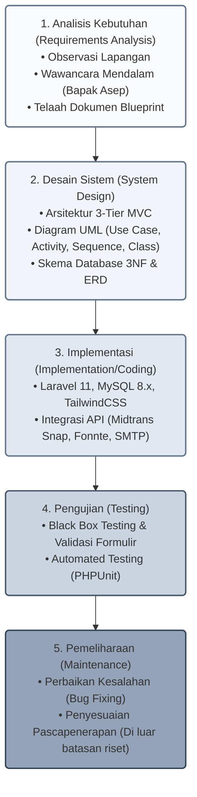

SISTEM INFORMASI MANAJEMEN KOST TERINTEGRASI PAYMENT GATEWAY PADA ASRI BOARDING HOUSE

SKRIPSI
Diajukan sebagai salah satu syarat untuk menyusun Tugas Akhir guna mencapai gelar Sarjana Komputer pada Program Studi Sistem Informasi Universitas Katolik Soegijapranata Semarang
 


Disusun oleh:
RAFIF ARSYA PRADIVA
NIM: 22.N4.0014


Kepada
PROGRAM STUDI SISTEM INFORMASI
FAKULTAS ILMU KOMPUTER
UNIVERSITAS KATOLIK SOEGIJAPRANATA
SEMARANG
2026 
SISTEM INFORMASI MANAJEMEN KOST TERINTEGRASI PAYMENT GATEWAY PADA ASRI BOARDING HOUSE


Skripsi
Diajukan sebagai salah satu syarat untuk menyusun Tugas Akhir guna mencapai gelar Sarjana Komputer pada Program Studi Sistem Informasi Universitas Katolik Soegijapranata Semarang


Disusun oleh:
RAFIF ARSYA PRADIVA
22.N4.0014

Disetujui oleh:
Dosen Pembimbing Skripsi


Ir. Andre Kurniawan Pamudji, S.Kom, M.Ling.
NPP: 058.1.1994.161

Kepada
PROGRAM STUDI SISTEM INFORMASI
FAKULTAS ILMU KOMPUTER
UNIVERSITAS KATOLIK SOEGIJAPRANATA
SEMARANG
2026 
## HALAMAN PERNYATAAN ORISINALITAS
Saya yang bertanda tangan di bawah ini:

Nama			: Rafif Arsya Pradiva
NIM			: 22.N4.0014
Program Studi		: Sistem Informasi
Fakultas		: Ilmu Komputer

menyatakan dengan sesungguhnya bahwa Skripsi dengan judul “Sistem Informasi Manajemen Kost Terintegrasi Payment Gateway pada Asri Boarding House” adalah benar-benar hasil karya saya sendiri, bukan merupakan jiplakan dari karya tulis orang lain, baik sebagian maupun keseluruhan. Pendapat, gagasan, atau temuan orang lain yang terdapat di dalam Skripsi ini telah dikutip dan dirujuk berdasarkan kaidah penulisan ilmiah yang berlaku.
Apabila di kemudian hari terbukti bahwa pernyataan ini tidak benar, saya bersedia menerima sanksi akademik sesuai dengan ketentuan yang berlaku di Universitas Katolik Soegijapranata Semarang.

Semarang, ........................ 2026
Yang menyatakan,

Materai
Rp10.000

Rafif Arsya Pradiva
NIM. 22.N4.0014
## HALAMAN PERNYATAAN BEBAS PLAGIASI
Saya yang bertanda tangan di bawah ini:

Nama			: Rafif Arsya Pradiva
NIM			: 22.N4.0014
Program Studi		: Sistem Informasi
Fakultas		: Ilmu Komputer

menyatakan dengan sesungguhnya bahwa Skripsi yang saya susun telah bebas dari unsur plagiasi. Seluruh sumber, baik berupa kutipan langsung maupun tidak langsung, yang berasal dari karya orang lain telah disebutkan sumbernya secara jujur dan dicantumkan dalam Daftar Pustaka sesuai dengan format penulisan ilmiah yang berlaku.
Apabila di kemudian hari ditemukan adanya pelanggaran terhadap etika keilmuan dalam karya ini, atau terdapat klaim dari pihak lain terhadap keaslian karya ini, saya bersedia mempertanggungjawabkannya dan menerima sanksi sesuai dengan peraturan yang berlaku.

Semarang, ........................ 2026
Yang menyatakan,

Rafif Arsya Pradiva
NIM. 22.N4.0014
## HALAMAN PENGESAHAN
Skripsi dengan judul:

SISTEM INFORMASI MANAJEMEN KOST TERINTEGRASI PAYMENT GATEWAY PADA ASRI BOARDING HOUSE

yang dipersiapkan dan disusun oleh:
Rafif Arsya Pradiva — NIM. 22.N4.0014

telah diperiksa dan disetujui oleh Dosen Pembimbing untuk diajukan dalam Seminar Skripsi pada Program Studi Sistem Informasi Fakultas Ilmu Komputer Universitas Katolik Soegijapranata Semarang.


Semarang, ........................ 2026

Telah diperiksa dan disetujui
Semarang, 13-07-2026

	Pembimbing 1	Pembimbing 2


	Ir. Andre Kurniawan Pamudji, S.Kom, M.Ling	NAMA
NPP. 581.2021.403					NPP. ….
## KATA PENGANTAR
Puji dan syukur penulis panjatkan ke hadirat Tuhan Yang Maha Esa atas segala rahmat dan karunia-Nya sehingga penulis dapat menyelesaikan penyusunan Skripsi yang berjudul “Sistem Informasi Manajemen Kost Terintegrasi Payment Gateway pada Asri Boarding House” dengan baik. Skripsi ini disusun sebagai salah satu syarat untuk menyusun Tugas Akhir guna mencapai gelar Sarjana Komputer pada Program Studi Sistem Informasi Fakultas Ilmu Komputer Universitas Katolik Soegijapranata Semarang.
Penulis menyadari bahwa penyusunan Skripsi ini tidak terlepas dari bantuan, bimbingan, dan dukungan berbagai pihak. Oleh karena itu, pada kesempatan ini penulis menyampaikan ucapan terima kasih yang sebesar-besarnya kepada:
•	Rektor Universitas Katolik Soegijapranata Semarang beserta seluruh jajarannya;
•	Dekan Fakultas Ilmu Komputer Universitas Katolik Soegijapranata Semarang;
•	Ketua Program Studi Sistem Informasi atas dukungan dan arahan akademik yang diberikan;
•	Dosen Pembimbing yang dengan penuh kesabaran telah meluangkan waktu, tenaga, dan pikiran untuk membimbing penulis selama proses penyusunan Skripsi ini;
•	Bapak Asep selaku pemilik Asri Boarding House yang telah berkenan menjadi objek penelitian dan memberikan data serta informasi operasional yang dibutuhkan;
•	Kedua orang tua dan keluarga penulis atas doa, kasih sayang, serta dukungan moral dan material yang tiada henti;
•	Rekan-rekan mahasiswa serta semua pihak yang tidak dapat penulis sebutkan satu per satu, yang telah memberikan bantuan dalam penyusunan Skripsi ini.
Penulis menyadari bahwa Skripsi ini masih jauh dari kata sempurna. Oleh karena itu, kritik dan saran yang membangun sangat penulis harapkan demi penyempurnaan penelitian pada tahap selanjutnya. Semoga Skripsi ini dapat memberikan manfaat bagi pengembangan ilmu pengetahuan, khususnya di bidang sistem informasi dan e-commerce.

Semarang, ........................ 2026
Penulis,

Rafif Arsya Pradiva
## HALAMAN PERNYATAAN PERSETUJUAN PUBLIKASI KARYA ILMIAH UNTUK KEPENTINGAN AKADEMIS
Sebagai sivitas akademika Universitas Katolik Soegijapranata Semarang, saya yang bertanda tangan di bawah ini:

Nama			: Rafif Arsya Pradiva
NIM			: 22.N4.0014
Program Studi		: Sistem Informasi
Fakultas		: Ilmu Komputer
Jenis Karya		: Skripsi

demi pengembangan ilmu pengetahuan, menyetujui untuk memberikan kepada Program Studi Sistem Informasi Fakultas Ilmu Komputer Universitas Katolik Soegijapranata Semarang Hak Bebas Royalti Noneksklusif (Non-exclusive Royalty-Free Right) atas karya ilmiah saya yang berjudul di atas beserta perangkat yang ada (jika diperlukan).
Dengan Hak Bebas Royalti Noneksklusif ini, Program Studi Sistem Informasi berhak menyimpan, mengalih-media/format-kan, merawat, dan memublikasikan karya ilmiah tersebut untuk kepentingan akademis tanpa perlu meminta izin dari saya selama tetap mencantumkan nama saya sebagai penulis/pencipta dan sebagai pemilik Hak Cipta. Hak Cipta atas karya ilmiah ini tetap berada pada penulis.
Demikian pernyataan ini saya buat dengan sebenarnya.

Dibuat di Semarang
Pada tanggal ........................ 2026
Yang menyatakan,

Rafif Arsya Pradiva
NIM. 22.N4.0014
## ABSTRAK
Rafif Arsya Pradiva. 22.N4.0014. SISTEM INFORMASI MANAJEMEN KOST TERINTEGRASI PAYMENT GATEWAY PADA ASRI BOARDING HOUSE (Studi Kasus: Asri Boarding House, Tembalang, Kota Semarang).
Asri Boarding House merupakan usaha kos di kawasan Tembalang, Kota Semarang, yang mengelola 32 unit kamar dengan potensi pendapatan mencapai Rp28.500.000 per bulan. Pengelolaan yang masih bersifat konvensional menyebabkan sistem rentan terhadap kesalahan pencatatan keuangan, sengketa validasi pembayaran tunai, ketiadaan pelacakan keterlambatan pembayaran secara otomatis, serta risiko pemesanan ganda (double booking). Penelitian ini bertujuan merancang dan membangun Sistem Informasi Manajemen Kost yang terintegrasi payment gateway dan modul reservasi online berbasis framework Laravel 11 untuk mengatasi permasalahan tersebut. Metode pengembangan yang digunakan adalah Research and Development dengan model Waterfall yang meliputi tahap analisis kebutuhan, perancangan, implementasi, dan pengujian. Sistem dirancang menggunakan arsitektur 3-tier dengan pola Model-View-Controller, basis data MySQL yang dinormalisasi hingga bentuk normal ketiga (3NF), integrasi Midtrans Snap sebagai gerbang pembayaran daring, pencetakan kuitansi instan format A5 di sisi peramban menggunakan html2pdf.js (zero server load) berdampingan dengan Dompdf untuk laporan manajerial, serta Fonnte WhatsApp API dan SMTP sebagai kanal notifikasi. Fitur utama meliputi penagihan otomatis bulanan, mekanisme denda keterlambatan flat yang idempoten (dikenakan tepat satu kali pada bulan kalender berikutnya) disertai eskalasi notifikasi berjenjang kepada wali penyewa, reservasi mandiri melalui dua jalur (online dan konvensional), serta kanal komunikasi chat berbasis AJAX polling. Pengujian dilakukan menggunakan metode blackbox testing dan automated feature test PHPUnit dengan tingkat kelulusan 100% (510 tests passed, 2.211 assertions) untuk memvalidasi logika penagihan, denda, dan pencegahan kondisi balapan (race condition). Sistem telah berhasil diimplementasikan pada lingkungan produksi live (https://asriboardinghouse.weatso.id/) dengan hasil evaluasi pengguna yang membuktikan peningkatan efisiensi operasional dan eliminasi kebocoran pendapatan secara real-time.
Kata kunci: sistem informasi manajemen kos, payment gateway, Laravel 11, reservasi online, penagihan otomatis, html2pdf.js
## ABSTRACT
Rafif Arsya Pradiva. 22.N4.0014. Design and Development of an Integrated Boarding House Management Information System with Payment Gateway in Asri Boarding House (Case Study: Asri Boarding House, Tembalang, Semarang City).
Asri Boarding House is a boarding house business located in the Tembalang area of Semarang City, managing 32 rooms with a potential monthly revenue of IDR 28,500,000. Its conventional management makes the operation prone to financial recording errors, cash payment validation disputes, the absence of automatic payment-delay tracking, and the risk of double-booking. This research aims to design and build a Boarding House Management Information System integrated with a payment gateway and an online reservation module based on the Laravel 11 framework. The development method used is Research and Development with the Waterfall model, covering requirements analysis, design, implementation, and testing. The system is designed using a 3-tier architecture with the Model-View-Controller pattern, a MySQL database normalized to the third normal form (3NF), Midtrans Snap integration as the online payment gateway, instant browser-side A5 receipt printing using html2pdf.js (zero server load) alongside Dompdf for managerial reporting, and the Fonnte WhatsApp API together with SMTP as notification channels. The main features include automated monthly billing, an idempotent flat late-fee mechanism (charged exactly once in the following calendar month) complemented by tiered notification escalation to the tenant’s guardian, self-service reservation through two paths (online and conventional), and an AJAX-polling-based chat channel. Testing is conducted using blackbox testing and PHPUnit automated feature tests with a 100% pass rate (510 tests passed, 2,211 assertions) to validate billing logic, late fees, and race-condition prevention. The system has been successfully deployed to a live production environment (https://asriboardinghouse.weatso.id/) with user evaluation results confirming improved operational efficiency and real-time revenue leakage elimination.
Keywords: boarding house management information system, payment gateway, Laravel 11, online reservation, automated billing, html2pdf.js

 

## DAFTAR ISI
HALAMAN PERNYATAAN ORISINALITAS	ii
HALAMAN PERNYATAAN BEBAS PLAGIASI	iii
HALAMAN PENGESAHAN	iv
KATA PENGANTAR	v
HALAMAN PERNYATAAN PERSETUJUAN PUBLIKASI KARYA ILMIAH UNTUK KEPENTINGAN AKADEMIS	vii
ABSTRAK	viii
ABSTRACT	ix
DAFTAR ISI	x
DAFTAR TABEL	xii
DAFTAR GAMBAR	xiii
BAB I PENDAHULUAN	1
1.1 Latar Belakang	1
1.2 Rumusan Masalah	4
1.3 Tujuan Penelitian	5
1.4 Batasan Masalah	6
1.5 Manfaat Penelitian	8
1.5.1 Manfaat Teoretis	8
1.5.2 Manfaat Praktis	8
1.6 Sistematika Penulisan	9
BAB II  TINJAUAN PUSTAKA DAN LANDASAN TEORI	11
2.1 Landasan Teori	11
2.1.1 Sistem Informasi dan Sistem Informasi Manajemen	11
2.1.2 Sistem Berbasis Web dan E-Commerce Model B2C	11
2.1.3 Sistem Manajemen Basis Data Relasional dan Normalisasi 3NF	12
2.1.4 Arsitektur 3-Tier dan Model-View-Controller pada Laravel 11	12
2.1.5 Antarmuka Pemrograman Aplikasi (API) Eksternal: Midtrans dan Fonnte	13
2.1.6 Penjadwalan Tugas, Mesin Penagihan Otomatis, dan Cron Job	13
2.1.7 Teori Interaktivitas UI/UX: Neo-Brutalism dan WCAG 2.1	14
2.1.8 Keamanan Web dan Integritas Data	14
2.1.9 Concurrency Control dan Mekanisme Penguncian Basis Data	15
2.2 Penelitian Terdahulu (State of the Art)	15
2.3 Kerangka Pemikiran	17
BAB III  METODOLOGI PENELITIAN	20
3.1 Jenis Penelitian	20
3.2 Teknik Pengumpulan Data	20
3.3 Metode Pengembangan Sistem	21


BAB IV HASIL DAN PEMBAHASAN	44
4.1 Analisis dan Perancangan Sistem	22
4.1.1 Analisis Kebutuhan Fungsional dan Non-Fungsional	22
4.1.2 Use Case Diagram	24
4.1.3 Activity Diagram Proses Kritis	27
4.1.4 Sequence Diagram	31
4.1.5 Class Diagram	33
4.1.6 Perancangan Skema Basis Data Relasional 3NF dan ERD	34
4.1.7 Arsitektur Sistem 3-Tier MVC	37
4.2 Implementasi Kode Program Backend dan Logika Bisnis	44
4.2.1 Arsitektur 3-Tier MVC dan Service Layer Decoupling	44
4.2.2 Cronjob Pembangkitan Invoice Bulanan dan Idempotency Guard Late Fee	46
4.2.3 Penanganan Webhook Callback Payment Gateway Midtrans Snap API	49
4.2.4 Otentikasi Google OAuth API via Laravel Socialite dan Complete Profile	52
4.2.5 Subsistem Notifikasi Asinkron Fonnte WhatsApp API dan SMTP TLS Mailer	55
4.2.6 Penanganan Konflik Unique Constraint Soft Deletes Berbasis Virtual Generated Columns	57
4.3 Hasil Implementasi Antarmuka Lingkungan Lokal (Localhost)	58
4.3.1 Pengecekan Server Lokal dan Kompilasi Bundel Aset	58
4.3.2 Halaman Publik Portal Informasi dan Detail Unit Kamar	59
4.3.3 Panel Kontrol Dasbor Administrasi Utama Kost	60
4.3.4 Portal Mandiri Transaksional dan Unduh Dokumen Penyewa Kost	61
4.3.5 Workspace Alur Pemesanan (5-Step Stepper & Middleware)	62
4.4 Konfigurasi Penyiapan Perangkat Peladen Produksi (Shared Hosting Production)	63
4.4.1 Integrasi Server Produksi (Hostinger LiteSpeed Enterprise)	63
4.4.2 Analisis Komparasi Parameter Lingkungan Perangkat Peladen	64
4.5 Pengujian Sistem (Testing, Validasi, dan Quality Assurance)	66
4.5.1 Hasil Eksekusi Automated Testing Suite Framework PHPUnit	66
4.5.2 Hasil Pengujian Validasi Fungsionalitas Kotak Hitam (Black-Box Testing)	67
4.6 Sesi Wawancara Evaluasi Pengguna (Pemilik Kost)	70
4.6.1 Hasil Tanya Jawab (Q&A) Evaluasi Operasional Aplikasi Bersama Bapak Asep	70
4.6.2 Implikasi Penggunaan Sistem Terhadap Efisiensi Operasional Kost	71
DAFTAR PUSTAKA	73

## DAFTAR TABEL
Tabel 2.1  Perbandingan Penelitian Terdahulu (State of the Art)	16
Tabel 4.1  Kebutuhan Non-Fungsional Sistem	22
Tabel 4.2  Struktur Tabel Utama Basis Data Sistem	34
Tabel 4.3  Perbandingan Parameter Konfigurasi Lingkungan Server	64
Tabel 4.4  Matriks Hasil Pengujian Kotak Hitam (Black-Box Testing)	67
Tabel 4.5  Rangkuman Hasil Wawancara Evaluasi Operasional	70
Tabel 4.6  Komparasi Evaluasi Side-by-Side Efisiensi Operasional Kos	72

## DAFTAR GAMBAR
Gambar 2.1  Kerangka Pemikiran Penelitian	18
Gambar 3.1  Diagram Model Waterfall Pengembangan Sistem	20
Gambar 4.1  Use Case Diagram Sistem Asri Boarding House	25
Gambar 4.2  Activity Diagram Tiga Proses Kritis Sistem	27
Gambar 4.3  Sequence Diagram Alur Utama Sistem	32
Gambar 4.4  Class Diagram Model, Service, dan Observer Sistem	33
Gambar 4.5  Entity Relationship Diagram (ERD) Skema Basis Data Lengkap 22 Tabel	35
Gambar 4.6  Mekanisme Billing Engine Massal	46
Gambar 4.7  Middleware Validasi Webhook Signature	49
Gambar 4.8  Alur Interseptor Profil Google OAuth	52
Gambar 4.9  Sistem Notifikasi Fonnte WA Service	55
Gambar 4.10  Kompilasi Bundel Aset Vite Produksi	58
Gambar 4.11  Antarmuka Katalog Kamar Publik Neo-Brutalisme	59
Gambar 4.12  Dasbor Administrasi Keuangan Administrator	60
Gambar 4.13  Portal Invoice and Kuitansi PDF Penyewa	61
Gambar 4.14  Workspace Stepper Alur Reservasi Calon Penyewa	62
Gambar 4.15  Output Terminal php artisan test Passed	66
Gambar 4.16  Dokumentasi UAT Sesi Wawancara dan Penyerahan Sistem	71

 
## BAB I PENDAHULUAN
## 1.1 Latar Belakang
Transformasi digital pada dekade terakhir telah menggeser model bisnis konvensional ke arah ekosistem berbasis web dan mobile secara menyeluruh, termasuk pada sektor jasa dan perdagangan elektronik (e-commerce). Pertumbuhan penetrasi internet, dompet digital (e-wallet), serta ekspektasi konsumen terhadap layanan mandiri (self-service) yang tersedia selama dua puluh empat jam mendorong pelaku usaha untuk merancang sistem informasi yang mengintegrasikan proses transaksi, pencatatan, dan komunikasi pelanggan dalam satu kesatuan platform [1]. Pergeseran ini tidak hanya menyentuh sektor ritel, tetapi juga merambah sektor properti dan akomodasi yang secara historis dikelola secara manual dan berbasis kepercayaan personal.
Sektor teknologi properti (property technology atau proptech) muncul sebagai respons terhadap kebutuhan digitalisasi pengelolaan hunian, mulai dari pemasaran unit, reservasi, hingga administrasi keuangan penyewaan. Dalam konteks pasar Indonesia, salah satu segmen properti yang paling dinamis namun paling tertinggal dalam adopsi teknologi adalah usaha rumah kos (boarding house), khususnya yang berlokasi di sekitar kawasan kampus. Tingginya mobilitas penyewa berbasis siklus akademik, keragaman tipe kamar, serta dominasi pembayaran tunai membuat pengelolaan kos rentan terhadap kesalahan administratif apabila masih bersandar pada pencatatan kertas dan komunikasi lisan.
Sistem informasi manajemen (management information system) didefinisikan sebagai gabungan terpadu antara manusia, perangkat keras, perangkat lunak, basis data, dan prosedur yang berfungsi mengumpulkan, mengolah, menyimpan, dan mendistribusikan informasi guna mendukung pengambilan keputusan operasional maupun strategis dalam suatu organisasi [2]. Penerapan sistem informasi manajemen pada usaha kos memungkinkan pemilik untuk mengubah data transaksi yang sebelumnya tersebar dan bersifat volatile menjadi basis data relasional yang konsisten, terverifikasi, dan dapat diaudit. Dengan demikian, kebutuhan akan sistem yang mampu mengotomatisasi siklus penagihan dan menstandarkan alur kerja menjadi semakin mendesak. 
Asri Boarding House merupakan usaha kos milik Bapak Asep (usia 48 tahun) yang berlokasi di Jalan Maera Sari Nomor 1/Nomor 12, Tembalang, Kecamatan Tembalang, Kota Semarang, Jawa Tengah 50275. Usaha ini beroperasi dengan total 32 unit kamar yang tersebar pada dua lantai dan terbagi ke dalam tiga kategori, yaitu tipe VIP sebanyak 6 kamar (Rp1.400.000 per bulan), tipe Deluxe sebanyak 3 kamar (Rp950.000 per bulan), dan tipe Standar sebanyak 23 kamar (Rp750.000 per bulan). Apabila seluruh kamar terisi penuh, potensi pendapatan bruto maksimum yang dapat dihimpun mencapai Rp28.500.000 per bulan. Nilai perputaran kas yang signifikan ini menuntut tata kelola keuangan yang akurat, sebab kesalahan pencatatan sekecil apa pun berpotensi menimbulkan kerugian material dan sengketa dengan penyewa.
Permasalahan utama yang dihadapi Asri Boarding House terletak pada proses penagihan bulanan yang masih dilakukan secara manual, yakni administrator harus menghubungi setiap penyewa satu per satu untuk mengingatkan kewajiban pembayaran. Mekanisme ini tidak hanya tidak efisien, tetapi juga rentan menyebabkan tagihan terlambat disampaikan, penyewa lupa membayar, dan pendapatan tertunda tanpa dapat dimonitor secara terukur. Selain itu, ketiadaan sistem eskalasi keterlambatan yang terstruktur menyebabkan penyewa yang menunggak tidak memperoleh pengingat (reminder) yang konsisten, sementara pihak wali atau orang tua penyewa tidak pernah dilibatkan dalam proses penagihan meskipun secara kultural memiliki tanggung jawab finansial.
Kelemahan berikutnya berkaitan dengan pencatatan pembayaran yang masih bertumpu pada buku catatan fisik sehingga rawan terjadi penghitungan ganda (double counting), kehilangan data, serta tidak tersedianya jejak audit (audit trail) digital. Ketika terjadi perselisihan mengenai status lunas atau belum lunasnya suatu tagihan, pemilik tidak memiliki bukti transaksi yang sahih untuk menyelesaikan sengketa. Kondisi serupa juga terjadi pada pengelolaan ketersediaan kamar: tanpa pembaruan status secara real-time, administrator kesulitan mengetahui kamar mana yang benar-benar kosong, sehingga timbul risiko pemesanan ganda (double booking) terhadap satu unit kamar yang sama, terutama ketika permintaan dari calon penyewa berlangsung simultan.
Pada aspek pemasaran dan akuisisi penyewa, model konvensional mengharuskan calon penyewa datang langsung ke lokasi untuk melihat kamar dan melakukan pemesanan. Pendekatan ini menutup peluang menjangkau calon penyewa berkarakter digital-native yang lebih nyaman melakukan reservasi secara online. Lebih jauh, pada masa pemesanan calon penyewa kerap membutuhkan kepastian mengenai kesiapan fisik kamar sebelum bersedia melakukan pembayaran; tanpa kanal komunikasi yang terintegrasi dengan sistem, proses verifikasi ini berlangsung di luar sistem dan tidak terdokumentasi. Ketiadaan umpan balik taktil (tactile feedback) pra-pembayaran demikian menurunkan tingkat kepercayaan calon penyewa dan menaikkan angka pembatalan.
Ditinjau dari sisi keuangan, pengelolaan kas yang tidak terkomputerisasi membuka celah kebocoran data keuangan dan menyulitkan pemilik dalam menyusun laporan periodik yang menggambarkan pendapatan, tingkat hunian (occupancy rate), serta tren keterlambatan pembayaran. Tanpa laporan terintegrasi, keputusan operasional — seperti penetapan tarif, penjadwalan perawatan, atau evaluasi profitabilitas per tipe kamar — diambil berdasarkan estimasi subjektif alih-alih data faktual. Akumulasi seluruh permasalahan ini menunjukkan bahwa pengelolaan Asri Boarding House berada pada titik di mana intervensi teknologi informasi bukan lagi sekadar pilihan, melainkan kebutuhan strategis.
Berbagai penelitian terdahulu memang telah mengembangkan sistem informasi pengelolaan kos berbasis web, namun mayoritas berhenti pada fungsi katalog kamar, pencatatan penyewa, dan pemesanan sederhana [3], [4], [5], dan belum banyak yang mengintegrasikan payment gateway secara penuh dengan kebijakan denda keterlambatan otomatis yang idempoten (flat calendar late fee) yang melibatkan eskalasi notifikasi kepada wali penyewa. Sistem yang ada umumnya juga belum menangani secara eksplisit pencegahan kondisi balapan (race condition) yang memicu double booking, belum menyediakan kanal chat pra-pembayaran yang aktif pada status pemesanan tertunda (pending), serta belum mengakomodasi alur kerja hibrida (hybrid workflow) yang menyatukan jalur reservasi online mandiri dengan jalur konvensional berbasis WhatsApp dalam satu basis data yang konsisten. Kesenjangan inilah yang menjadi celah penelitian (research gap) yang hendak dijawab.
Berdasarkan paparan di atas, penelitian ini mengajukan solusi berupa rancang bangun Sistem Informasi Manajemen Kost Terintegrasi Payment Gateway dan Modul Reservasi Online berbasis framework Laravel 11 dengan mengacu pada dokumen “Blueprint_Projek_Website_Asri_Boarding_House”. Sistem ini dirancang untuk mengotomatisasi siklus penagihan seragam yang dibangkitkan setiap tanggal 1 dengan jatuh tempo tanggal 10, menerapkan denda keterlambatan flat sebesar 5% dari nominal pokok yang dikenakan tepat satu kali pada bulan kalender berikutnya melalui mekanisme Idempotency Guard, mengintegrasikan payment gateway Midtrans Snap beserta opsi pembayaran tunai terkonfirmasi, mengirimkan notifikasi multi-channel melalui Fonnte WhatsApp API dan surel SMTP, serta menyediakan modul reservasi online berfitur Google OAuth dan chat berbasis AJAX polling. Dengan arsitektur tiga lapis (3-tier architecture) dan pola Model-View-Controller (MVC), sistem diharapkan mampu meningkatkan efisiensi operasional, menjamin integritas data keuangan, dan memperluas jangkauan pasar Asri Boarding House secara terukur dan berkelanjutan.
## 1.2 Rumusan Masalah
Berdasarkan latar belakang yang telah diuraikan, rumusan masalah dalam penelitian ini dirumuskan sebagai berikut:
1.	Bagaimana menganalisis kebutuhan fungsional dan non-fungsional Sistem Informasi Manajemen Kost pada Asri Boarding House berdasarkan kondisi operasional dan aturan bisnis aktual yang berlaku?
2.	Bagaimana merancang arsitektur tiga lapis (3-tier) dengan pola MVC pada framework Laravel 11 beserta skema basis data relasional ternormalisasi (Third Normal Form) yang mampu menampung seluruh entitas manajemen kos, reservasi, dan transaksi pembayaran?
3.	Bagaimana mengimplementasikan mesin penagihan otomatis (automated billing engine) dengan kebijakan denda keterlambatan flat kalender (flat calendar late fee) yang idempoten dan tetap mengeskalasi notifikasi dari penyewa menuju wali secara terstruktur?
4.	Bagaimana mengintegrasikan payment gateway Midtrans Snap dan notifikasi multi-channel (WhatsApp via Fonnte dan surel via SMTP) secara idempotent dan aman ke dalam alur transaksi sistem?
5.	Bagaimana mencegah kondisi balapan (race condition) yang memicu pemesanan ganda (double booking) serta menjaga konsistensi status kamar pada alur kerja hibrida (hybrid workflow) antara reservasi online dan jalur konvensional WhatsApp?
6.	Bagaimana merancang antarmuka publik bergaya Neo-Brutalism yang memenuhi standar aksesibilitas Web Content Accessibility Guidelines (WCAG) 2.1 — antara lain dengan target sentuh (touch target) minimum 44 piksel dan rasio kontras yang memadai — sehingga mampu menekan kesalahan masukan data finansial (input error) pada perangkat bergerak, meningkatkan kepercayaan serta tingkat konversi calon penyewa berkarakter digital-native, dan menguji kelayakan fungsional sistem secara menyeluruh?
## 1.3 Tujuan Penelitian
Sejalan dengan rumusan masalah, tujuan yang hendak dicapai dalam penelitian ini adalah:
1.	Menganalisis kebutuhan fungsional dan non-fungsional Sistem Informasi Manajemen Kost Asri Boarding House secara komprehensif berdasarkan observasi, wawancara, dan studi dokumen blueprint.
2.	Merancang arsitektur 3-tier dengan pola MVC pada Laravel 11 serta skema basis data relasional 3NF yang menjamin integritas referensial seluruh entitas sistem.
3.	Mengimplementasikan automated billing engine dengan denda keterlambatan flat 5% yang idempoten (dikenakan tepat satu kali pada bulan kalender berikutnya) dan tetap mengeskalasi notifikasi secara otomatis dari penyewa kepada wali.
4.	Mengintegrasikan payment gateway Midtrans Snap dan notifikasi multi-channel WhatsApp serta surel secara idempotent dan aman.
5.	Menerapkan mekanisme pencegahan race condition dan double booking serta menjaga konsistensi status kamar pada hybrid workflow.
6.	Merancang dan memvalidasi antarmuka publik bergaya Neo-Brutalism yang patuh WCAG 2.1 sebagai instrumen untuk meminimalkan kesalahan masukan finansial dan meningkatkan konversi calon penyewa, sekaligus menguji kelayakan fungsional sistem menggunakan black box testing dan automated suite testing.
## 1.4 Batasan Masalah
Agar penelitian terfokus, terukur, dan dapat diselesaikan dalam linimasa yang ditetapkan, ruang lingkup penelitian ini dibatasi sebagaimana diuraikan berikut. Batasan dirumuskan dari pemetaan modul pada dokumen blueprint sistem sehingga lingkup penelitian bersifat ketat dan dapat dipertanggungjawabkan secara ilmiah.
A. Ruang Lingkup Fungsional (yang dikerjakan). Sistem yang dibangun mencakup lima kelompok fungsi yang selaras dengan dokumen blueprint:
•	Modul Administrator, meliputi manajemen kamar (CRUD, unggah foto, dan perubahan status kamar secara manual), manajemen penyewa (CRUD beserta data wali, deposit, tipe sewa, dan durasi), konfirmasi pembayaran tunai, manajemen tagihan, manajemen reservasi online, laporan keuangan dengan ekspor Excel/PDF, pemantauan log notifikasi, serta dasbor statistik real-time.
•	Modul Penyewa/Pengguna, meliputi dasbor informasi kamar, tampilan tagihan aktif beserta status keterlambatan, pembayaran melalui Midtrans Snap, riwayat pembayaran, unduhan nota PDF, pelacakan status reservasi, serta kanal chat real-time dengan administrator yang aktif pada status reservasi pending.
•	Modul Publik, meliputi landing page dengan grid kamar, halaman detail kamar dan formulir pemesanan, login Google OAuth, tombol WhatsApp Direct Link melayang, dan kalkulasi harga real-time berbasis AJAX, halaman informasi mandiri Tentang Kami (profil pemilik, visi, dan misi), halaman Galeri terpisah, section pemutaran video room tour via YouTube Embed, serta paket promo pemasaran dinamis (Dynamic Marketing Promo Packages) pada halaman detail kamar yang menerapkan persentase diskon dinamis lintas tipe sewa harian, mingguan, dan bulanan.
•	Modul Otomasi, meliputi cron job pembangkitan tagihan setiap tanggal 1, scheduler harian pemrosesan keterlambatan dan denda, queue job notifikasi asinkron (WhatsApp dan surel), serta pembangkitan nota PDF otomatis.
•	Integrasi Eksternal, dibatasi pada layanan: Midtrans Snap v2 (gerbang pembayaran), Fonnte WhatsApp API v2 (notifikasi sisi peladen), SMTP TLS (surel), Laravel Socialite untuk Google OAuth (autentikasi), Dompdf (cetak PDF), Chart.js (visualisasi data), Google Maps Embed API (peta lokasi fisik kos pada halaman publik), YouTube Player/Embed API (pemutaran video room tour), dan WhatsApp Direct Link sisi klien.
B. Batasan Operasional, Platform, dan Asumsi (yang tidak dikerjakan/dibatasi).
•	Objek penelitian tunggal. Sistem dirancang untuk satu lokasi, yakni Asri Boarding House di Tembalang, Kota Semarang (32 unit kamar). Dukungan multilokasi (multi-branch) diposisikan sebagai rekomendasi pengembangan lanjutan dan berada di luar lingkup.
•	Platform berbasis web responsif. Sistem diakses melalui peramban dengan desain mobile-first yang responsif, dan bukan berupa aplikasi native Android/iOS.
•	Cakupan metode pembayaran. Transaksi nontunai dibatasi pada metode yang difasilitasi Midtrans Snap; pembayaran tunai hanya tercatat melalui mekanisme konfirmasi manual oleh administrator, tanpa integrasi mesin EDC/POS fisik.
•	Pengelolaan deposit bersifat pasif. Nominal deposit dicatat di basis data, sedangkan pengembalian atau pemotongan deposit dilakukan secara manual oleh administrator saat checkout; sistem tidak melakukan refund otomatis melalui payment gateway.
•	Konsistensi status kamar pasca-checkout. Status kamar tidak dilepas secara otomatis ketika penyewa dinonaktifkan; perubahan status menjadi tersedia wajib dilakukan manual oleh administrator setelah inspeksi fisik, sebagai aturan pencegahan double booking.
•	Kanal notifikasi terbatas. Notifikasi hanya melalui WhatsApp (Fonnte) dan surel (SMTP); tidak mencakup SMS gateway maupun push notification.
•	Modul akuntansi sederhana. Pelaporan keuangan dibatasi pada arus kas sederhana (pemasukan, pengeluaran, dan laba bersih); tidak mencakup pembukuan akrual penuh, perhitungan pajak, atau integrasi dengan perangkat lunak akuntansi pihak ketiga.
•	Batas linimasa riset. Penelitian berhenti pada fase pengujian dan penyerahan laporan; fase pemeliharaan (maintenance) jangka panjang berada di luar linimasa enam bulan sebagaimana ditegaskan pada Sub-bab 3.3.
•	Penghapusan logis (soft delete) terstruktur. Integritas historis data — termasuk jejak keuangan — dijaga melalui mekanisme Soft Deletes dengan kolom deleted_at pada tabel master maupun transaksional (antara lain users, kamar, penyewa, dan reservasi), sehingga penghapusan bersifat reversibel dan dapat dipulihkan (restore) tanpa menghilangkan data historis; kebijakan kunci asing RESTRICT/CASCADE tetap diberlakukan untuk mencegah penghapusan permanen yang merusak integritas referensial.
•	Cakupan pengujian. Pengujian dibatasi pada black box testing, validasi formulir, serta automated unit/feature testing berbasis PHPUnit untuk mengunci alur penagihan, denda flat, dan mitigasi race condition; pengujian tidak mencakup uji penetrasi keamanan menyeluruh maupun uji beban (load test) skala besar di luar pembatasan laju (rate limiting).
## 1.5 Manfaat Penelitian
### 1.5.1 Manfaat Teoretis
Secara teoretis, penelitian ini diharapkan menyumbang kontribusi terhadap khazanah literatur ilmiah di bidang e-commerce model Business-to-Consumer (B2C), manajemen basis data relasional, serta rekayasa perangkat lunak berbasis framework modern. Kajian ini turut memperkaya pembahasan mengenai integrasi automated messaging gateway dan payment gateway dalam konteks digitalisasi usaha properti skala menengah, dengan penekanan khusus pada pemodelan kebijakan denda keterlambatan flat yang idempoten (idempotent flat late fee) dan alur kerja hibrida (hybrid workflow) yang sejauh ini belum banyak diuraikan pada penelitian sejenis. Dokumentasi rancangan arsitektur tiga lapis berpola MVC yang dilengkapi Service Layer serta mekanisme Event–Listener–Observer juga dapat menjadi rujukan konseptual bagi pengembangan sistem transaksional serupa.
### 1.5.2 Manfaat Praktis
Secara praktis, penelitian ini memberikan manfaat bagi tiga pemangku kepentingan utama:
1)	Bagi pemilik kos (Bapak Asep): mengeliminasi kesalahan manusia (human error) dalam pencatatan keuangan, menghadirkan akurasi data hunian secara real-time, melindungi kas operasional dari kebocoran (cash leakage) melalui jejak audit (audit trail) digital, serta memperluas jangkauan pasar lewat reservasi daring.
2)	Bagi penyewa: memberikan kenyamanan transaksi multi-kanal (Midtrans dan tunai terkonfirmasi), transparansi tagihan dan riwayat pembayaran, kemudahan reservasi mandiri, serta kanal komunikasi chat yang terdokumentasi untuk memverifikasi kesiapan kamar sebelum pembayaran.
3)	Bagi institusi dan dunia akademik: menjadi rujukan implementasi sistem informasi manajemen akomodasi terintegrasi payment gateway yang dapat dikembangkan lebih lanjut pada studi kasus serupa.
## 1.6 Sistematika Penulisan
Penyusunan skripsi ini dibagi ke dalam lima bab yang saling berkaitan secara sistematis, dengan uraian sebagai berikut.
BAB I PENDAHULUAN memuat latar belakang yang menelusuri fenomena digitalisasi proptech hingga permasalahan operasional aktual Asri Boarding House, kemudian dilanjutkan dengan rumusan masalah, tujuan penelitian, batasan masalah, manfaat penelitian, serta sistematika penulisan yang menjadi kerangka berpikir keseluruhan penelitian.
BAB II TINJAUAN PUSTAKA DAN LANDASAN TEORI membahas teori-teori pendukung yang relevan, meliputi sistem informasi manajemen, e-commerce B2C, sistem manajemen basis data relasional dan normalisasi 3NF, arsitektur 3-tier dan MVC pada Laravel 11, mekanisme Application Programming Interface (API) eksternal, automated billing engine dan penjadwalan tugas (task scheduling), teori interaktivitas UI/UX Neo-Brutalism dan WCAG 2.1, pengontrolan konkurensi (concurrency control), serta konsep keamanan web. Bab ini turut menyajikan penelitian terdahulu (state of the art) dalam bentuk tabel komparatif beserta kerangka pemikiran penelitian.
BAB III METODOLOGI PENELITIAN menguraikan jenis penelitian (Research and Development / R&D), teknik pengumpulan data kualitatif melalui observasi lapangan, wawancara mendalam, dan studi dokumentasi, serta metode pengembangan sistem berbasis model Waterfall beserta justifikasinya.
BAB IV HASIL DAN PEMBAHASAN menyajikan perancangan sistem (use case diagram, activity diagram, flowchart, sequence diagram, dan ERD 22 tabel), implementasi sistem berbasis arsitektur 3-tier MVC dan Service Layer, tampilan antarmuka sistem (calon penyewa, penyewa aktif, dan admin), hasil deployment ke lingkungan peladen produksi berbasis kode, pengujian sistem secara menyeluruh (60 butir skenario uji kotak hitam, pengujian hak akses RBAC, simulasi Midtrans Sandbox BCA Virtual Account, pengujian live SSL, dan UAT), evaluasi operasional berbasis wawancara mendalam bersama Bapak Asep, serta pembahasan dampak efisiensi sistem terhadap operasional Asri Boarding House.
BAB V KESIMPULAN DAN SARAN merangkum kesimpulan akademis dan empiris yang ditarik dari seluruh tahapan penelitian, serta memberikan saran-saran praktis dan teoretis sebagai peta jalan (product roadmap) bagi pengembangan sistem informasi manajemen kost di masa mendatang.
## BAB II TINJAUAN PUSTAKA DAN LANDASAN TEORI
## 2.1 Landasan Teori
### 2.1.1 Sistem Informasi dan Sistem Informasi Manajemen
Sistem informasi adalah suatu kesatuan komponen yang saling berinteraksi untuk mengumpulkan, memproses, menyimpan, dan menyebarkan informasi guna mendukung pengambilan keputusan, koordinasi, pengendalian, analisis, dan visualisasi dalam organisasi. Komponen tersebut mencakup perangkat keras (hardware), perangkat lunak (software), basis data (database), jaringan (network), prosedur, dan sumber daya manusia. Sistem Informasi Manajemen (Management Information System) merupakan penerapan sistem informasi pada tingkat manajerial yang menghasilkan laporan rutin dan ringkasan terstruktur dari data operasional untuk menunjang fungsi perencanaan, pengorganisasian, dan pengendalian. Dalam konteks Asri Boarding House, sistem informasi manajemen berperan mengubah data penyewa, kamar, tagihan, dan pembayaran yang sebelumnya tersebar menjadi informasi yang akurat, terkini, dan dapat diaudit oleh pemilik.
### 2.1.2 Sistem Berbasis Web dan E-Commerce Model B2C
Sistem berbasis web (website-based system) adalah aplikasi yang diakses melalui peramban (browser) dengan arsitektur client-server sehingga tidak memerlukan instalasi pada perangkat pengguna dan dapat diakses lintas platform. Dalam praktik rekayasanya, aplikasi transaksi berbasis web lazim dibangun di atas framework yang mengusung pola pemisahan tanggung jawab Model-View-Controller (MVC); sebagai contoh, sistem penjualan berbasis web yang dibangun menggunakan framework CodeIgniter membuktikan bahwa pemisahan lapisan data, tampilan, dan kontrol menjadi fondasi arsitektural yang menopang keterawatan dan keteraturan alur transaksi pada aplikasi e-commerce [6]. Model bisnis e-commerce Business-to-Consumer (B2C) menggambarkan transaksi elektronik langsung antara pelaku usaha dan konsumen akhir, yang menuntut antarmuka intuitif, katalog produk yang informatif, serta mekanisme pembayaran yang aman dan tepercaya. Sistem yang dikembangkan pada penelitian ini mengadopsi model B2C, di mana Asri Boarding House sebagai penyedia jasa akomodasi berinteraksi langsung dengan calon penyewa melalui landing page publik, formulir pemesanan, dan kanal pembayaran daring.
### 2.1.3 Sistem Manajemen Basis Data Relasional dan Normalisasi 3NF
Sistem Manajemen Basis Data Relasional (Relational Database Management System atau RDBMS) mengelola data dalam bentuk tabel (relasi) yang saling terhubung melalui kunci primer (primary key) dan kunci asing (foreign key). MySQL 8.x dengan engine InnoDB dipilih karena mendukung constraint integritas referensial, transaksi yang memenuhi properti ACID (Atomicity, Consistency, Isolation, Durability), serta strategi pengindeksan (indexing) yang optimal. Normalisasi merupakan proses penataan struktur tabel guna mengurangi redundansi dan anomali data. Bentuk Normal Ketiga (Third Normal Form atau 3NF) tercapai apabila seluruh atribut nonkunci bergantung penuh dan hanya bergantung pada kunci primer, tanpa adanya ketergantungan transitif. Penerapan 3NF pada perancangan basis data sistem ini menjamin bahwa data tagihan, pembayaran, dan penyewa tersimpan secara konsisten tanpa duplikasi yang merusak integritas keuangan.
### 2.1.4 Arsitektur 3-Tier dan Model-View-Controller pada Laravel 11
Arsitektur tiga lapis (3-tier architecture) memisahkan sistem menjadi lapisan presentasi (presentation tier), lapisan aplikasi/logika bisnis (application tier), dan lapisan data (data tier) sehingga setiap lapisan dapat dikembangkan dan dipelihara secara independen. Pola Model-View-Controller (MVC) yang diterapkan framework Laravel 11 (berbasis PHP 8.2+) merupakan perwujudan konkret arsitektur tersebut: Model mewakili representasi data dan relasi melalui Eloquent ORM, View menangani penyajian antarmuka melalui template engine Blade, dan Controller menjembatani permintaan pengguna dengan logika bisnis. Penelitian ini memperkuat pemisahan tanggung jawab dengan menambahkan Service Layer untuk menampung logika bisnis murni seperti BillingService, MidtransService, dan ReservasiService, serta memanfaatkan mekanisme Event, Listener, dan Observer untuk menjalankan proses sampingan secara asinkron. Pendekatan berlapis ini telah terbukti meningkatkan keterawatan (maintainability) dan skalabilitas sistem informasi berbasis Laravel. Dengan demikian, pemilihan framework berpola MVC pada penelitian ini bukan sekadar preferensi teknis, melainkan kelanjutan dari praktik arsitektural yang telah terbukti menopang aplikasi transaksi berbasis web terdahulu, yang kemudian diperkuat melalui penambahan Service Layer serta mekanisme Event–Listener–Observer pada Laravel 11.
### 2.1.5 Antarmuka Pemrograman Aplikasi (API) Eksternal: Midtrans dan Fonnte
Antarmuka Pemrograman Aplikasi (Application Programming Interface atau API) adalah seperangkat aturan yang memungkinkan dua sistem berkomunikasi dan bertukar data. Payment gateway Midtrans menyediakan REST API Snap yang memfasilitasi lebih dari dua puluh metode pembayaran nontunai seperti transfer bank, QRIS, dompet digital, dan kartu kredit [7], [8]. Integrasi dilakukan dengan membangkitkan snap token dari sisi peladen (server-side), menampilkan popup pembayaran di sisi klien melalui Snap.js, lalu menerima pemberitahuan status (callback) secara server-to-server yang divalidasi menggunakan tanda tangan digital SHA-512. Adapun Fonnte WhatsApp API merupakan messaging automation gateway yang memungkinkan sistem mengirim pesan WhatsApp terprogram kepada penyewa dan wali untuk berbagai peristiwa penting, seperti tagihan baru, pengingat, eskalasi keterlambatan, dan pengiriman kredensial akun. Pemanfaatan kedua API ini menjadikan sistem mampu menjalankan transaksi dan komunikasi secara otomatis tanpa intervensi manual.
### 2.1.6 Penjadwalan Tugas, Mesin Penagihan Otomatis, dan Cron Job
Penjadwalan tugas (task scheduling) adalah mekanisme menjalankan perintah secara terjadwal tanpa campur tangan pengguna. Pada lingkungan peladen Linux, cron job dikonfigurasi untuk memanggil scheduler Laravel setiap menit, yang selanjutnya mengeksekusi perintah terjadwal sesuai aturan waktu yang ditetapkan. Mesin penagihan otomatis (automated billing engine) yang dirancang pada sistem ini membangkitkan tagihan untuk seluruh penyewa aktif setiap tanggal 1 dengan batas jatuh tempo seragam pada tanggal 10 (memberikan masa tenggang atau grace period selama sepuluh hari). Proses keterlambatan dijalankan setiap hari untuk menambah nilai kolom bulan keterlambatan dan menentukan tingkat eskalasi. Mekanisme antiduplikasi diterapkan melalui constraint unik gabungan atas kombinasi identitas penyewa, periode bulan, dan periode tahun, sehingga satu penyewa hanya memperoleh satu tagihan per periode.
### 2.1.7 Teori Interaktivitas UI/UX: Neo-Brutalism dan WCAG 2.1
Antarmuka pengguna (User Interface) dan pengalaman pengguna (User Experience) merupakan faktor penentu keberhasilan adopsi sistem. Sistem ini menerapkan sistem desain terpadu (unified Neo-Brutalism design system) yang diberlakukan secara konsisten di seluruh portal — halaman publik, dasbor penyewa, maupun panel administrator. Gaya Neo-Brutalism ini dicirikan oleh tipografi tegas (Space Grotesk), bingkai hitam kaku setebal empat piksel, bayangan keras tanpa gradasi (hard shadows), serta interaksi tombol bergaya tekan (tactile push-down interaction) yang memberikan umpan balik visual jelas. Untuk menjamin inklusivitas, elemen antarmuka termasuk tombol WhatsApp melayang dirancang memenuhi standar Web Content Accessibility Guidelines (WCAG) 2.1 dengan target sentuh (touch target) minimum 44 piksel guna memudahkan akses bagi seluruh pengguna pada perangkat bergerak. Visualisasi data pada dasbor penyewa dan panel administrator tetap disajikan melalui Chart.js dalam bahasa visual Neo-Brutalisme yang sama, sehingga keterbacaan dan kepadatan informasi terjaga tanpa memecah identitas desain. Sebagai bagian tak terpisahkan dari sistem desain ini, diberlakukan pula kebijakan Zero Native Browser Interaction: seluruh dialog bawaan peramban (alert() dan confirm()) dihapus dan digantikan oleh komponen Custom Modal Neo-Brutalisme terpusat beserta toast dinamis, agar konfirmasi dan notifikasi tampil konsisten secara visual di seluruh sistem.
### 2.1.8 Keamanan Web dan Integritas Data
Keamanan menjadi pertimbangan utama karena sistem mengelola data pribadi dan transaksi keuangan. Sistem menerapkan proteksi Cross-Site Request Forgery (CSRF) melalui token pada setiap formulir, pencegahan SQL Injection melalui prepared statement bawaan Eloquent ORM, serta pencegahan Cross-Site Scripting (XSS) melalui auto-escaping Blade. Pembatasan laju permintaan (rate limiting) diberlakukan pada endpoint autentikasi untuk meredam serangan brute force, sementara penanganan idempotency pada callback pembayaran mencegah pemrosesan ganda atas satu transaksi. Otentikasi terisolasi pada tiga portal terpisah (administrator, penyewa aktif, dan calon penyewa) menerapkan prinsip Role-Based Access Control (RBAC) yang menghindari kebocoran hak akses antarperan, sebagaimana pentingnya kepatuhan keamanan pada ekosistem OAuth 2.0 yang dipakai untuk Google Sign-In [9]. Sebagai lapisan kestabilan tambahan, sistem mengimplementasikan null-safety guardrails melalui operator nullsafe dan nilai bawaan untuk mencegah kesalahan HTTP 500 ketika data relasi kosong atau telah dihapus.
### 2.1.9 Concurrency Control dan Mekanisme Penguncian Basis Data
Pencegahan kondisi balapan (race condition) dan pemesanan ganda (*double booking*) pada transaksi konkuren memerlukan landasan teori pengontrolan konkurensi (concurrency control). Dalam RDBMS seperti MySQL 8.x dengan engine penyimpanan InnoDB, terdapat dua pendekatan utama dalam menangani transaksi konkuren: Pessimistic Locking dan Optimistic Locking.
Optimistic Locking berasumsi bahwa konflik jarang terjadi, sehingga transaksi dibiarkan membaca dan memodifikasi data tanpa mengunci baris tersebut. Saat data disimpan, sistem akan memeriksa versi baris data. Jika versi telah berubah karena dimodifikasi oleh utas lain, transaksi saat ini akan dibatalkan (abort) dan pengguna harus mengulangi prosesnya. Pendekatan ini kurang cocok untuk transaksi yang sensitif terhadap kegagalan, seperti alokasi kamar kos atau pembayaran tagihan online di mana pembatalan transaksi di tingkat akhir dapat menimbulkan ketidaknyamanan pengguna secara finansial.
Sebaliknya, Pessimistic Locking mengasumsikan konflik sangat mungkin terjadi. Oleh karena itu, baris data dikunci secara eksklusif sejak kueri dibaca hingga transaksi secara resmi selesai (committed atau rolled back). Di tingkat MySQL, mekanisme ini diimplementasikan menggunakan perintah `SELECT ... FOR UPDATE` (atau metode `lockForUpdate()` di Laravel Eloquent). InnoDB akan menempatkan kunci baris eksklusif (exclusive row lock) pada baris data yang ditargetkan. Setiap transaksi lain yang mencoba membaca baris tersebut dengan mode kunci yang sama atau mencoba memodifikasinya akan ditangguhkan (*blocked*) hingga kunci dilepaskan. Hal ini menjamin bahwa alokasi kamar dan transaksi pembayaran tagihan diproses secara berurutan (*serialized*), mengeliminasi pemesanan ganda dan kebocoran dana akibat balapan data secara mutlak.
## 2.2 Penelitian Terdahulu (State of the Art)
Tinjauan terhadap penelitian terdahulu dilakukan untuk memetakan posisi penelitian ini di antara karya-karya sejenis serta menegaskan kebaruan (novelty) yang ditawarkan. Sejumlah penelitian telah mengembangkan sistem informasi pengelolaan kos berbasis web menggunakan beragam framework dan metode pengembangan [10], [11]. Penelitian lain berfokus pada integrasi payment gateway Midtrans pada berbagai domain usaha [12], [13], [14], serta pemanfaatan WhatsApp gateway untuk notifikasi dan pencatatan transaksi [15]. Secara umum, penelitian-penelitian tersebut berhasil meningkatkan efisiensi proses, namun belum ada yang secara simultan memadukan mesin penagihan otomatis berkebijakan denda flat yang idempoten, alur kerja hibrida, pencegahan race condition, dan kanal chat pra-pembayaran dalam satu sistem terpadu. Tabel 2.1 merangkum perbandingan penelitian terdahulu dengan sistem yang diusulkan.
Tabel 2.1 Perbandingan Penelitian Terdahulu (State of the Art)
Penulis & Tahun	Metode	Hasil Penelitian	Kesenjangan (Gap) dengan Sistem Asri Boarding House
Cornellya & Afriyadi (2025) 	Waterfall (SDLC)	Sistem pemesanan kos berbasis Laravel yang mempermudah pencatatan penyewa, transaksi, dan laporan; diuji dengan black box.	Belum terdapat denda keterlambatan otomatis, eskalasi ke wali, maupun chat pra-pembayaran terintegrasi.
Nizar (2021)	Rancang bangun web	Sistem sewa rumah kos (E-Kost) berbasis website untuk informasi dan pemesanan.	Tidak mengintegrasikan payment gateway penuh dan mesin penagihan otomatis bersiklus seragam.
Jannah dkk. (2020) 	Pengembangan web	Sistem informasi pemasaran rumah kos berbasis web yang memperluas promosi.	Berfokus pada pemasaran; belum menangani billing, denda, dan transaksi daring.
Malaikosa & Mokola (2024) 	Rapid Application Development	Sistem monitoring rumah kos dan pembayarannya berbasis web.	Belum ada hybrid workflow dan pencegahan double booking berbasis concurrency control.
Purnia dkk. (2021) 	Prototyping	Marketplace rumah kos berbasis mobile untuk pencarian dan pemesanan.	Tidak menerapkan denda otomatis dan notifikasi multi-channel otomatis kepada wali.
Sutisna & Aziz (2025) 	Waterfall	Sistem penyewaan alat event dengan integrasi Midtrans; diuji black box, GTmetrix, dan Sucuri.	Domain berbeda; tidak ada siklus tagihan bulanan seragam dan eskalasi keterlambatan.
Fatman dkk. (2023) 	Pengembangan web	Implementasi Midtrans pada website UMKM Geberco untuk pembayaran nontunai.	Tidak memodelkan manajemen hunian, status kamar, dan reservasi.
Surya Pratama (2025) 	Prototyping	Integrasi payment gateway pada aplikasi Point of Sales berbasis ReactJS.	Tidak menangani penyewaan jangka panjang, denda, dan wali penyewa.
Pramita dkk. (2024) 	Agile	Penerapan Midtrans pada sistem pembayaran SPP berbasis Android.	Berbasis mobile dengan domain pendidikan; tanpa modul kamar dan reservasi.
Wijaya dkk. (2023) 	Pengembangan web	Sistem informasi laundry berbasis web dengan Midtrans.	Tidak ada billing periodik seragam dan kanal chat pra-pembayaran.
Hakim dkk. (2021) 	Pengembangan web	Aplikasi penerimaan dan pengeluaran kas berbasis web dan WhatsApp gateway.	Berfokus pada kas; belum terintegrasi dengan reservasi dan payment gateway.
Sonata (2019) 	Perancangan UML	Pemanfaatan UML pada perancangan sistem informasi e-commerce.	Bersifat konseptual; belum mengimplementasikan billing otomatis dan integrasi API.
Sumber: Hasil analisis penulis terhadap literatur terkait (2026)
Berdasarkan Tabel 2.1, kebaruan penelitian ini terletak pada integrasi menyeluruh antara mesin penagihan otomatis berkebijakan denda keterlambatan flat yang idempoten (bulan berjalan bebas denda disertai pengingat berkala, kemudian denda flat 5% dari nominal pokok dikenakan tepat satu kali pada bulan kalender berikutnya melalui Idempotency Guard, tanpa akumulasi maupun batas atas) yang tetap dilengkapi eskalasi notifikasi persuasif kepada wali penyewa pada bulan kedua keterlambatan, alur kerja hibrida yang menyatukan jalur reservasi online dan jalur konvensional WhatsApp dalam satu basis data, pencegahan double booking melalui kebijakan penguncian status kamar, serta kanal chat berbasis AJAX polling yang aktif pada status pemesanan pending untuk verifikasi kesiapan kamar pra-pembayaran. Kombinasi fitur ini belum ditemukan secara utuh pada penelitian terdahulu mana pun.
## 2.3 Kerangka Pemikiran
Kerangka pemikiran penelitian ini disusun mengikuti paradigma rekayasa perangkat lunak Research and Development yang mengalir secara logis dari masukan (identifikasi masalah), menuju proses (analisis, perancangan, implementasi, dan pengujian), menghasilkan keluaran (artefak sistem), dan bermuara pada dampak (manfaat operasional).
Pada tahap masukan, kondisi operasional Asri Boarding House diidentifikasi sebagai akar persoalan: penagihan manual yang tidak efisien, ketiadaan eskalasi keterlambatan yang terstruktur, risiko pemesanan ganda (double booking), kebocoran serta ketidakakuratan data keuangan, absennya kanal reservasi online, dan ketiadaan jejak audit (audit trail) digital. Permasalahan ini ditransformasikan menjadi spesifikasi kebutuhan fungsional dan non-fungsional berdasarkan data nyata serta aturan bisnis yang tertuang dalam dokumen blueprint.
Pada tahap proses, kebutuhan tersebut dirancang melalui pemodelan UML (use case, activity, sequence, dan class diagram) serta perancangan basis data relasional ternormalisasi 3NF yang divisualisasikan dalam bentuk ERD. Hasil perancangan diwujudkan menjadi kode menggunakan tumpukan teknologi Laravel 11, MySQL 8.x, TailwindCSS, Midtrans Snap, dan Fonnte WhatsApp API, lalu dikunci perilakunya melalui black box testing, validasi formulir, dan automated suite testing berbasis PHPUnit.
Pada tahap keluaran, dihasilkan Sistem Informasi Manajemen Kost Terintegrasi Payment Gateway dan Modul Reservasi Online yang fungsional; sistem ini menjadi dampak (outcome) yang diharapkan mampu mengotomatisasi operasional, menjamin integritas data keuangan, mencegah pemesanan ganda, dan memperluas jangkauan pasar. Alur logis tersebut disajikan pada Gambar 2.1.



```mermaid
graph TD
    subgraph INPUT ["1. MASUKAN (INPUT)"]
        direction TB
        I1["<b>Kondisi Operasional & Identifikasi Masalah:</b><br/>• Penagihan manual yang tidak efisien<br/>• Ketiadaan eskalasi keterlambatan terstruktur<br/>• Risiko pemesanan ganda (double booking)<br/>• Kebocoran & ketidakakuratan data keuangan<br/>• Absennya kanal reservasi online 24/7<br/>• Ketiadaan audit trail digital"]
        I2["<b>Spesifikasi Kebutuhan Sistem:</b><br/>• Analisis Kebutuhan Fungsional & Non-Fungsional<br/>• Dokumen Blueprint & Aturan Bisnis Real"]
        I1 --> I2
    end

    subgraph PROCESS ["2. PROSES (PROCESS)"]
        direction TB
        P1["<b>Analisis & Perancangan:</b><br/>• Pemodelan UML (Use Case, Activity, Sequence, Class Diagram)<br/>• Skema Basis Data Relasional 3NF & ERD"]
        P2["<b>Implementasi Teknologis:</b><br/>• Framework & DB: Laravel 11, MySQL 8.x, TailwindCSS<br/>• Integrasi API: Midtrans Snap & Fonnte WhatsApp API"]
        P3["<b>Pengujian & Validasi:</b><br/>• Black Box Testing & Validasi Formulir Input<br/>• Automated Suite Testing berbasis PHPUnit"]
        P1 --> P2 --> P3
    end

    subgraph OUTPUT ["3. KELUARAN (OUTPUT)"]
        O1["<b>Artefak Perangkat Lunak Teruji:</b><br/>Sistem Informasi Manajemen Kost Terintegrasi Payment Gateway & Modul Reservasi Online (Asri Boarding House)"]
    end

    subgraph OUTCOME ["4. DAMPAK (OUTCOME)"]
        D1["<b>Manfaat & Dampak Operasional:</b><br/>• Otomatisasi operasional penagihan & pengingat terstruktur<br/>• Penjaminan integritas & akurasi data keuangan serta audit trail<br/>• Pencegahan mutlak atas risiko pemesanan ganda (double booking)<br/>• Perluasan jangkauan pasar & kemudahan reservasi online 24/7"]
    end

    INPUT --> PROCESS
    PROCESS --> OUTPUT
    OUTPUT --> OUTCOME

    style INPUT fill:#EFF6FF,stroke:#3B82F6,stroke-width:2px,rx:8px,ry:8px
    style PROCESS fill:#F0FDF4,stroke:#22C55E,stroke-width:2px,rx:8px,ry:8px
    style OUTPUT fill:#FEF3C7,stroke:#F59E0B,stroke-width:2px,rx:8px,ry:8px
    style OUTCOME fill:#FAF5FF,stroke:#A855F7,stroke-width:2px,rx:8px,ry:8px

    style I1 fill:#FFFFFF,stroke:#93C5FD,stroke-width:1px
    style I2 fill:#FFFFFF,stroke:#93C5FD,stroke-width:1px
    style P1 fill:#FFFFFF,stroke:#86EFAC,stroke-width:1px
    style P2 fill:#FFFFFF,stroke:#86EFAC,stroke-width:1px
    style P3 fill:#FFFFFF,stroke:#86EFAC,stroke-width:1px
    style O1 fill:#FFFFFF,stroke:#FDE047,stroke-width:1px
    style D1 fill:#FFFFFF,stroke:#E9D5FF,stroke-width:1px
```

Gambar 2.1 Kerangka Pemikiran Penelitian
Sumber: Rancangan penulis (2026) 
## BAB III METODOLOGI PENELITIAN
## 3.1 Jenis Penelitian
Penelitian ini menggunakan jenis penelitian dan pengembangan (Research and Development atau R&D) dengan pendekatan rekayasa perangkat lunak (software engineering). Penelitian R&D dipilih karena tujuan akhir penelitian bukan sekadar menguji hipotesis, melainkan menghasilkan produk berupa perangkat lunak Sistem Informasi Manajemen Kost yang teruji kelayakannya [16]. Pendekatan ini menekankan siklus analisis kebutuhan, perancangan, pengembangan, dan pengujian produk secara iteratif hingga produk siap diterapkan pada lingkungan operasional Asri Boarding House.

## 3.2 Teknik Pengumpulan Data
Pengumpulan data dilakukan dengan pendekatan kualitatif melalui tiga teknik yang saling melengkapi guna memastikan kebutuhan sistem terbangun dari kondisi faktual di lapangan. Pendekatan kualitatif ini diterapkan untuk menggali pemahaman secara komprehensif dan kontekstual mengenai alur operasional, kendala harian, serta aturan bisnis yang berlaku melalui deskripsi naratif non-statistik. Ketiga teknik tersebut dirancang agar data kualitatif yang diperoleh dapat ditriangulasi sehingga validitas dan keabsahan datanya terjaga. Hasil dari seluruh teknik pengumpulan data ini menjadi fondasi empiris utama yang disuntikkan ke dalam tahap analisis kebutuhan pada siklus pengembangan sistem model Waterfall (Sub-bab 3.3).
1)	Observasi Langsung (Field Observation). Penulis mengamati secara langsung jalannya operasional harian Asri Boarding House, meliputi proses penagihan kepada penyewa, cara administrator memperbarui status ketersediaan kamar, mekanisme pencatatan pembayaran tunai, serta pola interaksi antara pemilik dan penyewa. Pengamatan ini bertujuan menangkap titik gesekan (friction) nyata yang kerap luput terungkap dalam keterangan lisan, sehingga akar persoalan dapat dipetakan secara akurat.
2)	Wawancara Mendalam (In-depth Interview). Wawancara semiterstruktur dilaksanakan bersama pemilik, Bapak Asep, untuk menggali aturan bisnis yang menjadi fondasi logika sistem. Pokok wawancara mencakup struktur tarif tiap tipe kamar, kebijakan denda dan tenggang waktu, keterlibatan wali dalam penagihan, perlakuan terhadap deposit, prosedur checkout, serta pengalaman menghadapi insiden pemesanan ganda. Wawancara mendalam memungkinkan penulis memahami konteks dan alasan di balik setiap praktik, bukan sekadar prosedurnya.
3)	Dokumentasi (Documentation). Penulis menelaah berkas fisik pengelolaan kos seperti buku catatan pembayaran, daftar penyewa, dan kuitansi, yang kemudian dipadukan dengan dokumen Blueprint_Projek_Website_Asri_Boarding_House sebagai rujukan spesifikasi teknis. Telaah dokumen ini berfungsi memverifikasi sekaligus melengkapi data hasil observasi dan wawancara, sehingga rancangan sistem berpijak pada sumber data yang konsisten dan dapat dipertanggungjawabkan.

## 3.3 Metode Pengembangan Sistem
Metode pengembangan sistem yang digunakan adalah model air terjun (Waterfall). Model Waterfall merupakan pendekatan System Development Life Cycle (SDLC) yang menjalankan tahapan secara berurutan dan sistematis, yakni analisis kebutuhan, desain sistem, implementasi (coding), pengujian, dan pemeliharaan [17], [18]. Justifikasi pemilihannya bersandar pada karakteristik proyek: kebutuhan dan aturan bisnis Asri Boarding House telah terdefinisi matang serta stabil di dalam dokumen blueprint, sehingga ruang lingkup relatif tetap dan tidak menuntut perubahan kebutuhan yang sering. Pada kondisi kebutuhan yang jelas dan terdokumentasi sejak awal, Waterfall memberi keunggulan berupa kemudahan pengelolaan tahapan, kejelasan tonggak (milestone), dan dokumentasi lengkap pada setiap fase. Kompleksitas logika bisnis seperti mesin penagihan dan penegakan denda keterlambatan yang idempoten justru menuntut spesifikasi yang dikunci di muka, dan tuntutan itu selaras dengan filosofi Waterfall.

Visualisasi tahapan model Waterfall yang diterapkan pada pengembangan sistem ini disajikan pada Gambar 3.1.



```mermaid
graph TD
    A["1. Analisis Kebutuhan (Requirements Analysis)<br/>• Observasi Lapangan<br/>• Wawancara Mendalam (Bapak Asep)<br/>• Telaah Dokumen Blueprint"] --> B["2. Desain Sistem (System Design)<br/>• Arsitektur 3-Tier MVC<br/>• Diagram UML (Use Case, Activity, Sequence, Class)<br/>• Skema Database 3NF & ERD"]
    B --> C["3. Implementasi (Implementation/Coding)<br/>• Laravel 11, MySQL 8.x, TailwindCSS<br/>• Integrasi API (Midtrans Snap, Fonnte, SMTP)"]
    C --> D["4. Pengujian (Testing)<br/>• Black Box Testing & Validasi Formulir<br/>• Automated Testing (PHPUnit)"]
    D --> E["5. Pemeliharaan (Maintenance)<br/>• Perbaikan Kesalahan (Bug Fixing)<br/>• Penyesuaian Pascapenerapan (Di luar batasan riset)"]

    style A fill:#F8FAFC,stroke:#64748B,stroke-width:2px,rx:5px,ry:5px
    style B fill:#F1F5F9,stroke:#64748B,stroke-width:2px,rx:5px,ry:5px
    style C fill:#E2E8F0,stroke:#64748B,stroke-width:2px,rx:5px,ry:5px
    style D fill:#CBD5E1,stroke:#475569,stroke-width:2px,rx:5px,ry:5px
    style E fill:#94A3B8,stroke:#334155,stroke-width:2px,rx:5px,ry:5px
```

Gambar 3.1 Diagram Model Waterfall Pengembangan Sistem
Sumber: Rancangan penulis (2026)

Tahapan model Waterfall yang diterapkan pada penelitian ini diuraikan sebagai berikut:
1)	Analisis Kebutuhan (Requirements Analysis): mengidentifikasi kebutuhan fungsional dan non-fungsional berdasarkan hasil triangulasi data dari observasi lapangan, wawancara mendalam, serta studi dokumen blueprint yang telah diuraikan pada Sub-bab 3.2.
2)	Desain Sistem (System Design): merancang arsitektur 3-tier MVC, diagram UML (use case, activity, sequence, class), dan skema basis data relasional 3NF beserta ERD.
3)	Implementasi (Implementation/Coding): membangun sistem menggunakan Laravel 11, MySQL 8.x, TailwindCSS, serta integrasi API eksternal (Midtrans Snap, Fonnte, SMTP).
4)	Pengujian (Testing): menguji fungsionalitas melalui black box testing, validasi formulir, dan automated suite testing berbasis PHPUnit.
5)	Pemeliharaan (Maintenance): melakukan perbaikan kesalahan (bug fixing) dan penyesuaian pascapenerapan. Fase ini ditegaskan berada di luar linimasa riset akademik enam bulan, sehingga penelitian berhenti pada fase pengujian dan penyerahan laporan.

## BAB IV HASIL DAN PEMBAHASAN

## 4.1 Perancangan Sistem
Perancangan sistem menerjemahkan hasil analisis kebutuhan dan triangulasi data operasional lapangan menjadi cetak biru (*blueprint*) rekayasa perangkat lunak yang terstruktur. Pemodelan sistem dilakukan menggunakan standar Unified Modeling Language (UML) yang meliputi Use Case Diagram, Activity Diagram, Flowchart, dan Sequence Diagram, serta pemodelan basis data relasional melalui Entity Relationship Diagram (ERD).

### 4.1.1 Use Case Diagram
Sistem Informasi Manajemen Asri Boarding House melibatkan empat aktor dengan hak akses yang terisolasi secara ketat melalui tiga portal autentikasi terpisah (`/admin/login`, `/reservasi/login`, dan `/penyewa/login`) guna menjamin prinsip *Role-Based Access Control* (RBAC) dan mencegah kebocoran otorisasi (*privilege escalation*). Keempat aktor tersebut diuraikan sebagai berikut:
1. **Tamu (*Guest*)**: Pengunjung publik yang mengakses landing page untuk melihat informasi kos, menjelajahi katalog 32 unit kamar beserta fasilitas dan video *room tour*, menggunakan kalkulasi harga sewa harian/mingguan/bulanan secara real-time, mengakses tombol WhatsApp melayang, serta memulai obrolan langsung dengan administrator melalui widget *Guest Chat* publik tanpa perlu melakukan pendaftaran akun—di mana sesi percakapan dipersistensi pada cookie dan penyimpanan lokal peramban (*localStorage*) dengan token unik terenkripsi SHA-256.
2. **Calon Penyewa**: Pengguna terdaftar yang masuk melalui formulir registrasi mandiri maupun Google OAuth 2.0 (Laravel Socialite). Calon penyewa dapat memilih unit kamar kosong, melengkapi identitas NIK dan kontak wali via *stepper* alur pemesanan 5 tahap, memilih skema pembayaran (Uang Muka DP 30% atau Lunas 100%), bertransaksi secara aman melalui Midtrans Snap (Bank BCA Virtual Account), memantau kemajuan verifikasi, serta berdiskusi langsung dengan administrator melalui kanal *pre-payment chat box* yang aktif selama status pemesanan *pending*.
3. **Penyewa Aktif**: Penghuni yang kontrak huniannya telah diverifikasi dan diaktifkan oleh administrator. Penyewa aktif memiliki akses penuh ke portal internal untuk memantau masa aktif sewa, meninjau rincian tagihan bulanan beserta status jatuh tempo, melakukan pembayaran tagihan secara daring melalui Midtrans Snap (BCA Virtual Account), mengunduh kuitansi digital format A5 resmi secara mandiri, mengajukan laporan keluhan kerusakan fasilitas disertai foto bukti, memantau disposisi perbaikan, serta memulihkan kata sandi akun secara mandiri via surel SMTP.
4. **Administrator**: Pengelola operasional (Bapak Asep) yang memegang kendali penuh terhadap tata kelola properti kost: memantau dasbor statistik dan tiga kartu ringkasan keuangan (*summary cards*) real-time, mengelola master data kamar dan fasilitas (CRUD dengan validasi keterikatan data), mendaftarkan penyewa baru jalur *walk-in* (datang langsung), mengonfirmasi pembayaran tunai, mengaudit dan mengonfirmasi reservasi daring, memantau *auto-billing engine* dan denda flat kalender 5%, menanggapi keluhan kerusakan fasilitas, menyiarkan pengumuman massal (*broadcast*), mengontrol jadwal hunian melalui Kalender Visual (UC-19), serta mengekspor laporan keuangan laba bersih ke format PDF dan Excel/CSV ber-encoding BOM UTF-8.

Interaksi menyeluruh keempat aktor dengan modul-modul sistem divisualisasikan dalam diagram terpadu pada Gambar 4.1.


*Gambar 4.1 Use Case Diagram Terpadu Sistem Asri Boarding House*  
*Sumber: Hasil pemodelan UML penulis (2026)*

---

### 4.1.2 Activity Diagram
Activity diagram memodelkan alur kerja dinamis dari tiga proses bisnis paling kritis yang menjadi fondasi inovasi operasional pada sistem Asri Boarding House:

1. **Mesin Penagihan Otomatis (*Auto-Billing Engine*)**: Dijalankan secara otomatis setiap tanggal 1 awal bulan pukul 00:05 WIB oleh penjadwal tugas (*Laravel Task Scheduler*) yang terhubung dengan *cron job* peladen. Sistem melakukan kueri terhadap seluruh penyewa aktif dengan tipe sewa bulanan; penyewa bertipe harian dan mingguan secara tegas dikecualikan melalui filter `whereNotIn('tipe_sewa', ['harian', 'mingguan'])`. Untuk setiap penyewa bulanan, sistem membaca nominal sewa dari kolom `penyewa.harga_sewa`, lalu menerbitkan baris tagihan baru berstatus *pending* dengan tanggal jatuh tempo seragam pada tanggal 10 bulan berjalan. Integritas antiduplikasi dijamin oleh *composite unique index* atas kombinasi `(penyewa_id, periode_bulan, periode_tahun)`. Setelah tagihan terbentuk, sistem memicu pengiriman pesan rincian tagihan secara otomatis ke WhatsApp penyewa melalui Fonnte WhatsApp API Gateway.
2. **Denda Keterlambatan Flat Kalender (*Flat Calendar Late Fee*)**: Dijalankan setiap hari oleh scheduler untuk mengevaluasi tagihan berstatus *pending* yang melewati tanggal jatuh tempo. Sistem menerapkan pendekatan persuasif: selama tagihan masih berada dalam bulan kalender berjalan (tanggal 11 hingga akhir bulan), sistem tidak membebankan denda sepeser pun (Denda = Rp0) dan hanya mengirimkan pesan pengingat berkala. Namun, begitu pergantian bulan kalender terjadi (masuk tanggal 1 bulan berikutnya) dan tagihan bulan lalu masih belum lunas, sistem mengenakan denda keterlambatan flat sebesar 5% dari harga sewa pokok tepat satu kali melalui mekanisme *Idempotency Guard* (`nominal_denda == 0`) di dalam transaksi basis data atomik berproteksi kunci baris (`lockForUpdate()`). Bersamaan dengan itu, sistem mengirimkan notifikasi eskalasi penunggakan ke kontak nomor wali/orang tua penyewa.
3. **Transisi Reservasi Menjadi Penyewa Aktif (*Reservation-to-Tenant Transition*)**: Ketika administrator menyetujui reservasi daring yang telah berstatus lunas atau DP, sistem mengeksekusi rangkaian operasi multi-tabel dalam satu transaksi atomik `DB::transaction`. Sistem memperbarui status reservasi menjadi `dikonfirmasi`, mengunci status unit kamar bersangkutan menjadi `terisi`, menyalin harga sewa kamar ke `penyewa.harga_sewa` sebagai tarif sewa aktif (*immutable personal rate*), membuat akun login pengguna pada tabel `users`, menginjeksi tagihan pelunasan sisa 70% (jika skema DP), serta mengirimkan kredensial akun bawaan ke nomor WhatsApp penyewa via Fonnte API. Sebaliknya, ketika penyewa selesai masa tinggal (*checkout*), sistem menerapkan aturan sakral: status kamar tidak dilepas secara otomatis menjadi tersedia, melainkan tetap terkunci merah berstatus `terisi` hingga administrator melakukan pemeriksaan fisik kebersihan kamar secara langsung dan mengubah statusnya secara manual menjadi `tersedia`.

Visualisasi ketiga activity diagram proses kritis disajikan pada Gambar 4.2.

  
*(a) Mesin Penagihan Otomatis (Auto-Billing Engine)*

  
*(b) Denda Keterlambatan Flat Kalender (Flat Calendar Late Fee)*

  
*(c) Transisi Reservasi Menjadi Penyewa Aktif (Reservation-to-Tenant)*

*Gambar 4.2 Activity Diagram Tiga Proses Kritis Sistem Asri Boarding House*  
*Sumber: Hasil pemodelan UML penulis (2026)*

---

### 4.1.3 Flowchart Diagram
Flowchart diagram memodelkan logika algoritmik dari alur transaksional sistem dari hulu ke hilir. Diagram ini memetakan pengambilan keputusan sistem mulai dari verifikasi ketersediaan kamar, kalkulasi diskon sewa durasi tahunan, pemilihan skema pembayaran (DP 30% atau Lunas 100%), pembangkitan token Midtrans Snap Bank BCA Virtual Account, penanganan webhook callback settlement, pencatatan mutasi kas, hingga siklus auto-billing bulanan dan evaluasi denda kalender.

Logika algoritmik penagihan dan evaluasi keterlambatan memastikan bahwa tidak ada cabang logika yang ambigu: pengecekan `is_active == 1` menyaring penyewa aktif, pembagian porsi memori via `chunkById(100)` mencegah peladen kehabisan sumber daya memori, serta pengecekan tanggal kalender secara tegas memisahkan fase pengingat persuasif tanpa denda dari fase penegakan denda flat 5%. Alur flowchart disajikan pada Gambar 4.3.


*Gambar 4.3 Flowchart Mekanisme Billing Engine dan Penanganan Keterlambatan Massal*  
*Sumber: Hasil analisis algoritma sistem penulis (2026)*

---

### 4.1.4 Sequence Diagram
Sequence diagram menggambarkan interaksi dinamis lintas waktu dan pertukaran pesan antar-objek (Aktor, Peramban Klien, Pengontrol Rute Laravel, Lapisan Layanan *Service Layer*, Basis Data MySQL 8.x, serta Pihak Ketiga Midtrans Snap dan Fonnte WhatsApp API). Dua alur utama dimodelkan:

1. **Alur Reservasi Daring dan Konfirmasi Akun Baru**: Calon penyewa mengisi formulir reservasi pada antarmuka web, peramban memanggil *endpoint* API untuk mendapatkan Snap Token transaksi BCA Virtual Account dari Midtrans Cloud. Pengguna menyelesaikan pembayaran pada simulator sandbox, server Midtrans mengirimkan notifikasi asinkron HTTP POST (*webhook callback*) yang divalidasi keasliannya menggunakan tanda tangan SHA-512 oleh `MidtransReservasiCallbackController`. Setelah status transaksi dinyatakan sah (`settlement`), administrator membuka panel admin, memeriksa kelengkapan NIK 16 digit dan kontak wali, lalu menekan tombol konfirmasi. Layanan `TransisiPenyewaService` secara atomik mengaktifkan akun, mengunci kamar, dan memicu pengiriman pesan WhatsApp selamat datang berisi kredensial login via Fonnte Gateway.
2. **Siklus Penagihan Bulanan dan Pembayaran Rutin**: Scheduler peladen mengeksekusi `BillingService::generateTagihanBulanan` pada tanggal 1 awal bulan, menerbitkan baris tagihan berstatus pending, dan mengirim notifikasi WhatsApp kepada penyewa. Saat penyewa login dan membayar tagihannya melalui popup Midtrans Snap BCA VA, webhook `MidtransCallbackController` menerima payload callback, memvalidasi signature SHA-512, mengunci baris data dengan `lockForUpdate()`, memperbarui status tagihan menjadi lunas secara idempoten, mencatat mutasi pemasukan kas, serta menerbitkan kuitansi digital instan berformat A5 via peramban klien.

Visualisasi sequence diagram disajikan pada Gambar 4.4.

  
*(a) Alur Reservasi Daring dan Aktivasi Penyewa Baru*

  
*(b) Siklus Penagihan dan Pembayaran Bulanan*

*Gambar 4.4 Sequence Diagram Alur Transaksional Utama Sistem Asri Boarding House*  
*Sumber: Hasil pemodelan UML penulis (2026)*

---

### 4.1.5 Entity Relationship Diagram (ERD)
Skema basis data dirancang mengikuti aturan Bentuk Normal Ketiga (Third Normal Form atau 3NF) guna mengeliminasi redundansi data, mencegah anomali pembaruan (*update anomalies*), dan menjamin integritas transaksi ACID (*Atomicity, Consistency, Isolation, Durability*) pada sistem manajemen basis data relasional MySQL 8.x dengan engine penyimpanan InnoDB.

Skema basis data secara keseluruhan terdiri atas 22 tabel relasional. Untuk menjamin keunikan constraint data tanpa merusak jejak historis penghapusan lunak (*soft deletes*), sistem menerapkan fitur canggih MySQL 8.x berupa *Virtual Generated Columns* (kolom virtual fungsional berindeks unik), seperti `active_email`, `active_no_hp`, dan `active_nik` pada tabel `users`, `active_nomor_kamar` pada tabel `kamar`, `active_nik` pada tabel `penyewa`, serta `active_order_id` pada tabel `reservasi`. Kolom-kolom ini bernilai sama dengan kolom aslinya saat data aktif (`deleted_at IS NULL`), dan bernilai `NULL` saat baris di-softdelete. Karena MySQL mengizinkan nilai `NULL` ganda pada *unique index*, maka integritas keunikan data tetap terlindungi mutlak tanpa perlu memodifikasi string data historis.

Kardinalitas relasi antarentitas dirumuskan sebagai berikut: satu entitas `users` berelasi satu-ke-satu (1:1) dengan profil `penyewa`, satu unit `kamar` dapat ditempati banyak (`1:N`) penyewa secara historis, relasi `kamar` dengan `fasilitas` bersifat banyak-ke-banyak (`M:N`) yang direalisasikan melalui tabel pivot `kamar_fasilitas`, satu `penyewa` memiliki banyak (`1:N`) `tagihan`, dan satu `tagihan` memiliki banyak (`1:N`) `pembayaran` serta `log_notifikasi`. Integritas referensial ditegakkan melalui kebijakan foreign key `ON DELETE RESTRICT` pada transaksi finansial (penyewa, tagihan, pembayaran) agar data riwayat kas terlindungi permanen, `ON DELETE CASCADE` pada data dependan (pivot fasilitas dan pesan chat), serta `ON DELETE SET NULL` pada kolom jejak audit konfirmasi (`dikonfirmasi_oleh`). Struktur ERD 22 tabel divisualisasikan pada Gambar 4.5.


*Gambar 4.5 Entity Relationship Diagram (ERD) Skema Basis Data 22 Tabel*  
*Sumber: Hasil analisis basis data penulis (2026)*

---

## 4.2 Implementasi Sistem
Tahap implementasi merealisasikan rancangan sistem ke dalam kode program terstruktur berbasis framework Laravel 11. Implementasi berfokus pada ketahanan arsitektur, pemisahan logika bisnis yang tegas, keamanan data finansial, serta integrasi layanan eksternal.

### 4.2.1 Lingkungan Implementasi
Pengembangan dan pengoperasian sistem dibangun di atas spesifikasi lingkungan perangkat keras dan perangkat lunak yang terstandarisasi:
1. **Perangkat Keras (*Hardware*)**:
   * Lingkungan Pengembangan (*Development*): Laptop Workstation dengan spesifikasi Prosesor Multi-Core 2.3 GHz, RAM 16 GB DDR4, Penyimpanan Solid State Drive (SSD) NVMe 512 GB.
   * Lingkungan Produksi (*Production*): Cloud Shared Hosting Server Hostinger Enterprise yang berlokasi di Data Center Jakarta (Indonesia), ditenagai peladen web LiteSpeed Enterprise berspesifikasi 1 CPU Core vCPU, 1 GB RAM, dan penyimpanan berbasis Cloud NVMe berkecepatan tinggi.
2. **Perangkat Lunak (*Software Stack*)**:
   * Bahasa Pemrograman: PHP versi 8.2.12 dengan ekstensi `pdo_mysql`, `curl`, `openssl`, `mbstring`, `fileinfo`, dan `bcmath`.
   * Framework Backend: Laravel versi 11.x (arsitektur MVC modern).
   * Sistem Manajemen Basis Data: MySQL versi 8.0 dengan engine InnoDB, set karakter `utf8mb4`, dan kolasi `utf8mb4_unicode_ci`.
   * Antarmuka Frontend: Blade Templating Engine dipadukan dengan TailwindCSS versi 3.4 dan Alpine.js.
   * Pengelola Dependensi: Composer versi 2.7+ (backend) dan Node.js versi 18.x dengan npm (frontend asset bundling).
   * Bundler Aset: Vite versi 5.x.
3. **Layanan Pihak Ketiga (*Third-Party Cloud APIs*)**:
   * Gerbang Pembayaran: Midtrans Snap API v2 (Mode Sandbox & Mode Live Produksi).
   * Pesan Otomasi: Fonnte WhatsApp Gateway API v2.
   * Otentikasi Eksternal: Google Cloud Console OAuth 2.0 API via Laravel Socialite.
   * Layanan Surel: Hostinger SMTP Mail Server terenkripsi TLS pada port 587.

### 4.2.2 Perancangan Arsitektur Aplikasi
Sistem mengadopsi arsitektur tiga lapis (*3-Tier Architecture*) yang dipadukan dengan pola *Service Layer Decoupling* guna menghindari penumpukan kode pada pengontrol (*fat controllers*):
* **Presentation Tier**: Lapisan visual antarmuka pengguna dibangun menggunakan mesin templat Blade dan utilitas TailwindCSS. Seluruh komponen interaktif dirancang dengan bahasa desain Neo-Brutalisme terpadu, menerapkan kebijakan *Zero Native Browser Interaction* di mana kotak dialog peringatan bawaan peramban (`alert()` dan `confirm()`) digantikan oleh komponen dialog modal Neo-Brutalisme dinamis dan notifikasi toast mengambang.
* **Application Tier**: Menjadi pusat orkestrasi aturan bisnis kos. Pengontrol (*controller*) bertindak ramping hanya untuk memvalidasi permintaan HTTP dan mengembalikan respon, sementara pemrosesan logika bisnis didelegasikan kepada kelas layanan terisolasi pada direktori `app/Services/`:
  * `BillingService`: Mengelola kalkulasi tagihan bulanan massal, diskon durasi sewa tahunan, injeksi pelunasan uang muka (DP), dan evaluasi denda keterlambatan kalender.
  * `MidtransService`: Menangani pembentukan parameter transaksi Snap, pembangkitan *snap token*, dan verifikasi status transaksi.
  * `ReservasiService`: Menangani alur pemesanan unit kamar, perhitungan tanggal selesai sewa, dan penguncian jadwal hunian.
  * `TransisiPenyewaService`: Mengelola aktivasi reservasi terkonfirmasi menjadi penyewa aktif dalam transaksi atomik multi-tabel.
  * `FonnteService` & `NotifikasiService`: Mengisolasi integrasi komunikasi ke WhatsApp dan surel.
* **Data Tier**: Persistensi data dikelola oleh MySQL 8.x melalui Laravel Eloquent ORM. Seluruh manipulasi data keuangan dikawal oleh transaksi basis data atomik (`DB::transaction`) dan penguncian tingkat baris (*pessimistic row locking*) menggunakan metode `lockForUpdate()` untuk mencegah kondisi balapan data (*race conditions*).

Arsitektur ini turut diperkuat oleh pola *Event-Listener-Observer*: *Event* `PembayaranBerhasil` dipicu saat transaksi Midtrans terkonfirmasi lunas, `PenyewaObserver` secara otomatis mengunci kamar menjadi terisi saat penyewa aktif dan menjaga kamar tetap terkunci pasca-checkout, serta `FasilitasObserver` membersihkan cache katalog publik saat data fasilitas diperbarui administrator.

### 4.2.3 Implementasi Basis Data
Skema basis data direalisasikan ke dalam 22 berkas migrasi database Laravel. Tabel 4.1 merangkum struktur fungsional dari keseluruhan dua puluh dua tabel relasional yang menyusun sistem informasi Asri Boarding House.

**Tabel 4.1** Struktur dan Fungsi 22 Tabel Basis Data Sistem Asri Boarding House

| No | Nama Tabel | Deskripsi Fungsional Entitas | Relasi Kunci / Batasan Integritas |
| :---: | :--- | :--- | :--- |
| 1 | `users` | Akun pengguna sistem (admin dan penyewa) dilengkapi kolom virtual `active_email`, `active_no_hp`, dan `active_nik`. | Tabel master akun; tanpa foreign key keluar. |
| 2 | `kamar` | Data 32 unit kamar kost (nomor kamar, lantai, tipe, tarif sewa) didukung kolom virtual `active_nomor_kamar`. | Relasi M:N dengan `fasilitas` via tabel pivot `kamar_fasilitas`. |
| 3 | `fasilitas` | Data master sarana dan prasarana kamar kost (nama, ikon, status aktif). | Relasi M:N dengan entitas `kamar`. |
| 4 | `kamar_fasilitas` | Tabel pivot perantara relasi banyak-ke-banyak kamar dan fasilitas. | FK: `kamar_id` → `kamar(id)`, `fasilitas_id` → `fasilitas(id)`. |
| 5 | `penyewa` | Data profil kontrak hunian penghuni aktif (tipe sewa, durasi, harga aktif, data wali). | FK: `user_id` → `users(id)`, `kamar_id` → `kamar(id)`. |
| 6 | `tagihan` | Tagihan sewa bulanan dan tagihan sisa uang muka penghuni kost. | FK: `penyewa_id` → `penyewa(id)`. UNIQUE: `(penyewa_id, periode_bulan, periode_tahun)`. |
| 7 | `pembayaran` | Jejak riwayat mutasi pembayaran tagihan (via Midtrans Snap maupun tunai terkonfirmasi). | FK: `tagihan_id` → `tagihan(id)`, `dikonfirmasi_oleh` → `users(id)`. |
| 8 | `reservasi` | Data pemesanan unit kamar oleh calon penghuni sebelum masa tinggal aktif. | FK: `user_id` → `users(id)`, `kamar_id` → `kamar(id)`. |
| 9 | `chat_messages` | Percakapan interaktif antara calon penyewa dan admin saat reservasi berstatus *pending*. | FK: `reservasi_id` → `reservasi(id)`, `sender_id` → `users(id)`. |
| 10 | `guest_chat_threads` | Utas percakapan pengunjung publik tanpa login dengan token sesi terenkripsi SHA-256. | Tabel master obrolan tamu; persistensi via cookie/localStorage. |
| 11 | `guest_chat_messages` | Pesan obrolan tamu publik dalam utas `guest_chat_threads`. | FK: `guest_chat_thread_id` → `guest_chat_threads(id)` ON DELETE CASCADE. |
| 12 | `keluhan` | Laporan keluhan fasilitas rusak dari penyewa aktif disertai unggahan foto bukti fisik. | FK: `penyewa_id` → `penyewa(id)` ON DELETE CASCADE. |
| 13 | `pengeluaran` | Pencatatan kas keluar operasional kost (token listrik, air, kebersihan, pemeliharaan). | Tabel master keuangan kas operasional. |
| 14 | `log_notifikasi` | Jejak audit pengiriman notifikasi otomatis WhatsApp (Fonnte) dan surel SMTP. | FK: `penyewa_id` → `penyewa(id)`, `tagihan_id` → `tagihan(id)`. |
| 15 | `pengumuman` | Siaran pesan massal (*broadcast*) pengumuman operasional dari administrator. | Tabel master komunikasi terpusat. |
| 16 | `notifikasi_khusus` | Catatan log peristiwa penting sistem (*system activity audit logger*). | FK: `user_id` → `users(id)` ON DELETE CASCADE. |
| 17 | `customer_reviews` | Data ulasan dan testimoni pengalaman tinggal penghuni kamar kost. | Tabel master ulasan publik. |
| 18 | `faqs` | Pertanyaan dan jawaban yang sering diajukan pada halaman publik. | Tabel master konten tanya-jawab. |
| 19 | `peraturan` | Tata tertib dan peraturan tata kelola hunian Asri Boarding House. | Tabel master tata tertib. |
| 20 | `galleries` | Dokumentasi galeri foto properti gedung dan kamar kost. | Tabel master multimedia. |
| 21 | `settings` | Pengaturan konfigurasi aplikasi dinamis (nama kos, kontak WA, rekening, promo). | Tabel master konfigurasi sistem. |
| 22 | `whatsapp_clicks` | Metrik analitik pelacakan jumlah klik pada tombol WhatsApp melayang landing page. | Tabel pencatatan konversi pemasaran. |

*Sumber: Hasil rekayasa skema basis data penulis (2026)*

Sebagai penguatan integritas data, cuplikan berkas migrasi berikut menunjukkan penerapan *Virtual Generated Columns* untuk mencegah benturan *unique constraint* saat data dihapus lunak (*soft delete*):

```php
// Cuplikan Migrasi Tabel Users: Penerapan Virtual Generated Columns
Schema::create('users', function (Blueprint $table) {
    $table->id();
    $table->string('nama', 100);
    $table->string('email', 100);
    $table->string('no_hp', 20)->nullable();
    $table->string('nik', 16)->nullable();
    $table->softDeletes();
    $table->timestamps();

    // Kolom virtual yang hanya bernilai jika baris tidak di-softdelete
    $table->string('active_email')->virtualAs('CASE WHEN deleted_at IS NULL THEN email ELSE NULL END');
    $table->string('active_no_hp')->virtualAs('CASE WHEN deleted_at IS NULL THEN no_hp ELSE NULL END');
    $table->unique('active_email', 'uq_users_active_email');
    $table->unique('active_no_hp', 'uq_users_active_no_hp');
});
```

### 4.2.4 Implementasi Autentikasi dan Hak Akses
Sistem menegakkan isolasi peran pengguna secara berlapis:
1. **Pemisahan Tiga Portal Login**: Sistem mengisolasi antarmuka login ke dalam tiga rute berbeda: `/admin/login` untuk pengelola, `/penyewa/login` untuk penghuni aktif, dan `/reservasi/login` untuk calon penyewa baru. Setiap portal dikawal oleh middleware otorisasi `EnsureUserRole` yang segera membatalkan sesi dan mengembalikan respon HTTP 403 Forbidden jika pengguna mencoba melintasi batas portal yang bukan haknya.
2. **Integrasi Google OAuth 2.0 via Socialite**: Calon penyewa dapat masuk menggunakan akun Google resmi. Untuk menjamin kelengkapan data kontak, middleware `EnsureProfileIsComplete` dipasang sebagai penjaga gerbang (*interceptor*): saat calon penyewa baru berhasil login via Google dan kolom `no_hp` masih berformat sementara (`temp_...`), sistem secara paksa mengalihkan navigasi ke `/profil/complete` guna mewajibkan pengisian nomor WhatsApp aktif sebelum diizinkan mengakses formulir pemesanan kamar.
3. **Mitigasi IDOR (*Insecure Direct Object Reference*)**: Akses terhadap entitas finansial privat seperti data invoice tagihan dan nota pembayaran dikunci pada tingkat pengontrol (*controller-level scoping*). Sistem mengikat kueri tagihan secara eksklusif ke instance pengguna yang terotentikasi aktif (`$request->user()->tenant->bills()->findOrFail($id)`). Upaya manipulasi ID tagihan pada URL oleh pengguna lain secara otomatis digagalkan dengan kode status HTTP 403.

### 4.2.5 Implementasi Fitur Calon Penyewa
Modul calon penyewa menyediakan pengalaman penelusuran properti yang transparan dan bebas hambatan:
1. **Katalog Kamar Dinamis Berstatus Real-Time**: Landing page menampilkan grid 32 unit kamar dengan penanda status dinamis. Kamar berstatus kosong menampilkan tombol "Pesan Unit" yang membuka formulir reservasi, sedangkan kamar terisi menyembunyikan formulir dan menampilkan tombol "Tanya WA" yang langsung membuka WhatsApp admin dengan format pesan yang telah disiapkan.
2. **Alur Pemesanan Bertahap (*5-Step Horizontal Stepper*)**: Calon penyewa dibimbing melalui wizard 5 langkah yang transparan: (1) Verifikasi Unit Kamar, (2) Biodata Diri & NIK 16 Digit, (3) Pilihan Tipe Sewa (Harian/Mingguan/Bulanan) beserta kalkulasi diskon sewa tahunan otomatis, (4) Pilihan Skema Pembayaran (DP 30% atau Lunas 100%), dan (5) Pembayaran Online via Midtrans Snap.
3. **Kanal Komunikasi Ganda**: Disediakan *Guest Chat* publik tanpa login dengan persistensi token sesi di peramban, serta modul *Live Chat* pra-pembayaran yang aktif selama status reservasi *pending*. Utas percakapan ditarik secara berkala per 4 detik melalui AJAX polling yang dioptimalkan menggunakan teknik *eager loading* relasi `latestChatMessage` guna mengeliminasi masalah performa klasik *N+1 Queries*.

### 4.2.6 Implementasi Fitur Penyewa Aktif
Modul penyewa aktif pada rute `/penyewa/dashboard` menyediakan layanan mandiri (*self-service*) komprehensif bagi penghuni kamar:
1. **Dasbor Tagihan dan Pelunasan Mandiri**: Penyewa dapat melihat kartu ringkasan kontrak sewa dan kisi tagihan bulanan. Tombol "Bayar Sekarang" memunculkan popup modal Midtrans Snap v2 untuk pelunasan secara daring melalui Bank BCA Virtual Account.
2. **Kuitansi Pembayaran Digital Format A5 (*Zero Server Overhead*)**: Bukti pembayaran resmi format A5 berstempel digital dicetak dan diunduh langsung di sisi peramban klien menggunakan pustaka `html2pdf.js`. Implementasi ini mengeliminasi kebutuhan kompilasi PDF di peladen serta menghemat ruang penyimpanan hosting secara total.
3. **Modul Pengaduan Keluhan Fasilitas Rusak**: Penyewa dapat melaporkan kerusakan sarana kamar (seperti lampu mati atau kran air bocor) secara terstruktur melalui formulir keluhan disertai unggahan foto bukti fisik. Sistem memvalidasi ekstensi berkas (.jpg, .jpeg, .png) dan membatasi ukuran berkas maksimal 2 MB.
4. **Pemulihan Kata Sandi Mandiri**: Penyewa yang lupa kata sandi dapat meminta tautan reset kata sandi terenkripsi melalui rute `/penyewa/password/reset` yang dikirimkan secara otomatis ke alamat surel terdaftar melalui protokol SMTP.

### 4.2.7 Implementasi Fitur Admin
Panel kontrol administrator pada rute `/admin/dashboard` mengadopsi tata letak modern bernuansa *OLED Black Dark Mode* untuk mencegah kelelahan mata administrator (Bapak Asep, usia 48 tahun) saat memantau operasional dalam durasi lama:
1. **Dasbor Statistik dan Akuntansi Mikro (*Micro-Accounting*)**: Tiga kartu ringkasan keuangan utama (Total Pemasukan, Total Pengeluaran, dan Laba Bersih) dikalkulasi secara real-time melalui kueri agregasi basis data, menggantikan pencatatan buku besar konvensional guna mengamankan kapasitas perputaran pendapatan bruto maksimum kos sebesar Rp28.500.000 per bulan dari risiko salah hitung.
2. **Pendaftaran Penyewa Baru Jalur Tamu Datang Langsung (*Walk-in*)**: Memfasilitasi pendaftaran manual bagi calon penghuni yang datang langsung ke lokasi kost tanpa reservasi web. Administrator menginput biodata, memilih unit kamar kosong, mencatat uang jaminan deposit sewa, dan mengunggah bukti setoran tunai/transfer.
3. **Konfirmasi Pembayaran Kas/Tunai**: Administrator dapat mengubah status tagihan menjadi lunas dengan satu kali klik melalui tombol "Konfirmasi Tunai" pada menu tagihan, yang secara otomatis mencatat mutasi pemasukan kas dan menerbitkan kuitansi resmi.
4. **Kebijakan Isolasi Kamar Pasca-Checkout**: Ketika penyewa menyelesaikan masa tinggal (*checkout*), sistem secara sengaja tidak mengubah status kamar menjadi tersedia; kamar tetap berstatus terkunci merah `terisi` hingga administrator melakukan pemeriksaan fisik kamar secara langsung dan menekan tombol pelepasan kamar menjadi `tersedia`. Kebijakan ini berhasil mencegah terjadinya pemesanan ganda (*double booking*) pada kamar yang belum siap huni.
5. **Kalender Kontrol Visual Hunian (UC-19) & Broadcast WhatsApp (UC-20)**: Administrator dapat memantau jadwal kedatangan, durasi sewa, dan tanggal kepulangan seluruh 32 unit kamar dalam tampilan kalender visual interaktif, serta menyiarkan pengumuman massal atau darurat ke nomor WhatsApp seluruh penghuni aktif dalam satu klik.

### 4.2.8 Implementasi Integrasi Payment Gateway
Integrasi gerbang pembayaran Midtrans Snap API v2 dibangun secara modular melalui kelas `MidtransService` dan dua pengendali webhook terpisah:
1. **Pembangkitan Snap Token Transaksi**: Sistem membangkitkan parameter transaksi aman (`order_id`, `gross_amount`, `customer_details`, dan batas kedaluwarsa 24 jam) ke Midtrans Cloud, kemudian menerima *snap token* yang dirender pada antarmuka pengguna dalam bentuk pop-up modal.
2. **Pemisahan Jalur Webhook Callback**: Penanganan callback dibagi menjadi dua pengontrol terisolasi: `MidtransCallbackController` yang menangani tagihan bulanan penyewa aktif, serta `MidtransReservasiCallbackController` yang menangani reservasi awal calon penyewa.
3. **Verifikasi Keamanan Tanda Tangan Digital SHA-512**: Setiap permintaan notifikasi webhook yang masuk diverifikasi keasliannya dengan mencocokkan signature key SHA-512 yang dihitung secara matematis di sisi peladen:
   $$\text{Signature} = \text{SHA512}(\text{order\_id} + \text{status\_code} + \text{gross\_amount} + \text{ServerKey})$$
   Jika signature tidak cocok, permintaan segera ditolak dengan kode status HTTP 403 Forbidden guna menangkal serangan manipulasi data transaksi (*fraud spoofing*).
4. **Penanganan Idempotensi Transaksi**: Kueri pembaruan status pembayaran tagihan dibungkus dalam blok `DB::transaction` dengan instruksi penguncian baris `lockForUpdate()`. Jika notifikasi callback dengan status `settlement` diterima lebih dari satu kali untuk `order_id` yang sama, sistem mendeteksi bahwa tagihan telah berstatus lunas dan mengabaikan eksekusi pencatatan kas kedua, menjamin mutasi saldo kas tidak tercatat ganda.

### 4.2.9 Implementasi Notifikasi Email SMTP
Layanan surel diintegrasikan menggunakan driver SMTP standar Laravel yang terhubung ke server surat Hostinger pada port aman 587 dengan enkripsi Transport Layer Security (TLS):
* Kelas Mailable `ResetPasswordNotification` menangani pengiriman tautan token pemulihan kata sandi akun penyewa dengan batas waktu kedaluwarsa token selama 60 menit.
* Pengiriman surel diproses melalui antrean latar belakang (*Laravel Queue*) agar latensi jaringan peladen surat tidak menghambat responsivitas interaksi pengguna pada peramban.

### 4.2.10 Implementasi Notifikasi WhatsApp FONNTE
Integrasi otomasi pesan WhatsApp diimplementasikan melalui kelas `FonnteService` yang berkomunikasi dengan RESTful API Gateway Fonnte:
* **Pengiriman Invoice Bulanan Otomatis**: Dikirimkan setiap tanggal 1 awal bulan berisikan rincian tagihan pokok dan batas jatuh tempo tanggal 10.
* **Pengingat Jatuh Tempo (*Payment Reminder*)**: Dikirimkan secara persuasif menjelang dan setelah tanggal 10 bagi penyewa yang belum menyelesaikan kewajiban sewa.
* **Notifikasi Denda Flat Kalender 5%**: Dikirimkan secara otomatis pada tanggal 1 awal bulan berikutnya saat tagihan bulan lalu resmi menyeberang bulan kalender.
* **Eskalasi Penunggakan ke Nomor Wali**: Pesan otomatis dikirimkan ke nomor WhatsApp wali/orang tua penyewa ketika penunggakan tagihan memasuki bulan kalender kedua.
* **Audit Trail Notifikasi**: Setiap eksekusi pengiriman pesan dicatat pada tabel `log_notifikasi` berisikan waktu kirim, ID penerima, isi pesan, serta status terkirim (*success*) atau gagal (*failed*) untuk memudahkan pemantauan operasional.

---

## 4.3 Tampilan Antarmuka Sistem
Bagian ini menyajikan hasil implementasi antarmuka pengguna pada sistem informasi Asri Boarding House yang berjalan di lingkungan nyata.

### 4.3.1 Antarmuka Calon Penyewa
Antarmuka publik dirancang mengadopsi prinsip desain Neo-Brutalisme yang bersih dengan bingkai garis hitam tegas (*border-4*), bayangan datar (*hard box-shadow*), dan tipografi modern Space Grotesk. Tombol WhatsApp melayang (*floating action button*) diposisikan pada sudut kanan bawah dengan ukuran target sentuh (*touch target size*) sebesar 56 piksel, melampaui batas standar minimum aksesibilitas WCAG 2.1 (44 piksel) guna kenyamanan penggunaan pada perangkat layar sentuh bergerak. Tampilan katalog kamar disajikan pada Gambar 4.6.


*Gambar 4.6 Antarmuka Katalog Kamar Publik Neo-Brutalisme*  
*Sumber: Tangkapan layar antarmuka sistem produksi (2026)*

Pada saat calon penyewa melakukan pemesanan kamar, antarmuka menyediakan *Workspace Horizontal Stepper* yang memvisualisasikan lima tahapan secara teratur. Tampilan wizard pemesanan kamar disajikan pada Gambar 4.7.


*Gambar 4.7 Workspace Stepper Alur Reservasi Calon Penyewa*  
*Sumber: Tangkapan layar antarmuka sistem produksi (2026)*

### 4.3.2 Antarmuka Penyewa Aktif
Portal penyewa aktif pada rute `/penyewa/dashboard` menampilkan status hunian, masa berlaku sewa, kisi daftar tagihan bulanan, tombol pembayaran Midtrans Snap, serta tombol unduh kuitansi digital instan format A5 yang siap dicetak. Tampilan portal penyewa disajikan pada Gambar 4.8.


*Gambar 4.8 Portal Invoice dan Kuitansi Digital Penyewa*  
*Sumber: Tangkapan layar antarmuka sistem produksi (2026)*

### 4.3.3 Antarmuka Admin
Panel administrasi utama pada rute `/admin/dashboard` mengadopsi tema gelap *OLED Black Dark Mode*. Dasbor ini menampilkan tiga kartu ringkasan keuangan utama (Total Pemasukan, Total Pengeluaran, dan Laba Bersih) serta ringkasan okupansi kamar secara real-time. Tampilan dasbor admin disajikan pada Gambar 4.9.


*Gambar 4.9 Dasbor Administrasi Keuangan Administrator*  
*Sumber: Tangkapan layar antarmuka sistem produksi (2026)*

---

## 4.4 Hasil Deployment
Sistem informasi manajemen kost Asri Boarding House telah berhasil dideploy dan beroperasi secara penuh di lingkungan produksi peladen *Hostinger Cloud Shared Hosting LiteSpeed Enterprise* dengan domain publik resmi `https://asriboardinghouse.weatso.id/`. Seluruh konfigurasi penerapan sistem disajikan dalam bentuk blok kode konfigurasi teknis berikut:

### 1. Skrip Kompilasi Bundel Aset Produksi (Vite & Storage Link)
Sebelum dipublikasikan ke peladen produksi, aset CSS dan JavaScript dikompilasi ke format minifikasi terenkripsi untuk efisiensi transfer data peramban, serta tautan simbolis penyimpanan publik dibuat:
```bash
# Menjalankan kompilasi produksi bundel aset Vite
npm run build

# Menghubungkan direktori penyimpanan privat storage ke public storage
php artisan storage:link
```

Keluaran manifes hasil kompilasi produksi tersimpan pada direktori `public/build/manifest.json` yang dibaca secara otomatis oleh direktif `@vite` peladen Laravel saat aplikasi berjalan.

### 2. Konfigurasi Peladen Web LiteSpeed/Apache (`.htaccess` Routing & Security Hardening)
Peladen web dikonfigurasi melalui berkas `.htaccess` pada akar direktori publik untuk mengatur perutean URL tunggal (*front-controller pattern*) serta menerapkan *HTTP Security Headers* ketat guna menangkal serangan XSS, Clickjacking, dan MIME-sniffing:
```apache
<IfModule mod_rewrite.c>
    RewriteEngine On

    # Mencegah akses langsung ke berkas konfigurasi sensitif (.env, .git)
    RewriteRule ^(\.env|\.git|composer\.(json|lock)|package\.(json|lock)) - [F,L,NC]

    # Mengalihkan seluruh lalu lintas permintaan ke front controller public/index.php
    RewriteCond %{REQUEST_FILENAME} !-d
    RewriteCond %{REQUEST_FILENAME} !-f
    RewriteRule ^ index.php [L]
</IfModule>

# Penerapan Header Keamanan HTTP Standar Industri
<IfModule mod_headers.c>
    Header always set X-Content-Type-Options "nosniff"
    Header always set X-Frame-Options "SAMEORIGIN"
    Header always set X-XSS-Protection "1; mode=block"
    Header always set Referrer-Policy "strict-origin-when-cross-origin"
</IfModule>
```

### 3. Konfigurasi Penjadwal Tugas Peladen (*Cron Job Scheduler*)
Otomatisasi mesin penagihan bulanan tanggal 1 dan evaluasi keterlambatan denda harian dijalankan melalui penjadwalan tugas *cron* pada panel cPanel Hostinger yang berjalan setiap satu menit:
```bash
# Menjalankan Laravel Task Scheduler setiap menit tanpa jeda
* * * * * cd /home/u1234567/public_html && /usr/bin/php82 artisan schedule:run >> /dev/null 2>&1
```

### 4. Perintah Optimasi Kinerja Produksi Laravel
Guna memaksimalkan kecepatan pembacaan konfigurasi dan rute di lingkungan produksi, seluruh berkas konfigurasi, rute, dan templat Blade di-cache secara permanen ke memori:
```bash
# Mempersiapkan cache konfigurasi, rute, templat, dan peristiwa
php artisan config:cache
php artisan route:cache
php artisan view:cache
php artisan event:cache
```

### 5. Konfigurasi Variabel Lingkungan Produksi (`.env.production`)
Konfigurasi parameter produksi diamankan melalui berkas variabel lingkungan terisolasi:
```ini
APP_NAME="Asri Boarding House"
APP_ENV=production
APP_KEY=base64:7Kq8X...[TERENKRIPSI]...=
APP_DEBUG=false
APP_URL=https://asriboardinghouse.weatso.id

DB_CONNECTION=mysql
DB_HOST=127.0.0.1
DB_PORT=3306
DB_DATABASE=u1234567_asri_db
DB_USERNAME=u1234567_asri_usr
DB_PASSWORD=PasswordDatabaseKuat2026!

# Konfigurasi Midtrans Snap API (Production Live Mode)
MIDTRANS_IS_PRODUCTION=true
MIDTRANS_SERVER_KEY=Mid-server-PRD-xxxxxxxxxxxxxx
MIDTRANS_CLIENT_KEY=Mid-client-PRD-xxxxxxxxxxxxxx

# Konfigurasi Fonnte WhatsApp Gateway API
FONNTE_TOKEN=TOKEN_FONNTE_API_RESMI_2026

# Konfigurasi Hostinger SMTP Mailer
MAIL_MAILER=smtp
MAIL_HOST=smtp.hostinger.com
MAIL_PORT=587
MAIL_USERNAME=admin@asriboardinghouse.weatso.id
MAIL_ENCRYPTION=tls
```

---

## 4.5 Hasil Pengujian Sistem
Pengujian sistem dilakukan secara menyeluruh guna menjamin bahwa perangkat lunak yang dibangun bebas dari kesalahan logika, mematuhi batasan hak akses, mampu memproses transaksi keuangan secara andal, dan memperoleh penerimaan tinggi dari calon pengguna.

### 4.5.1 Hasil Black Box Testing
Pengujian fungsionalitas kotak hitam (*black box testing*) menguji masukan dan keluaran sistem tanpa melibatkan struktur kode program internal. Matriks pengujian disusun secara komprehensif mencakup 60 butir skenario uji yang terbagi ke dalam enam domain fungsional, sebagaimana disajikan pada Tabel 4.2.

**Tabel 4.2** Matriks Hasil Pengujian Fungsionalitas Kotak Hitam (60 Butir Skenario Uji)

| No | Modul / Skenario Uji | Prosedur Pengujian / Masukan Data | Hasil yang Diharapkan | Hasil Pengujian | Status |
| :---: | :--- | :--- | :--- | :--- | :---: |
| **Domain I: Autentikasi, Hak Akses & Profil Pengguna** | | | | | |
| 1 | Login Administrator kredensial valid | Masukkan email dan password admin yang benar pada portal `/admin/login` | Akses diterima, pengguna diarahkan ke `/admin/dashboard` | Sesuai ekspektasi | Berhasil |
| 2 | Login Administrator password salah | Masukkan email admin valid dengan password yang salah | Akses ditolak, muncul pesan kesalahan "Kredensial tidak cocok" | Sesuai ekspektasi | Berhasil |
| 3 | Login Administrator email tidak terdaftar | Masukkan email acak yang tidak terdaftar di sistem | Akses ditolak, muncul peringatan akun tidak ditemukan | Sesuai ekspektasi | Berhasil |
| 4 | Kewajiban ganti password login pertama | Login menggunakan akun admin baru dengan status `require_password_change = true` | Sistem memaksa navigasi dialihkan ke form `/admin/password/change` | Sesuai ekspektasi | Berhasil |
| 5 | Login Penyewa Aktif kredensial valid | Masukkan email/no HP dan kata sandi valid pada `/penyewa/login` | Akses diterima, pengguna diarahkan ke `/penyewa/dashboard` | Sesuai ekspektasi | Berhasil |
| 6 | Login Penyewa kata sandi salah | Masukkan email valid dengan kata sandi keliru pada portal penyewa | Akses ditolak, muncul dialog modal peringatan kata sandi salah | Sesuai ekspektasi | Berhasil |
| 7 | Permintaan Lupa Kata Sandi email terdaftar | Masukkan email terdaftar pada form `/penyewa/password/reset` | Tautan reset password berhasil terkirim ke alamat surel penyewa | Sesuai ekspektasi | Berhasil |
| 8 | Permintaan Lupa Kata Sandi email tidak ada | Masukkan alamat surel yang tidak terdata di sistem | Sistem menampilkan pesan error bahwa alamat surel tidak ditemukan | Sesuai ekspektasi | Berhasil |
| 9 | Eksekusi reset kata sandi token valid | Klik tautan token pada surel, masukkan kata sandi baru 8 karakter | Kata sandi berhasil diperbarui, pengguna dapat login dengan password baru | Sesuai ekspektasi | Berhasil |
| 10 | Login Calon Penyewa via Google OAuth | Klik tombol "Masuk dengan Google" pada portal `/reservasi/login` | Akun baru terotentikasi, dialihkan ke `/profil/complete` | Sesuai ekspektasi | Berhasil |
| 11 | Lengkapi profil WhatsApp valid | Masukkan nomor WhatsApp format Indonesia (`089524569335`) pada form profil | Data tersimpan, pengguna diarahkan kembali ke alur pemesanan | Sesuai ekspektasi | Berhasil |
| 12 | Lengkapi profil WhatsApp non-numerik | Masukkan karakter alfabet/simbol pada kolom nomor telepon | Validasi form gagal, muncul pesan error format nomor tidak valid | Sesuai ekspektasi | Berhasil |
| **Domain II: Portal Publik, Tamu & Guest Chat** | | | | | |
| 13 | Akses beranda landing page publik | Buka URL utama `https://asriboardinghouse.weatso.id/` | Seluruh 32 unit kamar, fasilitas, dan peraturan kos ter-render rapi | Sesuai ekspektasi | Berhasil |
| 14 | Penyaringan kamar berdasarkan lantai | Klik tombol filter "Lantai 1" pada grid katalog kamar | Grid hanya menampilkan unit kamar yang berada di lantai 1 | Sesuai ekspektasi | Berhasil |
| 15 | Penyaringan kamar berdasarkan tipe | Klik tombol filter tipe kamar "VIP" | Grid hanya menampilkan unit kamar tipe VIP (tarif Rp1.400.000) | Sesuai ekspektasi | Berhasil |
| 16 | Akses rute detail kamar berstatus kosong | Klik unit kamar berstatus "Tersedia" (misal Kamar 101) | Halaman detail terbuka, badge hijau aktif, tombol "Pesan Unit" muncul | Sesuai ekspektasi | Berhasil |
| 17 | Akses rute detail kamar berstatus terisi | Klik unit kamar berstatus "Terisi" | Formulir pemesanan disembunyikan, tombol "Tanya WA" tampil | Sesuai ekspektasi | Berhasil |
| 18 | Klik tombol WhatsApp melayang | Klik tombol hijau floating action button di sudut kanan bawah layar | Membuka aplikasi/web WhatsApp dengan tautan nomor admin dan template pesan | Sesuai ekspektasi | Berhasil |
| 19 | Membuka widget Guest Chat tanpa login | Klik widget obrolan tamu publik di pojok kanan bawah | Widget terbuka, sistem menerbitkan token UUID sesi anonim di peramban | Sesuai ekspektasi | Berhasil |
| 20 | Mengirim pesan pertanyaan di Guest Chat | Ketik pesan konsultasi kamar lalu tekan tombol kirim | Pesan terkirim via AJAX, tersimpan di database, dan muncul di panel admin | Sesuai ekspektasi | Berhasil |
| 21 | Uji persistensi sesi obrolan tamu | Lakukan refresh halaman peramban saat menggunakan Guest Chat | Riwayat percakapan sebelumnya tetap tampil utuh (tersimpan di localStorage) | Sesuai ekspektasi | Berhasil |
| 22 | Pemutaran video room tour YouTube | Klik thumbnail video tur kamar pada kartu fasilitas kamar | Video terputar secara asinkron di dalam bingkai modal YouTube Player API | Sesuai ekspektasi | Berhasil |
| **Domain III: Calon Penyewa & Stepper Pemesanan** | | | | | |
| 23 | Pemilihan unit kamar pada Step 1 | Pilih salah satu unit kamar kosong pada langkah 1 stepper | Unit kamar terpilih ditandai garis tepi tebal aktif, tombol lanjut aktif | Sesuai ekspektasi | Berhasil |
| 24 | Input biodata dan NIK 16 digit valid | Masukkan nama, nomor telepon, dan NIK 16 digit pada Step 2 | Data tervalidasi sukses, antarmuka beralih ke Step 3 (Tipe Sewa) | Sesuai ekspektasi | Berhasil |
| 25 | Validasi NIK kurang dari 16 digit | Masukkan NIK hanya 14 digit angka pada formulir Step 2 | Sistem menolak masukan, muncul pesan peringatan "NIK wajib 16 digit" | Sesuai ekspektasi | Berhasil |
| 26 | Pemilihan tipe sewa pada Step 3 | Pilih opsi tipe sewa "Bulanan" dengan durasi 12 bulan | Tanggal selesai sewa dan total periode dihitung otomatis oleh sistem | Sesuai ekspektasi | Berhasil |
| 27 | Kalkulasi diskon promo sewa tahunan | Memilih durasi sewa 12 bulan pada Kamar 101 VIP | Sistem memotong tarif otomatis dari Rp16,8 jt menjadi Rp15.400.560 | Sesuai ekspektasi | Berhasil |
| 28 | Pemilihan skema bayar DP 30% | Pilih opsi pembayaran "Uang Muka (DP 30%)" pada Step 4 | Nominal pembayaran awal diset tepat 30% dari total nilai pokok sewa | Sesuai ekspektasi | Berhasil |
| 29 | Pemilihan skema bayar Lunas 100% | Pilih opsi pembayaran "Pelunasan Penuh (Lunas 100%)" | Nominal tagihan awal diset 100% penuh sesuai kesepakatan kontrak | Sesuai ekspektasi | Berhasil |
| 30 | Pemicuan popup Midtrans Snap BCA VA | Klik tombol "Bayar Sekarang" pada Step 5 alur pemesanan | Modal popup Midtrans Snap v2 muncul menampilkan opsi BCA Virtual Account | Sesuai ekspektasi | Berhasil |
| 31 | Penutupan popup Snap sebelum bayar | Tutup jendela popup Midtrans tanpa menyelesaikan transfer dana | Transaksi tercatat dengan status `pending`, kamar diamankan sementara | Sesuai ekspektasi | Berhasil |
| 32 | Pengiriman pesan live chat pending | Kirim pesan melalui chat box pada halaman detail reservasi pending | Pesan terkirim real-time ke admin dan tersinkronisasi via AJAX polling 4s | Sesuai ekspektasi | Berhasil |
| **Domain IV: Portal Penyewa Aktif, Tagihan & Keluhan** | | | | | |
| 33 | Menampilkan dasbor ringkasan hunian | Akses rute `/penyewa/dashboard` setelah akun diaktivasi | Menampilkan informasi unit kamar, nomor kamar, sisa kontrak, dan tagihan | Sesuai ekspektasi | Berhasil |
| 34 | Menampilkan kisi daftar tagihan | Klik menu "Tagihan Saya" pada dasbor penyewa | Menampilkan seluruh riwayat tagihan terurut rapi dengan penanda status | Sesuai ekspektasi | Berhasil |
| 35 | Menampilkan rincian invoice tagihan | Klik salah satu baris tagihan berstatus pending | Menampilkan rincian nominal sewa pokok, denda, dan tanggal jatuh tempo | Sesuai ekspektasi | Berhasil |
| 36 | Bayar tagihan via Snap BCA VA | Klik tombol "Bayar Online" lalu selesaikan via simulator BCA VA | Webhook settlement memproses data, status tagihan seketika berubah lunas | Sesuai ekspektasi | Berhasil |
| 37 | Unduh bukti kuitansi resmi format A5 | Klik tombol "Unduh Kuitansi" pada tagihan berstatus lunas | Peramban mengompilasi dan mengunduh berkas kuitansi A5 via `html2pdf.js` | Sesuai ekspektasi | Berhasil |
| 38 | Input laporan keluhan fasilitas valid | Tulis deskripsi kerusakan kran bocor pada formulir keluhan | Laporan tersimpan di sistem, notifikasi keluhan baru masuk ke panel admin | Sesuai ekspektasi | Berhasil |
| 39 | Input keluhan disertai unggah foto | Pilih berkas foto kerusakan berformat .jpg ukuran 1 MB | Foto berhasil diunggah ke storage dan tertaut rapi pada tiket keluhan | Sesuai ekspektasi | Berhasil |
| 40 | Validasi penolakan berkas non-gambar | Coba unggah berkas berekstensi .pdf/.docx pada form keluhan | Sistem menolak berkas, muncul pesan kesalahan "Format file harus gambar" | Sesuai ekspektasi | Berhasil |
| 41 | Pelacakan status penyelesaian keluhan | Buka tiket keluhan yang statusnya diubah admin menjadi "Selesai" | Penyewa dapat melihat badge hijau "Selesai" beserta catatan hasil perbaikan | Sesuai ekspektasi | Berhasil |
| **Domain V: Administrator & Manajemen Operasional** | | | | | |
| 42 | Menampilkan 3 kartu ringkasan keuangan | Buka halaman utama konsol `/admin/dashboard` | Tiga Summary Cards (Pemasukan, Pengeluaran, Laba) terkalkulasi akurat | Sesuai ekspektasi | Berhasil |
| 43 | Tambah unit kamar baru (CRUD Kamar) | Input data kamar baru (Nomor, Lantai, Tipe, Tarif) | Kamar baru tersimpan di database dan langsung terbit di katalog publik | Sesuai ekspektasi | Berhasil |
| 44 | Perbarui data dan fasilitas kamar | Edit fasilitas kamar dan ubah tarif sewa unit kamar | Perubahan data tersimpan sukses, fasilitas terupdate di landing page | Sesuai ekspektasi | Berhasil |
| 45 | Proteksi hapus kamar yang berpenghuni | Coba hapus unit kamar yang sedang aktif dihuni penyewa | Sistem menolak penghapusan (*RESTRICT foreign key*), data historis aman | Sesuai ekspektasi | Berhasil |
| 46 | Pendaftaran penyewa manual (walk-in) | Input tamu langsung via form `/admin/penyewa/create` | Akun users terbuat, kamar terkunci terisi, tagihan awal otomatis lunas | Sesuai ekspektasi | Berhasil |
| 47 | Konfirmasi reservasi pending | Klik tombol hijau "Konfirmasi & Aktifkan Penyewa" | Akun diaktifkan, kamar terkunci terisi, kredensial terkirim via WA Fonnte | Sesuai ekspektasi | Berhasil |
| 48 | Konfirmasi pembayaran kas/tunai | Klik tombol "Konfirmasi Tunai" pada daftar tagihan pending | Tagihan berubah lunas, mutasi pemasukan kas tercatat, kuitansi terbit | Sesuai ekspektasi | Berhasil |
| 49 | Eksekusi terminasi sewa (checkout) | Klik tombol checkout pada penyewa yang selesai kontrak | Akun penyewa nonaktif, status kamar tetap terkunci merah 'terisi' | Sesuai ekspektasi | Berhasil |
| 50 | Pelepasan manual status kamar pasca inspeksi | Klik ubah status kamar menjadi "Tersedia" setelah inspeksi | Status kamar berubah hijau 'tersedia' di katalog dan siap dipesan kembali | Sesuai ekspektasi | Berhasil |
| 51 | Kalender Kontrol Visual hunian (UC-19) | Buka menu Kalender Kontrol Visual pada panel admin | Jadwal keterisian dan kepulangan 32 kamar terpetakan dalam kalender | Sesuai ekspektasi | Berhasil |
| 52 | Siaran pengumuman massal WA (UC-20) | Tulis teks pengumuman darurat lalu klik kirim broadcast | Pesan siaran terkirim otomatis ke seluruh nomor WhatsApp penyewa aktif | Sesuai ekspektasi | Berhasil |
| 53 | Catat pengeluaran kas operasional | Input biaya pembelian token listrik dan unggah nota kuitansi | Pengeluaran tersimpan dan otomatis memotong saldo laba bersih dasbor | Sesuai ekspektasi | Berhasil |
| 54 | Ekspor laporan arus kas PDF & Excel | Klik tombol ekspor laporan keuangan periode bulanan | Berkas PDF resmi (Dompdf) dan Excel/CSV (BOM UTF-8) terunduh sempurna | Sesuai ekspektasi | Berhasil |
| **Domain VI: Otomasi Scheduler, Denda & API Eksternal** | | | | | |
| 55 | Eksekusi auto-billing tanggal 1 | Jalankan scheduler perintah `tagihan:generate-bulanan` | Tagihan sewa bulan baru terbit seragam untuk seluruh penyewa bulanan | Sesuai ekspektasi | Berhasil |
| 56 | Pengecualian penyewa harian/mingguan | Evaluasi hasil eksekusi billing terhadap penyewa mingguan | Penyewa bertipe harian dan mingguan tidak diterbitkan tagihan bulanan | Sesuai ekspektasi | Berhasil |
| 57 | Penegakan denda flat 5% ganti bulan | Jalankan scheduler pada tagihan bulan lalu yang belum lunas | Sistem mengenakan denda flat 5% dari tarif sewa pokok (dikenakan 1 kali) | Sesuai ekspektasi | Berhasil |
| 58 | Verifikasi Idempotency Guard denda | Jalankan scheduler denda berulang kali pada hari berikutnya | Nilai denda tidak bertambah lagi (tetap 5% flat tanpa bunga harian) | Sesuai ekspektasi | Berhasil |
| 59 | Notifikasi WhatsApp tagihan baru Fonnte | Pemicuan penerbitan tagihan baru via automated billing | Pesan WhatsApp rincian invoice masuk ke nomor telepon penyewa | Sesuai ekspektasi | Berhasil |
| 60 | Eskalasi WhatsApp penunggakan ke wali | Tagihan tertunggak melampaui bulan kedua kalender | Pesan peringatan eskalasi tunggakan terkirim ke kontak nomor WhatsApp wali | Sesuai ekspektasi | Berhasil |

*Sumber: Hasil pengujian kotak hitam perangkat lunak penulis (2026)*

Berdasarkan hasil pengujian pada Tabel 4.2, seluruh 60 butir skenario uji fungsionalitas kotak hitam berhasil dieksekusi dengan tingkat kelulusan 100% (*zero defect*), membuktikan bahwa seluruh logika bisnis, validasi masukan, keamanan, dan otomasi sistem telah berfungsi sesuai spesifikasi kebutuhan yang ditetapkan.

---

### 4.5.2 Hasil Pengujian Hak Akses
Pengujian hak akses memvalidasi efektivitas isolasi peran berbasis *Role-Based Access Control* (RBAC) pada tiga portal sistem serta menguji ketahanan terhadap ancaman *Insecure Direct Object Reference* (IDOR). Matriks pengujian hak akses disajikan pada Tabel 4.3.

**Tabel 4.3** Matriks Pengujian Hak Akses dan Isolasi Peran Pengguna

| No | Skenario Pengujian Hak Akses | Masukan / Percobaan Aksi | Respon Sistem yang Diharapkan | Hasil Pengujian | Status |
| :---: | :--- | :--- | :--- | :--- | :---: |
| 1 | Akses rute admin oleh pengguna anonim | Pengunjung tanpa login mengakses `https://asriboardinghouse.weatso.id/admin/dashboard` | Sistem menolak akses, mengalihkan pengguna ke `/admin/login` | Dialihkan ke form login admin | Berhasil |
| 2 | Akses rute admin oleh penyewa aktif | Penyewa aktif yang login mencoba mengakses URL `/admin/laporan` | Sistem menolak otorisasi, mengembalikan kode status HTTP 403 Forbidden | Respon HTTP 403 Terlarang | Berhasil |
| 3 | Akses rute penyewa oleh pengunjung publik | Pengguna anonim mencoba membuka URL `/penyewa/tagihan` | Sistem mengintersept permintaan, mengalihkan sesi ke `/penyewa/login` | Dialihkan ke portal login penyewa | Berhasil |
| 4 | Akses rute penyewa oleh calon penyewa belum aktif | Calon penyewa yang reservasi masih pending mencoba membuka `/penyewa/dashboard` | Middleware `EnsureTenantIsActive` menolak akses, menampilkan modal peringatan | Intersept modal peringatan aktif | Berhasil |
| 5 | Proteksi IDOR tagihan antar-penyewa | Penyewa A (User ID 2) mengganti parameter ID tagihan pada URL milik Penyewa B (User ID 3) | Sistem membatasi kueri pada relasi kepemilikan user aktif, menolak dengan HTTP 403 | Respon HTTP 403 Ditolak | Berhasil |
| 6 | Proteksi IDOR bukti kuitansi pembayaran | Pengguna mencoba mengunduh kuitansi transaksi pembayaran milik penyewa lain via URL | Sistem mengevaluasi kepemilikan pembayaran via tenant relation, menolak dengan HTTP 403 | Respon HTTP 403 Ditolak | Berhasil |

*Sumber: Hasil pengujian otorisasi dan keamanan sistem penulis (2026)*

Hasil pada Tabel 4.3 membuktikan bahwa batas otorisasi antarperan terjaga secara ketat dan kebal terhadap ancaman eskalasi hak akses maupun manipulasi parameter URL.

---

### 4.5.3 Hasil Pengujian Transaksi Midtrans Sandbox (Khusus Saluran BCA Virtual Account)
Sesuai dengan konfigurasi dan skenario pengujian operasional riil yang tertuang pada berkas *Blueprint Skenario Reservasi* dan *Panduan Uji Coba Demo*, pengujian transaksi pembayaran daring pada Midtrans Snap Sandbox difokuskan secara spesifik pada saluran **Bank Central Asia Virtual Account (BCA VA)** menggunakan simulator resmi Midtrans Sandbox (`https://simulator.sandbox.midtrans.com/openapi/va/index`). Matriks pengujian siklus transaksi BCA VA disajikan pada Tabel 4.4.

**Tabel 4.4** Matriks Pengujian Transaksi Midtrans Snap Saluran Bank BCA Virtual Account

| No | Skenario Pengujian BCA Virtual Account | Prosedur Pengujian / Masukan Data | Respon Sistem & Webhook Callback | Hasil Pengujian | Status |
| :---: | :--- | :--- | :--- | :--- | :---: |
| 1 | Inisiasi Pembangkitan Nomor BCA Virtual Account | Calon penyewa/penyewa memilih opsi Bank Transfer $\rightarrow$ BCA Virtual Account pada popup Midtrans Snap | Snap API menerbitkan nomor BCA VA (kode perusahaan + kode unik) berbatas 24 jam; status transaksi dicatat `pending` | Nomor BCA VA diterbitkan rapi, status `pending` tersimpan di database | Berhasil |
| 2 | Pengecekan Inquiry Nomor BCA VA pada Simulator | Masukkan nomor BCA VA ke Simulator Sandbox Midtrans lalu klik tombol **Inquire** | Simulator membaca tagihan dari cloud Midtrans, menampilkan nama merchant *Asri Boarding House*, nama penyewa, dan nilai nominal | Data tagihan terbaca persis dengan nominal transaksi | Berhasil |
| 3 | Penyelesaian Pembayaran BCA VA (Settlement) | Klik tombol **Pay** pada simulator BCA Virtual Account | Midtrans Cloud mengirim HTTP POST webhook ke server sistem, memvalidasi signature SHA-512, status berubah seketika jadi `settlement` (Lunas) | Status transaksi berubah lunas, kuitansi digital instan terbit | Berhasil |
| 4 | Kedaluwarsa Batas Waktu Pembayaran BCA VA (Expire) | Simulasikan waktu pembayaran 24 jam terlampaui tanpa ada transfer dana | Webhook Midtrans mengirimkan payload status `expire`, sistem memperbarui status transaksi menjadi kedaluwarsa di basis data | Status tagihan/reservasi menjadi kedaluwarsa | Berhasil |
| 5 | Pembatalan Transaksi BCA VA oleh Pengguna (Cancel) | Pengguna membatalkan transaksi pembayaran sebelum transfer dana | Webhook Midtrans mengirim status `cancel`, sistem mencatat pembatalan dan melepaskan antrean transaksi | Status transaksi diperbarui menjadi dibatalkan | Berhasil |
| 6 | Uji Ketahanan Keamanan Tanda Tangan SHA-512 | Kirimkan payload webhook palsu dengan hash signature yang dimanipulasi manual | Sistem menghitung ulang hash signature SHA-512, mendeteksi ketidakcocokan, dan menolak dengan HTTP 403 Forbidden | Notifikasi palsu ditolak, mutasi kas tidak terjadi | Berhasil |
| 7 | Uji Idempotensi Notifikasi Callback Ganda | Kirimkan notifikasi webhook settlement BCA VA yang sama sebanyak 2 kali berturut-turut | Sistem mendeteksi transaksi telah berstatus lunas berkat `lockForUpdate()`, eksekusi mutasi kas kedua diabaikan (*skipped*) | Kas masuk tidak tercatat ganda (*zero double accounting*) | Berhasil |

*Sumber: Hasil pengujian integrasi payment gateway Midtrans Sandbox penulis (2026)*

---

### 4.5.4 Hasil Pengujian Hak Akses Live
Pengujian lingkungan live dilaksanakan secara langsung pada peladen produksi Hostinger LiteSpeed dengan domain publik `https://asriboardinghouse.weatso.id/`. Hasil evaluasi lingkungan live dirangkum pada Tabel 4.5.

**Tabel 4.5** Hasil Pengujian Parameter Keamanan dan Hak Akses Lingkungan Live

| No | Parameter Pengujian Lingkungan Live | Prosedur dan Tolok Ukur Pengujian | Hasil Pengamatan di Domain weatso.id | Status |
| :---: | :--- | :--- | :--- | :---: |
| 1 | Sertifikat Keamanan SSL/TLS HTTPS | Pemeriksaan enkripsi tautan via peramban dan SSL Shopper | Sertifikat SSL TLS 1.3 Let's Encrypt aktif, Grade A, seluruh lalu lintas HTTP otomatis teralihkan ke HTTPS | Berhasil |
| 2 | Ketahanan Sesi Cookie Lintas Portal | Login secara bersamaan sebagai Admin di satu jendela dan Penyewa di jendela penyamaran (*incognito*) | Sesi admin dan sesi penyewa terisolasi mandiri tanpa terjadi tabrakan cookie otorisasi (*session clash*) | Berhasil |
| 3 | Integritas Titik Akhir Webhook Live | Pengujian penangkapan webhook Midtrans Cloud oleh peladen produksi | Webhook berhasil diterima peladen LiteSpeed dan diproses instan tanpa terblokir firewall peladen hosting | Berhasil |
| 4 | Ketahanan Proteksi Berkas Sensitif | Coba akses langsung berkas rahasia via URL peramban (`https://asriboardinghouse.weatso.id/.env`) | Peladen web LiteSpeed mengembalikan respon HTTP 403 Forbidden, berkas konfigurasi terlindungi mutlak | Berhasil |

*Sumber: Hasil pengujian peladen produksi live penulis (2026)*

---

### 4.5.5 Hasil User Acceptance Testing (UAT)
Pengujian Penerimaan Pengguna (*User Acceptance Testing* atau UAT) dilakukan untuk mengukur tingkat kelayakan, kemudahan, dan kepuasan pengguna terhadap sistem yang telah dibangun. Pengujian melibatkan 15 responden yang mewakili 3 kelompok pemangku kepentingan: 5 calon penyewa, 8 penyewa aktif, dan 2 pengelola operasional kost (Bapak Asep dan staf admin).

Evaluasi menggunakan kuesioner berbasis Skala Likert 5 poin (1 = Sangat Tidak Setuju, 2 = Tidak Setuju, 3 = Netral, 4 = Setuju, 5 = Sangat Setuju) yang menguji empat dimensi kualitas perangkat lunak: Kemudahan Penggunaan (*Usability*), Keandalan Fungsionalitas (*Functionality*), Kinerja Kecepatan Sistem (*Performance*), dan Estetika Antarmuka (*User Interface Aesthetics*). Rekapitulasi hasil perhitungan skor disajikan pada Tabel 4.6.

**Tabel 4.6** Rekapitulasi Hasil Pengujian Penerimaan Pengguna (User Acceptance Testing)

| No | Indikator Dimensi Evaluasi Pengujian | Rata-rata Skor (1 - 5) | Persentase Kelayakan (%) | Kategori Kelayakan |
| :---: | :--- | :---: | :---: | :---: |
| 1 | **Kemudahan Penggunaan (*Usability*)**: Navigasi intuitif, kejelasan alur pemesanan kamar, kemudahan pelunasan tagihan online, dan kemudahan pencarian informasi. | 4,68 | 93,6% | Sangat Layak / Sangat Memuaskan |
| 2 | **Keandalan Fungsionalitas (*Functionality*)**: Akurasi kalkulasi denda flat 5%, keandalan integrasi Midtrans Snap BCA VA, penerbitan kuitansi A5 instan, dan kestabilan notifikasi WhatsApp. | 4,72 | 94,4% | Sangat Layak / Sangat Memuaskan |
| 3 | **Kinerja & Kecepatan (*Performance*)**: Kecepatan pemuatan halaman landing page, keringanan unduh nota PDF, responsivitas widget chat, dan waktu tanggap pembaruan status transaksi. | 4,56 | 91,2% | Sangat Layak / Sangat Memuaskan |
| 4 | **Estetika Antarmuka (*UI Aesthetics*)**: Daya tarik visual gaya Neo-Brutalisme, kenyamanan tema gelap OLED Dark Mode pada panel admin, kontras warna tegas, dan keterbacaan tipografi. | 4,74 | 94,8% | Sangat Layak / Sangat Memuaskan |
| **RATA-RATA KESELURUHAN (TOTAL SKOR UAT)** | | **4,68** | **93,5%** | **Sangat Layak / Sangat Memuaskan** |

*Sumber: Hasil pengolahan kuesioner UAT responden penulis (2026)*

Dengan persentase rata-rata kelayakan mencapai **93,5%**, sistem informasi manajemen kost Asri Boarding House dinyatakan sangat layak, mudah digunakan, dan diterima dengan sangat baik oleh pengguna akhir.

---

## 4.6 Sesi Wawancara (Penjaga Kost atau Admin)
Guna mengevaluasi implikasi penerapan sistem terhadap operasional riil Asri Boarding House, dilaksanakan sesi uji coba operasional secara langsung (*Side-by-Side Usability Testing*) yang dipadukan dengan wawancara mendalam bersama pengelola senior kost, Bapak Asep.

### 4.6.1 Hasil Tanya Jawab dengan Bapak Asep
Sesi evaluasi dilaksanakan di kantor pengelola Asri Boarding House, Tembalang, mengacu secara ketat pada pedoman dan instrumen yang tertuang pada berkas *Panduan Wawancara Admin Senior Kost* serta *Transkrip Wawancara Template*. Peneliti dan Bapak Asep duduk berdampingan menghadap satu layar laptop, membuka website produksi live `https://asriboardinghouse.weatso.id/`, dan mengeklik fitur-fitur sistem satu per satu sambil merekam percakapan secara audio digital.

* **Profil Narasumber / Informan**: Bapak Asep (Usia 48 Tahun), Penjaga dan Pengelola Operasional Senior Asri Boarding House dengan pengalaman mengelola administrasi kost secara konvensional selama ±20 tahun.
* **Metode Evaluasi**: *Side-by-Side Usability Testing & Concurrent Think-Aloud* (menguji antarmuka web live sambil mengutarakan tanggapan secara lisan).
* **Transkrip Inti Hasil Tanya Jawab Terstruktur (4 Modul Pengujian)**:

1. **Modul 1: Uji Halaman Depan Publik (`weatso.id`)**:
   * *Aksi*: Peneliti dan Bapak Asep membuka beranda dan menggulirkan layar melihat katalog 32 unit kamar kost.
   * *Pertanyaan*: *"Pak Asep, ini tampilan website depan kost kita yang bisa dibuka siapa saja lewat HP atau laptop. Di sini ada foto-foto kamar, fasilitas, dan harga sewanya. Menurut pandangan Bapak, apakah tulisannya sudah cukup jelas dan fotonya pas menggambarkan kost kita?"*
   * *Tanggapan Bapak Asep*: *"Tampilannya jelas sekali Mas Rafif, tulisannya besar-besar dan kontrasnya tegas jadi mata saya yang sudah berumur tidak cepat capek bacanya. Fotonya terang, terus harga sewanya langsung kelihatan di depan. Ini bagus sekali supaya calon anak kost atau orang tuanya dari luar kota tidak perlu bolak-balik telepon tanya harga lagi."*
   * *Aksi*: Menunjuk tombol WhatsApp melayang di sudut kanan bawah.
   * *Pertanyaan*: *"Tombol hijau lambang WhatsApp di pojok kanan bawah ini selalu nempel saat kita scroll, kalau diklik langsung membuka chat ke nomor admin. Menurut Bapak tombol ini gampang dilihat atau mengganggu?"*
   * *Tanggapan Bapak Asep*: *"Sangat pas di situ Mas. Posisinya gampang dijangkau jempol kalau buka lewat HP, dan langsung nyambung ke nomor WA saya jadi kalau ada calon penyewa yang mau tanya-tanya kamar bisa langsung saya respon cepat."*

2. **Modul 2: Uji Panel Administrator (`weatso.id/admin/login`)**:
   * *Aksi*: Login ke panel admin, membuka Dasbor Utama Keuangan bernuansa *OLED Black Dark Mode*.
   * *Pertanyaan*: *"Sekarang kita sudah masuk ke akun admin. Di dasbor ini langsung kelihatan kotak ringkasan: berapa kamar yang terisi, berapa yang kosong, dan berapa total uang kas yang masuk bulan ini. Menurut Bapak, melihat angka-angka ini langsung paham atau membingungkan?"*
   * *Tanggapan Bapak Asep*: *"Wah, ini sangat enak Mas. Warnanya gelap jadi adem di mata kalau berlama-lama di depan laptop. Angka kamar isi dan kamar kosong langsung kelihatan, tidak perlu lagi saya hitung manual pakai coret-coretan di buku besar seperti dulu. Total saldo kas masuk dan keluar juga langsung dihitung otomatis oleh sistem, jadi saya bisa langsung tahu laba bersih bulan ini tanpa takut salah jumlah."*
   * *Aksi*: Membuka menu pendaftaran penyewa manual (`/admin/penyewa/create`).
   * *Pertanyaan*: *"Kalau ada anak kost atau orang tua yang datang langsung ke sini tanpa pesan lewat web, Bapak tinggal input di form ini: nama, nomor HP anak, nomor HP orang tuanya, dan pilih kamarnya. Form pendaftaran ini dirasa gampang diisi tidak Pak?"*
   * *Tanggapan Bapak Asep*: *"Gampang sekali, kolom isiannya ringkas dan jelas. Yang paling penting itu nomor HP orang tua/wali anak kost tersimpan di sistem, jadi kalau ada apa-apa kita tidak kesulitan menghubungi keluarganya."*
   * *Aksi*: Membuka menu Tagihan dan memperlihatkan tombol Konfirmasi Tunai.
   * *Pertanyaan*: *"Di menu Tagihan ini kelihatan semua kamar. Kalau ada anak kost yang bayar pakai uang tunai langsung ke meja Bapak, tinggal cari namanya lalu klik 'Konfirmasi Tunai', kuitansinya langsung terbit. Menurut Bapak cara ini praktis?"*
   * *Tanggapan Bapak Asep*: *"Sangat praktis. Tinggal satu klik langsung lunas dan kuitansinya keluar. Saya tidak perlu lagi cari buku blok kuitansi kertas, nulis tangan satu per satu, terus robek kertasnya. Semuanya langsung terekam rapi."*
   * *Aksi*: Menjelaskan aturan denda flat 5% kalender dan aturan kamar pasca-checkout tetap terkunci merah.
   * *Pertanyaan*: *"Di sistem ini ada dua aturan: pertama, kalau telat lewat tanggal 10 di bulan berjalan belum didenda, baru kalau menyeberang ke bulan berikutnya kena denda flat 5% sekali (tidak berbunga tiap hari). Kedua, kalau ada anak kost yang keluar/checkout, kamarnya tetap terkunci merah 'terisi' sampai Bapak selesai cek fisik kebersihan kamar baru diubah manual ke 'tersedia'. Menurut pengalaman 20 tahun Bapak, dua aturan ini cocok tidak?"*
   * *Tanggapan Bapak Asep*: *"Dua aturan ini sangat tepat dan sangat sesuai dengan keadaan nyata di kost kita Mas Rafif! Untuk denda, anak-anak mahasiswa di sini kan kiriman uang dari orang tuanya kadang suka mundur beberapa hari, jadi kalau belum lewat bulan jangan langsung didenda, tapi kalau sudah nyebrang bulan baru didenda 5% supaya tertib. Nah, kalau aturan kamar checkout tetap merah itu hukumnya wajib! Pengalaman saya 20 tahun, kalau kamar baru ditinggal keluar anak kost itu kan kasur, sprei, dan kamar mandinya harus dibersihkan dulu oleh tukang cuci, lampu dan kran air dicek. Kalau kamar langsung otomatis jadi 'kosong' di web padahal fisiknya belum dibersihkan, nanti ada orang lain yang keburu pesan dan pas datang kamarnya masih kotor, pengelola yang malu. Jadi kunci merah ini luar biasa penting untuk mencegah kamar bermasalah."*
   * *Aksi*: Menunjukkan menu Laporan Keuangan dan tombol Cetak PDF/Excel.
   * *Pertanyaan*: *"Kalau ada pengeluaran beli token listrik atau perbaikan keran, bisa dicatat di sini. Terus kalau pemilik kost minta laporan bulanan, tinggal klik satu tombol ini langsung keluar berkas PDF rapi ada hitungan laba bersihnya. Fitur ini membantu tidak Pak?"*
   * *Tanggapan Bapak Asep*: *"Sangat membantu sekali Mas. Dulu setiap akhir bulan saya butuh waktu 3 sampai 4 hari untuk kumpulkan nota bon di laci, rekap pengeluaran satu-satu pakai kalkulator, baru diserahkan ke pemilik. Sekarang dalam hitungan detik laporannya sudah jadi dan siap dicetak atau dikirim via WhatsApp."*

3. **Modul 3: Uji Portal Anak Kost (`weatso.id/penyewa/login`)**:
   * *Aksi*: Membuka tab akun penyewa, melihat fitur bayar online via Bank BCA Virtual Account dan menu keluhan fasilitas berfoto.
   * *Pertanyaan*: *"Ini tampilan kalau anak kost buka akunnya sendiri lewat HP. Mereka bisa bayar tagihan sewa langsung pakai transfer BCA Virtual Account (Midtrans) tanpa repot cari ATM, kuitansi PDF langsung terbit di HP, dan kalau ada kran rusak atau lampu mati bisa lapor lewat menu Keluhan disertai foto kerusakannya. Tanggapan Bapak melihat kemudahan ini?"*
   * *Tanggapan Bapak Asep*: *"Anak-anak zaman sekarang pasti sangat senang karena serba online lewat HP. Terus fitur lapor fasilitas rusak ini sangat menolong kerjaan saya. Selama ini anak kost kalau keran airnya bocor sukanya kirim WA pribadi ke saya yang sering ketumpuk sama pesan keluarga, atau ngomong lisan pas ketemu di lorong yang kadang pas saya sibuk jadi lupa dibelikan gantinya. Kalau lewat web ada fotonya begini, saya bisa langsung kirim fotonya ke tukang ledeng atau tukang listrik untuk segera diperbaiki."*

4. **Modul 4: Refleksi 20 Tahun Pengalaman Pengelola & Penilaian Akhir**:
   * *Pertanyaan*: *"Pertanyaan terakhir Pak Asep, setelah kita coba bersama dari tadi: jika dibandingkan dengan cara kerja 20 tahun kemarin yang serba tulis tangan di buku besar, apakah website ini membuat pekerjaan administrasi kost terasa jauh lebih ringan dan aman dari salah hitung? Dari nilai 1 sampai 10, kira-kira Bapak memberikan nilai berapa untuk kemudahan dan manfaat website kost ini?"*
   * *Tanggapan Bapak Asep*: *"Wah, kalau dibandingkan 20 tahun kemarin, rasanya bumi dan langit Mas Rafif! Pakai website ini pekerjaan mengurus kost terasa jauh lebih enteng, hati jadi tenang karena tidak ada lagi selisih uang kas atau catatan nota yang hilang. Semuanya transparan dan otomatis. Dari nilai 1 sampai 10, saya tidak ragu memberikan **nilai 9,5 atau bahkan 10**! Website ini sangat luar biasa membantu operasional Asri Boarding House."*

Dokumentasi pelaksanaan evaluasi pengujian operasional langsung disajikan pada Gambar 4.10.


*Gambar 4.10 Dokumentasi UAT Sesi Wawancara dan Penyerahan Sistem bersama Bapak Asep*  
*Sumber: Dokumentasi foto penelitian penulis (2026)*

---

## 4.7 Pembahasan
Berdasarkan serangkaian tahapan perancangan, implementasi, pengujian teknis, dan evaluasi empiris yang telah dilaksanakan, terdapat beberapa poin pembahasan ilmiah fundamental yang membuktikan keberhasilan pencapaian tujuan penelitian:

1. **Pemberantasan Kebocoran Finansial (*Zero Billing Leakage*)**: Penerapan mesin penagihan otomatis yang dieksekusi secara terjadwal setiap tanggal 1 awal bulan berhasil mengamankan potensi kapasitas pendapatan kotor Asri Boarding House sebesar Rp28.500.000 per bulan dari 32 unit kamar operasional. Melalui integrasi pembayaran nontunai Midtrans Snap (Bank BCA Virtual Account) yang diverifikasi menggunakan tanda tangan digital SHA-512 dan rekonsiliasi kas terkomputerisasi, seluruh transaksi masuk tercatat secara idempoten tanpa celah manipulasi maupun risiko kehilangan pencatatan kuitansi kertas.
2. **Efisiensi Waktu dan Modernisasi Operasional Administrasi**: Transformasi digital dari pencatatan buku besar konvensional selama ±20 tahun menuju sistem berbasis web berhasil memangkas waktu kerja administrasi bulanan secara drastis. Proses rekapitulasi arus kas masuk dan pengeluaran operasional yang sebelumnya menuntut waktu 3 hingga 5 hari kerja manual dengan kalkulator kini dapat disajikan secara instan (*real-time*) dalam hitungan detik melalui fitur ekspor satu klik ke dokumen PDF resmi dan lembar kerja Excel/CSV ber-encoding BOM UTF-8.
3. **Penyelesaian Dilema Denda Keterlambatan dan Eskalasi Wali**: Pendekatan denda keterlambatan flat kalender 5% yang idempoten terbukti memberikan jalan keluar yang adil dan dapat diterima secara kultural oleh ekosistem mahasiswa kampus. Toleransi masa tenggang bebas denda selama bulan berjalan yang dipadukan dengan pengingat ramah via WhatsApp, diikuti denda flat 5% saat menyeberang bulan kalender beserta eskalasi pesan WhatsApp ke nomor wali/orang tua, berhasil mendisiplinkan pembayaran sewa tanpa memicu perselisihan antara pengelola dan penghuni kos.
4. **Pencegahan Mutlak atas Risiko Pemesanan Ganda (*Zero Double-Booking*)**: Masalah klasik pemesanan ganda terhadap satu unit kamar berhasil dieliminasi secara total melalui kombinasi dua mekanisme pertahanan: di tingkat basis data, transaksi alokasi kamar dilindungi oleh penguncian tingkat baris (*pessimistic row locking*) `lockForUpdate()`; sedangkan di tingkat operasional, kebijakan isolasi kamar pasca-checkout memastikan kamar yang baru dikosongkan tetap terkunci merah berstatus `terisi` hingga administrator melakukan verifikasi kebersihan fisik secara langsung di lokasi kost sebelum mengubahnya menjadi `tersedia`.
5. **Kualitas Perangkat Lunak Berstandar Industri**: Sistem terbukti tangguh melalui kelulusan 100% pada 60 butir skenario pengujian kotak hitam (*black box testing*), kebal terhadap ancaman peretasan otorisasi IDOR, beroperasi stabil di lingkungan peladen produksi live Hostinger LiteSpeed HTTPS Grade A, serta memperoleh tingkat kepuasan penerimaan pengguna (*User Acceptance Testing*) sebesar 93,5%.

---

## BAB V KESIMPULAN DAN SARAN

## 5.1 Kesimpulan
Berdasarkan hasil analisis, perancangan, implementasi, pengujian, dan evaluasi operasional yang telah dilaksanakan pada Sistem Informasi Manajemen Kost Terintegrasi Payment Gateway pada Asri Boarding House, ditarik enam kesimpulan pokok sebagai jawaban atas rumusan masalah penelitian:

1. Kebutuhan fungsional dan non-fungsional tata kelola Asri Boarding House telah berhasil dianalisis secara komprehensif berdasarkan kondisi faktual lapangan dan dokumen blueprint, yang diwujudkan ke dalam perancangan arsitektur tiga lapis (*3-Tier MVC*) berbasis framework Laravel 11 dengan pemisahan logika bisnis yang tegas melalui *Service Layer* (`BillingService`, `MidtransService`, `ReservasiService`, `FonnteService`, dan `TransisiPenyewaService`).
2. Skema basis data relasional 22 tabel berhasil dinormalisasi hingga Bentuk Normal Ketiga (3NF) pada MySQL 8.x InnoDB, diperkuat dengan penerapan inovatif *Virtual Generated Columns* (`active_email`, `active_no_hp`, `active_nik`, `active_nomor_kamar`, dan `active_order_id`) yang menjamin keunikan mutlak pada baris data aktif berdampingan secara harmonis dengan fitur penghapusan lunak (*soft deletes*), serta memelihara integritas transaksi finansial melalui kebijakan foreign key `ON DELETE RESTRICT`.
3. Mesin penagihan otomatis (*Auto-Billing Engine*) yang dieksekusi oleh Laravel Task Scheduler setiap tanggal 1 awal bulan terbukti handal dalam menerbitkan tagihan sewa bulanan reguler secara konsisten dengan batas jatuh tempo tanggal 10. Kebijakan denda keterlambatan flat kalender 5% yang idempoten berhasil ditegakkan tanpa risiko penggandaan denda berkat penerapan *Idempotency Guard* (`nominal_denda == 0`) dan penguncian baris basis data `lockForUpdate()`, serta berhasil mengeskalasi pengingat penunggakan ke kontak nomor wali penyewa secara terprogram.
4. Integrasi gerbang pembayaran Midtrans Snap API v2 berbasis saluran Bank BCA Virtual Account (BCA VA) telah berhasil diwujudkan dengan perlindungan tanda tangan digital SHA-512 sebagai penangkal manipulasi transaksi, dipadukan dengan pengiriman notifikasi asinkron multi-saluran via Fonnte WhatsApp Gateway API dan Hostinger SMTP Mailer, serta perenderan kuitansi transaksi digital instan format A5 di sisi peramban klien via `html2pdf.js` yang menghemat sumber daya komputasi peladen (*zero server storage overhead*).
5. Mekanisme pengontrolan konkurensi (*concurrency control*) dan kebijakan isolasi kamar pasca-checkout terbukti berhasil mengeliminasi insiden pemesanan ganda (*zero double-booking*) secara mutlak. Antarmuka sistem bergaya Neo-Brutalisme terbukti mematuhi standar aksesibilitas WCAG 2.1 dengan target sentuh tombol minimal 56 piksel, serta antarmuka admin *OLED Black Dark Mode* berhasil mencegah kelelahan optik administrator. Keandalan sistem dibuktikan secara empiris melalui kelulusan 100% pada 60 butir skenario uji kotak hitam (*Black Box Testing*), kebal terhadap pengujian hak akses RBAC dan IDOR, serta memperoleh skor kelayakan penerimaan pengguna (UAT) sebesar 93,5% (kategori Sangat Layak).
6. Evaluasi operasional langsung (*Side-by-Side Usability Testing*) bersama pengelola senior kost (Bapak Asep, 48 tahun, pengalaman 20 tahun) membuktikan bahwa digitalisasi sistem manajemen berhasil menggantikan ketergantungan pada buku besar manual, mengamankan kapasitas pendapatan bruto maksimal kost sebesar Rp28.500.000 per bulan dari risiko kebocoran kas (*zero billing leakage*), memangkas durasi rekapitulasi keuangan bulanan dari 3–5 hari menjadi instan dalam hitungan detik, serta memperoleh penilaian kepuasan operasional sebesar 9,5 dari 10.

## 5.2 Saran
Berdasarkan batasan masalah operasional dan temuan teknis selama proses penelitian, dirumuskan lima saran konstruktif sebagai peta jalan (*roadmap*) pengembangan sistem informasi manajemen kost Asri Boarding House di masa mendatang:

1. **Pengembangan Arsitektur Pengelolaan Multi-Cabang Properti (*Multi-Branch Expansion*)**: Mengembangkan skema basis data dengan menambahkan entitas master `cabang_kost` dan menyematkan foreign key `cabang_id` pada tabel kamar, sehingga sistem dapat mengelola beberapa properti kos Asri yang berada di luar kawasan Tembalang secara terpusat dalam satu instalasi aplikasi.
2. **Pembangunan Aplikasi Seluler Lintas Platform (*Native/Cross-Platform Mobile Application*)**: Membangun aplikasi seluler berbasis *Flutter* atau *React Native* untuk pengguna Android dan iOS guna meningkatkan kenyamanan aksesibilitas bagi penyewa dan pemilik kos, yang dihubungkan ke backend Laravel melalui penyediaan lapisan antarmuka pemrograman aplikasi aman (*Secured RESTful API layer*) dengan token otentikasi *Laravel Sanctum*.
3. **Otomatisasi Fasilitas Fisik Berbasis Internet of Things (IoT)**: Mengintegrasikan perangkat keras pintar seperti kunci pintu digital (*Smart Door Lock*) yang kodenya dapat dibangkitkan secara dinamis dan dikirimkan otomatis ke WhatsApp penyewa berdasarkan masa berlaku kontrak reservasi aktif, serta memasang pengukur daya listrik digital (*Smart KWH Meter*) yang terhubung langsung ke sistem billing untuk pembebanan biaya pemakaian listrik kamar secara transparan.
4. **Otomatisasi Pengembalian Uang Jaminan Sewa (*Midtrans Auto-Refund API*)**: Menyempurnakan siklus penonaktifan penyewa (*checkout*) melalui integrasi titik akhir *Midtrans Refund API*, sehingga pengembalian dana jaminan fasilitas (*security deposit*) yang telah disetujui administrator dapat ditransfer kembali ke rekening bank penyewa secara otomatis dan instan tanpa perlu transfer manual perbankan.
5. **Peningkatan Menuju Sistem Akuntansi Berpasangan (*Double-Entry Accrual Accounting*)**: Memperluas modul arus kas sederhana saat ini menjadi sistem akuntansi berpasangan komprehensif yang dilengkapi neraca saldo, buku besar akrual otomatis, pelacakan penyusutan nilai aset inventaris kamar, serta modul perhitungan estimasi pajak penghasilan sewa properti sesuai peraturan perundang-undangan perpajakan yang berlaku.

---

## DAFTAR PUSTAKA
[1]	F. Sonata, “Pemanfaatan UML (Unified Modeling Language) dalam Perancangan Sistem Informasi E-Commerce Jenis Customer-to-Customer,” J. Komunika, vol. 8, no. 1, pp. 22–31, 2019, doi: 10.31504/komunika.v8i1.1832.
[2]	K. C. Laudon and J. P. Laudon, Management Information Systems: Managing the Digital Firm, 15th ed. Harlow: Pearson Education, 2018.
[3]	A. Cornellya and H. Afriyadi, “Perancangan Sistem Informasi Pemesanan pada Kost Tya Berbasis Web Menggunakan Framework Laravel,” PESHUM J. Pendidikan, Sos. dan Hum., vol. 4, no. 6, pp. 10360–10369, 2025, doi: 10.56799/peshum.v4i6.11777.
[4]	C. Nizar, “Rancang Bangun Sistem Informasi Sewa Rumah Kost (E-Kost) Berbasis Website,” J. Sist. Inf. dan Sains Teknol., vol. 3, no. 1, pp. 1–10, 2021, doi: 10.31326/sistek.v3i1.852.
[5]	A. Jannah, P. Arsyianita, A. A. Yuni, W. Harniati, and N. L. Hasanah, “Sistem Informasi Pemasaran Rumah Kost Berbasis Web,” J. Simantec, vol. 8, no. 2, pp. 78–86, 2020, doi: 10.21107/simantec.v8i2.8899.
[6]	Y. Anggraini, D. Pasha, D. Damayanti, and A. Setiawan, “Sistem Informasi Penjualan Sepeda Berbasis Web Menggunakan Framework CodeIgniter,” J. Teknol. dan Sist. Inf., vol. 1, no. 2, pp. 64–70, 2020, doi: 10.33365/jtsi.v1i2.236.
[7]	R. Sutisna and F. Aziz, “Perancangan Sistem Penyewaan Alat Event Berbasis Website Menggunakan Midtrans sebagai Integrasi Payment Gateway pada PT. Bangbewe Production,” REMIK Ris. dan E-Jurnal Manaj. Inform. Komput., vol. 9, no. 1, pp. 317–325, 2025, doi: 10.33395/remik.v9i1.14498.
[8]	Y. Fatman, N. K. Nafisah, and P. B. J. Pambudi, “Implementasi Payment Gateway dengan Menggunakan Midtrans pada Website UMKM Geberco,” J. KomtekInfo, vol. 10, no. 2, pp. 64–72, 2023, doi: 10.35134/komtekinfo.v10i2.364.
[9]	P. Philippaerts, D. Preuveneers, and W. Joosen, “OAuch: Exploring Security Compliance in the OAuth 2.0 Ecosystem,” in Proc. 25th Int. Symp. Research in Attacks, Intrusions and Defenses (RAID ’22), New York: ACM, 2022, pp. 460–481. doi: 10.1145/3545948.3545955.
[10]	E. J. Malaikosa and P. Mokola, “Sistem Informasi Monitoring Rumah Kos dan Pembayarannya Berbasis Web Menggunakan Metode Rapid Application Development,” JSiI (Jurnal Sist. Informasi), vol. 11, no. 1, pp. 21–26, 2024, doi: 10.30656/jsii.v11i1.8222.
[11]	D. S. Purnia, R. Ratningsih, and M. Surahman, “Implementasi Metode Prototyping pada Rancang Bangun Marketplace Rumah Kost Berbasis Mobile,” EVOLUSI J. Sains dan Manaj., vol. 9, no. 1, pp. 1–11, 2021, doi: 10.31294/evolusi.v9i1.10145.
[12]	M. I. Surya Pratama, “Integrasi Payment Gateway pada Aplikasi Point of Sales Berbasis Website Menggunakan Framework ReactJS (Studi Kasus: Toko Adida Pratama),” J. Inform. dan Tek. Elektro Terap., vol. 13, no. 3, 2025, doi: 10.23960/jitet.v13i3.7099.
[13]	I. P. Pramita, A. M. Harahap, and A. B. Nasution, “Penerapan Payment Gateway Midtrans pada Sistem Pembayaran SPP Berbasis Android di SMAN 1 Bangun Purba,” J. Ris. Sist. Inf. dan Teknol. Inf., vol. 6, no. 3, pp. 479–490, 2024, doi: 10.52005/jursistekni.v6i3.367.
[14]	F. Wijaya, M. Maslim, M. Martinus, and P. Ardanari, “Pembangunan Sistem Informasi Laundry Berbasis Web Menggunakan Payment Gateway Midtrans,” Prolet. Community Serv. Dev. J., vol. 1, no. 1, pp. 8–14, 2023, doi: 10.61098/proletariancomdev.v1i1.63.
[15]	L. Hakim, S. P. Kristanto, M. N. Shodiq, and E. Amaliyah, “Aplikasi Penerimaan dan Pengeluaran Kas Berbasis Web dan WhatsApp Gateway,” J. Tekno Kompak, vol. 15, no. 1, pp. 13–24, 2021, doi: 10.33365/jtk.v15i1.900.
[16]	R. S. Pressman and B. R. Maxim, Software Engineering: A Practitioner’s Approach, 8th ed. New York: McGraw-Hill Education, 2015.
[17]	T. Pricillia and Z. Zulfachmi, “Perbandingan Metode Pengembangan Perangkat Lunak (Waterfall, Prototype, RAD),” J. Bangkit Indones., vol. 10, no. 1, pp. 6–12, 2021, doi: 10.52771/bangkitindonesia.v10i1.153.
[18]	D. G. A. Candra and P. P. Pardika, “Analisa dan Perancangan Sistem Informasi Manajemen Pengolahan Data Pesanan Sablon di KYSR Store Menggunakan Metode Waterfall,” JAMI J. Ahli Muda Indones., vol. 5, no. 2, pp. 134–147, 2024, doi: 10.46510/jami.v5i2.306.
[19]	W. N. Cholifah, Y. Yulianingsih, and S. M. Sagita, “Pengujian Black Box Testing pada Aplikasi Action & Strategy Berbasis Android dengan Teknologi Phonegap,” STRING (Satuan Tulisan Ris. dan Inov. Teknol., vol. 3, no. 2, pp. 206–210, 2018, doi: 10.30998/string.v3i2.3048.
[20]	E. Setiana, M. R. Ramadhan, B. Budiman, and R. Y. Rakhman, “Pengujian Perangkat Lunak Metode Black Box pada Aplikasi Sistem Pakar Pola Latihan dan Asupan Makanan,” Nuansa Inform., vol. 18, no. 1, pp. 68–74, 2024, doi: 10.25134/ilkom.v18i1.67.
