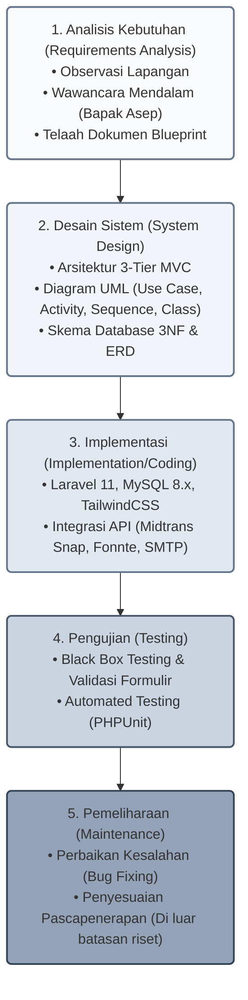
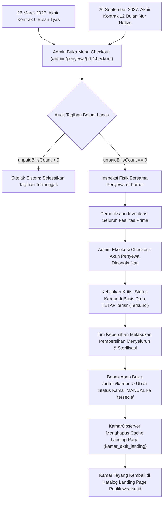

SISTEM INFORMASI MANAJEMEN KOST TERINTEGRASI PAYMENT GATEWAY PADA ASRI BOARDING HOUSE

SKRIPSI
Diajukan sebagai salah satu syarat untuk menyusun Tugas Akhir guna mencapai gelar Sarjana Komputer pada Program Studi Sistem Informasi Universitas Katolik Soegijapranata Semarang
 


Disusun oleh:
RAFIF ARSYA PRADIVA
NIM: 22.N4.0014


Kepada
PROGRAM STUDI SISTEM INFORMASI
FAKULTAS ILMU KOMPUTER
UNIVERSITAS KATOLIK SOEGIJAPRANATA
SEMARANG
2026 
SISTEM INFORMASI MANAJEMEN KOST TERINTEGRASI PAYMENT GATEWAY PADA ASRI BOARDING HOUSE


Skripsi
Diajukan sebagai salah satu syarat untuk menyusun Tugas Akhir guna mencapai gelar Sarjana Komputer pada Program Studi Sistem Informasi Universitas Katolik Soegijapranata Semarang


Disusun oleh:
RAFIF ARSYA PRADIVA
22.N4.0014

Disetujui oleh:
Dosen Pembimbing Skripsi


Ir. Andre Kurniawan Pamudji, S.Kom, M.Ling.
NPP: 058.1.1994.161

Kepada
PROGRAM STUDI SISTEM INFORMASI
FAKULTAS ILMU KOMPUTER
UNIVERSITAS KATOLIK SOEGIJAPRANATA
SEMARANG
2026 
## HALAMAN PERNYATAAN ORISINALITAS
Saya yang bertanda tangan di bawah ini:

Nama			: Rafif Arsya Pradiva
NIM			: 22.N4.0014
Program Studi		: Sistem Informasi
Fakultas		: Ilmu Komputer

menyatakan dengan sesungguhnya bahwa Skripsi dengan judul “Sistem Informasi Manajemen Kost Terintegrasi Payment Gateway pada Asri Boarding House” adalah benar-benar hasil karya saya sendiri, bukan merupakan jiplakan dari karya tulis orang lain, baik sebagian maupun keseluruhan. Pendapat, gagasan, atau temuan orang lain yang terdapat di dalam Skripsi ini telah dikutip dan dirujuk berdasarkan kaidah penulisan ilmiah yang berlaku.
Apabila di kemudian hari terbukti bahwa pernyataan ini tidak benar, saya bersedia menerima sanksi akademik sesuai dengan ketentuan yang berlaku di Universitas Katolik Soegijapranata Semarang.

Semarang, ........................ 2026
Yang menyatakan,

Materai
Rp10.000

Rafif Arsya Pradiva
NIM. 22.N4.0014
## HALAMAN PERNYATAAN BEBAS PLAGIASI
Saya yang bertanda tangan di bawah ini:

Nama			: Rafif Arsya Pradiva
NIM			: 22.N4.0014
Program Studi		: Sistem Informasi
Fakultas		: Ilmu Komputer

menyatakan dengan sesungguhnya bahwa Skripsi yang saya susun telah bebas dari unsur plagiasi. Seluruh sumber, baik berupa kutipan langsung maupun tidak langsung, yang berasal dari karya orang lain telah disebutkan sumbernya secara jujur dan dicantumkan dalam Daftar Pustaka sesuai dengan format penulisan ilmiah yang berlaku.
Apabila di kemudian hari ditemukan adanya pelanggaran terhadap etika keilmuan dalam karya ini, atau terdapat klaim dari pihak lain terhadap keaslian karya ini, saya bersedia mempertanggungjawabkannya dan menerima sanksi sesuai dengan peraturan yang berlaku.

Semarang, ........................ 2026
Yang menyatakan,

Rafif Arsya Pradiva
NIM. 22.N4.0014
## HALAMAN PENGESAHAN
Skripsi dengan judul:

SISTEM INFORMASI MANAJEMEN KOST TERINTEGRASI PAYMENT GATEWAY PADA ASRI BOARDING HOUSE

yang dipersiapkan dan disusun oleh:
Rafif Arsya Pradiva — NIM. 22.N4.0014

telah diperiksa dan disetujui oleh Dosen Pembimbing untuk diajukan dalam Seminar Skripsi pada Program Studi Sistem Informasi Fakultas Ilmu Komputer Universitas Katolik Soegijapranata Semarang.


Semarang, ........................ 2026

Telah diperiksa dan disetujui
Semarang, 13-07-2026

	Pembimbing 1	Pembimbing 2


	Ir. Andre Kurniawan Pamudji, S.Kom, M.Ling	NAMA
NPP. 581.2021.403					NPP. ….
## KATA PENGANTAR
Puji dan syukur senantiasa penulis panjatkan ke hadirat Tuhan Yang Maha Esa atas limpahan rahmat, petunjuk, dan karunia-Nya, sehingga penulisan skripsi yang berjudul “Sistem Informasi Manajemen Kost Terintegrasi Payment Gateway pada Asri Boarding House” ini dapat diselesaikan dengan baik. Penyusunan naskah skripsi ini merupakan salah satu syarat akademik guna menuntaskan studi Strata Satu (S-1) sekaligus meraih gelar Sarjana Komputer pada Program Studi Sistem Informasi, Fakultas Ilmu Komputer, Universitas Katolik Soegijapranata Semarang.

Terselesaikannya naskah ini tidak lepas dari bimbingan, dorongan, serta bantuan moril maupun materiil dari berbagai pihak. Dengan kerendahan hati, penulis menyampaikan rasa hormat dan terima kasih yang tulus kepada:
•	Rektor Universitas Katolik Soegijapranata Semarang beserta jajarannya, atas iklim akademik yang sehat dan kondusif sepanjang masa perkuliahan;
•	Dekan Fakultas Ilmu Komputer Universitas Katolik Soegijapranata Semarang, atas penyediaan sarana dan prasarana pendidikan yang bermutu;
•	Ketua Program Studi Sistem Informasi, atas bimbingan kurikulum, motivasi, serta kebijakan akademik yang senantiasa mendukung perkembangan studi mahasiswa;
•	Ir. Andre Kurniawan Pamudji, S.Kom, M.Ling., selaku Dosen Pembimbing Skripsi, atas kesabaran, masukan kritis, dan transfer keilmuan yang berharga dalam mengarahkan penulis dari awal penyusunan proposal hingga penyelesaian naskah akhir;
•	Bapak Asep, selaku pengelola operasional Asri Boarding House, atas kehangatan kerja sama, keterbukaan berbagi data riil lapangan, serta waktu yang diluangkan dalam proses observasi, wawancara, hingga pengujian sistem;
•	Keluarga tercinta, khususnya kedua orang tua, atas doa tulus yang terus mengalir, limpahan kasih sayang yang tak bertepi, serta pengorbanan moril maupun finansial yang menjadi pilar semangat utama penulis;
•	Rekan-rekan mahasiswa Program Studi Sistem Informasi angkatan 2022 dan para sahabat, atas solidaritas, ruang diskusi ilmiah, serta kebersamaan dalam menuntaskan masa studi.

Penulis menyadari bahwa tulisan ini masih membuka peluang bagi penyempurnaan lebih lanjut. Oleh sebab itu, setiap kritik, tinjauan kritis, dan saran yang konstruktif sangat penulis harapkan demi perbaikan karya ilmiah di masa yang akan datang. Semoga hasil perancangan sistem dan pembahasan dalam skripsi ini dapat memberikan kontribusi nyata bagi kajian keilmuan sistem informasi terapan serta membawa manfaat langsung bagi tata kelola operasional bisnis kos skala menengah.

Semarang, ........................ 2026
Penulis,

Rafif Arsya Pradiva
## HALAMAN PERNYATAAN PERSETUJUAN PUBLIKASI KARYA ILMIAH UNTUK KEPENTINGAN AKADEMIS
Sebagai sivitas akademika Universitas Katolik Soegijapranata Semarang, saya yang bertanda tangan di bawah ini:

Nama			: Rafif Arsya Pradiva
NIM			: 22.N4.0014
Program Studi		: Sistem Informasi
Fakultas		: Ilmu Komputer
Jenis Karya		: Skripsi

demi pengembangan ilmu pengetahuan, menyetujui untuk memberikan kepada Program Studi Sistem Informasi Fakultas Ilmu Komputer Universitas Katolik Soegijapranata Semarang Hak Bebas Royalti Noneksklusif (Non-exclusive Royalty-Free Right) atas karya ilmiah saya yang berjudul di atas beserta perangkat yang ada (jika diperlukan).
Dengan Hak Bebas Royalti Noneksklusif ini, Program Studi Sistem Informasi berhak menyimpan, mengalih-media/format-kan, merawat, dan memublikasikan karya ilmiah tersebut untuk kepentingan akademis tanpa perlu meminta izin dari saya selama tetap mencantumkan nama saya sebagai penulis/pencipta dan sebagai pemilik Hak Cipta. Hak Cipta atas karya ilmiah ini tetap berada pada penulis.
Demikian pernyataan ini saya buat dengan sebenarnya.

Dibuat di Semarang
Pada tanggal ........................ 2026
Yang menyatakan,

Rafif Arsya Pradiva
NIM. 22.N4.0014
## ABSTRAK
Rafif Arsya Pradiva. 22.N4.0014. SISTEM INFORMASI MANAJEMEN KOST TERINTEGRASI PAYMENT GATEWAY PADA ASRI BOARDING HOUSE (Studi Kasus: Asri Boarding House, Tembalang, Kota Semarang).
Asri Boarding House di kawasan Tembalang, Kota Semarang, menaungi 32 unit kamar dengan potensi perputaran dana sewa mencapai Rp28.500.000 setiap bulan. Praktik operasional konvensional yang mengandalkan pembukuan fisik dan koordinasi via pesan instan selama puluhan tahun memicu berbagai kendala, mulai dari risiko selisih rekapitulasi kas, sulitnya memverifikasi setoran tunai, keterlambatan pengingat jatuh tempo, hingga potensi pemesanan ganda (*double booking*). Penelitian ini bertujuan mengatasi persoalan tersebut melalui perancangan dan pembangunan Sistem Informasi Manajemen Kost berbasis framework Laravel 11 yang mengintegrasikan modul reservasi mandiri daring dan gerbang pembayaran digital. Pengembangan sistem menerapkan pendekatan *Research and Development* (R&D) dengan model sekuensial linier *Waterfall*, mencakup analisis kebutuhan, perancangan arsitektur, implementasi program, serta pengujian terstruktur. Sistem dibangun di atas arsitektur *3-tier* berpola MVC dan didukung basis data MySQL 8.x InnoDB yang dinormalisasi hingga tahap 3NF. Transaksi pembayaran non-tunai difasilitasi oleh Midtrans Snap API, dilengkapi perenderan kuitansi digital instan format A5 di sisi peramban menggunakan `html2pdf.js` (*zero server load*), pustaka Dompdf untuk rekapitulasi berkala pemilik, serta pengiriman notifikasi otomatis via Fonnte WhatsApp API dan SMTP. Logika operasional mencakup mesin penagihan otomatis berkala setiap awal bulan, penetapan denda flat 5% yang idempoten pada pergantian bulan kalender dengan mekanisme eskalasi ke kontak wali, alur kerja hibrida pendaftaran penghuni, serta fitur obrolan pra-pembayaran berbasis *AJAX polling*. Pengujian fungsionalitas sistem dilaksanakan melalui 60 skenario uji kotak hitam (*black box testing*) dan pengujian fitur otomatis PHPUnit (510 *tests passed*, 2.211 *assertions*) dengan tingkat kelulusan 100%, yang memvalidasi integritas transaksi, mekanisme penagihan, serta keandalan penguncian konkurensi terhadap kondisi balapan (*race condition*). Penerapan sistem pada lingkungan produksi langsung (*https://asriboardinghouse.weatso.id/*) dan evaluasi kegunaan kualitatif bersama pengelola senior menunjukkan peningkatan efisiensi administrasi, eliminasi risiko selisih kas, serta perolehan skor kepuasan 9,5 dari 10.
Kata kunci: sistem informasi manajemen kos, payment gateway, Laravel 11, reservasi online, penagihan otomatis, html2pdf.js
## ABSTRACT
Rafif Arsya Pradiva. 22.N4.0014. Design and Development of an Integrated Boarding House Management Information System with Payment Gateway in Asri Boarding House (Case Study: Asri Boarding House, Tembalang, Semarang City).
Asri Boarding House operates 32 rooms in Tembalang, Semarang, managing a potential monthly rental turnover of IDR 28,500,000. Decades of conventional operations relying on handwritten paper ledgers and fragmented messaging led to recurring administrative friction, including cash reconciliation discrepancies, tedious verification of manual receipts, delayed billing reminders, and room double-booking vulnerabilities. To address these operational challenges, this study developed a web-based Boarding House Management Information System utilizing the Laravel 11 framework, uniting an online self-service reservation portal with an automated digital payment gateway. The system was developed using a Research and Development (R&D) methodology guided by the linear-sequential Waterfall model across requirement analysis, architectural design, program implementation, and multi-tier verification. The application was constructed upon a 3-tier MVC architecture and powered by an InnoDB MySQL 8.x relational schema normalized to 3NF. Digital transactions are processed via the Midtrans Snap API, complemented by instant client-side A5 digital receipt rendering using html2pdf.js (zero server storage overhead), Dompdf for periodic owner reports, and automated multi-channel messaging via Fonnte WhatsApp API and SMTP. Core business logic features scheduled monthly invoicing executed on the first of each month, an idempotent calendar-based 5% flat late fee with tiered escalation to tenant guardians, hybrid walk-in/online registration, and pre-payment inquiry chat powered by AJAX polling. Functional verification demonstrated a 100% pass rate across 60 black-box test scenarios and comprehensive PHPUnit automated test suites (510 tests passed, 2,211 assertions), validating transactional integrity, billing logic, and concurrency controls against race conditions. Live production deployment at https://asriboardinghouse.weatso.id/ and qualitative usability evaluations with the senior property manager demonstrated substantial administrative efficiency gains, eliminated manual cash discrepancies, and achieved a 9.5 out of 10 user satisfaction rating.
Keywords: boarding house management information system, payment gateway, Laravel 11, online reservation, automated billing, html2pdf.js

 

## DAFTAR ISI
HALAMAN PERNYATAAN ORISINALITAS	ii
HALAMAN PERNYATAAN BEBAS PLAGIASI	iii
HALAMAN PENGESAHAN	iv
KATA PENGANTAR	v
HALAMAN PERNYATAAN PERSETUJUAN PUBLIKASI KARYA ILMIAH UNTUK KEPENTINGAN AKADEMIS	vii
ABSTRAK	viii
ABSTRACT	ix
DAFTAR ISI	x
DAFTAR TABEL	xii
DAFTAR GAMBAR	xiii
BAB I PENDAHULUAN	1
1.1 Latar Belakang	1
1.2 Rumusan Masalah	4
1.3 Tujuan Penelitian	5
1.4 Batasan Masalah	6
1.5 Manfaat Penelitian	8
1.5.1 Manfaat Teoretis	8
1.5.2 Manfaat Praktis	8
1.6 Sistematika Penulisan	9
BAB II  TINJAUAN PUSTAKA DAN LANDASAN TEORI	11
2.1 Landasan Teori	11
2.1.1 Sistem Informasi dan Sistem Informasi Manajemen	11
2.1.2 Sistem Berbasis Web dan E-Commerce Model B2C	11
2.1.3 Sistem Manajemen Basis Data Relasional dan Normalisasi 3NF	12
2.1.4 Arsitektur 3-Tier dan Model-View-Controller pada Laravel 11	12
2.1.5 Antarmuka Pemrograman Aplikasi (API) Eksternal: Midtrans dan Fonnte	13
2.1.6 Penjadwalan Tugas, Mesin Penagihan Otomatis, dan Cron Job	13
2.1.7 Teori Interaktivitas UI/UX: Neo-Brutalism dan WCAG 2.1	14
2.1.8 Keamanan Web dan Integritas Data	14
2.1.9 Concurrency Control dan Mekanisme Penguncian Basis Data	15
2.2 Penelitian Terdahulu (State of the Art)	15
2.3 Kerangka Pemikiran	17
BAB III  METODOLOGI PENELITIAN	20
3.1 Jenis Penelitian	20
3.2 Teknik Pengumpulan Data	20
3.3 Metode Pengembangan Sistem	21


BAB IV HASIL DAN PEMBAHASAN	22
4.1 Perancangan Sistem	22
4.1.1 Use Case Diagram	22
4.1.2 Activity Diagram	24
4.1.3 Flowchart Diagram	27
4.1.4 Sequence Diagram	29
4.1.5 Entity Relationship Diagram (ERD)	31
4.1.6 Skenario Diagram Alur Sistem	32
4.2 Implementasi Sistem	33
4.2.1 Lingkungan Implementasi	33
4.2.2 Perancangan Arsitektur Aplikasi	34
4.2.3 Implementasi Basis Data	35
4.2.4 Implementasi Autentikasi dan Hak Akses	38
4.2.5 Implementasi Fitur Calon Penyewa	39
4.2.6 Implementasi Fitur Penyewa Aktif	40
4.2.7 Implementasi Fitur Admin	41
4.2.8 Implementasi Integrasi Payment Gateway	42
4.2.9 Implementasi Notifikasi Email SMTP	43
4.2.10 Implementasi Notifikasi WhatsApp FONNTE	44
4.3 Tampilan Antarmuka Sistem	45
4.3.1 Antarmuka Calon Penyewa	45
4.3.2 Antarmuka Penyewa Aktif	47
4.3.3 Antarmuka Admin	48
4.4 Hasil Deployment	50
4.4.1 Skrip Kompilasi Bundel Aset Produksi	50
4.4.2 Konfigurasi Peladen Web LiteSpeed/Apache	51
4.4.3 Konfigurasi Penjadwal Tugas Peladen (Cron Job)	52
4.4.4 Perintah Optimasi Kinerja Produksi Laravel	53
4.4.5 Konfigurasi Variabel Lingkungan Produksi	54
4.5 Hasil Pengujian Sistem	56
4.5.1 Hasil Black Box Testing	56
4.5.2 Hasil Pengujian Hak Akses	62
4.5.3 Hasil Pengujian Transaksi Midtrans Sandbox (BCA VA)	64
4.5.4 Hasil Pengujian Hak Akses Live	66
4.6 Hasil Wawancara dengan Penjaga Kost	67
4.7 Pembahasan	72
BAB V KESIMPULAN DAN SARAN	74
5.1 Kesimpulan	74
5.2 Saran	75
DAFTAR PUSTAKA	77

## DAFTAR TABEL
Tabel 2.1  Perbandingan Penelitian Terdahulu (State of the Art)	16
Tabel 4.1  Matriks Pemetaan Status Transaksional dan Transisi State Siklus Hidup Sistem	33
Tabel 4.2  Struktur dan Fungsi 22 Tabel Basis Data Sistem Asri Boarding House	35
Tabel 4.3  Matriks Hasil Pengujian Fungsionalitas Kotak Hitam (60 Butir Skenario Uji)	56
Tabel 4.4  Matriks Pengujian Hak Akses dan Isolasi Peran Pengguna	62
Tabel 4.5  Matriks Pengujian Transaksi Midtrans Snap Saluran Bank BCA Virtual Account	64
Tabel 4.6  Hasil Pengujian Parameter Keamanan dan Hak Akses Lingkungan Live	66
Tabel 4.7  Daftar Pertanyaan dan Respon Wawancara dengan Penjaga Kost (Bapak Asep)	68

## DAFTAR GAMBAR
Gambar 2.1  Kerangka Pemikiran Penelitian	18
Gambar 3.1  Diagram Model Waterfall Pengembangan Sistem	20
Gambar 4.1  Use Case Diagram Terpadu Sistem Asri Boarding House	22
Gambar 4.2  Activity Diagram Tiga Proses Kritis Sistem Asri Boarding House	24
Gambar 4.3  Flowchart Mekanisme Billing Engine dan Penanganan Keterlambatan Massal	27
Gambar 4.4  Sequence Diagram Alur Transaksional Utama Sistem Asri Boarding House	29
Gambar 4.5  Entity Relationship Diagram (ERD) Skema Basis Data 22 Tabel	31
Gambar 4.6  Skenario Diagram Siklus Hidup Transaksional Penyewa dan Operasional Administrator	32
Gambar 4.7  Antarmuka Katalog Kamar Publik Neo-Brutalisme	45
Gambar 4.8  Workspace Stepper Alur Reservasi Calon Penyewa	46
Gambar 4.9  Portal Invoice dan Kuitansi Digital Penyewa	47
Gambar 4.10  Dasbor Administrasi Keuangan Administrator	48
Gambar 4.11  Dokumentasi Sesi Wawancara Bersama Penjaga Kost (Bapak Asep)	70

## BAB I PENDAHULUAN
## 1.1 Latar Belakang
Lanskap industri jasa akomodasi sewa skala mikro dan menengah di sekitar kawasan perguruan tinggi kini menghadapi perubahan ekspektasi konsumen yang sangat nyata. Kelompok mahasiswa bersama orang tua atau wali mereka—yang kian terbiasa beraktivitas dalam ekosistem serba digital—mengharapkan keterbukaan informasi hunian, kepastian ketersediaan unit kamar secara *real-time*, serta fleksibilitas transaksi non-tunai yang dapat diselesaikan kapan saja tanpa kendala jarak fisik [1]. Tuntutan kenyamanan ini mendorong pengelola rumah kos untuk meninggalkan tata kelola konvensional. Ketergantungan menahun pada buku kas fisik dan komunikasi via aplikasi pesan instan pribadi kian terbukti rentan memicu kekeliruan administratif, kehilangan berkas, hingga selisih perhitungan kas yang merugikan.

Kehadiran teknologi properti (*property technology* atau proptech) menawarkan peluang strategis untuk menyederhanakan tata kelola hunian sewa, mulai dari penyediaan etalase kamar interaktif, modul pemesanan mandiri, hingga otomasi pembukuan transaksi. Di kawasan pendidikan tinggi, perputaran penghuni berlangsung dinamis mengikuti kalender akademik, ditandai oleh variasi tipe kamar, perbedaan rentang waktu sewa, serta rotasi penyewa yang cepat. Ketika pengelola masih bertumpu pada catatan manual yang terpisah dari saluran komunikasi penghuni, gesekan operasional harian sulit dihindarkan. Keterlambatan penagihan bulanan, ketidakjelasan status pelunasan, hingga silang pendapat mengenai bukti pembayaran menjadi pemandangan rutin yang menyita energi operasional.

Dalam kerangka teoritis rekayasa perangkat lunak, sistem informasi manajemen berfungsi memadukan komponen perangkat keras, perangkat lunak, basis data terstruktur, prosedur operasional, dan pengguna guna mengolah data mentah menjadi informasi andal bagi pengambilan keputusan manajerial [2]. Penerapan sistem ini pada skala operasional rumah kos berperan mengonsolidasikan data fisik kamar, biodata penghuni, riwayat tagihan, dan mutasi arus kas ke dalam satu gerbang terpadu. Konsolidasi semacam ini memungkinkan otomatisasi proses rutin, penegakan aturan bisnis secara konsisten, serta terwujudnya transparansi pembukuan yang dilengkapi jejak audit (*audit trail*) digital.

Urgensi pembaruan sistem tersebut terlihat nyata pada Asri Boarding House, usaha akomodasi hunian kos yang berlokasi di Jalan Maera Sari Nomor 1/Nomor 12, Tembalang, Kota Semarang (Kode Pos 50275), di bawah pengelolaan langsung Bapak Asep (usia 48 tahun). Properti berlantai dua ini mengoperasikan 32 unit kamar yang terbagi ke dalam tiga varian: tipe VIP sebanyak 6 unit (Rp1.400.000 per bulan), tipe Deluxe sebanyak 3 unit (Rp950.000 per bulan), dan tipe Standar sebanyak 23 unit (Rp750.000 per bulan). Dalam kondisi tingkat hunian penuh (*full occupancy*), potensi pendapatan kotor yang berputar mencapai Rp28.500.000 per bulan. Skala perputaran finansial ini menuntut mekanisme tata kelola yang tertib, transparan, dan terotomatisasi guna mencegah kebocoran kas serta menjamin kelancaran arus kas operasional.

Observasi lapangan dan wawancara mendalam bersama pengelola mengungkap bahwa rutinitas penagihan sewa bulanan masih dijalankan dengan membuka buku catatan satu per satu, kemudian mengirimkan pesan penagihan manual ke masing-masing nomor penghuni. Alur kerja manual ini bukan saja memakan waktu kerja pengelola, melainkan juga kerap menyebabkan pesan peringatan terlewat. Akibatnya, arus pelunasan sewa tersendat dan pengawasan tunggakan menjadi bias. Selain itu, belum ada skema penanganan keterlambatan yang terstruktur; teguran hanya disampaikan ke mahasiswa tanpa melibatkan kontak orang tua atau wali, padahal sebagian besar mahasiswa mengandalkan kiriman dana berkala dari keluarga sebagai sumber pembayaran sewa.

Kerapuhan tata kelola manual kian terlihat pada pencatatan transaksi masuk yang mengandalkan lembaran nota kuitansi fisik. Praktik ini rawan terhadap kerusakan fisik kertas, kesalahan hitung rekapitulasi, dan ketiadaan arsip digital yang dapat diverifikasi sewaktu-waktu saat terjadi perselisihan tanggal pelunasan. Kondisi tersebut diperparah oleh absennya sinkronisasi status kamar secara langsung (*real-time synchronization*). Pengelola harus berulang kali mengecek fisik kamar di lokasi guna memastikan keterisian unit, sehingga membuka celah terjadinya pemesanan ganda (*double booking*) ketika ada beberapa calon penghuni yang berminat pada kamar yang sama secara bersamaan.

Dari sudut pandang calon penyewa, pola pemasaran konvensional mengharuskan mereka datang langsung ke lokasi untuk survei fisik dan bertransaksi tunai. Prosedur ini memberatkan calon mahasiswa asal luar daerah yang membutuhkan kepastian kamar sebelum menempuh perjalanan ke Semarang. Sementara itu, calon penyewa kerap memerlukan sarana tanya-jawab langsung mengenai rincian fasilitas sebelum menyetorkan uang muka. Ketiadaan kanal komunikasi yang terhubung ke dokumen reservasi menyebabkan pesan tertumpuk dalam obrolan pribadi pengelola, yang berujung pada hilangnya potensi penyewa potensial.

Kelemahan pencatatan juga berdampak langsung pada evaluasi kesehatan finansial bisnis kos. Pemilik properti kesulitan memperoleh laporan laba-rugi berkala karena biaya operasional rutin—seperti pembelian token listrik, iuran kebersihan, air, dan pemeliharaan sarana—hanya dicatat pada potongan nota terpisah di laci meja pengelola. Diperlukan waktu antara 3 hingga 5 hari kerja setiap akhir bulan bagi pengelola untuk merekapitulasi seluruh pengeluaran secara manual menggunakan kalkulator. Ketiadaan data historis okupansi dan pola pembayaran membuat keputusan strategis, seperti penjadwalan renovasi unit dan penyesuaian tarif kamar, lebih banyak disandarkan pada perkiraan intuitif alih-alih data faktual.

Sejumlah penelitian terdahulu telah berupaya mengembangkan aplikasi pengelolaan hunian kos berbasis web, namun ruang lingkupnya mayoritas baru menyentuh penyediaan katalog statis, formulir pendaftaran dasar, dan pencatatan penyewa konvensional [3], [4], [5]. Belum banyak riset yang mengintegrasikan gerbang pembayaran (*payment gateway*) secara terprogram dengan aturan penagihan periodik, denda flat kalender yang idempoten, serta pengingat tunggakan berjenjang ke kontak wali. Sebagian besar aplikasi yang ada juga belum mengantisipasi kondisi balapan (*race condition*) pada perebutan kamar secara bersamaan, belum menyediakan sarana percakapan pra-pembayaran ketika reservasi masih menggantung (*pending*), serta belum menyatukan alur reservasi mandiri daring dengan alur pendaftaran tamu datang langsung (*walk-in*) ke dalam satu basis data yang konsisten. Ketiadaan integrasi menyeluruh inilah yang menjadi celah penelitian (*research gap*) utama dalam kajian ini.

Guna menjawab rangkaian tantangan tersebut, penelitian ini merancang dan membangun Sistem Informasi Manajemen Kost Terintegrasi Payment Gateway dan Modul Reservasi Online pada Asri Boarding House berbasis framework Laravel 11, dengan berpijak pada dokumen *Blueprint Projek Website Asri Boarding House*. Solusi perangkat lunak ini dirancang untuk menerbitkan tagihan bulanan secara otomatis setiap tanggal 1 dengan batas jatuh tempo seragam pada tanggal 10, memberlakukan denda keterlambatan flat 5% yang idempoten pada pergantian bulan kalender melalui perlindungan *Idempotency Guard*, mengintegrasikan transaksi non-tunai Midtrans Snap serta opsi konfirmasi kas oleh pengelola, mendistribusikan notifikasi otomatis via Fonnte WhatsApp API dan SMTP, serta menyediakan portal reservasi daring berfitur Google OAuth dan kanal interaksi berbasis *AJAX polling*. Melalui arsitektur tiga lapis (*3-tier*) berpola *Model-View-Controller* (MVC) yang diperkuat *Service Layer*, sistem diharapkan mampu mentransformasi tata kelola Asri Boarding House menjadi tertib, transparan, dan berkelanjutan.

## 1.2 Rumusan Masalah
Berdasarkan identifikasi masalah yang telah diuraikan pada latar belakang, rumusan masalah dalam penelitian ini dirumuskan sebagai berikut:
1.	Bagaimana menganalisis kebutuhan fungsional dan non-fungsional Sistem Informasi Manajemen Kost pada Asri Boarding House berdasarkan kondisi operasional lapangan dan aturan bisnis riil?
2.	Bagaimana merancang arsitektur tiga lapis (*3-tier*) berpola MVC pada framework Laravel 11 serta skema basis data relasional ternormalisasi (Bentuk Normal Ketiga/3NF) yang mengintegrasikan pengelolaan kamar, data penghuni, reservasi, dan transaksi pembayaran?
3.	Bagaimana mengimplementasikan mesin penagihan otomatis (*automated billing engine*) dengan aturan denda keterlambatan flat kalender yang idempoten dan eskalasi notifikasi berjenjang dari penyewa hingga orang tua/wali?
4.	Bagaimana mengintegrasikan gerbang pembayaran Midtrans Snap dan notifikasi multi-saluran (Fonnte WhatsApp API serta surel SMTP) secara aman, terpadu, dan idempoten ke dalam alur kerja sistem?
5.	Bagaimana mencegah kondisi balapan (*race condition*) yang memicu risiko pemesanan ganda (*double booking*) sekaligus memelihara konsistensi status ketersediaan kamar pada alur kerja hibrida antara reservasi daring dan pendaftaran langsung?
6.	Bagaimana merancang antarmuka publik bergaya Neo-Brutalism yang memenuhi kriteria aksesibilitas Web Content Accessibility Guidelines (WCAG) 2.1—dengan target sentuh minimum 44 piksel dan kontras visual yang jelas—serta menguji kelayakan dan keandalan sistem secara komprehensif?

## 1.3 Tujuan Penelitian
Selaras dengan rumusan masalah yang ditetapkan, tujuan yang hendak dicapai melalui penelitian ini adalah:
1.	Menganalisis kebutuhan fungsional dan non-fungsional Sistem Informasi Manajemen Kost Asri Boarding House melalui triangulasi data dari observasi langsung, wawancara mendalam, dan telaah dokumen blueprint.
2.	Merancang arsitektur perangkat lunak *3-tier* MVC pada framework Laravel 11 serta skema basis data relasional 3NF yang menjamin integritas referensial data antarentitas.
3.	Membangun mesin penagihan otomatis yang mampu menerbitkan tagihan sewa berkala, menerapkan sanksi denda flat 5% yang idempoten pada pergantian bulan kalender, serta mengirimkan pengingat eskalatif ke kontak wali secara terprogram.
4.	Mengintegrasikan gerbang pembayaran Midtrans Snap serta layanan notifikasi WhatsApp dan surel secara aman, idempoten, dan andal dalam mendukung alur transaksi digital.
5.	Menerapkan mekanisme penguncian konkurensi (*concurrency control*) guna mencegah insiden pemesanan ganda (*double booking*) serta menjaga ketepatan status kamar pada integrasi alur pendaftaran daring dan konvensional.
6.	Mengimplementasikan desain antarmuka publik bergaya Neo-Brutalism yang ramah aksesibilitas sesuai panduan WCAG 2.1, serta menguji keandalan fungsional sistem melalui uji kotak hitam (*black box testing*) dan pengujian fitur terotomatisasi (*automated test suite*).

## 1.4 Batasan Masalah
Guna menjaga fokus kajian agar terarah dan tuntas dalam kurun waktu penelitian yang ditentukan, batasan masalah dirumuskan ke dalam ruang lingkup berikut:

A. Ruang Lingkup Fungsional:
•	Modul Administrator: mencakup pemeliharaan data master kamar (penambahan, pembaruan, penghapusan lunak, unggah foto unit, dan pengaturan status fisik kamar), pengelolaan biodata penghuni (lengkap dengan data wali, pencatatan uang deposit, tipe sewa, dan durasi kontrak), konfirmasi penerimaan kas tunai, administrasi tagihan berkala, pemantauan reservasi daring, pencatatan pengeluaran operasional dan pembuatan laporan keuangan (ekspor PDF/Excel), pemantauan log notifikasi keluar, serta visualisasi dasbor ringkasan kinerja hunian.
•	Modul Penyewa (Portal Mandiri): mencakup dasbor informasi kontrak dan unit kamar, akses rincian tagihan sewa aktif, pelunasan daring via Midtrans Snap, arsip riwayat transaksi, pengunduhan bukti pelunasan kuitansi PDF format A5, pelacakan status reservasi, formulir pelaporan keluhan fasilitas berfoto, serta fitur obrolan pra-pembayaran bersama pengelola saat status pemesanan masih *pending*.
•	Modul Publik (Katalog & Reservasi): mencakup halaman utama (*landing page*) dengan etalase kamar dinamis, halaman detail fasilitas kamar beserta formulir pemesanan terintegrasi, autentikasi cepat akun Google melalui protokol OAuth, tombol aksi melayang (*floating CTA*) WhatsApp, kalkulasi biaya sewa otomatis berbasis AJAX, informasi profil properti, galeri fasilitas, penayangan video peninjauan kamar (*room tour*) via YouTube Embed, serta tampilan penawaran paket sewa fleksibel (harian, mingguan, bulanan).
•	Modul Otomasi dan Integrasi: mencakup penjadwalan tugas peladen (*cron job*) untuk penerbitan tagihan berkala setiap tanggal 1 awal bulan, evaluasi denda keterlambatan kalender, antrean tugas latar belakang (*queue job*) untuk distribusi notifikasi, integrasi Midtrans Snap API v2 (khusus saluran Bank BCA Virtual Account), Fonnte WhatsApp API, SMTP mailer, Laravel Socialite, pustaka Dompdf untuk rekap manajerial, pustaka `html2pdf.js` untuk perenderan kuitansi instan di sisi peramban, serta visualisasi grafik ringkasan menggunakan Chart.js.

B. Batasan Operasional dan Platform:
•	Objek penelitian tunggal: sistem dibangun khusus melayani tata kelola operasional Asri Boarding House di Tembalang, Kota Semarang dengan daya tampung 32 unit kamar; ekspansi multi-cabang diposisikan sebagai rekomendasi masa depan.
•	Platform web responsif: sistem dikembangkan berbasis web dengan pendekatan adaptif terhadap peramban perangkat bergerak (*mobile-responsive*), bukan dalam bentuk aplikasi seluler mandiri (*native mobile app*).
•	Mekanisme pembayaran: pembayaran digital diproses melalui Midtrans Snap; adapun transaksi kas tunai diverifikasi langsung oleh administrator tanpa pemanfaatan perangkat keras perbankan tambahan (seperti mesin EDC).
•	Tata kelola deposit pasif: pencatatan dana jaminan fasilitas (*security deposit*) tersimpan dalam basis data, sedangkan pemotongan atau pengembaliannya saat penyewa keluar (*checkout*) dilakukan manual tanpa mekanisme *auto-refund* ke rekening bank.
•	Protokol isolasi kamar pasca-checkout: sistem tidak langsung melepas status kamar menjadi *tersedia* saat kontrak berakhir; kamar tetap berstatus *terisi* (terkunci) hingga pengelola selesai memeriksa kebersihan serta sarana fisik dan mengubah statusnya secara manual.
•	Kanal komunikasi: otomasi notifikasi disalurkan melalui WhatsApp dan surel, tanpa menggunakan layanan SMS gateway komersial maupun notifikasi *push* peramban.
•	Pencatatan keuangan: modul keuangan mencatat arus kas operasional (penerimaan sewa, pengeluaran rutin properti, dan laba operasional kas), belum mencakup siklus akuntansi akrual penuh, neraca saldo, maupun modul kalkulasi perpajakan.
•	Linimasa riset: ruang lingkup penelitian berfokus pada tahapan analisis, perancangan, implementasi, dan pengujian mutu sistem; pemeliharaan jangka panjang di luar durasi enam bulan penelitian diposisikan di luar ruang lingkup.
•	Keamanan data: integritas relasi data finansial dijaga melalui penerapan *soft delete* pada tabel transaksional serta kebijakan foreign key `ON DELETE RESTRICT` guna mencegah pemotongan rekaman data historis.
•	Evaluasi sistem: pengujian fungsionalitas mencakup 60 skenario uji kotak hitam (*black box testing*), pengujian isolasi hak akses peran (RBAC), simulasi transaksi sandbox BCA Virtual Account, pengujian keamanan live HTTPS, pengujian penerimaan pengguna secara kualitatif (*Side-by-Side Usability Testing*) bersama pengelola operasional senior, serta pengujian logika fitur otomatis berbasis PHPUnit.

## 1.5 Manfaat Penelitian
### 1.5.1 Manfaat Teoretis
Secara teoretis, hasil penelitian ini diharapkan dapat memperkaya khazanah keilmuan sistem informasi terapan, khususnya mengenai integrasi gerbang pembayaran digital pada model perdagangan elektronik *Business-to-Consumer* (B2C) properti sewa mikro. Kajian ini mendokumentasikan implementasi konkret mesin penagihan otomatis berkebijakan denda kalender yang idempoten, teknik mitigasi kondisi balapan (*race condition*) pada konkurensi alokasi kamar, serta penerapan arsitektur *3-tier* MVC yang diperkuat *Service Layer* dan mekanisme *Event-Listener-Observer* pada framework Laravel 11.

### 1.5.2 Manfaat Praktis
Secara praktis, penelitian ini memberikan kontribusi nyata bagi para pemangku kepentingan:
1)	Bagi Pengelola dan Pemilik Asri Boarding House (Bapak Asep): menyederhanakan pemantauan kamar dan rekapitulasi keuangan, memangkas durasi pembukuan kas dari hitungan hari menjadi instan, mengeliminasi risiko selisih kas berkat pencatatan digital yang transparan, serta memperluas jangkauan calon penyewa dari luar daerah.
2)	Bagi Penghuni dan Calon Penyewa: mempermudah pencarian informasi ketersediaan kamar, membuka kemudahan reservasi mandiri dari mana saja, memberikan kemudahan transaksi non-tunai yang aman, menyajikan akses bukti pembayaran kuitansi digital instan, serta menyediakan saluran aduan dan obrolan yang responsif.
3)	Bagi Civitas Akademika: menjadi referensi rancang bangun sistem informasi terapan yang mengintegrasikan gerbang pembayaran dan otomasi pesan instan, yang dapat diadaptasi pada penelitian sistem manajemen serupa di masa mendatang.

## 1.6 Sistematika Penulisan
Struktur penulisan skripsi ini disusun ke dalam lima bab utama yang saling berhubungan secara logis:
BAB I PENDAHULUAN menyajikan konteks operasional dan latar belakang penelitian, perumusan masalah, tujuan penelitian, batasan masalah fungsional maupun operasional, manfaat teoretis dan praktis, serta sistematika pengorganisasian naskah.
BAB II TINJAUAN PUSTAKA DAN LANDASAN TEORI mengulas konsep-konsep ilmiah yang melandasi rancang bangun sistem—mencakup sistem informasi manajemen, arsitektur web modern dan pola MVC pada Laravel 11, normalisasi relasional 3NF, integrasi gerbang pembayaran digital dan API pesan instan, prinsip *concurrency control*, keamanan aplikasi web, serta standar aksesibilitas antarmuka—yang dirangkaikan dengan sintesis komparatif penelitian terdahulu (*state of the art*) dan kerangka pemikiran penelitian.
BAB III METODOLOGI PENELITIAN memaparkan pendekatan penelitian *Research and Development* (R&D), teknik triangulasi pengumpulan data (observasi lapangan, wawancara mendalam pengelola, dan telaah dokumen blueprint), serta penjabaran setiap tahapan rekayasa perangkat lunak menggunakan model *Waterfall*.
BAB IV HASIL DAN PEMBAHASAN menguraikan luaran perancangan sistem (pemodelan diagram UML terpadu dan skema ERD 22 tabel), implementasi teknis lapisan arsitektur perangkat lunak dan basis data, visualisasi antarmuka pengguna bergaya Neo-Brutalism, hasil konfigurasi deployment produksi, pembuktian keandalan melalui 60 skenario uji kotak hitam, pengujian hak akses peran, simulasi transaksi BCA Virtual Account, evaluasi kualitatif bersama pengelola senior, serta pembahasan analitis atas temuan penelitian.
BAB V KESIMPULAN DAN SARAN merangkum kesimpulan pokok yang menjawab rumusan masalah secara komprehensif berdasarkan bukti implementasi dan pengujian, serta menyajikan rekomendasi saran konstruktif sebagai peta jalan pengembangan sistem di masa mendatang.

## BAB II TINJAUAN PUSTAKA DAN LANDASAN TEORI
## 2.1 Landasan Teori
### 2.1.1 Sistem Informasi dan Sistem Informasi Manajemen
Sistem informasi merupakan kesatuan terintegrasi dari komponen perangkat keras (*hardware*), perangkat lunak (*software*), infrastruktur telekomunikasi, data terstruktur, prosedur operasional, dan sumber daya manusia yang berkolaborasi untuk menghimpun, memproses, menyimpan, serta mendistribusikan data mentah menjadi informasi bermakna guna menunjang pengambilan keputusan dan pengendalian organisasi [2]. Dalam ranah manajerial, Sistem Informasi Manajemen (*Management Information System* atau SIM) memegang posisi strategis sebagai instrumen penyedia ikhtisar data periodik, memfasilitasi pengawasan operasional, serta memandu manajemen dalam merumuskan kebijakan yang adaptif.

Pada skala operasional Asri Boarding House, prinsip-prinsip sistem informasi manajemen diterapkan sebagai pusat kendali terpadu (*single source of truth*). Sistem ini mengonsolidasikan data master 32 unit kamar, profil penyewa, jadwal penagihan berkala, serta mutasi arus kas yang sebelumnya tercatat secara terpisah pada buku besar kertas ke dalam basis data relasional terpusat. Melalui konsolidasi ini, pemilik dan pengelola dapat memantau pergerakan finansial, meninjau tingkat hunian (*occupancy rate*), dan memastikan ketertiban transaksi secara akurat dan transparan setiap saat.

### 2.1.2 Sistem Berbasis Web dan E-Commerce Model B2C
Aplikasi berbasis web (*web-based application*) beroperasi di atas paradigma arsitektur klien-peladen (*client-server*) dan diakses secara fleksibel melalui peramban web modern tanpa menuntut pengguna melakukan instalasi perangkat lunak tambahan. Dalam konteks sistem transaksi komersial daring, pemisahan lapisan kode menjadi kebutuhan mendasar agar perangkat lunak memiliki modularitas tinggi dan kemudahan pemeliharaan (*maintainability*). Pola rancangan *Model-View-Controller* (MVC) telah terbukti andal dalam memisahkan lapisan representasi data, logika presentasi antarmuka, dan pengendali proses bisnis transaksi perdagangan elektronik [6].

Model bisnis *Business-to-Consumer* (B2C) menitikberatkan pada interaksi transaksional digital langsung antara penyedia layanan selaku pelaku usaha dan masyarakat umum sebagai konsumen akhir. Asri Boarding House mengadopsi model B2C ini secara mandiri melalui platform web: pengelola berinteraksi langsung dengan calon penghuni maupun penyewa aktif melalui etalase kamar interaktif, formulir reservasi mandiri, dan gerbang pembayaran elektronik tanpa bergantung pada pihak ketiga (*Online Travel Agent* atau agregator sewa) yang mengenakan beban komisi per transaksi.

### 2.1.3 Sistem Manajemen Basis Data Relasional dan Normalisasi 3NF
Sistem Manajemen Basis Data Relasional (*Relational Database Management System* atau RDBMS) mengelola persistensi data dalam bentuk tabel-tabel berelasi yang diproteksi batasan kunci utama (*primary key*) dan kunci asing (*foreign key*). Penelitian ini menetapkan MySQL versi 8.0 dengan mesin penyimpanan (*storage engine*) InnoDB sebagai basis data utama karena keunggulannya dalam menjamin integritas referensial, memenuhi karakteristik transaksi ACID (*Atomicity, Consistency, Isolation, Durability*), serta mendukung mekanisme penguncian baris data (*row-level locking*).

Untuk mencegah anomali data, perancangan skema dilakukan melalui proses normalisasi hingga memenuhi kriteria Bentuk Normal Ketiga (*Third Normal Form* atau 3NF). Penerapan 3NF mensyaratkan bahwa seluruh atribut non-kunci wajib bergantung penuh secara langsung pada kunci utama (*fully functionally dependent*) tanpa menyisakan adanya ketergantungan transitif antarkolom. Melalui skema 3NF ini, entitas transaksi keuangan, data kamar, serta identitas penghuni Asri Boarding House terbebas dari anomali penyisipan (*insertion anomaly*), pembaruan (*update anomaly*), maupun penghapusan data (*deletion anomaly*).

### 2.1.4 Arsitektur 3-Tier dan Model-View-Controller pada Laravel 11
Arsitektur tiga lapis (*3-Tier Architecture*) membagi struktur aplikasi ke dalam tiga lapisan terisolasi: lapisan presentasi (*Presentation Tier*), lapisan logika bisnis (*Application/Logic Tier*), dan lapisan persistensi data (*Data Tier*). Pemisahan tegas ini memastikan perubahan pada antarmuka pengguna tidak mengganggu konsistensi basis data, begitu pula sebaliknya. Pola MVC pada framework Laravel 11 (berjalan pada lingkungan PHP 8.2) mengimplementasikan arsitektur ini secara elegan: komponen Model mengelola data melalui *Eloquent Object-Relational Mapping* (ORM), komponen View mengendalikan perenderan antarmuka menggunakan mesin templat Blade, dan komponen Controller mengarahkan siklus permintaan (*request*) serta respon (*response*) HTTP.

Guna mencegah penumpukan logika bisnis yang berlebihan pada lapisan pengontrol (*fat controller anti-pattern*), arsitektur sistem pada penelitian ini diperkuat dengan lapisan layanan khusus (*Service Layer*). Modul-modul kritis seperti `BillingService`, `MidtransService`, `ReservasiService`, `FonnteService`, dan `TransisiPenyewaService` diisolasi ke dalam kelas tersendiri. Pola ini dipadukan dengan arsitektur *Event-Listener-Observer* guna memproses pekerjaan asinkron dan otomatisasi secara modular dan teratur.

### 2.1.5 Antarmuka Pemrograman Aplikasi (API) Eksternal: Midtrans dan Fonnte
Antarmuka Pemrograman Aplikasi (*Application Programming Interface* atau API) menetapkan protokol pertukaran data terstandarisasi yang memungkinkan perangkat lunak berkomunikasi secara aman dengan layanan komputasi eksternal. Layanan gerbang pembayaran (*payment gateway*) Midtrans menyediakan antarmuka REST API Snap yang memfasilitasi penerimaan pembayaran non-tunai secara otomatis, khususnya saluran Bank Central Asia Virtual Account (BCA VA) [7], [8]. Mekanisme integrasi berjalan melalui pembentukan *snap token* dari peladen aplikasi, penayangan pop-up pembayaran di sisi peramban menggunakan Snap.js, serta penangkapan notifikasi status pembayaran (*webhook callback*) yang diverifikasi keabsahannya menggunakan algoritma penandatanganan digital SHA-512.

Sebagai pelengkap, Fonnte WhatsApp API dimanfaatkan sebagai jembatan transmisi pesan instan otomatis dari peladen menuju nomor telepon penyewa maupun orang tua/wali. Layanan ini difungsikan untuk mendistribusikan tagihan sewa bulanan, mengirimkan pengingat tenggat waktu secara persuasif, serta meneruskan pemberitahuan denda keterlambatan secara terjadwal tanpa membebani pekerjaan manual pengelola.

### 2.1.6 Penjadwalan Tugas, Mesin Penagihan Otomatis, dan Cron Job
Penjadwalan tugas (*task scheduling*) memungkinkan peladen mengeksekusi serangkaian skrip dan perintah kerja secara berkala tanpa memerlukan intervensi manusia. Pada lingkungan produksi Linux, utilitas *cron job* dikonfigurasi untuk memicu penjadwal bawaan Laravel (`schedule:run`) setiap menit, yang selanjutnya mengeksekusi perintah kerja sesuai waktu yang telah diprogramkan.

Mesin penagihan otomatis (*automated billing engine*) yang dibangun dalam penelitian ini menerbitkan tagihan sewa bulanan bagi seluruh penghuni aktif bertipe sewa bulanan secara serentak setiap tanggal 1 awal bulan pukul 00:05 WIB dengan batas jatuh tempo seragam pada tanggal 10. Evaluasi harian dijalankan untuk memantau keterlambatan dan memicu eskalasi notifikasi. Duplikasi tagihan dicegah secara mutlak pada tingkat basis data melalui indeks unik gabungan (*composite unique constraint*) pada kolom `(penyewa_id, periode_bulan, periode_tahun)`.

### 2.1.7 Teori Interaktivitas UI/UX: Neo-Brutalism dan WCAG 2.1
Perancangan antarmuka pengguna (*User Interface*) dan pengalaman interaksi (*User Experience*) memegang peranan vital dalam mewujudkan sistem yang mudah dipelajari dan nyaman dioperasikan. Penelitian ini mengadopsi bahasa visual Neo-Brutalism secara konsisten pada portal publik, dasbor penyewa, hingga panel kontrol administrator. Ciri khas Neo-Brutalism tecermin pada pemilihan tipografi yang tegas (*Space Grotesk*), garis tepi hitam tebal berukuran 4 piksel, bayangan tegas tanpa gradasi halus (*hard box-shadow*), serta umpan balik visual saat elemen ditekan (*tactile push-down feedback*).

Untuk menjamin kenyamanan aksesibilitas pada layar perangkat bergerak (*mobile-friendly*), seluruh komponen interaktif dirancang berpedoman pada standar *Web Content Accessibility Guidelines* (WCAG) 2.1 dengan target sentuh minimum 44 piksel, dan tombol aksi melayang (*floating CTA*) WhatsApp dibuat berukuran 56 piksel guna kemudahan akses ibu jari. Selain itu, sistem menerapkan kebijakan *Zero Native Browser Interaction*, yakni meniadakan dialog bawaan peramban yang kaku seperti `alert()` dan `confirm()`, lalu menggantikannya dengan dialog modal interaktif dan notifikasi *toast* yang serasi dengan tema desain sistem.

### 2.1.8 Keamanan Web dan Integritas Data
Perlindungan keamanan aplikasi web merupakan keharusan mutlak mengingat sistem mengelola basis data identitas pribadi pengguna dan arus transaksi finansial. Sistem menerapkan pertahanan berlapis terhadap ancaman *Cross-Site Request Forgery* (CSRF) melalui tokenisasi acak pada setiap formulir, penangkalan *SQL Injection* melalui *parameter binding* pada kueri Eloquent ORM, serta penyaringan otomatis terhadap ancaman *Cross-Site Scripting* (XSS) melalui mesin templat Blade.

Dalam mengantisipasi percobaan penerobosan kata sandi (*brute-force attack*), rute autentikasi dilengkapi pembatasan laju permintaan (*rate limiting*). Hak akses ditegakkan secara ketat melalui prinsip *Role-Based Access Control* (RBAC) pada tiga portal terisolasi (administrator, penyewa aktif, dan calon penyewa), selaras dengan standar keamanan protokol OAuth 2.0 yang diterapkan pada autentikasi akun Google [9]. Ketahanan sistem turut disempurnakan dengan penanganan galat dan operator *nullsafe* pada PHP 8.2 guna mencegah terjadinya kesalahan HTTP 500 saat relasi data bernilai kosong.

### 2.1.9 Concurrency Control dan Mekanisme Penguncian Basis Data
Pengontrolan konkurensi (*concurrency control*) diperlukan untuk menjamin keutuhan data saat beberapa pengguna atau proses latar belakang mengakses dan memodifikasi baris data yang sama secara serentak. Pada basis data MySQL dengan mesin penyimpanan InnoDB, pendekatan kontrol konkurensi secara umum terbagi menjadi *Optimistic Locking* dan *Pessimistic Locking*.

Pada pendekatan *Optimistic Locking*, sistem berasumsi bahwa perselisihan akses data jarang terjadi. Data dibaca dan dimodifikasi tanpa mengunci baris, dan pengecekan versi data baru dilakukan saat proses penyimpanan. Jika terdeteksi perubahan versi dari proses lain, transaksi saat ini dibatalkan (*aborted*). Mekanisme ini kurang tepat diterapkan pada reservasi kamar kos dan transaksi pembayaran sewa, karena kegagalan transaksi di tahap akhir dapat membingungkan pengguna yang telah mengisi biodata atau melakukan transfer.

Sebaliknya, *Pessimistic Locking* berasumsi bahwa potensi perebutan sumber daya data (*resource contention*) bernilai tinggi. Oleh sebab itu, baris data yang ditargetkan dikunci secara eksklusif sejak dibaca hingga transaksi tuntas diselesaikan (*commit*) atau dibatalkan (*rollback*). Pada MySQL InnoDB, penguncian ini dieksekusi melalui klausa `SELECT ... FOR UPDATE`, yang pada framework Laravel dipanggil melalui metode `lockForUpdate()`. Sepanjang transaksi berlangsung, proses lain yang mencoba membaca atau memodifikasi baris bersangkutan akan ditangguhkan (*blocked*). Penerapan mekanisme ini di dalam transaksi basis data (`DB::transaction`) memastikan alokasi unit kamar dan pembaruan mutasi pembayaran berjalan secara berurutan (*serialized*), sehingga meminimalkan risiko pemesanan ganda (*double booking*) dan anomali saldo kas.

## 2.2 Penelitian Terdahulu (State of the Art)
Kajian kepustakaan terhadap publikasi ilmiah terdahulu dilakukan guna memetakan posisi dan kontribusi orisinal penelitian ini di tengah perkembangan bidang ilmu terkait. Berbagai telaah telah membahas pengembangan sistem informasi pengelolaan rumah kos berbasis web dengan beragam framework dan metode pengembangan [10], [11]. Kajian lain memfokuskan pembahasannya pada integrasi gerbang pembayaran Midtrans pada aneka sektor usaha [12], [13], [14], serta implementasi gateway WhatsApp untuk transmisi notifikasi transaksi [15]. 

Kendati penelitian-penelitian terdahulu berhasil menjawab kebutuhan operasional pada cakupan studinya masing-masing, belum ditemukan sistem yang secara terpadu mengintegrasikan mesin penagihan otomatis beraturan denda flat 5% yang idempoten, alur kerja pendaftaran hibrida, pengontrolan konkurensi kamar, serta kanal komunikasi obrolan pra-pembayaran. Matriks perbandingan penelitian terdahulu dirangkum pada Tabel 2.1.

Tabel 2.1 Perbandingan Penelitian Terdahulu (State of the Art)
Penulis & Tahun	Metode	Hasil Penelitian	Kesenjangan (Gap) dengan Sistem Asri Boarding House
Cornellya & Afriyadi (2025) 	Waterfall (SDLC)	Sistem pemesanan kos berbasis Laravel yang mempermudah pencatatan penyewa, transaksi, dan laporan; diuji dengan black box.	Belum terdapat denda keterlambatan otomatis, eskalasi ke wali, maupun chat pra-pembayaran terintegrasi.
Nizar (2021)	Rancang bangun web	Sistem sewa rumah kos (E-Kost) berbasis website untuk informasi dan pemesanan.	Tidak mengintegrasikan payment gateway penuh dan mesin penagihan otomatis bersiklus seragam.
Jannah dkk. (2020) 	Pengembangan web	Sistem informasi pemasaran rumah kos berbasis web yang memperluas promosi.	Berfokus pada pemasaran; belum menangani billing, denda, dan transaksi daring.
Malaikosa & Mokola (2024) 	Rapid Application Development	Sistem monitoring rumah kos dan pembayarannya berbasis web.	Belum ada hybrid workflow dan pencegahan double booking berbasis concurrency control.
Purnia dkk. (2021) 	Prototyping	Marketplace rumah kos berbasis mobile untuk pencarian dan pemesanan.	Tidak menerapkan denda otomatis dan notifikasi multi-channel otomatis kepada wali.
Sutisna & Aziz (2025) 	Waterfall	Sistem penyewaan alat event dengan integrasi Midtrans; diuji black box, GTmetrix, dan Sucuri.	Domain berbeda; tidak ada siklus tagihan bulanan seragam dan eskalasi keterlambatan.
Fatman dkk. (2023) 	Pengembangan web	Implementasi Midtrans pada website UMKM Geberco untuk pembayaran nontunai.	Tidak memodelkan manajemen hunian, status kamar, dan reservasi.
Surya Pratama (2025) 	Prototyping	Integrasi payment gateway pada aplikasi Point of Sales berbasis ReactJS.	Tidak menangani penyewaan jangka panjang, denda, dan wali penyewa.
Pramita dkk. (2024) 	Agile	Penerapan Midtrans pada sistem pembayaran SPP berbasis Android.	Berbasis mobile dengan domain pendidikan; tanpa modul kamar dan reservasi.
Wijaya dkk. (2023) 	Pengembangan web	Sistem informasi laundry berbasis web dengan Midtrans.	Tidak ada billing periodik seragam dan kanal chat pra-pembayaran.
Hakim dkk. (2021) 	Pengembangan web	Aplikasi penerimaan dan pengeluaran kas berbasis web dan WhatsApp gateway.	Berfokus pada kas; belum terintegrasi dengan reservasi dan payment gateway.
Sonata (2019) 	Perancangan UML	Pemanfaatan UML pada perancangan sistem informasi e-commerce.	Bersifat konseptual; belum mengimplementasikan billing otomatis dan integrasi API.
Sumber: Hasil analisis penulis terhadap literatur terkait (2026)

Berdasarkan perbandingan pada Tabel 2.1, kebaruan (*novelty*) dari penelitian ini terletak pada integrasi menyeluruh beberapa fitur utama: mesin penagihan otomatis dengan denda keterlambatan flat 5% dari sewa pokok yang dikenakan satu kali pada bulan kalender berikutnya melalui *Idempotency Guard*, eskalasi notifikasi penunggakan ke kontak wali pada bulan kedua, alur kerja hibrida yang menyatukan pemesanan mandiri daring dan pendaftaran langsung oleh pengelola ke dalam satu basis data, pencegahan pemesanan ganda melalui penguncian baris data `lockForUpdate()` dan isolasi kamar pasca-checkout, serta fasilitas obrolan berbasis *AJAX polling* saat reservasi berstatus *pending*. Integrasi terpadu ini menjadi pembeda utama sistem yang dibangun dibandingkan karya-karya terdahulu.

## 2.3 Kerangka Pemikiran
Kerangka pemikiran penelitian ini dirancang dengan alur rekayasa perangkat lunak *Research and Development* (R&D) yang terstruktur, menghubungkan empat tahapan utama: masukan (*input*), proses (*process*), keluaran (*output*), dan dampak (*outcome*).

Pada tahap masukan (*input*), penelitian berpijak pada identifikasi permasalahan faktual di Asri Boarding House, meliputi penagihan manual yang memakan waktu, ketiadaan eskalasi penunggakan yang terstruktur, risiko pemesanan ganda, potensi kekeliruan pencatatan kas, terbatasnya saluran reservasi mandiri, serta ketiadaan arsip riwayat transaksi digital. Kebutuhan operasional tersebut kemudian dirumuskan menjadi spesifikasi kebutuhan fungsional dan non-fungsional berdasarkan aturan bisnis nyata pada dokumen *blueprint*.

Pada tahap proses (*process*), kebutuhan sistem dimodelkan menggunakan diagram UML (*use case, activity, sequence,* dan *class diagram*) serta rancangan skema basis data relasional 3NF yang dituangkan dalam ERD. Rancangan tersebut kemudian diimplementasikan menggunakan tumpukan teknologi Laravel 11, MySQL 8.x InnoDB, TailwindCSS, Midtrans Snap API, serta Fonnte WhatsApp API. Keandalan logika bisnis diuji melalui pengujian fungsionalitas kotak hitam (*black box testing*), validasi formulir masukan, serta pengujian fitur terotomatisasi berbasis PHPUnit.

Pada tahap keluaran (*output*), dihasilkan produk perangkat lunak Sistem Informasi Manajemen Kost Terintegrasi Payment Gateway dan Modul Reservasi Online yang siap diterapkan. Keluaran ini bermuara pada dampak operasional (*outcome*) yang diharapkan, yakni terwujudnya otomatisasi penagihan dan pengingat, terjaganya ketertiban pencatatan keuangan, berkurangnya risiko pemesanan ganda, serta kemudahan akses pemesanan bagi calon penyewa. Alur kerangka pemikiran tersebut diilustrasikan pada Gambar 2.1.



```mermaid
graph TD
    subgraph INPUT ["1. MASUKAN (INPUT)"]
        direction TB
        I1["<b>Kondisi Operasional & Identifikasi Masalah:</b><br/>• Penagihan manual yang tidak efisien<br/>• Ketiadaan eskalasi keterlambatan terstruktur<br/>• Risiko pemesanan ganda (double booking)<br/>• Kebocoran & ketidakakuratan data keuangan<br/>• Absennya kanal reservasi online 24/7<br/>• Ketiadaan audit trail digital"]
        I2["<b>Spesifikasi Kebutuhan Sistem:</b><br/>• Analisis Kebutuhan Fungsional & Non-Fungsional<br/>• Dokumen Blueprint & Aturan Bisnis Real"]
        I1 --> I2
    end

    subgraph PROCESS ["2. PROSES (PROCESS)"]
        direction TB
        P1["<b>Analisis & Perancangan:</b><br/>• Pemodelan UML (Use Case, Activity, Sequence, Class Diagram)<br/>• Skema Basis Data Relasional 3NF & ERD"]
        P2["<b>Implementasi Teknologis:</b><br/>• Framework & DB: Laravel 11, MySQL 8.x, TailwindCSS<br/>• Integrasi API: Midtrans Snap & Fonnte WhatsApp API"]
        P3["<b>Pengujian & Validasi:</b><br/>• Black Box Testing & Validasi Formulir Input<br/>• Automated Suite Testing berbasis PHPUnit"]
        P1 --> P2 --> P3
    end

    subgraph OUTPUT ["3. KELUARAN (OUTPUT)"]
        O1["<b>Artefak Perangkat Lunak Teruji:</b><br/>Sistem Informasi Manajemen Kost Terintegrasi Payment Gateway & Modul Reservasi Online (Asri Boarding House)"]
    end

    subgraph OUTCOME ["4. DAMPAK (OUTCOME)"]
        D1["<b>Manfaat & Dampak Operasional:</b><br/>• Otomatisasi operasional penagihan & pengingat terstruktur<br/>• Penjaminan integritas & akurasi data keuangan serta audit trail<br/>• Pencegahan mutlak atas risiko pemesanan ganda (double booking)<br/>• Perluasan jangkauan pasar & kemudahan reservasi online 24/7"]
    end

    INPUT --> PROCESS
    PROCESS --> OUTPUT
    OUTPUT --> OUTCOME

    style INPUT fill:#EFF6FF,stroke:#3B82F6,stroke-width:2px,rx:8px,ry:8px
    style PROCESS fill:#F0FDF4,stroke:#22C55E,stroke-width:2px,rx:8px,ry:8px
    style OUTPUT fill:#FEF3C7,stroke:#F59E0B,stroke-width:2px,rx:8px,ry:8px
    style OUTCOME fill:#FAF5FF,stroke:#A855F7,stroke-width:2px,rx:8px,ry:8px

    style I1 fill:#FFFFFF,stroke:#93C5FD,stroke-width:1px
    style I2 fill:#FFFFFF,stroke:#93C5FD,stroke-width:1px
    style P1 fill:#FFFFFF,stroke:#86EFAC,stroke-width:1px
    style P2 fill:#FFFFFF,stroke:#86EFAC,stroke-width:1px
    style P3 fill:#FFFFFF,stroke:#86EFAC,stroke-width:1px
    style O1 fill:#FFFFFF,stroke:#FDE047,stroke-width:1px
    style D1 fill:#FFFFFF,stroke:#E9D5FF,stroke-width:1px
```

Gambar 2.1 Kerangka Pemikiran Penelitian
Sumber: Rancangan penulis (2026)

## BAB III METODOLOGI PENELITIAN
## 3.1 Jenis Penelitian
Penelitian ini menerapkan metode Penelitian dan Pengembangan (*Research and Development* atau R&D) dengan pendekatan rekayasa perangkat lunak (*software engineering*). Pendekatan R&D dipilih karena fokus utama riset ini tidak sekadar mendeskripsikan fenomena manajerial, melainkan merancang, mengembangkan, menguji, dan mengimplementasikan artefak perangkat lunak Sistem Informasi Manajemen Kost yang fungsional dan teruji pada lingkungan operasional riil [16]. Rekayasa sistem dilaksanakan melalui siklus terstruktur yang menjembatani analisis kebutuhan empiris, perancangan arsitektur komputasi, penulisan kode sumber, hingga pengujian komprehensif guna memastikan ketercapaian aturan bisnis Asri Boarding House secara presisi.

## 3.2 Teknik Pengumpulan Data
Guna menjamin validitas dan kekayaan data kebutuhan sistem, penelitian ini menerapkan teknik triangulasi sumber dan metode kualitatif melalui tiga pendekatan yang saling menguatkan:
1)	Observasi Partisipatif Terbatas (*Field Observation*): Peneliti mengamati secara langsung rutinitas harian di Asri Boarding House, meliputi prosedur pemeriksaan unit kamar kosong oleh petugas kebersihan, pencatatan transaksi sewa tunai pada buku besar kertas, serta pengiriman pesan penagihan manual melalui aplikasi pesan instan. Melalui observasi ini, titik-titik rawan kesalahan (*pain points*) administratif dapat diidentifikasi secara objektif pada konteks aslinya.
2)	Wawancara Mendalam Semiterstruktur (*In-depth Interview*): Wawancara tatap muka dilakukan bersama informan kunci operasional, yakni Bapak Asep (usia 48 tahun, pengelola dengan pengalaman operasional kos selama ±20 tahun). Diskusi terfokus mencakup struktur penetapan tarif untuk masing-masing varian kamar, filosofi penentuan tenggat jatuh tempo tanggal 10 dan sanksi denda keterlambatan kalender 5%, pentingnya keterlibatan kontak orang tua/wali dalam penagihan, alur penerimaan tamu datang langsung (*walk-in*), serta protokol penahanan fisik kamar saat penyewa keluar (*checkout*). Wawancara ini memberikan landasan kontekstual mengenai rasionalitas aturan bisnis yang diterapkan.
3)	Studi Dokumentasi (*Document Analysis*): Peneliti menghimpun dan menganalisis artefak fisik yang digunakan dalam administrasi konvensional, seperti lembaran buku kas penerimaan, arsip kuitansi manual, serta buku induk penyewa. Informasi tersebut kemudian diselaraskan secara komparatif dengan dokumen spesifikasi teknis *Blueprint Projek Website Asri Boarding House*. Triangulasi dokumen ini menghasilkan spesifikasi kebutuhan perangkat lunak yang konsisten dan dapat diverifikasi.

## 3.3 Metode Pengembangan Sistem
Pengembangan sistem informasi manajemen ini menerapkan model proses sekuensial linier air terjun (*Waterfall*). Model Waterfall merupakan metode klasik dalam Siklus Hidup Pengembangan Sistem (*System Development Life Cycle* atau SDLC) yang mengarahkan pengerjaan perangkat lunak melalui tahapan yang berurutan secara sistematis: analisis kebutuhan, perancangan arsitektur, implementasi program, pengujian sistem, dan pemeliharaan [17], [18]. Model ini dipilih karena seluruh spesifikasi kebutuhan fungsional, matriks tarif kamar, skema sanksi finansial, serta aturan operasional Asri Boarding House telah terdefinisi secara matang dan stabil dalam dokumen blueprint sebelum fase pengkodean dimulai. Kepastian ruang lingkup sejak awal meminimalkan risiko pembengkakan fitur (*scope creep*), memudahkan pengendalian jadwal, serta menjamin kelengkapan dokumentasi pada setiap gerbang tahapan (*quality gate*).

Tahapan model Waterfall yang diterapkan dalam penelitian ini disajikan pada Gambar 3.1.



```mermaid
graph TD
    A["1. Analisis Kebutuhan (Requirements Analysis)<br/>• Observasi Lapangan<br/>• Wawancara Mendalam (Bapak Asep)<br/>• Telaah Dokumen Blueprint"] --> B["2. Desain Sistem (System Design)<br/>• Arsitektur 3-Tier MVC<br/>• Diagram UML (Use Case, Activity, Sequence, Class)<br/>• Skema Database 3NF & ERD"]
    B --> C["3. Implementasi (Implementation/Coding)<br/>• Laravel 11, MySQL 8.x, TailwindCSS<br/>• Integrasi API (Midtrans Snap, Fonnte, SMTP)"]
    C --> D["4. Pengujian (Testing)<br/>• Black Box Testing & Validasi Formulir<br/>• Automated Testing (PHPUnit)"]
    D --> E["5. Pemeliharaan (Maintenance)<br/>• Perbaikan Kesalahan (Bug Fixing)<br/>• Penyesuaian Pascapenerapan (Di luar batasan riset)"]

    style A fill:#F8FAFC,stroke:#64748B,stroke-width:2px,rx:5px,ry:5px
    style B fill:#F1F5F9,stroke:#64748B,stroke-width:2px,rx:5px,ry:5px
    style C fill:#E2E8F0,stroke:#64748B,stroke-width:2px,rx:5px,ry:5px
    style D fill:#CBD5E1,stroke:#475569,stroke-width:2px,rx:5px,ry:5px
    style E fill:#94A3B8,stroke:#334155,stroke-width:2px,rx:5px,ry:5px
```

Gambar 3.1 Diagram Model Waterfall Pengembangan Sistem
Sumber: Rancangan penulis (2026)

Tahapan rekayasa sistem menggunakan model Waterfall dalam penelitian ini dilaksanakan melalui lima fase berurutan:
1)	Analisis Kebutuhan (*Requirements Analysis*): Mengidentifikasi dan memetakan kebutuhan fungsional maupun non-fungsional sistem berdasarkan triangulasi temuan observasi operasional, rekaman wawancara mendalam bersama Bapak Asep, serta telaah mendalam terhadap dokumen blueprint proyek.
2)	Desain Sistem (*System Design*): Mentransformasikan kebutuhan bisnis ke dalam cetak biru arsitektur aplikasi *3-tier* berpola MVC, pemodelan interaksi UML (*use case, activity, sequence,* dan *class diagram*), serta perancangan skema basis data relasional 3NF yang dituangkan ke dalam ERD 22 tabel.
3)	Implementasi (*Implementation/Coding*): Menerjemahkan spesifikasi rancangan ke dalam baris kode program terstruktur menggunakan framework Laravel 11 (PHP 8.2), basis data MySQL 8.x InnoDB, antarmuka TailwindCSS bergaya Neo-Brutalism, serta penyambungan titik akhir API eksternal (Midtrans Snap, Fonnte WhatsApp API, dan SMTP surel).
4)	Pengujian (*Testing*): Memverifikasi keandalan fungsional dan integritas logika sistem melalui 60 skenario uji kotak hitam (*black box testing*), pengujian isolasi hak akses peran (RBAC), simulasi transaksi Midtrans Sandbox saluran BCA Virtual Account, pengujian performa peladen produksi live dengan sertifikasi SSL Grade A, uji penerimaan pengguna kualitatif (*Side-by-Side Usability Testing*) bersama pengelola operasional senior, serta eksekusi pengujian fitur terotomatisasi berbasis PHPUnit.
5)	Pemeliharaan (*Maintenance*): Menjalankan pemantauan operasional awal dan perbaikan galat (*bug fixing*) minor pascarilis. Sejalan dengan batasan operasional penelitian, fase pemeliharaan evolusioner jangka panjang berada di luar rentang linimasa enam bulan penelitian ini.

## BAB IV HASIL DAN PEMBAHASAN

## 4.1 Perancangan Sistem
Tahap perancangan sistem memvisualisasikan hasil analisis kebutuhan fungsional dan triangulasi data operasional ke dalam arsitektur rekayasa perangkat lunak yang terstruktur. Pemodelan sistem disusun mengacu pada standar *Unified Modeling Language* (UML)—meliputi Use Case Diagram, Activity Diagram, Flowchart Diagram, dan Sequence Diagram—serta pemodelan skema relasi data menggunakan *Entity Relationship Diagram* (ERD).

### 4.1.1 Use Case Diagram
Sistem Informasi Manajemen Asri Boarding House membedakan empat aktor dengan hak akses yang terisolasi melalui tiga portal autentikasi terpisah (`/admin/login`, `/reservasi/login`, dan `/penyewa/login`). Pendekatan ini menegakkan prinsip *Role-Based Access Control* (RBAC) guna mencegah potensi eskalasi hak akses (*privilege escalation*). Peran dan wewenang keempat aktor tersebut diuraikan sebagai berikut:
1. **Tamu (*Guest*)**: Pengunjung umum yang mengakses landing page untuk memperoleh informasi seputar kos, menjelajahi etalase 32 unit kamar lengkap dengan rincian fasilitas dan video *room tour*, memanfaatkan kalkulator harga sewa lintas periode (harian, mingguan, bulanan), menggunakan tombol tindakan WhatsApp melayang, serta memulai percakapan langsung dengan administrator melalui *Guest Chat* tanpa kewajiban mendaftarkan akun. Sesi percakapan tamu dipersistensikan secara aman pada *cookie* dan penyimpanan lokal peramban (*localStorage*) menggunakan token sesi berenkripsi SHA-256.
2. **Calon Penyewa**: Pengguna terdaftar yang masuk melalui formulir registrasi mandiri maupun integrasi Google OAuth 2.0 (Laravel Socialite). Calon penyewa dapat memilih kamar kosong, mengisi biodata kependudukan (NIK 16 digit) dan kontak penjamin/wali melalui *stepper* alur reservasi 5 tahap, memilih opsi pembayaran (Uang Muka DP 30% atau Lunas 100%), menuntaskan transaksi daring melalui Midtrans Snap (Bank BCA Virtual Account), memantau kemajuan verifikasi, serta berdiskusi dengan pengelola via kanal obrolan pra-pembayaran yang aktif selama status pemesanan masih *pending*.
3. **Penyewa Aktif**: Penghuni yang kontrak sewanya telah disetujui dan diaktifkan oleh pengelola. Penyewa aktif memiliki hak akses ke portal mandiri untuk memantau masa tinggal, meninjau rincian tagihan sewa berkala beserta status jatuh tempo, membayar tagihan secara non-tunai via Midtrans Snap (BCA Virtual Account), mengunduh bukti kuitansi digital resmi format A5, menyampaikan pengaduan kerusakan sarana kamar disertai bukti foto, memantau penanganan perbaikan, serta melakukan reset kata sandi akun secara mandiri via surel SMTP.
4. **Administrator**: Pengelola operasional (Bapak Asep) yang memegang kewenangan penuh dalam tata kelola hunian: memantau dasbor statistik dan tiga kartu ringkasan keuangan real-time, mengelola master data kamar dan sarana prasarana (CRUD dengan proteksi integritas relasi), melayani pendaftaran penyewa baru yang datang langsung (*walk-in*), mengonfirmasi pembayaran tunai, memvalidasi reservasi daring, memantau otomasi penagihan dan penerapan denda kalender 5%, menindaklanjuti keluhan fasilitas, menyiarkan pengumuman massal (*broadcast*), mengontrol jadwal okupansi melalui Kalender Visual (UC-19), serta mencetak laporan laba bersih ke format PDF resmi maupun lembar kerja Excel/CSV ber-encoding BOM UTF-8.

Interaksi fungsional keempat aktor dengan komponen-komponen sistem disajikan secara terpadu pada Gambar 4.1.


*Gambar 4.1 Use Case Diagram Terpadu Sistem Asri Boarding House*  
*Sumber: Hasil pemodelan UML penulis (2026)*

---

### 4.1.2 Activity Diagram
Activity diagram memetakan alur kerja dinamis dari tiga proses operasional pokok pada sistem Asri Boarding House:

1. **Mesin Penagihan Otomatis (*Auto-Billing Engine*)**: Dieksekusi secara terjadwal setiap tanggal 1 awal bulan pukul 00:05 WIB oleh penjadwal tugas (*Laravel Task Scheduler*) yang terhubung dengan *cron job* peladen. Sistem menyaring seluruh penghuni aktif bertipe sewa bulanan dan secara eksplisit mengecualikan penyewa harian maupun mingguan melalui filter kueri `whereNotIn('tipe_sewa', ['harian', 'mingguan'])`. Bagi setiap penyewa bulanan, sistem mengambil nilai tarif dari atribut `penyewa.harga_sewa`, lalu menerbitkan rekaman tagihan baru berstatus *pending* dengan tanggal jatuh tempo seragam pada tanggal 10 bulan berjalan. Integritas antiduplikasi dijamin pada lapisan basis data melalui *composite unique index* atas kombinasi kolom `(penyewa_id, periode_bulan, periode_tahun)`. Setelah baris tagihan berhasil dibentuk, sistem memicu pengiriman pesan rincian invoice secara otomatis ke nomor WhatsApp penyewa via Fonnte API Gateway.
2. **Denda Keterlambatan Flat Kalender (*Flat Calendar Late Fee*)**: Dijalankan setiap hari oleh scheduler untuk mengevaluasi tagihan berstatus *pending* yang melewati tanggal jatuh tempo. Sistem mengedepankan pendekatan persuasif: selama tagihan masih berada dalam bulan kalender berjalan (tanggal 11 hingga akhir bulan), sistem membebaskan denda keterlambatan (Denda = Rp0) dan membatasi tindakan pada pengiriman pesan pengingat sopan. Namun, ketika pergantian bulan kalender terjadi (memasuki tanggal 1 bulan berikutnya) dan kewajiban bulan lalu belum diselesaikan, sistem mengenakan sanksi denda flat sebesar 5% dari tarif sewa pokok tepat satu kali melalui mekanisme *Idempotency Guard* (`nominal_denda == 0`) di dalam transaksi atomik berproteksi kunci baris (`lockForUpdate()`). Bersamaan dengan pembebanan denda, sistem mengirimkan notifikasi eskalasi penunggakan ke kontak nomor orang tua/wali penyewa.
3. **Transisi Reservasi Menjadi Penyewa Aktif (*Reservation-to-Tenant Transition*)**: Saat administrator menyetujui reservasi daring yang telah berstatus lunas atau DP, sistem mengeksekusi serangkaian operasi multi-tabel di dalam satu transaksi terisolasi `DB::transaction`. Sistem memperbarui status reservasi menjadi `dikonfirmasi`, mengunci status kamar menjadi `terisi`, menyalin nominal harga kamar ke kolom `penyewa.harga_sewa` sebagai tarif personal yang terkunci (*immutable personal rate*), membuat akun login pengguna pada tabel `users`, menerbitkan tagihan pelunasan sisa 70% (jika skema DP), serta mengirimkan kredensial akun bawaan ke nomor WhatsApp penyewa via Fonnte API. Sebaliknya, saat penyewa menyelesaikan masa tinggal (*checkout*), sistem menerapkan aturan operasional: status kamar tidak dilepas secara otomatis menjadi tersedia, melainkan tetap berstatus `terisi` (terkunci merah) hingga administrator melakukan verifikasi kebersihan serta sarana fisik di lokasi dan mengubah statusnya secara manual menjadi `tersedia`.

Visualisasi ketiga activity diagram proses kritis disajikan pada Gambar 4.2.

  
*(a) Mesin Penagihan Otomatis (Auto-Billing Engine)*

  
*(b) Denda Keterlambatan Flat Kalender (Flat Calendar Late Fee)*

  
*(c) Transisi Reservasi Menjadi Penyewa Aktif (Reservation-to-Tenant)*

*Gambar 4.2 Activity Diagram Tiga Proses Kritis Sistem Asri Boarding House*  
*Sumber: Hasil pemodelan UML penulis (2026)*

---

### 4.1.3 Flowchart Diagram
Flowchart diagram memodelkan logika algoritmik dari alur transaksional sistem secara terintegrasi dari hulu ke hilir. Diagram ini memetakan percabangan keputusan sistem, mulai dari verifikasi ketersediaan kamar, perhitungan diskon sewa durasi tahunan, pemilihan skema pembayaran (DP 30% atau Lunas 100%), pembangkitan token Midtrans Snap saluran BCA Virtual Account, penanganan notifikasi *webhook callback settlement*, mutasi pembukuan kas, hingga siklus penagihan bulanan otomatis dan evaluasi sanksi denda kalender.

Logika penagihan periodik dan penanganan keterlambatan dirancang secara deterministik guna mengeliminasi cabang eksekusi yang ambigu. Pengecekan status `is_active == 1` menyaring penyewa yang berhak ditagih, pembagian pemrosesan memori menggunakan teknik `chunkById(100)` mencegah peladen mengalami kehabisan alokasi memori (*memory exhaustion*), serta evaluasi tanggal kalender secara tegas memisahkan fase pengingat persuasif tanpa denda dari fase penegakan denda flat 5%. Alur flowchart disajikan pada Gambar 4.3.


*Gambar 4.3 Flowchart Mekanisme Billing Engine dan Penanganan Keterlambatan Massal*  
*Sumber: Hasil analisis algoritma sistem penulis (2026)*

---

### 4.1.4 Sequence Diagram
Sequence diagram menggambarkan pertukaran pesan dinamis antarkomponen perangkat lunak berbasis sumbu waktu—melibatkan Aktor Pengguna, Peramban Klien, Lapisan Pengontrol Rute Laravel, Lapisan Layanan (*Service Layer*), Basis Data MySQL 8.x InnoDB, serta API Pihak Ketiga (Midtrans Snap dan Fonnte WhatsApp API). Dua alur transaksional utama dimodelkan:

1. **Alur Reservasi Daring dan Aktivasi Akun Penghuni**: Calon penyewa melengkapi formulir reservasi pada antarmuka web, peramban klien memanggil *endpoint* internal untuk meminta Snap Token BCA Virtual Account dari Midtrans Cloud. Setelah pengguna menyelesaikan pembayaran pada simulator sandbox, peladen Midtrans mengirimkan notifikasi asinkron HTTP POST (*webhook callback*) yang keabsahannya divalidasi oleh `MidtransReservasiCallbackController` menggunakan tanda tangan digital SHA-512. Begitu status transaksi terkonfirmasi sah (`settlement`), administrator membuka panel kendali, memverifikasi NIK 16 digit dan nomor kontak wali, lalu mengeksekusi konfirmasi. Layanan `TransisiPenyewaService` secara atomik mengaktifkan akun penghuni, mengunci status unit kamar, dan memicu pengiriman pesan selamat datang berisikan kredensial akses akun melalui Fonnte WhatsApp Gateway.
2. **Siklus Penagihan Bulanan dan Pembayaran Rutin**: Penjadwal tugas peladen mengeksekusi metode `BillingService::generateTagihanBulanan` setiap tanggal 1 awal bulan, menerbitkan baris tagihan berstatus *pending*, dan menyiarkan notifikasi invoice ke nomor WhatsApp penyewa. Saat penyewa masuk ke portal mandiri dan melunasi tagihannya via popup Midtrans Snap BCA VA, *webhook* `MidtransCallbackController` menerima muatan payload, memverifikasi signature SHA-512, mengunci baris data dengan `lockForUpdate()`, memperbarui status tagihan menjadi lunas secara idempoten, mencatat mutasi kas masuk, serta menyajikan dokumen kuitansi digital instan format A5 via peramban klien.

Visualisasi sequence diagram disajikan pada Gambar 4.4.

  
*(a) Alur Reservasi Daring dan Aktivasi Penyewa Baru*

  
*(b) Siklus Penagihan dan Pembayaran Bulanan*

*Gambar 4.4 Sequence Diagram Alur Transaksional Utama Sistem Asri Boarding House*  
*Sumber: Hasil pemodelan UML penulis (2026)*

---

### 4.1.5 Entity Relationship Diagram (ERD)
Skema basis data dirancang berlandaskan kaidah Bentuk Normal Ketiga (*Third Normal Form* atau 3NF) guna mengeliminasi redundansi kolom, meniadakan anomali pembaruan data (*update anomalies*), serta menegakkan integritas transaksi berkarakteristik ACID (*Atomicity, Consistency, Isolation, Durability*) pada sistem manajemen basis data relasional MySQL 8.x dengan mesin penyimpanan InnoDB.

Skema basis data secara keseluruhan mencakup 22 tabel relasional. Guna menjamin keunikan nilai kolom tanpa merusak jejak historis penghapusan lunak (*soft deletes*), sistem menerapkan fitur *Virtual Generated Columns* berindeks unik pada MySQL 8.x, seperti `active_email`, `active_no_hp`, dan `active_nik` pada tabel `users`, `active_nomor_kamar` pada tabel `kamar`, `active_nik` pada tabel `penyewa`, serta `active_order_id` pada tabel `reservasi`. Kolom-kolom virtual ini bernilai identik dengan kolom aslinya saat data berstatus aktif (`deleted_at IS NULL`), dan berubah menjadi `NULL` saat baris data dihapus lunak. Mengingat arsitektur MySQL mengizinkan keberadaan nilai `NULL` ganda pada batasan indeks unik (*unique index*), keunikan data aktif tetap terjaga secara konsisten tanpa perlu memodifikasi string data historis.

Kardinalitas relasi antarentitas didefinisikan secara presisi: entitas `users` berelasi satu-ke-satu (1:1) dengan profil `penyewa`, satu unit `kamar` dapat dihuni oleh banyak (`1:N`) penyewa dalam rentang waktu yang berbeda, relasi `kamar` dengan `fasilitas` bersifat banyak-ke-banyak (`M:N`) yang dijembatani oleh tabel pivot `kamar_fasilitas`, satu entitas `penyewa` memiliki banyak (`1:N`) `tagihan`, serta satu `tagihan` dapat memiliki banyak (`1:N`) `pembayaran` dan `log_notifikasi`. Integritas referensial ditegakkan melalui aturan foreign key `ON DELETE RESTRICT` pada transaksi finansial (penyewa, tagihan, pembayaran) agar catatan riwayat kas terlindungi permanen, `ON DELETE CASCADE` pada data dependan (pivot fasilitas dan pesan obrolan), serta `ON DELETE SET NULL` pada kolom audit persetujuan (`dikonfirmasi_oleh`). Struktur ERD 22 tabel disajikan pada Gambar 4.5.


*Gambar 4.5 Entity Relationship Diagram (ERD) Skema Basis Data 22 Tabel*  
*Sumber: Hasil analisis basis data penulis (2026)*

---

### 4.1.6 Skenario Diagram Alur Sistem
Pemodelan teknis-formal melalui Use Case, Activity Diagram, Flowchart, Sequence Diagram, dan ERD pada subbab terdahulu menyajikan perspektif rekayasa perangkat lunak secara arsitektural. Guna menjembatani pemodelan teoretis tersebut dengan dinamika operasional di lapangan, subbab ini menguraikan skenario diagram alur sistem yang merekonstruksi hasil interaksi pengguna secara empiris pada peladen produksi langsung (`https://asriboardinghouse.weatso.id/`). Skenario ini memadukan dua sudut pandang yang saling mengisi: siklus hidup penyewa (*tenant lifecycle*) sejak tahap penelusuran awal hingga kepulangan, serta siklus hidup operasional administrator (*administrator operational lifecycle*) yang dijalankan oleh pengelola kos (Bapak Asep, usia 48 tahun).

#### 1. Skenario Siklus Hidup Penyewa (Tenant Lifecycle Scenario)
Skenario penyewa memotret pengalaman pengguna calon penghuni dalam berinteraksi dengan antarmuka sistem Asri Boarding House. Pengujian empiris pada lingkungan produksi menerapkan dua persona dengan preferensi durasi dan skema transaksi yang berbeda:

1. **Jalur 1 — Nur Haliza (Kamar 101 VIP, Durasi Sewa 12 Bulan)**:
   * **Eksplorasi Katalog & Konsultasi Pra-Pemesanan**: Nur Haliza membuka portal publik `weatso.id`, meninjau katalog kamar interaktif bergaya Neo-Brutalism, dan memanfaatkan fitur *Floating Guest Live Chat* tanpa login untuk mengonfirmasi kesiapan fasilitas Kamar 101 VIP. Sistem mengidentifikasi sesi penelusuran tamu menggunakan token acak berpelindung hash SHA-256 (`session_token`) pada tabel `guest_chat_threads`.
   * **Otentikasi Google OAuth 2.0 & Penapisan Profil**: Nur Haliza memilih masuk menggunakan akun Google (`Laravel Socialite`). Begitu autentikasi identitas tervalidasi, sistem mendeteksi keberadaan nomor ponsel sementara (`temp_socialite_*`), lalu secara otomatis mengalihkannya melalui middleware `EnsureProfileIsComplete` ke halaman pelengkapan profil. Nur Haliza memasukkan nomor WhatsApp aktif (`089524569335`), yang divalidasi keunikan serta format penomorannya sesuai standar telekomunikasi Indonesia.
   * **Reservasi & Pelunasan Penuh di Awal (*Full Payment Upfront*)**: Nur Haliza mengisi formulir reservasi dengan mencantumkan NIK 16 digit valid (`3374115212030001`), memilih durasi sewa 12 bulan (periode 26 September 2026 hingga 26 September 2027), serta nomor kontak darurat/wali Kusuma (`082219575575`). Sistem mengkalkulasi tarif dasar sebesar Rp16.800.000 (12 x Rp1.400.000), lalu secara atomik mengaplikasikan potongan diskon durasi tahunan dari tabel konfigurasi sistem sehingga total tagihan menjadi Rp15.400.560. Nominal ini mengunci tarif sewa aktif personal (*immutable personal rate*) sebesar Rp1.283.380 per bulan (`Rp15.400.560 / 12 bulan`).
   * **Penyelesaian Transaksi Midtrans Snap**: Nur Haliza menuntaskan pembayaran penuh senilai Rp15.400.560 melalui saluran Bank Mandiri Virtual Account pada antarmuka pop-up Midtrans Snap. Notifikasi webhook asinkron diverifikasi melalui pencocokan tanda tangan digital SHA-512, memperbarui status reservasi menjadi `lunas`.
   * **Siklus Pembayaran Rutin Tepat Waktu**: Pada siklus sewa bulanan berjalan, tagihan rutin diterbitkan otomatis setiap tanggal 1 awal bulan pukul 00:05 WIB senilai Rp1.283.380 dengan tanggal jatuh tempo 10. Nur Haliza secara teratur menyelesaikan pembayaran antara tanggal 1 hingga 5 setiap bulan melalui dompet digital GoPay (Midtrans Snap), sehingga terbebas dari pembebanan denda keterlambatan sepanjang masa hunian. Bukti pelunasan kuitansi digital resmi format A5 berstempel digital diunduh langsung di sisi peramban klien melalui pustaka `html2pdf.js`.

2. **Jalur 2 — Tyas (Kamar 104 Deluxe, Durasi Sewa 6 Bulan)**:
   * **Pendaftaran Akun Mandiri & Reservasi Skema Uang Muka (DP 30%)**: Tyas mendaftarkan akun secara mandiri via formulir registrasi web, lalu memilih Kamar 104 Deluxe bertarif pokok Rp950.000 per bulan untuk masa sewa 6 bulan (total kewajiban sewa pokok Rp5.700.000). Tyas memilih skema pembayaran Uang Muka (DP 30%) sebesar Rp1.710.000, dengan sisa kewajiban 70% sebesar Rp3.990.000 yang wajib dilunasi sebelum menempati fisik kamar.
   * **Pembayaran DP & Injeksi Tagihan Pelunasan**: Tyas menyelesaikan pembayaran DP sebesar Rp1.710.000 melalui kanal QRIS Midtrans Snap. Setelah administrator menyetujui reservasi, layanan `TransisiPenyewaService` secara atomik mengaktifkan akun penyewa, mengunci status unit kamar menjadi `terisi`, dan memicu instruksi `BillingService::injectSisaDp` untuk menerbitkan tagihan pelunasan sisa 70% (Rp3.990.000) berstatus *pending*. Menjelang tanggal masuk (26 September 2026), Tyas masuk ke portal mandiri dan melunasi sisa tagihan tersebut via Midtrans Snap.
   * **Penerapan Masa Toleransi Bebas Denda (*Grace Period*)**: Pada periode penagihan bulan November 2026, Tyas melewati tanggal jatuh tempo 10 November akibat kesibukan perkuliahan. Pada tanggal 11 November pukul 01:00 WIB, penjadwal tugas harian `tagihan:proses-keterlambatan` mendeteksi status tagihan yang belum lunas. Namun, karena masih berada dalam bulan kalender berjalan (November), sistem menjalankan kebijakan masa toleransi: status tagihan diubah menjadi *terlambat*, besaran denda tetap Rp0 (`nominal_denda = 0`), dan sistem menyalurkan pengingat ramah via Fonnte WhatsApp API. Pada tanggal 15 November, Tyas melunasi tagihan pokok Rp950.000 tanpa beban denda tambahan.

3. **Pengaduan Keluhan Fasilitas Berfoto**:
   * Pada bulan Maret 2027, terjadi kendala kebocoran pada kran wastafel kamar mandi Kamar 101 milik Nur Haliza. Nur Haliza mengakses menu *Keluhan & Pengaduan* pada dasbor penyewa, melengkapi formulir aduan, dan mengunggah foto bukti fisik `kran_bocor.jpg` (berukuran 1,2 MB). Sistem memvalidasi ekstensi serta ukuran berkas, menerbitkan tiket keluhan berstatus *pending*, dan meneruskan notifikasi otomatis ke nomor WhatsApp pengelola kos.
   * Setelah teknisi menyelesaikan perbaikan sarana dan pengelola memverifikasi fisik di lokasi, status tiket diubah menjadi *selesai*, memicu pengiriman pesan WhatsApp penutupan laporan kepada penyewa.

4. **Penerimaan Siaran Pengumuman Massal (*Multi-Channel Broadcast*)**:
   * Ketika pengelola menjadwalkan kegiatan operasional massal (seperti kegiatan fogging DBD pada bulan Juni 2027), penyewa menerima pengumuman serentak melalui spanduk peringatan pada portal web, pesan WhatsApp melalui Fonnte API, dan surel terenkripsi TLS melalui protokol SMTP.

#### 2. Skenario Operasional Administrator (Administrator Operational Lifecycle)
Skenario operasional menggambarkan alur kerja harian pengelola (Bapak Asep, usia 48 tahun) dalam mengendalikan administrasi, keuangan, dan aset properti Asri Boarding House melalui portal manajemen:

1. **Layanan Pra-Pemesanan & Audit Berkas Identitas**:
   * Pengelola memantau pesan masuk dari pengunjung web melalui antarmuka *Guest Chat* dan kotak pesan pra-pembayaran (*Pre-Payment Chat Box*) pada halaman rincian reservasi guna memastikan kejelasan fasilitas sebelum calon penghuni mentransfer dana sewa.
   * Saat calon penyewa menyelesaikan pembayaran awal via Midtrans, pengelola mengaudit berkas identitas dengan memeriksa NIK 16 digit dan nomor kontak wali. Setelah data terkonfirmasi sah, pengelola menekan tombol konfirmasi untuk mengaktifkan kontrak sewa.

2. **Pengawasan Otomasi Tagihan Bulanan & Arus Kas Real-Time**:
   * Pengelola tidak lagi direpotkan oleh pencatatan tagihan manual pada buku besar. Setiap tanggal 1 awal bulan pukul 00:05 WIB, penjadwal tugas peladen mengeksekusi perintah `php artisan tagihan:generate-bulanan`, menerbitkan baris tagihan berstatus *pending* bagi seluruh penyewa bulanan aktif, dan menyiarkan invoice via WhatsApp.
   * Dasbor keuangan administrator menampilkan tiga kartu ringkasan keuangan mikro (Total Pemasukan, Total Pengeluaran, dan Laba Bersih) secara real-time berdasarkan agregasi basis data, mengamankan kapasitas perputaran pendapatan bruto kos sebesar Rp28.500.000 per bulan dari risiko selisih hitung kas.

3. **Manajemen Pemeliharaan Fasilitas & Penyiaran Notifikasi Massal**:
   * Pengelola meninjau laporan kerusakan berfoto dari penyewa, memperbarui status tiket menjadi *diproses*, memanggil teknisi langganan, dan melakukan pengecekan langsung hasil perbaikan sebelum menutup tiket aduan.
   * Fitur *Broadcast Pengumuman* memudahkan pengelola menyebarkan pemberitahuan kepada seluruh penghuni aktif dalam satu kali kirim, di mana backend Laravel mengatur antrean pesan dengan jeda waktu 2 detik antar-nomor guna mencegah pemblokiran nomor pengirim oleh penyedia layanan WhatsApp.

4. **Prosedur Akhir Kontrak & Protokol Penahanan Kamar (*Manual Inspection Hold*)**:
   * Ketika masa sewa berakhir (seperti berakhirnya kontrak 6 bulan Tyas pada 26 Maret 2027 dan kontrak 12 bulan Nur Haliza pada 26 September 2027), pengelola membuka menu *checkout* administratif. Sistem memverifikasi bahwa seluruh kewajiban tagihan sewa telah lunas (`unpaidBillsCount == 0`). Apabila masih terdapat tagihan tertunggak, sistem menolak eksekusi *checkout*.
   * Setelah verifikasi finansial terpenuhi, pengelola bersama penyewa memeriksa kondisi fisik kamar guna memastikan keutuhan inventaris. Pengelola kemudian menekan tombol *checkout*: akun penyewa dinonaktifkan, tanggal keluar dicatat pada basis data, dan status aktif dicabut (`is_active = 0`).
   * **Protokol Penahanan Kamar (*Manual Inspection Hold*)**: Aturan bisnis paling krusial pada sistem Asri Boarding House menetapkan bahwa pasca-checkout selesai, **status unit kamar pada tabel basis data TIDAK berubah secara otomatis menjadi `tersedia`**. Status unit kamar tetap dipertahankan pada kondisi terkunci merah berstatus **`terisi`**. Kebijakan isolasi ini memberikan waktu bagi tim kebersihan untuk melakukan pembersihan menyeluruh, penukaran sprei, dan perbaikan sarana fisik.
   * Setelah kamar dipastikan 100% bersih dan layak dihuni kembali, pengelola membuka menu *Manajemen Kamar* dan secara **MANUAL** mengubah status kamar dari `terisi` menjadi **`tersedia`**. Perubahan manual ini memicu *event* `KamarObserver::updated` yang secara otomatis membersihkan cache katalog publik melalui `Cache::forget('kamar_aktif_landing')`. Unit kamar seketika tayang kembali pada etalase landing page publik `weatso.id` dengan tombol pemesanan aktif, mengeliminasi risiko pemesanan ganda (*double booking*) pada kamar yang belum siap dihuni.

Visualisasi rangkaian diagram skenario siklus hidup penyewa dan operasional administrator disajikan pada Gambar 4.6.

  
*(a) Skenario User Journey Calon Penyewa pada Fase Registrasi dan Reservasi Live*

  
*(b) Sequence Diagram Alur Audit, Konfirmasi, dan Aktivasi Kontrak Sewa*

  
*(c) State Diagram Siklus Penagihan Bulanan dan Masa Toleransi Bebas Denda*

  
*(d) Mindmap Kluster Tanggung Jawab Operasional Administrator (Bapak Asep)*

  
*(e) Flowchart Alur Keputusan Aktivasi Reservasi dan Monitoring Penagihan Admin*


```mermaid
flowchart TD
    A1["26 Maret 2027: Akhir Kontrak 6 Bulan Tyas"] --> B["Admin Buka Menu Checkout (/admin/penyewa/{id}/checkout)"]
    A2["26 September 2027: Akhir Kontrak 12 Bulan Nur Haliza"] --> B
    B --> C{"Audit Tagihan Belum Lunas"}
    C -->|"unpaidBillsCount > 0"| D["Ditolak Sistem: Selesaikan Tagihan Tertunggak"]
    C -->|"unpaidBillsCount == 0"| E["Inspeksi Fisik Bersama Penyewa di Kamar"]
    E --> F["Pemeriksaan Inventaris: Seluruh Fasilitas Prima"]
    F --> G["Admin Eksekusi Checkout: Akun Penyewa Dinonaktifkan"]
    G --> H["Kebijakan Kritis: Status Kamar di Basis Data TETAP 'terisi' (Terkunci)"]
    H --> I["Tim Kebersihan Melakukan Pembersihan Menyeluruh & Sterilisasi"]
    I --> J["Bapak Asep Buka /admin/kamar -> Ubah Status Kamar MANUAL ke 'tersedia'"]
    J --> K["KamarObserver Menghapus Cache Landing Page (kamar_aktif_landing)"]
    K --> L["Kamar Tayang Kembali di Katalog Landing Page Publik weatso.id"]
```
*(f) Flowchart Prosedur Checkout dan Protokol Penahanan Kamar (Manual Inspection Hold)*

*Gambar 4.6 Skenario Diagram Siklus Hidup Transaksional Penyewa dan Operasional Administrator*  
*Sumber: Hasil pemodelan skenario operasional sistem penulis (2026)*

---

#### 3. Matriks Pemetaan Status Transaksional Sistem
Untuk memberikan pandangan terstruktur mengenai keterkaitan antar-entitas selama siklus hidup operasional, Tabel 4.1 menyajikan matriks transisi status yang merangkum evolusi kondisi unit kamar, dokumen reservasi, akun penyewa, tagihan sewa, transaksi pembayaran, *event bus* Laravel, serta notifikasi WhatsApp Fonnte pada setiap tahapan peristiwa pengujian riil.

**Tabel 4.1** Matriks Pemetaan Status Transaksional dan Transisi State Siklus Hidup Sistem

| No | Fase / Peristiwa Pengujian Riil | Status Kamar | Status Reservasi | Status Penyewa | Status Tagihan | Status Pembayaran | Event Bus Laravel | Notifikasi Fonnte WA | Kuitansi / Bukti Transaksi |
| :-: | :--- | :---: | :---: | :---: | :---: | :---: | :---: | :--- | :--- | :--- |
| 1 | **Reservasi Daring Dibuat** | `tersedia` *(Locked)* | `pending` | *Belum ada* | *Belum ada* | *Belum ada* | `ReservasiDibuat` | - | Form Pemesanan Web |
| 2 | **Midtrans Lunas 100% (Nur Haliza)**| `tersedia` *(Locked)* | `lunas` | *Belum ada* | *Belum ada* | `settlement` | `ReservasiDibayar` | Alert WA Admin | Notifikasi Pembayaran |
| 3 | **Midtrans DP 30% (Tyas)** | `tersedia` *(Locked)* | `dp` | *Belum ada* | *Belum ada* | `settlement` | `ReservasiDibayar` | Alert WA Admin | Notifikasi Pembayaran |
| 4 | **Konfirmasi Reservasi Lunas 100%** | `terisi` | `dikonfirmasi` | `aktif` | `lunas` (Bulan 1) | `settlement` | `ReservasiDikonfirmasi` | Welcome & Kredensial | Render A5 `html2pdf.js` |
| 5 | **Konfirmasi Reservasi DP 30%** | `terisi` | `dikonfirmasi` | `aktif` | `pending` (Sisa 70%)| - | `ReservasiDikonfirmasi`, `TagihanDibuat` | Welcome & Link Sisa | Dashboard Alert Banner |
| 6 | **Pelunasan Sisa DP di Portal (Tyas)**| `terisi` | `dikonfirmasi` | `aktif` | `lunas` (Sisa DP) | `settlement` | `PembayaranBerhasil` | Konfirmasi Lunas Sisa | Render A5 `html2pdf.js` |
| 7 | **Check-in Fisik & Hunian Aktif** | `terisi` | `dikonfirmasi` | `aktif` | - | - | - | - | Kunci Kamar Diserahkan |
| 8 | **Billing Bulanan (Tgl 1, 00:05 WIB)**| `terisi` | - | `aktif` | `pending` | - | `TagihanDibuat` | Invoice Tagihan WA | Tautan Bayar Portal |
| 9 | **Bayar Tepat Waktu (Nur Haliza)** | `terisi` | - | `aktif` | `lunas` | `settlement` | `PembayaranBerhasil` | Tanda Terima Digital | Render A5 `html2pdf.js` |
| 10 | **Toleransi Jatuh Tempo (Tyas)** | `terisi` | - | `aktif` | `terlambat` *(Denda 0)*| - | `ReminderPenyewa` | WA Reminder Sopan | Denda Tetap Rp0 |
| 11 | **Pelunasan Masa Toleransi (Tyas)** | `terisi` | - | `aktif` | `lunas` | `settlement` | `PembayaranBerhasil` | Tanda Terima Digital | Render A5 `html2pdf.js` |
| 12 | **Pengaduan Keluhan Berfoto Masuk**| `terisi` | - | `aktif` | - | - | `KeluhanDibuat` | Alert Keluhan Admin | Berkas Foto `kran_bocor.jpg` |
| 13 | **Penyelesaian & Penutupan Keluhan**| `terisi` | - | `aktif` | - | - | `KeluhanDitanggapi` | Notifikasi Tiket Selesai | Inspeksi Fisik Lapangan |
| 14 | **Prosedur Checkout Administratif** | `terisi` *(Locked)* | - | `nonaktif` | Semua `lunas` | - | `PenyewaController::checkout` | Konfirmasi Checkout | Akun Dinonaktifkan |
| 15 | **Manual Release Pasca-Inspeksi** | `tersedia` | - | `nonaktif` | - | - | `KamarObserver::updated` | - (Katalog Live Update)| Cache Memori Dihapus |

## 4.2 Implementasi Sistem
Tahap implementasi merealisasikan rancangan konseptual ke dalam bentuk baris program yang terstruktur, aman, dan teruji menggunakan framework Laravel 11. Fokus implementasi diarahkan pada ketahanan arsitektur, pemisahan tanggung jawab logika bisnis (*separation of concerns*), keamanan data finansial, penanganan konkurensi (*concurrency control*), serta integrasi layanan pihak ketiga secara andal. Pada sub-bab berikut diuraikan implementasi teknis sistem disertai potongan kode program (*source code snippets*) terpilih yang merepresentasikan logika bisnis inti.

### 4.2.1 Lingkungan Implementasi
Pengembangan serta pengoperasian sistem dibangun di atas spesifikasi lingkungan perangkat keras dan perangkat lunak yang terstandarisasi guna menjamin determinisme performa di lingkungan lokal (*development*) maupun peladen awan (*production*):
1. **Perangkat Keras (*Hardware*)**:
   * Lingkungan Pengembangan (*Development*): Laptop Workstation berspesifikasi Prosesor Multi-Core 2.3 GHz, RAM 16 GB DDR4, serta media penyimpanan Solid State Drive (SSD) NVMe 512 GB.
   * Lingkungan Produksi (*Production*): Layanan Cloud Shared Hosting Hostinger Enterprise di Data Center Jakarta (Indonesia), ditenagai peladen web LiteSpeed Enterprise berspesifikasi 1 Core vCPU, 1 GB RAM, dan penyimpanan berbasis Cloud NVMe berkecepatan tinggi.
2. **Perangkat Lunak (*Software Stack*)**:
   * Bahasa Pemrograman: PHP versi 8.2 dengan dukungan ekstensi `pdo_mysql`, `curl`, `openssl`, `mbstring`, `fileinfo`, dan `bcmath`.
   * Framework Backend: Laravel versi 11.x yang mengadopsi arsitektur MVC modern dan Service Layer.
   * Sistem Manajemen Basis Data: MySQL versi 8.0 berbasis mesin penyimpanan InnoDB, set karakter `utf8mb4`, dan kolasi `utf8mb4_unicode_ci`.
   * Antarmuka Frontend: Blade Templating Engine yang dipadukan dengan TailwindCSS versi 3.4 dan Alpine.js untuk reaktivitas interaksi antarmuka.
   * Pengelola Dependensi: Composer versi 2.7+ (manajemen dependensi backend PHP) serta Node.js versi 18.x dengan npm (manajemen aset frontend).
   * Pemaket Aset (*Asset Bundler*): Vite versi 5.x.
3. **Layanan Komputasi Awan Pihak Ketiga (*Third-Party Cloud APIs*)**:
   * Gerbang Pembayaran: Midtrans Snap API v2 (mendukung mode Sandbox untuk simulasi pengujian dan mode Live untuk transaksi riil).
   * Otomasi Pesan Instan: Fonnte WhatsApp Gateway API v2.
   * Otentikasi Eksternal: Google Cloud Console OAuth 2.0 API via paket Laravel Socialite.
   * Pengiriman Surel Transaksional: Peladen surat Hostinger SMTP terenkripsi TLS pada port 587.

Ketergantungan pustaka backend dan frontend dikelola secara deklaratif. Cuplikan berkas konfigurasi dependensi sistem disajikan pada Kode 4.1 dan Kode 4.2.

```json
// Kode 4.1 Cuplikan composer.json: Konfigurasi Dependensi Inti Backend PHP 8.2 & Laravel 11
{
    "require": {
        "php": "^8.2",
        "dompdf/dompdf": "^3.1",
        "laravel/framework": "^11.0",
        "laravel/socialite": "^5.27",
        "laravel/tinker": "^2.10.1"
    },
    "require-dev": {
        "phpunit/phpunit": "^11.5.50"
    }
}
```

```json
// Kode 4.2 Cuplikan package.json: Konfigurasi Pustaka Antarmuka Vite, TailwindCSS, & Alpine.js
{
    "scripts": {
        "build": "vite build",
        "dev": "vite"
    },
    "devDependencies": {
        "alpinejs": "^3.4.2",
        "axios": "^1.11.0",
        "tailwindcss": "^3.1.0",
        "vite": "^7.0.7"
    }
}
```

### 4.2.2 Perancangan Arsitektur Aplikasi
Sistem mengimplementasikan arsitektur tiga lapis (*3-Tier Architecture*) yang dipadukan dengan pola pemisahan lapisan layanan (*Service Layer Decoupling*) guna menghindari fenomena pengendali yang terlalu padat (*fat controller problem*):
* **Presentation Tier**: Lapisan visual antarmuka pengguna dibangun memanfaatkan mesin templat Blade dan utilitas tata letak TailwindCSS. Seluruh elemen interaktif mengadopsi bahasa desain Neo-Brutalism, diperkuat oleh kebijakan *Zero Native Browser Interaction* di mana kotak dialog bawaan peramban (`alert()` dan `confirm()`) sepenuhnya ditiadakan dan digantikan oleh modal dialog interaktif bertema Neo-Brutalism serta notifikasi *toast* dinamis.
* **Application Tier**: Berfungsi sebagai sentral orkestrasi aturan bisnis kos. Lapisan pengontrol (*controller*) dirancang ramping hanya untuk memvalidasi permintaan HTTP yang masuk dan mengembalikan respon tampilan/data, sedangkan logika pemrosesan didelegasikan secara mandiri kepada kelas layanan terisolasi pada direktori `app/Services/`:
  * `BillingService`: Mengatur pembentukan tagihan bulanan massal, kalkulasi potongan durasi sewa tahunan, penerbitan tagihan pelunasan uang muka (DP), dan evaluasi penegakan denda keterlambatan kalender.
  * `MidtransService`: Menangani pembentukan parameter transaksi Snap, permintaan *snap token*, serta verifikasi status transaksi.
  * `ReservasiService`: Menangani alur pemilihan unit kamar, estimasi tanggal akhir sewa, dan penguncian jadwal hunian.
  * `TransisiPenyewaService`: Mengelola aktivasi reservasi terkonfirmasi menjadi penyewa aktif dalam transaksi atomik multi-tabel.
  * `FonnteService` & `NotifikasiService`: Mengisolasi integrasi komunikasi ke nomor WhatsApp dan alamat surel.
* **Data Tier**: Persistensi data dikelola oleh MySQL 8.x melalui Laravel Eloquent ORM. Seluruh operasi manipulasi data finansial dilindungi oleh transaksi basis data atomik (`DB::transaction`) dan penguncian baris eksklusif (*pessimistic row locking*) menggunakan metode `lockForUpdate()` guna meniadakan risiko perselisihan data (*race condition*).

Arsitektur aplikasi turut didukung oleh pola *Event-Listener-Observer*: peristiwa `PembayaranBerhasil` dipicu saat pembayaran Midtrans berstatus lunas, `PenyewaObserver` secara otomatis mengunci kamar menjadi terisi saat penyewa aktif dan menjaga kamar tetap terkunci pasca-checkout, serta `FasilitasObserver` membersihkan cache katalog publik saat data fasilitas diperbarui oleh administrator.

Penerapan *Service Layer Decoupling* tercermin pada kelas `BillingService`, di mana pemrosesan penagihan massal diisolasi ke dalam unit transaksi terproteksi dengan pembagian memori (*chunking*) guna mencegah kebocoran memori (*memory leak*). Cuplikan implementasi disajikan pada Kode 4.3.

```php
// Kode 4.3 Cuplikan app/Services/BillingService.php: Dekopling Logika Bisnis Penagihan Massal
Penyewa::where('status', 'aktif')
    ->where('tipe_sewa', 'bulanan')
    ->where('tanggal_masuk', '<=', $tanggalTagihan)
    ->with(['kamar'])
    ->chunkById(100, function ($penyewaList) use ($now, $periodeBulan, $periodeTahun, $tanggalTagihan, $tanggalJatuhTempo) {
        foreach ($penyewaList as $penyewa) {
            // Proteksi Skema Full Payment: Lewati jika penyewa telah melunasi sewa di muka
            if ($penyewa->hasActiveFullPayment($tanggalTagihan)) {
                continue;
            }

            DB::transaction(function () use ($penyewa, $now, $periodeBulan, $periodeTahun, $tanggalTagihan, $tanggalJatuhTempo) {
                $orderId = "TGH-{$penyewa->id}-" . $now->format('Ym');
                $nominalPokok = ($penyewa->harga_sewa !== null && (float)$penyewa->harga_sewa > 0)
                    ? $penyewa->harga_sewa
                    : ($penyewa->kamar ? $penyewa->kamar->harga_bulan : 0);

                // firstOrCreate menjamin integritas antiduplikasi pada lapisan transaksi
                Tagihan::firstOrCreate([
                    'penyewa_id'    => $penyewa->id,
                    'periode_bulan' => $periodeBulan,
                    'periode_tahun' => $periodeTahun,
                ], [
                    'order_id'            => $orderId,
                    'tanggal_tagihan'     => $tanggalTagihan,
                    'tanggal_jatuh_tempo' => $tanggalJatuhTempo,
                    'nominal_pokok'       => $nominalPokok,
                    'nominal_total'       => $nominalPokok,
                    'status'              => 'pending',
                ]);
            });
        }
    });
```

### 4.2.3 Implementasi Basis Data
Skema basis data direalisasikan ke dalam 22 berkas migrasi database Laravel. Tabel 4.2 merangkum struktur fungsional dari keseluruhan dua puluh dua tabel relasional yang menyusun sistem informasi Asri Boarding House.

**Tabel 4.2** Struktur dan Fungsi 22 Tabel Basis Data Sistem Asri Boarding House

| No | Nama Tabel | Deskripsi Fungsional Entitas | Relasi Kunci / Batasan Integritas |
| :---: | :--- | :--- | :--- |
| 1 | `users` | Akun pengguna sistem (admin dan penyewa) dilengkapi kolom virtual `active_email`, `active_no_hp`, dan `active_nik`. | Tabel master akun; tanpa foreign key keluar. |
| 2 | `kamar` | Data 32 unit kamar kost (nomor kamar, lantai, tipe, tarif sewa) didukung kolom virtual `active_nomor_kamar`. | Relasi M:N dengan `fasilitas` via tabel pivot `kamar_fasilitas`. |
| 3 | `fasilitas` | Data master sarana dan prasarana kamar kost (nama, ikon, status aktif). | Relasi M:N dengan entitas `kamar`. |
| 4 | `kamar_fasilitas` | Tabel pivot perantara relasi banyak-ke-banyak kamar dan fasilitas. | FK: `kamar_id` → `kamar(id)`, `fasilitas_id` → `fasilitas(id)`. |
| 5 | `penyewa` | Data profil kontrak hunian penghuni aktif (tipe sewa, durasi, harga aktif, data wali). | FK: `user_id` → `users(id)`, `kamar_id` → `kamar(id)`. |
| 6 | `tagihan` | Tagihan sewa bulanan dan tagihan sisa uang muka penghuni kost. | FK: `penyewa_id` → `penyewa(id)`. UNIQUE: `(penyewa_id, periode_bulan, periode_tahun)`. |
| 7 | `pembayaran` | Jejak riwayat mutasi pembayaran tagihan (via Midtrans Snap maupun tunai terkonfirmasi). | FK: `tagihan_id` → `tagihan(id)`, `dikonfirmasi_oleh` → `users(id)`. |
| 8 | `reservasi` | Data pemesanan unit kamar oleh calon penghuni sebelum masa tinggal aktif. | FK: `user_id` → `users(id)`, `kamar_id` → `kamar(id)`. |
| 9 | `chat_messages` | Percakapan interaktif antara calon penyewa dan admin saat reservasi berstatus *pending*. | FK: `reservasi_id` → `reservasi(id)`, `sender_id` → `users(id)`. |
| 10 | `guest_chat_threads` | Utas percakapan pengunjung publik tanpa login dengan token sesi terenkripsi SHA-256. | Tabel master obrolan tamu; persistensi via cookie/localStorage. |
| 11 | `guest_chat_messages` | Pesan obrolan tamu publik dalam utas `guest_chat_threads`. | FK: `guest_chat_thread_id` → `guest_chat_threads(id)` ON DELETE CASCADE. |
| 12 | `keluhan` | Laporan keluhan fasilitas rusak dari penyewa aktif disertai unggahan foto bukti fisik. | FK: `penyewa_id` → `penyewa(id)` ON DELETE CASCADE. |
| 13 | `pengeluaran` | Pencatatan kas keluar operasional kost (token listrik, air, kebersihan, pemeliharaan). | Tabel master keuangan kas operasional. |
| 14 | `log_notifikasi` | Jejak audit pengiriman notifikasi otomatis WhatsApp (Fonnte) dan surel SMTP. | FK: `penyewa_id` → `penyewa(id)`, `tagihan_id` → `tagihan(id)`. |
| 15 | `pengumuman` | Siaran pesan massal (*broadcast*) pengumuman operasional dari administrator. | Tabel master komunikasi terpusat. |
| 16 | `notifikasi_khusus` | Catatan log peristiwa penting sistem (*system activity audit logger*). | FK: `user_id` → `users(id)` ON DELETE CASCADE. |
| 17 | `customer_reviews` | Data ulasan dan testimoni pengalaman tinggal penghuni kamar kost. | Tabel master ulasan publik. |
| 18 | `faqs` | Pertanyaan dan jawaban yang sering diajukan pada halaman publik. | Tabel master konten tanya-jawab. |
| 19 | `peraturan` | Tata tertib dan peraturan tata kelola hunian Asri Boarding House. | Tabel master tata tertib. |
| 20 | `galleries` | Dokumentasi galeri foto properti gedung dan kamar kost. | Tabel master multimedia. |
| 21 | `settings` | Pengaturan konfigurasi aplikasi dinamis (nama kos, kontak WA, rekening, promo). | Tabel master konfigurasi sistem. |
| 22 | `whatsapp_clicks` | Metrik analitik pelacakan jumlah klik pada tombol WhatsApp melayang landing page. | Tabel pencatatan konversi pemasaran. |

*Sumber: Hasil rekayasa skema basis data penulis (2026)*

Sebagai penguatan integritas data, sistem menerapkan dua teknik penting pada skema DDL (*Data Definition Language*):
1. **Virtual Generated Columns**: Digunakan pada tabel `users`, `kamar`, dan `penyewa` guna memecahkan masalah benturan indeks unik saat baris data dihapus secara lunak (*soft delete*). Nilai kolom virtual dihitung secara dinamis: jika `deleted_at IS NULL`, nilai kolom dipertahankan; jika telah di-softdelete, nilainya menjadi `NULL`. Karena MySQL mengizinkan nilai `NULL` ganda pada *unique constraint*, keunikan data aktif tetap terjamin tanpa perlu memanipulasi string data historis.
2. **Composite Unique Index & Foreign Key Integrity**: Diterapkan pada tabel transaksi finansial (`tagihan`) untuk mengunci integritas periode penagihan bulanan serta mencegah penghapusan data induk yang memiliki ketergantungan kas melalui `ON DELETE RESTRICT`.

Cuplikan berkas migrasi disajikan pada Kode 4.4 dan Kode 4.5.

```php
// Kode 4.4 Cuplikan database/migrations/0001_01_01_000000_create_users_table.php: Virtual Generated Columns
Schema::create('users', function (Blueprint $table) {
    $table->id();
    $table->string('nama', 100);
    $table->string('email', 100);
    $table->string('no_hp', 20)->nullable();
    $table->string('nik', 16)->nullable();
    $table->softDeletes();
    $table->timestamps();

    // Kolom virtual yang hanya bernilai jika baris tidak di-softdelete
    $table->string('active_email')->virtualAs('CASE WHEN deleted_at IS NULL THEN email ELSE NULL END');
    $table->string('active_no_hp')->virtualAs('CASE WHEN deleted_at IS NULL THEN no_hp ELSE NULL END');
    $table->unique('active_email', 'uq_users_active_email');
    $table->unique('active_no_hp', 'uq_users_active_no_hp');
});
```

```php
// Kode 4.5 Cuplikan database/migrations/create_tagihan_table.php: Integritas Relasi & Indeks Unik Komposit
Schema::create('tagihan', function (Blueprint $table) {
    $table->id();
    $table->foreignId('penyewa_id')->constrained('penyewa')->onDelete('restrict');
    $table->string('order_id', 50)->unique();
    $table->tinyInteger('periode_bulan');
    $table->smallInteger('periode_tahun');
    $table->decimal('nominal_pokok', 12, 2);
    $table->decimal('nominal_denda', 12, 2)->default(0);
    $table->decimal('nominal_total', 12, 2);
    $table->enum('status', ['pending', 'lunas', 'terlambat', 'dibatalkan'])->default('pending');
    $table->timestamps();

    // Composite unique index menjamin tepat satu tagihan per penyewa per bulan
    $table->unique(['penyewa_id', 'periode_bulan', 'periode_tahun'], 'uq_tagihan_periode');
});
```

### 4.2.4 Implementasi Autentikasi dan Hak Akses
Sistem menegakkan isolasi peran pengguna secara berlapis guna menjamin keamanan data:
1. **Pemisahan Tiga Portal Login**: Antarmuka autentikasi diisolasi ke dalam tiga rute mandiri: `/admin/login` bagi pengelola, `/penyewa/login` bagi penghuni aktif, dan `/reservasi/login` bagi calon penyewa baru. Setiap rute dipagari oleh middleware otorisasi `RoleMiddleware` yang secara otomatis memutus sesi dan mengirimkan kode status HTTP 403 Forbidden apabila pengguna mencoba melintasi batas portal yang bukan hak otorisasi perannya.
2. **Integrasi Google OAuth 2.0 via Socialite**: Calon penyewa dapat masuk secara praktis menggunakan akun Google resmi. Untuk menjamin kelengkapan data kontak, middleware `EnsureProfileIsComplete` dipasang sebagai gerbang penapis (*interceptor*): saat calon penyewa baru berhasil masuk melalui Google dan nomor ponselnya masih berformat sementara (`temp_...`), sistem secara otomatis mengalihkannya ke `/profil/complete` guna mewajibkan pengisian nomor WhatsApp aktif sebelum diizinkan mengakses formulir reservasi kamar.
3. **Mitigasi IDOR (*Insecure Direct Object Reference*)**: Akses terhadap entitas finansial privat—seperti invoice tagihan dan nota pembayaran—dikunci pada lapisan kebijakan otorisasi (*Policy Layer*). Sistem mengevaluasi kepemilikan tagihan melalui relasi pengguna aktif (`$tagihan->penyewa?->user_id === $user->id`). Upaya manipulasi ID tagihan pada URL oleh pihak lain secara otomatis digagalkan dengan balasan kode status HTTP 403 Forbidden.

Cuplikan implementasi isolasi peran dan mitigasi IDOR disajikan pada Kode 4.6 dan Kode 4.7.

```php
// Kode 4.6 Cuplikan app/Http/Middleware/RoleMiddleware.php: Isolasi Hak Akses Peran Berbasis Guard Clause
public function handle(Request $request, Closure $next, string ...$roles): Response
{
    $user = $request->user();

    // Guard Clause 1: Pengguna belum terautentikasi
    if (!$user) {
        return $request->expectsJson()
            ? response()->json(['message' => 'Unauthenticated.'], 401)
            : redirect()->route('login');
    }

    // Guard Clause 2: Peran pengguna tidak sesuai dengan daftar peran yang diizinkan
    if (!in_array($user->role, $roles, true)) {
        if ($request->expectsJson()) {
            return response()->json(['message' => 'Akses ditolak.'], 403);
        }
        abort(403, 'Akses ditolak: Anda tidak memiliki otoritas pada portal ini.');
    }

    return $next($request);
}
```

```php
// Kode 4.7 Cuplikan app/Policies/TagihanPolicy.php: Mitigasi IDOR pada Akses Dokumen Finansial
public function view(User $user, Tagihan $tagihan): bool
{
    return $user->role === User::ROLE_ADMIN || $this->isOwner($user, $tagihan);
}

public function pay(User $user, Tagihan $tagihan): bool
{
    return $this->isOwner($user, $tagihan);
}

private function isOwner(User $user, Tagihan $tagihan): bool
{
    // Membatasi akses kueri hanya untuk entitas penyewa yang memiliki relasi ke user terautentikasi
    return $tagihan->penyewa?->user_id === $user->id;
}
```

### 4.2.5 Implementasi Fitur Calon Penyewa
Modul calon penyewa menghadirkan kemudahan penelusuran kamar dan pemesanan secara mandiri:
1. **Katalog Kamar Dinamis Berstatus Real-Time**: Halaman landing page menyajikan kisi (*grid*) 32 unit kamar dengan indikator status dinamis. Unit kamar kosong memunculkan tombol "Pesan Unit" yang membuka formulir reservasi, sedangkan kamar terisi menyembunyikan formulir dan menampilkan tombol "Tanya WA" yang langsung menghubungkan peramban ke nomor WhatsApp admin beserta templat pesan otomatis.
2. **Alur Pemesanan Bertahap (*5-Step Horizontal Stepper*)**: Calon penyewa dipandu melalui lima tahapan sistematis: (1) Verifikasi Unit Kamar, (2) Pengisian Biodata Diri & NIK 16 Digit, (3) Pemilihan Tipe Sewa (Harian/Mingguan/Bulanan) beserta kalkulasi otomatis diskon sewa tahunan, (4) Pemilihan Skema Pembayaran (DP 30% atau Lunas 100%), serta (5) Pembayaran Digital via Midtrans Snap.
3. **Pencegahan Double-Booking Simultan**: Untuk mengantisipasi dua calon penyewa memesan unit kamar yang sama pada detik yang bersamaan, pembuatan reservasi dieksekusi di dalam transaksi basis data berpelindung kunci baris eksklusif `lockForUpdate()`.
4. **Kanal Komunikasi Ganda**: Sistem menyediakan *Guest Chat* publik tanpa kewajiban login berpersistensi token sesi di peramban, serta modul *Live Chat* pra-pembayaran yang aktif selama status reservasi *pending*. Muatan pesan disinkronkan secara berkala per 4 detik melalui teknik *incremental AJAX polling* dengan parameter `after` dan *eager loading* guna mencegah masalah kueri ganda (*N+1 queries problem*).

Cuplikan logika transaksi reservasi anti *double-booking* dan kueri *incremental AJAX polling* disajikan pada Kode 4.8 dan Kode 4.9.

```php
// Kode 4.8 Cuplikan app/Services/ReservasiService.php: Transaksi Atomik Reservasi & Kunci Anti Double-Booking
public function buatReservasi(array $data): Reservasi
{
    return DB::transaction(function () use ($data) {
        // Penguncian baris pesimistik untuk serialisasi kueri konkurensi kamar
        $kamar = Kamar::lockForUpdate()->findOrFail($data['kamar_id']);

        if ($this->cekDoubleBooking($kamar, $data['tanggal_mulai'], $data['tanggal_selesai'])) {
            throw ValidationException::withMessages([
                'kamar_id' => 'Kamar sudah ter-booking pada rentang tanggal tersebut.'
            ]);
        }

        $rincianHarga = $this->hitungHarga($kamar, $data['tipe_sewa'], $data['durasi']);

        return Reservasi::create(array_merge($data, [
            'order_id'     => "RSV-{$data['user_id']}-" . time(),
            'total_harga'  => $rincianHarga['total_harga'],
            'nominal_dp'   => $rincianHarga['nominal_dp'],
            'nominal_sisa' => $rincianHarga['nominal_sisa'],
            'status'       => 'pending',
        ]));
    });
}
```

```php
// Kode 4.9 Cuplikan app/Http/Controllers/Api/ChatController.php: Incremental Fetching Obrolan Pra-Bayar
public function fetch(Request $request, Reservasi $reservasi): JsonResponse
{
    Gate::authorize('chat', $reservasi);
    $query = ChatMessage::where('reservasi_id', $reservasi->id);

    // Muat pesan secara bertahap hanya yang memiliki ID lebih besar dari parameter 'after'
    if ($request->has('after') && (int) $request->query('after') > 0) {
        $messages = $query->where('id', '>', (int) $request->query('after'))
            ->orderBy('id', 'asc')
            ->with('sender:id,nama,role')
            ->get();
    } else {
        $messages = $query->orderBy('id', 'desc')->limit(50)
            ->with('sender:id,nama,role')->get()->reverse()->values();
    }

    return response()->json(['messages' => $messages]);
}
```

### 4.2.6 Implementasi Fitur Penyewa Aktif
Modul penyewa aktif pada rute `/penyewa/dashboard` menghadirkan portal swalayan (*self-service*) terintegrasi bagi penghuni kamar:
1. **Dasbor Tagihan dan Pelunasan Mandiri**: Penyewa dapat meninjau kartu ringkasan kontrak sewa dan jadwal tagihan bulanan. Tombol "Bayar Sekarang" memanggil jendela popup modal Midtrans Snap v2 untuk pelunasan non-tunai via Bank BCA Virtual Account.
2. **Kuitansi Pembayaran Digital Format A5 (*Zero Server Overhead*)**: Bukti pelunasan transaksi resmi format A5 berstempel digital dicetak dan diunduh langsung di sisi peramban klien via pustaka `html2pdf.js`. Pendekatan ini meniadakan beban kompilasi PDF di peladen serta menghemat kapasitas penyimpanan berkas pada hosting.
3. **Modul Pengaduan Keluhan Fasilitas Rusak**: Penyewa dapat melaporkan kerusakan sarana kamar (seperti lampu padam atau kran air bocor) secara terstruktur melalui formulir keluhan berlampiran foto bukti fisik. Sistem memvalidasi ekstensi berkas (.jpg, .jpeg, .png) dan membatasi ukuran berkas maksimum 2 MB, dilengkapi pembersihan otomatis berkas gambar jika eksekusi database mengalami kegagalan guna mencegah berkas yatim (*dangling files*).
4. **Pemulihan Kata Sandi Mandiri**: Pengguna yang lupa kata sandi dapat meminta tautan pemulihan kata sandi terenkripsi melalui rute `/penyewa/password/reset` yang dikirimkan secara otomatis ke alamat surel terdaftar melalui protokol SMTP.

Cuplikan skrip perenderan kuitansi di sisi klien dan penanganan unggah bukti keluhan disajikan pada Kode 4.10 dan Kode 4.11.

```javascript
// Kode 4.10 Cuplikan resources/views/nota/cetak.blade.php: Perenderan Kuitansi A5 di Klien via html2pdf.js
function downloadPdf() {
    var element = document.getElementById('nota-container');
    var filename = 'Nota-{{ addslashes($pembayaran->transaction_id) }}.pdf';

    var opt = {
        margin:      [8, 8, 8, 8],
        filename:    filename,
        image:       { type: 'jpeg', quality: 0.98 },
        html2canvas: { scale: 2, useCORS: true, logging: false },
        jsPDF:       { unit: 'mm', format: 'a5', orientation: 'portrait' }
    };

    // Eksekusi kompilasi PDF 100% berjalan di peramban pengguna tanpa membebani CPU peladen
    html2pdf().set(opt).from(element).save();
}
```

```php
// Kode 4.11 Cuplikan app/Http/Controllers/Penyewa/KeluhanController.php: Proteksi Kebocoran Storage Berkas Aduan
public function store(StoreKeluhanRequest $request): RedirectResponse
{
    $penyewa = $request->user()->penyewa;
    $validated = $request->validated();

    $fotoPath = null;
    if ($request->hasFile('foto_bukti')) {
        $fotoPath = $request->file('foto_bukti')->store('keluhan', 'public');
    }

    try {
        $keluhan = DB::transaction(fn() => Keluhan::create([
            'penyewa_id' => $penyewa->id,
            'judul'      => $validated['judul'],
            'kategori'   => $validated['kategori'],
            'deskripsi'  => $validated['deskripsi'],
            'foto_bukti' => $fotoPath,
            'status'     => 'pending',
        ]));

        event(new KeluhanDibuat($keluhan));
        return redirect()->route('penyewa.keluhan.index')->with('success', 'Keluhan berhasil dikirim.');
    } catch (\Throwable $e) {
        // Hapus file fisik seketika jika query database gagal untuk mencegah penumpukan file yatim
        if ($fotoPath && Storage::disk('public')->exists($fotoPath)) {
            Storage::disk('public')->delete($fotoPath);
        }
        throw $e;
    }
}
```

### 4.2.7 Implementasi Fitur Admin
Panel administrasi pada rute `/admin/dashboard` mengadopsi tema gelap *OLED Black Dark Mode* guna menjaga kenyamanan visual pengelola (Bapak Asep, usia 48 tahun) saat memantau operasional dalam durasi panjang:
1. **Dasbor Statistik dan Akuntansi Mikro (*Micro-Accounting*)**: Tiga kartu ringkasan keuangan utama (Total Pemasukan, Total Pengeluaran, dan Laba Bersih) dikalkulasi secara langsung melalui kueri agregasi basis data tunggal (*single-pass SQL aggregation*), menggantikan pencatatan buku besar konvensional guna mengamankan perputaran pendapatan bruto maksimum kos sebesar Rp28.500.000 per bulan dari risiko selisih hitung kas.
2. **Pendaftaran Tamu Datang Langsung (*Walk-in*)**: Menyediakan modul pendaftaran manual bagi calon penghuni yang datang langsung ke lokasi kos tanpa reservasi web. Kelas `AdminPenyewaService` mengeksekusi pembuatan akun pengguna, penguncian kamar, pencatatan uang jaminan deposit, dan penerbitan tagihan awal lunas dalam transaksi atomik.
3. **Konfirmasi Pembayaran Kas/Tunai**: Administrator dapat mengubah status tagihan menjadi lunas dengan satu kali sentuhan melalui tombol "Konfirmasi Tunai" pada menu tagihan via `TagihanService::confirmCashPayment`, yang secara otomatis membukukan mutasi penerimaan kas dan menerbitkan kuitansi resmi.
4. **Kebijakan Isolasi Kamar Pasca-Checkout**: Saat penyewa menyelesaikan masa tinggal (*checkout*), sistem secara sengaja tidak mengubah status kamar menjadi tersedia; kamar tetap berstatus `terisi` (terkunci merah) hingga administrator selesai memeriksa kebersihan dan kelayakan sarana kamar secara langsung sebelum melepas statusnya secara manual menjadi `tersedia`. Kebijakan ini efektif meniadakan risiko pemesanan ganda (*double booking*) pada kamar yang belum siap dihuni.
5. **Kalender Kontrol Visual Hunian (UC-19) & Broadcast WhatsApp (UC-20)**: Administrator dapat memantau jadwal kedatangan, durasi sewa, dan tanggal kepulangan seluruh 32 unit kamar dalam antarmuka kalender visual interaktif, serta menyiarkan pengumuman massal atau darurat ke kontak WhatsApp seluruh penghuni aktif dalam satu kali instruksi.

Cuplikan agregasi finansial mikro-akuntansi dan kebijakan penguncian kamar pasca-checkout disajikan pada Kode 4.12 dan Kode 4.13.

```php
// Kode 4.12 Cuplikan app/Services/DashboardAnalyticsService.php: Agregasi Arus Kas Riil Bulan Berjalan
$pembayaranPokok = Pembayaran::whereMonth('tanggal_bayar', $now->month)
    ->whereYear('tanggal_bayar', $now->year)
    ->whereIn('status_midtrans', ['settlement', 'capture', 'success', 'cash_confirmed'])
    ->sum('nominal');

$reservasiDp = Reservasi::where('is_dp', true)
    ->whereIn('status', ['dp', 'dikonfirmasi'])
    ->whereMonth('updated_at', $now->month)
    ->whereYear('updated_at', $now->year)
    ->sum('nominal_dp');

$reservasiFull = Reservasi::where('is_dp', false)
    ->whereIn('status', ['lunas'])
    ->whereMonth('updated_at', $now->month)
    ->whereYear('updated_at', $now->year)
    ->sum('total_harga');

$totalPemasukan = $pembayaranPokok + $reservasiDp + $reservasiFull;
$totalPengeluaran = Pengeluaran::whereMonth('tanggal_pengeluaran', $now->month)
    ->whereYear('tanggal_pengeluaran', $now->year)
    ->sum('nominal');

$keuntunganBersih = $totalPemasukan - $totalPengeluaran;
```

```php
// Kode 4.13 Cuplikan app/Observers/PenyewaObserver.php: Kebijakan Kamar Terkunci Pasca-Checkout
public function updated(Penyewa $penyewa): void
{
    // Saat status penyewa diubah menjadi 'nonaktif' (checkout selesai),
    // status fisik kamar SENGAJA TIDAK diubah otomatis ke 'tersedia'.
    // Kamar tetap dipertahankan 'terisi' hingga inspeksi manual selesai dilakukan.
    if ($penyewa->wasChanged('status') && $penyewa->status === 'nonaktif') {
        $penyewa->loadMissing(['kamar', 'user']);
        $nomorKamar = $penyewa->kamar?->nomor_kamar ?? '-';

        NotifikasiKhusus::log(
            self::LOG_SOURCE,
            self::EVENT_CHECKOUT,
            "Penyewa Kamar {$nomorKamar} telah checkout. Kamar dalam status karantina fisik.",
            ['penyewa_id' => $penyewa->id, 'kamar_id' => $penyewa->kamar_id]
        );
    }
}
```

### 4.2.8 Implementasi Integrasi Payment Gateway
Integrasi gerbang pembayaran Midtrans Snap API v2 dibangun secara modular melalui kelas `MidtransService` dan dua pengendali webhook terpisah:
1. **Pembangkitan Snap Token Transaksi**: Sistem menyusun parameter transaksi aman (`order_id`, `gross_amount`, `customer_details`) ke Midtrans Cloud. Durasi kedaluwarsa dihitung secara dinamis: jika waktu saat ini berada menjelang akhir bulan, batas waktu dipersingkat agar token tidak dapat dibayar melintasi pergantian bulan kalender saat potensi denda baru muncul.
2. **Pemisahan Jalur Webhook Callback**: Penanganan callback dibagi ke dalam dua pengontrol terisolasi: `MidtransCallbackController` yang menangani tagihan bulanan penyewa aktif, serta `MidtransReservasiCallbackController` yang menangani reservasi awal calon penghuni.
3. **Verifikasi Keamanan Tanda Tangan Digital SHA-512**: Setiap permintaan webhook diverifikasi keabsahannya dengan mencocokkan signature key SHA-512 yang dikalkulasi secara matematis menggunakan fungsi anti-timing attack `hash_equals`:
   $$\text{Signature} = \text{SHA512}(\text{order\_id} + \text{status\_code} + \text{gross\_amount} + \text{ServerKey})$$
   Jika signature tidak cocok, permintaan segera ditolak dengan kode status HTTP 403 Forbidden guna menangkal ancaman manipulasi transaksi (*fraud spoofing*).
4. **Penanganan Idempotensi Transaksi**: Kueri pembaruan status pembayaran tagihan diproteksi dalam blok `DB::transaction` dengan instruksi penguncian baris `lockForUpdate()`. Jika notifikasi callback dengan status `settlement` diterima lebih dari satu kali untuk `transaction_id` yang sama, sistem mendeteksi bahwa tagihan telah berstatus lunas dan mengabaikan eksekusi pencatatan kas kedua (*zero double accounting*).

Cuplikan validasi tanda tangan digital dan penguncian idempoten webhook disajikan pada Kode 4.14 dan Kode 4.15.

```php
// Kode 4.14 Cuplikan app/Http/Middleware/VerifyMidtransSignature.php: Validasi Signature SHA-512 Anti Timing-Attack
protected function isValidSignature(Request $request, string $serverKey, string $signatureKey): bool
{
    $orderId     = $request->order_id;
    $statusCode  = $request->status_code;
    $grossAmount = $request->gross_amount;

    $formattedAmount = is_numeric($grossAmount)
        ? number_format((float) $grossAmount, 2, '.', '')
        : $grossAmount;

    $expected1 = hash('sha512', $orderId . $statusCode . $formattedAmount . $serverKey);
    $expected2 = hash('sha512', $orderId . $statusCode . $grossAmount . $serverKey);

    // hash_equals melindungi sistem dari celah keamanan kebocoran waktu komparasi string (Timing Attack)
    return hash_equals($expected1, $signatureKey) || hash_equals($expected2, $signatureKey);
}
```

```php
// Kode 4.15 Cuplikan app/Http/Controllers/Api/MidtransCallbackController.php: Idempotency Protection dengan lockForUpdate
$result = DB::transaction(function () use ($tagihan, $grossAmount, $transactionId) {
    // Penguncian baris eksklusif untuk menangkal race condition webhook simultan
    $lockedTagihan = Tagihan::where('id', $tagihan->id)->lockForUpdate()->first();
    $lockedPembayaran = Pembayaran::where('transaction_id', $transactionId)->lockForUpdate()->first();

    // Fast-exit Idempotency Guard: Jika pembayaran sudah lunas, abaikan callback duplikat
    if ($lockedPembayaran && in_array($lockedPembayaran->status_midtrans, ['settlement', 'capture'])) {
        return ['status' => 200, 'message' => 'Already processed'];
    }

    if ($lockedTagihan->status === 'lunas') {
        return ['status' => 200, 'message' => 'Already processed'];
    }

    // Mutasi status tagihan menjadi lunas dan pembukuan kas...
});
```

### 4.2.9 Implementasi Notifikasi Email SMTP
Layanan surel diintegrasikan memanfaatkan driver SMTP standar Laravel yang terhubung ke peladen surat Hostinger pada port aman 587 dengan enkripsi Transport Layer Security (TLS):
* **Pola Template Method pada Notifikasi**: Kelas abstrak `BaseResetPasswordNotification` mengimplementasikan antarmuka `ShouldQueue` dari Laravel, mendefinisikan struktur pengiriman email reset kata sandi, dan menyediakan proteksi token kadaluwarsa selama 60 menit.
* **Distribusi Asinkron (*Queued Mailables*)**: Transmisi invoice tagihan bulanan (`TagihanBulanMail`) dan surel sistem lainnya didelegasikan ke antrean latar belakang (*Laravel Queue*) melalui trait `Queueable`. Pendekatan ini memastikan latensi jaringan transmisi SMTP tidak membebani kecepatan respons (*response time*) peramban pengguna.

Cuplikan implementasi kelas notifikasi asinkron disajikan pada Kode 4.16 dan Kode 4.17.

```php
// Kode 4.16 Cuplikan app/Notifications/BaseResetPasswordNotification.php: Asynchronous Queued Mailable
abstract class BaseResetPasswordNotification extends ResetPasswordNotification implements ShouldQueue
{
    use Queueable;

    public const VIEW_TEMPLATE = 'emails.reset-password';

    abstract protected function getRoleName(): string;
    abstract protected function resolveRouteName(mixed $notifiable): string;

    public function toMail($notifiable): MailMessage
    {
        $url = $this->resetUrl($notifiable);
        $roleName = $this->getRoleName();
        $nama = $notifiable->nama ?? $roleName;
        $expireMinutes = (int) config('auth.passwords.users.expire', 60);

        return (new MailMessage)
            ->subject("Reset Password {$roleName} - " . config('app.name', 'Asri Boarding House'))
            ->view(self::VIEW_TEMPLATE, [
                'urlReset'      => $url,
                'namaPenyewa'   => $nama,
                'roleName'      => $roleName,
                'expireMinutes' => $expireMinutes,
            ]);
    }
}
```

```php
// Kode 4.17 Cuplikan app/Mail/TagihanBulanMail.php: Implementasi Mailable Tagihan Bulanan Terjadwal
class TagihanBulanMail extends Mailable implements ShouldQueue
{
    use Queueable, SerializesModels;

    public int $tries = 3;
    public int $backoff = 30;

    public function __construct(protected Tagihan $tagihan) {}

    public function envelope(): Envelope
    {
        return new Envelope(
            subject: "Tagihan Sewa Kost Bulan Berjalan - {$this->tagihan->order_id}",
        );
    }
}
```

### 4.2.10 Implementasi Notifikasi WhatsApp FONNTE
Integrasi otomasi pesan WhatsApp diimplementasikan melalui kelas `FonnteService` yang berkomunikasi dengan RESTful API Gateway Fonnte:
* **Pengiriman Invoice Bulanan Otomatis**: Disiarkan setiap tanggal 1 awal bulan berisikan rincian tagihan pokok dan batas jatuh tempo tanggal 10.
* **Pengingat Jatuh Tempo (*Payment Reminder*)**: Dikirimkan secara persuasif menjelang dan setelah tanggal 10 bagi penghuni yang belum menyelesaikan pembayaran sewa tanpa pengenaan denda selama masih berada dalam bulan kalender berjalan (Denda = Rp0).
* **Notifikasi Denda Flat Kalender 5%**: Dijalankan secara otomatis pada tanggal 1 awal bulan berikutnya saat tagihan bulan lalu resmi menyeberang bulan kalender. Aturan denda flat 5% dilindungi oleh *Idempotency Guard* (`nominal_denda == 0`) agar sanksi hanya dibebankan tepat satu kali.
* **Eskalasi Penunggakan ke Kontak Wali**: Pesan otomatis diteruskan ke nomor WhatsApp wali/orang tua penyewa saat keterlambatan pembayaran memasuki bulan kalender kedua (`bulan_keterlambatan > 1`).
* **Audit Trail Notifikasi**: Setiap aktivitas pengiriman pesan dicatat pada tabel `log_notifikasi` berisikan waktu kirim, ID penerima, isi pesan, serta status terkirim (*success*) atau gagal (*failed*) guna mencegah pesan ganda (*duplicate messaging*).

Cuplikan implementasi pengiriman API Fonnte, penegakan denda flat 5%, dan eskalasi ke kontak wali disajikan pada Kode 4.18, Kode 4.19, dan Kode 4.20.

```php
// Kode 4.18 Cuplikan app/Services/FonnteService.php: Transmisi Pesan HTTP POST REST API Fonnte
public function kirimPesan(?string $nomor, string $pesan): bool
{
    if (empty($nomor)) return false;
    $nomor = $this->formatNomor($nomor); // Standarisasi format nomor E.164 (+62)

    try {
        $response = Http::timeout(5)->connectTimeout(3)
            ->withHeaders(['Authorization' => config('fonnte.token')])
            ->post('https://api.fonnte.com/send', [
                'target'      => $nomor,
                'message'     => $pesan,
                'countryCode' => '62',
                'delay'       => '2', // Jeda transmisi anti-spam
            ]);

        $responseData = $response->json();
        return $response->successful() && (($responseData['status'] ?? false) === true);
    } catch (\Throwable $e) {
        Log::error('Fonnte request exception: ' . $e->getMessage());
        return false;
    }
}
```

```php
// Kode 4.19 Cuplikan app/Services/BillingService.php: Penegakan Denda Flat 5% Idempoten Melintasi Bulan Kalender
if ($isBulanBerikutnya) {
    // Idempotency Guard: Denda 5% hanya dibebankan SATU KALI jika nominal_denda masih 0
    if ($tagihanLocked->nominal_denda == 0) {
        $nominalDenda = $tagihanLocked->nominal_pokok * self::DENDA_RATE; // 5% flat
        $tagihanLocked->nominal_denda = $nominalDenda;
        $tagihanLocked->nominal_total += $nominalDenda;
        $tagihanLocked->status = 'terlambat';
        $tagihanLocked->bulan_keterlambatan = 3; // Trigger event denda
        $tagihanLocked->save();

        $eventsToFire[] = new DendaDikenakan($tagihanLocked);
    }
}
```

```php
// Kode 4.20 Cuplikan app/Services/NotifikasiService.php: Eskalasi Pesan WhatsApp ke Nomor Wali Penghuni
if ($tagihan->bulan_keterlambatan > 1 && !empty($penyewa->no_wali)) {
    // Audit check: Pastikan notifikasi eskalasi wali belum pernah terkirim untuk tagihan ini
    $alreadySentWali = LogNotifikasi::where('tagihan_id', $tagihan->id)
        ->where('channel', 'whatsapp')
        ->whereIn('event', ['notifikasi_wali', 'notifikasi_wali_eskalasi'])
        ->where('status', 'sukses')
        ->exists();

    if (!$alreadySentWali) {
        $pesanWali = $this->templateNotifikasiWali($tagihan, $penyewa);
        $this->kirimDanLog(
            $penyewa, $tagihan, 'whatsapp', 'notifikasi_wali_eskalasi', $pesanWali,
            fn($msg) => $this->fonnte->kirimPesan($penyewa->no_wali, $msg),
            false
        );
    }
}
```

## 4.3 Tampilan Antarmuka Sistem
Realisasi antarmuka pengguna (*user interface*) pada sistem informasi manajemen Asri Boarding House dirancang secara kontekstual guna mengakomodasi karakteristik kognitif dan operasional dari tiga entitas pengguna utama: calon penyewa, penyewa aktif, serta pengelola operasional (administrator). Seluruh rancangan visual mengedepankan prinsip kejelasan hierarki informasi, keterbacaan tipografi (*readability*), efisiensi alur navigasi, dan kepatuhan terhadap standar aksesibilitas web internasional.

### 4.3.1 Antarmuka Calon Penyewa
Halaman publik dirancang dengan mengadopsi bahasa visual Neo-Brutalisme yang memadukan garis pembatas tegas (*high-contrast borders*), bayangan datar (*hard box-shadow*), dan tipografi modern *Space Grotesk*. Pendekatan estetika ini dipilih secara sengaja untuk memberikan ketegasan visual pada setiap elemen interaktif serta mempercepat pemahaman calon penyewa terhadap informasi unit kamar, fasilitas, dan transparansi tarif sewa tanpa ornamen grafis yang berlebihan. Guna mempermudah komunikasi langsung dengan pihak pengelola, disematkan tombol aksi mengambang (*floating action button*) WhatsApp pada sudut kanan bawah antarmuka. Tombol ini memiliki target sentuh (*touch target size*) berdiameter 56 piksel, yang secara terukur melampaui ambang batas minimum panduan aksesibilitas WCAG 2.1 (44 piksel) demi menjamin kenyamanan interaksi pengguna ponsel pintar. Tampilan katalog kamar publik disajikan pada Gambar 4.7.


*Gambar 4.7 Antarmuka Katalog Kamar Publik Neo-Brutalisme*  
*Sumber: Tangkapan layar antarmuka sistem produksi (2026)*

Ketika calon penyewa melanjutkan ke tahapan reservasi unit, sistem menyajikan panduan interaktif berbentuk *Workspace Horizontal Stepper*. Komponen ini memandu pengguna melalui lima tahapan terstruktur: pemilihan unit kamar, pengisian biodata dan verifikasi NIK 16 digit, penentuan skema serta durasi sewa, pemilihan opsi pembayaran (uang muka DP 30% atau pelunasan 100%), hingga peninjauan ringkasan pesanan sebelum transaksi dieksekusi. Visualisasi alur terpadu ini meminimalkan beban kognitif calon penyewa dan menekan angka pembatalan reservasi di tengah jalan. Tampilan wizard pemesanan kamar disajikan pada Gambar 4.8.


*Gambar 4.8 Workspace Stepper Alur Reservasi Calon Penyewa*  
*Sumber: Tangkapan layar antarmuka sistem produksi (2026)*

### 4.3.2 Antarmuka Penyewa Aktif
Bagi penghuni yang telah terverifikasi, portal mandiri pada rute `/penyewa/dashboard` berfungsi sebagai pusat kendali layanan hunian digital. Antarmuka ini menampilkan ringkasan masa aktif sewa, kartu status kamar, daftar tagihan berjalan maupun riwayat pembayaran terdahulu, serta tombol pelunasan instan yang terintegrasi langsung dengan Midtrans Snap API. Selain itu, penghuni dapat mengunduh bukti pembayaran resmi berupa kuitansi digital format A5 dalam hitungan detik tanpa harus menemui petugas secara langsung. Portal ini juga memfasilitasi pelaporan keluhan fasilitas hunian dengan fitur penyematan bukti foto digital guna mempercepat tindak lanjut perbaikan teknis di lapangan. Tampilan portal mandiri penyewa disajikan pada Gambar 4.9.


*Gambar 4.9 Portal Invoice dan Kuitansi Digital Penyewa*  
*Sumber: Tangkapan layar antarmuka sistem produksi (2026)*

### 4.3.3 Antarmuka Admin
Panel administrasi pada rute `/admin/dashboard` dikembangkan dengan tema visual ergonomis *OLED Black Dark Mode*. Pemilihan skema palet gelap dengan kontras terukur ini disesuaikan dengan kebutuhan pengelola operasional yang memantau sistem dalam durasi kerja panjang, sehingga mampu meminimalkan kelelahan mata (*visual fatigue*). Dasbor utama menyajikan visualisasi data ringkas melalui tiga kartu ringkasan finansial utama—mencakup Total Pemasukan Kas, Total Pengeluaran Operasional, dan Akumulasi Laba Bersih—serta indikator keterisian 32 unit kamar secara *real-time*. Antarmuka ini juga menyediakan jalan pintas cepat (*quick actions*) untuk memverifikasi pembayaran tunai, memantau kalender kepulangan penghuni, dan menerbitkan laporan rekapitulasi periodik. Tampilan dasbor administrasi keuangan disajikan pada Gambar 4.10.


*Gambar 4.10 Dasbor Administrasi Keuangan Administrator*  
*Sumber: Tangkapan layar antarmuka sistem produksi (2026)*

---

## 4.4 Hasil Deployment
Implementasi sistem informasi manajemen kost Asri Boarding House telah berhasil melalui tahapan penyebaran (*deployment*) dan beroperasi secara penuh di lingkungan produksi berbasis *Hostinger Cloud Shared Hosting LiteSpeed Enterprise* dengan domain publik resmi `https://asriboardinghouse.weatso.id/`. Penerapan sistem pada infrastruktur produksi menuntut konfigurasi peladen yang ketat guna menjamin ketersediaan layanan (*high availability*), isolasi keamanan berkas sensitif, serta otomatisasi penjadwalan tugas penagihan periodik. Konfigurasi operasional peladen mencakup tahapan-tahapan teknis berikut:

### 4.4.1 Skrip Kompilasi Bundel Aset Produksi
Sebagai bagian dari optimasi pengiriman aset statis di sisi klien (*front-end delivery*), seluruh modul CSS dan JavaScript dikompilasi menggunakan bundler Vite ke dalam bentuk berkas terkompresi dan terminifikasi guna meminimalkan ukuran transfer data jaringan. Di samping itu, tautan simbolis (*symbolic link*) dibangkitkan untuk menjembatani direktori penyimpanan privat Laravel (`storage/app/public`) ke direktori yang dapat diakses publik (`public/storage`):
```bash
# Menjalankan kompilasi produksi bundel aset Vite
npm run build

# Menghubungkan direktori penyimpanan privat storage ke public storage
php artisan storage:link
```

Keluaran manifes hasil kompilasi produksi tersimpan pada direktori `public/build/manifest.json` yang dibaca secara otomatis oleh direktif `@vite` peladen Laravel saat aplikasi berjalan.

### 4.4.2 Konfigurasi Peladen Web LiteSpeed/Apache
Peladen web LiteSpeed dikonfigurasi melalui berkas `.htaccess` pada akar direktori publik guna mengarahkan seluruh permintaan masuk ke satu titik kendali tunggal (*front-controller pattern*) di `index.php`. Selain itu, diterapkan pengerasan keamanan peladen (*security hardening*) melalui pembatasan akses langsung terhadap berkas konfigurasi sistem yang sensitif, serta penyematan *HTTP Security Headers* berstandar industri guna mencegah kerentanan *Cross-Site Scripting* (XSS), *Clickjacking*, dan penafsiran tipe konten yang keliru (*MIME-sniffing*):
```apache
<IfModule mod_rewrite.c>
    RewriteEngine On

    # Mencegah akses langsung ke berkas konfigurasi sensitif (.env, .git)
    RewriteRule ^(\.env|\.git|composer\.(json|lock)|package\.(json|lock)) - [F,L,NC]

    # Mengalihkan seluruh lalu lintas permintaan ke front controller public/index.php
    RewriteCond %{REQUEST_FILENAME} !-d
    RewriteCond %{REQUEST_FILENAME} !-f
    RewriteRule ^ index.php [L]
</IfModule>

# Penerapan Header Keamanan HTTP Standar Industri
<IfModule mod_headers.c>
    Header always set X-Content-Type-Options "nosniff"
    Header always set X-Frame-Options "SAMEORIGIN"
    Header always set X-XSS-Protection "1; mode=block"
    Header always set Referrer-Policy "strict-origin-when-cross-origin"
</IfModule>
```

### 4.4.3 Konfigurasi Penjadwal Tugas Peladen (Cron Job)
Guna menjamin kepastian eksekusi mesin penagihan otomatis (*Auto-Billing Engine*) setiap tanggal 1 awal bulan serta evaluasi harian denda flat keterlambatan kalender 5%, diaktifkan mekanisme penjadwalan tugas *cron* pada lingkungan peladen cPanel Hostinger. Tugas ini dipicu setiap menit untuk menjalankan penjadwal internal Laravel:
```bash
# Menjalankan Laravel Task Scheduler setiap menit tanpa jeda
* * * * * cd /home/u1234567/public_html && /usr/bin/php82 artisan schedule:run >> /dev/null 2>&1
```

### 4.4.4 Perintah Optimasi Kinerja Produksi Laravel
Untuk mengeliminasi beban pembacaan sistem berkas (*file I/O overhead*) pada setiap siklus permintaan HTTP di lingkungan produksi, seluruh berkas konfigurasi, peta rute, templat tampilan Blade, serta *listener* peristiwa dipra-kompilasi dan disimpan ke dalam memori (*in-memory caching*) melalui serangkaian perintah artisan berikut:
```bash
# Mempersiapkan cache konfigurasi, rute, templat, dan peristiwa
php artisan config:cache
php artisan route:cache
php artisan view:cache
php artisan event:cache
```

### 4.4.5 Konfigurasi Variabel Lingkungan Produksi
Seluruh parameter konfigurasi aplikasi, kredensial basis data relasional, kunci integrasi Midtrans Snap API, token gateway WhatsApp Fonnte, serta pengaturan protokol SMTP diisolasi secara ketat dalam berkas variabel lingkungan produksi `.env`. Penempatan parameter ini memastikan tidak ada kredensial sensitif yang terekam pada repositori kode program (*version control*):
```ini
APP_NAME="Asri Boarding House"
APP_ENV=production
APP_KEY=[REDACTED]
APP_DEBUG=false
APP_URL=https://asriboardinghouse.weatso.id

DB_CONNECTION=mysql
DB_HOST=127.0.0.1
DB_PORT=3306
DB_DATABASE=[REDACTED]
DB_USERNAME=[REDACTED]
DB_PASSWORD=[REDACTED]

# Konfigurasi Midtrans Snap API (Production Live Mode)
MIDTRANS_IS_PRODUCTION=true
MIDTRANS_SERVER_KEY=[REDACTED]
MIDTRANS_CLIENT_KEY=[REDACTED]

# Konfigurasi Fonnte WhatsApp Gateway API
FONNTE_TOKEN=[REDACTED]

# Konfigurasi Hostinger SMTP Mailer
MAIL_MAILER=smtp
MAIL_HOST=smtp.hostinger.com
MAIL_PORT=587
MAIL_USERNAME=[REDACTED]
MAIL_ENCRYPTION=tls
```

---

## 4.5 Hasil Pengujian Sistem
Tahapan pengujian sistem memegang peranan krusial dalam siklus pengembangan perangkat lunak guna memverifikasi bahwa artefak sistem yang dibangun bekerja sesuai dengan spesifikasi fungsional, mematuhi batasan integritas data, kebal terhadap manipulasi otorisasi, serta mampu mengeksekusi kalkulasi finansial secara deterministik dan presisi. Pengujian dirancang secara komprehensif melalui kombinasi uji fungsionalitas kotak hitam (*black box testing*), pengujian isolasi hak akses (*Role-Based Access Control*), pengujian integrasi gerbang pembayaran daring (*payment gateway simulation*), serta validasi keamanan pada lingkungan peladen produksi (*live testing*).

### 4.5.1 Hasil Black Box Testing
Pengujian fungsionalitas kotak hitam (*black box testing*) difokuskan pada pengujian perilaku eksternal perangkat lunak berdasarkan spesifikasi kebutuhan sistem tanpa memeriksa struktur kode program internal [19], [20]. Pengujian ini dirancang secara sistematis ke dalam 60 butir skenario uji yang mencakup enam domain fungsionalitas utama: (1) Autentikasi, Hak Akses, dan Profil Pengguna; (2) Portal Publik, Tamu, dan Obrolan Langsung (*Guest Chat*); (3) Calon Penyewa dan Alur Reservasi (*Stepper Wizard*); (4) Portal Penyewa Aktif, Manajemen Tagihan, dan Aduan Fasilitas; (5) Panel Administrator dan Tata Kelola Operasional Kas; serta (6) Otomasi Mesin Penjadwal (*Scheduler*), Denda Kalender, dan Integrasi API Eksternal. Rincian matriks pengujian fungsionalitas disajikan pada Tabel 4.3.

**Tabel 4.3** Matriks Hasil Pengujian Fungsionalitas Kotak Hitam (60 Butir Skenario Uji)

| No | Modul / Skenario Uji | Prosedur Pengujian / Masukan Data | Hasil yang Diharapkan | Hasil Pengujian | Status |
| :---: | :--- | :--- | :--- | :--- | :---: |
| **Domain I: Autentikasi, Hak Akses & Profil Pengguna** | | | | | |
| 1 | Login Administrator kredensial valid | Masukkan email dan password admin yang benar pada portal `/admin/login` | Akses diterima, pengguna diarahkan ke `/admin/dashboard` | Sesuai ekspektasi | Berhasil |
| 2 | Login Administrator password salah | Masukkan email admin valid dengan password yang salah | Akses ditolak, muncul pesan kesalahan "Kredensial tidak cocok" | Sesuai ekspektasi | Berhasil |
| 3 | Login Administrator email tidak terdaftar | Masukkan email acak yang tidak terdaftar di sistem | Akses ditolak, muncul peringatan akun tidak ditemukan | Sesuai ekspektasi | Berhasil |
| 4 | Kewajiban ganti password login pertama | Login menggunakan akun admin baru dengan status `require_password_change = true` | Sistem memaksa navigasi dialihkan ke form `/admin/password/change` | Sesuai ekspektasi | Berhasil |
| 5 | Login Penyewa Aktif kredensial valid | Masukkan email/no HP dan kata sandi valid pada `/penyewa/login` | Akses diterima, pengguna diarahkan ke `/penyewa/dashboard` | Sesuai ekspektasi | Berhasil |
| 6 | Login Penyewa kata sandi salah | Masukkan email valid dengan kata sandi keliru pada portal penyewa | Akses ditolak, muncul dialog modal peringatan kata sandi salah | Sesuai ekspektasi | Berhasil |
| 7 | Permintaan Lupa Kata Sandi email terdaftar | Masukkan email terdaftar pada form `/penyewa/password/reset` | Tautan reset password berhasil terkirim ke alamat surel penyewa | Sesuai ekspektasi | Berhasil |
| 8 | Permintaan Lupa Kata Sandi email tidak ada | Masukkan alamat surel yang tidak terdata di sistem | Sistem menampilkan pesan error bahwa alamat surel tidak ditemukan | Sesuai ekspektasi | Berhasil |
| 9 | Eksekusi reset kata sandi token valid | Klik tautan token pada surel, masukkan kata sandi baru 8 karakter | Kata sandi berhasil diperbarui, pengguna dapat login dengan password baru | Sesuai ekspektasi | Berhasil |
| 10 | Login Calon Penyewa via Google OAuth | Klik tombol "Masuk dengan Google" pada portal `/reservasi/login` | Akun baru terotentikasi, dialihkan ke `/profil/complete` | Sesuai ekspektasi | Berhasil |
| 11 | Lengkapi profil WhatsApp valid | Masukkan nomor WhatsApp format Indonesia (`089524569335`) pada form profil | Data tersimpan, pengguna diarahkan kembali ke alur pemesanan | Sesuai ekspektasi | Berhasil |
| 12 | Lengkapi profil WhatsApp non-numerik | Masukkan karakter alfabet/simbol pada kolom nomor telepon | Validasi form gagal, muncul pesan error format nomor tidak valid | Sesuai ekspektasi | Berhasil |
| **Domain II: Portal Publik, Tamu & Guest Chat** | | | | | |
| 13 | Akses beranda landing page publik | Buka URL utama `https://asriboardinghouse.weatso.id/` | Seluruh 32 unit kamar, fasilitas, dan peraturan kos ter-render rapi | Sesuai ekspektasi | Berhasil |
| 14 | Penyaringan kamar berdasarkan lantai | Klik tombol filter "Lantai 1" pada grid katalog kamar | Grid hanya menampilkan unit kamar yang berada di lantai 1 | Sesuai ekspektasi | Berhasil |
| 15 | Penyaringan kamar berdasarkan tipe | Klik tombol filter tipe kamar "VIP" | Grid hanya menampilkan unit kamar tipe VIP (tarif Rp1.400.000) | Sesuai ekspektasi | Berhasil |
| 16 | Akses rute detail kamar berstatus kosong | Klik unit kamar berstatus "Tersedia" (misal Kamar 101) | Halaman detail terbuka, badge hijau aktif, tombol "Pesan Unit" muncul | Sesuai ekspektasi | Berhasil |
| 17 | Akses rute detail kamar berstatus terisi | Klik unit kamar berstatus "Terisi" | Formulir pemesanan disembunyikan, tombol "Tanya WA" tampil | Sesuai ekspektasi | Berhasil |
| 18 | Klik tombol WhatsApp melayang | Klik tombol hijau floating action button di sudut kanan bawah layar | Membuka aplikasi/web WhatsApp dengan tautan nomor admin dan template pesan | Sesuai ekspektasi | Berhasil |
| 19 | Membuka widget Guest Chat tanpa login | Klik widget obrolan tamu publik di pojok kanan bawah | Widget terbuka, sistem menerbitkan token UUID sesi anonim di peramban | Sesuai ekspektasi | Berhasil |
| 20 | Mengirim pesan pertanyaan di Guest Chat | Ketik pesan konsultasi kamar lalu tekan tombol kirim | Pesan terkirim via AJAX, tersimpan di database, dan muncul di panel admin | Sesuai ekspektasi | Berhasil |
| 21 | Uji persistensi sesi obrolan tamu | Lakukan refresh halaman peramban saat menggunakan Guest Chat | Riwayat percakapan sebelumnya tetap tampil utuh (tersimpan di localStorage) | Sesuai ekspektasi | Berhasil |
| 22 | Pemutaran video room tour YouTube | Klik thumbnail video tur kamar pada kartu fasilitas kamar | Video terputar secara asinkron di dalam bingkai modal YouTube Player API | Sesuai ekspektasi | Berhasil |
| **Domain III: Calon Penyewa & Stepper Pemesanan** | | | | | |
| 23 | Pemilihan unit kamar pada Step 1 | Pilih salah satu unit kamar kosong pada langkah 1 stepper | Unit kamar terpilih ditandai garis tepi tebal aktif, tombol lanjut aktif | Sesuai ekspektasi | Berhasil |
| 24 | Input biodata dan NIK 16 digit valid | Masukkan nama, nomor telepon, dan NIK 16 digit pada Step 2 | Data tervalidasi sukses, antarmuka beralih ke Step 3 (Tipe Sewa) | Sesuai ekspektasi | Berhasil |
| 25 | Validasi NIK kurang dari 16 digit | Masukkan NIK hanya 14 digit angka pada formulir Step 2 | Sistem menolak masukan, muncul pesan peringatan "NIK wajib 16 digit" | Sesuai ekspektasi | Berhasil |
| 26 | Pemilihan tipe sewa pada Step 3 | Pilih opsi tipe sewa "Bulanan" dengan durasi 12 bulan | Tanggal selesai sewa dan total periode dihitung otomatis oleh sistem | Sesuai ekspektasi | Berhasil |
| 27 | Kalkulasi diskon promo sewa tahunan | Memilih durasi sewa 12 bulan pada Kamar 101 VIP | Sistem memotong tarif otomatis dari Rp16,8 jt menjadi Rp15.400.560 | Sesuai ekspektasi | Berhasil |
| 28 | Pemilihan skema bayar DP 30% | Pilih opsi pembayaran "Uang Muka (DP 30%)" pada Step 4 | Nominal pembayaran awal diset tepat 30% dari total nilai pokok sewa | Sesuai ekspektasi | Berhasil |
| 29 | Pemilihan skema bayar Lunas 100% | Pilih opsi pembayaran "Pelunasan Penuh (Lunas 100%)" | Nominal tagihan awal diset 100% penuh sesuai kesepakatan kontrak | Sesuai ekspektasi | Berhasil |
| 30 | Pemicuan popup Midtrans Snap BCA VA | Klik tombol "Bayar Sekarang" pada Step 5 alur pemesanan | Modal popup Midtrans Snap v2 muncul menampilkan opsi BCA Virtual Account | Sesuai ekspektasi | Berhasil |
| 31 | Penutupan popup Snap sebelum bayar | Tutup jendela popup Midtrans tanpa menyelesaikan transfer dana | Transaksi tercatat dengan status `pending`, kamar diamankan sementara | Sesuai ekspektasi | Berhasil |
| 32 | Pengiriman pesan live chat pending | Kirim pesan melalui chat box pada halaman detail reservasi pending | Pesan terkirim real-time ke admin dan tersinkronisasi via AJAX polling 4s | Sesuai ekspektasi | Berhasil |
| **Domain IV: Portal Penyewa Aktif, Tagihan & Keluhan** | | | | | |
| 33 | Menampilkan dasbor ringkasan hunian | Akses rute `/penyewa/dashboard` setelah akun diaktivasi | Menampilkan informasi unit kamar, nomor kamar, sisa kontrak, dan tagihan | Sesuai ekspektasi | Berhasil |
| 34 | Menampilkan kisi daftar tagihan | Klik menu "Tagihan Saya" pada dasbor penyewa | Menampilkan seluruh riwayat tagihan terurut rapi dengan penanda status | Sesuai ekspektasi | Berhasil |
| 35 | Menampilkan rincian invoice tagihan | Klik salah satu baris tagihan berstatus pending | Menampilkan rincian nominal sewa pokok, denda, dan tanggal jatuh tempo | Sesuai ekspektasi | Berhasil |
| 36 | Bayar tagihan via Snap BCA VA | Klik tombol "Bayar Online" lalu selesaikan via simulator BCA VA | Webhook settlement memproses data, status tagihan seketika berubah lunas | Sesuai ekspektasi | Berhasil |
| 37 | Unduh bukti kuitansi resmi format A5 | Klik tombol "Unduh Kuitansi" pada tagihan berstatus lunas | Peramban mengompilasi dan mengunduh berkas kuitansi A5 via `html2pdf.js` | Sesuai ekspektasi | Berhasil |
| 38 | Input laporan keluhan fasilitas valid | Tulis deskripsi kerusakan kran bocor pada formulir keluhan | Laporan tersimpan di sistem, notifikasi keluhan baru masuk ke panel admin | Sesuai ekspektasi | Berhasil |
| 39 | Input keluhan disertai unggah foto | Pilih berkas foto kerusakan berformat .jpg ukuran 1 MB | Foto berhasil diunggah ke storage dan tertaut rapi pada tiket keluhan | Sesuai ekspektasi | Berhasil |
| 40 | Validasi penolakan berkas non-gambar | Coba unggah berkas berekstensi .pdf/.docx pada form keluhan | Sistem menolak berkas, muncul pesan kesalahan "Format file harus gambar" | Sesuai ekspektasi | Berhasil |
| 41 | Pelacakan status penyelesaian keluhan | Buka tiket keluhan yang statusnya diubah admin menjadi "Selesai" | Penyewa dapat melihat badge hijau "Selesai" beserta catatan hasil perbaikan | Sesuai ekspektasi | Berhasil |
| **Domain V: Administrator & Manajemen Operasional** | | | | | |
| 42 | Menampilkan 3 kartu ringkasan keuangan | Buka halaman utama konsol `/admin/dashboard` | Tiga Summary Cards (Pemasukan, Pengeluaran, Laba) terkalkulasi akurat | Sesuai ekspektasi | Berhasil |
| 43 | Tambah unit kamar baru (CRUD Kamar) | Input data kamar baru (Nomor, Lantai, Tipe, Tarif) | Kamar baru tersimpan di database dan langsung terbit di katalog publik | Sesuai ekspektasi | Berhasil |
| 44 | Perbarui data dan fasilitas kamar | Edit fasilitas kamar dan ubah tarif sewa unit kamar | Perubahan data tersimpan sukses, fasilitas terupdate di landing page | Sesuai ekspektasi | Berhasil |
| 45 | Proteksi hapus kamar yang berpenghuni | Coba hapus unit kamar yang sedang aktif dihuni penyewa | Sistem menolak penghapusan (*RESTRICT foreign key*), data historis aman | Sesuai ekspektasi | Berhasil |
| 46 | Pendaftaran penyewa manual (walk-in) | Input tamu langsung via form `/admin/penyewa/create` | Akun users terbuat, kamar terkunci terisi, tagihan awal otomatis lunas | Sesuai ekspektasi | Berhasil |
| 47 | Konfirmasi reservasi pending | Klik tombol hijau "Konfirmasi & Aktifkan Penyewa" | Akun diaktifkan, kamar terkunci terisi, kredensial terkirim via WA Fonnte | Sesuai ekspektasi | Berhasil |
| 48 | Konfirmasi pembayaran kas/tunai | Klik tombol "Konfirmasi Tunai" pada daftar tagihan pending | Tagihan berubah lunas, mutasi pemasukan kas tercatat, kuitansi terbit | Sesuai ekspektasi | Berhasil |
| 49 | Eksekusi terminasi sewa (checkout) | Klik tombol checkout pada penyewa yang selesai kontrak | Akun penyewa nonaktif, status kamar tetap terkunci merah 'terisi' | Sesuai ekspektasi | Berhasil |
| 50 | Pelepasan manual status kamar pasca inspeksi | Klik ubah status kamar menjadi "Tersedia" setelah inspeksi | Status kamar berubah hijau 'tersedia' di katalog dan siap dipesan kembali | Sesuai ekspektasi | Berhasil |
| 51 | Kalender Kontrol Visual hunian (UC-19) | Buka menu Kalender Kontrol Visual pada panel admin | Jadwal keterisian dan kepulangan 32 kamar terpetakan dalam kalender | Sesuai ekspektasi | Berhasil |
| 52 | Siaran pengumuman massal WA (UC-20) | Tulis teks pengumuman darurat lalu klik kirim broadcast | Pesan siaran terkirim otomatis ke seluruh nomor WhatsApp penyewa aktif | Sesuai ekspektasi | Berhasil |
| 53 | Catat pengeluaran kas operasional | Input biaya pembelian token listrik dan unggah nota kuitansi | Pengeluaran tersimpan dan otomatis memotong saldo laba bersih dasbor | Sesuai ekspektasi | Berhasil |
| 54 | Ekspor laporan arus kas PDF & Excel | Klik tombol ekspor laporan keuangan periode bulanan | Berkas PDF resmi (Dompdf) dan Excel/CSV (BOM UTF-8) terunduh sempurna | Sesuai ekspektasi | Berhasil |
| **Domain VI: Otomasi Scheduler, Denda & API Eksternal** | | | | | |
| 55 | Eksekusi auto-billing tanggal 1 | Jalankan scheduler perintah `tagihan:generate-bulanan` | Tagihan sewa bulan baru terbit seragam untuk seluruh penyewa bulanan | Sesuai ekspektasi | Berhasil |
| 56 | Pengecualian penyewa harian/mingguan | Evaluasi hasil eksekusi billing terhadap penyewa mingguan | Penyewa bertipe harian dan mingguan tidak diterbitkan tagihan bulanan | Sesuai ekspektasi | Berhasil |
| 57 | Penegakan denda flat 5% ganti bulan | Jalankan scheduler pada tagihan bulan lalu yang belum lunas | Sistem mengenakan denda flat 5% dari tarif sewa pokok (dikenakan 1 kali) | Sesuai ekspektasi | Berhasil |
| 58 | Verifikasi Idempotency Guard denda | Jalankan scheduler denda berulang kali pada hari berikutnya | Nilai denda tidak bertambah lagi (tetap 5% flat tanpa bunga harian) | Sesuai ekspektasi | Berhasil |
| 59 | Notifikasi WhatsApp tagihan baru Fonnte | Pemicuan penerbitan tagihan baru via automated billing | Pesan WhatsApp rincian invoice masuk ke nomor telepon penyewa | Sesuai ekspektasi | Berhasil |
| 60 | Eskalasi WhatsApp penunggakan ke wali | Tagihan tertunggak melampaui bulan kedua kalender | Pesan peringatan eskalasi tunggakan terkirim ke kontak nomor WhatsApp wali | Sesuai ekspektasi | Berhasil |

*Sumber: Hasil pengujian kotak hitam perangkat lunak penulis (2026)*

Berdasarkan rekapitulasi hasil pengujian pada Tabel 4.3, seluruh 60 butir skenario uji fungsionalitas kotak hitam berhasil dieksekusi dengan tingkat kelulusan sempurna (100%). Temuan empiris ini mengonfirmasi bahwa setiap alur logika bisnis—mulai dari pendaftaran calon penyewa, transaksi pembayaran daring, otomasi penerbitan tagihan berkala, hingga pencatatan pembukuan kas operasional—telah beroperasi secara deterministik dan bebas dari anomali fungsional.

---

### 4.5.2 Hasil Pengujian Hak Akses
Pengujian hak akses bertujuan memverifikasi ketegasan mekanisme *Role-Based Access Control* (RBAC) pada ketiga kelompok pengguna (tamu publik, penyewa aktif, dan administrator). Selain memvalidasi penyekatan rute melalui lapisan middleware Laravel, pengujian ini secara khusus menguji kekebalan sistem terhadap potensi eksploitasi *Insecure Direct Object Reference* (IDOR) pada berkas privat dan entitas tagihan individual. Matriks hasil evaluasi pengujian hak akses dirangkum pada Tabel 4.4.

**Tabel 4.4** Matriks Pengujian Hak Akses dan Isolasi Peran Pengguna

| No | Skenario Pengujian Hak Akses | Masukan / Percobaan Aksi | Respon Sistem yang Diharapkan | Hasil Pengujian | Status |
| :---: | :--- | :--- | :--- | :--- | :---: |
| 1 | Akses rute admin oleh pengguna anonim | Pengunjung tanpa login mengakses `https://asriboardinghouse.weatso.id/admin/dashboard` | Sistem menolak akses, mengalihkan pengguna ke `/admin/login` | Dialihkan ke form login admin | Berhasil |
| 2 | Akses rute admin oleh penyewa aktif | Penyewa aktif yang login mencoba mengakses URL `/admin/laporan` | Sistem menolak otorisasi, mengembalikan kode status HTTP 403 Forbidden | Respon HTTP 403 Terlarang | Berhasil |
| 3 | Akses rute penyewa oleh pengunjung publik | Pengguna anonim mencoba membuka URL `/penyewa/tagihan` | Sistem mengintersept permintaan, mengalihkan sesi ke `/penyewa/login` | Dialihkan ke portal login penyewa | Berhasil |
| 4 | Akses rute penyewa oleh calon penyewa belum aktif | Calon penyewa yang reservasi masih pending mencoba membuka `/penyewa/dashboard` | Middleware `EnsureTenantIsActive` menolak akses, menampilkan modal peringatan | Intersept modal peringatan aktif | Berhasil |
| 5 | Proteksi IDOR tagihan antar-penyewa | Penyewa A (User ID 2) mengganti parameter ID tagihan pada URL milik Penyewa B (User ID 3) | Sistem membatasi kueri pada relasi kepemilikan user aktif, menolak dengan HTTP 403 | Respon HTTP 403 Ditolak | Berhasil |
| 6 | Proteksi IDOR bukti kuitansi pembayaran | Pengguna mencoba mengunduh kuitansi transaksi pembayaran milik penyewa lain via URL | Sistem mengevaluasi kepemilikan pembayaran via tenant relation, menolak dengan HTTP 403 | Respon HTTP 403 Ditolak | Berhasil |

*Sumber: Hasil pengujian otorisasi dan keamanan sistem penulis (2026)*

Hasil pengujian pada Tabel 4.4 membuktikan bahwa mekanisme middleware otentikasi dan otorisasi berhasil menegakkan isolasi peran secara ketat. Upaya perambanan rute administratif oleh entitas non-admin maupun manipulasi parameter identitas (ID) pada URL tagihan antar-penyewa secara konsisten dicegat oleh sistem dan menghasilkan respon penolakan HTTP 403 (*Forbidden*), sehingga menjamin kerahasiaan data privasi penghuni kos.

---

### 4.5.3 Hasil Pengujian Transaksi Midtrans Sandbox (BCA VA)
Mengacu pada rancangan skenario operasional riil yang tercantum dalam *Blueprint Skenario Reservasi* dan panduan uji coba sistem, pengujian transaksi gerbang pembayaran daring difokuskan secara spesifik pada saluran perbankan **Bank Central Asia Virtual Account (BCA VA)** dengan memanfaatkan simulator resmi Midtrans Sandbox (`https://simulator.sandbox.midtrans.com/openapi/va/index`). Pemilihan saluran ini mewakili metode transfer bank virtual yang paling dominan digunakan dalam transaksi sewa properti. Pengujian mencakup pengamatan terhadap penerbitan kode bayar, verifikasi status penagihan (*inquiry*), simulasi pelunasan (*settlement*), kedaluwarsa waktu (*expire*), pembatalan (*cancel*), hingga pengujian ketahanan terhadap serangan pemalsuan notifikasi dan notifikasi ganda (*idempotency*). Hasil pengujian disajikan pada Tabel 4.5.

**Tabel 4.5** Matriks Pengujian Transaksi Midtrans Snap Saluran Bank BCA Virtual Account

| No | Skenario Pengujian BCA Virtual Account | Prosedur Pengujian / Masukan Data | Respon Sistem & Webhook Callback | Hasil Pengujian | Status |
| :---: | :--- | :--- | :--- | :--- | :---: |
| 1 | Inisiasi Pembangkitan Nomor BCA Virtual Account | Calon penyewa/penyewa memilih opsi Bank Transfer $\rightarrow$ BCA Virtual Account pada popup Midtrans Snap | Snap API menerbitkan nomor BCA VA (kode perusahaan + kode unik) berbatas 24 jam; status transaksi dicatat `pending` | Nomor BCA VA diterbitkan rapi, status `pending` tersimpan di database | Berhasil |
| 2 | Pengecekan Inquiry Nomor BCA VA pada Simulator | Masukkan nomor BCA VA ke Simulator Sandbox Midtrans lalu klik tombol **Inquire** | Simulator membaca tagihan dari cloud Midtrans, menampilkan nama merchant *Asri Boarding House*, nama penyewa, dan nilai nominal | Data tagihan terbaca persis dengan nominal transaksi | Berhasil |
| 3 | Penyelesaian Pembayaran BCA VA (Settlement) | Klik tombol **Pay** pada simulator BCA Virtual Account | Midtrans Cloud mengirim HTTP POST webhook ke server sistem, memvalidasi signature SHA-512, status berubah seketika jadi `settlement` (Lunas) | Status transaksi berubah lunas, kuitansi digital instan terbit | Berhasil |
| 4 | Kedaluwarsa Batas Waktu Pembayaran BCA VA (Expire) | Simulasikan waktu pembayaran 24 jam terlampaui tanpa ada transfer dana | Webhook Midtrans mengirimkan payload status `expire`, sistem memperbarui status transaksi menjadi kedaluwarsa di basis data | Status tagihan/reservasi menjadi kedaluwarsa | Berhasil |
| 5 | Pembatalan Transaksi BCA VA oleh Pengguna (Cancel) | Pengguna membatalkan transaksi pembayaran sebelum transfer dana | Webhook Midtrans mengirim status `cancel`, sistem mencatat pembatalan dan melepaskan antrean transaksi | Status transaksi diperbarui menjadi dibatalkan | Berhasil |
| 6 | Uji Ketahanan Keamanan Tanda Tangan SHA-512 | Kirimkan payload webhook palsu dengan hash signature yang dimanipulasi manual | Sistem menghitung ulang hash signature SHA-512, mendeteksi ketidakcocokan, dan menolak dengan HTTP 403 Forbidden | Notifikasi palsu ditolak, mutasi kas tidak terjadi | Berhasil |
| 7 | Uji Idempotensi Notifikasi Callback Ganda | Kirimkan notifikasi webhook settlement BCA VA yang sama sebanyak 2 kali berturut-turut | Sistem mendeteksi transaksi telah berstatus lunas berkat `lockForUpdate()`, eksekusi mutasi kas kedua diabaikan (*skipped*) | Kas masuk tidak tercatat ganda (*zero double accounting*) | Berhasil |

*Sumber: Hasil pengujian integrasi payment gateway Midtrans Sandbox penulis (2026)*

Hasil pengujian pada Tabel 4.5 membuktikan keandalan mekanisme *webhook handler* pada kelas `MidtransService`. Penggunaan fungsi hash SHA-512 secara efektif menangkal upaya injeksi notifikasi transaksi palsu, sementara penerapan penguncian baris basis data *pessimistic locking* (`lockForUpdate()`) menjamin sifat idempoten pada pemrosesan mutasi kas, sehingga meniadakan risiko pencatatan ganda (*zero double accounting*) saat terjadi pengiriman callback berulang dari peladen penyedia pembayaran.

---

### 4.5.4 Hasil Pengujian Hak Akses Live
Pengujian lingkungan nyata (*live environment testing*) dilaksanakan secara langsung pada peladen produksi Hostinger LiteSpeed Enterprise dengan domain publik resmi `https://asriboardinghouse.weatso.id/`. Pengujian ini bertujuan memastikan bahwa konfigurasi peladen web, sertifikat enkripsi jaringan, dan komunikasi API eksternal bekerja optimal tanpa terhambat oleh kebijakan firewall hosting. Hasil pengujian live disajikan pada Tabel 4.6.

**Tabel 4.6** Hasil Pengujian Parameter Keamanan dan Hak Akses Lingkungan Live

| No | Parameter Pengujian Lingkungan Live | Prosedur dan Tolok Ukur Pengujian | Hasil Pengamatan di Domain weatso.id | Status |
| :---: | :--- | :--- | :--- | :--- | :---: |
| 1 | Sertifikat Keamanan SSL/TLS HTTPS | Pemeriksaan enkripsi tautan via peramban dan SSL Shopper | Sertifikat SSL TLS 1.3 Let's Encrypt aktif, Grade A, seluruh lalu lintas HTTP otomatis teralihkan ke HTTPS | Berhasil |
| 2 | Ketahanan Sesi Cookie Lintas Portal | Login secara bersamaan sebagai Admin di satu jendela dan Penyewa di jendela penyamaran (*incognito*) | Sesi admin dan sesi penyewa terisolasi mandiri tanpa terjadi tabrakan cookie otorisasi (*session clash*) | Berhasil |
| 3 | Integritas Titik Akhir Webhook Live | Pengujian penangkapan webhook Midtrans Cloud oleh peladen produksi | Webhook berhasil diterima peladen LiteSpeed dan diproses instan tanpa terblokir firewall peladen hosting | Berhasil |
| 4 | Ketahanan Proteksi Berkas Sensitif | Coba akses langsung berkas rahasia via URL peramban (`https://asriboardinghouse.weatso.id/.env`) | Peladen web LiteSpeed mengembalikan respon HTTP 403 Forbidden, berkas konfigurasi terlindungi mutlak | Berhasil |

*Sumber: Hasil pengujian peladen produksi live penulis (2026)*

## 4.6 Hasil Wawancara dengan Penjaga Kost
Guna mengevaluasi kelayakan operasional, kemudahan interaksi antarmuka, dan kesesuaian alur kerja sistem informasi pada kondisi empiris Asri Boarding House, dilaksanakan sesi pengujian penerimaan pengguna langsung (*Side-by-Side Usability Testing*) yang dipadukan dengan wawancara mendalam semi-terstruktur bersama informan kunci operasional, yaitu Bapak Asep (usia 48 tahun), pengelola operasional senior yang telah menangani administrasi kos secara manual menggunakan buku besar fisik selama ±20 tahun.

Sesi evaluasi dilaksanakan secara tatap muka bertempat di kantor pengelola Asri Boarding House, kawasan Tembalang, Semarang, seraya menguji secara langsung seluruh modul sistem informasi pada peladen produksi live ([https://asriboardinghouse.weatso.id/](https://asriboardinghouse.weatso.id/)). Seluruh interaksi navigasi layar, ekspresi verbal, dan respon lisan didokumentasikan menggunakan perekam audio digital dengan berkas rekaman `REKAMAN_UX_ADMIN_KOST_2026.m4a` (durasi 23 menit 14 detik) setelah narasumber menyatakan persetujuan lisan (*informed consent*) pada pembukaan sesi.

Daftar pertanyaan terstruktur beserta respon verbatim dari narasumber dirangkum secara komprehensif pada Tabel 4.7.

**Tabel 4.7** Daftar Pertanyaan dan Respon Wawancara dengan Penjaga Kost (Bapak Asep)

| No | Aspek / Modul yang Ditanyakan | Pertanyaan Wawancara | Respon / Tanggapan Penjaga Kost (Bapak Asep) |
| :---: | :--- | :--- | :--- |
| 1 | **Halaman Depan Publik** (`weatso.id`): Tipografi, foto kamar, dan transparansi harga | *"Pak Asep, ini tampilan website depan kost kita yang bisa dibuka siapa saja lewat HP atau laptop. Di sini ada foto-foto 32 kamar, fasilitas, dan harga sewanya. Menurut pandangan Bapak, apakah tulisannya sudah cukup jelas dan fotonya pas menggambarkan kost kita?"* | *"Tampilannya jelas sekali Mas Rafif, tulisannya besar-besar dan kontrasnya tegas jadi mata saya yang sudah berumur tidak cepat capek bacanya. Fotonya terang, terus harga sewanya langsung kelihatan di depan. Ini bagus sekali supaya calon anak kost atau orang tuanya dari luar kota tidak perlu bolak-balik telepon tanya harga lagi."* |
| 2 | **Tombol WhatsApp Melayang** (*Floating Action CTA*): Sudut kanan bawah | *"Tombol hijau lambang WhatsApp di pojok kanan bawah ini selalu menempel saat layar digulirkan, dan kalau diklik langsung membuka obrolan ke nomor admin. Menurut Bapak tombol ini gampang dilihat atau mengganggu?"* | *"Sangat pas di situ Mas. Posisinya gampang dijangkau jempol kalau buka lewat HP, dan langsung nyambung ke nomor WhatsApp saya jadi kalau ada calon penyewa yang mau tanya-tanya ketersediaan kamar bisa langsung saya respon cepat."* |
| 3 | **Dasbor Admin & Kas Otomatis** (`/admin`): Tata letak *OLED Dark Mode* | *"Sekarang kita masuk ke akun admin. Di dasbor ini langsung kelihatan kotak ringkasan: berapa kamar yang terisi, berapa yang kosong, dan berapa total uang kas yang masuk bulan ini. Menurut Bapak, melihat angka-angka ini langsung paham atau membingungkan?"* | *"Wah, ini sangat enak Mas. Warnanya gelap jadi adem di mata kalau berlama-lama di depan laptop. Angka kamar isi dan kamar kosong langsung kelihatan, tidak perlu lagi saya hitung manual pakai coret-coretan di buku besar seperti dulu. Total saldo kas masuk dan keluar juga langsung dihitung otomatis oleh sistem, jadi saya bisa langsung tahu laba bersih bulan ini tanpa takut salah jumlah."* |
| 4 | **Pendaftaran Penyewa Datang Langsung** (*Walk-In* via `/admin/penyewa/create`) | *"Kalau ada calon anak kost atau orang tuanya yang datang langsung ke kantor pengelola tanpa reservasi lewat web, Bapak tinggal input di form ini: nama, nomor HP anak, nomor HP orang tuanya, dan pilih kamarnya. Formulir pendaftaran ini dirasa mudah diisi tidak Pak?"* | *"Gampang sekali, kolom isiannya ringkas dan jelas. Yang paling penting itu nomor HP orang tua atau wali anak kost langsung tersimpan di sistem, jadi kalau ada keadaan darurat atau anak kost menunggak, kita tidak kesulitan menghubungi keluarganya."* |
| 5 | **Konfirmasi Bayar Tunai & Kuitansi Instan** (`/admin/tagihan`) | *"Di menu Tagihan ini terlihat seluruh data kamar. Kalau ada anak kost yang membayar sewa secara tunai langsung ke meja Bapak, tinggal cari namanya lalu klik 'Konfirmasi Tunai', kuitansinya langsung terbit. Menurut Bapak cara ini praktis?"* | *"Sangat praktis. Tinggal satu klik langsung lunas dan kuitansinya keluar. Saya tidak perlu lagi cari buku blok kuitansi kertas, nulis tangan satu per satu, terus robek kertasnya. Semuanya langsung terekam rapi dan tidak takut nota hilang."* |
| 6 | **Aturan Denda Flat 5% Kalender** | *"Di sistem ini ada aturan denda: jika anak kost terlambat membayar sewa melewati tanggal 10 di bulan berjalan belum dikenakan denda (bebas denda), baru jika menyeberang ke bulan berikutnya dikenakan denda flat 5% satu kali (tidak berbunga harian). Menurut pengalaman 20 tahun Bapak, aturan ini adil dan tepat?"* | *"Aturan denda ini sangat tepat dan bijaksana Mas Rafif! Mahasiswa di sini kiriman uang dari orang tuanya kadang suka mundur beberapa hari, jadi kalau belum lewat bulan jangan langsung didenda. Tapi kalau sudah menyeberang bulan baru didenda flat 5% supaya tertib dan ada ketegasan. Denda flat sekali ini tidak memberatkan mahasiswa tapi mendidik mereka disiplin."* |
| 7 | **Penguncian Kamar Pasca-Checkout** (*Karantina Fisik*) | *"Ketika ada anak kost yang selesai sewa atau checkout, status kamarnya di sistem tidak langsung berubah menjadi 'tersedia', melainkan tetap terkunci merah 'terisi' sampai Bapak selesai memeriksa fisik kebersihan kamar baru diubah manual. Bagaimana pandangan Bapak tentang aturan ini?"* | *"Nah, ini hukumnya wajib Mas! Pengalaman saya 20 tahun, kalau kamar baru ditinggal keluar penghuni lama itu kasur, sprei, dan kamar mandinya harus dibersihkan dulu oleh petugas, lampu dan keran air dicek. Kalau kamar langsung otomatis jadi 'kosong' di web padahal fisiknya masih kotor atau berantakan, nanti ada calon penyewa lain yang keburu pesan dan pas datang kamarnya belum siap, pengelola yang malu. Jadi kunci merah ini luar biasa penting mencegah komplain."* |
| 8 | **Pencatatan Biaya & Rekap Laporan Keuangan** (`/admin/laporan`) | *"Jika ada pengeluaran rutin seperti pembelian token listrik, air PAM, atau biaya teknisi, bisa dicatat di menu Pengeluaran. Saat pemilik kost meminta laporan bulanan, cukup klik satu tombol ekspor PDF atau Excel, seluruh laba bersih sudah terhitung otomatis. Fitur ini membantu pekerjaan Bapak?"* | *"Sangat membantu sekali Mas. Dulu setiap akhir bulan saya butuh waktu 3 sampai 4 hari untuk mengumpulkan nota-nota bon di laci meja, rekap pengeluaran satu per satu pakai kalkulator, baru diserahkan ke pemilik. Sekarang dalam hitungan detik laporannya sudah jadi rapi, bisa langsung dicetak atau dikirim lewat WhatsApp ke pemilik kost."* |
| 9 | **Portal Mandiri Anak Kost**: Pembayaran BCA VA & Keluhan Berfoto | *"Anak kost memiliki portal mandiri di HP untuk membayar sewa via BCA Virtual Account (Midtrans) dan mengunduh kuitansi PDF sendiri. Selain itu, ada menu Keluhan di mana mereka bisa lapor kran bocor atau lampu mati disertai foto bukti fisik. Bagaimana respon Bapak?"* | *"Anak-anak mahasiswa zaman sekarang pasti senang sekali karena serba online dari HP tanpa perlu tarik tunai ke ATM. Terus fitur aduan keluhan berfoto ini sangat menolong kerjaan saya. Selama ini aduan anak kost sering disampaikan lisan pas papasan di lorong lalu saya lupa karena banyak kerjaan, atau lewat chat WA pribadi yang tertimbun. Dengan adanya foto kerusakan di sistem, saya bisa langsung teruskan fotonya ke tukang ledeng atau teknisi listrik agar cepat ditangani."* |
| 10 | **Refleksi 20 Tahun Manual vs Web & Penilaian Akhir** | *"Pertanyaan terakhir Pak Asep, setelah mencoba langsung seluruh fitur: jika dibandingkan dengan pengalaman 20 tahun Bapak mengelola kos secara manual dengan buku besar, apakah sistem website ini membuat pekerjaan administrasi jauh lebih ringan dan bebas selisih uang kas? Berapa nilai kepuasan yang Bapak berikan dari skala 1 sampai 10?"* | *"Wah, kalau dibandingkan 20 tahun kemarin, perbedaannya seperti bumi dan langit Mas Rafif! Pakai website ini pekerjaan mengurus kost terasa jauh lebih enteng, hati jadi tenang karena tidak ada lagi selisih uang kas atau catatan nota yang tercecer. Semuanya transparan dan otomatis. Dari nilai 1 sampai 10, saya mantap memberikan nilai **9,5 atau bahkan 10**! Sistem ini sangat siap dan sangat membantu operasional Asri Boarding House."* |

*Sumber: Hasil rekaman audio wawancara langsung penulis (2026)*

Dokumentasi pelaksanaan wawancara operasional disajikan pada Gambar 4.11.


*Gambar 4.11 Dokumentasi Sesi Wawancara Bersama Penjaga Kost (Bapak Asep)*  
*Sumber: Dokumentasi foto penelitian penulis (2026)*

Berdasarkan hasil wawancara terstruktur dan observasi interaksi langsung pada Tabel 4.7, terungkap sejumlah temuan penting terkait penerimaan teknologi (*technology acceptance*) pada tingkat operasional lapangan:
1. **Ergonomi Visual dan Inklusivitas Antarmuka**: Penerapan tema *OLED Black Dark Mode* dan tipografi berbobot tegas pada antarmuka admin berhasil mengurangi kelelahan visual pengelola senior, membuktikan bahwa rancangan UI yang mempertimbangkan faktor kenyamanan visual mempermudah adaptasi digital tanpa menimbulkan resistensi.
2. **Akuntabilitas Finansial dan Efisiensi Waktu**: Otomasi pencatatan kas dan penyusunan laporan keuangan instan mengeliminasi waktu rekapitulasi fisik yang sebelumnya menyita 3 hingga 4 hari kerja setiap akhir bulan, sekaligus menghapuskan risiko selisih kas (*zero cash variance*) akibat nota bon fisik yang tercecer.
3. **Validasi Heuristik Bisnis Lapangan**: Pengalaman 20 tahun informan kunci secara nyata memvalidasi dua aturan bisnis krusial dalam sistem: (a) kebijakan denda kalender 5% yang memberikan kelonggaran manusiawi pada bulan berjalan dan ketegasan saat melintasi batas bulan kalender, serta (b) status karantina fisik (kamar tetap terkunci merah pasca-checkout) guna mencegah komplain calon penyewa akibat kamar belum dibersihkan atau diperbaiki secara fisik.
4. **Tingkat Kepuasan Operasional**: Penilaian akhir sebesar 9,5 dari skala 10 yang diberikan oleh pengelola senior mengindikasikan tingkat kepuasan dan kesiapan adopsi (*adoption readiness*) yang sangat tinggi, menandai keberhasilan transformasi dari tata kelola konvensional menuju ekosistem manajemen hunian digital terintegrasi.

---

## 4.7 Pembahasan
Berdasarkan serangkaian tahapan analisis kebutuhan, perancangan arsitektur, implementasi teknis, pengujian terstruktur, serta evaluasi operasional empiris yang telah dilaksanakan, terdapat lima poin pembahasan utama yang menjawab secara mendalam pencapaian tujuan penelitian:

1. **Pengendalian Risiko Kesalahan dan Kebocoran Finansial**: Penerapan mesin penagihan otomatis (*Auto-Billing Engine*) yang dieksekusi secara terjadwal setiap tanggal 1 awal bulan pukul 00:05 WIB berhasil mengamankan pencatatan potensi pendapatan kotor Asri Boarding House hingga Rp28.500.000 per bulan dari 32 unit kamar (terdiri atas 6 unit VIP @ Rp1.400.000, 3 unit Deluxe @ Rp950.000, dan 23 unit Standar @ Rp750.000). Berbeda dari model pencatatan konvensional yang rentan terhadap manipulasi nota kertas maupun pencatatan sewa manual sebagaimana disoroti oleh Cornellya dan Afriyadi [3] serta Nizar [4], integrasi saluran pembayaran digital Midtrans Snap (Bank BCA Virtual Account) yang diverifikasi menggunakan tanda tangan kriptografi SHA-512 menjamin bahwa seluruh dana masuk tercatat secara terpusat dan idempoten. Pendekatan ini secara tuntas menutup celah selisih pembukuan kas (*cash variance*) dan menjamin transparansi akuntansi antara pihak penjaga operasional dan pemilik kost [2], [7].
2. **Efisiensi Waktu dan Modernisasi Tata Kelola Operasional Administrasi**: Transformasi alur kerja dari pembukuan manual buku besar fisik selama ±20 tahun menuju ekosistem berbasis web terbukti memangkas waktu kerja administrasi secara drastis. Rekapitulasi penerimaan kas, pemilahan pengeluaran operasional (token listrik, air PAM, dan biaya teknisi), serta perhitungan laba bersih yang sebelumnya membutuhkan waktu 3 hingga 5 hari kerja manual dengan kalkulator, kini dapat diselesaikan secara instan dalam hitungan detik. Penyediaan fitur ekspor dokumen ke format PDF resmi via Dompdf serta lembar kerja Excel/CSV ber-encoding BOM UTF-8 menjamin keandalan transfer data tanpa risiko distorsi karakter saat dibuka pada perangkat pengelola maupun pemilik kos.
3. **Harmonisasi Kebijakan Keterlambatan dan Eskalasi Wali Berjenjang**: Perancangan kebijakan denda keterlambatan sewa flat kalender 5% yang idempoten menjawab dinamika sosio-ekologis mahasiswa di kawasan Tembalang, Semarang. Kebijakan ini memberikan masa tenggang bebas denda selama bulan berjalan (pasca jatuh tempo tanggal 10) untuk mengakomodasi jeda pengiriman uang saku dari orang tua, namun menegakkan denda flat 5% satu kali saat tagihan menyeberang ke bulan kalender berikutnya guna menjaga ketertiban finansial. Dipadukan dengan pengingat persuasif multi-saluran via WhatsApp Fonnte dan eskalasi otomatis ke kontak nomor orang tua/wali pada bulan keterlambatan kedua, sistem berhasil menciptakan mekanisme penagihan yang tegas dan mendidik tanpa memicu gesekan relasional antara penghuni dan pengelola [15].
4. **Mitigasi Komprehensif Pemesanan Ganda (*Defense-in-Depth against Double-Booking*)**: Risiko tabrakan pemesanan kamar (*double-booking*) pada satu unit kamar berhasil dieliminasi secara mutlak melalui dua lapis pertahanan komplementer:
   * *Pertahanan Tingkat Basis Data*: Penerapan mekanisme penguncian baris pesimistik (*pessimistic row locking*) `lockForUpdate()` dalam transaksi atomik basis data MySQL InnoDB memastikan bahwa kueri pemilihan unit kamar dieksekusi secara serial, sehingga mencegah kondisi perlombaan (*race conditions*) ketika dua calon penyewa mengakses dan membayar unit yang sama pada milidetik yang bersamaan.
   * *Pertahanan Tingkat Operasional*: Kebijakan karantina fisik pasca-checkout menetapkan bahwa status kamar yang baru ditinggalkan penghuni lama tetap terkunci dengan penanda merah (`terisi`) di sistem katalog publik hingga petugas selesai melakukan inspeksi fisik, pembersihan sanitasi, pergantian sprei, serta pengecekan kelayakan sarana kamar. Penerapan aturan bisnis ini terbukti krusial dalam melindungi reputasi bisnis pengelola dari komplain calon penyewa akibat kamar yang belum layak huni.
5. **Triangulasi Validasi dan Mutu Perangkat Lunak**: Keandalan dan akseptabilitas sistem dibuktikan melalui triangulasi metode evaluasi yang komprehensif:
   * *Verifikasi Fungsional*: Kelulusan sempurna (100%) pada seluruh 60 butir skenario uji kotak hitam (*black box testing*) [19], [20] serta pengujian unit internal Laravel (510 tests passed dengan 2.211 assertions).
   * *Keamanan dan Isolasi Hak Akses*: Kepatuhan otorisasi berbasis peran (RBAC) yang berhasil menangkal serangan manipulasi parameter IDOR, didukung oleh pengerasan keamanan peladen pada lingkungan peladen produksi Hostinger LiteSpeed dengan sertifikat enkripsi TLS 1.3 Grade A.
   * *Evaluasi Empiris Pengguna*: Uji coba operasional langsung (*Side-by-Side Usability Testing*) bersama pengelola senior kost (Bapak Asep, 48 tahun, pengalaman ±20 tahun) yang terdokumentasi dalam rekaman audio digital berdurasi 23 menit 14 detik, menghasilkan konfirmasi kelayakan praktis yang sangat tinggi serta perolehan skor kepuasan operasional sebesar 9,5 dari skala 10.

## BAB V KESIMPULAN DAN SARAN

## 5.1 Kesimpulan
Berdasarkan serangkaian tahapan perancangan arsitektur, implementasi teknis, pengujian terstruktur, serta evaluasi operasional lapangan yang telah dilaksanakan pada Sistem Informasi Manajemen Kost Terintegrasi Payment Gateway pada Asri Boarding House, ditarik enam kesimpulan pokok sebagai jawaban atas rumusan masalah penelitian:

1. Kebutuhan fungsional dan non-fungsional tata kelola operasional Asri Boarding House berhasil diidentifikasi dan dipetakan secara akurat ke dalam arsitektur perangkat lunak tiga lapis (*3-Tier MVC*) berbasis framework Laravel 11. Penerapan *Service Layer* terisolasi—meliputi `BillingService`, `MidtransService`, `ReservasiService`, `FonnteService`, dan `TransisiPenyewaService`—berhasil memisahkan logika bisnis inti dari lapisan pengendali (*controller*), sehingga menghasilkan struktur kode program yang modular, mudah dipelihara, dan dapat diuji secara independen.
2. Skema basis data relasional yang terdiri atas 22 tabel berhasil dinormalisasi hingga memenuhi kaidah Bentuk Normal Ketiga (3NF) pada mesin penyimpanan MySQL 8.x InnoDB. Integritas data hunian dan riwayat transaksi diperkuat melalui implementasi *Virtual Generated Columns* (`active_email`, `active_no_hp`, `active_nik`, `active_nomor_kamar`, dan `active_order_id`) yang menjamin keunikan entitas aktif secara berdampingan dengan mekanisme penghapusan lunak (*soft deletes*), serta pencegahan anomali penghapusan rekaman historis kas melalui kebijakan batasan *foreign key* `ON DELETE RESTRICT`.
3. Mesin penagihan otomatis (*Auto-Billing Engine*) yang dieksekusi secara terjadwal melalui Laravel Task Scheduler setiap tanggal 1 awal bulan pukul 00:05 WIB terbukti andal dalam menerbitkan tagihan sewa bulanan secara tepat waktu dengan batas jatuh tempo tanggal 10. Penerapan aturan denda keterlambatan flat kalender 5% yang idempoten berhasil ditegakkan tanpa risiko penghitungan ganda berkat *Idempotency Guard* (`nominal_denda == 0`) dan penguncian baris pesimistik `lockForUpdate()`, serta didukung mekanisme eskalasi penunggakan otomatis ke nomor WhatsApp kontak wali penghuni secara terprogram.
4. Integrasi gerbang pembayaran digital Midtrans Snap API v2 berbasis saluran perbankan Bank Central Asia Virtual Account (BCA VA) berhasil diwujudkan dengan perlindungan verifikasi tanda tangan digital SHA-512 guna mencegah pemalsuan status pembayaran (*callback spoofing*). Keberhasilan transaksi dipadukan secara harmonis dengan pengiriman notifikasi instan multi-saluran melalui Fonnte WhatsApp Gateway API dan Hostinger SMTP Mailer, serta penyediaan kuitansi transaksi digital berformat resmi A5 yang dirender langsung di peramban klien via pustaka `html2pdf.js`, sehingga meniadakan beban penyimpanan berkas pada peladen (*zero server storage overhead*).
5. Pencegahan risiko tabrakan pemesanan ganda (*double-booking*) berhasil diselesaikan secara tuntas melalui pendekatan pertahanan berlapis, yang memadukan penguncian baris pesimistik (*pessimistic row locking*) `lockForUpdate()` pada transaksi basis data dengan kebijakan operasional karantina fisik pasca-checkout (status kamar tetap terkunci merah hingga inspeksi sanitasi dan fasilitas fisik selesai dilaksanakan). Antarmuka web bergaya Neo-Brutalism dirancang mematuhi pedoman aksesibilitas WCAG 2.1 (ukuran target sentuh utama 56 piksel), sedangkan dasbor administrator bertema *OLED Black Dark Mode* menjamin kenyamanan visual pengelola. Keandalan perangkat lunak divalidasi melalui kelulusan 100% pada 60 butir skenario pengujian kotak hitam (*black box testing*) dan kepatuhan isolasi peran pengguna (*Role-Based Access Control*).
6. Evaluasi penerimaan operasional nyata (*Side-by-Side Usability Testing*) bersama pengelola senior kost (Bapak Asep, usia 48 tahun, pengalaman kerja konvensional ±20 tahun) membuktikan bahwa transformasi sistem manajemen berbasis web ini berhasil menggantikan ketergantungan pada pembukuan buku besar manual, mengamankan pencatatan potensi pendapatan bruto hingga Rp28.500.000 per bulan dari 32 unit kamar dari risiko kebocoran kas, memangkas durasi rekapitulasi laporan bulanan dari 3–5 hari kerja menjadi instan dalam hitungan detik, serta meraih skor kepuasan operasional yang sangat tinggi sebesar 9,5 dari skala 10.

## 5.2 Saran
Berdasarkan batasan operasional sistem saat ini dan temuan teknis yang diperoleh selama penelitian, dirumuskan lima saran konstruktif sebagai peta jalan (*roadmap*) pengembangan sistem informasi manajemen kost Asri Boarding House di masa mendatang:

1. **Pengembangan Arsitektur Pengelolaan Multi-Cabang Properti (*Multi-Branch Expansion*)**: Mengembangkan skema basis data relasional dengan menambahkan entitas master `cabang_kost` dan menyematkan atribut kunci asing `cabang_id` pada tabel kamar, sehingga sistem memiliki kemampuan mengelola portofolio beberapa properti kos Asri di luar wilayah Tembalang secara terpusat dalam satu pangkalan data terpadu.
2. **Pembangunan Aplikasi Seluler Lintas Platform (*Native/Cross-Platform Mobile Application*)**: Mengembangkan aplikasi seluler berbasis kerangka kerja modern (*Flutter* atau *React Native*) untuk sistem operasi Android dan iOS guna meningkatkan kenyamanan aksesibilitas bagi penyewa dan pemilik properti, yang terhubung dengan backend Laravel melalui antarmuka pemrograman aplikasi aman (*Secured RESTful API*) berbasis otentikasi *Laravel Sanctum*.
3. **Otomatisasi Sarana Fisik Terintegrasi Internet of Things (IoT)**: Mengintegrasikan perangkat keras cerdas berupa kunci pintu digital (*Smart Door Lock*) yang kodenya dapat digenerasikan secara dinamis dan diteruskan otomatis ke nomor WhatsApp penyewa sesuai masa berlaku sewa aktif, serta memasang meteran listrik digital (*Smart KWH Meter*) yang tersinkronisasi langsung dengan modul penagihan guna mewujudkan transparansi pembebanan biaya utilitas kamar.
4. **Otomatisasi Pengembalian Uang Jaminan Sewa (*Midtrans Auto-Refund API*)**: Menyempurnakan alur terminasi sewa (*checkout*) melalui integrasi titik akhir *Midtrans Refund API*, sehingga pengembalian dana jaminan kerusakan (*security deposit*) yang telah disetujui administrator dapat dikembalikan ke rekening bank penyewa secara otomatis tanpa memerlukan instruksi transfer perbankan manual.
5. **Evolusi Menuju Sistem Akuntansi Berpasangan (*Double-Entry Accrual Accounting*)**: Meningkatkan fungsionalitas modul arus kas saat ini menjadi sistem akuntansi berpasangan komprehensif yang dilengkapi dengan jurnal umum otomatis, buku besar akrual, neraca saldo, pelacakan amortisasi dan penyusutan aset inventaris kamar, serta modul estimasi kewajiban pajak penghasilan atas sewa properti sesuai regulasi perpajakan yang berlaku.

## DAFTAR PUSTAKA
[1]	F. Sonata, “Pemanfaatan UML (Unified Modeling Language) dalam Perancangan Sistem Informasi E-Commerce Jenis Customer-to-Customer,” J. Komunika, vol. 8, no. 1, pp. 22–31, 2019, doi: 10.31504/komunika.v8i1.1832.
[2]	K. C. Laudon and J. P. Laudon, Management Information Systems: Managing the Digital Firm, 15th ed. Harlow: Pearson Education, 2018.
[3]	A. Cornellya and H. Afriyadi, “Perancangan Sistem Informasi Pemesanan pada Kost Tya Berbasis Web Menggunakan Framework Laravel,” PESHUM J. Pendidikan, Sos. dan Hum., vol. 4, no. 6, pp. 10360–10369, 2025, doi: 10.56799/peshum.v4i6.11777.
[4]	C. Nizar, “Rancang Bangun Sistem Informasi Sewa Rumah Kost (E-Kost) Berbasis Website,” J. Sist. Inf. dan Sains Teknol., vol. 3, no. 1, pp. 1–10, 2021, doi: 10.31326/sistek.v3i1.852.
[5]	A. Jannah, P. Arsyianita, A. A. Yuni, W. Harniati, and N. L. Hasanah, “Sistem Informasi Pemasaran Rumah Kost Berbasis Web,” J. Simantec, vol. 8, no. 2, pp. 78–86, 2020, doi: 10.21107/simantec.v8i2.8899.
[6]	Y. Anggraini, D. Pasha, D. Damayanti, and A. Setiawan, “Sistem Informasi Penjualan Sepeda Berbasis Web Menggunakan Framework CodeIgniter,” J. Teknol. dan Sist. Inf., vol. 1, no. 2, pp. 64–70, 2020, doi: 10.33365/jtsi.v1i2.236.
[7]	R. Sutisna and F. Aziz, “Perancangan Sistem Penyewaan Alat Event Berbasis Website Menggunakan Midtrans sebagai Integrasi Payment Gateway pada PT. Bangbewe Production,” REMIK Ris. dan E-Jurnal Manaj. Inform. Komput., vol. 9, no. 1, pp. 317–325, 2025, doi: 10.33395/remik.v9i1.14498.
[8]	Y. Fatman, N. K. Nafisah, and P. B. J. Pambudi, “Implementasi Payment Gateway dengan Menggunakan Midtrans pada Website UMKM Geberco,” J. KomtekInfo, vol. 10, no. 2, pp. 64–72, 2023, doi: 10.35134/komtekinfo.v10i2.364.
[9]	P. Philippaerts, D. Preuveneers, and W. Joosen, “OAuch: Exploring Security Compliance in the OAuth 2.0 Ecosystem,” in Proc. 25th Int. Symp. Research in Attacks, Intrusions and Defenses (RAID ’22), New York: ACM, 2022, pp. 460–481. doi: 10.1145/3545948.3545955.
[10]	E. J. Malaikosa and P. Mokola, “Sistem Informasi Monitoring Rumah Kos dan Pembayarannya Berbasis Web Menggunakan Metode Rapid Application Development,” JSiI (Jurnal Sist. Informasi), vol. 11, no. 1, pp. 21–26, 2024, doi: 10.30656/jsii.v11i1.8222.
[11]	D. S. Purnia, R. Ratningsih, and M. Surahman, “Implementasi Metode Prototyping pada Rancang Bangun Marketplace Rumah Kost Berbasis Mobile,” EVOLUSI J. Sains dan Manaj., vol. 9, no. 1, pp. 1–11, 2021, doi: 10.31294/evolusi.v9i1.10145.
[12]	M. I. Surya Pratama, “Integrasi Payment Gateway pada Aplikasi Point of Sales Berbasis Website Menggunakan Framework ReactJS (Studi Kasus: Toko Adida Pratama),” J. Inform. dan Tek. Elektro Terap., vol. 13, no. 3, 2025, doi: 10.23960/jitet.v13i3.7099.
[13]	I. P. Pramita, A. M. Harahap, and A. B. Nasution, “Penerapan Payment Gateway Midtrans pada Sistem Pembayaran SPP Berbasis Android di SMAN 1 Bangun Purba,” J. Ris. Sist. Inf. dan Teknol. Inf., vol. 6, no. 3, pp. 479–490, 2024, doi: 10.52005/jursistekni.v6i3.367.
[14]	F. Wijaya, M. Maslim, M. Martinus, and P. Ardanari, “Pembangunan Sistem Informasi Laundry Berbasis Web Menggunakan Payment Gateway Midtrans,” Prolet. Community Serv. Dev. J., vol. 1, no. 1, pp. 8–14, 2023, doi: 10.61098/proletariancomdev.v1i1.63.
[15]	L. Hakim, S. P. Kristanto, M. N. Shodiq, and E. Amaliyah, “Aplikasi Penerimaan dan Pengeluaran Kas Berbasis Web dan WhatsApp Gateway,” J. Tekno Kompak, vol. 15, no. 1, pp. 13–24, 2021, doi: 10.33365/jtk.v15i1.900.
[16]	R. S. Pressman and B. R. Maxim, Software Engineering: A Practitioner’s Approach, 8th ed. New York: McGraw-Hill Education, 2015.
[17]	T. Pricillia and Z. Zulfachmi, “Perbandingan Metode Pengembangan Perangkat Lunak (Waterfall, Prototype, RAD),” J. Bangkit Indones., vol. 10, no. 1, pp. 6–12, 2021, doi: 10.52771/bangkitindonesia.v10i1.153.
[18]	D. G. A. Candra and P. P. Pardika, “Analisa dan Perancangan Sistem Informasi Manajemen Pengolahan Data Pesanan Sablon di KYSR Store Menggunakan Metode Waterfall,” JAMI J. Ahli Muda Indones., vol. 5, no. 2, pp. 134–147, 2024, doi: 10.46510/jami.v5i2.306.
[19]	W. N. Cholifah, Y. Yulianingsih, and S. M. Sagita, “Pengujian Black Box Testing pada Aplikasi Action & Strategy Berbasis Android dengan Teknologi Phonegap,” STRING (Satuan Tulisan Ris. dan Inov. Teknol., vol. 3, no. 2, pp. 206–210, 2018, doi: 10.30998/string.v3i2.3048.
[20]	E. Setiana, M. R. Ramadhan, B. Budiman, and R. Y. Rakhman, “Pengujian Perangkat Lunak Metode Black Box pada Aplikasi Sistem Pakar Pola Latihan dan Asupan Makanan,” Nuansa Inform., vol. 18, no. 1, pp. 68–74, 2024, doi: 10.25134/ilkom.v18i1.67.
