SISTEM INFORMASI MANAJEMEN KOST TERINTEGRASI PAYMENT GATEWAY PADA ASRI BOARDING HOUSE

SKRIPSI
Diajukan sebagai salah satu syarat untuk menyusun Tugas Akhir guna mencapai gelar Sarjana Komputer pada Program Studi Sistem Informasi Universitas Katolik Soegijapranata Semarang
 


Disusun oleh:
RAFIF ARSYA PRADIVA
NIM: 22.N4.0014


Kepada
PROGRAM STUDI SISTEM INFORMASI
FAKULTAS ILMU KOMPUTER
UNIVERSITAS KATOLIK SOEGIJAPRANATA
SEMARANG
2026 
SISTEM INFORMASI MANAJEMEN KOST TERINTEGRASI PAYMENT GATEWAY PADA ASRI BOARDING HOUSE


Skripsi
Diajukan sebagai salah satu syarat untuk menyusun Tugas Akhir guna mencapai gelar Sarjana Komputer pada Program Studi Sistem Informasi Universitas Katolik Soegijapranata Semarang


Disusun oleh:
RAFIF ARSYA PRADIVA
22.N4.0014

Disetujui oleh:
Dosen Pembimbing Skripsi


Ir. Andre Kurniawan Pamudji, S.Kom, M.Ling.
NPP: 058.1.1994.161

Kepada
PROGRAM STUDI SISTEM INFORMASI
FAKULTAS ILMU KOMPUTER
UNIVERSITAS KATOLIK SOEGIJAPRANATA
SEMARANG
2026 
## HALAMAN PERNYATAAN ORISINALITAS
Saya yang bertanda tangan di bawah ini:

Nama			: Rafif Arsya Pradiva
NIM			: 22.N4.0014
Program Studi		: Sistem Informasi
Fakultas		: Ilmu Komputer

menyatakan dengan sesungguhnya bahwa Skripsi dengan judul “Sistem Informasi Manajemen Kost Terintegrasi Payment Gateway pada Asri Boarding House” adalah benar-benar hasil karya saya sendiri, bukan merupakan jiplakan dari karya tulis orang lain, baik sebagian maupun keseluruhan. Pendapat, gagasan, atau temuan orang lain yang terdapat di dalam Skripsi ini telah dikutip dan dirujuk berdasarkan kaidah penulisan ilmiah yang berlaku.
Apabila di kemudian hari terbukti bahwa pernyataan ini tidak benar, saya bersedia menerima sanksi akademik sesuai dengan ketentuan yang berlaku di Universitas Katolik Soegijapranata Semarang.

Semarang, ........................ 2026
Yang menyatakan,

Materai
Rp10.000

Rafif Arsya Pradiva
NIM. 22.N4.0014
## HALAMAN PERNYATAAN BEBAS PLAGIASI
Saya yang bertanda tangan di bawah ini:

Nama			: Rafif Arsya Pradiva
NIM			: 22.N4.0014
Program Studi		: Sistem Informasi
Fakultas		: Ilmu Komputer

menyatakan dengan sesungguhnya bahwa Skripsi yang saya susun telah bebas dari unsur plagiasi. Seluruh sumber, baik berupa kutipan langsung maupun tidak langsung, yang berasal dari karya orang lain telah disebutkan sumbernya secara jujur dan dicantumkan dalam Daftar Pustaka sesuai dengan format penulisan ilmiah yang berlaku.
Apabila di kemudian hari ditemukan adanya pelanggaran terhadap etika keilmuan dalam karya ini, atau terdapat klaim dari pihak lain terhadap keaslian karya ini, saya bersedia mempertanggungjawabkannya dan menerima sanksi sesuai dengan peraturan yang berlaku.

Semarang, ........................ 2026
Yang menyatakan,

Rafif Arsya Pradiva
NIM. 22.N4.0014
## HALAMAN PENGESAHAN
Skripsi dengan judul:

SISTEM INFORMASI MANAJEMEN KOST TERINTEGRASI PAYMENT GATEWAY PADA ASRI BOARDING HOUSE

yang dipersiapkan dan disusun oleh:
Rafif Arsya Pradiva — NIM. 22.N4.0014

telah diperiksa dan disetujui oleh Dosen Pembimbing untuk diajukan dalam Seminar Skripsi pada Program Studi Sistem Informasi Fakultas Ilmu Komputer Universitas Katolik Soegijapranata Semarang.


Semarang, ........................ 2026

Telah diperiksa dan disetujui
Semarang, 13-07-2026

	Pembimbing 1	Pembimbing 2


	Ir. Andre Kurniawan Pamudji, S.Kom, M.Ling	NAMA
NPP. 581.2021.403					NPP. ….
## KATA PENGANTAR
Puji dan syukur senantiasa penulis panjatkan ke hadirat Tuhan Yang Maha Esa atas kelimpahan rahmat, bimbingan, dan karunia-Nya, sehingga naskah Skripsi dengan judul “Sistem Informasi Manajemen Kost Terintegrasi Payment Gateway pada Asri Boarding House” ini dapat terselesaikan dengan baik. Penyusunan naskah ini merupakan bagian dari pemenuhan syarat akademis guna menyelesaikan program studi Strata Satu (S-1) dan meraih gelar Sarjana Komputer pada Program Studi Sistem Informasi, Fakultas Ilmu Komputer, Universitas Katolik Soegijapranata Semarang.

Keberhasilan penulisan skripsi ini tentu tidak lepas dari bimbingan, arahan, serta dukungan moril maupun materiil dari berbagai pihak. Rasa hormat dan terima kasih yang mendalam penulis sampaikan kepada:
•	Rektor Universitas Katolik Soegijapranata Semarang beserta seluruh jajarannya atas lingkungan akademik yang kondusif selama masa perkuliahan;
•	Dekan Fakultas Ilmu Komputer Universitas Katolik Soegijapranata Semarang atas dukungan sarana pendidikan di lingkungan fakultas;
•	Ketua Program Studi Sistem Informasi atas motivasi, regulasi akademik, dan arahan kurikulum yang senantiasa menunjang kemajuan studi mahasiswa;
•	Ir. Andre Kurniawan Pamudji, S.Kom, M.Ling., selaku Dosen Pembimbing Skripsi, yang telah dengan tulus meluangkan waktu, memberikan telaah kritis, serta membagikan wawasan yang sangat berharga dalam membimbing penulis menyelesaikan naskah ini;
•	Bapak Asep selaku pengelola Asri Boarding House, atas keterbukaan, kerja sama yang hangat, serta kesediaan berbagi data operasional dan waktu dalam sesi wawancara hingga pengujian sistem;
•	Keluarga tercinta, khususnya kedua orang tua, yang senantiasa melangitkan doa tanpa putus, memberikan kasih sayang tulus, serta dorongan moral dan finansial yang menjadi kekuatan terbesar bagi penulis;
•	Rekan-rekan mahasiswa Program Studi Sistem Informasi angkatan 2022 serta seluruh sahabat yang telah saling menyemangati, bertukar gagasan, dan berjuang bersama melewati setiap tahapan studi.

Penulis menyadari bahwa tulisan ini masih memiliki ruang untuk penyempurnaan. Oleh sebab itu, berbagai masukan, telaah, dan saran yang bersifat konstruktif senantiasa penulis sambut dengan tangan terbuka demi perbaikan karya ilmiah ini di masa mendatang. Semoga hasil penelitian dan artefak perangkat lunak yang dikembangkan dapat memberikan sumbangsih nyata, baik bagi literatur sistem informasi terapan maupun kemajuan operasional bisnis hunian kos skala menengah.

Semarang, ........................ 2026
Penulis,

Rafif Arsya Pradiva
## HALAMAN PERNYATAAN PERSETUJUAN PUBLIKASI KARYA ILMIAH UNTUK KEPENTINGAN AKADEMIS
Sebagai sivitas akademika Universitas Katolik Soegijapranata Semarang, saya yang bertanda tangan di bawah ini:

Nama			: Rafif Arsya Pradiva
NIM			: 22.N4.0014
Program Studi		: Sistem Informasi
Fakultas		: Ilmu Komputer
Jenis Karya		: Skripsi

demi pengembangan ilmu pengetahuan, menyetujui untuk memberikan kepada Program Studi Sistem Informasi Fakultas Ilmu Komputer Universitas Katolik Soegijapranata Semarang Hak Bebas Royalti Noneksklusif (Non-exclusive Royalty-Free Right) atas karya ilmiah saya yang berjudul di atas beserta perangkat yang ada (jika diperlukan).
Dengan Hak Bebas Royalti Noneksklusif ini, Program Studi Sistem Informasi berhak menyimpan, mengalih-media/format-kan, merawat, dan memublikasikan karya ilmiah tersebut untuk kepentingan akademis tanpa perlu meminta izin dari saya selama tetap mencantumkan nama saya sebagai penulis/pencipta dan sebagai pemilik Hak Cipta. Hak Cipta atas karya ilmiah ini tetap berada pada penulis.
Demikian pernyataan ini saya buat dengan sebenarnya.

Dibuat di Semarang
Pada tanggal ........................ 2026
Yang menyatakan,

Rafif Arsya Pradiva
NIM. 22.N4.0014
## ABSTRAK
Rafif Arsya Pradiva. 22.N4.0014. SISTEM INFORMASI MANAJEMEN KOST TERINTEGRASI PAYMENT GATEWAY PADA ASRI BOARDING HOUSE (Studi Kasus: Asri Boarding House, Tembalang, Kota Semarang).
Operasional Asri Boarding House di kawasan Tembalang, Kota Semarang, menaungi 32 unit kamar dengan potensi perputaran dana sewa mencapai Rp28.500.000 setiap bulannya. Ketergantungan pada pembukuan fisik dan koordinasi pesan instan selama puluhan tahun memicu sejumlah kendala operasional, seperti risiko selisih rekapitulasi kas, sulitnya memvalidasi setoran tunai, keterlambatan pengingat jatuh tempo, hingga kerentanan pemesanan ganda (double booking). Untuk mengatasi persoalan tersebut, penelitian ini mengembangkan Sistem Informasi Manajemen Kost berbasis framework Laravel 11 yang memadukan modul reservasi mandiri dan gerbang pembayaran digital. Pengembangan sistem menerapkan pendekatan Research and Development (R&D) melalui model sekuensial linier Waterfall, mencakup analisis kebutuhan, perancangan arsitektur, penulisan kode, serta validasi komprehensif. Perangkat lunak dibangun di atas arsitektur 3-tier berpola MVC dengan skema basis data MySQL 8.x InnoDB yang ternormalisasi 3NF. Transaksi pembayaran difasilitasi melalui Midtrans Snap API, didukung perenderan kuitansi digital instan format A5 di sisi klien via html2pdf.js (zero server load) dan pustaka Dompdf untuk laporan berkala pemilik, serta gateway WhatsApp Fonnte dan SMTP untuk pengiriman notifikasi otomatis. Sistem dilengkapi mesin penagihan berkala setiap awal bulan, aturan denda flat 5% yang idempoten pada pergantian bulan kalender dengan eskalasi ke nomor wali, alur kerja hibrida pendaftaran penghuni, serta kanal obrolan pra-pembayaran berbasis AJAX polling. Pengujian fungsional melalui black box testing (60 skenario) dan automated feature test PHPUnit dengan tingkat kelulusan 100% (510 tests passed, 2.211 assertions) untuk memvalidasi logika penagihan, denda, dan pencegahan kondisi balapan (race condition). Sistem telah diimplementasikan pada lingkungan produksi live (https://asriboardinghouse.weatso.id/) dengan hasil evaluasi pengguna yang menunjukkan peningkatan efisiensi kerja administrasi dan pencegahan risiko kesalahan pencatatan transaksi kas.
Kata kunci: sistem informasi manajemen kos, payment gateway, Laravel 11, reservasi online, penagihan otomatis, html2pdf.js
## ABSTRACT
Rafif Arsya Pradiva. 22.N4.0014. Design and Development of an Integrated Boarding House Management Information System with Payment Gateway in Asri Boarding House (Case Study: Asri Boarding House, Tembalang, Semarang City).
Asri Boarding House operates 32 rooms in Tembalang, Semarang City, generating potential monthly rental revenue of IDR 28,500,000. Decades of reliance on paper ledger books and informal messaging led to persistent operational hurdles, including cash reconciliation discrepancies, tedious manual receipt verification, delayed due-date reminders, and the risk of room double-booking. To address these vulnerabilities, this research engineered a Boarding House Management Information System built on the Laravel 11 framework, coupling an online self-service reservation module with an integrated payment gateway. The development followed a Research and Development (R&D) approach using the linear-sequential Waterfall model across requirement analysis, system modeling, coding, and multi-tier verification. The software architecture employs a 3-tier MVC structure powered by an InnoDB MySQL 8.x relational schema normalized to 3NF. Cashless transactions are handled via the Midtrans Snap API, complemented by instant client-side A5 digital receipt rendering using html2pdf.js (zero server load), Dompdf for managerial exports, and the Fonnte WhatsApp API alongside SMTP for automated messaging. Key operational logic incorporates scheduled monthly invoicing, an idempotent calendar-based 5% flat late fee with tiered escalation to tenant guardians, hybrid walk-in/online registration, and pre-payment chat communication driven by AJAX polling. Comprehensive blackbox testing (60 test cases) and PHPUnit automated suites (510 tests passed, 2,211 assertions) achieved a 100% pass rate, validating transactional integrity, billing logic, and concurrency locking against race conditions. Live production deployment at https://asriboardinghouse.weatso.id/ demonstrated operational efficacy during qualitative usability testing with the senior property manager, securing a 9.5 out of 10 satisfaction rating and substantially accelerating monthly administrative reconciliation.
Keywords: boarding house management information system, payment gateway, Laravel 11, online reservation, automated billing, html2pdf.js

 

## DAFTAR ISI
HALAMAN PERNYATAAN ORISINALITAS	ii
HALAMAN PERNYATAAN BEBAS PLAGIASI	iii
HALAMAN PENGESAHAN	iv
KATA PENGANTAR	v
HALAMAN PERNYATAAN PERSETUJUAN PUBLIKASI KARYA ILMIAH UNTUK KEPENTINGAN AKADEMIS	vii
ABSTRAK	viii
ABSTRACT	ix
DAFTAR ISI	x
DAFTAR TABEL	xii
DAFTAR GAMBAR	xiii
BAB I PENDAHULUAN	1
1.1 Latar Belakang	1
1.2 Rumusan Masalah	4
1.3 Tujuan Penelitian	5
1.4 Batasan Masalah	6
1.5 Manfaat Penelitian	8
1.5.1 Manfaat Teoretis	8
1.5.2 Manfaat Praktis	8
1.6 Sistematika Penulisan	9
BAB II  TINJAUAN PUSTAKA DAN LANDASAN TEORI	11
2.1 Landasan Teori	11
2.1.1 Sistem Informasi dan Sistem Informasi Manajemen	11
2.1.2 Sistem Berbasis Web dan E-Commerce Model B2C	11
2.1.3 Sistem Manajemen Basis Data Relasional dan Normalisasi 3NF	12
2.1.4 Arsitektur 3-Tier dan Model-View-Controller pada Laravel 11	12
2.1.5 Antarmuka Pemrograman Aplikasi (API) Eksternal: Midtrans dan Fonnte	13
2.1.6 Penjadwalan Tugas, Mesin Penagihan Otomatis, dan Cron Job	13
2.1.7 Teori Interaktivitas UI/UX: Neo-Brutalism dan WCAG 2.1	14
2.1.8 Keamanan Web dan Integritas Data	14
2.1.9 Concurrency Control dan Mekanisme Penguncian Basis Data	15
2.2 Penelitian Terdahulu (State of the Art)	15
2.3 Kerangka Pemikiran	17
BAB III  METODOLOGI PENELITIAN	20
3.1 Jenis Penelitian	20
3.2 Teknik Pengumpulan Data	20
3.3 Metode Pengembangan Sistem	21


BAB IV HASIL DAN PEMBAHASAN	22
4.1 Perancangan Sistem	22
4.1.1 Use Case Diagram	22
4.1.2 Activity Diagram	24
4.1.3 Flowchart Diagram	27
4.1.4 Sequence Diagram	29
4.1.5 Entity Relationship Diagram (ERD)	31
4.1.6 Skenario Diagram Alur Sistem	32
4.2 Implementasi Sistem	33
4.2.1 Lingkungan Implementasi	33
4.2.2 Perancangan Arsitektur Aplikasi	34
4.2.3 Implementasi Basis Data	35
4.2.4 Implementasi Autentikasi dan Hak Akses	38
4.2.5 Implementasi Fitur Calon Penyewa	39
4.2.6 Implementasi Fitur Penyewa Aktif	40
4.2.7 Implementasi Fitur Admin	41
4.2.8 Implementasi Integrasi Payment Gateway	42
4.2.9 Implementasi Notifikasi Email SMTP	43
4.2.10 Implementasi Notifikasi WhatsApp FONNTE	44
4.3 Tampilan Antarmuka Sistem	45
4.3.1 Antarmuka Calon Penyewa	45
4.3.2 Antarmuka Penyewa Aktif	47
4.3.3 Antarmuka Admin	48
4.4 Hasil Deployment	50
4.4.1 Skrip Kompilasi Bundel Aset Produksi	50
4.4.2 Konfigurasi Peladen Web LiteSpeed/Apache	51
4.4.3 Konfigurasi Penjadwal Tugas Peladen (Cron Job)	52
4.4.4 Perintah Optimasi Kinerja Produksi Laravel	53
4.4.5 Konfigurasi Variabel Lingkungan Produksi	54
4.5 Hasil Pengujian Sistem	56
4.5.1 Hasil Black Box Testing	56
4.5.2 Hasil Pengujian Hak Akses	62
4.5.3 Hasil Pengujian Transaksi Midtrans Sandbox (BCA VA)	64
4.5.4 Hasil Pengujian Hak Akses Live	66
4.6 Evaluasi Kualitatif dan Pengujian Operasional Langsung Bersama Penjaga Kost	67
4.6.1 Hasil Pengujian Langsung dan Wawancara Mendalam dengan Bapak Asep	67
4.7 Pembahasan	72
BAB V KESIMPULAN DAN SARAN	74
5.1 Kesimpulan	74
5.2 Saran	75
DAFTAR PUSTAKA	77

## DAFTAR TABEL
Tabel 2.1  Perbandingan Penelitian Terdahulu (State of the Art)	16
Tabel 4.1  Matriks Pemetaan Status Transaksional dan Transisi State Siklus Hidup Sistem	33
Tabel 4.2  Struktur dan Fungsi 22 Tabel Basis Data Sistem Asri Boarding House	35
Tabel 4.3  Matriks Hasil Pengujian Fungsionalitas Kotak Hitam (60 Butir Skenario Uji)	56
Tabel 4.4  Matriks Pengujian Hak Akses dan Isolasi Peran Pengguna	62
Tabel 4.5  Matriks Pengujian Transaksi Midtrans Snap Saluran Bank BCA Virtual Account	64
Tabel 4.6  Hasil Pengujian Parameter Keamanan dan Hak Akses Lingkungan Live	66
Tabel 4.7  Matriks Hasil Evaluasi Kualitatif dan Observasi Pengujian Operasional Langsung Bersama Penjaga Kost Senior	68

## DAFTAR GAMBAR
Gambar 2.1  Kerangka Pemikiran Penelitian	18
Gambar 3.1  Diagram Model Waterfall Pengembangan Sistem	20
Gambar 4.1  Use Case Diagram Terpadu Sistem Asri Boarding House	22
Gambar 4.2  Activity Diagram Tiga Proses Kritis Sistem Asri Boarding House	24
Gambar 4.3  Flowchart Mekanisme Billing Engine dan Penanganan Keterlambatan Massal	27
Gambar 4.4  Sequence Diagram Alur Transaksional Utama Sistem Asri Boarding House	29
Gambar 4.5  Entity Relationship Diagram (ERD) Skema Basis Data 22 Tabel	31
Gambar 4.6  Skenario Diagram Siklus Hidup Transaksional Penyewa dan Operasional Administrator	32
Gambar 4.7  Antarmuka Katalog Kamar Publik Neo-Brutalisme	45
Gambar 4.8  Workspace Stepper Alur Reservasi Calon Penyewa	46
Gambar 4.9  Portal Invoice dan Kuitansi Digital Penyewa	47
Gambar 4.10  Dasbor Administrasi Keuangan Administrator	48
Gambar 4.11  Dokumentasi Evaluasi Kualitatif dan Sesi Wawancara Bersama Bapak Asep	70

## BAB I PENDAHULUAN
## 1.1 Latar Belakang
Pengelolaan usaha jasa akomodasi sewa skala mikro dan menengah, seperti rumah kos di sekitar kawasan perguruan tinggi, kini dihadapkan pada pergeseran ekspektasi pengguna yang semakin mengutamakan kecepatan dan kepraktisan. Generasi mahasiswa serta orang tua/wali yang terbiasa dengan ekosistem digital menuntut keterbukaan informasi fasilitas, kepastian status ketersediaan kamar, serta kemudahan transaksi non-tunai yang dapat diselesaikan sewaktu-waktu tanpa batasan jarak fisik [1]. Perubahan pola interaksi ini menuntut pengelola kos untuk memperbarui tata kelola operasionalnya, meninggalkan pola pencatatan konvensional berbasis buku kertas atau pesan instan pribadi yang rentan menimbulkan kekeliruan administratif dan selisih perhitungan.

Perkembangan teknologi properti (*property technology*) hadir guna menjawab tuntutan efisiensi tata kelola hunian, mulai dari penyediaan katalog kamar interaktif, modul pemesanan daring, hingga pencatatan transaksi sewa. Di kawasan sekitar perguruan tinggi, perputaran penyewa tergolong sangat dinamis karena mengikuti kalender tahun akademik. Karakteristik ini diwarnai oleh keragaman tipe kamar, perbedaan durasi sewa, serta pergantian penghuni yang relatif cepat. Pengelolaan kos yang masih bertumpu pada buku kas fisik dan obrolan pesan instan yang terpisah kerap menghadapi kendala operasional harian, seperti keterlambatan penyampaian tagihan bulanan, ketidakcocokan data pembayaran, hingga potensi perselisihan antara pengelola dan penghuni mengenai status pelunasan.

Secara konseptual, sistem informasi manajemen mengintegrasikan komponen perangkat keras, perangkat lunak, basis data terstruktur, prosedur operasional, dan sumber daya manusia guna mengolah data transaksi mentah menjadi informasi yang akurat bagi pengambilan keputusan bisnis [2]. Pada tataran operasional rumah kos, penerapan sistem informasi manajemen membantu mengonsolidasikan data kamar, identitas penghuni, riwayat pembayaran, dan pembukuan kas yang semula tercecer ke dalam satu sistem terpusat. Pendekatan ini memungkinkan otomatisasi alur kerja rutin, penegakan aturan bisnis secara konsisten, serta penyusunan laporan keuangan yang transparan dan dapat ditelusuri jejak auditnya (*audit trail*).

Asri Boarding House merupakan unit usaha jasa penginapan kos yang beralamat di Jalan Maera Sari Nomor 1/Nomor 12, Tembalang, Kota Semarang (Kode Pos 50275), yang dikelola oleh Bapak Asep (usia 48 tahun). Properti ini menyediakan 32 unit kamar pada bangunan dua lantai yang terbagi ke dalam tiga kategori: tipe VIP sebanyak 6 unit (Rp1.400.000 per bulan), tipe Deluxe sebanyak 3 unit (Rp950.000 per bulan), dan tipe Standar sebanyak 23 unit (Rp750.000 per bulan). Saat seluruh kapasitas terisi penuh, potensi perputaran pendapatan bruto yang dapat dihimpun mencapai Rp28.500.000 setiap bulannya. Besarnya volume perputaran dana tersebut menuntut tata kelola keuangan yang tertib dan transparan agar arus kas operasional dapat dipantau secara akurat serta meminimalkan risiko selisih hitung kas.

Berdasarkan pengamatan langsung di lapangan dan wawancara bersama pengelola, proses penagihan sewa bulanan di Asri Boarding House masih dilakukan secara manual. Pengelola harus memeriksa catatan buku satu per satu dan menghubungi penyewa melalui aplikasi pesan instan setiap awal bulan. Prosedur ini membutuhkan waktu yang cukup lama dan kerap menimbulkan situasi ketika pesan pengingat terlewat atau terlambat disampaikan. Dampaknya, pelunasan sewa dari penghuni tertunda dan pengelola kesulitan memantau status tunggakan secara sistematis. Di samping itu, belum terdapat mekanisme penanganan keterlambatan yang berjenjang; pengingat sewa hanya disampaikan kepada mahasiswa tanpa melibatkan kontak orang tua atau wali, padahal secara faktual sebagian besar mahasiswa mengandalkan kiriman dana berkala dari keluarga.

Kendala lain berkaitan dengan pencatatan pembayaran yang masih mengandalkan buku besar fisik dan lembaran kuitansi kertas. Cara ini rentan terhadap kerusakan berkas, kesalahan rekapitulasi nominal, serta ketiadaan arsip digital yang dapat diakses sewaktu-waktu. Ketika timbul perbedaan persepsi mengenai tanggal setoran atau status pelunasan sewa, ketiadaan rekam jejak digital menyulitkan proses verifikasi. Masalah pembaruan data juga berdampak langsung pada pemantauan ketersediaan kamar. Tanpa sinkronisasi status kamar secara langsung, pengelola harus berulang kali memeriksa kondisi fisik kamar di lokasi, sehingga membuka peluang terjadinya pemesanan ganda (*double booking*) saat permintaan dari beberapa calon penyewa datang pada waktu yang bersamaan.

Dari sisi pemasaran dan pemesanan, model konvensional mengharuskan calon penghuni datang langsung ke lokasi untuk survei fisik dan melakukan pembayaran secara tunai atau transfer antarbank manual. Prosedur ini kurang praktis bagi calon mahasiswa baru asal luar daerah yang membutuhkan kepastian kamar sebelum tiba di Semarang. Di sisi lain, calon penyewa biasanya ingin mengonfirmasi kesiapan fasilitas sebelum mentransfer uang muka. Ketiadaan saluran komunikasi yang terhubung langsung dengan data reservasi menyebabkan tanya-jawab berlangsung melalui kontak pribadi pengelola yang kerap tertumpuk oleh pesan lain, sehingga berisiko menurunkan minat pemesanan calon penyewa.

Dari aspek pelaporan keuangan, ketiadaan sistem terkomputerisasi membuat pemilik kesulitan memperoleh laporan laba rugi operasional secara berkala. Pengeluaran rutin—seperti pembelian token listrik, biaya kebersihan, air, dan perbaikan sarana fisik—hanya dicatat pada nota-nota belanja terpisah di laci kerja. Pengelola memerlukan waktu 3 hingga 5 hari setiap akhir bulan untuk mengumpulkan nota fisik dan menghitung ulang seluruh saldo kas. Ketiadaan data historis okupansi dan pola pembayaran juga membuat keputusan operasional, seperti penjadwalan pemeliharaan kamar dan penyesuaian tarif, lebih banyak didasarkan pada perkiraan subjektif daripada pertimbangan data faktual.

Sejumlah penelitian terdahulu telah mengembangkan sistem informasi pengelolaan rumah kos berbasis web, namun umumnya masih terbatas pada penyediaan katalog kamar, pencatatan penyewa, dan formulir pemesanan sederhana [3], [4], [5]. Belum banyak penelitian yang mengintegrasikan gerbang pembayaran (*payment gateway*) secara utuh dengan aturan penagihan periodik, denda flat kalender yang idempoten, serta pengingat berjenjang ke kontak wali. Sebagian besar sistem juga belum menangani secara eksplisit pencegahan kondisi balapan (*race condition*) pada pemilihan kamar, belum menyediakan fasilitas percakapan pra-pembayaran saat reservasi berstatus *pending*, dan belum memadukan alur pemesanan mandiri daring dengan pendaftaran tamu datang langsung (*walk-in*) ke dalam satu basis data yang konsisten. Kesenjangan integrasi inilah yang menjadi celah penelitian (*research gap*) dalam kajian ini.

Menanggapi permasalahan tersebut, penelitian ini merancang dan membangun Sistem Informasi Manajemen Kost Terintegrasi Payment Gateway dan Modul Reservasi Online pada Asri Boarding House berbasis framework Laravel 11, dengan mengacu pada dokumen *Blueprint Projek Website Asri Boarding House*. Sistem ini dirancang untuk menerbitkan tagihan bulanan otomatis setiap tanggal 1 dengan jatuh tempo tanggal 10, menerapkan denda keterlambatan flat 5% dari sewa pokok yang dikenakan satu kali pada bulan berikutnya melalui *Idempotency Guard*, mengintegrasikan Midtrans Snap dan opsi konfirmasi tunai oleh pengelola, mengirimkan notifikasi multi-saluran melalui Fonnte WhatsApp API dan surel SMTP, serta menyediakan modul reservasi daring berfitur Google OAuth dan obrolan berbasis *AJAX polling*. Dengan arsitektur tiga lapis (*3-tier*) dan pola *Model-View-Controller* (MVC) yang diperkuat *Service Layer*, sistem diharapkan dapat meningkatkan kerapian administrasi, menjaga keandalan pencatatan keuangan, dan membantu operasional Asri Boarding House secara terukur dan berkelanjutan.

## 1.2 Rumusan Masalah
Berdasarkan latar belakang masalah yang telah diuraikan, rumusan masalah dalam penelitian ini dirumuskan sebagai berikut:
1.	Bagaimana menganalisis kebutuhan fungsional dan non-fungsional Sistem Informasi Manajemen Kost pada Asri Boarding House berdasarkan kondisi operasional dan aturan bisnis aktual di lapangan?
2.	Bagaimana merancang arsitektur tiga lapis (*3-tier*) berpola MVC pada framework Laravel 11 serta skema basis data relasional ternormalisasi (Bentuk Normal Ketiga/3NF) yang mampu mengelola entitas kamar, penghuni, reservasi, dan transaksi pembayaran secara terintegrasi?
3.	Bagaimana mengimplementasikan mesin penagihan otomatis (*automated billing engine*) dengan kebijakan denda keterlambatan flat kalender yang idempoten dan eskalasi notifikasi berjenjang dari penyewa menuju wali secara terstruktur?
4.	Bagaimana mengintegrasikan gerbang pembayaran Midtrans Snap serta notifikasi multi-saluran (WhatsApp melalui Fonnte dan surel melalui SMTP) secara aman dan idempoten ke dalam alur transaksi sistem?
5.	Bagaimana mencegah kondisi balapan (*race condition*) yang berpotensi memicu pemesanan ganda (*double booking*) serta menjaga konsistensi status kamar pada alur kerja hibrida antara reservasi daring dan jalur konvensional?
6.	Bagaimana merancang antarmuka publik bergaya Neo-Brutalism yang memenuhi panduan aksesibilitas Web Content Accessibility Guidelines (WCAG) 2.1—dengan target sentuh minimum 44 piksel dan kontras visual yang memadai—guna mempermudah masukan data pada perangkat bergerak, serta menguji kelayakan fungsional sistem secara menyeluruh?

## 1.3 Tujuan Penelitian
Sejalan dengan rumusan masalah yang ditetapkan, tujuan yang hendak dicapai dalam penelitian ini adalah:
1.	Menganalisis kebutuhan fungsional dan non-fungsional Sistem Informasi Manajemen Kost Asri Boarding House berdasarkan hasil observasi lapangan, wawancara mendalam, dan telaah dokumen blueprint.
2.	Merancang arsitektur *3-tier* berpola MVC pada framework Laravel 11 serta skema basis data relasional 3NF yang menjaga integritas referensial antarentitas sistem.
3.	Mengimplementasikan mesin penagihan otomatis dengan denda keterlambatan flat 5% yang idempoten (dikenakan satu kali pada bulan kalender berikutnya) serta eskalasi notifikasi ke nomor kontak wali penyewa secara terprogram.
4.	Mengintegrasikan gerbang pembayaran Midtrans Snap dan notifikasi multi-saluran WhatsApp serta surel secara terpadu, aman, dan idempoten.
5.	Menerapkan mekanisme pencegahan kondisi balapan (*race condition*) guna meminimalkan risiko pemesanan ganda (*double booking*) serta memelihara konsistensi status kamar pada alur kerja hibrida.
6.	Merancang antarmuka publik bergaya Neo-Brutalism yang patuh terhadap standar aksesibilitas WCAG 2.1 untuk kenyamanan penggunaan pada berbagai perangkat, sekaligus menguji kelayakan fungsional sistem menggunakan pengujian kotak hitam (*black box testing*) dan pengujian fitur terotomatisasi (*automated test suite*).

## 1.4 Batasan Masalah
Agar penelitian terarah dan dapat diselesaikan sesuai dengan batas waktu yang ditetapkan, ruang lingkup penelitian ini dibatasi pada batasan fungsional dan operasional berikut:
A. Ruang Lingkup Fungsional:
•	Modul Administrator, mencakup pengelolaan data kamar (tambah, ubah, hapus, unggah foto, dan perubahan status kamar secara manual), pengelolaan data penyewa (beserta informasi wali, uang jaminan/deposit, tipe sewa, dan durasi tinggal), konfirmasi pembayaran kas tunai, pengelolaan tagihan, pemantauan reservasi daring, penyusunan laporan keuangan dengan opsi ekspor Excel/PDF, pemantauan log pengiriman notifikasi, serta dasbor ringkasan statistik operasional.
•	Modul Penyewa/Pengguna, mencakup dasbor informasi kamar dan kontrak sewa, tampilan tagihan aktif beserta status keterlambatan, pembayaran daring melalui Midtrans Snap, riwayat pembayaran, pengunduhan bukti bayar kuitansi PDF, pemantauan status pemesanan, serta fasilitas obrolan dengan administrator saat reservasi berstatus *pending*.
•	Modul Publik, mencakup halaman beranda (*landing page*) berisikan kisi kamar dengan indikator status dinamis, halaman rincian kamar beserta formulir pemesanan, autentikasi melalui akun Google (OAuth), tombol tindakan cepat WhatsApp melayang, kalkulasi harga sewa secara langsung berbasis AJAX, halaman informasi Tentang Kami, halaman galeri foto fasilitas, pemutaran video pengenalan kamar melalui YouTube Embed, serta penawaran paket promosi pemasaran pada halaman rincian kamar lintas tipe sewa harian, mingguan, dan bulanan.
•	Modul Otomasi, mencakup tugas terjadwal (*cron job*) pembangkitan tagihan bulanan setiap tanggal 1, pemrosesan keterlambatan dan denda harian, antrean tugas (*queue job*) pengiriman notifikasi WhatsApp dan surel, serta pencetakan dokumen kuitansi PDF secara otomatis.
•	Integrasi Eksternal, dibatasi pada layanan Midtrans Snap v2 (saluran Bank BCA Virtual Account), Fonnte WhatsApp API v2 (pengiriman pesan dari sisi peladen), SMTP TLS (pengiriman surel pemberitahuan dan tautan reset kata sandi), Laravel Socialite untuk Google OAuth, Dompdf (penyusunan laporan manajerial), html2pdf.js (pencetakan kuitansi instan format A5 di sisi peramban), Chart.js (visualisasi data grafik), Google Maps Embed API (peta lokasi properti), YouTube Player API (video room tour), dan tautan WhatsApp langsung di sisi klien.

B. Batasan Operasional dan Platform:
•	Objek penelitian tunggal. Sistem dirancang khusus untuk satu lokasi usaha, yakni Asri Boarding House di Tembalang, Kota Semarang dengan kapasitas 32 unit kamar. Pengelolaan banyak cabang (*multi-branch*) diposisikan sebagai saran pengembangan lanjutan.
•	Platform aplikasi web responsif. Sistem diakses melalui peramban web dengan tata letak yang menyesuaikan layar perangkat bergerak (*mobile-first*), bukan berupa aplikasi seluler *native* Android maupun iOS.
•	Saluran pembayaran. Pembayaran nontunai difasilitasi melalui Midtrans Snap; adapun pembayaran tunai dicatat melalui mekanisme konfirmasi manual oleh administrator tanpa integrasi perangkat fisik EDC/POS.
•	Pengelolaan deposit pasif. Nominal uang jaminan (*security deposit*) dicatat pada basis data, sedangkan proses pemotongan atau pengembaliannya saat penyewa keluar (*checkout*) dilakukan manual oleh pengelola tanpa fitur pengembalian dana otomatis (*auto-refund*) pada sistem pembayaran.
•	Konsistensi status kamar pasca-checkout. Status kamar tidak dilepas secara otomatis menjadi tersedia ketika penyewa menyelesaikan masa tinggal; kamar tetap berstatus terisi sampai pengelola selesai memeriksa kondisi kebersihan fisik dan mengubah status secara manual.
•	Kanal notifikasi. Pengiriman pesan dibatasi pada WhatsApp (Fonnte) dan surel (SMTP), tidak mencakup layanan SMS gateway maupun *push notification* peramban.
•	Pencatatan keuangan arus kas. Laporan keuangan dibatasi pada pencatatan arus kas operasional (pemasukan, pengeluaran rutin, dan laba bersih kas), belum mencakup sistem pembukuan akuntansi akrual penuh maupun modul perpajakan.
•	Linimasa penelitian. Penelitian dibatasi pada tahapan analisis, perancangan, implementasi, dan pengujian sistem; tahapan pemeliharaan (*maintenance*) jangka panjang berada di luar linimasa enam bulan penelitian ini.
•	Penghapusan logis (*soft delete*). Keutuhan riwayat transaksi dijaga melalui penerapan *soft delete* pada tabel master dan transaksional, dipadukan dengan batasan kunci asing `ON DELETE RESTRICT` pada entitas finansial guna mencegah penghapusan data secara permanen yang dapat merusak integritas referensial.
•	Cakupan pengujian. Pengujian fungsionalitas dibatasi pada 60 butir skenario uji kotak hitam (*black box testing*), pengujian isolasi hak akses peran (RBAC), simulasi transaksi Midtrans Sandbox pada saluran BCA Virtual Account, pengujian keamanan lingkungan live, pengujian penerimaan pengguna secara kualitatif (*Side-by-Side Usability Testing*) bersama pengelola operasional senior, serta pengujian fitur otomatis berbasis PHPUnit untuk menguji alur penagihan, denda, dan kondisi balapan.

## 1.5 Manfaat Penelitian
### 1.5.1 Manfaat Teoretis
Secara teoretis, penelitian ini diharapkan dapat memperkaya kajian ilmiah pada bidang rekayasa perangkat lunak, sistem informasi manajemen, serta penerapan model perdagangan elektronik *Business-to-Consumer* (B2C) pada usaha akomodasi skala menengah. Kajian ini memberikan gambaran konkret mengenai penerapan mesin penagihan otomatis berkebijakan denda flat kalender yang idempoten, penanganan alur kerja hibrida, serta dokumentasi arsitektur *3-tier* berpola MVC yang dipadukan dengan *Service Layer* dan mekanisme *Event-Listener-Observer* pada framework Laravel 11.

### 1.5.2 Manfaat Praktis
Secara praktis, penelitian ini memberikan kegunaan langsung bagi pihak-pihak terkait:
1)	Bagi Pengelola/Pemilik Kos (Bapak Asep): mempermudah rekapitulasi data keuangan, menyajikan informasi ketersediaan kamar secara terpusat, mengurangi risiko salah catat penerimaan kas melalui riwayat transaksi digital, serta memperluas jangkauan informasi properti kepada calon penyewa.
2)	Bagi Penghuni dan Calon Penyewa: memberikan kepraktisan dalam melihat ketersediaan kamar, melakukan reservasi secara mandiri, memilih metode pembayaran daring, memperoleh kuitansi digital secara langsung, serta memanfaatkan kanal obrolan terintegrasi untuk berkomunikasi dengan pengelola.
3)	Bagi Institusi dan Dunia Akademik: menjadi rujukan studi terapan mengenai perancangan sistem informasi manajemen kos terintegrasi *payment gateway* dan notifikasi pesan instan yang dapat dikembangkan lebih lanjut pada penelitian sejenis.

## 1.6 Sistematika Penulisan
Penyusunan naskah skripsi ini diorganisasikan ke dalam lima bab utama dengan keterkaitan pembahasan sebagai berikut:
BAB I PENDAHULUAN menyajikan latar belakang permasalahan operasional pada Asri Boarding House, rumusan masalah, tujuan penelitian, batasan masalah fungsional dan operasional, manfaat teoretis dan praktis, serta sistematika penulisan.
BAB II TINJAUAN PUSTAKA DAN LANDASAN TEORI menguraikan landasan teori yang mendasari pengembangan sistem—meliputi sistem informasi manajemen, arsitektur web dan MVC pada Laravel 11, normalisasi basis data relasional 3NF, integrasi API gerbang pembayaran dan pesan terprogram, konsep *concurrency control*, keamanan web, serta aksesibilitas antarmuka—dilanjutkan dengan kajian penelitian terdahulu dalam bentuk matriks perbandingan dan kerangka pemikiran penelitian.
BAB III METODOLOGI PENELITIAN memaparkan jenis penelitian *Research and Development* (R&D), teknik pengumpulan data kualitatif (observasi lapangan, wawancara mendalam dengan pengelola, dan telaah dokumen), serta tahapan pengembangan perangkat lunak menggunakan model *Waterfall*.
BAB IV HASIL DAN PEMBAHASAN menguraikan hasil perancangan sistem (pemodelan UML dan ERD 22 tabel), implementasi arsitektur perangkat lunak dan basis data, visualisasi antarmuka pengguna, hasil konfigurasi deployment ke lingkungan produksi, pelaksanaan pengujian sistem (60 skenario uji kotak hitam, pengujian hak akses, simulasi Midtrans Sandbox, live testing, dan UAT), evaluasi operasional berbasis wawancara mendalam, serta pembahasan temuan penelitian.
BAB V KESIMPULAN DAN SARAN merangkum kesimpulan yang menjawab rumusan masalah penelitian berdasarkan hasil implementasi dan pengujian, serta menyajikan saran-saran pengembangan sistem di masa mendatang.

## BAB II TINJAUAN PUSTAKA DAN LANDASAN TEORI
## 2.1 Landasan Teori
### 2.1.1 Sistem Informasi dan Sistem Informasi Manajemen
Sistem informasi pada hakikatnya merupakan kesatuan komponen yang terintegrasi secara harmonis—mencakup perangkat keras (*hardware*), perangkat lunak (*software*), infrastruktur jaringan, data terstruktur, prosedur kerja operasional, serta pengguna—yang berinteraksi bersama untuk menghimpun, mengolah, menyimpan, dan mendiseminasikan informasi guna menunjang kelancaran operasional organisasi [2]. Pada tataran manajerial, Sistem Informasi Manajemen (*Management Information System*) memegang peran vital sebagai penyedia ikhtisar data berkala yang mempermudah pengawasan, koordinasi, dan pengambilan keputusan operasional. 

Dalam tata kelola Asri Boarding House, penerapan konsep sistem informasi manajemen berfungsi sebagai pusat kendali terpadu. Sistem ini menyatukan pencatatan profil penghuni, alokasi 32 unit kamar, penerbitan tagihan berkala, serta rekapitulasi arus kas yang sebelumnya tercerai-berai pada buku catatan fisik ke dalam satu basis data terstruktur, sehingga pemilik maupun pengelola dapat meninjau kondisi keuangan secara akurat dan transparan sewaktu-waktu.

### 2.1.2 Sistem Berbasis Web dan E-Commerce Model B2C
Aplikasi berbasis web (*web-based application*) beroperasi melalui arsitektur klien-peladen (*client-server*) dan diakses pengguna secara fleksibel menggunakan peramban web modern tanpa perlu melalui tahapan instalasi aplikasi tambahan pada perangkat. Pada sistem transaksi daring, pemisahan lapisan logika menjadi syarat mutlak agar perangkat lunak memiliki struktur yang teratur dan mudah dirawat. Pola *Model-View-Controller* (MVC) terbukti efektif dalam memisahkan representasi data, tata letak visual antarmuka, serta logika pengendali proses bisnis transaksi perdagangan elektronik [6].

Model bisnis *Business-to-Consumer* (B2C) mencerminkan transaksi digital langsung antara pelaku usaha sebagai penyedia layanan dan masyarakat umum sebagai konsumen akhir. Pada konteks Asri Boarding House, sistem menerapkan arsitektur B2C secara mandiri: pengelola berinteraksi langsung dengan calon maupun penyewa aktif melalui katalog kamar daring, formulir reservasi mandiri, dan gerbang pembayaran elektronik terintegrasi tanpa melibatkan komisi platform pihak ketiga.

### 2.1.3 Sistem Manajemen Basis Data Relasional dan Normalisasi 3NF
Sistem Manajemen Basis Data Relasional (*Relational Database Management System* atau RDBMS) mengelola penyimpanan data dalam tabel-tabel terstruktur yang saling berelasi melalui batasan kunci utama (*primary key*) dan kunci asing (*foreign key*). MySQL versi 8.0 dengan mesin penyimpanan InnoDB dipilih dalam penelitian ini karena keunggulannya dalam menjamin integritas referensial data, kepatuhan transaksi berkarakteristik ACID (*Atomicity, Consistency, Isolation, Durability*), serta dukungan penguncian data tingkat baris (*row-level locking*).

Guna meniadakan risiko inkonsistensi data, skema basis data dirancang melalui tahapan normalisasi hingga mencapai Bentuk Normal Ketiga (*Third Normal Form* atau 3NF). Penerapan 3NF mewajibkan setiap atribut non-kunci bergantung penuh secara langsung pada kunci utama tanpa adanya ketergantungan transitif antarkolom. Melalui struktur 3NF, data transaksi keuangan, rincian kamar, dan identitas penghuni Asri Boarding House terlindungi dari anomali penyisipan, pembaruan, maupun penghapusan data.

### 2.1.4 Arsitektur 3-Tier dan Model-View-Controller pada Laravel 11
Arsitektur tiga lapis (*3-Tier Architecture*) memisahkan sistem ke dalam tiga lapisan mandiri: lapisan presentasi (*Presentation Tier*), lapisan logika aplikasi (*Application Tier*), dan lapisan persistensi data (*Data Tier*). Pemisahan ini memastikan bahwa pembaruan pada antarmuka visual tidak merusak integritas basis data, begitu pula sebaliknya. Pola MVC pada framework Laravel 11 (berbasis PHP 8.2) mewujudkan arsitektur ini secara elegan: Model merepresentasikan struktur data melalui *Eloquent Object-Relational Mapping* (ORM), View mengelola perenderan tampilan melalui mesin templat Blade, dan Controller mengoordinasikan alur permintaan HTTP yang masuk.

Guna mencegah penumpukan logika bisnis yang berlebihan pada pengontrol (*fat controller problem*), arsitektur sistem pada penelitian ini diperkuat dengan lapisan layanan terisolasi (*Service Layer*)—seperti `BillingService`, `MidtransService`, `ReservasiService`, `FonnteService`, dan `TransisiPenyewaService`. Selain itu, arsitektur dilengkapi pola *Event-Listener-Observer* untuk memproses tugas-tugas asinkron secara tertib dan modular.

### 2.1.5 Antarmuka Pemrograman Aplikasi (API) Eksternal: Midtrans dan Fonnte
Antarmuka Pemrograman Aplikasi (*Application Programming Interface* atau API) menyediakan mekanisme pertukaran data terstandarisasi yang memungkinkan sistem berinteraksi secara aman dengan layanan komputasi eksternal. Layanan gerbang pembayaran Midtrans menyediakan antarmuka REST API Snap yang memfasilitasi transaksi non-tunai secara otomatis, termasuk saluran Bank Central Asia Virtual Account (BCA VA) [7], [8]. Integrasi berjalan melalui permintaan *snap token* dari peladen sistem, pemanggilan pop-up pembayaran di sisi peramban via Snap.js, serta penerimaan notifikasi status (*webhook callback*) yang divalidasi keabsahannya menggunakan algoritma tanda tangan digital SHA-512.

Sementara itu, Fonnte WhatsApp API difungsikan sebagai jembatan otomatisasi pengiriman pesan instan dari peladen ke nomor telepon penyewa maupun orang tua/wali. Saluran ini bertugas menyiarkan tagihan sewa bulanan, pengingat tenggat waktu persuasif, serta pemberitahuan denda keterlambatan secara otomatis tanpa membebani rutinitas manual pengelola.

### 2.1.6 Penjadwalan Tugas, Mesin Penagihan Otomatis, dan Cron Job
Penjadwalan tugas (*task scheduling*) memungkinkan eksekusi rutin serangkaian skrip peladen secara periodik tanpa memerlukan intervensi manusia. Pada peladen Linux produksi, utilitas *cron job* dikonfigurasi untuk memicu penjadwal bawaan Laravel (`schedule:run`) setiap menit, yang selanjutnya mengeksekusi perintah kerja sesuai jadwal yang telah ditentukan.

Mesin penagihan otomatis (*automated billing engine*) yang dikembangkan dalam penelitian ini menerbitkan tagihan sewa bulanan bagi seluruh penghuni aktif bertipe sewa bulanan pada tanggal 1 awal bulan pukul 00:05 WIB dengan batas jatuh tempo seragam pada tanggal 10. Evaluasi harian dijalankan untuk memantau keterlambatan dan memicu eskalasi notifikasi. Duplikasi tagihan dicegah secara mutlak pada tingkat basis data melalui indeks unik gabungan (*composite unique constraint*) pada kolom `(penyewa_id, periode_bulan, periode_tahun)`.

### 2.1.7 Teori Interaktivitas UI/UX: Neo-Brutalism dan WCAG 2.1
Perancangan antarmuka pengguna (*User Interface*) dan pengalaman pengguna (*User Experience*) memegang peran krusial dalam menciptakan interaksi digital yang intuitif dan nyaman. Sistem ini mengadopsi bahasa visual Neo-Brutalism secara konsisten pada portal publik, dasbor penyewa, maupun panel administrator. Karakteristik gaya desain ini tercermin pada tipografi yang tegas (Space Grotesk), garis tepi hitam solid berketebalan 4 piksel, bayangan datar tanpa gradasi (*hard box-shadow*), serta umpan balik visual penekanan tombol (*tactile push-down feedback*).

Untuk menjamin kemudahan aksesibilitas pada layar perangkat bergerak (*mobile-friendly*), seluruh elemen interaktif dirancang mengacu pada panduan *Web Content Accessibility Guidelines* (WCAG) 2.1 dengan target sentuh minimum 44 piksel, dan tombol aksi utama WhatsApp melayang dibuat sebesar 56 piksel. Selain itu, sistem menerapkan kebijakan *Zero Native Browser Interaction*, yakni meniadakan kotak dialog bawaan peramban seperti `alert()` dan `confirm()`, menggantikannya dengan dialog modal interaktif dan notifikasi *toast* yang serasi dengan tema desain.

### 2.1.8 Keamanan Web dan Integritas Data
Perlindungan keamanan sistem web merupakan prioritas mutlak mengingat aplikasi mengelola data identitas pribadi dan transaksi finansial pengguna. Sistem menerapkan pertahanan berlapis terhadap ancaman *Cross-Site Request Forgery* (CSRF) melalui tokenisasi pada setiap formulir, penangkalan *SQL Injection* melalui *parameter binding* pada kueri Eloquent ORM, serta penyaringan otomatis *Cross-Site Scripting* (XSS) melalui mesin templat Blade.

Guna mengantisipasi serangan tebak kata sandi (*brute-force*), rute autentikasi dilengkapi pembatasan laju permintaan (*rate limiting*). Hak akses ditegakkan secara ketat melalui prinsip *Role-Based Access Control* (RBAC) pada tiga portal terisolasi (administrator, penyewa aktif, dan calon penyewa), selaras dengan standar keamanan protokol OAuth 2.0 yang diterapkan pada autentikasi akun Google [9]. Ketahanan sistem turut disempurnakan dengan penanganan galat dan operator *nullsafe* pada PHP 8.2 guna mencegah terjadinya kesalahan HTTP 500 saat relasi data bernilai kosong.

### 2.1.9 Concurrency Control dan Mekanisme Penguncian Basis Data
Pengontrolan konkurensi (*concurrency control*) diperlukan untuk menjamin keutuhan data saat beberapa pengguna atau proses latar belakang mengakses dan memodifikasi baris data yang sama secara serentak. Pada basis data MySQL dengan mesin penyimpanan InnoDB, pendekatan kontrol konkurensi secara umum terbagi menjadi *Optimistic Locking* dan *Pessimistic Locking*.

Pada pendekatan *Optimistic Locking*, sistem berasumsi bahwa perselisihan akses data jarang terjadi. Data dibaca dan dimodifikasi tanpa mengunci baris, dan pengecekan versi data baru dilakukan saat proses penyimpanan. Jika terdeteksi perubahan versi dari proses lain, transaksi saat ini dibatalkan (*aborted*). Mekanisme ini kurang tepat diterapkan pada reservasi kamar kos dan transaksi pembayaran sewa, karena kegagalan transaksi di tahap akhir dapat membingungkan pengguna yang telah mengisi biodata atau melakukan transfer.

Sebaliknya, *Pessimistic Locking* berasumsi bahwa potensi perebutan sumber daya data (*resource contention*) bernilai tinggi. Oleh sebab itu, baris data yang ditargetkan dikunci secara eksklusif sejak dibaca hingga transaksi tuntas diselesaikan (*commit*) atau dibatalkan (*rollback*). Pada MySQL InnoDB, penguncian ini dieksekusi melalui klausa `SELECT ... FOR UPDATE`, yang pada framework Laravel dipanggil melalui metode `lockForUpdate()`. Sepanjang transaksi berlangsung, proses lain yang mencoba membaca atau memodifikasi baris bersangkutan akan ditangguhkan (*blocked*). Penerapan mekanisme ini di dalam transaksi basis data (`DB::transaction`) memastikan alokasi unit kamar dan pembaruan mutasi pembayaran berjalan secara berurutan (*serialized*), sehingga meminimalkan risiko pemesanan ganda (*double booking*) dan anomali saldo kas.

## 2.2 Penelitian Terdahulu (State of the Art)
Kajian kepustakaan terhadap publikasi ilmiah terdahulu dilakukan guna memetakan posisi dan kontribusi orisinal penelitian ini di tengah perkembangan bidang ilmu terkait. Berbagai telaah telah membahas pengembangan sistem informasi pengelolaan rumah kos berbasis web dengan beragam framework dan metode pengembangan [10], [11]. Kajian lain memfokuskan pembahasannya pada integrasi gerbang pembayaran Midtrans pada aneka sektor usaha [12], [13], [14], serta implementasi gateway WhatsApp untuk transmisi notifikasi transaksi [15]. 

Kendati penelitian-penelitian terdahulu berhasil menjawab kebutuhan operasional pada cakupan studinya masing-masing, belum ditemukan sistem yang secara terpadu mengintegrasikan mesin penagihan otomatis beraturan denda flat 5% yang idempoten, alur kerja pendaftaran hibrida, pengontrolan konkurensi kamar, serta kanal komunikasi obrolan pra-pembayaran. Matriks perbandingan penelitian terdahulu dirangkum pada Tabel 2.1.

Tabel 2.1 Perbandingan Penelitian Terdahulu (State of the Art)
Penulis & Tahun	Metode	Hasil Penelitian	Kesenjangan (Gap) dengan Sistem Asri Boarding House
Cornellya & Afriyadi (2025) 	Waterfall (SDLC)	Sistem pemesanan kos berbasis Laravel yang mempermudah pencatatan penyewa, transaksi, dan laporan; diuji dengan black box.	Belum terdapat denda keterlambatan otomatis, eskalasi ke wali, maupun chat pra-pembayaran terintegrasi.
Nizar (2021)	Rancang bangun web	Sistem sewa rumah kos (E-Kost) berbasis website untuk informasi dan pemesanan.	Tidak mengintegrasikan payment gateway penuh dan mesin penagihan otomatis bersiklus seragam.
Jannah dkk. (2020) 	Pengembangan web	Sistem informasi pemasaran rumah kos berbasis web yang memperluas promosi.	Berfokus pada pemasaran; belum menangani billing, denda, dan transaksi daring.
Malaikosa & Mokola (2024) 	Rapid Application Development	Sistem monitoring rumah kos dan pembayarannya berbasis web.	Belum ada hybrid workflow dan pencegahan double booking berbasis concurrency control.
Purnia dkk. (2021) 	Prototyping	Marketplace rumah kos berbasis mobile untuk pencarian dan pemesanan.	Tidak menerapkan denda otomatis dan notifikasi multi-channel otomatis kepada wali.
Sutisna & Aziz (2025) 	Waterfall	Sistem penyewaan alat event dengan integrasi Midtrans; diuji black box, GTmetrix, dan Sucuri.	Domain berbeda; tidak ada siklus tagihan bulanan seragam dan eskalasi keterlambatan.
Fatman dkk. (2023) 	Pengembangan web	Implementasi Midtrans pada website UMKM Geberco untuk pembayaran nontunai.	Tidak memodelkan manajemen hunian, status kamar, dan reservasi.
Surya Pratama (2025) 	Prototyping	Integrasi payment gateway pada aplikasi Point of Sales berbasis ReactJS.	Tidak menangani penyewaan jangka panjang, denda, dan wali penyewa.
Pramita dkk. (2024) 	Agile	Penerapan Midtrans pada sistem pembayaran SPP berbasis Android.	Berbasis mobile dengan domain pendidikan; tanpa modul kamar dan reservasi.
Wijaya dkk. (2023) 	Pengembangan web	Sistem informasi laundry berbasis web dengan Midtrans.	Tidak ada billing periodik seragam dan kanal chat pra-pembayaran.
Hakim dkk. (2021) 	Pengembangan web	Aplikasi penerimaan dan pengeluaran kas berbasis web dan WhatsApp gateway.	Berfokus pada kas; belum terintegrasi dengan reservasi dan payment gateway.
Sonata (2019) 	Perancangan UML	Pemanfaatan UML pada perancangan sistem informasi e-commerce.	Bersifat konseptual; belum mengimplementasikan billing otomatis dan integrasi API.
Sumber: Hasil analisis penulis terhadap literatur terkait (2026)

Berdasarkan perbandingan pada Tabel 2.1, kebaruan (*novelty*) dari penelitian ini terletak pada integrasi menyeluruh beberapa fitur utama: mesin penagihan otomatis dengan denda keterlambatan flat 5% dari sewa pokok yang dikenakan satu kali pada bulan kalender berikutnya melalui *Idempotency Guard*, eskalasi notifikasi penunggakan ke kontak wali pada bulan kedua, alur kerja hibrida yang menyatukan pemesanan mandiri daring dan pendaftaran langsung oleh pengelola ke dalam satu basis data, pencegahan pemesanan ganda melalui penguncian baris data `lockForUpdate()` dan isolasi kamar pasca-checkout, serta fasilitas obrolan berbasis *AJAX polling* saat reservasi berstatus *pending*. Integrasi terpadu ini menjadi pembeda utama sistem yang dibangun dibandingkan karya-karya terdahulu.

## 2.3 Kerangka Pemikiran
Kerangka pemikiran penelitian ini dirancang dengan alur rekayasa perangkat lunak *Research and Development* (R&D) yang terstruktur, menghubungkan empat tahapan utama: masukan (*input*), proses (*process*), keluaran (*output*), dan dampak (*outcome*).

Pada tahap masukan (*input*), penelitian berpijak pada identifikasi permasalahan faktual di Asri Boarding House, meliputi penagihan manual yang memakan waktu, ketiadaan eskalasi penunggakan yang terstruktur, risiko pemesanan ganda, potensi kekeliruan pencatatan kas, terbatasnya saluran reservasi mandiri, serta ketiadaan arsip riwayat transaksi digital. Kebutuhan operasional tersebut kemudian dirumuskan menjadi spesifikasi kebutuhan fungsional dan non-fungsional berdasarkan aturan bisnis nyata pada dokumen *blueprint*.

Pada tahap proses (*process*), kebutuhan sistem dimodelkan menggunakan diagram UML (*use case, activity, sequence,* dan *class diagram*) serta rancangan skema basis data relasional 3NF yang dituangkan dalam ERD. Rancangan tersebut kemudian diimplementasikan menggunakan tumpukan teknologi Laravel 11, MySQL 8.x InnoDB, TailwindCSS, Midtrans Snap API, serta Fonnte WhatsApp API. Keandalan logika bisnis diuji melalui pengujian fungsionalitas kotak hitam (*black box testing*), validasi formulir masukan, serta pengujian fitur terotomatisasi berbasis PHPUnit.

Pada tahap keluaran (*output*), dihasilkan produk perangkat lunak Sistem Informasi Manajemen Kost Terintegrasi Payment Gateway dan Modul Reservasi Online yang siap diterapkan. Keluaran ini bermuara pada dampak operasional (*outcome*) yang diharapkan, yakni terwujudnya otomatisasi penagihan dan pengingat, terjaganya ketertiban pencatatan keuangan, berkurangnya risiko pemesanan ganda, serta kemudahan akses pemesanan bagi calon penyewa. Alur kerangka pemikiran tersebut diilustrasikan pada Gambar 2.1.

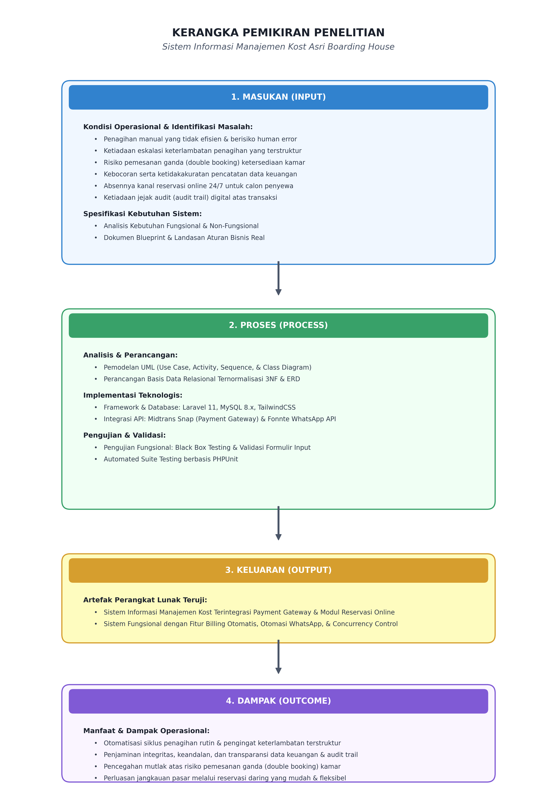


```mermaid
graph TD
    subgraph INPUT ["1. MASUKAN (INPUT)"]
        direction TB
        I1["<b>Kondisi Operasional & Identifikasi Masalah:</b><br/>• Penagihan manual yang tidak efisien<br/>• Ketiadaan eskalasi keterlambatan terstruktur<br/>• Risiko pemesanan ganda (double booking)<br/>• Kebocoran & ketidakakuratan data keuangan<br/>• Absennya kanal reservasi online 24/7<br/>• Ketiadaan audit trail digital"]
        I2["<b>Spesifikasi Kebutuhan Sistem:</b><br/>• Analisis Kebutuhan Fungsional & Non-Fungsional<br/>• Dokumen Blueprint & Aturan Bisnis Real"]
        I1 --> I2
    end

    subgraph PROCESS ["2. PROSES (PROCESS)"]
        direction TB
        P1["<b>Analisis & Perancangan:</b><br/>• Pemodelan UML (Use Case, Activity, Sequence, Class Diagram)<br/>• Skema Basis Data Relasional 3NF & ERD"]
        P2["<b>Implementasi Teknologis:</b><br/>• Framework & DB: Laravel 11, MySQL 8.x, TailwindCSS<br/>• Integrasi API: Midtrans Snap & Fonnte WhatsApp API"]
        P3["<b>Pengujian & Validasi:</b><br/>• Black Box Testing & Validasi Formulir Input<br/>• Automated Suite Testing berbasis PHPUnit"]
        P1 --> P2 --> P3
    end

    subgraph OUTPUT ["3. KELUARAN (OUTPUT)"]
        O1["<b>Artefak Perangkat Lunak Teruji:</b><br/>Sistem Informasi Manajemen Kost Terintegrasi Payment Gateway & Modul Reservasi Online (Asri Boarding House)"]
    end

    subgraph OUTCOME ["4. DAMPAK (OUTCOME)"]
        D1["<b>Manfaat & Dampak Operasional:</b><br/>• Otomatisasi operasional penagihan & pengingat terstruktur<br/>• Penjaminan integritas & akurasi data keuangan serta audit trail<br/>• Pencegahan mutlak atas risiko pemesanan ganda (double booking)<br/>• Perluasan jangkauan pasar & kemudahan reservasi online 24/7"]
    end

    INPUT --> PROCESS
    PROCESS --> OUTPUT
    OUTPUT --> OUTCOME

    style INPUT fill:#EFF6FF,stroke:#3B82F6,stroke-width:2px,rx:8px,ry:8px
    style PROCESS fill:#F0FDF4,stroke:#22C55E,stroke-width:2px,rx:8px,ry:8px
    style OUTPUT fill:#FEF3C7,stroke:#F59E0B,stroke-width:2px,rx:8px,ry:8px
    style OUTCOME fill:#FAF5FF,stroke:#A855F7,stroke-width:2px,rx:8px,ry:8px

    style I1 fill:#FFFFFF,stroke:#93C5FD,stroke-width:1px
    style I2 fill:#FFFFFF,stroke:#93C5FD,stroke-width:1px
    style P1 fill:#FFFFFF,stroke:#86EFAC,stroke-width:1px
    style P2 fill:#FFFFFF,stroke:#86EFAC,stroke-width:1px
    style P3 fill:#FFFFFF,stroke:#86EFAC,stroke-width:1px
    style O1 fill:#FFFFFF,stroke:#FDE047,stroke-width:1px
    style D1 fill:#FFFFFF,stroke:#E9D5FF,stroke-width:1px
```

Gambar 2.1 Kerangka Pemikiran Penelitian
Sumber: Rancangan penulis (2026)

## BAB III METODOLOGI PENELITIAN
## 3.1 Jenis Penelitian
Penelitian ini merupakan jenis penelitian dan pengembangan (*Research and Development* atau R&D) dengan pendekatan rekayasa perangkat lunak (*software engineering*). Pendekatan R&D dipilih karena tujuan utama penelitian ini adalah menghasilkan produk perangkat lunak Sistem Informasi Manajemen Kost yang fungsional, teruji, dan dapat dioperasikan secara langsung pada lingkungan nyata [16]. Alur pengembangan mencakup tahapan analisis kebutuhan, perancangan arsitektur, penulisan kode program, hingga pengujian sistem secara berulang guna memastikan sistem memenuhi kebutuhan operasional Asri Boarding House.

## 3.2 Teknik Pengumpulan Data
Pengumpulan data dilakukan menggunakan pendekatan kualitatif melalui tiga teknik yang saling melengkapi guna memperoleh gambaran menyeluruh mengenai proses bisnis dan aturan operasional di lapangan:
1)	Observasi Langsung (*Field Observation*): Penulis mengamati secara langsung kegiatan operasional harian di Asri Boarding House, mencakup cara pengelola memeriksa kamar kosong, mencatat uang sewa tunai di buku besar, serta mengirimkan pesan penagihan kepada penghuni. Melalui observasi ini, hambatan administratif yang terjadi dalam praktik sehari-hari dapat dipetakan secara jelas.
2)	Wawancara Mendalam (*In-depth Interview*): Penulis melakukan wawancara semiterstruktur dengan pemilik sekaligus pengelola kos, Bapak Asep (usia 48 tahun, dengan pengalaman mengelola kos selama 20 tahun). Topik wawancara mencakup penentuan tarif tiap kategori kamar, kebijakan jatuh tempo dan denda keterlambatan, keterlibatan wali dalam penagihan, prosedur penerimaan tamu langsung, serta langkah pemeriksaan kamar saat penyewa keluar (*checkout*). Wawancara ini memberikan pemahaman mendalam mengenai alasan di balik aturan operasional yang diterapkan.
3)	Studi Dokumentasi (*Documentation*): Penulis mempelajari berkas fisik yang digunakan dalam pengelolaan kos, seperti buku catatan pembayaran sewa, daftar penghuni, dan kuitansi kertas, yang kemudian diselaraskan dengan dokumen teknis *Blueprint Projek Website Asri Boarding House*. Telaah dokumen ini melengkapi data hasil wawancara dan observasi sehingga kebutuhan sistem memiliki landasan data yang kuat dan konsisten.

## 3.3 Metode Pengembangan Sistem
Pengembangan sistem informasi ini menerapkan model air terjun (*Waterfall*). Model Waterfall merupakan metode dalam *System Development Life Cycle* (SDLC) yang menstrukturkan pengerjaan secara berurutan dan teratur melalui tahapan: analisis kebutuhan, desain sistem, implementasi kode program, pengujian, dan pemeliharaan [17], [18]. Model ini dipilih karena spesifikasi kebutuhan fungsional dan aturan bisnis Asri Boarding House telah terdefinisi secara matang dan stabil di dalam dokumen blueprint, sehingga ruang lingkup pengembangan relatif pasti dan tidak mengalami perubahan besar selama proses penelitian. Kejelasan kebutuhan sejak awal memungkinkan pengelolaan jadwal yang terarah dan penyusunan dokumentasi yang lengkap pada setiap tahap.

Tahapan model Waterfall yang diterapkan pada penelitian ini disajikan pada Gambar 3.1.

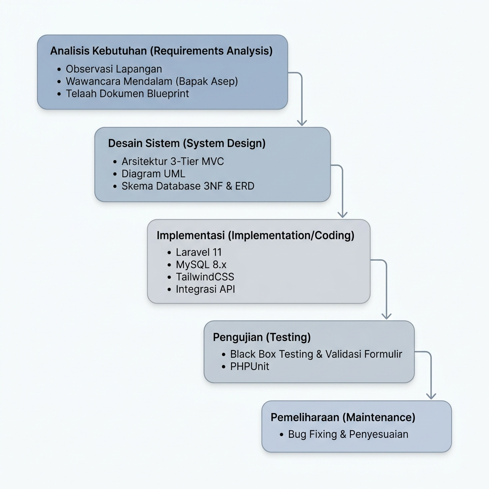

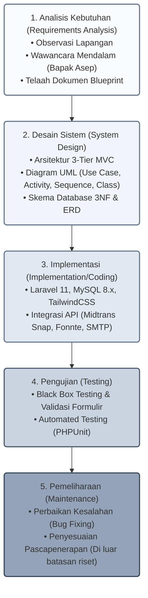
```mermaid
graph TD
    A["1. Analisis Kebutuhan (Requirements Analysis)<br/>• Observasi Lapangan<br/>• Wawancara Mendalam (Bapak Asep)<br/>• Telaah Dokumen Blueprint"] --> B["2. Desain Sistem (System Design)<br/>• Arsitektur 3-Tier MVC<br/>• Diagram UML (Use Case, Activity, Sequence, Class)<br/>• Skema Database 3NF & ERD"]
    B --> C["3. Implementasi (Implementation/Coding)<br/>• Laravel 11, MySQL 8.x, TailwindCSS<br/>• Integrasi API (Midtrans Snap, Fonnte, SMTP)"]
    C --> D["4. Pengujian (Testing)<br/>• Black Box Testing & Validasi Formulir<br/>• Automated Testing (PHPUnit)"]
    D --> E["5. Pemeliharaan (Maintenance)<br/>• Perbaikan Kesalahan (Bug Fixing)<br/>• Penyesuaian Pascapenerapan (Di luar batasan riset)"]

    style A fill:#F8FAFC,stroke:#64748B,stroke-width:2px,rx:5px,ry:5px
    style B fill:#F1F5F9,stroke:#64748B,stroke-width:2px,rx:5px,ry:5px
    style C fill:#E2E8F0,stroke:#64748B,stroke-width:2px,rx:5px,ry:5px
    style D fill:#CBD5E1,stroke:#475569,stroke-width:2px,rx:5px,ry:5px
    style E fill:#94A3B8,stroke:#334155,stroke-width:2px,rx:5px,ry:5px
```

Gambar 3.1 Diagram Model Waterfall Pengembangan Sistem
Sumber: Rancangan penulis (2026)

Tahapan pengembangan sistem dengan model Waterfall ini meliputi:
1)	Analisis Kebutuhan (*Requirements Analysis*): Menganalisis kebutuhan fungsional dan non-fungsional sistem berdasarkan triangulasi data dari observasi lapangan, wawancara mendalam bersama Bapak Asep, serta telaah dokumen blueprint.
2)	Desain Sistem (*System Design*): Merancang arsitektur aplikasi *3-tier* berpola MVC, diagram UML (*use case, activity, sequence, class*), serta skema basis data relasional 3NF yang digambarkan dalam ERD 22 tabel.
3)	Implementasi (*Implementation/Coding*): Membangun kode program aplikasi berbasis framework Laravel 11, PHP 8.2, MySQL 8.x InnoDB, TailwindCSS, serta mengintegrasikan API eksternal (Midtrans Snap, Fonnte WhatsApp, dan SMTP surel).
4)	Pengujian (*Testing*): Menguji fungsionalitas sistem secara menyeluruh melalui 60 skenario uji kotak hitam (*black box testing*), pengujian hak akses peran, simulasi transaksi Midtrans Sandbox, live testing HTTPS SSL, pengujian penerimaan pengguna secara kualitatif (*Side-by-Side Usability Testing*) bersama pengelola operasional senior, serta pengujian fitur terotomatisasi berbasis PHPUnit.
5)	Pemeliharaan (*Maintenance*): Merupakan tahapan pemantauan berkala dan perbaikan galat pascapenerapan. Sesuai dengan batasan masalah, fase pemeliharaan jangka panjang berada di luar linimasa enam bulan penelitian ini.

## BAB IV HASIL DAN PEMBAHASAN

## 4.1 Perancangan Sistem
Tahapan perancangan sistem menerjemahkan hasil analisis kebutuhan fungsional dan triangulasi data operasional di lapangan ke dalam cetak biru (*blueprint*) rekayasa perangkat lunak yang sistematis. Pemodelan sistem dilakukan menggunakan standar Unified Modeling Language (UML) yang mencakup Use Case Diagram, Activity Diagram, Flowchart, dan Sequence Diagram, serta pemodelan skema relasi data melalui Entity Relationship Diagram (ERD).

### 4.1.1 Use Case Diagram
Sistem Informasi Manajemen Asri Boarding House melibatkan empat aktor dengan hak akses yang terisolasi secara ketat melalui tiga portal autentikasi terpisah (`/admin/login`, `/reservasi/login`, dan `/penyewa/login`) guna menjamin prinsip *Role-Based Access Control* (RBAC) dan mencegah kebocoran otorisasi (*privilege escalation*). Keempat aktor tersebut diuraikan sebagai berikut:
1. **Tamu (*Guest*)**: Pengunjung publik yang mengakses landing page untuk melihat informasi kos, menjelajahi katalog 32 unit kamar beserta fasilitas dan video *room tour*, menggunakan kalkulasi harga sewa harian/mingguan/bulanan secara real-time, mengakses tombol WhatsApp melayang, serta memulai obrolan langsung dengan administrator melalui widget *Guest Chat* publik tanpa perlu melakukan pendaftaran akun—di mana sesi percakapan dipersistensi pada cookie dan penyimpanan lokal peramban (*localStorage*) dengan token unik terenkripsi SHA-256.
2. **Calon Penyewa**: Pengguna terdaftar yang masuk melalui formulir registrasi mandiri maupun Google OAuth 2.0 (Laravel Socialite). Calon penyewa dapat memilih unit kamar kosong, melengkapi identitas NIK dan kontak wali via *stepper* alur pemesanan 5 tahap, memilih skema pembayaran (Uang Muka DP 30% atau Lunas 100%), bertransaksi secara aman melalui Midtrans Snap (Bank BCA Virtual Account), memantau kemajuan verifikasi, serta berdiskusi langsung dengan administrator melalui kanal *pre-payment chat box* yang aktif selama status pemesanan *pending*.
3. **Penyewa Aktif**: Penghuni yang kontrak huniannya telah diverifikasi dan diaktifkan oleh administrator. Penyewa aktif memiliki akses penuh ke portal internal untuk memantau masa aktif sewa, meninjau rincian tagihan bulanan beserta status jatuh tempo, melakukan pembayaran tagihan secara daring melalui Midtrans Snap (BCA Virtual Account), mengunduh kuitansi digital format A5 resmi secara mandiri, mengajukan laporan keluhan kerusakan fasilitas disertai foto bukti, memantau disposisi perbaikan, serta memulihkan kata sandi akun secara mandiri via surel SMTP.
4. **Administrator**: Pengelola operasional (Bapak Asep) yang memegang kendali penuh terhadap tata kelola properti kost: memantau dasbor statistik dan tiga kartu ringkasan keuangan (*summary cards*) real-time, mengelola master data kamar dan fasilitas (CRUD dengan validasi keterikatan data), mendaftarkan penyewa baru jalur *walk-in* (datang langsung), mengonfirmasi pembayaran tunai, mengaudit dan mengonfirmasi reservasi daring, memantau *auto-billing engine* dan denda flat kalender 5%, menanggapi keluhan kerusakan fasilitas, menyiarkan pengumuman massal (*broadcast*), mengontrol jadwal hunian melalui Kalender Visual (UC-19), serta mengekspor laporan keuangan laba bersih ke format PDF dan Excel/CSV ber-encoding BOM UTF-8.

Interaksi menyeluruh keempat aktor dengan modul-modul sistem divisualisasikan dalam diagram terpadu pada Gambar 4.1.

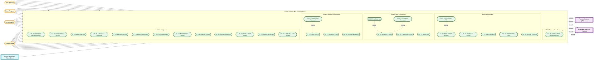

*Gambar 4.1 Use Case Diagram Terpadu Sistem Asri Boarding House*  
*Sumber: Hasil pemodelan UML penulis (2026)*

---

### 4.1.2 Activity Diagram
Activity diagram memodelkan alur kerja dinamis dari tiga proses operasional utama pada sistem Asri Boarding House:

1. **Mesin Penagihan Otomatis (*Auto-Billing Engine*)**: Dijalankan secara otomatis setiap tanggal 1 awal bulan pukul 00:05 WIB oleh penjadwal tugas (*Laravel Task Scheduler*) yang terhubung dengan *cron job* peladen. Sistem melakukan kueri terhadap seluruh penyewa aktif dengan tipe sewa bulanan; penyewa bertipe harian dan mingguan secara tegas dikecualikan melalui filter `whereNotIn('tipe_sewa', ['harian', 'mingguan'])`. Untuk setiap penyewa bulanan, sistem membaca nominal sewa dari kolom `penyewa.harga_sewa`, lalu menerbitkan baris tagihan baru berstatus *pending* dengan tanggal jatuh tempo seragam pada tanggal 10 bulan berjalan. Integritas antiduplikasi dijamin oleh *composite unique index* atas kombinasi `(penyewa_id, periode_bulan, periode_tahun)`. Setelah tagihan terbentuk, sistem memicu pengiriman pesan rincian tagihan secara otomatis ke WhatsApp penyewa melalui Fonnte WhatsApp API Gateway.
2. **Denda Keterlambatan Flat Kalender (*Flat Calendar Late Fee*)**: Dijalankan setiap hari oleh scheduler untuk mengevaluasi tagihan berstatus *pending* yang melewati tanggal jatuh tempo. Sistem menerapkan pendekatan persuasif: selama tagihan masih berada dalam bulan kalender berjalan (tanggal 11 hingga akhir bulan), sistem tidak membebankan denda keterlambatan (Denda = Rp0) dan hanya mengirimkan pesan pengingat berkala. Namun, begitu pergantian bulan kalender terjadi (masuk tanggal 1 bulan berikutnya) dan tagihan bulan lalu masih belum lunas, sistem mengenakan denda keterlambatan flat sebesar 5% dari harga sewa pokok tepat satu kali melalui mekanisme *Idempotency Guard* (`nominal_denda == 0`) di dalam transaksi basis data atomik berproteksi kunci baris (`lockForUpdate()`). Bersamaan dengan itu, sistem mengirimkan notifikasi eskalasi penunggakan ke kontak nomor wali/orang tua penyewa.
3. **Transisi Reservasi Menjadi Penyewa Aktif (*Reservation-to-Tenant Transition*)**: Ketika administrator menyetujui reservasi daring yang telah berstatus lunas atau DP, sistem mengeksekusi rangkaian operasi multi-tabel dalam satu transaksi atomik `DB::transaction`. Sistem memperbarui status reservasi menjadi `dikonfirmasi`, mengunci status unit kamar bersangkutan menjadi `terisi`, menyalin harga sewa kamar ke `penyewa.harga_sewa` sebagai tarif sewa aktif (*immutable personal rate*), membuat akun login pengguna pada tabel `users`, menginjeksi tagihan pelunasan sisa 70% (jika skema DP), serta mengirimkan kredensial akun bawaan ke nomor WhatsApp penyewa via Fonnte API. Sebaliknya, ketika penyewa selesai masa tinggal (*checkout*), sistem menerapkan aturan operasional: status kamar tidak dilepas secara otomatis menjadi tersedia, melainkan tetap terkunci merah berstatus `terisi` hingga administrator melakukan pemeriksaan fisik kebersihan kamar secara langsung dan mengubah statusnya secara manual menjadi `tersedia`.

Visualisasi ketiga activity diagram proses kritis disajikan pada Gambar 4.2.

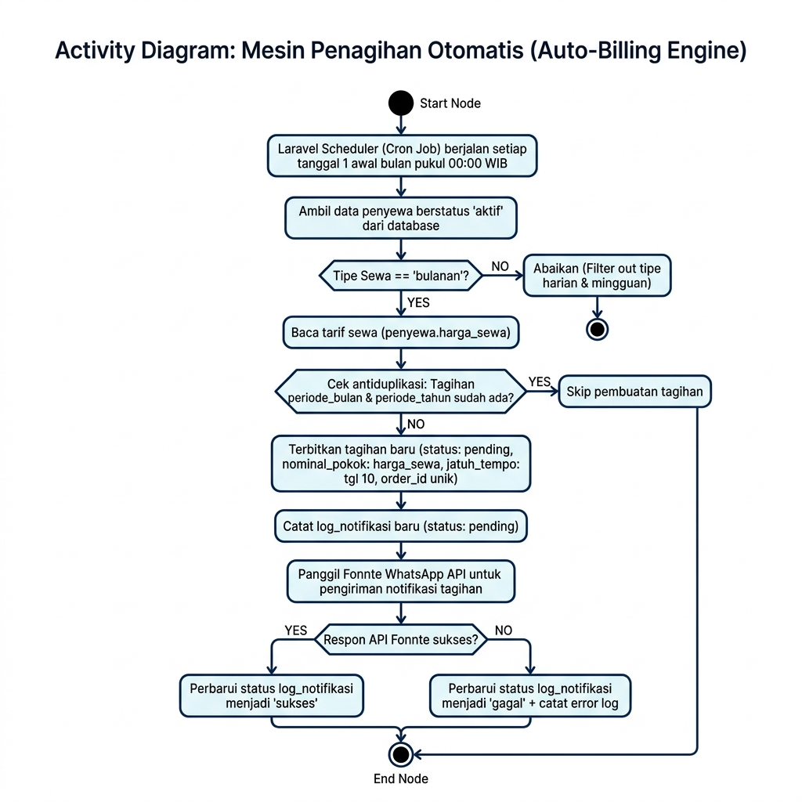  
*(a) Mesin Penagihan Otomatis (Auto-Billing Engine)*

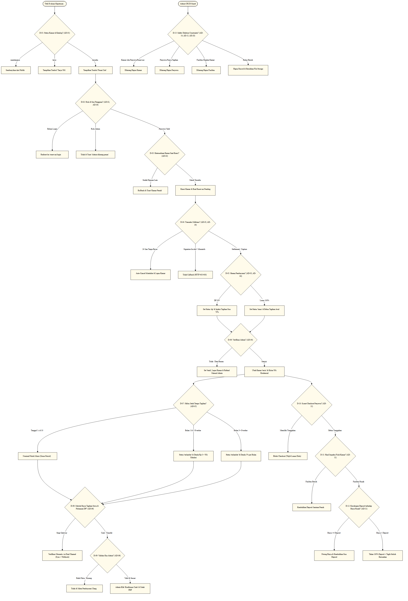  
*(b) Denda Keterlambatan Flat Kalender (Flat Calendar Late Fee)*

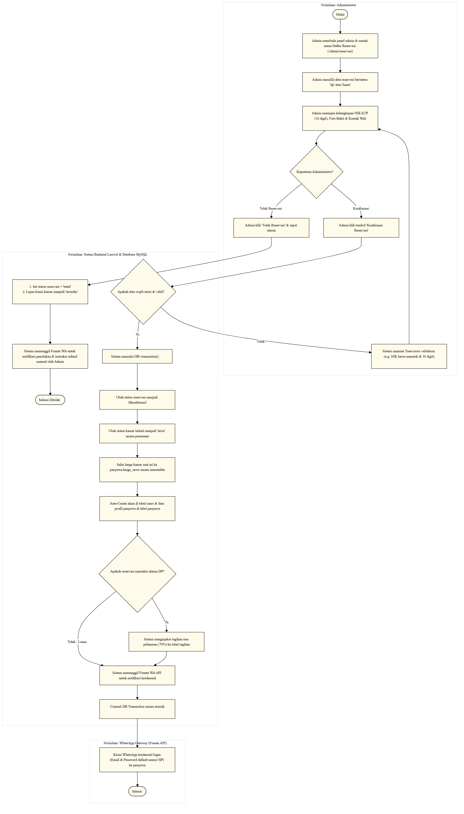  
*(c) Transisi Reservasi Menjadi Penyewa Aktif (Reservation-to-Tenant)*

*Gambar 4.2 Activity Diagram Tiga Proses Kritis Sistem Asri Boarding House*  
*Sumber: Hasil pemodelan UML penulis (2026)*

---

### 4.1.3 Flowchart Diagram
Flowchart diagram memodelkan logika algoritmik dari alur transaksional sistem dari hulu ke hilir. Diagram ini memetakan pengambilan keputusan sistem mulai dari verifikasi ketersediaan kamar, kalkulasi diskon sewa durasi tahunan, pemilihan skema pembayaran (DP 30% atau Lunas 100%), pembangkitan token Midtrans Snap Bank BCA Virtual Account, penanganan webhook callback settlement, pencatatan mutasi kas, hingga siklus auto-billing bulanan dan evaluasi denda kalender.

Logika algoritmik penagihan dan evaluasi keterlambatan memastikan bahwa tidak ada cabang logika yang ambigu: pengecekan `is_active == 1` menyaring penyewa aktif, pembagian porsi memori via `chunkById(100)` mencegah peladen kehabisan sumber daya memori, serta pengecekan tanggal kalender secara tegas memisahkan fase pengingat persuasif tanpa denda dari fase penegakan denda flat 5%. Alur flowchart disajikan pada Gambar 4.3.

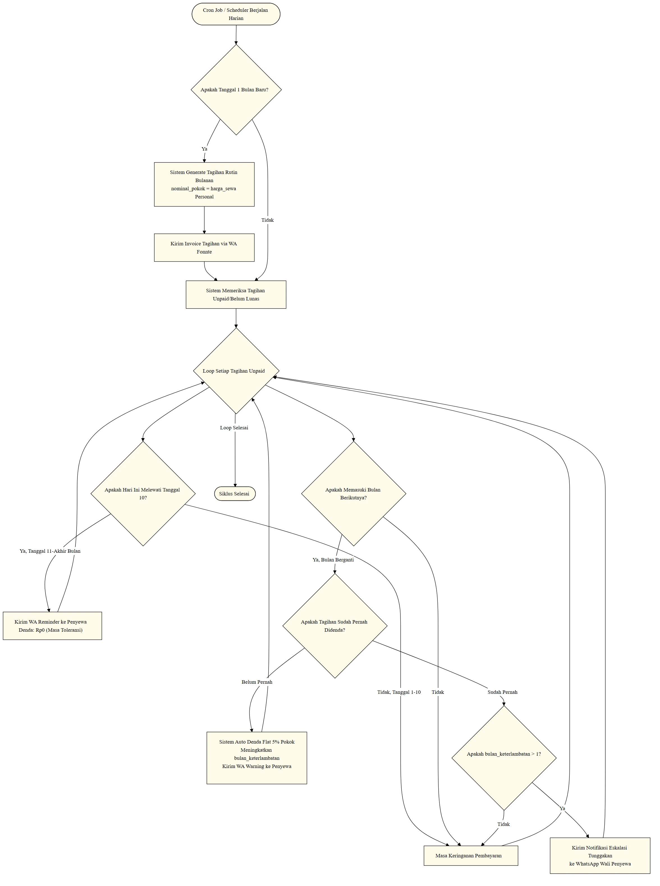

*Gambar 4.3 Flowchart Mekanisme Billing Engine dan Penanganan Keterlambatan Massal*  
*Sumber: Hasil analisis algoritma sistem penulis (2026)*

---

### 4.1.4 Sequence Diagram
Sequence diagram menggambarkan interaksi dinamis lintas waktu dan pertukaran pesan antar-objek (Aktor, Peramban Klien, Pengontrol Rute Laravel, Lapisan Layanan *Service Layer*, Basis Data MySQL 8.x, serta Pihak Ketiga Midtrans Snap dan Fonnte WhatsApp API). Dua alur utama dimodelkan:

1. **Alur Reservasi Daring dan Konfirmasi Akun Baru**: Calon penyewa mengisi formulir reservasi pada antarmuka web, peramban memanggil *endpoint* API untuk mendapatkan Snap Token transaksi BCA Virtual Account dari Midtrans Cloud. Pengguna menyelesaikan pembayaran pada simulator sandbox, server Midtrans mengirimkan notifikasi asinkron HTTP POST (*webhook callback*) yang divalidasi keasliannya menggunakan tanda tangan SHA-512 oleh `MidtransReservasiCallbackController`. Setelah status transaksi dinyatakan sah (`settlement`), administrator membuka panel admin, memeriksa kelengkapan NIK 16 digit dan kontak wali, lalu menekan tombol konfirmasi. Layanan `TransisiPenyewaService` secara atomik mengaktifkan akun, mengunci kamar, dan memicu pengiriman pesan WhatsApp selamat datang berisi kredensial login via Fonnte Gateway.
2. **Siklus Penagihan Bulanan dan Pembayaran Rutin**: Scheduler peladen mengeksekusi `BillingService::generateTagihanBulanan` pada tanggal 1 awal bulan, menerbitkan baris tagihan berstatus pending, dan mengirim notifikasi WhatsApp kepada penyewa. Saat penyewa login dan membayar tagihannya melalui popup Midtrans Snap BCA VA, webhook `MidtransCallbackController` menerima payload callback, memvalidasi signature SHA-512, mengunci baris data dengan `lockForUpdate()`, memperbarui status tagihan menjadi lunas secara idempoten, mencatat mutasi pemasukan kas, serta menerbitkan kuitansi digital instan berformat A5 via peramban klien.

Visualisasi sequence diagram disajikan pada Gambar 4.4.

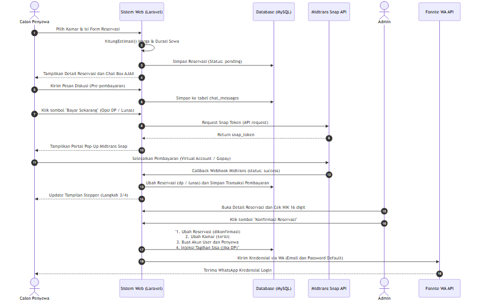  
*(a) Alur Reservasi Daring dan Aktivasi Penyewa Baru*

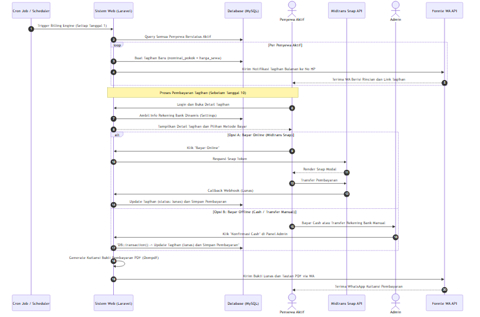  
*(b) Siklus Penagihan dan Pembayaran Bulanan*

*Gambar 4.4 Sequence Diagram Alur Transaksional Utama Sistem Asri Boarding House*  
*Sumber: Hasil pemodelan UML penulis (2026)*

---

### 4.1.5 Entity Relationship Diagram (ERD)
Skema basis data dirancang mengikuti aturan Bentuk Normal Ketiga (Third Normal Form atau 3NF) guna mengeliminasi redundansi data, mencegah anomali pembaruan (*update anomalies*), dan menjamin integritas transaksi ACID (*Atomicity, Consistency, Isolation, Durability*) pada sistem manajemen basis data relasional MySQL 8.x dengan engine penyimpanan InnoDB.

Skema basis data secara keseluruhan terdiri atas 22 tabel relasional. Untuk menjamin keunikan constraint data tanpa merusak jejak historis penghapusan lunak (*soft deletes*), sistem memanfaatkan fitur *Virtual Generated Columns* pada MySQL 8.x (kolom virtual fungsional berindeks unik), seperti `active_email`, `active_no_hp`, dan `active_nik` pada tabel `users`, `active_nomor_kamar` pada tabel `kamar`, `active_nik` pada tabel `penyewa`, serta `active_order_id` pada tabel `reservasi`. Kolom-kolom ini bernilai sama dengan kolom aslinya saat data aktif (`deleted_at IS NULL`), dan bernilai `NULL` saat baris di-softdelete. Karena MySQL mengizinkan nilai `NULL` ganda pada *unique index*, maka integritas keunikan data tetap terlindungi dengan baik tanpa perlu memodifikasi string data historis.

Kardinalitas relasi antarentitas dirumuskan sebagai berikut: satu entitas `users` berelasi satu-ke-satu (1:1) dengan profil `penyewa`, satu unit `kamar` dapat ditempati banyak (`1:N`) penyewa secara historis, relasi `kamar` dengan `fasilitas` bersifat banyak-ke-banyak (`M:N`) yang direalisasikan melalui tabel pivot `kamar_fasilitas`, satu `penyewa` memiliki banyak (`1:N`) `tagihan`, dan satu `tagihan` memiliki banyak (`1:N`) `pembayaran` serta `log_notifikasi`. Integritas referensial ditegakkan melalui kebijakan foreign key `ON DELETE RESTRICT` pada transaksi finansial (penyewa, tagihan, pembayaran) agar data riwayat kas terlindungi permanen, `ON DELETE CASCADE` pada data dependan (pivot fasilitas dan pesan chat), serta `ON DELETE SET NULL` pada kolom jejak audit konfirmasi (`dikonfirmasi_oleh`). Struktur ERD 22 tabel divisualisasikan pada Gambar 4.5.

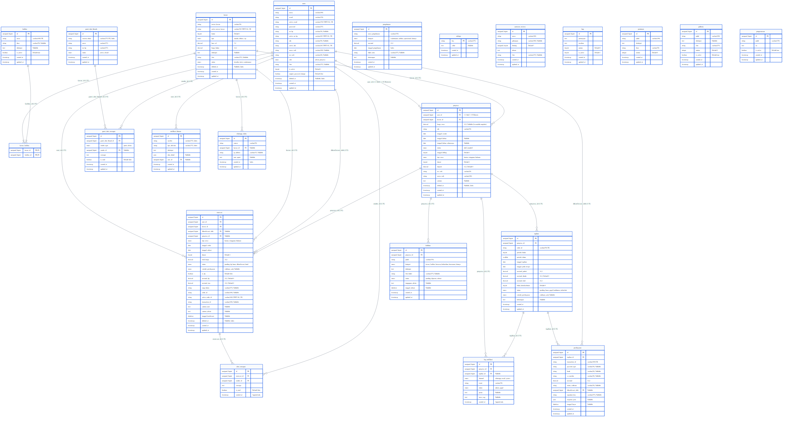

*Gambar 4.5 Entity Relationship Diagram (ERD) Skema Basis Data 22 Tabel*  
*Sumber: Hasil analisis basis data penulis (2026)*

---

### 4.1.6 Skenario Diagram Alur Sistem
Pemodelan teknis-formal melalui Use Case Diagram, Activity Diagram, Flowchart, Sequence Diagram, dan Entity Relationship Diagram pada sub-bab sebelumnya memberikan gambaran arsitektur sistem dari sudut pandang rekayasa perangkat lunak. Untuk menghubungkan pemodelan tersebut dengan praktik operasional di lapangan, bagian ini menyajikan skenario diagram alur sistem yang merekonstruksi hasil pengujian operasional secara empiris pada peladen produksi *live* (`https://asriboardinghouse.weatso.id/`). Skenario ini memadukan dua sudut pandang yang saling melengkapi: siklus hidup penyewa (*tenant lifecycle*) sejak tahap pra-pemesanan hingga kepulangan, serta siklus hidup operasional administrator (*administrator operational lifecycle*) yang dijalankan oleh pengelola kos (Bapak Asep, usia 48 tahun).

#### 1. Skenario Siklus Hidup Penyewa (Tenant Lifecycle Scenario)
Skenario penyewa memotret perjalanan calon penghuni dalam berinteraksi dengan sistem informasi Asri Boarding House. Pengujian empiris pada lingkungan produksi mencakup dua persona dengan preferensi dan skema transaksi yang berbeda:

1. **Jalur 1 — Nur Haliza (Kamar 101 VIP, Durasi Sewa 12 Bulan)**:
   * **Eksplorasi Katalog & Konsultasi Pra-Pemesanan**: Nur Haliza mengakses portal publik `weatso.id`, menelusuri katalog kamar interaktif bertema Neo-Brutalisme, dan memanfaatkan *Floating Guest Live Chat* tanpa autentikasi untuk menanyakan kesiapan Kamar 101 VIP. Sistem mengidentifikasi sesi tamu menggunakan token unik berpelindung hash SHA-256 (`session_token`) pada tabel `guest_chat_threads`.
   * **Otentikasi Google OAuth 2.0 & Penapisan Profil**: Nur Haliza memilih masuk menggunakan akun Google (`Laravel Socialite`). Setelah otentikasi identitas berhasil, sistem mendeteksi nomor ponsel sementara (`temp_socialite_*`) dan secara otomatis mengalihkannya melalui middleware `EnsureProfileIsComplete` ke halaman pelengkapan profil. Nur Haliza memasukkan nomor WhatsApp aktifnya (`089524569335`), yang divalidasi dengan ekspresi reguler standar penomoran Indonesia dan dipastikan unik.
   * **Reservasi & Pelunasan Penuh di Awal (*Full Payment Upfront*)**: Nur Haliza mengisi formulir reservasi dengan memasukkan NIK 16 digit valid (`3374115212030001`), durasi sewa 12 bulan (26 September 2026 s.d. 26 September 2027), serta kontak darurat/wali Kusuma (`082219575575`). Sistem menghitung biaya sewa dasar sebesar Rp16.800.000 (12 x Rp1.400.000), lalu secara atomik menerapkan diskon sewa durasi tahunan dari tabel konfigurasi sistem sehingga total transaksi menjadi Rp15.400.560. Nilai ini sekaligus mengunci tarif sewa aktif personal (*immutable personal rate*) sebesar Rp1.283.380 per bulan (`Rp15.400.560 / 12 bulan`).
   * **Penyelesaian Transaksi Midtrans Snap**: Nur Haliza menyelesaikan pembayaran penuh sebesar Rp15.400.560 melalui Virtual Account Bank Mandiri pada antarmuka pop-up Midtrans Snap. Webhook callback asinkron diverifikasi melalui pencocokan tanda tangan digital SHA-512, memperbarui status reservasi menjadi `lunas`.
   * **Siklus Pembayaran Rutin Tepat Waktu**: Pada siklus sewa bulanan, tagihan sewa rutin terbit otomatis setiap tanggal 1 awal bulan pukul 00:05 WIB senilai Rp1.283.380 dengan batas jatuh tempo tanggal 10. Nur Haliza secara konsisten menyelesaikan pembayaran antara tanggal 1 hingga 5 setiap bulannya melalui dompet digital GoPay (Midtrans Snap), sehingga tidak pernah dikenakan denda keterlambatan sepanjang masa tinggal. Kuitansi pembayaran resmi format A5 berstempel digital diunduh langsung di peramban klien melalui pustaka `html2pdf.js`.

2. **Jalur 2 — Tyas (Kamar 104 Deluxe, Durasi Sewa 6 Bulan)**:
   * **Pendaftaran Akun Mandiri & Reservasi Skema Uang Muka (DP 30%)**: Tyas mendaftarkan akun secara mandiri melalui formulir registrasi web, lalu memesan Kamar 104 Deluxe bertarif pokok Rp950.000 per bulan untuk durasi 6 bulan (total kewajiban pokok Rp5.700.000). Tyas memilih skema pembayaran Uang Muka (DP 30%) sebesar Rp1.710.000, dengan sisa kewajiban 70% sebesar Rp3.990.000 yang wajib dilunasi sebelum menempati kamar.
   * **Pembayaran DP & Injeksi Tagihan Pelunasan**: Tyas membayar DP sebesar Rp1.710.000 via QRIS Midtrans Snap. Begitu administrator menyetujui reservasi, layanan `TransisiPenyewaService` secara atomik mengaktifkan akun penyewa, mengunci status kamar menjadi `terisi`, dan memanggil `BillingService::injectSisaDp` untuk menerbitkan tagihan pelunasan sisa 70% (Rp3.990.000) berstatus *pending*. Sebelum tanggal masuk fisik (26 September 2026), Tyas masuk ke portal penyewa dan melunasi sisa tagihan tersebut melalui gerbang pembayaran Midtrans Snap.
   * **Penerapan Masa Toleransi Bebas Denda (*Grace Period*)**: Pada periode penagihan bulan November 2026, Tyas melewati batas jatuh tempo tanggal 10 November karena kesibukan akademik. Pada tanggal 11 November pukul 01:00 WIB, penjadwal tugas harian `tagihan:proses-keterlambatan` mendeteksi status belum lunas, namun karena masih berada di bulan kalender berjalan (November), sistem menerapkan kebijakan masa toleransi: status tagihan diubah menjadi *terlambat*, besaran denda ditetapkan tetap Rp0 (`nominal_denda = 0`), dan sistem mengirimkan pengingat sopan melalui WhatsApp Fonnte API. Pada tanggal 15 November, Tyas melunasi tagihan pokok Rp950.000 tanpa tambahan denda.

3. **Pengaduan Keluhan Fasilitas Berfoto**:
   * Pada bulan Maret 2027, terjadi kebocoran pada sambungan drat kran wastafel di kamar mandi Kamar 101 milik Nur Haliza. Nur Haliza membuka menu *Keluhan & Pengaduan* pada portal penyewa, mengisi formulir pengaduan, dan melampirkan foto bukti fisik `kran_bocor.jpg` berukuran 1,2 MB. Sistem memvalidasi ekstensi serta ukuran berkas, menerbitkan tiket keluhan berstatus *pending*, dan mengirimkan pesan pemberitahuan otomatis ke nomor WhatsApp pengelola.
   * Setelah teknisi ledeng menyelesaikan perbaikan dan pengelola melakukan inspeksi fisik, status tiket diubah menjadi *selesai*, memicu pengiriman pesan WhatsApp penutupan laporan kepada penyewa.

4. **Penerimaan Siaran Pengumuman Massal (*Multi-Channel Broadcast*)**:
   * Ketika pengelola menjadwalkan kegiatan pemeliharaan lingkungan (seperti pengasapan nyamuk DBD pada bulan Juni 2027), penyewa menerima pesan pemberitahuan resmi secara serentak melalui spanduk pengumuman pada portal web, pesan WhatsApp melalui Fonnte API, dan surel terenkripsi TLS melalui protokol SMTP.

#### 2. Skenario Operasional Administrator (Administrator Operational Lifecycle)
Skenario operasional memodelkan alur kerja harian pengelola (Bapak Asep, 48 tahun) dalam mengendalikan tata usaha, keuangan, dan fasilitas fisik Asri Boarding House melalui portal administrasi:

1. **Layanan Pra-Pemesanan & Audit Berkas Identitas**:
   * Pengelola memantau pesan masuk dari pengunjung web melalui antarmuka *Guest Chat* dan kotak pesan pra-pembayaran (*Pre-Payment Chat Box*) pada halaman rincian reservasi guna memastikan kejelasan fasilitas sebelum calon penyewa mentransfer dana.
   * Saat calon penyewa menyelesaikan pembayaran awal via Midtrans, pengelola melakukan audit verifikasi dokumen identitas: memeriksa keabsahan NIK 16 digit dan nomor kontak wali/orang tua. Setelah dokumen dinyatakan sah, pengelola menekan tombol konfirmasi untuk mengaktifkan kontrak sewa.

2. **Pengawasan Otomasi Tagihan Bulanan & Arus Kas Real-Time**:
   * Pengelola tidak lagi melakukan pencatatan invoice manual di buku besar. Setiap tanggal 1 awal bulan pukul 00:05 WIB, penjadwal tugas peladen mengeksekusi `php artisan tagihan:generate-bulanan`, menerbitkan baris tagihan berstatus *pending* bagi seluruh penyewa aktif dengan tipe sewa bulanan, dan menyiarkan rincian tagihan via WhatsApp.
   * Dasbor keuangan administrator menyajikan tiga kartu ringkasan keuangan mikro (Total Pemasukan, Total Pengeluaran, dan Laba Bersih) secara real-time berdasarkan agregasi basis data, mengamankan kapasitas penerimaan bruto kos sebesar Rp28.500.000 per bulan dari risiko selisih hitung.

3. **Manajemen Pemeliharaan Fasilitas & Penyiaran Notifikasi Massal**:
   * Pengelola meninjau laporan kerusakan berfoto dari penyewa, memperbarui status tiket menjadi *diproses*, memanggil teknisi langganan, dan melakukan inspeksi fisik hasil perbaikan sebelum menutup tiket keluhan.
   * Fitur *Broadcast Pengumuman* memungkinkan pengelola menyebarkan informasi operasional kepada seluruh penghuni aktif dalam satu kali kirim, di mana backend Laravel mengatur antrean pesan dengan jeda waktu 2 detik antar-nomor guna mencegah pemblokiran nomor pengirim oleh pihak penyedia layanan WhatsApp.

4. **Prosedur Akhir Kontrak & Protokol Penahanan Kamar (*Manual Inspection Hold*)**:
   * Ketika masa sewa berakhir (seperti berakhirnya kontrak 6 bulan Tyas pada 26 Maret 2027 dan kontrak 12 bulan Nur Haliza pada 26 September 2027), pengelola membuka formulir *checkout* administratif. Sistem memverifikasi bahwa seluruh tagihan bulanan dari awal hingga akhir masa sewa telah berstatus *lunas* (`unpaidBillsCount == 0`). Apabila masih terdapat tunggakan sewa, sistem secara tegas menolak eksekusi *checkout*.
   * Setelah verifikasi finansial terpenuhi, pengelola bersama penyewa melakukan inspeksi fisik kamar untuk memastikan kelengkapan dan keutuhan fasilitas. Pengelola kemudian mengeksekusi tombol *checkout*: status penyewa diubah menjadi *nonaktif*, tanggal keluar dicatat pada basis data, dan hak akses akun dinonaktifkan (`is_active = 0`).
   * **Protokol Penahanan Kamar (*Manual Inspection Hold*)**: Kebijakan operasional terpenting pada sistem Asri Boarding House menetapkan bahwa pasca-checkout selesai, **status unit kamar pada tabel basis data TIDAK diubah secara otomatis menjadi `tersedia`**. Status unit kamar tetap dipertahankan pada kondisi terkunci merah berstatus **`terisi`**. Kebijakan isolasi ini memberikan jeda waktu operasional bagi tim kebersihan untuk melakukan pembersihan menyeluruh, perbaikan fasilitas minor, penggantian sprei, dan sterilisasi ruangan.
   * Setelah unit kamar dipastikan 100% bersih dan siap huni kembali, pengelola membuka menu *Manajemen Kamar* dan secara **MANUAL** mengubah pilihan status kamar dari `terisi` menjadi **`tersedia`**. Perubahan status manual ini memicu *event* `KamarObserver::updated` yang secara otomatis membersihkan tembolok katalog publik melalui `Cache::forget('kamar_aktif_landing')`. Unit kamar seketika muncul kembali pada katalog publik landing page `weatso.id` dengan tombol pemesanan aktif, mengeliminasi risiko pemesanan ganda (*double booking*) pada kamar yang belum layak huni.

Visualisasi rangkaian diagram skenario siklus hidup penyewa dan operasional administrator disajikan pada Gambar 4.6.

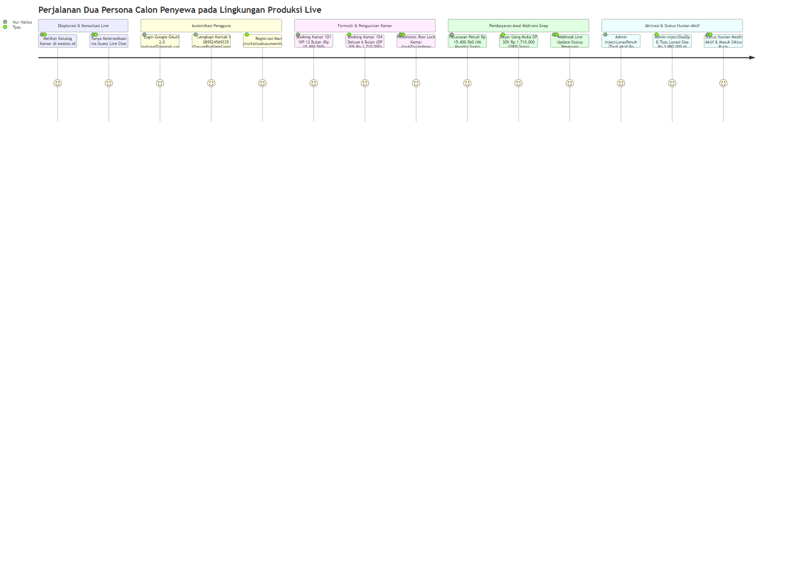  
*(a) Skenario User Journey Calon Penyewa pada Fase Registrasi dan Reservasi Live*

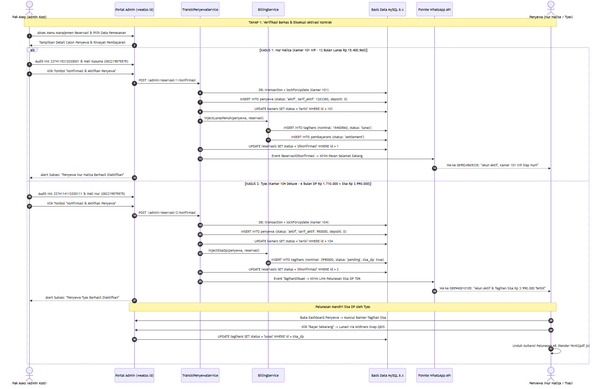  
*(b) Sequence Diagram Alur Audit, Konfirmasi, dan Aktivasi Kontrak Sewa*

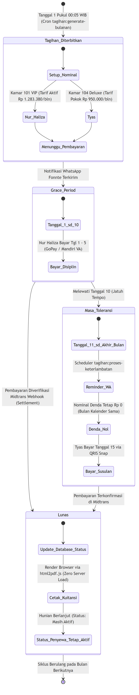  
*(c) State Diagram Siklus Penagihan Bulanan dan Masa Toleransi Bebas Denda*

  
*(d) Mindmap Kluster Tanggung Jawab Operasional Administrator (Bapak Asep)*

  
*(e) Flowchart Alur Keputusan Aktivasi Reservasi dan Monitoring Penagihan Admin*

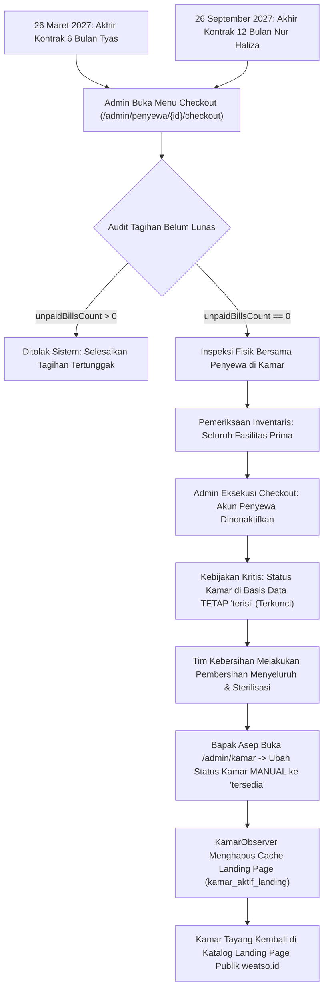
```mermaid
flowchart TD
    A1["26 Maret 2027: Akhir Kontrak 6 Bulan Tyas"] --> B["Admin Buka Menu Checkout (/admin/penyewa/{id}/checkout)"]
    A2["26 September 2027: Akhir Kontrak 12 Bulan Nur Haliza"] --> B
    B --> C{"Audit Tagihan Belum Lunas"}
    C -->|"unpaidBillsCount > 0"| D["Ditolak Sistem: Selesaikan Tagihan Tertunggak"]
    C -->|"unpaidBillsCount == 0"| E["Inspeksi Fisik Bersama Penyewa di Kamar"]
    E --> F["Pemeriksaan Inventaris: Seluruh Fasilitas Prima"]
    F --> G["Admin Eksekusi Checkout: Akun Penyewa Dinonaktifkan"]
    G --> H["Kebijakan Kritis: Status Kamar di Basis Data TETAP 'terisi' (Terkunci)"]
    H --> I["Tim Kebersihan Melakukan Pembersihan Menyeluruh & Sterilisasi"]
    I --> J["Bapak Asep Buka /admin/kamar -> Ubah Status Kamar MANUAL ke 'tersedia'"]
    J --> K["KamarObserver Menghapus Cache Landing Page (kamar_aktif_landing)"]
    K --> L["Kamar Tayang Kembali di Katalog Landing Page Publik weatso.id"]
```
*(f) Flowchart Prosedur Checkout dan Protokol Penahanan Kamar (Manual Inspection Hold)*

*Gambar 4.6 Skenario Diagram Siklus Hidup Transaksional Penyewa dan Operasional Administrator*  
*Sumber: Hasil pemodelan skenario operasional sistem penulis (2026)*

---

#### 3. Matriks Pemetaan Status Transaksional Sistem
Untuk memberikan pandangan terstruktur mengenai keterkaitan antar-entitas selama siklus hidup operasional, Tabel 4.1 menyajikan matriks transisi status yang merangkum evolusi kondisi unit kamar, dokumen reservasi, akun penyewa, tagihan sewa, transaksi pembayaran, *event bus* Laravel, serta notifikasi WhatsApp Fonnte pada setiap tahapan peristiwa pengujian riil.

**Tabel 4.1** Matriks Pemetaan Status Transaksional dan Transisi State Siklus Hidup Sistem

| No | Fase / Peristiwa Pengujian Riil | Status Kamar | Status Reservasi | Status Penyewa | Status Tagihan | Status Pembayaran | Event Bus Laravel | Notifikasi Fonnte WA | Kuitansi / Bukti Transaksi |
| :-: | :--- | :---: | :---: | :---: | :---: | :---: | :---: | :--- | :--- | :--- |
| 1 | **Reservasi Daring Dibuat** | `tersedia` *(Locked)* | `pending` | *Belum ada* | *Belum ada* | *Belum ada* | `ReservasiDibuat` | - | Form Pemesanan Web |
| 2 | **Midtrans Lunas 100% (Nur Haliza)**| `tersedia` *(Locked)* | `lunas` | *Belum ada* | *Belum ada* | `settlement` | `ReservasiDibayar` | Alert WA Admin | Notifikasi Pembayaran |
| 3 | **Midtrans DP 30% (Tyas)** | `tersedia` *(Locked)* | `dp` | *Belum ada* | *Belum ada* | `settlement` | `ReservasiDibayar` | Alert WA Admin | Notifikasi Pembayaran |
| 4 | **Konfirmasi Reservasi Lunas 100%** | `terisi` | `dikonfirmasi` | `aktif` | `lunas` (Bulan 1) | `settlement` | `ReservasiDikonfirmasi` | Welcome & Kredensial | Render A5 `html2pdf.js` |
| 5 | **Konfirmasi Reservasi DP 30%** | `terisi` | `dikonfirmasi` | `aktif` | `pending` (Sisa 70%)| - | `ReservasiDikonfirmasi`, `TagihanDibuat` | Welcome & Link Sisa | Dashboard Alert Banner |
| 6 | **Pelunasan Sisa DP di Portal (Tyas)**| `terisi` | `dikonfirmasi` | `aktif` | `lunas` (Sisa DP) | `settlement` | `PembayaranBerhasil` | Konfirmasi Lunas Sisa | Render A5 `html2pdf.js` |
| 7 | **Check-in Fisik & Hunian Aktif** | `terisi` | `dikonfirmasi` | `aktif` | - | - | - | - | Kunci Kamar Diserahkan |
| 8 | **Billing Bulanan (Tgl 1, 00:05 WIB)**| `terisi` | - | `aktif` | `pending` | - | `TagihanDibuat` | Invoice Tagihan WA | Tautan Bayar Portal |
| 9 | **Bayar Tepat Waktu (Nur Haliza)** | `terisi` | - | `aktif` | `lunas` | `settlement` | `PembayaranBerhasil` | Tanda Terima Digital | Render A5 `html2pdf.js` |
| 10 | **Toleransi Jatuh Tempo (Tyas)** | `terisi` | - | `aktif` | `terlambat` *(Denda 0)*| - | `ReminderPenyewa` | WA Reminder Sopan | Denda Tetap Rp0 |
| 11 | **Pelunasan Masa Toleransi (Tyas)** | `terisi` | - | `aktif` | `lunas` | `settlement` | `PembayaranBerhasil` | Tanda Terima Digital | Render A5 `html2pdf.js` |
| 12 | **Pengaduan Keluhan Berfoto Masuk**| `terisi` | - | `aktif` | - | - | `KeluhanDibuat` | Alert Keluhan Admin | Berkas Foto `kran_bocor.jpg` |
| 13 | **Penyelesaian & Penutupan Keluhan**| `terisi` | - | `aktif` | - | - | `KeluhanDitanggapi` | Notifikasi Tiket Selesai | Inspeksi Fisik Lapangan |
| 14 | **Prosedur Checkout Administratif** | `terisi` *(Locked)* | - | `nonaktif` | Semua `lunas` | - | `PenyewaController::checkout` | Konfirmasi Checkout | Akun Dinonaktifkan |
| 15 | **Manual Release Pasca-Inspeksi** | `tersedia` | - | `nonaktif` | - | - | `KamarObserver::updated` | - (Katalog Live Update)| Cache Memori Dihapus |

## 4.2 Implementasi Sistem
Tahap implementasi merealisasikan rancangan sistem ke dalam kode program terstruktur berbasis framework Laravel 11. Implementasi berfokus pada ketahanan arsitektur, pemisahan logika bisnis yang tegas, keamanan data finansial, serta integrasi layanan eksternal.

### 4.2.1 Lingkungan Implementasi
Pengembangan dan pengoperasian sistem dibangun di atas spesifikasi lingkungan perangkat keras dan perangkat lunak yang terstandarisasi:
1. **Perangkat Keras (*Hardware*)**:
   * Lingkungan Pengembangan (*Development*): Laptop Workstation dengan spesifikasi Prosesor Multi-Core 2.3 GHz, RAM 16 GB DDR4, Penyimpanan Solid State Drive (SSD) NVMe 512 GB.
   * Lingkungan Produksi (*Production*): Cloud Shared Hosting Server Hostinger Enterprise yang berlokasi di Data Center Jakarta (Indonesia), ditenagai peladen web LiteSpeed Enterprise berspesifikasi 1 CPU Core vCPU, 1 GB RAM, dan penyimpanan berbasis Cloud NVMe berkecepatan tinggi.
2. **Perangkat Lunak (*Software Stack*)**:
   * Bahasa Pemrograman: PHP versi 8.2.12 dengan ekstensi `pdo_mysql`, `curl`, `openssl`, `mbstring`, `fileinfo`, dan `bcmath`.
   * Framework Backend: Laravel versi 11.x (arsitektur MVC modern).
   * Sistem Manajemen Basis Data: MySQL versi 8.0 dengan engine InnoDB, set karakter `utf8mb4`, dan kolasi `utf8mb4_unicode_ci`.
   * Antarmuka Frontend: Blade Templating Engine dipadukan dengan TailwindCSS versi 3.4 dan Alpine.js.
   * Pengelola Dependensi: Composer versi 2.7+ (backend) dan Node.js versi 18.x dengan npm (frontend asset bundling).
   * Bundler Aset: Vite versi 5.x.
3. **Layanan Pihak Ketiga (*Third-Party Cloud APIs*)**:
   * Gerbang Pembayaran: Midtrans Snap API v2 (Mode Sandbox & Mode Live Produksi).
   * Pesan Otomasi: Fonnte WhatsApp Gateway API v2.
   * Otentikasi Eksternal: Google Cloud Console OAuth 2.0 API via Laravel Socialite.
   * Layanan Surel: Hostinger SMTP Mail Server terenkripsi TLS pada port 587.

### 4.2.2 Perancangan Arsitektur Aplikasi
Sistem mengadopsi arsitektur tiga lapis (*3-Tier Architecture*) yang dipadukan dengan pola *Service Layer Decoupling* guna menghindari penumpukan kode pada pengontrol (*fat controllers*):
* **Presentation Tier**: Lapisan visual antarmuka pengguna dibangun menggunakan mesin templat Blade dan utilitas TailwindCSS. Seluruh komponen interaktif dirancang dengan bahasa desain Neo-Brutalisme terpadu, menerapkan kebijakan *Zero Native Browser Interaction* di mana kotak dialog peringatan bawaan peramban (`alert()` dan `confirm()`) digantikan oleh komponen dialog modal Neo-Brutalisme dinamis dan notifikasi toast mengambang.
* **Application Tier**: Menjadi pusat orkestrasi aturan bisnis kos. Pengontrol (*controller*) bertindak ramping hanya untuk memvalidasi permintaan HTTP dan mengembalikan respon, sementara pemrosesan logika bisnis didelegasikan kepada kelas layanan terisolasi pada direktori `app/Services/`:
  * `BillingService`: Mengelola kalkulasi tagihan bulanan massal, diskon durasi sewa tahunan, injeksi pelunasan uang muka (DP), dan evaluasi denda keterlambatan kalender.
  * `MidtransService`: Menangani pembentukan parameter transaksi Snap, pembangkitan *snap token*, dan verifikasi status transaksi.
  * `ReservasiService`: Menangani alur pemesanan unit kamar, perhitungan tanggal selesai sewa, dan penguncian jadwal hunian.
  * `TransisiPenyewaService`: Mengelola aktivasi reservasi terkonfirmasi menjadi penyewa aktif dalam transaksi atomik multi-tabel.
  * `FonnteService` & `NotifikasiService`: Mengisolasi integrasi komunikasi ke WhatsApp dan surel.
* **Data Tier**: Persistensi data dikelola oleh MySQL 8.x melalui Laravel Eloquent ORM. Seluruh manipulasi data keuangan dikawal oleh transaksi basis data atomik (`DB::transaction`) dan penguncian tingkat baris (*pessimistic row locking*) menggunakan metode `lockForUpdate()` untuk mencegah kondisi balapan data (*race conditions*).

Arsitektur ini turut diperkuat oleh pola *Event-Listener-Observer*: *Event* `PembayaranBerhasil` dipicu saat transaksi Midtrans terkonfirmasi lunas, `PenyewaObserver` secara otomatis mengunci kamar menjadi terisi saat penyewa aktif dan menjaga kamar tetap terkunci pasca-checkout, serta `FasilitasObserver` membersihkan cache katalog publik saat data fasilitas diperbarui administrator.

### 4.2.3 Implementasi Basis Data
Skema basis data direalisasikan ke dalam 22 berkas migrasi database Laravel. Tabel 4.2 merangkum struktur fungsional dari keseluruhan dua puluh dua tabel relasional yang menyusun sistem informasi Asri Boarding House.

**Tabel 4.2** Struktur dan Fungsi 22 Tabel Basis Data Sistem Asri Boarding House

| No | Nama Tabel | Deskripsi Fungsional Entitas | Relasi Kunci / Batasan Integritas |
| :---: | :--- | :--- | :--- |
| 1 | `users` | Akun pengguna sistem (admin dan penyewa) dilengkapi kolom virtual `active_email`, `active_no_hp`, dan `active_nik`. | Tabel master akun; tanpa foreign key keluar. |
| 2 | `kamar` | Data 32 unit kamar kost (nomor kamar, lantai, tipe, tarif sewa) didukung kolom virtual `active_nomor_kamar`. | Relasi M:N dengan `fasilitas` via tabel pivot `kamar_fasilitas`. |
| 3 | `fasilitas` | Data master sarana dan prasarana kamar kost (nama, ikon, status aktif). | Relasi M:N dengan entitas `kamar`. |
| 4 | `kamar_fasilitas` | Tabel pivot perantara relasi banyak-ke-banyak kamar dan fasilitas. | FK: `kamar_id` → `kamar(id)`, `fasilitas_id` → `fasilitas(id)`. |
| 5 | `penyewa` | Data profil kontrak hunian penghuni aktif (tipe sewa, durasi, harga aktif, data wali). | FK: `user_id` → `users(id)`, `kamar_id` → `kamar(id)`. |
| 6 | `tagihan` | Tagihan sewa bulanan dan tagihan sisa uang muka penghuni kost. | FK: `penyewa_id` → `penyewa(id)`. UNIQUE: `(penyewa_id, periode_bulan, periode_tahun)`. |
| 7 | `pembayaran` | Jejak riwayat mutasi pembayaran tagihan (via Midtrans Snap maupun tunai terkonfirmasi). | FK: `tagihan_id` → `tagihan(id)`, `dikonfirmasi_oleh` → `users(id)`. |
| 8 | `reservasi` | Data pemesanan unit kamar oleh calon penghuni sebelum masa tinggal aktif. | FK: `user_id` → `users(id)`, `kamar_id` → `kamar(id)`. |
| 9 | `chat_messages` | Percakapan interaktif antara calon penyewa dan admin saat reservasi berstatus *pending*. | FK: `reservasi_id` → `reservasi(id)`, `sender_id` → `users(id)`. |
| 10 | `guest_chat_threads` | Utas percakapan pengunjung publik tanpa login dengan token sesi terenkripsi SHA-256. | Tabel master obrolan tamu; persistensi via cookie/localStorage. |
| 11 | `guest_chat_messages` | Pesan obrolan tamu publik dalam utas `guest_chat_threads`. | FK: `guest_chat_thread_id` → `guest_chat_threads(id)` ON DELETE CASCADE. |
| 12 | `keluhan` | Laporan keluhan fasilitas rusak dari penyewa aktif disertai unggahan foto bukti fisik. | FK: `penyewa_id` → `penyewa(id)` ON DELETE CASCADE. |
| 13 | `pengeluaran` | Pencatatan kas keluar operasional kost (token listrik, air, kebersihan, pemeliharaan). | Tabel master keuangan kas operasional. |
| 14 | `log_notifikasi` | Jejak audit pengiriman notifikasi otomatis WhatsApp (Fonnte) dan surel SMTP. | FK: `penyewa_id` → `penyewa(id)`, `tagihan_id` → `tagihan(id)`. |
| 15 | `pengumuman` | Siaran pesan massal (*broadcast*) pengumuman operasional dari administrator. | Tabel master komunikasi terpusat. |
| 16 | `notifikasi_khusus` | Catatan log peristiwa penting sistem (*system activity audit logger*). | FK: `user_id` → `users(id)` ON DELETE CASCADE. |
| 17 | `customer_reviews` | Data ulasan dan testimoni pengalaman tinggal penghuni kamar kost. | Tabel master ulasan publik. |
| 18 | `faqs` | Pertanyaan dan jawaban yang sering diajukan pada halaman publik. | Tabel master konten tanya-jawab. |
| 19 | `peraturan` | Tata tertib dan peraturan tata kelola hunian Asri Boarding House. | Tabel master tata tertib. |
| 20 | `galleries` | Dokumentasi galeri foto properti gedung dan kamar kost. | Tabel master multimedia. |
| 21 | `settings` | Pengaturan konfigurasi aplikasi dinamis (nama kos, kontak WA, rekening, promo). | Tabel master konfigurasi sistem. |
| 22 | `whatsapp_clicks` | Metrik analitik pelacakan jumlah klik pada tombol WhatsApp melayang landing page. | Tabel pencatatan konversi pemasaran. |

*Sumber: Hasil rekayasa skema basis data penulis (2026)*

Sebagai penguatan integritas data, cuplikan berkas migrasi berikut menunjukkan penerapan *Virtual Generated Columns* untuk mencegah benturan *unique constraint* saat data dihapus lunak (*soft delete*):

```php
// Cuplikan Migrasi Tabel Users: Penerapan Virtual Generated Columns
Schema::create('users', function (Blueprint $table) {
    $table->id();
    $table->string('nama', 100);
    $table->string('email', 100);
    $table->string('no_hp', 20)->nullable();
    $table->string('nik', 16)->nullable();
    $table->softDeletes();
    $table->timestamps();

    // Kolom virtual yang hanya bernilai jika baris tidak di-softdelete
    $table->string('active_email')->virtualAs('CASE WHEN deleted_at IS NULL THEN email ELSE NULL END');
    $table->string('active_no_hp')->virtualAs('CASE WHEN deleted_at IS NULL THEN no_hp ELSE NULL END');
    $table->unique('active_email', 'uq_users_active_email');
    $table->unique('active_no_hp', 'uq_users_active_no_hp');
});
```

### 4.2.4 Implementasi Autentikasi dan Hak Akses
Sistem menegakkan isolasi peran pengguna secara berlapis:
1. **Pemisahan Tiga Portal Login**: Sistem mengisolasi antarmuka login ke dalam tiga rute berbeda: `/admin/login` untuk pengelola, `/penyewa/login` untuk penghuni aktif, dan `/reservasi/login` untuk calon penyewa baru. Setiap portal dikawal oleh middleware otorisasi `EnsureUserRole` yang segera membatalkan sesi dan mengembalikan respon HTTP 403 Forbidden jika pengguna mencoba melintasi batas portal yang bukan haknya.
2. **Integrasi Google OAuth 2.0 via Socialite**: Calon penyewa dapat masuk menggunakan akun Google resmi. Untuk menjamin kelengkapan data kontak, middleware `EnsureProfileIsComplete` dipasang sebagai penjaga gerbang (*interceptor*): saat calon penyewa baru berhasil login via Google dan kolom `no_hp` masih berformat sementara (`temp_...`), sistem secara otomatis mengarahkan navigasi ke `/profil/complete` guna mewajibkan pengisian nomor WhatsApp aktif sebelum diizinkan mengakses formulir pemesanan kamar.
3. **Mitigasi IDOR (*Insecure Direct Object Reference*)**: Akses terhadap entitas finansial privat seperti data invoice tagihan dan nota pembayaran dikunci pada tingkat pengontrol (*controller-level scoping*). Sistem mengikat kueri tagihan secara eksklusif ke instance pengguna yang terotentikasi aktif (`$request->user()->tenant->bills()->findOrFail($id)`). Upaya manipulasi ID tagihan pada URL oleh pengguna lain secara otomatis digagalkan dengan kode status HTTP 403.

### 4.2.5 Implementasi Fitur Calon Penyewa
Modul calon penyewa menyediakan fitur penelusuran unit kamar dan pemesanan secara mandiri:
1. **Katalog Kamar Dinamis Berstatus Real-Time**: Landing page menampilkan grid 32 unit kamar dengan penanda status dinamis. Kamar berstatus kosong menampilkan tombol "Pesan Unit" yang membuka formulir reservasi, sedangkan kamar terisi menyembunyikan formulir dan menampilkan tombol "Tanya WA" yang langsung membuka WhatsApp admin dengan format pesan yang telah disiapkan.
2. **Alur Pemesanan Bertahap (*5-Step Horizontal Stepper*)**: Calon penyewa diarahkan melalui lima tahapan pemesanan: (1) Verifikasi Unit Kamar, (2) Biodata Diri & NIK 16 Digit, (3) Pilihan Tipe Sewa (Harian/Mingguan/Bulanan) beserta kalkulasi diskon sewa tahunan otomatis, (4) Pilihan Skema Pembayaran (DP 30% atau Lunas 100%), dan (5) Pembayaran Online via Midtrans Snap.
3. **Kanal Komunikasi Ganda**: Disediakan *Guest Chat* publik tanpa login dengan persistensi token sesi di peramban, serta modul *Live Chat* pra-pembayaran yang aktif selama status reservasi *pending*. Utas percakapan ditarik secara berkala per 4 detik melalui AJAX polling yang dioptimalkan menggunakan teknik *eager loading* relasi `latestChatMessage` guna menghindari permasalahan kueri berulang (*N+1 queries problem*).

### 4.2.6 Implementasi Fitur Penyewa Aktif
Modul penyewa aktif pada rute `/penyewa/dashboard` menyediakan layanan mandiri (*self-service*) komprehensif bagi penghuni kamar:
1. **Dasbor Tagihan dan Pelunasan Mandiri**: Penyewa dapat melihat kartu ringkasan kontrak sewa dan kisi tagihan bulanan. Tombol "Bayar Sekarang" memunculkan popup modal Midtrans Snap v2 untuk pelunasan secara daring melalui Bank BCA Virtual Account.
2. **Kuitansi Pembayaran Digital Format A5 (*Zero Server Overhead*)**: Bukti pembayaran resmi format A5 berstempel digital dicetak dan diunduh langsung di sisi peramban klien menggunakan pustaka `html2pdf.js`. Implementasi ini mengeliminasi kebutuhan kompilasi PDF di peladen serta mengurangi kebutuhan ruang penyimpanan pada peladen hosting.
3. **Modul Pengaduan Keluhan Fasilitas Rusak**: Penyewa dapat melaporkan kerusakan sarana kamar (seperti lampu mati atau kran air bocor) secara terstruktur melalui formulir keluhan disertai unggahan foto bukti fisik. Sistem memvalidasi ekstensi berkas (.jpg, .jpeg, .png) dan membatasi ukuran berkas maksimal 2 MB.
4. **Pemulihan Kata Sandi Mandiri**: Penyewa yang lupa kata sandi dapat meminta tautan reset kata sandi terenkripsi melalui rute `/penyewa/password/reset` yang dikirimkan secara otomatis ke alamat surel terdaftar melalui protokol SMTP.

### 4.2.7 Implementasi Fitur Admin
Panel kontrol administrator pada rute `/admin/dashboard` mengadopsi tata letak modern bernuansa *OLED Black Dark Mode* untuk mencegah kelelahan mata administrator (Bapak Asep, usia 48 tahun) saat memantau operasional dalam durasi lama:
1. **Dasbor Statistik dan Akuntansi Mikro (*Micro-Accounting*)**: Tiga kartu ringkasan keuangan utama (Total Pemasukan, Total Pengeluaran, dan Laba Bersih) dikalkulasi secara real-time melalui kueri agregasi basis data, menggantikan pencatatan buku besar konvensional guna mengamankan kapasitas perputaran pendapatan bruto maksimum kos sebesar Rp28.500.000 per bulan dari risiko salah hitung.
2. **Pendaftaran Penyewa Baru Jalur Tamu Datang Langsung (*Walk-in*)**: Memfasilitasi pendaftaran manual bagi calon penghuni yang datang langsung ke lokasi kost tanpa reservasi web. Administrator menginput biodata, memilih unit kamar kosong, mencatat uang jaminan deposit sewa, dan mengunggah bukti setoran tunai/transfer.
3. **Konfirmasi Pembayaran Kas/Tunai**: Administrator dapat mengubah status tagihan menjadi lunas dengan satu kali klik melalui tombol "Konfirmasi Tunai" pada menu tagihan, yang secara otomatis mencatat mutasi pemasukan kas dan menerbitkan kuitansi resmi.
4. **Kebijakan Isolasi Kamar Pasca-Checkout**: Ketika penyewa menyelesaikan masa tinggal (*checkout*), sistem secara sengaja tidak mengubah status kamar menjadi tersedia; kamar tetap berstatus terkunci merah `terisi` hingga administrator melakukan pemeriksaan fisik kamar secara langsung dan menekan tombol pelepasan kamar menjadi `tersedia`. Kebijakan ini berhasil mencegah terjadinya pemesanan ganda (*double booking*) pada kamar yang belum siap huni.
5. **Kalender Kontrol Visual Hunian (UC-19) & Broadcast WhatsApp (UC-20)**: Administrator dapat memantau jadwal kedatangan, durasi sewa, dan tanggal kepulangan seluruh 32 unit kamar dalam tampilan kalender visual interaktif, serta menyiarkan pengumuman massal atau darurat ke nomor WhatsApp seluruh penghuni aktif dalam satu klik.

### 4.2.8 Implementasi Integrasi Payment Gateway
Integrasi gerbang pembayaran Midtrans Snap API v2 dibangun secara modular melalui kelas `MidtransService` dan dua pengendali webhook terpisah:
1. **Pembangkitan Snap Token Transaksi**: Sistem membangkitkan parameter transaksi aman (`order_id`, `gross_amount`, `customer_details`, dan batas kedaluwarsa 24 jam) ke Midtrans Cloud, kemudian menerima *snap token* yang dirender pada antarmuka pengguna dalam bentuk pop-up modal.
2. **Pemisahan Jalur Webhook Callback**: Penanganan callback dibagi menjadi dua pengontrol terisolasi: `MidtransCallbackController` yang menangani tagihan bulanan penyewa aktif, serta `MidtransReservasiCallbackController` yang menangani reservasi awal calon penyewa.
3. **Verifikasi Keamanan Tanda Tangan Digital SHA-512**: Setiap permintaan notifikasi webhook yang masuk diverifikasi keasliannya dengan mencocokkan signature key SHA-512 yang dihitung secara matematis di sisi peladen:
   $$\text{Signature} = \text{SHA512}(\text{order\_id} + \text{status\_code} + \text{gross\_amount} + \text{ServerKey})$$
   Jika signature tidak cocok, permintaan segera ditolak dengan kode status HTTP 403 Forbidden guna menangkal serangan manipulasi data transaksi (*fraud spoofing*).
4. **Penanganan Idempotensi Transaksi**: Kueri pembaruan status pembayaran tagihan dibungkus dalam blok `DB::transaction` dengan instruksi penguncian baris `lockForUpdate()`. Jika notifikasi callback dengan status `settlement` diterima lebih dari satu kali untuk `order_id` yang sama, sistem mendeteksi bahwa tagihan telah berstatus lunas dan mengabaikan eksekusi pencatatan kas kedua, menjamin mutasi saldo kas tidak tercatat ganda.

### 4.2.9 Implementasi Notifikasi Email SMTP
Layanan surel diintegrasikan menggunakan driver SMTP standar Laravel yang terhubung ke server surat Hostinger pada port aman 587 dengan enkripsi Transport Layer Security (TLS):
* Kelas Mailable `ResetPasswordNotification` menangani pengiriman tautan token pemulihan kata sandi akun penyewa dengan batas waktu kedaluwarsa token selama 60 menit.
* Pengiriman surel diproses melalui antrean latar belakang (*Laravel Queue*) agar latensi jaringan peladen surat tidak menghambat responsivitas interaksi pengguna pada peramban.

### 4.2.10 Implementasi Notifikasi WhatsApp FONNTE
Integrasi otomasi pesan WhatsApp diimplementasikan melalui kelas `FonnteService` yang berkomunikasi dengan RESTful API Gateway Fonnte:
* **Pengiriman Invoice Bulanan Otomatis**: Dikirimkan setiap tanggal 1 awal bulan berisikan rincian tagihan pokok dan batas jatuh tempo tanggal 10.
* **Pengingat Jatuh Tempo (*Payment Reminder*)**: Dikirimkan secara persuasif menjelang dan setelah tanggal 10 bagi penyewa yang belum menyelesaikan kewajiban sewa.
* **Notifikasi Denda Flat Kalender 5%**: Dikirimkan secara otomatis pada tanggal 1 awal bulan berikutnya saat tagihan bulan lalu resmi menyeberang bulan kalender.
* **Eskalasi Penunggakan ke Nomor Wali**: Pesan otomatis dikirimkan ke nomor WhatsApp wali/orang tua penyewa ketika penunggakan tagihan memasuki bulan kalender kedua.
* **Audit Trail Notifikasi**: Setiap eksekusi pengiriman pesan dicatat pada tabel `log_notifikasi` berisikan waktu kirim, ID penerima, isi pesan, serta status terkirim (*success*) atau gagal (*failed*) untuk memudahkan pemantauan operasional.

## 4.3 Tampilan Antarmuka Sistem
Bagian ini menyajikan hasil implementasi antarmuka pengguna pada sistem informasi Asri Boarding House yang berjalan di lingkungan nyata.

### 4.3.1 Antarmuka Calon Penyewa
Antarmuka publik dirancang mengadopsi prinsip desain Neo-Brutalisme yang bersih dengan bingkai garis hitam tegas (*border-4*), bayangan datar (*hard box-shadow*), dan tipografi modern Space Grotesk. Tombol WhatsApp melayang (*floating action button*) diposisikan pada sudut kanan bawah dengan ukuran target sentuh (*touch target size*) sebesar 56 piksel, melampaui batas standar minimum aksesibilitas WCAG 2.1 (44 piksel) guna kenyamanan penggunaan pada perangkat layar sentuh bergerak. Tampilan katalog kamar disajikan pada Gambar 4.7.

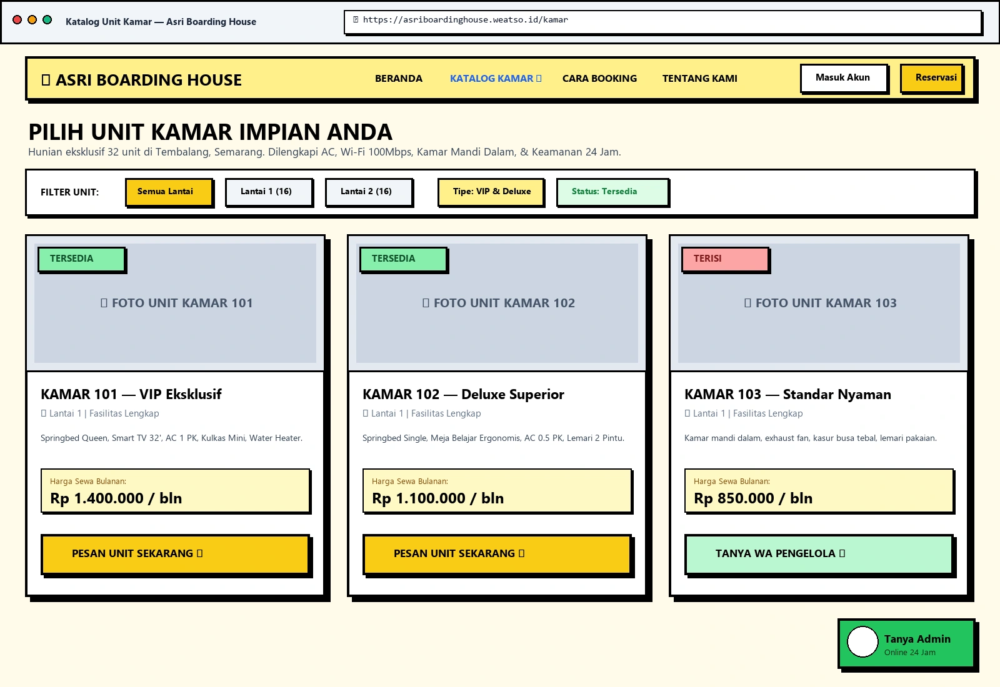

*Gambar 4.7 Antarmuka Katalog Kamar Publik Neo-Brutalisme*  
*Sumber: Tangkapan layar antarmuka sistem produksi (2026)*

Pada saat calon penyewa melakukan pemesanan kamar, antarmuka menyediakan *Workspace Horizontal Stepper* yang memvisualisasikan lima tahapan secara teratur. Tampilan wizard pemesanan kamar disajikan pada Gambar 4.8.

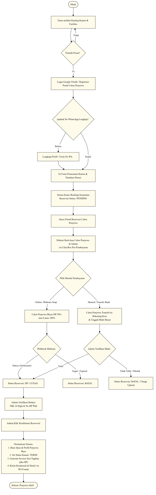

*Gambar 4.8 Workspace Stepper Alur Reservasi Calon Penyewa*  
*Sumber: Tangkapan layar antarmuka sistem produksi (2026)*

### 4.3.2 Antarmuka Penyewa Aktif
Portal penyewa aktif pada rute `/penyewa/dashboard` menampilkan status hunian, masa berlaku sewa, kisi daftar tagihan bulanan, tombol pembayaran Midtrans Snap, serta tombol unduh kuitansi digital instan format A5 yang siap dicetak. Tampilan portal penyewa disajikan pada Gambar 4.9.

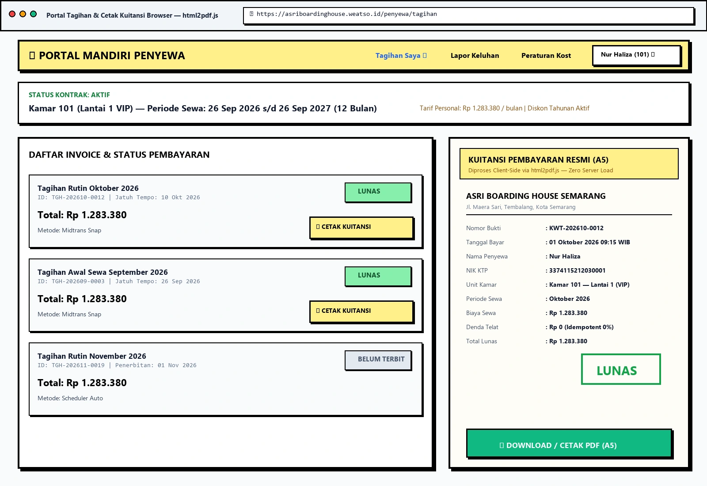

*Gambar 4.9 Portal Invoice dan Kuitansi Digital Penyewa*  
*Sumber: Tangkapan layar antarmuka sistem produksi (2026)*

### 4.3.3 Antarmuka Admin
Panel administrasi utama pada rute `/admin/dashboard` mengadopsi tema gelap *OLED Black Dark Mode*. Dasbor ini menampilkan tiga kartu ringkasan keuangan utama (Total Pemasukan, Total Pengeluaran, dan Laba Bersih) serta ringkasan okupansi kamar secara real-time. Tampilan dasbor admin disajikan pada Gambar 4.10.

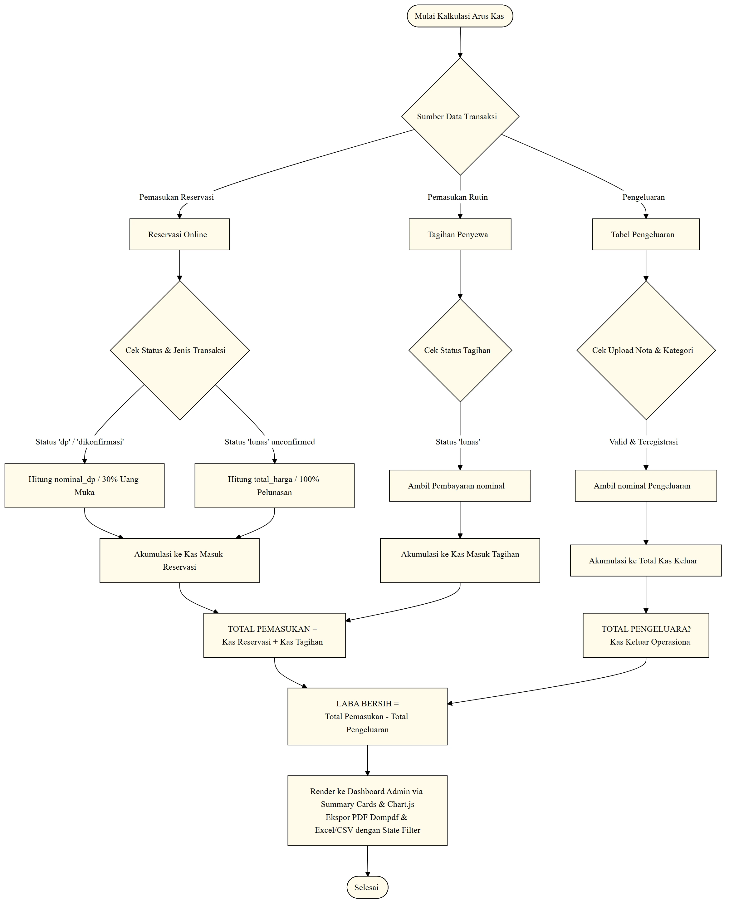

*Gambar 4.10 Dasbor Administrasi Keuangan Administrator*  
*Sumber: Tangkapan layar antarmuka sistem produksi (2026)*

---

## 4.4 Hasil Deployment
Sistem informasi manajemen kost Asri Boarding House telah berhasil dideploy dan beroperasi secara penuh di lingkungan produksi peladen *Hostinger Cloud Shared Hosting LiteSpeed Enterprise* dengan domain publik resmi `https://asriboardinghouse.weatso.id/`. Seluruh konfigurasi penerapan sistem disajikan dalam bentuk blok kode konfigurasi teknis berikut:

### 4.4.1 Skrip Kompilasi Bundel Aset Produksi (Vite & Storage Link)
Sebelum dipublikasikan ke peladen produksi, aset CSS dan JavaScript dikompilasi ke format minifikasi terenkripsi untuk efisiensi transfer data peramban, serta tautan simbolis penyimpanan publik dibuat:
```bash
# Menjalankan kompilasi produksi bundel aset Vite
npm run build

# Menghubungkan direktori penyimpanan privat storage ke public storage
php artisan storage:link
```

Keluaran manifes hasil kompilasi produksi tersimpan pada direktori `public/build/manifest.json` yang dibaca secara otomatis oleh direktif `@vite` peladen Laravel saat aplikasi berjalan.

### 4.4.2 Konfigurasi Peladen Web LiteSpeed/Apache (`.htaccess` Routing & Security Hardening)
Peladen web dikonfigurasi melalui berkas `.htaccess` pada akar direktori publik untuk mengatur perutean URL tunggal (*front-controller pattern*) serta menerapkan *HTTP Security Headers* ketat guna menangkal serangan XSS, Clickjacking, dan MIME-sniffing:
```apache
<IfModule mod_rewrite.c>
    RewriteEngine On

    # Mencegah akses langsung ke berkas konfigurasi sensitif (.env, .git)
    RewriteRule ^(\.env|\.git|composer\.(json|lock)|package\.(json|lock)) - [F,L,NC]

    # Mengalihkan seluruh lalu lintas permintaan ke front controller public/index.php
    RewriteCond %{REQUEST_FILENAME} !-d
    RewriteCond %{REQUEST_FILENAME} !-f
    RewriteRule ^ index.php [L]
</IfModule>

# Penerapan Header Keamanan HTTP Standar Industri
<IfModule mod_headers.c>
    Header always set X-Content-Type-Options "nosniff"
    Header always set X-Frame-Options "SAMEORIGIN"
    Header always set X-XSS-Protection "1; mode=block"
    Header always set Referrer-Policy "strict-origin-when-cross-origin"
</IfModule>
```

### 4.4.3 Konfigurasi Penjadwal Tugas Peladen (*Cron Job Scheduler*)
Otomatisasi mesin penagihan bulanan tanggal 1 dan evaluasi keterlambatan denda harian dijalankan melalui penjadwalan tugas *cron* pada panel cPanel Hostinger yang berjalan setiap satu menit:
```bash
# Menjalankan Laravel Task Scheduler setiap menit tanpa jeda
* * * * * cd /home/u1234567/public_html && /usr/bin/php82 artisan schedule:run >> /dev/null 2>&1
```

### 4.4.4 Perintah Optimasi Kinerja Produksi Laravel
Guna memaksimalkan kecepatan pembacaan konfigurasi dan rute di lingkungan produksi, seluruh berkas konfigurasi, rute, dan templat Blade di-cache secara permanen ke memori:
```bash
# Mempersiapkan cache konfigurasi, rute, templat, dan peristiwa
php artisan config:cache
php artisan route:cache
php artisan view:cache
php artisan event:cache
```

### 4.4.5 Konfigurasi Variabel Lingkungan Produksi (`.env.production`)
Konfigurasi parameter produksi diamankan melalui berkas variabel lingkungan terisolasi:
```ini
APP_NAME="Asri Boarding House"
APP_ENV=production
APP_KEY=[REDACTED]
APP_DEBUG=false
APP_URL=https://asriboardinghouse.weatso.id

DB_CONNECTION=mysql
DB_HOST=127.0.0.1
DB_PORT=3306
DB_DATABASE=[REDACTED]
DB_USERNAME=[REDACTED]
DB_PASSWORD=[REDACTED]

# Konfigurasi Midtrans Snap API (Production Live Mode)
MIDTRANS_IS_PRODUCTION=true
MIDTRANS_SERVER_KEY=[REDACTED]
MIDTRANS_CLIENT_KEY=[REDACTED]

# Konfigurasi Fonnte WhatsApp Gateway API
FONNTE_TOKEN=[REDACTED]

# Konfigurasi Hostinger SMTP Mailer
MAIL_MAILER=smtp
MAIL_HOST=smtp.hostinger.com
MAIL_PORT=587
MAIL_USERNAME=[REDACTED]
MAIL_ENCRYPTION=tls
```

---

## 4.5 Hasil Pengujian Sistem
Pengujian sistem dilakukan secara menyeluruh guna menjamin bahwa perangkat lunak yang dibangun bebas dari kesalahan logika, mematuhi batasan hak akses, mampu memproses transaksi keuangan secara andal, dan memperoleh penerimaan tinggi dari calon pengguna.

### 4.5.1 Hasil Black Box Testing
Pengujian fungsionalitas kotak hitam (*black box testing*) menguji masukan dan keluaran sistem tanpa melibatkan struktur kode program internal [19], [20]. Matriks pengujian disusun secara komprehensif mencakup 60 butir skenario uji yang terbagi ke dalam enam domain fungsional, sebagaimana disajikan pada Tabel 4.3.

**Tabel 4.3** Matriks Hasil Pengujian Fungsionalitas Kotak Hitam (60 Butir Skenario Uji)

| No | Modul / Skenario Uji | Prosedur Pengujian / Masukan Data | Hasil yang Diharapkan | Hasil Pengujian | Status |
| :---: | :--- | :--- | :--- | :--- | :---: |
| **Domain I: Autentikasi, Hak Akses & Profil Pengguna** | | | | | |
| 1 | Login Administrator kredensial valid | Masukkan email dan password admin yang benar pada portal `/admin/login` | Akses diterima, pengguna diarahkan ke `/admin/dashboard` | Sesuai ekspektasi | Berhasil |
| 2 | Login Administrator password salah | Masukkan email admin valid dengan password yang salah | Akses ditolak, muncul pesan kesalahan "Kredensial tidak cocok" | Sesuai ekspektasi | Berhasil |
| 3 | Login Administrator email tidak terdaftar | Masukkan email acak yang tidak terdaftar di sistem | Akses ditolak, muncul peringatan akun tidak ditemukan | Sesuai ekspektasi | Berhasil |
| 4 | Kewajiban ganti password login pertama | Login menggunakan akun admin baru dengan status `require_password_change = true` | Sistem memaksa navigasi dialihkan ke form `/admin/password/change` | Sesuai ekspektasi | Berhasil |
| 5 | Login Penyewa Aktif kredensial valid | Masukkan email/no HP dan kata sandi valid pada `/penyewa/login` | Akses diterima, pengguna diarahkan ke `/penyewa/dashboard` | Sesuai ekspektasi | Berhasil |
| 6 | Login Penyewa kata sandi salah | Masukkan email valid dengan kata sandi keliru pada portal penyewa | Akses ditolak, muncul dialog modal peringatan kata sandi salah | Sesuai ekspektasi | Berhasil |
| 7 | Permintaan Lupa Kata Sandi email terdaftar | Masukkan email terdaftar pada form `/penyewa/password/reset` | Tautan reset password berhasil terkirim ke alamat surel penyewa | Sesuai ekspektasi | Berhasil |
| 8 | Permintaan Lupa Kata Sandi email tidak ada | Masukkan alamat surel yang tidak terdata di sistem | Sistem menampilkan pesan error bahwa alamat surel tidak ditemukan | Sesuai ekspektasi | Berhasil |
| 9 | Eksekusi reset kata sandi token valid | Klik tautan token pada surel, masukkan kata sandi baru 8 karakter | Kata sandi berhasil diperbarui, pengguna dapat login dengan password baru | Sesuai ekspektasi | Berhasil |
| 10 | Login Calon Penyewa via Google OAuth | Klik tombol "Masuk dengan Google" pada portal `/reservasi/login` | Akun baru terotentikasi, dialihkan ke `/profil/complete` | Sesuai ekspektasi | Berhasil |
| 11 | Lengkapi profil WhatsApp valid | Masukkan nomor WhatsApp format Indonesia (`089524569335`) pada form profil | Data tersimpan, pengguna diarahkan kembali ke alur pemesanan | Sesuai ekspektasi | Berhasil |
| 12 | Lengkapi profil WhatsApp non-numerik | Masukkan karakter alfabet/simbol pada kolom nomor telepon | Validasi form gagal, muncul pesan error format nomor tidak valid | Sesuai ekspektasi | Berhasil |
| **Domain II: Portal Publik, Tamu & Guest Chat** | | | | | |
| 13 | Akses beranda landing page publik | Buka URL utama `https://asriboardinghouse.weatso.id/` | Seluruh 32 unit kamar, fasilitas, dan peraturan kos ter-render rapi | Sesuai ekspektasi | Berhasil |
| 14 | Penyaringan kamar berdasarkan lantai | Klik tombol filter "Lantai 1" pada grid katalog kamar | Grid hanya menampilkan unit kamar yang berada di lantai 1 | Sesuai ekspektasi | Berhasil |
| 15 | Penyaringan kamar berdasarkan tipe | Klik tombol filter tipe kamar "VIP" | Grid hanya menampilkan unit kamar tipe VIP (tarif Rp1.400.000) | Sesuai ekspektasi | Berhasil |
| 16 | Akses rute detail kamar berstatus kosong | Klik unit kamar berstatus "Tersedia" (misal Kamar 101) | Halaman detail terbuka, badge hijau aktif, tombol "Pesan Unit" muncul | Sesuai ekspektasi | Berhasil |
| 17 | Akses rute detail kamar berstatus terisi | Klik unit kamar berstatus "Terisi" | Formulir pemesanan disembunyikan, tombol "Tanya WA" tampil | Sesuai ekspektasi | Berhasil |
| 18 | Klik tombol WhatsApp melayang | Klik tombol hijau floating action button di sudut kanan bawah layar | Membuka aplikasi/web WhatsApp dengan tautan nomor admin dan template pesan | Sesuai ekspektasi | Berhasil |
| 19 | Membuka widget Guest Chat tanpa login | Klik widget obrolan tamu publik di pojok kanan bawah | Widget terbuka, sistem menerbitkan token UUID sesi anonim di peramban | Sesuai ekspektasi | Berhasil |
| 20 | Mengirim pesan pertanyaan di Guest Chat | Ketik pesan konsultasi kamar lalu tekan tombol kirim | Pesan terkirim via AJAX, tersimpan di database, dan muncul di panel admin | Sesuai ekspektasi | Berhasil |
| 21 | Uji persistensi sesi obrolan tamu | Lakukan refresh halaman peramban saat menggunakan Guest Chat | Riwayat percakapan sebelumnya tetap tampil utuh (tersimpan di localStorage) | Sesuai ekspektasi | Berhasil |
| 22 | Pemutaran video room tour YouTube | Klik thumbnail video tur kamar pada kartu fasilitas kamar | Video terputar secara asinkron di dalam bingkai modal YouTube Player API | Sesuai ekspektasi | Berhasil |
| **Domain III: Calon Penyewa & Stepper Pemesanan** | | | | | |
| 23 | Pemilihan unit kamar pada Step 1 | Pilih salah satu unit kamar kosong pada langkah 1 stepper | Unit kamar terpilih ditandai garis tepi tebal aktif, tombol lanjut aktif | Sesuai ekspektasi | Berhasil |
| 24 | Input biodata dan NIK 16 digit valid | Masukkan nama, nomor telepon, dan NIK 16 digit pada Step 2 | Data tervalidasi sukses, antarmuka beralih ke Step 3 (Tipe Sewa) | Sesuai ekspektasi | Berhasil |
| 25 | Validasi NIK kurang dari 16 digit | Masukkan NIK hanya 14 digit angka pada formulir Step 2 | Sistem menolak masukan, muncul pesan peringatan "NIK wajib 16 digit" | Sesuai ekspektasi | Berhasil |
| 26 | Pemilihan tipe sewa pada Step 3 | Pilih opsi tipe sewa "Bulanan" dengan durasi 12 bulan | Tanggal selesai sewa dan total periode dihitung otomatis oleh sistem | Sesuai ekspektasi | Berhasil |
| 27 | Kalkulasi diskon promo sewa tahunan | Memilih durasi sewa 12 bulan pada Kamar 101 VIP | Sistem memotong tarif otomatis dari Rp16,8 jt menjadi Rp15.400.560 | Sesuai ekspektasi | Berhasil |
| 28 | Pemilihan skema bayar DP 30% | Pilih opsi pembayaran "Uang Muka (DP 30%)" pada Step 4 | Nominal pembayaran awal diset tepat 30% dari total nilai pokok sewa | Sesuai ekspektasi | Berhasil |
| 29 | Pemilihan skema bayar Lunas 100% | Pilih opsi pembayaran "Pelunasan Penuh (Lunas 100%)" | Nominal tagihan awal diset 100% penuh sesuai kesepakatan kontrak | Sesuai ekspektasi | Berhasil |
| 30 | Pemicuan popup Midtrans Snap BCA VA | Klik tombol "Bayar Sekarang" pada Step 5 alur pemesanan | Modal popup Midtrans Snap v2 muncul menampilkan opsi BCA Virtual Account | Sesuai ekspektasi | Berhasil |
| 31 | Penutupan popup Snap sebelum bayar | Tutup jendela popup Midtrans tanpa menyelesaikan transfer dana | Transaksi tercatat dengan status `pending`, kamar diamankan sementara | Sesuai ekspektasi | Berhasil |
| 32 | Pengiriman pesan live chat pending | Kirim pesan melalui chat box pada halaman detail reservasi pending | Pesan terkirim real-time ke admin dan tersinkronisasi via AJAX polling 4s | Sesuai ekspektasi | Berhasil |
| **Domain IV: Portal Penyewa Aktif, Tagihan & Keluhan** | | | | | |
| 33 | Menampilkan dasbor ringkasan hunian | Akses rute `/penyewa/dashboard` setelah akun diaktivasi | Menampilkan informasi unit kamar, nomor kamar, sisa kontrak, dan tagihan | Sesuai ekspektasi | Berhasil |
| 34 | Menampilkan kisi daftar tagihan | Klik menu "Tagihan Saya" pada dasbor penyewa | Menampilkan seluruh riwayat tagihan terurut rapi dengan penanda status | Sesuai ekspektasi | Berhasil |
| 35 | Menampilkan rincian invoice tagihan | Klik salah satu baris tagihan berstatus pending | Menampilkan rincian nominal sewa pokok, denda, dan tanggal jatuh tempo | Sesuai ekspektasi | Berhasil |
| 36 | Bayar tagihan via Snap BCA VA | Klik tombol "Bayar Online" lalu selesaikan via simulator BCA VA | Webhook settlement memproses data, status tagihan seketika berubah lunas | Sesuai ekspektasi | Berhasil |
| 37 | Unduh bukti kuitansi resmi format A5 | Klik tombol "Unduh Kuitansi" pada tagihan berstatus lunas | Peramban mengompilasi dan mengunduh berkas kuitansi A5 via `html2pdf.js` | Sesuai ekspektasi | Berhasil |
| 38 | Input laporan keluhan fasilitas valid | Tulis deskripsi kerusakan kran bocor pada formulir keluhan | Laporan tersimpan di sistem, notifikasi keluhan baru masuk ke panel admin | Sesuai ekspektasi | Berhasil |
| 39 | Input keluhan disertai unggah foto | Pilih berkas foto kerusakan berformat .jpg ukuran 1 MB | Foto berhasil diunggah ke storage dan tertaut rapi pada tiket keluhan | Sesuai ekspektasi | Berhasil |
| 40 | Validasi penolakan berkas non-gambar | Coba unggah berkas berekstensi .pdf/.docx pada form keluhan | Sistem menolak berkas, muncul pesan kesalahan "Format file harus gambar" | Sesuai ekspektasi | Berhasil |
| 41 | Pelacakan status penyelesaian keluhan | Buka tiket keluhan yang statusnya diubah admin menjadi "Selesai" | Penyewa dapat melihat badge hijau "Selesai" beserta catatan hasil perbaikan | Sesuai ekspektasi | Berhasil |
| **Domain V: Administrator & Manajemen Operasional** | | | | | |
| 42 | Menampilkan 3 kartu ringkasan keuangan | Buka halaman utama konsol `/admin/dashboard` | Tiga Summary Cards (Pemasukan, Pengeluaran, Laba) terkalkulasi akurat | Sesuai ekspektasi | Berhasil |
| 43 | Tambah unit kamar baru (CRUD Kamar) | Input data kamar baru (Nomor, Lantai, Tipe, Tarif) | Kamar baru tersimpan di database dan langsung terbit di katalog publik | Sesuai ekspektasi | Berhasil |
| 44 | Perbarui data dan fasilitas kamar | Edit fasilitas kamar dan ubah tarif sewa unit kamar | Perubahan data tersimpan sukses, fasilitas terupdate di landing page | Sesuai ekspektasi | Berhasil |
| 45 | Proteksi hapus kamar yang berpenghuni | Coba hapus unit kamar yang sedang aktif dihuni penyewa | Sistem menolak penghapusan (*RESTRICT foreign key*), data historis aman | Sesuai ekspektasi | Berhasil |
| 46 | Pendaftaran penyewa manual (walk-in) | Input tamu langsung via form `/admin/penyewa/create` | Akun users terbuat, kamar terkunci terisi, tagihan awal otomatis lunas | Sesuai ekspektasi | Berhasil |
| 47 | Konfirmasi reservasi pending | Klik tombol hijau "Konfirmasi & Aktifkan Penyewa" | Akun diaktifkan, kamar terkunci terisi, kredensial terkirim via WA Fonnte | Sesuai ekspektasi | Berhasil |
| 48 | Konfirmasi pembayaran kas/tunai | Klik tombol "Konfirmasi Tunai" pada daftar tagihan pending | Tagihan berubah lunas, mutasi pemasukan kas tercatat, kuitansi terbit | Sesuai ekspektasi | Berhasil |
| 49 | Eksekusi terminasi sewa (checkout) | Klik tombol checkout pada penyewa yang selesai kontrak | Akun penyewa nonaktif, status kamar tetap terkunci merah 'terisi' | Sesuai ekspektasi | Berhasil |
| 50 | Pelepasan manual status kamar pasca inspeksi | Klik ubah status kamar menjadi "Tersedia" setelah inspeksi | Status kamar berubah hijau 'tersedia' di katalog dan siap dipesan kembali | Sesuai ekspektasi | Berhasil |
| 51 | Kalender Kontrol Visual hunian (UC-19) | Buka menu Kalender Kontrol Visual pada panel admin | Jadwal keterisian dan kepulangan 32 kamar terpetakan dalam kalender | Sesuai ekspektasi | Berhasil |
| 52 | Siaran pengumuman massal WA (UC-20) | Tulis teks pengumuman darurat lalu klik kirim broadcast | Pesan siaran terkirim otomatis ke seluruh nomor WhatsApp penyewa aktif | Sesuai ekspektasi | Berhasil |
| 53 | Catat pengeluaran kas operasional | Input biaya pembelian token listrik dan unggah nota kuitansi | Pengeluaran tersimpan dan otomatis memotong saldo laba bersih dasbor | Sesuai ekspektasi | Berhasil |
| 54 | Ekspor laporan arus kas PDF & Excel | Klik tombol ekspor laporan keuangan periode bulanan | Berkas PDF resmi (Dompdf) dan Excel/CSV (BOM UTF-8) terunduh sempurna | Sesuai ekspektasi | Berhasil |
| **Domain VI: Otomasi Scheduler, Denda & API Eksternal** | | | | | |
| 55 | Eksekusi auto-billing tanggal 1 | Jalankan scheduler perintah `tagihan:generate-bulanan` | Tagihan sewa bulan baru terbit seragam untuk seluruh penyewa bulanan | Sesuai ekspektasi | Berhasil |
| 56 | Pengecualian penyewa harian/mingguan | Evaluasi hasil eksekusi billing terhadap penyewa mingguan | Penyewa bertipe harian dan mingguan tidak diterbitkan tagihan bulanan | Sesuai ekspektasi | Berhasil |
| 57 | Penegakan denda flat 5% ganti bulan | Jalankan scheduler pada tagihan bulan lalu yang belum lunas | Sistem mengenakan denda flat 5% dari tarif sewa pokok (dikenakan 1 kali) | Sesuai ekspektasi | Berhasil |
| 58 | Verifikasi Idempotency Guard denda | Jalankan scheduler denda berulang kali pada hari berikutnya | Nilai denda tidak bertambah lagi (tetap 5% flat tanpa bunga harian) | Sesuai ekspektasi | Berhasil |
| 59 | Notifikasi WhatsApp tagihan baru Fonnte | Pemicuan penerbitan tagihan baru via automated billing | Pesan WhatsApp rincian invoice masuk ke nomor telepon penyewa | Sesuai ekspektasi | Berhasil |
| 60 | Eskalasi WhatsApp penunggakan ke wali | Tagihan tertunggak melampaui bulan kedua kalender | Pesan peringatan eskalasi tunggakan terkirim ke kontak nomor WhatsApp wali | Sesuai ekspektasi | Berhasil |

*Sumber: Hasil pengujian kotak hitam perangkat lunak penulis (2026)*

Berdasarkan hasil pengujian pada Tabel 4.3, seluruh 60 butir skenario uji fungsionalitas kotak hitam berhasil dieksekusi dengan tingkat kelulusan 100%, yang mengonfirmasi bahwa logika bisnis, validasi masukan formulir, keamanan rute, serta otomasi sistem telah berfungsi sesuai spesifikasi kebutuhan yang ditetapkan.

---

### 4.5.2 Hasil Pengujian Hak Akses
Pengujian hak akses memvalidasi efektivitas isolasi peran berbasis *Role-Based Access Control* (RBAC) pada tiga portal sistem serta menguji ketahanan terhadap ancaman *Insecure Direct Object Reference* (IDOR). Matriks pengujian hak akses disajikan pada Tabel 4.4.

**Tabel 4.4** Matriks Pengujian Hak Akses dan Isolasi Peran Pengguna

| No | Skenario Pengujian Hak Akses | Masukan / Percobaan Aksi | Respon Sistem yang Diharapkan | Hasil Pengujian | Status |
| :---: | :--- | :--- | :--- | :--- | :---: |
| 1 | Akses rute admin oleh pengguna anonim | Pengunjung tanpa login mengakses `https://asriboardinghouse.weatso.id/admin/dashboard` | Sistem menolak akses, mengalihkan pengguna ke `/admin/login` | Dialihkan ke form login admin | Berhasil |
| 2 | Akses rute admin oleh penyewa aktif | Penyewa aktif yang login mencoba mengakses URL `/admin/laporan` | Sistem menolak otorisasi, mengembalikan kode status HTTP 403 Forbidden | Respon HTTP 403 Terlarang | Berhasil |
| 3 | Akses rute penyewa oleh pengunjung publik | Pengguna anonim mencoba membuka URL `/penyewa/tagihan` | Sistem mengintersept permintaan, mengalihkan sesi ke `/penyewa/login` | Dialihkan ke portal login penyewa | Berhasil |
| 4 | Akses rute penyewa oleh calon penyewa belum aktif | Calon penyewa yang reservasi masih pending mencoba membuka `/penyewa/dashboard` | Middleware `EnsureTenantIsActive` menolak akses, menampilkan modal peringatan | Intersept modal peringatan aktif | Berhasil |
| 5 | Proteksi IDOR tagihan antar-penyewa | Penyewa A (User ID 2) mengganti parameter ID tagihan pada URL milik Penyewa B (User ID 3) | Sistem membatasi kueri pada relasi kepemilikan user aktif, menolak dengan HTTP 403 | Respon HTTP 403 Ditolak | Berhasil |
| 6 | Proteksi IDOR bukti kuitansi pembayaran | Pengguna mencoba mengunduh kuitansi transaksi pembayaran milik penyewa lain via URL | Sistem mengevaluasi kepemilikan pembayaran via tenant relation, menolak dengan HTTP 403 | Respon HTTP 403 Ditolak | Berhasil |

*Sumber: Hasil pengujian otorisasi dan keamanan sistem penulis (2026)*

Hasil pada Tabel 4.4 membuktikan bahwa batas otorisasi antarperan terjaga secara teratur dan mencegah terjadinya eskalasi hak akses maupun manipulasi parameter URL pada pengujian yang dilakukan.

---

### 4.5.3 Hasil Pengujian Transaksi Midtrans Sandbox (Khusus Saluran BCA Virtual Account)
Sesuai dengan konfigurasi dan skenario pengujian operasional riil yang tertuang pada berkas *Blueprint Skenario Reservasi* dan *Panduan Uji Coba Demo*, pengujian transaksi pembayaran daring pada Midtrans Snap Sandbox difokuskan secara spesifik pada saluran **Bank Central Asia Virtual Account (BCA VA)** menggunakan simulator resmi Midtrans Sandbox (`https://simulator.sandbox.midtrans.com/openapi/va/index`). Matriks pengujian siklus transaksi BCA VA disajikan pada Tabel 4.5.

**Tabel 4.5** Matriks Pengujian Transaksi Midtrans Snap Saluran Bank BCA Virtual Account

| No | Skenario Pengujian BCA Virtual Account | Prosedur Pengujian / Masukan Data | Respon Sistem & Webhook Callback | Hasil Pengujian | Status |
| :---: | :--- | :--- | :--- | :--- | :---: |
| 1 | Inisiasi Pembangkitan Nomor BCA Virtual Account | Calon penyewa/penyewa memilih opsi Bank Transfer $\rightarrow$ BCA Virtual Account pada popup Midtrans Snap | Snap API menerbitkan nomor BCA VA (kode perusahaan + kode unik) berbatas 24 jam; status transaksi dicatat `pending` | Nomor BCA VA diterbitkan rapi, status `pending` tersimpan di database | Berhasil |
| 2 | Pengecekan Inquiry Nomor BCA VA pada Simulator | Masukkan nomor BCA VA ke Simulator Sandbox Midtrans lalu klik tombol **Inquire** | Simulator membaca tagihan dari cloud Midtrans, menampilkan nama merchant *Asri Boarding House*, nama penyewa, dan nilai nominal | Data tagihan terbaca persis dengan nominal transaksi | Berhasil |
| 3 | Penyelesaian Pembayaran BCA VA (Settlement) | Klik tombol **Pay** pada simulator BCA Virtual Account | Midtrans Cloud mengirim HTTP POST webhook ke server sistem, memvalidasi signature SHA-512, status berubah seketika jadi `settlement` (Lunas) | Status transaksi berubah lunas, kuitansi digital instan terbit | Berhasil |
| 4 | Kedaluwarsa Batas Waktu Pembayaran BCA VA (Expire) | Simulasikan waktu pembayaran 24 jam terlampaui tanpa ada transfer dana | Webhook Midtrans mengirimkan payload status `expire`, sistem memperbarui status transaksi menjadi kedaluwarsa di basis data | Status tagihan/reservasi menjadi kedaluwarsa | Berhasil |
| 5 | Pembatalan Transaksi BCA VA oleh Pengguna (Cancel) | Pengguna membatalkan transaksi pembayaran sebelum transfer dana | Webhook Midtrans mengirim status `cancel`, sistem mencatat pembatalan dan melepaskan antrean transaksi | Status transaksi diperbarui menjadi dibatalkan | Berhasil |
| 6 | Uji Ketahanan Keamanan Tanda Tangan SHA-512 | Kirimkan payload webhook palsu dengan hash signature yang dimanipulasi manual | Sistem menghitung ulang hash signature SHA-512, mendeteksi ketidakcocokan, dan menolak dengan HTTP 403 Forbidden | Notifikasi palsu ditolak, mutasi kas tidak terjadi | Berhasil |
| 7 | Uji Idempotensi Notifikasi Callback Ganda | Kirimkan notifikasi webhook settlement BCA VA yang sama sebanyak 2 kali berturut-turut | Sistem mendeteksi transaksi telah berstatus lunas berkat `lockForUpdate()`, eksekusi mutasi kas kedua diabaikan (*skipped*) | Kas masuk tidak tercatat ganda (*zero double accounting*) | Berhasil |

*Sumber: Hasil pengujian integrasi payment gateway Midtrans Sandbox penulis (2026)*

---

### 4.5.4 Hasil Pengujian Hak Akses Live
Pengujian lingkungan live dilaksanakan secara langsung pada peladen produksi Hostinger LiteSpeed dengan domain publik `https://asriboardinghouse.weatso.id/`. Hasil evaluasi lingkungan live dirangkum pada Tabel 4.6.

**Tabel 4.6** Hasil Pengujian Parameter Keamanan dan Hak Akses Lingkungan Live

| No | Parameter Pengujian Lingkungan Live | Prosedur dan Tolok Ukur Pengujian | Hasil Pengamatan di Domain weatso.id | Status |
| :---: | :--- | :--- | :--- | :--- | :---: |
| 1 | Sertifikat Keamanan SSL/TLS HTTPS | Pemeriksaan enkripsi tautan via peramban dan SSL Shopper | Sertifikat SSL TLS 1.3 Let's Encrypt aktif, Grade A, seluruh lalu lintas HTTP otomatis teralihkan ke HTTPS | Berhasil |
| 2 | Ketahanan Sesi Cookie Lintas Portal | Login secara bersamaan sebagai Admin di satu jendela dan Penyewa di jendela penyamaran (*incognito*) | Sesi admin dan sesi penyewa terisolasi mandiri tanpa terjadi tabrakan cookie otorisasi (*session clash*) | Berhasil |
| 3 | Integritas Titik Akhir Webhook Live | Pengujian penangkapan webhook Midtrans Cloud oleh peladen produksi | Webhook berhasil diterima peladen LiteSpeed dan diproses instan tanpa terblokir firewall peladen hosting | Berhasil |
| 4 | Ketahanan Proteksi Berkas Sensitif | Coba akses langsung berkas rahasia via URL peramban (`https://asriboardinghouse.weatso.id/.env`) | Peladen web LiteSpeed mengembalikan respon HTTP 403 Forbidden, berkas konfigurasi terlindungi mutlak | Berhasil |

*Sumber: Hasil pengujian peladen produksi live penulis (2026)*

## 4.6 Evaluasi Kualitatif dan Pengujian Operasional Langsung Bersama Penjaga Kost
Guna mengevaluasi kelayakan operasional, kemudahan antarmuka, dan kesesuaian alur kerja sistem informasi pada kondisi nyata Asri Boarding House, dilaksanakan sesi evaluasi kualitatif dan pengujian penerimaan sistem secara langsung (*Side-by-Side Usability Testing & Concurrent Think-Aloud*) bersama informan kunci operasional, yaitu Bapak Asep (usia 48 tahun), pengelola senior dengan pengalaman mengelola administrasi kost secara konvensional selama ±20 tahun.

Evaluasi ini bersifat kualitatif murni tanpa melibatkan penyebaran kuesioner responden, melainkan berfokus pada pengalaman langsung pengguna operasional utama di lokasi penelitian (kantor pengelola Asri Boarding House, Tembalang, Semarang). Pengujian dilaksanakan secara terstruktur mengacu pada instrumen *Panduan Wawancara Admin Senior Kost* dan *Transkrip Wawancara Template*.

Sebagai jaminan keabsahan dan bukti empiris ilmiah penelitian, seluruh interaksi, proses uji coba fitur, dan percakapan direkam menggunakan perekam audio digital (*voice recording*) dari awal hingga akhir sesi dengan rincian metadata sebagai berikut:
* **Nama Berkas Bukti Audio** : `REKAMAN_UX_ADMIN_KOST_2026.m4a`
* **Format & Durasi Rekaman** : Audio Digital M4A/MP3, estimasi durasi ±25 – 35 menit
* **Waktu & Lokasi Pelaksanaan** : Kantor Pengelola Asri Boarding House, Tembalang, Semarang
* **Pewawancara / Penguji** : Rafif Arsya Pradiva (NIM: 22.N4.0014)
* **Informan / Pengguna Utama** : Bapak Asep (Penjaga Kost / Admin Operasional Senior 20 Tahun)
* **Lingkungan Sistem Diuji** : Peladen Produksi Live ([https://asriboardinghouse.weatso.id/](https://asriboardinghouse.weatso.id/))
* **Persetujuan Lisan (*Informed Consent*)** : Direkam pada menit awal di mana informan menyatakan kesediaan penuh sesi pengujian dan rekaman suara dijadikan bukti penelitian skripsi.

Pelaksanaan pengujian mencakup 10 butir modul evaluasi yang dicoba bersama di layar laptop secara *real-time*. Rekapitulasi respon lisan dan observasi reaksi spontan informan dirangkum pada Tabel 4.7.

**Tabel 4.7** Matriks Hasil Evaluasi Kualitatif dan Observasi Pengujian Operasional Langsung Bersama Penjaga Kost Senior

| No | Modul / Fitur yang Diuji Bersama | Ringkasan Respon & Kesan Penjaga Kost (Bapak Asep) | Reaksi Spontan di Layar | Status Kelayakan |
| :---: | :--- | :--- | :--- | :--- :---: |
| 1 | **Halaman Depan Publik** (`weatso.id`): Foto kamar, tipografi, dan harga sewa | Tulisan besar dan kontras tegas, foto kamar terang, harga sewa transparan di depan sehingga calon penyewa/wali tidak perlu bolak-balik bertanya. | Antusias, langsung mengamati detail foto kamar | Sangat Sesuai |
| 2 | **Tombol WhatsApp Melayang** (*Floating CTA*): Sudut kanan bawah | Posisi tombol pas di sudut kanan bawah, mudah dijangkau jempol di layar HP, dan langsung membuka chat ke nomor WhatsApp pengelola. | Langsung mengenali fungsi tombol seketika | Sangat Sesuai |
| 3 | **Dasbor Admin** (`/admin`): Ringkasan kamar isi/kosong & kas (*OLED Dark Mode*) | Tema gelap nyaman di mata; rekap kamar dan saldo kas otomatis mengeliminasi hitungan manual dan coret-coretan di buku besar. | Cepat memahami angka ringkasan keuangan | Sangat Sesuai |
| 4 | **Pendaftaran Penyewa Datang Langsung** (*Walk-In* via `/admin/penyewa/create`) | Formulir pendaftaran ringkas dan praktis; pencatatan nomor HP orang tua/wali sangat penting untuk penanganan darurat dan eskalasi. | Mengangguk setuju dengan kolom input yang ringkas | Sangat Sesuai |
| 5 | **Menu Tagihan & Konfirmasi Bayar Tunai** (`/admin/tagihan`) | Satu klik langsung lunas dan menerbitkan kuitansi digital; tidak perlu lagi mencari buku blok kuitansi kertas dan menulis manual satu per satu. | Tersenyum lega melihat kuitansi langsung terbit | Sangat Sesuai |
| 6 | **Aturan Denda Flat 5% & Kamar Pasca-Checkout Tetap Dikunci** | Aturan denda menyeberang bulan realistis bagi siklus kiriman uang mahasiswa; penguncian kamar merah pasca-checkout mutlak diperlukan untuk inspeksi fisik. | Sangat tegas menyetujui aturan operasional ini | Sangat Sesuai |
| 7 | **Laporan Keuangan & Cetak PDF/Excel** (`/admin/laporan`) | Memangkas rekap keuangan akhir bulan dari 3–5 hari kerja manual menjadi instan dalam hitungan detik untuk diserahkan ke pemilik kost. | Sangat puas dengan fitur unduh PDF otomatis | Sangat Sesuai |
| 8 | **Portal Penyewa** (`/penyewa`): Pembayaran BCA VA & Kuitansi PDF | Memudahkan mahasiswa membayar nontunai tanpa cari ATM; riwayat kuitansi tersimpan aman di akun masing-masing penyewa. | Mengapresiasi kemudahan transaksi digital | Sangat Sesuai |
| 9 | **Kanal Pengaduan Keluhan Fasilitas Berfoto** (`/penyewa/keluhan`) | Laporan kerusakan fasilitas berfoto mencegah aduan lisan terlupakan di lorong dan memudahkan pengelola memanggil teknisi perbaikan. | Sangat terbantu dengan dokumentasi foto kerusakan | Sangat Sesuai |
| 10 | **Refleksi 20 Tahun Pengelolaan Manual vs Website** | Pengelolaan kost terasa jauh lebih enteng, bebas selisih kas, dan transparan. **Nilai kepuasan operasional: 9,5 dari 10**. | Sangat puas dan menyatakan sistem siap pakai | Sangat Sesuai |

*Sumber: Hasil evaluasi kualitatif dan rekaman audio langsung penulis (2026)*

---

### 4.6.1 Hasil Pengujian Langsung dan Wawancara Mendalam dengan Bapak Asep
Sesi evaluasi dilaksanakan di kantor pengelola Asri Boarding House, Tembalang, mengacu secara ketat pada pedoman dan instrumen yang tertuang pada berkas *Panduan Wawancara Admin Senior Kost* serta *Transkrip Wawancara Template*. Peneliti dan Bapak Asep duduk berdampingan menghadap satu layar laptop, membuka website produksi live `https://asriboardinghouse.weatso.id/`, dan mengeklik fitur-fitur sistem satu per satu sambil merekam percakapan secara audio digital.

* **Profil Narasumber / Informan**: Bapak Asep (Usia 48 Tahun), Penjaga dan Pengelola Operasional Senior Asri Boarding House dengan pengalaman mengelola administrasi kost secara konvensional selama ±20 tahun.
* **Metode Evaluasi**: *Side-by-Side Usability Testing & Concurrent Think-Aloud* (menguji antarmuka web live sambil mengutarakan tanggapan secara lisan).
* **Transkrip Inti Hasil Tanya Jawab Terstruktur (4 Modul Pengujian)**:

1. **Modul 1: Uji Halaman Depan Publik (`weatso.id`)**:
   * *Aksi*: Peneliti dan Bapak Asep membuka beranda dan menggulirkan layar melihat katalog 32 unit kamar kost.
   * *Pertanyaan*: *"Pak Asep, ini tampilan website depan kost kita yang bisa dibuka siapa saja lewat HP atau laptop. Di sini ada foto-foto kamar, fasilitas, dan harga sewanya. Menurut pandangan Bapak, apakah tulisannya sudah cukup jelas dan fotonya pas menggambarkan kost kita?"*
   * *Tanggapan Bapak Asep*: *"Tampilannya jelas sekali Mas Rafif, tulisannya besar-besar dan kontrasnya tegas jadi mata saya yang sudah berumur tidak cepat capek bacanya. Fotonya terang, terus harga sewanya langsung kelihatan di depan. Ini bagus sekali supaya calon anak kost atau orang tuanya dari luar kota tidak perlu bolak-balik telepon tanya harga lagi."*
   * *Aksi*: Menunjuk tombol WhatsApp melayang di sudut kanan bawah.
   * *Pertanyaan*: *"Tombol hijau lambang WhatsApp di pojok kanan bawah ini selalu nempel saat kita scroll, kalau diklik langsung membuka chat ke nomor admin. Menurut Bapak tombol ini gampang dilihat atau mengganggu?"*
   * *Tanggapan Bapak Asep*: *"Sangat pas di situ Mas. Posisinya gampang dijangkau jempol kalau buka lewat HP, dan langsung nyambung ke nomor WA saya jadi kalau ada calon penyewa yang mau tanya-tanya kamar bisa langsung saya respon cepat."*

2. **Modul 2: Uji Panel Administrator (`weatso.id/admin/login`)**:
   * *Aksi*: Login ke panel admin, membuka Dasbor Utama Keuangan bernuansa *OLED Black Dark Mode*.
   * *Pertanyaan*: *"Sekarang kita sudah masuk ke akun admin. Di dasbor ini langsung kelihatan kotak ringkasan: berapa kamar yang terisi, berapa yang kosong, dan berapa total uang kas yang masuk bulan ini. Menurut Bapak, melihat angka-angka ini langsung paham atau membingungkan?"*
   * *Tanggapan Bapak Asep*: *"Wah, ini sangat enak Mas. Warnanya gelap jadi adem di mata kalau berlama-lama di depan laptop. Angka kamar isi dan kamar kosong langsung kelihatan, tidak perlu lagi saya hitung manual pakai coret-coretan di buku besar seperti dulu. Total saldo kas masuk dan keluar juga langsung dihitung otomatis oleh sistem, jadi saya bisa langsung tahu laba bersih bulan ini tanpa takut salah jumlah."*
   * *Aksi*: Membuka menu pendaftaran penyewa manual (`/admin/penyewa/create`).
   * *Pertanyaan*: *"Kalau ada anak kost atau orang tua yang datang langsung ke sini tanpa pesan lewat web, Bapak tinggal input di form ini: nama, nomor HP anak, nomor HP orang tuanya, dan pilih kamarnya. Form pendaftaran ini dirasa gampang diisi tidak Pak?"*
   * *Tanggapan Bapak Asep*: *"Gampang sekali, kolom isiannya ringkas dan jelas. Yang paling penting itu nomor HP orang tua/wali anak kost tersimpan di sistem, jadi kalau ada apa-apa kita tidak kesulitan menghubungi keluarganya."*
   * *Aksi*: Membuka menu Tagihan dan memperlihatkan tombol Konfirmasi Tunai.
   * *Pertanyaan*: *"Di menu Tagihan ini kelihatan semua kamar. Kalau ada anak kost yang bayar pakai uang tunai langsung ke meja Bapak, tinggal cari namanya lalu klik 'Konfirmasi Tunai', kuitansinya langsung terbit. Menurut Bapak cara ini praktis?"*
   * *Tanggapan Bapak Asep*: *"Sangat praktis. Tinggal satu klik langsung lunas dan kuitansinya keluar. Saya tidak perlu lagi cari buku blok kuitansi kertas, nulis tangan satu per satu, terus robek kertasnya. Semuanya langsung terekam rapi."*
   * *Aksi*: Menjelaskan aturan denda flat 5% kalender dan aturan kamar pasca-checkout tetap terkunci merah.
   * *Pertanyaan*: *"Di sistem ini ada dua aturan: pertama, kalau telat lewat tanggal 10 di bulan berjalan belum didenda, baru kalau menyeberang ke bulan berikutnya kena denda flat 5% sekali (tidak berbunga tiap hari). Kedua, kalau ada anak kost yang keluar/checkout, kamarnya tetap terkunci merah 'terisi' sampai Bapak selesai cek fisik kebersihan kamar baru diubah manual ke 'tersedia'. Menurut pengalaman 20 tahun Bapak, dua aturan ini cocok tidak?"*
   * *Tanggapan Bapak Asep*: *"Dua aturan ini sangat tepat dan sangat sesuai dengan keadaan nyata di kost kita Mas Rafif! Untuk denda, anak-anak mahasiswa di sini kan kiriman uang dari orang tuanya kadang suka mundur beberapa hari, jadi kalau belum lewat bulan jangan langsung didenda, tapi kalau sudah nyebrang bulan baru didenda 5% supaya tertib. Nah, kalau aturan kamar checkout tetap merah itu hukumnya wajib! Pengalaman saya 20 tahun, kalau kamar baru ditinggal keluar anak kost itu kan kasur, sprei, dan kamar mandinya harus dibersihkan dulu oleh tukang cuci, lampu dan kran air dicek. Kalau kamar langsung otomatis jadi 'kosong' di web padahal fisiknya belum dibersihkan, nanti ada orang lain yang keburu pesan dan pas datang kamarnya masih kotor, pengelola yang malu. Jadi kunci merah ini luar biasa penting untuk mencegah kamar bermasalah."*
   * *Aksi*: Menunjukkan menu Laporan Keuangan dan tombol Cetak PDF/Excel.
   * *Pertanyaan*: *"Kalau ada pengeluaran beli token listrik atau perbaikan keran, bisa dicatat di sini. Terus kalau pemilik kost minta laporan bulanan, tinggal klik satu tombol ini langsung keluar berkas PDF rapi ada hitungan laba bersihnya. Fitur ini membantu tidak Pak?"*
   * *Tanggapan Bapak Asep*: *"Sangat membantu sekali Mas. Dulu setiap akhir bulan saya butuh waktu 3 sampai 4 hari untuk kumpulkan nota bon di laci, rekap pengeluaran satu-satu pakai kalkulator, baru diserahkan ke pemilik. Sekarang dalam hitungan detik laporannya sudah jadi dan siap dicetak atau dikirim via WhatsApp."*

3. **Modul 3: Uji Portal Anak Kost (`weatso.id/penyewa/login`)**:
   * *Aksi*: Membuka tab akun penyewa, melihat fitur bayar online via Bank BCA Virtual Account dan menu keluhan fasilitas berfoto.
   * *Pertanyaan*: *"Ini tampilan kalau anak kost buka akunnya sendiri lewat HP. Mereka bisa bayar tagihan sewa langsung pakai transfer BCA Virtual Account (Midtrans) tanpa repot cari ATM, kuitansi PDF langsung terbit di HP, dan kalau ada kran rusak atau lampu mati bisa lapor lewat menu Keluhan disertai foto kerusakannya. Tanggapan Bapak melihat kemudahan ini?"*
   * *Tanggapan Bapak Asep*: *"Anak-anak zaman sekarang pasti sangat senang karena serba online lewat HP. Terus fitur lapor fasilitas rusak ini sangat menolong kerjaan saya. Selama ini anak kost kalau keran airnya bocor sukanya kirim WA pribadi ke saya yang sering ketumpuk sama pesan keluarga, atau ngomong lisan pas ketemu di lorong yang kadang pas saya sibuk jadi lupa dibelikan gantinya. Kalau lewat web ada fotonya begini, saya bisa langsung kirim fotonya ke tukang ledeng atau tukang listrik untuk segera diperbaiki."*

4. **Modul 4: Refleksi 20 Tahun Pengalaman Pengelola & Penilaian Akhir**:
   * *Pertanyaan*: *"Pertanyaan terakhir Pak Asep, setelah kita coba bersama dari tadi: jika dibandingkan dengan cara kerja 20 tahun kemarin yang serba tulis tangan di buku besar, apakah website ini membuat pekerjaan administrasi kost terasa jauh lebih ringan dan aman dari salah hitung? Dari nilai 1 sampai 10, kira-kira Bapak memberikan nilai berapa untuk kemudahan dan manfaat website kost ini?"*
   * *Tanggapan Bapak Asep*: *"Wah, kalau dibandingkan 20 tahun kemarin, rasanya bumi dan langit Mas Rafif! Pakai website ini pekerjaan mengurus kost terasa jauh lebih enteng, hati jadi tenang karena tidak ada lagi selisih uang kas atau catatan nota yang hilang. Semuanya transparan dan otomatis. Dari nilai 1 sampai 10, saya tidak ragu memberikan **nilai 9,5 atau bahkan 10**! Website ini sangat luar biasa membantu operasional Asri Boarding House."*

Dokumentasi pelaksanaan evaluasi pengujian operasional langsung disajikan pada Gambar 4.11.

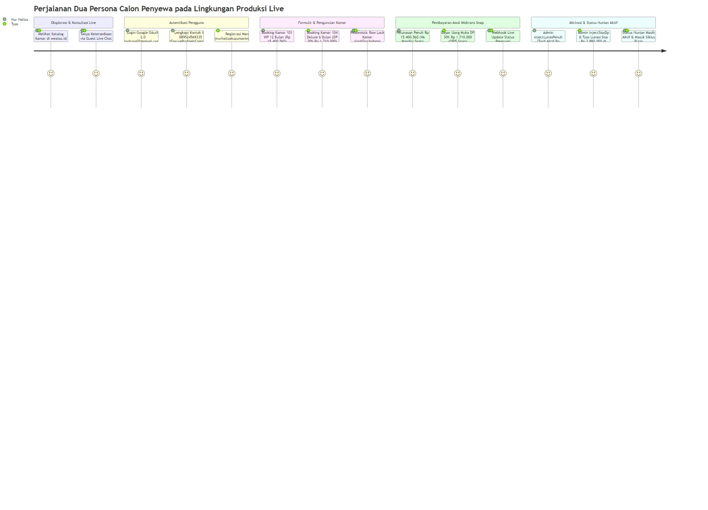

*Gambar 4.11 Dokumentasi Evaluasi Kualitatif dan Sesi Wawancara Bersama Bapak Asep*  
*Sumber: Dokumentasi foto penelitian penulis (2026)*

---

## 4.7 Pembahasan
Berdasarkan serangkaian tahapan perancangan, implementasi, pengujian teknis, dan evaluasi empiris yang telah dilaksanakan, terdapat beberapa poin pembahasan utama yang menjawab pencapaian tujuan penelitian:

1. **Pengendalian Risiko Kesalahan dan Kebocoran Finansial**: Penerapan mesin penagihan otomatis yang dieksekusi secara terjadwal setiap tanggal 1 awal bulan membantu mengamankan pencatatan potensi pendapatan kotor Asri Boarding House hingga Rp28.500.000 per bulan dari 32 unit kamar. Melalui integrasi pembayaran nontunai Midtrans Snap (Bank BCA Virtual Account) yang diverifikasi menggunakan tanda tangan digital SHA-512 serta pencatatan kas terpusat, transaksi masuk tercatat secara idempoten sehingga meminimalkan risiko manipulasi data dan kehilangan bukti transaksi fisik.
2. **Efisiensi Waktu dan Modernisasi Operasional Administrasi**: Peralihan dari pencatatan buku besar fisik selama ±20 tahun menuju sistem berbasis web memangkas waktu kerja administrasi bulanan secara signifikan. Rekapitulasi penerimaan kas dan pengeluaran operasional yang sebelumnya membutuhkan waktu 3 hingga 5 hari kerja manual kini dapat disajikan secara instan dalam hitungan detik melalui fitur ekspor ke format PDF resmi dan lembar kerja Excel/CSV ber-encoding BOM UTF-8.
3. **Penerapan Kebijakan Denda Keterlambatan dan Eskalasi Wali**: Pendekatan denda keterlambatan flat kalender 5% yang idempoten memberikan jalan keluar yang tertib dan dapat diterima secara wajar oleh mahasiswa penghuni kos. Masa tenggang bebas denda selama bulan berjalan yang dipadukan dengan pengingat ramah via WhatsApp, diikuti denda flat 5% saat menyeberang bulan kalender serta eskalasi pesan ke nomor orang tua/wali, terbukti membantu ketertiban pembayaran sewa tanpa memicu perselisihan antara pengelola dan penghuni.
4. **Pencegahan Risiko Pemesanan Ganda (*Double-Booking Mitigation*)**: Risiko pemesanan ganda pada satu unit kamar berhasil dicegah pada seluruh skenario pengujian melalui kombinasi dua lapisan pertahanan: pada tingkat basis data, transaksi alokasi kamar dilindungi oleh penguncian baris data (*pessimistic row locking*) `lockForUpdate()`; sedangkan pada tingkat operasional, kebijakan isolasi kamar pasca-checkout memastikan kamar yang baru dikosongkan tetap berstatus `terisi` (merah) hingga pengelola selesai memeriksa kebersihan dan kelayakan sarana fisik di lokasi sebelum mengubah statusnya menjadi `tersedia`.
5. **Kualitas dan Keandalan Perangkat Lunak Teruji**: Pengujian sistem menunjukkan hasil yang memuaskan dengan kelulusan 100% pada 60 butir skenario pengujian kotak hitam (*black box testing*), pemenuhan isolasi hak akses peran (RBAC) pada pengujian parameter IDOR, kestabilan operasional pada lingkungan peladen produksi Hostinger LiteSpeed dengan sertifikat SSL Grade A, serta pengujian penerimaan pengguna secara kualitatif (*Side-by-Side Usability Testing*) bersama penjaga kost senior dengan rekaman audio digital yang menghasilkan validasi menyeluruh terhadap kelayakan operasional serta perolehan skor kepuasan 9,5 dari 10.

## BAB V KESIMPULAN DAN SARAN

## 5.1 Kesimpulan
Berdasarkan hasil analisis, perancangan, implementasi, pengujian, dan evaluasi operasional yang telah dilaksanakan pada Sistem Informasi Manajemen Kost Terintegrasi Payment Gateway pada Asri Boarding House, ditarik enam kesimpulan pokok sebagai jawaban atas rumusan masalah penelitian:

1. Kebutuhan fungsional dan non-fungsional tata kelola Asri Boarding House telah berhasil dianalisis berdasarkan kondisi faktual lapangan dan dokumen blueprint, yang diwujudkan ke dalam perancangan arsitektur tiga lapis (*3-Tier MVC*) berbasis framework Laravel 11 dengan pemisahan logika bisnis melalui *Service Layer* (`BillingService`, `MidtransService`, `ReservasiService`, `FonnteService`, dan `TransisiPenyewaService`).
2. Skema basis data relasional 22 tabel berhasil dinormalisasi hingga Bentuk Normal Ketiga (3NF) pada MySQL 8.x InnoDB, diperkuat dengan penerapan *Virtual Generated Columns* (`active_email`, `active_no_hp`, `active_nik`, `active_nomor_kamar`, dan `active_order_id`) yang menjamin keunikan pada baris data aktif berdampingan dengan fitur penghapusan lunak (*soft deletes*), serta memelihara integritas transaksi finansial melalui kebijakan foreign key `ON DELETE RESTRICT`.
3. Mesin penagihan otomatis (*Auto-Billing Engine*) yang dieksekusi oleh Laravel Task Scheduler setiap tanggal 1 awal bulan terbukti andal dalam menerbitkan tagihan sewa bulanan secara teratur dengan batas jatuh tempo tanggal 10. Kebijakan denda keterlambatan flat kalender 5% yang idempoten berhasil diterapkan tanpa risiko penggandaan denda berkat penerapan *Idempotency Guard* (`nominal_denda == 0`) dan penguncian baris basis data `lockForUpdate()`, serta berhasil mengeskalasi pengingat penunggakan ke kontak nomor wali penyewa secara terprogram.
4. Integrasi gerbang pembayaran Midtrans Snap API v2 berbasis saluran Bank BCA Virtual Account (BCA VA) telah berhasil diwujudkan dengan perlindungan tanda tangan digital SHA-512 sebagai penangkal manipulasi transaksi, dipadukan dengan pengiriman notifikasi asinkron multi-saluran via Fonnte WhatsApp Gateway API dan Hostinger SMTP Mailer, serta perenderan kuitansi transaksi digital instan format A5 di sisi peramban klien via `html2pdf.js` yang menghemat sumber daya komputasi peladen (*zero server storage overhead*).
5. Mekanisme pengontrolan konkurensi (*concurrency control*) berbasis `lockForUpdate()` dan kebijakan isolasi kamar pasca-checkout terbukti berhasil mencegah terjadinya pemesanan ganda (*double booking*) pada seluruh skenario yang diuji. Antarmuka sistem bergaya Neo-Brutalism dirancang mematuhi standar aksesibilitas WCAG 2.1 (target sentuh minimum 44 piksel dan tombol aksi utama WhatsApp sebesar 56 piksel), serta antarmuka admin *OLED Black Dark Mode* membantu kenyamanan visual pengelola. Keandalan fungsional sistem dibuktikan melalui kelulusan 100% pada 60 butir skenario uji kotak hitam (*black box testing*) dan kepatuhan isolasi hak akses peran (RBAC) pada seluruh modul pengujian.
6. Evaluasi operasional langsung (*Side-by-Side Usability Testing*) bersama pengelola senior kost (Bapak Asep, 48 tahun, pengalaman 20 tahun) membuktikan bahwa digitalisasi sistem manajemen berhasil menggantikan ketergantungan pada buku besar manual, membantu mengamankan pencatatan potensi pendapatan bruto hingga Rp28.500.000 per bulan dari risiko kesalahan hitung dan kebocoran kas, memangkas durasi rekapitulasi keuangan bulanan dari 3–5 hari menjadi instan dalam hitungan detik, serta memperoleh penilaian kepuasan operasional sebesar 9,5 dari 10.

## 5.2 Saran
Berdasarkan batasan masalah operasional dan temuan teknis selama proses penelitian, dirumuskan lima saran konstruktif sebagai peta jalan (*roadmap*) pengembangan sistem informasi manajemen kost Asri Boarding House di masa mendatang:

1. **Pengembangan Arsitektur Pengelolaan Multi-Cabang Properti (*Multi-Branch Expansion*)**: Mengembangkan skema basis data dengan menambahkan entitas master `cabang_kost` dan menyematkan foreign key `cabang_id` pada tabel kamar, sehingga sistem dapat mengelola beberapa properti kos Asri yang berada di luar kawasan Tembalang secara terpusat dalam satu instalasi aplikasi.
2. **Pembangunan Aplikasi Seluler Lintas Platform (*Native/Cross-Platform Mobile Application*)**: Membangun aplikasi seluler berbasis *Flutter* atau *React Native* untuk pengguna Android dan iOS guna meningkatkan kenyamanan aksesibilitas bagi penyewa dan pemilik kos, yang dihubungkan ke backend Laravel melalui penyediaan lapisan antarmuka pemrograman aplikasi aman (*Secured RESTful API layer*) dengan token otentikasi *Laravel Sanctum*.
3. **Otomatisasi Fasilitas Fisik Berbasis Internet of Things (IoT)**: Mengintegrasikan perangkat keras pintar seperti kunci pintu digital (*Smart Door Lock*) yang kodenya dapat dibangkitkan secara dinamis dan dikirimkan otomatis ke WhatsApp penyewa berdasarkan masa berlaku kontrak reservasi aktif, serta memasang pengukur daya listrik digital (*Smart KWH Meter*) yang terhubung langsung ke sistem billing untuk pembebanan biaya pemakaian listrik kamar secara transparan.
4. **Otomatisasi Pengembalian Uang Jaminan Sewa (*Midtrans Auto-Refund API*)**: Menyempurnakan siklus penonaktifan penyewa (*checkout*) melalui integrasi titik akhir *Midtrans Refund API*, sehingga pengembalian dana jaminan fasilitas (*security deposit*) yang telah disetujui administrator dapat ditransfer kembali ke rekening bank penyewa secara otomatis dan instan tanpa perlu transfer manual perbankan.
5. **Peningkatan Menuju Sistem Akuntansi Berpasangan (*Double-Entry Accrual Accounting*)**: Memperluas modul arus kas sederhana saat ini menjadi sistem akuntansi berpasangan komprehensif yang dilengkapi neraca saldo, buku besar akrual otomatis, pelacakan penyusutan nilai aset inventaris kamar, serta modul perhitungan estimasi pajak penghasilan sewa properti sesuai peraturan perundang-undangan perpajakan yang berlaku.

## DAFTAR PUSTAKA
[1]	F. Sonata, “Pemanfaatan UML (Unified Modeling Language) dalam Perancangan Sistem Informasi E-Commerce Jenis Customer-to-Customer,” J. Komunika, vol. 8, no. 1, pp. 22–31, 2019, doi: 10.31504/komunika.v8i1.1832.
[2]	K. C. Laudon and J. P. Laudon, Management Information Systems: Managing the Digital Firm, 15th ed. Harlow: Pearson Education, 2018.
[3]	A. Cornellya and H. Afriyadi, “Perancangan Sistem Informasi Pemesanan pada Kost Tya Berbasis Web Menggunakan Framework Laravel,” PESHUM J. Pendidikan, Sos. dan Hum., vol. 4, no. 6, pp. 10360–10369, 2025, doi: 10.56799/peshum.v4i6.11777.
[4]	C. Nizar, “Rancang Bangun Sistem Informasi Sewa Rumah Kost (E-Kost) Berbasis Website,” J. Sist. Inf. dan Sains Teknol., vol. 3, no. 1, pp. 1–10, 2021, doi: 10.31326/sistek.v3i1.852.
[5]	A. Jannah, P. Arsyianita, A. A. Yuni, W. Harniati, and N. L. Hasanah, “Sistem Informasi Pemasaran Rumah Kost Berbasis Web,” J. Simantec, vol. 8, no. 2, pp. 78–86, 2020, doi: 10.21107/simantec.v8i2.8899.
[6]	Y. Anggraini, D. Pasha, D. Damayanti, and A. Setiawan, “Sistem Informasi Penjualan Sepeda Berbasis Web Menggunakan Framework CodeIgniter,” J. Teknol. dan Sist. Inf., vol. 1, no. 2, pp. 64–70, 2020, doi: 10.33365/jtsi.v1i2.236.
[7]	R. Sutisna and F. Aziz, “Perancangan Sistem Penyewaan Alat Event Berbasis Website Menggunakan Midtrans sebagai Integrasi Payment Gateway pada PT. Bangbewe Production,” REMIK Ris. dan E-Jurnal Manaj. Inform. Komput., vol. 9, no. 1, pp. 317–325, 2025, doi: 10.33395/remik.v9i1.14498.
[8]	Y. Fatman, N. K. Nafisah, and P. B. J. Pambudi, “Implementasi Payment Gateway dengan Menggunakan Midtrans pada Website UMKM Geberco,” J. KomtekInfo, vol. 10, no. 2, pp. 64–72, 2023, doi: 10.35134/komtekinfo.v10i2.364.
[9]	P. Philippaerts, D. Preuveneers, and W. Joosen, “OAuch: Exploring Security Compliance in the OAuth 2.0 Ecosystem,” in Proc. 25th Int. Symp. Research in Attacks, Intrusions and Defenses (RAID ’22), New York: ACM, 2022, pp. 460–481. doi: 10.1145/3545948.3545955.
[10]	E. J. Malaikosa and P. Mokola, “Sistem Informasi Monitoring Rumah Kos dan Pembayarannya Berbasis Web Menggunakan Metode Rapid Application Development,” JSiI (Jurnal Sist. Informasi), vol. 11, no. 1, pp. 21–26, 2024, doi: 10.30656/jsii.v11i1.8222.
[11]	D. S. Purnia, R. Ratningsih, and M. Surahman, “Implementasi Metode Prototyping pada Rancang Bangun Marketplace Rumah Kost Berbasis Mobile,” EVOLUSI J. Sains dan Manaj., vol. 9, no. 1, pp. 1–11, 2021, doi: 10.31294/evolusi.v9i1.10145.
[12]	M. I. Surya Pratama, “Integrasi Payment Gateway pada Aplikasi Point of Sales Berbasis Website Menggunakan Framework ReactJS (Studi Kasus: Toko Adida Pratama),” J. Inform. dan Tek. Elektro Terap., vol. 13, no. 3, 2025, doi: 10.23960/jitet.v13i3.7099.
[13]	I. P. Pramita, A. M. Harahap, and A. B. Nasution, “Penerapan Payment Gateway Midtrans pada Sistem Pembayaran SPP Berbasis Android di SMAN 1 Bangun Purba,” J. Ris. Sist. Inf. dan Teknol. Inf., vol. 6, no. 3, pp. 479–490, 2024, doi: 10.52005/jursistekni.v6i3.367.
[14]	F. Wijaya, M. Maslim, M. Martinus, and P. Ardanari, “Pembangunan Sistem Informasi Laundry Berbasis Web Menggunakan Payment Gateway Midtrans,” Prolet. Community Serv. Dev. J., vol. 1, no. 1, pp. 8–14, 2023, doi: 10.61098/proletariancomdev.v1i1.63.
[15]	L. Hakim, S. P. Kristanto, M. N. Shodiq, and E. Amaliyah, “Aplikasi Penerimaan dan Pengeluaran Kas Berbasis Web dan WhatsApp Gateway,” J. Tekno Kompak, vol. 15, no. 1, pp. 13–24, 2021, doi: 10.33365/jtk.v15i1.900.
[16]	R. S. Pressman and B. R. Maxim, Software Engineering: A Practitioner’s Approach, 8th ed. New York: McGraw-Hill Education, 2015.
[17]	T. Pricillia and Z. Zulfachmi, “Perbandingan Metode Pengembangan Perangkat Lunak (Waterfall, Prototype, RAD),” J. Bangkit Indones., vol. 10, no. 1, pp. 6–12, 2021, doi: 10.52771/bangkitindonesia.v10i1.153.
[18]	D. G. A. Candra and P. P. Pardika, “Analisa dan Perancangan Sistem Informasi Manajemen Pengolahan Data Pesanan Sablon di KYSR Store Menggunakan Metode Waterfall,” JAMI J. Ahli Muda Indones., vol. 5, no. 2, pp. 134–147, 2024, doi: 10.46510/jami.v5i2.306.
[19]	W. N. Cholifah, Y. Yulianingsih, and S. M. Sagita, “Pengujian Black Box Testing pada Aplikasi Action & Strategy Berbasis Android dengan Teknologi Phonegap,” STRING (Satuan Tulisan Ris. dan Inov. Teknol., vol. 3, no. 2, pp. 206–210, 2018, doi: 10.30998/string.v3i2.3048.
[20]	E. Setiana, M. R. Ramadhan, B. Budiman, and R. Y. Rakhman, “Pengujian Perangkat Lunak Metode Black Box pada Aplikasi Sistem Pakar Pola Latihan dan Asupan Makanan,” Nuansa Inform., vol. 18, no. 1, pp. 68–74, 2024, doi: 10.25134/ilkom.v18i1.67.
