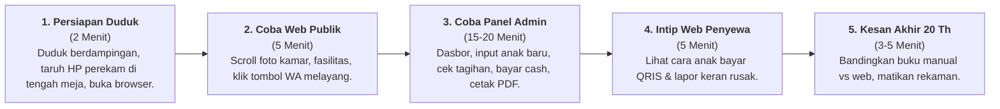
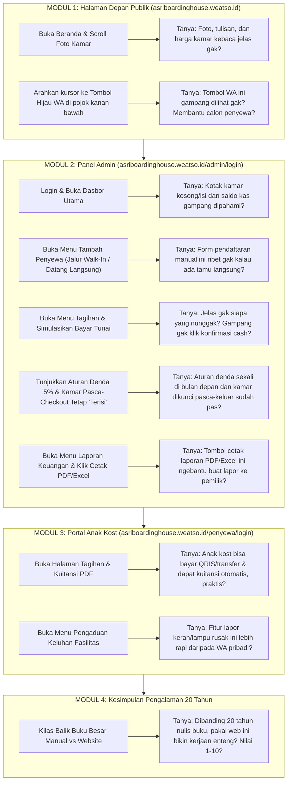

# PANDUAN PRAKTIS WAWANCARA & UJI COBA LANGSUNG (SIDE-BY-SIDE UX TESTING)
## SISTEM INFORMASI MANAJEMEN ASRI BOARDING HOUSE (PRODUCTION)

---

* **Pewawancara / Peneliti** : Rafif Arsya Pradiva (NIM: 22.N4.0014)
* **Narasumber / Informan** : Penjaga Kost / Admin Operasional Senior (Pengalaman Kelola Kost ±20 Tahun)
* **Format Wawancara** : Duduk Bersebelahan (*Side-by-Side*), Langsung Buka & Uji Website Bersama Real-Time
* **Media Bukti Ilmiah** : Rekaman Suara Digital (*Voice Recording*) dari awal sampai akhir sesi
* **Tautan Sistem Live (Tahap Produksi)** :
  1. Halaman Depan / Publik: [https://asriboardinghouse.weatso.id/](https://asriboardinghouse.weatso.id/)
  2. Panel Login Admin: [https://asriboardinghouse.weatso.id/admin/login](https://asriboardinghouse.weatso.id/admin/login)
  3. Portal Login Penyewa: [https://asriboardinghouse.weatso.id/penyewa/login](https://asriboardinghouse.weatso.id/penyewa/login)

---

## 1. RENCANA IMPLEMENTASI ULANG (STEP-BY-STEP DUDUK BERSEBELAHAN)

Metode ini menggunakan pendekatan **Usability Testing & Concurrent Think-Aloud**: Peneliti dan Penjaga Kost duduk bersama di depan satu layar laptop/komputer, mencoba langsung satu per satu halaman website secara nyata, sambil mengobrol santai terarah dan direkam suaranya.

### Panduan Teknis Lapangan
1. **Posisi Duduk**: Duduk bersebelahan dengan nyaman menghadap layar laptop. Biarkan mouse atau kursor mudah dilihat bersama.
2. **Perekam Suara**: Letakkan smartphone di atas meja persis di antara Anda dan penjaga kost. Aktifkan *Voice Recorder* dan setel HP ke *Airplane Mode / Jangan Ganggu* agar tidak terputus panggilan.
3. **Prinsip Mengobrol**: Jangan gunakan istilah teknis bahasa Inggris yang rumit. Gunakan bahasa sehari-hari yang luwes, santai, namun langsung mengarah ke fungsi web dan pengalaman kerja beliau.

---

## 2. SKRIP REKAMAN SUARA PEMBUKA & PENUTUP

Ucapkan kalimat ini secara santai begitu tombol *Record* ditekan agar rekaman sah sebagai bukti riset skripsi:

### Skrip Pembuka (Menit 00:00)
> *"Bismillah / Halo Pak/Bu. Hari ini, [Sebutkan Hari & Tanggal], saya Rafif Arsya Pradiva sedang duduk bersebelahan langsung bersama Bapak/Ibu [Nama Penjaga/Admin Kost], yang sudah mengelola kost Asri Boarding House ini selama 20 tahun.*  
>  
> *Di depan kita sudah terbuka website resmi kost yang sudah online di internet. Kita akan coba buka dan klik bareng-bareng sambil ngobrol santai untuk menguji apakah tampilan dan alurnya mudah dipakai.*  
>  
> *Obrolan ini kita rekam sebagai bukti skripsi ya Pak/Bu. Apakah Bapak/Ibu bersedia?"*  
> *(Tunggu jawaban penjaga kost: "Iya, bersedia.")*  
> *"Siap, mari kita mulai coba halaman pertamanya."*

### Skrip Penutup (Di Akhir Sesi)
> *"Alhamdulillah, semua halaman dan fiturnya sudah kita coba bareng-bareng. Terima kasih banyak Pak/Bu [Nama Admin] atas waktu dan masukannya yang sangat luar biasa dari pengalaman 20 tahun mengelola kost ini.*  
>  
> *Sesi uji coba dan rekaman ini resmi selesai pada pukul [Sebutkan Jam]. Terima kasih."*

---

## 3. ALUR TANYA JAWAB LANGSUNG DI DEPAN LAYAR (TO THE POINT)

Lakukan tanya jawab sambil tangan mengarahkan kursor dan mengeklik fitur di layar website:

---

### MODUL 1: Uji Halaman Depan / Publik ([asriboardinghouse.weatso.id](https://asriboardinghouse.weatso.id/))
*Aksi: Buka halaman utama di laptop, scroll bersama dari atas ke bawah.*

* **Tanya 1 (Tampilan & Keterbacaan Informasi Kamar)**:  
  *"Pak/Bu, ini tampilan depan website kita yang bisa dibuka siapa saja lewat HP atau laptop. Di sini ada foto-foto kamar, fasilitas, dan harganya. Menurut pandangan Bapak/Ibu, apakah tulisannya sudah cukup jelas, tidak kekecilan, dan fotonya sudah pas menggambarkan kost kita?"*  
  *(Dengarkan komentar spontan: apakah warna jelas, tulisan terbaca, foto menarik).*

* **Tanya 2 (Tombol Chat WhatsApp di Pojok Kanan Bawah)**:  
  *"Di pojok kanan bawah ini ada tombol hijau lambang WhatsApp yang selalu nempel walaupun kita scroll. Kalau orang klik tombol ini, langsung kebuka chat ke nomor admin. Menurut Bapak/Ibu tombol ini gampang dilihat atau mengganggu?"*

---

### MODUL 2: Uji Panel Administrator ([asriboardinghouse.weatso.id/admin/login](https://asriboardinghouse.weatso.id/admin/login))
*Aksi: Masuk ke halaman admin. Ajak admin melihat layar dasbor dan menu utama.*

* **Tanya 3 (Dasbor Kamar & Ringkasan Kas Sekali Lihat)**:  
  *"Nah, sekarang kita sudah masuk ke dalam akun Admin. Di halaman pertama ini langsung kelihatan kotak-kotak: berapa kamar yang isi, berapa kamar kosong, dan berapa total uang kas yang masuk bulan ini. Menurut Bapak/Ibu, melihat angka-angka ini langsung paham atau bikin pusing?"*  
  *Pancingan jika singkat: "Bandingkan kalau dulu harus buka buku dan ngitung satu-satu, lebih cepet mana Pak/Bu?"*

* **Tanya 4 (Formulir Pendaftaran Tamu Langsung / Walk-In)**:  
  *Aksi: Klik menu Penyewa -> Tambah Penyewa Baru.*  
  *"Kan di lapangan sering ada anak kost atau orang tua yang datang langsung ke sini tanpa pesan lewat web. Nah, di menu ini Bapak/Ibu tinggal ketik nama, nomor HP anak, nomor HP orang tuanya, dan pilih kamarnya. Menurut Bapak/Ibu form pendaftaran ini gampang diisi gak? Ada bagian yang dirasa ribet?"*

* **Tanya 5 (Cek Siapa yang Nunggak & Konfirmasi Bayar Tunai)**:  
  *Aksi: Klik menu Tagihan.*  
  *"Di halaman ini ada daftar tagihan semua kamar. Yang warna hijau berarti sudah lunas, yang kuning/merah berarti belum bayar. Terus kalau ada anak kost yang bayar pakai uang tunai langsung ke meja Bapak/Ibu, tinggal cari namanya lalu klik tombol 'Konfirmasi Tunai', kuitansinya langsung terbit. Menurut Bapak/Ibu cara ngecek dan konfirmasi pembayaran cash ini praktis gak?"*

* **Tanya 6 (Aturan Denda Flat 5% & Kamar Tetap Terkunci Pasca-Keluar)**:  
  *Aksi: Tunjukkan tagihan yang lewat tanggal 10 dan kamar yang baru checkout.*  
  *"Di sistem ini ada dua aturan: pertama, kalau telat nyebrang ke bulan depan baru kena denda 5% sekali (tidak berbunga tiap hari). Kedua, kalau ada anak kost yang keluar/checkout, kamarnya tetap terkunci merah 'terisi' sampai Bapak/Ibu selesai ngecek fisik kamar dan baru ubah manual jadi 'tersedia'. Menurut pengalaman 20 tahun Bapak/Ibu, dua aturan ini sudah cocok belum sama keadaan di kost?"*

* **Tanya 7 (Pencatatan Pengeluaran & Cetak Laporan PDF/Excel)**:  
  *Aksi: Klik menu Laporan Keuangan -> Tunjukkan tombol Ekspor PDF dan Excel.*  
  *"Kalau ada pengeluaran beli token listrik, bayar air, atau beli sapu, bisa dicatat di sini. Terus kalau pemilik kost (Pak Asep) minta laporan bulanan, tinggal klik satu tombol ini langsung keluar kertas laporan PDF rapi ada hitungan laba bersihnya. Menurut Bapak/Ibu fitur cetak laporan ini ngebantu gak?"*

---

### MODUL 3: Uji Portal Anak Kost ([asriboardinghouse.weatso.id/penyewa/login](https://asriboardinghouse.weatso.id/penyewa/login))
*Aksi: Buka tab baru, login sebagai salah satu contoh akun penyewa.*

* **Tanya 8 (Kenyamanan Anak Kost Bayar Online & Kuitansi Digital)**:  
  *"Ini tampilan kalau anak kost buka akunnya sendiri lewat HP. Mereka bisa bayar langsung pakai scan QRIS atau transfer (Midtrans) tanpa perlu repot cari ATM, dan bukti kuitansi PDF-nya langsung tersimpan otomatis di HP mereka. Tanggapan Bapak/Ibu gimana melihat kemudahan ini?"*

* **Tanya 9 (Kanal Lapor Fasilitas Rusak / Keluhan)**:  
  *Aksi: Klik menu Keluhan di akun penyewa.*  
  *"Di sini ada menu 'Keluhan'. Kalau keran air bocor atau lampu kamar mati, anak kost bisa lapor lewat sini dan kirim foto kerusakannya, terus masuk ke notifikasi admin. Dibandingkan dulu anak kost suka WA pribadi yang gampang ketumpuk atau lapor lisan yang kadang lupa dibeliin gantinya, fitur ini lebih rapi gak?"*

---

### MODUL 4: Refleksi & Penilaian Akhir (Before vs After 20 Tahun)

* **Tanya 10 (Perbandingan 20 Tahun Buku Manual vs Website & Skor Kepuasan)**:  
  *"Terakhir nih Pak/Bu, setelah melihat dan mencoba langsung website ini dari depan sampai dalam:  
  1. Jika dibandingkan dengan cara kerja 20 tahun kemarin yang serba tulis tangan di buku besar, apakah website ini bikin pekerjaan administrasi kost terasa jauh lebih ringan dan aman dari salah hitung?  
  2. Dari nilai 1 sampai 10, kira-kira Bapak/Ibu kasih nilai berapa untuk kemudahan pemakaian website kost ini?"*

---

## 4. LEMBAR CATATAN JAWABAN CEPAT (SAAT MENDENGARKAN AUDIO)

Gunakan tabel ringkas ini untuk mencatat poin penting saat mendengarkan rekaman suara:

| No | Modul / Fitur yang Dicoba Bersama | Jawaban Singkat / Kesan Penjaga Kost | Reaksi Spontan di Layar |
| :-: | :--- | :--- | :--- |
| **1** | Web Depan (Foto, Teks, & Harga Kamar) | ............................................................ | [ ] Senyum [ ] Antusias [ ] Bingung |
| **2** | Tombol Hijau WhatsApp Melayang | ............................................................ | [ ] Langsung ngeh [ ] Butuh ditunjuk |
| **3** | Dasbor Admin (Kamar Isi/Kosong & Kas) | ............................................................ | [ ] Cepat paham [ ] Sangat terbantu |
| **4** | Tambah Penyewa Manual (Walk-In) | ............................................................ | [ ] Mudah diisi [ ] Pas kolomnya |
| **5** | Cek Tagihan & Tombol Konfirmasi Cash | ............................................................ | [ ] Sangat praktis [ ] Gampang dicari |
| **6** | Aturan Denda 5% & Kunci Kamar Checkout| ............................................................ | [ ] Sangat setuju [ ] Sesuai lapangan |
| **7** | Tombol Cetak Laporan PDF/Excel | ............................................................ | [ ] Senang [ ] Mempermudah laporan |
| **8** | Pembayaran QRIS/Transfer & Kuitansi PDF | ............................................................ | [ ] Modern [ ] Mengurangi repot |
| **9** | Menu Lapor Fasilitas Rusak | ............................................................ | [ ] Bagus [ ] Tidak lupa perbaikan |
| **10**| Perbandingan vs 20 Tahun & Skor (1-10) | Nilai: ..... / 10. Alasan: ................................. | [ ] Sangat Puas |

---

## 5. CARA MEMASUKKAN BUKTI REKAMAN INI KE SKRIPSI

1. **Rekaman Suara**: Simpan file audio dari HP ke laptop, beri nama `REKAMAN_UX_ADMIN_KOST_2026.m4a`.
2. **Foto Dokumentasi**: Ambil 1 atau 2 foto saat Anda dan penjaga kost sedang duduk berdua di depan laptop sambil menunjuk layar (ini akan menjadi **Gambar 4.16** di skripsi).
3. **Penyisipan ke Bab IV (Sub-bab 4.6)**: 
   - Masukkan ringkasan respon penjaga kost pada Tabel 4.5.
   - Tuliskan narasi bahwa pengujian dilakukan secara langsung (*hands-on side-by-side evaluation*) bersama admin berpengalaman 20 tahun untuk menjamin sistem dapat digunakan secara nyata tanpa kesulitan teknis.
