## BAB II TINJAUAN PUSTAKA DAN LANDASAN TEORI
## 2.1 Landasan Teori
### 2.1.1 Sistem Informasi dan Sistem Informasi Manajemen
Sistem informasi pada hakikatnya merupakan kesatuan komponen yang terintegrasi secara harmonis—mencakup perangkat keras (*hardware*), perangkat lunak (*software*), infrastruktur jaringan, data terstruktur, prosedur kerja operasional, serta pengguna—yang berinteraksi bersama untuk menghimpun, mengolah, menyimpan, dan mendiseminasikan informasi guna menunjang kelancaran operasional organisasi [2]. Pada tataran manajerial, Sistem Informasi Manajemen (*Management Information System*) memegang peran vital sebagai penyedia ikhtisar data berkala yang mempermudah pengawasan, koordinasi, dan pengambilan keputusan operasional. 

Dalam tata kelola Asri Boarding House, penerapan konsep sistem informasi manajemen berfungsi sebagai pusat kendali terpadu. Sistem ini menyatukan pencatatan profil penghuni, alokasi 32 unit kamar, penerbitan tagihan berkala, serta rekapitulasi arus kas yang sebelumnya tercerai-berai pada buku catatan fisik ke dalam satu basis data terstruktur, sehingga pemilik maupun pengelola dapat meninjau kondisi keuangan secara akurat dan transparan sewaktu-waktu.

### 2.1.2 Sistem Berbasis Web dan E-Commerce Model B2C
Aplikasi berbasis web (*web-based application*) beroperasi melalui arsitektur klien-peladen (*client-server*) dan diakses pengguna secara fleksibel menggunakan peramban web modern tanpa perlu melalui tahapan instalasi aplikasi tambahan pada perangkat. Pada sistem transaksi daring, pemisahan lapisan logika menjadi syarat mutlak agar perangkat lunak memiliki struktur yang teratur dan mudah dirawat. Pola *Model-View-Controller* (MVC) terbukti efektif dalam memisahkan representasi data, tata letak visual antarmuka, serta logika pengendali proses bisnis transaksi perdagangan elektronik [6].

Model bisnis *Business-to-Consumer* (B2C) mencerminkan transaksi digital langsung antara pelaku usaha sebagai penyedia layanan dan masyarakat umum sebagai konsumen akhir. Pada konteks Asri Boarding House, sistem menerapkan arsitektur B2C secara mandiri: pengelola berinteraksi langsung dengan calon maupun penyewa aktif melalui katalog kamar daring, formulir reservasi mandiri, dan gerbang pembayaran elektronik terintegrasi tanpa melibatkan komisi platform pihak ketiga.

### 2.1.3 Sistem Manajemen Basis Data Relasional dan Normalisasi 3NF
Sistem Manajemen Basis Data Relasional (*Relational Database Management System* atau RDBMS) mengelola penyimpanan data dalam tabel-tabel terstruktur yang saling berelasi melalui batasan kunci utama (*primary key*) dan kunci asing (*foreign key*). MySQL versi 8.0 dengan mesin penyimpanan InnoDB dipilih dalam penelitian ini karena keunggulannya dalam menjamin integritas referensial data, kepatuhan transaksi berkarakteristik ACID (*Atomicity, Consistency, Isolation, Durability*), serta dukungan penguncian data tingkat baris (*row-level locking*).

Guna meniadakan risiko inkonsistensi data, skema basis data dirancang melalui tahapan normalisasi hingga mencapai Bentuk Normal Ketiga (*Third Normal Form* atau 3NF). Penerapan 3NF mewajibkan setiap atribut non-kunci bergantung penuh secara langsung pada kunci utama tanpa adanya ketergantungan transitif antarkolom. Melalui struktur 3NF, data transaksi keuangan, rincian kamar, dan identitas penghuni Asri Boarding House terlindungi dari anomali penyisipan, pembaruan, maupun penghapusan data.

### 2.1.4 Arsitektur 3-Tier dan Model-View-Controller pada Laravel 11
Arsitektur tiga lapis (*3-Tier Architecture*) memisahkan sistem ke dalam tiga lapisan mandiri: lapisan presentasi (*Presentation Tier*), lapisan logika aplikasi (*Application Tier*), dan lapisan persistensi data (*Data Tier*). Pemisahan ini memastikan bahwa pembaruan pada antarmuka visual tidak merusak integritas basis data, begitu pula sebaliknya. Pola MVC pada framework Laravel 11 (berbasis PHP 8.2) mewujudkan arsitektur ini secara elegan: Model merepresentasikan struktur data melalui *Eloquent Object-Relational Mapping* (ORM), View mengelola perenderan tampilan melalui mesin templat Blade, dan Controller mengoordinasikan alur permintaan HTTP yang masuk.

Guna mencegah penumpukan logika bisnis yang berlebihan pada pengontrol (*fat controller problem*), arsitektur sistem pada penelitian ini diperkuat dengan lapisan layanan terisolasi (*Service Layer*)—seperti `BillingService`, `MidtransService`, `ReservasiService`, `FonnteService`, dan `TransisiPenyewaService`. Selain itu, arsitektur dilengkapi pola *Event-Listener-Observer* untuk memproses tugas-tugas asinkron secara tertib dan modular.

### 2.1.5 Antarmuka Pemrograman Aplikasi (API) Eksternal: Midtrans dan Fonnte
Antarmuka Pemrograman Aplikasi (*Application Programming Interface* atau API) menyediakan mekanisme pertukaran data terstandarisasi yang memungkinkan sistem berinteraksi secara aman dengan layanan komputasi eksternal. Layanan gerbang pembayaran Midtrans menyediakan antarmuka REST API Snap yang memfasilitasi transaksi non-tunai secara otomatis, termasuk saluran Bank Central Asia Virtual Account (BCA VA) [7], [8]. Integrasi berjalan melalui permintaan *snap token* dari peladen sistem, pemanggilan pop-up pembayaran di sisi peramban via Snap.js, serta penerimaan notifikasi status (*webhook callback*) yang divalidasi keabsahannya menggunakan algoritma tanda tangan digital SHA-512.

Sementara itu, Fonnte WhatsApp API difungsikan sebagai jembatan otomatisasi pengiriman pesan instan dari peladen ke nomor telepon penyewa maupun orang tua/wali. Saluran ini bertugas menyiarkan tagihan sewa bulanan, pengingat tenggat waktu persuasif, serta pemberitahuan denda keterlambatan secara otomatis tanpa membebani rutinitas manual pengelola.

### 2.1.6 Penjadwalan Tugas, Mesin Penagihan Otomatis, dan Cron Job
Penjadwalan tugas (*task scheduling*) memungkinkan eksekusi rutin serangkaian skrip peladen secara periodik tanpa memerlukan intervensi manusia. Pada peladen Linux produksi, utilitas *cron job* dikonfigurasi untuk memicu penjadwal bawaan Laravel (`schedule:run`) setiap menit, yang selanjutnya mengeksekusi perintah kerja sesuai jadwal yang telah ditentukan.

Mesin penagihan otomatis (*automated billing engine*) yang dikembangkan dalam penelitian ini menerbitkan tagihan sewa bulanan bagi seluruh penghuni aktif bertipe sewa bulanan pada tanggal 1 awal bulan pukul 00:05 WIB dengan batas jatuh tempo seragam pada tanggal 10. Evaluasi harian dijalankan untuk memantau keterlambatan dan memicu eskalasi notifikasi. Duplikasi tagihan dicegah secara mutlak pada tingkat basis data melalui indeks unik gabungan (*composite unique constraint*) pada kolom `(penyewa_id, periode_bulan, periode_tahun)`.

### 2.1.7 Teori Interaktivitas UI/UX: Neo-Brutalism dan WCAG 2.1
Perancangan antarmuka pengguna (*User Interface*) dan pengalaman pengguna (*User Experience*) memegang peran krusial dalam menciptakan interaksi digital yang intuitif dan nyaman. Sistem ini mengadopsi bahasa visual Neo-Brutalism secara konsisten pada portal publik, dasbor penyewa, maupun panel administrator. Karakteristik gaya desain ini tercermin pada tipografi yang tegas (Space Grotesk), garis tepi hitam solid berketebalan 4 piksel, bayangan datar tanpa gradasi (*hard box-shadow*), serta umpan balik visual penekanan tombol (*tactile push-down feedback*).

Untuk menjamin kemudahan aksesibilitas pada layar perangkat bergerak (*mobile-friendly*), seluruh elemen interaktif dirancang mengacu pada panduan *Web Content Accessibility Guidelines* (WCAG) 2.1 dengan target sentuh minimum 44 piksel, dan tombol aksi utama WhatsApp melayang dibuat sebesar 56 piksel. Selain itu, sistem menerapkan kebijakan *Zero Native Browser Interaction*, yakni meniadakan kotak dialog bawaan peramban seperti `alert()` dan `confirm()`, menggantikannya dengan dialog modal interaktif dan notifikasi *toast* yang serasi dengan tema desain.

### 2.1.8 Keamanan Web dan Integritas Data
Perlindungan keamanan sistem web merupakan prioritas mutlak mengingat aplikasi mengelola data identitas pribadi dan transaksi finansial pengguna. Sistem menerapkan pertahanan berlapis terhadap ancaman *Cross-Site Request Forgery* (CSRF) melalui tokenisasi pada setiap formulir, penangkalan *SQL Injection* melalui *parameter binding* pada kueri Eloquent ORM, serta penyaringan otomatis *Cross-Site Scripting* (XSS) melalui mesin templat Blade.

Guna mengantisipasi serangan tebak kata sandi (*brute-force*), rute autentikasi dilengkapi pembatasan laju permintaan (*rate limiting*). Hak akses ditegakkan secara ketat melalui prinsip *Role-Based Access Control* (RBAC) pada tiga portal terisolasi (administrator, penyewa aktif, dan calon penyewa), selaras dengan standar keamanan protokol OAuth 2.0 yang diterapkan pada autentikasi akun Google [9]. Ketahanan sistem turut disempurnakan dengan penanganan galat dan operator *nullsafe* pada PHP 8.2 guna mencegah terjadinya kesalahan HTTP 500 saat relasi data bernilai kosong.

### 2.1.9 Concurrency Control dan Mekanisme Penguncian Basis Data
Pengontrolan konkurensi (*concurrency control*) diperlukan untuk menjamin keutuhan data saat beberapa pengguna atau proses latar belakang mengakses dan memodifikasi baris data yang sama secara serentak. Pada basis data MySQL dengan mesin penyimpanan InnoDB, pendekatan kontrol konkurensi secara umum terbagi menjadi *Optimistic Locking* dan *Pessimistic Locking*.

Pada pendekatan *Optimistic Locking*, sistem berasumsi bahwa perselisihan akses data jarang terjadi. Data dibaca dan dimodifikasi tanpa mengunci baris, dan pengecekan versi data baru dilakukan saat proses penyimpanan. Jika terdeteksi perubahan versi dari proses lain, transaksi saat ini dibatalkan (*aborted*). Mekanisme ini kurang tepat diterapkan pada reservasi kamar kos dan transaksi pembayaran sewa, karena kegagalan transaksi di tahap akhir dapat membingungkan pengguna yang telah mengisi biodata atau melakukan transfer.

Sebaliknya, *Pessimistic Locking* berasumsi bahwa potensi perebutan sumber daya data (*resource contention*) bernilai tinggi. Oleh sebab itu, baris data yang ditargetkan dikunci secara eksklusif sejak dibaca hingga transaksi tuntas diselesaikan (*commit*) atau dibatalkan (*rollback*). Pada MySQL InnoDB, penguncian ini dieksekusi melalui klausa `SELECT ... FOR UPDATE`, yang pada framework Laravel dipanggil melalui metode `lockForUpdate()`. Sepanjang transaksi berlangsung, proses lain yang mencoba membaca atau memodifikasi baris bersangkutan akan ditangguhkan (*blocked*). Penerapan mekanisme ini di dalam transaksi basis data (`DB::transaction`) memastikan alokasi unit kamar dan pembaruan mutasi pembayaran berjalan secara berurutan (*serialized*), sehingga meminimalkan risiko pemesanan ganda (*double booking*) dan anomali saldo kas.

## 2.2 Penelitian Terdahulu (State of the Art)
Kajian kepustakaan terhadap publikasi ilmiah terdahulu dilakukan guna memetakan posisi dan kontribusi orisinal penelitian ini di tengah perkembangan bidang ilmu terkait. Berbagai telaah telah membahas pengembangan sistem informasi pengelolaan rumah kos berbasis web dengan beragam framework dan metode pengembangan [10], [11]. Kajian lain memfokuskan pembahasannya pada integrasi gerbang pembayaran Midtrans pada aneka sektor usaha [12], [13], [14], serta implementasi gateway WhatsApp untuk transmisi notifikasi transaksi [15]. 

Kendati penelitian-penelitian terdahulu berhasil menjawab kebutuhan operasional pada cakupan studinya masing-masing, belum ditemukan sistem yang secara terpadu mengintegrasikan mesin penagihan otomatis beraturan denda flat 5% yang idempoten, alur kerja pendaftaran hibrida, pengontrolan konkurensi kamar, serta kanal komunikasi obrolan pra-pembayaran. Matriks perbandingan penelitian terdahulu dirangkum pada Tabel 2.1.

Tabel 2.1 Perbandingan Penelitian Terdahulu (State of the Art)
Penulis & Tahun	Metode	Hasil Penelitian	Kesenjangan (Gap) dengan Sistem Asri Boarding House
Cornellya & Afriyadi (2025) 	Waterfall (SDLC)	Sistem pemesanan kos berbasis Laravel yang mempermudah pencatatan penyewa, transaksi, dan laporan; diuji dengan black box.	Belum terdapat denda keterlambatan otomatis, eskalasi ke wali, maupun chat pra-pembayaran terintegrasi.
Nizar (2021)	Rancang bangun web	Sistem sewa rumah kos (E-Kost) berbasis website untuk informasi dan pemesanan.	Tidak mengintegrasikan payment gateway penuh dan mesin penagihan otomatis bersiklus seragam.
Jannah dkk. (2020) 	Pengembangan web	Sistem informasi pemasaran rumah kos berbasis web yang memperluas promosi.	Berfokus pada pemasaran; belum menangani billing, denda, dan transaksi daring.
Malaikosa & Mokola (2024) 	Rapid Application Development	Sistem monitoring rumah kos dan pembayarannya berbasis web.	Belum ada hybrid workflow dan pencegahan double booking berbasis concurrency control.
Purnia dkk. (2021) 	Prototyping	Marketplace rumah kos berbasis mobile untuk pencarian dan pemesanan.	Tidak menerapkan denda otomatis dan notifikasi multi-channel otomatis kepada wali.
Sutisna & Aziz (2025) 	Waterfall	Sistem penyewaan alat event dengan integrasi Midtrans; diuji black box, GTmetrix, dan Sucuri.	Domain berbeda; tidak ada siklus tagihan bulanan seragam dan eskalasi keterlambatan.
Fatman dkk. (2023) 	Pengembangan web	Implementasi Midtrans pada website UMKM Geberco untuk pembayaran nontunai.	Tidak memodelkan manajemen hunian, status kamar, dan reservasi.
Surya Pratama (2025) 	Prototyping	Integrasi payment gateway pada aplikasi Point of Sales berbasis ReactJS.	Tidak menangani penyewaan jangka panjang, denda, dan wali penyewa.
Pramita dkk. (2024) 	Agile	Penerapan Midtrans pada sistem pembayaran SPP berbasis Android.	Berbasis mobile dengan domain pendidikan; tanpa modul kamar dan reservasi.
Wijaya dkk. (2023) 	Pengembangan web	Sistem informasi laundry berbasis web dengan Midtrans.	Tidak ada billing periodik seragam dan kanal chat pra-pembayaran.
Hakim dkk. (2021) 	Pengembangan web	Aplikasi penerimaan dan pengeluaran kas berbasis web dan WhatsApp gateway.	Berfokus pada kas; belum terintegrasi dengan reservasi dan payment gateway.
Sonata (2019) 	Perancangan UML	Pemanfaatan UML pada perancangan sistem informasi e-commerce.	Bersifat konseptual; belum mengimplementasikan billing otomatis dan integrasi API.
Sumber: Hasil analisis penulis terhadap literatur terkait (2026)

Berdasarkan perbandingan pada Tabel 2.1, kebaruan (*novelty*) dari penelitian ini terletak pada integrasi menyeluruh beberapa fitur utama: mesin penagihan otomatis dengan denda keterlambatan flat 5% dari sewa pokok yang dikenakan satu kali pada bulan kalender berikutnya melalui *Idempotency Guard*, eskalasi notifikasi penunggakan ke kontak wali pada bulan kedua, alur kerja hibrida yang menyatukan pemesanan mandiri daring dan pendaftaran langsung oleh pengelola ke dalam satu basis data, pencegahan pemesanan ganda melalui penguncian baris data `lockForUpdate()` dan isolasi kamar pasca-checkout, serta fasilitas obrolan berbasis *AJAX polling* saat reservasi berstatus *pending*. Integrasi terpadu ini menjadi pembeda utama sistem yang dibangun dibandingkan karya-karya terdahulu.

## 2.3 Kerangka Pemikiran
Kerangka pemikiran penelitian ini dirancang dengan alur rekayasa perangkat lunak *Research and Development* (R&D) yang terstruktur, menghubungkan empat tahapan utama: masukan (*input*), proses (*process*), keluaran (*output*), dan dampak (*outcome*).

Pada tahap masukan (*input*), penelitian berpijak pada identifikasi permasalahan faktual di Asri Boarding House, meliputi penagihan manual yang memakan waktu, ketiadaan eskalasi penunggakan yang terstruktur, risiko pemesanan ganda, potensi kekeliruan pencatatan kas, terbatasnya saluran reservasi mandiri, serta ketiadaan arsip riwayat transaksi digital. Kebutuhan operasional tersebut kemudian dirumuskan menjadi spesifikasi kebutuhan fungsional dan non-fungsional berdasarkan aturan bisnis nyata pada dokumen *blueprint*.

Pada tahap proses (*process*), kebutuhan sistem dimodelkan menggunakan diagram UML (*use case, activity, sequence,* dan *class diagram*) serta rancangan skema basis data relasional 3NF yang dituangkan dalam ERD. Rancangan tersebut kemudian diimplementasikan menggunakan tumpukan teknologi Laravel 11, MySQL 8.x InnoDB, TailwindCSS, Midtrans Snap API, serta Fonnte WhatsApp API. Keandalan logika bisnis diuji melalui pengujian fungsionalitas kotak hitam (*black box testing*), validasi formulir masukan, serta pengujian fitur terotomatisasi berbasis PHPUnit.

Pada tahap keluaran (*output*), dihasilkan produk perangkat lunak Sistem Informasi Manajemen Kost Terintegrasi Payment Gateway dan Modul Reservasi Online yang siap diterapkan. Keluaran ini bermuara pada dampak operasional (*outcome*) yang diharapkan, yakni terwujudnya otomatisasi penagihan dan pengingat, terjaganya ketertiban pencatatan keuangan, berkurangnya risiko pemesanan ganda, serta kemudahan akses pemesanan bagi calon penyewa. Alur kerangka pemikiran tersebut diilustrasikan pada Gambar 2.1.

```mermaid
graph TD
    subgraph INPUT ["1. MASUKAN (INPUT)"]
        direction TB
        I1["<b>Kondisi Operasional & Identifikasi Masalah:</b><br/>• Penagihan manual yang tidak efisien<br/>• Ketiadaan eskalasi keterlambatan terstruktur<br/>• Risiko pemesanan ganda (double booking)<br/>• Kebocoran & ketidakakuratan data keuangan<br/>• Absennya kanal reservasi online 24/7<br/>• Ketiadaan audit trail digital"]
        I2["<b>Spesifikasi Kebutuhan Sistem:</b><br/>• Analisis Kebutuhan Fungsional & Non-Fungsional<br/>• Dokumen Blueprint & Aturan Bisnis Real"]
        I1 --> I2
    end

    subgraph PROCESS ["2. PROSES (PROCESS)"]
        direction TB
        P1["<b>Analisis & Perancangan:</b><br/>• Pemodelan UML (Use Case, Activity, Sequence, Class Diagram)<br/>• Skema Basis Data Relasional 3NF & ERD"]
        P2["<b>Implementasi Teknologis:</b><br/>• Framework & DB: Laravel 11, MySQL 8.x, TailwindCSS<br/>• Integrasi API: Midtrans Snap & Fonnte WhatsApp API"]
        P3["<b>Pengujian & Validasi:</b><br/>• Black Box Testing & Validasi Formulir Input<br/>• Automated Suite Testing berbasis PHPUnit"]
        P1 --> P2 --> P3
    end

    subgraph OUTPUT ["3. KELUARAN (OUTPUT)"]
        O1["<b>Artefak Perangkat Lunak Teruji:</b><br/>Sistem Informasi Manajemen Kost Terintegrasi Payment Gateway & Modul Reservasi Online (Asri Boarding House)"]
    end

    subgraph OUTCOME ["4. DAMPAK (OUTCOME)"]
        D1["<b>Manfaat & Dampak Operasional:</b><br/>• Otomatisasi operasional penagihan & pengingat terstruktur<br/>• Penjaminan integritas & akurasi data keuangan serta audit trail<br/>• Pencegahan mutlak atas risiko pemesanan ganda (double booking)<br/>• Perluasan jangkauan pasar & kemudahan reservasi online 24/7"]
    end

    INPUT --> PROCESS
    PROCESS --> OUTPUT
    OUTPUT --> OUTCOME

    style INPUT fill:#EFF6FF,stroke:#3B82F6,stroke-width:2px,rx:8px,ry:8px
    style PROCESS fill:#F0FDF4,stroke:#22C55E,stroke-width:2px,rx:8px,ry:8px
    style OUTPUT fill:#FEF3C7,stroke:#F59E0B,stroke-width:2px,rx:8px,ry:8px
    style OUTCOME fill:#FAF5FF,stroke:#A855F7,stroke-width:2px,rx:8px,ry:8px

    style I1 fill:#FFFFFF,stroke:#93C5FD,stroke-width:1px
    style I2 fill:#FFFFFF,stroke:#93C5FD,stroke-width:1px
    style P1 fill:#FFFFFF,stroke:#86EFAC,stroke-width:1px
    style P2 fill:#FFFFFF,stroke:#86EFAC,stroke-width:1px
    style P3 fill:#FFFFFF,stroke:#86EFAC,stroke-width:1px
    style O1 fill:#FFFFFF,stroke:#FDE047,stroke-width:1px
    style D1 fill:#FFFFFF,stroke:#E9D5FF,stroke-width:1px
```

Gambar 2.1 Kerangka Pemikiran Penelitian
Sumber: Rancangan penulis (2026)
