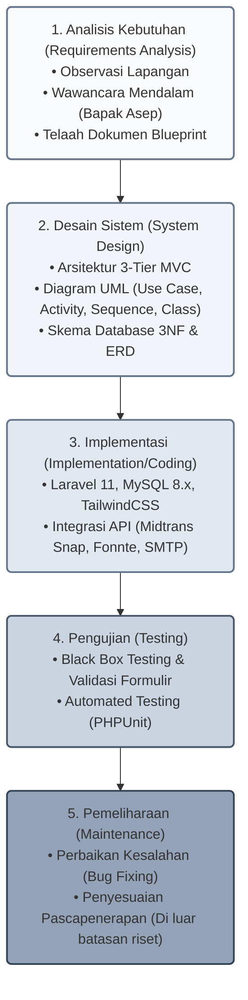

## BAB III METODOLOGI PENELITIAN
## 3.1 Jenis Penelitian
Penelitian ini merupakan jenis penelitian dan pengembangan (*Research and Development* atau R&D) dengan pendekatan rekayasa perangkat lunak (*software engineering*). Pendekatan R&D dipilih karena tujuan utama penelitian ini adalah menghasilkan produk perangkat lunak Sistem Informasi Manajemen Kost yang fungsional, teruji, dan dapat dioperasikan secara langsung pada lingkungan nyata [16]. Alur pengembangan mencakup tahapan analisis kebutuhan, perancangan arsitektur, penulisan kode program, hingga pengujian sistem secara berulang guna memastikan sistem memenuhi kebutuhan operasional Asri Boarding House.

## 3.2 Teknik Pengumpulan Data
Pengumpulan data dilakukan menggunakan pendekatan kualitatif melalui tiga teknik yang saling melengkapi guna memperoleh gambaran menyeluruh mengenai proses bisnis dan aturan operasional di lapangan:
1)	Observasi Langsung (*Field Observation*): Penulis mengamati secara langsung kegiatan operasional harian di Asri Boarding House, mencakup cara pengelola memeriksa kamar kosong, mencatat uang sewa tunai di buku besar, serta mengirimkan pesan penagihan kepada penghuni. Melalui observasi ini, hambatan administratif yang terjadi dalam praktik sehari-hari dapat dipetakan secara jelas.
2)	Wawancara Mendalam (*In-depth Interview*): Penulis melakukan wawancara semiterstruktur dengan pemilik sekaligus pengelola kos, Bapak Asep (usia 48 tahun, dengan pengalaman mengelola kos selama 20 tahun). Topik wawancara mencakup penentuan tarif tiap kategori kamar, kebijakan jatuh tempo dan denda keterlambatan, keterlibatan wali dalam penagihan, prosedur penerimaan tamu langsung, serta langkah pemeriksaan kamar saat penyewa keluar (*checkout*). Wawancara ini memberikan pemahaman mendalam mengenai alasan di balik aturan operasional yang diterapkan.
3)	Studi Dokumentasi (*Documentation*): Penulis mempelajari berkas fisik yang digunakan dalam pengelolaan kos, seperti buku catatan pembayaran sewa, daftar penghuni, dan kuitansi kertas, yang kemudian diselaraskan dengan dokumen teknis *Blueprint Projek Website Asri Boarding House*. Telaah dokumen ini melengkapi data hasil wawancara dan observasi sehingga kebutuhan sistem memiliki landasan data yang kuat dan konsisten.

## 3.3 Metode Pengembangan Sistem
Pengembangan sistem informasi ini menerapkan model air terjun (*Waterfall*). Model Waterfall merupakan metode dalam *System Development Life Cycle* (SDLC) yang menstrukturkan pengerjaan secara berurutan dan teratur melalui tahapan: analisis kebutuhan, desain sistem, implementasi kode program, pengujian, dan pemeliharaan [17], [18]. Model ini dipilih karena spesifikasi kebutuhan fungsional dan aturan bisnis Asri Boarding House telah terdefinisi secara matang dan stabil di dalam dokumen blueprint, sehingga ruang lingkup pengembangan relatif pasti dan tidak mengalami perubahan besar selama proses penelitian. Kejelasan kebutuhan sejak awal memungkinkan pengelolaan jadwal yang terarah dan penyusunan dokumentasi yang lengkap pada setiap tahap.

Tahapan model Waterfall yang diterapkan pada penelitian ini disajikan pada Gambar 3.1.

Gambar 3.1 Diagram Model Waterfall Pengembangan Sistem
Sumber: Rancangan penulis (2026)

Tahapan pengembangan sistem dengan model Waterfall ini meliputi:
1)	Analisis Kebutuhan (*Requirements Analysis*): Menganalisis kebutuhan fungsional dan non-fungsional sistem berdasarkan triangulasi data dari observasi lapangan, wawancara mendalam bersama Bapak Asep, serta telaah dokumen blueprint.
2)	Desain Sistem (*System Design*): Merancang arsitektur aplikasi *3-tier* berpola MVC, diagram UML (*use case, activity, sequence, class*), serta skema basis data relasional 3NF yang digambarkan dalam ERD 22 tabel.
3)	Implementasi (*Implementation/Coding*): Membangun kode program aplikasi berbasis framework Laravel 11, PHP 8.2, MySQL 8.x InnoDB, TailwindCSS, serta mengintegrasikan API eksternal (Midtrans Snap, Fonnte WhatsApp, dan SMTP surel).
4)	Pengujian (*Testing*): Menguji fungsionalitas sistem secara menyeluruh melalui 60 skenario uji kotak hitam (*black box testing*), pengujian hak akses peran, simulasi transaksi Midtrans Sandbox, live testing HTTPS SSL, pengujian penerimaan pengguna secara kualitatif (*Side-by-Side Usability Testing*) bersama pengelola operasional senior, serta pengujian fitur terotomatisasi berbasis PHPUnit.
5)	Pemeliharaan (*Maintenance*): Merupakan tahapan pemantauan berkala dan perbaikan galat pascapenerapan. Sesuai dengan batasan masalah, fase pemeliharaan jangka panjang berada di luar linimasa enam bulan penelitian ini.
