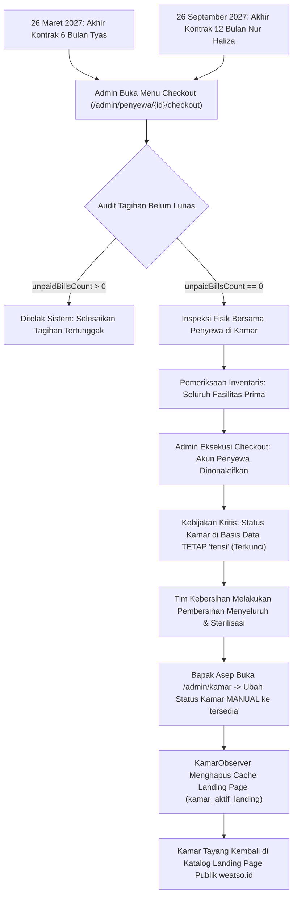

## BAB IV HASIL DAN PEMBAHASAN

## 4.1 Perancangan Sistem
Tahapan perancangan sistem menerjemahkan hasil analisis kebutuhan fungsional dan triangulasi data operasional di lapangan ke dalam cetak biru (*blueprint*) rekayasa perangkat lunak yang sistematis. Pemodelan sistem dilakukan menggunakan standar Unified Modeling Language (UML) yang mencakup Use Case Diagram, Activity Diagram, Flowchart, dan Sequence Diagram, serta pemodelan skema relasi data melalui Entity Relationship Diagram (ERD).

### 4.1.1 Use Case Diagram
Sistem Informasi Manajemen Asri Boarding House melibatkan empat aktor dengan hak akses yang terisolasi secara ketat melalui tiga portal autentikasi terpisah (`/admin/login`, `/reservasi/login`, dan `/penyewa/login`) guna menjamin prinsip *Role-Based Access Control* (RBAC) dan mencegah kebocoran otorisasi (*privilege escalation*). Keempat aktor tersebut diuraikan sebagai berikut:
1. **Tamu (*Guest*)**: Pengunjung publik yang mengakses landing page untuk melihat informasi kos, menjelajahi katalog 32 unit kamar beserta fasilitas dan video *room tour*, menggunakan kalkulasi harga sewa harian/mingguan/bulanan secara real-time, mengakses tombol WhatsApp melayang, serta memulai obrolan langsung dengan administrator melalui widget *Guest Chat* publik tanpa perlu melakukan pendaftaran akun—di mana sesi percakapan dipersistensi pada cookie dan penyimpanan lokal peramban (*localStorage*) dengan token unik terenkripsi SHA-256.
2. **Calon Penyewa**: Pengguna terdaftar yang masuk melalui formulir registrasi mandiri maupun Google OAuth 2.0 (Laravel Socialite). Calon penyewa dapat memilih unit kamar kosong, melengkapi identitas NIK dan kontak wali via *stepper* alur pemesanan 5 tahap, memilih skema pembayaran (Uang Muka DP 30% atau Lunas 100%), bertransaksi secara aman melalui Midtrans Snap (Bank BCA Virtual Account), memantau kemajuan verifikasi, serta berdiskusi langsung dengan administrator melalui kanal *pre-payment chat box* yang aktif selama status pemesanan *pending*.
3. **Penyewa Aktif**: Penghuni yang kontrak huniannya telah diverifikasi dan diaktifkan oleh administrator. Penyewa aktif memiliki akses penuh ke portal internal untuk memantau masa aktif sewa, meninjau rincian tagihan bulanan beserta status jatuh tempo, melakukan pembayaran tagihan secara daring melalui Midtrans Snap (BCA Virtual Account), mengunduh kuitansi digital format A5 resmi secara mandiri, mengajukan laporan keluhan kerusakan fasilitas disertai foto bukti, memantau disposisi perbaikan, serta memulihkan kata sandi akun secara mandiri via surel SMTP.
4. **Administrator**: Pengelola operasional (Bapak Asep) yang memegang kendali penuh terhadap tata kelola properti kost: memantau dasbor statistik dan tiga kartu ringkasan keuangan (*summary cards*) real-time, mengelola master data kamar dan fasilitas (CRUD dengan validasi keterikatan data), mendaftarkan penyewa baru jalur *walk-in* (datang langsung), mengonfirmasi pembayaran tunai, mengaudit dan mengonfirmasi reservasi daring, memantau *auto-billing engine* dan denda flat kalender 5%, menanggapi keluhan kerusakan fasilitas, menyiarkan pengumuman massal (*broadcast*), mengontrol jadwal hunian melalui Kalender Visual (UC-19), serta mengekspor laporan keuangan laba bersih ke format PDF dan Excel/CSV ber-encoding BOM UTF-8.

Interaksi menyeluruh keempat aktor dengan modul-modul sistem divisualisasikan dalam diagram terpadu pada Gambar 4.1.

*Gambar 4.1 Use Case Diagram Terpadu Sistem Asri Boarding House*  
*Sumber: Hasil pemodelan UML penulis (2026)*

---

### 4.1.2 Activity Diagram
Activity diagram memodelkan alur kerja dinamis dari tiga proses operasional utama pada sistem Asri Boarding House:

1. **Mesin Penagihan Otomatis (*Auto-Billing Engine*)**: Dijalankan secara otomatis setiap tanggal 1 awal bulan pukul 00:05 WIB oleh penjadwal tugas (*Laravel Task Scheduler*) yang terhubung dengan *cron job* peladen. Sistem melakukan kueri terhadap seluruh penyewa aktif dengan tipe sewa bulanan; penyewa bertipe harian dan mingguan secara tegas dikecualikan melalui filter `whereNotIn('tipe_sewa', ['harian', 'mingguan'])`. Untuk setiap penyewa bulanan, sistem membaca nominal sewa dari kolom `penyewa.harga_sewa`, lalu menerbitkan baris tagihan baru berstatus *pending* dengan tanggal jatuh tempo seragam pada tanggal 10 bulan berjalan. Integritas antiduplikasi dijamin oleh *composite unique index* atas kombinasi `(penyewa_id, periode_bulan, periode_tahun)`. Setelah tagihan terbentuk, sistem memicu pengiriman pesan rincian tagihan secara otomatis ke WhatsApp penyewa melalui Fonnte WhatsApp API Gateway.
2. **Denda Keterlambatan Flat Kalender (*Flat Calendar Late Fee*)**: Dijalankan setiap hari oleh scheduler untuk mengevaluasi tagihan berstatus *pending* yang melewati tanggal jatuh tempo. Sistem menerapkan pendekatan persuasif: selama tagihan masih berada dalam bulan kalender berjalan (tanggal 11 hingga akhir bulan), sistem tidak membebankan denda keterlambatan (Denda = Rp0) dan hanya mengirimkan pesan pengingat berkala. Namun, begitu pergantian bulan kalender terjadi (masuk tanggal 1 bulan berikutnya) dan tagihan bulan lalu masih belum lunas, sistem mengenakan denda keterlambatan flat sebesar 5% dari harga sewa pokok tepat satu kali melalui mekanisme *Idempotency Guard* (`nominal_denda == 0`) di dalam transaksi basis data atomik berproteksi kunci baris (`lockForUpdate()`). Bersamaan dengan itu, sistem mengirimkan notifikasi eskalasi penunggakan ke kontak nomor wali/orang tua penyewa.
3. **Transisi Reservasi Menjadi Penyewa Aktif (*Reservation-to-Tenant Transition*)**: Ketika administrator menyetujui reservasi daring yang telah berstatus lunas atau DP, sistem mengeksekusi rangkaian operasi multi-tabel dalam satu transaksi atomik `DB::transaction`. Sistem memperbarui status reservasi menjadi `dikonfirmasi`, mengunci status unit kamar bersangkutan menjadi `terisi`, menyalin harga sewa kamar ke `penyewa.harga_sewa` sebagai tarif sewa aktif (*immutable personal rate*), membuat akun login pengguna pada tabel `users`, menginjeksi tagihan pelunasan sisa 70% (jika skema DP), serta mengirimkan kredensial akun bawaan ke nomor WhatsApp penyewa via Fonnte API. Sebaliknya, ketika penyewa selesai masa tinggal (*checkout*), sistem menerapkan aturan operasional: status kamar tidak dilepas secara otomatis menjadi tersedia, melainkan tetap terkunci merah berstatus `terisi` hingga administrator melakukan pemeriksaan fisik kebersihan kamar secara langsung dan mengubah statusnya secara manual menjadi `tersedia`.

Visualisasi ketiga activity diagram proses kritis disajikan pada Gambar 4.2.

  
*(a) Mesin Penagihan Otomatis (Auto-Billing Engine)*

  
*(b) Denda Keterlambatan Flat Kalender (Flat Calendar Late Fee)*

  
*(c) Transisi Reservasi Menjadi Penyewa Aktif (Reservation-to-Tenant)*

*Gambar 4.2 Activity Diagram Tiga Proses Kritis Sistem Asri Boarding House*  
*Sumber: Hasil pemodelan UML penulis (2026)*

---

### 4.1.3 Flowchart Diagram
Flowchart diagram memodelkan logika algoritmik dari alur transaksional sistem dari hulu ke hilir. Diagram ini memetakan pengambilan keputusan sistem mulai dari verifikasi ketersediaan kamar, kalkulasi diskon sewa durasi tahunan, pemilihan skema pembayaran (DP 30% atau Lunas 100%), pembangkitan token Midtrans Snap Bank BCA Virtual Account, penanganan webhook callback settlement, pencatatan mutasi kas, hingga siklus auto-billing bulanan dan evaluasi denda kalender.

Logika algoritmik penagihan dan evaluasi keterlambatan memastikan bahwa tidak ada cabang logika yang ambigu: pengecekan `is_active == 1` menyaring penyewa aktif, pembagian porsi memori via `chunkById(100)` mencegah peladen kehabisan sumber daya memori, serta pengecekan tanggal kalender secara tegas memisahkan fase pengingat persuasif tanpa denda dari fase penegakan denda flat 5%. Alur flowchart disajikan pada Gambar 4.3.

*Gambar 4.3 Flowchart Mekanisme Billing Engine dan Penanganan Keterlambatan Massal*  
*Sumber: Hasil analisis algoritma sistem penulis (2026)*

---

### 4.1.4 Sequence Diagram
Sequence diagram menggambarkan interaksi dinamis lintas waktu dan pertukaran pesan antar-objek (Aktor, Peramban Klien, Pengontrol Rute Laravel, Lapisan Layanan *Service Layer*, Basis Data MySQL 8.x, serta Pihak Ketiga Midtrans Snap dan Fonnte WhatsApp API). Dua alur utama dimodelkan:

1. **Alur Reservasi Daring dan Konfirmasi Akun Baru**: Calon penyewa mengisi formulir reservasi pada antarmuka web, peramban memanggil *endpoint* API untuk mendapatkan Snap Token transaksi BCA Virtual Account dari Midtrans Cloud. Pengguna menyelesaikan pembayaran pada simulator sandbox, server Midtrans mengirimkan notifikasi asinkron HTTP POST (*webhook callback*) yang divalidasi keasliannya menggunakan tanda tangan SHA-512 oleh `MidtransReservasiCallbackController`. Setelah status transaksi dinyatakan sah (`settlement`), administrator membuka panel admin, memeriksa kelengkapan NIK 16 digit dan kontak wali, lalu menekan tombol konfirmasi. Layanan `TransisiPenyewaService` secara atomik mengaktifkan akun, mengunci kamar, dan memicu pengiriman pesan WhatsApp selamat datang berisi kredensial login via Fonnte Gateway.
2. **Siklus Penagihan Bulanan dan Pembayaran Rutin**: Scheduler peladen mengeksekusi `BillingService::generateTagihanBulanan` pada tanggal 1 awal bulan, menerbitkan baris tagihan berstatus pending, dan mengirim notifikasi WhatsApp kepada penyewa. Saat penyewa login dan membayar tagihannya melalui popup Midtrans Snap BCA VA, webhook `MidtransCallbackController` menerima payload callback, memvalidasi signature SHA-512, mengunci baris data dengan `lockForUpdate()`, memperbarui status tagihan menjadi lunas secara idempoten, mencatat mutasi pemasukan kas, serta menerbitkan kuitansi digital instan berformat A5 via peramban klien.

Visualisasi sequence diagram disajikan pada Gambar 4.4.

  
*(a) Alur Reservasi Daring dan Aktivasi Penyewa Baru*

  
*(b) Siklus Penagihan dan Pembayaran Bulanan*

*Gambar 4.4 Sequence Diagram Alur Transaksional Utama Sistem Asri Boarding House*  
*Sumber: Hasil pemodelan UML penulis (2026)*

---

### 4.1.5 Entity Relationship Diagram (ERD)
Skema basis data dirancang mengikuti aturan Bentuk Normal Ketiga (Third Normal Form atau 3NF) guna mengeliminasi redundansi data, mencegah anomali pembaruan (*update anomalies*), dan menjamin integritas transaksi ACID (*Atomicity, Consistency, Isolation, Durability*) pada sistem manajemen basis data relasional MySQL 8.x dengan engine penyimpanan InnoDB.

Skema basis data secara keseluruhan terdiri atas 22 tabel relasional. Untuk menjamin keunikan constraint data tanpa merusak jejak historis penghapusan lunak (*soft deletes*), sistem memanfaatkan fitur *Virtual Generated Columns* pada MySQL 8.x (kolom virtual fungsional berindeks unik), seperti `active_email`, `active_no_hp`, dan `active_nik` pada tabel `users`, `active_nomor_kamar` pada tabel `kamar`, `active_nik` pada tabel `penyewa`, serta `active_order_id` pada tabel `reservasi`. Kolom-kolom ini bernilai sama dengan kolom aslinya saat data aktif (`deleted_at IS NULL`), dan bernilai `NULL` saat baris di-softdelete. Karena MySQL mengizinkan nilai `NULL` ganda pada *unique index*, maka integritas keunikan data tetap terlindungi dengan baik tanpa perlu memodifikasi string data historis.

Kardinalitas relasi antarentitas dirumuskan sebagai berikut: satu entitas `users` berelasi satu-ke-satu (1:1) dengan profil `penyewa`, satu unit `kamar` dapat ditempati banyak (`1:N`) penyewa secara historis, relasi `kamar` dengan `fasilitas` bersifat banyak-ke-banyak (`M:N`) yang direalisasikan melalui tabel pivot `kamar_fasilitas`, satu `penyewa` memiliki banyak (`1:N`) `tagihan`, dan satu `tagihan` memiliki banyak (`1:N`) `pembayaran` serta `log_notifikasi`. Integritas referensial ditegakkan melalui kebijakan foreign key `ON DELETE RESTRICT` pada transaksi finansial (penyewa, tagihan, pembayaran) agar data riwayat kas terlindungi permanen, `ON DELETE CASCADE` pada data dependan (pivot fasilitas dan pesan chat), serta `ON DELETE SET NULL` pada kolom jejak audit konfirmasi (`dikonfirmasi_oleh`). Struktur ERD 22 tabel divisualisasikan pada Gambar 4.5.

*Gambar 4.5 Entity Relationship Diagram (ERD) Skema Basis Data 22 Tabel*  
*Sumber: Hasil analisis basis data penulis (2026)*

---

### 4.1.6 Skenario Diagram Alur Sistem
Pemodelan teknis-formal melalui Use Case Diagram, Activity Diagram, Flowchart, Sequence Diagram, dan Entity Relationship Diagram pada sub-bab sebelumnya memberikan gambaran arsitektur sistem dari sudut pandang rekayasa perangkat lunak. Untuk menghubungkan pemodelan tersebut dengan praktik operasional di lapangan, bagian ini menyajikan skenario diagram alur sistem yang merekonstruksi hasil pengujian operasional secara empiris pada peladen produksi *live* (`https://asriboardinghouse.weatso.id/`). Skenario ini memadukan dua sudut pandang yang saling melengkapi: siklus hidup penyewa (*tenant lifecycle*) sejak tahap pra-pemesanan hingga kepulangan, serta siklus hidup operasional administrator (*administrator operational lifecycle*) yang dijalankan oleh pengelola kos (Bapak Asep, usia 48 tahun).

#### 1. Skenario Siklus Hidup Penyewa (Tenant Lifecycle Scenario)
Skenario penyewa memotret perjalanan calon penghuni dalam berinteraksi dengan sistem informasi Asri Boarding House. Pengujian empiris pada lingkungan produksi mencakup dua persona dengan preferensi dan skema transaksi yang berbeda:

1. **Jalur 1 — Nur Haliza (Kamar 101 VIP, Durasi Sewa 12 Bulan)**:
   * **Eksplorasi Katalog & Konsultasi Pra-Pemesanan**: Nur Haliza mengakses portal publik `weatso.id`, menelusuri katalog kamar interaktif bertema Neo-Brutalisme, dan memanfaatkan *Floating Guest Live Chat* tanpa autentikasi untuk menanyakan kesiapan Kamar 101 VIP. Sistem mengidentifikasi sesi tamu menggunakan token unik berpelindung hash SHA-256 (`session_token`) pada tabel `guest_chat_threads`.
   * **Otentikasi Google OAuth 2.0 & Penapisan Profil**: Nur Haliza memilih masuk menggunakan akun Google (`Laravel Socialite`). Setelah otentikasi identitas berhasil, sistem mendeteksi nomor ponsel sementara (`temp_socialite_*`) dan secara otomatis mengalihkannya melalui middleware `EnsureProfileIsComplete` ke halaman pelengkapan profil. Nur Haliza memasukkan nomor WhatsApp aktifnya (`089524569335`), yang divalidasi dengan ekspresi reguler standar penomoran Indonesia dan dipastikan unik.
   * **Reservasi & Pelunasan Penuh di Awal (*Full Payment Upfront*)**: Nur Haliza mengisi formulir reservasi dengan memasukkan NIK 16 digit valid (`3374115212030001`), durasi sewa 12 bulan (26 September 2026 s.d. 26 September 2027), serta kontak darurat/wali Kusuma (`082219575575`). Sistem menghitung biaya sewa dasar sebesar Rp16.800.000 (12 x Rp1.400.000), lalu secara atomik menerapkan diskon sewa durasi tahunan dari tabel konfigurasi sistem sehingga total transaksi menjadi Rp15.400.560. Nilai ini sekaligus mengunci tarif sewa aktif personal (*immutable personal rate*) sebesar Rp1.283.380 per bulan (`Rp15.400.560 / 12 bulan`).
   * **Penyelesaian Transaksi Midtrans Snap**: Nur Haliza menyelesaikan pembayaran penuh sebesar Rp15.400.560 melalui Virtual Account Bank Mandiri pada antarmuka pop-up Midtrans Snap. Webhook callback asinkron diverifikasi melalui pencocokan tanda tangan digital SHA-512, memperbarui status reservasi menjadi `lunas`.
   * **Siklus Pembayaran Rutin Tepat Waktu**: Pada siklus sewa bulanan, tagihan sewa rutin terbit otomatis setiap tanggal 1 awal bulan pukul 00:05 WIB senilai Rp1.283.380 dengan batas jatuh tempo tanggal 10. Nur Haliza secara konsisten menyelesaikan pembayaran antara tanggal 1 hingga 5 setiap bulannya melalui dompet digital GoPay (Midtrans Snap), sehingga tidak pernah dikenakan denda keterlambatan sepanjang masa tinggal. Kuitansi pembayaran resmi format A5 berstempel digital diunduh langsung di peramban klien melalui pustaka `html2pdf.js`.

2. **Jalur 2 — Tyas (Kamar 104 Deluxe, Durasi Sewa 6 Bulan)**:
   * **Pendaftaran Akun Mandiri & Reservasi Skema Uang Muka (DP 30%)**: Tyas mendaftarkan akun secara mandiri melalui formulir registrasi web, lalu memesan Kamar 104 Deluxe bertarif pokok Rp950.000 per bulan untuk durasi 6 bulan (total kewajiban pokok Rp5.700.000). Tyas memilih skema pembayaran Uang Muka (DP 30%) sebesar Rp1.710.000, dengan sisa kewajiban 70% sebesar Rp3.990.000 yang wajib dilunasi sebelum menempati kamar.
   * **Pembayaran DP & Injeksi Tagihan Pelunasan**: Tyas membayar DP sebesar Rp1.710.000 via QRIS Midtrans Snap. Begitu administrator menyetujui reservasi, layanan `TransisiPenyewaService` secara atomik mengaktifkan akun penyewa, mengunci status kamar menjadi `terisi`, dan memanggil `BillingService::injectSisaDp` untuk menerbitkan tagihan pelunasan sisa 70% (Rp3.990.000) berstatus *pending*. Sebelum tanggal masuk fisik (26 September 2026), Tyas masuk ke portal penyewa dan melunasi sisa tagihan tersebut melalui gerbang pembayaran Midtrans Snap.
   * **Penerapan Masa Toleransi Bebas Denda (*Grace Period*)**: Pada periode penagihan bulan November 2026, Tyas melewati batas jatuh tempo tanggal 10 November karena kesibukan akademik. Pada tanggal 11 November pukul 01:00 WIB, penjadwal tugas harian `tagihan:proses-keterlambatan` mendeteksi status belum lunas, namun karena masih berada di bulan kalender berjalan (November), sistem menerapkan kebijakan masa toleransi: status tagihan diubah menjadi *terlambat*, besaran denda ditetapkan tetap Rp0 (`nominal_denda = 0`), dan sistem mengirimkan pengingat sopan melalui WhatsApp Fonnte API. Pada tanggal 15 November, Tyas melunasi tagihan pokok Rp950.000 tanpa tambahan denda.

3. **Pengaduan Keluhan Fasilitas Berfoto**:
   * Pada bulan Maret 2027, terjadi kebocoran pada sambungan drat kran wastafel di kamar mandi Kamar 101 milik Nur Haliza. Nur Haliza membuka menu *Keluhan & Pengaduan* pada portal penyewa, mengisi formulir pengaduan, dan melampirkan foto bukti fisik `kran_bocor.jpg` berukuran 1,2 MB. Sistem memvalidasi ekstensi serta ukuran berkas, menerbitkan tiket keluhan berstatus *pending*, dan mengirimkan pesan pemberitahuan otomatis ke nomor WhatsApp pengelola.
   * Setelah teknisi ledeng menyelesaikan perbaikan dan pengelola melakukan inspeksi fisik, status tiket diubah menjadi *selesai*, memicu pengiriman pesan WhatsApp penutupan laporan kepada penyewa.

4. **Penerimaan Siaran Pengumuman Massal (*Multi-Channel Broadcast*)**:
   * Ketika pengelola menjadwalkan kegiatan pemeliharaan lingkungan (seperti pengasapan nyamuk DBD pada bulan Juni 2027), penyewa menerima pesan pemberitahuan resmi secara serentak melalui spanduk pengumuman pada portal web, pesan WhatsApp melalui Fonnte API, dan surel terenkripsi TLS melalui protokol SMTP.

#### 2. Skenario Operasional Administrator (Administrator Operational Lifecycle)
Skenario operasional memodelkan alur kerja harian pengelola (Bapak Asep, 48 tahun) dalam mengendalikan tata usaha, keuangan, dan fasilitas fisik Asri Boarding House melalui portal administrasi:

1. **Layanan Pra-Pemesanan & Audit Berkas Identitas**:
   * Pengelola memantau pesan masuk dari pengunjung web melalui antarmuka *Guest Chat* dan kotak pesan pra-pembayaran (*Pre-Payment Chat Box*) pada halaman rincian reservasi guna memastikan kejelasan fasilitas sebelum calon penyewa mentransfer dana.
   * Saat calon penyewa menyelesaikan pembayaran awal via Midtrans, pengelola melakukan audit verifikasi dokumen identitas: memeriksa keabsahan NIK 16 digit dan nomor kontak wali/orang tua. Setelah dokumen dinyatakan sah, pengelola menekan tombol konfirmasi untuk mengaktifkan kontrak sewa.

2. **Pengawasan Otomasi Tagihan Bulanan & Arus Kas Real-Time**:
   * Pengelola tidak lagi melakukan pencatatan invoice manual di buku besar. Setiap tanggal 1 awal bulan pukul 00:05 WIB, penjadwal tugas peladen mengeksekusi `php artisan tagihan:generate-bulanan`, menerbitkan baris tagihan berstatus *pending* bagi seluruh penyewa aktif dengan tipe sewa bulanan, dan menyiarkan rincian tagihan via WhatsApp.
   * Dasbor keuangan administrator menyajikan tiga kartu ringkasan keuangan mikro (Total Pemasukan, Total Pengeluaran, dan Laba Bersih) secara real-time berdasarkan agregasi basis data, mengamankan kapasitas penerimaan bruto kos sebesar Rp28.500.000 per bulan dari risiko selisih hitung.

3. **Manajemen Pemeliharaan Fasilitas & Penyiaran Notifikasi Massal**:
   * Pengelola meninjau laporan kerusakan berfoto dari penyewa, memperbarui status tiket menjadi *diproses*, memanggil teknisi langganan, dan melakukan inspeksi fisik hasil perbaikan sebelum menutup tiket keluhan.
   * Fitur *Broadcast Pengumuman* memungkinkan pengelola menyebarkan informasi operasional kepada seluruh penghuni aktif dalam satu kali kirim, di mana backend Laravel mengatur antrean pesan dengan jeda waktu 2 detik antar-nomor guna mencegah pemblokiran nomor pengirim oleh pihak penyedia layanan WhatsApp.

4. **Prosedur Akhir Kontrak & Protokol Penahanan Kamar (*Manual Inspection Hold*)**:
   * Ketika masa sewa berakhir (seperti berakhirnya kontrak 6 bulan Tyas pada 26 Maret 2027 dan kontrak 12 bulan Nur Haliza pada 26 September 2027), pengelola membuka formulir *checkout* administratif. Sistem memverifikasi bahwa seluruh tagihan bulanan dari awal hingga akhir masa sewa telah berstatus *lunas* (`unpaidBillsCount == 0`). Apabila masih terdapat tunggakan sewa, sistem secara tegas menolak eksekusi *checkout*.
   * Setelah verifikasi finansial terpenuhi, pengelola bersama penyewa melakukan inspeksi fisik kamar untuk memastikan kelengkapan dan keutuhan fasilitas. Pengelola kemudian mengeksekusi tombol *checkout*: status penyewa diubah menjadi *nonaktif*, tanggal keluar dicatat pada basis data, dan hak akses akun dinonaktifkan (`is_active = 0`).
   * **Protokol Penahanan Kamar (*Manual Inspection Hold*)**: Kebijakan operasional terpenting pada sistem Asri Boarding House menetapkan bahwa pasca-checkout selesai, **status unit kamar pada tabel basis data TIDAK diubah secara otomatis menjadi `tersedia`**. Status unit kamar tetap dipertahankan pada kondisi terkunci merah berstatus **`terisi`**. Kebijakan isolasi ini memberikan jeda waktu operasional bagi tim kebersihan untuk melakukan pembersihan menyeluruh, perbaikan fasilitas minor, penggantian sprei, dan sterilisasi ruangan.
   * Setelah unit kamar dipastikan 100% bersih dan siap huni kembali, pengelola membuka menu *Manajemen Kamar* dan secara **MANUAL** mengubah pilihan status kamar dari `terisi` menjadi **`tersedia`**. Perubahan status manual ini memicu *event* `KamarObserver::updated` yang secara otomatis membersihkan tembolok katalog publik melalui `Cache::forget('kamar_aktif_landing')`. Unit kamar seketika muncul kembali pada katalog publik landing page `weatso.id` dengan tombol pemesanan aktif, mengeliminasi risiko pemesanan ganda (*double booking*) pada kamar yang belum layak huni.

Visualisasi rangkaian diagram skenario siklus hidup penyewa dan operasional administrator disajikan pada Gambar 4.6.

  
*(a) Skenario User Journey Calon Penyewa pada Fase Registrasi dan Reservasi Live*

  
*(b) Sequence Diagram Alur Audit, Konfirmasi, dan Aktivasi Kontrak Sewa*

  
*(c) State Diagram Siklus Penagihan Bulanan dan Masa Toleransi Bebas Denda*

  
*(d) Mindmap Kluster Tanggung Jawab Operasional Administrator (Bapak Asep)*

  
*(e) Flowchart Alur Keputusan Aktivasi Reservasi dan Monitoring Penagihan Admin*

*(f) Flowchart Prosedur Checkout dan Protokol Penahanan Kamar (Manual Inspection Hold)*

*Gambar 4.6 Skenario Diagram Siklus Hidup Transaksional Penyewa dan Operasional Administrator*  
*Sumber: Hasil pemodelan skenario operasional sistem penulis (2026)*

---

#### 3. Matriks Pemetaan Status Transaksional Sistem
Untuk memberikan pandangan terstruktur mengenai keterkaitan antar-entitas selama siklus hidup operasional, Tabel 4.1 menyajikan matriks transisi status yang merangkum evolusi kondisi unit kamar, dokumen reservasi, akun penyewa, tagihan sewa, transaksi pembayaran, *event bus* Laravel, serta notifikasi WhatsApp Fonnte pada setiap tahapan peristiwa pengujian riil.

**Tabel 4.1** Matriks Pemetaan Status Transaksional dan Transisi State Siklus Hidup Sistem

| No | Fase / Peristiwa Pengujian Riil | Status Kamar | Status Reservasi | Status Penyewa | Status Tagihan | Status Pembayaran | Event Bus Laravel | Notifikasi Fonnte WA | Kuitansi / Bukti Transaksi |
| :-: | :--- | :---: | :---: | :---: | :---: | :---: | :---: | :--- | :--- | :--- |
| 1 | **Reservasi Daring Dibuat** | `tersedia` *(Locked)* | `pending` | *Belum ada* | *Belum ada* | *Belum ada* | `ReservasiDibuat` | - | Form Pemesanan Web |
| 2 | **Midtrans Lunas 100% (Nur Haliza)**| `tersedia` *(Locked)* | `lunas` | *Belum ada* | *Belum ada* | `settlement` | `ReservasiDibayar` | Alert WA Admin | Notifikasi Pembayaran |
| 3 | **Midtrans DP 30% (Tyas)** | `tersedia` *(Locked)* | `dp` | *Belum ada* | *Belum ada* | `settlement` | `ReservasiDibayar` | Alert WA Admin | Notifikasi Pembayaran |
| 4 | **Konfirmasi Reservasi Lunas 100%** | `terisi` | `dikonfirmasi` | `aktif` | `lunas` (Bulan 1) | `settlement` | `ReservasiDikonfirmasi` | Welcome & Kredensial | Render A5 `html2pdf.js` |
| 5 | **Konfirmasi Reservasi DP 30%** | `terisi` | `dikonfirmasi` | `aktif` | `pending` (Sisa 70%)| - | `ReservasiDikonfirmasi`, `TagihanDibuat` | Welcome & Link Sisa | Dashboard Alert Banner |
| 6 | **Pelunasan Sisa DP di Portal (Tyas)**| `terisi` | `dikonfirmasi` | `aktif` | `lunas` (Sisa DP) | `settlement` | `PembayaranBerhasil` | Konfirmasi Lunas Sisa | Render A5 `html2pdf.js` |
| 7 | **Check-in Fisik & Hunian Aktif** | `terisi` | `dikonfirmasi` | `aktif` | - | - | - | - | Kunci Kamar Diserahkan |
| 8 | **Billing Bulanan (Tgl 1, 00:05 WIB)**| `terisi` | - | `aktif` | `pending` | - | `TagihanDibuat` | Invoice Tagihan WA | Tautan Bayar Portal |
| 9 | **Bayar Tepat Waktu (Nur Haliza)** | `terisi` | - | `aktif` | `lunas` | `settlement` | `PembayaranBerhasil` | Tanda Terima Digital | Render A5 `html2pdf.js` |
| 10 | **Toleransi Jatuh Tempo (Tyas)** | `terisi` | - | `aktif` | `terlambat` *(Denda 0)*| - | `ReminderPenyewa` | WA Reminder Sopan | Denda Tetap Rp0 |
| 11 | **Pelunasan Masa Toleransi (Tyas)** | `terisi` | - | `aktif` | `lunas` | `settlement` | `PembayaranBerhasil` | Tanda Terima Digital | Render A5 `html2pdf.js` |
| 12 | **Pengaduan Keluhan Berfoto Masuk**| `terisi` | - | `aktif` | - | - | `KeluhanDibuat` | Alert Keluhan Admin | Berkas Foto `kran_bocor.jpg` |
| 13 | **Penyelesaian & Penutupan Keluhan**| `terisi` | - | `aktif` | - | - | `KeluhanDitanggapi` | Notifikasi Tiket Selesai | Inspeksi Fisik Lapangan |
| 14 | **Prosedur Checkout Administratif** | `terisi` *(Locked)* | - | `nonaktif` | Semua `lunas` | - | `PenyewaController::checkout` | Konfirmasi Checkout | Akun Dinonaktifkan |
| 15 | **Manual Release Pasca-Inspeksi** | `tersedia` | - | `nonaktif` | - | - | `KamarObserver::updated` | - (Katalog Live Update)| Cache Memori Dihapus |
